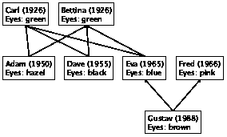
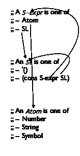
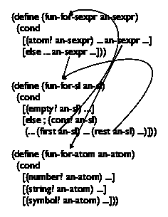
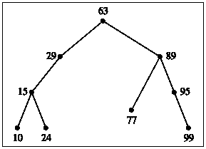
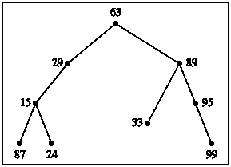
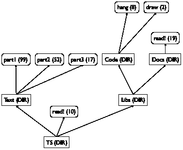
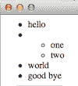
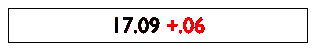

# IV 交织数据🔗

> 原文：[`htdp.org/2024-11-6/Book/part_four.html`](https://htdp.org/2024-11-6/Book/part_four.html)

|     19 S 表达式的诗意 |
| --- |
|       19.1 树 |
|       19.2 森林 |
|       19.3 S 表达式 |
|       19.4 使用交织数据设计 |
|       19.5 项目：二叉搜索树 |
|       19.6 简化函数 |
|     20 迭代细化 |
|       20.1 数据分析 |
|       20.2 细化数据定义 |
|       20.3 细化函数 |
|     21 细化解释器 |
|       21.1 解释表达式 |
|       21.2 解释变量 |
|       21.3 解释函数 |
|       21.4 解释一切 |
|     22 项目：XML 的商业 |
|       22.1 XML 作为 S 表达式 |
|       22.2 渲染 XML 枚举 |
|       22.3 领域特定语言 |
|       22.4 读取 XML |
|     23 同时处理 |
|       23.1 同时处理两个列表：情况 1 |
|       23.2 同时处理两个列表：情况 2 |
|       23.3 同时处理两个列表：情况 3 |
|       23.4 函数简化 |
|       23.5 设计消费两个复杂输入的函数 |
|       23.6 手指练习：两个输入 |
|       23.7 项目：数据库 |
|     24 总结 |

你可能会认为列表和自然数的定义相当不寻常。这些数据定义涉及自身，并且很可能这是你第一次遇到这样的定义。实际上，许多数据类别需要比这两个更复杂的数据定义。常见的推广涉及一个数据定义中的许多自我引用或一系列相互引用的数据定义。这些数据形式已经变得无处不在，因此对于程序员来说，学会处理任何数据定义集合至关重要。这正是设计食谱的全部内容。

本部分从对设计方案的泛化开始，使其适用于所有形式的结构化数据定义。接下来，它基于项目：列表中的迭代细化概念进行介绍，因为复杂的数据定义不是一蹴而就的，而是在几个阶段逐步发展。实际上，迭代细化的使用是所有程序员都是小小科学家以及我们的学科在美式名称中使用“科学”一词的原因之一。最后两章阐述了这些思想：一章解释了如何为 BSL 设计解释器，另一章是关于处理 XML，这是一种网络数据交换语言。最后一章再次扩展了设计方案，重新设计以处理同时处理两个复杂参数的函数。

### 19 S 表达式的诗意🔗 "链接至此")

编程类似于诗歌。像诗人一样，程序员在看似无意义的思想上练习他们的技能。他们不断地修订和编辑，正如前一章所解释的。本章介绍了越来越复杂的数据形式——看似没有真正的现实世界用途。即使我们提供了动机背景，选择的数据类型也是极端纯粹的，你不太可能再次遇到它们。

然而，本章展示了设计方案的完整力量，并介绍了现实世界程序处理的数据类型。为了将这部分内容与你在作为程序员的生活中会遇到的内容联系起来，我们为每个部分添加了适当的名称：树、森林、XML。最后一个名称有点误导，因为它实际上关于 S 表达式；S 表达式与 XML 之间的联系在项目：XML 的商业交易中得到了阐明，与本章相比，它更接近现实世界中复杂数据形式的应用。

#### 19.1 树🔗 "链接至此")

我们每个人都有一个家族树。绘制家族树的一种方法是在每次有孩子出生时添加一个元素，并将父亲和母亲的元素连接起来。对于那些父母不为人知的人，没有可以连接的元素。结果是祖先家族树，因为，对于任何一个人来说，这棵树都指向该人所有已知的祖先。

> > > > 
> > > > 
> 图 111：家族树

图 111 展示了一个三层家庭树。古斯塔夫是伊娃和弗雷德的儿子，而伊娃是卡尔和贝蒂娜的女儿。除了人们的名字和家庭关系外，这棵树还记录了出生年份和眼睛颜色。基于这个草图，你可以轻松地想象一棵可以追溯到许多代人的家族树，并记录其他类型的信息。

一旦家谱变得庞大，将其表示为数据并设计处理此类数据的程序就变得有意义。鉴于家谱中的一个点结合了五条信息——父亲、母亲、名字、出生日期和眼睛颜色——我们应该定义一个结构类型：

> ([define-struct](http://docs.racket-lang.org/htdp-langs/intermediate-lam.html#%28form._%28%28lib._lang%2Fhtdp-intermediate-lambda..rkt%29._define-struct%29%29) child [father mother name date eyes])

结构类型定义调用数据定义：

> | ; A Child is a structure: |
> | --- |
> | ;   (make-child  Child  Child  String  N  String) |

虽然这个数据定义看起来很简单，但它也是无用的。它指向自身，但由于它没有任何子句，因此无法创建一个合适的实例 Child。大致来说，我们可能需要写出以下内容：

> (make-child (make-child (make-child [...](http://docs.racket-lang.org/htdp-langs/intermediate-lam.html#%28form._%28%28lib._lang%2Fhtdp-intermediate-lambda..rkt%29._......%29%29)) [...](http://docs.racket-lang.org/htdp-langs/intermediate-lam.html#%28form._%28%28lib._lang%2Fhtdp-intermediate-lambda..rkt%29._......%29%29)) [...](http://docs.racket-lang.org/htdp-langs/intermediate-lam.html#%28form._%28%28lib._lang%2Fhtdp-intermediate-lambda..rkt%29._......%29%29))

没有尽头。为了避免这种无意义的数据定义，我们要求自引用的数据定义有几个子句，并且至少有一个子句不引用数据定义本身。让我们暂时推迟数据定义，先进行实验。假设我们即将向现有的家谱中添加一个孩子，并且我们已经有了父母的表示。在这种情况下，我们只需构建一个新的孩子结构。例如，为了在已经表示了 Carl 和 Betina 的程序中表示 Adam，只需添加以下孩子结构：

> | ([define](http://docs.racket-lang.org/htdp-langs/intermediate-lam.html#%28form._%28%28lib._lang%2Fhtdp-intermediate-lambda..rkt%29._define%29%29) Adam |
> | --- |
> |   (make-child Carl Bettina "Adam" 1950 "hazel")) |

假设 Carl 和 Betina 代表 Adam 父母的表示。再次，一个人的父母可能是未知的，就像在图 111 的家庭树中 Bettina 的情况一样。即使在这种情况下，我们也必须在孩子表示中填写相应的父母字段。无论我们选择什么数据，它都必须表示信息的缺失。一方面，我们可以使用现有的值池中的#false、"none"或'()。另一方面，我们实际上应该说信息在家庭树中缺失。我们可以通过引入一个具有适当名称的结构类型来实现这一目标：

> ([define-struct](http://docs.racket-lang.org/htdp-langs/intermediate-lam.html#%28form._%28%28lib._lang%2Fhtdp-intermediate-lambda..rkt%29._define-struct%29%29) no-parent [])

现在，为了构建一个 Bettina 的子结构，我们说

> | (make-child (make-no-parent) |
> | --- |
> |             (make-no-parent) |
> |             "Bettina" 1926 "green") |

当然，如果只有一条信息缺失，我们只需用这个特殊值填充该字段。我们的实验表明有两个见解。首先，我们不是在寻找描述如何生成子结构实例的数据定义，而是在寻找描述如何表示家谱的数据定义。其次，数据定义由两个子句组成，一个用于描述未知家谱的变体，另一个用于描述已知家谱：

> | ([define-struct](http://docs.racket-lang.org/htdp-langs/intermediate-lam.html#%28form._%28%28lib._lang%2Fhtdp-intermediate-lambda..rkt%29._define-struct%29%29) no-parent []) |
> | --- |
> | ([define-struct](http://docs.racket-lang.org/htdp-langs/intermediate-lam.html#%28form._%28%28lib._lang%2Fhtdp-intermediate-lambda..rkt%29._define-struct%29%29) child [father mother name date eyes]) |
> | ; An FT (short for family tree) is one of: |
> | ; –  (make-no-parent) |
> | ; –  (make-child  FT  FT  String  N  String) |

Since the “no parent” tree is going to show up a lot in our programs, we define NP as a short-hand and revise the data definition a bit:

> | ([define](http://docs.racket-lang.org/htdp-langs/intermediate-lam.html#%28form._%28%28lib._lang%2Fhtdp-intermediate-lambda..rkt%29._define%29%29) NP (make-no-parent)) |
> | --- |
> | ; An FT is one of: |
> | ; –  NP |
> | ; –  (make-child  FT  FT  String  N  String) |

根据设计自引用数据定义的设计配方，我们使用数据定义来创建家谱的示例。具体来说，我们将图 111 中的家谱转换为我们的数据表示。Carl 的信息很容易转换为数据：

> (make-child NP NP "Carl" 1926 "green")

Bettina 和 Fred 用类似的子结构实例表示。对于 Adam 的情况，需要嵌套子结构，一个用于 Carl，一个用于 Bettina：

> | (make-child (make-child NP NP "Carl" 1926 "green") |
> | --- |
> |             (make-child NP NP "Bettina" 1926 "green") |
> |             "Adam" |
> |             1950 |
> |             "hazel") |

由于 Carl 和 Bettina 的记录也需要用来构建 Dave 和 Eva 的记录，因此引入命名特定子实例的定义并使用变量名在其他地方会更好。图 112 展示了从 图 111 到家谱完整数据表示的这种方法。仔细观察；这棵树将作为我们以下设计练习的运行示例。

> > > | ; 最老一代： |
> > > | --- |
> > > | ([define](http://docs.racket-lang.org/htdp-langs/intermediate-lam.html#%28form._%28%28lib._lang%2Fhtdp-intermediate-lambda..rkt%29._define%29%29) Carl (make-child NP NP "Carl" 1926 "green")) |
> > > | ([define](http://docs.racket-lang.org/htdp-langs/intermediate-lam.html#%28form._%28%28lib._lang%2Fhtdp-intermediate-lambda..rkt%29._define%29%29) Bettina (make-child NP NP "Bettina" 1926 "green")) |
> > > |   |
> > > | ; 中间一代： |
> > > | ([define](http://docs.racket-lang.org/htdp-langs/intermediate-lam.html#%28form._%28%28lib._lang%2Fhtdp-intermediate-lambda..rkt%29._define%29%29) Adam (make-child Carl Bettina "Adam" 1950 "hazel")) |
> > > | ([define](http://docs.racket-lang.org/htdp-langs/intermediate-lam.html#%28form._%28%28lib._lang%2Fhtdp-intermediate-lambda..rkt%29._define%29%29) Dave (make-child Carl Bettina "Dave" 1955 "black")) |
> > > | ([define](http://docs.racket-lang.org/htdp-langs/intermediate-lam.html#%28form._%28%28lib._lang%2Fhtdp-intermediate-lambda..rkt%29._define%29%29) Eva (make-child Carl Bettina "Eva" 1965 "blue")) |
> > > | ([define](http://docs.racket-lang.org/htdp-langs/intermediate-lam.html#%28form._%28%28lib._lang%2Fhtdp-intermediate-lambda..rkt%29._define%29%29) Fred (make-child NP NP "Fred" 1966 "pink")) |
> > > |   |
> > > | ; 年轻一代： |
> > > | ([define](http://docs.racket-lang.org/htdp-langs/intermediate-lam.html#%28form._%28%28lib._lang%2Fhtdp-intermediate-lambda..rkt%29._define%29%29) Gustav (make-child Fred Eva "Gustav" 1988 "brown")) |
> > > 
> 图 112：样本家谱的数据表示

而不是为家谱设计一个具体的函数，让我们首先看看这样一个函数的通用组织结构。也就是说，让我们尽可能多地按照设计配方进行操作，而不需要考虑具体任务。我们从头部材料开始，即配方的第二步：

> | ; FT -> ??? |
> | --- |
> | ; ... |
> | ([define](http://docs.racket-lang.org/htdp-langs/intermediate-lam.html#%28form._%28%28lib._lang%2Fhtdp-intermediate-lambda..rkt%29._define%29%29) (fun-FT an-ftree) [...](http://docs.racket-lang.org/htdp-langs/intermediate-lam.html#%28form._%28%28lib._lang%2Fhtdp-intermediate-lambda..rkt%29._......%29%29)) |

尽管我们没有明确说明函数的目的，但我们知道它消耗一个家谱树，并且这种数据形式是主要输入。签名中的“???”表示我们不知道函数产生什么类型的数据；“...”提醒我们不知道它的目的。目的的缺失意味着我们无法构建功能示例。尽管如此，我们可以利用 FT 数据定义的组织来设计一个模板。由于它由两个子句组成，因此模板必须由两个子句的[条件](http://docs.racket-lang.org/htdp-langs/intermediate-lam.html#%28form._%28%28lib._lang%2Fhtdp-intermediate-lambda..rkt%29._cond%29%29)表达式组成：

> | ([定义](http://docs.racket-lang.org/htdp-langs/intermediate-lam.html#%28form._%28%28lib._lang%2Fhtdp-intermediate-lambda..rkt%29._define%29%29) (fun-FT an-ftree) |
> | --- |
> |   ([条件](http://docs.racket-lang.org/htdp-langs/intermediate-lam.html#%28form._%28%28lib._lang%2Fhtdp-intermediate-lambda..rkt%29._cond%29%29) |
> |     [(no-parent? an-ftree) [...](http://docs.racket-lang.org/htdp-langs/intermediate-lam.html#%28form._%28%28lib._lang%2Fhtdp-intermediate-lambda..rkt%29._......%29%29)] |
> |     [[否则](http://docs.racket-lang.org/htdp-langs/intermediate-lam.html#%28form._%28%28lib._lang%2Fhtdp-intermediate-lambda..rkt%29._else%29%29) [...](http://docs.racket-lang.org/htdp-langs/intermediate-lam.html#%28form._%28%28lib._lang%2Fhtdp-intermediate-lambda..rkt%29._......%29%29)])) |

如果 fun-FT 的参数满足 no-parent?，则结构中不包含其他数据，因此第一个子句是完整的。对于第二个子句，输入包含五个数据项，我们在模板中使用五个选择器来表示：

> | ; FT -> ??? |
> | --- |
> | ([定义](http://docs.racket-lang.org/htdp-langs/intermediate-lam.html#%28form._%28%28lib._lang%2Fhtdp-intermediate-lambda..rkt%29._define%29%29) (fun-FT an-ftree) |
> |   ([条件](http://docs.racket-lang.org/htdp-langs/intermediate-lam.html#%28form._%28%28lib._lang%2Fhtdp-intermediate-lambda..rkt%29._cond%29%29) |
> |     [(no-parent? an-ftree) [...](http://docs.racket-lang.org/htdp-langs/intermediate-lam.html#%28form._%28%28lib._lang%2Fhtdp-intermediate-lambda..rkt%29._......%29%29)] |
> |     [[否则](http://docs.racket-lang.org/htdp-langs/intermediate-lam.html#%28form._%28%28lib._lang%2Fhtdp-intermediate-lambda..rkt%29._else%29%29) ([...](http://docs.racket-lang.org/htdp-langs/intermediate-lam.html#%28form._%28%28lib._lang%2Fhtdp-intermediate-lambda..rkt%29._......%29%29) (child-father an-ftree) [...](http://docs.racket-lang.org/htdp-langs/intermediate-lam.html#%28form._%28%28lib._lang%2Fhtdp-intermediate-lambda..rkt%29._......%29%29) |
> |            [...](http://docs.racket-lang.org/htdp-langs/intermediate-lam.html#%28form._%28%28lib._lang%2Fhtdp-intermediate-lambda..rkt%29._......%29%29) (child-mother an-ftree) [...](http://docs.racket-lang.org/htdp-langs/intermediate-lam.html#%28form._%28%28lib._lang%2Fhtdp-intermediate-lambda..rkt%29._......%29%29) |
> |            [...](http://docs.racket-lang.org/htdp-langs/intermediate-lam.html#%28form._%28%28lib._lang%2Fhtdp-intermediate-lambda..rkt%29._......%29%29) (child-name an-ftree) [...](http://docs.racket-lang.org/htdp-langs/intermediate-lam.html#%28form._%28%28lib._lang%2Fhtdp-intermediate-lambda..rkt%29._......%29%29) |
> |            [...](http://docs.racket-lang.org/htdp-langs/intermediate-lam.html#%28form._%28%28lib._lang%2Fhtdp-intermediate-lambda..rkt%29._......%29%29) (child-date an-ftree) [...](http://docs.racket-lang.org/htdp-langs/intermediate-lam.html#%28form._%28%28lib._lang%2Fhtdp-intermediate-lambda..rkt%29._......%29%29) |
> |            [...](http://docs.racket-lang.org/htdp-langs/intermediate-lam.html#%28form._%28%28lib._lang%2Fhtdp-intermediate-lambda..rkt%29._......%29%29) (child-eyes an-ftree) [...](http://docs.racket-lang.org/htdp-langs/intermediate-lam.html#%28form._%28%28lib._lang%2Fhtdp-intermediate-lambda..rkt%29._......%29%29))])) |

模板中最后增加的内容涉及自引用。如果一个数据定义引用了自身，函数很可能会递归，模板通过暗示性的自然递归来表示这一点。对于 FT 的定义有两个自引用，因此模板需要两个这样的递归：

> | ; FT -> ??? |
> | --- |
> | ([define](http://docs.racket-lang.org/htdp-langs/intermediate-lam.html#%28form._%28%28lib._lang%2Fhtdp-intermediate-lambda..rkt%29._define%29%29) (fun-FT an-ftree) |
> |   ([cond](http://docs.racket-lang.org/htdp-langs/intermediate-lam.html#%28form._%28%28lib._lang%2Fhtdp-intermediate-lambda..rkt%29._cond%29%29) |
> |     [(no-parent? an-ftree) [...](http://docs.racket-lang.org/htdp-langs/intermediate-lam.html#%28form._%28%28lib._lang%2Fhtdp-intermediate-lambda..rkt%29._......%29%29)] |
> |     [[else](http://docs.racket-lang.org/htdp-langs/intermediate-lam.html#%28form._%28%28lib._lang%2Fhtdp-intermediate-lambda..rkt%29._else%29%29) ([...](http://docs.racket-lang.org/htdp-langs/intermediate-lam.html#%28form._%28%28lib._lang%2Fhtdp-intermediate-lambda..rkt%29._......%29%29) (fun-FT (child-father an-ftree)) [...](http://docs.racket-lang.org/htdp-langs/intermediate-lam.html#%28form._%28%28lib._lang%2Fhtdp-intermediate-lambda..rkt%29._......%29%29) |
> |            [...](http://docs.racket-lang.org/htdp-langs/intermediate-lam.html#%28form._%28%28lib._lang%2Fhtdp-intermediate-lambda..rkt%29._......%29%29) (fun-FT (child-mother an-ftree)) [...](http://docs.racket-lang.org/htdp-langs/intermediate-lam.html#%28form._%28%28lib._lang%2Fhtdp-intermediate-lambda..rkt%29._......%29%29) |
> | |    [...](http://docs.racket-lang.org/htdp-langs/intermediate-lam.html#%28form._%28%28lib._lang%2Fhtdp-intermediate-lambda..rkt%29._......%29%29) (child-name an-ftree) [...](http://docs.racket-lang.org/htdp-langs/intermediate-lam.html#%28form._%28%28lib._lang%2Fhtdp-intermediate-lambda..rkt%29._......%29%29) |
> | |   [...](http://docs.racket-lang.org/htdp-langs/intermediate-lam.html#%28form._%28%28lib._lang%2Fhtdp-intermediate-lambda..rkt%29._......%29%29) (child-date an-ftree) [...](http://docs.racket-lang.org/htdp-langs/intermediate-lam.html#%28form._%28%28lib._lang%2Fhtdp-intermediate-lambda..rkt%29._......%29%29) |
> | |   [...](http://docs.racket-lang.org/htdp-langs/intermediate-lam.html#%28form._%28%28lib._lang%2Fhtdp-intermediate-lambda..rkt%29._......%29%29) (child-eyes an-ftree) [...](http://docs.racket-lang.org/htdp-langs/intermediate-lam.html#%28form._%28%28lib._lang%2Fhtdp-intermediate-lambda..rkt%29._......%29%29))])) |

具体来说，fun-FT 被应用于第二[cond](http://docs.racket-lang.org/htdp-langs/intermediate-lam.html#%28form._%28%28lib._lang%2Fhtdp-intermediate-lambda..rkt%29._cond%29%29)子句中父亲和母亲的表示数据，因为数据定义的第二子句包含相应的自引用。现在让我们转向一个具体的例子，即 blue-eyed-child?函数。它的目的是确定给定家谱树中是否有任何孩子结构有蓝眼睛。您可以复制、粘贴并重命名 fun-FT 以获取其模板；我们将“???”替换为布尔并添加一个目的说明：

> | ; FT -> 布尔 |
> | --- |
> | ; an-ftree 是否包含孩子 |
> | ; 结构中眼睛字段包含"blue" |
> | ([define](http://docs.racket-lang.org/htdp-langs/intermediate-lam.html#%28form._%28%28lib._lang%2Fhtdp-intermediate-lambda..rkt%29._define%29%29) (blue-eyed-child? an-ftree) |
> | |   ([cond](http://docs.racket-lang.org/htdp-langs/intermediate-lam.html#%28form._%28%28lib._lang%2Fhtdp-intermediate-lambda..rkt%29._cond%29%29) |
> | |    [(no-parent? an-ftree) [...](http://docs.racket-lang.org/htdp-langs/intermediate-lam.html#%28form._%28%28lib._lang%2Fhtdp-intermediate-lambda..rkt%29._......%29%29)] |
> | |    [[else](http://docs.racket-lang.org/htdp-langs/intermediate-lam.html#%28form._%28%28lib._lang%2Fhtdp-intermediate-lambda..rkt%29._else%29%29) ([...](http://docs.racket-lang.org/htdp-langs/intermediate-lam.html#%28form._%28%28lib._lang%2Fhtdp-intermediate-lambda..rkt%29._......%29%29) (blue-eyed-child? |
> | |   (child-father an-ftree)) [...](http://docs.racket-lang.org/htdp-langs/intermediate-lam.html#%28form._%28%28lib._lang%2Fhtdp-intermediate-lambda..rkt%29._......%29%29) |
> | |    [...](http://docs.racket-lang.org/htdp-langs/intermediate-lam.html#%28form._%28%28lib._lang%2Fhtdp-intermediate-lambda..rkt%29._......%29%29) (blue-eyed-child? |
> |                  (child-mother an-ftree)) [...](http://docs.racket-lang.org/htdp-langs/intermediate-lam.html#%28form._%28%28lib._lang%2Fhtdp-intermediate-lambda..rkt%29._......%29%29) |
> |            [...](http://docs.racket-lang.org/htdp-langs/intermediate-lam.html#%28form._%28%28lib._lang%2Fhtdp-intermediate-lambda..rkt%29._......%29%29) (child-name an-ftree) [...](http://docs.racket-lang.org/htdp-langs/intermediate-lam.html#%28form._%28%28lib._lang%2Fhtdp-intermediate-lambda..rkt%29._......%29%29) |
> |            [...](http://docs.racket-lang.org/htdp-langs/intermediate-lam.html#%28form._%28%28lib._lang%2Fhtdp-intermediate-lambda..rkt%29._......%29%29) (child-date an-ftree) [...](http://docs.racket-lang.org/htdp-langs/intermediate-lam.html#%28form._%28%28lib._lang%2Fhtdp-intermediate-lambda..rkt%29._......%29%29) |
> |            [...](http://docs.racket-lang.org/htdp-langs/intermediate-lam.html#%28form._%28%28lib._lang%2Fhtdp-intermediate-lambda..rkt%29._......%29%29) (child-eyes an-ftree) [...](http://docs.racket-lang.org/htdp-langs/intermediate-lam.html#%28form._%28%28lib._lang%2Fhtdp-intermediate-lambda..rkt%29._......%29%29))])) |

当你以这种方式工作时，你必须用特定的名称替换模板的通用名称。根据我们的配方检查，我们意识到在进入定义步骤之前，我们需要回溯并开发一些示例。如果我们从家谱中的第一个人卡尔开始，我们会看到卡尔的家谱中不包含有“蓝色”眼睛颜色的孩子。具体来说，代表卡尔的孩子的眼睛颜色是“绿色”；鉴于卡尔的祖先树是空的，它们不可能包含有“蓝色”眼睛颜色的孩子：

> ([check-expect](http://docs.racket-lang.org/htdp-langs/intermediate-lam.html#%28form._%28%28lib._lang%2Fhtdp-intermediate-lambda..rkt%29._check-expect%29%29) (blue-eyed-child? Carl) #false)

相比之下，古斯塔夫有一个孩子叫伊娃，她确实有蓝眼睛：

> ([check-expect](http://docs.racket-lang.org/htdp-langs/intermediate-lam.html#%28form._%28%28lib._lang%2Fhtdp-intermediate-lambda..rkt%29._check-expect%29%29) (blue-eyed-child? Gustav) #true)

现在我们已经准备好定义实际函数了。该函数区分两种情况：无父母和有孩子。对于第一种情况，即使我们没有举出任何例子，答案也应该很明显。由于给定的家谱根本不包含任何孩子，它不可能包含一个眼睛颜色为“蓝色”的孩子。因此，第一个 [cond](http://docs.racket-lang.org/htdp-langs/intermediate-lam.html#%28form._%28%28lib._lang%2Fhtdp-intermediate-lambda..rkt%29._cond%29%29) 子句的结果是 #false。

对于第二个 [cond](http://docs.racket-lang.org/htdp-langs/intermediate-lam.html#%28form._%28%28lib._lang%2Fhtdp-intermediate-lambda..rkt%29._cond%29%29) 子句，设计需要做更多的工作。再次遵循设计配方，我们首先提醒自己模板中的表达式完成了什么：

1.  根据函数的目的声明，

    > (blue-eyed-child? (child-father an-ftree))

    判断父亲 FT 中的某个孩子是否有 "blue" 眼睛；

1.  同样地，(blue-eyed-child?  (child-mother  an-ftree)) 判断母亲 FT 中是否有人有蓝眼睛；并且

1.  选择表达式 (child-name  an-ftree), (child-date  an-ftree), 和 (child-eyes  an-ftree) 分别从给定的孩子结构中提取名称、出生日期和眼睛颜色。

现在我们只需要弄清楚如何组合这些表达式。

显然，如果孩子结构中的眼睛字段包含 "blue"，则函数的答案是 #true。接下来，关于名称和出生日期的表达式是无用的，这让我们只剩下递归调用。正如所述，(blue-eyed-child?  (child-father  an-ftree)) 遍历父亲一侧的树，而家庭树的母亲一侧则通过 (blue-eyed-child?  (child-mother  an-ftree)) 处理。如果这些表达式中的任何一个返回 #true，则 an-ftree 包含一个有 "blue" 眼睛的孩子。

我们的分析表明，如果以下三个表达式中的任何一个为 #true，则结果应该是 #true：

+   ([string=?](http://docs.racket-lang.org/htdp-langs/intermediate-lam.html#%28def._htdp-intermediate-lambda._%28%28lib._lang%2Fhtdp-intermediate-lambda..rkt%29._string~3d~3f%29%29)  (child-eyes  an-ftree)  "blue")

+   (blue-eyed-child?  (child-father  an-ftree))

+   (blue-eyed-child?  (child-mother  an-ftree))

这反过来意味着我们需要将这些表达式与 [or](http://docs.racket-lang.org/htdp-langs/intermediate-lam.html#%28form._%28%28lib._lang%2Fhtdp-intermediate-lambda..rkt%29._or%29%29) 结合起来：

> | ([or](http://docs.racket-lang.org/htdp-langs/intermediate-lam.html#%28form._%28%28lib._lang%2Fhtdp-intermediate-lambda..rkt%29._or%29%29) ([string=?](http://docs.racket-lang.org/htdp-langs/intermediate-lam.html#%28def._htdp-intermediate-lambda._%28%28lib._lang%2Fhtdp-intermediate-lambda..rkt%29._string~3d~3f%29%29) (child-eyes an-ftree) "blue") |
> | --- |
> |     (blue-eyed-child? (child-father an-ftree)) |
> |     (blue-eyed-child? (child-mother an-ftree))) |

图 113 将所有内容在一个定义中汇总。

> > > | ; FT -> Boolean |
> > > | --- |
> > > | ; an-ftree 是否包含一个孩子 |
> > > | ; 眼睛字段中包含 "blue" 的结构 |
> > > |   |
> > > | ([check-expect](http://docs.racket-lang.org/htdp-langs/intermediate-lam.html#%28form._%28%28lib._lang%2Fhtdp-intermediate-lambda..rkt%29._check-expect%29%29) (blue-eyed-child? Carl) #false) |
> > > | ([check-expect](http://docs.racket-lang.org/htdp-langs/intermediate-lam.html#%28form._%28%28lib._lang%2Fhtdp-intermediate-lambda..rkt%29._check-expect%29%29) (blue-eyed-child? Gustav) #true) |
> > > |   |
> > > | ([define](http://docs.racket-lang.org/htdp-langs/intermediate-lam.html#%28form._%28%28lib._lang%2Fhtdp-intermediate-lambda..rkt%29._define%29%29) (blue-eyed-child? an-ftree) |
> > > |   ([cond](http://docs.racket-lang.org/htdp-langs/intermediate-lam.html#%28form._%28%28lib._lang%2Fhtdp-intermediate-lambda..rkt%29._cond%29%29) |
> > > |     [(no-parent? an-ftree) #false] |
> > > |     [[else](http://docs.racket-lang.org/htdp-langs/intermediate-lam.html#%28form._%28%28lib._lang%2Fhtdp-intermediate-lambda..rkt%29._else%29%29) ([or](http://docs.racket-lang.org/htdp-langs/intermediate-lam.html#%28form._%28%28lib._lang%2Fhtdp-intermediate-lambda..rkt%29._or%29%29) ([string=?](http://docs.racket-lang.org/htdp-langs/intermediate-lam.html#%28def._htdp-intermediate-lambda._%28%28lib._lang%2Fhtdp-intermediate-lambda..rkt%29._string~3d~3f%29%29) (child-eyes an-ftree) "blue") |
> > > |               (blue-eyed-child? (child-father an-ftree)) |
> > > |               (blue-eyed-child? (child-mother an-ftree)))])) |
> > > 
> 图 113：在祖先树中寻找蓝眼睛的孩子

由于这个函数是第一个使用两次递归的函数，我们模拟了步进器的动作来为 (blue-eyed-child? Carl) 提供一个如何工作的印象：

> | (blue-eyed-child? Carl) |
> | --- |
> | == |
> | (blue-eyed-child? |
> |   (make-child NP NP "Carl" 1926 "green")) |

让我们假设 NP 是一个值，并使用 carl 作为 child 实例的缩写：

> | == |
> | --- |
> | ([cond](http://docs.racket-lang.org/htdp-langs/intermediate-lam.html#%28form._%28%28lib._lang%2Fhtdp-intermediate-lambda..rkt%29._cond%29%29) |
> |   [(no-parent? |
> |      (make-child NP NP "Carl" 1926 "green")) |
> |    #false] |
> |   [[else](http://docs.racket-lang.org/htdp-langs/intermediate-lam.html#%28form._%28%28lib._lang%2Fhtdp-intermediate-lambda..rkt%29._else%29%29) ([or](http://docs.racket-lang.org/htdp-langs/intermediate-lam.html#%28form._%28%28lib._lang%2Fhtdp-intermediate-lambda..rkt%29._or%29%29) ([string=?](http://docs.racket-lang.org/htdp-langs/intermediate-lam.html#%28def._htdp-intermediate-lambda._%28%28lib._lang%2Fhtdp-intermediate-lambda..rkt%29._string~3d~3f%29%29) (child-eyes carl) "blue") |
> |             (blue-eyed-child? (child-father carl)) |
> |             (blue-eyed-child? (child-mother carl)))]) |

在删除第一条 [cond](http://docs.racket-lang.org/htdp-langs/intermediate-lam.html#%28form._%28%28lib._lang%2Fhtdp-intermediate-lambda..rkt%29._cond%29%29) 行之后，是时候用其值替换 carl 并执行 图 114 中的三个辅助计算了。使用这些计算结果来替换等号两边的等号，其余的计算解释起来就很容易了：

> | == |
> | --- |
> | ([or](http://docs.racket-lang.org/htdp-langs/intermediate-lam.html#%28form._%28%28lib._lang%2Fhtdp-intermediate-lambda..rkt%29._or%29%29) ([string=?](http://docs.racket-lang.org/htdp-langs/intermediate-lam.html#%28def._htdp-intermediate-lambda._%28%28lib._lang%2Fhtdp-intermediate-lambda..rkt%29._string~3d~3f%29%29) "green" "blue") |
> |     (blue-eyed-child? (child-father carl)) |
> |     (blue-eyed-child? (child-mother carl))) |
> | == ([或](http://docs.racket-lang.org/htdp-langs/intermediate-lam.html#%28form._%28%28lib._lang%2Fhtdp-intermediate-lambda..rkt%29._or%29%29) #false #false #false) |
> | == #false |

虽然我们相信你在数学课程中已经见过这样的辅助计算，但你还需要理解，步进器不会执行这样的计算；相反，它只计算出绝对必要的计算。

> > > > | ; (1) |
> > > > | --- |
> > > > | (子眼睛 (创建子节点 NP NP "卡尔" 1926 "绿色")) |
> > > > | == |
> > > > | "绿色" |
> > > > |   |
> > > > | ; (2) |
> > > > | (蓝色眼睛的孩子？ |
> > > > |   (子父亲 |
> > > > |     (创建子节点 NP NP "卡尔" 1926 "绿色")) |
> > > > | == |
> > > > | (蓝色眼睛的孩子？ NP) |
> > > > | == |
> > > > | #false |
> > > > |   |
> > > > | ; (3) |
> > > > | (蓝色眼睛的孩子？ |
> > > > |   (子母亲 |
> > > > |     (创建子节点 NP NP "卡尔" 1926 "绿色")) |
> > > > | == |
> > > > | (蓝色眼睛的孩子？ NP) |
> > > > | == |
> > > > | #false |
> > > > 
> 图 114：使用树进行计算

练习 310。开发 count-persons 函数。该函数消耗一个家谱并计算树中的子结构数量。

练习 311。开发函数 average-age。它消耗一个家谱和当前年份。它产生家谱中所有子结构的平均年龄。

练习 312。开发函数 eye-colors，它消耗一个家谱并生成树中所有眼睛颜色的列表。眼睛颜色可能在结果列表中出现多次。提示：使用[append](http://docs.racket-lang.org/htdp-langs/intermediate-lam.html#%28def._htdp-intermediate-lambda._%28%28lib._lang%2Fhtdp-intermediate-lambda..rkt%29._append%29%29)来连接递归调用产生的列表。

练习 313。假设我们需要函数 blue-eyed-ancestor?，它类似于 blue-eyed-child?，但只有当适当的祖先（而非给定的孩子本身）有蓝色眼睛时，才返回#true。

尽管目标明显不同，但签名是相同的：

> | ; FT -> 布尔 |
> | --- |
> | ([定义](http://docs.racket-lang.org/htdp-langs/intermediate-lam.html#%28form._%28%28lib._lang%2Fhtdp-intermediate-lambda..rkt%29._define%29%29) (蓝色眼睛的祖先？ an-ftree) [...](http://docs.racket-lang.org/htdp-langs/intermediate-lam.html#%28form._%28%28lib._lang%2Fhtdp-intermediate-lambda..rkt%29._......%29%29)) |

停止！为该函数制定一个目的声明。为了欣赏这种差异，我们来看看 Eva：

> ([检查期望](http://docs.racket-lang.org/htdp-langs/intermediate-lam.html#%28form._%28%28lib._lang%2Fhtdp-intermediate-lambda..rkt%29._check-expect%29%29) (蓝色眼睛的孩子？ Eva) #true)

Eva 是蓝色的眼睛，但没有蓝色眼睛的祖先。因此，

> ([检查期望](http://docs.racket-lang.org/htdp-langs/intermediate-lam.html#%28form._%28%28lib._lang%2Fhtdp-intermediate-lambda..rkt%29._check-expect%29%29) (蓝色眼睛的祖先？ Eva) #false)

相反，Gustav 是 Eva 的儿子，确实有一个蓝色眼睛的祖先：

> ([check-expect](http://docs.racket-lang.org/htdp-langs/intermediate-lam.html#%28form._%28%28lib._lang%2Fhtdp-intermediate-lambda..rkt%29._check-expect%29%29) (blue-eyed-ancestor? Gustav) #true)

现在假设一个朋友提出了这个解决方案：

> | ([define](http://docs.racket-lang.org/htdp-langs/intermediate-lam.html#%28form._%28%28lib._lang%2Fhtdp-intermediate-lambda..rkt%29._define%29%29) (blue-eyed-ancestor? an-ftree) |
> | --- |
> |   ([cond](http://docs.racket-lang.org/htdp-langs/intermediate-lam.html#%28form._%28%28lib._lang%2Fhtdp-intermediate-lambda..rkt%29._cond%29%29) |
> |     [(no-parent? an-ftree) #false] |
> |     [[else](http://docs.racket-lang.org/htdp-langs/intermediate-lam.html#%28form._%28%28lib._lang%2Fhtdp-intermediate-lambda..rkt%29._else%29%29) |
> |      ([or](http://docs.racket-lang.org/htdp-langs/intermediate-lam.html#%28form._%28%28lib._lang%2Fhtdp-intermediate-lambda..rkt%29._or%29%29) |
> |        (blue-eyed-ancestor? |
> | ; –  ([child-father an-ftree)) |
> |        (blue-eyed-ancestor? |
> | ; –  ([child-mother an-ftree)))])) |

解释为什么这个函数未能通过其测试之一。无论你选择哪个 A，(blue-eyed-ancestor? A)的结果是什么？你能修复你朋友的解决方案吗？

变量和结构命名注意事项 初始对家庭关系的讨论建议将结构类型定义命名为 child。这五条信息代表特定父母的孩子。然而，其余的发展是关于祖先树。如果你只是浏览本章，专注于函数定义，比如图 113 中的那个，child-father、child-mother 和 child-eyes 这些名称可能会让你有些误导，主要是因为它们似乎与函数的递归性质相冲突。经验丰富的开发者可能会使用 DrRacket 的重命名功能检查语法。右键单击结构的名称。选择重命名，将 child 替换为 person。一般来说，变量命名对于帮助代码的读者理解其背后的思考至关重要。

#### 19.2 森林🔗 "链接到此处")

从家谱树到家谱森林只有一小步：

> | ; An FF (short for family forest) is one of: |
> | --- |
> | ; –  '() |
> | ; –  ([cons](http://docs.racket-lang.org/htdp-langs/intermediate-lam.html#%28def._htdp-intermediate-lambda._%28%28lib._lang%2Fhtdp-intermediate-lambda..rkt%29._cons%29%29)  FT  FF) |
> | ; interpretation a family forest represents several |
> | ; families (say, a town) and their ancestor trees |

这里是一些来自图 111 的树摘录，排列成森林：

> |   | ([define](http://docs.racket-lang.org/htdp-langs/intermediate-lam.html#%28form._%28%28lib._lang%2Fhtdp-intermediate-lambda..rkt%29._define%29%29) ff1 ([list](http://docs.racket-lang.org/htdp-langs/intermediate-lam.html#%28def._htdp-intermediate-lambda._%28%28lib._lang%2Fhtdp-intermediate-lambda..rkt%29._list%29%29) Carl Bettina)) |
> | --- | --- |
> |   | ([define](http://docs.racket-lang.org/htdp-langs/intermediate-lam.html#%28form._%28%28lib._lang%2Fhtdp-intermediate-lambda..rkt%29._define%29%29) ff2 ([list](http://docs.racket-lang.org/htdp-langs/intermediate-lam.html#%28def._htdp-intermediate-lambda._%28%28lib._lang%2Fhtdp-intermediate-lambda..rkt%29._list%29%29) Fred Eva)) |
> |   | ([define](http://docs.racket-lang.org/htdp-langs/intermediate-lam.html#%28form._%28%28lib._lang%2Fhtdp-intermediate-lambda..rkt%29._define%29%29) ff3 ([list](http://docs.racket-lang.org/htdp-langs/intermediate-lam.html#%28def._htdp-intermediate-lambda._%28%28lib._lang%2Fhtdp-intermediate-lambda..rkt%29._list%29%29) Fred Eva Carl)) |

前两个森林包含两个无关的家庭，第三个森林说明了与真实森林不同，家族森林中的树木可以重叠。现在考虑这个关于家族树的代表性问题：

> 样例问题：设计函数 blue-eyed-child-in-forest?，该函数用于确定一个家族森林中是否包含眼睛颜色为“蓝色”的孩子。
> 
> > > |   ; FF -> Boolean |
> > > | --- |
> > > |   ; 森林中是否包含任何眼睛为“蓝色”的孩子 |
> > > |   | |
> > > |   | ([check-expect](http://docs.racket-lang.org/htdp-langs/intermediate-lam.html#%28form._%28%28lib._lang%2Fhtdp-intermediate-lambda..rkt%29._check-expect%29%29) (blue-eyed-child-in-forest? ff1) #false) |
> > > |   | ([check-expect](http://docs.racket-lang.org/htdp-langs/intermediate-lam.html#%28form._%28%28lib._lang%2Fhtdp-intermediate-lambda..rkt%29._check-expect%29%29) (blue-eyed-child-in-forest? ff2) #true) |
> > > |   | ([check-expect](http://docs.racket-lang.org/htdp-langs/intermediate-lam.html#%28form._%28%28lib._lang%2Fhtdp-intermediate-lambda..rkt%29._check-expect%29%29) (blue-eyed-child-in-forest? ff3) #true) |
> > > |   |
> > > |   | ([define](http://docs.racket-lang.org/htdp-langs/intermediate-lam.html#%28form._%28%28lib._lang%2Fhtdp-intermediate-lambda..rkt%29._define%29%29) (blue-eyed-child-in-forest? a-forest) |
> > > |   | ([cond](http://docs.racket-lang.org/htdp-langs/intermediate-lam.html#%28form._%28%28lib._lang%2Fhtdp-intermediate-lambda..rkt%29._cond%29%29) |
> > > |   | ([empty?](http://docs.racket-lang.org/htdp-langs/intermediate-lam.html#%28def._htdp-intermediate-lambda._%28%28lib._lang%2Fhtdp-intermediate-lambda..rkt%29._empty~3f%29%29) a-forest) #false] |
> > > |   | [[else](http://docs.racket-lang.org/htdp-langs/intermediate-lam.html#%28form._%28%28lib._lang%2Fhtdp-intermediate-lambda..rkt%29._else%29%29) |
> > > |      ([or](http://docs.racket-lang.org/htdp-langs/intermediate-lam.html#%28form._%28%28lib._lang%2Fhtdp-intermediate-lambda..rkt%29._or%29%29) (blue-eyed-child? ([first](http://docs.racket-lang.org/htdp-langs/intermediate-lam.html#%28def._htdp-intermediate-lambda._%28%28lib._lang%2Fhtdp-intermediate-lambda..rkt%29._first%29%29) a-forest)) |
> > > |          (blue-eyed-child-in-forest? ([rest](http://docs.racket-lang.org/htdp-langs/intermediate-lam.html#%28def._htdp-intermediate-lambda._%28%28lib._lang%2Fhtdp-intermediate-lambda..rkt%29._rest%29%29) a-forest)))])) |
> > > 
> 图 115：在家族森林中找到一个蓝眼睛的孩子

直接的解决方案在图 115 中显示。自己研究签名、目的陈述和示例。我们关注程序组织。关于模板，设计可能使用列表模板，因为该函数消耗一个列表。如果列表中的每个项都是一个具有眼睛字段的结构的其余部分，则函数将使用眼睛字段的选择函数和字符串比较遍历这些结构。在这种情况下，每个项是一个家族树，但幸运的是，我们已经知道如何处理家族树。

让我们回顾一下我们是如何解释图 115 的。起点是一对数据定义，其中第二个引用了第一个，并且两者都引用了自身。结果是两个函数，其中第二个引用了第一个，并且两者都引用了自身。换句话说，函数定义相互引用的方式与数据定义相互引用的方式相同。早期章节略过了这种关系，但现在情况足够复杂，值得注意。

练习 314。使用 List-of 抽象重新表述 FF 的数据定义。现在也为 blue-eyed-child-in-forest?函数做同样的操作。最后，使用前一章中的一种列表抽象定义 blue-eyed-child-in-forest?。

练习 315。设计 average-age 函数。它消耗一个家族森林和一年(N)。从这个数据中，它产生森林中所有孩子实例的平均年龄。注意：如果森林中的树重叠，结果不是真正的平均值，因为有些人贡献得更多。对于这个练习，假设树不重叠。

#### 19.3S 表达式🔗 "链接到此处")

虽然间奏曲 2：引用，不引用非正式地介绍了 S 表达式，但可以用三种数据定义的组合来描述它们：

> |
> 
> &#124; ; 一个 S 表达式是以下之一：&#124;
> 
> &#124; ; –  原子 &#124;
> 
> &#124; ; –  SL &#124;
> 
> &#124;   &#124;
> 
> &#124; ; 一个 SL 是以下之一：&#124;
> 
> &#124; ; –  '() &#124;
> 
> &#124; ; –  ([cons](http://docs.racket-lang.org/htdp-langs/intermediate-lam.html#%28def._htdp-intermediate-lambda._%28%28lib._lang%2Fhtdp-intermediate-lambda..rkt%29._cons%29%29)  S-expr  SL) &#124;
> 
> |  |
> | --- |
> 
> &#124; ; 一个原子是以下之一： &#124;
> 
> &#124; ; –  数字 &#124;
> 
> &#124; ; –  字符串 &#124;
> 
> &#124; ; –  符号 &#124;
> 
> |

回想一下，符号 看起来像字符串，以一个单引号开头，以没有引号结尾。

S 表达式的想法归功于约翰·麦卡锡和他的 Lisp 程序员，他们在 1958 年创造了 S 表达式，以便他们可以用其他 Lisp 程序处理 Lisp 程序。这种看似循环的推理可能听起来很神秘，但正如在 间奏曲 2：引用，非引用 中提到的，S 表达式是一种多才多艺的数据形式，它经常被重新发现，最近在万维网应用中得到了应用。因此，使用 S 表达式为讨论如何为高度交织的数据定义设计函数做好了准备。

练习 316. 定义 atom? 函数。

到目前为止，本书中还没有数据需要像 S 表达式那样复杂的数据定义。然而，只要有一点提示，如果你遵循设计配方，你就可以设计处理 S 表达式的函数。为了说明这一点，让我们通过一个具体的例子来分析：

> 样例问题 设计一个名为 count 的函数，它确定某个符号在某个 S 表达式（S-expression）中出现的次数。

虽然第一步需要数据定义并且看起来已经完成，但请记住，它还要求创建数据示例，尤其是在定义复杂时。数据定义应该是一份如何创建数据的说明，其“测试”是它是否可用。S-expr 的数据定义提出的一个观点是每个 原子 都是 S-expr 的一个元素，而且你知道 原子 是很容易制造的：

> | 'hello |
> | --- |
> | 20.12 |
> | "world" |

同样地，每个 SL 也是一个列表，也是一个 S-expr：

> | '() |
> | --- |
> | ([cons](http://docs.racket-lang.org/htdp-langs/intermediate-lam.html#%28def._htdp-intermediate-lambda._%28%28lib._lang%2Fhtdp-intermediate-lambda..rkt%29._cons%29%29) 'hello ([cons](http://docs.racket-lang.org/htdp-langs/intermediate-lam.html#%28def._htdp-intermediate-lambda._%28%28lib._lang%2Fhtdp-intermediate-lambda..rkt%29._cons%29%29) 20.12 ([cons](http://docs.racket-lang.org/htdp-langs/intermediate-lam.html#%28def._htdp-intermediate-lambda._%28%28lib._lang%2Fhtdp-intermediate-lambda..rkt%29._cons%29%29) "world" '()))) |
> | ([cons](http://docs.racket-lang.org/htdp-langs/intermediate-lam.html#%28def._htdp-intermediate-lambda._%28%28lib._lang%2Fhtdp-intermediate-lambda..rkt%29._cons%29%29) ([cons](http://docs.racket-lang.org/htdp-langs/intermediate-lam.html#%28def._htdp-intermediate-lambda._%28%28lib._lang%2Fhtdp-intermediate-lambda..rkt%29._cons%29%29) 'hello ([cons](http://docs.racket-lang.org/htdp-langs/intermediate-lam.html#%28def._htdp-intermediate-lambda._%28%28lib._lang%2Fhtdp-intermediate-lambda..rkt%29._cons%29%29) 20.12 ([cons](http://docs.racket-lang.org/htdp-langs/intermediate-lam.html#%28def._htdp-intermediate-lambda._%28%28lib._lang%2Fhtdp-intermediate-lambda..rkt%29._cons%29%29) "world" '()))) |
> |       '()) |

前两个很明显；第三个值得仔细看看。它重复了第二个 S-expr，但嵌套在([cons](http://docs.racket-lang.org/htdp-langs/intermediate-lam.html#%28def._htdp-intermediate-lambda._%28%28lib._lang%2Fhtdp-intermediate-lambda..rkt%29._cons%29%29) [...](http://docs.racket-lang.org/htdp-langs/intermediate-lam.html#%28form._%28%28lib._lang%2Fhtdp-intermediate-lambda..rkt%29._......%29%29)  '())中。这意味着它是一个包含单个元素的列表，即第二个示例。你可以使用[list](http://docs.racket-lang.org/htdp-langs/intermediate-lam.html#%28def._htdp-intermediate-lambda._%28%28lib._lang%2Fhtdp-intermediate-lambda..rkt%29._list%29%29)来简化示例：

> | ([list](http://docs.racket-lang.org/htdp-langs/intermediate-lam.html#%28def._htdp-intermediate-lambda._%28%28lib._lang%2Fhtdp-intermediate-lambda..rkt%29._list%29%29) ([cons](http://docs.racket-lang.org/htdp-langs/intermediate-lam.html#%28def._htdp-intermediate-lambda._%28%28lib._lang%2Fhtdp-intermediate-lambda..rkt%29._cons%29%29) 'hello ([cons](http://docs.racket-lang.org/htdp-langs/intermediate-lam.html#%28def._htdp-intermediate-lambda._%28%28lib._lang%2Fhtdp-intermediate-lambda..rkt%29._cons%29%29) 20.12 ([cons](http://docs.racket-lang.org/htdp-langs/intermediate-lam.html#%28def._htdp-intermediate-lambda._%28%28lib._lang%2Fhtdp-intermediate-lambda..rkt%29._cons%29%29) "world" '())))) |
> | --- |
> | ; or |
> | ([list](http://docs.racket-lang.org/htdp-langs/intermediate-lam.html#%28def._htdp-intermediate-lambda._%28%28lib._lang%2Fhtdp-intermediate-lambda..rkt%29._list%29%29) ([list](http://docs.racket-lang.org/htdp-langs/intermediate-lam.html#%28def._htdp-intermediate-lambda._%28%28lib._lang%2Fhtdp-intermediate-lambda..rkt%29._list%29%29) 'hello 20.12 "world")) |

事实上，使用 Intermezzo 2: Quote, Unquote 的引用机制，写下 S-expressions 甚至更容易。以下是最后三个：

> | > '() |
> | --- |
> | '() |
> | > '(hello 20.12 "world") |
> | (list 'hello #i20.12 "world") |
> | > '((hello 20.12 "world")) |
> | (list (list 'hello #i20.12 "world")) |

为了帮助您，我们在 DrRacket 的交互区域评估这些示例，以便您可以看到结果，这个结果比[quote](http://docs.racket-lang.org/htdp-langs/intermediate-lam.html#%28form._%28%28lib._lang%2Fhtdp-intermediate-lambda..rkt%29._quote%29%29)表示法更接近。使用[quote](http://docs.racket-lang.org/htdp-langs/intermediate-lam.html#%28form._%28%28lib._lang%2Fhtdp-intermediate-lambda..rkt%29._quote%29%29)，构建复杂示例非常容易：

> |
> 
> &#124; > '(define (f x) &#124;
> 
> &#124;      (+ x 55)) &#124;
> 
> |
> 
> | (list 'define (list 'f 'x) (list '+ 'x 55)) |
> | --- |

这个例子可能让您觉得奇怪，因为它看起来像 BSL 中的定义，但正如与 DrRacket 的交互所显示的，它只是一块数据。这里还有一个例子：

> |
> 
> &#124; > '((6 f) &#124;
> 
> &#124;     (5 e) &#124;
> 
> &#124;     (4 d)) &#124;
> 
> |
> 
> | (list (list 6 'f) (list 5 'e) (list 4 'd)) |
> | --- |

这块数据看起来像一张表，将字母与数字关联起来。最后一个例子是一幅艺术品：

> | > '(wing (wing body wing) wing) |
> | --- |
> | (list 'wing (list 'wing 'body 'wing) 'wing) |

现在是时候写下 count 的相当明显的标题了：

> | ; S-expr  Symbol -> N |
> | --- |
> | ; counts all occurrences of sy in sexp |
> | ([define](http://docs.racket-lang.org/htdp-langs/intermediate-lam.html#%28form._%28%28lib._lang%2Fhtdp-intermediate-lambda..rkt%29._define%29%29) (count sexp sy) |
> |   0) |

由于标题很明显，我们继续到功能示例。如果给定的 S-expr 是'world，要计数的符号也是'world，答案显然是 1。以下是一些更多示例，立即作为测试来制定：

> | ([check-expect](http://docs.racket-lang.org/htdp-langs/intermediate-lam.html#%28form._%28%28lib._lang%2Fhtdp-intermediate-lambda..rkt%29._check-expect%29%29) (count 'world 'hello) 0) |
> | --- |
> | ([check-expect](http://docs.racket-lang.org/htdp-langs/intermediate-lam.html#%28form._%28%28lib._lang%2Fhtdp-intermediate-lambda..rkt%29._check-expect%29%29) (count '(world hello) 'hello) 1) |
> | ([check-expect](http://docs.racket-lang.org/htdp-langs/intermediate-lam.html#%28form._%28%28lib._lang%2Fhtdp-intermediate-lambda..rkt%29._check-expect%29%29) (count '(((world) hello) hello) 'hello) 2) |

您可以看到引用表示法对于测试用例是多么方便。然而，当涉及到模板时，从[quote](http://docs.racket-lang.org/htdp-langs/intermediate-lam.html#%28form._%28%28lib._lang%2Fhtdp-intermediate-lambda..rkt%29._quote%29%29)的角度思考是灾难性的。在我们继续到模板步骤之前，我们需要为您准备下一个设计食谱的泛化：

> 提示：对于交织的数据定义，为每个数据定义创建一个模板。并行创建它们。确保它们以与数据定义相同的方式相互引用。结束

这个提示听起来比实际要复杂。对于我们的问题，这意味着我们需要三个模板：

1.  一个用于计数 S-expr 中符号出现的函数；

1.  一个用于计数 SL 中符号出现的函数；并且

1.  一个用于计数 Atom 中符号出现的函数。

这里提供了三个部分模板，条件与三个数据定义建议一致：

> |
> 
> > [[define](http://docs.racket-lang.org/htdp-langs/intermediate-lam.html#%28form._%28%28lib._lang%2Fhtdp-intermediate-lambda..rkt%29._define%29%29) (count sexp sy)] &#124;
> > 
> > &#124;  [[cond](http://docs.racket-lang.org/htdp-langs/intermediate-lam.html#%28form._%28%28lib._lang%2Fhtdp-intermediate-lambda..rkt%29._cond%29%29) ...](http://docs.racket-lang.org/htdp-langs/intermediate-lam.html#%28form._%28%28lib._lang%2Fhtdp-intermediate-lambda..rkt%29._......%29%29) &#124;
> > 
> > &#124; [(atom? sexp) ...](http://docs.racket-lang.org/htdp-langs/intermediate-lam.html#%28form._%28%28lib._lang%2Fhtdp-intermediate-lambda..rkt%29._......%29%29) &#124;
> > 
> > [[else](http://docs.racket-lang.org/htdp-langs/intermediate-lam.html#%28form._%28%28lib._lang%2Fhtdp-intermediate-lambda..rkt%29._else%29%29) ...](http://docs.racket-lang.org/htdp-langs/intermediate-lam.html#%28form._%28%28lib._lang%2Fhtdp-intermediate-lambda..rkt%29._......%29%29) &#124;
> > 
> > &#124;   &#124;
> > 
> > [[define](http://docs.racket-lang.org/htdp-langs/intermediate-lam.html#%28form._%28%28lib._lang%2Fhtdp-intermediate-lambda..rkt%29._define%29%29) (count-sl sl sy)] &#124;
> > 
> > [[cond](http://docs.racket-lang.org/htdp-langs/intermediate-lam.html#%28form._%28%28lib._lang%2Fhtdp-intermediate-lambda..rkt%29._cond%29%29) ...](http://docs.racket-lang.org/htdp-langs/intermediate-lam.html#%28form._%28%28lib._lang%2Fhtdp-intermediate-lambda..rkt%29._......%29%29) &#124;
> > 
> > &#124; [[empty?](http://docs.racket-lang.org/htdp-langs/intermediate-lam.html#%28def._htdp-intermediate-lambda._%28%28lib._lang%2Fhtdp-intermediate-lambda..rkt%29._empty~3f%29%29) sl] ...](http://docs.racket-lang.org/htdp-langs/intermediate-lam.html#%28form._%28%28lib._lang%2Fhtdp-intermediate-lambda..rkt%29._......%29%29) &#124;
> > 
> > &#124; [[else](http://docs.racket-lang.org/htdp-langs/intermediate-lam.html#%28form._%28%28lib._lang%2Fhtdp-intermediate-lambda..rkt%29._else%29%29) ...](http://docs.racket-lang.org/htdp-langs/intermediate-lam.html#%28form._%28%28lib._lang%2Fhtdp-intermediate-lambda..rkt%29._......%29%29)) &#124;
> > 
> |  |
> | --- |
> 
> [[define](http://docs.racket-lang.org/htdp-langs/intermediate-lam.html#%28form._%28%28lib._lang%2Fhtdp-intermediate-lambda..rkt%29._define%29%29) (count-atom at sy)] &#124;
> 
> [[cond](http://docs.racket-lang.org/htdp-langs/intermediate-lam.html#%28form._%28%28lib._lang%2Fhtdp-intermediate-lambda..rkt%29._cond%29%29) ...](http://docs.racket-lang.org/htdp-langs/intermediate-lam.html#%28form._%28%28lib._lang%2Fhtdp-intermediate-lambda..rkt%29._......%29%29) &#124;
> 
> [[number?](http://docs.racket-lang.org/htdp-langs/intermediate-lam.html#%28def._htdp-intermediate-lambda._%28%28lib._lang%2Fhtdp-intermediate-lambda..rkt%29._number~3f%29%29) at] ...](http://docs.racket-lang.org/htdp-langs/intermediate-lam.html#%28form._%28%28lib._lang%2Fhtdp-intermediate-lambda..rkt%29._......%29%29) &#124;
> 
> `|      ([([string?](http://docs.racket-lang.org/htdp-langs/intermediate-lam.html#%28def._htdp-intermediate-lambda._%28%28lib._lang%2Fhtdp-intermediate-lambda..rkt%29._string~3f%29%29) at) [...](http://docs.racket-lang.org/htdp-langs/intermediate-lam.html#%28form._%28%28lib._lang%2Fhtdp-intermediate-lambda..rkt%29._......%29%29)] |)
> 
> `|     ([([symbol?](http://docs.racket-lang.org/htdp-langs/intermediate-lam.html#%28def._htdp-intermediate-lambda._%28%28lib._lang%2Fhtdp-intermediate-lambda..rkt%29._symbol~3f%29%29) at) [...](http://docs.racket-lang.org/htdp-langs/intermediate-lam.html#%28form._%28%28lib._lang%2Fhtdp-intermediate-lambda..rkt%29._......%29%29)]) |)
> 
> |

模板`count`包含一个双条件分支，因为 S-expr 的数据定义有两个子句。它使用`atom?`函数来区分 Atom 的情况和 SL 的情况。名为`count-sl`的模板消耗一个 SL 元素和一个符号，因为 SL 基本上是一个列表，所以`count-sl`也包含一个双条件`cond`。最后，`count-atom`应该适用于 Atom 和 Symbol。这意味着它的模板检查了 Atom 数据定义中提到的三种不同的数据形式。下一步是将相关子句中的复合数据拆分出来：

> |
> 
> > `| ([define](http://docs.racket-lang.org/htdp-langs/intermediate-lam.html#%28form._%28%28lib._lang%2Fhtdp-intermediate-lambda..rkt%29._define%29%29) (count sexp sy) |)
> > 
> > `|   ([cond](http://docs.racket-lang.org/htdp-langs/intermediate-lam.html#%28form._%28%28lib._lang%2Fhtdp-intermediate-lambda..rkt%29._cond%29%29) |)
> > 
> > `|     [(atom? sexp) [...](http://docs.racket-lang.org/htdp-langs/intermediate-lam.html#%28form._%28%28lib._lang%2Fhtdp-intermediate-lambda..rkt%29._......%29%29)] |)
> > 
> > `|     [[else](http://docs.racket-lang.org/htdp-langs/intermediate-lam.html#%28form._%28%28lib._lang%2Fhtdp-intermediate-lambda..rkt%29._else%29%29) [...](http://docs.racket-lang.org/htdp-langs/intermediate-lam.html#%28form._%28%28lib._lang%2Fhtdp-intermediate-lambda..rkt%29._......%29%29)])) |)
> > 
> > `|   | 
> > 
> > `| ([define](http://docs.racket-lang.org/htdp-langs/intermediate-lam.html#%28form._%28%28lib._lang%2Fhtdp-intermediate-lambda..rkt%29._define%29%29) (count-sl sl sy) |)
> > 
> > `|   | ([cond](http://docs.racket-lang.org/htdp-langs/intermediate-lam.html#%28form._%28%28lib._lang%2Fhtdp-intermediate-lambda..rkt%29._cond%29%29) |)
> > 
> > [(...](http://docs.racket-lang.org/htdp-langs/intermediate-lam.html#%28form._%28%28lib._lang%2Fhtdp-intermediate-lambda..rkt%29._......%29%29) [(empty?](http://docs.racket-lang.org/htdp-langs/intermediate-lam.html#%28def._htdp-intermediate-lambda._%28%28lib._lang%2Fhtdp-intermediate-lambda..rkt%29._empty~3f%29%29) sl) | 
> > 
> > [(...](http://docs.racket-lang.org/htdp-langs/intermediate-lam.html#%28form._%28%28lib._lang%2Fhtdp-intermediate-lambda..rkt%29._......%29%29) [(else](http://docs.racket-lang.org/htdp-langs/intermediate-lam.html#%28form._%28%28lib._lang%2Fhtdp-intermediate-lambda..rkt%29._else%29%29) | 
> > 
> > [(...](http://docs.racket-lang.org/htdp-langs/intermediate-lam.html#%28form._%28%28lib._lang%2Fhtdp-intermediate-lambda..rkt%29._......%29%29) [first](http://docs.racket-lang.org/htdp-langs/intermediate-lam.html#%28def._htdp-intermediate-lambda._%28%28lib._lang%2Fhtdp-intermediate-lambda..rkt%29._first%29%29) sl) [(...](http://docs.racket-lang.org/htdp-langs/intermediate-lam.html#%28form._%28%28lib._lang%2Fhtdp-intermediate-lambda..rkt%29._......%29%29) | 
> > 
> > [(...](http://docs.racket-lang.org/htdp-langs/intermediate-lam.html#%28form._%28%28lib._lang%2Fhtdp-intermediate-lambda..rkt%29._......%29%29) [(rest](http://docs.racket-lang.org/htdp-langs/intermediate-lam.html#%28def._htdp-intermediate-lambda._%28%28lib._lang%2Fhtdp-intermediate-lambda..rkt%29._rest%29%29) sl))])) | 
> > 
> |  |  |
> | --- | --- |
> 
> [(...](http://docs.racket-lang.org/htdp-langs/intermediate-lam.html#%28form._%28%28lib._lang%2Fhtdp-intermediate-lambda..rkt%29._......%29%29) [(define](http://docs.racket-lang.org/htdp-langs/intermediate-lam.html#%28form._%28%28lib._lang%2Fhtdp-intermediate-lambda..rkt%29._define%29%29) (count-atom at sy) | 
> 
> [(...](http://docs.racket-lang.org/htdp-langs/intermediate-lam.html#%28form._%28%28lib._lang%2Fhtdp-intermediate-lambda..rkt%29._......%29%29) [(cond](http://docs.racket-lang.org/htdp-langs/intermediate-lam.html#%28form._%28%28lib._lang%2Fhtdp-intermediate-lambda..rkt%29._cond%29%29) | 
> 
> [(...](http://docs.racket-lang.org/htdp-langs/intermediate-lam.html#%28form._%28%28lib._lang%2Fhtdp-intermediate-lambda..rkt%29._......%29%29) [(number?](http://docs.racket-lang.org/htdp-langs/intermediate-lam.html#%28def._htdp-intermediate-lambda._%28%28lib._lang%2Fhtdp-intermediate-lambda..rkt%29._number~3f%29%29) at) | 
> 
> [(...](http://docs.racket-lang.org/htdp-langs/intermediate-lam.html#%28form._%28%28lib._lang%2Fhtdp-intermediate-lambda..rkt%29._......%29%29) [(string?](http://docs.racket-lang.org/htdp-langs/intermediate-lam.html#%28def._htdp-intermediate-lambda._%28%28lib._lang%2Fhtdp-intermediate-lambda..rkt%29._string~3f%29%29) at) |
> 
> [(...](http://docs.racket-lang.org/htdp-langs/intermediate-lam.html#%28form._%28%28lib._lang%2Fhtdp-intermediate-lambda..rkt%29._......%29%29) [(symbol?](http://docs.racket-lang.org/htdp-langs/intermediate-lam.html#%28def._htdp-intermediate-lambda._%28%28lib._lang%2Fhtdp-intermediate-lambda..rkt%29._symbol~3f%29%29) at) [(...](http://docs.racket-lang.org/htdp-langs/intermediate-lam.html#%28form._%28%28lib._lang%2Fhtdp-intermediate-lambda..rkt%29._......%29%29)])) | 
> 
> | 

为什么我们只向 count-sl 添加两个选择表达式？模板创建过程的最后一步需要检查数据定义中的自引用。在我们的上下文中，这意味着自引用以及一个数据定义到另一个数据定义的引用，以及（可能）反向引用。让我们检查三个模板中的 [cond](http://docs.racket-lang.org/htdp-langs/intermediate-lam.html#%28form._%28%28lib._lang%2Fhtdp-intermediate-lambda..rkt%29._cond%29%29) 行：

1.  count 中的 atom? 行对应于 S-expr 定义的第一行。为了表示从这里到 Atom 的交叉引用，我们添加了 (count-atom  sexp  sy)，这意味着我们将 sexp 解释为 Atom 并让适当的函数处理它。

1.  &#124;  Following the same line of thought, the second [cond](http://docs.racket-lang.org/htdp-langs/intermediate-lam.html#%28form._%28%28lib._lang%2Fhtdp-intermediate-lambda..rkt%29._cond%29%29) line in count calls for the addition of (count-sl  sexp  sy).

1.  count-sl 中的 [空？](http://docs.racket-lang.org/htdp-langs/intermediate-lam.html#%28def._htdp-intermediate-lambda._%28%28lib._lang%2Fhtdp-intermediate-lambda..rkt%29._empty~3f%29%29) 行对应于数据定义中不引用其他数据定义的一行。

1.  相比之下，[else](http://docs.racket-lang.org/htdp-langs/intermediate-lam.html#%28form._%28%28lib._lang%2Fhtdp-intermediate-lambda..rkt%29._else%29%29) 行包含两个选择表达式，每个都提取不同类型的数据。具体来说，([first](http://docs.racket-lang.org/htdp-langs/intermediate-lam.html#%28def._htdp-intermediate-lambda._%28%28lib._lang%2Fhtdp-intermediate-lambda..rkt%29._first%29%29)  sl) 是 S-expr 的一个元素，这意味着我们将其包裹在 (count  [...](http://docs.racket-lang.org/htdp-langs/intermediate-lam.html#%28form._%28%28lib._lang%2Fhtdp-intermediate-lambda..rkt%29._......%29%29)) 中。毕竟，count 负责计算任意 S-expr 内部的元素。接下来，([rest](http://docs.racket-lang.org/htdp-langs/intermediate-lam.html#%28def._htdp-intermediate-lambda._%28%28lib._lang%2Fhtdp-intermediate-lambda..rkt%29._rest%29%29)  sl) 对应于一个自引用，我们知道我们需要通过递归函数调用来处理这些。

1.  最后，Atom 中的所有三个情况都指的是数据的基本形式。因此，count-atom 函数不需要更改。

> > > |
> > > 
> > > &#124;    ([define](http://docs.racket-lang.org/htdp-langs/intermediate-lam.html#%28form._%28%28lib._lang%2Fhtdp-intermediate-lambda..rkt%29._define%29%29) (count sexp sy) &#124;
> > > 
> > > &#124;     ([cond](http://docs.racket-lang.org/htdp-langs/intermediate-lam.html#%28form._%28%28lib._lang%2Fhtdp-intermediate-lambda..rkt%29._cond%29%29) &#124;
> > > 
> > > &#124;     [(atom? sexp) &#124;
> > > 
> > > &#124;        (count-atom sexp sy)] &#124;
> > > 
> > > | &#124;     [([symbol?](http://docs.racket-lang.org/htdp-langs/intermediate-lam.html#%28def._htdp-intermediate-lambda._%28%28lib._lang%2Fhtdp-intermediate-lambda..rkt%29._symbol~3f%29%29) at) [...](http://docs.racket-lang.org/htdp-langs/intermediate-lam.html#%28form._%28%28lib._lang%2Fhtdp-intermediate-lambda..rkt%29._......%29%29)])) &#124;
> > > 
> > > |
> > > 
> | 图 116：S-表达式的模板
> 
> > > | ; S-expr  Symbol -> N |
> > > | --- |
> > > | ; counts all occurrences of sy in sexp |
> > > | ([define](http://docs.racket-lang.org/htdp-langs/intermediate-lam.html#%28form._%28%28lib._lang%2Fhtdp-intermediate-lambda..rkt%29._define%29%29) (count sexp sy) |
> > > |  ([cond](http://docs.racket-lang.org/htdp-langs/intermediate-lam.html#%28form._%28%28lib._lang%2Fhtdp-intermediate-lambda..rkt%29._cond%29%29) |
> > > |    [(atom? sexp) (count-atom sexp sy)] |
> > > |    [[else](http://docs.racket-lang.org/htdp-langs/intermediate-lam.html#%28form._%28%28lib._lang%2Fhtdp-intermediate-lambda..rkt%29._else%29%29) (count-sl sexp sy)])) |
> > > |   |
> > > | ; SL  Symbol -> N |
> > > | ; counts all occurrences of sy in sl |
> > > | ([define](http://docs.racket-lang.org/htdp-langs/intermediate-lam.html#%28form._%28%28lib._lang%2Fhtdp-intermediate-lambda..rkt%29._define%29%29) (count-sl sl sy) |
> > > | ([cond](http://docs.racket-lang.org/htdp-langs/intermediate-lam.html#%28form._%28%28lib._lang%2Fhtdp-intermediate-lambda..rkt%29._cond%29%29) |
> > > |     [([empty?](http://docs.racket-lang.org/htdp-langs/intermediate-lam.html#%28def._htdp-intermediate-lambda._%28%28lib._lang%2Fhtdp-intermediate-lambda..rkt%29._empty~3f%29%29) sl) 0] |
> > > |     [[else](http://docs.racket-lang.org/htdp-langs/intermediate-lam.html#%28form._%28%28lib._lang%2Fhtdp-intermediate-lambda..rkt%29._else%29%29) |
> > > |      ([+](http://docs.racket-lang.org/htdp-langs/intermediate-lam.html#%28def._htdp-intermediate-lambda._%28%28lib._lang%2Fhtdp-intermediate-lambda..rkt%29._%2B%29%29) (count ([first](http://docs.racket-lang.org/htdp-langs/intermediate-lam.html#%28def._htdp-intermediate-lambda._%28%28lib._lang%2Fhtdp-intermediate-lambda..rkt%29._first%29%29) sl) sy) (count-sl ([rest](http://docs.racket-lang.org/htdp-langs/intermediate-lam.html#%28def._htdp-intermediate-lambda._%28%28lib._lang%2Fhtdp-intermediate-lambda..rkt%29._rest%29%29) sl) sy))])) |
> > > |   |
> > > | ; Atom  Symbol -> N |
> > > | ; counts all occurrences of sy in at |
> > > | ([define](http://docs.racket-lang.org/htdp-langs/intermediate-lam.html#%28form._%28%28lib._lang%2Fhtdp-intermediate-lambda..rkt%29._define%29%29) (count-atom at sy) |
> > > |   ([cond](http://docs.racket-lang.org/htdp-langs/intermediate-lam.html#%28form._%28%28lib._lang%2Fhtdp-intermediate-lambda..rkt%29._cond%29%29) |
> > > |     [([number?](http://docs.racket-lang.org/htdp-langs/intermediate-lam.html#%28def._htdp-intermediate-lambda._%28%28lib._lang%2Fhtdp-intermediate-lambda..rkt%29._number~3f%29%29) at) 0] |
> > > |     [([string?](http://docs.racket-lang.org/htdp-langs/intermediate-lam.html#%28def._htdp-intermediate-lambda._%28%28lib._lang%2Fhtdp-intermediate-lambda..rkt%29._string~3f%29%29) at) 0] |
> > > |     [([symbol?](http://docs.racket-lang.org/htdp-langs/intermediate-lam.html#%28def._htdp-intermediate-lambda._%28%28lib._lang%2Fhtdp-intermediate-lambda..rkt%29._symbol~3f%29%29) at) ([if](http://docs.racket-lang.org/htdp-langs/intermediate-lam.html#%28form._%28%28lib._lang%2Fhtdp-intermediate-lambda..rkt%29._if%29%29) ([symbol=?](http://docs.racket-lang.org/htdp-langs/intermediate-lam.html#%28def._htdp-intermediate-lambda._%28%28lib._lang%2Fhtdp-intermediate-lambda..rkt%29._symbol~3d~3f%29%29) at sy) 1 0)])) |
> > > 
> 图 117：S-expr 的程序

图 116 展示了三个完整的模板。如图 图 117 所示，填充这些模板中的空白是直接的。你应该能够解释三个定义中的任何一行。例如：

> [(atom? sexp) (count-atom sexp sy)]

判断 sexp 是否是 原子，如果是，则通过 count-atom 将 S-expr 解释为 原子。

> | [[else](http://docs.racket-lang.org/htdp-langs/intermediate-lam.html#%28form._%28%28lib._lang%2Fhtdp-intermediate-lambda..rkt%29._else%29%29) |
> | --- |
> |  ([+](http://docs.racket-lang.org/htdp-langs/intermediate-lam.html#%28def._htdp-intermediate-lambda._%28%28lib._lang%2Fhtdp-intermediate-lambda..rkt%29._%2B%29%29) (count ([first](http://docs.racket-lang.org/htdp-langs/intermediate-lam.html#%28def._htdp-intermediate-lambda._%28%28lib._lang%2Fhtdp-intermediate-lambda..rkt%29._first%29%29) sl) sy) (count-sl ([rest](http://docs.racket-lang.org/htdp-langs/intermediate-lam.html#%28def._htdp-intermediate-lambda._%28%28lib._lang%2Fhtdp-intermediate-lambda..rkt%29._rest%29%29) sl) sy))] |

意味着给定的列表由两部分组成：一个 S-expr 和一个 SL。通过使用 count 和 count-sl，相应的函数用于计算 sy 在每一部分中出现的次数，然后将这两个数字相加——<wbr>得到 sexp 中 sys 的总数。

> [([symbol?](http://docs.racket-lang.org/htdp-langs/intermediate-lam.html#%28def._htdp-intermediate-lambda._%28%28lib._lang%2Fhtdp-intermediate-lambda..rkt%29._symbol~3f%29%29) at) ([if](http://docs.racket-lang.org/htdp-langs/intermediate-lam.html#%28form._%28%28lib._lang%2Fhtdp-intermediate-lambda..rkt%29._if%29%29) ([symbol=?](http://docs.racket-lang.org/htdp-langs/intermediate-lam.html#%28def._htdp-intermediate-lambda._%28%28lib._lang%2Fhtdp-intermediate-lambda..rkt%29._symbol~3d~3f%29%29) at sy) 1 0)]

告诉我们，如果一个 原子 是一个 符号，sy 如果等于 sexp 则出现一次，否则根本不出现。由于这两份数据是原子的，没有其他可能性。

练习 317. 由三个连接函数组成的程序应该使用 [局部](http://docs.racket-lang.org/htdp-langs/intermediate-lam.html#%28form._%28%28lib._lang%2Fhtdp-intermediate-lambda..rkt%29._local%29%29) 表达式来表达这种关系。

使用 [局部](http://docs.racket-lang.org/htdp-langs/intermediate-lam.html#%28form._%28%28lib._lang%2Fhtdp-intermediate-lambda..rkt%29._local%29%29) 将 图 117 中的程序复制并重新组织成一个单一函数。使用 count 的测试套件验证修改后的代码。

局部函数的第二个参数 sy 从不改变。它始终与原始符号相同。因此，你可以从局部函数定义中消除它，以告知读者 sy 在遍历过程中是常数。

练习 318. 设计深度。该函数消耗一个 S 表达式并确定其深度。一个 原子 的深度为 1。S 表达式列表的深度是其项的最大深度加 1。

练习 319. 设计替换函数。它消耗一个 S 表达式 s 和两个符号，旧的和新的。结果是 s，其中所有旧的出现都被新替换。

练习 320. 使用对 S-expr 定义的两个更改来练习从数据定义到函数设计的过程。

对于第一步，重新制定 S-expr 的数据定义，以便第一个数据定义的第一个子句扩展为 原子 的三个子句，第二个数据定义使用 List-of 抽象。为此数据定义重新设计 count 函数。

对于第二步，将 SL 的数据定义集成到 S-expr 的定义中。再次简化 count。提示：使用 [lambda](http://docs.racket-lang.org/htdp-langs/intermediate-lam.html#%28form._%28%28lib._lang%2Fhtdp-intermediate-lambda..rkt%29._lambda%29%29)。

练习 321. 抽象 S-expr 和 SL 的数据定义，以便它们抽象出可能出现的 原子 类型。

#### 19.4 使用交织数据设计🔗 "链接到这里")

从自引用数据定义到具有相互引用的数据定义集合的跳跃远小于从有限数据的数据定义到自引用数据定义的跳跃。确实，自引用数据定义的设计配方——见 使用自引用数据定义设计——只需进行少量调整即可应用于这种看似复杂的情况：

1.  “相互关联的数据定义的嵌套”的需求与自引用数据定义的需求相似。问题陈述涉及许多不同类型的信息，其中一种信息引用了其他类型。

    在此类情况下继续之前，绘制箭头以连接对定义的引用。考虑图 118 的左侧。它显示了 S-expr 的定义，其中包含对 SL 和 Atom 的引用，这些引用通过箭头与各自的定义相连。同样，SL 的定义包含一个自引用和一个对 S-expr 的引用；再次，两者都通过适当的箭头相连。

    类似于自引用的数据定义，这些定义的嵌套也需要进行验证。至少，你必须能够为每个单独的定义构造一些示例。从那些不引用嵌套中其他数据定义的子句开始。记住，如果无法从它们生成示例，定义可能是无效的。

1.  关键的改变是你必须设计与数据定义数量一样多的函数。每个函数专门针对一个数据定义；所有剩余的参数保持不变。基于这一点，你为每个函数开始一个签名、一个目的声明和一个虚拟定义。

1.  确保处理使用数据定义嵌套中所有相互引用的功能示例。

1.  对于每个函数，根据其主要数据定义设计模板。使用图 52 来指导模板创建，直到最后一步。修订的最后一步要求检查所有自引用和交叉引用。使用带有箭头的注释数据定义来指导这一步。在数据定义中的每个箭头上，模板中也应包含一个箭头。参见图 118 的右侧，以查看模板的箭头注释版本。

    > > > > |  |  |  |
    > > > > | --- | --- | --- |
    > > > > 
    > 图 118：数据定义和模板嵌套的箭头

    现在用实际的功能调用替换箭头。随着经验的积累，你将自然地跳过画箭头的步骤，直接使用功能调用。

    注意观察这两个嵌套——数据定义的嵌套和函数模板的嵌套——都包含四个箭头，并注意箭头对是如何相互对应的。研究人员称这种对应为对称性。这是设计配方提供从问题到解决方案的自然方式的证据。

1.  对于设计主体，我们从那些不包含自然递归或其他函数调用的[cond](http://docs.racket-lang.org/htdp-langs/intermediate-lam.html#%28form._%28%28lib._lang%2Fhtdp-intermediate-lambda..rkt%29._cond%29%29)行开始。它们被称为基本情况。相应的答案通常很容易制定，或者已经由示例给出。之后，你处理自引用的情况和跨函数调用的情况。让图 53 中的问题和答案引导你。

1.  完成所有定义后，运行测试。如果一个辅助函数出错，你可能会得到两个错误报告，一个针对主函数，另一个针对有缺陷的辅助定义。一个修复应该可以消除两个错误。确保运行测试覆盖了函数的所有部分。

最后，如果你在步骤 5 中遇到了困难，记得使用基于表的猜测组合函数的方法。在处理交织数据的情况下，你可能不仅需要一个针对每个案例的表，还需要针对每个案例和每个函数的表来计算出组合。

#### 19.5 项目：BSTs🔗 "链接到此处")

程序员通常使用数据树的表示来提高他们函数的性能。特别著名的一种树是二叉搜索树，因为它是一种快速存储和检索信息的好方法。

为了具体说明，让我们讨论管理人员信息的二叉树。与家谱中的子结构不同，二叉树包含节点：

> | ([define-struct](http://docs.racket-lang.org/htdp-langs/intermediate-lam.html#%28form._%28%28lib._lang%2Fhtdp-intermediate-lambda..rkt%29._define-struct%29%29) no-info []) |
> | --- |
> | ([define](http://docs.racket-lang.org/htdp-langs/intermediate-lam.html#%28form._%28%28lib._lang%2Fhtdp-intermediate-lambda..rkt%29._define%29%29) NONE (make-no-info)) |
> |   |
> | ([define-struct](http://docs.racket-lang.org/htdp-langs/intermediate-lam.html#%28form._%28%28lib._lang%2Fhtdp-intermediate-lambda..rkt%29._define-struct%29%29) node [ssn name [left](http://docs.racket-lang.org/teachpack/2htdpuniverse.html#%28form._world._%28%28lib._2htdp%2Funiverse..rkt%29._left%29%29) [right](http://docs.racket-lang.org/teachpack/2htdpuniverse.html#%28form._world._%28%28lib._2htdp%2Funiverse..rkt%29._right%29%29)]) |
> | ; A BT (short for BinaryTree) is one of: |
> | ; –  NONE |
> | ; –  (make-node  Number  Symbol  BT  BT) |

相应的数据定义类似于家谱树，其中 NONE 表示信息缺失，每个节点记录一个社会保险号、一个姓名和另外两个二叉树。后者类似于家谱树的父母，尽管节点与其[左](http://docs.racket-lang.org/teachpack/2htdpuniverse.html#%28form._world._%28%28lib._2htdp%2Funiverse..rkt%29._left%29%29)和[右](http://docs.racket-lang.org/teachpack/2htdpuniverse.html#%28form._world._%28%28lib._2htdp%2Funiverse..rkt%29._right%29%29)树之间的关系不是基于家庭关系。以下是两个二叉树：

> |
> 
> &#124; (make-node &#124;
> 
> &#124;   15 &#124;
> 
> &#124;   'd &#124;
> 
> &#124;   NONE &#124;
> 
> &#124;   (make-node &#124;
> 
> &#124;     24 'i NONE NONE)) &#124;
> 
> |  |
> | --- |
> 
> &#124; (make-node &#124;
> 
> &#124;   15 &#124;
> 
> &#124;   'd &#124;
> 
> &#124; (make-node &#124;
> 
> &#124;     87 'h NONE NONE) &#124;
> 
> &#124;   NONE) &#124;
> 
> |

图 119 显示了我们应该如何将此类树视为绘图。这些树是倒置的，根在顶部，树的顶部在底部。每个圆圈对应一个节点，用相应节点结构的 ssn 字段标记。这些绘图省略了 NONE。

> > > > | 树 A |  | 树 B |
> > > > | --- | --- | --- |
> > > > |  |  |  |
> > > > |  |  |  |
> > > > 
> 图 119：一棵二叉搜索树和一棵二叉树

练习 322。以图 119 的方式绘制上述两个树。然后设计 contains-bt?，它确定给定的数字是否出现在某个给定的二叉树 BT 中。

练习 323。设计 search-bt 函数。该函数接受一个数字 n 和一个二叉树 BT。如果树中包含一个 ssn 字段为 n 的节点结构，则该函数产生该节点[name](http://docs.racket-lang.org/teachpack/2htdpuniverse.html#%28form._world._%28%28lib._2htdp%2Funiverse..rkt%29._name%29%29)字段的值。否则，该函数产生#false。

提示：考虑首先使用 contains-bt?检查整个树，或者使用[boolean?](http://docs.racket-lang.org/htdp-langs/intermediate-lam.html#%28def._htdp-intermediate-lambda._%28%28lib._lang%2Fhtdp-intermediate-lambda..rkt%29._boolean~3f%29%29)检查每个阶段的自然递归的结果。

如果我们从左到右读取图 119 中两个树中的数字，我们得到两个不同的序列：

> | 树 A |  | 10 |  | 15 |  | 24 |  | 29 |  | 63 |  | 77 |  | 89 |  | 95 |  | 99 |
> | --- | --- | --- | --- | --- | --- | --- | --- | --- | --- | --- | --- | --- | --- | --- | --- | --- | --- | --- |
> | 树 B |  | 87 |  | 15 |  | 24 |  | 29 |  | 63 |  | 33 |  | 89 |  | 95 |  | 99 |

树 A 的序列是按升序排序的，而树 B 的不是。第一类二叉树是二叉搜索树。每个二叉搜索树都是二叉树，但并非每个二叉树都是二叉搜索树。更具体地说，我们制定了一个条件——或数据不变量——来区分二叉搜索树和二叉树：

BST 不变量

> BST（二叉搜索树的缩写）是根据以下条件定义的 BT：
> 
> +   NONE 总是 BST。
> +   
> +   (make-node  ssn0  name0  L  R) 是一个 BST 当且仅当
> +   
>     +   L 是一个 BST，
>     +   
>     +   R 是一个 BST，
>     +   
>     +   L 中的所有 ssn 字段都小于 ssn0，
>     +   
>     +   R 中的所有 ssn 字段都大于 ssn0。

换句话说，为了检查一个 BT 是否也属于 BST，我们必须检查所有子树中的所有数字，并确保它们比某个给定的数字小或大。这给数据构建增加了额外的负担，但正如以下练习所示，这是值得的。

练习 324。设计 inorder 函数。它消耗一个二叉树，并产生从左到右查看树图时出现的所有 ssn 数字的序列。

提示：使用[append](http://docs.racket-lang.org/htdp-langs/intermediate-lam.html#%28def._htdp-intermediate-lambda._%28%28lib._lang%2Fhtdp-intermediate-lambda..rkt%29._append%29%29)，它像这样连接列表：

> | ([append](http://docs.racket-lang.org/htdp-langs/intermediate-lam.html#%28def._htdp-intermediate-lambda._%28%28lib._lang%2Fhtdp-intermediate-lambda..rkt%29._append%29%29) ([list](http://docs.racket-lang.org/htdp-langs/intermediate-lam.html#%28def._htdp-intermediate-lambda._%28%28lib._lang%2Fhtdp-intermediate-lambda..rkt%29._list%29%29) 1 2 3) ([list](http://docs.racket-lang.org/htdp-langs/intermediate-lam.html#%28def._htdp-intermediate-lambda._%28%28lib._lang%2Fhtdp-intermediate-lambda..rkt%29._list%29%29) 4) ([list](http://docs.racket-lang.org/htdp-langs/intermediate-lam.html#%28def._htdp-intermediate-lambda._%28%28lib._lang%2Fhtdp-intermediate-lambda..rkt%29._list%29%29) 5 6 7)) |
> | --- |
> | == |
> | ([list](http://docs.racket-lang.org/htdp-langs/intermediate-lam.html#%28def._htdp-intermediate-lambda._%28%28lib._lang%2Fhtdp-intermediate-lambda..rkt%29._list%29%29) 1 2 3 4 5 6 7) |

二叉搜索树的中序会产生什么？

在 BST 中寻找具有给定 ssn 的节点可能利用了 BST 的不变量。为了找出 BT 是否包含具有特定 ssn 的节点，一个函数可能必须查看树中的每个节点。相比之下，为了找出二叉搜索树是否包含相同的 ssn，一个函数可能可以消除每个节点检查的两个子树中的一个。

让我们用这个样本 BST 来说明这个想法：

> (make-node 66 'a L R)

如果我们在寻找 66，我们已经找到了我们正在寻找的节点。现在，如果我们正在寻找一个更小的数字，比如说 63，我们可以将搜索集中在 L 上，因为所有具有小于 66 的 ssn 字段的节点都在 L 中。同样，如果我们想要寻找 99，我们会忽略 L 并集中在 R 上，因为所有具有大于 66 的 ssns 的节点都在 R 中。

练习 325。设计 search-bst。该函数消耗一个数字 n 和一个 BST。如果树包含一个具有 n 字段的节点，则该函数产生该节点中 [name](http://docs.racket-lang.org/teachpack/2htdpuniverse.html#%28form._world._%28%28lib._2htdp%2Funiverse..rkt%29._name%29%29) 字段的值。否则，该函数产生 NONE。函数组织必须利用 BST 不变式，以便该函数执行尽可能少的比较。

查看第 189 题了解在有序列表中进行搜索。比较一下！

构建二叉树很简单；构建二叉搜索树则比较复杂。给定任何两个 BT，一个数字和一个名称，我们只需按照正确的顺序将这些值应用到 make-node 上，然后 voilà，我们就得到了一个新的 BT。同样的过程对于 BST 是失败的，因为结果通常不会是一个 BST。例如，如果一个 BST 包含具有正确顺序的 ssn 字段 3 和 5 的节点，而另一个包含 ssn 字段 2 和 6，仅仅通过另一个社会保险号码和名称将两个树合并并不会产生一个 BST。

剩下的两个练习解释了如何从一个数字和名称列表中构建一个 BST。具体来说，第一个练习要求一个函数将给定的 ssn0 和 name0 插入到一个 BST 中；也就是说，它产生一个 BST，就像它给出的那样，插入了一个包含 ssn0、name0 和 NONE 子树的节点。第二个练习随后要求一个函数可以处理一个完整的数字和名称列表。

练习 326。设计 create-bst 函数。它消耗一个 BST B、一个数字 N 和一个符号 S。它产生一个与 B 完全相同的 BST，并且用一个节点结构替换一个 NONE 子树

> (make-node N S NONE NONE)

一旦设计完成，使用该函数对图 119 中的树 A 进行操作。练习 327。设计 create-bst-from-list 函数。它消耗一个数字和名称列表，并通过重复应用 create-bst 构造一个 BST。以下是它的签名：

> ; [List-of [List Number Symbol]] -> BST

使用完整的函数从这个样本输入中创建一个 BST：

> | '((99 o) |
> | --- |
> |   (77 l) |
> |   (24 i) |
> |   (10 h) |
> |   (95 g) |
> |   (15 d) |
> |   (89 c) |
> |   (29 b) |
> |   (63 a)) |

如果遵循结构设计食谱，结果是图 119 中的树 A。如果你使用现有的抽象，你仍然可能得到这棵树，但你也可能得到一个“倒置”的树。为什么？

#### 19.6 简化函数🔗 "链接到此处")

练习 317 展示了如何使用 [局部](http://docs.racket-lang.org/htdp-langs/intermediate-lam.html#%28form._%28%28lib._lang%2Fhtdp-intermediate-lambda..rkt%29._local%29%29) 来组织处理交织数据形式的函数。这种组织方式也有助于在数据定义最终确定后简化函数。为了说明这一点，我们解释了如何简化 练习 319 的解决方案。

> > > | ; S-表达式  符号  原子 -> S-表达式 |
> > > | --- |
> > > | ; 替换 sexp 中所有 old 的出现为 new |
> > > |   |
> > > | ([检查期望](http://docs.racket-lang.org/htdp-langs/intermediate-lam.html#%28form._%28%28lib._lang%2Fhtdp-intermediate-lambda..rkt%29._check-expect%29%29) (替换 '(((world) bye) bye) 'bye '42) |
> > > |   ([检查期望](http://docs.racket-lang.org/htdp-langs/intermediate-lam.html#%28form._%28%28lib._lang%2Fhtdp-intermediate-lambda..rkt%29._check-expect%29%29) '(((world) 42) 42)) |
> > > |   |
> > > |   ([定义](http://docs.racket-lang.org/htdp-langs/intermediate-lam.html#%28form._%28%28lib._lang%2Fhtdp-intermediate-lambda..rkt%29._define%29%29) (替换 sexp old new))) |
> > > |   ([局部](http://docs.racket-lang.org/htdp-langs/intermediate-lam.html#%28form._%28%28lib._lang%2Fhtdp-intermediate-lambda..rkt%29._local%29%29) (; S-表达式 -> S-表达式 |
> > > |   ([定义](http://docs.racket-lang.org/htdp-langs/intermediate-lam.html#%28form._%28%28lib._lang%2Fhtdp-intermediate-lambda..rkt%29._define%29%29) (for-sexp sexp)) |
> > > |   ([条件](http://docs.racket-lang.org/htdp-langs/intermediate-lam.html#%28form._%28%28lib._lang%2Fhtdp-intermediate-lambda..rkt%29._cond%29%29) |
> > > |   ([如果](http://docs.racket-lang.org/htdp-langs/intermediate-lam.html#%28form._%28%28lib._lang%2Fhtdp-intermediate-lambda..rkt%29._cond%29%29) ([原子?](http://docs.racket-lang.org/htdp-langs/intermediate-lam.html#%28def._htdp-intermediate-lambda._%28%28lib._lang%2Fhtdp-intermediate-lambda..rkt%29._atom~3f%29%29) sexp) ([for-原子](http://docs.racket-lang.org/htdp-langs/intermediate-lam.html#%28form._%28%28lib._lang%2Fhtdp-intermediate-lambda..rkt%29._for-atom%29%29) sexp))) |
> > > |   ([否则](http://docs.racket-lang.org/htdp-langs/intermediate-lam.html#%28form._%28%28lib._lang%2Fhtdp-intermediate-lambda..rkt%29._else%29%29) (for-sl sexp))) |
> > > | ; SL -> S-表达式 |
> > > |   ([定义](http://docs.racket-lang.org/htdp-langs/intermediate-lam.html#%28form._%28%28lib._lang%2Fhtdp-intermediate-lambda..rkt%29._define%29%29) (for-sl sl)) |
> > > |   ([条件](http://docs.racket-lang.org/htdp-langs/intermediate-lam.html#%28form._%28%28lib._lang%2Fhtdp-intermediate-lambda..rkt%29._cond%29%29) |
> > > |   ([如果](http://docs.racket-lang.org/htdp-langs/intermediate-lam.html#%28def._htdp-intermediate-lambda._%28%28lib._lang%2Fhtdp-intermediate-lambda..rkt%29._empty~3f%29%29) sl) '()] |
> > > | |             [[否则](http://docs.racket-lang.org/htdp-langs/intermediate-lam.html#%28form._%28%28lib._lang%2Fhtdp-intermediate-lambda..rkt%29._else%29%29) ([cons](http://docs.racket-lang.org/htdp-langs/intermediate-lam.html#%28def._htdp-intermediate-lambda._%28%28lib._lang%2Fhtdp-intermediate-lambda..rkt%29._cons%29%29) (for-sexp ([first](http://docs.racket-lang.org/htdp-langs/intermediate-lam.html#%28def._htdp-intermediate-lambda._%28%28lib._lang%2Fhtdp-intermediate-lambda..rkt%29._first%29%29) sl)) |
> > > | |                         ([for-sl](http://docs.racket-lang.org/htdp-langs/intermediate-lam.html#%28def._htdp-intermediate-lambda._%28%28lib._lang%2Fhtdp-intermediate-lambda..rkt%29._rest%29%29) sl)))])) |
> > > | |             ; 原子 -> S-表达式 |
> > > | |             ([定义](http://docs.racket-lang.org/htdp-langs/intermediate-lam.html#%28form._%28%28lib._lang%2Fhtdp-intermediate-lambda..rkt%29._define%29%29) (for-atom at) |
> > > | |             ([cond](http://docs.racket-lang.org/htdp-langs/intermediate-lam.html#%28form._%28%28lib._lang%2Fhtdp-intermediate-lambda..rkt%29._cond%29%29) |
> > > | |             [([数字?](http://docs.racket-lang.org/htdp-langs/intermediate-lam.html#%28def._htdp-intermediate-lambda._%28%28lib._lang%2Fhtdp-intermediate-lambda..rkt%29._number~3f%29%29) at) at] |
> > > | |             [([字符串?](http://docs.racket-lang.org/htdp-langs/intermediate-lam.html#%28def._htdp-intermediate-lambda._%28%28lib._lang%2Fhtdp-intermediate-lambda..rkt%29._string~3f%29%29) at) at] |
> > > | |             [([符号?](http://docs.racket-lang.org/htdp-langs/intermediate-lam.html#%28def._htdp-intermediate-lambda._%28%28lib._lang%2Fhtdp-intermediate-lambda..rkt%29._symbol~3f%29%29) at) ([if](http://docs.racket-lang.org/htdp-langs/intermediate-lam.html#%28form._%28%28lib._lang%2Fhtdp-intermediate-lambda..rkt%29._if%29%29) ([等于?](http://docs.racket-lang.org/htdp-langs/intermediate-lam.html#%28def._htdp-intermediate-lambda._%28%28lib._lang%2Fhtdp-intermediate-lambda..rkt%29._equal~3f%29%29) at old) new at)]))) |
> > > | |           (for-sexp sexp))) |
> > > 
> 图 120：一个待简化的程序

图 120 展示了替换函数的完整定义。该定义使用了[局部](http://docs.racket-lang.org/htdp-langs/intermediate-lam.html#%28form._%28%28lib._lang%2Fhtdp-intermediate-lambda..rkt%29._local%29%29)和三个辅助函数，这些函数由数据定义建议使用。图中包含了一个测试用例，以便您可以在以下建议的每次编辑后重新测试该函数。停止！开发额外的测试用例；几乎永远不够一个。

练习 328。将图 120 复制并粘贴到 DrRacket 中；包括您的测试套件。验证测试套件。在阅读本节剩余部分时，执行编辑并重新运行测试套件，以确认我们论点的有效性。

> > > | ([define](http://docs.racket-lang.org/htdp-langs/intermediate-lam.html#%28form._%28%28lib._lang%2Fhtdp-intermediate-lambda..rkt%29._define%29%29) (substitute sexp old new) |
> > > | --- |
> > > |   ([local](http://docs.racket-lang.org/htdp-langs/intermediate-lam.html#%28form._%28%28lib._lang%2Fhtdp-intermediate-lambda..rkt%29._local%29%29) (; S-表达式 -> S-表达式 |
> > > |   ([define](http://docs.racket-lang.org/htdp-langs/intermediate-lam.html#%28form._%28%28lib._lang%2Fhtdp-intermediate-lambda..rkt%29._define%29%29) (for-sexp sexp) |
> > > |   ([cond](http://docs.racket-lang.org/htdp-langs/intermediate-lam.html#%28form._%28%28lib._lang%2Fhtdp-intermediate-lambda..rkt%29._cond%29%29) |
> > > |   [(atom? sexp) (for-atom sexp)] |
> > > |   [[else](http://docs.racket-lang.org/htdp-langs/intermediate-lam.html#%28form._%28%28lib._lang%2Fhtdp-intermediate-lambda..rkt%29._else%29%29) (for-sl sexp)])) |
> > > |   ; SL -> S-表达式 |
> > > |   ([define](http://docs.racket-lang.org/htdp-langs/intermediate-lam.html#%28form._%28%28lib._lang%2Fhtdp-intermediate-lambda..rkt%29._define%29%29) (for-sl sl) |
> > > |   ([map](http://docs.racket-lang.org/htdp-langs/intermediate-lam.html#%28def._htdp-intermediate-lambda._%28%28lib._lang%2Fhtdp-intermediate-lambda..rkt%29._map%29%29) for-sexp sl)) |
> > > |   ; 原子 -> S-表达式 |
> > > |   ([define](http://docs.racket-lang.org/htdp-langs/intermediate-lam.html#%28form._%28%28lib._lang%2Fhtdp-intermediate-lambda..rkt%29._define%29%29) (for-atom at) |
> > > |   ([cond](http://docs.racket-lang.org/htdp-langs/intermediate-lam.html#%28form._%28%28lib._lang%2Fhtdp-intermediate-lambda..rkt%29._cond%29%29) |
> > > |   [([number?](http://docs.racket-lang.org/htdp-langs/intermediate-lam.html#%28def._htdp-intermediate-lambda._%28%28lib._lang%2Fhtdp-intermediate-lambda..rkt%29._number~3f%29%29) at) at] |
> > > |   [([string?](http://docs.racket-lang.org/htdp-langs/intermediate-lam.html#%28def._htdp-intermediate-lambda._%28%28lib._lang%2Fhtdp-intermediate-lambda..rkt%29._string~3f%29%29) at) at] |
> > > |   [([symbol?](http://docs.racket-lang.org/htdp-langs/intermediate-lam.html#%28def._htdp-intermediate-lambda._%28%28lib._lang%2Fhtdp-intermediate-lambda..rkt%29._symbol~3f%29%29) at) ([if](http://docs.racket-lang.org/htdp-langs/intermediate-lam.html#%28form._%28%28lib._lang%2Fhtdp-intermediate-lambda..rkt%29._if%29%29) ([equal?](http://docs.racket-lang.org/htdp-langs/intermediate-lam.html#%28def._htdp-intermediate-lambda._%28%28lib._lang%2Fhtdp-intermediate-lambda..rkt%29._equal~3f%29%29) at old) new at)]))) |
> > > |   (for-sexp sexp))) |
> > > 
> 图 121：程序简化，步骤 1

由于我们知道 SL 描述了 S-expr 的列表，我们可以使用 [map](http://docs.racket-lang.org/htdp-langs/intermediate-lam.html#%28def._htdp-intermediate-lambda._%28%28lib._lang%2Fhtdp-intermediate-lambda..rkt%29._map%29%29) 来简化 for-sl。见 图 121 以查看结果。虽然原始程序表示 for-sexp 应用于 sl 上的每个项目，但其修订后的定义使用 [map](http://docs.racket-lang.org/htdp-langs/intermediate-lam.html#%28def._htdp-intermediate-lambda._%28%28lib._lang%2Fhtdp-intermediate-lambda..rkt%29._map%29%29) 更简洁地表达了相同的概念。

对于第二个简化步骤，我们需要提醒您，[equal?](http://docs.racket-lang.org/htdp-langs/intermediate-lam.html#%28def._htdp-intermediate-lambda._%28%28lib._lang%2Fhtdp-intermediate-lambda..rkt%29._equal~3f%29%29) 比较任意两个值。考虑到这一点，第三个 [local](http://docs.racket-lang.org/htdp-langs/intermediate-lam.html#%28form._%28%28lib._lang%2Fhtdp-intermediate-lambda..rkt%29._local%29%29) 函数就变成了一行代码。图 122 展示了这一第二个简化过程。

> > > | |  ([define](http://docs.racket-lang.org/htdp-langs/intermediate-lam.html#%28form._%28%28lib._lang%2Fhtdp-intermediate-lambda..rkt%29._define%29%29) (substitute sexp old new) |
> > > | --- | --- |
> > > | |  ([local](http://docs.racket-lang.org/htdp-langs/intermediate-lam.html#%28form._%28%28lib._lang%2Fhtdp-intermediate-lambda..rkt%29._local%29%29) (; S-expr -> S-expr |
> > > | |  ([define](http://docs.racket-lang.org/htdp-langs/intermediate-lam.html#%28form._%28%28lib._lang%2Fhtdp-intermediate-lambda..rkt%29._define%29%29) (for-sexp sexp) |
> > > | |  ([cond](http://docs.racket-lang.org/htdp-langs/intermediate-lam.html#%28form._%28%28lib._lang%2Fhtdp-intermediate-lambda..rkt%29._cond%29%29) |
> > > | |             [(atom? sexp) (for-atom sexp)] |
> > > | |             [[else](http://docs.racket-lang.org/htdp-langs/intermediate-lam.html#%28form._%28%28lib._lang%2Fhtdp-intermediate-lambda..rkt%29._else%29%29) (for-sl sexp)])) |
> > > | |         ; SL -> S-expr |
> > > | |         ([define](http://docs.racket-lang.org/htdp-langs/intermediate-lam.html#%28form._%28%28lib._lang%2Fhtdp-intermediate-lambda..rkt%29._define%29%29) (for-sl sl) ([map](http://docs.racket-lang.org/htdp-langs/intermediate-lam.html#%28def._htdp-intermediate-lambda._%28%28lib._lang%2Fhtdp-intermediate-lambda..rkt%29._map%29%29) for-sexp sl)) |
> > > | |  ; Atom -> S-expr |
> > > | |         ([define](http://docs.racket-lang.org/htdp-langs/intermediate-lam.html#%28form._%28%28lib._lang%2Fhtdp-intermediate-lambda..rkt%29._define%29%29) (for-atom at) |
> > > |   ([if](http://docs.racket-lang.org/htdp-langs/intermediate-lam.html#%28form._%28%28lib._lang%2Fhtdp-intermediate-lambda..rkt%29._if%29%29) ([equal?](http://docs.racket-lang.org/htdp-langs/intermediate-lam.html#%28def._htdp-intermediate-lambda._%28%28lib._lang%2Fhtdp-intermediate-lambda..rkt%29._equal~3f%29%29) at old) new at))) |
> > > |   (for-sexp sexp))) |
> > > |   |
> > > |   ([define](http://docs.racket-lang.org/htdp-langs/intermediate-lam.html#%28form._%28%28lib._lang%2Fhtdp-intermediate-lambda..rkt%29._define%29%29) (substitute.v3 sexp old new) |
> > > |   ([local](http://docs.racket-lang.org/htdp-langs/intermediate-lam.html#%28form._%28%28lib._lang%2Fhtdp-intermediate-lambda..rkt%29._local%29%29) (; S-expr -> S-expr |
> > > |   ([define](http://docs.racket-lang.org/htdp-langs/intermediate-lam.html#%28form._%28%28lib._lang%2Fhtdp-intermediate-lambda..rkt%29._define%29%29) (for-sexp sexp) |
> > > |   ([cond](http://docs.racket-lang.org/htdp-langs/intermediate-lam.html#%28form._%28%28lib._lang%2Fhtdp-intermediate-lambda..rkt%29._cond%29%29) |
> > > |   [(atom? sexp) |
> > > |   (if ([equal?](http://docs.racket-lang.org/htdp-langs/intermediate-lam.html#%28def._htdp-intermediate-lambda._%28%28lib._lang%2Fhtdp-intermediate-lambda..rkt%29._equal~3f%29%29) sexp old) new sexp)] |
> > > |   [[else](http://docs.racket-lang.org/htdp-langs/intermediate-lam.html#%28form._%28%28lib._lang%2Fhtdp-intermediate-lambda..rkt%29._else%29%29) |
> > > |   ([map](http://docs.racket-lang.org/htdp-langs/intermediate-lam.html#%28def._htdp-intermediate-lambda._%28%28lib._lang%2Fhtdp-intermediate-lambda..rkt%29._map%29%29) for-sexp sexp)]))) |
> > > |   (for-sexp sexp))) |
> > > 
> 图 122：程序简化，步骤 2 和 3

在这一点上，最后两个[局部](http://docs.racket-lang.org/htdp-langs/intermediate-lam.html#%28form._%28%28lib._lang%2Fhtdp-intermediate-lambda..rkt%29._local%29%29)定义由一行组成。此外，这两个定义都不是递归的。因此，我们可以在 for-sexp 中内联函数。内联意味着用([if](http://docs.racket-lang.org/htdp-langs/intermediate-lam.html#%28form._%28%28lib._lang%2Fhtdp-intermediate-lambda..rkt%29._if%29%29) ([equal?](http://docs.racket-lang.org/htdp-langs/intermediate-lam.html#%28def._htdp-intermediate-lambda._%28%28lib._lang%2Fhtdp-intermediate-lambda..rkt%29._equal~3f%29%29) sexp old) new sexp)替换(for-atom sexp)，也就是说，我们用实际的参数 sexp 替换了参数 with。同样地，对于(for-sl sexp)，我们放入([map](http://docs.racket-lang.org/htdp-langs/intermediate-lam.html#%28def._htdp-intermediate-lambda._%28%28lib._lang%2Fhtdp-intermediate-lambda..rkt%29._map%29%29) for-sexp sexp)；参见图 121 的下半部分。我们现在剩下的只是一个定义中引入了一个[局部](http://docs.racket-lang.org/htdp-langs/intermediate-lam.html#%28form._%28%28lib._lang%2Fhtdp-intermediate-lambda..rkt%29._local%29%29)函数的函数，该函数在相同的重大参数上被调用。如果我们系统地提供其他两个参数，我们就会立即看到局部定义的函数可以用作外部函数的替代。

这里是将这个最后的思想翻译成代码的结果：

> | ([define](http://docs.racket-lang.org/htdp-langs/intermediate-lam.html#%28form._%28%28lib._lang%2Fhtdp-intermediate-lambda..rkt%29._define%29%29) ([substitute](http://docs.racket-lang.org/htdp-langs/intermediate-lam.html#%28form._%28%28lib._lang%2Fhtdp-intermediate-lambda..rkt%29._substitute%29%29) sexp old new) |
> | --- |
> | ([cond](http://docs.racket-lang.org/htdp-langs/intermediate-lam.html#%28form._%28%28lib._lang%2Fhtdp-intermediate-lambda..rkt%29._cond%29%29) |
> |     [(atom? sexp) ([if](http://docs.racket-lang.org/htdp-langs/intermediate-lam.html#%28form._%28%28lib._lang%2Fhtdp-intermediate-lambda..rkt%29._if%29%29) ([equal?](http://docs.racket-lang.org/htdp-langs/intermediate-lam.html#%28def._htdp-intermediate-lambda._%28%28lib._lang%2Fhtdp-intermediate-lambda..rkt%29._equal~3f%29%29) sexp old) new sexp)] |
> | ([else](http://docs.racket-lang.org/htdp-langs/intermediate-lam.html#%28form._%28%28lib._lang%2Fhtdp-intermediate-lambda..rkt%29._else%29%29) |
> | ([map](http://docs.racket-lang.org/htdp-langs/intermediate-lam.html#%28def._htdp-intermediate-lambda._%28%28lib._lang%2Fhtdp-intermediate-lambda..rkt%29._map%29%29) ([lambda](http://docs.racket-lang.org/htdp-langs/intermediate-lam.html#%28form._%28%28lib._lang%2Fhtdp-intermediate-lambda..rkt%29._lambda%29%29) (s) (substitute s old new))) sexp)])) |

停！解释为什么我们必须使用[lambda](http://docs.racket-lang.org/htdp-langs/intermediate-lam.html#%28form._%28%28lib._lang%2Fhtdp-intermediate-lambda..rkt%29._lambda%29%29)来完成最后的简化。

### 20 迭代细化🔗 "链接至此")

当您开发现实世界的程序时，您可能会遇到复杂的信息形式以及用数据表示它们的问题。处理这个任务的最佳策略是使用迭代细化，这是一种众所周知的科学过程。科学家的任务是使用某种形式的数学来表示现实世界的一部分。这种努力的成果被称为模型。然后科学家通过多种方式测试这个模型，特别是通过预测实验的结果。如果预测和测量之间的差异太大，模型就会通过改进预测的目标进行细化。这个迭代过程一直持续到预测足够准确为止。

考虑一位希望预测火箭飞行轨迹的物理学家。虽然“火箭作为一个点”的表示简单，但它也很不准确，例如没有考虑到空气摩擦。作为回应，物理学家可能会添加火箭的粗糙轮廓并引入必要的数学来表示摩擦。这个第二个模型是第一个模型的细化。一般来说，科学家会重复——或者说程序员会迭代——这个过程，直到模型能够以足够的准确性预测火箭的飞行轨迹。

在计算机科学系受过训练的程序员应该像这位物理学家一样行事。关键是找到准确的数据表示现实世界的信息以及处理它们的适当函数。复杂情况需要通过细化过程来达到足够的数据表示和适当的函数。这个过程从基本的信息块开始，根据需要添加其他信息。有时程序员必须在程序部署后对模型进行细化，因为用户请求额外的功能。

到目前为止，我们在处理复杂数据形式时已经为您使用了迭代细化。本章通过一个扩展的示例来说明迭代细化作为程序开发的原则，该示例代表和处理（部分）计算机的文件系统。我们首先简要讨论文件系统，然后迭代地开发三种数据表示。在这个过程中，我们提出了一些编程练习，以便您看到设计配方如何帮助修改现有程序。

#### 20.1 数据分析🔗 "链接至此")

在关闭 DrRacket 之前，您想要确保所有的工作都安全地保存在某个地方。否则，您在下次启动 DrRacket 时必须重新输入一切。文件实际上是一系列字节，一个接一个。尝试定义文件类。所以您要求计算机将程序和数据保存在文件中。文件大致上是一个字符串。

> > > 
> > > 
> 图 123：一个示例目录树

在大多数计算机系统中，文件组织在目录或文件夹中。粗略地说，目录包含一些文件和一些更多的目录。后者称为子目录，可能包含更多的子目录和文件。由于层次结构，我们称之为目录树。

图 123 包含了一个小目录树的图形草图，图片解释了为什么计算机科学家称它们为树。与计算机科学的传统相反，该图显示树向上生长，根目录命名为 TS。根目录包含一个名为 read!的文件和两个子目录，分别命名为 Text 和 Libs。第一个子目录 Text 只包含三个文件；后者 Libs 只包含两个子目录，每个子目录至少包含一个文件。最后，每个框都有一个注释：目录用 DIR 注释，文件用数字注释，表示其大小。

练习 329。文件名 read!在目录树 TS 中出现了多少次？你能描述从根目录到出现处的路径吗？树中所有文件的总大小是多少？如果每个目录节点的大小为 1，树的总大小是多少？它包含多少层目录？

#### 20.2 细化数据定义🔗 "链接到此处")

练习 329 列出了用户通常关于目录提出的一些问题。为了回答这些问题，计算机的操作系统提供了可以回答它们的程序。如果您想设计这样的程序，您需要为目录树开发数据表示。

在本节中，我们使用迭代细化来开发三种这样的数据表示。对于每个阶段，我们需要决定包含哪些属性以及忽略哪些属性。考虑图 123 中的目录树，并想象它是如何创建的。当用户首次创建目录时，它是空的。随着时间的推移，用户会添加文件和目录。一般来说，用户通过名称来引用文件，但通常将目录视为容器。

模型 1 我们的思想实验表明，我们的第一个模型应该专注于文件作为具有名称的原子实体，目录作为容器。以下是一个处理目录作为列表和文件作为字符串的数据定义，即它们的名称：

> | ; 一个 Dir.v1（简称为目录）是以下之一： |
> | --- |
> | ; –  '() |
> | ; –  ([cons](http://docs.racket-lang.org/htdp-langs/intermediate-lam.html#%28def._htdp-intermediate-lambda._%28%28lib._lang%2Fhtdp-intermediate-lambda..rkt%29._cons%29%29)  File.v1  Dir.v1) |
> | ; –  ([cons](http://docs.racket-lang.org/htdp-langs/intermediate-lam.html#%28def._htdp-intermediate-lambda._%28%28lib._lang%2Fhtdp-intermediate-lambda..rkt%29._cons%29%29)  Dir.v1  Dir.v1) |
> |   |
> | ; A File.v1 is a String. |

The names have a .v1 suffix to distinguish them from future refinements.

练习 330\. 将 图 123 中的目录树根据模型 1 转换为数据表示。

练习 331\. 设计函数 how-many，该函数确定给定 Dir.v1 包含多少个文件。请记住遵循设计配方；练习 330 为你提供了数据示例。

模型 2 如果你解决了 练习 331，你会知道这个第一个数据定义仍然相当简单。但是，它也掩盖了目录的本质。使用这种第一种表示，我们无法列出某些给定目录的所有子目录名称。为了比容器更忠实地对目录进行建模，我们必须引入一个结合名称和容器的结构类型：

> ([define-struct](http://docs.racket-lang.org/htdp-langs/intermediate-lam.html#%28form._%28%28lib._lang%2Fhtdp-intermediate-lambda..rkt%29._define-struct%29%29) dir [name content])

这种新的结构类型，反过来，建议对数据定义进行以下修订：

> | ; A Dir.v2 is a structure: |
> | --- |
> | ;   (make-dir  String  LOFD) |
> |   |
> | ; An LOFD (short for list of files and directories) is one of: |
> | ; –  '() |
> | ; –  ([cons](http://docs.racket-lang.org/htdp-langs/intermediate-lam.html#%28def._htdp-intermediate-lambda._%28%28lib._lang%2Fhtdp-intermediate-lambda..rkt%29._cons%29%29)  File.v2  LOFD) |
> | ; –  ([cons](http://docs.racket-lang.org/htdp-langs/intermediate-lam.html#%28def._htdp-intermediate-lambda._%28%28lib._lang%2Fhtdp-intermediate-lambda..rkt%29._cons%29%29)  Dir.v2  LOFD) |
> |   |
> | ; A File.v2 is a String. |

注意 Dir.v2 的数据定义如何引用 LOFD 的定义，以及 LOFD 的定义又如何回指 Dir.v2。这两个定义是相互递归的。

练习 332\. 将 图 123 中的目录树根据模型 2 转换为数据表示。

练习 333. 设计函数 how-many，该函数确定给定 Dir.v2 包含多少个文件。练习 332 提供了数据示例。将你的结果与 练习 331 的结果进行比较。

练习 334. 展示如何为一个目录添加两个属性：大小和可读性。前者衡量目录本身（而非其内容）占用的空间；后者指定除用户外，其他人是否可以浏览目录内容。

与目录类似，文件也有属性。为了引入这些属性，我们按照上述方法进行。首先，我们为文件定义一个结构：

> ([define-struct](http://docs.racket-lang.org/htdp-langs/intermediate-lam.html#%28form._%28%28lib._lang%2Fhtdp-intermediate-lambda..rkt%29._define-struct%29%29) file [name size content])

第二，我们提供数据定义：

> | ; A File.v3 is a structure: |
> | --- |
> | ;   (make-file  String  N  String) |

如字段名称所示，字符串表示文件的名称，自然数表示其大小，字符串表示其内容。最后，让我们将目录的内容字段拆分为两部分：文件列表和子目录列表。此更改需要修改结构类型定义：

> ([define-struct](http://docs.racket-lang.org/htdp-langs/intermediate-lam.html#%28form._%28%28lib._lang%2Fhtdp-intermediate-lambda..rkt%29._define-struct%29%29) dir.v3 [name dirs files])

这里是精炼后的数据定义：

> | ; A Dir.v3 is a structure: |
> | --- |
> | ;   (make-dir.v3  String  Dir*  File*) |
> |   |
> | ; A Dir* is one of: |
> | ; –  '() |
> | ; –  ([cons](http://docs.racket-lang.org/htdp-langs/intermediate-lam.html#%28def._htdp-intermediate-lambda._%28%28lib._lang%2Fhtdp-intermediate-lambda..rkt%29._cons%29%29)  Dir.v3  Dir*) |
> |   |
> | ; A File* is one of: |
> | ; –  '() |
> | ; –  ([cons](http://docs.racket-lang.org/htdp-langs/intermediate-lam.html#%28def._htdp-intermediate-lambda._%28%28lib._lang%2Fhtdp-intermediate-lambda..rkt%29._cons%29%29)  File.v3  File*) |

按照计算机科学中的惯例，名称末尾使用 [*](http://docs.racket-lang.org/htdp-langs/intermediate-lam.html#%28def._htdp-intermediate-lambda._%28%28lib._lang%2Fhtdp-intermediate-lambda..rkt%29._%2A%29%29) 表示“多个”，并且是区分名称与类似名称的标记：File.v3 和 Dir.v3。

练习 335. 将 图 123 中的目录树转换为模型 3 的数据表示。文件的内容使用 "" 表示。

练习 336。设计函数 how-many，该函数确定给定 Dir.v3 包含多少个文件。练习 335 为你提供了数据示例。比较你的结果与 练习 333 的结果。

考虑到数据定义的复杂性，思考任何人如何设计正确的函数。为什么你确信 how-many 产生正确的结果？

练习 337。使用 List-of 简化数据定义 Dir.v3。然后使用 ISL+ 的列表处理函数从 图 95 和 96 简化 练习 336 的解决方案的函数定义。

从第一个模型的一个简单表示开始，逐步改进，我们开发了一个相当准确的数据表示，用于目录树。事实上，这个第三个数据表示比前两个更忠实于目录树的本质。基于这个模型，我们可以创建许多其他用户期望从计算机操作系统中获得的功能。

#### 20.3 优化函数🔗 "链接到此处")

为了使以下练习更具现实性，DrRacket 将来自本书第一版的 dir.rkt 教学包的 Add ([require](http://docs.racket-lang.org/htdp-langs/intermediate-lam.html#%28form._%28%28lib._lang%2Fhtdp-intermediate-lambda..rkt%29._require%29%29)  htdp/dir) 添加到定义区域。这个教学包介绍了模型 3 中的两种结构类型定义，尽管没有 .v3 后缀。此外，该教学包提供了一个创建计算机上目录树表示的函数：

> | ; String -> Dir.v3 |
> | --- |
> | ; 创建 a-path 目录的表示 |
> | ([define](http://docs.racket-lang.org/htdp-langs/intermediate-lam.html#%28form._%28%28lib._lang%2Fhtdp-intermediate-lambda..rkt%29._define%29%29) (create-dir a-path) [...](http://docs.racket-lang.org/htdp-langs/intermediate-lam.html#%28form._%28%28lib._lang%2Fhtdp-intermediate-lambda..rkt%29._......%29%29)) |

例如，如果你打开 DrRacket 并将以下三行代码输入到定义区域：

> | ([define](http://docs.racket-lang.org/htdp-langs/intermediate-lam.html#%28form._%28%28lib._lang%2Fhtdp-intermediate-lambda..rkt%29._define%29%29) O (create-dir "/Users/...")) ; 在 OS X 上 |
> | --- |
> | ([define](http://docs.racket-lang.org/htdp-langs/intermediate-lam.html#%28form._%28%28lib._lang%2Fhtdp-intermediate-lambda..rkt%29._define%29%29) L (create-dir "/var/log/")) ; 在 Linux 上 |
> | ([define](http://docs.racket-lang.org/htdp-langs/intermediate-lam.html#%28form._%28%28lib._lang%2Fhtdp-intermediate-lambda..rkt%29._define%29%29) W (create-dir "C:\\Users\\...")) ; 在 Windows 上 |

在你保存并运行程序后，你会在计算机上得到目录的数据表示。实际上，你可以使用`create-dir`将你计算机上的整个文件系统映射到`Dir.v3`的一个实例。

警告（1）对于大型目录树，DrRacket 可能需要很长时间来构建表示。首先在小型目录树上使用`create-dir`。（2）不要定义你自己的目录结构类型。教学包已经定义了它们，并且你不能定义结构类型两次。

虽然`create-dir`只提供目录树的表示，但它足够真实，可以让你感受到在那个级别设计程序的感觉。以下练习说明了这一点。它们使用`Dir`来指代目录树的数据表示的通用概念。请使用最简单的`Dir`数据定义来完成相应的练习。你可以自由使用练习 337 中的数据定义以及图 95 和 96 中的函数。

练习 338。使用`create-dir`将一些目录转换为 ISL+数据表示。然后使用练习 336 中的`how-many`来计算它们包含多少个文件。为什么你对`how-many`对这些目录产生正确结果有信心？

练习 339。设计`find?`函数。该函数接受一个`Dir`和一个文件名作为参数，并确定是否在目录树中存在具有该名称的文件。

练习 340。设计一个名为`ls`的函数，它列出给定`Dir`中所有文件和目录的名称。

练习 341。设计一个名为`du`的函数，它接受一个`Dir`作为参数，并计算整个目录树中所有文件的总大小。假设将目录存储在`Dir`结构中需要 1 个文件存储单位。在现实世界中，目录基本上是一个特殊文件，其大小取决于其关联的目录大小。

剩余的练习依赖于路径的概念，对于我们来说，路径是一系列名称：

> | ; 路径是 [List-of  String]. |
> | --- |
> | ; 将解释方向转换为目录树 |

重新审视 图 123。在该图中，从 TS 到 part1 的路径是 ([list](http://docs.racket-lang.org/htdp-langs/intermediate-lam.html#%28def._htdp-intermediate-lambda._%28%28lib._lang%2Fhtdp-intermediate-lambda..rkt%29._list%29%29) "TS" "Text" "part1")。同样，从 TS 到 Code 的路径是 ([list](http://docs.racket-lang.org/htdp-langs/intermediate-lam.html#%28def._htdp-intermediate-lambda._%28%28lib._lang%2Fhtdp-intermediate-lambda..rkt%29._list%29%29) "TS" "Libs" "Code")。

练习 342：设计 find 函数。该函数消耗一个目录 d 和一个文件名 f。如果 (find? d f) 为 #true，则 find 生成一个名为 f 的文件的路径；否则它生成 #false。

提示：虽然首先检查文件名是否出现在目录树中很有诱惑力，但你必须对每个子目录都这样做。因此，将 find? 和 find 的功能结合起来会更好。

挑战：find 函数只发现了 图 123 中名为 read! 的两个文件中的一个。设计 find-all，它泛化 find 并生成所有通向 d 中 f 的路径的列表。当 (find? d f) 为 #false 时，find-all 应该产生什么？这个问题与基本问题相比，这部分真的是一个挑战吗？

练习 343：设计 ls-R 函数，该函数列出给定 Dir 中所有文件的路径。

练习 344：使用 练习 343 中的 ls-R 重新设计 练习 342 中的 find-all。这是通过组合进行设计，如果你解决了 练习 342 中的挑战部分，你的新函数也可以找到目录。

### 21 精炼解释器🔗 "链接到这里")

DrRacket 是一个程序。它是一个复杂的程序，处理许多不同类型的数据。像大多数复杂的程序一样，DrRacket 也由许多函数组成：一个允许程序员编辑文本的函数，另一个充当交互区域，第三个检查定义和表达式是否“语法正确”，等等。

在本章中，我们向您展示如何设计实现交互区域核心功能的函数。自然地，我们使用迭代细化来完成这个设计项目。实际上，专注于 DrRacket 的这个方面的想法本身就是另一个细化实例，即只实现一个功能部件的明显实例。

简而言之，交互区域执行确定你输入的表达式值的任务。点击运行后，交互区域了解所有定义。然后它准备好接受可能引用这些定义的表达式，确定这个表达式的值，并且可以按照你的意愿重复这个循环。因此，许多人也将交互区域称为读取-评估-打印循环，其中 eval 是 evaluator 的简称，它是一个也被称为解释器的函数。

就像这本书一样，我们的精炼过程从数值 BSL 表达式开始。它们很简单；它们不假设对定义的理解；即使你的五年级妹妹也能确定它们的值。一旦你理解了这个第一步，你就知道 BSL 表达式与其表示之间的区别。接下来，我们转向带有变量的表达式。最后一步是添加定义。

#### 21.1 解释表达式🔗 "链接至此")

我们的首要任务是就 BSL 程序的表示法达成一致。也就是说，我们必须弄清楚如何将一个 BSL 表达式表示为 BSL 数据的一部分。起初，这听起来很奇怪，但并不困难。假设我们只是想表示数字、加法和乘法。显然，数字可以代表数字。然而，加法表达式需要复合数据，因为它包含两个表达式，并且它与乘法表达式不同，乘法表达式也需要数据表示。

根据添加结构，表示加法和乘法的一个直接方法是为每种结构类型定义两个字段：

> | ([define-struct](http://docs.racket-lang.org/htdp-langs/intermediate-lam.html#%28form._%28%28lib._lang%2Fhtdp-intermediate-lambda..rkt%29._define-struct%29%29) add [[left](http://docs.racket-lang.org/teachpack/2htdpuniverse.html#%28form._world._%28%28lib._2htdp%2Funiverse..rkt%29._left%29%29) [right](http://docs.racket-lang.org/teachpack/2htdpuniverse.html#%28form._world._%28%28lib._2htdp%2Funiverse..rkt%29._right%29%29)]) |
> | --- |
> | ([define-struct](http://docs.racket-lang.org/htdp-langs/intermediate-lam.html#%28form._%28%28lib._lang%2Fhtdp-intermediate-lambda..rkt%29._define-struct%29%29) mul [[left](http://docs.racket-lang.org/teachpack/2htdpuniverse.html#%28form._world._%28%28lib._2htdp%2Funiverse..rkt%29._left%29%29) [right](http://docs.racket-lang.org/teachpack/2htdpuniverse.html#%28form._world._%28%28lib._2htdp%2Funiverse..rkt%29._right%29%29)]) |

目的是，[左](http://docs.racket-lang.org/teachpack/2htdpuniverse.html#%28form._world._%28%28lib._2htdp%2Funiverse..rkt%29._left%29%29) 字段包含一个操作数——<wbr>位于运算符“左侧”的操作数——<wbr>而 [右](http://docs.racket-lang.org/teachpack/2htdpuniverse.html#%28form._world._%28%28lib._2htdp%2Funiverse..rkt%29._right%29%29) 字段包含另一个操作数。以下表格展示了三个示例：

> | BSL 表达式 |  | BSL 表达式的表示 |
> | --- | --- | --- |
> | 3 |  | 3 |
> | ([+](http://docs.racket-lang.org/htdp-langs/intermediate-lam.html#%28def._htdp-intermediate-lambda._%28%28lib._lang%2Fhtdp-intermediate-lambda..rkt%29._%2B%29%29) 1 1) |  | (make-add 1 1) |
> | ([*](http://docs.racket-lang.org/htdp-langs/intermediate-lam.html#%28def._htdp-intermediate-lambda._%28%28lib._lang%2Fhtdp-intermediate-lambda..rkt%29._%2A%29%29) 300001 100000) |  | (make-mul 300001 100000) |

接下来的问题涉及带有子表达式的表达式：

> ([+](http://docs.racket-lang.org/htdp-langs/intermediate-lam.html#%28def._htdp-intermediate-lambda._%28%28lib._lang%2Fhtdp-intermediate-lambda..rkt%29._%2B%29%29) ([*](http://docs.racket-lang.org/htdp-langs/intermediate-lam.html#%28def._htdp-intermediate-lambda._%28%28lib._lang%2Fhtdp-intermediate-lambda..rkt%29._%2A%29%29) 3 3) ([*](http://docs.racket-lang.org/htdp-langs/intermediate-lam.html#%28def._htdp-intermediate-lambda._%28%28lib._lang%2Fhtdp-intermediate-lambda..rkt%29._%2A%29%29) 4 4))

惊人的简单答案是，字段可以包含任何值。在这种情况下，[左](http://docs.racket-lang.org/teachpack/2htdpuniverse.html#%28form._world._%28%28lib._2htdp%2Funiverse..rkt%29._left%29%29) 和 [右](http://docs.racket-lang.org/teachpack/2htdpuniverse.html#%28form._world._%28%28lib._2htdp%2Funiverse..rkt%29._right%29%29) 字段可以包含表达式的表示，你可以根据需要嵌套到任意深度。参见 图 124 以获取更多示例。

> > > | BSL 表达式 |  | BSL 表达式的表示 |
> > > | --- | --- | --- |
> > > | ([+](http://docs.racket-lang.org/htdp-langs/intermediate-lam.html#%28def._htdp-intermediate-lambda._%28%28lib._lang%2Fhtdp-intermediate-lambda..rkt%29._%2B%29%29) ([*](http://docs.racket-lang.org/htdp-langs/intermediate-lam.html#%28def._htdp-intermediate-lambda._%28%28lib._lang%2Fhtdp-intermediate-lambda..rkt%29._%2A%29%29) 1 1) 10) |  | (make-add (make-mul 1 1) 10) |
> > > 
> > > |
> > > 
> > > &#124; ([+](http://docs.racket-lang.org/htdp-langs/intermediate-lam.html#%28def._htdp-intermediate-lambda._%28%28lib._lang%2Fhtdp-intermediate-lambda..rkt%29._%2B%29%29) ([*](http://docs.racket-lang.org/htdp-langs/intermediate-lam.html#%28def._htdp-intermediate-lambda._%28%28lib._lang%2Fhtdp-intermediate-lambda..rkt%29._%2A%29%29) 3 3) &#124;
> > > 
> > > &#124;    ([*](http://docs.racket-lang.org/htdp-langs/intermediate-lam.html#%28def._htdp-intermediate-lambda._%28%28lib._lang%2Fhtdp-intermediate-lambda..rkt%29._%2A%29%29) 4 4)) &#124;
> > > 
> > > |  |
> > > | --- |
> > > 
> > > &#124; (加 (乘 3 3) &#124;
> > > 
> > > &#124;         (乘 4 4)) &#124;
> > > 
> > > |
> > > 
> > > |
> > > 
> > > &#124; ([+](http://docs.racket-lang.org/htdp-langs/intermediate-lam.html#%28def._htdp-intermediate-lambda._%28%28lib._lang%2Fhtdp-intermediate-lambda..rkt%29._%2B%29%29) ([*](http://docs.racket-lang.org/htdp-langs/intermediate-lam.html#%28def._htdp-intermediate-lambda._%28%28lib._lang%2Fhtdp-intermediate-lambda..rkt%29._%2A%29%29) ([+](http://docs.racket-lang.org/htdp-langs/intermediate-lam.html#%28def._htdp-intermediate-lambda._%28%28lib._lang%2Fhtdp-intermediate-lambda..rkt%29._%2B%29%29) 1 2) 3) &#124;
> > > 
> > > &#124;      (乘 (乘 ([+](http://docs.racket-lang.org/htdp-langs/intermediate-lam.html#%28def._htdp-intermediate-lambda._%28%28lib._lang%2Fhtdp-intermediate-lambda..rkt%29._%2B%29%29) 1 1) &#124;
> > > 
> > > &#124;                2) &#124;
> > > 
> > > &#124;         4)) &#124;
> > > 
> > > |  |
> > > | --- |
> > > 
> > > &#124; (加 (乘 (加 1 2) 3) &#124;
> > > 
> > > &#124;         (乘 (乘 &#124;
> > > 
> > > &#124;                      (加 1 1) &#124;
> > > 
> > > &#124;                      2) &#124;
> > > 
> > > &#124;                   4)) &#124;
> > > 
> > > |
> > > 
> 图 124: 在 BSL 中表示 BSL 表达式

练习 345。根据加法和乘法的结构类型定义，为 BSL 表达式的表示形式制定一个数据定义。让我们用 BSL-expr 类比为 S-expr 的新数据类。

将以下表达式转换为数据：

1.  ([+](http://docs.racket-lang.org/htdp-langs/intermediate-lam.html#%28def._htdp-intermediate-lambda._%28%28lib._lang%2Fhtdp-intermediate-lambda..rkt%29._%2B%29%29)  10  -10)

1.  ([+](http://docs.racket-lang.org/htdp-langs/intermediate-lam.html#%28def._htdp-intermediate-lambda._%28%28lib._lang%2Fhtdp-intermediate-lambda..rkt%29._%2B%29%29)  ([*](http://docs.racket-lang.org/htdp-langs/intermediate-lam.html#%28def._htdp-intermediate-lambda._%28%28lib._lang%2Fhtdp-intermediate-lambda..rkt%29._%2A%29%29) 20 3)  33)

1.  ([+](http://docs.racket-lang.org/htdp-langs/intermediate-lam.html#%28def._htdp-intermediate-lambda._%28%28lib._lang%2Fhtdp-intermediate-lambda..rkt%29._%2B%29%29)  ([*](http://docs.racket-lang.org/htdp-langs/intermediate-lam.html#%28def._htdp-intermediate-lambda._%28%28lib._lang%2Fhtdp-intermediate-lambda..rkt%29._%2A%29%29)  3.14  ([*](http://docs.racket-lang.org/htdp-langs/intermediate-lam.html#%28def._htdp-intermediate-lambda._%28%28lib._lang%2Fhtdp-intermediate-lambda..rkt%29._%2A%29%29)  2  3))  ([*](http://docs.racket-lang.org/htdp-langs/intermediate-lam.html#%28def._htdp-intermediate-lambda._%28%28lib._lang%2Fhtdp-intermediate-lambda..rkt%29._%2A%29%29)  3.14  ([*](http://docs.racket-lang.org/htdp-langs/intermediate-lam.html#%28def._htdp-intermediate-lambda._%28%28lib._lang%2Fhtdp-intermediate-lambda..rkt%29._%2A%29%29)  -1  -9)))

将以下数据解释为表达式：

1.  (make-add  -1  2)

1.  (make-add  (make-mul  -2  -3)  33) 这里“解释”意味着“将数据转换为信息”。相比之下，本章标题中的“解释器”指的是消耗程序表示并产生其值的程序。虽然这两个概念相关，但它们并不相同。

1.  (make-mul  (make-add  1  (make-mul  2  3))  3.14)

现在你已经有了 BSL 程序的表示，是时候设计一个评估器了。这个函数消耗 BSL 表达式的表示并产生其值。同样，这个函数与任何你之前设计的函数都不同，因此尝试一些示例会很有帮助。为此，你可以使用算术规则来确定表达式的值，或者你可以在 DrRacket 的交互区域“玩耍”。以下表格展示了我们的示例：

> | BSL 表达式 |  | 其表示 |  | 其值 |
> | --- | --- | --- | --- | --- |
> | 3 |  | 3 |  | 3 |
> | ([+](http://docs.racket-lang.org/htdp-langs/intermediate-lam.html#%28def._htdp-intermediate-lambda._%28%28lib._lang%2Fhtdp-intermediate-lambda..rkt%29._%2B%29%29) 1 1) |  | (make-add 1 1) |  | 2 |
> | ([*](http://docs.racket-lang.org/htdp-langs/intermediate-lam.html#%28def._htdp-intermediate-lambda._%28%28lib._lang%2Fhtdp-intermediate-lambda..rkt%29._%2A%29%29) 3 10) |  | (make-mul 3 10) |  | 30 |
> | ([+](http://docs.racket-lang.org/htdp-langs/intermediate-lam.html#%28def._htdp-intermediate-lambda._%28%28lib._lang%2Fhtdp-intermediate-lambda..rkt%29._%2B%29%29) ([*](http://docs.racket-lang.org/htdp-langs/intermediate-lam.html#%28def._htdp-intermediate-lambda._%28%28lib._lang%2Fhtdp-intermediate-lambda..rkt%29._%2A%29%29) 1 1) 10) |  | (make-add (make-mul 1 1) 10) |  | 11 |

练习 346。为 BSL 表达式的表示可以评估的值的类别制定一个数据定义。

练习 347。设计 eval-expression 函数。该函数消耗 BSL 表达式的表示并计算其值。

练习 348。为从#true、#false、[and](http://docs.racket-lang.org/htdp-langs/intermediate-lam.html#%28form._%28%28lib._lang%2Fhtdp-intermediate-lambda..rkt%29._and%29%29)、[or](http://docs.racket-lang.org/htdp-langs/intermediate-lam.html#%28form._%28%28lib._lang%2Fhtdp-intermediate-lambda..rkt%29._or%29%29)和[not](http://docs.racket-lang.org/htdp-langs/intermediate-lam.html#%28def._htdp-intermediate-lambda._%28%28lib._lang%2Fhtdp-intermediate-lambda..rkt%29._not%29%29)构造的布尔 BSL 表达式开发数据表示。然后设计 eval-bool-expression，它消耗（表示）布尔 BSL 表达式并计算它们的值。这些布尔表达式会产生什么样的值？

便利性和解析 S-expressions 为我们编程语言中表示 BSL 表达式提供了一个方便的方法：

> | > ([+](http://docs.racket-lang.org/htdp-langs/intermediate-lam.html#%28def._htdp-intermediate-lambda._%28%28lib._lang%2Fhtdp-intermediate-lambda..rkt%29._%2B%29%29) 1 1) |
> | --- |
> | 2 |
> | > '(+ 1 1) |
> | (list '+ 1 1) |
> | > ([+](http://docs.racket-lang.org/htdp-langs/intermediate-lam.html#%28def._htdp-intermediate-lambda._%28%28lib._lang%2Fhtdp-intermediate-lambda..rkt%29._%2B%29%29) ([*](http://docs.racket-lang.org/htdp-langs/intermediate-lam.html#%28def._htdp-intermediate-lambda._%28%28lib._lang%2Fhtdp-intermediate-lambda..rkt%29._%2A%29%29) 3 3) ([*](http://docs.racket-lang.org/htdp-langs/intermediate-lam.html#%28def._htdp-intermediate-lambda._%28%28lib._lang%2Fhtdp-intermediate-lambda..rkt%29._%2A%29%29) 4 4)) |
> | 25 |
> | > '(+ (* 3 3) (* 4 4)) |
> | (list '+ (list '* 3 3) (list '* 4 4)) |

通过在表达式前简单地加上引号，我们得到 ISL+数据。

解释 S-expression 表示是笨拙的，主要是因为并非所有 S-expression 都代表 BSL-exprs。例如，#true、"hello"和'(+ x 1)都不是 BSL 表达式的表示。因此，S-expressions 对于解释器的开发者来说非常不方便。

程序员发明了解析器来弥合使用便利性和实现之间的差距。解析器同时检查某些数据是否符合数据定义，如果符合，则从所选数据类中构建一个匹配的元素。后者称为解析树。如果给定的数据不符合，解析器会发出错误信号，就像来自输入错误的检查函数一样。

图 125 展示了 S-expressions 的 BSL 解析器。具体来说，parse 消耗一个 S-expr 并产生一个 BSL-expr——如果且仅当给定的 S-expression 是引用一个具有 BSL-expr 表示的 BSL 表达式的结果。

练习 349. 为 parse 创建测试，直到 DrRacket 告诉你测试运行期间定义区域中的每个元素都被覆盖。

练习 350. 与设计配方相比，这个程序的定义有什么不同之处？

练习 351. 设计 interpreter-expr 函数。该函数接受 S 表达式。如果 parse 将其识别为 BSL-expr，则产生它们的值。否则，它发出与 parse 相同的错误。

> > > |   ; S-expr -> BSL-expr |
> > > | --- |
> > > |   ([define](http://docs.racket-lang.org/htdp-langs/intermediate-lam.html#%28form._%28%28lib._lang%2Fhtdp-intermediate-lambda..rkt%29._define%29%29) (parse s) |
> > > |   | ([cond](http://docs.racket-lang.org/htdp-langs/intermediate-lam.html#%28form._%28%28lib._lang%2Fhtdp-intermediate-lambda..rkt%29._cond%29%29) |
> > > |   |   [(atom? s) (parse-atom s)] |
> > > |   |   [[else](http://docs.racket-lang.org/htdp-langs/intermediate-lam.html#%28form._%28%28lib._lang%2Fhtdp-intermediate-lambda..rkt%29._else%29%29) (parse-sl s)])) |
> > > |   |   |
> > > |   ; SL -> BSL-expr |
> > > |   ([define](http://docs.racket-lang.org/htdp-langs/intermediate-lam.html#%28form._%28%28lib._lang%2Fhtdp-intermediate-lambda..rkt%29._define%29%29) (parse-sl s) |
> > > |   | ([cond](http://docs.racket-lang.org/htdp-langs/intermediate-lam.html#%28form._%28%28lib._lang%2Fhtdp-intermediate-lambda..rkt%29._cond%29%29) |
> > > |   |   [([and](http://docs.racket-lang.org/htdp-langs/intermediate-lam.html#%28form._%28%28lib._lang%2Fhtdp-intermediate-lambda..rkt%29._and%29%29) (consists-of-3 s) ([symbol?](http://docs.racket-lang.org/htdp-langs/intermediate-lam.html#%28def._htdp-intermediate-lambda._%28%28lib._lang%2Fhtdp-intermediate-lambda..rkt%29._symbol~3f%29%29) ([first](http://docs.racket-lang.org/htdp-langs/intermediate-lam.html#%28def._htdp-intermediate-lambda._%28%28lib._lang%2Fhtdp-intermediate-lambda..rkt%29._first%29%29) s))) |
> > > |   |    ([cond](http://docs.racket-lang.org/htdp-langs/intermediate-lam.html#%28form._%28%28lib._lang%2Fhtdp-intermediate-lambda..rkt%29._cond%29%29) |
> > > |   ([([symbol=?](http://docs.racket-lang.org/htdp-langs/intermediate-lam.html#%28def._htdp-intermediate-lambda._%28%28lib._lang%2Fhtdp-intermediate-lambda..rkt%29._symbol~3d~3f%29%29) ([first](http://docs.racket-lang.org/htdp-langs/intermediate-lam.html#%28def._htdp-intermediate-lambda._%28%28lib._lang%2Fhtdp-intermediate-lambda..rkt%29._first%29%29) s) '+) |
> > > |   |       (make-add (parse ([second](http://docs.racket-lang.org/htdp-langs/intermediate-lam.html#%28def._htdp-intermediate-lambda._%28%28lib._lang%2Fhtdp-intermediate-lambda..rkt%29._second%29%29) s)) (parse ([third](http://docs.racket-lang.org/htdp-langs/intermediate-lam.html#%28def._htdp-intermediate-lambda._%28%28lib._lang%2Fhtdp-intermediate-lambda..rkt%29._third%29%29) s)))] |
> > > |        ([symbol=?](http://docs.racket-lang.org/htdp-langs/intermediate-lam.html#%28def._htdp-intermediate-lambda._%28%28lib._lang%2Fhtdp-intermediate-lambda..rkt%29._symbol~3d~3f%29%29) ([first](http://docs.racket-lang.org/htdp-langs/intermediate-lam.html#%28def._htdp-intermediate-lambda._%28%28lib._lang%2Fhtdp-intermediate-lambda..rkt%29._first%29%29) s) '*) |
> > > |         ([make-mul](http://docs.racket-lang.org/htdp-langs/intermediate-lam.html#%28def._htdp-intermediate-lambda._%28%28lib._lang%2Fhtdp-intermediate-lambda..rkt%29._make-mul%29%29) ([parse](http://docs.racket-lang.org/htdp-langs/intermediate-lam.html#%28def._htdp-intermediate-lambda._%28%28lib._lang%2Fhtdp-intermediate-lambda..rkt%29._parse%29%29) ([second](http://docs.racket-lang.org/htdp-langs/intermediate-lam.html#%28def._htdp-intermediate-lambda._%28%28lib._lang%2Fhtdp-intermediate-lambda..rkt%29._second%29%29) s)) ([parse](http://docs.racket-lang.org/htdp-langs/intermediate-lam.html#%28def._htdp-intermediate-lambda._%28%28lib._lang%2Fhtdp-intermediate-lambda..rkt%29._parse%29%29) ([third](http://docs.racket-lang.org/htdp-langs/intermediate-lam.html#%28def._htdp-intermediate-lambda._%28%28lib._lang%2Fhtdp-intermediate-lambda..rkt%29._third%29%29) s)))] |
> > > |        [[else](http://docs.racket-lang.org/htdp-langs/intermediate-lam.html#%28form._%28%28lib._lang%2Fhtdp-intermediate-lambda..rkt%29._else%29%29) ([error](http://docs.racket-lang.org/htdp-langs/intermediate-lam.html#%28def._htdp-intermediate-lambda._%28%28lib._lang%2Fhtdp-intermediate-lambda..rkt%29._error%29%29) WRONG)])] |
> > > |     [[else](http://docs.racket-lang.org/htdp-langs/intermediate-lam.html#%28form._%28%28lib._lang%2Fhtdp-intermediate-lambda..rkt%29._else%29%29) ([error](http://docs.racket-lang.org/htdp-langs/intermediate-lam.html#%28def._htdp-intermediate-lambda._%28%28lib._lang%2Fhtdp-intermediate-lambda..rkt%29._error%29%29) WRONG)])) |
> > > |   |
> > > | ; 原子 -> BSL-表达式 |
> > > | ([define](http://docs.racket-lang.org/htdp-langs/intermediate-lam.html#%28form._%28%28lib._lang%2Fhtdp-intermediate-lambda..rkt%29._define%29%29) (parse-atom s) |
> > > |   ([cond](http://docs.racket-lang.org/htdp-langs/intermediate-lam.html#%28form._%28%28lib._lang%2Fhtdp-intermediate-lambda..rkt%29._cond%29%29) |
> > > |     ([number?](http://docs.racket-lang.org/htdp-langs/intermediate-lam.html#%28def._htdp-intermediate-lambda._%28%28lib._lang%2Fhtdp-intermediate-lambda..rkt%29._number~3f%29%29) s) s] |
> > > | ([string?](http://docs.racket-lang.org/htdp-langs/intermediate-lam.html#%28def._htdp-intermediate-lambda._%28%28lib._lang%2Fhtdp-intermediate-lambda..rkt%29._string~3f%29%29) s) ([error](http://docs.racket-lang.org/htdp-langs/intermediate-lam.html#%28def._htdp-intermediate-lambda._%28%28lib._lang%2Fhtdp-intermediate-lambda..rkt%29._error%29%29) WRONG)] |
> > > |     ([symbol?](http://docs.racket-lang.org/htdp-langs/intermediate-lam.html#%28def._htdp-intermediate-lambda._%28%28lib._lang%2Fhtdp-intermediate-lambda..rkt%29._symbol~3f%29%29) s) ([error](http://docs.racket-lang.org/htdp-langs/intermediate-lam.html#%28def._htdp-intermediate-lambda._%28%28lib._lang%2Fhtdp-intermediate-lambda..rkt%29._error%29%29) WRONG)) |
> > > |   |
> > > | ; SL -> 布尔 |
> > > | ([define](http://docs.racket-lang.org/htdp-langs/intermediate-lam.html#%28form._%28%28lib._lang%2Fhtdp-intermediate-lambda..rkt%29._define%29%29) (consists-of-3 s) |
> > > | |      ([and](http://docs.racket-lang.org/htdp-langs/intermediate-lam.html#%28form._%28%28lib._lang%2Fhtdp-intermediate-lambda..rkt%29._and%29%29) ([cons?](http://docs.racket-lang.org/htdp-langs/intermediate-lam.html#%28def._htdp-intermediate-lambda._%28%28lib._lang%2Fhtdp-intermediate-lambda..rkt%29._cons~3f%29%29) s) ([cons?](http://docs.racket-lang.org/htdp-langs/intermediate-lam.html#%28def._htdp-intermediate-lambda._%28%28lib._lang%2Fhtdp-intermediate-lambda..rkt%29._cons~3f%29%29) ([rest](http://docs.racket-lang.org/htdp-langs/intermediate-lam.html#%28def._htdp-intermediate-lambda._%28%28lib._lang%2Fhtdp-intermediate-lambda..rkt%29._rest%29%29) s)) ([cons?](http://docs.racket-lang.org/htdp-langs/intermediate-lam.html#%28def._htdp-intermediate-lambda._%28%28lib._lang%2Fhtdp-intermediate-lambda..rkt%29._cons~3f%29%29) ([rest](http://docs.racket-lang.org/htdp-langs/intermediate-lam.html#%28def._htdp-intermediate-lambda._%28%28lib._lang%2Fhtdp-intermediate-lambda..rkt%29._rest%29%29) ([rest](http://docs.racket-lang.org/htdp-langs/intermediate-lam.html#%28def._htdp-intermediate-lambda._%28%28lib._lang%2Fhtdp-intermediate-lambda..rkt%29._rest%29%29) s))) |
> > > | |      ([empty?](http://docs.racket-lang.org/htdp-langs/intermediate-lam.html#%28def._htdp-intermediate-lambda._%28%28lib._lang%2Fhtdp-intermediate-lambda..rkt%29._empty~3f%29%29) ([rest](http://docs.racket-lang.org/htdp-langs/intermediate-lam.html#%28def._htdp-intermediate-lambda._%28%28lib._lang%2Fhtdp-intermediate-lambda..rkt%29._rest%29%29) ([rest](http://docs.racket-lang.org/htdp-langs/intermediate-lam.html#%28def._htdp-intermediate-lambda._%28%28lib._lang%2Fhtdp-intermediate-lambda..rkt%29._rest%29%29) ([rest](http://docs.racket-lang.org/htdp-langs/intermediate-lam.html#%28def._htdp-intermediate-lambda._%28%28lib._lang%2Fhtdp-intermediate-lambda..rkt%29._rest%29%29) s)))))) |
> > > 
> 图 125：从 S-expr 到 BSL-expr

#### 21.2 解释变量🔗 "链接到此处")

由于第一部分忽略了常量定义，如果表达式中包含变量，则该表达式没有值。确实，除非我们知道 x 代表什么，否则评估 ([+](http://docs.racket-lang.org/htdp-langs/intermediate-lam.html#%28def._htdp-intermediate-lambda._%28%28lib._lang%2Fhtdp-intermediate-lambda..rkt%29._%2B%29%29) 3  x) 没有意义。因此，评估器的第一个改进是向我们要评估的表达式中添加变量。假设定义区域包含如下定义

> ([define](http://docs.racket-lang.org/htdp-langs/intermediate-lam.html#%28form._%28%28lib._lang%2Fhtdp-intermediate-lambda..rkt%29._define%29%29) x 5)

并且程序员在交互区域评估包含 x 的表达式：

> | > x |
> | --- |
> | 5 |
> | > ([+](http://docs.racket-lang.org/htdp-langs/intermediate-lam.html#%28def._htdp-intermediate-lambda._%28%28lib._lang%2Fhtdp-intermediate-lambda..rkt%29._%2B%29%29) x 3) |
> | 8 |
> | > ([*](http://docs.racket-lang.org/htdp-langs/intermediate-lam.html#%28def._htdp-intermediate-lambda._%28%28lib._lang%2Fhtdp-intermediate-lambda..rkt%29._%2A%29%29) 1/2 ([*](http://docs.racket-lang.org/htdp-langs/intermediate-lam.html#%28def._htdp-intermediate-lambda._%28%28lib._lang%2Fhtdp-intermediate-lambda..rkt%29._%2A%29%29) x 3)) |
> | 7.5 |

事实上，你可以想象一个第二个定义，比如说 ([define](http://docs.racket-lang.org/htdp-langs/intermediate-lam.html#%28form._%28%28lib._lang%2Fhtdp-intermediate-lambda..rkt%29._define%29%29)  y  3)，以及涉及两个变量的交互：

> |
> 
> &#124; > ([+](http://docs.racket-lang.org/htdp-langs/intermediate-lam.html#%28def._htdp-intermediate-lambda._%28%28lib._lang%2Fhtdp-intermediate-lambda..rkt%29._%2B%29%29) ([*](http://docs.racket-lang.org/htdp-langs/intermediate-lam.html#%28def._htdp-intermediate-lambda._%28%28lib._lang%2Fhtdp-intermediate-lambda..rkt%29._%2A%29%29) x x) &#124;
> 
> &#124;    ([*](http://docs.racket-lang.org/htdp-langs/intermediate-lam.html#%28def._htdp-intermediate-lambda._%28%28lib._lang%2Fhtdp-intermediate-lambda..rkt%29._%2A%29%29) y y)) &#124;
> 
> |
> 
> | 34 |
> | --- |

前一节隐含地提出将符号作为变量的表示。毕竟，如果你选择引用 S 表达式来表示带有变量的表达式，符号就会自然出现：

> | > 'x |
> | --- |
> | 'x |
> | > '(* 1/2 (* x 3)) |
> | (list '* 0.5 (list '* 'x 3)) |

一个明显的替代方案是字符串，这样 "x" 就代表 x，但本书不是关于设计解释器的，所以我们坚持使用符号。从这个决定中，可以推断出如何修改从 练习 345 的数据定义：

> | ; 一个 BSL-变量表达式可以是以下之一： |
> | --- |
> | ; – 数字 |
> | ; – 符号 |
> | ; – (make-add  BSL-变量表达式  BSL-变量表达式) |
> | ; – (make-mul  BSL-变量表达式  BSL-变量表达式) |

我们只需在数据定义中添加一条规则。至于数据示例，下表展示了带有变量的 BSL 表达式及其 BSL-变量表达式 表示：

> | BSL 表达式 |  | BSL 表达式的表示 |
> | --- | --- | --- |
> | x |  | 'x |
> | ([+](http://docs.racket-lang.org/htdp-langs/intermediate-lam.html#%28def._htdp-intermediate-lambda._%28%28lib._lang%2Fhtdp-intermediate-lambda..rkt%29._%2B%29%29) x 3) |  | (make-add 'x 3) |
> | ([*](http://docs.racket-lang.org/htdp-langs/intermediate-lam.html#%28def._htdp-intermediate-lambda._%28%28lib._lang%2Fhtdp-intermediate-lambda..rkt%29._%2A%29%29) 1/2 ([*](http://docs.racket-lang.org/htdp-langs/intermediate-lam.html#%28def._htdp-intermediate-lambda._%28%28lib._lang%2Fhtdp-intermediate-lambda..rkt%29._%2A%29%29) x 3)) |  | (make-mul 1/2 (make-mul 'x 3)) |
> 
> |
> 
> &#124; ([+](http://docs.racket-lang.org/htdp-langs/intermediate-lam.html#%28def._htdp-intermediate-lambda._%28%28lib._lang%2Fhtdp-intermediate-lambda..rkt%29._%2B%29%29) ([*](http://docs.racket-lang.org/htdp-langs/intermediate-lam.html#%28def._htdp-intermediate-lambda._%28%28lib._lang%2Fhtdp-intermediate-lambda..rkt%29._%2A%29%29) 'x 'x) &#124;
> 
> &#124; ([*](http://docs.racket-lang.org/htdp-langs/intermediate-lam.html#%28def._htdp-intermediate-lambda._%28%28lib._lang%2Fhtdp-intermediate-lambda..rkt%29._%2A%29%29) y y)) &#124;
> 
> |  |
> | --- |
> 
> &#124; ([make-add](http://docs.racket-lang.org/htdp-langs/intermediate-lam.html#%28def._htdp-intermediate-lambda._%28%28lib._lang%2Fhtdp-intermediate-lambda..rkt%29._make-add%29%29) ([make-mul](http://docs.racket-lang.org/htdp-langs/intermediate-lam.html#%28def._htdp-intermediate-lambda._%28%28lib._lang%2Fhtdp-intermediate-lambda..rkt%29._make-mul%29%29) 'x 'x) &#124;
> 
> &#124; ([make-mul](http://docs.racket-lang.org/htdp-langs/intermediate-lam.html#%28def._htdp-intermediate-lambda._%28%28lib._lang%2Fhtdp-intermediate-lambda..rkt%29._make-mul%29%29) 'y 'y)) &#124;
> 
> |

它们都来自上面的交互，这意味着你知道当 x 是 5 且 y 是 3 时的结果。

确定变量表达式值的一种方法是将所有变量替换为它们所代表的值。这是你在学校数学课上所知道的方法，这是一个完全合适的方法。

练习 352。设计子函数。该函数消耗一个 BSL-var-expr 表达式、一个 Symbol x 和一个 Number v。它产生一个像 ex 一样的 BSL-var-expr，其中所有 x 的出现都被 v 替换。

练习 353。设计 numeric?函数。它确定一个 BSL-var-expr 是否也是一个 BSL-expr。这里我们假设你对练习 345 的解决方案是 BSL-var-expr 的定义，没有 Symbols。

练习 354。设计 eval-variable。检查函数消耗一个 BSL-var-expr 并确定其值，如果 numeric?对输入返回 true。否则，它发出错误信号。

通常，一个程序在定义区域中定义了许多常量，表达式包含多个变量。为了评估这样的表达式，我们需要在包含一系列常量定义时定义区域的表示。对于这个练习，我们使用关联列表：

> | ; AL（关联列表的简称）是[List-of Association]]。 |
> | --- |
> | ; 一个关联列表是一个包含两个元素的列表： |
> | ; ([cons](http://docs.racket-lang.org/htdp-langs/intermediate-lam.html#%28def._htdp-intermediate-lambda._%28%28lib._lang%2Fhtdp-intermediate-lambda..rkt%29._cons%29%29) Symbol ([cons](http://docs.racket-lang.org/htdp-langs/intermediate-lam.html#%28def._htdp-intermediate-lambda._%28%28lib._lang%2Fhtdp-intermediate-lambda..rkt%29._cons%29%29) Number '()))) |

构造 AL 的元素。

设计 eval-variable* 函数。该函数消耗一个 BSL-var-expr ex 和一个关联列表 da。从 ex 开始，它迭代地将 subst 应用到 da 中的所有关联中。如果结果为 numeric?，则确定其值；否则，它发出与 eval-variable 相同的错误信号。提示：将给定的 BSL-var-expr 视为一个原子值，并遍历给定的关联列表。我们提供这个提示，因为创建此函数需要从 Simultaneous Processing 中获得一点设计知识。

环境模型 练习 354 依赖于对常量定义的数学理解。如果一个名称被定义为代表某个值，那么该名称的所有出现都可以用该值替换。替换在评估过程开始之前一次性完成这个替换。

一种替代方法，被称为环境模型，是在需要时查找变量的值。评估器立即开始处理表达式，但同时也携带定义区域的表示。每次评估器遇到一个变量时，它都会在定义区域中查找其值并使用它。

练习 355。设计 eval-var-lookup 函数。此函数与 eval-variable* 具有相同的签名：

> | ; BSL-var-expr  AL -> Number |
> | --- |
> | ([define](http://docs.racket-lang.org/htdp-langs/intermediate-lam.html#%28form._%28%28lib._lang%2Fhtdp-intermediate-lambda..rkt%29._define%29%29) (eval-var-lookup [e](http://docs.racket-lang.org/htdp-langs/intermediate-lam.html#%28def._htdp-intermediate-lambda._%28%28lib._lang%2Fhtdp-intermediate-lambda..rkt%29._e%29%29)da) [...](http://docs.racket-lang.org/htdp-langs/intermediate-lam.html#%28form._%28%28lib._lang%2Fhtdp-intermediate-lambda..rkt%29._......%29%29)) |

该函数不是使用替换，而是按照 BSL-var-expr 的设计食谱遍历表达式。在遍历表达式时，它“携带”着 da。当它遇到符号 x 时，它使用 [assq](http://docs.racket-lang.org/htdp-langs/intermediate-lam.html#%28def._htdp-intermediate-lambda._%28%28lib._lang%2Fhtdp-intermediate-lambda..rkt%29._assq%29%29) 在关联列表中查找 x 的值。如果没有值，eval-var-lookup 会发出错误信号。

#### 21.3 解释函数🔗 "链接到此处")

到目前为止，你已经了解了如何评估由常量定义和变量表达式组成的 BSL 程序。自然地，你想要添加函数定义，这样你至少在原则上知道如何处理所有的 BSL。

本节的目标是改进 解释变量 的评估器，使其能够处理函数。由于函数定义出现在定义区域，另一种描述改进的评估器的方式是说，当定义区域包含多个函数定义时，它模拟 DrRacket，当程序员在交互区域输入包含这些函数使用的表达式时。

为了简单起见，让我们假设定义区域中的所有函数都消耗一个参数，并且只有一个这样的定义。必要的领域知识可以追溯到你在学校学习时，你了解到 f(x) = e 代表函数 f 的定义，f(a) 代表将 f 应用到 a 上，并且为了评估后者，你将 a 替换为 e 中的 x。实际上，在 BSL 这样的语言中，函数应用的评估也大致如此。

在解决以下练习之前，你可能希望复习一下第一部分中关于函数的术语。大多数时候，代数课程会忽略数学的这一方面，但当你希望解决这些问题时，精确的术语使用和理解是必要的。

练习 356。扩展 解释变量 的数据表示，以包括程序员定义的函数的应用。回想一下，函数应用由两部分组成：一个名称和一个表达式。前者是应用到的函数的名称；后者是参数。

表示以下表达式：（k  ([+](http://docs.racket-lang.org/htdp-langs/intermediate-lam.html#%28def._htdp-intermediate-lambda._%28%28lib._lang%2Fhtdp-intermediate-lambda..rkt%29._%2B%29%29)  1  1))，([*](http://docs.racket-lang.org/htdp-langs/intermediate-lam.html#%28def._htdp-intermediate-lambda._%28%28lib._lang%2Fhtdp-intermediate-lambda..rkt%29._%2A%29%29)  5  (k  ([+](http://docs.racket-lang.org/htdp-langs/intermediate-lam.html#%28def._htdp-intermediate-lambda._%28%28lib._lang%2Fhtdp-intermediate-lambda..rkt%29._%2B%29%29)  1  1)))，([*](http://docs.racket-lang.org/htdp-langs/intermediate-lam.html#%28def._htdp-intermediate-lambda._%28%28lib._lang%2Fhtdp-intermediate-lambda..rkt%29._%2A%29%29)  (i  5)  (k  ([+](http://docs.racket-lang.org/htdp-langs/intermediate-lam.html#%28def._htdp-intermediate-lambda._%28%28lib._lang%2Fhtdp-intermediate-lambda..rkt%29._%2B%29%29)  1  1)))。我们将这个新定义的数据类别称为 BSL-fun-expr。

练习 357。设计 eval-definition1。该函数接受四个参数：

1.  一个 BSL-fun-expr ex；

1.  一个符号 f，它代表一个函数名；

1.  一个符号 x，它代表函数的参数；以及

1.  一个 BSL-fun-expr b，它代表函数的主体。

它确定 ex 的值。当 eval-definition1 遇到对 f 的某个参数的应用时，

1.  评估参数，

1.  将参数的值替换为 b 中的 x；

1.  最后使用 eval-definition1 评估结果表达式。

这里是如何将步骤表示为代码的示例，假设 arg 是函数应用的参数：

> | ([局部](http://docs.racket-lang.org/htdp-langs/intermediate-lam.html#%28form._%28%28lib._lang%2Fhtdp-intermediate-lambda..rkt%29._local%29%29) ([定义](http://docs.racket-lang.org/htdp-langs/intermediate-lam.html#%28form._%28%28lib._lang%2Fhtdp-intermediate-lambda..rkt%29._define%29%29) value (评估定义 1 arg f x b))) |
> | --- |
> | |   ([定义](http://docs.racket-lang.org/htdp-langs/intermediate-lam.html#%28form._%28%28lib._lang%2Fhtdp-intermediate-lambda..rkt%29._define%29%29) plugd (替换 b x value))) |
> | |   (评估定义 1 plugd f x b)) |

注意到这一行使用了尚未介绍过的递归形式。此类函数的适当设计在生成递归中讨论。

如果 eval-definition1 遇到变量，它将发出与练习 354 中的 eval-variable 相同的错误。它还会对引用除 f 之外的其他函数名的函数应用发出错误。

警告：使用这种未发现的递归形式将引入你的计算中的一个新元素：非终止。也就是说，程序可能永远运行而不是提供结果或发出错误。如果你遵循了前四部分的设计食谱，你不能编写这样的程序。为了好玩，构造一个输入，使 eval-definition1 无限期运行。使用 STOP 来终止程序。

对于模拟交互区域的评估器，我们需要定义区域的一个表示。我们假设它是一个定义列表。

练习 358。提供一个结构类型和数据定义用于函数定义。回想一下，此类定义有三个基本属性：

1.  函数的名称，它用符号表示；

1.  函数的参数，它也是一个名称；并且

1.  函数的主体，它是一个变量表达式。

我们使用 BSL-fun-def 来指代此类数据。使用你的数据定义来表示这些 BSL 函数定义：

1.  ([定义](http://docs.racket-lang.org/htdp-langs/intermediate-lam.html#%28form._%28%28lib._lang%2Fhtdp-intermediate-lambda..rkt%29._define%29%29) (f x) ([+](http://docs.racket-lang.org/htdp-langs/intermediate-lam.html#%28def._htdp-intermediate-lambda._%28%28lib._lang%2Fhtdp-intermediate-lambda..rkt%29._%2B%29%29) 3 x))

1.  ([定义](http://docs.racket-lang.org/htdp-langs/intermediate-lam.html#%28form._%28%28lib._lang%2Fhtdp-intermediate-lambda..rkt%29._define%29%29) (g y) (f ([*](http://docs.racket-lang.org/htdp-langs/intermediate-lam.html#%28def._htdp-intermediate-lambda._%28%28lib._lang%2Fhtdp-intermediate-lambda..rkt%29._%2A%29%29) 2 y)))

1.  ([define](http://docs.racket-lang.org/htdp-langs/intermediate-lam.html#%28form._%28%28lib._lang%2Fhtdp-intermediate-lambda..rkt%29._define%29%29)  (h  v)  ([+](http://docs.racket-lang.org/htdp-langs/intermediate-lam.html#%28def._htdp-intermediate-lambda._%28%28lib._lang%2Fhtdp-intermediate-lambda..rkt%29._%2B%29%29)  (f  v)  (g  v)))

接下来，定义类 BSL-fun-def*来表示由多个单参数函数定义组成的定义区域。将定义 f、g 和 h 的定义区域转换为你的数据表示，并命名为 da-fgh。

最后，着手以下愿望：

> | ; BSL-fun-def*  Symbol -> BSL-fun-def |
> | --- |
> | ; 在 da 中检索 f 的定义 |
> | ; 如果没有定义，则发出错误信号 |
> | ([check-expect](http://docs.racket-lang.org/htdp-langs/intermediate-lam.html#%28form._%28%28lib._lang%2Fhtdp-intermediate-lambda..rkt%29._check-expect%29%29) (lookup-def da-fgh 'g) g) |
> | ([define](http://docs.racket-lang.org/htdp-langs/intermediate-lam.html#%28form._%28%28lib._lang%2Fhtdp-intermediate-lambda..rkt%29._define%29%29) (lookup-def da f) [...](http://docs.racket-lang.org/htdp-langs/intermediate-lam.html#%28form._%28%28lib._lang%2Fhtdp-intermediate-lambda..rkt%29._......%29%29)) |

在评估应用时需要查找定义。

练习 359。设计 eval-function*函数。该函数消耗 ex，一个 BSL-fun-expr 表达式，以及 da，一个表示定义区域的 BSL-fun-def*表示。如果定义区域包含 da，它将产生 DrRacket 在交互区域中评估 ex 时显示的结果。

该函数的工作方式类似于练习 357 中的 eval-definition1。对于某个函数 f 的应用，它

1.  评估参数；

1.  在 da 的 BSL-fun-def 表示中查找 f 的定义，该表示包含参数和主体；

1.  将参数的值替换为函数主体中的函数参数；然后

1.  通过递归评估新的表达式。

与 DrRacket 类似，当 eval-function*遇到定义区域中未定义的变量或函数名时，会发出错误信号。

#### 21.4 解释所有内容🔗 "链接到此处")

查看以下 BSL 程序：

> | ([define](http://docs.racket-lang.org/htdp-langs/intermediate-lam.html#%28form._%28%28lib._lang%2Fhtdp-intermediate-lambda..rkt%29._define%29%29) close-to-pi 3.14) |
> | --- |
> |   |
> | ([define](http://docs.racket-lang.org/htdp-langs/intermediate-lam.html#%28form._%28%28lib._lang%2Fhtdp-intermediate-lambda..rkt%29._define%29%29) (area-of-circle r) |
> |   ([*](http://docs.racket-lang.org/htdp-langs/intermediate-lam.html#%28def._htdp-intermediate-lambda._%28%28lib._lang%2Fhtdp-intermediate-lambda..rkt%29._%2A%29%29) close-to-pi ([*](http://docs.racket-lang.org/htdp-langs/intermediate-lam.html#%28def._htdp-intermediate-lambda._%28%28lib._lang%2Fhtdp-intermediate-lambda..rkt%29._%2A%29%29) r r))) |
> |   |
> | ([define](http://docs.racket-lang.org/htdp-langs/intermediate-lam.html#%28form._%28%28lib._lang%2Fhtdp-intermediate-lambda..rkt%29._define%29%29) (volume-of-10-cylinder r) |
> |   ([*](http://docs.racket-lang.org/htdp-langs/intermediate-lam.html#%28def._htdp-intermediate-lambda._%28%28lib._lang%2Fhtdp-intermediate-lambda..rkt%29._%2A%29%29) 10 (area-of-circle r))) |

将这些定义视为 DrRacket 中的定义区域。在点击 RUN 后，你可以在交互区域评估涉及 close-to-pi、area-of-circle 和 volume-of-10-cylinder 的表达式：

> | > (area-of-circle 1) |
> | --- |
> | #i3.14 |
> | > (volume-of-10-cylinder 1) |
> | #i31.400000000000002 |
> | > ([*](http://docs.racket-lang.org/htdp-langs/intermediate-lam.html#%28def._htdp-intermediate-lambda._%28%28lib._lang%2Fhtdp-intermediate-lambda..rkt%29._%2A%29%29) 3 close-to-pi) |
> | #i9.42 |

本节的目标是再次改进你的评估器，使其能够模仿 DrRacket 的这一部分。

练习 360。为 DrRacket 的定义区域表示形式制定数据定义。具体来说，数据表示应该适用于自由混合常量定义和单参数函数定义的序列。确保你可以表示本节开头包含三个定义的定义区域。我们称此类数据为 BSL-da-all。

设计 lookup-con-def 函数。它消耗一个 BSL-da-all da 和一个符号 x。如果 da 中存在名为 x 的常量定义，则该函数产生该常量定义的表示；否则，函数会发出错误信号，表示找不到此类常量定义。

设计 lookup-fun-def 函数。它消耗一个 BSL-da-all da 和一个符号 f。如果 da 中存在名为 f 的函数定义，则该函数产生该函数定义的表示；否则，函数会发出错误信号，表示找不到此类函数定义。

练习 361。设计 eval-all 函数。类似于练习 359 中的 eval-function*，这个函数消耗一个表达式的表示和定义区域。如果表达式在交互区域的提示符中输入，并且定义区域包含适当的定义，它将产生 DrRacket 显示的相同值。提示：你的 eval-all 函数应该像练习 355 中的 eval-var-lookup 一样处理给定表达式中的变量。

练习 362。输入基于结构的 BSL 表达式和定义区域很麻烦。正如解释表达式的结尾所展示的，引用表达式和（定义的）列表要容易得多。

设计一个函数解释器。它接受一个 S-expr 和一个 Sl。前者应该表示一个表达式，后者是一个定义列表。该函数使用适当的解析函数解析这两个，然后使用来自练习 361 的 eval-all 来评估表达式。提示：你必须将练习 350 中的想法改编成定义和定义列表的解析器。

到目前为止，你已经对解释 BSL（布尔符号语言）有了很多了解。这里有一些缺失的部分：布尔与[条件](http://docs.racket-lang.org/htdp-langs/intermediate-lam.html#%28form._%28%28lib._lang%2Fhtdp-intermediate-lambda..rkt%29._cond%29%29)或[if](http://docs.racket-lang.org/htdp-langs/intermediate-lam.html#%28form._%28%28lib._lang%2Fhtdp-intermediate-lambda..rkt%29._if%29%29)结合；字符串以及诸如[string-length](http://docs.racket-lang.org/htdp-langs/intermediate-lam.html#%28def._htdp-intermediate-lambda._%28%28lib._lang%2Fhtdp-intermediate-lambda..rkt%29._string-length%29%29)或[string-append](http://docs.racket-lang.org/htdp-langs/intermediate-lam.html#%28def._htdp-intermediate-lambda._%28%28lib._lang%2Fhtdp-intermediate-lambda..rkt%29._string-append%29%29)这样的操作；以及使用'()、[empty?](http://docs.racket-lang.org/htdp-langs/intermediate-lam.html#%28def._htdp-intermediate-lambda._%28%28lib._lang%2Fhtdp-intermediate-lambda..rkt%29._empty~3f%29%29)、[cons](http://docs.racket-lang.org/htdp-langs/intermediate-lam.html#%28def._htdp-intermediate-lambda._%28%28lib._lang%2Fhtdp-intermediate-lambda..rkt%29._cons%29%29)、[cons?](http://docs.racket-lang.org/htdp-langs/intermediate-lam.html#%28def._htdp-intermediate-lambda._%28%28lib._lang%2Fhtdp-intermediate-lambda..rkt%29._cons~3f%29%29)、[first](http://docs.racket-lang.org/htdp-langs/intermediate-lam.html#%28def._htdp-intermediate-lambda._%28%28lib._lang%2Fhtdp-intermediate-lambda..rkt%29._first%29%29)、[rest](http://docs.racket-lang.org/htdp-langs/intermediate-lam.html#%28def._htdp-intermediate-lambda._%28%28lib._lang%2Fhtdp-intermediate-lambda..rkt%29._rest%29%29)等操作的列表；等等。一旦你的评估器能够处理所有这些，基本上就完成了，因为你的评估器已经知道如何解释递归函数。现在当我们说“相信我们，你知道如何设计这些改进”时，我们是认真的。

### 22 项目：XML 的商业🔗 "链接到此处")

XML 是一种广泛使用的数据语言。一种用途涉及在不同计算机上运行的程序之间的消息交换。例如，当你用网络浏览器指向一个网站时，你是在将你电脑上的一个程序连接到另一台电脑上的一个程序，后者将 XML 数据发送到前者。一旦浏览器接收到 XML 数据，它就会在你的电脑显示器上将其渲染为图像。

以下比较通过一个具体的例子说明了这个想法：

> | XML 数据 |  | 在浏览器中渲染 |
> | --- | --- | --- |
> 
> |
> 
> &#124; <ul> &#124;
> 
> &#124;  <li> hello </li> &#124;
> 
> &#124;  <li> <ul> &#124;
> 
> &#124;      <li> one </li> &#124;
> 
> &#124;      <li> two </li> &#124;
> 
> &#124;     </ul> &#124;
> 
> &#124;  </li> &#124;
> 
> &#124;  <li> world </li> &#124;
> 
> &#124;  <li> good bye </li> &#124;
> 
> &#124; </ul> &#124;
> 
> |  |  |
> | --- | --- |

在左边，你看到的是一个网站可能发送到你的网络浏览器的 XML 数据片段。在右边，你看到的是一个流行的浏览器如何图形化地渲染这个片段。

本章解释了将 XML 作为另一个涉及交织数据定义和迭代精炼的设计练习的基本处理方法。下一节从非正式比较 S 表达式和 XML 数据开始，并使用它来制定完整的数据定义。其余部分通过示例解释如何处理 XML 数据的 S 表达式。

#### 22.1XML 作为 S 表达式🔗 "链接至此")

最基本的 XML 数据看起来像这样：

> | <machine> </machine> |
> | --- |

它被称为元素，其中“machine”是元素的名称。元素的两个部分就像括号，用于界定元素的内容。当两个部分之间没有内容（除了空白字符）时，XML 允许使用缩写：

> | <machine /> |
> | --- |

但是，就我们在这里讨论的内容而言，这个缩写与显式括号版本等效。从 S 表达式角度来看，XML 元素是一个命名对括号，它包围了一些内容。Racket 的 xml 库使用结构以及 S 表达式来表示 XML。实际上，使用 S 表达式来表示上述内容是非常自然的：

> '(machine)

这片数据有开闭括号，并带有嵌入内容的空间。这里有一片带有内容的 XML 数据：

> | <machine><action /></machine> |
> | --- |

记住，<action />部分是一个缩写，这意味着我们实际上正在查看以下数据片段：

> | <machine><action></action></machine> |
> | --- |

通常，XML 元素的内容是一系列 XML 元素：

> | <machine><action /><action /><action /></machine> |
> | --- |

停止！在继续之前，先展开<action />的缩写。S 表达式表示法看起来仍然很简单。这里有一个例子：

> '(machine (action))

这是第二个表示：

> '(machine (action) (action) (action))

当你查看包含三个<action />元素序列的 XML 数据时，你会意识到你可能希望区分这些元素。为此，XML 元素带有属性。例如，

> | <machine initial="red"></machine> |
> | --- |

“machine”元素包含一个名为“initial”的属性，其值在字符串引号内为“red”。以下是一个具有嵌套元素且也具有属性的复杂 XML 元素：

> | <machine initial="red"> |
> | --- |
> |   <action state="red"    next="green" /> |
> |   <action state="green"  next="yellow" /> |
> |   <action state="yellow" next="red" /> |
> | </machine> |

我们使用空格、缩进和换行来使元素可读，但在这里，这种空白没有意义。自然地，这些“machine”元素的 S 表达式看起来与它们的 XML 表亲非常相似：XML 比 S 表达式年轻 40 年。

> '(machine ((initial "red")))

要向元素添加属性，我们使用一个列表的列表，其中后者包含两个项目：一个符号和一个字符串。符号代表属性的名称，字符串代表其值。这个想法自然也适用于更复杂的 XML 数据形式：

> | '(machine ((initial "red")) |
> | --- |
> |   (action ((state "red") (next "green"))) |
> |   (action ((state "green") (next "yellow"))) |
> |   (action ((state "yellow") (next "red")))) |

目前请注意，属性通过两个开括号标记，而剩余的 XML 元素表示列表只有一个开括号。

你可能还记得来自 Intermezzo 2: Quote, Unquote 的想法，它使用 S 表达式来表示 XHTML，这是 XML 的一种特殊方言。特别是，这个片段展示了程序员如何轻松地写下非平凡的 XML 数据和 XML 表示的模板，使用反引号和[unquote](http://docs.racket-lang.org/htdp-langs/intermediate-lam.html#%28form._%28%28lib._lang%2Fhtdp-intermediate-lambda..rkt%29._unquote%29%29)。当然，Interpreting Expressions 指出，你需要一个解析器来确定任何给定的 S 表达式是否是 XML 数据的表示，而解析器是一种复杂且不寻常的函数。

尽管如此，我们选择使用基于 S 表达式的 XML 表示来展示这个古老、富有诗意的想法在实践中的实用性。我们逐步进行，以实现数据定义，并利用迭代优化。以下是一个初步尝试：

> | ; An Xexpr.v0 (short for X-expression) is a one-item list: |
> | --- |
> | ;   ([cons](http://docs.racket-lang.org/htdp-langs/intermediate-lam.html#%28def._htdp-intermediate-lambda._%28%28lib._lang%2Fhtdp-intermediate-lambda..rkt%29._cons%29%29)  Symbol  '()) |

这是本节开头提到的“命名括号”思想。为这个元素表示添加内容很容易：

> | ; 一个 Xexpr.v1 是一个列表： |
> | --- |
> | ;   ([cons](http://docs.racket-lang.org/htdp-langs/intermediate-lam.html#%28def._htdp-intermediate-lambda._%28%28lib._lang%2Fhtdp-intermediate-lambda..rkt%29._cons%29%29)  Symbol  List-of  [Xexpr.v1]) |

符号名称成为列表的第一个项目，该列表由其他 XML 元素表示组成。最后的细化步骤是添加属性。由于 XML 元素中的属性是可选的，修订后的数据定义有两个子句：

> | ; 一个 Xexpr.v2 是一个列表： |
> | --- |
> | ; –  ([cons](http://docs.racket-lang.org/htdp-langs/intermediate-lam.html#%28def._htdp-intermediate-lambda._%28%28lib._lang%2Fhtdp-intermediate-lambda..rkt%29._cons%29%29)  Symbol  Body) |
> | ; –  ([cons](http://docs.racket-lang.org/htdp-langs/intermediate-lam.html#%28def._htdp-intermediate-lambda._%28%28lib._lang%2Fhtdp-intermediate-lambda..rkt%29._cons%29%29)  Symbol  ([cons](http://docs.racket-lang.org/htdp-langs/intermediate-lam.html#%28def._htdp-intermediate-lambda._%28%28lib._lang%2Fhtdp-intermediate-lambda..rkt%29._cons%29%29)  [List-of  Attribute]  Body)) |
> | ; 其中 Body 是 [List-of  Xexpr.v2] 的简称 |
> | ; 一个属性是两个项目的列表： |
> | ;   ([cons](http://docs.racket-lang.org/htdp-langs/intermediate-lam.html#%28def._htdp-intermediate-lambda._%28%28lib._lang%2Fhtdp-intermediate-lambda..rkt%29._cons%29%29)  Symbol  ([cons](http://docs.racket-lang.org/htdp-langs/intermediate-lam.html#%28def._htdp-intermediate-lambda._%28%28lib._lang%2Fhtdp-intermediate-lambda..rkt%29._cons%29%29)  String  '())) |

练习 363. Xexpr.v2 的所有元素都以 Symbol 开头，但有些后面跟着属性列表，有些则只跟着 Xexpr.v2 列表。重新制定 Xexpr.v2 的定义，以隔离共同的开头并突出不同的结尾类型。

从 Xexpr.v2 中消除 List-of 的使用。

练习 364. 将此 XML 数据表示为 Xexpr.v2 的元素：

1.  <transition from="seen-e" to="seen-f" />

1.  <ul><li><word /><word /></li><li><word /></li></ul>

哪一个可以用 Xexpr.v0 或 Xexpr.v1 表示？练习 365. 解释以下 Xexpr.v2 元素作为 XML 数据：

1.  '(server  ((name  "example.org")))

1.  '(carcas  (board  (grass))  (player  ((name  "sam"))))

1.  '(start)

哪些是 Xexpr.v0 或 Xexpr.v1 的元素？粗略地说，X 表达式通过列表模拟结构。这种模拟对程序员来说很方便；它要求最少的键盘输入。例如，如果一个 X 表达式不带属性列表，它就简单地被省略。这种数据表示的选择代表了在手动编写此类表达式和处理它们之间的一种权衡。解决后者的最佳方法是提供使 X 表达式看起来像结构的函数，特别是访问准字段的函数：

+   xexpr-name，它提取元素表示的标签；

+   xexpr-attr，它提取属性列表；并且

+   xexpr-content，它提取内容元素列表。

一旦我们有了这些函数，我们就可以使用列表来表示 XML，同时它们表现得像结构类型的实例。这些函数解析 S 表达式，解析器的设计很复杂。所以让我们仔细设计它们，从一些数据示例开始：

> | ([define](http://docs.racket-lang.org/htdp-langs/intermediate-lam.html#%28form._%28%28lib._lang%2Fhtdp-intermediate-lambda..rkt%29._define%29%29) a0 '((initial "X"))) |
> | --- |
> |   |
> | ([define](http://docs.racket-lang.org/htdp-langs/intermediate-lam.html#%28form._%28%28lib._lang%2Fhtdp-intermediate-lambda..rkt%29._define%29%29) e0 '(machine)) |
> | ([define](http://docs.racket-lang.org/htdp-langs/intermediate-lam.html#%28form._%28%28lib._lang%2Fhtdp-intermediate-lambda..rkt%29._define%29%29) e1 `(machine ,a0)) |
> | ([define](http://docs.racket-lang.org/htdp-langs/intermediate-lam.html#%28form._%28%28lib._lang%2Fhtdp-intermediate-lambda..rkt%29._define%29%29) e2 '(machine (action))) |
> | ([define](http://docs.racket-lang.org/htdp-langs/intermediate-lam.html#%28form._%28%28lib._lang%2Fhtdp-intermediate-lambda..rkt%29._define%29%29) e3 '(machine () (action))) |
> | ([define](http://docs.racket-lang.org/htdp-langs/intermediate-lam.html#%28form._%28%28lib._lang%2Fhtdp-intermediate-lambda..rkt%29._define%29%29) e4 `(machine ,a0 (action) (action))) |

第一个定义引入了一个属性列表，该列表在构建 X 表达式时被重复使用两次。e0 的定义提醒我们，X 表达式可能既不带属性也不带内容。你应该能够解释为什么 e2 和 e3 基本上是等价的。接下来，我们制定了一个签名、一个目的声明和一个头信息：

> | ; Xexpr.v2 -> [List-of  Attribute] |
> | --- |
> | ; retrieves the list of attributes of xe |
> | ([define](http://docs.racket-lang.org/htdp-langs/intermediate-lam.html#%28form._%28%28lib._lang%2Fhtdp-intermediate-lambda..rkt%29._define%29%29) (xexpr-attr xe) '()) |

在这里，我们关注 xexpr-attr；其他两个留作练习。构建功能示例需要决定从没有任何属性的 X 表达式中提取属性。虽然我们选择的表现形式完全省略了缺失的属性，但我们必须为 XML 的结构化表示提供'()。因此，该函数为这样的 X 表达式产生'()：

> | ([check-expect](http://docs.racket-lang.org/htdp-langs/intermediate-lam.html#%28form._%28%28lib._lang%2Fhtdp-intermediate-lambda..rkt%29._check-expect%29%29) (xexpr-attr e0) '()) |
> | --- |
> | ([check-expect](http://docs.racket-lang.org/htdp-langs/intermediate-lam.html#%28form._%28%28lib._lang%2Fhtdp-intermediate-lambda..rkt%29._check-expect%29%29) (xexpr-attr e1) '((initial "X"))) |
> | ([check-expect](http://docs.racket-lang.org/htdp-langs/intermediate-lam.html#%28form._%28%28lib._lang%2Fhtdp-intermediate-lambda..rkt%29._check-expect%29%29) (xexpr-attr e2) '()) |
> | ([check-expect](http://docs.racket-lang.org/htdp-langs/intermediate-lam.html#%28form._%28%28lib._lang%2Fhtdp-intermediate-lambda..rkt%29._check-expect%29%29) (xexpr-attr e3) '()) |
> | ([check-expect](http://docs.racket-lang.org/htdp-langs/intermediate-lam.html#%28form._%28%28lib._lang%2Fhtdp-intermediate-lambda..rkt%29._check-expect%29%29) (xexpr-attr e4) '((initial "X"))) |

是时候开发模板了。由于 Xexpr.v2 的数据定义复杂，我们逐步进行。首先，数据定义区分了两种 X 表达式，但两个子句都描述了通过[cons](http://docs.racket-lang.org/htdp-langs/intermediate-lam.html#%28def._htdp-intermediate-lambda._%28%28lib._lang%2Fhtdp-intermediate-lambda..rkt%29._cons%29%29)将符号添加到列表中构建的数据。其次，两个子句的区别在于列表的其余部分，特别是属性列表的可选存在。让我们将这些洞察转化为模板：

> | ([define](http://docs.racket-lang.org/htdp-langs/intermediate-lam.html#%28form._%28%28lib._lang%2Fhtdp-intermediate-lambda..rkt%29._define%29%29) (xexpr-attr xe) |
> | --- |
> |   ([local](http://docs.racket-lang.org/htdp-langs/intermediate-lam.html#%28form._%28%28lib._lang%2Fhtdp-intermediate-lambda..rkt%29._local%29%29) (([define](http://docs.racket-lang.org/htdp-langs/intermediate-lam.html#%28form._%28%28lib._lang%2Fhtdp-intermediate-lambda..rkt%29._define%29%29) optional-loa+content ([rest](http://docs.racket-lang.org/htdp-langs/intermediate-lam.html#%28def._htdp-intermediate-lambda._%28%28lib._lang%2Fhtdp-intermediate-lambda..rkt%29._rest%29%29) xe))) |
> |   ([cond](http://docs.racket-lang.org/htdp-langs/intermediate-lam.html#%28form._%28%28lib._lang%2Fhtdp-intermediate-lambda..rkt%29._cond%29%29) |
> | ([([empty?](http://docs.racket-lang.org/htdp-langs/intermediate-lam.html#%28def._htdp-intermediate-lambda._%28%28lib._lang%2Fhtdp-intermediate-lambda..rkt%29._empty~3f%29%29) 可选加载内容) [...](http://docs.racket-lang.org/htdp-langs/intermediate-lam.html#%28form._%28%28lib._lang%2Fhtdp-intermediate-lambda..rkt%29._......%29%29)] |
> |       [[else](http://docs.racket-lang.org/htdp-langs/intermediate-lam.html#%28form._%28%28lib._lang%2Fhtdp-intermediate-lambda..rkt%29._else%29%29) [...](http://docs.racket-lang.org/htdp-langs/intermediate-lam.html#%28form._%28%28lib._lang%2Fhtdp-intermediate-lambda..rkt%29._......%29%29)]))) |

局部定义切掉了 X 表达式的名称，并留下了列表的其余部分，这部分可能以属性列表开始，也可能不以属性列表开始。关键是它只是一个列表，而两个 [cond](http://docs.racket-lang.org/htdp-langs/intermediate-lam.html#%28form._%28%28lib._lang%2Fhtdp-intermediate-lambda..rkt%29._cond%29%29) 条件子句表明了这一点。第三，这个列表不是通过自引用定义的，而是通过将一些属性作为可选的 [cons](http://docs.racket-lang.org/htdp-langs/intermediate-lam.html#%28def._htdp-intermediate-lambda._%28%28lib._lang%2Fhtdp-intermediate-lambda..rkt%29._cons%29%29) 项添加到一个可能为空的 X 表达式列表上定义的。换句话说，我们仍然需要区分两种常见情况并提取通常的片段：

> | ([define](http://docs.racket-lang.org/htdp-langs/intermediate-lam.html#%28form._%28%28lib._lang%2Fhtdp-intermediate-lambda..rkt%29._define%29%29) (xexpr-attr xe) |
> | --- |
> |   ([local](http://docs.racket-lang.org/htdp-langs/intermediate-lam.html#%28form._%28%28lib._lang%2Fhtdp-intermediate-lambda..rkt%29._local%29%29) (([define](http://docs.racket-lang.org/htdp-langs/intermediate-lam.html#%28form._%28%28lib._lang%2Fhtdp-intermediate-lambda..rkt%29._define%29%29) 可选加载内容 ([rest](http://docs.racket-lang.org/htdp-langs/intermediate-lam.html#%28def._htdp-intermediate-lambda._%28%28lib._lang%2Fhtdp-intermediate-lambda..rkt%29._rest%29%29) xe))) |
> |     ([cond](http://docs.racket-lang.org/htdp-langs/intermediate-lam.html#%28form._%28%28lib._lang%2Fhtdp-intermediate-lambda..rkt%29._cond%29%29) |
> |       ([([empty?](http://docs.racket-lang.org/htdp-langs/intermediate-lam.html#%28def._htdp-intermediate-lambda._%28%28lib._lang%2Fhtdp-intermediate-lambda..rkt%29._empty~3f%29%29) 可选加载内容) [...](http://docs.racket-lang.org/htdp-langs/intermediate-lam.html#%28form._%28%28lib._lang%2Fhtdp-intermediate-lambda..rkt%29._......%29%29)] |
> | （[else](http://docs.racket-lang.org/htdp-langs/intermediate-lam.html#%28form._%28%28lib._lang%2Fhtdp-intermediate-lambda..rkt%29._else%29%29) ([...](http://docs.racket-lang.org/htdp-langs/intermediate-lam.html#%28form._%28%28lib._lang%2Fhtdp-intermediate-lambda..rkt%29._......%29%29) ([first](http://docs.racket-lang.org/htdp-langs/intermediate-lam.html#%28def._htdp-intermediate-lambda._%28%28lib._lang%2Fhtdp-intermediate-lambda..rkt%29._first%29%29) optional-loa+content) |
> | （[...](http://docs.racket-lang.org/htdp-langs/intermediate-lam.html#%28form._%28%28lib._lang%2Fhtdp-intermediate-lambda..rkt%29._......%29%29) ([rest](http://docs.racket-lang.org/htdp-langs/intermediate-lam.html#%28def._htdp-intermediate-lambda._%28%28lib._lang%2Fhtdp-intermediate-lambda..rkt%29._rest%29%29) optional-loa+content) [...](http://docs.racket-lang.org/htdp-langs/intermediate-lam.html#%28form._%28%28lib._lang%2Fhtdp-intermediate-lambda..rkt%29._......%29%29))))) |

在这一点上，我们可以看到递归对于当前任务不是必需的。因此，我们转向设计方案的第五步。显然，如果给定的 X 表达式除了名称之外没有任何其他内容，则没有属性。在第二个子句中，问题是列表的第一个项目是否是属性列表或只是一个 Xexpr.v2。因为这似乎很复杂，我们希望：

> | ; [List-of  Attribute]或 Xexpr.v2 -> ??? |
> | --- |
> | ; 判断 x 是否是[List-of  Attribute]的元素 |
> | ; 否则为#false |
> | （[define](http://docs.racket-lang.org/htdp-langs/intermediate-lam.html#%28form._%28%28lib._lang%2Fhtdp-intermediate-lambda..rkt%29._define%29%29) (list-of-attributes? x) |
> | （[#false](http://docs.racket-lang.org/htdp-langs/intermediate-lam.html#%28form._%28%28lib._lang%2Fhtdp-intermediate-lambda..rkt%29._#false%29%29)） |

使用此函数，完成 xexpr-attr 的任务非常直接；参见图 126。如果第一个项目是一个属性列表，则函数会生成它；否则没有属性。

> > > | （[define](http://docs.racket-lang.org/htdp-langs/intermediate-lam.html#%28form._%28%28lib._lang%2Fhtdp-intermediate-lambda..rkt%29._define%29%29) (xexpr-attr xe) |
> > > | --- |
> > > | （[local](http://docs.racket-lang.org/htdp-langs/intermediate-lam.html#%28form._%28%28lib._lang%2Fhtdp-intermediate-lambda..rkt%29._local%29%29) (([define](http://docs.racket-lang.org/htdp-langs/intermediate-lam.html#%28form._%28%28lib._lang%2Fhtdp-intermediate-lambda..rkt%29._define%29%29) optional-loa+content ([rest](http://docs.racket-lang.org/htdp-langs/intermediate-lam.html#%28def._htdp-intermediate-lambda._%28%28lib._lang%2Fhtdp-intermediate-lambda..rkt%29._rest%29%29) xe))) |
> > > | （[cond](http://docs.racket-lang.org/htdp-langs/intermediate-lam.html#%28form._%28%28lib._lang%2Fhtdp-intermediate-lambda..rkt%29._cond%29%29) |
> > > |       [([empty?](http://docs.racket-lang.org/htdp-langs/intermediate-lam.html#%28def._htdp-intermediate-lambda._%28%28lib._lang%2Fhtdp-intermediate-lambda..rkt%29._empty~3f%29%29) 可选-loa+内容) '()] |
> > > |       [[else](http://docs.racket-lang.org/htdp-langs/intermediate-lam.html#%28form._%28%28lib._lang%2Fhtdp-intermediate-lambda..rkt%29._else%29%29) |
> > > |        ([local](http://docs.racket-lang.org/htdp-langs/intermediate-lam.html#%28form._%28%28lib._lang%2Fhtdp-intermediate-lambda..rkt%29._local%29%29) ([define](http://docs.racket-lang.org/htdp-langs/intermediate-lam.html#%28form._%28%28lib._lang%2Fhtdp-intermediate-lambda..rkt%29._define%29%29) loa-or-x |
> > > |                  ([first](http://docs.racket-lang.org/htdp-langs/intermediate-lam.html#%28def._htdp-intermediate-lambda._%28%28lib._lang%2Fhtdp-intermediate-lambda..rkt%29._first%29%29) 可选-loa+内容))) |
> > > |          ([if](http://docs.racket-lang.org/htdp-langs/intermediate-lam.html#%28form._%28%28lib._lang%2Fhtdp-intermediate-lambda..rkt%29._if%29%29) (属性列表? loa-or-x) |
> > > |              loa-or-x |
> > > |              '()))]))) |
> > > 
> 图 126：xexpr-attr 的完整定义

对于 list-of-attributes?的设计，我们以同样的方式进行，并得到以下定义：

> | ; [属性列表 或 Xexpr.v2 ] -> 布尔值 |
> | --- |
> | ; is x a list of attributes |
> | ([define](http://docs.racket-lang.org/htdp-langs/intermediate-lam.html#%28form._%28%28lib._lang%2Fhtdp-intermediate-lambda..rkt%29._define%29%29) (属性列表? x) |
> |   ([cond](http://docs.racket-lang.org/htdp-langs/intermediate-lam.html#%28form._%28%28lib._lang%2Fhtdp-intermediate-lambda..rkt%29._cond%29%29) |
> |     ([empty?](http://docs.racket-lang.org/htdp-langs/intermediate-lam.html#%28def._htdp-intermediate-lambda._%28%28lib._lang%2Fhtdp-intermediate-lambda..rkt%29._empty~3f%29%29) x) #true] |
> |     [[else](http://docs.racket-lang.org/htdp-langs/intermediate-lam.html#%28form._%28%28lib._lang%2Fhtdp-intermediate-lambda..rkt%29._else%29%29) |
> |      ([local](http://docs.racket-lang.org/htdp-langs/intermediate-lam.html#%28form._%28%28lib._lang%2Fhtdp-intermediate-lambda..rkt%29._local%29%29) ([define](http://docs.racket-lang.org/htdp-langs/intermediate-lam.html#%28form._%28%28lib._lang%2Fhtdp-intermediate-lambda..rkt%29._define%29%29) 可能的属性 ([first](http://docs.racket-lang.org/htdp-langs/intermediate-lam.html#%28def._htdp-intermediate-lambda._%28%28lib._lang%2Fhtdp-intermediate-lambda..rkt%29._first%29%29) x))) |
> |        ([cons?](http://docs.racket-lang.org/htdp-langs/intermediate-lam.html#%28def._htdp-intermediate-lambda._%28%28lib._lang%2Fhtdp-intermediate-lambda..rkt%29._cons~3f%29%29) 可能的属性))])) |

我们跳过设计过程的细节，因为它们并不引人注目。引人注目的是该函数的签名。它不是指定一个可能的数据定义作为输入，而是将两个由英语单词“或”分隔的数据定义组合在一起。在 ISL+ 中，这种具有明确意义的非正式签名有时是可以接受的。

练习 366\. 设计 xexpr-name 和 xexpr-content。

练习 367\. 设计配方要求在 xexpr-attr 的模板中进行自我引用。将此自我引用添加到模板中，然后解释为什么最终的解析函数不包含它。

练习 368\. 为 list-of-attributes 函数的定义替换非正式的“或”签名。

练习 369\. 设计 find-attr 函数。该函数消耗一个属性列表和一个符号。如果属性列表将符号与一个字符串关联，则函数检索此字符串；否则它返回 #false。查阅 [assq](http://docs.racket-lang.org/htdp-langs/intermediate-lam.html#%28def._htdp-intermediate-lambda._%28%28lib._lang%2Fhtdp-intermediate-lambda..rkt%29._assq%29%29) 并使用它来定义该函数。

在本章剩余部分，Xexpr 指的是 Xexpr.v2。此外，我们假设 xexpr-name、xexpr-attr 和 xexpr-content 已经定义。最后，我们使用来自 练习 369 的 find-attr 来检索属性值。

#### 22.2 渲染 XML 枚举🔗 "链接到这里")

XML 实际上是一组语言的集合。人们为特定的通信渠道定义方言。例如，XHTML 是用于以 XML 格式发送网页内容的语言。在本节中，我们展示了如何设计一个用于小段 XHTML 的渲染函数，特别是本章开头的枚举。

ul 标签包围一个所谓的无序列表。列表中的每个项目都带有 li 标签，它通常包含单词，但也可能包含其他元素，甚至枚举。无序列表的意思是每个项目都应该用前导项目符号而不是数字来渲染。

由于 Xexpr 不包含普通字符串，因此如何表示 XHTML 枚举在子集中并不明显。一个选项是进一步细化数据表示，使得一个 Xexpr 可以是一个 String。另一个选项是引入文本表示：

> ; 一个 XWord 是 '(word  ((text  String))).

这里，我们使用第二种选项；Racket，教学语言从中衍生出来的语言，提供了包含 String 在 Xexpr 中的 teachpacks。

练习 370. 为 XWord 构造三个示例。设计一个单词查询，检查某个 ISL+ 值是否在 XWord 中，以及一个单词文本，用于提取 XWord 实例的唯一属性值。

练习 371. 精炼 Xexpr 的定义，以便可以表示包括枚举中的项在内的纯字符串 XML 元素。

给定单词的表示，表示一个类似 XHTML 的单词枚举是直接的：

> | ; An XEnum.v1 is one of: |
> | --- |
> | ; –  ([cons](http://docs.racket-lang.org/htdp-langs/intermediate-lam.html#%28def._htdp-intermediate-lambda._%28%28lib._lang%2Fhtdp-intermediate-lambda..rkt%29._cons%29%29)  'ul  [List-of  XItem.v1]) |
> | ; –  ([cons](http://docs.racket-lang.org/htdp-langs/intermediate-lam.html#%28def._htdp-intermediate-lambda._%28%28lib._lang%2Fhtdp-intermediate-lambda..rkt%29._cons%29%29)  'ul  ([cons](http://docs.racket-lang.org/htdp-langs/intermediate-lam.html#%28def._htdp-intermediate-lambda._%28%28lib._lang%2Fhtdp-intermediate-lambda..rkt%29._cons%29%29)  Attributes  [List-of  XItem.v1])) |
> | ; An XItem.v1 is one of: |
> | ; –  ([cons](http://docs.racket-lang.org/htdp-langs/intermediate-lam.html#%28def._htdp-intermediate-lambda._%28%28lib._lang%2Fhtdp-intermediate-lambda..rkt%29._cons%29%29)  'li  ([cons](http://docs.racket-lang.org/htdp-langs/intermediate-lam.html#%28def._htdp-intermediate-lambda._%28%28lib._lang%2Fhtdp-intermediate-lambda..rkt%29._cons%29%29)  XWord  '())) |
> | ; –  ([cons](http://docs.racket-lang.org/htdp-langs/intermediate-lam.html#%28def._htdp-intermediate-lambda._%28%28lib._lang%2Fhtdp-intermediate-lambda..rkt%29._cons%29%29)  'li  ([cons](http://docs.racket-lang.org/htdp-langs/intermediate-lam.html#%28def._htdp-intermediate-lambda._%28%28lib._lang%2Fhtdp-intermediate-lambda..rkt%29._cons%29%29)  Attributes  ([cons](http://docs.racket-lang.org/htdp-langs/intermediate-lam.html#%28def._htdp-intermediate-lambda._%28%28lib._lang%2Fhtdp-intermediate-lambda..rkt%29._cons%29%29)  XWord  '()))) |

为了完整性，数据定义包括属性列表，即使它们不影响渲染。

停止！论证 XEnum.v1 的每个元素也都在 XExpr 中。

这里是 XEnum.v1 的一个示例元素：

> | ([define](http://docs.racket-lang.org/htdp-langs/intermediate-lam.html#%28form._%28%28lib._lang%2Fhtdp-intermediate-lambda..rkt%29._define%29%29) e0 |
> | --- |
> |   '(ul |
> |     (li (word ((text "one")))) |
> |     (li (word ((text "two")))))) |

它对应于章节开头的示例的内联枚举。使用 2htdp/image 教学包渲染它应该得到如下所示的图像：

> 

项目符号的半径和项目符号与文本之间的距离是美学问题；这里重要的是想法。要创建这种图像，你可能使用这个 ISL+ 程序：我们在交互区域开发了这些表达式。你会怎么做？

> | ([define](http://docs.racket-lang.org/htdp-langs/intermediate-lam.html#%28form._%28%28lib._lang%2Fhtdp-intermediate-lambda..rkt%29._define%29%29) e0-rendered |
> | --- |
> |   ([above/align](http://docs.racket-lang.org/teachpack/2htdpimage.html#%28def._%28%28lib._2htdp%2Fimage..rkt%29._above%2Falign%29%29) |
> | 左对齐 |
> |    ([beside/align](http://docs.racket-lang.org/teachpack/2htdpimage.html#%28def._%28%28lib._2htdp%2Fimage..rkt%29._beside%2Falign%29%29) 'center BT ([text](http://docs.racket-lang.org/teachpack/2htdpimage.html#%28def._%28%28lib._2htdp%2Fimage..rkt%29._text%29%29) "one" 12 'black)) |
> | ([beside/align](http://docs.racket-lang.org/teachpack/2htdpimage.html#%28def._%28%28lib._2htdp%2Fimage..rkt%29._beside%2Falign%29%29) 'center BT ([text](http://docs.racket-lang.org/teachpack/2htdpimage.html#%28def._%28%28lib._2htdp%2Fimage..rkt%29._text%29%29) "two" 12 'black)))) |

假设 BT 是一个项目符号的渲染。

现在我们仔细设计这个函数。由于数据表示需要两个数据定义，设计配方告诉你必须并行设计两个函数。然而，再次审视时，我们发现在这个特定情况下，第二个数据定义与第一个是分离的，这意味着我们可以单独处理它。

此外，XItem.v1 的定义由两个子句组成，这意味着函数本身应该由一个包含两个子句的 [cond](http://docs.racket-lang.org/htdp-langs/intermediate-lam.html#%28form._%28%28lib._lang%2Fhtdp-intermediate-lambda..rkt%29._cond%29%29) 函数组成。然而，将 XItem.v1 视为 Xexpr 的子语言的目的是将这些两个子句视为 Xexpr 选择函数，特别是 xexpr-content。使用这个函数，我们可以提取项目的文本部分，无论它是否带有属性：

> | ; XItem.v1 -> Image |
> | --- |
> | ; 渲染一个以项目符号为前缀的“单词” |
> | ([define](http://docs.racket-lang.org/htdp-langs/intermediate-lam.html#%28form._%28%28lib._lang%2Fhtdp-intermediate-lambda..rkt%29._define%29%29) (render-item1 i) |
> |   ([...](http://docs.racket-lang.org/htdp-langs/intermediate-lam.html#%28form._%28%28lib._lang%2Fhtdp-intermediate-lambda..rkt%29._......%29%29) (xexpr-content i) [...](http://docs.racket-lang.org/htdp-langs/intermediate-lam.html#%28form._%28%28lib._lang%2Fhtdp-intermediate-lambda..rkt%29._......%29%29))) |

通常，xexpr-content 提取一个 Xexpr 的列表；在这个特定情况下，列表中恰好包含一个 XWord，并且这个单词包含一个文本：

> | ([定义](http://docs.racket-lang.org/htdp-langs/intermediate-lam.html#%28form._%28%28lib._lang%2Fhtdp-intermediate-lambda..rkt%29._define%29%29) render-item1 i) |
> | --- |
> | （[局部](http://docs.racket-lang.org/htdp-langs/intermediate-lam.html#%28form._%28%28lib._lang%2Fhtdp-intermediate-lambda..rkt%29._local%29%29) （[定义](http://docs.racket-lang.org/htdp-langs/intermediate-lam.html#%28form._%28%28lib._lang%2Fhtdp-intermediate-lambda..rkt%29._define%29%29) content (xexpr-content i))) |
> | （[定义](http://docs.racket-lang.org/htdp-langs/intermediate-lam.html#%28form._%28%28lib._lang%2Fhtdp-intermediate-lambda..rkt%29._define%29%29) 元素 ([第一个](http://docs.racket-lang.org/htdp-langs/intermediate-lam.html#%28def._htdp-intermediate-lambda._%28%28lib._lang%2Fhtdp-intermediate-lambda..rkt%29._first%29%29) 内容)） |
> | （[定义](http://docs.racket-lang.org/htdp-langs/intermediate-lam.html#%28form._%28%28lib._lang%2Fhtdp-intermediate-lambda..rkt%29._define%29%29) a-word (word-text element))) |
> | （[省略号](http://docs.racket-lang.org/htdp-langs/intermediate-lam.html#%28form._%28%28lib._lang%2Fhtdp-intermediate-lambda..rkt%29._......%29%29) a-word [省略号](http://docs.racket-lang.org/htdp-langs/intermediate-lam.html#%28form._%28%28lib._lang%2Fhtdp-intermediate-lambda..rkt%29._......%29%29)） |

从这里开始，操作很简单：

> | ([定义](http://docs.racket-lang.org/htdp-langs/intermediate-lam.html#%28form._%28%28lib._lang%2Fhtdp-intermediate-lambda..rkt%29._define%29%29) render-item1 i) |
> | --- |
> | （[局部](http://docs.racket-lang.org/htdp-langs/intermediate-lam.html#%28form._%28%28lib._lang%2Fhtdp-intermediate-lambda..rkt%29._local%29%29) （[定义](http://docs.racket-lang.org/htdp-langs/intermediate-lam.html#%28form._%28%28lib._lang%2Fhtdp-intermediate-lambda..rkt%29._define%29%29) content (xexpr-content i))) |
> | （[定义](http://docs.racket-lang.org/htdp-langs/intermediate-lam.html#%28form._%28%28lib._lang%2Fhtdp-intermediate-lambda..rkt%29._define%29%29) element ([第一个](http://docs.racket-lang.org/htdp-langs/intermediate-lam.html#%28def._htdp-intermediate-lambda._%28%28lib._lang%2Fhtdp-intermediate-lambda..rkt%29._first%29%29) content)) |
> | （[定义](http://docs.racket-lang.org/htdp-langs/intermediate-lam.html#%28form._%28%28lib._lang%2Fhtdp-intermediate-lambda..rkt%29._define%29%29) a-word (word-text element)) |
> | （[定义](http://docs.racket-lang.org/htdp-langs/intermediate-lam.html#%28form._%28%28lib._lang%2Fhtdp-intermediate-lambda..rkt%29._define%29%29) item ([文本](http://docs.racket-lang.org/teachpack/2htdpimage.html#%28def._%28%28lib._2htdp%2Fimage..rkt%29._text%29%29) a-word 12 'black))) |
> |     ([beside/align](http://docs.racket-lang.org/teachpack/2htdpimage.html#%28def._%28%28lib._2htdp%2Fimage..rkt%29._beside%2Falign%29%29) 'center BT item))) |

在提取出要渲染在条目中的文本之后，它只是一个将其渲染为文本并在其前面添加一个项目符号的问题；请参见上面的示例，了解您可能如何发现这一最后步骤。

练习 372。在继续阅读之前，为 render-item1 的定义添加测试。确保以这种方式制定这些测试，以便它们不依赖于 BT 常数。然后解释该函数的工作原理；请记住，目的说明解释了它做什么。

现在我们可以专注于设计一个渲染枚举的函数。使用上面的示例，前两个设计步骤很容易：

> | ; XEnum.v1 -> Image |
> | --- |
> | ; renders a simple enumeration as an image |
> | ([check-expect](http://docs.racket-lang.org/htdp-langs/intermediate-lam.html#%28form._%28%28lib._lang%2Fhtdp-intermediate-lambda..rkt%29._check-expect%29%29) (render-enum1 e0) e0-rendered) |
> | ([define](http://docs.racket-lang.org/htdp-langs/intermediate-lam.html#%28form._%28%28lib._lang%2Fhtdp-intermediate-lambda..rkt%29._define%29%29) (render-enum1 xe) [empty-image](http://docs.racket-lang.org/teachpack/2htdpimage.html#%28def._%28%28lib._2htdp%2Fimage..rkt%29._empty-image%29%29)) |

关键步骤是模板的开发。根据数据定义，XEnum.v1 的一个元素包含一个有趣的数据片段，即 XML 元素的（表示）。第一个项目总是 'ul，因此不需要提取它，第二个可选的项目是一个属性列表，我们忽略它。考虑到这一点，第一个模板草案看起来就像 render-item1 的那个：

> | ([define](http://docs.racket-lang.org/htdp-langs/intermediate-lam.html#%28form._%28%28lib._lang%2Fhtdp-intermediate-lambda..rkt%29._define%29%29) (render-enum1 xe) |
> | --- |
> |   ([...](http://docs.racket-lang.org/htdp-langs/intermediate-lam.html#%28form._%28%28lib._lang%2Fhtdp-intermediate-lambda..rkt%29._......%29%29) (xexpr-content xe) [...](http://docs.racket-lang.org/htdp-langs/intermediate-lam.html#%28form._%28%28lib._lang%2Fhtdp-intermediate-lambda..rkt%29._......%29%29))) ; [List-of  XItem.v1] |

虽然面向数据的设计方法告诉你，每当遇到复杂的数据形式时，你应该设计一个单独的函数，但基于抽象的设计方法来自抽象，建议尽可能重用现有的抽象，例如，从图 95 和 96 中的列表处理函数，当可能时。鉴于 render-enum1 应该处理列表并从中创建单个图像，唯一符合要求的两个列表处理抽象是 [foldr](http://docs.racket-lang.org/htdp-langs/intermediate-lam.html#%28def._htdp-intermediate-lambda._%28%28lib._lang%2Fhtdp-intermediate-lambda..rkt%29._foldr%29%29)和 [foldl](http://docs.racket-lang.org/htdp-langs/intermediate-lam.html#%28def._htdp-intermediate-lambda._%28%28lib._lang%2Fhtdp-intermediate-lambda..rkt%29._foldl%29%29)。如果你还研究了它们的用途说明，你会看到一个类似于上面 e0-rendered 示例的模式，特别是对于 [foldr](http://docs.racket-lang.org/htdp-langs/intermediate-lam.html#%28def._htdp-intermediate-lambda._%28%28lib._lang%2Fhtdp-intermediate-lambda..rkt%29._foldr%29%29)。让我们尝试使用它，遵循重用设计方法：

> | ([定义](http://docs.racket-lang.org/htdp-langs/intermediate-lam.html#%28form._%28%28lib._lang%2Fhtdp-intermediate-lambda..rkt%29._define%29%29) render-enum1 xe) |
> | --- |
> | |   ([局部](http://docs.racket-lang.org/htdp-langs/intermediate-lam.html#%28form._%28%28lib._lang%2Fhtdp-intermediate-lambda..rkt%29._local%29%29) (([定义](http://docs.racket-lang.org/htdp-langs/intermediate-lam.html#%28form._%28%28lib._lang%2Fhtdp-intermediate-lambda..rkt%29._define%29%29) content (xexpr-content xe))) |
> | ；XItem.v1  图像 -> 图像 |
> | （[定义](http://docs.racket-lang.org/htdp-langs/intermediate-lam.html#%28form._%28%28lib._lang%2Fhtdp-intermediate-lambda..rkt%29._define%29%29) deal-with-one item-so-far） |
> | |     [...](http://docs.racket-lang.org/htdp-langs/intermediate-lam.html#%28form._%28%28lib._lang%2Fhtdp-intermediate-lambda..rkt%29._......%29%29))) |
> | |    ([折叠右](http://docs.racket-lang.org/htdp-langs/intermediate-lam.html#%28def._htdp-intermediate-lambda._%28%28lib._lang%2Fhtdp-intermediate-lambda..rkt%29._foldr%29%29) deal-with-one [空图像](http://docs.racket-lang.org/teachpack/2htdpimage.html#%28def._%28%28lib._2htdp%2Fimage..rkt%29._empty-image%29%29) 内容))) |

从类型匹配中，你还可以了解到：

1.  [foldr](http://docs.racket-lang.org/htdp-langs/intermediate-lam.html#%28def._htdp-intermediate-lambda._%28%28lib._lang%2Fhtdp-intermediate-lambda..rkt%29._foldr%29%29) 的第一个参数必须是两个参数的函数；

1.  第二个参数必须是图像；并且

1.  最后一个参数是表示 XML 内容的列表。

自然地 [空图像](http://docs.racket-lang.org/teachpack/2htdpimage.html#%28def._%28%28lib._2htdp%2Fimage..rkt%29._empty-image%29%29) 是正确的起点。这种通过重用进行设计的方法将我们的注意力集中在要“折叠”的列表上的函数。它将一个项目和到目前为止由 [折叠右](http://docs.racket-lang.org/htdp-langs/intermediate-lam.html#%28def._htdp-intermediate-lambda._%28%28lib._lang%2Fhtdp-intermediate-lambda..rkt%29._foldr%29%29) 创建的图像转换成另一个图像。deal-with-one 的签名阐述了这一洞察。由于第一个参数是 XItem.v1，render-item1 是渲染它的函数。这产生了两个必须组合的图像：第一个项目的图像和其余项目的图像。为了堆叠它们，我们使用 [在上方](http://docs.racket-lang.org/teachpack/2htdpimage.html#%28def._%28%28lib._2htdp%2Fimage..rkt%29._above%29%29)：

> | ([定义](http://docs.racket-lang.org/htdp-langs/intermediate-lam.html#%28form._%28%28lib._lang%2Fhtdp-intermediate-lambda..rkt%29._define%29%29) (render-enum1 xe) |
> | --- |
> | （[局部](http://docs.racket-lang.org/htdp-langs/intermediate-lam.html#%28form._%28%28lib._lang%2Fhtdp-intermediate-lambda..rkt%29._local%29%29) （[定义](http://docs.racket-lang.org/htdp-langs/intermediate-lam.html#%28form._%28%28lib._lang%2Fhtdp-intermediate-lambda..rkt%29._define%29%29) content (xexpr-content xe)） |
> |           ; XItem.v1  Image -> Image |
> |           ([定义](http://docs.racket-lang.org/htdp-langs/intermediate-lam.html#%28form._%28%28lib._lang%2Fhtdp-intermediate-lambda..rkt%29._define%29%29) (deal-with-one item so-far) |
> |             ([在上方对齐](http://docs.racket-lang.org/teachpack/2htdpimage.html#%28def._%28%28lib._2htdp%2Fimage..rkt%29._above%2Falign%29%29) 'left |
> |                           (render-item1 item) |
> |                           so-far))) |
> |     ([折叠右](http://docs.racket-lang.org/htdp-langs/intermediate-lam.html#%28def._htdp-intermediate-lambda._%28%28lib._lang%2Fhtdp-intermediate-lambda..rkt%29._foldr%29%29) deal-with-one [空图像](http://docs.racket-lang.org/teachpack/2htdpimage.html#%28def._%28%28lib._2htdp%2Fimage..rkt%29._empty-image%29%29) content))) |
> > > > | ; An XItem.v2 is one of: |
> > > > | ; –  ([cons](http://docs.racket-lang.org/htdp-langs/intermediate-lam.html#%28def._htdp-intermediate-lambda._%28%28lib._lang%2Fhtdp-intermediate-lambda..rkt%29._cons%29%29) 'li  ([cons](http://docs.racket-lang.org/htdp-langs/intermediate-lam.html#%28def._htdp-intermediate-lambda._%28%28lib._lang%2Fhtdp-intermediate-lambda..rkt%29._cons%29%29) XWord '())) |
> > > > | ; –  ([cons](http://docs.racket-lang.org/htdp-langs/intermediate-lam.html#%28def._htdp-intermediate-lambda._%28%28lib._lang%2Fhtdp-intermediate-lambda..rkt%29._cons%29%29)  'li  ([cons](http://docs.racket-lang.org/htdp-langs/intermediate-lam.html#%28def._htdp-intermediate-lambda._%28%28lib._lang%2Fhtdp-intermediate-lambda..rkt%29._cons%29%29)  [List-of  Attribute]  ([list](http://docs.racket-lang.org/htdp-langs/intermediate-lam.html#%28def._htdp-intermediate-lambda._%28%28lib._lang%2Fhtdp-intermediate-lambda..rkt%29._list%29%29)  XWord))) |
> > > > | ; –  ([cons](http://docs.racket-lang.org/htdp-langs/intermediate-lam.html#%28def._htdp-intermediate-lambda._%28%28lib._lang%2Fhtdp-intermediate-lambda..rkt%29._cons%29%29)  'li  ([cons](http://docs.racket-lang.org/htdp-langs/intermediate-lam.html#%28def._htdp-intermediate-lambda._%28%28lib._lang%2Fhtdp-intermediate-lambda..rkt%29._cons%29%29)  XEnum.v2  '())) |
> > > > | ; –  ([cons](http://docs.racket-lang.org/htdp-langs/intermediate-lam.html#%28def._htdp-intermediate-lambda._%28%28lib._lang%2Fhtdp-intermediate-lambda..rkt%29._cons%29%29)  'li  ([cons](http://docs.racket-lang.org/htdp-langs/intermediate-lam.html#%28def._htdp-intermediate-lambda._%28%28lib._lang%2Fhtdp-intermediate-lambda..rkt%29._cons%29%29)  [List-of  Attribute]  ([list](http://docs.racket-lang.org/htdp-langs/intermediate-lam.html#%28def._htdp-intermediate-lambda._%28%28lib._lang%2Fhtdp-intermediate-lambda..rkt%29._list%29%29)  XEnum.v2))) |
> > > > | ;  |
> > > > | ; An XEnum.v2 is one of: |
> > > > | ; –  ([cons](http://docs.racket-lang.org/htdp-langs/intermediate-lam.html#%28def._htdp-intermediate-lambda._%28%28lib._lang%2Fhtdp-intermediate-lambda..rkt%29._cons%29%29)  'ul  [List-of  XItem.v2]) |
> > > > | ; –  ([cons](http://docs.racket-lang.org/htdp-langs/intermediate-lam.html#%28def._htdp-intermediate-lambda._%28%28lib._lang%2Fhtdp-intermediate-lambda..rkt%29._cons%29%29)  'ul  ([cons](http://docs.racket-lang.org/htdp-langs/intermediate-lam.html#%28def._htdp-intermediate-lambda._%28%28lib._lang%2Fhtdp-intermediate-lambda..rkt%29._cons%29%29)  [List-of  Attribute]  [List-of  XItem.v2])) |
> > > > 
> 图 127：XML 枚举的现实数据表示

平面枚举很常见，但它们也是完整枚举情况的一个简单近似。在现实世界中，网络浏览器必须处理通过网络到达的任意嵌套的枚举。在 XML 及其网络浏览器方言 XHTML 中，嵌套是直接的。任何元素都可以作为任何其他元素的内容出现。为了在我们的有限 XHTML 表示中表示这种关系，我们说一个项目要么是一个单词，要么是另一个枚举。图 127 显示了数据定义的第二版修订。它包括枚举的数据定义修订，以便第一个定义引用了正确的项目形式。

> > > |   ([define](http://docs.racket-lang.org/htdp-langs/intermediate-lam.html#%28form._%28%28lib._lang%2Fhtdp-intermediate-lambda..rkt%29._define%29%29) SIZE 12) ; 字体大小 |
> > > | --- |
> > > |   ([define](http://docs.racket-lang.org/htdp-langs/intermediate-lam.html#%28form._%28%28lib._lang%2Fhtdp-intermediate-lambda..rkt%29._define%29%29) COLOR "black") ; 字体颜色 |
> > > |   ([define](http://docs.racket-lang.org/htdp-langs/intermediate-lam.html#%28form._%28%28lib._lang%2Fhtdp-intermediate-lambda..rkt%29._define%29%29) BT ; 一个图形常量 |
> > > |   ([beside](http://docs.racket-lang.org/teachpack/2htdpimage.html#%28def._%28%28lib._2htdp%2Fimage..rkt%29._beside%29%29) ([circle](http://docs.racket-lang.org/teachpack/2htdpimage.html#%28def._%28%28lib._2htdp%2Fimage..rkt%29._circle%29%29) 1 'solid BLACK) ([text](http://docs.racket-lang.org/teachpack/2htdpimage.html#%28def._%28%28lib._2htdp%2Fimage..rkt%29._text%29%29) " " SIZE COLOR))) |
> > > |   |
> > > |   ; Image -> Image |
> > > |   ; 用项目符号标记项目   |
> > > |   ([define](http://docs.racket-lang.org/htdp-langs/intermediate-lam.html#%28form._%28%28lib._lang%2Fhtdp-intermediate-lambda..rkt%29._define%29%29) (bulletize item) |
> > > |   ([beside/align](http://docs.racket-lang.org/teachpack/2htdpimage.html#%28def._%28%28lib._2htdp%2Fimage..rkt%29._beside%2Falign%29%29) 'center BT item)) |
> > > |   |
> > > |   ; XEnum.v2 -> Image |
> > > |   ; 将 XEnum.v2 渲染为图像 |
> > > |   ([define](http://docs.racket-lang.org/htdp-langs/intermediate-lam.html#%28form._%28%28lib._lang%2Fhtdp-intermediate-lambda..rkt%29._define%29%29) (render-enum xe) |
> > > |   ([local](http://docs.racket-lang.org/htdp-langs/intermediate-lam.html#%28form._%28%28lib._lang%2Fhtdp-intermediate-lambda..rkt%29._local%29%29)(([define](http://docs.racket-lang.org/htdp-langs/intermediate-lam.html#%28form._%28%28lib._lang%2Fhtdp-intermediate-lambda..rkt%29._define%29%29) content (xexpr-content xe))) |
> > > |           ; XItem.v2  Image -> Image |
> > > |           ([define](http://docs.racket-lang.org/htdp-langs/intermediate-lam.html#%28form._%28%28lib._lang%2Fhtdp-intermediate-lambda..rkt%29._define%29%29) (deal-with-one item so-far) |
> > > |             ([above/align](http://docs.racket-lang.org/teachpack/2htdpimage.html#%28def._%28%28lib._2htdp%2Fimage..rkt%29._above%2Falign%29%29) 'left (render-item item) so-far))) |
> > > |     ([foldr](http://docs.racket-lang.org/htdp-langs/intermediate-lam.html#%28def._htdp-intermediate-lambda._%28%28lib._lang%2Fhtdp-intermediate-lambda..rkt%29._foldr%29%29) deal-with-one [empty-image](http://docs.racket-lang.org/teachpack/2htdpimage.html#%28def._%28%28lib._2htdp%2Fimage..rkt%29._empty-image%29%29) content)]) |
> > > |   |
> > > | ; XItem.v2 -> Image |
> > > | ; 渲染一个 XItem.v2 为图像 |
> > > | ([define](http://docs.racket-lang.org/htdp-langs/intermediate-lam.html#%28form._%28%28lib._lang%2Fhtdp-intermediate-lambda..rkt%29._define%29%29) (render-item an-item) |
> > > |   ([local](http://docs.racket-lang.org/htdp-langs/intermediate-lam.html#%28form._%28%28lib._lang%2Fhtdp-intermediate-lambda..rkt%29._local%29%29) (([define](http://docs.racket-lang.org/htdp-langs/intermediate-lam.html#%28form._%28%28lib._lang%2Fhtdp-intermediate-lambda..rkt%29._define%29%29) content ([first](http://docs.racket-lang.org/htdp-langs/intermediate-lam.html#%28def._htdp-intermediate-lambda._%28%28lib._lang%2Fhtdp-intermediate-lambda..rkt%29._first%29%29) (xexpr-content an-item)))) |
> > > |     (bulletize |
> > > |       ([cond](http://docs.racket-lang.org/htdp-langs/intermediate-lam.html#%28form._%28%28lib._lang%2Fhtdp-intermediate-lambda..rkt%29._cond%29%29) |
> > > |         [(word? content) |
> > > |          ([text](http://docs.racket-lang.org/teachpack/2htdpimage.html#%28def._%28%28lib._2htdp%2Fimage..rkt%29._text%29%29) (word-text content) SIZE BLACK)] |
> > > |         [[否则](http://docs.racket-lang.org/htdp-langs/intermediate-lam.html#%28form._%28%28lib._lang%2Fhtdp-intermediate-lambda..rkt%29._else%29%29) (render-enum content)])))) |
> > > 
> 图 128：将函数细化以匹配数据定义的细化

下一个问题是如何这个数据定义的改变影响渲染函数。换句话说，我们需要修改 render-enum1 和 render-item1，以便它们可以处理 XEnum.v2 和 XItem.v2，分别。软件工程师经常面临这类问题，这也是设计食谱大放异彩的另一种情况。

图 128 展示了完整的答案。由于更改仅限于 XItem.v2 的数据定义，因此更改在渲染程序中的函数中显示并不令人惊讶。虽然 render-item1 不需要区分 XItem.v1 的不同形式，但 render-item 被迫使用 [cond](http://docs.racket-lang.org/htdp-langs/intermediate-lam.html#%28form._%28%28lib._lang%2Fhtdp-intermediate-lambda..rkt%29._cond%29%29) 因为 XItem.v2 列出了两种不同类型的项。鉴于这个数据定义接近现实世界中的一个，其区分特征不是简单的东西——比如 '() 与 [cons](http://docs.racket-lang.org/htdp-langs/intermediate-lam.html#%28def._htdp-intermediate-lambda._%28%28lib._lang%2Fhtdp-intermediate-lambda..rkt%29._cons%29%29%)——而是给定项的特定部分。如果项的内容是 XWord，则渲染函数按之前的方式进行。否则，项包含一个枚举，在这种情况下，render-item 使用 render-enum 处理数据，因为 XItem.v2 的数据定义在此处精确地引用了 XEnum.v2。

练习 373. 图 128 缺少测试用例。为所有函数开发测试用例。

练习 374. 图 127 中的数据定义使用 [list](http://docs.racket-lang.org/htdp-langs/intermediate-lam.html#%28def._htdp-intermediate-lambda._%28%28lib._lang%2Fhtdp-intermediate-lambda..rkt%29._list%29%29)。将它们重写为使用 [cons](http://docs.racket-lang.org/htdp-langs/intermediate-lam.html#%28def._htdp-intermediate-lambda._%28%28lib._lang%2Fhtdp-intermediate-lambda..rkt%29._cons%29%29)。然后从头开始使用配方设计 XEnum.v2 和 XItem.v2 的渲染函数。你应该得出与 图 128 中相同的定义。

练习 375. 对 [cond](http://docs.racket-lang.org/htdp-langs/intermediate-lam.html#%28form._%28%28lib._lang%2Fhtdp-intermediate-lambda..rkt%29._cond%29%29) 的包装

> ([beside/align](http://docs.racket-lang.org/teachpack/2htdpimage.html#%28def._%28%28lib._2htdp%2Fimage..rkt%29._beside%2Falign%29%29) 'center BT [...](http://docs.racket-lang.org/htdp-langs/intermediate-lam.html#%28form._%28%28lib._lang%2Fhtdp-intermediate-lambda..rkt%29._......%29%29))

可能会令你惊讶。编辑函数定义，以便在每个子句中只出现一次包装。你为什么相信你的更改是有效的？你更喜欢哪个版本？

练习 376. 设计一个程序，用于计算 XEnum.v2 实例中所有 "hello" 的数量。

练习 377. 设计一个程序，将枚举中的所有 "hello" 替换为 "bye"。

#### 22.3 领域特定语言🔗 "链接到此处")

工程师通常构建需要特定上下文配置才能运行的大型软件系统。这项配置任务往往落在系统管理员身上，他们必须处理许多不同的软件系统。单词“配置”指的是程序在命令行或通过手势（鼠标点击、滑动）启动时主函数所需的数据。在某种意义上，配置只是一个额外的参数，尽管它通常如此复杂，以至于程序设计者更愿意通过文件来传递它。

由于软件工程师不能假设系统管理员了解每种编程语言，他们倾向于设计简单、专用的配置语言。这些专用语言也被称为领域特定语言（DSL）。因为配置抽象了程序在多个数据片段上的概念，Paul Hudak 在 1990 年代提出，DSL 是终极抽象，也就是说，它们完美地概括了 抽象 的思想。围绕一个共同的核心（比如众所周知的 XML 语法）开发这些 DSL 简化了系统管理员的生活。他们可以编写小的 XML “程序”，从而配置他们必须启动的系统。

虽然构建 DSL 通常被认为是一项高级程序员的任务，但实际上你已经处于理解、欣赏和实现一个相当复杂的 DSL 的位置。本节解释了这一切是如何工作的。它首先让你重新熟悉有限状态机（FSM）。然后它展示了如何设计、实现和编程一个用于配置模拟任意 FSM 的系统的 DSL。

有限状态机 记忆 有限状态机的主题在计算机科学中非常重要，这本书已经多次介绍了它。在这里，我们重用 有限状态机 中的例子，作为我们希望设计和实现配置 DSL 的组件。

> > > | ; 一个有限状态机（FSM）是一个 [列表  1 转换] |
> > > | --- |
> > > | ; 一个 1 转换是两个项目的列表： |
> > > | ;   ([cons](http://docs.racket-lang.org/htdp-langs/intermediate-lam.html#%28def._htdp-intermediate-lambda._%28%28lib._lang%2Fhtdp-intermediate-lambda..rkt%29._cons%29%29)  FSM-State  ([cons](http://docs.racket-lang.org/htdp-langs/intermediate-lam.html#%28def._htdp-intermediate-lambda._%28%28lib._lang%2Fhtdp-intermediate-lambda..rkt%29._cons%29%29)  FSM-State  '())) |
> > > | ; 一个 FSM-状态是一个 字符串 指定一个颜色 |
> > > |   |
> > > | ; 数据示例 |
> > > | ([定义](http://docs.racket-lang.org/htdp-langs/intermediate-lam.html#%28form._%28%28lib._lang%2Fhtdp-intermediate-lambda..rkt%29._define%29%29) fsm-traffic |
> > > |   '(("red" "green") ("green" "yellow") ("yellow" "red"))) |
> > > |   |
> > > | ; FSM-State  FSM -> FSM-State |
> > > | ; matches the keys pressed by a player with the given FSM |
> > > | ([定义](http://docs.racket-lang.org/htdp-langs/intermediate-lam.html#%28form._%28%28lib._lang%2Fhtdp-intermediate-lambda..rkt%29._define%29%29) (simulate state0 transitions) |
> > > |   ([big-bang](http://docs.racket-lang.org/teachpack/2htdpuniverse.html#%28form._world._%28%28lib._2htdp%2Funiverse..rkt%29._big-bang%29%29) state0 ; FSM-State |
> > > |     [[to-draw](http://docs.racket-lang.org/teachpack/2htdpuniverse.html#%28form._world._%28%28lib._2htdp%2Funiverse..rkt%29._to-draw%29%29) |
> > > |       ([lambda](http://docs.racket-lang.org/htdp-langs/intermediate-lam.html#%28form._%28%28lib._lang%2Fhtdp-intermediate-lambda..rkt%29._lambda%29%29) (current) |
> > > |         ([square](http://docs.racket-lang.org/teachpack/2htdpimage.html#%28def._%28%28lib._2htdp%2Fimage..rkt%29._square%29%29) 100 "solid" current))] |
> > > |     [[on-key](http://docs.racket-lang.org/teachpack/2htdpuniverse.html#%28form._world._%28%28lib._2htdp%2Funiverse..rkt%29._on-key%29%29) |
> > > |       ([lambda](http://docs.racket-lang.org/htdp-langs/intermediate-lam.html#%28form._%28%28lib._lang%2Fhtdp-intermediate-lambda..rkt%29._lambda%29%29) (current key-event) |
> > > |         (find transitions current))])) |
> > > |   |
> > > | ; [X Y] [List-of [List  X  Y]] X -> Y |
> > > | ; finds the matching Y for the given X in alist |
> > > | ([定义](http://docs.racket-lang.org/htdp-langs/intermediate-lam.html#%28form._%28%28lib._lang%2Fhtdp-intermediate-lambda..rkt%29._define%29%29) (find alist x) |
> > > |   ([local](http://docs.racket-lang.org/htdp-langs/intermediate-lam.html#%28form._%28%28lib._lang%2Fhtdp-intermediate-lambda..rkt%29._local%29%29) (([define](http://docs.racket-lang.org/htdp-langs/intermediate-lam.html#%28form._%28%28lib._lang%2Fhtdp-intermediate-lambda..rkt%29._define%29%29) fm ([assoc](http://docs.racket-lang.org/htdp-langs/intermediate-lam.html#%28def._htdp-intermediate-lambda._%28%28lib._lang%2Fhtdp-intermediate-lambda..rkt%29._assoc%29%29) x alist))) |
> > > | ([if](http://docs.racket-lang.org/htdp-langs/intermediate-lam.html#%28form._%28%28lib._lang%2Fhtdp-intermediate-lambda..rkt%29._if%29%29) ([cons?](http://docs.racket-lang.org/htdp-langs/intermediate-lam.html#%28def._htdp-intermediate-lambda._%28%28lib._lang%2Fhtdp-intermediate-lambda..rkt%29._cons~3f%29%29) fm) ([second](http://docs.racket-lang.org/htdp-langs/intermediate-lam.html#%28def._htdp-intermediate-lambda._%28%28lib._lang%2Fhtdp-intermediate-lambda..rkt%29._second%29%29) fm) ([error](http://docs.racket-lang.org/htdp-langs/intermediate-lam.html#%28def._htdp-intermediate-lambda._%28%28lib._lang%2Fhtdp-intermediate-lambda..rkt%29._error%29%29) "not found"))) |
> > > 
> 图 129：有限状态机，回顾

为了方便，图 129 再次展示了整个代码，尽管它仅使用列表重新编写，并充分利用了 ISL+的全部功能。该程序包括两个数据定义、一个数据示例和两个函数定义：simulate 和 find。与前面章节中的相关程序不同，这个程序将转换表示为两个项目的列表：当前状态和下一个状态。

主要函数 simulate 接受一个转换表和一个初始状态；然后评估一个[大爆炸](http://docs.racket-lang.org/teachpack/2htdpuniverse.html#%28form._world._%28%28lib._2htdp%2Funiverse..rkt%29._big-bang%29%29)表达式，该表达式对每个键事件做出状态转换的反应。状态以彩色方块的形式显示。[to-draw](http://docs.racket-lang.org/teachpack/2htdpuniverse.html#%28form._world._%28%28lib._2htdp%2Funiverse..rkt%29._to-draw%29%29)和[on-key](http://docs.racket-lang.org/teachpack/2htdpuniverse.html#%28form._world._%28%28lib._2htdp%2Funiverse..rkt%29._on-key%29%29)子句使用[lambda](http://docs.racket-lang.org/htdp-langs/intermediate-lam.html#%28form._%28%28lib._lang%2Fhtdp-intermediate-lambda..rkt%29._lambda%29%29)表达式指定，这些表达式消耗当前状态以及实际键事件，并分别产生图像或下一个状态。

如其签名所示，辅助 find 函数完全独立于 FSM 应用。它消耗一个包含两项的列表和一个项目，但实际项目的性质是通过参数指定的。在这个程序中，X 和 Y 代表 FSM-State，这意味着 find 函数消耗一个转换表以及一个状态，并产生一个状态。函数体使用内置的 [assoc](http://docs.racket-lang.org/htdp-langs/intermediate-lam.html#%28def._htdp-intermediate-lambda._%28%28lib._lang%2Fhtdp-intermediate-lambda..rkt%29._assoc%29%29) 函数来完成大部分工作。查阅 [assoc](http://docs.racket-lang.org/htdp-langs/intermediate-lam.html#%28def._htdp-intermediate-lambda._%28%28lib._lang%2Fhtdp-intermediate-lambda..rkt%29._assoc%29%29) 的文档，以便了解为什么 [local](http://docs.racket-lang.org/htdp-langs/intermediate-lam.html#%28form._%28%28lib._lang%2Fhtdp-intermediate-lambda..rkt%29._local%29%29) 的主体使用了一个 [if](http://docs.racket-lang.org/htdp-langs/intermediate-lam.html#%28form._%28%28lib._lang%2Fhtdp-intermediate-lambda..rkt%29._if%29%29) 表达式。

练习 378。修改渲染函数，以便将状态名称叠加到彩色方块上。

练习 379。为 find 函数制定测试用例。

练习 380。重新制定 1Transition 的数据定义，以便可以将转换限制为某些按键。尝试制定这种变化，以便 find 函数在无需更改的情况下继续工作。为了使完整的程序正常工作，还需要更改什么？设计配方中的哪一部分提供了答案？参见 练习 229 了解原始的练习说明。

配置 FSM 模拟函数使用两个参数，这两个参数共同描述了一台机器。与其教一个潜在的“客户”如何在 DrRacket 中打开 ISL+ 程序并启动两个参数的函数，模拟的“卖家”可能希望用配置组件来补充这个产品。

配置组件由两部分组成。第一部分是客户用来为组件的主要功能（s）制定初始参数的广泛使用的简单语言。第二部分是一个将客户所说的话转换为主功能函数调用的函数。对于 FSM 模拟器，我们必须就如何在 XML 中表示有限状态机达成一致。通过周密规划，XML 作为 S 表达式呈现了一系列看起来非常适合这项任务的机器示例。回想一下本节最后的机器示例：

> | <machine initial="red"> |
> | --- |
> |   <action state="red"    next="green" /> |
> |   <action state="green"  next="yellow" /> |
> |   <action state="yellow" next="red" /> |
> | </machine> |

将其与 图 129 中的 fsm-traffic 转换表进行比较。同时回忆一下这个示例的约定 Xexpr 表示形式：

> | ([define](http://docs.racket-lang.org/htdp-langs/intermediate-lam.html#%28form._%28%28lib._lang%2Fhtdp-intermediate-lambda..rkt%29._define%29%29) xm0 |
> | --- |
> | |   '(machine ((initial "red")) |
> | |     (action ((state "red") (next "green"))) |
> | |     (action ((state "green") (next "yellow"))) |
> | |     (action ((state "yellow") (next "red"))))) |

我们仍然缺少一个通用数据定义，用于描述所有可能的 FSM 的 Xexpr 表示形式：

> | ; 一个 XMachine 是这种形状的嵌套列表： |
> | --- |
> | ;   ([cons](http://docs.racket-lang.org/htdp-langs/intermediate-lam.html#%28def._htdp-intermediate-lambda._%28%28lib._lang%2Fhtdp-intermediate-lambda..rkt%29._cons%29%29)  'machine  ([cons](http://docs.racket-lang.org/htdp-langs/intermediate-lam.html#%28def._htdp-intermediate-lambda._%28%28lib._lang%2Fhtdp-intermediate-lambda..rkt%29._cons%29%29)  `((initial  ,FSM-State))  [List-of  X1T])) |
> | ; 一个 X1T 是这种形状的嵌套列表： |
> | ;   `(action  ((state  ,FSM-State)  (next  ,FSM-State))) |

与 XEnum.v2 类似，XMachine 描述了所有 Xexpr 的一个子集。因此，当我们设计处理这种新型数据形式的函数时，我们可以继续使用通用的 Xexpr 函数来访问片段。

练习 381. XMachine 和 X1T 的定义使用了引号，这对新手程序员来说非常不合适。首先将它们重写为使用 [list](http://docs.racket-lang.org/htdp-langs/intermediate-lam.html#%28def._htdp-intermediate-lambda._%28%28lib._lang%2Fhtdp-intermediate-lambda..rkt%29._list%29%29) 和 [cons](http://docs.racket-lang.org/htdp-langs/intermediate-lam.html#%28def._htdp-intermediate-lambda._%28%28lib._lang%2Fhtdp-intermediate-lambda..rkt%29._cons%29%29)。

练习 382. 为 BW 机器制定一个 XML 配置，该配置在每个按键事件时从白色切换到黑色，然后再切换回来。将 XML 配置转换为 XMachine 表示形式。参见 练习 227 以了解将机器作为程序实现的示例。

在我们深入配置问题的翻译部分之前，让我们明确一下：

> 样本问题：设计一个程序，使用 XMachine 配置来运行模拟。

虽然这个问题针对我们的案例是特定的，但很容易想象一个适用于类似系统的泛化，我们鼓励您这样做。问题陈述建议一个完整的概述：

> | ; XMachine -> FSM-State |
> | --- |
> | ; 通过给定的配置模拟有限状态机 |
> | ([定义](http://docs.racket-lang.org/htdp-langs/intermediate-lam.html#%28form._%28%28lib._lang%2Fhtdp-intermediate-lambda..rkt%29._define%29%29) (simulate-xmachine xm) |
> |   (simulate [...](http://docs.racket-lang.org/htdp-langs/intermediate-lam.html#%28form._%28%28lib._lang%2Fhtdp-intermediate-lambda..rkt%29._......%29%29) [...](http://docs.racket-lang.org/htdp-langs/intermediate-lam.html#%28form._%28%28lib._lang%2Fhtdp-intermediate-lambda..rkt%29._......%29%29))) |

按照问题陈述，我们的函数调用使用两个待确定的参数进行模拟。我们需要完成定义的是两个部分：一个初始状态和一个转换表。这两个部分是 xm 的一部分，我们最好希望有适当的函数：

+   xm-state0 从给定的 XMachine 中提取初始状态：

    > ([检查期望](http://docs.racket-lang.org/htdp-langs/intermediate-lam.html#%28form._%28%28lib._lang%2Fhtdp-intermediate-lambda..rkt%29._check-expect%29%29) (xm-state0 xm0) "red")

+   xm->transitions 将嵌入的 X1T 列表转换为 1Transition 列表：

    > ([检查期望](http://docs.racket-lang.org/htdp-langs/intermediate-lam.html#%28form._%28%28lib._lang%2Fhtdp-intermediate-lambda..rkt%29._check-expect%29%29) (xm->transitions xm0) fsm-traffic)
    > 
> > > | ; XMachine -> FSM-State |
> > > | --- |
> > > | ; 将给定的配置解释为状态机 |
> > > | ([定义](http://docs.racket-lang.org/htdp-langs/intermediate-lam.html#%28form._%28%28lib._lang%2Fhtdp-intermediate-lambda..rkt%29._define%29%29) (simulate-xmachine xm) |
> > > |   (simulate (xm-state0 xm) (xm->transitions xm))) |
> > > |   |
> > > | ; XMachine -> FSM-State |
> > > | ; 从 xm0 中提取并转换转换表 |
> > > |   |
> > > | ([检查期望](http://docs.racket-lang.org/htdp-langs/intermediate-lam.html#%28form._%28%28lib._lang%2Fhtdp-intermediate-lambda..rkt%29._check-expect%29%29) (xm-state0 xm0) "red") |
> > > |   |
> > > | ([定义](http://docs.racket-lang.org/htdp-langs/intermediate-lam.html#%28form._%28%28lib._lang%2Fhtdp-intermediate-lambda..rkt%29._define%29%29) (xm-state0 xm0) |
> > > |   (find-attr (xexpr-attr xm0) 'initial)) |
> > > |   |
> > > | ; XMachine -> [列表  1Transition] |
> > > | ; 从 xm 中提取转换表 |
> > > |   |
> > > | ([check-expect](http://docs.racket-lang.org/htdp-langs/intermediate-lam.html#%28form._%28%28lib._lang%2Fhtdp-intermediate-lambda..rkt%29._check-expect%29%29) (xm->transitions xm0) fsm-traffic) |
> > > |   |
> > > | ([定义](http://docs.racket-lang.org/htdp-langs/intermediate-lam.html#%28form._%28%28lib._lang%2Fhtdp-intermediate-lambda..rkt%29._define%29%29) (xm->transitions xm) |
> > > | （[局部](http://docs.racket-lang.org/htdp-langs/intermediate-lam.html#%28form._%28%28lib._lang%2Fhtdp-intermediate-lambda..rkt%29._local%29%29) (; X1T -> 1Transition |
> > > | （[定义](http://docs.racket-lang.org/htdp-langs/intermediate-lam.html#%28form._%28%28lib._lang%2Fhtdp-intermediate-lambda..rkt%29._define%29%29) (xaction->action xa) |
> > > |             ([list](http://docs.racket-lang.org/htdp-langs/intermediate-lam.html#%28def._htdp-intermediate-lambda._%28%28lib._lang%2Fhtdp-intermediate-lambda..rkt%29._list%29%29) (find-attr (xexpr-attr xa) 'state) |
> > > |                   (find-attr (xexpr-attr xa) 'next)))) |
> > > |     ([map](http://docs.racket-lang.org/htdp-langs/intermediate-lam.html#%28def._htdp-intermediate-lambda._%28%28lib._lang%2Fhtdp-intermediate-lambda..rkt%29._map%29%29) xaction->action (xexpr-content xm)))) |
> > > 
> 图 130：解释 DSL 程序

由于 XMachine 是 Xexpr 的一个子集，因此定义 xm-state0 是直接的。鉴于初始状态被指定为一个属性，xm-state0 使用 xexpr-attr 提取属性列表，然后检索'initial 属性值。

接下来，让我们转向 xm->transitions，它将 XMachine 配置内部的转换转换为转换表：

> | ; XMachine -> [List-of 1Transition] |
> | --- |
> | ; 从 xm 中提取并转换转换表 |
> | ([定义](http://docs.racket-lang.org/htdp-langs/intermediate-lam.html#%28form._%28%28lib._lang%2Fhtdp-intermediate-lambda..rkt%29._define%29%29) (xm->transitions xm) |
> | （） |

函数的名称规定了签名并暗示了一个目的声明。我们的目的声明描述了一个两步过程：（1）提取转换的 Xexpr 表示形式，（2）将它们转换成[列表 1 转换]的一个实例。虽然提取部分显然使用 xexpr-content 来获取列表，但转换部分需要更多的分析。如果你回顾 XMachine 的数据定义，你会看到 Xexpr 的内容是一个 X1T 的列表。签名告诉我们转换表是一个 1 转换的列表。确实，很明显前一个列表中的每个项目都转换成了后一个列表中的一个项目，这暗示了使用[映射](http://docs.racket-lang.org/htdp-langs/intermediate-lam.html#%28def._htdp-intermediate-lambda._%28%28lib._lang%2Fhtdp-intermediate-lambda..rkt%29._map%29%29)：

> | （[定义](http://docs.racket-lang.org/htdp-langs/intermediate-lam.html#%28form._%28%28lib._lang%2Fhtdp-intermediate-lambda..rkt%29._define%29%29) （xm->transitions xm） |
> | --- |
> | （[局部](http://docs.racket-lang.org/htdp-langs/intermediate-lam.html#%28form._%28%28lib._lang%2Fhtdp-intermediate-lambda..rkt%29._local%29%29) （; X1T -> 1 转换 |
> | （[定义](http://docs.racket-lang.org/htdp-langs/intermediate-lam.html#%28form._%28%28lib._lang%2Fhtdp-intermediate-lambda..rkt%29._define%29%29) （xaction->action xa） |
> | ...（[更多内容](http://docs.racket-lang.org/htdp-langs/intermediate-lam.html#%28form._%28%28lib._lang%2Fhtdp-intermediate-lambda..rkt%29._......%29%29))) |
> | （[映射](http://docs.racket-lang.org/htdp-langs/intermediate-lam.html#%28def._htdp-intermediate-lambda._%28%28lib._lang%2Fhtdp-intermediate-lambda..rkt%29._map%29%29) xaction->action （xexpr-content xm)))) |

如你所见，我们遵循了通过示例使用抽象的设计理念，并将函数定义为[局部](http://docs.racket-lang.org/htdp-langs/intermediate-lam.html#%28form._%28%28lib._lang%2Fhtdp-intermediate-lambda..rkt%29._local%29%29)形式，其主体使用[映射](http://docs.racket-lang.org/htdp-langs/intermediate-lam.html#%28def._htdp-intermediate-lambda._%28%28lib._lang%2Fhtdp-intermediate-lambda..rkt%29._map%29%29)。定义 xaction->action 再次只是从 Xexpr 中提取适当的值的问题。

图 130 显示了完整的解决方案。在这里，从 DSL 到适当函数调用的转换与原始组件的大小相当。在现实世界的系统中并非如此；DSL 组件往往是整体产品的一小部分，这也是这种方法如此受欢迎的原因。

练习 383。使用来自练习 382 的 BW 机器配置（#%28counter._%28exercise._ex~3axmachine-data1%29%29）运行图 130 中的代码（#%28counter._%28figure._fig~3adsl%29%29）。

> > > > > machine-configuration.xml
> > > > > 
> > > > > > |  |
> > > > > > | --- |
> > > > > > |   <machine initial="red"> |
> > > > > > |    <action state="red"    next="green" /> |
> > > > > > |    <action state="green"  next="yellow" /> |
> > > > > > |    <action state="yellow" next="red" /> |
> > > > > > |   </machine> |
> > > > > > |  |
> > > > > > 
> 图 131：具有机器配置的文件

#### 22.4 读取 XML🔗 "链接到此处")

系统管理员期望复杂的应用程序从文件或可能从网络上的某个地方读取配置程序。在 ISL+ 中，您的程序可以检索（一些）XML 信息。图 132 显示了教学包中的相关摘录。为了保持一致性，该图使用 .v3 后缀表示其 XML 表示形式，包括那些没有版本 2 的数据定义：

> | ; Xexpr.v3 是以下之一： |
> | --- |
> | ;   –  Symbol |
> | ;   –  String |
> | ;   –  数字 |
> | ;   –  ([cons](http://docs.racket-lang.org/htdp-langs/intermediate-lam.html#%28def._htdp-intermediate-lambda._%28%28lib._lang%2Fhtdp-intermediate-lambda..rkt%29._cons%29%29)  Symbol  ([cons](http://docs.racket-lang.org/htdp-langs/intermediate-lam.html#%28def._htdp-intermediate-lambda._%28%28lib._lang%2Fhtdp-intermediate-lambda..rkt%29._cons%29%29)  Attribute*.v3  [List-of  Xexpr.v3])) |
> | ;   –  ([cons](http://docs.racket-lang.org/htdp-langs/intermediate-lam.html#%28def._htdp-intermediate-lambda._%28%28lib._lang%2Fhtdp-intermediate-lambda..rkt%29._cons%29%29)  Symbol  [List-of  Xexpr.v3])) |
> | ;  |
> | ; Attribute*.v3 是一个 [List-of  Attribute.v3]。 |
> | ;    |
> | ; Attribute.v3 是一个包含两个项目的列表： |
> | ;   ([list](http://docs.racket-lang.org/htdp-langs/intermediate-lam.html#%28def._htdp-intermediate-lambda._%28%28lib._lang%2Fhtdp-intermediate-lambda..rkt%29._list%29%29)  Symbol  String) |
> > > | ; Any -> Boolean |
> > > | ; x 是否是一个 Xexpr.v3 |
> > > | ; 如果 x 不是一个 Xexpr.v3，则效果显示不良的片段 |
> > > | ([define](http://docs.racket-lang.org/htdp-langs/intermediate-lam.html#%28form._%28%28lib._lang%2Fhtdp-intermediate-lambda..rkt%29._define%29%29) ([xexpr?](http://docs.racket-lang.org/teachpack/2htdpbatch-io.html#%28def._%28%28lib._2htdp%2Fbatch-io..rkt%29._xexpr~3f%29%29) x) [...](http://docs.racket-lang.org/htdp-langs/intermediate-lam.html#%28form._%28%28lib._lang%2Fhtdp-intermediate-lambda..rkt%29._......%29%29)) |
> > > |   |
> > > | ; String -> Xexpr.v3 |
> > > | ; 生成文件 f 中的第一个 XML 元素 |
> > > | ([define](http://docs.racket-lang.org/htdp-langs/intermediate-lam.html#%28form._%28%28lib._lang%2Fhtdp-intermediate-lambda..rkt%29._define%29%29) ([read-xexpr](http://docs.racket-lang.org/teachpack/2htdpbatch-io.html#%28def._%28%28lib._2htdp%2Fbatch-io..rkt%29._read-xexpr%29%29) f) [...](http://docs.racket-lang.org/htdp-langs/intermediate-lam.html#%28form._%28%28lib._lang%2Fhtdp-intermediate-lambda..rkt%29._......%29%29)) |
> > > |   |
> > > | ; String -> Boolean |
> > > | ; 如果此 URL 返回 '404'，则返回 #false；否则返回 #true |
> > > | ([define](http://docs.racket-lang.org/htdp-langs/intermediate-lam.html#%28form._%28%28lib._lang%2Fhtdp-intermediate-lambda..rkt%29._define%29%29) ([url-exists?](http://docs.racket-lang.org/teachpack/2htdpbatch-io.html#%28def._%28%28lib._2htdp%2Fbatch-io..rkt%29._url-exists~3f%29%29) u) [...](http://docs.racket-lang.org/htdp-langs/intermediate-lam.html#%28form._%28%28lib._lang%2Fhtdp-intermediate-lambda..rkt%29._......%29%29)) |
> > > |   |
> > > | ; String -> [Maybe  Xexpr.v3] |
> > > | ; 从 URL u 中检索第一个 XML (HTML) 元素 |
> > > | ; 如果 ([not](http://docs.racket-lang.org/htdp-langs/intermediate-lam.html#%28def._htdp-intermediate-lambda._%28%28lib._lang%2Fhtdp-intermediate-lambda..rkt%29._not%29%29)  ([url-exists?](http://docs.racket-lang.org/teachpack/2htdpbatch-io.html#%28def._%28%28lib._2htdp%2Fbatch-io..rkt%29._url-exists~3f%29%29)  u)) |
> > > | ([define](http://docs.racket-lang.org/htdp-langs/intermediate-lam.html#%28form._%28%28lib._lang%2Fhtdp-intermediate-lambda..rkt%29._define%29%29) ([read-plain-xexpr/web](http://docs.racket-lang.org/teachpack/2htdpbatch-io.html#%28def._%28%28lib._2htdp%2Fbatch-io..rkt%29._read-plain-xexpr%2Fweb%29%29) u) [...](http://docs.racket-lang.org/htdp-langs/intermediate-lam.html#%28form._%28%28lib._lang%2Fhtdp-intermediate-lambda..rkt%29._......%29%29)) |
> > > |   |
> > > | ; String -> [Maybe  Xexpr.v3] |
> > > | ; 从 URL u 中检索第一个 XML (HTML) 元素 |
> > > | ; #false if ([not](http://docs.racket-lang.org/htdp-langs/intermediate-lam.html#%28def._htdp-intermediate-lambda._%28%28lib._lang%2Fhtdp-intermediate-lambda..rkt%29._not%29%29)  ([url-exists?](http://docs.racket-lang.org/teachpack/2htdpbatch-io.html#%28def._%28%28lib._2htdp%2Fbatch-io..rkt%29._url-exists~3f%29%29)  u)) |
> > > | ([define](http://docs.racket-lang.org/htdp-langs/intermediate-lam.html#%28form._%28%28lib._lang%2Fhtdp-intermediate-lambda..rkt%29._define%29%29) ([read-xexpr/web](http://docs.racket-lang.org/teachpack/2htdpbatch-io.html#%28def._%28%28lib._2htdp%2Fbatch-io..rkt%29._read-xexpr%2Fweb%29%29) u) [...](http://docs.racket-lang.org/htdp-langs/intermediate-lam.html#%28form._%28%28lib._lang%2Fhtdp-intermediate-lambda..rkt%29._......%29%29)) |
> > > 
> 图 132：读取 X 表达式

假设我们有一个文件在图 131 中。如果需要 2htdp/batch-io 教学包，程序可以读取[read-plain-xexpr](http://docs.racket-lang.org/teachpack/2htdpbatch-io.html#%28def._%28%28lib._2htdp%2Fbatch-io..rkt%29._read-plain-xexpr%29%29)元素。该函数以与 XMachine 数据定义相匹配的格式检索 XML 元素。该教学包中还有一个用于从网络检索 XML 元素的函数。在 DrRacket 中尝试以下操作：

> | > ([read-plain-xexpr/web](http://docs.racket-lang.org/teachpack/2htdpbatch-io.html#%28def._%28%28lib._2htdp%2Fbatch-io..rkt%29._read-plain-xexpr%2Fweb%29%29) |
> | --- |
> |     ([string-append](http://docs.racket-lang.org/htdp-langs/intermediate-lam.html#%28def._htdp-intermediate-lambda._%28%28lib._lang%2Fhtdp-intermediate-lambda..rkt%29._string-append%29%29) |
> |        "Https://Felleisen.org/" |
> |        "matthias/" |
> |        "HtDP2e/Files/machine-configuration.xml")) |

如果你的计算机连接到网络，这个表达式将检索我们的标准机器配置。

读取文件或网页将一个全新的想法引入到我们的计算模型中。正如第一部分：初学者语言所解释的，BSL 程序是以与你在代数中评估变量表达式相同的方式进行评估的。函数定义也像在代数中一样被处理。实际上，大多数代数课程都介绍了条件函数定义，这意味着[cond](http://docs.racket-lang.org/htdp-langs/intermediate-lam.html#%28form._%28%28lib._lang%2Fhtdp-intermediate-lambda..rkt%29._cond%29%29)也不会带来任何挑战。最后，虽然 ISL+将函数作为值引入，但评估模型仍然保持基本相同。

这个计算模型的一个基本特性是，无论你多少次在某个参数上调用函数 f，[...](http://docs.racket-lang.org/htdp-langs/intermediate-lam.html#%28form._%28%28lib._lang%2Fhtdp-intermediate-lambda..rkt%29._......%29%29)

> (f a [...](http://docs.racket-lang.org/htdp-langs/intermediate-lam.html#%28form._%28%28lib._lang%2Fhtdp-intermediate-lambda..rkt%29._......%29%29))

答案保持不变。然而，[read-file](http://docs.racket-lang.org/teachpack/2htdpbatch-io.html#%28def._%28%28lib._2htdp%2Fbatch-io..rkt%29._read-file%29%29)，[read-xexpr](http://docs.racket-lang.org/teachpack/2htdpbatch-io.html#%28def._%28%28lib._2htdp%2Fbatch-io..rkt%29._read-xexpr%29%29)，及其相关功能的引入破坏了这一属性。问题是文件和网站可能会随时间变化，因此每次程序读取文件或网站时，它可能会得到新的结果。

考虑查找公司股价的想法。将您的浏览器指向 google.com/finance 或任何其他此类金融网站，并输入您喜欢的公司名称，例如，福特。作为回应，该网站将显示公司股票的当前价格和其他信息——例如，自上次发布以来价格的变化，当前时间，以及许多其他事实和广告。重要的是，在一天或一周内重新加载此页面时，此网页上的一些信息将发生变化。

查找此类公司信息的另一种方法是编写一个小程序，定期检索此类信息，例如，每 15 秒一次。使用 ISL，您可以编写一个执行此任务的全球程序。您将像这样启动它：

> | > (stock-alert "Ford") |
> | --- |

以查看显示如下图像的全局窗口：

> 

开发此类程序需要超出常规程序设计的技能。首先，您需要调查网站如何格式化其信息。以谷歌金融服务页面为例，检查网页源代码显示以下模式靠近顶部：

> |   <meta content="17.09" itemprop="price" /> |
> | --- |
> |   <meta content="+0.07" itemprop="priceChange" /> |
> |   <meta content="0.41" itemprop="priceChangePercent" /> |
> |   <meta content="2013-08-12T16:59:06Z" itemprop="quoteTime" /> |
> |   <meta content="NYSE real-time data" itemprop="dataSource" /> |

如果我们有一个可以搜索 Xexpr.v3 并提取具有属性值"price"和"priceChange"的 XML 元元素的函数，那么 stock-alert 的其余部分将非常直接。

> > > | ([define](http://docs.racket-lang.org/htdp-langs/intermediate-lam.html#%28form._%28%28lib._lang%2Fhtdp-intermediate-lambda..rkt%29._define%29%29) PREFIX "Https://www.google.com/finance?q=") |
> > > | --- |
> > > | ([define](http://docs.racket-lang.org/htdp-langs/intermediate-lam.html#%28form._%28%28lib._lang%2Fhtdp-intermediate-lambda..rkt%29._define%29%29) SIZE 22) ; font size |
> > > |   |
> > > | ([define-struct](http://docs.racket-lang.org/htdp-langs/intermediate-lam.html#%28form._%28%28lib._lang%2Fhtdp-intermediate-lambda..rkt%29._define-struct%29%29) data [price delta]) |
> > > | |         ; StockWorld 是一个结构： (创建数据  String  String) |
> > > | |         | |
> > > | |         ; String -> StockWorld |
> > > | |         ; 每 15 秒检索股票价格及其变动 |
> > > | ([定义](http://docs.racket-lang.org/htdp-langs/intermediate-lam.html#%28form._%28%28lib._lang%2Fhtdp-intermediate-lambda..rkt%29._define%29%29) (stock-alert co) |
> > > | |         ([本地](http://docs.racket-lang.org/htdp-langs/intermediate-lam.html#%28form._%28%28lib._lang%2Fhtdp-intermediate-lambda..rkt%29._local%29%29) (([定义](http://docs.racket-lang.org/htdp-langs/intermediate-lam.html#%28form._%28%28lib._lang%2Fhtdp-intermediate-lambda..rkt%29._define%29%29) url ([字符串连接](http://docs.racket-lang.org/htdp-langs/intermediate-lam.html#%28def._htdp-intermediate-lambda._%28%28lib._lang%2Fhtdp-intermediate-lambda..rkt%29._string-append%29%29) PREFIX co))) |
> > > | |         ; [StockWorld -> StockWorld] |
> > > | |         ([定义](http://docs.racket-lang.org/htdp-langs/intermediate-lam.html#%28form._%28%28lib._lang%2Fhtdp-intermediate-lambda..rkt%29._define%29%29) (retrieve-stock-data __w) |
> > > | |           ([本地](http://docs.racket-lang.org/htdp-langs/intermediate-lam.html#%28form._%28%28lib._lang%2Fhtdp-intermediate-lambda..rkt%29._local%29%29) (([定义](http://docs.racket-lang.org/htdp-langs/intermediate-lam.html#%28form._%28%28lib._lang%2Fhtdp-intermediate-lambda..rkt%29._define%29%29) x ([读取-xexpr/web](http://docs.racket-lang.org/teachpack/2htdpbatch-io.html#%28def._%28%28lib._2htdp%2Fbatch-io..rkt%29._read-xexpr%2Fweb%29%29) url))) |
> > > | |             (创建数据 (get x "price") |
> > > | |                        (get x "priceChange")))) |
> > > | |         ; StockWorld -> Image |
> > > | |                 ([定义](http://docs.racket-lang.org/htdp-langs/intermediate-lam.html#%28form._%28%28lib._lang%2Fhtdp-intermediate-lambda..rkt%29._define%29%29) (渲染股票数据 w) |
> > > | |           ([本地](http://docs.racket-lang.org/htdp-langs/intermediate-lam.html#%28form._%28%28lib._lang%2Fhtdp-intermediate-lambda..rkt%29._local%29%29) (; [StockWorld String -> String] -> Image |
> > > | |                   ([定义](http://docs.racket-lang.org/htdp-langs/intermediate-lam.html#%28form._%28%28lib._lang%2Fhtdp-intermediate-lambda..rkt%29._define%29%29) (word sel col) |
> > > | |                     ([文本](http://docs.racket-lang.org/teachpack/2htdpimage.html#%28def._%28%28lib._2htdp%2Fimage..rkt%29._text%29%29) (sel w) SIZE col))) |
> > > | |             ([overlay](http://docs.racket-lang.org/teachpack/2htdpimage.html#%28def._%28%28lib._2htdp%2Fimage..rkt%29._overlay%29%29) ([beside](http://docs.racket-lang.org/teachpack/2htdpimage.html#%28def._%28%28lib._2htdp%2Fimage..rkt%29._beside%29%29) (word data-price 'black) |
> > > | |                                      ([text](http://docs.racket-lang.org/teachpack/2htdpimage.html#%28def._%28%28lib._2htdp%2Fimage..rkt%29._text%29%29) "  " SIZE 'white) |
> > > | |                              (word data-delta 'red)) |
> > > | |                     ([rectangle](http://docs.racket-lang.org/teachpack/2htdpimage.html#%28def._%28%28lib._2htdp%2Fimage..rkt%29._rectangle%29%29) 300 35 'solid 'white))))) |
> > > | |                     ([big-bang](http://docs.racket-lang.org/teachpack/2htdpuniverse.html#%28form._world._%28%28lib._2htdp%2Funiverse..rkt%29._big-bang%29%29) (retrieve-stock-data 'no-use) |
> > > | |             [[on-tick](http://docs.racket-lang.org/teachpack/2htdpuniverse.html#%28form._world._%28%28lib._2htdp%2Funiverse..rkt%29._on-tick%29%29) retrieve-stock-data 15] |
> > > | |                     [[to-draw](http://docs.racket-lang.org/teachpack/2htdpuniverse.html#%28form._world._%28%28lib._2htdp%2Funiverse..rkt%29._to-draw%29%29) render-stock-data]]) |
> > > 
> 图 133：网络数据作为事件

由于该网络服务不再提供股票报价，因此无法完成此练习。

图 133 显示了程序的核心。get 的设计留给练习，因为其工作全部关于交织的数据。

如图所示，主函数定义了两个局部函数：一个时钟滴答处理程序和一个渲染函数。[big-bang](http://docs.racket-lang.org/teachpack/2htdpuniverse.html#%28form._world._%28%28lib._2htdp%2Funiverse..rkt%29._big-bang%29%29)规范要求时钟每 15 秒滴答一次。当时钟滴答时，ISL+将 retrieve-stock-data 应用于当前世界，但它忽略了。相反，该函数通过[read-xexpr/web](http://docs.racket-lang.org/teachpack/2htdpbatch-io.html#%28def._%28%28lib._2htdp%2Fbatch-io..rkt%29._read-xexpr%2Fweb%29%29)访问网站，并使用 get 提取适当的信息。因此，新世界是由网络上新可用的信息创建的，而不是某些本地数据。

练习 384。图 133 提到了[read-xexpr/web](http://docs.racket-lang.org/teachpack/2htdpbatch-io.html#%28def._%28%28lib._2htdp%2Fbatch-io..rkt%29._read-xexpr%2Fweb%29%29)。参见图 132 了解其签名和目的说明，然后阅读其文档以确定其与“普通”相对的差异。

图 133 还缺少几个重要部分，特别是所有本地定义函数的数据解释和目的说明。制定缺失的部分，以便理解程序。

练习 385。在谷歌金融服务页面上查找你最喜欢的公司的当前股价。如果你没有喜欢的公司，选择福特。然后将页面的源代码保存为工作目录中的文件。使用 DrRacket 中的[read-xexpr](http://docs.racket-lang.org/teachpack/2htdpbatch-io.html#%28def._%28%28lib._2htdp%2Fbatch-io..rkt%29._read-xexpr%29%29)查看源代码作为 Xexpr.v3。

练习 386。以下是 get 函数：

> | ; Xexpr.v3  String -> String |
> | --- |
> | ; 检索"content"属性的值 |
> | 从具有“itemprop”属性的“meta 元素”中获取 |
> | ; 带有值 s |
> | ([check-expect](http://docs.racket-lang.org/htdp-langs/intermediate-lam.html#%28form._%28%28lib._lang%2Fhtdp-intermediate-lambda..rkt%29._check-expect%29%29) |
> |   (get '(meta ((content "+1") (itemprop "F"))) "F") |
> |   "+1") |
> |   |
> | ([define](http://docs.racket-lang.org/htdp-langs/intermediate-lam.html#%28form._%28%28lib._lang%2Fhtdp-intermediate-lambda..rkt%29._define%29%29) (get-xexpr x s) |
> |   ([local](http://docs.racket-lang.org/htdp-langs/intermediate-lam.html#%28form._%28%28lib._lang%2Fhtdp-intermediate-lambda..rkt%29._local%29%29)(([define](http://docs.racket-lang.org/htdp-langs/intermediate-lam.html#%28form._%28%28lib._lang%2Fhtdp-intermediate-lambda..rkt%29._define%29%29) result (get-xexpr x s))) |
> |   ([if](http://docs.racket-lang.org/htdp-langs/intermediate-lam.html#%28form._%28%28lib._lang%2Fhtdp-intermediate-lambda..rkt%29._if%29%29) ([string?](http://docs.racket-lang.org/htdp-langs/intermediate-lam.html#%28def._htdp-intermediate-lambda._%28%28lib._lang%2Fhtdp-intermediate-lambda..rkt%29._string~3f%29%29) result) |
> |   result |
> |   ([error](http://docs.racket-lang.org/htdp-langs/intermediate-lam.html#%28def._htdp-intermediate-lambda._%28%28lib._lang%2Fhtdp-intermediate-lambda..rkt%29._error%29%29) "未找到")))) |

它假设存在 get-xexpr 函数，该函数在任意的 Xexpr.v3 中搜索所需的属性，并生成[Maybe String]。

制定测试用例，寻找除了"F"之外的其他值，并迫使 get 发出错误信号。

设计 get-xexpr。从 get 函数的示例中推导出该函数的功能示例。将这些示例推广，以便你确信 get-xexpr 可以遍历任意的 Xexpr.v3。最后，制定一个测试，使用存储在练习 385 中的网页数据。

### 23 同时处理🔗 "链接到此处")

一些函数必须消费属于具有非平凡数据定义的类的两个参数。如何设计这样的函数取决于参数之间的关系。首先，可能需要将其中一个参数视为原子。其次，函数可能必须同步处理两个参数。最后，函数可能根据所有可能的情况处理给定数据。本章通过示例说明了三种情况，并提供了增强的设计配方。最后一节讨论了复合数据的等价性。

#### 23.1 同时处理两个列表：案例 1🔗 "链接至此")

考虑以下签名、目的声明和头：

> | ; [List-of  Number] [List-of  Number] -> [List-of  Number] |
> | --- |
> | ; 将前端末尾的 '()' 替换为 end |
> | ([define](http://docs.racket-lang.org/htdp-langs/intermediate-lam.html#%28form._%28%28lib._lang%2Fhtdp-intermediate-lambda..rkt%29._define%29%29) (replace-eol-with front end) |
> | 前端 |

签名表明该函数消费两个列表。让我们看看设计配方在这种情况下是如何工作的。我们首先通过示例来工作。如果第一个参数是 '()，replace-eol-with 必须产生第二个参数，无论它是什么：

> | ([check-expect](http://docs.racket-lang.org/htdp-langs/intermediate-lam.html#%28form._%28%28lib._lang%2Fhtdp-intermediate-lambda..rkt%29._check-expect%29%29) (replace-eol-with '() '(a b)) '(a b))

相反，如果第一个参数不是 '()，目的声明要求我们将前端末尾的 '() 替换为 end：

> | ([check-expect](http://docs.racket-lang.org/htdp-langs/intermediate-lam.html#%28form._%28%28lib._lang%2Fhtdp-intermediate-lambda..rkt%29._check-expect%29%29) (replace-eol-with ([cons](http://docs.racket-lang.org/htdp-langs/intermediate-lam.html#%28def._htdp-intermediate-lambda._%28%28lib._lang%2Fhtdp-intermediate-lambda..rkt%29._cons%29%29) 1 '()) '(a)) |
> | --- |
> |               ([cons](http://docs.racket-lang.org/htdp-langs/intermediate-lam.html#%28def._htdp-intermediate-lambda._%28%28lib._lang%2Fhtdp-intermediate-lambda..rkt%29._cons%29%29) 1 '(a))) |
> | ([check-expect](http://docs.racket-lang.org/htdp-langs/intermediate-lam.html#%28form._%28%28lib._lang%2Fhtdp-intermediate-lambda..rkt%29._check-expect%29%29) (replace-eol-with |
> |                 ([cons](http://docs.racket-lang.org/htdp-langs/intermediate-lam.html#%28def._htdp-intermediate-lambda._%28%28lib._lang%2Fhtdp-intermediate-lambda..rkt%29._cons%29%29) 2 ([cons](http://docs.racket-lang.org/htdp-langs/intermediate-lam.html#%28def._htdp-intermediate-lambda._%28%28lib._lang%2Fhtdp-intermediate-lambda..rkt%29._cons%29%29) 1 '())) '(a)) |
> | ([cons](http://docs.racket-lang.org/htdp-langs/intermediate-lam.html#%28def._htdp-intermediate-lambda._%28%28lib._lang%2Fhtdp-intermediate-lambda..rkt%29._cons%29%29) 2  ([cons](http://docs.racket-lang.org/htdp-langs/intermediate-lam.html#%28def._htdp-intermediate-lambda._%28%28lib._lang%2Fhtdp-intermediate-lambda..rkt%29._cons%29%29) 1  '(a)))) |

目的声明和示例表明，只要第二个参数是一个列表，函数就不需要了解任何关于它的信息。由此推断，其模板应该是关于第一个参数的列表处理函数：

> | ([define](http://docs.racket-lang.org/htdp-langs/intermediate-lam.html#%28form._%28%28lib._lang%2Fhtdp-intermediate-lambda..rkt%29._define%29%29)  (replace-eol-with  front  end)) |
> | --- |
> |    ([cond](http://docs.racket-lang.org/htdp-langs/intermediate-lam.html#%28form._%28%28lib._lang%2Fhtdp-intermediate-lambda..rkt%29._cond%29%29) |
> |    [([empty?](http://docs.racket-lang.org/htdp-langs/intermediate-lam.html#%28def._htdp-intermediate-lambda._%28%28lib._lang%2Fhtdp-intermediate-lambda..rkt%29._empty~3f%29%29)  front)  [...](http://docs.racket-lang.org/htdp-langs/intermediate-lam.html#%28form._%28%28lib._lang%2Fhtdp-intermediate-lambda..rkt%29._......%29%29)] |
> |   [[else](http://docs.racket-lang.org/htdp-langs/intermediate-lam.html#%28form._%28%28lib._lang%2Fhtdp-intermediate-lambda..rkt%29._else%29%29) |
> |    ([...](http://docs.racket-lang.org/htdp-langs/intermediate-lam.html#%28form._%28%28lib._lang%2Fhtdp-intermediate-lambda..rkt%29._......%29%29)  ([first](http://docs.racket-lang.org/htdp-langs/intermediate-lam.html#%28def._htdp-intermediate-lambda._%28%28lib._lang%2Fhtdp-intermediate-lambda..rkt%29._first%29%29)  front)  [...](http://docs.racket-lang.org/htdp-langs/intermediate-lam.html#%28form._%28%28lib._lang%2Fhtdp-intermediate-lambda..rkt%29._......%29%29) |
> |    [...](http://docs.racket-lang.org/htdp-langs/intermediate-lam.html#%28form._%28%28lib._lang%2Fhtdp-intermediate-lambda..rkt%29._......%29%29)  (replace-eol-with  ([rest](http://docs.racket-lang.org/htdp-langs/intermediate-lam.html#%28def._htdp-intermediate-lambda._%28%28lib._lang%2Fhtdp-intermediate-lambda..rkt%29._rest%29%29)  front)  end)  [...](http://docs.racket-lang.org/htdp-langs/intermediate-lam.html#%28form._%28%28lib._lang%2Fhtdp-intermediate-lambda..rkt%29._......%29%29))])) |

按照设计食谱的第五步，让我们在模板中填补空白。如果前缀是 '(), 则 replace-eol-with 产生 end。如果前缀不是 '(), 我们必须回忆模板表达式计算的内容：

+   ([first](http://docs.racket-lang.org/htdp-langs/intermediate-lam.html#%28def._htdp-intermediate-lambda._%28%28lib._lang%2Fhtdp-intermediate-lambda..rkt%29._first%29%29)  front) 评估为列表中的第一个项目，并且

+   (replace-eol-with  ([rest](http://docs.racket-lang.org/htdp-langs/intermediate-lam.html#%28def._htdp-intermediate-lambda._%28%28lib._lang%2Fhtdp-intermediate-lambda..rkt%29._rest%29%29)  front)  end) 将 ([rest](http://docs.racket-lang.org/htdp-langs/intermediate-lam.html#%28def._htdp-intermediate-lambda._%28%28lib._lang%2Fhtdp-intermediate-lambda..rkt%29._rest%29%29)  front) 中的最终 '()' 替换为 end。

停止！使用表格方法来理解这些项目对于运行示例的意义。从这里到完整定义只有一小步：

> | ([define](http://docs.racket-lang.org/htdp-langs/intermediate-lam.html#%28form._%28%28lib._lang%2Fhtdp-intermediate-lambda..rkt%29._define%29%29) (replace-eol-with front end) |
> | --- |
> |   ([cond](http://docs.racket-lang.org/htdp-langs/intermediate-lam.html#%28form._%28%28lib._lang%2Fhtdp-intermediate-lambda..rkt%29._cond%29%29) |
> | ([([empty?](http://docs.racket-lang.org/htdp-langs/intermediate-lam.html#%28def._htdp-intermediate-lambda._%28%28lib._lang%2Fhtdp-intermediate-lambda..rkt%29._empty~3f%29%29) front) end] |
> |     [[else](http://docs.racket-lang.org/htdp-langs/intermediate-lam.html#%28form._%28%28lib._lang%2Fhtdp-intermediate-lambda..rkt%29._else%29%29) |
> |      ([cons](http://docs.racket-lang.org/htdp-langs/intermediate-lam.html#%28def._htdp-intermediate-lambda._%28%28lib._lang%2Fhtdp-intermediate-lambda..rkt%29._cons%29%29) ([first](http://docs.racket-lang.org/htdp-langs/intermediate-lam.html#%28def._htdp-intermediate-lambda._%28%28lib._lang%2Fhtdp-intermediate-lambda..rkt%29._first%29%29) front) |
> |            (replace-eol-with ([rest](http://docs.racket-lang.org/htdp-langs/intermediate-lam.html#%28def._htdp-intermediate-lambda._%28%28lib._lang%2Fhtdp-intermediate-lambda..rkt%29._rest%29%29) front) end))])) |

练习 387。设计交叉。该函数消耗一个符号列表和一个数字列表，并生成所有可能的符号和数字的有序对。也就是说，当给定 '(a  b  c) 和 '(1  2) 时，预期的结果是 '((a  1)  (a  2)  (b  1)  (b  2)  (c  1)  (c  2))。

#### 23.2 同时处理两个列表：情况 2🔗 "链接至此")

生成列表的函数介绍了函数 wages*，它根据工人的工作时间计算某些工人的周工资。它消耗一个数字列表，代表每周的工作小时数，并生成一个数字列表，这些数字是相应的周工资。虽然问题假设所有员工都获得了相同的工资率，即使是小型公司也会支付给工人不同的工资。

在这里，我们来看一个稍微更现实一点的版本。该函数现在消耗两个列表：工作时间列表和相应的每小时工资列表。我们将这个修订的问题转化为一个修订的标题：

> | ; [List-of  Number] [List-of  Number] -> [List-of  Number] |
> | --- |
> | ; 对应项相乘 |
> | ; hours 和 wages/h |
> | ; 假设两个列表长度相等 |
> | ([define](http://docs.racket-lang.org/htdp-langs/intermediate-lam.html#%28form._%28%28lib._lang%2Fhtdp-intermediate-lambda..rkt%29._define%29%29) (wages*.v2 hours wages/h) |
> |   '()) |

构造示例很简单：

> | ([check-expect](http://docs.racket-lang.org/htdp-langs/intermediate-lam.html#%28form._%28%28lib._lang%2Fhtdp-intermediate-lambda..rkt%29._check-expect%29%29) (wages*.v2 '() '()) '()) |
> | --- |
> | ([check-expect](http://docs.racket-lang.org/htdp-langs/intermediate-lam.html#%28form._%28%28lib._lang%2Fhtdp-intermediate-lambda..rkt%29._check-expect%29%29) (wages*.v2 ([list](http://docs.racket-lang.org/htdp-langs/intermediate-lam.html#%28def._htdp-intermediate-lambda._%28%28lib._lang%2Fhtdp-intermediate-lambda..rkt%29._list%29%29) 5.65) ([list](http://docs.racket-lang.org/htdp-langs/intermediate-lam.html#%28def._htdp-intermediate-lambda._%28%28lib._lang%2Fhtdp-intermediate-lambda..rkt%29._list%29%29) 40)) |
> |               ([list](http://docs.racket-lang.org/htdp-langs/intermediate-lam.html#%28def._htdp-intermediate-lambda._%28%28lib._lang%2Fhtdp-intermediate-lambda..rkt%29._list%29%29) 226.0)) |
> | ([check-expect](http://docs.racket-lang.org/htdp-langs/intermediate-lam.html#%28form._%28%28lib._lang%2Fhtdp-intermediate-lambda..rkt%29._check-expect%29%29) (wages*.v2 '(5.65 8.75) '(40.0 30.0)) |
> |               '(226.0 262.5)) |

如要求，所有三个示例都使用长度相等的列表。关于输入的假设也可以用于模板的开发。更具体地说，条件表明当([empty?](http://docs.racket-lang.org/htdp-langs/intermediate-lam.html#%28def._htdp-intermediate-lambda._%28%28lib._lang%2Fhtdp-intermediate-lambda..rkt%29._empty~3f%29%29)  hours)为真时，([empty?](http://docs.racket-lang.org/htdp-langs/intermediate-lam.html#%28def._htdp-intermediate-lambda._%28%28lib._lang%2Fhtdp-intermediate-lambda..rkt%29._empty~3f%29%29)  wages/h)也为真，并且当([cons?](http://docs.racket-lang.org/htdp-langs/intermediate-lam.html#%28def._htdp-intermediate-lambda._%28%28lib._lang%2Fhtdp-intermediate-lambda..rkt%29._cons~3f%29%29)  hours)为真时，([cons?](http://docs.racket-lang.org/htdp-langs/intermediate-lam.html#%28def._htdp-intermediate-lambda._%28%28lib._lang%2Fhtdp-intermediate-lambda..rkt%29._cons~3f%29%29)  wages/h)也为真。因此，可以使用模板中的一个列表：

> | ([define](http://docs.racket-lang.org/htdp-langs/intermediate-lam.html#%28form._%28%28lib._lang%2Fhtdp-intermediate-lambda..rkt%29._define%29%29) (wages*.v2 hours wages/h)) |
> | --- |
> | [[cond](http://docs.racket-lang.org/htdp-langs/intermediate-lam.html#%28form._%28%28lib._lang%2Fhtdp-intermediate-lambda..rkt%29._cond%29%29) |
> | [[empty?](http://docs.racket-lang.org/htdp-langs/intermediate-lam.html#%28def._htdp-intermediate-lambda._%28%28lib._lang%2Fhtdp-intermediate-lambda..rkt%29._empty~3f%29%29) hours) [...] |
> | [[else](http://docs.racket-lang.org/htdp-langs/intermediate-lam.html#%28form._%28%28lib._lang%2Fhtdp-intermediate-lambda..rkt%29._else%29%29) |
> | ... hours) |
> | ... wages/h) [...] |
> | ... ([rest](http://docs.racket-lang.org/htdp-langs/intermediate-lam.html#%28def._htdp-intermediate-lambda._%28%28lib._lang%2Fhtdp-intermediate-lambda..rkt%29._rest%29%29) hours) ([rest](http://docs.racket-lang.org/htdp-langs/intermediate-lam.html#%28def._htdp-intermediate-lambda._%28%28lib._lang%2Fhtdp-intermediate-lambda..rkt%29._rest%29%29) wages/h)))])) |

在第一个[cond](http://docs.racket-lang.org/htdp-langs/intermediate-lam.html#%28form._%28%28lib._lang%2Fhtdp-intermediate-lambda..rkt%29._cond%29%29)子句中，hours 和 wages/h 都是 '(). 因此不需要选择表达式。在第二个子句中，hours 和 wages/h 都是构造列表，这意味着我们需要四个选择表达式。最后，因为最后两个列表长度相等，它们自然成为 wages*.v2 的自然递归的候选。

这个模板的唯一不寻常之处在于，递归应用由两个表达式组成，这两个表达式都是两个参数的选择表达式。但是，这个想法直接源于这个假设。

从这里，到完整的函数定义只有一小步之遥：

> | ([define](http://docs.racket-lang.org/htdp-langs/intermediate-lam.html#%28form._%28%28lib._lang%2Fhtdp-intermediate-lambda..rkt%29._define%29%29) (wages*.v2 hours wages/h) |
> | --- |
> | ([cond](http://docs.racket-lang.org/htdp-langs/intermediate-lam.html#%28form._%28%28lib._lang%2Fhtdp-intermediate-lambda..rkt%29._cond%29%29) |
> |     [([empty?](http://docs.racket-lang.org/htdp-langs/intermediate-lam.html#%28def._htdp-intermediate-lambda._%28%28lib._lang%2Fhtdp-intermediate-lambda..rkt%29._empty~3f%29%29) hours) '()] |
> |     [[else](http://docs.racket-lang.org/htdp-langs/intermediate-lam.html#%28form._%28%28lib._lang%2Fhtdp-intermediate-lambda..rkt%29._else%29%29) |
> |      ([cons](http://docs.racket-lang.org/htdp-langs/intermediate-lam.html#%28def._htdp-intermediate-lambda._%28%28lib._lang%2Fhtdp-intermediate-lambda..rkt%29._cons%29%29) |
> |        (weekly-wage ([first](http://docs.racket-lang.org/htdp-langs/intermediate-lam.html#%28def._htdp-intermediate-lambda._%28%28lib._lang%2Fhtdp-intermediate-lambda..rkt%29._first%29%29) hours) ([first](http://docs.racket-lang.org/htdp-langs/intermediate-lam.html#%28def._htdp-intermediate-lambda._%28%28lib._lang%2Fhtdp-intermediate-lambda..rkt%29._first%29%29) wages/h)) |
> |        (wages*.v2 ([rest](http://docs.racket-lang.org/htdp-langs/intermediate-lam.html#%28def._htdp-intermediate-lambda._%28%28lib._lang%2Fhtdp-intermediate-lambda..rkt%29._rest%29%29) hours) ([rest](http://docs.racket-lang.org/htdp-langs/intermediate-lam.html#%28def._htdp-intermediate-lambda._%28%28lib._lang%2Fhtdp-intermediate-lambda..rkt%29._rest%29%29) wages/h)))])) |

第一个示例表明，第一个 [cond](http://docs.racket-lang.org/htdp-langs/intermediate-lam.html#%28form._%28%28lib._lang%2Fhtdp-intermediate-lambda..rkt%29._cond%29%29) 条件的答案是 '(). 在第二个示例中，我们有三个可用的值：

1.  ([first](http://docs.racket-lang.org/htdp-langs/intermediate-lam.html#%28def._htdp-intermediate-lambda._%28%28lib._lang%2Fhtdp-intermediate-lambda..rkt%29._first%29%29)  hours), 表示每周小时数的第一位；

1.  ([first](http://docs.racket-lang.org/htdp-langs/intermediate-lam.html#%28def._htdp-intermediate-lambda._%28%28lib._lang%2Fhtdp-intermediate-lambda..rkt%29._first%29%29)  wages/h), 这是第一个工资率；并且

1.  (wages*.v2  ([rest](http://docs.racket-lang.org/htdp-langs/intermediate-lam.html#%28def._htdp-intermediate-lambda._%28%28lib._lang%2Fhtdp-intermediate-lambda..rkt%29._rest%29%29)  hours)  ([rest](http://docs.racket-lang.org/htdp-langs/intermediate-lam.html#%28def._htdp-intermediate-lambda._%28%28lib._lang%2Fhtdp-intermediate-lambda..rkt%29._rest%29%29)  wages/h)), 根据目的声明，计算两个列表剩余部分的每周工资列表。

现在我们只需要将这些值组合起来，得到最终答案。正如示例所建议的，我们必须计算第一个员工的每周工资，并从该工资和剩余工资中构造一个列表：

> | （[cons](http://docs.racket-lang.org/htdp-langs/intermediate-lam.html#%28def._htdp-intermediate-lambda._%28%28lib._lang%2Fhtdp-intermediate-lambda..rkt%29._cons%29%29) (weekly-wage ([first](http://docs.racket-lang.org/htdp-langs/intermediate-lam.html#%28def._htdp-intermediate-lambda._%28%28lib._lang%2Fhtdp-intermediate-lambda..rkt%29._first%29%29) 小时) ([first](http://docs.racket-lang.org/htdp-langs/intermediate-lam.html#%28def._htdp-intermediate-lambda._%28%28lib._lang%2Fhtdp-intermediate-lambda..rkt%29._first%29%29) 工资/小时))) |
> | --- |
> | （wages*.v2 （[rest](http://docs.racket-lang.org/htdp-langs/intermediate-lam.html#%28def._htdp-intermediate-lambda._%28%28lib._lang%2Fhtdp-intermediate-lambda..rkt%29._rest%29%29) 小时）([rest](http://docs.racket-lang.org/htdp-langs/intermediate-lam.html#%28def._htdp-intermediate-lambda._%28%28lib._lang%2Fhtdp-intermediate-lambda..rkt%29._rest%29%29) 工资/小时))) |

辅助函数 weekly-wage 使用工作小时数和工资率来计算一个工人的周工资：

> | ; Number Number -> Number |
> | --- |
> | 计算从工资率和小时数中得出的周工资 |
> | ([define](http://docs.racket-lang.org/htdp-langs/intermediate-lam.html#%28form._%28%28lib._lang%2Fhtdp-intermediate-lambda..rkt%29._define%29%29) (weekly-wage pay-rate hours) |
> | （[*](http://docs.racket-lang.org/htdp-langs/intermediate-lam.html#%28def._htdp-intermediate-lambda._%28%28lib._lang%2Fhtdp-intermediate-lambda..rkt%29._%2A%29%29) 工资率 小时)) |

停止！如果你想要计算一个工人的工资，你需要使用哪个函数？如果你想要处理所得税，你需要修改哪个函数？

练习 388。在现实世界中，wages*.v2 消耗员工结构和工作记录列表。员工结构包含员工的姓名、社会保险号和工资率。工作记录也包含员工的姓名和一周内工作的小时数。结果是包含员工姓名和周工资的结构列表。

修改本节中的程序，使其能够处理这些现实版本的数据。提供必要的结构类型定义和数据定义。使用设计食谱来指导修改过程。

练习 389。设计 zip 函数，它接受一个表示为字符串的姓名列表和一个表示为字符串的电话号码列表。它将这些等长的列表合并成一个电话记录列表：

> | ([define-struct](http://docs.racket-lang.org/htdp-langs/intermediate-lam.html#%28form._%28%28lib._lang%2Fhtdp-intermediate-lambda..rkt%29._define-struct%29%29) phone-record [name number]) |
> | --- |
> | ; 一个 PhoneRecord 是一个结构： |
> | （make-phone-record String String) |

假设相应的列表项属于同一个人。

#### 23.3 同时处理两个列表：情况 3🔗 "链接到此处")

这里是第三种类型的问题：

> 示例问题给定一个符号列表 los 和一个自然数 n，函数 list-pick 从 los 中提取第 n 个符号；如果没有这样的符号，则引发错误。

问题是设计方案对于 list-pick 的设计效果如何。虽然现在对符号列表的数据定义已经很熟悉了，但请回忆一下来自 自然数 的自然数类。

> | ; N 是以下之一： |
> | --- |
> | ; –  0 |
> | ; –  ([add1](http://docs.racket-lang.org/htdp-langs/intermediate-lam.html#%28def._htdp-intermediate-lambda._%28%28lib._lang%2Fhtdp-intermediate-lambda..rkt%29._add1%29%29)  N) |

现在我们可以进行第二步：

> | ; [List-of  Symbol] N -> Symbol |
> | --- |
> | ; 从 l 中提取第 n 个符号； |
> | ; 如果没有这样的符号，则引发错误 |
> | ([define](http://docs.racket-lang.org/htdp-langs/intermediate-lam.html#%28form._%28%28lib._lang%2Fhtdp-intermediate-lambda..rkt%29._define%29%29) (list-pick l n) |
> |   'a) |

符号列表和自然数列表都是具有复杂数据定义的类。这种组合使得问题变得非标准，这意味着我们必须在设计方案的每一步都注意每一个细节。在这个阶段，我们通常会挑选一些输入示例，并确定期望的输出是什么。我们从函数必须完美工作的输入开始：'(a b c) 和 2。对于三个符号的列表和索引 2，list-pick 必须返回一个符号。问题是它是 'b 还是 'c。在小学，你会数 1、2，然后毫不犹豫地选择 'b。但这是计算机科学，而不是小学。在这里，人们从 0 开始计数，这意味着 'c 是一个同样合适的选择。事实上，这就是我们使用的选择：

> ([check-expect](http://docs.racket-lang.org/htdp-langs/intermediate-lam.html#%28form._%28%28lib._lang%2Fhtdp-intermediate-lambda..rkt%29._check-expect%29%29) (list-pick '(a b c) 2) 'c)

现在我们已经消除了 list-pick 的这个细微之处，让我们看看实际的问题，即输入的选择。示例步骤的目标是尽可能覆盖输入空间。我们通过在复杂数据形式的描述中为每个子句选择一个输入来实现这一点。在这里，这个程序建议我们至少从每个类别中选择两个元素，因为每个数据定义都有两个子句。我们为第一个参数选择 '() 和 ([cons](http://docs.racket-lang.org/htdp-langs/intermediate-lam.html#%28def._htdp-intermediate-lambda._%28%28lib._lang%2Fhtdp-intermediate-lambda..rkt%29._cons%29%29)  'a  '()))，并为后者选择 0 和 3。每个参数两个选择意味着总共有四个示例；毕竟，两个参数之间没有立即明显的关系，也没有在签名中的限制。

结果表明，只有这些配对中的一种产生了正确的结果；其余的由于列表中符号不足，选择了一个不存在的位置：

> | ([check-error](http://docs.racket-lang.org/htdp-langs/intermediate-lam.html#%28form._%28%28lib._lang%2Fhtdp-intermediate-lambda..rkt%29._check-error%29%29) (list-pick '() 0) "list too short") |
> | --- |
> | ([check-expect](http://docs.racket-lang.org/htdp-langs/intermediate-lam.html#%28form._%28%28lib._lang%2Fhtdp-intermediate-lambda..rkt%29._check-expect%29%29) (list-pick ([cons](http://docs.racket-lang.org/htdp-langs/intermediate-lam.html#%28def._htdp-intermediate-lambda._%28%28lib._lang%2Fhtdp-intermediate-lambda..rkt%29._cons%29%29) 'a '()) 0) 'a) |
> | ([check-error](http://docs.racket-lang.org/htdp-langs/intermediate-lam.html#%28form._%28%28lib._lang%2Fhtdp-intermediate-lambda..rkt%29._check-error%29%29) (list-pick '() 3) "list too short") |

函数预期会发出错误信号，我们在这里选择我们喜欢的消息。

停止！将这些片段放入 DrRacket 的定义区域并运行部分程序。

对示例的讨论表明，我们确实需要检查四个独立的情况来设计这个函数。发现这些情况的一种方法是将每个子句的条件排列成一个二维表：

> |  |  | ([empty?](http://docs.racket-lang.org/htdp-langs/intermediate-lam.html#%28def._htdp-intermediate-lambda._%28%28lib._lang%2Fhtdp-intermediate-lambda..rkt%29._empty~3f%29%29)  l) |  | ([cons?](http://docs.racket-lang.org/htdp-langs/intermediate-lam.html#%28def._htdp-intermediate-lambda._%28%28lib._lang%2Fhtdp-intermediate-lambda..rkt%29._cons~3f%29%29)  l) |
> | --- | --- | --- | --- | --- |
> | ([=](http://docs.racket-lang.org/htdp-langs/intermediate-lam.html#%28def._htdp-intermediate-lambda._%28%28lib._lang%2Fhtdp-intermediate-lambda..rkt%29._~3d%29%29)  n  0) |  |  |  |  |
> | ([>](http://docs.racket-lang.org/htdp-langs/intermediate-lam.html#%28def._htdp-intermediate-lambda._%28%28lib._lang%2Fhtdp-intermediate-lambda..rkt%29._~3e%29%29)  n  0) |  |  |  |  |

表格的水平维度列出了 list-pick 必须询问列表的问题；垂直维度列出了关于自然数的问题。通过这种安排，我们自然地得到四个方格，每个方格代表水平和垂直轴上的条件都为真的情况。我们的表格表明，函数模板的[cond](http://docs.racket-lang.org/htdp-langs/intermediate-lam.html#%28form._%28%28lib._lang%2Fhtdp-intermediate-lambda..rkt%29._cond%29%29)有四个子句。我们可以通过将表格中每个方格的水平条件和垂直条件进行[and](http://docs.racket-lang.org/htdp-langs/intermediate-lam.html#%28form._%28%28lib._lang%2Fhtdp-intermediate-lambda..rkt%29._and%29%29)操作来找出每个子句的适当条件：

> |  |  | ([empty?](http://docs.racket-lang.org/htdp-langs/intermediate-lam.html#%28def._htdp-intermediate-lambda._%28%28lib._lang%2Fhtdp-intermediate-lambda..rkt%29._empty~3f%29%29)  l) |  | ([cons?](http://docs.racket-lang.org/htdp-langs/intermediate-lam.html#%28def._htdp-intermediate-lambda._%28%28lib._lang%2Fhtdp-intermediate-lambda..rkt%29._cons~3f%29%29)  l) |
> | --- | --- | --- | --- | --- |
> | ([=](http://docs.racket-lang.org/htdp-langs/intermediate-lam.html#%28def._htdp-intermediate-lambda._%28%28lib._lang%2Fhtdp-intermediate-lambda..rkt%29._~3d%29%29)  n  0) |  |
> 
> | ([and](http://docs.racket-lang.org/htdp-langs/intermediate-lam.html#%28form._%28%28lib._lang%2Fhtdp-intermediate-lambda..rkt%29._and%29%29) ([empty?](http://docs.racket-lang.org/htdp-langs/intermediate-lam.html#%28def._htdp-intermediate-lambda._%28%28lib._lang%2Fhtdp-intermediate-lambda..rkt%29._empty~3f%29%29) l) |  |
> 
> | ([=](http://docs.racket-lang.org/htdp-langs/intermediate-lam.html#%28def._htdp-intermediate-lambda._%28%28lib._lang%2Fhtdp-intermediate-lambda..rkt%29._~3d%29%29) n 0)) |  |
> 
> |  |
> | --- |
> 
> | ([and](http://docs.racket-lang.org/htdp-langs/intermediate-lam.html#%28form._%28%28lib._lang%2Fhtdp-intermediate-lambda..rkt%29._and%29%29) ([cons?](http://docs.racket-lang.org/htdp-langs/intermediate-lam.html#%28def._htdp-intermediate-lambda._%28%28lib._lang%2Fhtdp-intermediate-lambda..rkt%29._cons~3f%29%29) l) |  |
> 
> | ([=](http://docs.racket-lang.org/htdp-langs/intermediate-lam.html#%28def._htdp-intermediate-lambda._%28%28lib._lang%2Fhtdp-intermediate-lambda..rkt%29._~3d%29%29) n 0)) |  |
> 
> |
> 
> | ([>](http://docs.racket-lang.org/htdp-langs/intermediate-lam.html#%28def._htdp-intermediate-lambda._%28%28lib._lang%2Fhtdp-intermediate-lambda..rkt%29._~3e%29%29)  n  0) |  |
> | --- | --- |
> 
> | ([and](http://docs.racket-lang.org/htdp-langs/intermediate-lam.html#%28form._%28%28lib._lang%2Fhtdp-intermediate-lambda..rkt%29._and%29%29) ([empty?](http://docs.racket-lang.org/htdp-langs/intermediate-lam.html#%28def._htdp-intermediate-lambda._%28%28lib._lang%2Fhtdp-intermediate-lambda..rkt%29._empty~3f%29%29) l) |  |
> 
> [>](http://docs.racket-lang.org/htdp-langs/intermediate-lam.html#%28def._htdp-intermediate-lambda._%28%28lib._lang%2Fhtdp-intermediate-lambda..rkt%29._~3e%29%29) n 0)) [>](http://docs.racket-lang.org/htdp-langs/intermediate-lam.html#%28def._htdp-intermediate-lambda._%28%28lib._lang%2Fhtdp-intermediate-lambda..rkt%29._~3e%29%29) n 0)) 
> 
> |  |
> | --- |
> 
> [and](http://docs.racket-lang.org/htdp-langs/intermediate-lam.html#%28form._%28%28lib._lang%2Fhtdp-intermediate-lambda..rkt%29._and%29%29) ([cons?](http://docs.racket-lang.org/htdp-langs/intermediate-lam.html#%28def._htdp-intermediate-lambda._%28%28lib._lang%2Fhtdp-intermediate-lambda..rkt%29._cons~3f%29%29) l) [and](http://docs.racket-lang.org/htdp-langs/intermediate-lam.html#%28form._%28%28lib._lang%2Fhtdp-intermediate-lambda..rkt%29._and%29%29) ([cons?](http://docs.racket-lang.org/htdp-langs/intermediate-lam.html#%28def._htdp-intermediate-lambda._%28%28lib._lang%2Fhtdp-intermediate-lambda..rkt%29._cons~3f%29%29) l) 
> 
> [>](http://docs.racket-lang.org/htdp-langs/intermediate-lam.html#%28def._htdp-intermediate-lambda._%28%28lib._lang%2Fhtdp-intermediate-lambda..rkt%29._~3e%29%29) n 0)) [>](http://docs.racket-lang.org/htdp-langs/intermediate-lam.html#%28def._htdp-intermediate-lambda._%28%28lib._lang%2Fhtdp-intermediate-lambda..rkt%29._~3e%29%29) n 0)) 
> 
> |

模板中的[cond](http://docs.racket-lang.org/htdp-langs/intermediate-lam.html#%28form._%28%28lib._lang%2Fhtdp-intermediate-lambda..rkt%29._cond%29%29)结构仅是将此表转换为条件语句：

> | [([define](http://docs.racket-lang.org/htdp-langs/intermediate-lam.html#%28form._%28%28lib._lang%2Fhtdp-intermediate-lambda..rkt%29._define%29%29) (list-pick l n) |
> | --- |
> | ([cond](http://docs.racket-lang.org/htdp-langs/intermediate-lam.html#%28form._%28%28lib._lang%2Fhtdp-intermediate-lambda..rkt%29._cond%29%29) |
> | [([and](http://docs.racket-lang.org/htdp-langs/intermediate-lam.html#%28form._%28%28lib._lang%2Fhtdp-intermediate-lambda..rkt%29._and%29%29) ([=](http://docs.racket-lang.org/htdp-langs/intermediate-lam.html#%28def._htdp-intermediate-lambda._%28%28lib._lang%2Fhtdp-intermediate-lambda..rkt%29._~3d%29%29) n 0) ([empty?](http://docs.racket-lang.org/htdp-langs/intermediate-lam.html#%28def._htdp-intermediate-lambda._%28%28lib._lang%2Fhtdp-intermediate-lambda..rkt%29._empty~3f%29%29) l)) [...](http://docs.racket-lang.org/htdp-langs/intermediate-lam.html#%28form._%28%28lib._lang%2Fhtdp-intermediate-lambda..rkt%29._......%29%29)]  |
> | [([and](http://docs.racket-lang.org/htdp-langs/intermediate-lam.html#%28form._%28%28lib._lang%2Fhtdp-intermediate-lambda..rkt%29._and%29%29) ([>](http://docs.racket-lang.org/htdp-langs/intermediate-lam.html#%28def._htdp-intermediate-lambda._%28%28lib._lang%2Fhtdp-intermediate-lambda..rkt%29._~3e%29%29) n 0) ([empty?](http://docs.racket-lang.org/htdp-langs/intermediate-lam.html#%28def._htdp-intermediate-lambda._%28%28lib._lang%2Fhtdp-intermediate-lambda..rkt%29._empty~3f%29%29) l)) [...](http://docs.racket-lang.org/htdp-langs/intermediate-lam.html#%28form._%28%28lib._lang%2Fhtdp-intermediate-lambda..rkt%29._......%29%29)]  |
> |     [([并且](http://docs.racket-lang.org/htdp-langs/intermediate-lam.html#%28form._%28%28lib._lang%2Fhtdp-intermediate-lambda..rkt%29._and%29%29) ([等于](http://docs.racket-lang.org/htdp-langs/intermediate-lam.html#%28def._htdp-intermediate-lambda._%28%28lib._lang%2Fhtdp-intermediate-lambda..rkt%29._~3d%29%29) n 0) ([列表？](http://docs.racket-lang.org/htdp-langs/intermediate-lam.html#%28def._htdp-intermediate-lambda._%28%28lib._lang%2Fhtdp-intermediate-lambda..rkt%29._cons~3f%29%29))] [...] |
> |     [([并且](http://docs.racket-lang.org/htdp-langs/intermediate-lam.html#%28form._%28%28lib._lang%2Fhtdp-intermediate-lambda..rkt%29._and%29%29) ([大于](http://docs.racket-lang.org/htdp-langs/intermediate-lam.html#%28def._htdp-intermediate-lambda._%28%28lib._lang%2Fhtdp-intermediate-lambda..rkt%29._~3e%29%29) n 0) ([列表？](http://docs.racket-lang.org/htdp-langs/intermediate-lam.html#%28def._htdp-intermediate-lambda._%28%28lib._lang%2Fhtdp-intermediate-lambda..rkt%29._cons~3f%29%29))] [...] |

如同往常，[条件](http://docs.racket-lang.org/htdp-langs/intermediate-lam.html#%28form._%28%28lib._lang%2Fhtdp-intermediate-lambda..rkt%29._cond%29%29) 表达式允许我们区分四种可能性，并在添加选择表达式到每个 [条件](http://docs.racket-lang.org/htdp-langs/intermediate-lam.html#%28form._%28%28lib._lang%2Fhtdp-intermediate-lambda..rkt%29._cond%29%29) 子句时分别关注每一个：

> | ([定义](http://docs.racket-lang.org/htdp-langs/intermediate-lam.html#%28form._%28%28lib._lang%2Fhtdp-intermediate-lambda..rkt%29._define%29%29) (list-pick l n)) |
> | --- |
> |   ([条件](http://docs.racket-lang.org/htdp-langs/intermediate-lam.html#%28form._%28%28lib._lang%2Fhtdp-intermediate-lambda..rkt%29._cond%29%29)) |
> |     [([并且](http://docs.racket-lang.org/htdp-langs/intermediate-lam.html#%28form._%28%28lib._lang%2Fhtdp-intermediate-lambda..rkt%29._and%29%29) ([等于](http://docs.racket-lang.org/htdp-langs/intermediate-lam.html#%28def._htdp-intermediate-lambda._%28%28lib._lang%2Fhtdp-intermediate-lambda..rkt%29._~3d%29%29) n 0) ([空？](http://docs.racket-lang.org/htdp-langs/intermediate-lam.html#%28def._htdp-intermediate-lambda._%28%28lib._lang%2Fhtdp-intermediate-lambda..rkt%29._empty~3f%29%29))] |
> | [...] |
> |   ([([和](http://docs.racket-lang.org/htdp-langs/intermediate-lam.html#%28form._%28%28lib._lang%2Fhtdp-intermediate-lambda..rkt%29._and%29%29) ([大于](http://docs.racket-lang.org/htdp-langs/intermediate-lam.html#%28def._htdp-intermediate-lambda._%28%28lib._lang%2Fhtdp-intermediate-lambda..rkt%29._~3e%29%29) n 0)) ([列表为空?](http://docs.racket-lang.org/htdp-langs/intermediate-lam.html#%28def._htdp-intermediate-lambda._%28%28lib._lang%2Fhtdp-intermediate-lambda..rkt%29._empty~3f%29%29))] |
> |   ([...](http://docs.racket-lang.org/htdp-langs/intermediate-lam.html#%28form._%28%28lib._lang%2Fhtdp-intermediate-lambda..rkt%29._......%29%29) ([减 1](http://docs.racket-lang.org/htdp-langs/intermediate-lam.html#%28def._htdp-intermediate-lambda._%28%28lib._lang%2Fhtdp-intermediate-lambda..rkt%29._sub1%29%29) n) [...](http://docs.racket-lang.org/htdp-langs/intermediate-lam.html#%28form._%28%28lib._lang%2Fhtdp-intermediate-lambda..rkt%29._......%29%29)] |
> |   ([([和](http://docs.racket-lang.org/htdp-langs/intermediate-lam.html#%28form._%28%28lib._lang%2Fhtdp-intermediate-lambda..rkt%29._and%29%29) ([等于](http://docs.racket-lang.org/htdp-langs/intermediate-lam.html#%28def._htdp-intermediate-lambda._%28%28lib._lang%2Fhtdp-intermediate-lambda..rkt%29._~3d%29%29) n 0)) ([列表?](http://docs.racket-lang.org/htdp-langs/intermediate-lam.html#%28def._htdp-intermediate-lambda._%28%28lib._lang%2Fhtdp-intermediate-lambda..rkt%29._cons~3f%29%29))] |
> |   ([...](http://docs.racket-lang.org/htdp-langs/intermediate-lam.html#%28form._%28%28lib._lang%2Fhtdp-intermediate-lambda..rkt%29._......%29%29) ([列表的第一个元素](http://docs.racket-lang.org/htdp-langs/intermediate-lam.html#%28def._htdp-intermediate-lambda._%28%28lib._lang%2Fhtdp-intermediate-lambda..rkt%29._first%29%29) l) [...](http://docs.racket-lang.org/htdp-langs/intermediate-lam.html#%28form._%28%28lib._lang%2Fhtdp-intermediate-lambda..rkt%29._......%29%29) ([列表的其余部分](http://docs.racket-lang.org/htdp-langs/intermediate-lam.html#%28def._htdp-intermediate-lambda._%28%28lib._lang%2Fhtdp-intermediate-lambda..rkt%29._rest%29%29) l)[...](http://docs.racket-lang.org/htdp-langs/intermediate-lam.html#%28form._%28%28lib._lang%2Fhtdp-intermediate-lambda..rkt%29._......%29%29)] |
> |   ([([和](http://docs.racket-lang.org/htdp-langs/intermediate-lam.html#%28form._%28%28lib._lang%2Fhtdp-intermediate-lambda..rkt%29._and%29%29) ([大于](http://docs.racket-lang.org/htdp-langs/intermediate-lam.html#%28def._htdp-intermediate-lambda._%28%28lib._lang%2Fhtdp-intermediate-lambda..rkt%29._~3e%29%29) n 0)) ([列表?](http://docs.racket-lang.org/htdp-langs/intermediate-lam.html#%28def._htdp-intermediate-lambda._%28%28lib._lang%2Fhtdp-intermediate-lambda..rkt%29._cons~3f%29%29))] |
> | |    ([...](http://docs.racket-lang.org/htdp-langs/intermediate-lam.html#%28form._%28%28lib._lang%2Fhtdp-intermediate-lambda..rkt%29._......%29%29) ([sub1](http://docs.racket-lang.org/htdp-langs/intermediate-lam.html#%28def._htdp-intermediate-lambda._%28%28lib._lang%2Fhtdp-intermediate-lambda..rkt%29._sub1%29%29) n) [...](http://docs.racket-lang.org/htdp-langs/intermediate-lam.html#%28form._%28%28lib._lang%2Fhtdp-intermediate-lambda..rkt%29._......%29%29) ([first](http://docs.racket-lang.org/htdp-langs/intermediate-lam.html#%28def._htdp-intermediate-lambda._%28%28lib._lang%2Fhtdp-intermediate-lambda..rkt%29._first%29%29) l) [...](http://docs.racket-lang.org/htdp-langs/intermediate-lam.html#%28form._%28%28lib._lang%2Fhtdp-intermediate-lambda..rkt%29._......%29%29) ([rest](http://docs.racket-lang.org/htdp-langs/intermediate-lam.html#%28def._htdp-intermediate-lambda._%28%28lib._lang%2Fhtdp-intermediate-lambda..rkt%29._rest%29%29) l) [...](http://docs.racket-lang.org/htdp-langs/intermediate-lam.html#%28form._%28%28lib._lang%2Fhtdp-intermediate-lambda..rkt%29._......%29%29))])) |

第一个参数，l，是一个列表，并且模板的[cond](http://docs.racket-lang.org/htdp-langs/intermediate-lam.html#%28form._%28%28lib._lang%2Fhtdp-intermediate-lambda..rkt%29._cond%29%29)子句对于非空列表包含两个选择表达式。第二个参数，n，属于 N，并且模板的[cond](http://docs.racket-lang.org/htdp-langs/intermediate-lam.html#%28form._%28%28lib._lang%2Fhtdp-intermediate-lambda..rkt%29._cond%29%29)子句对于非 0 数字只需要一个选择表达式。在那些要么([empty?](http://docs.racket-lang.org/htdp-langs/intermediate-lam.html#%28def._htdp-intermediate-lambda._%28%28lib._lang%2Fhtdp-intermediate-lambda..rkt%29._empty~3f%29%29)  l)要么([=](http://docs.racket-lang.org/htdp-langs/intermediate-lam.html#%28def._htdp-intermediate-lambda._%28%28lib._lang%2Fhtdp-intermediate-lambda..rkt%29._~3d%29%29)  n  0)成立的情形中，相应的参数是原子的，并且不需要相应的选择表达式。模板构建的最后一步要求我们在模板上标注递归，其中选择表达式的结果属于与输入相同的类别。对于这个第一个例子，我们关注最后的[cond](http://docs.racket-lang.org/htdp-langs/intermediate-lam.html#%28form._%28%28lib._lang%2Fhtdp-intermediate-lambda..rkt%29._cond%29%29)子句，它包含两个参数的选择表达式。然而，如何形成自然的递归还不清楚。如果我们不考虑函数的目的，有三种可能的递归方式：

1.  (list-pick  ([剩余部分](http://docs.racket-lang.org/htdp-langs/intermediate-lam.html#%28def._htdp-intermediate-lambda._%28%28lib._lang%2Fhtdp-intermediate-lambda..rkt%29._rest%29%29)  l)  ([减 1](http://docs.racket-lang.org/htdp-langs/intermediate-lam.html#%28def._htdp-intermediate-lambda._%28%28lib._lang%2Fhtdp-intermediate-lambda..rkt%29._sub1%29%29)  n))

1.  (list-pick  l  ([减 1](http://docs.racket-lang.org/htdp-langs/intermediate-lam.html#%28def._htdp-intermediate-lambda._%28%28lib._lang%2Fhtdp-intermediate-lambda..rkt%29._sub1%29%29)  n))

1.  (list-pick  ([剩余部分](http://docs.racket-lang.org/htdp-langs/intermediate-lam.html#%28def._htdp-intermediate-lambda._%28%28lib._lang%2Fhtdp-intermediate-lambda..rkt%29._rest%29%29)  l)  n)

每一个都代表可用表达式的可行组合。由于我们无法知道哪一个重要，或者是否三个都重要，所以我们继续到下一个开发阶段。

> > > | ; [符号列表  符号] N -> 符号 |
> > > | --- |
> > > | ; 从列表中提取第 n 个符号； |
> > > | ; 如果没有这样的符号，则发出错误信号 |
> > > | ([定义](http://docs.racket-lang.org/htdp-langs/intermediate-lam.html#%28form._%28%28lib._lang%2Fhtdp-intermediate-lambda..rkt%29._define%29%29) (list-pick l n) |
> > > |   ([条件](http://docs.racket-lang.org/htdp-langs/intermediate-lam.html#%28form._%28%28lib._lang%2Fhtdp-intermediate-lambda..rkt%29._cond%29%29) |
> > > |     [([和](http://docs.racket-lang.org/htdp-langs/intermediate-lam.html#%28form._%28%28lib._lang%2Fhtdp-intermediate-lambda..rkt%29._and%29%29) ([等于](http://docs.racket-lang.org/htdp-langs/intermediate-lam.html#%28def._htdp-intermediate-lambda._%28%28lib._lang%2Fhtdp-intermediate-lambda..rkt%29._~3d%29%29) n 0) ([空列表？](http://docs.racket-lang.org/htdp-langs/intermediate-lam.html#%28def._htdp-intermediate-lambda._%28%28lib._lang%2Fhtdp-intermediate-lambda..rkt%29._empty~3f%29%29) l)) |
> > > |      ([错误](http://docs.racket-lang.org/htdp-langs/intermediate-lam.html#%28def._htdp-intermediate-lambda._%28%28lib._lang%2Fhtdp-intermediate-lambda..rkt%29._error%29%29) 'list-pick "列表太短")] |
> > > |     [([和](http://docs.racket-lang.org/htdp-langs/intermediate-lam.html#%28form._%28%28lib._lang%2Fhtdp-intermediate-lambda..rkt%29._and%29%29) ([大于](http://docs.racket-lang.org/htdp-langs/intermediate-lam.html#%28def._htdp-intermediate-lambda._%28%28lib._lang%2Fhtdp-intermediate-lambda..rkt%29._~3e%29%29) n 0) ([空列表？](http://docs.racket-lang.org/htdp-langs/intermediate-lam.html#%28def._htdp-intermediate-lambda._%28%28lib._lang%2Fhtdp-intermediate-lambda..rkt%29._empty~3f%29%29) l)) |
> > > |      ([错误](http://docs.racket-lang.org/htdp-langs/intermediate-lam.html#%28def._htdp-intermediate-lambda._%28%28lib._lang%2Fhtdp-intermediate-lambda..rkt%29._error%29%29) 'list-pick "列表太短")] |
> > > | |   [([并且](http://docs.racket-lang.org/htdp-langs/intermediate-lam.html#%28form._%28%28lib._lang%2Fhtdp-intermediate-lambda..rkt%29._and%29%29) ([等于](http://docs.racket-lang.org/htdp-langs/intermediate-lam.html#%28def._htdp-intermediate-lambda._%28%28lib._lang%2Fhtdp-intermediate-lambda..rkt%29._~3d%29%29) n 0) ([列表连接？](http://docs.racket-lang.org/htdp-langs/intermediate-lam.html#%28def._htdp-intermediate-lambda._%28%28lib._lang%2Fhtdp-intermediate-lambda..rkt%29._cons~3f%29%29) l)) ([列表第一个元素](http://docs.racket-lang.org/htdp-langs/intermediate-lam.html#%28def._htdp-intermediate-lambda._%28%28lib._lang%2Fhtdp-intermediate-lambda..rkt%29._first%29%29) l)] |
> > > | |   [([并且](http://docs.racket-lang.org/htdp-langs/intermediate-lam.html#%28form._%28%28lib._lang%2Fhtdp-intermediate-lambda..rkt%29._and%29%29) ([大于](http://docs.racket-lang.org/htdp-langs/intermediate-lam.html#%28def._htdp-intermediate-lambda._%28%28lib._lang%2Fhtdp-intermediate-lambda..rkt%29._~3e%29%29) n 0) ([列表连接？](http://docs.racket-lang.org/htdp-langs/intermediate-lam.html#%28def._htdp-intermediate-lambda._%28%28lib._lang%2Fhtdp-intermediate-lambda..rkt%29._cons~3f%29%29) l)) ([列表选择](http://docs.racket-lang.org/htdp-langs/intermediate-lam.html#%28def._htdp-intermediate-lambda._%28%28lib._lang%2Fhtdp-intermediate-lambda..rkt%29._list-pick%29%29) ([列表剩余](http://docs.racket-lang.org/htdp-langs/intermediate-lam.html#%28def._htdp-intermediate-lambda._%28%28lib._lang%2Fhtdp-intermediate-lambda..rkt%29._rest%29%29) l) ([减 1](http://docs.racket-lang.org/htdp-langs/intermediate-lam.html#%28def._htdp-intermediate-lambda._%28%28lib._lang%2Fhtdp-intermediate-lambda..rkt%29._sub1%29%29) n))])) |
> > > 
> 图 134：列表索引

按照第五步的设计食谱，让我们分析模板中的每个[条件](http://docs.racket-lang.org/htdp-langs/intermediate-lam.html#%28form._%28%28lib._lang%2Fhtdp-intermediate-lambda..rkt%29._cond%29%29)子句，并决定合适的答案：

1.  如果([并且](http://docs.racket-lang.org/htdp-langs/intermediate-lam.html#%28form._%28%28lib._lang%2Fhtdp-intermediate-lambda..rkt%29._and%29%29)  ([等于](http://docs.racket-lang.org/htdp-langs/intermediate-lam.html#%28def._htdp-intermediate-lambda._%28%28lib._lang%2Fhtdp-intermediate-lambda..rkt%29._~3d%29%29)  n  0)  ([列表为空？](http://docs.racket-lang.org/htdp-langs/intermediate-lam.html#%28def._htdp-intermediate-lambda._%28%28lib._lang%2Fhtdp-intermediate-lambda..rkt%29._empty~3f%29%29)  l))成立，列表选择必须从空列表中选择第一个符号，这是不可能的。答案必须是错误信号。

1.  如果([并且](http://docs.racket-lang.org/htdp-langs/intermediate-lam.html#%28form._%28%28lib._lang%2Fhtdp-intermediate-lambda..rkt%29._and%29%29)  ([大于](http://docs.racket-lang.org/htdp-langs/intermediate-lam.html#%28def._htdp-intermediate-lambda._%28%28lib._lang%2Fhtdp-intermediate-lambda..rkt%29._~3e%29%29)  n  0)  ([列表为空？](http://docs.racket-lang.org/htdp-langs/intermediate-lam.html#%28def._htdp-intermediate-lambda._%28%28lib._lang%2Fhtdp-intermediate-lambda..rkt%29._empty~3f%29%29)  l))成立，列表选择再次被要求从一个空列表中选择一个符号。

1.  如果 ([and](http://docs.racket-lang.org/htdp-langs/intermediate-lam.html#%28form._%28%28lib._lang%2Fhtdp-intermediate-lambda..rkt%29._and%29%29) ([=](http://docs.racket-lang.org/htdp-langs/intermediate-lam.html#%28def._htdp-intermediate-lambda._%28%28lib._lang%2Fhtdp-intermediate-lambda..rkt%29._~3d%29%29) n  0) ([cons?](http://docs.racket-lang.org/htdp-langs/intermediate-lam.html#%28def._htdp-intermediate-lambda._%28%28lib._lang%2Fhtdp-intermediate-lambda..rkt%29._cons~3f%29%29) l)) 成立，list-pick 应该从 l 中产生第一个符号。选择表达式 ([first](http://docs.racket-lang.org/htdp-langs/intermediate-lam.html#%28def._htdp-intermediate-lambda._%28%28lib._lang%2Fhtdp-intermediate-lambda..rkt%29._first%29%29) l) 是答案。

1.  如果 ([and](http://docs.racket-lang.org/htdp-langs/intermediate-lam.html#%28form._%28%28lib._lang%2Fhtdp-intermediate-lambda..rkt%29._and%29%29) ([>](http://docs.racket-lang.org/htdp-langs/intermediate-lam.html#%28def._htdp-intermediate-lambda._%28%28lib._lang%2Fhtdp-intermediate-lambda..rkt%29._~3e%29%29) n  0) ([cons?](http://docs.racket-lang.org/htdp-langs/intermediate-lam.html#%28def._htdp-intermediate-lambda._%28%28lib._lang%2Fhtdp-intermediate-lambda..rkt%29._cons~3f%29%29) l)) 成立，我们必须分析可用的表达式计算的内容。正如我们所见，对于这一步，通过一个现有的例子进行操作是个好主意。我们选择第一个例子的简短变体：

    > ([check-expect](http://docs.racket-lang.org/htdp-langs/intermediate-lam.html#%28form._%28%28lib._lang%2Fhtdp-intermediate-lambda..rkt%29._check-expect%29%29) (list-pick '(a b) 1) 'b)

    这里是这三个自然递归使用这些值计算的结果：

    1.  (list-pick '(b) 0) 产生 'b；

    1.  (list-pick '(a b) 0) 计算结果为 'a，错误的答案；

    1.  以及 (list-pick '(b) 1) 触发错误。

    从这里，我们得出结论，(list-pick ([rest](http://docs.racket-lang.org/htdp-langs/intermediate-lam.html#%28def._htdp-intermediate-lambda._%28%28lib._lang%2Fhtdp-intermediate-lambda..rkt%29._rest%29%29) l) ([sub1](http://docs.racket-lang.org/htdp-langs/intermediate-lam.html#%28def._htdp-intermediate-lambda._%28%28lib._lang%2Fhtdp-intermediate-lambda..rkt%29._sub1%29%29) n)) 在最后一个 [cond](http://docs.racket-lang.org/htdp-langs/intermediate-lam.html#%28form._%28%28lib._lang%2Fhtdp-intermediate-lambda..rkt%29._cond%29%29) 子句中计算出所需的答案。

练习 390。设计函数 tree-pick。该函数消耗一个符号树和方向列表：

> | ([define-struct](http://docs.racket-lang.org/htdp-langs/intermediate-lam.html#%28form._%28%28lib._lang%2Fhtdp-intermediate-lambda..rkt%29._define-struct%29%29) branch [[left](http://docs.racket-lang.org/teachpack/2htdpuniverse.html#%28form._world._%28%28lib._2htdp%2Funiverse..rkt%29._left%29%29) [right](http://docs.racket-lang.org/teachpack/2htdpuniverse.html#%28form._world._%28%28lib._2htdp%2Funiverse..rkt%29._right%29%29)]) |
> | --- |
> |   |
> | ; 一个 TOS 可以是以下之一： |
> | ; –  Symbol |
> | ; –  (make-branch  TOS  TOS) |
> |   |
> | ; A Direction is one of: |
> | ; –  ['](http://docs.racket-lang.org/htdp-langs/intermediate-lam.html#%28form._%28%28lib._lang%2Fhtdp-intermediate-lambda..rkt%29._quote%29%29)[left](http://docs.racket-lang.org/teachpack/2htdpuniverse.html#%28form._world._%28%28lib._2htdp%2Funiverse..rkt%29._left%29%29) |
> | ; –  ['](http://docs.racket-lang.org/htdp-langs/intermediate-lam.html#%28form._%28%28lib._lang%2Fhtdp-intermediate-lambda..rkt%29._quote%29%29)[right](http://docs.racket-lang.org/teachpack/2htdpuniverse.html#%28form._world._%28%28lib._2htdp%2Funiverse..rkt%29._right%29%29) |
> |   |
> | ; A list of Directions is also called a path. |

显然，一个 Direction 告诉函数在非符号树中选择左分支还是右分支。树选择函数的结果是什么？别忘了制定一个完整的签名。当给函数一个符号和一个非空路径时，它会引发错误。

#### 23.4 函数简化🔗 "链接到此处")

图 134 中的列表选择函数比必要的要复杂得多。前两个[cond](http://docs.racket-lang.org/htdp-langs/intermediate-lam.html#%28form._%28%28lib._lang%2Fhtdp-intermediate-lambda..rkt%29._cond%29%29)子句会引发错误。也就是说，如果以下任一条件成立，

> ([and](http://docs.racket-lang.org/htdp-langs/intermediate-lam.html#%28form._%28%28lib._lang%2Fhtdp-intermediate-lambda..rkt%29._and%29%29) ([=](http://docs.racket-lang.org/htdp-langs/intermediate-lam.html#%28def._htdp-intermediate-lambda._%28%28lib._lang%2Fhtdp-intermediate-lambda..rkt%29._~3d%29%29) n 0) ([empty?](http://docs.racket-lang.org/htdp-langs/intermediate-lam.html#%28def._htdp-intermediate-lambda._%28%28lib._lang%2Fhtdp-intermediate-lambda..rkt%29._empty~3f%29%29) alos))

或者

> ([and](http://docs.racket-lang.org/htdp-langs/intermediate-lam.html#%28form._%28%28lib._lang%2Fhtdp-intermediate-lambda..rkt%29._and%29%29) ([>](http://docs.racket-lang.org/htdp-langs/intermediate-lam.html#%28def._htdp-intermediate-lambda._%28%28lib._lang%2Fhtdp-intermediate-lambda..rkt%29._~3e%29%29) n 0) ([empty?](http://docs.racket-lang.org/htdp-langs/intermediate-lam.html#%28def._htdp-intermediate-lambda._%28%28lib._lang%2Fhtdp-intermediate-lambda..rkt%29._empty~3f%29%29) alos))

如果成立，答案是错误。我们可以将这个观察结果转换为代码：

> | ([define](http://docs.racket-lang.org/htdp-langs/intermediate-lam.html#%28form._%28%28lib._lang%2Fhtdp-intermediate-lambda..rkt%29._define%29%29) (list-pick alos n) |
> | --- |
> |   ([cond](http://docs.racket-lang.org/htdp-langs/intermediate-lam.html#%28form._%28%28lib._lang%2Fhtdp-intermediate-lambda..rkt%29._cond%29%29) |
> | [([或](http://docs.racket-lang.org/htdp-langs/intermediate-lam.html#%28form._%28%28lib._lang%2Fhtdp-intermediate-lambda..rkt%29._or%29%29) [([与](http://docs.racket-lang.org/htdp-langs/intermediate-lam.html#%28form._%28%28lib._lang%2Fhtdp-intermediate-lambda..rkt%29._and%29%29) [([等于](http://docs.racket-lang.org/htdp-langs/intermediate-lam.html#%28def._htdp-intermediate-lambda._%28%28lib._lang%2Fhtdp-intermediate-lambda..rkt%29._~3d%29%29) n 0) [([空列表？](http://docs.racket-lang.org/htdp-langs/intermediate-lam.html#%28def._htdp-intermediate-lambda._%28%28lib._lang%2Fhtdp-intermediate-lambda..rkt%29._empty~3f%29%29) alos))]] |
> | [([与](http://docs.racket-lang.org/htdp-langs/intermediate-lam.html#%28form._%28%28lib._lang%2Fhtdp-intermediate-lambda..rkt%29._and%29%29) [([大于](http://docs.racket-lang.org/htdp-langs/intermediate-lam.html#%28def._htdp-intermediate-lambda._%28%28lib._lang%2Fhtdp-intermediate-lambda..rkt%29._~3e%29%29) n 0) [([空列表？](http://docs.racket-lang.org/htdp-langs/intermediate-lam.html#%28def._htdp-intermediate-lambda._%28%28lib._lang%2Fhtdp-intermediate-lambda..rkt%29._empty~3f%29%29) alos)]]) |
> | [错误](http://docs.racket-lang.org/htdp-langs/intermediate-lam.html#%28def._htdp-intermediate-lambda._%28%28lib._lang%2Fhtdp-intermediate-lambda..rkt%29._error%29%29) 'list-pick "list too short"] |
> | [([与](http://docs.racket-lang.org/htdp-langs/intermediate-lam.html#%28form._%28%28lib._lang%2Fhtdp-intermediate-lambda..rkt%29._and%29%29) [([等于](http://docs.racket-lang.org/htdp-langs/intermediate-lam.html#%28def._htdp-intermediate-lambda._%28%28lib._lang%2Fhtdp-intermediate-lambda..rkt%29._~3d%29%29) n 0) [([列表？](http://docs.racket-lang.org/htdp-langs/intermediate-lam.html#%28def._htdp-intermediate-lambda._%28%28lib._lang%2Fhtdp-intermediate-lambda..rkt%29._cons~3f%29%29) alos)) [([第一个元素](http://docs.racket-lang.org/htdp-langs/intermediate-lam.html#%28def._htdp-intermediate-lambda._%28%28lib._lang%2Fhtdp-intermediate-lambda..rkt%29._first%29%29) alos)]]) |
> | [([与](http://docs.racket-lang.org/htdp-langs/intermediate-lam.html#%28form._%28%28lib._lang%2Fhtdp-intermediate-lambda..rkt%29._and%29%29) [([大于](http://docs.racket-lang.org/htdp-langs/intermediate-lam.html#%28def._htdp-intermediate-lambda._%28%28lib._lang%2Fhtdp-intermediate-lambda..rkt%29._~3e%29%29) n 0) [([列表？](http://docs.racket-lang.org/htdp-langs/intermediate-lam.html#%28def._htdp-intermediate-lambda._%28%28lib._lang%2Fhtdp-intermediate-lambda..rkt%29._cons~3f%29%29) alos))]] |
> | [([list-pick](http://docs.racket-lang.org/htdp-langs/intermediate-lam.html#%28def._htdp-intermediate-lambda._%28%28lib._lang%2Fhtdp-intermediate-lambda..rkt%29._list-pick%29%29) [([rest](http://docs.racket-lang.org/htdp-langs/intermediate-lam.html#%28def._htdp-intermediate-lambda._%28%28lib._lang%2Fhtdp-intermediate-lambda..rkt%29._rest%29%29) alos) [([减 1](http://docs.racket-lang.org/htdp-langs/intermediate-lam.html#%28def._htdp-intermediate-lambda._%28%28lib._lang%2Fhtdp-intermediate-lambda..rkt%29._sub1%29%29) n))])) |

为了进一步简化这个函数，我们需要熟悉有关布尔代数的定律：这些等式被称为德摩根定律。

> |
> 
> &#124; ([或](http://docs.racket-lang.org/htdp-langs/intermediate-lam.html#%28form._%28%28lib._lang%2Fhtdp-intermediate-lambda..rkt%29._or%29%29) ([且](http://docs.racket-lang.org/htdp-langs/intermediate-lam.html#%28form._%28%28lib._lang%2Fhtdp-intermediate-lambda..rkt%29._and%29%29) bexp1 a-bexp) &#124;
> 
> &#124;    ([且](http://docs.racket-lang.org/htdp-langs/intermediate-lam.html#%28form._%28%28lib._lang%2Fhtdp-intermediate-lambda..rkt%29._and%29%29) bexp2 a-bexp)) &#124;
> 
> |  | == |  |
> | --- | --- | --- |
> 
> &#124; ([且](http://docs.racket-lang.org/htdp-langs/intermediate-lam.html#%28form._%28%28lib._lang%2Fhtdp-intermediate-lambda..rkt%29._and%29%29) ([或](http://docs.racket-lang.org/htdp-langs/intermediate-lam.html#%28form._%28%28lib._lang%2Fhtdp-intermediate-lambda..rkt%29._or%29%29) bexp1 bexp2) &#124;
> 
> &#124;    a-bexp) &#124;
> 
> |

当[且](http://docs.racket-lang.org/htdp-langs/intermediate-lam.html#%28form._%28%28lib._lang%2Fhtdp-intermediate-lambda..rkt%29._and%29%29)子表达式的顺序交换时，也适用类似的定律。将这些定律应用于 list-pick，得到以下结果：

> | ([定义](http://docs.racket-lang.org/htdp-langs/intermediate-lam.html#%28form._%28%28lib._lang%2Fhtdp-intermediate-lambda..rkt%29._define%29%29) (list-pick n alos) |
> | --- |
> | |    ([条件](http://docs.racket-lang.org/htdp-langs/intermediate-lam.html#%28form._%28%28lib._lang%2Fhtdp-intermediate-lambda..rkt%29._cond%29%29) |
> | |    [([且](http://docs.racket-lang.org/htdp-langs/intermediate-lam.html#%28form._%28%28lib._lang%2Fhtdp-intermediate-lambda..rkt%29._and%29%29) ([或](http://docs.racket-lang.org/htdp-langs/intermediate-lam.html#%28form._%28%28lib._lang%2Fhtdp-intermediate-lambda..rkt%29._or%29%29) ([等于](http://docs.racket-lang.org/htdp-langs/intermediate-lam.html#%28def._htdp-intermediate-lambda._%28%28lib._lang%2Fhtdp-intermediate-lambda..rkt%29._~3d%29%29) n 0) ([大于](http://docs.racket-lang.org/htdp-langs/intermediate-lam.html#%28def._htdp-intermediate-lambda._%28%28lib._lang%2Fhtdp-intermediate-lambda..rkt%29._~3e%29%29) n 0)) ([空？](http://docs.racket-lang.org/htdp-langs/intermediate-lam.html#%28def._htdp-intermediate-lambda._%28%28lib._lang%2Fhtdp-intermediate-lambda..rkt%29._empty~3f%29%29) alos)) |
> | |    ([错误](http://docs.racket-lang.org/htdp-langs/intermediate-lam.html#%28def._htdp-intermediate-lambda._%28%28lib._lang%2Fhtdp-intermediate-lambda..rkt%29._error%29%29) 'list-pick "列表太短")] |
> | |   ([([and](http://docs.racket-lang.org/htdp-langs/intermediate-lam.html#%28form._%28%28lib._lang%2Fhtdp-intermediate-lambda..rkt%29._and%29%29) ([=](http://docs.racket-lang.org/htdp-langs/intermediate-lam.html#%28def._htdp-intermediate-lambda._%28%28lib._lang%2Fhtdp-intermediate-lambda..rkt%29._~3d%29%29) n 0) ([cons?](http://docs.racket-lang.org/htdp-langs/intermediate-lam.html#%28def._htdp-intermediate-lambda._%28%28lib._lang%2Fhtdp-intermediate-lambda..rkt%29._cons~3f%29%29) alos)) ([first](http://docs.racket-lang.org/htdp-langs/intermediate-lam.html#%28def._htdp-intermediate-lambda._%28%28lib._lang%2Fhtdp-intermediate-lambda..rkt%29._first%29%29) alos)]) |
> | |   ([([and](http://docs.racket-lang.org/htdp-langs/intermediate-lam.html#%28form._%28%28lib._lang%2Fhtdp-intermediate-lambda..rkt%29._and%29%29) ([>](http://docs.racket-lang.org/htdp-langs/intermediate-lam.html#%28def._htdp-intermediate-lambda._%28%28lib._lang%2Fhtdp-intermediate-lambda..rkt%29._~3e%29%29) n 0) ([cons?](http://docs.racket-lang.org/htdp-langs/intermediate-lam.html#%28def._htdp-intermediate-lambda._%28%28lib._lang%2Fhtdp-intermediate-lambda..rkt%29._cons~3f%29%29) alos))) |
> | |   (list-pick ([rest](http://docs.racket-lang.org/htdp-langs/intermediate-lam.html#%28def._htdp-intermediate-lambda._%28%28lib._lang%2Fhtdp-intermediate-lambda..rkt%29._rest%29%29) alos) ([sub1](http://docs.racket-lang.org/htdp-langs/intermediate-lam.html#%28def._htdp-intermediate-lambda._%28%28lib._lang%2Fhtdp-intermediate-lambda..rkt%29._sub1%29%29) n))) |

现在考虑 ([or](http://docs.racket-lang.org/htdp-langs/intermediate-lam.html#%28form._%28%28lib._lang%2Fhtdp-intermediate-lambda..rkt%29._or%29%29)  ([=](http://docs.racket-lang.org/htdp-langs/intermediate-lam.html#%28def._htdp-intermediate-lambda._%28%28lib._lang%2Fhtdp-intermediate-lambda..rkt%29._~3d%29%29)  n  0)  ([>](http://docs.racket-lang.org/htdp-langs/intermediate-lam.html#%28def._htdp-intermediate-lambda._%28%28lib._lang%2Fhtdp-intermediate-lambda..rkt%29._~3e%29%29)  n  0)). 它总是 #true，因为 n 属于 N。由于 ([and](http://docs.racket-lang.org/htdp-langs/intermediate-lam.html#%28form._%28%28lib._lang%2Fhtdp-intermediate-lambda..rkt%29._and%29%29)  #true  ([empty?](http://docs.racket-lang.org/htdp-langs/intermediate-lam.html#%28def._htdp-intermediate-lambda._%28%28lib._lang%2Fhtdp-intermediate-lambda..rkt%29._empty~3f%29%29)  alos)) 等价于 ([empty?](http://docs.racket-lang.org/htdp-langs/intermediate-lam.html#%28def._htdp-intermediate-lambda._%28%28lib._lang%2Fhtdp-intermediate-lambda..rkt%29._empty~3f%29%29)  alos)，我们可以再次重写该函数：

> | ([define](http://docs.racket-lang.org/htdp-langs/intermediate-lam.html#%28form._%28%28lib._lang%2Fhtdp-intermediate-lambda..rkt%29._define%29%29) (list-pick alos n)) |
> | --- |
> | |   ([cond](http://docs.racket-lang.org/htdp-langs/intermediate-lam.html#%28form._%28%28lib._lang%2Fhtdp-intermediate-lambda..rkt%29._cond%29%29)) |
> | |    [([empty?](http://docs.racket-lang.org/htdp-langs/intermediate-lam.html#%28def._htdp-intermediate-lambda._%28%28lib._lang%2Fhtdp-intermediate-lambda..rkt%29._empty~3f%29%29) alos) ([error](http://docs.racket-lang.org/htdp-langs/intermediate-lam.html#%28def._htdp-intermediate-lambda._%28%28lib._lang%2Fhtdp-intermediate-lambda..rkt%29._error%29%29) 'list-pick "list too short")] |
> | |    [([and](http://docs.racket-lang.org/htdp-langs/intermediate-lam.html#%28form._%28%28lib._lang%2Fhtdp-intermediate-lambda..rkt%29._and%29%29) ([=](http://docs.racket-lang.org/htdp-langs/intermediate-lam.html#%28def._htdp-intermediate-lambda._%28%28lib._lang%2Fhtdp-intermediate-lambda..rkt%29._~3d%29%29) n 0) ([cons?](http://docs.racket-lang.org/htdp-langs/intermediate-lam.html#%28def._htdp-intermediate-lambda._%28%28lib._lang%2Fhtdp-intermediate-lambda..rkt%29._cons~3f%29%29) alos)) ([first](http://docs.racket-lang.org/htdp-langs/intermediate-lam.html#%28def._htdp-intermediate-lambda._%28%28lib._lang%2Fhtdp-intermediate-lambda..rkt%29._first%29%29) alos)] |
> | |    [([and](http://docs.racket-lang.org/htdp-langs/intermediate-lam.html#%28form._%28%28lib._lang%2Fhtdp-intermediate-lambda..rkt%29._and%29%29) ([>](http://docs.racket-lang.org/htdp-langs/intermediate-lam.html#%28def._htdp-intermediate-lambda._%28%28lib._lang%2Fhtdp-intermediate-lambda..rkt%29._~3e%29%29) n 0) ([cons?](http://docs.racket-lang.org/htdp-langs/intermediate-lam.html#%28def._htdp-intermediate-lambda._%28%28lib._lang%2Fhtdp-intermediate-lambda..rkt%29._cons~3f%29%29) alos)) |
> | |    (list-pick ([rest](http://docs.racket-lang.org/htdp-langs/intermediate-lam.html#%28def._htdp-intermediate-lambda._%28%28lib._lang%2Fhtdp-intermediate-lambda..rkt%29._rest%29%29) alos) ([sub1](http://docs.racket-lang.org/htdp-langs/intermediate-lam.html#%28def._htdp-intermediate-lambda._%28%28lib._lang%2Fhtdp-intermediate-lambda..rkt%29._sub1%29%29) n))])) |

这个最后的定义已经比图 134 中的定义简单得多，但我们还可以做得更好。比较 list-pick 最新版本中的第一个条件与第二个和第三个条件。由于第一个[cond](http://docs.racket-lang.org/htdp-langs/intermediate-lam.html#%28form._%28%28lib._lang%2Fhtdp-intermediate-lambda..rkt%29._cond%29%29)子句过滤掉了所有当 alos 为空的情况，([cons?](http://docs.racket-lang.org/htdp-langs/intermediate-lam.html#%28def._htdp-intermediate-lambda._%28%28lib._lang%2Fhtdp-intermediate-lambda..rkt%29._cons~3f%29%29) alos)在最后两个子句中总是评估为#true。如果我们用#true 替换条件并再次简化[and](http://docs.racket-lang.org/htdp-langs/intermediate-lam.html#%28form._%28%28lib._lang%2Fhtdp-intermediate-lambda..rkt%29._and%29%29)表达式，我们得到 list-pick 的三行版本

> > > | ; list-pick: [List-of  Symbol] N[>= 0] -> Symbol |
> > > | --- |
> > > | ; determines the nth symbol from alos, counting from 0; |
> > > | ; signals an error if there is no nth symbol |
> > > | ([define](http://docs.racket-lang.org/htdp-langs/intermediate-lam.html#%28form._%28%28lib._lang%2Fhtdp-intermediate-lambda..rkt%29._define%29%29) (list-pick alos n) |
> > > |   ([cond](http://docs.racket-lang.org/htdp-langs/intermediate-lam.html#%28form._%28%28lib._lang%2Fhtdp-intermediate-lambda..rkt%29._cond%29%29) |
> > > |     [([empty?](http://docs.racket-lang.org/htdp-langs/intermediate-lam.html#%28def._htdp-intermediate-lambda._%28%28lib._lang%2Fhtdp-intermediate-lambda..rkt%29._empty~3f%29%29) alos) ([error](http://docs.racket-lang.org/htdp-langs/intermediate-lam.html#%28def._htdp-intermediate-lambda._%28%28lib._lang%2Fhtdp-intermediate-lambda..rkt%29._error%29%29) 'list-pick "list too short")] |
> > > |     [([=](http://docs.racket-lang.org/htdp-langs/intermediate-lam.html#%28def._htdp-intermediate-lambda._%28%28lib._lang%2Fhtdp-intermediate-lambda..rkt%29._~3d%29%29) n 0) ([first](http://docs.racket-lang.org/htdp-langs/intermediate-lam.html#%28def._htdp-intermediate-lambda._%28%28lib._lang%2Fhtdp-intermediate-lambda..rkt%29._first%29%29) alos)] |
> > > |     [([>](http://docs.racket-lang.org/htdp-langs/intermediate-lam.html#%28def._htdp-intermediate-lambda._%28%28lib._lang%2Fhtdp-intermediate-lambda..rkt%29._~3e%29%29) n 0) ([list-pick](http://docs.racket-lang.org/htdp-langs/intermediate-lam.html#%28def._htdp-intermediate-lambda._%28%28lib._lang%2Fhtdp-intermediate-lambda..rkt%29._list-pick%29%29) ([rest](http://docs.racket-lang.org/htdp-langs/intermediate-lam.html#%28def._htdp-intermediate-lambda._%28%28lib._lang%2Fhtdp-intermediate-lambda..rkt%29._rest%29%29) alos) ([sub1](http://docs.racket-lang.org/htdp-langs/intermediate-lam.html#%28def._htdp-intermediate-lambda._%28%28lib._lang%2Fhtdp-intermediate-lambda..rkt%29._sub1%29%29) n))])) |
> > > 
> 图 135: 列表索引，简化版

图 135 展示了列表选择（list-pick）的简化版本。虽然它比原始版本简单得多，但重要的是要理解我们是以系统化的方式设计原始版本的，并且我们能够通过已建立的代数法则将第一个版本转换为第二个版本。因此，我们可以信任这个简单版本。如果我们试图直接寻找函数的简单版本，我们迟早会忽略分析中的一个案例，并且我们肯定会产生有缺陷的程序。

练习 391. 使用“同时处理两个列表：案例 3”的策略设计 replace-eol-with。从测试开始。系统地简化结果。

练习 392. 简化函数 tree-pick，来自 练习 390。

#### 23.5 设计消费两个复杂输入的函数🔗 "链接到此处")

设计两个（或更多）复杂参数的函数的正确方法是要遵循通用配方。你必须进行数据分析并定义相关的数据类别。如果 List-of 和短语的例子如 '(1  b  &) 使你困惑，那么扩展它们，使构造器变得明确。接下来你需要一个函数签名和目的。此时，你可以提前考虑并决定你面临以下三种情况中的哪一种：

1.  如果其中一个参数起主导作用，那么在函数方面，将另一个视为原子数据块。

1.  在某些情况下，参数的范围跨越相同的值类，并且必须具有相同的大小。例如，两个列表必须具有相同的长度，或者两个网页必须具有相同的长度，其中一个是嵌入页面的，另一个也是如此。如果两个参数具有这种平等地位，并且目的表明它们需要同步处理，你选择一个参数，围绕它组织函数，并以并行方式遍历另一个。

1.  如果两个参数之间没有明显的联系，你必须分析所有可能的情况并举例说明。然后使用这种分析来开发模板，特别是递归部分。

一旦你确定一个函数属于第三类，就开发一个二维表格以确保没有案例遗漏。让我们使用一个非平凡的数据定义对这一想法再次进行解释：

> |
> 
> &#124; ; An LOD is one of: &#124;
> 
> &#124; ; –  '() &#124;
> 
> &#124; ; –  ([cons](http://docs.racket-lang.org/htdp-langs/intermediate-lam.html#%28def._htdp-intermediate-lambda._%28%28lib._lang%2Fhtdp-intermediate-lambda..rkt%29._cons%29%29)  Direction  LOD) &#124;
> 
> |  |
> | --- |
> 
> &#124; ; A TID is one of: &#124;
> 
> &#124; ; –  Symbol &#124;
> 
> &#124; ; –  (make-binary  TID  TID) &#124;
> 
> &#124; ; –  (make-with  TID  Symbol  TID) &#124;
> 
> |

左侧的数据定义是常规的列表定义；右侧的是 TOS 的三个子句变体。它使用了两种结构类型定义：

> | ([define-struct](http://docs.racket-lang.org/htdp-langs/intermediate-lam.html#%28form._%28%28lib._lang%2Fhtdp-intermediate-lambda..rkt%29._define-struct%29%29) with [lft info rght]) |
> | --- |
> | ([define-struct](http://docs.racket-lang.org/htdp-langs/intermediate-lam.html#%28form._%28%28lib._lang%2Fhtdp-intermediate-lambda..rkt%29._define-struct%29%29) binary [lft rght]) |

假设该函数消耗一个 LOD 和一个 TID，你应该构建的表格具有如下形状：

> |  |  | ([empty?](http://docs.racket-lang.org/htdp-langs/intermediate-lam.html#%28def._htdp-intermediate-lambda._%28%28lib._lang%2Fhtdp-intermediate-lambda..rkt%29._empty~3f%29%29)  l) |  | ([cons?](http://docs.racket-lang.org/htdp-langs/intermediate-lam.html#%28def._htdp-intermediate-lambda._%28%28lib._lang%2Fhtdp-intermediate-lambda..rkt%29._cons~3f%29%29)  l) |
> | --- | --- | --- | --- | --- |
> | ([symbol?](http://docs.racket-lang.org/htdp-langs/intermediate-lam.html#%28def._htdp-intermediate-lambda._%28%28lib._lang%2Fhtdp-intermediate-lambda..rkt%29._symbol~3f%29%29)  t) |  |  |  |  |
> | (binary?  t) |  |  |  |  |
> | (with?  t) |  |  |  |  |

在水平方向上，我们列举了识别第一个参数（此处为 LOD）的子类的条件，而在垂直方向上，我们列举了第二个参数（TID）的条件。

该表指导了函数示例和函数模板的开发。正如解释的那样，示例必须涵盖所有可能的案例；也就是说，表中每个单元格至少必须有一个示例。同样，模板必须为每个单元格有一个 [cond](http://docs.racket-lang.org/htdp-langs/intermediate-lam.html#%28form._%28%28lib._lang%2Fhtdp-intermediate-lambda..rkt%29._cond%29%29) 子句；其条件通过一个 [and](http://docs.racket-lang.org/htdp-langs/intermediate-lam.html#%28form._%28%28lib._lang%2Fhtdp-intermediate-lambda..rkt%29._and%29%29) 表达式结合水平和垂直条件。每个 [cond](http://docs.racket-lang.org/htdp-langs/intermediate-lam.html#%28form._%28%28lib._lang%2Fhtdp-intermediate-lambda..rkt%29._cond%29%29) 子句，反过来，必须包含两个参数的所有可行的选择表达式。如果一个参数是原子的，则不需要选择表达式。最后，你需要注意可行的自然递归。一般来说，所有可能的选择表达式（以及可选的原子参数）的组合都是自然递归的候选。因为我们不知道哪些是必要的，哪些不是，所以我们记住它们以备编码步骤之用。

总结来说，多参数函数的设计只是旧的设计食谱主题的一种变体。关键思想是将数据定义转换成一个显示所有可行和有趣组合的表。函数示例和模板的开发尽可能利用这个表。

#### 23.6 手指练习：两个输入🔗 "链接到此处")

练习 393. 图 62 展示了有限集合的两种数据定义。设计一个表示你选择的有限集合的并集函数。它接受两个集合，并产生一个包含两个集合中所有元素的集合。

为相同的集合表示设计交集函数。它接受两个集合，并产生恰好出现在两个集合中的那些元素的集合。

练习 394。设计合并。该函数消耗两个按升序排序的数字列表。它产生一个包含两个输入列表上所有数字的单个排序后的数字列表。一个数字在输出中出现的次数与它在两个输入列表中一起出现的次数相同。

练习 395。设计取。它消耗一个列表 l 和一个自然数 n。它产生 l 的前 n 个元素，如果 l 太短，则产生 l 的所有元素。

设计删除。它消耗一个列表 l 和一个自然数 n。它的结果是移除了前 n 个元素的 l，如果 l 太短，则返回空列表()。

> > > |   ; An HM-Word is a [List-of  Letter or "_"] |
> > > | --- |
> > > |   ; interpretation  "_" represents a letter to be guessed |
> > > |   |
> > > |   ; HM-Word  N -> String |
> > > |   ; runs a simplistic hangman game, produces the current state |
> > > |   ([define](http://docs.racket-lang.org/htdp-langs/intermediate-lam.html#%28form._%28%28lib._lang%2Fhtdp-intermediate-lambda..rkt%29._define%29%29) (play the-pick time-limit) |
> > > |   ([local](http://docs.racket-lang.org/htdp-langs/intermediate-lam.html#%28form._%28%28lib._lang%2Fhtdp-intermediate-lambda..rkt%29._local%29%29) (([define](http://docs.racket-lang.org/htdp-langs/intermediate-lam.html#%28form._%28%28lib._lang%2Fhtdp-intermediate-lambda..rkt%29._define%29%29) the-word  ([explode](http://docs.racket-lang.org/htdp-langs/intermediate-lam.html#%28def._htdp-intermediate-lambda._%28%28lib._lang%2Fhtdp-intermediate-lambda..rkt%29._explode%29%29) the-pick)) |
> > > |   ([define](http://docs.racket-lang.org/htdp-langs/intermediate-lam.html#%28form._%28%28lib._lang%2Fhtdp-intermediate-lambda..rkt%29._define%29%29) the-guess ([make-list](http://docs.racket-lang.org/htdp-langs/intermediate-lam.html#%28def._htdp-intermediate-lambda._%28%28lib._lang%2Fhtdp-intermediate-lambda..rkt%29._make-list%29%29) (length the-word) "_")) |
> > > |   ; HM-Word -> HM-Word |
> > > |   ([define](http://docs.racket-lang.org/htdp-langs/intermediate-lam.html#%28form._%28%28lib._lang%2Fhtdp-intermediate-lambda..rkt%29._define%29%29) (do-nothing s) s) |
> > > |   ; HM-Word  KeyEvent -> HM-Word |
> > > |   ([define](http://docs.racket-lang.org/htdp-langs/intermediate-lam.html#%28form._%28%28lib._lang%2Fhtdp-intermediate-lambda..rkt%29._define%29%29) (checked-compare current-status ke) |
> > > |     ([if](http://docs.racket-lang.org/htdp-langs/intermediate-lam.html#%28form._%28%28lib._lang%2Fhtdp-intermediate-lambda..rkt%29._if%29%29) ([member?](http://docs.racket-lang.org/htdp-langs/intermediate-lam.html#%28def._htdp-intermediate-lambda._%28%28lib._lang%2Fhtdp-intermediate-lambda..rkt%29._member~3f%29%29) ke LETTERS) |
> > > |     compare-word the-word current-status ke |
> > > |                 current-status))) |
> > > |     ([压缩](http://docs.racket-lang.org/htdp-langs/intermediate-lam.html#%28def._htdp-intermediate-lambda._%28%28lib._lang%2Fhtdp-intermediate-lambda..rkt%29._implode%29%29) |
> > > |      ([大爆炸](http://docs.racket-lang.org/teachpack/2htdpuniverse.html#%28form._world._%28%28lib._2htdp%2Funiverse..rkt%29._big-bang%29%29)the-guess ; HM-Word |
> > > |        [[绘制](http://docs.racket-lang.org/teachpack/2htdpuniverse.html#%28form._world._%28%28lib._2htdp%2Funiverse..rkt%29._to-draw%29%29) render-word] |
> > > |        [[在计时器上](http://docs.racket-lang.org/teachpack/2htdpuniverse.html#%28form._world._%28%28lib._2htdp%2Funiverse..rkt%29._on-tick%29%29) do-nothing 1 time-limit] |
> > > |        [[在键上](http://docs.racket-lang.org/teachpack/2htdpuniverse.html#%28form._world._%28%28lib._2htdp%2Funiverse..rkt%29._on-key%29%29)  checked-compare])))) |
> > > |   |
> > > | ; HM-Word -> Image |
> > > | ([定义](http://docs.racket-lang.org/htdp-langs/intermediate-lam.html#%28form._%28%28lib._lang%2Fhtdp-intermediate-lambda..rkt%29._define%29%29) (render-word w) |
> > > |   ([文本](http://docs.racket-lang.org/teachpack/2htdpimage.html#%28def._%28%28lib._2htdp%2Fimage..rkt%29._text%29%29) ([压缩](http://docs.racket-lang.org/htdp-langs/intermediate-lam.html#%28def._htdp-intermediate-lambda._%28%28lib._lang%2Fhtdp-intermediate-lambda..rkt%29._implode%29%29) w) 22 "黑色")) |
> > > 
> 图 136：一个简单的猜字游戏

练习 396：猜字游戏是一种著名的猜谜游戏。一名玩家选择一个单词，另一名玩家被告知该单词包含多少个字母。后者选择一个字母，并询问第一个玩家这个字母是否以及在哪里出现在所选单词中。游戏在约定的时间或回合数后结束。

图 136 展示了游戏限时版本的核心。参见 局部定义增加表达力 了解为什么 checked-compare 是局部定义的。

本练习的目的是设计 compare-word，这是核心函数。它接受要猜测的单词、表示猜测玩家已发现多少/多少的单词 s 以及当前的猜测。该函数生成 s，其中所有 "_" 都表示猜测揭示了字母。

设计好函数后，按如下方式运行程序：

> | ([定义](http://docs.racket-lang.org/htdp-langs/intermediate-lam.html#%28form._%28%28lib._lang%2Fhtdp-intermediate-lambda..rkt%29._define%29%29) LOCATION "/usr/share/dict/words") ; 在 OS X 上 |
> | --- |
> | ([定义](http://docs.racket-lang.org/htdp-langs/intermediate-lam.html#%28form._%28%28lib._lang%2Fhtdp-intermediate-lambda..rkt%29._define%29%29) AS-LIST ([读取行](http://docs.racket-lang.org/teachpack/2htdpbatch-io.html#%28def._%28%28lib._2htdp%2Fbatch-io..rkt%29._read-lines%29%29) LOCATION)) |
> | ([define](http://docs.racket-lang.org/htdp-langs/intermediate-lam.html#%28form._%28%28lib._lang%2Fhtdp-intermediate-lambda..rkt%29._define%29%29) SIZE (length AS-LIST)) |
> | (play ([list-ref](http://docs.racket-lang.org/htdp-langs/intermediate-lam.html#%28def._htdp-intermediate-lambda._%28%28lib._lang%2Fhtdp-intermediate-lambda..rkt%29._list-ref%29%29) AS-LIST ([random](http://docs.racket-lang.org/htdp-langs/intermediate-lam.html#%28def._htdp-intermediate-lambda._%28%28lib._lang%2Fhtdp-intermediate-lambda..rkt%29._random%29%29) SIZE)) 10) |

见 图 74 以了解解释。尽情享受并按需改进！

练习 397。在工厂中，员工在早上到达时打卡，在晚上离开时打卡。电子打卡记录包含员工编号和每周工作的小时数。员工记录总是包含员工姓名、员工编号和工资率。

设计工资*.v3。该函数消耗一个员工记录列表和一个打卡记录列表。它产生一个工资记录列表，其中包含员工的姓名和每周工资。如果找不到打卡记录对应的员工记录或反之，则函数会发出错误信号。

假设。每个员工编号最多只有一个打卡记录。

练习 398。线性组合是许多线性项的和，即变量和数字的乘积。在这种情况下，后者被称为系数。以下是一些例子：

> |  |  |  |  |  |
> | --- | --- | --- | --- | --- |

在所有示例中，x 的系数是 5，y 的系数是 17，z 的系数是 3。

如果我们给定了变量的值，我们可以确定多项式的值。例如，如果 x = 10， 的值是 50；如果 x = 10 且 y = 1， 的值是 67；如果 x = 10，y = 1，z = 2， 的值是 73。

线性组合有许多不同的表示方法。例如，我们可以用函数来表示它们。另一种表示方法是系数列表。上述组合将表示为：

> | ([list](http://docs.racket-lang.org/htdp-langs/intermediate-lam.html#%28def._htdp-intermediate-lambda._%28%28lib._lang%2Fhtdp-intermediate-lambda..rkt%29._list%29%29) 5) |
> | --- |
> | ([list](http://docs.racket-lang.org/htdp-langs/intermediate-lam.html#%28def._htdp-intermediate-lambda._%28%28lib._lang%2Fhtdp-intermediate-lambda..rkt%29._list%29%29) 5 17) |
> | ([list](http://docs.racket-lang.org/htdp-langs/intermediate-lam.html#%28def._htdp-intermediate-lambda._%28%28lib._lang%2Fhtdp-intermediate-lambda..rkt%29._list%29%29) 5 17 3) |

这种表示法的选择假设了变量有一个固定的顺序。

设计值。该函数消耗两个等长的列表：一个线性组合和一个变量值列表。它为这些值生成组合的值。

练习 399。路易丝、简、劳拉、达娜和玛丽决定举办一个抽奖活动，每人分配一个礼物接收者。由于简是开发者，他们请她编写一个程序以公正的方式执行这项任务。当然，程序不能将任何姐妹分配给自己。

这里是简的程序核心：

> | ; [List-of String] -> [List-of String] |
> | --- |
> | ; 选择一个随机的非恒等排列的名字 |
> | ([define](http://docs.racket-lang.org/htdp-langs/intermediate-lam.html#%28form._%28%28lib._lang%2Fhtdp-intermediate-lambda..rkt%29._define%29%29) (gift-pick names) |
> |   (random-pick |
> |     (non-same names (arrangements names)))) |
> |   |
> | ; [List-of String] [List-of [List-of String]] |
> | ; 返回所有可能的名字排列 |
> | ; 参见练习 213 |
> | ([define](http://docs.racket-lang.org/htdp-langs/intermediate-lam.html#%28form._%28%28lib._lang%2Fhtdp-intermediate-lambda..rkt%29._define%29%29) (arrangements names) |
> |   [...](http://docs.racket-lang.org/htdp-langs/intermediate-lam.html#%28form._%28%28lib._lang%2Fhtdp-intermediate-lambda..rkt%29._......%29%29)) |

它消耗一个名字列表，并随机选择一个与原始列表在任何地方都不相同的排列。你的任务是设计两个辅助函数：

> | ; [NEList-of X] -> X |
> | --- |
> | ; 从列表中返回一个随机项 |
> | ([define](http://docs.racket-lang.org/htdp-langs/intermediate-lam.html#%28form._%28%28lib._lang%2Fhtdp-intermediate-lambda..rkt%29._define%29%29) (random-pick l) |
> |   ([first](http://docs.racket-lang.org/htdp-langs/intermediate-lam.html#%28def._htdp-intermediate-lambda._%28%28lib._lang%2Fhtdp-intermediate-lambda..rkt%29._first%29%29) l)) |
> |   |
> | ; [List-of String] [List-of [List-of String]] |
> | ; -> |
> | ; [List-of [List-of String]] |
> | ; 生成那些在 ll 中的列表的列表，它们 |
> | ; 在任何地方都不同意名字 |
> | ([定义](http://docs.racket-lang.org/htdp-langs/intermediate-lam.html#%28form._%28%28lib._lang%2Fhtdp-intermediate-lambda..rkt%29._define%29%29) (non-same names ll) |
> |   ll) |

回想一下，[随机](http://docs.racket-lang.org/htdp-langs/intermediate-lam.html#%28def._htdp-intermediate-lambda._%28%28lib._lang%2Fhtdp-intermediate-lambda..rkt%29._random%29%29) 函数选择一个随机数；参见练习 99。

练习 400。设计 DNAprefix 函数。该函数接受两个参数，都是 'a, 'c, 'g, 和 't 这些在 DNA 描述中出现的符号的列表。第一个列表称为模式，第二个列表称为搜索字符串。如果模式与搜索字符串的初始部分相同，则函数返回 #true；否则返回 #false。

还要设计 DNAdelta。这个函数类似于 DNAprefix，但返回搜索字符串中第一个超出模式的项。如果列表相同且模式之后没有 DNA 字母，则函数会发出错误信号。如果模式不匹配搜索字符串的开始，则返回 #false。函数不得遍历任一列表超过一次。

DNAprefix 或 DNAdelta 可以简化吗？

练习 401。设计 sexp=? 函数，该函数确定两个 S-表达式是否相等。为了方便，以下是缩略形式的数据定义：

> | ; S-表达式（S-expression）是以下之一： |
> | --- |
> | ; –  原子 |
> | ; – [列表 S-表达式] |
> | ;  |
> | ; 原子是以下之一： |
> | ; –  数字 |
> | ; –  字符串 |
> | ; –  符号 |

每次你使用 [check-expect](http://docs.racket-lang.org/htdp-langs/intermediate-lam.html#%28form._%28%28lib._lang%2Fhtdp-intermediate-lambda..rkt%29._check-expect%29%29)，它都会使用像 sexp=? 这样的函数来检查两个任意值是否相等。如果不相等，检查失败，[check-expect](http://docs.racket-lang.org/htdp-langs/intermediate-lam.html#%28form._%28%28lib._lang%2Fhtdp-intermediate-lambda..rkt%29._check-expect%29%29) 会报告这种情况。

练习 402。重新阅读练习 354。解释我们提示将给定表达式首先视为原子值的推理。

#### 23.7 项目：数据库🔗 "链接到此处")

许多软件应用程序使用数据库来跟踪数据。粗略地说，数据库是一个具有明确组织规则的表。前者是内容；后者称为模式。图 137 展示了两个示例。每个表由两部分组成：上面的模式线和下面的内容。

让我们关注左边的表格。它有三列和四行。每一列都遵循一个两部分的规则：

1.  左侧最一列的规则说明该列的标签是“Name”，并且该列中的每一份数据都是一个 String；

1.  中间列的标签是“Age”，包含整数；并且

1.  最右侧一列的标签是“Present”；其值是布尔值。

停止！以同样的方式解释右边的表格。

> > > > |
> > > > 
> > > > &#124; Name &#124;  &#124; Age &#124;  &#124; Present &#124;
> > > > 
> > > > &#124; String &#124;  &#124; Integer &#124;  &#124; Boolean &#124;
> > > > 
> > > > &#124; "Alice" &#124;  &#124; 35 &#124;  &#124; #true &#124;
> > > > 
> > > > &#124; "Bob" &#124;  &#124; 25 &#124;  &#124; #false &#124;
> > > > 
> > > > &#124; "Carol" &#124;  &#124; 30 &#124;  &#124; #true &#124;
> > > > 
> > > > &#124; "Dave" &#124;  &#124; 32 &#124;  &#124; #false &#124;
> > > > 
> > > > |  |  |  |
> > > > | --- | --- | --- |
> > > > 
> > > > &#124; Present &#124;  &#124; Description &#124;
> > > > 
> > > > &#124; Boolean &#124;  &#124; String &#124;
> > > > 
> > > > &#124; #true &#124;  &#124; "presence" &#124;
> > > > 
> > > > &#124; #false &#124;  &#124; "absence" &#124;
> > > > 
> > > > |
> > > > 
> 图 137：数据库作为表格

计算机科学家将这些表格视为关系。模式引入术语来指代关系的列和行中的单个单元格。每一行关联固定数量的值；所有行的集合构成了整个关系。在这个术语中，图 137（#%28counter._db._%28figure._fig~3adb-tables%29%29）中左侧表格的第一行将“Alice”与 35 和#true 关联。此外，行中的第一个单元格称为“Name”单元格，第二个单元格称为“Age”单元格，第三个单元格称为“Present”单元格。

在本节中，我们通过结构和列表来表示数据库：

> | ([define-struct](http://docs.racket-lang.org/htdp-langs/intermediate-lam.html#%28form._%28%28lib._lang%2Fhtdp-intermediate-lambda..rkt%29._define-struct%29%29) db [schema content]) |
> | --- |
> | ; A DB is a structure: (make-db  Schema  Content) |
> |   |
> | ; A Schema is a [List-of  Spec] |
> | ; A Spec is a [List  Label  Predicate] |
> | ; A Label is a String |
> | ; A Predicate is a [Any -> Boolean] |
> |   |
> | ; A (piece of) Content is a [List-of  Row] |
> | ; A Row is a [List-of  Cell] |
> | ; A Cell is Any |
> | ; constraint cells do not contain functions |
> |   |
> | ; integrity constraint In (make-db sch con), |
> | ; for every row in con, |
> | ; (I1) its length is the same as sch's, and |
> | ; (I2) its ith Cell satisfies the ith Predicate in sch |

Stop! Translate the databases from figure 137 into the chosen data representation. Note that the content of the tables already uses ISL+ data.

> > > > |
> > > > 
> > > > &#124; ([define](http://docs.racket-lang.org/htdp-langs/intermediate-lam.html#%28form._%28%28lib._lang%2Fhtdp-intermediate-lambda..rkt%29._define%29%29) school-schema &#124;
> > > > 
> > > > &#124;   `(("Name"    ,[string?](http://docs.racket-lang.org/htdp-langs/intermediate-lam.html#%28def._htdp-intermediate-lambda._%28%28lib._lang%2Fhtdp-intermediate-lambda..rkt%29._string~3f%29%29)) &#124;
> > > > 
> > > > &#124;   ("Age"     ,[integer?](http://docs.racket-lang.org/htdp-langs/intermediate-lam.html#%28def._htdp-intermediate-lambda._%28%28lib._lang%2Fhtdp-intermediate-lambda..rkt%29._integer~3f%29%29)) &#124;
> > > > 
> > > > &#124;   ("Present" ,[boolean?](http://docs.racket-lang.org/htdp-langs/intermediate-lam.html#%28def._htdp-intermediate-lambda._%28%28lib._lang%2Fhtdp-intermediate-lambda..rkt%29._boolean~3f%29%29)))) &#124;
> > > > 
> > > > |  |  |  |
> > > > | --- | --- | --- |
> > > > 
> > > > &#124; ([define](http://docs.racket-lang.org/htdp-langs/intermediate-lam.html#%28form._%28%28lib._lang%2Fhtdp-intermediate-lambda..rkt%29._define%29%29) presence-schema &#124;
> > > > 
> > > > &#124;   `(("Present"     ,[boolean?](http://docs.racket-lang.org/htdp-langs/intermediate-lam.html#%28def._htdp-intermediate-lambda._%28%28lib._lang%2Fhtdp-intermediate-lambda..rkt%29._boolean~3f%29%29)) &#124;
> > > > 
> > > > &#124;   ("Description" ,[string?](http://docs.racket-lang.org/htdp-langs/intermediate-lam.html#%28def._htdp-intermediate-lambda._%28%28lib._lang%2Fhtdp-intermediate-lambda..rkt%29._string~3f%29%29)))) &#124;
> > > > 
> > > > |
> > > > 
> > > > |  |  |  |  |  |
> > > > | --- | --- | --- | --- | --- |
> > > > 
> > > > |
> > > > 
> > > > &#124; ([define](http://docs.racket-lang.org/htdp-langs/intermediate-lam.html#%28form._%28%28lib._lang%2Fhtdp-intermediate-lambda..rkt%29._define%29%29) school-content &#124;
> > > > 
> > > > &#124;   `(("Alice" 35 #true) &#124;
> > > > 
> > > > &#124;   ("Bob"   25 #false) &#124;
> > > > 
> > > > &#124;   ("Carol" 30 #true) &#124;
> > > > 
> > > > &#124;   ("Dave"  32 #false))) &#124;
> > > > 
> > > > |  |  |  |
> > > > | --- | --- | --- |
> > > > 
> > > > &#124; ([define](http://docs.racket-lang.org/htdp-langs/intermediate-lam.html#%28form._%28%28lib._lang%2Fhtdp-intermediate-lambda..rkt%29._define%29%29) presence-content &#124;
> > > > 
> > > > &#124;   `((#true "presence") &#124;
> > > > 
> > > > &#124;   (#false "absence"))) &#124;
> > > > 
> > > > |
> > > > 
> > > > |  |  |  |  |  |
> > > > | --- | --- | --- | --- | --- |
> > > > 
> > > > |
> > > > 
> > > > &#124; ([define](http://docs.racket-lang.org/htdp-langs/intermediate-lam.html#%28form._%28%28lib._lang%2Fhtdp-intermediate-lambda..rkt%29._define%29%29) school-db &#124;
> > > > 
> > > > &#124;   (make-db school-schema &#124;
> > > > 
> > > > &#124;   school-content)) &#124;
> > > > 
> > > > |  |  |  |
> > > > | --- | --- | --- |
> > > > 
> > > > &#124; ([define](http://docs.racket-lang.org/htdp-langs/intermediate-lam.html#%28form._%28%28lib._lang%2Fhtdp-intermediate-lambda..rkt%29._define%29%29) presence-db &#124;
> > > > 
> > > > &#124; (make-db presence-schema &#124;
> > > > 
> > > > &#124;   presence-content)) &#124;
> > > > 
> > > > |
> > > > 
> 图 138：数据库作为 ISL+数据

图 138 展示了如何将图 137 中的两个表格表示为数据库。其左侧表示模式、内容和图 137 左侧表格中的数据库；其右侧部分对应右侧表格。为了简洁，示例使用了[准引用](http://docs.racket-lang.org/htdp-langs/intermediate-lam.html#%28form._%28%28lib._lang%2Fhtdp-intermediate-lambda..rkt%29._quasiquote%29%29)和[非引用](http://docs.racket-lang.org/htdp-langs/intermediate-lam.html#%28form._%28%28lib._lang%2Fhtdp-intermediate-lambda..rkt%29._unquote%29%29)的表示法。回想一下，这允许在通常引用的列表中包含一个值，例如[boolean?](http://docs.racket-lang.org/htdp-langs/intermediate-lam.html#%28def._htdp-intermediate-lambda._%28%28lib._lang%2Fhtdp-intermediate-lambda..rkt%29._boolean~3f%29%29)。如果你对这个表示法感到不舒服，可以用[list](http://docs.racket-lang.org/htdp-langs/intermediate-lam.html#%28def._htdp-intermediate-lambda._%28%28lib._lang%2Fhtdp-intermediate-lambda..rkt%29._list%29%29)重新表述这些示例。

练习 403。一个规范将一个标签和一个谓词组合成一个列表。虽然可以接受，但这种选择违反了我们的指导原则，即使用结构类型来表示固定数量的信息。

这里是另一种数据表示方法：

> | ([define-struct](http://docs.racket-lang.org/htdp-langs/intermediate-lam.html#%28form._%28%28lib._lang%2Fhtdp-intermediate-lambda..rkt%29._define-struct%29%29) spec [label predicate]) |
> | --- |
> | ; 规范是一个结构：`(make-spec 标签 谓词)` |

使用这个替代定义来表示图 137 中的数据库。数据库的完整性检查至关重要。在这里，“完整性”指的是数据定义中的约束（I1）和（I2）。检查数据库的完整性显然是一个函数的任务：

> | ; 数据库 -> 布尔 |
> | --- |
> | ; 数据库中的所有行是否满足（I1）和（I2） |
> |   |
> | ([check-expect](http://docs.racket-lang.org/htdp-langs/intermediate-lam.html#%28form._%28%28lib._lang%2Fhtdp-intermediate-lambda..rkt%29._check-expect%29%29) (integrity-check school-db) #true) |
> | ([check-expect](http://docs.racket-lang.org/htdp-langs/intermediate-lam.html#%28form._%28%28lib._lang%2Fhtdp-intermediate-lambda..rkt%29._check-expect%29%29) (integrity-check presence-db) #true) |
> |   |
> | ([define](http://docs.racket-lang.org/htdp-langs/intermediate-lam.html#%28form._%28%28lib._lang%2Fhtdp-intermediate-lambda..rkt%29._define%29%29) (integrity-check db) |
> |   #false) |

两个约束的措辞暗示，必须有一个函数为给定数据库内容中的每一行生成#true。用代码表达这个想法需要使用[andmap](http://docs.racket-lang.org/htdp-langs/intermediate-lam.html#%28def._htdp-intermediate-lambda._%28%28lib._lang%2Fhtdp-intermediate-lambda..rkt%29._andmap%29%29)在 db 的内容上：

> | ([定义](http://docs.racket-lang.org/htdp-langs/intermediate-lam.html#%28form._%28%28lib._lang%2Fhtdp-intermediate-lambda..rkt%29._define%29%29) (db)的完整性检查) |
> | --- |
> |   ([局部](http://docs.racket-lang.org/htdp-langs/intermediate-lam.html#%28form._%28%28lib._lang%2Fhtdp-intermediate-lambda..rkt%29._local%29%29) (; Row -> Boolean |
> |           ([定义](http://docs.racket-lang.org/htdp-langs/intermediate-lam.html#%28form._%28%28lib._lang%2Fhtdp-intermediate-lambda..rkt%29._define%29%29) (row-integrity-check row) |
> |             [...](http://docs.racket-lang.org/htdp-langs/intermediate-lam.html#%28form._%28%28lib._lang%2Fhtdp-intermediate-lambda..rkt%29._......%29%29))) |
> |     ([andmap](http://docs.racket-lang.org/htdp-langs/intermediate-lam.html#%28def._htdp-intermediate-lambda._%28%28lib._lang%2Fhtdp-intermediate-lambda..rkt%29._andmap%29%29) row-integrity-check (db-content db)))) |

按照现有抽象的使用设计食谱，模板通过一个[局部](http://docs.racket-lang.org/htdp-langs/intermediate-lam.html#%28form._%28%28lib._lang%2Fhtdp-intermediate-lambda..rkt%29._local%29%29)定义引入辅助函数。行完整性检查的设计从这里开始：

> | ; Row -> Boolean |
> | --- |
> | ; 行是否满足(I1)和(I2) |
> | ([定义](http://docs.racket-lang.org/htdp-langs/intermediate-lam.html#%28form._%28%28lib._lang%2Fhtdp-intermediate-lambda..rkt%29._define%29%29) (row)的行完整性检查) |
> |   #false) |

总的来说，制定目的声明的目标是理解问题。这里指出该函数检查两个条件。当涉及两个任务时，我们的设计指南要求使用函数及其结果的组合：

> | ([和](http://docs.racket-lang.org/htdp-langs/intermediate-lam.html#%28form._%28%28lib._lang%2Fhtdp-intermediate-lambda..rkt%29._and%29%29) (row-length-check row) |
> | --- |
> |      (check-every-cell row)) |

将这些函数添加到您的愿望清单中；它们的名字传达了它们的目的。在我们设计这些函数之前，我们必须思考是否可以组合现有的原始操作来计算所需值。例如，我们知道(length row)计算行中有多少个单元格。在这个方向上更进一步，我们显然想要

> ([=](http://docs.racket-lang.org/htdp-langs/intermediate-lam.html#%28def._htdp-intermediate-lambda._%28%28lib._lang%2Fhtdp-intermediate-lambda..rkt%29._~3d%29%29) (length row) (length (db-schema db)))

这个条件检查行的长度是否等于数据库模式的长度。同样，check-every-cell 调用需要检查某个函数对行中的每个单元格都产生 #true。再次看来，[andmap](http://docs.racket-lang.org/htdp-langs/intermediate-lam.html#%28def._htdp-intermediate-lambda._%28%28lib._lang%2Fhtdp-intermediate-lambda..rkt%29._andmap%29%29) 可能会被调用：

> ([andmap](http://docs.racket-lang.org/htdp-langs/intermediate-lam.html#%28def._htdp-intermediate-lambda._%28%28lib._lang%2Fhtdp-intermediate-lambda..rkt%29._andmap%29%29) cell-integrity-check row)

cell-integrity-check 的目的是显然的，即检查约束 (I2)，也就是，

> “第 i 个 单元格 满足数据库模式中的第 i 个 谓词。”

现在我们陷入了困境，因为这个目的陈述引用了给定单元格在行中的相对位置。然而，[andmap](http://docs.racket-lang.org/htdp-langs/intermediate-lam.html#%28def._htdp-intermediate-lambda._%28%28lib._lang%2Fhtdp-intermediate-lambda..rkt%29._andmap%29%29) 的目的是，将 cell-integrity-check 统一应用于每个单元格。当你陷入困境时，你必须通过例子来解决问题。对于辅助或 [局部](http://docs.racket-lang.org/htdp-langs/intermediate-lam.html#%28form._%28%28lib._lang%2Fhtdp-intermediate-lambda..rkt%29._local%29%29) 函数，最好从主函数的例子中推导出这些例子。integrity-check 的第一个例子断言 school-content 满足完整性约束。显然，school-content 中的所有行长度都与 school-schema 相同。问题是为什么这样的行

> ([列表](http://docs.racket-lang.org/htdp-langs/intermediate-lam.html#%28def._htdp-intermediate-lambda._%28%28lib._lang%2Fhtdp-intermediate-lambda..rkt%29._list%29%29) "Alice" 35 #true)

满足相应模式中的谓词：

> | ([列表](http://docs.racket-lang.org/htdp-langs/intermediate-lam.html#%28def._htdp-intermediate-lambda._%28%28lib._lang%2Fhtdp-intermediate-lambda..rkt%29._list%29%29) ([列表](http://docs.racket-lang.org/htdp-langs/intermediate-lam.html#%28def._htdp-intermediate-lambda._%28%28lib._lang%2Fhtdp-intermediate-lambda..rkt%29._list%29%29) "Name"    [string?](http://docs.racket-lang.org/htdp-langs/intermediate-lam.html#%28def._htdp-intermediate-lambda._%28%28lib._lang%2Fhtdp-intermediate-lambda..rkt%29._string~3f%29%29))) |
> | --- |
> |       ([列表](http://docs.racket-lang.org/htdp-langs/intermediate-lam.html#%28def._htdp-intermediate-lambda._%28%28lib._lang%2Fhtdp-intermediate-lambda..rkt%29._list%29%29) "Age"     [integer?](http://docs.racket-lang.org/htdp-langs/intermediate-lam.html#%28def._htdp-intermediate-lambda._%28%28lib._lang%2Fhtdp-intermediate-lambda..rkt%29._integer~3f%29%29))) |
> |       ([list](http://docs.racket-lang.org/htdp-langs/intermediate-lam.html#%28def._htdp-intermediate-lambda._%28%28lib._lang%2Fhtdp-intermediate-lambda..rkt%29._list%29%29) "Present" [boolean?](http://docs.racket-lang.org/htdp-langs/intermediate-lam.html#%28def._htdp-intermediate-lambda._%28%28lib._lang%2Fhtdp-intermediate-lambda..rkt%29._boolean~3f%29%29))) |

答案是，将三个谓词分别应用于各自的单元格，都会返回 true：

> | > ([string?](http://docs.racket-lang.org/htdp-langs/intermediate-lam.html#%28def._htdp-intermediate-lambda._%28%28lib._lang%2Fhtdp-intermediate-lambda..rkt%29._string~3f%29%29) "Alice") |
> | --- |
> | #true |
> | > ([integer?](http://docs.racket-lang.org/htdp-langs/intermediate-lam.html#%28def._htdp-intermediate-lambda._%28%28lib._lang%2Fhtdp-intermediate-lambda..rkt%29._integer~3f%29%29) 35) |
> | #true |
> | > ([boolean?](http://docs.racket-lang.org/htdp-langs/intermediate-lam.html#%28def._htdp-intermediate-lambda._%28%28lib._lang%2Fhtdp-intermediate-lambda..rkt%29._boolean~3f%29%29) #true) |
> | #true |

从这里，我们可以很容易地看出，该函数必须并行处理这两个列表——<wbr>数据库的模式和给定的行——<wbr>。

练习 404。设计函数 andmap2。它消耗一个从两个值到 Boolean 的函数和两个等长的列表。它的结果也是一个 Boolean。具体来说，它将 f 应用于两个列表中对应值的配对，如果 f 总是产生#true，andmap2 也产生#true。否则，andmap2 产生#false。简而言之，andmap2 就像[andmap](http://docs.racket-lang.org/htdp-langs/intermediate-lam.html#%28def._htdp-intermediate-lambda._%28%28lib._lang%2Fhtdp-intermediate-lambda..rkt%29._andmap%29%29)一样，但适用于两个列表。

停止！在继续阅读之前解决练习 404。

如果我们在 ISL+中有 andmap2，检查行上的第二个条件将非常简单：

> | (andmap2 ([lambda](http://docs.racket-lang.org/htdp-langs/intermediate-lam.html#%28form._%28%28lib._lang%2Fhtdp-intermediate-lambda..rkt%29._lambda%29%29) (s c) [([second](http://docs.racket-lang.org/htdp-langs/intermediate-lam.html#%28def._htdp-intermediate-lambda._%28%28lib._lang%2Fhtdp-intermediate-lambda..rkt%29._second%29%29) s) c]) |
> | --- |
> |          (db-schema db) |
> |          row) |

给定的函数从数据库模式中消耗一个 Spec s，提取第二个位置的谓词，并将其应用于给定的 Cell c。无论谓词返回什么，都是[lambda](http://docs.racket-lang.org/htdp-langs/intermediate-lam.html#%28form._%28%28lib._lang%2Fhtdp-intermediate-lambda..rkt%29._lambda%29%29)函数的结果。

再次停止！解释([second](http://docs.racket-lang.org/htdp-langs/intermediate-lam.html#%28def._htdp-intermediate-lambda._%28%28lib._lang%2Fhtdp-intermediate-lambda..rkt%29._second%29%29) s) c]。

结果表明，ISL+中的[andmap](http://docs.racket-lang.org/htdp-langs/intermediate-lam.html#%28def._htdp-intermediate-lambda._%28%28lib._lang%2Fhtdp-intermediate-lambda..rkt%29._andmap%29%29)已经类似于 andmap2：

> | |   ([define](http://docs.racket-lang.org/htdp-langs/intermediate-lam.html#%28form._%28%28lib._lang%2Fhtdp-intermediate-lambda..rkt%29._define%29%29) (integrity-check db) |
> | --- | --- |
> | |   ([local](http://docs.racket-lang.org/htdp-langs/intermediate-lam.html#%28form._%28%28lib._lang%2Fhtdp-intermediate-lambda..rkt%29._local%29%29) (; Row -> Boolean |
> | |   ; 行是否满足(I1)和(I2) |
> | |   ([define](http://docs.racket-lang.org/htdp-langs/intermediate-lam.html#%28form._%28%28lib._lang%2Fhtdp-intermediate-lambda..rkt%29._define%29%29) (row-integrity-check row) |
> | |   ([and](http://docs.racket-lang.org/htdp-langs/intermediate-lam.html#%28form._%28%28lib._lang%2Fhtdp-intermediate-lambda..rkt%29._and%29%29) ([=](http://docs.racket-lang.org/htdp-langs/intermediate-lam.html#%28def._htdp-intermediate-lambda._%28%28lib._lang%2Fhtdp-intermediate-lambda..rkt%29._~3d%29%29) (length row) |
> | |   (length (db-schema db))) |
> | |   ([andmap](http://docs.racket-lang.org/htdp-langs/intermediate-lam.html#%28def._htdp-intermediate-lambda._%28%28lib._lang%2Fhtdp-intermediate-lambda..rkt%29._andmap%29%29) ([lambda](http://docs.racket-lang.org/htdp-langs/intermediate-lam.html#%28form._%28%28lib._lang%2Fhtdp-intermediate-lambda..rkt%29._lambda%29%29) (s c) [([second](http://docs.racket-lang.org/htdp-langs/intermediate-lam.html#%28def._htdp-intermediate-lambda._%28%28lib._lang%2Fhtdp-intermediate-lambda..rkt%29._second%29%29) s) c]) |
> | |   ([andmap](http://docs.racket-lang.org/htdp-langs/intermediate-lam.html#%28def._htdp-intermediate-lambda._%28%28lib._lang%2Fhtdp-intermediate-lambda..rkt%29._andmap%29%29) (db-schema db) |
> | |   row)))) |
> | |   ([andmap](http://docs.racket-lang.org/htdp-langs/intermediate-lam.html#%28def._htdp-intermediate-lambda._%28%28lib._lang%2Fhtdp-intermediate-lambda..rkt%29._andmap%29%29) row-integrity-check (db-content db)))) |

停止一下！为完整性检查必须失败的情况开发一个测试。

表达式提升注意事项我们的完整性检查定义存在几个问题，有些是明显的，有些则不明显。显然，该函数两次提取了数据库的架构。使用现有的[本地](http://docs.racket-lang.org/htdp-langs/intermediate-lam.html#%28form._%28%28lib._lang%2Fhtdp-intermediate-lambda..rkt%29._local%29%29)定义，可以引入一个定义并避免这种重复：

> | |   ([define](http://docs.racket-lang.org/htdp-langs/intermediate-lam.html#%28form._%28%28lib._lang%2Fhtdp-intermediate-lambda..rkt%29._define%29%29) (integrity-check.v2 db) |
> | --- | --- |
> |   ([local](http://docs.racket-lang.org/htdp-langs/intermediate-lam.html#%28form._%28%28lib._lang%2Fhtdp-intermediate-lambda..rkt%29._local%29%29) ([define](http://docs.racket-lang.org/htdp-langs/intermediate-lam.html#%28form._%28%28lib._lang%2Fhtdp-intermediate-lambda..rkt%29._define%29%29) schema (db-schema db))) |
> |   ; 行 -> 布尔 |
> |   ; 判断行是否满足 (I1) 和 (I2) |
> |   ([define](http://docs.racket-lang.org/htdp-langs/intermediate-lam.html#%28form._%28%28lib._lang%2Fhtdp-intermediate-lambda..rkt%29._define%29%29) (row-integrity-check row) |
> |   ([and](http://docs.racket-lang.org/htdp-langs/intermediate-lam.html#%28form._%28%28lib._lang%2Fhtdp-intermediate-lambda..rkt%29._and%29%29) ([=](http://docs.racket-lang.org/htdp-langs/intermediate-lam.html#%28def._htdp-intermediate-lambda._%28%28lib._lang%2Fhtdp-intermediate-lambda..rkt%29._~3d%29%29) (length row) (length schema))) |
> |   ([andmap](http://docs.racket-lang.org/htdp-langs/intermediate-lam.html#%28def._htdp-intermediate-lambda._%28%28lib._lang%2Fhtdp-intermediate-lambda..rkt%29._andmap%29%29) ([lambda](http://docs.racket-lang.org/htdp-langs/intermediate-lam.html#%28form._%28%28lib._lang%2Fhtdp-intermediate-lambda..rkt%29._lambda%29%29) (s c) ([second](http://docs.racket-lang.org/htdp-langs/intermediate-lam.html#%28def._htdp-intermediate-lambda._%28%28lib._lang%2Fhtdp-intermediate-lambda..rkt%29._second%29%29) s) c]) |
> |   schema |
> |   row)))) |
> |   ([andmap](http://docs.racket-lang.org/htdp-langs/intermediate-lam.html#%28def._htdp-intermediate-lambda._%28%28lib._lang%2Fhtdp-intermediate-lambda..rkt%29._andmap%29%29) row-integrity-check (db-content db)))) |

我们从 局部定义 中知道，提升这样的表达式可以缩短运行完整性检查所需的时间。就像 图 100 中 inf 的定义一样，完整性检查的原版从 db 中为每一行提取模式，即使它显然保持不变。

> > > | ([define](http://docs.racket-lang.org/htdp-langs/intermediate-lam.html#%28form._%28%28lib._lang%2Fhtdp-intermediate-lambda..rkt%29._define%29%29) (integrity-check.v3 db) |
> > > | --- |
> > > | （[局部定义](http://docs.racket-lang.org/htdp-langs/intermediate-lam.html#%28form._%28%28lib._lang%2Fhtdp-intermediate-lambda..rkt%29._local%29%29) （[定义](http://docs.racket-lang.org/htdp-langs/intermediate-lam.html#%28form._%28%28lib._lang%2Fhtdp-intermediate-lambda..rkt%29._define%29%29) schema (db-schema db)) |
> > > |   ([define](http://docs.racket-lang.org/htdp-langs/intermediate-lam.html#%28form._%28%28lib._lang%2Fhtdp-intermediate-lambda..rkt%29._define%29%29) content (db-content db)) |
> > > | |         ([define](http://docs.racket-lang.org/htdp-langs/intermediate-lam.html#%28form._%28%28lib._lang%2Fhtdp-intermediate-lambda..rkt%29._define%29%29) width   (length schema)) |
> > > | |         ; 行 -> 布尔值 |
> > > | |         ; 检查行是否满足(I1)和(I2) |
> > > | |         ([define](http://docs.racket-lang.org/htdp-langs/intermediate-lam.html#%28form._%28%28lib._lang%2Fhtdp-intermediate-lambda..rkt%29._define%29%29) (row-integrity-check row)) |
> > > | |           ([and](http://docs.racket-lang.org/htdp-langs/intermediate-lam.html#%28form._%28%28lib._lang%2Fhtdp-intermediate-lambda..rkt%29._and%29%29) ([=](http://docs.racket-lang.org/htdp-langs/intermediate-lam.html#%28def._htdp-intermediate-lambda._%28%28lib._lang%2Fhtdp-intermediate-lambda..rkt%29._~3d%29%29) (length row) width)) |
> > > | |                        ([andmap](http://docs.racket-lang.org/htdp-langs/intermediate-lam.html#%28def._htdp-intermediate-lambda._%28%28lib._lang%2Fhtdp-intermediate-lambda..rkt%29._andmap%29%29) ([lambda](http://docs.racket-lang.org/htdp-langs/intermediate-lam.html#%28form._%28%28lib._lang%2Fhtdp-intermediate-lambda..rkt%29._lambda%29%29) (s c) [([second](http://docs.racket-lang.org/htdp-langs/intermediate-lam.html#%28def._htdp-intermediate-lambda._%28%28lib._lang%2Fhtdp-intermediate-lambda..rkt%29._second%29%29) s) c]) |
> > > | |                                模式 |
> > > | |                                行)))) |
> > > | |           ([andmap](http://docs.racket-lang.org/htdp-langs/intermediate-lam.html#%28def._htdp-intermediate-lambda._%28%28lib._lang%2Fhtdp-intermediate-lambda..rkt%29._andmap%29%29) row-integrity-check content))) |
> > > 
> 图 139：系统化表达式提升的结果

术语计算机科学家谈论“提升表达式”。在类似的方式中，行完整性检查函数每次被调用时都会确定数据库模式的长度。结果始终相同。因此，如果我们对提高该函数的性能感兴趣，我们可以使用一个[局部](http://docs.racket-lang.org/htdp-langs/intermediate-lam.html#%28form._%28%28lib._lang%2Fhtdp-intermediate-lambda..rkt%29._local%29%29)定义来一次性命名数据库内容的宽度。图 139 显示了将(length schema)从行完整性检查中提升出来的结果。为了可读性，这个最终的定义还命名了 db 的内容字段。结束

投影和选择程序需要从数据库中提取数据。一种提取方式是选择内容，这在现实世界数据：iTunes 中有所解释。另一种提取方式产生一个缩减的数据库；它被称为投影。更具体地说，投影通过仅保留给定数据库中的某些列来构建数据库。

投影的描述暗示了以下内容：

> | ; DB [List-of  Label] -> DB |
> | --- |
> | ; 保留数据库中标签在 labels 中的列 |
> | ([define](http://docs.racket-lang.org/htdp-langs/intermediate-lam.html#%28form._%28%28lib._lang%2Fhtdp-intermediate-lambda..rkt%29._define%29%29) (project db labels) (make-db '() '())) |

Given the complexity of a projection, it is best to work through an example first. Say we wish to eliminate the age column from the database on the left in figure 137. Here is what this transformation looks like in terms of tables:

> | the original database |  | ... eliminating the “Age” column |
> | --- | --- | --- |
> 
> |
> 
> &#124; Name &#124;  &#124; Age &#124;  &#124; Present &#124;
> 
> &#124; String &#124;  &#124; Integer &#124;  &#124; Boolean &#124;
> 
> &#124; "Alice" &#124;  &#124; 35 &#124;  &#124; #true &#124;
> 
> &#124; "Bob" &#124;  &#124; 25 &#124;  &#124; #false &#124;
> 
> &#124; "Carol" &#124;  &#124; 30 &#124;  &#124; #true &#124;
> 
> &#124; "Dave" &#124;  &#124; 32 &#124;  &#124; #false &#124;
> 
> |  |
> | --- |
> 
> &#124; Name &#124;  &#124; Present &#124;
> 
> &#124; String &#124;  &#124; Boolean &#124;
> 
> &#124; "Alice" &#124;  &#124; #true &#124;
> 
> &#124; "Bob" &#124;  &#124; #false &#124;
> 
> &#124; "Carol" &#124;  &#124; #true &#124;
> 
> &#124; "Dave" &#124;  &#124; #false &#124;
> 
> |

A natural way to articulate the example as a test reuses figure 138:

> | ([define](http://docs.racket-lang.org/htdp-langs/intermediate-lam.html#%28form._%28%28lib._lang%2Fhtdp-intermediate-lambda..rkt%29._define%29%29) projected-content |
> | --- |
> |   `(("Alice" #true) |
> |     ("Bob"   #false) |
> |     ("Carol" #true) |
> |     ("Dave"  #false))) |
> |   |
> | ([define](http://docs.racket-lang.org/htdp-langs/intermediate-lam.html#%28form._%28%28lib._lang%2Fhtdp-intermediate-lambda..rkt%29._define%29%29) projected-schema |
> |   `(("Name" ,[string?](http://docs.racket-lang.org/htdp-langs/intermediate-lam.html#%28def._htdp-intermediate-lambda._%28%28lib._lang%2Fhtdp-intermediate-lambda..rkt%29._string~3f%29%29)) ("Present" ,[boolean?](http://docs.racket-lang.org/htdp-langs/intermediate-lam.html#%28def._htdp-intermediate-lambda._%28%28lib._lang%2Fhtdp-intermediate-lambda..rkt%29._boolean~3f%29%29)))) |
> |   |
> | ([define](http://docs.racket-lang.org/htdp-langs/intermediate-lam.html#%28form._%28%28lib._lang%2Fhtdp-intermediate-lambda..rkt%29._define%29%29) projected-db |
> |   (make-db projected-schema projected-content)) |
> | ; Stop! 仔细阅读此测试。有什么问题？ |
> | ([check-expect](http://docs.racket-lang.org/htdp-langs/intermediate-lam.html#%28form._%28%28lib._lang%2Fhtdp-intermediate-lambda..rkt%29._check-expect%29%29) (project school-db '("Name" "Present")) |
> | （投影数据库） |
> > > > | （[定义](http://docs.racket-lang.org/htdp-langs/intermediate-lam.html#%28form._%28%28lib._lang%2Fhtdp-intermediate-lambda..rkt%29._define%29%29) （投影 数据库 标签） |
> > > > | （[局部](http://docs.racket-lang.org/htdp-langs/intermediate-lam.html#%28form._%28%28lib._lang%2Fhtdp-intermediate-lambda..rkt%29._local%29%29) （[定义](http://docs.racket-lang.org/htdp-langs/intermediate-lam.html#%28form._%28%28lib._lang%2Fhtdp-intermediate-lambda..rkt%29._define%29%29) schema (数据库模式 数据库)） |
> > > > | （[定义](http://docs.racket-lang.org/htdp-langs/intermediate-lam.html#%28form._%28%28lib._lang%2Fhtdp-intermediate-lambda..rkt%29._define%29%29) content (数据库内容 数据库)） |
> > > > | （; 规范 -> 布尔） |
> > > > | （; 这个规范是否属于新的模式） |
> > > > | （[定义](http://docs.racket-lang.org/htdp-langs/intermediate-lam.html#%28form._%28%28lib._lang%2Fhtdp-intermediate-lambda..rkt%29._define%29%29) （保留？ c) [...](http://docs.racket-lang.org/htdp-langs/intermediate-lam.html#%28form._%28%28lib._lang%2Fhtdp-intermediate-lambda..rkt%29._......%29%29)） |
> > > > | （; 行 -> 行） |
> > > > | （; 保留那些名称在标签中的列） |
> > > > | （[定义](http://docs.racket-lang.org/htdp-langs/intermediate-lam.html#%28form._%28%28lib._lang%2Fhtdp-intermediate-lambda..rkt%29._define%29%29) （行投影 行）[...](http://docs.racket-lang.org/htdp-langs/intermediate-lam.html#%28form._%28%28lib._lang%2Fhtdp-intermediate-lambda..rkt%29._......%29%29)）） |
> > > > | （; 使用 make-db 过滤 schema） |
> > > > | （[映射](http://docs.racket-lang.org/htdp-langs/intermediate-lam.html#%28def._htdp-intermediate-lambda._%28%28lib._lang%2Fhtdp-intermediate-lambda..rkt%29._map%29%29) 行投影 内容）） |
> > > > 
> 图 140：投影模板

如果你填写上述模板并在 DrRacket 中运行代码，你会得到错误信息

> 等式第一个参数不能是一个函数

在 DrRacket 甚至能够判断测试是否成功之前。回顾函数是值部分，函数是无限大的对象，当应用于相同的参数时，无法保证两个函数总是产生相同的结果。因此，我们放宽了测试用例：

> | （[检查期望](http://docs.racket-lang.org/htdp-langs/intermediate-lam.html#%28form._%28%28lib._lang%2Fhtdp-intermediate-lambda..rkt%29._check-expect%29%29)） |
> | --- |
> | （数据库内容 (投影 学校数据库 ("Name" "Present"))) |
> | （投影内容） |

对于模板，我们再次重用现有的抽象；参见图 140。[本地](http://docs.racket-lang.org/htdp-langs/intermediate-lam.html#%28form._%28%28lib._lang%2Fhtdp-intermediate-lambda..rkt%29._local%29%29)表达式定义了两个函数：一个用于与[filter](http://docs.racket-lang.org/htdp-langs/intermediate-lam.html#%28def._htdp-intermediate-lambda._%28%28lib._lang%2Fhtdp-intermediate-lambda..rkt%29._filter%29%29)一起使用，以缩小给定数据库的模式，另一个用于与[map](http://docs.racket-lang.org/htdp-langs/intermediate-lam.html#%28def._htdp-intermediate-lambda._%28%28lib._lang%2Fhtdp-intermediate-lambda..rkt%29._map%29%29)一起使用，以精简内容。此外，该函数再次从给定数据库中提取并命名模式和内容。

在我们转向愿望清单之前，让我们回顾一下决定使用两次现有抽象的决定。签名告诉我们该函数消耗一个结构并产生 DB 的一个元素，所以

> | ([本地](http://docs.racket-lang.org/htdp-langs/intermediate-lam.html#%28form._%28%28lib._lang%2Fhtdp-intermediate-lambda..rkt%29._local%29%29) ([定义](http://docs.racket-lang.org/htdp-langs/intermediate-lam.html#%28form._%28%28lib._lang%2Fhtdp-intermediate-lambda..rkt%29._define%29%29) schema (db-schema db))) |
> | --- |
> | [定义](http://docs.racket-lang.org/htdp-langs/intermediate-lam.html#%28form._%28%28lib._lang%2Fhtdp-intermediate-lambda..rkt%29._define%29%29) content (db-content db)) |
> | [创建数据库](http://docs.racket-lang.org/htdp-langs/intermediate-lam.html#%28form._%28%28lib._lang%2Fhtdp-intermediate-lambda..rkt%29._......%29%29) [schema](http://docs.racket-lang.org/htdp-langs/intermediate-lam.html#%28form._%28%28lib._lang%2Fhtdp-intermediate-lambda..rkt%29._......%29%29) [content](http://docs.racket-lang.org/htdp-langs/intermediate-lam.html#%28form._%28%28lib._lang%2Fhtdp-intermediate-lambda..rkt%29._......%29%29)) |
> | [...] ([内容](http://docs.racket-lang.org/htdp-langs/intermediate-lam.html#%28form._%28%28lib._lang%2Fhtdp-intermediate-lambda..rkt%29._......%29%29) [...](http://docs.racket-lang.org/htdp-langs/intermediate-lam.html#%28form._%28%28lib._lang%2Fhtdp-intermediate-lambda..rkt%29._......%29%29))) |

显然是必要的。也可以直接看出，新架构是由旧架构和旧内容中的新内容创建的。此外，项目说明的目的是保留仅在第二个参数中提到的标签。因此，[过滤器](http://docs.racket-lang.org/htdp-langs/intermediate-lam.html#%28def._htdp-intermediate-lambda._%28%28lib._lang%2Fhtdp-intermediate-lambda..rkt%29._filter%29%29)函数正确地缩小了给定的架构。相比之下，行本身保持不变，但每个行都丢失了一些单元格。因此，[映射](http://docs.racket-lang.org/htdp-langs/intermediate-lam.html#%28def._htdp-intermediate-lambda._%28%28lib._lang%2Fhtdp-intermediate-lambda..rkt%29._map%29%29)是处理内容的正确方式。现在我们可以转向两个辅助函数的设计。keep?的设计很简单。以下是完整的定义：

> | ; 规范 -> 布尔值 |
> | --- |
> | ; 这个规范是否属于新架构 |
> | ([define](http://docs.racket-lang.org/htdp-langs/intermediate-lam.html#%28form._%28%28lib._lang%2Fhtdp-intermediate-lambda..rkt%29._define%29%29) (keep? c) |
> |   ([member?](http://docs.racket-lang.org/htdp-langs/intermediate-lam.html#%28def._htdp-intermediate-lambda._%28%28lib._lang%2Fhtdp-intermediate-lambda..rkt%29._member~3f%29%29) ([first](http://docs.racket-lang.org/htdp-langs/intermediate-lam.html#%28def._htdp-intermediate-lambda._%28%28lib._lang%2Fhtdp-intermediate-lambda..rkt%29._first%29%29) c) labels)) |

函数应用于一个规范，它将一个标签和一个谓词组合成一个列表。如果前者属于标签，则保留给定的规范。对于行投影的设计，目标是保留那些名称是给定标签成员的每个单元格。让我们通过上面的例子来分析。这四行是：

> | ([list](http://docs.racket-lang.org/htdp-langs/intermediate-lam.html#%28def._htdp-intermediate-lambda._%28%28lib._lang%2Fhtdp-intermediate-lambda..rkt%29._list%29%29) "Alice" 35 #true) |
> | --- |
> | ([list](http://docs.racket-lang.org/htdp-langs/intermediate-lam.html#%28def._htdp-intermediate-lambda._%28%28lib._lang%2Fhtdp-intermediate-lambda..rkt%29._list%29%29) "Bob"   25 #false) |
> | ([list](http://docs.racket-lang.org/htdp-langs/intermediate-lam.html#%28def._htdp-intermediate-lambda._%28%28lib._lang%2Fhtdp-intermediate-lambda..rkt%29._list%29%29) "Carol" 30 #true) |
> | ([list](http://docs.racket-lang.org/htdp-langs/intermediate-lam.html#%28def._htdp-intermediate-lambda._%28%28lib._lang%2Fhtdp-intermediate-lambda..rkt%29._list%29%29) "Dave"  32 #false) |

每行与 school-schema 一样长：

> ([列表](http://docs.racket-lang.org/htdp-langs/intermediate-lam.html#%28def._htdp-intermediate-lambda._%28%28lib._lang%2Fhtdp-intermediate-lambda..rkt%29._list%29%29) "名称" "年龄" "当前")

模式中的名称决定了给定行中单元格的名称。因此，row-project 必须保留每一行的第一个和第三个单元格，因为它们的名称在给定的标签中。由于 Row 是递归定义的，这个 Cell 内容与它们的名称之间的匹配过程需要一个递归辅助函数，row-project 可以将其应用于单元格的内容和标签。让我们将其指定为一个愿望：

> | ; Row [列表  标签] -> Row |
> | --- |
> | ; 保留对应元素 |
> | ; 在名称中也在标签中 |
> | ([定义](http://docs.racket-lang.org/htdp-langs/intermediate-lam.html#%28form._%28%28lib._lang%2Fhtdp-intermediate-lambda..rkt%29._define%29%29) (row-filter row names) '()) |

使用这个愿望，row-project 是一行代码：

> | ([定义](http://docs.racket-lang.org/htdp-langs/intermediate-lam.html#%28form._%28%28lib._lang%2Fhtdp-intermediate-lambda..rkt%29._define%29%29) (row-project row) |
> | --- |
> |   (row-filter row ([map](http://docs.racket-lang.org/htdp-langs/intermediate-lam.html#%28def._htdp-intermediate-lambda._%28%28lib._lang%2Fhtdp-intermediate-lambda..rkt%29._map%29%29) [first](http://docs.racket-lang.org/htdp-langs/intermediate-lam.html#%28def._htdp-intermediate-lambda._%28%28lib._lang%2Fhtdp-intermediate-lambda..rkt%29._first%29%29) schema))) |

The [map](http://docs.racket-lang.org/htdp-langs/intermediate-lam.html#%28def._htdp-intermediate-lambda._%28%28lib._lang%2Fhtdp-intermediate-lambda..rkt%29._map%29%29) 表达式提取单元格的名称，并将这些名称传递给 row-filter 以提取匹配的单元格。

练习 405。设计 row-filter 函数。从 project 的示例中构建 row-filter 的示例。

假设给定的数据库通过了一个完整性检查，这意味着每一行与模式一样长，因此它的名称列表。

图 141 将所有这些部分组合在一起。函数 project 有.v1 后缀，因为它需要一些改进。以下练习要求你实现其中的一些。

> > > | ([定义](http://docs.racket-lang.org/htdp-langs/intermediate-lam.html#%28form._%28%28lib._lang%2Fhtdp-intermediate-lambda..rkt%29._define%29%29) (project.v1 db labels) |
> > > | --- |
> > > |   ([局部](http://docs.racket-lang.org/htdp-langs/intermediate-lam.html#%28form._%28%28lib._lang%2Fhtdp-intermediate-lambda..rkt%29._local%29%29) (([定义](http://docs.racket-lang.org/htdp-langs/intermediate-lam.html#%28form._%28%28lib._lang%2Fhtdp-intermediate-lambda..rkt%29._define%29%29) schema  (db-schema db)) |
> > > | |           ([定义](http://docs.racket-lang.org/htdp-langs/intermediate-lam.html#%28form._%28%28lib._lang%2Fhtdp-intermediate-lambda..rkt%29._define%29%29) content (db-content db)) |
> > > | |         |
> > > | |         ; 规范 -> 布尔 |
> > > | |         ; 这一列是否属于新架构 |
> > > | |           ([定义](http://docs.racket-lang.org/htdp-langs/intermediate-lam.html#%28form._%28%28lib._lang%2Fhtdp-intermediate-lambda..rkt%29._define%29%29) (keep? c) |
> > > | |           ([成员?](http://docs.racket-lang.org/htdp-langs/intermediate-lam.html#%28def._htdp-intermediate-lambda._%28%28lib._lang%2Fhtdp-intermediate-lambda..rkt%29._member~3f%29%29) ([第一个](http://docs.racket-lang.org/htdp-langs/intermediate-lam.html#%28def._htdp-intermediate-lambda._%28%28lib._lang%2Fhtdp-intermediate-lambda..rkt%29._first%29%29) c) labels)) |
> > > | |         |
> > > | |           ; 行 -> 行 |
> > > | |           ; 保留那些名称在标签中的列 |
> > > | |           ([定义](http://docs.racket-lang.org/htdp-langs/intermediate-lam.html#%28form._%28%28lib._lang%2Fhtdp-intermediate-lambda..rkt%29._define%29%29) (row-project row) |
> > > | |           (row-filter row ([映射](http://docs.racket-lang.org/htdp-langs/intermediate-lam.html#%28def._htdp-intermediate-lambda._%28%28lib._lang%2Fhtdp-intermediate-lambda..rkt%29._map%29%29) [first](http://docs.racket-lang.org/htdp-langs/intermediate-lam.html#%28def._htdp-intermediate-lambda._%28%28lib._lang%2Fhtdp-intermediate-lambda..rkt%29._first%29%29) schema))) |
> > > | |         |
> > > | |           ; 行 [列表-of  标签] -> 行 |
> > > | |           ; 保留那些名称在标签中的单元格 |
> > > | |           ([定义](http://docs.racket-lang.org/htdp-langs/intermediate-lam.html#%28form._%28%28lib._lang%2Fhtdp-intermediate-lambda..rkt%29._define%29%29) (row-filter row names) |
> > > | |           ([条件](http://docs.racket-lang.org/htdp-langs/intermediate-lam.html#%28form._%28%28lib._lang%2Fhtdp-intermediate-lambda..rkt%29._cond%29%29) |
> > > | |             [([空?](http://docs.racket-lang.org/htdp-langs/intermediate-lam.html#%28def._htdp-intermediate-lambda._%28%28lib._lang%2Fhtdp-intermediate-lambda..rkt%29._empty~3f%29%29) names) '()] |
> > > | |             [[否则](http://docs.racket-lang.org/htdp-langs/intermediate-lam.html#%28form._%28%28lib._lang%2Fhtdp-intermediate-lambda..rkt%29._else%29%29) |
> > > | |                ([if](http://docs.racket-lang.org/htdp-langs/intermediate-lam.html#%28form._%28%28lib._lang%2Fhtdp-intermediate-lambda..rkt%29._if%29%29) ([member?](http://docs.racket-lang.org/htdp-langs/intermediate-lam.html#%28def._htdp-intermediate-lambda._%28%28lib._lang%2Fhtdp-intermediate-lambda..rkt%29._member~3f%29%29) ([first](http://docs.racket-lang.org/htdp-langs/intermediate-lam.html#%28def._htdp-intermediate-lambda._%28%28lib._lang%2Fhtdp-intermediate-lambda..rkt%29._first%29%29) names) labels) |
> > > | |                    ([cons](http://docs.racket-lang.org/htdp-langs/intermediate-lam.html#%28def._htdp-intermediate-lambda._%28%28lib._lang%2Fhtdp-intermediate-lambda..rkt%29._cons%29%29) ([first](http://docs.racket-lang.org/htdp-langs/intermediate-lam.html#%28def._htdp-intermediate-lambda._%28%28lib._lang%2Fhtdp-intermediate-lambda..rkt%29._first%29%29) row) |
> > > | |                      (row-filter ([rest](http://docs.racket-lang.org/htdp-langs/intermediate-lam.html#%28def._htdp-intermediate-lambda._%28%28lib._lang%2Fhtdp-intermediate-lambda..rkt%29._rest%29%29) row) ([rest](http://docs.racket-lang.org/htdp-langs/intermediate-lam.html#%28def._htdp-intermediate-lambda._%28%28lib._lang%2Fhtdp-intermediate-lambda..rkt%29._rest%29%29) names))) |
> > > | |                    (row-filter ([rest](http://docs.racket-lang.org/htdp-langs/intermediate-lam.html#%28def._htdp-intermediate-lambda._%28%28lib._lang%2Fhtdp-intermediate-lambda..rkt%29._rest%29%29) row) ([rest](http://docs.racket-lang.org/htdp-langs/intermediate-lam.html#%28def._htdp-intermediate-lambda._%28%28lib._lang%2Fhtdp-intermediate-lambda..rkt%29._rest%29%29) names)))]))) |
> > > | |   (make-db ([filter](http://docs.racket-lang.org/htdp-langs/intermediate-lam.html#%28def._htdp-intermediate-lambda._%28%28lib._lang%2Fhtdp-intermediate-lambda..rkt%29._filter%29%29) keep? schema) |
> > > | |              ([map](http://docs.racket-lang.org/htdp-langs/intermediate-lam.html#%28def._htdp-intermediate-lambda._%28%28lib._lang%2Fhtdp-intermediate-lambda..rkt%29._map%29%29) row-project content)))) |
> > > 
> 图 141：数据库投影

练习 406。row-project 函数为数据库内容的每一行重新计算标签。结果是否在函数调用之间有所不同？如果没有，则提升表达式。

练习 407。使用 [foldr](http://docs.racket-lang.org/htdp-langs/intermediate-lam.html#%28def._htdp-intermediate-lambda._%28%28lib._lang%2Fhtdp-intermediate-lambda..rkt%29._foldr%29%29) 重新设计 row-filter。一旦完成，你可以将 row-project 和 row-filter 合并成一个函数。提示：ISL+ 中的 [foldr](http://docs.racket-lang.org/htdp-langs/intermediate-lam.html#%28def._htdp-intermediate-lambda._%28%28lib._lang%2Fhtdp-intermediate-lambda..rkt%29._foldr%29%29) 函数可能消耗两个列表并并行处理它们。

最后的观察是，行投影对每个单元格中的标签在标签中的成员资格进行检查。对于不同行中同一列的单元格，结果将是相同的。因此，将这种计算提升出函数也是有意义的。

这种提升形式比普通表达式提升要困难一些。我们基本上希望预先计算以下结果：

> ([member?](http://docs.racket-lang.org/htdp-langs/intermediate-lam.html#%28def._htdp-intermediate-lambda._%28%28lib._lang%2Fhtdp-intermediate-lambda..rkt%29._member~3f%29%29) label labels)

对于所有行，我们将结果传递给函数而不是标签列表。也就是说，我们用表示相应位置单元格是否要保留的布尔值列表替换了标签列表。布尔值。幸运的是，计算这些布尔值只是对模式应用`keep?`的另一种应用：

> ([map](http://docs.racket-lang.org/htdp-langs/intermediate-lam.html#%28def._htdp-intermediate-lambda._%28%28lib._lang%2Fhtdp-intermediate-lambda..rkt%29._map%29%29) keep? schema)

与从给定的模式中保留一些 Spec 并丢弃其他 Spec 不同，这个表达式只是收集决策。

> > > | ([define](http://docs.racket-lang.org/htdp-langs/intermediate-lam.html#%28form._%28%28lib._lang%2Fhtdp-intermediate-lambda..rkt%29._define%29%29) (project db labels) |
> > > | --- |
> > > |   ([local](http://docs.racket-lang.org/htdp-langs/intermediate-lam.html#%28form._%28%28lib._lang%2Fhtdp-intermediate-lambda..rkt%29._local%29%29) (([define](http://docs.racket-lang.org/htdp-langs/intermediate-lam.html#%28form._%28%28lib._lang%2Fhtdp-intermediate-lambda..rkt%29._define%29%29) schema  (db-schema db)) |
> > > |           ([define](http://docs.racket-lang.org/htdp-langs/intermediate-lam.html#%28form._%28%28lib._lang%2Fhtdp-intermediate-lambda..rkt%29._define%29%29) content (db-content db)) |
> > > |   |
> > > |           ; Spec -> Boolean |
> > > |           ; 这一列属于新模式吗 |
> > > |           ([define](http://docs.racket-lang.org/htdp-langs/intermediate-lam.html#%28form._%28%28lib._lang%2Fhtdp-intermediate-lambda..rkt%29._define%29%29) (keep? c) |
> > > |             ([member?](http://docs.racket-lang.org/htdp-langs/intermediate-lam.html#%28def._htdp-intermediate-lambda._%28%28lib._lang%2Fhtdp-intermediate-lambda..rkt%29._member~3f%29%29) ([first](http://docs.racket-lang.org/htdp-langs/intermediate-lam.html#%28def._htdp-intermediate-lambda._%28%28lib._lang%2Fhtdp-intermediate-lambda..rkt%29._first%29%29) c) labels)) |
> > > |   |
> > > |           ; Row -> Row |
> > > |           ; 保留名称在标签中的列 |
> > > |           ([define](http://docs.racket-lang.org/htdp-langs/intermediate-lam.html#%28form._%28%28lib._lang%2Fhtdp-intermediate-lambda..rkt%29._define%29%29) (row-project row) |
> > > |   ([foldr](http://docs.racket-lang.org/htdp-langs/intermediate-lam.html#%28def._htdp-intermediate-lambda._%28%28lib._lang%2Fhtdp-intermediate-lambda..rkt%29._foldr%29%29) ([lambda](http://docs.racket-lang.org/htdp-langs/intermediate-lam.html#%28form._%28%28lib._lang%2Fhtdp-intermediate-lambda..rkt%29._lambda%29%29) (cell m c) ([if](http://docs.racket-lang.org/htdp-langs/intermediate-lam.html#%28form._%28%28lib._lang%2Fhtdp-intermediate-lambda..rkt%29._if%29%29) m ([cons](http://docs.racket-lang.org/htdp-langs/intermediate-lam.html#%28def._htdp-intermediate-lambda._%28%28lib._lang%2Fhtdp-intermediate-lambda..rkt%29._cons%29%29) cell c) c))) |
> > > |   '() |
> > > |   row |
> > > |   mask)) |
> > > |   ([define](http://docs.racket-lang.org/htdp-langs/intermediate-lam.html#%28form._%28%28lib._lang%2Fhtdp-intermediate-lambda..rkt%29._define%29%29) mask ([map](http://docs.racket-lang.org/htdp-langs/intermediate-lam.html#%28def._htdp-intermediate-lambda._%28%28lib._lang%2Fhtdp-intermediate-lambda..rkt%29._map%29%29) keep? schema))) |
> > > |   (make-db ([filter](http://docs.racket-lang.org/htdp-langs/intermediate-lam.html#%28def._htdp-intermediate-lambda._%28%28lib._lang%2Fhtdp-intermediate-lambda..rkt%29._filter%29%29) keep? schema))) |
> > > |   ([map](http://docs.racket-lang.org/htdp-langs/intermediate-lam.html#%28def._htdp-intermediate-lambda._%28%28lib._lang%2Fhtdp-intermediate-lambda..rkt%29._map%29%29) row-project content))) |
> > > 
> 图 142：数据库投影

图 142 展示了项目的最终版本，并整合了前面练习的解决方案。它还使用了[局部变量](http://docs.racket-lang.org/htdp-langs/intermediate-lam.html#%28form._%28%28lib._lang%2Fhtdp-intermediate-lambda..rkt%29._local%29%29)来提取和命名模式以及内容，以及 keep?来检查某些规范中的标签是否值得保留。剩下的两个定义引入了 mask，它代表上面讨论的布尔列表，以及 row-project 的修订版。后者使用[foldr](http://docs.racket-lang.org/htdp-langs/intermediate-lam.html#%28def._htdp-intermediate-lambda._%28%28lib._lang%2Fhtdp-intermediate-lambda..rkt%29._foldr%29%29)并行处理给定的行和 mask。

将这个修订后的 project 定义与图 141 中的 project.v1 进行比较。图 141 中的最终定义比原始版本更简单、更快。系统的设计加上细致的修订是值得的；测试套件确保修订不会破坏程序的功能。

练习 408。设计 select 函数。它消耗一个数据库、一个标签列表和一个行谓词。结果是满足给定谓词的行的列表，投影到给定的标签集合。

练习 409。设计重排函数。该函数消耗一个数据库 db 和标签列表 lol。它产生一个类似于 db 的数据库，但其列的顺序根据 lol 进行排序。提示：查阅[list-ref](http://docs.racket-lang.org/htdp-langs/intermediate-lam.html#%28def._htdp-intermediate-lambda._%28%28lib._lang%2Fhtdp-intermediate-lambda..rkt%29._list-ref%29%29)。

最初假设 lol 恰好包含 db 列的标签。一旦你完成了设计，研究如果 lol 包含的标签少于列数，以及 db 中不是列标签的字符串需要做出哪些改变。

练习 410。设计 db-union 函数，该函数消耗具有相同模式的两个数据库，并产生一个具有此模式且包含两个数据库联合内容的新的数据库。该函数必须消除具有完全相同内容的行。

假设模式在每列的谓词上是一致的。

练习 411。设计 join 函数，该函数消耗两个数据库：db-1 和 db-2。db-2 的模式从与 db-1 的模式结束的相同的 Spec 开始。该函数通过用 db-2 中的单元格的翻译替换 db-1 中每行的最后一个单元格来创建一个数据库。

这里是一个示例。取自图 137 中的数据库。这两个数据库满足这些练习的假设，即第一个模式中的最后一个 Spec 等于第二个模式中的第一个 Spec。因此，可以将它们连接起来：

> | Name |  | Age |  | Description |
> | --- | --- | --- | --- | --- |
> | String |  | Integer |  | String |
> | "Alice" |  | 35 |  | "presence" |
> | "Bob" |  | 25 |  | "absence" |
> | "Carol" |  | 30 |  | "presence" |
> | "Dave" |  | 32 |  | "absence" |

其翻译将#true 映射到“存在”，将#false 映射到“不存在”。

提示（1）通常情况下，第二个数据库可能将一个单元格“翻译”为多个值的行，而不仅仅是单个值。通过在行中添加“存在”和“不存在”等额外术语来修改示例。

（2）它也可能将一个单元格“翻译”为多行，在这种情况下，该过程将向新数据库添加多行。以下是一个第二个示例，来自图 137 中的不同的一对数据库：

> |
> 
> &#124; Name &#124;  &#124; Age &#124;  &#124; Present &#124;
> 
> &#124; String &#124;  &#124; Integer &#124;  &#124; Boolean &#124;
> 
> &#124; "Alice" &#124;  &#124; 35 &#124;  &#124; #true &#124;
> 
> &#124; "Bob" &#124;  &#124; 25 &#124;  &#124; #false &#124;
> 
> &#124; "Carol" &#124;  &#124; 30 &#124;  &#124; #true &#124;
> 
> &#124; "Dave" &#124;  &#124; 32 &#124;  &#124; #false &#124;
> 
> |  |  |  |
> | --- | --- | --- |
> 
> &#124; Present &#124;  &#124; Description &#124;
> 
> | 布尔 |  | 字符串 |  |
> 
> | #true |  | "存在" |  |
> 
> | #true |  | "这里" |  |
> 
> | #false |  | "不存在" |  |
> 
> | #false |  | "那里" |  |
> 
> |

将左侧数据库与右侧数据库合并，得到一个包含八行的数据库：

> | 名称 |  | 年龄 |  | 描述 |
> | --- | --- | --- | --- | --- |
> | 字符串 |  | 整数 |  | 字符串 |
> | "Alice" |  | 35 |  | "存在" |
> | "Alice" |  | 35 |  | "这里" |
> | "Bob" |  | 25 |  | "不存在" |
> | "Bob" |  | 25 |  | "那里" |
> | "Carol" |  | 30 |  | "存在" |
> | "Carol" |  | 30 |  | "这里" |
> | "Dave" |  | 32 |  | "不存在" |
> | "Dave" |  | 32 |  | "那里" |

(3) 使用迭代细化来解决该问题。对于第一次迭代，假设“翻译”在每个单元格中只找到一行。对于第二次迭代，放弃这个假设。

关于假设的说明：本练习和整个部分主要依赖于对给定数据库的非正式陈述假设。在这里，连接的设计假设“db-2 的模式从与 db-1 的模式结束的精确相同的规范开始。”在现实中，数据库函数必须是检查函数，精神上类似于输入错误。然而，设计检查连接对您来说是不可能的。db-1 模式中的最后一个规范与 db-2 中的第一个规范的比较需要比较函数。对于实际解决方案，请参阅数据库方面的书籍。

### 24 总结🔗 "链接到此处")

本书第四部分是关于设计处理数据的功能，这些数据的描述需要许多相互交织的定义。这些形式的数据在现实世界中无处不在，从您计算机的本地文件系统到万维网，以及动画电影中使用的几何形状。仔细研读本书的这一部分后，您会知道设计配方也适用于这些形式的数据：

1.  当程序数据的描述需要几个相互引用的数据定义时，设计配方要求同时开发模板，每个数据定义一个模板。如果数据定义 A 引用数据定义 B，那么模板函数-for-A 在完全相同的位置和方式上引用函数-for-B。否则，设计配方像以前一样，函数对函数。

1.  当一个函数必须处理两种类型的复数数据时，你需要区分三种情况。首先，函数可能将其中一个参数视为原子。其次，两个参数预期具有完全相同的结构，函数以完全并行的方式遍历它们。第三，函数可能必须分别处理所有可能的组合。在这种情况下，你制作一个二维表格，其中一个维度列举了来自一个数据定义的所有种类的数据，另一个维度处理第二种数据。最后，你使用表格的单元格来为各种情况制定条件和答案。

    这本书的这一部分讨论了两个复数参数上的函数。如果你曾经遇到过那种罕见的情况，即一个函数接收三个复数数据，你就知道你需要（想象）一个三维表格。

你现在已经看到了你可能在职业生涯中遇到的所有结构化数据形式，尽管细节会有所不同。如果你遇到困难，请记住设计配方；它将帮助你开始。
