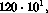
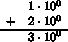
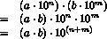
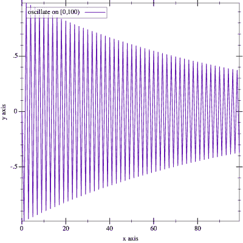

# 小节 4：数字的本质🔗

> 原文：[`htdp.org/2024-11-6/Book/i4-5.html`](https://htdp.org/2024-11-6/Book/i4-5.html)

| |   固定大小数字算术 |
| --- | --- |
| |   溢出 |
| |   下溢 |
| |   *SL 数字 |

当涉及到数字时，编程语言在底层硬件和真正的数学之间起到了桥梁的作用。典型的计算机硬件使用固定大小的数据块来表示数字；这些块被称为位、字节和字。它们还配备了仅在这些块上工作的处理器。在纸笔计算中，我们不必担心我们处理了多少位数字；原则上，我们可以处理由一个数字、10 个数字或 10,000 个数字组成的数字。因此，如果编程语言使用底层硬件中的数字，其计算将尽可能高效。如果它坚持使用我们从数学中知道的数字，它必须将这些数字转换成硬件数据块，然后再转换回来——<wbr>这些转换会花费时间。正因为如此，大多数编程语言的创造者采用了基于硬件的选择。

这部分小节通过数据表示的练习来解释数字的硬件表示。具体来说，第一小节介绍了一种具体的固定大小数字表示方法，讨论了如何将数字映射到这种表示，并暗示了在这种数字上的计算是如何进行的。第二和第三部分分别说明了这种选择中最基本的两个问题：算术溢出和下溢。最后一部分概述了教学语言中的算术是如何工作的；它的数系推广了你在大多数现代编程语言中找到的内容。最后的练习展示了当程序使用数字进行计算时可能出现的问题。

### 固定大小数字算术🔗 "链接到此处")

假设我们可以使用四个数字来表示数字。如果我们表示自然数，一个可表示的范围是 0,10000)。对于实数，我们可以在 0 和 1 之间选择 10,000 个分数，或者在 0 和 1 之间选择 5,000 个，在 1 和 2 之间再选择 5,000 个，依此类推。在任一情况下，四个数字对于某个选择的区间最多可以表示 10,000 个数字，而该区间的数线包含无限多个数字。

硬件数字的常见选择是使用所谓的科学记数法，这意味着数字由两部分组成：对于纯科学记数法，基数在 0 到 9 之间；我们忽略这个约束。

1.  一个尾数，它是一个基数，

1.  一个指数，用于确定一个以 10 为基的因子。

用公式表示，我们写作

> 

另一个例子是

> 

通常，一个数字在这个表示法中有几个等价形式。我们还可以使用负指数，这会增加分数，但需要额外的一个数据项：指数的符号。例如，

> 

表示

> 

为了使用指数-尾数表示法，我们必须决定我们希望用四个数字中的几个来表示尾数，以及几个来表示指数。在这里，我们为每个数使用两个数字，并为指数使用一个正号；其他选择也是可能的。做出这个决定后，我们仍然可以表示 0，如下所示

> 

我们能表示的最大数字是

> 

这是由 99 后面跟着 99 个 0 组成的。使用负指数，我们可以将分数加到

> 

这是最小的可表示数字。总的来说，使用四位数字（包括正号）的科学记数法，我们可以表示广泛的数字和分数，但这种改进也伴随着它自己的问题。

> > > | ; N  Number  N -> Inex |
> > > | --- |
> > > | ; makes an instance of Inex after checking the arguments |
> > > | ([define](http://docs.racket-lang.org/htdp-langs/intermediate.html#%28form._%28%28lib._lang%2Fhtdp-intermediate..rkt%29._define%29%29) (create-inex m s e) |
> > > | |   ([cond](http://docs.racket-lang.org/htdp-langs/intermediate.html#%28form._%28%28lib._lang%2Fhtdp-intermediate..rkt%29._cond%29%29) |
> > > | |   [([and](http://docs.racket-lang.org/htdp-langs/intermediate.html#%28form._%28%28lib._lang%2Fhtdp-intermediate..rkt%29._and%29%29) ([<=](http://docs.racket-lang.org/htdp-langs/intermediate.html#%28def._htdp-intermediate._%28%28lib._lang%2Fhtdp-intermediate..rkt%29._~3c~3d%29%29) 0 m 99) ([<=](http://docs.racket-lang.org/htdp-langs/intermediate.html#%28def._htdp-intermediate._%28%28lib._lang%2Fhtdp-intermediate..rkt%29._~3c~3d%29%29) 0 e 99) ([or](http://docs.racket-lang.org/htdp-langs/intermediate.html#%28form._%28%28lib._lang%2Fhtdp-intermediate..rkt%29._or%29%29) ([=](http://docs.racket-lang.org/htdp-langs/intermediate.html#%28def._htdp-intermediate._%28%28lib._lang%2Fhtdp-intermediate..rkt%29._~3d%29%29) s 1) ([=](http://docs.racket-lang.org/htdp-langs/intermediate.html#%28def._htdp-intermediate._%28%28lib._lang%2Fhtdp-intermediate..rkt%29._~3d%29%29) s -1))) |
> > > | |   (make-inex m s e)] |
> > > | |   [[else](http://docs.racket-lang.org/htdp-langs/intermediate.html#%28form._%28%28lib._lang%2Fhtdp-intermediate..rkt%29._else%29%29) ([error](http://docs.racket-lang.org/htdp-langs/intermediate.html#%28def._htdp-intermediate._%28%28lib._lang%2Fhtdp-intermediate..rkt%29._error%29%29) "bad values given")])) |
> > > | |   |
> > > | ; Inex -> Number |
> > > | ; converts an inex into its numeric equivalent |
> > > | ([define](http://docs.racket-lang.org/htdp-langs/intermediate.html#%28form._%28%28lib._lang%2Fhtdp-intermediate..rkt%29._define%29%29) (inex->number an-inex) |
> > > |   ([*](http://docs.racket-lang.org/htdp-langs/intermediate.html#%28def._htdp-intermediate._%28%28lib._lang%2Fhtdp-intermediate..rkt%29._%2A%29%29) (inex-mantissa an-inex) |
> > > |      ([expt](http://docs.racket-lang.org/htdp-langs/intermediate.html#%28def._htdp-intermediate._%28%28lib._lang%2Fhtdp-intermediate..rkt%29._expt%29%29) |
> > > |        10 ([*](http://docs.racket-lang.org/htdp-langs/intermediate.html#%28def._htdp-intermediate._%28%28lib._lang%2Fhtdp-intermediate..rkt%29._%2A%29%29) (inex-sign an-inex) (inex-exponent an-inex))))) |
> > > 
> 图 143：不精确表示的函数

要理解这些问题，最好通过在 ISL+中的数据表示和运行一些实验来使这些选择具体化。让我们用一个有三个字段的结构的固定大小数字来表示：

> | ([define-struct](http://docs.racket-lang.org/htdp-langs/intermediate.html#%28form._%28%28lib._lang%2Fhtdp-intermediate..rkt%29._define-struct%29%29) inex [mantissa sign exponent]) |
> | --- |
> | ; An Inex is a structure: |
> | ;   (make-inex  N99  S  N99) |
> | ; An S is one of: |
> | ; –  1 |
> | ; –  -1 |
> | ; An N99 is an N between 0 and 99 (inclusive). |

由于对 Inex 字段的限制非常严格，我们定义了`create-inex`函数来实例化这种结构类型定义；参见图 143。该图还定义了`inex->number`，它使用上述公式将 Inex 转换为数字。让我们将上述示例，1200，转换为我们的数据表示：

> (create-inex 12 1 2)

将 1200 表示为是非法的，根据我们的 Inex 数据定义：

> | > (create-inex 120 1 1) |
> | --- |
> | bad values given |

对于其他数字，我们也可以找到两个 Inex 等价值。一个例子是 5e-19：

> | > (create-inex 50 -1 20) |
> | --- |
> | (make-inex 50 -1 20) |
> | > (create-inex 5 -1 19) |
> | (make-inex 5 -1 19) |

使用`inex->number`来确认这两个数的等价性。使用`create-inex`也可以轻松界定可表示数字的范围，实际上对于许多应用来说这个范围相当小：

> | ([define](http://docs.racket-lang.org/htdp-langs/intermediate.html#%28form._%28%28lib._lang%2Fhtdp-intermediate..rkt%29._define%29%29) MAX-POSITIVE (create-inex 99 1 99)) |
> | --- |
> | ([define](http://docs.racket-lang.org/htdp-langs/intermediate.html#%28form._%28%28lib._lang%2Fhtdp-intermediate..rkt%29._define%29%29) MIN-POSITIVE (create-inex 1 -1 99)) |

问题是哪个介于 0 和 MAX-POSITIVE 之间的实数可以被转换成 Inex。特别是，任何小于

> 

没有等效的 Inex。同样，表示在中间有间隙。例如，的直接后继者

> (create-inex 12 1 2)

is

> (create-inex 13 1 2)

第一个 Inex 代表 1200，第二个代表 1300。中间的数字，比如 1240，可以表示为其中一个，或者另一个——<wbr>没有其他 Inex 有意义。标准的选择是将数字四舍五入到最接近的可表示等价数，这就是计算机科学家所说的不精确数。也就是说，选择的数据表示方式迫使我们把数学数映射到近似值。最后，我们还必须考虑 Inex 结构上的算术运算。具有相同指数的两个 Inex 表示相加意味着将两个尾数相加：

> | (inex+ (create-inex 1 1 0) (create-inex 2 1 0)) |
> | --- |
> | == |
> | (create-inex 3 1 0) |

将其转换为数学符号，我们得到

> 

当两个尾数的相加产生太多的位数时，我们必须使用 Inex 中的最接近的邻居。考虑将  加到它自己上。从数学上我们得到

> 

但我们不能简单地把这个数字天真地转换成我们选择的表现形式，因为 。适当的纠正措施是将结果表示为

> 

或者，转换成 ISL+，我们必须确保 inex+ 按以下方式计算：

> | (inex+ (create-inex 55 1 0) (create-inex 55 1 0)) |
> | --- |
> | == |
> | (create-inex 11 1 1) |

更一般地，如果结果的尾数太大，我们必须将其除以 10 并增加指数一位。有时结果包含的尾数位数比我们能表示的还要多。在这些情况下，inex+ 必须四舍五入到 Inex 世界中最接近的等效数。例如：

> | (inex+ (create-inex 56 1 0) (create-inex 56 1 0)) |
> | --- |
> | == |
> | (create-inex 11 1 1) |

与精确计算相比：

> 

因为结果有太多的尾数位，所以将结果尾数除以 10 的整数除法产生了一个近似结果：

> 

这是不精确 Inex 算术中许多近似的一个例子。并且不精确是合适的。我们也可以乘以 Inex 数字。回想一下

> 

因此我们得到：

> 

或者，在 ISL+ 表示法中：

> | (inex* (create-inex 2 1 4) (create-inex 8 1 10)) |
> | --- |
> | == |
> | (create-inex 16 1 14) |

与加法一样，事情并不简单。当结果在尾数部分有太多有效数字时，inex 必须增加指数：

> | (inex* (create-inex 20 1 1) (create-inex  5 1 4)) |
> | --- |
> | == |
> | (create-inex 10 1 6) |

正如 inex+ 一样，inex* 如果真正的尾数在 Inex 中没有精确的等价物，也会引入一个近似值：

> | (inex* (create-inex 27 -1 1) (create-inex  7 1 4)) |
> | --- |
> | == |
> | (create-inex 19 1 4) |

练习 412。设计 inex+。该函数将两个具有相同指数的 Inex 数字表示相加。该函数必须能够处理增加指数的输入。此外，如果结果超出范围，它必须发出自己的错误信号，而不是依赖于 create-inex 进行错误检查。

挑战扩展 inex+ 以处理指数相差 1 的输入：

> | ([check-expect](http://docs.racket-lang.org/htdp-langs/intermediate.html#%28form._%28%28lib._lang%2Fhtdp-intermediate..rkt%29._check-expect%29%29) |
> | --- |
> |   (inex+ (create-inex 1 1 0) (create-inex 1 -1 1)) |
> |   (create-inex 11 -1 1)) |

在阅读以下小节之前，不要尝试处理比这更大的输入类别。

练习 413。设计 inex*。该函数将两个 Inex 数字表示相乘，包括强制输出指数额外增加的输入。像 inex+ 一样，如果结果超出范围，它必须发出自己的错误信号，而不是依赖于 create-inex 进行错误检查。

练习 414。正如本节所示，数据表示中的间隙会导致将数字映射到 Inex 时出现舍入误差。问题是，这种舍入误差会在计算过程中累积。

设计 add，一个函数，它将 n 个 #i1/185 相加。对于示例，使用 0 和 1；对于后者，使用公差为 0.0001。(add  185) 的结果是什么？你期望什么结果？如果你将结果乘以一个大数会发生什么？

设计 sub。该函数计算 1/185 可以从参数中减去多少次直到它变为 0。使用 0 和 1/185 作为示例。预期的结果是什么？(sub  1) 和 (sub #i1.0) 的结果是什么？在第二种情况下发生了什么？为什么？

### 溢出🔗 "链接到此处")

虽然科学记数法通过固定大小的数据块扩展了我们能够表示的数字范围，但它仍然是有限的。有些数字太大，无法适应固定大小的数字表示。例如，

> 

由于指数 500 无法适应两位数字，尾数达到法律允许的最大值，因此无法表示。在计算过程中可能会出现超出 Inex 范围的数字。例如，我们可以表示的两个数字相加可能会得到一个我们无法表示的数字：

> | (inex+ (create-inex 50 1 99) (create-inex 50 1 99)) |
> | --- |
> | == |
> | (create-inex 100 1 99) |

这违反了数据定义。当 Inex 算术产生的数字太大而无法表示时，我们称之为（算术）溢出。

当发生溢出时，某些语言实现会发出错误信号并停止计算。其他则指定一个符号值，称为无穷大，来表示这样的数，并在算术运算中传播它。

注意：如果 Inex 有一个用于尾数的符号字段，那么两个负数相加可能得到一个如此负的数，以至于它也无法表示。这被称为负方向的溢出。结束

练习 415。ISL+ 使用 +inf.0 来处理溢出。确定整数 n，使得

> | ([expt](http://docs.racket-lang.org/htdp-langs/intermediate.html#%28def._htdp-intermediate._%28%28lib._lang%2Fhtdp-intermediate..rkt%29._expt%29%29) #i10.0 n) |
> | --- |

是一个不精确的数字，而 ([expt](http://docs.racket-lang.org/htdp-langs/intermediate.html#%28def._htdp-intermediate._%28%28lib._lang%2Fhtdp-intermediate..rkt%29._expt%29%29) #i10. ([+](http://docs.racket-lang.org/htdp-langs/intermediate.html#%28def._htdp-intermediate._%28%28lib._lang%2Fhtdp-intermediate..rkt%29._%2B%29%29) n 1)) 被近似为 +inf.0。提示：设计一个函数来计算 n。

### Underflow🔗 "链接到此处")

在光谱的另一端，有一些小数在 Inex 中没有表示。例如， 不是 0，但它比我们能表示的最小非零数还要小。当我们乘以两个小数，结果太小而无法在 Inex 中表示时，会出现（算术）下溢：

> | (inex* (create-inex 1 -1 10) (create-inex 1 -1 99)) |
> | --- |
> | == |
> | (create-inex 1 -1 109) |

这会引发错误。

当发生下溢时，某些语言实现会发出错误信号；其他则使用 0 来近似结果。使用 0 来近似下溢与在 Inex 中选择一个数的近似表示在定性上是不同的。具体来说，用 (create-inex  12  1  2) 来近似 1250 会从尾数中删除有效数字，但结果始终在要表示的数的 10% 以内。然而，近似下溢意味着删除整个尾数，这意味着结果不在可预测的百分比范围内。

练习 416\. ISL+ 使用 #i0.0 来近似下溢。确定最小的整数 n，使得 ([expt](http://docs.racket-lang.org/htdp-langs/intermediate.html#%28def._htdp-intermediate._%28%28lib._lang%2Fhtdp-intermediate..rkt%29._expt%29%29) #i10.0 n) 仍然是一个不精确的 ISL+ 数，并且 ([expt](http://docs.racket-lang.org/htdp-langs/intermediate.html#%28def._htdp-intermediate._%28%28lib._lang%2Fhtdp-intermediate..rkt%29._expt%29%29) #i10. ([-](http://docs.racket-lang.org/htdp-langs/intermediate.html#%28def._htdp-intermediate._%28%28lib._lang%2Fhtdp-intermediate..rkt%29._-%29%29) n 1)) 被近似为 0。提示：使用一个函数来计算 n。考虑将这个函数及其 练习 415 的解进行抽象。

### *SL 数🔗 "链接到此处")

大多数编程语言只支持近似数字表示和不精确数字的算术。不精确的实数表示有多种类型：浮点数、双精度浮点数、extflonum 等。一种典型的语言将其整数限制在与其运行的硬件数据块大小相关的区间内。它对实数的表示基于前几节中的草图，尽管数据块比 Inex 使用的四位数字要大，并且使用的是基于 2 的数制中的数字。

教学语言支持精确和不精确的数字。它们的整数和有理数可以任意大和精确，仅限于计算机整个内存的绝对大小。对于这些数字的计算，我们的教学语言只要涉及的分数可以适应支持的数据块，就会使用底层硬件；当数字超出这个范围时，它会自动切换到不同的表示形式和算术操作的不同版本。它们的实数有两种类型：精确和不精确。精确数真正表示一个实数；不精确数在精神上近似前几节中的实数。当可能时，算术操作会保持精确性；当必要时，它们会产生不精确的结果。因此，[sqrt](http://docs.racket-lang.org/htdp-langs/intermediate.html#%28def._htdp-intermediate._%28%28lib._lang%2Fhtdp-intermediate..rkt%29._sqrt%29%29) 对于 2 的精确和不精确表示都返回一个不精确数。相比之下，[sqrt](http://docs.racket-lang.org/htdp-langs/intermediate.html#%28def._htdp-intermediate._%28%28lib._lang%2Fhtdp-intermediate..rkt%29._sqrt%29%29) 当给定精确的 4 和 #i2.0 作为 #i4.0 的输入时，会返回一个精确的 2。最后，教学程序中的数值常量被理解为精确有理数，除非它以 #i 前缀开头。

简单的 Racket 解释器将所有十进制数字解释为不精确数字；它还将所有实数表示为十进制，无论它们是精确的还是不精确的。这意味着所有这些数字都是危险的，因为它们很可能是真实数字的不精确近似。程序员可以通过在数值常量前加 #e 来强制 Racket 解释带点的数字为精确数字。

在这一点上，你可能想知道如果程序使用这些不精确的数字，其结果可能有多少差异。这是一个早期计算机科学家们大量挣扎的问题，在过去的几十年里，这些研究已经创造了一个独立的领域，称为数值分析。每个计算机科学家，实际上，每个使用计算机和软件的人，都应该意识到它的存在以及它对数值程序工作原理的一些基本洞察。作为一个初步的体验，以下练习说明了事情可能变得多么糟糕。完成它们，永远不要忽视不精确数字的问题。

练习 417. 在 Racket 和 ISL+ 中评估 ([expt](http://docs.racket-lang.org/htdp-langs/intermediate.html#%28def._htdp-intermediate._%28%28lib._lang%2Fhtdp-intermediate..rkt%29._expt%29%29)  1.001  1e-12)。解释你所看到的结果。

练习 418. 设计 my-expt 函数，不使用 [expt](http://docs.racket-lang.org/htdp-langs/intermediate.html#%28def._htdp-intermediate._%28%28lib._lang%2Fhtdp-intermediate..rkt%29._expt%29%29)。该函数将第一个给定的数字提升为第二个数字的幂，即一个自然数。使用此函数进行以下实验。添加

> | ([define](http://docs.racket-lang.org/htdp-langs/intermediate.html#%28form._%28%28lib._lang%2Fhtdp-intermediate..rkt%29._define%29%29) inex ([+](http://docs.racket-lang.org/htdp-langs/intermediate.html#%28def._htdp-intermediate._%28%28lib._lang%2Fhtdp-intermediate..rkt%29._%2B%29%29) 1 #i1e-12)) |
> | --- |
> | ([define](http://docs.racket-lang.org/htdp-langs/intermediate.html#%28form._%28%28lib._lang%2Fhtdp-intermediate..rkt%29._define%29%29) exac ([+](http://docs.racket-lang.org/htdp-langs/intermediate.html#%28def._htdp-intermediate._%28%28lib._lang%2Fhtdp-intermediate..rkt%29._%2B%29%29) 1 1e-12)) |

将其添加到定义区域。什么是 (my-expt  inex  30)？还有 (my-expt  exac  30) 呢？哪个答案更有用？

> > > | ([define](http://docs.racket-lang.org/htdp-langs/intermediate.html#%28form._%28%28lib._lang%2Fhtdp-intermediate..rkt%29._define%29%29) JANUS |
> > > | --- |
> > > |   ([list](http://docs.racket-lang.org/htdp-langs/intermediate.html#%28def._htdp-intermediate._%28%28lib._lang%2Fhtdp-intermediate..rkt%29._list%29%29) 31.0 |
> > > |         #i2e+34 |
> > > |         #i-1.2345678901235e+80 |
> > > |         2749.0 |
> > > |         -2939234.0 |
> > > |         #i-2e+33 |
> > > |         #i3.2e+270 |
> > > |         17.0 |
> > > |         #i-2.4e+270 |
> > > |         #i4.2344294738446e+170 |
> > > |         1.0 |
> > > |         #i-8e+269 |
> > > |         0.0 |
> > > |         99.0)) |
> > > 
> 图 144：一个双面数的 Janus 系列图

练习 419。当你将两个数量级差异很大的不精确数字相加时，你可能会得到较大的一个作为结果。例如，如果一个数制只使用 15 位有效数字，当我们相加相差超过  的数字时，我们就会遇到问题：

> 

但最接近的可表示答案是 。乍一看，这种近似看起来并不太糟糕。错误的部分在 （十亿亿分之一）内，足够接近真实值。不幸的是，这类问题可能会累积成巨大的问题。考虑图 144 中的数字列表，并确定这些表达式的值：

+   (sum  JANUS)

+   (sum  ([reverse](http://docs.racket-lang.org/htdp-langs/intermediate.html#%28def._htdp-intermediate._%28%28lib._lang%2Fhtdp-intermediate..rkt%29._reverse%29%29)  JANUS))

+   (sum  ([sort](http://docs.racket-lang.org/htdp-langs/intermediate.html#%28def._htdp-intermediate._%28%28lib._lang%2Fhtdp-intermediate..rkt%29._sort%29%29)  JANUS  [<](http://docs.racket-lang.org/htdp-langs/intermediate.html#%28def._htdp-intermediate._%28%28lib._lang%2Fhtdp-intermediate..rkt%29._~3c%29%29)))

假设 sum 从左到右将列表中的数字相加，解释这些表达式计算的是什么。你认为结果如何？关于不精确计算的通用建议告诉程序员从最小的数字开始加法。虽然将一个大数字加到两个小数字上可能会得到大数字，但先加小数字会得到一个较大的数字，这可能会改变结果：

> | > ([expt](http://docs.racket-lang.org/htdp-langs/intermediate.html#%28def._htdp-intermediate._%28%28lib._lang%2Fhtdp-intermediate..rkt%29._expt%29%29) 2 #i53.0) |
> | --- |
> | #i9007199254740992.0 |
> | > (sum ([list](http://docs.racket-lang.org/htdp-langs/intermediate.html#%28def._htdp-intermediate._%28%28lib._lang%2Fhtdp-intermediate..rkt%29._list%29%29) #i1.0 ([expt](http://docs.racket-lang.org/htdp-langs/intermediate.html#%28def._htdp-intermediate._%28%28lib._lang%2Fhtdp-intermediate..rkt%29._expt%29%29) 2 #i53.0))) |
> | #i9007199254740992.0 |
> | > (sum ([list](http://docs.racket-lang.org/htdp-langs/intermediate.html#%28def._htdp-intermediate._%28%28lib._lang%2Fhtdp-intermediate..rkt%29._list%29%29) #i1.0 #i1.0 ([expt](http://docs.racket-lang.org/htdp-langs/intermediate.html#%28def._htdp-intermediate._%28%28lib._lang%2Fhtdp-intermediate..rkt%29._expt%29%29) 2 #i53.0))) |
> | #i9007199254740994.0 |

这个技巧可能不起作用；参见上面的 JANUS 交互。在 ISL+之类的语言中，你可以将数字转换为精确有理数，在这些数字上使用精确算术，并将结果转换回来：

> ([精确到不精确](http://docs.racket-lang.org/htdp-langs/intermediate.html#%28def._htdp-intermediate._%28%28lib._lang%2Fhtdp-intermediate..rkt%29._exact-~3einexact%29%29) (sum ([map](http://docs.racket-lang.org/htdp-langs/intermediate.html#%28def._htdp-intermediate._%28%28lib._lang%2Fhtdp-intermediate..rkt%29._map%29%29) [inexact->exact](http://docs.racket-lang.org/htdp-langs/intermediate.html#%28def._htdp-intermediate._%28%28lib._lang%2Fhtdp-intermediate..rkt%29._inexact-~3eexact%29%29) JANUS)))

评估这个表达式，并将结果与上面的三个求和结果进行比较。你现在对来自网络的建议有何看法？练习 420。JANUS 只是一个固定列表，但看看这个函数：

> | ([define](http://docs.racket-lang.org/htdp-langs/intermediate.html#%28form._%28%28lib._lang%2Fhtdp-intermediate..rkt%29._define%29%29) (oscillate n) |
> | --- |
> |   ([local](http://docs.racket-lang.org/htdp-langs/intermediate.html#%28form._%28%28lib._lang%2Fhtdp-intermediate..rkt%29._local%29%29) (([define](http://docs.racket-lang.org/htdp-langs/intermediate.html#%28form._%28%28lib._lang%2Fhtdp-intermediate..rkt%29._define%29%29) (O i) |
> |             ([cond](http://docs.racket-lang.org/htdp-langs/intermediate.html#%28form._%28%28lib._lang%2Fhtdp-intermediate..rkt%29._cond%29%29) |
> |               [([>](http://docs.racket-lang.org/htdp-langs/intermediate.html#%28def._htdp-intermediate._%28%28lib._lang%2Fhtdp-intermediate..rkt%29._~3e%29%29) i n) '()] |
> |               [[else](http://docs.racket-lang.org/htdp-langs/intermediate.html#%28form._%28%28lib._lang%2Fhtdp-intermediate..rkt%29._else%29%29) |
> |                ([cons](http://docs.racket-lang.org/htdp-langs/intermediate.html#%28def._htdp-intermediate._%28%28lib._lang%2Fhtdp-intermediate..rkt%29._cons%29%29) ([expt](http://docs.racket-lang.org/htdp-langs/intermediate.html#%28def._htdp-intermediate._%28%28lib._lang%2Fhtdp-intermediate..rkt%29._expt%29%29) #i-0.99 i) (O ([+](http://docs.racket-lang.org/htdp-langs/intermediate.html#%28def._htdp-intermediate._%28%28lib._lang%2Fhtdp-intermediate..rkt%29._%2B%29%29) i 1)))]))) |
> |     (O 1))) |

将振荡应用于自然数 n 会产生数学级数的前 n 个元素。最好将其理解为图表，就像图 145 中的那样。在 DrRacket 中运行(oscillate  15)并检查结果。

> > > > 
> > > > 
> 图 145：振荡图

从左到右累加其结果与从右到左累加的结果不同：

> | > (sum (oscillate #i1000.0)) |
> | --- |
> | #i-0.49746596003269394 |
> | > (sum ([reverse](http://docs.racket-lang.org/htdp-langs/intermediate.html#%28def._htdp-intermediate._%28%28lib._lang%2Fhtdp-intermediate..rkt%29._reverse%29%29) (oscillate #i1000.0))) |
> | #i-0.4974659600326953 |

再次，差异可能看起来很小，直到我们看到上下文：

> |
> 
> &#124; > ([-](http://docs.racket-lang.org/htdp-langs/intermediate.html#%28def._htdp-intermediate._%28%28lib._lang%2Fhtdp-intermediate..rkt%29._-%29%29) ([*](http://docs.racket-lang.org/htdp-langs/intermediate.html#%28def._htdp-intermediate._%28%28lib._lang%2Fhtdp-intermediate..rkt%29._%2A%29%29) 1e+16 (sum (oscillate #i1000.0)))) |
> 
> &#124;    ([*](http://docs.racket-lang.org/htdp-langs/intermediate.html#%28def._htdp-intermediate._%28%28lib._lang%2Fhtdp-intermediate..rkt%29._%2A%29%29) 1e+16 (sum ([reverse](http://docs.racket-lang.org/htdp-langs/intermediate.html#%28def._htdp-intermediate._%28%28lib._lang%2Fhtdp-intermediate..rkt%29._reverse%29%29) (oscillate #i1000.0)))) |
> 
> |
> 
> | #i14.0 |
> | --- |

这种差异重要吗？我们能信任计算机吗？

问题是，如果程序员有选择的话，他们应该在程序中使用哪些数字。答案当然取决于上下文。在财务报表的世界里，数值常数应被解释为精确数字，财务报表的计算操作应该能够依赖于数学运算的精确性保持性质。毕竟，法律无法容忍不精确数字及其操作带来的严重错误。然而，在科学计算中，产生精确结果所需的多余时间可能会带来过重的负担。因此，科学家倾向于使用不精确数字，但会仔细分析他们的程序，以确保数值误差对于他们使用程序输出是可容忍的。
