# V 生成递归🔗

> 原文：[`htdp.org/2024-11-6/Book/part_five.html`](https://htdp.org/2024-11-6/Book/part_five.html)

| 25 非标准递归 |
| --- |
| 25.1 无结构的递归 |
| 25.2 忽略结构的递归 |
| 26 设计算法 |
| 26.1 适应设计食谱 |
| 26.2 终止 |
| 26.3 结构化递归与生成递归 |
| 26.4 做出选择 |
| 27 主题变奏 |
| 27.1 分形，初尝 |
| 27.2 二分搜索 |
| 27.3 一瞥解析 |
| 28 数学示例 |
| 28.1 牛顿法 |
| 28.2 数值积分 |
| 28.3 项目：高斯消元 |
| 29 回溯算法 |
| 29.1 遍历图 |
| 29.2 项目：回溯 |
| 30 概述 |

如果你遵循前四部分的设计食谱，要么将领域知识转化为代码，要么利用数据定义的结构来组织你的代码。一些函数仅仅组合这样的函数；我们将这些函数归类为“结构”组。后者的函数通常将它们的参数分解为其直接的结构组件，然后处理这些组件。如果这些直接组件中的任何一个属于与输入相同的数据类别，则该函数是结构递归的。虽然结构化设计的函数构成了世界上大部分代码，但有些问题不能通过结构化设计方法来解决。

为了解决这样的复杂问题，程序员使用生成递归，这是一种比结构递归更强大的递归形式。生成递归的研究与数学一样古老，通常被称为算法研究。算法的输入代表一个问题。算法倾向于将问题重新排列成一系列问题，解决这些问题，并将它们的解决方案组合成一个整体解决方案。通常，这些新生成的问题与给定的问题相同，在这种情况下，算法可以重新使用来解决这些问题。在这些情况下，算法是递归的，但它的递归使用的是新生成数据，而不是输入数据的直接部分。

从生成递归的描述本身，你可以看出设计一个生成递归函数比设计一个结构递归函数更具有即兴创作的性质。尽管如此，许多通用设计配方中的元素也适用于算法设计，本书的这一部分展示了设计配方如何以及多大程度上有助于设计。设计算法的关键是“生成”步骤，这通常意味着将问题分解。而找出一种新颖的问题分解方法需要洞察力。在希腊语中，这被称为“eureka！”有时可能只需要一点关于分解字母序列的常识知识。在其他时候，它可能依赖于关于数字的深奥数学定理。在实践中，程序员会独立设计简单的算法，并依赖领域专家来处理复杂的兄弟。对于任何一种情况，程序员都必须彻底理解底层思想，以便他们可以编写算法，并让程序与未来的读者进行沟通。了解这一想法的最好方式是研究广泛的各种示例，并培养对现实世界中可能出现的各种生成递归的感觉。

### 25 非标准递归🔗 "链接至此")

在这个阶段，你已经设计了多个使用结构递归的函数。当你设计一个函数时，你知道你需要查看其主要输入的数据定义。如果这个输入由一个自引用的数据定义来描述，你最终会得到一个函数，它在数据定义自引用的地方基本上也引用了自己。

本章介绍了两个使用递归方式不同的示例程序。它们展示了需要一些“灵感”的问题，从明显想法到复杂洞察。

#### 25.1 无结构递归🔗 "链接至此")

假设你已经加入了 DrRacket 团队。该团队正在开发一个共享服务，以支持程序员之间的协作。具体来说，DrRacket 的下一个版本将使 ISL 程序员能够跨多台计算机共享 DrRacket 的定义区域内容。每次一个程序员修改缓冲区时，修订后的 DrRacket 将将定义区域的内容广播给参与共享会话的 DrRacket 实例。

> 示例问题 你的任务是设计函数包，该函数包为广播准备定义区域的内容。DrRacket 将内容作为 1String 列表传递。函数的任务是将单个“字母”块捆绑成块，从而生成一个字符串列表——称为块——其长度称为块大小。

如你所见，问题基本上已经指出了签名，因此不需要任何特定问题的数据定义：

> | ; [列表-of 1String] N -> [列表-of String] |
> | --- |
> | ; 将 s 的块捆绑成长度为 n 的字符串 |
> | ([定义](http://docs.racket-lang.org/htdp-langs/intermediate-lam.html#%28form._%28%28lib._lang%2Fhtdp-intermediate-lambda..rkt%29._define%29%29) (捆绑 s n)) |
> |   '()) |

目的声明重新表述了问题陈述中的一个句子片段，并使用了虚拟函数头中的参数。第三步要求提供函数示例。以下是一个 1String 的列表：

> ([列表](http://docs.racket-lang.org/htdp-langs/intermediate-lam.html#%28def._htdp-intermediate-lambda._%28%28lib._lang%2Fhtdp-intermediate-lambda..rkt%29._list%29%29) "a" "b" "c" "d" "e" "f" "g" "h")

如果我们告诉捆绑将这个列表捆绑成对——<wbr>也就是说，n 是 2——<wbr>那么以下列表是预期的结果：

> ([列表](http://docs.racket-lang.org/htdp-langs/intermediate-lam.html#%28def._htdp-intermediate-lambda._%28%28lib._lang%2Fhtdp-intermediate-lambda..rkt%29._list%29%29) "ab" "cd" "ef" "gh")

现在如果 n 是 3，那么会剩下一个“字母。”由于问题陈述没有告诉我们哪个字符被留下了，我们可以想象至少两种有效的场景：

+   函数产生 ([列表](http://docs.racket-lang.org/htdp-langs/intermediate-lam.html#%28def._htdp-intermediate-lambda._%28%28lib._lang%2Fhtdp-intermediate-lambda..rkt%29._list%29%29) "abc" "def" "g")；也就是说，它将最后一个字母视为剩余的一个。

+   或者，它产生 ([列表](http://docs.racket-lang.org/htdp-langs/intermediate-lam.html#%28def._htdp-intermediate-lambda._%28%28lib._lang%2Fhtdp-intermediate-lambda..rkt%29._list%29%29) "a" "bcd" "efg")，它将首字符打包成一个字符串。

停止！至少想出另一个选择。为了简单起见，我们选择第一个选择作为期望的结果，并通过写下相应的测试来说明：

> | ([检查期望](http://docs.racket-lang.org/htdp-langs/intermediate-lam.html#%28form._%28%28lib._lang%2Fhtdp-intermediate-lambda..rkt%29._check-expect%29%29) (捆绑 ([爆炸](http://docs.racket-lang.org/htdp-langs/intermediate-lam.html#%28def._htdp-intermediate-lambda._%28%28lib._lang%2Fhtdp-intermediate-lambda..rkt%29._explode%29%29) "abcdefg") 3)) |
> | --- |
> |               ([列表](http://docs.racket-lang.org/htdp-langs/intermediate-lam.html#%28def._htdp-intermediate-lambda._%28%28lib._lang%2Fhtdp-intermediate-lambda..rkt%29._list%29%29) "abc" "def" "g")) |

注意到使用了 [explode](http://docs.racket-lang.org/htdp-langs/intermediate-lam.html#%28def._htdp-intermediate-lambda._%28%28lib._lang%2Fhtdp-intermediate-lambda..rkt%29._explode%29%29)；这使得测试更易读。示例和测试还必须描述在数据定义边界处发生的情况。在此上下文中，边界明显是指给定的包列表长度小于给定的块大小：

> ([check-expect](http://docs.racket-lang.org/htdp-langs/intermediate-lam.html#%28form._%28%28lib._lang%2Fhtdp-intermediate-lambda..rkt%29._check-expect%29%29) (bundle '("a" "b") 3) ([list](http://docs.racket-lang.org/htdp-langs/intermediate-lam.html#%28def._htdp-intermediate-lambda._%28%28lib._lang%2Fhtdp-intermediate-lambda..rkt%29._list%29%29) "ab"))

这也意味着我们必须考虑当给定的包是 '() 时会发生什么。为了简单起见，我们选择 '()' 作为期望的结果：

> ([check-expect](http://docs.racket-lang.org/htdp-langs/intermediate-lam.html#%28form._%28%28lib._lang%2Fhtdp-intermediate-lambda..rkt%29._check-expect%29%29) (bundle '() 3) '())

一个自然的替代方案是请求 '""。你能看到其他方案吗？

> > > | ; N 作为复合元素，s 被视为原子元素 ; (同时处理两个列表：情况 1) |
> > > | --- |
> > > | ([define](http://docs.racket-lang.org/htdp-langs/intermediate-lam.html#%28form._%28%28lib._lang%2Fhtdp-intermediate-lambda..rkt%29._define%29%29) (bundle s n) |
> > > |   ([cond](http://docs.racket-lang.org/htdp-langs/intermediate-lam.html#%28form._%28%28lib._lang%2Fhtdp-intermediate-lambda..rkt%29._cond%29%29) |
> > > |     [([zero?](http://docs.racket-lang.org/htdp-langs/intermediate-lam.html#%28def._htdp-intermediate-lambda._%28%28lib._lang%2Fhtdp-intermediate-lambda..rkt%29._zero~3f%29%29) n) ([...](http://docs.racket-lang.org/htdp-langs/intermediate-lam.html#%28form._%28%28lib._lang%2Fhtdp-intermediate-lambda..rkt%29._......%29%29))] |
> > > |     [[else](http://docs.racket-lang.org/htdp-langs/intermediate-lam.html#%28form._%28%28lib._lang%2Fhtdp-intermediate-lambda..rkt%29._else%29%29) ([...](http://docs.racket-lang.org/htdp-langs/intermediate-lam.html#%28form._%28%28lib._lang%2Fhtdp-intermediate-lambda..rkt%29._......%29%29) s [...](http://docs.racket-lang.org/htdp-langs/intermediate-lam.html#%28form._%28%28lib._lang%2Fhtdp-intermediate-lambda..rkt%29._......%29%29) n [...](http://docs.racket-lang.org/htdp-langs/intermediate-lam.html#%28form._%28%28lib._lang%2Fhtdp-intermediate-lambda..rkt%29._......%29%29) (bundle s ([sub1](http://docs.racket-lang.org/htdp-langs/intermediate-lam.html#%28def._htdp-intermediate-lambda._%28%28lib._lang%2Fhtdp-intermediate-lambda..rkt%29._sub1%29%29) n)))])) |
> > > |   |
> > > | ; [列表  1 字符串] 作为复合元素，n 为原子元素 ; (同时处理两个列表：情况 1) |
> > > | ([定义](http://docs.racket-lang.org/htdp-langs/intermediate-lam.html#%28form._%28%28lib._lang%2Fhtdp-intermediate-lambda..rkt%29._define%29%29) (包 s n) |
> > > | ([cond](http://docs.racket-lang.org/htdp-langs/intermediate-lam.html#%28form._%28%28lib._lang%2Fhtdp-intermediate-lambda..rkt%29._cond%29%29) |
> > > |     [([空？](http://docs.racket-lang.org/htdp-langs/intermediate-lam.html#%28def._htdp-intermediate-lambda._%28%28lib._lang%2Fhtdp-intermediate-lambda..rkt%29._empty~3f%29%29) s) ([...](http://docs.racket-lang.org/htdp-langs/intermediate-lam.html#%28form._%28%28lib._lang%2Fhtdp-intermediate-lambda..rkt%29._......%29%29))] |
> > > |     [[否则](http://docs.racket-lang.org/htdp-langs/intermediate-lam.html#%28form._%28%28lib._lang%2Fhtdp-intermediate-lambda..rkt%29._else%29%29) ([...](http://docs.racket-lang.org/htdp-langs/intermediate-lam.html#%28form._%28%28lib._lang%2Fhtdp-intermediate-lambda..rkt%29._......%29%29) s [...](http://docs.racket-lang.org/htdp-langs/intermediate-lam.html#%28form._%28%28lib._lang%2Fhtdp-intermediate-lambda..rkt%29._......%29%29) n [...](http://docs.racket-lang.org/htdp-langs/intermediate-lam.html#%28form._%28%28lib._lang%2Fhtdp-intermediate-lambda..rkt%29._......%29%29) (包 ([剩余](http://docs.racket-lang.org/htdp-langs/intermediate-lam.html#%28def._htdp-intermediate-lambda._%28%28lib._lang%2Fhtdp-intermediate-lambda..rkt%29._rest%29%29) s) n))])) |
> > > |   |
> > > | ; [列表  1 字符串] 和 N 处于同等地位 ; (同时处理两个列表：情况 2) |
> > > | ([定义](http://docs.racket-lang.org/htdp-langs/intermediate-lam.html#%28form._%28%28lib._lang%2Fhtdp-intermediate-lambda..rkt%29._define%29%29) (包 s n) |
> > > |   ([cond](http://docs.racket-lang.org/htdp-langs/intermediate-lam.html#%28form._%28%28lib._lang%2Fhtdp-intermediate-lambda..rkt%29._cond%29%29) |
> > > |     [([并且](http://docs.racket-lang.org/htdp-langs/intermediate-lam.html#%28form._%28%28lib._lang%2Fhtdp-intermediate-lambda..rkt%29._and%29%29) ([空？](http://docs.racket-lang.org/htdp-langs/intermediate-lam.html#%28def._htdp-intermediate-lambda._%28%28lib._lang%2Fhtdp-intermediate-lambda..rkt%29._empty~3f%29%29) s) ([零？](http://docs.racket-lang.org/htdp-langs/intermediate-lam.html#%28def._htdp-intermediate-lambda._%28%28lib._lang%2Fhtdp-intermediate-lambda..rkt%29._zero~3f%29%29) n)) ([...](http://docs.racket-lang.org/htdp-langs/intermediate-lam.html#%28form._%28%28lib._lang%2Fhtdp-intermediate-lambda..rkt%29._......%29%29))] |
> > > |     [[否则](http://docs.racket-lang.org/htdp-langs/intermediate-lam.html#%28form._%28%28lib._lang%2Fhtdp-intermediate-lambda..rkt%29._else%29%29) ([...](http://docs.racket-lang.org/htdp-langs/intermediate-lam.html#%28form._%28%28lib._lang%2Fhtdp-intermediate-lambda..rkt%29._......%29%29) s [...](http://docs.racket-lang.org/htdp-langs/intermediate-lam.html#%28form._%28%28lib._lang%2Fhtdp-intermediate-lambda..rkt%29._......%29%29) n [...](http://docs.racket-lang.org/htdp-langs/intermediate-lam.html#%28form._%28%28lib._lang%2Fhtdp-intermediate-lambda..rkt%29._......%29%29) ([包](http://docs.racket-lang.org/htdp-langs/intermediate-lam.html#%28form._%28%28lib._lang%2Fhtdp-intermediate-lambda..rkt%29._bundle%29%29) ([rest](http://docs.racket-lang.org/htdp-langs/intermediate-lam.html#%28def._htdp-intermediate-lambda._%28%28lib._lang%2Fhtdp-intermediate-lambda..rkt%29._rest%29%29) s) ([减 1](http://docs.racket-lang.org/htdp-langs/intermediate-lam.html#%28def._htdp-intermediate-lambda._%28%28lib._lang%2Fhtdp-intermediate-lambda..rkt%29._sub1%29%29) n)))])) |
> > > |   |
> > > | ; 考虑所有可能性 ; (同时处理两个列表：情况 3) |
> > > | ([定义](http://docs.racket-lang.org/htdp-langs/intermediate-lam.html#%28form._%28%28lib._lang%2Fhtdp-intermediate-lambda..rkt%29._define%29%29) (s n) |
> > > |   ([条件](http://docs.racket-lang.org/htdp-langs/intermediate-lam.html#%28form._%28%28lib._lang%2Fhtdp-intermediate-lambda..rkt%29._cond%29%29) |
> > > |     [([并且](http://docs.racket-lang.org/htdp-langs/intermediate-lam.html#%28form._%28%28lib._lang%2Fhtdp-intermediate-lambda..rkt%29._and%29%29) ([空集合？](http://docs.racket-lang.org/htdp-langs/intermediate-lam.html#%28def._htdp-intermediate-lambda._%28%28lib._lang%2Fhtdp-intermediate-lambda..rkt%29._empty~3f%29%29) s) ([零？](http://docs.racket-lang.org/htdp-langs/intermediate-lam.html#%28def._htdp-intermediate-lambda._%28%28lib._lang%2Fhtdp-intermediate-lambda..rkt%29._zero~3f%29%29) n)) ([...](http://docs.racket-lang.org/htdp-langs/intermediate-lam.html#%28form._%28%28lib._lang%2Fhtdp-intermediate-lambda..rkt%29._......%29%29))] |
> > > |     [([并且](http://docs.racket-lang.org/htdp-langs/intermediate-lam.html#%28form._%28%28lib._lang%2Fhtdp-intermediate-lambda..rkt%29._and%29%29) ([列表？](http://docs.racket-lang.org/htdp-langs/intermediate-lam.html#%28def._htdp-intermediate-lambda._%28%28lib._lang%2Fhtdp-intermediate-lambda..rkt%29._cons~3f%29%29) s) ([零？](http://docs.racket-lang.org/htdp-langs/intermediate-lam.html#%28def._htdp-intermediate-lambda._%28%28lib._lang%2Fhtdp-intermediate-lambda..rkt%29._zero~3f%29%29) n)) ([...](http://docs.racket-lang.org/htdp-langs/intermediate-lam.html#%28form._%28%28lib._lang%2Fhtdp-intermediate-lambda..rkt%29._......%29%29))] |
> > > | [...] ([and](http://docs.racket-lang.org/htdp-langs/intermediate-lam.html#%28form._%28%28lib._lang%2Fhtdp-intermediate-lambda..rkt%29._and%29%29) ([empty?](http://docs.racket-lang.org/htdp-langs/intermediate-lam.html#%28def._htdp-intermediate-lambda._%28%28lib._lang%2Fhtdp-intermediate-lambda..rkt%29._empty~3f%29%29) s) ([positive?](http://docs.racket-lang.org/htdp-langs/intermediate-lam.html#%28def._htdp-intermediate-lambda._%28%28lib._lang%2Fhtdp-intermediate-lambda..rkt%29._positive~3f%29%29) n)) [...](http://docs.racket-lang.org/htdp-langs/intermediate-lam.html#%28form._%28%28lib._lang%2Fhtdp-intermediate-lambda..rkt%29._......%29%29)] |
> > > | [...] [[else](http://docs.racket-lang.org/htdp-langs/intermediate-lam.html#%28form._%28%28lib._lang%2Fhtdp-intermediate-lambda..rkt%29._else%29%29) ([...](http://docs.racket-lang.org/htdp-langs/intermediate-lam.html#%28form._%28%28lib._lang%2Fhtdp-intermediate-lambda..rkt%29._......%29%29) (bundle s ([sub1](http://docs.racket-lang.org/htdp-langs/intermediate-lam.html#%28def._htdp-intermediate-lambda._%28%28lib._lang%2Fhtdp-intermediate-lambda..rkt%29._sub1%29%29) n) [...](http://docs.racket-lang.org/htdp-langs/intermediate-lam.html#%28form._%28%28lib._lang%2Fhtdp-intermediate-lambda..rkt%29._......%29%29) |  |
> > > | ... (bundle ([rest](http://docs.racket-lang.org/htdp-langs/intermediate-lam.html#%28def._htdp-intermediate-lambda._%28%28lib._lang%2Fhtdp-intermediate-lambda..rkt%29._rest%29%29) s) n) [...](http://docs.racket-lang.org/htdp-langs/intermediate-lam.html#%28form._%28%28lib._lang%2Fhtdp-intermediate-lambda..rkt%29._......%29%29))) |
> > > 
> 图 146：将字符串拆分为块的无用模板

模板步骤揭示了一种结构化方法无法工作。图 146 展示了四种可能的模板。由于捆绑的参数都很复杂，前两种考虑其中一个参数是原子的。这显然是不可能的，因为函数必须分解每个参数。第三个模板基于两个参数同步处理的假设，这很接近——<wbr>除了捆绑显然需要在固定的时间间隔将块大小重置为其原始值。最后的模板表明两个参数是独立处理的，这意味着在每个阶段都有四种可能的进展。这种最终设计将参数解耦得太厉害，因为列表和计数数字必须一起处理。简而言之，我们必须承认结构化模板对于这个设计问题似乎是无用的。

> > > | ; [List-of 1String] N -> [List-of String] |
> > > | --- |
> > > |   ; 将 s 的块捆绑成长度为 n 的字符串 |
> > > |   ; 理念：每次取 n 个元素，然后丢弃 n 个元素 |
> > > |   ([define](http://docs.racket-lang.org/htdp-langs/intermediate-lam.html#%28form._%28%28lib._lang%2Fhtdp-intermediate-lambda..rkt%29._define%29%29) (bundle s n) |
> > > |   ([cond](http://docs.racket-lang.org/htdp-langs/intermediate-lam.html#%28form._%28%28lib._lang%2Fhtdp-intermediate-lambda..rkt%29._cond%29%29) |
> > > |   ([([empty?](http://docs.racket-lang.org/htdp-langs/intermediate-lam.html#%28def._htdp-intermediate-lambda._%28%28lib._lang%2Fhtdp-intermediate-lambda..rkt%29._empty~3f%29%29) s) '()] |
> > > |   [[else](http://docs.racket-lang.org/htdp-langs/intermediate-lam.html#%28form._%28%28lib._lang%2Fhtdp-intermediate-lambda..rkt%29._else%29%29) |
> > > |   ([cons](http://docs.racket-lang.org/htdp-langs/intermediate-lam.html#%28def._htdp-intermediate-lambda._%28%28lib._lang%2Fhtdp-intermediate-lambda..rkt%29._cons%29%29) ([implode](http://docs.racket-lang.org/htdp-langs/intermediate-lam.html#%28def._htdp-intermediate-lambda._%28%28lib._lang%2Fhtdp-intermediate-lambda..rkt%29._implode%29%29) (take s n)) (bundle (drop s n) n))])) |
> > > |   |   |
> > > |   ; [List-of X] N -> [List-of X] |
> > > |   ; 如果可能，保留 l 的前 n 个元素，否则保留所有元素 |
> > > |   ([define](http://docs.racket-lang.org/htdp-langs/intermediate-lam.html#%28form._%28%28lib._lang%2Fhtdp-intermediate-lambda..rkt%29._define%29%29) (take l n) |
> > > |   ([cond](http://docs.racket-lang.org/htdp-langs/intermediate-lam.html#%28form._%28%28lib._lang%2Fhtdp-intermediate-lambda..rkt%29._cond%29%29) |
> > > |   [([zero?](http://docs.racket-lang.org/htdp-langs/intermediate-lam.html#%28def._htdp-intermediate-lambda._%28%28lib._lang%2Fhtdp-intermediate-lambda..rkt%29._zero~3f%29%29) n) '()] |
> > > |   [([empty?](http://docs.racket-lang.org/htdp-langs/intermediate-lam.html#%28def._htdp-intermediate-lambda._%28%28lib._lang%2Fhtdp-intermediate-lambda..rkt%29._empty~3f%29%29) l) '()] |
> > > |   [[else](http://docs.racket-lang.org/htdp-langs/intermediate-lam.html#%28form._%28%28lib._lang%2Fhtdp-intermediate-lambda..rkt%29._else%29%29) ([cons](http://docs.racket-lang.org/htdp-langs/intermediate-lam.html#%28def._htdp-intermediate-lambda._%28%28lib._lang%2Fhtdp-intermediate-lambda..rkt%29._cons%29%29) ([first](http://docs.racket-lang.org/htdp-langs/intermediate-lam.html#%28def._htdp-intermediate-lambda._%28%28lib._lang%2Fhtdp-intermediate-lambda..rkt%29._first%29%29) l) (take ([rest](http://docs.racket-lang.org/htdp-langs/intermediate-lam.html#%28def._htdp-intermediate-lambda._%28%28lib._lang%2Fhtdp-intermediate-lambda..rkt%29._rest%29%29) l) ([sub1](http://docs.racket-lang.org/htdp-langs/intermediate-lam.html#%28def._htdp-intermediate-lambda._%28%28lib._lang%2Fhtdp-intermediate-lambda..rkt%29._sub1%29%29) n)))])) |
> > > |   |   |
> > > |   ;   [List-of X] N -> [List-of X] |
> > > |   ;   如果可能，从 l 中删除前 n 个元素，或者删除所有元素 |
> > > |   ([define](http://docs.racket-lang.org/htdp-langs/intermediate-lam.html#%28form._%28%28lib._lang%2Fhtdp-intermediate-lambda..rkt%29._define%29%29) (drop l n) |
> > > |   ([cond](http://docs.racket-lang.org/htdp-langs/intermediate-lam.html#%28form._%28%28lib._lang%2Fhtdp-intermediate-lambda..rkt%29._cond%29%29) |
> > > |   [([zero?](http://docs.racket-lang.org/htdp-langs/intermediate-lam.html#%28def._htdp-intermediate-lambda._%28%28lib._lang%2Fhtdp-intermediate-lambda..rkt%29._zero~3f%29%29) n) l] |
> > > |   ;   [([empty?](http://docs.racket-lang.org/htdp-langs/intermediate-lam.html#%28def._htdp-intermediate-lambda._%28%28lib._lang%2Fhtdp-intermediate-lambda..rkt%29._empty~3f%29%29) l) l] |
> > > |   [[else](http://docs.racket-lang.org/htdp-langs/intermediate-lam.html#%28form._%28%28lib._lang%2Fhtdp-intermediate-lambda..rkt%29._else%29%29) (drop ([rest](http://docs.racket-lang.org/htdp-langs/intermediate-lam.html#%28def._htdp-intermediate-lambda._%28%28lib._lang%2Fhtdp-intermediate-lambda..rkt%29._rest%29%29) l) ([sub1](http://docs.racket-lang.org/htdp-langs/intermediate-lam.html#%28def._htdp-intermediate-lambda._%28%28lib._lang%2Fhtdp-intermediate-lambda..rkt%29._sub1%29%29) n))])) |
> > > 
> 图 147：生成递归

图 147 展示了`bundle`的完整定义。该定义使用了在练习 395 中请求的`drop`和`take`函数；这些函数也存在于标准库中。为了完整性，图中还包含了它们的定义：`drop`从列表的前端删除最多 n 个元素，`take`返回最多那么多个元素。使用这些函数，定义`bundle`相当直接：

1.  如果给定的列表是'()，则结果也是'()，这是根据决定确定的；

1.  否则，使用`take`函数从`s`中获取前 n 个 1String，然后使用[implode](http://docs.racket-lang.org/htdp-langs/intermediate-lam.html#%28def._htdp-intermediate-lambda._%28%28lib._lang%2Fhtdp-intermediate-lambda..rkt%29._implode%29%29)将它们合并成一个普通的 String；

1.  然后它通过`drop`缩短 n 个元素的列表进行递归；并且

1.  最后，[cons](http://docs.racket-lang.org/htdp-langs/intermediate-lam.html#%28def._htdp-intermediate-lambda._%28%28lib._lang%2Fhtdp-intermediate-lambda..rkt%29._cons%29%29)将 2 中的字符串与 3 中的字符串列表合并，以创建完整列表的结果。

列表项 3 突出了`bundle`与本书前四部分中任何函数之间的关键区别。因为 List-of [cons](http://docs.racket-lang.org/htdp-langs/intermediate-lam.html#%28def._htdp-intermediate-lambda._%28%28lib._lang%2Fhtdp-intermediate-lambda..rkt%29._cons%29%29)的定义是将一个项添加到列表中创建另一个列表，所以本书前四部分中的所有函数都使用[first](http://docs.racket-lang.org/htdp-langs/intermediate-lam.html#%28def._htdp-intermediate-lambda._%28%28lib._lang%2Fhtdp-intermediate-lambda..rkt%29._first%29%29)和[rest](http://docs.racket-lang.org/htdp-langs/intermediate-lam.html#%28def._htdp-intermediate-lambda._%28%28lib._lang%2Fhtdp-intermediate-lambda..rkt%29._rest%29%29)来解构非空列表。相比之下，`bundle`使用`drop`，它一次移除 n 个项。

虽然`bundle`的定义不寻常，但其基本思想是直观的，并且与之前看到的函数没有太大区别。确实，如果块大小`n`为 1，`bundle`会专门化为一个结构递归定义。此外，`drop`保证产生给定列表的一个整体部分，而不是任意重新排列的版本。这正是下一节要介绍的内容。

练习 421。使用`bundle`函数的`(bundle '("a" "b" "c") 0)`是否正确？它会产生什么？为什么？

练习 422。定义`list->chunks`函数。它接受一个任意数据类型的列表`l`和一个自然数`n`。该函数的结果是一个大小为`n`的列表块列表。每个块代表`l`中的项目子序列。

使用`list->chunks`通过函数组合定义`bundle`。

练习 423。定义`partition`函数。它接受一个[String](http://docs.racket-lang.org/htdp-langs/intermediate-lam.html#%28def._htdp-intermediate-lambda._%28%28lib._lang%2Fhtdp-intermediate-lambda..rkt%29._.String%29%29)类型的`s`和一个自然数`n`。该函数产生一个大小为`n`的字符串块列表。

对于非空字符串`s`和正自然数`n`，

> ([equal?](http://docs.racket-lang.org/htdp-langs/intermediate-lam.html#%28def._htdp-intermediate-lambda._%28%28lib._lang%2Fhtdp-intermediate-lambda..rkt%29._equal~3f%29%29) (partition s n) (bundle ([explode](http://docs.racket-lang.org/htdp-langs/intermediate-lam.html#%28def._htdp-intermediate-lambda._%28%28lib._lang%2Fhtdp-intermediate-lambda..rkt%29._explode%29%29) s) n))

是`#true`。但不要将这个等式用作`partition`的定义；而是使用[substring](http://docs.racket-lang.org/htdp-langs/intermediate-lam.html#%28def._htdp-intermediate-lambda._%28%28lib._lang%2Fhtdp-intermediate-lambda..rkt%29._substring%29%29)。

提示：让`partition`在空字符串的情况下产生其自然结果。对于`n`为 0 的情况，请参见练习 421。

注意：`partition`函数与 DrRacket 协作环境的需求更为接近，而不是`bundle`。

#### 25.2 忽略结构的递归🔗 "链接到此处")

回想一下，来自通过组合设计的 sort>函数消耗一个数字列表，并以某种顺序重新排列它，通常是升序或降序。它是通过将第一个数字插入到排序后的列表的适当位置来进行的。换句话说，它是一个结构递归函数，它重新处理自然递归的结果。

霍尔的快速排序算法以截然不同的方式处理列表排序，并已成为生成递归的经典例子。其背后的生成步骤使用了时间久远的划分与征服策略。也就是说，它将问题的非平凡实例划分为两个更小的、相关的问题；解决这些较小的问题；并将它们的解决方案组合成原始问题的解决方案。在快速排序算法的情况下，中间目标是把数字列表划分为两个列表：

+   一个包含所有严格小于第一个数的数

+   另一个包含所有严格大于这些数的项。

然后，通过快速排序算法对这两个较小的列表进行排序。一旦两个列表被排序，结果就会组合起来，第一个元素放在中间。由于其特殊作用，列表中的第一个元素被称为枢轴元素。

> > > 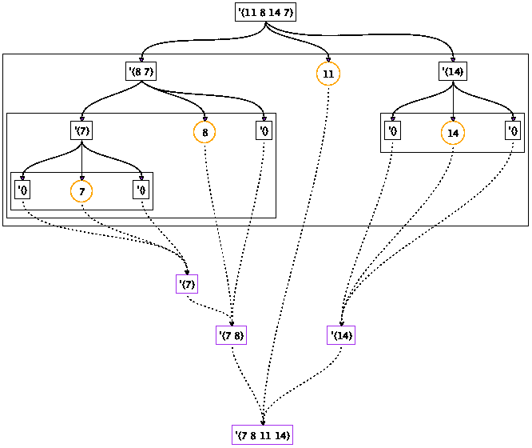
> > > 
> 图 148：快速排序算法的图形说明

要理解快速排序算法的工作原理，让我们通过一个例子来演示，快速排序([列表](http://docs.racket-lang.org/htdp-langs/intermediate-lam.html#%28def._htdp-intermediate-lambda._%28%28lib._lang%2Fhtdp-intermediate-lambda..rkt%29._list%29%29) 11 8 14 7)。图 148 以图形方式展示了这个过程。该图由上半部分，划分阶段，和下半部分，征服阶段组成。

划分阶段用方框和实线箭头表示。每个方框列表从每个方框中延伸出三条箭头，指向一个有三个部分的方框：中间的圆圈枢轴元素，左侧是小于枢轴元素的方框列表，右侧是大于枢轴元素的方框列表。这些步骤中的每一个都至少隔离出一个数作为枢轴，这意味着相邻的两个列表比给定的列表短。因此，整个过程也会终止。

考虑第一步，输入为([列表](http://docs.racket-lang.org/htdp-langs/intermediate-lam.html#%28def._htdp-intermediate-lambda._%28%28lib._lang%2Fhtdp-intermediate-lambda..rkt%29._list%29%29)  11  8  14  7)。枢轴项是 11。将列表分为大于 11 和小于 11 的项，产生([列表](http://docs.racket-lang.org/htdp-langs/intermediate-lam.html#%28def._htdp-intermediate-lambda._%28%28lib._lang%2Fhtdp-intermediate-lambda..rkt%29._list%29%29)  8  7)和([列表](http://docs.racket-lang.org/htdp-langs/intermediate-lam.html#%28def._htdp-intermediate-lambda._%28%28lib._lang%2Fhtdp-intermediate-lambda..rkt%29._list%29%29)  14)。分区阶段的剩余步骤以类似的方式工作。分区结束时，所有数字都已作为枢轴元素隔离。此时，您已经可以通过从左到右读取枢轴来读取最终结果。

控制阶段用虚线箭头和框列表表示。每个结果框中进入三条箭头：中间的一条来自枢轴，左边的一条来自对较小数字进行排序的框式结果，右边的一条来自对较大数字进行排序的框式结果。每一步至少将一个数字添加到结果列表中，即枢轴，这意味着列表向图的下部增长。底部的框是顶部给定列表的排序变体。

看看最左上角的征服步骤。它将枢轴 7 与两个空列表组合，得到'(7)。下一个对应的是隔离 8 的分区步骤，因此产生'(7  8)。征服阶段的每一级都对应于分区阶段的相应级别。毕竟，整个过程是递归的。

练习 424。为([列表](http://docs.racket-lang.org/htdp-langs/intermediate-lam.html#%28def._htdp-intermediate-lambda._%28%28lib._lang%2Fhtdp-intermediate-lambda..rkt%29._list%29%29)  11  9  2  18  12  14  4  1))绘制一个类似于图 148 的快速排序图。

现在我们已经很好地理解了快速排序的想法，我们可以将其翻译成 ISL+。显然，quick-sort<区分两种情况。如果输入是'()，它产生'()，因为此列表已经排序；否则，它执行生成性递归。这种情况划分暗示了以下[cond](http://docs.racket-lang.org/htdp-langs/intermediate-lam.html#%28form._%28%28lib._lang%2Fhtdp-intermediate-lambda..rkt%29._cond%29%29)表达式：

> | ; [List-of  Number] -> [List-of  Number] |
> | --- |
> | ; produces a sorted version of alon |
> | ([define](http://docs.racket-lang.org/htdp-langs/intermediate-lam.html#%28form._%28%28lib._lang%2Fhtdp-intermediate-lambda..rkt%29._define%29%29) (quick-sort< alon) |
> |   ([cond](http://docs.racket-lang.org/htdp-langs/intermediate-lam.html#%28form._%28%28lib._lang%2Fhtdp-intermediate-lambda..rkt%29._cond%29%29) |
> |   [[empty?](http://docs.racket-lang.org/htdp-langs/intermediate-lam.html#%28def._htdp-intermediate-lambda._%28%28lib._lang%2Fhtdp-intermediate-lambda..rkt%29._empty~3f%29%29) alon] '() |
> |   [[else](http://docs.racket-lang.org/htdp-langs/intermediate-lam.html#%28form._%28%28lib._lang%2Fhtdp-intermediate-lambda..rkt%29._else%29%29) [...](http://docs.racket-lang.org/htdp-langs/intermediate-lam.html#%28form._%28%28lib._lang%2Fhtdp-intermediate-lambda..rkt%29._......%29%29)])) |

第一个情况下的答案已经给出。对于第二个情况，当快速排序的输入是一个非空列表时，算法使用第一个元素将列表的其余部分划分为两个子列表：一个包含所有小于枢轴元素的元素列表，另一个包含所有大于枢轴元素的元素列表。

由于列表的其余部分的大小未知，我们将将列表划分为两个子列表的任务留给两个辅助函数：smallers 和 largers。它们处理列表并过滤出小于和大于枢轴的元素。因此，每个辅助函数接受两个参数，即数字列表和一个数字。设计这两个函数是结构递归练习。自己尝试或阅读图 149 中显示的定义。

> > > |   ; [List-of  Number] -> [List-of  Number] |
> > > | --- |
> > > |   ; 生成 alon 的排序版本 |
> > > |   ; 假设所有的数字都是不同的 |
> > > |   ([define](http://docs.racket-lang.org/htdp-langs/intermediate-lam.html#%28form._%28%28lib._lang%2Fhtdp-intermediate-lambda..rkt%29._define%29%29) (quick-sort< alon) |
> > > |   ([cond](http://docs.racket-lang.org/htdp-langs/intermediate-lam.html#%28form._%28%28lib._lang%2Fhtdp-intermediate-lambda..rkt%29._cond%29%29) |
> > > |   [[empty?](http://docs.racket-lang.org/htdp-langs/intermediate-lam.html#%28def._htdp-intermediate-lambda._%28%28lib._lang%2Fhtdp-intermediate-lambda..rkt%29._empty~3f%29%29) alon] '() |
> > > |   [[else](http://docs.racket-lang.org/htdp-langs/intermediate-lam.html#%28form._%28%28lib._lang%2Fhtdp-intermediate-lambda..rkt%29._else%29%29) ([local](http://docs.racket-lang.org/htdp-langs/intermediate-lam.html#%28form._%28%28lib._lang%2Fhtdp-intermediate-lambda..rkt%29._local%29%29) (([define](http://docs.racket-lang.org/htdp-langs/intermediate-lam.html#%28form._%28%28lib._lang%2Fhtdp-intermediate-lambda..rkt%29._define%29%29) pivot ([first](http://docs.racket-lang.org/htdp-langs/intermediate-lam.html#%28def._htdp-intermediate-lambda._%28%28lib._lang%2Fhtdp-intermediate-lambda..rkt%29._first%29%29) alon))) |
> > > |             ([append](http://docs.racket-lang.org/htdp-langs/intermediate-lam.html#%28def._htdp-intermediate-lambda._%28%28lib._lang%2Fhtdp-intermediate-lambda..rkt%29._append%29%29) (快速排序< (小于 alon 枢轴)) |
> > > |                     ([list](http://docs.racket-lang.org/htdp-langs/intermediate-lam.html#%28def._htdp-intermediate-lambda._%28%28lib._lang%2Fhtdp-intermediate-lambda..rkt%29._list%29%29) 枢轴) |
> > > |                     (快速排序< (大于 alon 枢轴))))])) |
> > > |   |
> > > | ; [列表  数字] 数字 -> [列表  数字] |
> > > | ([define](http://docs.racket-lang.org/htdp-langs/intermediate-lam.html#%28form._%28%28lib._lang%2Fhtdp-intermediate-lambda..rkt%29._define%29%29) (大于 alon n) |
> > > |   ([cond](http://docs.racket-lang.org/htdp-langs/intermediate-lam.html#%28form._%28%28lib._lang%2Fhtdp-intermediate-lambda..rkt%29._cond%29%29) |
> > > |     [([empty?](http://docs.racket-lang.org/htdp-langs/intermediate-lam.html#%28def._htdp-intermediate-lambda._%28%28lib._lang%2Fhtdp-intermediate-lambda..rkt%29._empty~3f%29%29) alon) '()] |
> > > |     [[else](http://docs.racket-lang.org/htdp-langs/intermediate-lam.html#%28form._%28%28lib._lang%2Fhtdp-intermediate-lambda..rkt%29._else%29%29) ([if](http://docs.racket-lang.org/htdp-langs/intermediate-lam.html#%28form._%28%28lib._lang%2Fhtdp-intermediate-lambda..rkt%29._if%29%29) ([>](http://docs.racket-lang.org/htdp-langs/intermediate-lam.html#%28def._htdp-intermediate-lambda._%28%28lib._lang%2Fhtdp-intermediate-lambda..rkt%29._~3e%29%29) ([first](http://docs.racket-lang.org/htdp-langs/intermediate-lam.html#%28def._htdp-intermediate-lambda._%28%28lib._lang%2Fhtdp-intermediate-lambda..rkt%29._first%29%29) alon) n) |
> > > |               ([cons](http://docs.racket-lang.org/htdp-langs/intermediate-lam.html#%28def._htdp-intermediate-lambda._%28%28lib._lang%2Fhtdp-intermediate-lambda..rkt%29._cons%29%29) ([first](http://docs.racket-lang.org/htdp-langs/intermediate-lam.html#%28def._htdp-intermediate-lambda._%28%28lib._lang%2Fhtdp-intermediate-lambda..rkt%29._first%29%29) alon) (大于 ([rest](http://docs.racket-lang.org/htdp-langs/intermediate-lam.html#%28def._htdp-intermediate-lambda._%28%28lib._lang%2Fhtdp-intermediate-lambda..rkt%29._rest%29%29) alon) n)) |
> > > |               (大于 ([rest](http://docs.racket-lang.org/htdp-langs/intermediate-lam.html#%28def._htdp-intermediate-lambda._%28%28lib._lang%2Fhtdp-intermediate-lambda..rkt%29._rest%29%29) alon) n))])) |
> > > |   |
> > > | ; [列表  数字] 数字 -> [列表  数字] |
> > > | ([define](http://docs.racket-lang.org/htdp-langs/intermediate-lam.html#%28form._%28%28lib._lang%2Fhtdp-intermediate-lambda..rkt%29._define%29%29) (smallers alon n) |
> > > | （[cond](http://docs.racket-lang.org/htdp-langs/intermediate-lam.html#%28form._%28%28lib._lang%2Fhtdp-intermediate-lambda..rkt%29._cond%29%29)） |
> > > | （[([empty?](http://docs.racket-lang.org/htdp-langs/intermediate-lam.html#%28def._htdp-intermediate-lambda._%28%28lib._lang%2Fhtdp-intermediate-lambda..rkt%29._empty~3f%29%29) alon) '()]） |
> > > | （[[else](http://docs.racket-lang.org/htdp-langs/intermediate-lam.html#%28form._%28%28lib._lang%2Fhtdp-intermediate-lambda..rkt%29._else%29%29) ([if](http://docs.racket-lang.org/htdp-langs/intermediate-lam.html#%28form._%28%28lib._lang%2Fhtdp-intermediate-lambda..rkt%29._if%29%29) ([<](http://docs.racket-lang.org/htdp-langs/intermediate-lam.html#%28def._htdp-intermediate-lambda._%28%28lib._lang%2Fhtdp-intermediate-lambda..rkt%29._~3c%29%29) ([first](http://docs.racket-lang.org/htdp-langs/intermediate-lam.html#%28def._htdp-intermediate-lambda._%28%28lib._lang%2Fhtdp-intermediate-lambda..rkt%29._first%29%29) alon) n) |
> > > | （[cons](http://docs.racket-lang.org/htdp-langs/intermediate-lam.html#%28def._htdp-intermediate-lambda._%28%28lib._lang%2Fhtdp-intermediate-lambda..rkt%29._cons%29%29) ([first](http://docs.racket-lang.org/htdp-langs/intermediate-lam.html#%28def._htdp-intermediate-lambda._%28%28lib._lang%2Fhtdp-intermediate-lambda..rkt%29._first%29%29) alon) ([smallers](http://docs.racket-lang.org/htdp-langs/intermediate-lam.html#%28def._htdp-intermediate-lambda._%28%28lib._lang%2Fhtdp-intermediate-lambda..rkt%29._smallers%29%29) ([rest](http://docs.racket-lang.org/htdp-langs/intermediate-lam.html#%28def._htdp-intermediate-lambda._%28%28lib._lang%2Fhtdp-intermediate-lambda..rkt%29._rest%29%29) alon) n))） |
> > > | （小者([rest](http://docs.racket-lang.org/htdp-langs/intermediate-lam.html#%28def._htdp-intermediate-lambda._%28%28lib._lang%2Fhtdp-intermediate-lambda..rkt%29._rest%29%29%29) alon) n))） |
> > > 
> 图 149：快速排序算法

每个这些列表都是分别使用快速排序<进行排序的，这暗示了递归的使用，具体如下两个表达式：

1.  (quick-sort<  (smallers  alon  pivot)), which sorts the list of items smaller than the pivot; and

1.  (quick-sort< (largers alon pivot)), which sorts the list of items larger than the pivot.

一旦 quick-sort<获得了两个列表的排序版本，它必须以正确的顺序合并这两个列表和枢轴：首先是所有小于枢轴的项目，然后是枢轴，最后是所有大于枢轴的项目。由于第一个和最后一个列表已经排序，quick-sort<可以简单地使用[append](http://docs.racket-lang.org/htdp-langs/intermediate-lam.html#%28def._htdp-intermediate-lambda._%28%28lib._lang%2Fhtdp-intermediate-lambda..rkt%29._append%29%29)：

> | ([append](http://docs.racket-lang.org/htdp-langs/intermediate-lam.html#%28def._htdp-intermediate-lambda._%28%28lib._lang%2Fhtdp-intermediate-lambda..rkt%29._append%29%29) (quick-sort< (smallers alon pivot)) |
> | --- |
> |     ([列表](http://docs.racket-lang.org/htdp-langs/intermediate-lam.html#%28def._htdp-intermediate-lambda._%28%28lib._lang%2Fhtdp-intermediate-lambda..rkt%29._list%29%29) ([第一个](http://docs.racket-lang.org/htdp-langs/intermediate-lam.html#%28def._htdp-intermediate-lambda._%28%28lib._lang%2Fhtdp-intermediate-lambda..rkt%29._first%29%29) alon))) |
> |     (快速排序< (largers alon pivot))) |

图 149 包含了完整的程序；在继续之前请先阅读它。现在我们有了实际的功能定义，我们可以手动评估上面的例子：

> | (快速排序< ([列表](http://docs.racket-lang.org/htdp-langs/intermediate-lam.html#%28def._htdp-intermediate-lambda._%28%28lib._lang%2Fhtdp-intermediate-lambda..rkt%29._list%29%29) 11 8 14 7)) |
> | --- |
> | == |
> | ([追加](http://docs.racket-lang.org/htdp-langs/intermediate-lam.html#%28def._htdp-intermediate-lambda._%28%28lib._lang%2Fhtdp-intermediate-lambda..rkt%29._append%29%29) （快速排序< ([列表](http://docs.racket-lang.org/htdp-langs/intermediate-lam.html#%28def._htdp-intermediate-lambda._%28%28lib._lang%2Fhtdp-intermediate-lambda..rkt%29._list%29%29) 8 7)） |
> | （[列表](http://docs.racket-lang.org/htdp-langs/intermediate-lam.html#%28def._htdp-intermediate-lambda._%28%28lib._lang%2Fhtdp-intermediate-lambda..rkt%29._list%29%29%29) 11） |
> |     (快速排序< ([列表](http://docs.racket-lang.org/htdp-langs/intermediate-lam.html#%28def._htdp-intermediate-lambda._%28%28lib._lang%2Fhtdp-intermediate-lambda..rkt%29._list%29%29) 14))) |
> | == |
> | ([追加](http://docs.racket-lang.org/htdp-langs/intermediate-lam.html#%28def._htdp-intermediate-lambda._%28%28lib._lang%2Fhtdp-intermediate-lambda..rkt%29._append%29%29) ([追加](http://docs.racket-lang.org/htdp-langs/intermediate-lam.html#%28def._htdp-intermediate-lambda._%28%28lib._lang%2Fhtdp-intermediate-lambda..rkt%29._append%29%29) (快速排序< ([列表](http://docs.racket-lang.org/htdp-langs/intermediate-lam.html#%28def._htdp-intermediate-lambda._%28%28lib._lang%2Fhtdp-intermediate-lambda..rkt%29._list%29%29) 7)) |
> |     ([列表](http://docs.racket-lang.org/htdp-langs/intermediate-lam.html#%28def._htdp-intermediate-lambda._%28%28lib._lang%2Fhtdp-intermediate-lambda..rkt%29._list%29%29) 8) |
> |     (快速排序< '())) |
> |     ([列表](http://docs.racket-lang.org/htdp-langs/intermediate-lam.html#%28def._htdp-intermediate-lambda._%28%28lib._lang%2Fhtdp-intermediate-lambda..rkt%29._list%29%29) 11) |
> |     (快速排序< ([列表](http://docs.racket-lang.org/htdp-langs/intermediate-lam.html#%28def._htdp-intermediate-lambda._%28%28lib._lang%2Fhtdp-intermediate-lambda..rkt%29._list%29%29) 14))) |
> | == |
> | ([附加](http://docs.racket-lang.org/htdp-langs/intermediate-lam.html#%28def._htdp-intermediate-lambda._%28%28lib._lang%2Fhtdp-intermediate-lambda..rkt%29._append%29%29) ([附加](http://docs.racket-lang.org/htdp-langs/intermediate-lam.html#%28def._htdp-intermediate-lambda._%28%28lib._lang%2Fhtdp-intermediate-lambda..rkt%29._append%29%29) ([附加](http://docs.racket-lang.org/htdp-langs/intermediate-lam.html#%28def._htdp-intermediate-lambda._%28%28lib._lang%2Fhtdp-intermediate-lambda..rkt%29._append%29%29) (快速排序< '()) |
> | |                       ([列表](http://docs.racket-lang.org/htdp-langs/intermediate-lam.html#%28def._htdp-intermediate-lambda._%28%28lib._lang%2Fhtdp-intermediate-lambda..rkt%29._list%29%29) 7) |
> | |                       (快速排序< '())) |
> | |               ([列表](http://docs.racket-lang.org/htdp-langs/intermediate-lam.html#%28def._htdp-intermediate-lambda._%28%28lib._lang%2Fhtdp-intermediate-lambda..rkt%29._list%29%29) 8) |
> | |               (快速排序< '())) |
> | |       ([列表](http://docs.racket-lang.org/htdp-langs/intermediate-lam.html#%28def._htdp-intermediate-lambda._%28%28lib._lang%2Fhtdp-intermediate-lambda..rkt%29._list%29%29) 11) |
> | |       (快速排序< ([列表](http://docs.racket-lang.org/htdp-langs/intermediate-lam.html#%28def._htdp-intermediate-lambda._%28%28lib._lang%2Fhtdp-intermediate-lambda..rkt%29._list%29%29) 14))) |
> | == |
> | ([附加](http://docs.racket-lang.org/htdp-langs/intermediate-lam.html#%28def._htdp-intermediate-lambda._%28%28lib._lang%2Fhtdp-intermediate-lambda..rkt%29._append%29%29) ([附加](http://docs.racket-lang.org/htdp-langs/intermediate-lam.html#%28def._htdp-intermediate-lambda._%28%28lib._lang%2Fhtdp-intermediate-lambda..rkt%29._append%29%29) ([附加](http://docs.racket-lang.org/htdp-langs/intermediate-lam.html#%28def._htdp-intermediate-lambda._%28%28lib._lang%2Fhtdp-intermediate-lambda..rkt%29._append%29%29) '() |
> | |                        ([列表](http://docs.racket-lang.org/htdp-langs/intermediate-lam.html#%28def._htdp-intermediate-lambda._%28%28lib._lang%2Fhtdp-intermediate-lambda..rkt%29._list%29%29) 7) |
> | |                       '()) |
> | |               ([列表](http://docs.racket-lang.org/htdp-langs/intermediate-lam.html#%28def._htdp-intermediate-lambda._%28%28lib._lang%2Fhtdp-intermediate-lambda..rkt%29._list%29%29) 8) |
> | |               '()) |
> | |       ([列表](http://docs.racket-lang.org/htdp-langs/intermediate-lam.html#%28def._htdp-intermediate-lambda._%28%28lib._lang%2Fhtdp-intermediate-lambda..rkt%29._list%29%29) 11) |
> | |       (快速排序< ([列表](http://docs.racket-lang.org/htdp-langs/intermediate-lam.html#%28def._htdp-intermediate-lambda._%28%28lib._lang%2Fhtdp-intermediate-lambda..rkt%29._list%29%29) 14))) |
> | == |
> | ([append](http://docs.racket-lang.org/htdp-langs/intermediate-lam.html#%28def._htdp-intermediate-lambda._%28%28lib._lang%2Fhtdp-intermediate-lambda..rkt%29._append%29%29) ([append](http://docs.racket-lang.org/htdp-langs/intermediate-lam.html#%28def._htdp-intermediate-lambda._%28%28lib._lang%2Fhtdp-intermediate-lambda..rkt%29._append%29%29) ([list](http://docs.racket-lang.org/htdp-langs/intermediate-lam.html#%28def._htdp-intermediate-lambda._%28%28lib._lang%2Fhtdp-intermediate-lambda..rkt%29._list%29%29) 7) |
> |                 ([list](http://docs.racket-lang.org/htdp-langs/intermediate-lam.html#%28def._htdp-intermediate-lambda._%28%28lib._lang%2Fhtdp-intermediate-lambda..rkt%29._list%29%29) 8) |
> |                 '()) |
> |         ([list](http://docs.racket-lang.org/htdp-langs/intermediate-lam.html#%28def._htdp-intermediate-lambda._%28%28lib._lang%2Fhtdp-intermediate-lambda..rkt%29._list%29%29) 11) |
> |         (quick-sort< ([list](http://docs.racket-lang.org/htdp-langs/intermediate-lam.html#%28def._htdp-intermediate-lambda._%28%28lib._lang%2Fhtdp-intermediate-lambda..rkt%29._list%29%29) 14))) |
> | [...](http://docs.racket-lang.org/htdp-langs/intermediate-lam.html#%28form._%28%28lib._lang%2Fhtdp-intermediate-lambda..rkt%29._......%29%29) |

计算显示了排序过程的基本步骤，即分区步骤、递归排序步骤和三个部分的连接。从这个计算中，很容易看出 quick-sort< 如何实现 图 148 中展示的过程。

两者 图 148 和计算都显示了 quick-sort< 完全忽略了给定列表的结构。第一次递归处理原始给定列表中的两个远离的数字，第二次递归处理列表的第三项。这些递归不是随机的，但它们确实不是依赖于数据定义的结构。

将 quick-sort< 的组织结构与 设计组合 中的 sort 函数进行比较。后者的设计遵循结构化设计食谱，生成一个逐个处理列表项的程序。通过分割列表，quick-sort< 可以加快排序列表的过程，尽管代价是不使用普通的 [first](http://docs.racket-lang.org/htdp-langs/intermediate-lam.html#%28def._htdp-intermediate-lambda._%28%28lib._lang%2Fhtdp-intermediate-lambda..rkt%29._first%29%29) 和 [rest](http://docs.racket-lang.org/htdp-langs/intermediate-lam.html#%28def._htdp-intermediate-lambda._%28%28lib._lang%2Fhtdp-intermediate-lambda..rkt%29._rest%29%29)。

练习 425：为 图 149 中的较小和较大部分阐述目的陈述。

练习 426. 完成上述的手动评估。仔细检查评估结果，可以发现 quick-sort< 算法的一个额外简单情况。每当 quick-sort< 算法处理一个只有一个元素的列表时，它就原样返回该列表。毕竟，只有一个元素的列表的排序版本就是列表本身。

修改 quick-sort< 算法以利用这一观察结果。再次评估示例。改进后的算法节省了多少步骤？

练习 427. 虽然 quick-sort< 算法在许多情况下可以快速减少问题的大小，但对于小问题来说，它的速度不合适。因此，当列表足够小的时候，人们使用 quick-sort< 算法来减少问题的大小，并切换到不同的排序函数。

如果输入的长度低于某个阈值，开发一个 quick-sort< 算法的版本，该版本使用 sort<（来自 辅助递归函数 的适当调整版本）。

练习 428. 如果 quick-sort< 算法的输入包含相同数量的元素，该算法返回的列表将严格短于输入列表。为什么？修复这个问题，以便输出列表的长度与输入列表相同。

练习 429. 使用 [filter](http://docs.racket-lang.org/htdp-langs/intermediate-lam.html#%28def._htdp-intermediate-lambda._%28%28lib._lang%2Fhtdp-intermediate-lambda..rkt%29._filter%29%29) 定义 smallers 和 largers。

练习 430. 开发一个 quick-sort< 算法的变体，该变体只使用一个比较函数，例如，[<](http://docs.racket-lang.org/htdp-langs/intermediate-lam.html#%28def._htdp-intermediate-lambda._%28%28lib._lang%2Fhtdp-intermediate-lambda..rkt%29._~3c%29%29)。它的分区步骤将给定的列表 alon 分割成一个包含小于枢轴的元素的列表，以及另一个包含不小于枢轴的元素的列表。

使用 [local](http://docs.racket-lang.org/htdp-langs/intermediate-lam.html#%28form._%28%28lib._lang%2Fhtdp-intermediate-lambda..rkt%29._local%29%29) 将程序打包成一个单一函数。抽象这个函数，使其接受一个列表和一个比较函数。

### 26 设计算法🔗 "链接到此处")

本部分概述已经解释说，生成递归函数的设计比结构设计更随意。正如第一章所示，两个生成递归在处理函数的方式上可能会有根本性的差异。两者都处理列表，但前者至少尊重给定列表的顺序，而后者可以随意重新排列其给定列表。问题是是否有一个单一的设计配方可以帮助创建这样广泛不同的函数。

第一部分展示了如何将设计食谱的过程维度适应生成递归。第二部分聚焦于另一个新现象：一个算法可能无法为其某些输入生成答案。因此，程序员必须分析他们的程序，并在设计信息中添加关于终止的注释。其余部分对比了结构和生成递归。

#### 26.1 适应设计食谱🔗 "链接至此")

让我们根据前一章中的示例来检查我们结构设计食谱的六个一般步骤：

+   如前所述，我们必须将问题信息表示为我们选择的编程语言中的数据。对于问题的数据表示的选择会影响我们对计算过程的思考，因此需要提前做一些规划。或者，准备好回溯并探索不同的数据表示。无论如何，我们必须分析问题信息并定义数据集合。

+   我们还需要一个签名、一个函数头和一个目的说明。由于生成步骤与数据定义的结构无关，目的说明必须超出函数计算的内容，还要解释函数是如何计算其结果的。

+   使用函数示例解释“如何”，就像我们在上一章中解释捆绑和快速排序<那样，是有用的。也就是说，在结构世界中，函数示例仅指定函数对于哪个输入应该产生哪个输出，而在生成递归的世界中，示例的目的是解释计算过程背后的基本思想。

    对于捆绑，示例指定了函数在一般情况和某些边界情况下的行为。对于快速排序<，图 148 中的示例说明了函数如何根据枢轴项对给定的列表进行分区。通过将这些工作示例添加到目的说明中，我们——<wbr>作为设计者——<wbr>对所需过程有了更深入的理解，并将这种理解传达给未来阅读此代码的读者。

+   我们的讨论提出了一种算法的一般模板。大致来说，算法的设计区分了两种类型的问题：那些可以轻易解决的问题和那些不能轻易解决的问题。“轻易”在这里是一个技术术语。如果给定的问题可以轻易解决，算法将产生匹配的解决方案。例如，对空列表或单元素列表进行排序的问题是轻易可解决的。包含许多元素的列表是一个非轻易解决的问题。对于这些非轻易解决的问题，算法通常生成与给定问题相同类型的新问题，递归地解决这些问题，并将解决方案组合成一个整体解决方案。

    基于此草图，所有算法大致具有以下组织结构：

    > | ([define](http://docs.racket-lang.org/htdp-langs/intermediate-lam.html#%28form._%28%28lib._lang%2Fhtdp-intermediate-lambda..rkt%29._define%29%29) (generative-recursive-fun problem) |
    > | --- |
    > |   ([cond](http://docs.racket-lang.org/htdp-langs/intermediate-lam.html#%28form._%28%28lib._lang%2Fhtdp-intermediate-lambda..rkt%29._cond%29%29) |
    > |     [(trivially-solvable? problem) |
    > |      (determine-solution problem)] |
    > |     [[else](http://docs.racket-lang.org/htdp-langs/intermediate-lam.html#%28form._%28%28lib._lang%2Fhtdp-intermediate-lambda..rkt%29._else%29%29) |
    > |      (combine-solutions |
    > |        [...](http://docs.racket-lang.org/htdp-langs/intermediate-lam.html#%28form._%28%28lib._lang%2Fhtdp-intermediate-lambda..rkt%29._......%29%29) 问题 [...](http://docs.racket-lang.org/htdp-langs/intermediate-lam.html#%28form._%28%28lib._lang%2Fhtdp-intermediate-lambda..rkt%29._......%29%29) |
    > |        (generative-recursive-fun |
    > |          (generate-problem-1 problem)) |
    > |        [...](http://docs.racket-lang.org/htdp-langs/intermediate-lam.html#%28form._%28%28lib._lang%2Fhtdp-intermediate-lambda..rkt%29._......%29%29) |
    > |        (generative-recursive-fun |
    > |          (generate-problem-n problem)))])) |

    原始问题有时需要结合新生成问题的解决方案，这就是为什么它被交给组合解决方案。

+   这个模板只是一个启发性的蓝图，而不是一个确定的形状。模板的每一部分都是为了提醒我们思考以下四个问题：

    +   什么是简单可解问题？

    +   如何解决简单问题？

    +   算法如何生成比原始问题更容易解决的问题？我们生成的是一个新问题，还是有多个？

    +   给定问题的解决方案是否与（一个）新问题的解决方案相同？或者，我们需要组合解决方案来为原始问题创建解决方案？如果是这样，我们是否需要原始问题数据中的任何内容？

    为了将算法定义为函数，我们必须将这些四个问题的答案表达为关于所选数据表示的函数和表达式。

    对于这一步骤，从使用自引用数据定义进行设计中得到的表格驱动尝试可能再次有所帮助。重新考虑忽略结构的递归中的快速排序示例。快速排序的核心思想是将给定的列表分成一个较小的元素列表和一个较大的元素列表，并分别对它们进行排序。图 150 说明了某些简单的数值示例在非平凡情况下的工作原理。从这些示例中可以很容易地猜测，第四个问题的答案是附加排序后的较小数字列表、枢轴数字和排序后的较大数字列表，这可以很容易地转换为代码。

+   函数完成后，就是时候对其进行测试了。和之前一样，测试的目的是发现和消除错误。

> > > | alon |  | pivot |  | sorted, smaller |  | sorted, larger |  | expected |
> > > | --- | --- | --- | --- | --- | --- | --- | --- | --- |
> > > | '(2  3  1  4) |  | 2 |  | '(1) |  | '(3  4) |  | '(1  2  3  4) |
> > > | '(2  0  1  4) |  | 2 |  | '(0  1) |  | '(4) |  | '(0  1  2  4) |
> > > | '(3  0  1  4) |  | 3 |  | '(0  1) |  | '(4) |  | '(0  1  3  4) |
> > > 
> 图 150：基于表的组合解决方案的猜测方法

练习 431。回答 bundle 问题中的四个关键问题以及 quick-sort<问题中的前三个问题。需要多少个 generate-problem 实例？

练习 432。 练习 219 介绍了函数 food-create，它消耗一个 Posn 并产生一个随机选择的 Posn，保证它与给定的不同。首先将两个函数作为一个单独的定义重新表述，使用[local](http://docs.racket-lang.org/htdp-langs/intermediate-lam.html#%28form._%28%28lib._lang%2Fhtdp-intermediate-lambda..rkt%29._local%29%29)；然后证明 food-create 的设计是合理的。

#### 26.2 终止性🔗 "链接至此")

生成递归为计算添加了一个全新的方面：非终止性。例如，函数 bundle 可能对于某些输入永远不会产生一个值或报告一个错误。练习 421 询问了(bundle '("a" "b" "c") 0)的结果，以下是为什么它没有结果的原因解释：

> | (bundle '("a" "b" "c") 0) |
> | --- |
> | == |
> | ([cons](http://docs.racket-lang.org/htdp-langs/intermediate-lam.html#%28def._htdp-intermediate-lambda._%28%28lib._lang%2Fhtdp-intermediate-lambda..rkt%29._cons%29%29) ([implode](http://docs.racket-lang.org/htdp-langs/intermediate-lam.html#%28def._htdp-intermediate-lambda._%28%28lib._lang%2Fhtdp-intermediate-lambda..rkt%29._implode%29%29) (take  '("a" "b" "c") 0)) |
> |       (bundle (drop  '("a" "b" "c") 0) 0)) |
> | == |
> | ([cons](http://docs.racket-lang.org/htdp-langs/intermediate-lam.html#%28def._htdp-intermediate-lambda._%28%28lib._lang%2Fhtdp-intermediate-lambda..rkt%29._cons%29%29) ([implode](http://docs.racket-lang.org/htdp-langs/intermediate-lam.html#%28def._htdp-intermediate-lambda._%28%28lib._lang%2Fhtdp-intermediate-lambda..rkt%29._implode%29%29) '()) |
> |        (bundle (drop  '("a" "b" "c") 0) 0)) |
> | == ([cons](http://docs.racket-lang.org/htdp-langs/intermediate-lam.html#%28def._htdp-intermediate-lambda._%28%28lib._lang%2Fhtdp-intermediate-lambda..rkt%29._cons%29%29) "" (bundle (drop  '("a" "b" "c") 0) 0)) |
> | == ([cons](http://docs.racket-lang.org/htdp-langs/intermediate-lam.html#%28def._htdp-intermediate-lambda._%28%28lib._lang%2Fhtdp-intermediate-lambda..rkt%29._cons%29%29) "" (bundle  '("a" "b" "c")  0)) |

计算显示了评估`(bundle '("a" "b" "c") 0)`需要对该表达式有结果。在 ISL+的上下文中，这意味着评估不会停止。计算机科学家说，当第二个参数为 0 时，bundle 不会终止；他们还说该函数循环或计算陷入无限循环。

将这一见解与第一部分中提出的方案进行对比。根据方案设计的每个函数要么为每个输入生成答案，要么产生错误信号。毕竟，方案规定每个自然递归消耗的是输入的一个直接部分，而不是输入本身。因为数据是以分层方式构建的，所以输入在每一阶段都会缩小。最终，函数被应用于一个原子数据部分，递归停止。

这个提醒还解释了为什么生成递归函数可能会发散。根据生成递归的设计方案，一个算法可能生成新的问题而没有任何限制。如果设计方案要求保证新问题“小于”给定问题，它就会终止。计算理论实际上表明我们最终必须取消这些限制。但是，对像 bundle 这样的函数的设计施加这种限制是不必要的，会使设计复杂化。

因此，在这本书中，我们基本上保留了设计方案的前六步，并补充了第七步：终止论证。图 151 展示了生成递归设计方案的第一部分，图 152 展示了第二部分。它们以传统的表格形式展示了设计方案。未修改的步骤在活动栏中带有破折号。其他步骤带有关于生成递归设计方案与结构递归设计方案的差异的注释。图 152 中的最后一行是完全新的。

终止论证有两种形式。第一种论证为什么每个递归调用都在一个比给定问题更小的问题上工作。通常这种论证很简单；在罕见的情况下，你可能需要与数学家合作来证明这类论证的定理。第二种类型通过例子说明函数可能不会终止。你不能为这类函数定义一个谓词；否则你可以修改函数并确保它总是终止。理想情况下，它还应描述函数可能无限循环的数据类。在罕见的情况下，你可能无法提出任何一种论证，因为计算机科学还了解得不够。

> > > > | 步骤 |  | 结果 |  | 活动 |
> > > > | --- | --- | --- | --- | --- |
> > > > | 问题分析 |  | 数据表示和定义 |  | —<wbr> |
> > > > | 标题 |  | 关于函数“如何”的目的声明 |  | 用一行话补充函数计算结果的解释 |
> > > > | 示例 |  | 示例和测试 |  | 通过几个示例来探讨“如何” |
> > > > | 模板 |  | 固定模板 |  | —<wbr> |
> > > > 
> 图 151：设计算法（第一部分）
> 
> > > > | 步骤 |  | 结果 |  | 活动 |
> > > > | --- | --- | --- | --- | --- |
> > > > | 定义 |  | 完整的函数定义 |  | 为简单可解问题制定条件；为这些简单情况制定答案；确定如何为非简单问题生成新问题，可能使用辅助函数；确定如何将生成问题的解决方案组合为给定问题的解决方案 |
> > > > | 测试 |  | 发现错误 |  | —<wbr> |
> > > > | 终止 |  | (1) 每次递归调用的大小参数或 (2) 终止异常的示例 |  | 调查每个递归数据的问题数据是否小于给定数据；找到导致函数循环的示例 |
> > > > 
> 图 152：设计算法（第二部分）

让我们通过示例来说明两种终止论证。对于打包函数，只需警告读者关于块大小为 0 的情况：

> | ; [List-of  1String] N -> [List-of  String] |
> | --- |
> | 将 s 的子序列打包成长度为 n 的字符串 |
> | ; 终止  (bundle  s  0) 除非 s 是 '() |
> | ([define](http://docs.racket-lang.org/htdp-langs/intermediate-lam.html#%28form._%28%28lib._lang%2Fhtdp-intermediate-lambda..rkt%29._define%29%29) (bundle s n) [...](http://docs.racket-lang.org/htdp-langs/intermediate-lam.html#%28form._%28%28lib._lang%2Fhtdp-intermediate-lambda..rkt%29._......%29%29)) |

在这种情况下，可以定义一个谓词，精确地描述何时打包终止。对于 quick-sort<，关键观察是每个 quick-sort< 的递归使用都接收一个比 alon 短的列表：

> | ; [List-of  Number] -> [List-of  Number] |
> | --- |
> | ; 创建 alon 的排序变体 |
> | ; 快速排序的递归调用终止 |
> | ; 接收缺少枢轴项的列表 |
> | ([define](http://docs.racket-lang.org/htdp-langs/intermediate-lam.html#%28form._%28%28lib._lang%2Fhtdp-intermediate-lambda..rkt%29._define%29%29) (quick-sort< alon) [...](http://docs.racket-lang.org/htdp-langs/intermediate-lam.html#%28form._%28%28lib._lang%2Fhtdp-intermediate-lambda..rkt%29._......%29%29)) |

在一种情况下，列表由严格小于枢轴的数字组成；另一种情况是严格大于枢轴的数字。

练习 433。开发一个经过检查的 bundle 版本，确保对于所有输入都能终止。对于原始版本可能陷入循环的情况，它可能会发出错误信号。

练习 434。考虑以下 smallers 的定义，它是快速排序的“问题生成器”之一：

> | ; [List-of  Number] Number -> [List-of  Number] |
> | --- |
> | （[define](http://docs.racket-lang.org/htdp-langs/intermediate-lam.html#%28form._%28%28lib._lang%2Fhtdp-intermediate-lambda..rkt%29._define%29%29) (smallers l n)） |
> | （[cond](http://docs.racket-lang.org/htdp-langs/intermediate-lam.html#%28form._%28%28lib._lang%2Fhtdp-intermediate-lambda..rkt%29._cond%29%29)） |
> | （[([empty?](http://docs.racket-lang.org/htdp-langs/intermediate-lam.html#%28def._htdp-intermediate-lambda._%28%28lib._lang%2Fhtdp-intermediate-lambda..rkt%29._empty~3f%29%29) l) '()]） |
> | （[else](http://docs.racket-lang.org/htdp-langs/intermediate-lam.html#%28form._%28%28lib._lang%2Fhtdp-intermediate-lambda..rkt%29._else%29%29) ([if](http://docs.racket-lang.org/htdp-langs/intermediate-lam.html#%28form._%28%28lib._lang%2Fhtdp-intermediate-lambda..rkt%29._if%29%29) ([<=](http://docs.racket-lang.org/htdp-langs/intermediate-lam.html#%28def._htdp-intermediate-lambda._%28%28lib._lang%2Fhtdp-intermediate-lambda..rkt%29._~3c~3d%29%29) ([first](http://docs.racket-lang.org/htdp-langs/intermediate-lam.html#%28def._htdp-intermediate-lambda._%28%28lib._lang%2Fhtdp-intermediate-lambda..rkt%29._first%29%29) l) n)） |
> | （[cons](http://docs.racket-lang.org/htdp-langs/intermediate-lam.html#%28def._htdp-intermediate-lambda._%28%28lib._lang%2Fhtdp-intermediate-lambda..rkt%29._cons%29%29) ([first](http://docs.racket-lang.org/htdp-langs/intermediate-lam.html#%28def._htdp-intermediate-lambda._%28%28lib._lang%2Fhtdp-intermediate-lambda..rkt%29._first%29%29) l) ([smallers](http://docs.racket-lang.org/htdp-langs/intermediate-lam.html#%28def._htdp-intermediate-lambda._%28%28lib._lang%2Fhtdp-intermediate-lambda..rkt%29._smallers%29%29) ([rest](http://docs.racket-lang.org/htdp-langs/intermediate-lam.html#%28def._htdp-intermediate-lambda._%28%28lib._lang%2Fhtdp-intermediate-lambda..rkt%29._rest%29%29) l) n)） |
> | （较小的([rest](http://docs.racket-lang.org/htdp-langs/intermediate-lam.html#%28def._htdp-intermediate-lambda._%28%28lib._lang%2Fhtdp-intermediate-lambda..rkt%29._rest%29%29) l) n))） |

当使用忽略结构的递归中的 quick-sort<定义时，这个版本可能会出现什么问题？

练习 435。当你处理练习 430 或练习 428 时，你可能已经产生了循环解决方案。同样，练习 434 实际上揭示了 quick-sort<的终止性论证是多么脆弱。在所有情况下，论证依赖于较小的和较大的列表产生与给定列表最大长度相同的列表的想法，以及我们理解这两个列表都不包括给定的枢轴。

根据这个解释，修改 quick-sort<的定义，以便两个函数都接收比给定列表更短的列表。

练习 436。为 food-create 从练习 432 制定一个终止性论证。

#### 26.3 结构递归与生成递归🔗 "链接至此")

算法模板非常通用，以至于它包括结构递归函数。考虑图 153 的左侧。这个模板被专门化以处理一个平凡子句和一个生成步骤。如果我们用[empty?](http://docs.racket-lang.org/htdp-langs/intermediate-lam.html#%28def._htdp-intermediate-lambda._%28%28lib._lang%2Fhtdp-intermediate-lambda..rkt%29._empty~3f%29%29)替换 trivial?并用[rest](http://docs.racket-lang.org/htdp-langs/intermediate-lam.html#%28def._htdp-intermediate-lambda._%28%28lib._lang%2Fhtdp-intermediate-lambda..rkt%29._rest%29%29)生成，我们得到一个用于列表处理函数的模板；参见图 153 的右侧。

> > > |
> > > 
> > > &#124; ([define](http://docs.racket-lang.org/htdp-langs/intermediate-lam.html#%28form._%28%28lib._lang%2Fhtdp-intermediate-lambda..rkt%29._define%29%29) (general P) &#124;
> > > 
> > > &#124; ([cond](http://docs.racket-lang.org/htdp-langs/intermediate-lam.html#%28form._%28%28lib._lang%2Fhtdp-intermediate-lambda..rkt%29._cond%29%29) &#124;
> > > 
> > > &#124; (trivial? P) (solve P)] &#124;
> > > 
> > > &#124; ([else](http://docs.racket-lang.org/htdp-langs/intermediate-lam.html#%28form._%28%28lib._lang%2Fhtdp-intermediate-lambda..rkt%29._else%29%29) &#124;
> > > 
> > > &#124; (combine-solutions &#124;
> > > 
> > > &#124; P &#124;
> > > 
> > > &#124; (general &#124;
> > > 
> > > &#124; (generate P)))])) &#124;
> > > 
> > > |  |
> > > | --- |
> > > 
> > > &#124; ([define](http://docs.racket-lang.org/htdp-langs/intermediate-lam.html#%28form._%28%28lib._lang%2Fhtdp-intermediate-lambda..rkt%29._define%29%29) (special P) &#124;
> > > 
> > > &#124; ([cond](http://docs.racket-lang.org/htdp-langs/intermediate-lam.html#%28form._%28%28lib._lang%2Fhtdp-intermediate-lambda..rkt%29._cond%29%29) &#124;
> > > 
> > > &#124; ([empty?](http://docs.racket-lang.org/htdp-langs/intermediate-lam.html#%28def._htdp-intermediate-lambda._%28%28lib._lang%2Fhtdp-intermediate-lambda..rkt%29._empty~3f%29%29) P) (solve P)] &#124;
> > > 
> > > &#124;   [[else](http://docs.racket-lang.org/htdp-langs/intermediate-lam.html#%28form._%28%28lib._lang%2Fhtdp-intermediate-lambda..rkt%29._else%29%29) &#124;
> > > 
> > > &#124;   (combine-solutions &#124;
> > > 
> > > &#124;   P &#124;
> > > 
> > > &#124;   (special ([rest](http://docs.racket-lang.org/htdp-langs/intermediate-lam.html#%28def._htdp-intermediate-lambda._%28%28lib._lang%2Fhtdp-intermediate-lambda..rkt%29._rest%29%29) P)))])) &#124;
> > > 
> > > |
> > > 
> 图 153：从生成式递归到结构化递归

练习 437。定义 solve 和 combine-solutions，以便

+   special computes the length of its input,

+   special negates each number on the given list of numbers, and

+   special uppercases the given list of strings.

你从这些练习中得出什么结论？

现在你可能想知道结构化递归设计和方法生成递归设计之间是否有真正的区别。我们的答案是“这取决于。”当然，我们可以说所有使用结构化递归的函数都是生成式递归的特殊情况。然而，如果我们希望理解设计函数的过程，这种“一切皆等”的态度并无帮助。它混淆了两种需要不同形式知识和不同后果的设计。一种依赖于系统性的数据分析，而另一种则需要深入、通常是数学的洞察力，以了解解决问题的过程本身。一种引导程序员编写自然终止的函数；另一种则需要终止论证。混淆这两种方法并无益处。

#### 26.4 做出选择🔗 "链接到此处")

当你与一个排序数字列表的函数 f 交互时，你无法知道 f 是 sort<还是 quick-sort<。这两个函数的行为在可观察上是等效的。可观察等效是编程语言研究中的一个核心概念。这引发了这样的问题：编程语言应该提供哪一种。更普遍地说，当我们可以使用结构化递归和生成式递归来设计一个函数时，我们必须弄清楚选择哪一种。

为了说明这种选择带来的后果，我们讨论一个数学中的经典例子：寻找两个正自然数的最大公约数（gcd）问题。约翰·斯通建议将最大公约数作为一个合适的例子。所有这些数都有一个共同的因数 1。有时——比如说，2 和 3——这同时也是唯一的共同因数。6 和 25 都是有多重因数的数：

+   6 is evenly divisible by 1, 2, 3, and 6;

+   25 is evenly divisible by 1, 5, and 25.

然而，它们的最大公约数是 1。相比之下，18 和 24 有多个共同因数，它们的最大公约数是 6：

+   18 是 1、2、3、6、9 和 18 的倍数；

+   24 is evenly divisible by 1, 2, 3, 4, 6, 8, 12, and 24.

Completing the first three steps of the design recipe is straightforward:

> | ; N[>= 1] N[>= 1] -> N |
> | --- |
> | ; 找到 n 和 m 的最大公约数 |
> | ([检查期望](http://docs.racket-lang.org/htdp-langs/intermediate-lam.html#%28form._%28%28lib._lang%2Fhtdp-intermediate-lambda..rkt%29._check-expect%29%29) ([gcd](http://docs.racket-lang.org/htdp-langs/intermediate-lam.html#%28def._htdp-intermediate-lambda._%28%28lib._lang%2Fhtdp-intermediate-lambda..rkt%29._gcd%29%29) 6 25) 1) |
> | ([检查期望](http://docs.racket-lang.org/htdp-langs/intermediate-lam.html#%28form._%28%28lib._lang%2Fhtdp-intermediate-lambda..rkt%29._check-expect%29%29) ([gcd](http://docs.racket-lang.org/htdp-langs/intermediate-lam.html#%28def._htdp-intermediate-lambda._%28%28lib._lang%2Fhtdp-intermediate-lambda..rkt%29._gcd%29%29) 18 24) 6) |
> | ([定义](http://docs.racket-lang.org/htdp-langs/intermediate-lam.html#%28form._%28%28lib._lang%2Fhtdp-intermediate-lambda..rkt%29._define%29%29) ([gcd](http://docs.racket-lang.org/htdp-langs/intermediate-lam.html#%28def._htdp-intermediate-lambda._%28%28lib._lang%2Fhtdp-intermediate-lambda..rkt%29._gcd%29%29) n m) 42) |

签名指定输入为大于或等于 1 的自然数。

从这里我们设计了结构性和生成性递归的解决方案。由于本书的这一部分是关于生成性递归，我们仅在图 154 中展示了结构解决方案，并将设计思路留给练习。只需注意，([=](http://docs.racket-lang.org/htdp-langs/intermediate-lam.html#%28def._htdp-intermediate-lambda._%28%28lib._lang%2Fhtdp-intermediate-lambda..rkt%29._~3d%29%29)  ([余数](http://docs.racket-lang.org/htdp-langs/intermediate-lam.html#%28def._htdp-intermediate-lambda._%28%28lib._lang%2Fhtdp-intermediate-lambda..rkt%29._remainder%29%29)  n  i)  ([余数](http://docs.racket-lang.org/htdp-langs/intermediate-lam.html#%28def._htdp-intermediate-lambda._%28%28lib._lang%2Fhtdp-intermediate-lambda..rkt%29._remainder%29%29)  m  i)  0) 表示 n 和 m 都能被 i“均匀地除尽”。

> > > | ([定义](http://docs.racket-lang.org/htdp-langs/intermediate-lam.html#%28form._%28%28lib._lang%2Fhtdp-intermediate-lambda..rkt%29._define%29%29) (gcd-structural n m) |
> > > | --- |
> > > |   ([局部](http://docs.racket-lang.org/htdp-langs/intermediate-lam.html#%28form._%28%28lib._lang%2Fhtdp-intermediate-lambda..rkt%29._local%29%29) (; N -> N |
> > > |           ; 确定 n 和 m 小于 i 的 gcd |
> > > |           ([定义](http://docs.racket-lang.org/htdp-langs/intermediate-lam.html#%28form._%28%28lib._lang%2Fhtdp-intermediate-lambda..rkt%29._define%29%29) (greatest-divisor-<= i) |
> > > | ([条件](http://docs.racket-lang.org/htdp-langs/intermediate-lam.html#%28form._%28%28lib._lang%2Fhtdp-intermediate-lambda..rkt%29._cond%29%29) |
> > > | |                     [([=](http://docs.racket-lang.org/htdp-langs/intermediate-lam.html#%28def._htdp-intermediate-lambda._%28%28lib._lang%2Fhtdp-intermediate-lambda..rkt%29._~3d%29%29) i 1) 1] |
> > > | |                     [[else](http://docs.racket-lang.org/htdp-langs/intermediate-lam.html#%28form._%28%28lib._lang%2Fhtdp-intermediate-lambda..rkt%29._else%29%29) |
> > > | |                      ([if](http://docs.racket-lang.org/htdp-langs/intermediate-lam.html#%28form._%28%28lib._lang%2Fhtdp-intermediate-lambda..rkt%29._if%29%29) ([=](http://docs.racket-lang.org/htdp-langs/intermediate-lam.html#%28def._htdp-intermediate-lambda._%28%28lib._lang%2Fhtdp-intermediate-lambda..rkt%29._~3d%29%29) ([remainder](http://docs.racket-lang.org/htdp-langs/intermediate-lam.html#%28def._htdp-intermediate-lambda._%28%28lib._lang%2Fhtdp-intermediate-lambda..rkt%29._remainder%29%29) n i) ([remainder](http://docs.racket-lang.org/htdp-langs/intermediate-lam.html#%28def._htdp-intermediate-lambda._%28%28lib._lang%2Fhtdp-intermediate-lambda..rkt%29._remainder%29%29) m i) 0) |
> > > | |                      i |
> > > | |                      (greatest-divisor-<= ([-](http://docs.racket-lang.org/htdp-langs/intermediate-lam.html#%28def._htdp-intermediate-lambda._%28%28lib._lang%2Fhtdp-intermediate-lambda..rkt%29._-%29%29) i 1)))]))) |
> > > | |                     (greatest-divisor-<= ([min](http://docs.racket-lang.org/htdp-langs/intermediate-lam.html#%28def._htdp-intermediate-lambda._%28%28lib._lang%2Fhtdp-intermediate-lambda..rkt%29._min%29%29) n m)))) |
> > > 
> 图 154：通过结构递归找到最大公约数

练习 438。用你自己的话来说：最大公约数函数 greatest-divisor-<=是如何工作的？使用设计食谱找到合适的词语。为什么局部定义的 greatest-divisor-<=在([min](http://docs.racket-lang.org/htdp-langs/intermediate-lam.html#%28def._htdp-intermediate-lambda._%28%28lib._lang%2Fhtdp-intermediate-lambda..rkt%29._min%29%29) n m)上递归？

虽然 gcd-structural 的设计相当直接，但也相当简单。它只是测试 n 和 m 中较小的一个和 1 之间的每一个数，看它是否能同时整除 n 和 m，并返回第一个这样的数。对于较小的 n 和 m，这工作得很好。然而，考虑以下例子：

> (gcd-structural 101135853 45014640)

结果是 177。为了得到这个结果，gcd-structural 检查了 45014640 的“能整除”条件，即它检查了 45014640 - 177 的余数。检查这么多的[remainder](http://docs.racket-lang.org/htdp-langs/intermediate-lam.html#%28def._htdp-intermediate-lambda._%28%28lib._lang%2Fhtdp-intermediate-lambda..rkt%29._remainder%29%29)s——两次！——这是一个很大的工作量，即使是相当快的计算机也需要时间来完成这个任务。练习 439。将 gcd-structural 复制到 DrRacket 中并评估

> ([time](http://docs.racket-lang.org/htdp-langs/intermediate-lam.html#%28form._%28%28lib._lang%2Fhtdp-intermediate-lambda..rkt%29._time%29%29) (gcd-structural 101135853 45014640))

在交互区域。由于数学家们很早就认识到这种结构函数的低效性，他们深入研究了寻找因数的问题。基本的洞见是

> 对于两个自然数，L 代表大数，S 代表小数，最大公约数等于 S 和 L 除以 S 的余数的最大公约数。

下面是如何将这个洞见表述为一个等式：

> ([gcd](http://docs.racket-lang.org/htdp-langs/intermediate-lam.html#%28def._htdp-intermediate-lambda._%28%28lib._lang%2Fhtdp-intermediate-lambda..rkt%29._gcd%29%29) L S) == ([gcd](http://docs.racket-lang.org/htdp-langs/intermediate-lam.html#%28def._htdp-intermediate-lambda._%28%28lib._lang%2Fhtdp-intermediate-lambda..rkt%29._gcd%29%29) S ([remainder](http://docs.racket-lang.org/htdp-langs/intermediate-lam.html#%28def._htdp-intermediate-lambda._%28%28lib._lang%2Fhtdp-intermediate-lambda..rkt%29._remainder%29%29) L S))

由于 ([余数](http://docs.racket-lang.org/htdp-langs/intermediate-lam.html#%28def._htdp-intermediate-lambda._%28%28lib._lang%2Fhtdp-intermediate-lambda..rkt%29._remainder%29%29) L S) 小于 L 和 S，所以 [gcd](http://docs.racket-lang.org/htdp-langs/intermediate-lam.html#%28def._htdp-intermediate-lambda._%28%28lib._lang%2Fhtdp-intermediate-lambda..rkt%29._gcd%29%29) 的右侧使用首先消耗 S。以下是这个洞见如何应用于我们的小例子：

+   给定的数字是 18 和 24。

+   根据洞见，它们与 18 和 6 有相同的最大公约数。

+   这两个数与 6 和 0 有相同的最大公约数。

现在我们似乎陷入了困境，因为 0 是意外的。但是，0 可以被每个数整除，这意味着我们已经找到了答案：6。通过这个例子，不仅验证了基本的洞见，还提出了如何将洞见转化为算法：

+   当较小的数字为 0 时，我们面临一个平凡的情况；

+   较大的数字是平凡情况下的解；

+   生成一个新的问题需要一次 [余数](http://docs.racket-lang.org/htdp-langs/intermediate-lam.html#%28def._htdp-intermediate-lambda._%28%28lib._lang%2Fhtdp-intermediate-lambda..rkt%29._remainder%29%29) 操作；并且

+   上述等式告诉我们，新生成问题的答案也是原始给定问题的答案。

简而言之，四个设计配方问题的答案自然而然地出现了。

> > > | ([定义](http://docs.racket-lang.org/htdp-langs/intermediate-lam.html#%28form._%28%28lib._lang%2Fhtdp-intermediate-lambda..rkt%29._define%29%29) (gcd-generative n m) |
> > > | --- |
> > > |   ([局部](http://docs.racket-lang.org/htdp-langs/intermediate-lam.html#%28form._%28%28lib._lang%2Fhtdp-intermediate-lambda..rkt%29._local%29%29) (; N[>= 1] N -> N |
> > > |           ; 生成性递归 |
> > > | |         ; ([gcd](http://docs.racket-lang.org/htdp-langs/intermediate-lam.html#%28def._htdp-intermediate-lambda._%28%28lib._lang%2Fhtdp-intermediate-lambda..rkt%29._gcd%29%29) L S) ==  ([gcd](http://docs.racket-lang.org/htdp-langs/intermediate-lam.html#%28def._htdp-intermediate-lambda._%28%28lib._lang%2Fhtdp-intermediate-lambda..rkt%29._gcd%29%29) S ([remainder](http://docs.racket-lang.org/htdp-langs/intermediate-lam.html#%28def._htdp-intermediate-lambda._%28%28lib._lang%2Fhtdp-intermediate-lambda..rkt%29._remainder%29%29) L S)) |
> > > | |         ([define](http://docs.racket-lang.org/htdp-langs/intermediate-lam.html#%28form._%28%28lib._lang%2Fhtdp-intermediate-lambda..rkt%29._define%29%29) (clever-gcd L S) |
> > > | |           ([cond](http://docs.racket-lang.org/htdp-langs/intermediate-lam.html#%28form._%28%28lib._lang%2Fhtdp-intermediate-lambda..rkt%29._cond%29%29) |
> > > | |             [([=](http://docs.racket-lang.org/htdp-langs/intermediate-lam.html#%28def._htdp-intermediate-lambda._%28%28lib._lang%2Fhtdp-intermediate-lambda..rkt%29._~3d%29%29) S 0) L] |
> > > | |             [[else](http://docs.racket-lang.org/htdp-langs/intermediate-lam.html#%28form._%28%28lib._lang%2Fhtdp-intermediate-lambda..rkt%29._else%29%29) (clever-gcd S ([remainder](http://docs.racket-lang.org/htdp-langs/intermediate-lam.html#%28def._htdp-intermediate-lambda._%28%28lib._lang%2Fhtdp-intermediate-lambda..rkt%29._remainder%29%29) L S))))) |
> > > | |   (clever-gcd ([max](http://docs.racket-lang.org/htdp-langs/intermediate-lam.html#%28def._htdp-intermediate-lambda._%28%28lib._lang%2Fhtdp-intermediate-lambda..rkt%29._max%29%29) m n) ([min](http://docs.racket-lang.org/htdp-langs/intermediate-lam.html#%28def._htdp-intermediate-lambda._%28%28lib._lang%2Fhtdp-intermediate-lambda..rkt%29._min%29%29) m n)))) |
> > > 
> 图 155：通过生成递归找到最大公约数

图 155 展示了算法的定义。局部定义引入了函数的工作核心：clever-gcd。它的第一行 cond 通过比较较小值与 0 来发现平凡情况，并产生匹配的解。生成步骤使用较小值作为新的第一个参数，以及 ([remainder](http://docs.racket-lang.org/htdp-langs/intermediate-lam.html#%28def._htdp-intermediate-lambda._%28%28lib._lang%2Fhtdp-intermediate-lambda..rkt%29._remainder%29%29)  large  small) 作为新的第二个参数传递给 clever-gcd。

如果我们现在使用 gcd-generative 与上面的例子，

> (gcd-generative 101135853 45014640)

我们可以看到响应几乎是瞬间的。手动评估显示 clever-gcd 在产生解之前仅递归了九次：

> | [...](http://docs.racket-lang.org/htdp-langs/intermediate-lam.html#%28form._%28%28lib._lang%2Fhtdp-intermediate-lambda..rkt%29._......%29%29) |
> | --- |
> | == (clever-gcd 101135853 45014640) |
> | == (clever-gcd 45014640 11106573) |
> | == (clever-gcd 11106573 588348) |
> | == (clever-gcd 588348 516309) |
> | == (clever-gcd 516309 72039) |
> | == (clever-gcd 72039 12036) |
> | == (clever-gcd 12036 11859) |
> | == (clever-gcd 11859 177) |
> | == (clever-gcd 177 0) |

这也意味着它只检查了九个[余数](http://docs.racket-lang.org/htdp-langs/intermediate-lam.html#%28def._htdp-intermediate-lambda._%28%28lib._lang%2Fhtdp-intermediate-lambda..rkt%29._remainder%29%29)条件，这显然比 gcd-structural 消耗的精力小得多。练习 440. 将 gcd-generative 复制到 DrRacket 的定义区域并计算

> ([时间](http://docs.racket-lang.org/htdp-langs/intermediate-lam.html#%28form._%28%28lib._lang%2Fhtdp-intermediate-lambda..rkt%29._time%29%29) (gcd-generative 101135853 45014640))

在交互区域中。

你现在可能会认为生成性递归设计已经找到了一个更快解决[最大公约数](http://docs.racket-lang.org/htdp-langs/intermediate-lam.html#%28def._htdp-intermediate-lambda._%28%28lib._lang%2Fhtdp-intermediate-lambda..rkt%29._gcd%29%29)问题的方案，你可能会得出结论，生成性递归总是正确的选择。这种判断过于草率，有三个原因。首先，即使是一个设计良好的算法也不一定比等价的结构化递归函数更快。例如，quick-sort< 只在大列表中获胜；对于小列表，标准的 sort<函数更快。更糟糕的是，一个设计不良的算法可能会对程序的性能造成破坏。其次，使用结构化递归的配方设计函数通常更容易。相反，设计算法需要有一个如何生成新问题的想法，这一步通常需要一些深刻的洞察力。最后，阅读函数的程序员可以很容易地理解结构化递归函数，即使没有很多文档。然而，算法的生成步骤基于一个“啊哈！”的想法，如果没有很好的解释，对于未来的读者——<wbr>包括你自己的旧版本——来说，很难理解。

经验表明，程序中的大多数函数都采用结构化设计；只有少数函数利用生成性递归。当我们遇到一个可以使用结构化或生成性递归设计的情况时，最佳做法是从结构化版本开始。如果结果对于当前任务来说太慢——<wbr>并且只有在这种情况下——<wbr>那么是时候探索使用生成性递归了。

练习 441. 计算

> (quick-sort< ([列表](http://docs.racket-lang.org/htdp-langs/intermediate-lam.html#%28def._htdp-intermediate-lambda._%28%28lib._lang%2Fhtdp-intermediate-lambda..rkt%29._list%29%29) 10 6 8 9 14 12 3 11 14 16 2))

手动进行。只显示引入新 quick-sort< 递归调用的那些行。需要多少次 quick-sort< 的递归应用？需要多少次 [append](http://docs.racket-lang.org/htdp-langs/intermediate-lam.html#%28def._htdp-intermediate-lambda._%28%28lib.__lang%2Fhtdp-intermediate-lambda..rkt%29._append%29%29) 函数的递归应用？为长度为 n 的列表提出一个一般规则。Evaluate

> (quick-sort< ([list](http://docs.racket-lang.org/htdp-langs/intermediate-lam.html#%28def._htdp-intermediate-lambda._%28%28lib._lang%2Fhtdp-intermediate-lambda..rkt%29._list%29%29) 1 2 3 4 5 6 7 8 9 10 11 12 13 14))

手动进行。问：需要多少次 quick-sort< 的递归应用？需要多少次 [append](http://docs.racket-lang.org/htdp-langs/intermediate-lam.html#%28def._htdp-intermediate-lambda._%28%28lib.__lang%2Fhtdp-intermediate-lambda..rkt%29._append%29%29) 函数的递归应用？这是否与练习的第一部分矛盾？

练习 442\. 将 sort< 和 quick-sort< 添加到定义区域。对函数进行测试以确保它们在基本示例上能正常工作。同时开发 create-tests 函数，该函数可以随机创建大测试用例。然后探索它们在各个列表上的运行速度。

实验是否证实了普通 sort< 函数通常在短列表上胜过 quick-sort<，反之亦然？

确定交叉点。使用它构建一个 clever-sort 函数，该函数对于大列表的行为类似于 quick-sort<，而对于小于此交叉点的列表则类似于 sort<。与 练习 427 进行比较。

练习 443\. 给定 gcd-structural 的头材料，一个简单的使用设计食谱可能使用以下模板或某种变体：

> | ([define](http://docs.racket-lang.org/htdp-langs/intermediate-lam.html#%28form._%28%28lib._lang%2Fhtdp-intermediate-lambda..rkt%29._define%29%29) (gcd-structural n m) |
> | --- |
> | ([cond](http://docs.racket-lang.org/htdp-langs/intermediate-lam.html#%28form._%28%28lib._lang%2Fhtdp-intermediate-lambda..rkt%29._cond%29%29) |
> |     [([and](http://docs.racket-lang.org/htdp-langs/intermediate-lam.html#%28form._%28%28lib._lang%2Fhtdp-intermediate-lambda..rkt%29._and%29%29) ([=](http://docs.racket-lang.org/htdp-langs/intermediate-lam.html#%28def._htdp-intermediate-lambda._%28%28lib._lang%2Fhtdp-intermediate-lambda..rkt%29._~3d%29%29) n 1) ([=](http://docs.racket-lang.org/htdp-langs/intermediate-lam.html#%28def._htdp-intermediate-lambda._%28%28lib._lang%2Fhtdp-intermediate-lambda..rkt%29._~3d%29%29) m 1)) [...](http://docs.racket-lang.org/htdp-langs/intermediate-lam.html#%28form._%28%28lib._lang%2Fhtdp-intermediate-lambda..rkt%29._......%29%29)] |
> |   [[([和](http://docs.racket-lang.org/htdp-langs/intermediate-lam.html#%28form._%28%28lib._lang%2Fhtdp-intermediate-lambda..rkt%29._and%29%29) ([大于](http://docs.racket-lang.org/htdp-langs/intermediate-lam.html#%28def._htdp-intermediate-lambda._%28%28lib._lang%2Fhtdp-intermediate-lambda..rkt%29._~3e%29%29) n 1) ([等于](http://docs.racket-lang.org/htdp-langs/intermediate-lam.html#%28def._htdp-intermediate-lambda._%28%28lib._lang%2Fhtdp-intermediate-lambda..rkt%29._~3d%29%29) m 1)) [...](http://docs.racket-lang.org/htdp-langs/intermediate-lam.html#%28form._%28%28lib._lang%2Fhtdp-intermediate-lambda..rkt%29._......%29%29)] |
> |   ([([和](http://docs.racket-lang.org/htdp-langs/intermediate-lam.html#%28form._%28%28lib._lang%2Fhtdp-intermediate-lambda..rkt%29._and%29%29) ([等于](http://docs.racket-lang.org/htdp-langs/intermediate-lam.html#%28def._htdp-intermediate-lambda._%28%28lib._lang%2Fhtdp-intermediate-lambda..rkt%29._~3d%29%29) n 1) ([大于](http://docs.racket-lang.org/htdp-langs/intermediate-lam.html#%28def._htdp-intermediate-lambda._%28%28lib._lang%2Fhtdp-intermediate-lambda..rkt%29._~3e%29%29) m 1)) [...](http://docs.racket-lang.org/htdp-langs/intermediate-lam.html#%28form._%28%28lib._lang%2Fhtdp-intermediate-lambda..rkt%29._......%29%29)] |
> |   [[否则](http://docs.racket-lang.org/htdp-langs/intermediate-lam.html#%28form._%28%28lib._lang%2Fhtdp-intermediate-lambda..rkt%29._else%29%29) |
> |     [...](http://docs.racket-lang.org/htdp-langs/intermediate-lam.html#%28form._%28%28lib._lang%2Fhtdp-intermediate-lambda..rkt%29._......%29%29) (gcd-structural ([减 1](http://docs.racket-lang.org/htdp-langs/intermediate-lam.html#%28def._htdp-intermediate-lambda._%28%28lib._lang%2Fhtdp-intermediate-lambda..rkt%29._sub1%29%29) n) ([减 1](http://docs.racket-lang.org/htdp-langs/intermediate-lam.html#%28def._htdp-intermediate-lambda._%28%28lib._lang%2Fhtdp-intermediate-lambda..rkt%29._sub1%29%29) m)) [...](http://docs.racket-lang.org/htdp-langs/intermediate-lam.html#%28form._%28%28lib._lang%2Fhtdp-intermediate-lambda..rkt%29._......%29%29) |
> |     [...](http://docs.racket-lang.org/htdp-langs/intermediate-lam.html#%28form._%28%28lib._lang%2Fhtdp-intermediate-lambda..rkt%29._......%29%29) (gcd-structural ([减 1](http://docs.racket-lang.org/htdp-langs/intermediate-lam.html#%28def._htdp-intermediate-lambda._%28%28lib._lang%2Fhtdp-intermediate-lambda..rkt%29._sub1%29%29) n) m) [...](http://docs.racket-lang.org/htdp-langs/intermediate-lam.html#%28form._%28%28lib._lang%2Fhtdp-intermediate-lambda..rkt%29._......%29%29) |
> |       [...](http://docs.racket-lang.org/htdp-langs/intermediate-lam.html#%28form._%28%28lib._lang%2Fhtdp-intermediate-lambda..rkt%29._......%29%29) (gcd-structural n ([减 1](http://docs.racket-lang.org/htdp-langs/intermediate-lam.html#%28def._htdp-intermediate-lambda._%28%28lib._lang%2Fhtdp-intermediate-lambda..rkt%29._sub1%29%29) m)) [...](http://docs.racket-lang.org/htdp-langs/intermediate-lam.html#%28form._%28%28lib._lang%2Fhtdp-intermediate-lambda..rkt%29._......%29%29))])) |

为什么使用这种策略无法找到一个除数？

练习 444。练习 443 意味着 gcd-structural 的设计需要一些规划和组合设计方法。

“最大公约数”的解释本身暗示了一种两阶段方法。首先设计一个函数，该函数可以计算自然数的除数列表。理想情况下，你应该使用集合而不是列表。其次，设计一个函数，从 n 和 m 的除数列表中选择最大的公约数。整体函数看起来像这样：

> | ([定义](http://docs.racket-lang.org/htdp-langs/intermediate-lam.html#%28form._%28%28lib._lang%2Fhtdp-intermediate-lambda..rkt%29._define%29%29) (gcd-structural S L) |
> | --- |
> |   (largest-common (divisors S S) (divisors S L))) |
> |   |
> | ; N[>= 1] N[>= 1] -> [列表 N] |
> | ; 计算小于或等于 k 的 l 的除数 |
> | ([定义](http://docs.racket-lang.org/htdp-langs/intermediate-lam.html#%28form._%28%28lib._lang%2Fhtdp-intermediate-lambda..rkt%29._define%29%29) (divisors k l) |
> |   '()) |
> |   |
> | ; [列表 N] [列表 N] -> N |
> | ; 找到 k 和 l 的最大公约数 |
> | ([定义](http://docs.racket-lang.org/htdp-langs/intermediate-lam.html#%28form._%28%28lib._lang%2Fhtdp-intermediate-lambda..rkt%29._define%29%29) (largest-common k l) |
> |   1) |

你为什么认为除数消耗了两个数字？为什么它两次都使用 S 作为第一个参数？

### 27 主题变奏🔗 "链接至此")

算法的设计始于对如何创建一个比给定问题更容易解决的问题的流程的非正式描述，其解决方案有助于解决给定问题。提出这类想法需要灵感、沉浸在应用领域以及与许多不同类型的示例的经验。

本章介绍了几个算法的示例。其中一些直接来源于数学，这是许多想法的源泉；其他则来自计算环境。第一个示例是对我们原则的图形说明：Sierpinski 三角形。第二个示例通过寻找函数根的简单数学例子解释了分而治之的原则。然后展示了如何将这个想法转化为快速搜索序列的算法，这是一个广泛应用的例子。第三部分关注的是对 1String 序列的“解析”，这也是现实世界中编程的常见问题。

#### 27.1 分形，初尝🔗 "链接至此")

分形在计算几何中扮演着重要的角色。Flake 在《自然的计算之美》（MIT 出版社，1998 年）中写道：“几何可以扩展以解释具有分数维度的对象。这类对象被称为分形，它们非常接近捕捉自然界中发现的丰富多样的形式。分形在多个...尺度上具有结构自相似性，这意味着分形的一部分通常会看起来像整体。”

> > > > 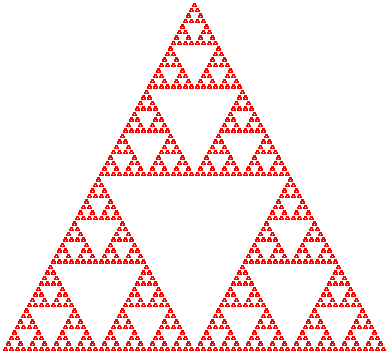          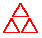
> > > > 
> 图 156：Sierpinski 三角形

图 156 展示了一个分形形状的例子，称为 Sierpinski 三角形。基本形状是一个（等边）三角形，就像中心的那个。当这个三角形以三角形的形式足够多次地组合时，我们得到最左边的形状。

图 156 中最右侧的图像解释了生成步骤。当单独考虑时，它说，给定一个三角形，找到每条边的中点并将它们连接起来。这一步会产生四个三角形；对于这三个三角形的外部三角形中的每一个重复这个过程，除非这些三角形太小。

另一种解释，非常适合 2htdp/image 教学包中的形状组合函数，我们把这个解决方案归功于 Marc Smith。它基于从中心图像到右侧图像的转换。通过并置两个中心三角形，然后将一个副本放在这两个三角形之上，我们也得到了右侧的形状：

> | > (s-triangle 3) |
> | --- |
> | 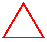 |
> | > ([beside](http://docs.racket-lang.org/teachpack/2htdpimage.html#%28def._%28%28lib._2htdp%2Fimage..rkt%29._beside%29%29) (s-triangle 3) (s-triangle 3)) |
> | 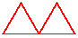 |
> 
> |
> 
> &#124; > ([above](http://docs.racket-lang.org/teachpack/2htdpimage.html#%28def._%28%28lib._2htdp%2Fimage..rkt%29._above%29%29) (s-triangle 3) &#124;
> 
> | &#124;          ([beside](http://docs.racket-lang.org/teachpack/2htdpimage.html#%28def._%28%28lib._2htdp%2Fimage..rkt%29._beside%29%29) (s-triangle 3) (s-triangle 3))) &#124;
> 
> |
> 
> | 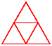 |
> | --- |

本节使用替代描述来设计 Sierpinski 算法；累加器作为结果处理第一种描述。鉴于目标是生成等边三角形的图像，我们使用一个（正数）来编码问题，即三角形的边长。这个决定产生了一个签名、一个目的声明和一个标题：

> | ; Number -> Image |
> | --- |
> | ; 创建边长为 side 的 Sierpinski 三角形 |
> |   |
> | ([define](http://docs.racket-lang.org/htdp-langs/intermediate-lam.html#%28form._%28%28lib._lang%2Fhtdp-intermediate-lambda..rkt%29._define%29%29) (sierpinski side) |
> |   ([triangle](http://docs.racket-lang.org/teachpack/2htdpimage.html#%28def._%28%28lib._2htdp%2Fimage..rkt%29._triangle%29%29) side 'outline 'red)) |

现在是时候解决生成递归的四个问题：

+   当给定的数字如此之小，以至于在其中绘制三角形毫无意义时，问题就变得简单了。

+   在那种情况下，生成一个三角形就足够了。

+   否则，算法必须生成一个边长为 side / 2 的 Sierpinski 三角形，因为将两个这样的三角形并排放置在任一方向上会产生一个边长为 side 的三角形。

+   如果 half-sized 是边长为 side / 2 的 Sierpinski 三角形，那么

    > | ([above](http://docs.racket-lang.org/teachpack/2htdpimage.html#%28def._%28%28lib._2htdp%2Fimage..rkt%29._above%29%29) half-sized |
    > | --- |
    > |        ([beside](http://docs.racket-lang.org/teachpack/2htdpimage.html#%28def._%28%28lib._2htdp%2Fimage..rkt%29._beside%29%29) half-sized half-sized)) |

    是一个边长为 side 的 Sierpinski 三角形。

> > > | ([define](http://docs.racket-lang.org/htdp-langs/intermediate-lam.html#%28form._%28%28lib._lang%2Fhtdp-intermediate-lambda..rkt%29._define%29%29) SMALL 4) ; 以像素为单位的尺寸度量 |
> > > | --- |
> > > |   |
> > > | ([define](http://docs.racket-lang.org/htdp-langs/intermediate-lam.html#%28form._%28%28lib._lang%2Fhtdp-intermediate-lambda..rkt%29._define%29%29) small-triangle ([triangle](http://docs.racket-lang.org/teachpack/2htdpimage.html#%28def._%28%28lib._2htdp%2Fimage..rkt%29._triangle%29%29) SMALL 'outline 'red)) |
> > > |   |
> > > | ; Number -> Image |
> > > | ; 生成边长为 side 的 Sierpinski Δ |
> > > | ; 一个用于 ([/](http://docs.racket-lang.org/htdp-langs/intermediate-lam.html#%28def._htdp-intermediate-lambda._%28%28lib._lang%2Fhtdp-intermediate-lambda..rkt%29._%2F%29%29) side 2) 并将一个副本放置在两个副本上方 |
> > > |   |
> > > | ([check-expect](http://docs.racket-lang.org/htdp-langs/intermediate-lam.html#%28form._%28%28lib._lang%2Fhtdp-intermediate-lambda..rkt%29._check-expect%29%29) (sierpinski SMALL) small-triangle) |
> > > | ([检查期望](http://docs.racket-lang.org/htdp-langs/intermediate-lam.html#%28form._%28%28lib._lang%2Fhtdp-intermediate-lambda..rkt%29._check-expect%29%29) (sierpinski ([*](http://docs.racket-lang.org/htdp-langs/intermediate-lam.html#%28def._htdp-intermediate-lambda._%28%28lib._lang%2Fhtdp-intermediate-lambda..rkt%29._%2A%29%29) 2 SMALL))) |
> > > |               ([上方](http://docs.racket-lang.org/teachpack/2htdpimage.html#%28def._%28%28lib._2htdp%2Fimage..rkt%29._above%29%29) small-triangle |
> > > |                      ([旁边](http://docs.racket-lang.org/teachpack/2htdpimage.html#%28def._%28%28lib._2htdp%2Fimage..rkt%29._beside%29%29) small-triangle small-triangle))) |
> > > |   |
> > > | ([定义](http://docs.racket-lang.org/htdp-langs/intermediate-lam.html#%28form._%28%28lib._lang%2Fhtdp-intermediate-lambda..rkt%29._define%29%29) (sierpinski side) |
> > > |   ([条件](http://docs.racket-lang.org/htdp-langs/intermediate-lam.html#%28form._%28%28lib._lang%2Fhtdp-intermediate-lambda..rkt%29._cond%29%29) |
> > > |     [([小于等于](http://docs.racket-lang.org/htdp-langs/intermediate-lam.html#%28def._htdp-intermediate-lambda._%28%28lib._lang%2Fhtdp-intermediate-lambda..rkt%29._~3c~3d%29%29) side SMALL) ([三角形](http://docs.racket-lang.org/teachpack/2htdpimage.html#%28def._%28%28lib._2htdp%2Fimage..rkt%29._triangle%29%29) side 'outline 'red)]) |
> > > |     [[否则](http://docs.racket-lang.org/htdp-langs/intermediate-lam.html#%28form._%28%28lib._lang%2Fhtdp-intermediate-lambda..rkt%29._else%29%29) |
> > > |      ([局部](http://docs.racket-lang.org/htdp-langs/intermediate-lam.html#%28form._%28%28lib._lang%2Fhtdp-intermediate-lambda..rkt%29._local%29%29) (([定义](http://docs.racket-lang.org/htdp-langs/intermediate-lam.html#%28form._%28%28lib._lang%2Fhtdp-intermediate-lambda..rkt%29._define%29%29) half-sized (sierpinski ([/](http://docs.racket-lang.org/htdp-langs/intermediate-lam.html#%28def._htdp-intermediate-lambda._%28%28lib._lang%2Fhtdp-intermediate-lambda..rkt%29._%2F%29%29) side 2)))) |
> > > |        ([上方](http://docs.racket-lang.org/teachpack/2htdpimage.html#%28def._%28%28lib._2htdp%2Fimage..rkt%29._above%29%29) half-sized ([旁边](http://docs.racket-lang.org/teachpack/2htdpimage.html#%28def._%28%28lib._2htdp%2Fimage..rkt%29._beside%29%29) half-sized half-sized)))])) |
> > > 
> 图 157：Sierpinski 算法

得到这些答案后，定义函数就很简单了。图 157 详细说明了这些细节。"平凡性条件"对应于([<=](http://docs.racket-lang.org/htdp-langs/intermediate-lam.html#%28def._htdp-intermediate-lambda._%28%28lib._lang%2Fhtdp-intermediate-lambda..rkt%29._~3c~3d%29%29) side SMALL)对于某个常数 SMALL。对于平凡答案，函数返回给定大小的三角形。在递归情况下，一个[局部](http://docs.racket-lang.org/htdp-langs/intermediate-lam.html#%28form._%28%28lib._lang%2Fhtdp-intermediate-lambda..rkt%29._local%29%29)表达式引入了名为 half-sized 的 Sierpinski 三角形，其大小是指定大小的一半。一旦递归调用生成了小的 Sierpinski 三角形，它就通过[above](http://docs.racket-lang.org/teachpack/2htdpimage.html#%28def._%28%28lib._2htdp%2Fimage..rkt%29._above%29%29)和[beside](http://docs.racket-lang.org/teachpack/2htdpimage.html#%28def._%28%28lib._2htdp%2Fimage..rkt%29._beside%29%29)组合这个图像。

该图突出了两个其他点。首先，目的声明被阐述为对函数所完成的任务的解释

> ; 创建边长为...的 Sierpinski 三角形

以及它是如何实现这个目标的：

> | ; ... 生成一个大小为([/](http://docs.racket-lang.org/htdp-langs/intermediate-lam.html#%28def._htdp-intermediate-lambda._%28%28lib._lang%2Fhtdp-intermediate-lambda..rkt%29._%2F%29%29) side 2)的三角形 |
> | --- |
> | ; 在两个组合的副本上方放置一个副本 |

其次，示例说明了两种可能的情况：一种是给定的大小足够小，另一种是大小仍然太大。在后一种情况下，计算期望值的表达式精确地解释了目的声明的含义。

由于 sierpinski 基于生成递归，定义函数和测试它并不是最后一步。我们还必须考虑为什么算法对于任何给定的合法输入都会终止。sierpinski 的输入是一个正数。如果这个数小于 SMALL，算法就会终止。否则，递归调用将使用一个大小是给定数一半的数。因此，假设 SMALL 也是正数，算法必须对所有正边长终止。

Sierpinski 过程的一个观点是它将其问题分成两半，直到它立即可解。稍加想象，你可以看到这个过程可以用来寻找具有某些特性的数字。下一节将详细解释这个想法。

#### 27.2 二分查找🔗 "链接至此")

应用数学家用非线性方程模拟现实世界，然后尝试解决它们。具体来说，他们将问题转化为一个从数字到数字的函数 f，并寻找某个数 r，使得

> f(r) = 0.

值 r 被称为 f 的根。

> > > > 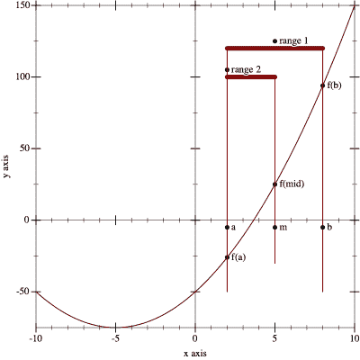
> > > > 
> 图 158：具有区间 [a,b] 内根的数值函数 f（阶段 1）

这是一个来自物理领域的问题：

> 样例问题 一枚火箭以每小时 v 英里的恒定速度沿直线向某个距离 d0 英里外的目标飞行。然后它以每小时 a 英里平方的速度加速 t 小时。它何时会击中目标？

物理学告诉我们，覆盖的距离是时间的以下函数：

> d(t) = (v * t + 1/2 * a * t²)

当它击中目标时的问题要求我们找到时间 t0，使得物体达到预期的目标：

> d0 = (v * t0 + 1/2 * a * t0²)

从代数我们知道这是一个二次方程，并且如果 d0、a 和 v 满足某些条件，就可以解这样的方程。

通常这类问题比二次方程更复杂。作为回应，数学家在过去几个世纪中为不同类型的函数开发了求根方法。在本节中，我们研究一个基于介值定理（IVT）的解决方案，这是分析的一个早期结果。由此产生的算法是基于数学定理的生成递归的主要例子。计算机科学家将其推广为二分搜索算法。

介值定理指出，如果连续函数 f 在区间 [a,b] 内的 f(a) 和 f(b) 分别位于 x 轴的两侧，那么 f 在区间 [a,b] 内有一个根。我们所说的连续是指一个没有“跳跃”，没有间隙，并且沿着“平滑”路径进行的函数。

图 158 展示了介值定理。函数 f 是一个连续函数，正如不间断、平滑的图形所暗示的那样。它在 a 点位于 x 轴下方，在 b 点位于 x 轴上方，并且确实在这个区间内的某个地方与 x 轴相交，如图中标注的“范围 1”。

现在看看 a 和 b 之间的中点：

> m = (a+b) / 2

它将区间 [a,b] 划分为两个更小、大小相等的区间。我们现在可以计算 f 在 m 处的值，并查看它是否低于 0 或高于 0。这里 f(m) > 0，因此，根据介值定理，根在左区间：[a,m]。我们的图也证实了这一点，因为根在区间的左半部分，如图 图 158 中标注的“范围 2”。我们现在已经描述了求根过程中的关键步骤。接下来，我们将这个描述转换为 ISL+ 算法。我们的第一个任务是陈述其目的。显然，该算法消耗一个函数以及我们期望在其中找到根的区间的边界：

> | ; [数字 -> 数字] 数字  数字 -> ... |
> | --- |
> | ([定义](http://docs.racket-lang.org/htdp-langs/intermediate-lam.html#%28form._%28%28lib._lang%2Fhtdp-intermediate-lambda..rkt%29._define%29%29) (find-root f left right) [...](http://docs.racket-lang.org/htdp-langs/intermediate-lam.html#%28form._%28%28lib._lang%2Fhtdp-intermediate-lambda..rkt%29._......%29%29)) |

三个参数不能是任何函数和数字。为了使 find-root 能够工作，我们必须假设以下条件成立：

> | ([或](http://docs.racket-lang.org/htdp-langs/intermediate-lam.html#%28form._%28%28lib._lang%2Fhtdp-intermediate-lambda..rkt%29._or%29%29) ([<=](http://docs.racket-lang.org/htdp-langs/intermediate-lam.html#%28def._htdp-intermediate-lambda._%28%28lib._lang%2Fhtdp-intermediate-lambda..rkt%29._~3c~3d%29%29) (f left) 0 (f right))) |
> | --- |
> |     ([<=](http://docs.racket-lang.org/htdp-langs/intermediate-lam.html#%28def._htdp-intermediate-lambda._%28%28lib._lang%2Fhtdp-intermediate-lambda..rkt%29._~3c~3d%29%29) (f right) 0 (f left))) |

即，(f  left) 和 (f  right) 必须位于 x 轴的两侧。接下来，我们需要确定函数的结果并制定一个目的声明。简单来说，find-root 找到一个包含根的区间。搜索将区间划分，直到其大小，([-](http://docs.racket-lang.org/htdp-langs/intermediate-lam.html#%28def._htdp-intermediate-lambda._%28%28lib._lang%2Fhtdp-intermediate-lambda..rkt%29._-%29%29)  right  left)，可以容忍地小，比如说，小于某个常数 ε。DrRacket 允许使用希腊符号，如 ε。但您也可以写 EPSILON。到那时，函数可以产生三种结果之一：左边界、右边界或区间的表示。任何一种都可以完全确定区间，并且由于返回数字更简单，我们选择左边界。以下是完整的头材料：

> | ; [数字 -> 数字 数字 -> 数字] |
> | --- |
> | ; 确定 R，使得 f 在 [R,([+](http://docs.racket-lang.org/htdp-langs/intermediate-lam.html#%28def._htdp-intermediate-lambda._%28%28lib._lang%2Fhtdp-intermediate-lambda..rkt%29._%2B%29%29)  R  ε)] 有根 |
> | ; 假设 f 是连续的 |
> | ; (2) ([或](http://docs.racket-lang.org/htdp-langs/intermediate-lam.html#%28form._%28%28lib._lang%2Fhtdp-intermediate-lambda..rkt%29._or%29%29)  ([<=](http://docs.racket-lang.org/htdp-langs/intermediate-lam.html#%28def._htdp-intermediate-lambda._%28%28lib._lang%2Fhtdp-intermediate-lambda..rkt%29._~3c~3d%29%29)  (f  left)  0  (f  right))  ([<=](http://docs.racket-lang.org/htdp-langs/intermediate-lam.html#%28def._htdp-intermediate-lambda._%28%28lib._lang%2Fhtdp-intermediate-lambda..rkt%29._~3c~3d%29%29)  (f  right)  0  (f  left)))) |
> | ; 生成性划分区间为二分之一，根在其中 |
> | ; 两个区间之一，根据 (2) 选择 |
> | ([define](http://docs.racket-lang.org/htdp-langs/intermediate-lam.html#%28form._%28%28lib._lang%2Fhtdp-intermediate-lambda..rkt%29._define%29%29) (find-root f left right) |
> |   0) |

练习 445。考虑以下函数定义：

> | ; 数字 -> 数字 |
> | --- |
> | ([define](http://docs.racket-lang.org/htdp-langs/intermediate-lam.html#%28form._%28%28lib._lang%2Fhtdp-intermediate-lambda..rkt%29._define%29%29) (poly x) |
> |   ([*](http://docs.racket-lang.org/htdp-langs/intermediate-lam.html#%28def._htdp-intermediate-lambda._%28%28lib._lang%2Fhtdp-intermediate-lambda..rkt%29._%2A%29%29) ([-](http://docs.racket-lang.org/htdp-langs/intermediate-lam.html#%28def._htdp-intermediate-lambda._%28%28lib._lang%2Fhtdp-intermediate-lambda..rkt%29._-%29%29) x 2) ([-](http://docs.racket-lang.org/htdp-langs/intermediate-lam.html#%28def._htdp-intermediate-lambda._%28%28lib._lang%2Fhtdp-intermediate-lambda..rkt%29._-%29%29) x 4))) |

它定义了一个二项式，我们可以手动确定其根：

> | > (poly 2) |
> | --- |
> | 0 |
> | > (poly 4) |
> | 0 |

使用 poly 来制定[check-satisfied](http://docs.racket-lang.org/htdp-langs/intermediate-lam.html#%28form._%28%28lib._lang%2Fhtdp-intermediate-lambda..rkt%29._check-satisfied%29%29)或[check-within](http://docs.racket-lang.org/htdp-langs/intermediate-lam.html#%28form._%28%28lib._lang%2Fhtdp-intermediate-lambda..rkt%29._check-within%29%29)测试方案，用于 find-root。同时使用 poly 来展示求根过程。从区间[3,6]开始，对于ε = 0，如下表所示：

> | step |  | left |  | f left |  | right |  | f right |  | mid |  | f mid |  |  |
> | --- | --- | --- | --- | --- | --- | --- | --- | --- | --- | --- | --- | --- | --- | --- |
> | n=1 |  | 3 |  | -1 |  | 6.00 |  | 8.00 |  | 4.50 |  | 1.25 |  |  |
> | n=2 |  | 3 |  | -1 |  | 4.50 |  | 1.25 |  | ? |  | ? |  |  |

我们接下来的任务是解决算法设计的四个问题：

1.  我们需要一个条件来描述何时问题得到解决以及匹配的答案。根据我们之前的讨论，这很简单：

    > ([<=](http://docs.racket-lang.org/htdp-langs/intermediate-lam.html#%28def._htdp-intermediate-lambda._%28%28lib._lang%2Fhtdp-intermediate-lambda..rkt%29._~3c~3d%29%29) ([-](http://docs.racket-lang.org/htdp-langs/intermediate-lam.html#%28def._htdp-intermediate-lambda._%28%28lib._lang%2Fhtdp-intermediate-lambda..rkt%29._-%29%29) right left) ε)

1.  在平凡情况下，匹配结果是 left。

1.  对于生成情况，我们需要一个表达式来为 find-root 生成新的问题。根据我们的非正式描述，这一步需要确定中点和其函数值：

    > | ([局部](http://docs.racket-lang.org/htdp-langs/intermediate-lam.html#%28form._%28%28lib._lang%2Fhtdp-intermediate-lambda..rkt%29._local%29%29) (([定义](http://docs.racket-lang.org/htdp-langs/intermediate-lam.html#%28form._%28%28lib._lang%2Fhtdp-intermediate-lambda..rkt%29._define%29%29) mid ([除以](http://docs.racket-lang.org/htdp-langs/intermediate-lam.html#%28def._htdp-intermediate-lambda._%28%28lib._lang%2Fhtdp-intermediate-lambda..rkt%29._%2F%29%29) ([加](http://docs.racket-lang.org/htdp-langs/intermediate-lam.html#%28def._htdp-intermediate-lambda._%28%28lib._lang%2Fhtdp-intermediate-lambda..rkt%29._%2B%29%29) left right) 2))) |
    > | --- |
    > | |       [([定义](http://docs.racket-lang.org/htdp-langs/intermediate-lam.html#%28form._%28%28lib._lang%2Fhtdp-intermediate-lambda..rkt%29._define%29%29) f@m (f mid))) |
    > | |   [...](http://docs.racket-lang.org/htdp-langs/intermediate-lam.html#%28form._%28%28lib._lang%2Fhtdp-intermediate-lambda..rkt%29._......%29%29)) |

    然后使用中点来选择下一个区间。根据 IVT（中值定理），如果

    > ([或](http://docs.racket-lang.org/htdp-langs/intermediate-lam.html#%28form._%28%28lib._lang%2Fhtdp-intermediate-lambda..rkt%29._or%29%29) ([小于等于](http://docs.racket-lang.org/htdp-langs/intermediate-lam.html#%28def._htdp-intermediate-lambda._%28%28lib._lang%2Fhtdp-intermediate-lambda..rkt%29._~3c~3d%29%29) (f left) 0 f@m) ([小于等于](http://docs.racket-lang.org/htdp-langs/intermediate-lam.html#%28def._htdp-intermediate-lambda._%28%28lib._lang%2Fhtdp-intermediate-lambda..rkt%29._~3c~3d%29%29) f@m 0 (f left)))

    当使用[mid,right]进行递归调用时

    > ([或](http://docs.racket-lang.org/htdp-langs/intermediate-lam.html#%28form._%28%28lib._lang%2Fhtdp-intermediate-lambda..rkt%29._or%29%29) ([小于等于](http://docs.racket-lang.org/htdp-langs/intermediate-lam.html#%28def._htdp-intermediate-lambda._%28%28lib._lang%2Fhtdp-intermediate-lambda..rkt%29._~3c~3d%29%29) f@m 0 (f right))) ([小于等于](http://docs.racket-lang.org/htdp-langs/intermediate-lam.html#%28def._htdp-intermediate-lambda._%28%28lib._lang%2Fhtdp-intermediate-lambda..rkt%29._~3c~3d%29%29) (f right) 0 f@m))

    将其翻译成代码，[局部](http://docs.racket-lang.org/htdp-langs/intermediate-lam.html#%28form._%28%28lib._lang%2Fhtdp-intermediate-lambda..rkt%29._local%29%29)的部分体必须是一个条件语句：

    > | ([条件](http://docs.racket-lang.org/htdp-langs/intermediate-lam.html#%28form._%28%28lib._lang%2Fhtdp-intermediate-lambda..rkt%29._cond%29%29)) |
    > | --- |
    > | |   [([或](http://docs.racket-lang.org/htdp-langs/intermediate-lam.html#%28form._%28%28lib._lang%2Fhtdp-intermediate-lambda..rkt%29._or%29%29) ([小于等于](http://docs.racket-lang.org/htdp-langs/intermediate-lam.html#%28def._htdp-intermediate-lambda._%28%28lib._lang%2Fhtdp-intermediate-lambda..rkt%29._~3c~3d%29%29) (f left) 0 f@m) ([小于等于](http://docs.racket-lang.org/htdp-langs/intermediate-lam.html#%28def._htdp-intermediate-lambda._%28%28lib._lang%2Fhtdp-intermediate-lambda..rkt%29._~3c~3d%29%29) f@m 0 (f left)))) |
    > |    ([...](http://docs.racket-lang.org/htdp-langs/intermediate-lam.html#%28form._%28%28lib._lang%2Fhtdp-intermediate-lambda..rkt%29._......%29%29) (find-root f left mid) [...](http://docs.racket-lang.org/htdp-langs/intermediate-lam.html#%28form._%28%28lib._lang%2Fhtdp-intermediate-lambda..rkt%29._......%29%29))] |
    > |   [([或](http://docs.racket-lang.org/htdp-langs/intermediate-lam.html#%28form._%28%28lib._lang%2Fhtdp-intermediate-lambda..rkt%29._or%29%29) ([<=](http://docs.racket-lang.org/htdp-langs/intermediate-lam.html#%28def._htdp-intermediate-lambda._%28%28lib._lang%2Fhtdp-intermediate-lambda..rkt%29._~3c~3d%29%29) f@m 0 (f right)) ([<=](http://docs.racket-lang.org/htdp-langs/intermediate-lam.html#%28def._htdp-intermediate-lambda._%28%28lib._lang%2Fhtdp-intermediate-lambda..rkt%29._~3c~3d%29%29) (f right) 0 f@m)) |
    > |    ([...](http://docs.racket-lang.org/htdp-langs/intermediate-lam.html#%28form._%28%28lib._lang%2Fhtdp-intermediate-lambda..rkt%29._......%29%29) (find-root f mid right) [...](http://docs.racket-lang.org/htdp-langs/intermediate-lam.html#%28form._%28%28lib._lang%2Fhtdp-intermediate-lambda..rkt%29._......%29%29))]) |

    在两个子句中，我们都使用 find-root 来继续搜索。

1.  最终问题的答案很明显。由于递归调用 find-root 找到了 f 的根，所以没有其他事情要做。

完成的函数显示在图 159；以下练习详细说明了其设计。

> > > | ; [数字 -> 数字] 数字  数字 -> 数字 |
> > > | --- |
> > > | ; 确定 R，使得 f 在[R,([+](http://docs.racket-lang.org/htdp-langs/intermediate-lam.html#%28def._htdp-intermediate-lambda._%28%28lib._lang%2Fhtdp-intermediate-lambda..rkt%29._%2B%29%29)  R  ε)] |
> > > | ; 假设 f 是连续的 |
> > > | ; 假设  ([或](http://docs.racket-lang.org/htdp-langs/intermediate-lam.html#%28form._%28%28lib._lang%2Fhtdp-intermediate-lambda..rkt%29._or%29%29)  ([<=](http://docs.racket-lang.org/htdp-langs/intermediate-lam.html#%28def._htdp-intermediate-lambda._%28%28lib._lang%2Fhtdp-intermediate-lambda..rkt%29._~3c~3d%29%29)  (f  left)  0  (f  right))  ([<=](http://docs.racket-lang.org/htdp-langs/intermediate-lam.html#%28def._htdp-intermediate-lambda._%28%28lib._lang%2Fhtdp-intermediate-lambda..rkt%29._~3c~3d%29%29)  (f  right)  0  (f  left))) |
> > > | ; 生成性地将区间分成一半，根在两个子区间之一 |
> > > | ; 二分，根据假设选择 |
> > > | ([定义](http://docs.racket-lang.org/htdp-langs/intermediate-lam.html#%28form._%28%28lib._lang%2Fhtdp-intermediate-lambda..rkt%29._define%29%29) (find-root f left right) |
> > > |   ([cond](http://docs.racket-lang.org/htdp-langs/intermediate-lam.html#%28form._%28%28lib._lang%2Fhtdp-intermediate-lambda..rkt%29._cond%29%29) |
> > > |   |   [([<=](http://docs.racket-lang.org/htdp-langs/intermediate-lam.html#%28def._htdp-intermediate-lambda._%28%28lib._lang%2Fhtdp-intermediate-lambda..rkt%29._~3c~3d%29%29) ([-](http://docs.racket-lang.org/htdp-langs/intermediate-lam.html#%28def._htdp-intermediate-lambda._%28%28lib._lang%2Fhtdp-intermediate-lambda..rkt%29._-%29%29) right left) ε) left] |
> > > |   [[else](http://docs.racket-lang.org/htdp-langs/intermediate-lam.html#%28form._%28%28lib._lang%2Fhtdp-intermediate-lambda..rkt%29._else%29%29) |
> > > |   |   ([local](http://docs.racket-lang.org/htdp-langs/intermediate-lam.html#%28form._%28%28lib._lang%2Fhtdp-intermediate-lambda..rkt%29._local%29%29) (([define](http://docs.racket-lang.org/htdp-langs/intermediate-lam.html#%28form._%28%28lib._lang%2Fhtdp-intermediate-lambda..rkt%29._define%29%29) mid ([/](http://docs.racket-lang.org/htdp-langs/intermediate-lam.html#%28def._htdp-intermediate-lambda._%28%28lib._lang%2Fhtdp-intermediate-lambda..rkt%29._%2F%29%29) ([+](http://docs.racket-lang.org/htdp-langs/intermediate-lam.html#%28def._htdp-intermediate-lambda._%28%28lib._lang%2Fhtdp-intermediate-lambda..rkt%29._%2B%29%29) left right) 2)) |
> > > |   |   |   ([define](http://docs.racket-lang.org/htdp-langs/intermediate-lam.html#%28form._%28%28lib._lang%2Fhtdp-intermediate-lambda..rkt%29._define%29%29) f@mid (f mid))) |
> > > |   |   ([cond](http://docs.racket-lang.org/htdp-langs/intermediate-lam.html#%28form._%28%28lib._lang%2Fhtdp-intermediate-lambda..rkt%29._cond%29%29) |
> > > |   |   [([or](http://docs.racket-lang.org/htdp-langs/intermediate-lam.html#%28form._%28%28lib._lang%2Fhtdp-intermediate-lambda..rkt%29._or%29%29) ([<=](http://docs.racket-lang.org/htdp-langs/intermediate-lam.html#%28def._htdp-intermediate-lambda._%28%28lib._lang%2Fhtdp-intermediate-lambda..rkt%29._~3c~3d%29%29) (f left) 0 f@mid) ([<=](http://docs.racket-lang.org/htdp-langs/intermediate-lam.html#%28def._htdp-intermediate-lambda._%28%28lib._lang%2Fhtdp-intermediate-lambda..rkt%29._~3c~3d%29%29) f@mid 0 (f left))) |
> > > |   |   |   (find-root f left mid)] |
> > > |   |   [([or](http://docs.racket-lang.org/htdp-langs/intermediate-lam.html#%28form._%28%28lib._lang%2Fhtdp-intermediate-lambda..rkt%29._or%29%29) ([<=](http://docs.racket-lang.org/htdp-langs/intermediate-lam.html#%28def._htdp-intermediate-lambda._%28%28lib._lang%2Fhtdp-intermediate-lambda..rkt%29._~3c~3d%29%29) f@mid 0 (f right)) ([<=](http://docs.racket-lang.org/htdp-langs/intermediate-lam.html#%28def._htdp-intermediate-lambda._%28%28lib._lang%2Fhtdp-intermediate-lambda..rkt%29._~3c~3d%29%29) (f right) 0 f@mid)) |
> > > |   |   |   (find-root f mid right)]))])) |
> > > 
> 图 159: 求根算法

练习 446. 将 练习 445 中的测试添加到 图 159 中的程序中。尝试不同的 ε 值进行实验。

练习 447. 多项式函数有两个根。使用 `find-root` 函数和包含两个根的区间来求解。

练习 448。对于所有满足假设的(连续)函数 f、左边界和右边界，find-root 算法都会终止。为什么？提出一个终止性论证。

提示：假设 find-root 的参数描述了一个大小为 S1 的区间。第一次和第二次递归调用 find-root 时，左边界和右边界之间的距离有多大？经过多少步后，([-](http://docs.racket-lang.org/htdp-langs/intermediate-lam.html#%28def._htdp-intermediate-lambda._%28%28lib._lang%2Fhtdp-intermediate-lambda..rkt%29._-%29%29)  right  left)小于或等于ε？

练习 449。如图 159 所示，find-root 函数对每个边界值计算 f 的值两次以生成下一个区间。使用[local](http://docs.racket-lang.org/htdp-langs/intermediate-lam.html#%28form._%28%28lib._lang%2Fhtdp-intermediate-lambda..rkt%29._local%29%29)来避免这种重复计算。

此外，find-root 在递归调用中重新计算边界值。例如，(find-root  f  left  right)计算(f  left)，如果[left,mid]被选为下一个区间，find-root 再次计算(f  left)。引入一个类似于 find-root 但消耗不仅左边界和右边界，还在每个递归阶段消耗(f  left)和(f  right)的辅助函数。

这种设计最大能避免多少次(f  left)的重复计算？注意：此辅助函数的两个额外参数在每次递归阶段都会改变，但这种改变与数值参数的改变有关。这些参数被称为累加器，它们是累加器的主题。

练习 450。如果对于所有满足([<](http://docs.racket-lang.org/htdp-langs/intermediate-lam.html#%28def._htdp-intermediate-lambda._%28%28lib._lang%2Fhtdp-intermediate-lambda..rkt%29._~3c%29%29)  a  b)的 a 和 b，函数 f([<=](http://docs.racket-lang.org/htdp-langs/intermediate-lam.html#%28def._htdp-intermediate-lambda._%28%28lib._lang%2Fhtdp-intermediate-lambda..rkt%29._~3c~3d%29%29)  (f  a)  (f  b))成立，则函数 f 是单调递增的。在假设给定函数不仅是连续的而且是单调递增的情况下，简化 find-root 函数。

练习 451。表是一个有两个字段的记录：自然数长度和一个函数数组，许多编程语言，包括 Racket，支持数组和向量，它们与表类似。这些数组消耗自然数，对于介于 0 和长度（不包括）之间的数，产生答案：

> | ([define-struct](http://docs.racket-lang.org/htdp-langs/intermediate-lam.html#%28form._%28%28lib._lang%2Fhtdp-intermediate-lambda..rkt%29._define-struct%29%29) table [length array]) |
> | --- |
> | ; A Table is a structure: |
> | ;   (make-table  N  [N  [->](http://docs.racket-lang.org/htdp-langs/intermediate-lam.html#%28form._%28%28lib._lang%2Fhtdp-intermediate-lambda..rkt%29._-~3e%29%29)  Number]) |

由于这种数据结构有些不寻常，因此用示例来说明它是至关重要的：

> | ([define](http://docs.racket-lang.org/htdp-langs/intermediate-lam.html#%28form._%28%28lib._lang%2Fhtdp-intermediate-lambda..rkt%29._define%29%29) table1 (make-table 3 ([lambda](http://docs.racket-lang.org/htdp-langs/intermediate-lam.html#%28form._%28%28lib._lang%2Fhtdp-intermediate-lambda..rkt%29._lambda%29%29) (i) i))) |
> | --- |
> |   |
> | ; N -> Number |
> | ([define](http://docs.racket-lang.org/htdp-langs/intermediate-lam.html#%28form._%28%28lib._lang%2Fhtdp-intermediate-lambda..rkt%29._define%29%29) (a2 i) |
> |   ([if](http://docs.racket-lang.org/htdp-langs/intermediate-lam.html#%28form._%28%28lib._lang%2Fhtdp-intermediate-lambda..rkt%29._if%29%29) ([=](http://docs.racket-lang.org/htdp-langs/intermediate-lam.html#%28def._htdp-intermediate-lambda._%28%28lib._lang%2Fhtdp-intermediate-lambda..rkt%29._~3d%29%29) i 0) |
> |       [pi](http://docs.racket-lang.org/htdp-langs/intermediate-lam.html#%28def._htdp-intermediate-lambda._%28%28lib._lang%2Fhtdp-intermediate-lambda..rkt%29._pi%29%29) |
> |       ([error](http://docs.racket-lang.org/htdp-langs/intermediate-lam.html#%28def._htdp-intermediate-lambda._%28%28lib._lang%2Fhtdp-intermediate-lambda..rkt%29._error%29%29) "table2 is not defined for i =!= 0"))) |
> |   |
> | ([define](http://docs.racket-lang.org/htdp-langs/intermediate-lam.html#%28form._%28%28lib._lang%2Fhtdp-intermediate-lambda..rkt%29._define%29%29) table2 (make-table 1 a2)) |

这里 table1 的数组函数定义的输入比其长度字段允许的更多；table2 只为 0 这一个输入定义。最后，我们还定义了一个用于在表中查找值的实用函数：

> | ; Table  N -> Number |
> | --- |
> | ; 在 t 的数组中查找第 i 个值 |
> | ([define](http://docs.racket-lang.org/htdp-langs/intermediate-lam.html#%28form._%28%28lib._lang%2Fhtdp-intermediate-lambda..rkt%29._define%29%29) (table-ref t i) |
> |   ((table-array t) i)) |

表 t 的根是 (table-array t) 中接近 0 的一个数。根索引是一个自然数 i，使得 (table-ref t i) 是表 t 的根。如果 (table-ref t 0) 小于 (table-ref t 1)，(table-ref t 1) 小于 (table-ref t 2)，依此类推，则表 t 是单调递增的。

设计 find-linear 函数。该函数接受一个单调递增的表，并找到该表根的最小索引。使用 N 的结构化配方，从 0 开始，经过 1、2 等等，直到给定表的数组长度。这种根查找过程通常被称为线性搜索。

设计 find-binary，它也找到单调递增表的根的最小索引，但使用生成递归来实现。像普通的二分搜索一样，算法将区间缩小到可能的最小大小，然后选择索引。别忘了制定一个终止论证。

提示：关键问题是表索引是一个自然数，而不是一个普通数。因此，find 的区间边界参数必须是自然数。考虑这个观察如何改变（1）可以轻易解决的问题实例的性质，（2）中点计算，（3）以及决定生成下一个区间的决策。为了具体说明，想象一个有 1024 个槽位的表，根节点在 1023。在 find-linear 和 find-binary 中，分别需要多少次 find 调用？

#### 27.3 对解析的简要了解🔗 "链接到此处")

如同在迭代优化中提到的，计算机带有文件，这提供了一种永久存储的形式。从我们的角度来看，一个文件只是一个 1String 的列表，具体的约定因操作系统而异，但对我们来说这并不重要。尽管它被一个特殊的字符串中断：

> | ; A File is one of: |
> | --- |
> | ; –  '() |
> | ; –  ([cons](http://docs.racket-lang.org/htdp-langs/intermediate-lam.html#%28def._htdp-intermediate-lambda._%28%28lib._lang%2Fhtdp-intermediate-lambda..rkt%29._cons%29%29)  "\n"  File) |
> | ; –  ([cons](http://docs.racket-lang.org/htdp-langs/intermediate-lam.html#%28def._htdp-intermediate-lambda._%28%28lib._lang%2Fhtdp-intermediate-lambda..rkt%29._cons%29%29)  1String  File) |
> | ; interpretation represents the content of a file |
> | ; "\n" is the newline character |

想法是 File 被分成行，其中"\n"代表所谓的换行符，它表示行的结束。在我们继续之前，让我们也介绍行：

> ; A Line is a [List-of  1String].

许多函数需要将文件作为行列表进行处理。[read-lines](http://docs.racket-lang.org/teachpack/2htdpbatch-io.html#%28def._%28%28lib._2htdp%2Fbatch-io..rkt%29._read-lines%29%29)是从 2htdp/batch-io 教学包中的一个。具体来说，该函数将文件

> | ([list](http://docs.racket-lang.org/htdp-langs/intermediate-lam.html#%28def._htdp-intermediate-lambda._%28%28lib._lang%2Fhtdp-intermediate-lambda..rkt%29._list%29%29) |
> | --- |
> |   "h" "o" "w" " " "a" "r" "e" " " "y" "o" "u" "\n" |
> |   "d" "o" "i" "n" "g" "?" "\n" |
> |   "a" "n" "y" " " "p" "r" "o" "g" "r" "e" "s" "s" "?") |

将其转换成三行的列表：

> | ([list](http://docs.racket-lang.org/htdp-langs/intermediate-lam.html#%28def._htdp-intermediate-lambda._%28%28lib._lang%2Fhtdp-intermediate-lambda..rkt%29._list%29%29) |
> | --- |
> |   ([列表](http://docs.racket-lang.org/htdp-langs/intermediate-lam.html#%28def._htdp-intermediate-lambda._%28%28lib._lang%2Fhtdp-intermediate-lambda..rkt%29._list%29%29) "h" "o" "w" " " "a" "r" "e" " " "y" "o" "u") |
> |   ([列表](http://docs.racket-lang.org/htdp-langs/intermediate-lam.html#%28def._htdp-intermediate-lambda._%28%28lib._lang%2Fhtdp-intermediate-lambda..rkt%29._list%29%29) "d" "o" "i" "n" "g" "?") |
> |   ([列表](http://docs.racket-lang.org/htdp-langs/intermediate-lam.html#%28def._htdp-intermediate-lambda._%28%28lib._lang%2Fhtdp-intermediate-lambda..rkt%29._list%29%29) "a" "n" "y" " " "p" "r" "o" "g" "r" "e" |
> |         "s" "s" "?")) |

类似地，文件

> ([列表](http://docs.racket-lang.org/htdp-langs/intermediate-lam.html#%28def._htdp-intermediate-lambda._%28%28lib._lang%2Fhtdp-intermediate-lambda..rkt%29._list%29%29) "a" "b" "c" "\n" "d" "e" "\n" "f" "g" "h" "\n")

也对应于三个行的列表：

> | ([列表](http://docs.racket-lang.org/htdp-langs/intermediate-lam.html#%28def._htdp-intermediate-lambda._%28%28lib._lang%2Fhtdp-intermediate-lambda..rkt%29._list%29%29) ([列表](http://docs.racket-lang.org/htdp-langs/intermediate-lam.html#%28def._htdp-intermediate-lambda._%28%28lib._lang%2Fhtdp-intermediate-lambda..rkt%29._list%29%29) "a" "b" "c") |
> | --- |
> |       ([列表](http://docs.racket-lang.org/htdp-langs/intermediate-lam.html#%28def._htdp-intermediate-lambda._%28%28lib._lang%2Fhtdp-intermediate-lambda..rkt%29._list%29%29) "d" "e") |
> |       ([列表](http://docs.racket-lang.org/htdp-langs/intermediate-lam.html#%28def._htdp-intermediate-lambda._%28%28lib._lang%2Fhtdp-intermediate-lambda..rkt%29._list%29%29) "f" "g" "h")) |

停止！这三个情况（'(), ([列表](http://docs.racket-lang.org/htdp-langs/intermediate-lam.html#%28def._htdp-intermediate-lambda._%28%28lib._lang%2Fhtdp-intermediate-lambda..rkt%29._list%29%29)  "\n"), 和 ([列表](http://docs.racket-lang.org/htdp-langs/intermediate-lam.html#%28def._htdp-intermediate-lambda._%28%28lib._lang%2Fhtdp-intermediate-lambda..rkt%29._list%29%29)  "\n"  "\n")）的行列表表示是什么？为什么这些例子是重要的测试用例？

将一系列 1String 转换为行列表的问题被称为解析问题。许多编程语言提供了从文件中检索行、单词、数字和其他所谓标记的函数。即使如此，程序通常还需要进一步解析这些标记。本节提供了一个解析技术的概览。然而，解析如此复杂，对于创建完整的软件应用程序又是如此核心，以至于大多数本科课程至少包含一门关于解析的课程。因此，不要以为掌握了这一节后就能正确处理实际的解析问题。

我们首先陈述显而易见的事情——<wbr>一个签名，一个目的声明，上述示例之一，以及一个标题——<wbr>用于将文件转换为行列表的函数：

> | ; 文件 -> [列表  行] |
> | --- |
> | ; 将文件转换为行列表 |
> |   |
> | ([check-expect](http://docs.racket-lang.org/htdp-langs/intermediate-lam.html#%28form._%28%28lib._lang%2Fhtdp-intermediate-lambda..rkt%29._check-expect%29%29) (file->list-of-lines |
> |                 ([list](http://docs.racket-lang.org/htdp-langs/intermediate-lam.html#%28def._htdp-intermediate-lambda._%28%28lib._lang%2Fhtdp-intermediate-lambda..rkt%29._list%29%29) "a" "b" "c" "\n" |
> |                       "d" "e" "\n" |
> |                       "f" "g" "h" "\n")) |
> |               ([list](http://docs.racket-lang.org/htdp-langs/intermediate-lam.html#%28def._htdp-intermediate-lambda._%28%28lib._lang%2Fhtdp-intermediate-lambda..rkt%29._list%29%29) ([list](http://docs.racket-lang.org/htdp-langs/intermediate-lam.html#%28def._htdp-intermediate-lambda._%28%28lib._lang%2Fhtdp-intermediate-lambda..rkt%29._list%29%29) "a" "b" "c") |
> |                     ([list](http://docs.racket-lang.org/htdp-langs/intermediate-lam.html#%28def._htdp-intermediate-lambda._%28%28lib._lang%2Fhtdp-intermediate-lambda..rkt%29._list%29%29) "d" "e") |
> |                     ([list](http://docs.racket-lang.org/htdp-langs/intermediate-lam.html#%28def._htdp-intermediate-lambda._%28%28lib._lang%2Fhtdp-intermediate-lambda..rkt%29._list%29%29) "f" "g" "h"))) |
> |   |
> | ([define](http://docs.racket-lang.org/htdp-langs/intermediate-lam.html#%28form._%28%28lib._lang%2Fhtdp-intermediate-lambda..rkt%29._define%29%29) (file->list-of-lines afile) '()) |

考虑到我们对无结构递归的经验，描述解析过程也很容易：

1.  如果文件是'()，则问题可以轻易解决。

1.  在那种情况下，文件不包含任何行。

1.  否则，文件至少包含一个"\n"或其他 1 字符串。这些项目——<wbr>包括第一个"\n"，如果有的话——<wbr>必须与文件的其余部分分开。其余部分是文件->list-of-lines 可以解决的相同类型的新问题。

1.  它然后将初始段作为单独的一行添加到由文件其余部分生成的行列表中。

四个问题建议了一个生成递归函数模板的直接实例化。因为将初始段与文件其余部分分离需要扫描一个任意长度的 1String 列表，所以我们把两个辅助函数列入我们的愿望清单：first-line，它收集所有 1String 直到但不包括第一个 "\n" 或列表末尾的出现；以及 remove-first-line，它移除 first-line 收集的相同项目。

> > > | ; File -> [List-of  Line] |
> > > | --- |
> > > | ; 将文件转换为行列表 |
> > > | ([define](http://docs.racket-lang.org/htdp-langs/intermediate-lam.html#%28form._%28%28lib._lang%2Fhtdp-intermediate-lambda..rkt%29._define%29%29) (file->list-of-lines afile) |
> > > | ([cond](http://docs.racket-lang.org/htdp-langs/intermediate-lam.html#%28form._%28%28lib._lang%2Fhtdp-intermediate-lambda..rkt%29._cond%29%29) |
> > > |     [([empty?](http://docs.racket-lang.org/htdp-langs/intermediate-lam.html#%28def._htdp-intermediate-lambda._%28%28lib._lang%2Fhtdp-intermediate-lambda..rkt%29._empty~3f%29%29) afile) '()] |
> > > |     [[else](http://docs.racket-lang.org/htdp-langs/intermediate-lam.html#%28form._%28%28lib._lang%2Fhtdp-intermediate-lambda..rkt%29._else%29%29) |
> > > |      ([cons](http://docs.racket-lang.org/htdp-langs/intermediate-lam.html#%28def._htdp-intermediate-lambda._%28%28lib._lang%2Fhtdp-intermediate-lambda..rkt%29._cons%29%29) (first-line afile) |
> > > |            (file->list-of-lines (remove-first-line afile)))])) |
> > > |   |
> > > | ; File -> Line |
> > > | ; retrieves the prefix of afile up to the first occurrence of NEWLINE |
> > > | ([define](http://docs.racket-lang.org/htdp-langs/intermediate-lam.html#%28form._%28%28lib._lang%2Fhtdp-intermediate-lambda..rkt%29._define%29%29) (first-line afile) |
> > > |   ([cond](http://docs.racket-lang.org/htdp-langs/intermediate-lam.html#%28form._%28%28lib._lang%2Fhtdp-intermediate-lambda..rkt%29._cond%29%29) |
> > > |     [([empty?](http://docs.racket-lang.org/htdp-langs/intermediate-lam.html#%28def._htdp-intermediate-lambda._%28%28lib._lang%2Fhtdp-intermediate-lambda..rkt%29._empty~3f%29%29) afile) '()] |
> > > |     [([string=?](http://docs.racket-lang.org/htdp-langs/intermediate-lam.html#%28def._htdp-intermediate-lambda._%28%28lib._lang%2Fhtdp-intermediate-lambda..rkt%29._string~3d~3f%29%29) ([first](http://docs.racket-lang.org/htdp-langs/intermediate-lam.html#%28def._htdp-intermediate-lambda._%28%28lib._lang%2Fhtdp-intermediate-lambda..rkt%29._first%29%29) afile) NEWLINE) '()] |
> > > |   [[else](http://docs.racket-lang.org/htdp-langs/intermediate-lam.html#%28form._%28%28lib._lang%2Fhtdp-intermediate-lambda..rkt%29._else%29%29) ([cons](http://docs.racket-lang.org/htdp-langs/intermediate-lam.html#%28def._htdp-intermediate-lambda._%28%28lib._lang%2Fhtdp-intermediate-lambda..rkt%29._cons%29%29) ([first](http://docs.racket-lang.org/htdp-langs/intermediate-lam.html#%28def._htdp-intermediate-lambda._%28%28lib._lang%2Fhtdp-intermediate-lambda..rkt%29._first%29%29) afile) (first-line ([rest](http://docs.racket-lang.org/htdp-langs/intermediate-lam.html#%28def._htdp-intermediate-lambda._%28%28lib._lang%2Fhtdp-intermediate-lambda..rkt%29._rest%29%29) afile)))])) |
> > > |   |
> > > | ; 文件 -> 文件 |
> > > | ; 删除文件前缀直到第一个出现 NEWLINE |
> > > | ([define](http://docs.racket-lang.org/htdp-langs/intermediate-lam.html#%28form._%28%28lib._lang%2Fhtdp-intermediate-lambda..rkt%29._define%29%29) (remove-first-line afile) |
> > > | ([cond](http://docs.racket-lang.org/htdp-langs/intermediate-lam.html#%28form._%28%28lib._lang%2Fhtdp-intermediate-lambda..rkt%29._cond%29%29) |
> > > |   [([empty?](http://docs.racket-lang.org/htdp-langs/intermediate-lam.html#%28def._htdp-intermediate-lambda._%28%28lib._lang%2Fhtdp-intermediate-lambda..rkt%29._empty~3f%29%29) afile) '()] |
> > > |   [([string=?](http://docs.racket-lang.org/htdp-langs/intermediate-lam.html#%28def._htdp-intermediate-lambda._%28%28lib._lang%2Fhtdp-intermediate-lambda..rkt%29._string~3d~3f%29%29) ([first](http://docs.racket-lang.org/htdp-langs/intermediate-lam.html#%28def._htdp-intermediate-lambda._%28%28lib._lang%2Fhtdp-intermediate-lambda..rkt%29._first%29%29) afile) NEWLINE) ([rest](http://docs.racket-lang.org/htdp-langs/intermediate-lam.html#%28def._htdp-intermediate-lambda._%28%28lib._lang%2Fhtdp-intermediate-lambda..rkt%29._rest%29%29) afile)] |
> > > |   [[else](http://docs.racket-lang.org/htdp-langs/intermediate-lam.html#%28form._%28%28lib._lang%2Fhtdp-intermediate-lambda..rkt%29._else%29%29) (remove-first-line ([rest](http://docs.racket-lang.org/htdp-langs/intermediate-lam.html#%28def._htdp-intermediate-lambda._%28%28lib._lang%2Fhtdp-intermediate-lambda..rkt%29._rest%29%29) afile))])) |
> > > |   |
> > > | ([define](http://docs.racket-lang.org/htdp-langs/intermediate-lam.html#%28form._%28%28lib._lang%2Fhtdp-intermediate-lambda..rkt%29._define%29%29) NEWLINE "\n") ; 1 字符串 |
> > > 
> 图 160：将文件转换为行列表

从这里，创建程序的其余部分就很容易了。在`file->list-of-lines`中，第一个子句的答案必须是`()`，因为空文件不包含任何行。第二个子句的答案必须在`(file->list-of-lines (remove-first-line afile))`上`cons`（连接）`(first-line afile)`的值，因为第一个表达式计算第一行，第二个表达式计算其余的行。最后，辅助函数以结构递归的方式遍历它们的输入；它们的发展是一个直接的练习。图 160)展示了完整的程序代码。

这里是`file->list-of-lines`处理第二个测试的方法：

> | |   (file->list-of-lines |
> | --- | --- |
> | |    ([列表](http://docs.racket-lang.org/htdp-langs/intermediate-lam.html#%28def._htdp-intermediate-lambda._%28%28lib._lang%2Fhtdp-intermediate-lambda..rkt%29._list%29%29) "a" "b" "c" "\n" "d" "e" "\n" "f" "g" "h" "\n")) |
> | == |
> | ([cons](http://docs.racket-lang.org/htdp-langs/intermediate-lam.html#%28def._htdp-intermediate-lambda._%28%28lib._lang%2Fhtdp-intermediate-lambda..rkt%29._cons%29%29) |
> | |    ([列表](http://docs.racket-lang.org/htdp-langs/intermediate-lam.html#%28def._htdp-intermediate-lambda._%28%28lib._lang%2Fhtdp-intermediate-lambda..rkt%29._list%29%29) "a" "b" "c") |
> | |   (file->list-of-lines |
> | |    ([列表](http://docs.racket-lang.org/htdp-langs/intermediate-lam.html#%28def._htdp-intermediate-lambda._%28%28lib._lang%2Fhtdp-intermediate-lambda..rkt%29._list%29%29) "d" "e" "\n" "f" "g" "h" "\n"))) |
> | == |
> | ([cons](http://docs.racket-lang.org/htdp-langs/intermediate-lam.html#%28def._htdp-intermediate-lambda._%28%28lib._lang%2Fhtdp-intermediate-lambda..rkt%29._cons%29%29) |
> | |    ([列表](http://docs.racket-lang.org/htdp-langs/intermediate-lam.html#%28def._htdp-intermediate-lambda._%28%28lib._lang%2Fhtdp-intermediate-lambda..rkt%29._list%29%29) "a" "b" "c") |
> | |    ([cons](http://docs.racket-lang.org/htdp-langs/intermediate-lam.html#%28def._htdp-intermediate-lambda._%28%28lib._lang%2Fhtdp-intermediate-lambda..rkt%29._cons%29%29) ([列表](http://docs.racket-lang.org/htdp-langs/intermediate-lam.html#%28def._htdp-intermediate-lambda._%28%28lib._lang%2Fhtdp-intermediate-lambda..rkt%29._list%29%29) "d" "e")) |
> | |       (file->list-of-lines |
> | （[列表](http://docs.racket-lang.org/htdp-langs/intermediate-lam.html#%28def._htdp-intermediate-lambda._%28%28lib._lang%2Fhtdp-intermediate-lambda..rkt%29._list%29%29) "f" "g" "h" "\n")))) |
> | == |
> | ([cons](http://docs.racket-lang.org/htdp-langs/intermediate-lam.html#%28def._htdp-intermediate-lambda._%28%28lib._lang%2Fhtdp-intermediate-lambda..rkt%29._cons%29%29) [list](http://docs.racket-lang.org/htdp-langs/intermediate-lam.html#%28def._htdp-intermediate-lambda._%28%28lib._lang%2Fhtdp-intermediate-lambda..rkt%29._list%29%29) "a" "b" "c") |
> | （[cons](http://docs.racket-lang.org/htdp-langs/intermediate-lam.html#%28def._htdp-intermediate-lambda._%28%28lib._lang%2Fhtdp-intermediate-lambda..rkt%29._cons%29%29) [list](http://docs.racket-lang.org/htdp-langs/intermediate-lam.html#%28def._htdp-intermediate-lambda._%28%28lib._lang%2Fhtdp-intermediate-lambda..rkt%29._list%29%29) "d" "e") |
> | （[cons](http://docs.racket-lang.org/htdp-langs/intermediate-lam.html#%28def._htdp-intermediate-lambda._%28%28lib._lang%2Fhtdp-intermediate-lambda..rkt%29._cons%29%29) [list](http://docs.racket-lang.org/htdp-langs/intermediate-lam.html#%28def._htdp-intermediate-lambda._%28%28lib._lang%2Fhtdp-intermediate-lambda..rkt%29._list%29%29) "f" "g" "h") |
> | （file->list-of-lines '())))) |
> | == |
> | ([cons](http://docs.racket-lang.org/htdp-langs/intermediate-lam.html#%28def._htdp-intermediate-lambda._%28%28lib._lang%2Fhtdp-intermediate-lambda..rkt%29._cons%29%29) [list](http://docs.racket-lang.org/htdp-langs/intermediate-lam.html#%28def._htdp-intermediate-lambda._%28%28lib._lang%2Fhtdp-intermediate-lambda..rkt%29._list%29%29) "a" "b" "c") |
> | （[cons](http://docs.racket-lang.org/htdp-langs/intermediate-lam.html#%28def._htdp-intermediate-lambda._%28%28lib._lang%2Fhtdp-intermediate-lambda..rkt%29._cons%29%29) [list](http://docs.racket-lang.org/htdp-langs/intermediate-lam.html#%28def._htdp-intermediate-lambda._%28%28lib._lang%2Fhtdp-intermediate-lambda..rkt%29._list%29%29) "d" "e") |
> | （[cons](http://docs.racket-lang.org/htdp-langs/intermediate-lam.html#%28def._htdp-intermediate-lambda._%28%28lib._lang%2Fhtdp-intermediate-lambda..rkt%29._cons%29%29) [list](http://docs.racket-lang.org/htdp-langs/intermediate-lam.html#%28def._htdp-intermediate-lambda._%28%28lib._lang%2Fhtdp-intermediate-lambda..rkt%29._list%29%29) "f" "g" "h") |
> | （'()))) |

这次评估再次提醒我们，`file->list-of-lines`的递归应用的参数几乎永远不会是给定文件的其余部分。这也说明了为什么这种生成性递归对于每个给定的文件都有保证能够终止。每次递归应用都会消耗一个比给定列表短的列表，这意味着递归过程会在达到'()`时停止。

练习 452。`first-line`和`remove-first-line`都缺少目的说明。请阐述适当的目的说明。

练习 453。设计 tokenize 函数。它将一个 Line 转换为标记列表。在这里，一个标记要么是一个 1String 或一个 String，它只包含小写字母和没有其他内容。也就是说，所有空白 1String 都被删除；所有其他非字母字符保持原样；所有连续的字母都被捆绑成“单词”。提示：阅读有关 [string-whitespace?](http://docs.racket-lang.org/htdp-langs/intermediate-lam.html#%28def._htdp-intermediate-lambda._%28%28lib._lang%2Fhtdp-intermediate-lambda..rkt%29._string-whitespace~3f%29%29) 函数的内容。

练习 454。设计 create-matrix 函数。该函数消耗一个数字 n 和一个 n² 个数字的列表。它产生一个  矩阵，例如：

> | ([check-expect](http://docs.racket-lang.org/htdp-langs/intermediate-lam.html#%28form._%28%28lib._lang%2Fhtdp-intermediate-lambda..rkt%29._check-expect%29%29) |
> | --- |
> |   (create-matrix 2 ([list](http://docs.racket-lang.org/htdp-langs/intermediate-lam.html#%28def._htdp-intermediate-lambda._%28%28lib._lang%2Fhtdp-intermediate-lambda..rkt%29._list%29%29) 1 2 3 4)) |
> |       ([list](http://docs.racket-lang.org/htdp-langs/intermediate-lam.html#%28def._htdp-intermediate-lambda._%28%28lib._lang%2Fhtdp-intermediate-lambda..rkt%29._list%29%29) ([list](http://docs.racket-lang.org/htdp-langs/intermediate-lam.html#%28def._htdp-intermediate-lambda._%28%28lib._lang%2Fhtdp-intermediate-lambda..rkt%29._list%29%29) 1 2))) |
> |       ([list](http://docs.racket-lang.org/htdp-langs/intermediate-lam.html#%28def._htdp-intermediate-lambda._%28%28lib._lang%2Fhtdp-intermediate-lambda..rkt%29._list%29%29) 3 4))) |

想出一个第二个例子。

### 28 数学示例🔗 "链接到这里")

许多数学问题的解决方案都采用了生成递归。未来的程序员必须了解这类解决方案，原因有两个。一方面，相当多的编程任务本质上是将这类数学思想转化为程序。另一方面，通过这类数学问题的练习，往往能激发算法设计的灵感。本章将讨论三个这样的问题。

#### 28.1 牛顿法🔗 "链接到这里")

二分查找介绍了一种寻找数学函数根的方法。正如同一节中的练习所概述的，该方法自然地推广到计算问题，例如在表格、向量和数组中查找某些值。在数学应用中，程序员倾向于采用源自分析数学的方法。其中最著名的是牛顿的方法。与二分查找类似，所谓的牛顿方法反复改进对根的近似，直到足够接近。从一个猜测值开始，比如 r1，这个过程的核心是构造 f 在 r1 处的切线并确定其根。当切线近似函数时，确定其根也很简单。通过足够多次地重复这个过程，牛顿证明了这一事实。一个算法可以找到一个根 r，使得(f r)足够接近 0。

显然，这个过程依赖于关于切线的两块领域知识：它们的斜率和根。非正式地说，f 在某个点 r1 处的切线是通过点(r1, f(r1))并且具有与 f 相同斜率的直线。一种获取切线斜率的数学方法是选择两个与 r1 等距离的 x 轴上的接近点，并使用由 f 在这两个点确定的直线的斜率。惯例是选择一个小的数ε，并使用 r1 + ε和 r1 - ε。也就是说，这些点是(r1 - ε, f(r1 - ε))和(r1 + ε, f(r1 + ε))，它们确定了一条线和一条斜率：

> 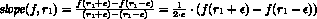

练习 455。将这个数学公式翻译成 ISL+函数斜率，该斜率将函数 f 和数字 r1 映射到 f 在 r1 处的斜率。假设ε是一个全局常数。在你的例子中，使用你可以确定确切斜率的函数，比如水平线、线性函数，如果你知道一些微积分，也许还可以是多项式。

第二部分领域知识涉及切线的根，它只是一个直线或线性函数。切线通过(r1, f(r1))，并且具有上述斜率。从数学上讲，它被定义为

> 

找到切线的根意味着找到一个值 root-of-tangent，使得 tangent(root-of-tangent)等于 0：

> 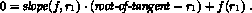

我们可以以直接的方式解这个方程：

> 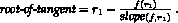

练习 456。设计一个函数，称为切线根，它将 f 和 r1 映射到通过(r1, f(r1))的切线的根。

现在我们可以使用设计食谱将牛顿过程的描述翻译成 ISL+程序。这个函数——让我们称它为 newton，以纪念其发明者——接受一个函数 f 和一个数字 r1：

> | ; [数字 -> 数字] 数字 -> 数字 |
> | --- |
> | ; 找到一个数 r，使得(f r)很小 |
> | ; 生成重复生成改进的猜测 |
> | ([define](http://docs.racket-lang.org/htdp-langs/intermediate-lam.html#%28form._%28%28lib._lang%2Fhtdp-intermediate-lambda..rkt%29._define%29%29) (newton f r1) 1.0) |

对于牛顿法的模板，我们转向生成递归设计食谱的中心四个问题：

1.  如果(f r1)足够接近 0，问题就解决了。接近 0 可能意味着(f r1)是一个很小的正数或很小的负数。因此，我们检查它的绝对值：

    > ([<=](http://docs.racket-lang.org/htdp-langs/intermediate-lam.html#%28def._htdp-intermediate-lambda._%28%28lib._lang%2Fhtdp-intermediate-lambda..rkt%29._~3c~3d%29%29) ([abs](http://docs.racket-lang.org/htdp-langs/intermediate-lam.html#%28def._htdp-intermediate-lambda._%28%28lib._lang%2Fhtdp-intermediate-lambda..rkt%29._abs%29%29) (f r1)) ε))

1.  解是 r1。

1.  算法的生成步骤包括在 r1 处找到 f 的切线的根，这生成了下一个猜测。通过将牛顿应用于 f 和这个新猜测，我们继续这个过程。

1.  递归的答案是原始问题的答案。

> > > | ; [Number -> Number] Number -> Number |
> > > | --- |
> > > | ; 找到一个数 r，使得([<=](http://docs.racket-lang.org/htdp-langs/intermediate-lam.html#%28def._htdp-intermediate-lambda._%28%28lib._lang%2Fhtdp-intermediate-lambda..rkt%29._~3c~3d%29%29)  ([abs](http://docs.racket-lang.org/htdp-langs/intermediate-lam.html#%28def._htdp-intermediate-lambda._%28%28lib._lang%2Fhtdp-intermediate-lambda..rkt%29._abs%29%29)  (f  r)))  ε) |
> > > |   |
> > > | ([check-within](http://docs.racket-lang.org/htdp-langs/intermediate-lam.html#%28form._%28%28lib._lang%2Fhtdp-intermediate-lambda..rkt%29._check-within%29%29) (newton poly 1) 2 ε)) |
> > > | ([check-within](http://docs.racket-lang.org/htdp-langs/intermediate-lam.html#%28form._%28%28lib._lang%2Fhtdp-intermediate-lambda..rkt%29._check-within%29%29) (newton poly 3.5) 4 ε)) |
> > > |   |
> > > | ([define](http://docs.racket-lang.org/htdp-langs/intermediate-lam.html#%28form._%28%28lib._lang%2Fhtdp-intermediate-lambda..rkt%29._define%29%29) (newton f r1) |
> > > |   ([cond](http://docs.racket-lang.org/htdp-langs/intermediate-lam.html#%28form._%28%28lib._lang%2Fhtdp-intermediate-lambda..rkt%29._cond%29%29) |
> > > |     [([<=](http://docs.racket-lang.org/htdp-langs/intermediate-lam.html#%28def._htdp-intermediate-lambda._%28%28lib._lang%2Fhtdp-intermediate-lambda..rkt%29._~3c~3d%29%29) ([abs](http://docs.racket-lang.org/htdp-langs/intermediate-lam.html#%28def._htdp-intermediate-lambda._%28%28lib._lang%2Fhtdp-intermediate-lambda..rkt%29._abs%29%29) (f r1)) ε) r1] |
> > > |     [[else](http://docs.racket-lang.org/htdp-langs/intermediate-lam.html#%28form._%28%28lib._lang%2Fhtdp-intermediate-lambda..rkt%29._else%29%29) (newton f (root-of-tangent f r1))])) |
> > > |   |
> > > | ; 参见练习 455 |
> > > | ([定义](http://docs.racket-lang.org/htdp-langs/intermediate-lam.html#%28form._%28%28lib._lang%2Fhtdp-intermediate-lambda..rkt%29._define%29%29) (slope f r) [...](http://docs.racket-lang.org/htdp-langs/intermediate-lam.html#%28form._%28%28lib._lang%2Fhtdp-intermediate-lambda..rkt%29._......%29%29)) |
> > > |   |
> > > | ; 参见练习 456 |
> > > | ([定义](http://docs.racket-lang.org/htdp-langs/intermediate-lam.html#%28form._%28%28lib._lang%2Fhtdp-intermediate-lambda..rkt%29._define%29%29) (tangent-root f r) [...](http://docs.racket-lang.org/htdp-langs/intermediate-lam.html#%28form._%28%28lib._lang%2Fhtdp-intermediate-lambda..rkt%29._......%29%29)) |
> > > 
> 图 161：牛顿过程

图 161 显示了牛顿方法。它包括两个测试，这些测试是从二分查找中为查找根而派生出来的。毕竟，这两个函数都在寻找函数的根，而多项式有两个已知的根。

> > > > 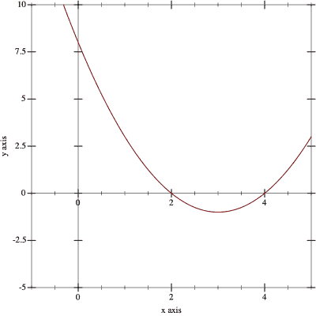
> > > > 
> 图 162：多项式在区间[-1,5]上的图像

我们还没有完成牛顿的设计。设计食谱中的新第七步要求调查函数的终止行为。对于牛顿方法，问题出现在多项式`poly`上：

> | ; 数字 -> 数字 |
> | --- |
> | ([定义](http://docs.racket-lang.org/htdp-langs/intermediate-lam.html#%28form._%28%28lib._lang%2Fhtdp-intermediate-lambda..rkt%29._define%29%29) (poly x) ([*](http://docs.racket-lang.org/htdp-langs/intermediate-lam.html#%28def._htdp-intermediate-lambda._%28%28lib._lang%2Fhtdp-intermediate-lambda..rkt%29._%2A%29%29) ([-](http://docs.racket-lang.org/htdp-langs/intermediate-lam.html#%28def._htdp-intermediate-lambda._%28%28lib._lang%2Fhtdp-intermediate-lambda..rkt%29._-%29%29) x 2) ([-](http://docs.racket-lang.org/htdp-langs/intermediate-lam.html#%28def._htdp-intermediate-lambda._%28%28lib._lang%2Fhtdp-intermediate-lambda..rkt%29._-%29%29) x 4))) |

正如之前提到的，它的根是 2 和 4。图 162 中的多项式图像证实了这些根，并且还显示在这两个根之间函数变得平坦。对于一个有数学倾向的人来说，这种形状会引发一个问题：对于初始猜测为 3 的情况，牛顿计算的是什么：

> | > (poly 3) |
> | --- |
> | -1 |
> | > (newton poly 3) |
> | /:除以零 |

解释是斜率函数产生了一个“坏”值，而切线根函数将其转换为一个错误：

> | > (slope poly 3) |
> | --- |
> | 0 |
> | > (tangent-root poly 3) |
> | /:除以零 |

除了这个运行时错误之外，牛顿法在终止方面还表现出两个其他问题。幸运的是，我们可以用 poly 来证明这两个问题。第一个问题涉及数字的性质，我们在数的算术中简要提到了这一点。对于许多编程初学者的练习来说，忽略精确数和不精确数之间的区别是安全的，但当数学被翻译成程序时，你需要极端谨慎地进行。考虑以下情况：

> | > (newton poly 2.9999) |
> | --- |

一个 ISL+程序将 2.9999 视为精确数，并且 newton 中的计算将其作为精确数处理，尽管因为数字不是整数，计算使用精确有理分数。由于分数的算术可能比不精确数的算术慢得多，因此上述函数调用在 DrRacket 中需要相当长的时间。根据你的计算机，这可能需要几秒钟到一分钟或更长时间。如果你恰好选择了触发这种计算的其他数字，这可能会让你觉得 newton 的调用根本不会终止。第二个问题涉及非终止。以下是一个例子：

> | > (newton poly #i3.0) |
> | --- |

它使用不精确数#i3.0 作为初始猜测，这与 3 不同，会导致不同类型的问题。具体来说，斜率函数现在为 poly 产生一个不精确的 0，而切线根跳到无穷大：

> | > (slope poly #i3.0) |
> | --- |
> | #i0.0 |
> | > (root-of-tangent poly #i3.0) |
> | #i+inf.0 |

结果，评估立即陷入无限循环。在牛顿法中，#i+inf.0 被转换为+nan.0，这是一种表示“不是一个数字”的数据。大多数算术运算都会传播这个值，这解释了牛顿的行为。

简而言之，牛顿在复杂的终止行为方面表现出全面的问题。对于某些输入，该函数产生正确的结果。对于某些其他输入，它发出错误信号。而对于其他一些输入，它进入无限循环或看似进入无限循环。牛顿的标题——或者某些其他写作——必须警告希望使用该函数的人以及未来的读者，这些复杂性，并且常见的编程语言中的良好数学库就是这样做的。

练习 457：设计函数 double-amount，这个练习是由 Adrian German 提出的。该函数计算在储蓄账户按月固定利率支付利息的情况下，需要多少个月才能使给定金额翻倍。

领域知识通过微小的代数操作，你可以证明给定的金额并不重要。只有利率才是关键。此外，领域专家知道，只要利率 r“小”，大约在 72/r 个月后就会翻倍。

#### 28.2 数值积分🔗 "链接至此")

许多物理问题可以归结为确定曲线下的面积：

> 样例问题 A 一辆汽车以每秒 v 米的恒定速度行驶。它在 5 秒、10 秒、15 秒内行驶多远？
> 
> 一枚火箭以的恒定加速度率起飞。它在 5 秒、10 秒、15 秒后达到多高？

物理学告诉我们，如果一辆车以恒定速度 v 行驶 t 秒，它将行驶米。对于加速的车辆，行驶的距离取决于时间 t 通过平方：

> 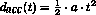

通常，定律告诉我们距离对应于速度 v(t)随时间 t 变化的图形下的面积。

> > > > 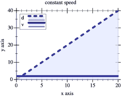    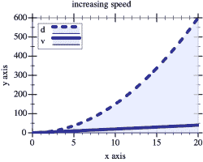
> > > > 
> 图 163：恒定速度与加速速度下的行驶距离

图 163 以图形方式展示了这一概念。在左侧，我们看到两个图的叠加：实线是车辆的速度，上升的虚线是行驶的距离。快速检查显示，后者确实是前者与每个时间点的 x 轴所确定的面积。同样，右侧的图显示了以恒定增加速度移动的火箭与它达到的高度之间的关系。确定函数在某个特定区间下的图形下的面积称为（函数）积分。

虽然数学家知道两个样本问题的公式，可以给出精确答案，但一般问题需要计算解决方案。问题是曲线通常具有复杂的形状，更像是图 164 中的那些，这表明有人需要知道 x 轴、标记为 a 和 b 的垂直线以及 f 的图形之间的面积。应用数学家以近似的方式确定这样的面积，通过求和许多小几何形状的面积。因此，自然地开发处理这些计算的算法。

> > > 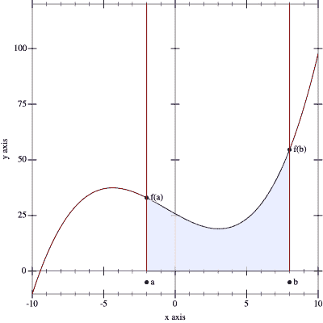
> > > 
> 图 164：在 a 和 b 之间对函数 f 进行积分

一个积分算法消耗三个输入：函数 f 和两个边界，a 和 b。第四部分，x 轴，是隐含的。这表明以下签名：

> ; [数字 -> 数字] 数字  数字 -> 数字

为了理解积分背后的概念，最好研究简单的例子，如常数函数或线性函数。因此，考虑

> ([定义](http://docs.racket-lang.org/htdp-langs/intermediate-lam.html#%28form._%28%28lib._lang%2Fhtdp-intermediate-lambda..rkt%29._define%29%29) (constant x) 20)

将常数传递给积分，再加上 12 和 22，描述了一个宽度为 10、高度为 20 的矩形。这个矩形的面积是 200，这意味着我们得到了这个测试：

> ([检查期望](http://docs.racket-lang.org/htdp-langs/intermediate-lam.html#%28form._%28%28lib._lang%2Fhtdp-intermediate-lambda..rkt%29._check-expect%29%29) (积分 常数 12 22) 200)

同样，让我们使用线性来创建第二个测试：

> ([定义](http://docs.racket-lang.org/htdp-langs/intermediate-lam.html#%28form._%28%28lib._lang%2Fhtdp-intermediate-lambda..rkt%29._define%29%29) (线性 x) ([乘](http://docs.racket-lang.org/htdp-langs/intermediate-lam.html#%28def._htdp-intermediate-lambda._%28%28lib._lang%2Fhtdp-intermediate-lambda..rkt%29._%2A%29%29) 2 x))

如果我们使用线性、0 和 10 与积分一起，面积将是一个底边宽度为 10、高度为 20 的三角形。以下是一个作为测试的例子：

> ([检查期望](http://docs.racket-lang.org/htdp-langs/intermediate-lam.html#%28form._%28%28lib._lang%2Fhtdp-intermediate-lambda..rkt%29._check-expect%29%29) (积分 线性 0 10) 100)

总的来说，三角形的面积是其底边宽度和高度的乘积的一半。作为一个第三例子，我们利用一些特定领域的知识。正如所提到的，数学家知道如何精确地确定某些函数下的面积。例如，函数

> 

在区间 [a,b] 上的面积可以用以下公式计算

> 

这里是如何将这个想法转化为具体测试的方法：

> | ([定义](http://docs.racket-lang.org/htdp-langs/intermediate-lam.html#%28form._%28%28lib._lang%2Fhtdp-intermediate-lambda..rkt%29._define%29%29) ([平方](http://docs.racket-lang.org/teachpack/2htdpimage.html#%28def._%28%28lib._2htdp%2Fimage..rkt%29._square%29%29) x) ([乘](http://docs.racket-lang.org/htdp-langs/intermediate-lam.html#%28def._htdp-intermediate-lambda._%28%28lib._lang%2Fhtdp-intermediate-lambda..rkt%29._%2A%29%29) 3 ([平方](http://docs.racket-lang.org/htdp-langs/intermediate-lam.html#%28def._htdp-intermediate-lambda._%28%28lib._lang%2Fhtdp-intermediate-lambda..rkt%29._sqr%29%29) x))) |
> | --- |
> |   |
> | ([检查期望](http://docs.racket-lang.org/htdp-langs/intermediate-lam.html#%28form._%28%28lib._lang%2Fhtdp-intermediate-lambda..rkt%29._check-expect%29%29) (积分 ([平方](http://docs.racket-lang.org/teachpack/2htdpimage.html#%28def._%28%28lib._2htdp%2Fimage..rkt%29._square%29%29) 0 10)) |
> | |             ([-](http://docs.racket-lang.org/htdp-langs/intermediate-lam.html#%28def._htdp-intermediate-lambda._%28%28lib._lang%2Fhtdp-intermediate-lambda..rkt%29._-%29%29) ([expt](http://docs.racket-lang.org/htdp-langs/intermediate-lam.html#%28def._htdp-intermediate-lambda._%28%28lib._lang%2Fhtdp-intermediate-lambda..rkt%29._expt%29%29) 10 3) ([expt](http://docs.racket-lang.org/htdp-langs/intermediate-lam.html#%28def._htdp-intermediate-lambda._%28%28lib._lang%2Fhtdp-intermediate-lambda..rkt%29._expt%29%29) 0 3))) |
> > > | ([define](http://docs.racket-lang.org/htdp-langs/intermediate-lam.html#%28form._%28%28lib._lang%2Fhtdp-intermediate-lambda..rkt%29._define%29%29) ε 0.1) |
> > > | |         |
> > > | ; [数字 -> 数字] 数字  数字 -> 数字 |
> > > | ; 计算函数 f 在 a 和 b 之间的图形下的面积 |
> > > | ; 假设([<](http://docs.racket-lang.org/htdp-langs/intermediate-lam.html#%28def._htdp-intermediate-lambda._%28%28lib._lang%2Fhtdp-intermediate-lambda..rkt%29._~3c%29%29) a b)成立 |
> > > | |         |
> > > | ([check-within](http://docs.racket-lang.org/htdp-langs/intermediate-lam.html#%28form._%28%28lib._lang%2Fhtdp-intermediate-lambda..rkt%29._check-within%29%29) (integrate ([lambda](http://docs.racket-lang.org/htdp-langs/intermediate-lam.html#%28form._%28%28lib._lang%2Fhtdp-intermediate-lambda..rkt%29._lambda%29%29) (x) 20) 12 22) 200 ε) |
> > > | ([check-within](http://docs.racket-lang.org/htdp-langs/intermediate-lam.html#%28form._%28%28lib._lang%2Fhtdp-intermediate-lambda..rkt%29._check-within%29%29) (integrate ([lambda](http://docs.racket-lang.org/htdp-langs/intermediate-lam.html#%28form._%28%28lib._lang%2Fhtdp-intermediate-lambda..rkt%29._lambda%29%29) (x) ([*](http://docs.racket-lang.org/htdp-langs/intermediate-lam.html#%28def._htdp-intermediate-lambda._%28%28lib._lang%2Fhtdp-intermediate-lambda..rkt%29._%2A%29%29) 2 x)) 0 10) 100 ε) |
> > > | ([check-within](http://docs.racket-lang.org/htdp-langs/intermediate-lam.html#%28form._%28%28lib._lang%2Fhtdp-intermediate-lambda..rkt%29._check-within%29%29) (integrate ([lambda](http://docs.racket-lang.org/htdp-langs/intermediate-lam.html#%28form._%28%28lib._lang%2Fhtdp-intermediate-lambda..rkt%29._lambda%29%29) (x) ([*](http://docs.racket-lang.org/htdp-langs/intermediate-lam.html#%28def._htdp-intermediate-lambda._%28%28lib._lang%2Fhtdp-intermediate-lambda..rkt%29._%2A%29%29) 3 ([sqr](http://docs.racket-lang.org/htdp-langs/intermediate-lam.html#%28def._htdp-intermediate-lambda._%28%28lib._lang%2Fhtdp-intermediate-lambda..rkt%29._sqr%29%29) x))) 0 10) |
> > > | |             1000 |
> > > | |             ε) |
> > > | |         |
> > > | ([define](http://docs.racket-lang.org/htdp-langs/intermediate-lam.html#%28form._%28%28lib._lang%2Fhtdp-intermediate-lambda..rkt%29._define%29%29) (integrate f a b) #i0.0) |
> > > 
> 图 165：一个通用的积分函数

图 165 收集了设计食谱的前三个步骤的结果。该图添加了一个目的声明和一个关于两个区间边界的明显假设。它使用 [check-within](http://docs.racket-lang.org/htdp-langs/intermediate-lam.html#%28form._%28%28lib._lang%2Fhtdp-intermediate-lambda..rkt%29._check-within%29%29) 而不是 [check-expect](http://docs.racket-lang.org/htdp-langs/intermediate-lam.html#%28form._%28%28lib._lang%2Fhtdp-intermediate-lambda..rkt%29._check-expect%29%29)，这预示着计算近似中的数值不准确性。类似地，integrate 的头部指定 #i0.0 作为返回结果，表明该函数预期返回一个不精确的数字。

以下两个练习展示了如何将领域知识转化为积分函数。这两个函数都计算了相当粗糙的近似。虽然第一个函数的设计仅使用了数学公式，但第二个函数还利用了一些结构设计思想。解决这些练习将有助于理解本节的核心，该节介绍了生成-递归积分算法。

练习 458。开普勒提出了一种简单的积分方法。为了计算 f 在 a 和 b 之间的面积估计，按照以下步骤进行：

1.  将区间分为一半，中点为 mid = (a + b) / 2;

1.  计算这两个梯形的面积：

    +   [(a,0),(a,f(a)),(mid,0),(mid,f(mid))]

    +   [(mid,0),(mid,f(mid)),(b,0),(b,f(b))];

1.  然后将两个面积相加。

领域知识 让我们来看看这些梯形。这里有两种可能的形状，带有最少的注释以减少混乱：

> 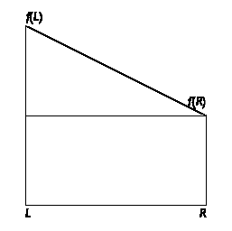 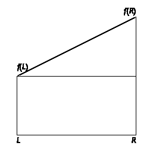

左边的形状假设 f(L) > f(R)，而右边的形状显示了 f(L) < f(R) 的情况。尽管存在不对称性，仍然可以使用单个公式计算这些梯形的面积：

> 

停止！说服自己这个公式为左边的梯形添加了三角形的面积和下方矩形的面积，而对于右边的梯形则从大矩形的面积中减去三角形。同时证明上述公式等于

> 

这是对公式不对称性的数学验证。

设计 integrate-kepler 函数。即将数学知识转化为 ISL+ 函数。将 图 165 中的测试用例适应到这个用途。三个测试中哪一个失败了，以及失败了多少？

练习 459：另一种简单的积分方法是将面积分成许多小矩形。每个矩形具有固定的宽度，高度与矩形中间的函数图形相同。将矩形的面积相加，可以得到函数图形下的面积估计值。

让我们使用

> R = 10

表示要考虑的矩形数量。因此，每个矩形的宽度是

> 

这些矩形中的一个的高度是 f 在其中点的值。第一个中点显然在 a 加上矩形宽度的一半，

> 

这意味着其面积是

> 

要计算第二个矩形的面积，我们必须将一个矩形的宽度加到第一个中点：

> 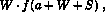

对于第三个，我们得到

> 

通常，我们可以使用以下公式来表示第 i 个矩形的面积：

> 

第一个矩形索引为 0，最后一个为 R - 1。使用这些矩形，我们现在可以确定图形下的面积：

> 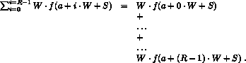

将过程描述转换为 ISL+ 函数并命名为 integrate-rectangles。将 图 165 中的测试用例适应到这个情况。

算法使用的矩形越多，其估计值就越接近实际面积。将 R 设为一个顶级常量，并按 10 的倍数增加，直到算法的精度消除了 ε 值为 0.1 的问题。

将 ε 降低到 0.01 并增加 R，直到消除任何失败的测试用例。将结果与 练习 458 进行比较。

练习 458 中的开普勒方法立即暗示了一种类似于在 二分查找 中引入的二分查找策略的分治策略。粗略地说，算法会将区间分成两部分，递归地计算每部分的面积，然后将两个结果相加。

练习 460：开发 integrate-dc 算法，该算法使用分治策略在边界 a 和 b 之间对函数 f 进行积分。当区间足够小的时候使用开普勒方法。

练习 460 中的分而治之方法效率低下。考虑一个图形在某一部分是水平的，而在另一部分快速变化的函数；参见图 166 中的具体示例。对于图形上的水平部分，继续分割区间是没有意义的。计算整个区间的梯形与计算两个半部分一样简单。然而，对于“波浪形”部分，算法必须继续分割区间，直到图形的不规则性合理地小。

> > > > 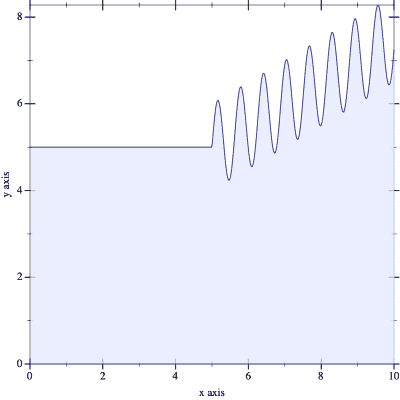
> > > > 
> 图 166：自适应积分的候选

为了发现 f 何时是水平的，我们可以按如下方式修改算法。不是仅仅测试区间有多大，新的算法计算三个梯形的面积：给定的一个和两个半部分。如果这两个之间的差异小于高度为ε和宽度的小矩形的面积，

> 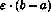

可以安全地假设整体面积是一个很好的近似。换句话说，算法确定 f 是否变化得太多以至于影响误差范围。如果是这样，它将继续使用分而治之的方法；否则它停止并使用开普勒近似。

练习 461。设计积分自适应。也就是说，将递归过程描述转换为 ISL+算法。确保将图 165 中的测试用例适应于此用途。

不要讨论积分自适应的终止问题。

积分自适应是否总是比练习 459 中的积分-开普勒或积分-矩形计算更好的答案？积分自适应保证改善哪个方面？

术语该算法被称为自适应积分，因为它自动将时间分配给那些需要它的图形部分，并在其他部分花费很少的时间。具体来说，对于 f 中水平的部分，它只进行少量计算；对于其他部分，它检查小区间以减小误差范围。计算机科学知道许多自适应算法，而积分自适应只是其中之一。

#### 28.3 项目：高斯消元法🔗 "链接至此")

数学家不仅寻找一元方程的解；他们还研究整个线性方程组：

> 样例问题在一个以物易物的世界中，煤炭（x）、石油（y）和天然气（z）的价值由以下交换方程确定：
> 
> > 

这样一个方程组的解是一组数字的集合，每个变量对应一个数字，如果我们用相应的数字替换变量，每个方程的两边都会得到相同的数字。在我们的例子中，解是

> x = 1, y = 1, 和 z = 2。

我们可以很容易地验证这个说法：

> 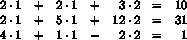

三个方程可以化简为

> 10 = 10, 31 = 31, 和 1 =1。
> 
> > > | ; 一个 SOE 是一个非空 矩阵。 |
> > > | --- |
> > > | ; 对于 ([列表](http://docs.racket-lang.org/htdp-langs/intermediate-lam.html#%28def._htdp-intermediate-lambda._%28%28lib._lang%2Fhtdp-intermediate-lambda..rkt%29._list%29%29)  r1 [...](http://docs.racket-lang.org/htdp-langs/intermediate-lam.html#%28form._%28%28lib._lang%2Fhtdp-intermediate-lambda..rkt%29._......%29%29)  rn), (长度 ri) 是 ([+](http://docs.racket-lang.org/htdp-langs/intermediate-lam.html#%28def._htdp-intermediate-lambda._%28%28lib._lang%2Fhtdp-intermediate-lambda..rkt%29._%2B%29%29)  n  1) |
> > > | ; 解释表示一个线性方程组 |
> > > |   |
> > > | ; 一个方程是一个 [列表  数字]。 |
> > > | ; 约束一个 方程 至少包含两个数字。 |
> > > | ; 解释如果 ([列表](http://docs.racket-lang.org/htdp-langs/intermediate-lam.html#%28def._htdp-intermediate-lambda._%28%28lib._lang%2Fhtdp-intermediate-lambda..rkt%29._list%29%29)  a1 [...](http://docs.racket-lang.org/htdp-langs/intermediate-lam.html#%28form._%28%28lib._lang%2Fhtdp-intermediate-lambda..rkt%29._......%29%29)  an b) 是一个 方程， |
> > > | ; a1, ..., an 是左侧变量的系数 |
> > > | ; 并且 b 是右侧 |
> > > |   |
> > > | ; 一个解是一个 [列表  数字] |
> > > |   |
> > > | ([定义](http://docs.racket-lang.org/htdp-langs/intermediate-lam.html#%28form._%28%28lib._lang%2Fhtdp-intermediate-lambda..rkt%29._define%29%29) M ; 一个 SOE |
> > > |   ([列表](http://docs.racket-lang.org/htdp-langs/intermediate-lam.html#%28def._htdp-intermediate-lambda._%28%28lib._lang%2Fhtdp-intermediate-lambda..rkt%29._list%29%29) ([列表](http://docs.racket-lang.org/htdp-langs/intermediate-lam.html#%28def._htdp-intermediate-lambda._%28%28lib._lang%2Fhtdp-intermediate-lambda..rkt%29._list%29%29) 2 2  3 10) ; 一个 方程 |
> > > |         ([列表](http://docs.racket-lang.org/htdp-langs/intermediate-lam.html#%28def._htdp-intermediate-lambda._%28%28lib._lang%2Fhtdp-intermediate-lambda..rkt%29._list%29%29) 2 5 12 31) |
> > > |         ([列表](http://docs.racket-lang.org/htdp-langs/intermediate-lam.html#%28def._htdp-intermediate-lambda._%28%28lib._lang%2Fhtdp-intermediate-lambda..rkt%29._list%29%29) 4 1 -2  1))) |
> > > |   |
> > > | ([define](http://docs.racket-lang.org/htdp-langs/intermediate-lam.html#%28form._%28%28lib._lang%2Fhtdp-intermediate-lambda..rkt%29._define%29%29) S '(1 1 2)) ; 解 |
> > > 
> 图 167：方程组的表示

图 167 介绍了我们问题域的数据表示。它包括一个方程组的示例及其解。这种表示捕捉了方程组的本质，即左侧变量的数值系数和右侧的值。变量的名称不起任何作用，因为它们就像函数的参数；也就是说，只要它们被一致地重命名，方程就有相同的解。

在本节的其余部分，使用这些函数是方便的：

> | ; 方程 -> [列表  数字] |
> | --- |
> | ; 从矩阵的行中提取左侧 |
> | ([check-expect](http://docs.racket-lang.org/htdp-langs/intermediate-lam.html#%28form._%28%28lib._lang%2Fhtdp-intermediate-lambda..rkt%29._check-expect%29%29) (lhs ([first](http://docs.racket-lang.org/htdp-langs/intermediate-lam.html#%28def._htdp-intermediate-lambda._%28%28lib._lang%2Fhtdp-intermediate-lambda..rkt%29._first%29%29) M)) '(2 2 3)) |
> | ([define](http://docs.racket-lang.org/htdp-langs/intermediate-lam.html#%28form._%28%28lib._lang%2Fhtdp-intermediate-lambda..rkt%29._define%29%29) (lhs e) |
> |   ([reverse](http://docs.racket-lang.org/htdp-langs/intermediate-lam.html#%28def._htdp-intermediate-lambda._%28%28lib._lang%2Fhtdp-intermediate-lambda..rkt%29._reverse%29%29) ([rest](http://docs.racket-lang.org/htdp-langs/intermediate-lam.html#%28def._htdp-intermediate-lambda._%28%28lib._lang%2Fhtdp-intermediate-lambda..rkt%29._rest%29%29) ([reverse](http://docs.racket-lang.org/htdp-langs/intermediate-lam.html#%28def._htdp-intermediate-lambda._%28%28lib._lang%2Fhtdp-intermediate-lambda..rkt%29._reverse%29%29) e)))) |
> |   |
> | ; 方程 -> 数字 |
> | ; 从矩阵的行中提取右侧 |
> | ([check-expect](http://docs.racket-lang.org/htdp-langs/intermediate-lam.html#%28form._%28%28lib._lang%2Fhtdp-intermediate-lambda..rkt%29._check-expect%29%29) (rhs ([first](http://docs.racket-lang.org/htdp-langs/intermediate-lam.html#%28def._htdp-intermediate-lambda._%28%28lib._lang%2Fhtdp-intermediate-lambda..rkt%29._first%29%29) M)) 10) |
> | ([define](http://docs.racket-lang.org/htdp-langs/intermediate-lam.html#%28form._%28%28lib._lang%2Fhtdp-intermediate-lambda..rkt%29._define%29%29) (rhs e) |
> | |    ([first](http://docs.racket-lang.org/htdp-langs/intermediate-lam.html#%28def._htdp-intermediate-lambda._%28%28lib._lang%2Fhtdp-intermediate-lambda..rkt%29._first%29%29) ([reverse](http://docs.racket-lang.org/htdp-langs/intermediate-lam.html#%28def._htdp-intermediate-lambda._%28%28lib._lang%2Fhtdp-intermediate-lambda..rkt%29._reverse%29%29) e))) |

练习 462。设计函数 check-solution。它消耗一个 SOE 和一个解。如果将解中的数字用于 SOE 中的方程中的变量，产生相等的左侧值和右侧值，则其结果为#true；否则，函数产生#false。使用 check-solution 来制定[check-satisfied](http://docs.racket-lang.org/htdp-langs/intermediate-lam.html#%28form._%28%28lib._lang%2Fhtdp-intermediate-lambda..rkt%29._check-satisfied%29%29)测试。

提示：首先设计函数插件。它消耗一个方程的左侧和一个解，并计算出当解中的数字用于变量时左侧的值。

高斯消元法是求解线性方程组的标准方法。它包括两个步骤。第一步是将方程组转换成形状不同但具有相同解的方程组。第二步是逐个求解一个方程。在这里，我们关注第一步，因为它又是生成递归的另一个有趣实例。

高斯消元算法的第一步被称为“三角化”，因为结果是三角形形状的方程组。相比之下，原始系统是一个矩形。为了理解这个术语，请看这个列表，它代表了原始系统：

> | ([列表](http://docs.racket-lang.org/htdp-langs/intermediate-lam.html#%28def._htdp-intermediate-lambda._%28%28lib._lang%2Fhtdp-intermediate-lambda..rkt%29._list%29%29) ([列表](http://docs.racket-lang.org/htdp-langs/intermediate-lam.html#%28def._htdp-intermediate-lambda._%28%28lib._lang%2Fhtdp-intermediate-lambda..rkt%29._list%29%29) 2 2  3 10) |
> | --- |
> | |    ([列表](http://docs.racket-lang.org/htdp-langs/intermediate-lam.html#%28def._htdp-intermediate-lambda._%28%28lib._lang%2Fhtdp-intermediate-lambda..rkt%29._list%29%29) 2 5 12 31) |
> | |    ([列表](http://docs.racket-lang.org/htdp-langs/intermediate-lam.html#%28def._htdp-intermediate-lambda._%28%28lib._lang%2Fhtdp-intermediate-lambda..rkt%29._list%29%29) 4 1 -2 1)) |

三角化将这个矩阵转换成以下形式：

> | ([列表](http://docs.racket-lang.org/htdp-langs/intermediate-lam.html#%28def._htdp-intermediate-lambda._%28%28lib._lang%2Fhtdp-intermediate-lambda..rkt%29._list%29%29) ([列表](http://docs.racket-lang.org/htdp-langs/intermediate-lam.html#%28def._htdp-intermediate-lambda._%28%28lib._lang%2Fhtdp-intermediate-lambda..rkt%29._list%29%29) 2 2 3 10)） |
> | --- |
> | （[列表](http://docs.racket-lang.org/htdp-langs/intermediate-lam.html#%28def._htdp-intermediate-lambda._%28%28lib._lang%2Fhtdp-intermediate-lambda..rkt%29._list%29%29) 3 9 21） |
> | （[列表](http://docs.racket-lang.org/htdp-langs/intermediate-lam.html#%28def._htdp-intermediate-lambda._%28%28lib._lang%2Fhtdp-intermediate-lambda..rkt%29._list%29%29) 1 2） |

如承诺的那样，这个方程组的形状（大致）是一个三角形。练习 463。检查以下方程组

> 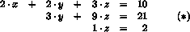

它与标记为  的解相同。通过手动操作和检查 练习 462 中的 check-solution 来完成此操作。三角化的关键思想是从剩余的方程中减去第一个 方程。从一个 方程 减去另一个 方程 意味着从两个 方程 中的对应系数中减去。以我们的运行示例，从第二个方程中减去第一个方程得到以下矩阵：

> | ([列表](http://docs.racket-lang.org/htdp-langs/intermediate-lam.html#%28def._htdp-intermediate-lambda._%28%28lib._lang%2Fhtdp-intermediate-lambda..rkt%29._list%29%29) ([列表](http://docs.racket-lang.org/htdp-langs/intermediate-lam.html#%28def._htdp-intermediate-lambda._%28%28lib._lang%2Fhtdp-intermediate-lambda..rkt%29._list%29%29) 2 2 3 10)） |
> | --- |
> | （[列表](http://docs.racket-lang.org/htdp-langs/intermediate-lam.html#%28def._htdp-intermediate-lambda._%28%28lib._lang%2Fhtdp-intermediate-lambda..rkt%29._list%29%29) 0 3 9 21） |
> | （[列表](http://docs.racket-lang.org/htdp-langs/intermediate-lam.html#%28def._htdp-intermediate-lambda._%28%28lib._lang%2Fhtdp-intermediate-lambda..rkt%29._list%29%29) 4 1 -2 1） |

这些减法的目标是将除了第一个方程之外的所有方程的第一列置为 0。对于第三个方程，将第一个方程从第三个方程中减去两次，以在第一个位置得到 0：

> | ([列表](http://docs.racket-lang.org/htdp-langs/intermediate-lam.html#%28def._htdp-intermediate-lambda._%28%28lib._lang%2Fhtdp-intermediate-lambda..rkt%29._list%29%29) ([列表](http://docs.racket-lang.org/htdp-langs/intermediate-lam.html#%28def._htdp-intermediate-lambda._%28%28lib._lang%2Fhtdp-intermediate-lambda..rkt%29._list%29%29) 2 2 3 10)） |
> | --- |
> | （[列表](http://docs.racket-lang.org/htdp-langs/intermediate-lam.html#%28def._htdp-intermediate-lambda._%28%28lib._lang%2Fhtdp-intermediate-lambda..rkt%29._list%29%29) 0 3 9 21） |
> | （[列表](http://docs.racket-lang.org/htdp-langs/intermediate-lam.html#%28def._htdp-intermediate-lambda._%28%28lib._lang%2Fhtdp-intermediate-lambda..rkt%29._list%29%29) 0 -3 -8 -19)) |

按照惯例，我们从最后两个方程中省略了前导的 0：

> | ([列表](http://docs.racket-lang.org/htdp-langs/intermediate-lam.html#%28def._htdp-intermediate-lambda._%28%28lib._lang%2Fhtdp-intermediate-lambda..rkt%29._list%29%29) ([列表](http://docs.racket-lang.org/htdp-langs/intermediate-lam.html#%28def._htdp-intermediate-lambda._%28%28lib._lang%2Fhtdp-intermediate-lambda..rkt%29._list%29%29) 2  2  3   10) |
> | --- |
> | （[列表](http://docs.racket-lang.org/htdp-langs/intermediate-lam.html#%28def._htdp-intermediate-lambda._%28%28lib._lang%2Fhtdp-intermediate-lambda..rkt%29._list%29%29)    3  9   21) |
> | （[列表](http://docs.racket-lang.org/htdp-langs/intermediate-lam.html#%28def._htdp-intermediate-lambda._%28%28lib._lang%2Fhtdp-intermediate-lambda..rkt%29._list%29%29)   -3 -8  -19)) |

即，我们首先将第一行中的每个项乘以 2，然后从最后一行减去这个结果。数学教我们如何证明这样的事实。我们使用它们。如前所述，这些减法操作不会改变解；也就是说，原始系统的解也是变换后系统的解。练习 464. 检查以下方程组

> 

是否与标记为  的方程组有相同的解。再次通过手工和 练习 462 中的 check-solution 来做。

练习 465. 设计减法函数。该函数接受两个长度相等的方程。它逐项“减去”第二个方程的倍数，使得结果方程的第一个位置为 0。由于首项系数已知为 0，减法函数返回减法操作后得到的列表的其余部分。

现在考虑剩余的 SOE：

> | ([列表](http://docs.racket-lang.org/htdp-langs/intermediate-lam.html#%28def._htdp-intermediate-lambda._%28%28lib._lang%2Fhtdp-intermediate-lambda..rkt%29._list%29%29) ([列表](http://docs.racket-lang.org/htdp-langs/intermediate-lam.html#%28def._htdp-intermediate-lambda._%28%28lib._lang%2Fhtdp-intermediate-lambda..rkt%29._list%29%29)  3  9   21) |
> | --- |
> | （[列表](http://docs.racket-lang.org/htdp-langs/intermediate-lam.html#%28def._htdp-intermediate-lambda._%28%28lib._lang%2Fhtdp-intermediate-lambda..rkt%29._list%29%29) -3 -8  -19)) |

它也是一个 SOE，因此我们可以再次应用相同的算法。对于我们的运行示例，接下来的减法步骤需要从第二个方程中减去第一个方程 -1 次。这样做得到

> | ([list](http://docs.racket-lang.org/htdp-langs/intermediate-lam.html#%28def._htdp-intermediate-lambda._%28%28lib._lang%2Fhtdp-intermediate-lambda..rkt%29._list%29%29) ([list](http://docs.racket-lang.org/htdp-langs/intermediate-lam.html#%28def._htdp-intermediate-lambda._%28%28lib._lang%2Fhtdp-intermediate-lambda..rkt%29._list%29%29) 3  9 21) |
> | --- |
> |       ([list](http://docs.racket-lang.org/htdp-langs/intermediate-lam.html#%28def._htdp-intermediate-lambda._%28%28lib._lang%2Fhtdp-intermediate-lambda..rkt%29._list%29%29)    1  2)) |

The rest of this SOE is a single equation and cannot be simplified.Exercise 466\. Here is a representation for triangular SOEs:

> | ; A TM is an [NEList-of  Equation] |
> | --- |
> | ; such that the Equations are of decreasing length: |
> | ;   n + 1, n, n - 1, ..., 2. |
> | ; interpretation represents a triangular matrix |

设计三角化算法：

> | ; SOE -> TM |
> | --- |
> | ; triangulates the given system of equations |
> | ([define](http://docs.racket-lang.org/htdp-langs/intermediate-lam.html#%28form._%28%28lib._lang%2Fhtdp-intermediate-lambda..rkt%29._define%29%29) (triangulate M) |
> |   '(1 2)) |

Turn the above example into a test and spell out explicit answers for the four questions based on our loose description.

Do not yet deal with the termination step of the design recipe.

Unfortunately, the solution to exercise 466 occasionally fails to produce the desired triangular system. Consider the following representation of a system of equations:

> | ([list](http://docs.racket-lang.org/htdp-langs/intermediate-lam.html#%28def._htdp-intermediate-lambda._%28%28lib._lang%2Fhtdp-intermediate-lambda..rkt%29._list%29%29) ([list](http://docs.racket-lang.org/htdp-langs/intermediate-lam.html#%28def._htdp-intermediate-lambda._%28%28lib._lang%2Fhtdp-intermediate-lambda..rkt%29._list%29%29) 2  3  3 8) |
> | --- |
> |       ([list](http://docs.racket-lang.org/htdp-langs/intermediate-lam.html#%28def._htdp-intermediate-lambda._%28%28lib._lang%2Fhtdp-intermediate-lambda..rkt%29._list%29%29) 2  3 -2 3) |
> |       ([list](http://docs.racket-lang.org/htdp-langs/intermediate-lam.html#%28def._htdp-intermediate-lambda._%28%28lib._lang%2Fhtdp-intermediate-lambda..rkt%29._list%29%29) 4 -2  2 4)) |

Its solution is x = 1, y = 1, and z = 1.The first step is to subtract the first row from the second and to subtract it twice from the last one, which yields the following matrix:

> | ([list](http://docs.racket-lang.org/htdp-langs/intermediate-lam.html#%28def._htdp-intermediate-lambda._%28%28lib._lang%2Fhtdp-intermediate-lambda..rkt%29._list%29%29) ([list](http://docs.racket-lang.org/htdp-langs/intermediate-lam.html#%28def._htdp-intermediate-lambda._%28%28lib._lang%2Fhtdp-intermediate-lambda..rkt%29._list%29%29) 2  3  3   8) |
> | --- |
> | （[列表](http://docs.racket-lang.org/htdp-langs/intermediate-lam.html#%28def._htdp-intermediate-lambda._%28%28lib._lang%2Fhtdp-intermediate-lambda..rkt%29._list%29%29) 0 -5 -5） |
> | （[列表](http://docs.racket-lang.org/htdp-langs/intermediate-lam.html#%28def._htdp-intermediate-lambda._%28%28lib._lang%2Fhtdp-intermediate-lambda..rkt%29._list%29%29) -8 -4 -12） |

接下来，三角化将专注于矩阵的其余部分：

> | （[列表](http://docs.racket-lang.org/htdp-langs/intermediate-lam.html#%28def._htdp-intermediate-lambda._%28%28lib._lang%2Fhtdp-intermediate-lambda..rkt%29._list%29%29) （[列表](http://docs.racket-lang.org/htdp-langs/intermediate-lam.html#%28def._htdp-intermediate-lambda._%28%28lib._lang%2Fhtdp-intermediate-lambda..rkt%29._list%29%29) 0 -5 -5） |
> | --- |
> | （[列表](http://docs.racket-lang.org/htdp-langs/intermediate-lam.html#%28def._htdp-intermediate-lambda._%28%28lib._lang%2Fhtdp-intermediate-lambda..rkt%29._list%29%29) -8 -4 -12） |

但是这个矩阵的第一个元素是 0。由于除以 0 是不可能的，算法通过减法来发出错误信号。为了克服这个问题，我们需要从我们的问题域中运用另一块知识。数学告诉我们，在一个方程组中交换方程不会影响解。当然，当我们交换方程时，我们最终必须找到一个首项系数不为 0 的方程。在这里，我们可以简单地交换前两个：

> | （[列表](http://docs.racket-lang.org/htdp-langs/intermediate-lam.html#%28def._htdp-intermediate-lambda._%28%28lib._lang%2Fhtdp-intermediate-lambda..rkt%29._list%29%29) （[列表](http://docs.racket-lang.org/htdp-langs/intermediate-lam.html#%28def._htdp-intermediate-lambda._%28%28lib._lang%2Fhtdp-intermediate-lambda..rkt%29._list%29%29) -8 -4 -12） |
> | --- |
> | （[列表](http://docs.racket-lang.org/htdp-langs/intermediate-lam.html#%28def._htdp-intermediate-lambda._%28%28lib._lang%2Fhtdp-intermediate-lambda..rkt%29._list%29%29) 0 -5 -5） |

从这里我们可以像以前一样继续，从剩余的方程中减去第一个方程 0 次。最终的三角矩阵是：

> | （[列表](http://docs.racket-lang.org/htdp-langs/intermediate-lam.html#%28def._htdp-intermediate-lambda._%28%28lib._lang%2Fhtdp-intermediate-lambda..rkt%29._list%29%29) （[列表](http://docs.racket-lang.org/htdp-langs/intermediate-lam.html#%28def._htdp-intermediate-lambda._%28%28lib._lang%2Fhtdp-intermediate-lambda..rkt%29._list%29%29) 2 3 3 8） |
> | --- |
> | （[列表](http://docs.racket-lang.org/htdp-langs/intermediate-lam.html#%28def._htdp-intermediate-lambda._%28%28lib._lang%2Fhtdp-intermediate-lambda..rkt%29._list%29%29) -8 -4 -12） |
> | （[列表](http://docs.racket-lang.org/htdp-langs/intermediate-lam.html#%28def._htdp-intermediate-lambda._%28%28lib._lang%2Fhtdp-intermediate-lambda..rkt%29._list%29%29) -5 -5） |

停止！证明 x = 1，y = 1 和 z = 1 仍然是这些方程的解。

练习 467。修改 练习 466 中的 triangulate 算法，以便它在从剩余方程中减去第一个方程之前，首先旋转方程以找到一个首项系数不为 0 的方程。

这个算法对所有可能的方程组系统都终止吗？

提示：以下表达式旋转一个非空列表 L：

> ([append](http://docs.racket-lang.org/htdp-langs/intermediate-lam.html#%28def._htdp-intermediate-lambda._%28%28lib._lang%2Fhtdp-intermediate-lambda..rkt%29._append%29%29) ([rest](http://docs.racket-lang.org/htdp-langs/intermediate-lam.html#%28def._htdp-intermediate-lambda._%28%28lib._lang%2Fhtdp-intermediate-lambda..rkt%29._rest%29%29) L) ([list](http://docs.racket-lang.org/htdp-langs/intermediate-lam.html#%28def._htdp-intermediate-lambda._%28%28lib._lang%2Fhtdp-intermediate-lambda..rkt%29._list%29%29) ([first](http://docs.racket-lang.org/htdp-langs/intermediate-lam.html#%28def._htdp-intermediate-lambda._%28%28lib._lang%2Fhtdp-intermediate-lambda..rkt%29._first%29%29) L)))

解释原因。一些 SOE 没有解。考虑这个例子：

> 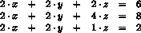

如果你尝试三角化这个 SOE——<wbr>手动或使用你从 练习 467 得到的解决方案——<wbr>你将得到一个中间矩阵，其中所有方程都以 0 开头：

> 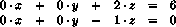

练习 468。修改 练习 467 中的 triangulate，以便它在遇到所有首项系数都为 0 的 SOE 时发出错误信号。

在我们获得如 练习 463 中的 (*) 的三角形方程组后，我们可以逐个解决这些方程。在我们的具体例子中，最后一个方程表明 z 是 2。有了这个知识，我们可以通过替换从第二个方程中消除 z：

> 

这样做，反过来，确定了 y 的值：

> 

现在我们有了 z = 2 和 y = 1，我们可以将这些值代入第一个方程：

> 

这产生了一个单变量方程，我们像这样解决它：

> 

这最终得到了 x 的一个值，从而得到了整个 SOE 的完整解。

练习 469。设计 solve 函数。它消耗三角形的 SOE 并产生一个解。

提示：使用结构递归进行设计。从一个解决 n+1 个变量中一个线性方程的函数的设计开始，给定最后 n 个变量的解。一般来说，这个函数将左侧剩余的值插入进去，从右侧减去结果，然后除以第一个系数。尝试这个建议和上面的例子。

挑战：使用现有的抽象和[lambda](http://docs.racket-lang.org/htdp-langs/intermediate-lam.html#%28form._%28%28lib._lang%2Fhtdp-intermediate-lambda..rkt%29._lambda%29%29)来设计解决方案。

练习 470：定义 gauss，它结合了练习 468 中的三角化函数和练习 469 中的求解函数。

### 29 回溯算法🔗 "链接到这里")

问题解决并不总是沿着一条直线前进。有时我们可能遵循一种方法，却发现我们陷入了困境，因为我们走错了路。一个明显的选择是回溯到我们做出致命决定的地方，并选择不同的方向。一些算法就是这样工作的。本章介绍了两个实例。第一部分讨论了遍历图的算法。第二部分是一个扩展练习，它在棋盘谜题的背景下使用回溯。

#### 29.1 遍历图🔗 "链接到这里")

图在我们的世界和计算世界中无处不在。想象一下一群人，比如你学校的学生。写下所有名字，并连接那些彼此认识的人的名字。你刚刚创建了你第一个无向图。

现在看看图 168，它显示了一个小型的有向图。它由七个节点——<wbr>圈出的字母——<wbr>和九条边——<wbr>箭头组成。这个图可能代表了一个电子邮件网络的简化版本。想象一下一家公司以及所有来回发送的电子邮件。写下所有员工的电子邮件地址。然后，逐个地址地，从地址画箭头到在一周内所有收件人地址。这就是你如何创建图 168 中的有向图，尽管它最终可能看起来要复杂得多，几乎无法穿透。

> > > > 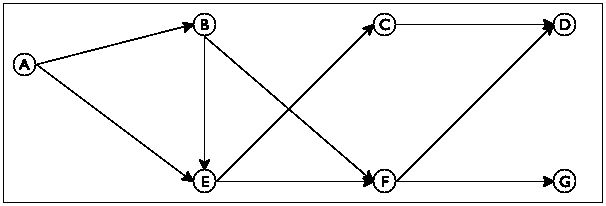
> > > > 
> 图 168：一个有向图

通常，一个图由节点集合和边集合组成，这些边连接节点。在有向图中，边表示节点之间的一向连接；在无向图中，边表示节点之间的双向连接。在这个上下文中，以下是一个常见的问题类型：社会科学家使用这样的算法来了解公司中的权力结构。同样，他们使用这样的图来预测人们的可能活动，即使不知道他们电子邮件的内容。

> 样例问题 设计一个算法，提出一种在大型公司中通过有向电子邮件图将一个人介绍给另一个人的方法。该程序消耗一个表示已建立电子邮件连接的有向图和两个电子邮件地址。它返回一个电子邮件地址序列，这些地址将第一个电子邮件地址与第二个电子邮件地址连接起来。

数学科学家将所需的序列称为路径。图 168 使样例问题具体化。例如，你可能希望测试程序是否可以找到从 C 到 D 的路径。这条特定的路径由起点节点 C 和终点节点 D 组成。相比之下，如果你希望连接 E 和 D，则存在两条路径：

+   从 E 发送电子邮件到 F，然后再发送到 D。

+   从 E 发送电子邮件到 C，然后再发送到 D。

有时可能无法通过路径连接两个节点。在图 168 的图中，您无法通过跟随箭头从 C 移动到 G。

观察到图 168，您可以轻松地找出如何从一个节点移动到另一个节点，而不必过多地思考您是如何做到的。所以想象一下，图 168 是一个大公园。也想象一下，有人告诉你你现在位于 E，你需要到达 G。你可以清楚地看到两条路径，一条通向 C，另一条通向 F。跟随第一条路径，并确保记住从 E 到 F 也是可能的。现在你有一个新的问题，即如何从 C 到 G。关键洞察是，这个新问题就像原始问题一样；它要求你找到从一个节点到另一个节点的路径。此外，如果你能解决这个问题，你就知道如何从 E 到 G——只需添加从 E 到 C 的步骤。但是从 C 到 G 没有路径。幸运的是，你记得从 E 到 F 也是可能的，这意味着你可以回溯到某个你可以做出选择的点，并从那里重新开始搜索。

现在我们以系统化的方式设计这个算法。遵循一般的设计配方，我们首先进行数据分析。以下是图 168 中图的两种紧凑的基于列表的表示：

> |
> 
> | ([定义](http://docs.racket-lang.org/htdp-langs/intermediate-lam.html#%28form._%28%28lib._lang%2Fhtdp-intermediate-lambda..rkt%29._define%29%29) sample-graph | 
> 
> &#124;   '((A (B E)) &#124;
> 
> &#124;     (B (E F)) &#124;
> 
> &#124;     (C (D)) &#124;
> 
> &#124;     (D ()) &#124;
> 
> &#124;     (E (C F)) &#124;
> 
> &#124;     (F (D G)) &#124;
> 
> &#124;     (G ()))) &#124;
> 
> |  |
> | --- |
> 
> &#124; ([define](http://docs.racket-lang.org/htdp-langs/intermediate-lam.html#%28form._%28%28lib._lang%2Fhtdp-intermediate-lambda..rkt%29._define%29%29) sample-graph &#124;
> 
> &#124;   '((A B E) &#124;
> 
> &#124;     (B E F) &#124;
> 
> &#124;     (C D) &#124;
> 
> &#124;     (D) &#124;
> 
> &#124;     (E C F) &#124;
> 
> &#124;     (F D G) &#124;
> 
> &#124;     (G))) &#124;
> 
> |

它们都包含每个节点的一个列表。这些列表以节点的名称开头，后面跟着其（直接）邻居，即通过跟随单个箭头可到达的节点。两者在连接节点及其邻居的方式上有所不同：左边的一个使用 [list](http://docs.racket-lang.org/htdp-langs/intermediate-lam.html#%28def._htdp-intermediate-lambda._%28%28lib._lang%2Fhtdp-intermediate-lambda..rkt%29._list%29%29)，而右边的一个使用 [cons](http://docs.racket-lang.org/htdp-langs/intermediate-lam.html#%28def._htdp-intermediate-lambda._%28%28lib._lang%2Fhtdp-intermediate-lambda..rkt%29._cons%29%29)。例如，第二个列表表示节点 B，它有两个指向 E 和 F 的出边，如 图 168 所示。在左边，'B 是一个两元素列表的第一个名称；在右边，它是三个元素列表的第一个名称。

练习 471. 使用 [list](http://docs.racket-lang.org/htdp-langs/intermediate-lam.html#%28def._htdp-intermediate-lambda._%28%28lib._lang%2Fhtdp-intermediate-lambda..rkt%29._list%29%29) 和合适的符号将上述定义之一转换为正确的列表形式。

节点的数据表示方法简单明了：

> ; 一个节点是一个 符号.

制定一个数据定义来描述所有图表示类的类别，允许任意数量的节点和边。上述表示中只需有一个属于 图。

设计 neighbors 函数。它消耗一个 节点 n 和一个 图 g，并产生 n 在 g 中的直接邻居列表。

使用你的 节点 和 图 数据定义——无论你选择哪一个，只要你也设计了邻居——我们现在可以为 find-path 函数制定一个签名和用途说明，该函数用于在图中搜索路径：

> | ; 节点  节点  图 -> [列表  节点] |
> | --- |
> | ; 在图 G 中从起点到终点查找路径 |
> | ([define](http://docs.racket-lang.org/htdp-langs/intermediate-lam.html#%28form._%28%28lib._lang%2Fhtdp-intermediate-lambda..rkt%29._define%29%29) (find-path origination destination G) |
> |   '()) |

这个头信息留出的空间是结果的精确形状。它暗示结果是节点列表，但它没有说明包含哪些节点。为了欣赏这种歧义及其重要性，让我们研究上面的例子。在 ISL+中，我们现在可以像这样表达它们：

> | (find-path 'C 'D sample-graph) |
> | --- |
> | (find-path 'E 'D sample-graph) |
> | (find-path 'C 'G sample-graph) |

find-path 的第一个调用必须返回一个唯一的路径，第二个调用必须从两个中选择一个，第三个调用必须表示在 sample-graph 中从'C 到'G 没有路径。因此，有两种可能的返回值构造方式：

+   函数的结果包括从起始节点到目标节点的所有节点，包括这两个节点。可以想象其他情况，例如跳过这两个节点中的任何一个。在这种情况下，可以使用空路径来表示两个节点之间没有路径。

+   或者，由于调用本身已经列出了两个节点，输出可以只提到路径的“内部”节点。那么第一次调用的答案将是'()，因为'D 是'C 的直接邻居。当然，'()随后就不再表示失败。

关于没有路径的问题，我们必须选择一个不同的值来表示这个概念。因为#false 是不同的，有意义的，并且在任何情况下都有效，所以我们选择它。至于多条路径的问题，我们现在推迟做出选择，并在示例部分列出两种可能性：

> | ; A Path is a [List-of  Node]. |
> | --- |
> | ; interpretation The list of nodes specifies a sequence |
> | ; of immediate neighbors that leads from the first |
> | ; Node on the list to the last one. |
> |   |
> | ; Node  Node  Graph -> [Maybe  Path] |
> | ; finds a path from origination to destination in G |
> | ; if there is no path, the function produces #false |
> |   |
> | ([check-expect](http://docs.racket-lang.org/htdp-langs/intermediate-lam.html#%28form._%28%28lib._lang%2Fhtdp-intermediate-lambda..rkt%29._check-expect%29%29) (find-path 'C 'D sample-graph) |
> |               '(C D)) |
> | ([check-member-of](http://docs.racket-lang.org/htdp-langs/intermediate-lam.html#%28form._%28%28lib._lang%2Fhtdp-intermediate-lambda..rkt%29._check-member-of%29%29) (find-path 'E 'D sample-graph) |
> |                  '(E F D) '(E C D)) |
> | ([check-expect](http://docs.racket-lang.org/htdp-langs/intermediate-lam.html#%28form._%28%28lib._lang%2Fhtdp-intermediate-lambda..rkt%29._check-expect%29%29) (find-path 'C 'G sample-graph) |
> |               #false) |
> |   |
> | ([define](http://docs.racket-lang.org/htdp-langs/intermediate-lam.html#%28form._%28%28lib._lang%2Fhtdp-intermediate-lambda..rkt%29._define%29%29) (find-path origination destination G) |
> |   #false) |

我们的下一步设计步骤是理解函数的四个基本部分：“简单问题”条件、匹配解决方案、生成新问题以及组合步骤。上述对搜索过程和三个例子的分析提出了答案：

1.  如果给定的两个节点在给定的图中通过箭头直接连接，路径就只包含这两个节点。但还有一个更简单的情况，即当 find-path 的起源参数等于其目的地时。

1.  在第二种情况下，问题真正是微不足道的，匹配的答案是([列表](http://docs.racket-lang.org/htdp-langs/intermediate-lam.html#%28def._htdp-intermediate-lambda._%28%28lib._lang%2Fhtdp-intermediate-lambda..rkt%29._list%29%29)  目的地)。

1.  如果参数不同，算法必须检查起源点的所有直接邻居，并确定从这些邻居中的任何一个到目的地的路径。换句话说，选择这些邻居中的任何一个会产生一个新的“找到路径”问题。

1.  最后，一旦算法从起源点的邻居到目的地找到了路径，构建从前者到后者的完整路径就很容易了——只需将起源节点添加到列表中。

从编程的角度来看，第三点是关键的。由于一个节点可以有任意数量的邻居，因此“检查所有邻居”的任务对于单个原语来说过于复杂。我们需要一个辅助函数，它消耗一个节点列表并为每个节点生成一个新的路径问题。换句话说，这个函数是 find-path 的面向列表版本。让我们称这个辅助函数为 find-path/list，并让我们为它制定一个愿望：

> | ; [列表  节点] 节点  图 -> [可能  路径] |
> | --- |
> | ; 从 lo-originations 上的某个节点找到路径 |
> | ; destination; 否则，它产生 #false |
> | ([定义](http://docs.racket-lang.org/htdp-langs/intermediate-lam.html#%28form._%28%28lib._lang%2Fhtdp-intermediate-lambda..rkt%29._define%29%29) (find-path/list lo-originations 目的地 G) |
> |   #false) |

使用这个愿望，我们可以填写生成递归函数的通用模板，以获得 find-path 的第一个草案：

> | ([定义](http://docs.racket-lang.org/htdp-langs/intermediate-lam.html#%28form._%28%28lib._lang%2Fhtdp-intermediate-lambda..rkt%29._define%29%29) (find-path 起源 目的地 G) |
> | --- |
> |   ([条件](http://docs.racket-lang.org/htdp-langs/intermediate-lam.html#%28form._%28%28lib._lang%2Fhtdp-intermediate-lambda..rkt%29._cond%29%29) |
> |     [([符号=?](http://docs.racket-lang.org/htdp-langs/intermediate-lam.html#%28def._htdp-intermediate-lambda._%28%28lib._lang%2Fhtdp-intermediate-lambda..rkt%29._symbol~3d~3f%29%29) 起源 目的地) |
> |     ([list](http://docs.racket-lang.org/htdp-langs/intermediate-lam.html#%28def._htdp-intermediate-lambda._%28%28lib._lang%2Fhtdp-intermediate-lambda..rkt%29._list%29%29) destination)] |
> |     [[else](http://docs.racket-lang.org/htdp-langs/intermediate-lam.html#%28form._%28%28lib._lang%2Fhtdp-intermediate-lambda..rkt%29._else%29%29) |
> |     ([...](http://docs.racket-lang.org/htdp-langs/intermediate-lam.html#%28form._%28%28lib._lang%2Fhtdp-intermediate-lambda..rkt%29._......%29%29) origination [...](http://docs.racket-lang.org/htdp-langs/intermediate-lam.html#%28form._%28%28lib._lang%2Fhtdp-intermediate-lambda..rkt%29._......%29%29) |
> | ...(neighbors origination G)) |
> |         destination G) [...](http://docs.racket-lang.org/htdp-langs/intermediate-lam.html#%28form._%28%28lib._lang%2Fhtdp-intermediate-lambda..rkt%29._......%29%29))])) |

它使用了来自练习 471 的邻居和 find-path/list 愿望列表函数，否则使用关于生成递归函数的四个问题的答案。设计过程的其余部分是关于如何正确组合这些函数的细节。考虑 find-path/list 的签名。像 find-path 一样，它产生[Maybe Path]。也就是说，如果它从任何邻居中找到一条路径，它就会产生这条路径；否则，如果没有任何邻居连接到目的地，函数将产生#false。因此，find-path 的答案取决于 find-path/list 产生的结果类型，这意味着代码必须用[cond](http://docs.racket-lang.org/htdp-langs/intermediate-lam.html#%28form._%28%28lib._lang%2Fhtdp-intermediate-lambda..rkt%29._cond%29%29)表达式区分两种可能的答案：

> | ([define](http://docs.racket-lang.org/htdp-langs/intermediate-lam.html#%28form._%28%28lib._lang%2Fhtdp-intermediate-lambda..rkt%29._define%29%29) (find-path origination destination G) |
> | --- |
> | ([cond](http://docs.racket-lang.org/htdp-langs/intermediate-lam.html#%28form._%28%28lib._lang%2Fhtdp-intermediate-lambda..rkt%29._cond%29%29) |
> |     ([symbol=?](http://docs.racket-lang.org/htdp-langs/intermediate-lam.html#%28def._htdp-intermediate-lambda._%28%28lib._lang%2Fhtdp-intermediate-lambda..rkt%29._symbol~3d~3f%29%29) origination destination) |
> |     ([list](http://docs.racket-lang.org/htdp-langs/intermediate-lam.html#%28def._htdp-intermediate-lambda._%28%28lib._lang%2Fhtdp-intermediate-lambda..rkt%29._list%29%29) destination)] |
> |     [[else](http://docs.racket-lang.org/htdp-langs/intermediate-lam.html#%28form._%28%28lib._lang%2Fhtdp-intermediate-lambda..rkt%29._else%29%29) |
> |      ([局部](http://docs.racket-lang.org/htdp-langs/intermediate-lam.html#%28form._%28%28lib._lang%2Fhtdp-intermediate-lambda..rkt%29._local%29%29) ([定义](http://docs.racket-lang.org/htdp-langs/intermediate-lam.html#%28form._%28%28lib._lang%2Fhtdp-intermediate-lambda..rkt%29._define%29%29) 下一个 (邻居 起点 G)) |
> |              ([定义](http://docs.racket-lang.org/htdp-langs/intermediate-lam.html#%28form._%28%28lib._lang%2Fhtdp-intermediate-lambda..rkt%29._define%29%29) 候选 |
> |                (查找路径/列表 下一个目的地 G))) |
> |        ([cond](http://docs.racket-lang.org/htdp-langs/intermediate-lam.html#%28form._%28%28lib._lang%2Fhtdp-intermediate-lambda..rkt%29._cond%29%29) |
> |          ([([布尔?](http://docs.racket-lang.org/htdp-langs/intermediate-lam.html#%28def._htdp-intermediate-lambda._%28%28lib._lang%2Fhtdp-intermediate-lambda..rkt%29._boolean~3f%29%29) 候选) [...](http://docs.racket-lang.org/htdp-langs/intermediate-lam.html#%28form._%28%28lib._lang%2Fhtdp-intermediate-lambda..rkt%29._......%29%29)] |
> |          [([列表?](http://docs.racket-lang.org/htdp-langs/intermediate-lam.html#%28def._htdp-intermediate-lambda._%28%28lib._lang%2Fhtdp-intermediate-lambda..rkt%29._cons~3f%29%29) 候选) [...](http://docs.racket-lang.org/htdp-langs/intermediate-lam.html#%28form._%28%28lib._lang%2Fhtdp-intermediate-lambda..rkt%29._......%29%29)]))])) |

两种情况反映了我们可能收到的两种答案：一个 布尔值 或一个列表。在第一种情况下，查找路径/列表无法从任何邻居找到终点路径，这意味着查找路径本身也无法构建这样的路径。在第二种情况下，辅助函数找到了路径，但查找路径必须仍然将起点添加到这条路径的前面，因为候选以起点的一个邻居开始，而不是像上面所约定的那样以起点本身开始。

> > > | ; 节点 节点 图 -> [可能 路径] |
> > > | --- |
> > > | ; 在 G 中从起点找到终点路径 |
> > > | ; 如果没有路径，函数返回 #false |
> > > | ([定义](http://docs.racket-lang.org/htdp-langs/intermediate-lam.html#%28form._%28%28lib._lang%2Fhtdp-intermediate-lambda..rkt%29._define%29%29) (查找路径 起点 终点 G)) |
> > > |   ([cond](http://docs.racket-lang.org/htdp-langs/intermediate-lam.html#%28form._%28%28lib._lang%2Fhtdp-intermediate-lambda..rkt%29._cond%29%29) |
> > > |     [([符号=？](http://docs.racket-lang.org/htdp-langs/intermediate-lam.html#%28def._htdp-intermediate-lambda._%28%28lib._lang%2Fhtdp-intermediate-lambda..rkt%29._symbol~3d~3f%29%29) 起点 终点) ([列表](http://docs.racket-lang.org/htdp-langs/intermediate-lam.html#%28def._htdp-intermediate-lambda._%28%28lib._lang%2Fhtdp-intermediate-lambda..rkt%29._list%29%29) 终点)] |
> > > |     [[否则](http://docs.racket-lang.org/htdp-langs/intermediate-lam.html#%28form._%28%28lib._lang%2Fhtdp-intermediate-lambda..rkt%29._else%29%29) ([局部](http://docs.racket-lang.org/htdp-langs/intermediate-lam.html#%28form._%28%28lib._lang%2Fhtdp-intermediate-lambda..rkt%29._local%29%29) (([定义](http://docs.racket-lang.org/htdp-langs/intermediate-lam.html#%28form._%28%28lib._lang%2Fhtdp-intermediate-lambda..rkt%29._define%29%29) next (neighbors origination G)) |
> > > |                   ([定义](http://docs.racket-lang.org/htdp-langs/intermediate-lam.html#%28form._%28%28lib._lang%2Fhtdp-intermediate-lambda..rkt%29._define%29%29) candidate |
> > > |                     (find-path/list next destination G))) |
> > > |             ([条件](http://docs.racket-lang.org/htdp-langs/intermediate-lam.html#%28form._%28%28lib._lang%2Fhtdp-intermediate-lambda..rkt%29._cond%29%29) |
> > > |               [([布尔？](http://docs.racket-lang.org/htdp-langs/intermediate-lam.html#%28def._htdp-intermediate-lambda._%28%28lib._lang%2Fhtdp-intermediate-lambda..rkt%29._boolean~3f%29%29) candidate) #false] |
> > > |               [[否则](http://docs.racket-lang.org/htdp-langs/intermediate-lam.html#%28form._%28%28lib._lang%2Fhtdp-intermediate-lambda..rkt%29._else%29%29) ([cons](http://docs.racket-lang.org/htdp-langs/intermediate-lam.html#%28def._htdp-intermediate-lambda._%28%28lib._lang%2Fhtdp-intermediate-lambda..rkt%29._cons%29%29) origination candidate)]))])) |
> > > |   |
> > > | ; [列表  节点  节点  图 -> [可能  路径] |
> > > | ; 从 lo-Os 上的某个节点找到到 D 的路径 |
> > > | ; 如果没有路径，函数返回#false |
> > > | ([定义](http://docs.racket-lang.org/htdp-langs/intermediate-lam.html#%28form._%28%28lib._lang%2Fhtdp-intermediate-lambda..rkt%29._define%29%29) (find-path/list lo-Os D G) |
> > > |   ([条件](http://docs.racket-lang.org/htdp-langs/intermediate-lam.html#%28form._%28%28lib._lang%2Fhtdp-intermediate-lambda..rkt%29._cond%29%29) |
> > > |     [([空？](http://docs.racket-lang.org/htdp-langs/intermediate-lam.html#%28def._htdp-intermediate-lambda._%28%28lib._lang%2Fhtdp-intermediate-lambda..rkt%29._empty~3f%29%29) lo-Os) #false] |
> > > |     [[否则](http://docs.racket-lang.org/htdp-langs/intermediate-lam.html#%28form._%28%28lib._lang%2Fhtdp-intermediate-lambda..rkt%29._else%29%29) ([局部](http://docs.racket-lang.org/htdp-langs/intermediate-lam.html#%28form._%28%28lib._lang%2Fhtdp-intermediate-lambda..rkt%29._local%29%29) (([定义](http://docs.racket-lang.org/htdp-langs/intermediate-lam.html#%28form._%28%28lib._lang%2Fhtdp-intermediate-lambda..rkt%29._define%29%29) candidate |
> > > |                     (find-path ([first](http://docs.racket-lang.org/htdp-langs/intermediate-lam.html#%28def._htdp-intermediate-lambda._%28%28lib._lang%2Fhtdp-intermediate-lambda..rkt%29._first%29%29) lo-Os) D G))) |
> > > | |   ([cond](http://docs.racket-lang.org/htdp-langs/intermediate-lam.html#%28form._%28%28lib._lang%2Fhtdp-intermediate-lambda..rkt%29._cond%29%29) |
> > > | |   [([boolean?](http://docs.racket-lang.org/htdp-langs/intermediate-lam.html#%28def._htdp-intermediate-lambda._%28%28lib._lang%2Fhtdp-intermediate-lambda..rkt%29._boolean~3f%29%29) candidate) |
> > > | |   (find-path/list ([rest](http://docs.racket-lang.org/htdp-langs/intermediate-lam.html#%28def._htdp-intermediate-lambda._%28%28lib._lang%2Fhtdp-intermediate-lambda..rkt%29._rest%29%29) lo-Os) D G)] |
> > > | |   [[else](http://docs.racket-lang.org/htdp-langs/intermediate-lam.html#%28form._%28%28lib._lang%2Fhtdp-intermediate-lambda..rkt%29._else%29%29) candidate]))]] |
> > > 
> 图 169：在图中寻找路径

图 169 包含了 find-path 的完整定义。它还包含了一个 find-path/list 的定义，该定义通过结构递归处理其第一个参数。对于列表中的每个节点，find-path/list 使用 find-path 来检查路径。如果 find-path 确实产生了一条路径，那么这条路径就是它的答案。否则，find-path/list 会回溯。

注意 树 讨论了结构世界中的回溯。一个特别好的例子是搜索家谱中蓝眼睛祖先的函数。当函数遇到一个节点时，它首先搜索家谱的一个分支，比如父亲的，如果这个搜索产生 #false，它就搜索另一半。由于图是树的泛化，将这个函数与 find-path 进行比较是一个有教育意义的练习。结束

最后，我们需要检查 find-path 是否对所有可能的输入都产生答案。这相对容易检查，当给定 图 168 中的图和该图中的任意两个节点时，find-path 总是会产生一些答案。停止！在你继续阅读之前解决下一个练习。

练习 472。为 'A, 'G 和 sample-graph 开发一个 find-path 的测试。

看一下 图 168。函数会找到哪条路径？为什么？

设计 test-on-all-nodes，一个函数，它消耗一个图 g 并确定是否在每对节点之间存在路径。

> > > > 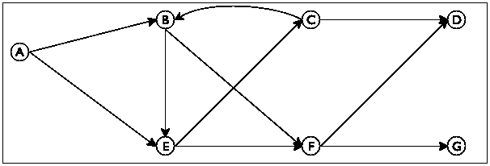
> > > > 
> 图 170：一个带有环的有向图

对于其他图，find-path 对于某些节点对可能不会终止。考虑 图 170 中的图。

停止！定义 cyclic-graph 来表示这个图。

与图 168 相比，这个新的图只多了一条边，从 C 到 B。然而，这个看似微小的增加，却允许我们从节点开始搜索并返回到同一个节点。具体来说，可以从 B 移动到 E 再到 C，然后返回到 B。实际上，当将 find-path 应用于'B、'D 和此图时，它无法停止，正如手动评估所确认的：

> | (find-path 'B 'D cyclic-graph) |
> | --- |
> | == [..](http://docs.racket-lang.org/htdp-langs/intermediate-lam.html#%28form._%28%28lib._lang%2Fhtdp-intermediate-lambda..rkt%29._....%29%29) (find-path 'B 'D cyclic-graph) [..](http://docs.racket-lang.org/htdp-langs/intermediate-lam.html#%28form._%28%28lib._lang%2Fhtdp-intermediate-lambda..rkt%29._....%29%29) |
> | == [..](http://docs.racket-lang.org/htdp-langs/intermediate-lam.html#%28form._%28%28lib._lang%2Fhtdp-intermediate-lambda..rkt%29._....%29%29) (find-path/list ([list](http://docs.racket-lang.org/htdp-langs/intermediate-lam.html#%28def._htdp-intermediate-lambda._%28%28lib._lang%2Fhtdp-intermediate-lambda..rkt%29._list%29%29) 'E 'F) 'D cyclic-graph) [..](http://docs.racket-lang.org/htdp-langs/intermediate-lam.html#%28form._%28%28lib._lang%2Fhtdp-intermediate-lambda..rkt%29._....%29%29) |
> | == [..](http://docs.racket-lang.org/htdp-langs/intermediate-lam.html#%28form._%28%28lib._lang%2Fhtdp-intermediate-lambda..rkt%29._....%29%29) (find-path 'E 'D cyclic-graph) [..](http://docs.racket-lang.org/htdp-langs/intermediate-lam.html#%28form._%28%28lib._lang%2Fhtdp-intermediate-lambda..rkt%29._....%29%29) |
> | == [..](http://docs.racket-lang.org/htdp-langs/intermediate-lam.html#%28form._%28%28lib._lang%2Fhtdp-intermediate-lambda..rkt%29._....%29%29) (find-path/list ([list](http://docs.racket-lang.org/htdp-langs/intermediate-lam.html#%28def._htdp-intermediate-lambda._%28%28lib._lang%2Fhtdp-intermediate-lambda..rkt%29._list%29%29) 'C 'F) 'D cyclic-graph) [..](http://docs.racket-lang.org/htdp-langs/intermediate-lam.html#%28form._%28%28lib._lang%2Fhtdp-intermediate-lambda..rkt%29._....%29%29) |
> | == [..](http://docs.racket-lang.org/htdp-langs/intermediate-lam.html#%28form._%28%28lib._lang%2Fhtdp-intermediate-lambda..rkt%29._....%29%29) (find-path 'C 'D cyclic-graph) [..](http://docs.racket-lang.org/htdp-langs/intermediate-lam.html#%28form._%28%28lib._lang%2Fhtdp-intermediate-lambda..rkt%29._....%29%29) |
> | == [..](http://docs.racket-lang.org/htdp-langs/intermediate-lam.html#%28form._%28%28lib._lang%2Fhtdp-intermediate-lambda..rkt%29._....%29%29) (find-path/list ([list](http://docs.racket-lang.org/htdp-langs/intermediate-lam.html#%28def._htdp-intermediate-lambda._%28%28lib._lang%2Fhtdp-intermediate-lambda..rkt%29._list%29%29) 'B 'D) 'D cyclic-graph) [..](http://docs.racket-lang.org/htdp-langs/intermediate-lam.html#%28form._%28%28lib._lang%2Fhtdp-intermediate-lambda..rkt%29._....%29%29) |
> | == [..](http://docs.racket-lang.org/htdp-langs/intermediate-lam.html#%28form._%28%28lib._lang%2Fhtdp-intermediate-lambda..rkt%29._....%29%29) (find-path 'B 'D cyclic-graph) [..](http://docs.racket-lang.org/htdp-langs/intermediate-lam.html#%28form._%28%28lib._lang%2Fhtdp-intermediate-lambda..rkt%29._....%29%29) |

手动评估显示，在应用了 find-path 和 find-path/list 七次之后，ISL+必须评估与它开始时相同的精确表达式。你只知道一个例外：[随机](http://docs.racket-lang.org/htdp-langs/intermediate-lam.html#%28def._htdp-intermediate-lambda._%28%28lib._lang%2Fhtdp-intermediate-lambda..rkt%29._random%29%29)。由于相同的输入会触发任何函数相同的评估，因此 find-path 对于这些输入不会终止。

总结来说，终止性论证如下。如果一个给定的图没有循环，find-path 对于任何给定的输入都会产生一些输出。毕竟，每条路径只能包含有限数量的节点，路径的数量也是有限的。因此，该函数要么从某个给定的节点开始全面检查所有解决方案，要么找到从起点到终点节点的路径。然而，如果一个图中包含循环，即从某个节点回到自身的路径，find-path 对于某些输入可能不会产生结果。

下一个部分将介绍一种程序设计技术，它专门解决这类问题。特别是，它介绍了一种 find-path 的变体，可以处理图中的循环。

练习 473。在'B、'C 以及图 170 中测试 find-path。同时，使用练习 472 中的 test-on-all-nodes 来测试这个图。

练习 474。将 find-path 程序重新设计为一个单一函数。

练习 475。重新设计 find-path/list，使其使用图 95 和 96 中的现有列表抽象，而不是显式的结构递归。提示：阅读 Racket 的[ormap](http://docs.racket-lang.org/reference/pairs.html#%28def._%28%28lib._racket%2Fprivate%2Fmap..rkt%29._ormap%29%29)文档。它与 ISL+的[ormap](http://docs.racket-lang.org/htdp-langs/intermediate.html#%28def._htdp-intermediate._%28%28lib._lang%2Fhtdp-intermediate..rkt%29._ormap%29%29)函数有何不同？前者在这里会有帮助吗？

数据抽象笔记 你可能已经注意到，find-path 函数不需要知道图是如何定义的。只要为图提供一个正确的邻居函数，find-path 就能完美地工作。简而言之，find-path 程序使用了数据抽象。

正如 抽象 所说，数据抽象就像函数抽象一样工作。在这里，你可以创建一个抽象-find-path 函数，它比 find-path 多一个参数：邻居。只要你总是向 abstract-find-path 提供来自 Graph 的图 G 和匹配的邻居函数，它就会正确处理图。虽然额外的参数暗示了传统意义上的抽象，但两个参数之间所需的关系——<wbr>G 和 neighbors——<wbr>实际上意味着 abstract-find-path 也抽象了 Graph 的定义。由于后者是一个数据定义，这个想法被称为数据抽象。

当程序变得很大时，数据抽象成为构建程序组件的关键工具。本系列下一卷深入探讨了这一想法；下一节将通过另一个示例说明这一想法。结束

练习 476\. 有限状态机 提出了一个关于有限状态机和字符串的问题，但立即将问题推迟到本章，因为解决方案需要生成递归。你现在已经获得了解决这个问题的设计知识。

设计函数 fsm-match。它消耗有限状态机的数据表示和字符串。如果字符串中的字符序列导致有限状态机从初始状态转换到最终状态，则产生 #true。

由于这个问题是关于生成递归函数的设计，我们提供了必要的数据定义和数据示例：

> | ([define-struct](http://docs.racket-lang.org/htdp-langs/intermediate-lam.html#%28form._%28%28lib._lang%2Fhtdp-intermediate-lambda..rkt%29._define-struct%29%29) transition [current key next]) |
> | --- |
> | ([define-struct](http://docs.racket-lang.org/htdp-langs/intermediate-lam.html#%28form._%28%28lib._lang%2Fhtdp-intermediate-lambda..rkt%29._define-struct%29%29) fsm [initial transitions final]) |
> |   |
> | ; An FSM is a structure: |
> | ;   (make-fsm  FSM-State  List-of  [1Transition]  FSM-State) |
> | ; A 1Transition is a structure: |
> | ;   (make-transition  FSM-State  1String  FSM-State) |
> | ; An FSM-State is String. |
> |   |
> | ; 数据示例：参见 练习 109 |
> |   |
> | ([define](http://docs.racket-lang.org/htdp-langs/intermediate-lam.html#%28form._%28%28lib._lang%2Fhtdp-intermediate-lambda..rkt%29._define%29%29) fsm-a-bc*-d |
> |   (make-fsm |
> |    "AA" |
> |    ([列表](http://docs.racket-lang.org/htdp-langs/intermediate-lam.html#%28def._htdp-intermediate-lambda._%28%28lib._lang%2Fhtdp-intermediate-lambda..rkt%29._list%29%29) (创建转换 "AA" "a" "BC") |
> |          (创建转换 "BC" "b" "BC") |
> |          (创建转换 "BC" "c" "BC") |
> |          (创建转换 "BC" "d" "DD")) |
> |    "DD")) |

数据示例对应于正则表达式 a (b|c)* d。如练习 109 中所述，"acbd"、"ad"和"abcd"是可接受的字符串示例；"da"、"aa"或"d"不匹配。在此上下文中，你正在设计以下函数：

> | ; 状态机  字符串 -> 布尔值 |
> | --- |
> | ; 有限状态机是否识别给定的字符串 |
> | ([定义](http://docs.racket-lang.org/htdp-langs/intermediate-lam.html#%28form._%28%28lib._lang%2Fhtdp-intermediate-lambda..rkt%29._define%29%29) (fsm-match? an-fsm a-string) |
> |   #false) |

提示：在设计必要的辅助函数时，将其局部化到 fsm-match?函数。在此上下文中，将问题表示为两个参数的配对：有限状态机的当前状态和剩余的 1 字符串列表。

> > > | ; [列表 X] -> [列表 [列表 X]] |
> > > | --- |
> > > | ; 创建 w 中所有项的排列列表 |
> > > | ([定义](http://docs.racket-lang.org/htdp-langs/intermediate-lam.html#%28form._%28%28lib._lang%2Fhtdp-intermediate-lambda..rkt%29._define%29%29) (排列 w) |
> > > |   ([条件](http://docs.racket-lang.org/htdp-langs/intermediate-lam.html#%28form._%28%28lib._lang%2Fhtdp-intermediate-lambda..rkt%29._cond%29%29) |
> > > |     ([空?](http://docs.racket-lang.org/htdp-langs/intermediate-lam.html#%28def._htdp-intermediate-lambda._%28%28lib._lang%2Fhtdp-intermediate-lambda..rkt%29._empty~3f%29%29) w) '(())] |
> > > |     [[否则](http://docs.racket-lang.org/htdp-langs/intermediate-lam.html#%28form._%28%28lib._lang%2Fhtdp-intermediate-lambda..rkt%29._else%29%29) |
> > > |       ([折叠右](http://docs.racket-lang.org/htdp-langs/intermediate-lam.html#%28def._htdp-intermediate-lambda._%28%28lib._lang%2Fhtdp-intermediate-lambda..rkt%29._foldr%29%29) ([lambda](http://docs.racket-lang.org/htdp-langs/intermediate-lam.html#%28form._%28%28lib._lang%2Fhtdp-intermediate-lambda..rkt%29._lambda%29%29) (item others) |
> > > |                ([局部](http://docs.racket-lang.org/htdp-langs/intermediate-lam.html#%28form._%28%28lib._lang%2Fhtdp-intermediate-lambda..rkt%29._local%29%29) (([定义](http://docs.racket-lang.org/htdp-langs/intermediate-lam.html#%28form._%28%28lib._lang%2Fhtdp-intermediate-lambda..rkt%29._define%29%29) without-item |
> > > |                          (arrangements ([移除](http://docs.racket-lang.org/htdp-langs/intermediate-lam.html#%28def._htdp-intermediate-lambda._%28%28lib._lang%2Fhtdp-intermediate-lambda..rkt%29._remove%29%29) item w))) |
> > > |                        ([定义](http://docs.racket-lang.org/htdp-langs/intermediate-lam.html#%28form._%28%28lib._lang%2Fhtdp-intermediate-lambda..rkt%29._define%29%29) add-item-to-front |
> > > |                          ([映射](http://docs.racket-lang.org/htdp-langs/intermediate-lam.html#%28def._htdp-intermediate-lambda._%28%28lib._lang%2Fhtdp-intermediate-lambda..rkt%29._map%29%29) ([lambda](http://docs.racket-lang.org/htdp-langs/intermediate-lam.html#%28form._%28%28lib._lang%2Fhtdp-intermediate-lambda..rkt%29._lambda%29%29) (a) ([cons](http://docs.racket-lang.org/htdp-langs/intermediate-lam.html#%28def._htdp-intermediate-lambda._%28%28lib._lang%2Fhtdp-intermediate-lambda..rkt%29._cons%29%29) item a)) |
> > > |                               without-item))) |
> > > |                  ([附加](http://docs.racket-lang.org/htdp-langs/intermediate-lam.html#%28def._htdp-intermediate-lambda._%28%28lib._lang%2Fhtdp-intermediate-lambda..rkt%29._append%29%29) add-item-to-front others))) |
> > > |         '() |
> > > |         w)])) |
> > > |   |
> > > | ; [列表 [列表  1 字符串]] -> 布尔 |
> > > | ; 单词 "rat", "art", 和 "tar" 是否是给定列表的成员？ |
> > > | ([定义](http://docs.racket-lang.org/htdp-langs/intermediate-lam.html#%28form._%28%28lib._lang%2Fhtdp-intermediate-lambda..rkt%29._define%29%29) (all-words-from-rat? w) |
> > > |   ([和](http://docs.racket-lang.org/htdp-langs/intermediate-lam.html#%28form._%28%28lib._lang%2Fhtdp-intermediate-lambda..rkt%29._and%29%29) ([成员](http://docs.racket-lang.org/htdp-langs/intermediate-lam.html#%28def._htdp-intermediate-lambda._%28%28lib._lang%2Fhtdp-intermediate-lambda..rkt%29._member%29%29) ([爆炸](http://docs.racket-lang.org/htdp-langs/intermediate-lam.html#%28def._htdp-intermediate-lambda._%28%28lib._lang%2Fhtdp-intermediate-lambda..rkt%29._explode%29%29) "rat") w) |
> > > |        ([成员](http://docs.racket-lang.org/htdp-langs/intermediate-lam.html#%28def._htdp-intermediate-lambda._%28%28lib._lang%2Fhtdp-intermediate-lambda..rkt%29._member%29%29) ([爆炸](http://docs.racket-lang.org/htdp-langs/intermediate-lam.html#%28def._htdp-intermediate-lambda._%28%28lib._lang%2Fhtdp-intermediate-lambda..rkt%29._explode%29%29) "art") w) |
> > > |        ([成员](http://docs.racket-lang.org/htdp-langs/intermediate-lam.html#%28def._htdp-intermediate-lambda._%28%28lib._lang%2Fhtdp-intermediate-lambda..rkt%29._member%29%29) ([爆炸](http://docs.racket-lang.org/htdp-langs/intermediate-lam.html#%28def._htdp-intermediate-lambda._%28%28lib._lang%2Fhtdp-intermediate-lambda..rkt%29._explode%29%29) "tar") w))) |
> > > |   |
> > > | ([检查满足条件](http://docs.racket-lang.org/htdp-langs/intermediate-lam.html#%28form._%28%28lib._lang%2Fhtdp-intermediate-lambda..rkt%29._check-satisfied%29%29) (arrangements '("r" "a" "t")) |
> > > |                  all-words-from-rat?) |
> > > 
> 图 171：使用生成递归定义排列

练习 477。检查图 171 中排列函数的定义。该图显示了一个扩展设计问题的生成递归解决方案，即单词游戏，问题的核心，我们感谢 Mark Engelberg 提出这个练习。

> 给定一个单词，创建所有可能的字母排列。

扩展练习是直接指导主函数和两个辅助函数的结构化递归设计，其中后者的设计需要创建两个额外的辅助函数。相比之下，图 171 使用生成递归的力量——加上 [foldr](http://docs.racket-lang.org/htdp-langs/intermediate-lam.html#%28def._htdp-intermediate-lambda._%28%28lib._lang%2Fhtdp-intermediate-lambda..rkt%29._foldr%29%29) 和 [map](http://docs.racket-lang.org/htdp-langs/intermediate-lam.html#%28def._htdp-intermediate-lambda._%28%28lib._lang%2Fhtdp-intermediate-lambda..rkt%29._map%29%29)——将相同的程序定义为一个单一的功能定义。

解释排列的生成递归版本的设计。回答生成递归设计配方提出的所有问题，包括终止问题。

图 171 中的排列是否创建与单词游戏，问题的核心的解决方案相同的列表？

> > > > 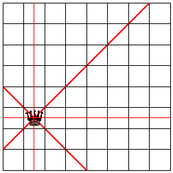
> > > > 
> 图 172：一个只有一个皇后的棋盘及其威胁的位置

#### 29.2 项目：回溯🔗 "链接到此处")

n 皇后问题是来自棋类世界的著名问题，它也以自然的方式说明了回溯的应用。就我们的目的而言，棋盘是一个 n 乘 n 的方格。皇后是一种棋子，可以在水平、垂直、或者对角方向任意远地移动，而不“跳过”另一个棋子。我们说如果一个皇后在方格上或者可以移动到该方格，那么它威胁该方格。图 172 以图形方式说明了这个概念。皇后位于第二列和第六行。从皇后辐射出的实线穿过所有被皇后威胁的方格。

经典的皇后问题是在 8x8 国际象棋棋盘上放置 8 个皇后，使得棋盘上的皇后不会相互威胁。计算机科学家将这个问题推广，并询问是否有可能在一个 n x n 的棋盘上放置 n 个皇后，使得皇后之间不会构成威胁。

当 n = 2 时，完整的谜题显然没有解决方案。放置在任何四个方格中的女王都会威胁到所有剩余的方格。

> > > > 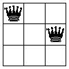 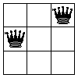 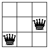
> > > > 
> 图 173：3x3 棋盘上的三个皇后配置

当 n = 3 时，也没有解决方案。图 173 展示了两个皇后的所有不同放置方式，即 k = 3 和 n = 2 的解决方案。在每种情况下，左边的皇后占据左列中的一个方格，而第二个皇后被放置在第一个皇后不威胁的两个方格之一。第二个皇后的放置会威胁到所有剩余的、未被占据的方格，这意味着不可能放置第三个皇后。

练习 478。你还可以将第一位女王放置在顶部行的所有方格、最右侧列和底部行的所有方格中。解释为什么所有这些解决方案都与图 173 中描述的三种情况类似。图 173。

这就留下了中央方格。在 3x3 棋盘的中央方格放置一个皇后后，是否还能放置第二个皇后？

> > > | 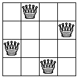 | 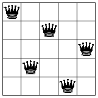 |
> > > | --- | --- |
> > > 
> 图 174：4x4 和 5x5 棋盘上 n 皇后谜题的解决方案

图 174 显示了 n 皇后谜题的两个解决方案：左边的是 n = 4，右边的是 n = 5。该图显示了在每种情况下，解决方案都有一个皇后在每个行和列中，这是有道理的，因为皇后威胁从其方格辐射出的整个行和列。

现在我们已经进行了足够详细的分析，我们可以进入解决方案阶段。分析提出了几个想法：

1.  该问题关于一次放置一个皇后。当我们在一个棋盘上放置一个皇后时，我们可以标记相应的行、列和对角线，表示其他皇后不能使用。

1.  对于另一位女王，我们只考虑非威胁点。

1.  就怕这个位置的第一选择会导致后续出现问题，我们会记住哪些其他方格适合放置这个皇后。

1.  如果我们被要求在一个棋盘上放置一个皇后，但没有安全的方格剩下，我们就回溯到过程中的一个较早的点，在那里我们选择了一个方格而不是另一个，并尝试剩下的一个方格。

简而言之，这个解决方案的过程就像“找到路径”算法。从过程描述到设计算法，显然需要两种数据表示：一个是棋盘，另一个是棋盘上的位置。让我们从后者开始：

> | ([定义](http://docs.racket-lang.org/htdp-langs/intermediate-lam.html#%28form._%28%28lib._lang%2Fhtdp-intermediate-lambda..rkt%29._define%29%29) 皇后的数量 8) |
> | --- |
> | ; 一个 QP 是一个结构： |
> | ;   ([make-posn](http://docs.racket-lang.org/htdp-langs/intermediate-lam.html#%28def._htdp-intermediate-lambda._%28%28lib._lang%2Fhtdp-intermediate-lambda..rkt%29._make-posn%29%29)  CI  CI) |
> | ; 一个 CI 是[0,皇后的数量)区间内的一个 N。 |
> | ; 解释  ([make-posn](http://docs.racket-lang.org/htdp-langs/intermediate-lam.html#%28def._htdp-intermediate-lambda._%28%28lib._lang%2Fhtdp-intermediate-lambda..rkt%29._make-posn%29%29)  r  c) 表示 |
> | ; 第 r 行和第 c 列 |

总的来说，棋盘基本上决定了选择。

CI 的定义可以使用[1,皇后的数量]而不是 0,皇后的数量)，但这两个定义基本上是等价的，从 0 开始计数是程序员的做法。同样，所谓的棋盘位置的代数表示法使用字母'a'到'h'表示棋盘的一个维度，这意味着[QP 可以使用 CIs 和这样的字母。再次，这两个基本上是等价的，并且使用自然数在 ISL+中创建许多位置比使用字母更容易。

练习 479。设计威胁函数。它接受两个 QPs，并确定放置在这两个相应方格上的皇后是否会相互威胁。

领域知识（1）研究图 172。在这个图中的皇后威胁着水平线、垂直线和斜线上的所有方格。相反，任何这些线上的方格上的皇后都会威胁到皇后。

(2) 将你的见解转化为数学条件，这些条件将方格的坐标相互关联。例如，所有水平线上的方格具有相同的 y 坐标。同样，一条对角线上的所有方格的坐标之和是相同的。哪条是对角线？对于另一条对角线，两个坐标之间的差是相同的。这个想法描述的是哪条对角线？

提示：一旦你弄清楚了领域知识，就制定一个测试套件，涵盖水平线、垂直线和斜线。别忘了包括那些威胁函数必须产生#false 的参数。

练习 480。设计渲染皇后的函数。该函数接受一个自然数 n，一个 QP 列表，以及一个 Image。它生成一个 n 乘 n 的棋盘图像，并根据给定的 QPs 放置图像。

你可能希望在网上寻找一张国际象棋皇后的图片，或者使用可用的图像函数创建一个简化的图片。

至于棋盘的数据表示，我们推迟这一步，直到我们知道算法如何实现这个过程。这样做是数据抽象的另一个练习。实际上，甚至不需要为 Board 定义数据定义，就可以声明算法的签名：

> | ; N -> [Maybe [List-of  QP]] |
> | --- |
> | ; 找到 n 后问题的解决方案 |
> |   |
> | ; 数据示例：[List-of  QP] |
> | ([define](http://docs.racket-lang.org/htdp-langs/intermediate-lam.html#%28form._%28%28lib._lang%2Fhtdp-intermediate-lambda..rkt%29._define%29%29) 4QUEEN-SOLUTION-2 |
> |   ([list](http://docs.racket-lang.org/htdp-langs/intermediate-lam.html#%28def._htdp-intermediate-lambda._%28%28lib._lang%2Fhtdp-intermediate-lambda..rkt%29._list%29%29)  ([make-posn](http://docs.racket-lang.org/htdp-langs/intermediate-lam.html#%28def._htdp-intermediate-lambda._%28%28lib._lang%2Fhtdp-intermediate-lambda..rkt%29._make-posn%29%29) 0 2) ([make-posn](http://docs.racket-lang.org/htdp-langs/intermediate-lam.html#%28def._htdp-intermediate-lambda._%28%28lib._lang%2Fhtdp-intermediate-lambda..rkt%29._make-posn%29%29) 1 0) |
> |          ([make-posn](http://docs.racket-lang.org/htdp-langs/intermediate-lam.html#%28def._htdp-intermediate-lambda._%28%28lib._lang%2Fhtdp-intermediate-lambda..rkt%29._make-posn%29%29) 2 3) ([make-posn](http://docs.racket-lang.org/htdp-langs/intermediate-lam.html#%28def._htdp-intermediate-lambda._%28%28lib._lang%2Fhtdp-intermediate-lambda..rkt%29._make-posn%29%29) 3 1))) |
> |   |
> | ([define](http://docs.racket-lang.org/htdp-langs/intermediate-lam.html#%28form._%28%28lib._lang%2Fhtdp-intermediate-lambda..rkt%29._define%29%29) (n-queens n) |
> |   #false) |

完整的谜题是关于在 n x n 国际象棋棋盘上找到一个 n 后的位置。因此，很明显，该算法消耗的只是自然数，并且它为 n 后的位置生成一个表示——如果存在解决方案的话。后者可以用 QP 的列表来表示，这就是我们选择它的原因。

> ; [List-of  QP] 或 #false

作为结果。自然地，#false 表示找不到解决方案。下一步是开发示例并将它们作为测试来制定。我们知道当给定 2 或 3 时，n-queens 必须失败。对于 4，有两个解决方案，有真实的棋盘和四个相同的皇后。图 174 展示了其中之一，在左边，另一个如下：

> 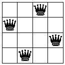

在数据表示方面，然而，表示这两个图像有许多不同的方式。图 175 略图了一些。填写其余部分。

> > > | ; N -> [Maybe [List-of  QP]] |
> > > | --- |
> > > | ; 找到 n 皇后问题的解决方案 |
> > > |   |
> > > | ([define](http://docs.racket-lang.org/htdp-langs/intermediate-lam.html#%28form._%28%28lib._lang%2Fhtdp-intermediate-lambda..rkt%29._define%29%29) 0-1 ([make-posn](http://docs.racket-lang.org/htdp-langs/intermediate-lam.html#%28def._htdp-intermediate-lambda._%28%28lib._lang%2Fhtdp-intermediate-lambda..rkt%29._make-posn%29%29) 0 1)) |
> > > | ([define](http://docs.racket-lang.org/htdp-langs/intermediate-lam.html#%28form._%28%28lib._lang%2Fhtdp-intermediate-lambda..rkt%29._define%29%29) 1-3 ([make-posn](http://docs.racket-lang.org/htdp-langs/intermediate-lam.html#%28def._htdp-intermediate-lambda._%28%28lib._lang%2Fhtdp-intermediate-lambda..rkt%29._make-posn%29%29) 1 3)) |
> > > | ([define](http://docs.racket-lang.org/htdp-langs/intermediate-lam.html#%28form._%28%28lib._lang%2Fhtdp-intermediate-lambda..rkt%29._define%29%29) 2-0 ([make-posn](http://docs.racket-lang.org/htdp-langs/intermediate-lam.html#%28def._htdp-intermediate-lambda._%28%28lib._lang%2Fhtdp-intermediate-lambda..rkt%29._make-posn%29%29) 2 0)) |
> > > | ([define](http://docs.racket-lang.org/htdp-langs/intermediate-lam.html#%28form._%28%28lib._lang%2Fhtdp-intermediate-lambda..rkt%29._define%29%29) 3-2 ([make-posn](http://docs.racket-lang.org/htdp-langs/intermediate-lam.html#%28def._htdp-intermediate-lambda._%28%28lib._lang%2Fhtdp-intermediate-lambda..rkt%29._make-posn%29%29) 3 2)) |
> > > |   |
> > > | ([check-member-of](http://docs.racket-lang.org/htdp-langs/intermediate-lam.html#%28form._%28%28lib._lang%2Fhtdp-intermediate-lambda..rkt%29._check-member-of%29%29) |
> > > |  (n-queens 4) |
> > > |  ([list](http://docs.racket-lang.org/htdp-langs/intermediate-lam.html#%28def._htdp-intermediate-lambda._%28%28lib._lang%2Fhtdp-intermediate-lambda..rkt%29._list%29%29) 0-1 1-3 2-0 3-2) |
> > > |  ([list](http://docs.racket-lang.org/htdp-langs/intermediate-lam.html#%28def._htdp-intermediate-lambda._%28%28lib._lang%2Fhtdp-intermediate-lambda..rkt%29._list%29%29) 0-1 1-3 3-2 2-0) |
> > > |  ([list](http://docs.racket-lang.org/htdp-langs/intermediate-lam.html#%28def._htdp-intermediate-lambda._%28%28lib._lang%2Fhtdp-intermediate-lambda..rkt%29._list%29%29) 0-1 2-0 1-3 3-2) |
> > > |  ([list](http://docs.racket-lang.org/htdp-langs/intermediate-lam.html#%28def._htdp-intermediate-lambda._%28%28lib._lang%2Fhtdp-intermediate-lambda..rkt%29._list%29%29) 0-1 2-0 3-2 1-3) |
> > > |  ([list](http://docs.racket-lang.org/htdp-langs/intermediate-lam.html#%28def._htdp-intermediate-lambda._%28%28lib._lang%2Fhtdp-intermediate-lambda..rkt%29._list%29%29) 0-1 3-2 1-3 2-0) |
> > > |  ([列表](http://docs.racket-lang.org/htdp-langs/intermediate-lam.html#%28def._htdp-intermediate-lambda._%28%28lib._lang%2Fhtdp-intermediate-lambda..rkt%29._list%29%29) 0-1 3-2 2-0 1-3) |
> > > |  [...](http://docs.racket-lang.org/htdp-langs/intermediate-lam.html#%28form._%28%28lib._lang%2Fhtdp-intermediate-lambda..rkt%29._......%29%29) |
> > > |  ([列表](http://docs.racket-lang.org/htdp-langs/intermediate-lam.html#%28def._htdp-intermediate-lambda._%28%28lib._lang%2Fhtdp-intermediate-lambda..rkt%29._list%29%29) 3-2 2-0 1-3 0-1)) |
> > > |   |
> > > | ([定义](http://docs.racket-lang.org/htdp-langs/intermediate-lam.html#%28form._%28%28lib._lang%2Fhtdp-intermediate-lambda..rkt%29._define%29%29) (n-queens n) |
> > > |   (place-queens (board0 n) n)) |
> > > 
> 图 175：4 皇后问题的解决方案

练习 481。图 175 中的测试很糟糕。没有任何现实世界的程序员会明确列出所有这些可能的结果。

一种解决方案是再次使用属性测试。设计 n-queens-solution?函数，它消耗一个自然数 n，并产生一个关于皇后放置的谓词，该谓词确定给定的放置是否是 n 皇后问题的解决方案：

+   n 皇后问题的解决方案必须具有长度 n。

+   在这样一个列表上的 QP 可能不会威胁到任何其他不同的 QP。

一旦测试了这个谓词，就可以使用它和[check-satisfied](http://docs.racket-lang.org/htdp-langs/intermediate-lam.html#%28form._%28%28lib._lang%2Fhtdp-intermediate-lambda..rkt%29._check-satisfied%29%29)来制定 n-queens 的测试。另一种解决方案是将 QP 的列表理解为集合。如果两个列表包含相同顺序不同的 QPs，它们就像图中所示的那样等效。因此，你可以将 n-queens 的测试制定为

> | ; [列表  QP] -> 布尔 |
> | --- |
> | ; 结果是否等于两个列表之一[作为一个集合] |
> | ([定义](http://docs.racket-lang.org/htdp-langs/intermediate-lam.html#%28form._%28%28lib._lang%2Fhtdp-intermediate-lambda..rkt%29._define%29%29) (is-queens-result? x) |
> |   ([或](http://docs.racket-lang.org/htdp-langs/intermediate-lam.html#%28form._%28%28lib._lang%2Fhtdp-intermediate-lambda..rkt%29._or%29%29) (set=? 4QUEEN-SOLUTION-1 x) |
> |       (set=? 4QUEEN-SOLUTION-2 x))) |

设计 set=?函数。它消耗两个列表，并确定它们是否包含相同的项——<wbr>无论顺序如何。练习 482。关键思想是设计一个函数，该函数可以在可能已经包含一些皇后的棋盘上放置 n 个皇后：

> | ; 棋盘  N -> [可能 [列表  QP]] |
> | --- |
> | ; 在棋盘上放置 n 个皇后；否则，返回#false |
> | ([定义](http://docs.racket-lang.org/htdp-langs/intermediate-lam.html#%28form._%28%28lib._lang%2Fhtdp-intermediate-lambda..rkt%29._define%29%29) (place-queens a-board n) |
> |   #false) |

图 175 已经在 n-queens 的定义中引用了这个函数。设计 place-queens 算法。假设你有以下函数来处理 棋盘 s：

> | ; N -> 棋盘 |
> | --- |
> | ; 创建初始的 n x n 棋盘 |
> | ([定义](http://docs.racket-lang.org/htdp-langs/intermediate-lam.html#%28form._%28%28lib._lang%2Fhtdp-intermediate-lambda..rkt%29._define%29%29) (board0 n) [...](http://docs.racket-lang.org/htdp-langs/intermediate-lam.html#%28form._%28%28lib._lang%2Fhtdp-intermediate-lambda..rkt%29._......%29%29)) |
> |   |
> | ; 棋盘  QP -> 棋盘 |
> | ; 在 a-board 上将皇后放置在 qp 位置 |
> | ([定义](http://docs.racket-lang.org/htdp-langs/intermediate-lam.html#%28form._%28%28lib._lang%2Fhtdp-intermediate-lambda..rkt%29._define%29%29) (add-queen a-board qp) |
> |   a-board) |
> |   |
> | ; 棋盘 -> [列表  QP] |
> | ; 查找仍然可以放置皇后的位置 |
> | ([定义](http://docs.racket-lang.org/htdp-langs/intermediate-lam.html#%28form._%28%28lib._lang%2Fhtdp-intermediate-lambda..rkt%29._define%29%29) (find-open-spots a-board) |
> |   '()) |

第一个函数在 图 175 中用于为 place-queens 创建初始的棋盘表示。你需要其他两个来描述算法的生成步骤。

你还不能确认前面练习的解决方案是否有效，因为它依赖于一个庞大的愿望清单。它要求一个支持愿望清单中三个函数的 棋盘 s 数据表示。这就是你剩下的问题。

练习 483。为 棋盘 开发一个数据定义，并设计 练习 482 中指定的三个函数。考虑以下想法：

+   一个 棋盘 收集了可以放置皇后的位置；

+   一个 棋盘 包含了放置皇后的位置列表；

+   一个 棋盘 是一个 n x n 的网格，每个格子可能被皇后占据。使用具有三个字段的结构来表示一个格子：一个用于 x，一个用于 y，第三个表示格子是否受到威胁。

使用上述想法之一来解决这个练习。

挑战：使用这三种想法来为 Board 提出三种不同的数据表示。将你的解决方案抽象化到练习 482，并确认它适用于你为 Board 提供的任何数据表示。

### 30 总结🔗 "链接到此处")

这本书的第五部分引入了“eureka！”这一概念到程序设计。与第一到四部分的结构化设计不同，“eureka！”设计是从程序应该如何解决问题或处理表示问题的数据的想法开始的。在这里设计意味着想出一个巧妙的方法来对新类型的问题调用递归函数，这个问题类似于给定的问题但更简单。

请记住，虽然我们称之为生成递归，但大多数计算机科学家将这些函数称为算法。

一旦你完成了这本书的这一部分，你将了解关于生成递归设计的以下内容：

1.  设计食谱的标准大纲仍然有效。

1.  主要变化涉及编码步骤。它引入了四个新问题，从完全通用的生成递归模板到完整函数的转变。其中两个问题，你将解决解决方案过程中的“简单”部分；而另外两个问题，你将解决生成解决方案步骤。

1.  小的变化涉及生成递归函数的终止行为。与结构化设计的函数不同，算法对于某些输入可能不会终止。这个问题可能是由于想法本身或将其转化为代码的固有局限性。无论如何，你的程序的未来读者应得到关于可能“不良”输入的警告。

在你的实际编程任务中，你将遇到一些简单或已知的算法，并且你将被期望应对。对于真正巧妙的算法，软件公司会雇佣高薪的专家、领域专家和数学家来在程序员将概念转化为程序之前解决概念细节。你也必须为此类任务做好准备，而最好的准备就是实践。
