# 间奏曲 5：计算的代价🔗

> 原文：[`htdp.org/2024-11-6/Book/i5-6.html`](https://htdp.org/2024-11-6/Book/i5-6.html)

|   具体时间，抽象时间 |
| --- |
|   “阶”的定义 |
|   为什么程序使用谓词和选择器？ |
|  |

在以下测试成功后，你对程序 f 了解多少：

> | ([check-expect](http://docs.racket-lang.org/htdp-langs/intermediate-lam.html#%28form._%28%28lib._lang%2Fhtdp-intermediate-lambda..rkt%29._check-expect%29%29) (f 0) 0) |
> | --- |
> | ([check-expect](http://docs.racket-lang.org/htdp-langs/intermediate-lam.html#%28form._%28%28lib._lang%2Fhtdp-intermediate-lambda..rkt%29._check-expect%29%29) (f 1) 1) |
> | ([check-expect](http://docs.racket-lang.org/htdp-langs/intermediate-lam.html#%28form._%28%28lib._lang%2Fhtdp-intermediate-lambda..rkt%29._check-expect%29%29) (f 2) 8) |

如果这个问题出现在标准测试中，你可能会这样回答：

> ([define](http://docs.racket-lang.org/htdp-langs/intermediate-lam.html#%28form._%28%28lib._lang%2Fhtdp-intermediate-lambda..rkt%29._define%29%29) (f x) ([expt](http://docs.racket-lang.org/htdp-langs/intermediate-lam.html#%28def._htdp-intermediate-lambda._%28%28lib._lang%2Fhtdp-intermediate-lambda..rkt%29._expt%29%29) x 3))

但以下情况并没有什么不对：

> ([define](http://docs.racket-lang.org/htdp-langs/intermediate-lam.html#%28form._%28%28lib._lang%2Fhtdp-intermediate-lambda..rkt%29._define%29%29) (f x) ([if](http://docs.racket-lang.org/htdp-langs/intermediate-lam.html#%28form._%28%28lib._lang%2Fhtdp-intermediate-lambda..rkt%29._if%29%29) ([=](http://docs.racket-lang.org/htdp-langs/intermediate-lam.html#%28def._htdp-intermediate-lambda._%28%28lib._lang%2Fhtdp-intermediate-lambda..rkt%29._~3d%29%29) x 2) 8 ([*](http://docs.racket-lang.org/htdp-langs/intermediate-lam.html#%28def._htdp-intermediate-lambda._%28%28lib._lang%2Fhtdp-intermediate-lambda..rkt%29._%2A%29%29) x x)))

测试只能告诉你程序在某些输入上按预期工作。

同样地，对特定输入的程序应用进行计时告诉你计算这些输入答案需要多长时间——仅此而已。你可能还希望重新阅读局部定义以及项目：数据库中关于完整性检查的讨论。你可能有两个程序——prog-linear 和 prog-square——当给定相同的输入时，它们会计算出相同的答案，你可能发现对于所有选择的输入，prog-linear 总是比 prog-square 计算答案更快。做出选择展示了这样一对程序：gcd，一个结构递归程序，和 gcd-generative，一个等效但生成递归的程序。时间比较表明，后者比前者快得多。

> > > > 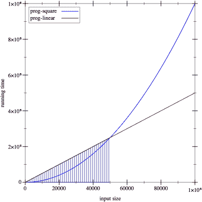
> > > > 
> 图 176：两个运行时间表达式的比较

你有多自信地希望使用 prog-linear 而不是 prog-square？考虑图 176🔗。在这个图中，x 轴记录输入的大小——比如说，列表的长度——y 轴记录计算特定大小输入答案所需的时间。假设直线代表 prog-linear 的运行时间，而曲线图代表 prog-square。在阴影区域内，prog-linear 的运行时间比 prog-square 长，但在这个区域的边缘，两条曲线相交，并且在这个区域右侧，prog-square 的性能比 prog-linear 差。如果你出于任何原因只对阴影区域内的输入大小评估了 prog-linear 和 prog-square 的性能，并且如果你的客户主要在非阴影区域运行你的程序，那么你将交付错误的程序。

这段间奏介绍了算法分析的概念，它允许程序员对程序的性能做出一般性陈述，并对函数的增长做出其他人可以理解的一般性陈述。我们感谢 Prabhakar Ragde 分享了他关于将本书的第一版与算法分析相结合的笔记。任何严肃的程序员和科学家最终都必须彻底熟悉这个概念。它是分析程序性能属性的基础。为了正确理解这个概念，你需要通过阅读教科书来实践。

### 具体时间，抽象时间🔗 "链接至此")

做出选择比较了 gcd 和 gcd-generative 的运行时间。此外，它认为后者更好，因为它总是比前者使用更少的递归步骤来计算答案。我们将这个想法作为起点来分析 how-many 的性能，这是一个来自使用自引用数据定义进行设计的简单程序：

> | ([define](http://docs.racket-lang.org/htdp-langs/intermediate-lam.html#%28form._%28%28lib._lang%2Fhtdp-intermediate-lambda..rkt%29._define%29%29) (how-many a-list) |
> | --- |
> |   ([cond](http://docs.racket-lang.org/htdp-langs/intermediate-lam.html#%28form._%28%28lib._lang%2Fhtdp-intermediate-lambda..rkt%29._cond%29%29) |
> |     [([empty?](http://docs.racket-lang.org/htdp-langs/intermediate-lam.html#%28def._htdp-intermediate-lambda._%28%28lib._lang%2Fhtdp-intermediate-lambda..rkt%29._empty~3f%29%29) a-list) 0] |
> |     [[else](http://docs.racket-lang.org/htdp-langs/intermediate-lam.html#%28form._%28%28lib._lang%2Fhtdp-intermediate-lambda..rkt%29._else%29%29) ([+](http://docs.racket-lang.org/htdp-langs/intermediate-lam.html#%28def._htdp-intermediate-lambda._%28%28lib._lang%2Fhtdp-intermediate-lambda..rkt%29._%2B%29%29) (how-many ([rest](http://docs.racket-lang.org/htdp-langs/intermediate-lam.html#%28def._htdp-intermediate-lambda._%28%28lib._lang%2Fhtdp-intermediate-lambda..rkt%29._rest%29%29) a-list)) 1)])) |

假设我们想知道计算某些未知、非空列表长度需要多长时间。使用间奏曲 1：初学者语言中的计算规则，我们可以将这个过程视为一系列代数操作：

> | (how-many some-non-empty-list) |
> | --- |
> | == |
> | ([cond](http://docs.racket-lang.org/htdp-langs/intermediate-lam.html#%28form._%28%28lib._lang%2Fhtdp-intermediate-lambda..rkt%29._cond%29%29) |
> |   [([empty?](http://docs.racket-lang.org/htdp-langs/intermediate-lam.html#%28def._htdp-intermediate-lambda._%28%28lib._lang%2Fhtdp-intermediate-lambda..rkt%29._empty~3f%29%29) some-non-empty-list) 0] |
> |   [[else](http://docs.racket-lang.org/htdp-langs/intermediate-lam.html#%28form._%28%28lib._lang%2Fhtdp-intermediate-lambda..rkt%29._else%29%29) ([+](http://docs.racket-lang.org/htdp-langs/intermediate-lam.html#%28def._htdp-intermediate-lambda._%28%28lib._lang%2Fhtdp-intermediate-lambda..rkt%29._%2B%29%29) (how-many ([rest](http://docs.racket-lang.org/htdp-langs/intermediate-lam.html#%28def._htdp-intermediate-lambda._%28%28lib._lang%2Fhtdp-intermediate-lambda..rkt%29._rest%29%29) some-non-empty-list)) 1)]) |
> | == |
> | ([cond](http://docs.racket-lang.org/htdp-langs/intermediate-lam.html#%28form._%28%28lib._lang%2Fhtdp-intermediate-lambda..rkt%29._cond%29%29) |
> |   [#false 0] |
> |   [[else](http://docs.racket-lang.org/htdp-langs/intermediate-lam.html#%28form._%28%28lib._lang%2Fhtdp-intermediate-lambda..rkt%29._else%29%29) ([+](http://docs.racket-lang.org/htdp-langs/intermediate-lam.html#%28def._htdp-intermediate-lambda._%28%28lib._lang%2Fhtdp-intermediate-lambda..rkt%29._%2B%29%29) (how-many ([rest](http://docs.racket-lang.org/htdp-langs/intermediate-lam.html#%28def._htdp-intermediate-lambda._%28%28lib._lang%2Fhtdp-intermediate-lambda..rkt%29._rest%29%29) some-non-empty-list)) 1)]) |
> |   == |
> |   ([cond](http://docs.racket-lang.org/htdp-langs/intermediate-lam.html#%28form._%28%28lib._lang%2Fhtdp-intermediate-lambda..rkt%29._cond%29%29) |
> |   [[else](http://docs.racket-lang.org/htdp-langs/intermediate-lam.html#%28form._%28%28lib._lang%2Fhtdp-intermediate-lambda..rkt%29._else%29%29) ([+](http://docs.racket-lang.org/htdp-langs/intermediate-lam.html#%28def._htdp-intermediate-lambda._%28%28lib._lang%2Fhtdp-intermediate-lambda..rkt%29._%2B%29%29) (how-many ([rest](http://docs.racket-lang.org/htdp-langs/intermediate-lam.html#%28def._htdp-intermediate-lambda._%28%28lib._lang%2Fhtdp-intermediate-lambda..rkt%29._rest%29%29) some-non-empty-list)) 1)]) |
> |   == |
> |   ([+](http://docs.racket-lang.org/htdp-langs/intermediate-lam.html#%28def._htdp-intermediate-lambda._%28%28lib._lang%2Fhtdp-intermediate-lambda..rkt%29._%2B%29%29) (how-many ([rest](http://docs.racket-lang.org/htdp-langs/intermediate-lam.html#%28def._htdp-intermediate-lambda._%28%28lib._lang%2Fhtdp-intermediate-lambda..rkt%29._rest%29%29) some-non-empty-list)) 1) |

第一步是将`how-many`定义中的`a-list`替换为实际参数`some-non-empty-list`，这会产生第一个[cond](http://docs.racket-lang.org/htdp-langs/intermediate-lam.html#%28form._%28%28lib._lang%2Fhtdp-intermediate-lambda..rkt%29._cond%29%29)表达式。接下来我们必须评估

> ([empty?](http://docs.racket-lang.org/htdp-langs/intermediate-lam.html#%28def._htdp-intermediate-lambda._%28%28lib._lang%2Fhtdp-intermediate-lambda..rkt%29._empty~3f%29%29) some-non-empty-list)

根据假设，结果是#false。问题是确定这个结果需要多长时间。虽然我们不知道确切的时间，但可以肯定的是，检查列表构造函数所需的时间是一小段固定的时间。实际上，这个假设也适用于下一步，当[cond](http://docs.racket-lang.org/htdp-langs/intermediate-lam.html#%28form._%28%28lib._lang%2Fhtdp-intermediate-lambda..rkt%29._cond%29%29)检查第一个条件的值时。由于它是#false，所以第一个[cond](http://docs.racket-lang.org/htdp-langs/intermediate-lam.html#%28form._%28%28lib._lang%2Fhtdp-intermediate-lambda..rkt%29._cond%29%29)行被忽略。检查一个[cond](http://docs.racket-lang.org/htdp-langs/intermediate-lam.html#%28form._%28%28lib._lang%2Fhtdp-intermediate-lambda..rkt%29._cond%29%29)行是否以[else](http://docs.racket-lang.org/htdp-langs/intermediate-lam.html#%28form._%28%28lib._lang%2Fhtdp-intermediate-lambda..rkt%29._else%29%29)开头同样快，这意味着我们只剩下

> ([+](http://docs.racket-lang.org/htdp-langs/intermediate-lam.html#%28def._htdp-intermediate-lambda._%28%28lib._lang%2Fhtdp-intermediate-lambda..rkt%29._%2B%29%29) (how-many ([rest](http://docs.racket-lang.org/htdp-langs/intermediate-lam.html#%28def._htdp-intermediate-lambda._%28%28lib._lang%2Fhtdp-intermediate-lambda..rkt%29._rest%29%29) some-non-empty-list)) 1)

最后，我们可以安全地假设[rest](http://docs.racket-lang.org/htdp-langs/intermediate-lam.html#%28def._htdp-intermediate-lambda._%28%28lib._lang%2Fhtdp-intermediate-lambda..rkt%29._rest%29%29)在固定的时间内提取列表的剩余部分，但除此之外，我们似乎陷入了困境。为了计算 how-many 需要多长时间来确定某个列表的长度，我们需要知道 how-many 需要多长时间来计算该列表剩余部分的项目数量。

或者，如果我们假设谓词和选择器需要固定的时间，那么 how-many 确定列表长度所需的时间取决于递归步骤的数量。更精确地说，评估(how-many some-list)大约需要 n 倍某个固定的时间，其中 n 是列表的长度，或者说程序递归的次数。

从这个例子中推广，我们可以得出结论，运行时间取决于输入的大小，递归步骤的数量是评估序列长度的良好估计。因此，计算机科学家将程序的抽象运行时间讨论为输入大小和评估中递归步骤数量的关系。“抽象”是因为这个度量忽略了原始步骤所需时间的细节。在我们的第一个例子中，输入的大小是列表上的项目数量。因此，一个元素列表需要一次递归步骤，两个元素的列表需要两次步骤，对于 n 个元素的列表，则需要 n 次步骤。

计算机科学家使用“程序 f 按照 n 个步骤执行”这个短语来对 f 的抽象运行时间进行断言。为了正确使用这个短语，它必须附带对 n 的解释，例如，“它计算给定列表中的项目数量”或“它是给定数字中的数字数量。”没有这样的解释，原始短语实际上是没有意义的。

并非所有程序都具有 how-many 那样的简单抽象运行时间。看看这本书中的第一个递归程序：

> | ([定义](http://docs.racket-lang.org/htdp-langs/intermediate-lam.html#%28form._%28%28lib._lang%2Fhtdp-intermediate-lambda..rkt%29._define%29%29) (contains-flatt? lo-names) |
> | --- |
> |   ([cond](http://docs.racket-lang.org/htdp-langs/intermediate-lam.html#%28form._%28%28lib._lang%2Fhtdp-intermediate-lambda..rkt%29._cond%29%29) |
> |     ([empty?](http://docs.racket-lang.org/htdp-langs/intermediate-lam.html#%28def._htdp-intermediate-lambda._%28%28lib._lang%2Fhtdp-intermediate-lambda..rkt%29._empty~3f%29%29) lo-names) #false] |
> |     ([cons?](http://docs.racket-lang.org/htdp-langs/intermediate-lam.html#%28def._htdp-intermediate-lambda._%28%28lib._lang%2Fhtdp-intermediate-lambda..rkt%29._cons~3f%29%29) lo-names) |
> |      ([or](http://docs.racket-lang.org/htdp-langs/intermediate-lam.html#%28form._%28%28lib._lang%2Fhtdp-intermediate-lambda..rkt%29._or%29%29) ([string=?](http://docs.racket-lang.org/htdp-langs/intermediate-lam.html#%28def._htdp-intermediate-lambda._%28%28lib._lang%2Fhtdp-intermediate-lambda..rkt%29._string~3d~3f%29%29) ([first](http://docs.racket-lang.org/htdp-langs/intermediate-lam.html#%28def._htdp-intermediate-lambda._%28%28lib._lang%2Fhtdp-intermediate-lambda..rkt%29._first%29%29) lo-names) 'flatt) |
> |          (contains-flatt? ([rest](http://docs.racket-lang.org/htdp-langs/intermediate-lam.html#%28def._htdp-intermediate-lambda._%28%28lib._lang%2Fhtdp-intermediate-lambda..rkt%29._rest%29%29) lo-names)))])) |

对于以 'flatt 开头的列表，例如，

> | (contains-flatt? |
> | --- |
> |   ([list](http://docs.racket-lang.org/htdp-langs/intermediate-lam.html#%28def._htdp-intermediate-lambda._%28%28lib._lang%2Fhtdp-intermediate-lambda..rkt%29._list%29%29) "flatt" "robot" "ball" "game-boy" "pokemon")) |

程序不需要递归步骤。相比之下，如果列表末尾出现 'flatt，例如，

> | (contains-flatt? |
> | --- |
> |   ([list](http://docs.racket-lang.org/htdp-langs/intermediate-lam.html#%28def._htdp-intermediate-lambda._%28%28lib._lang%2Fhtdp-intermediate-lambda..rkt%29._list%29%29) "robot" "ball" "game-boy" "pokemon" "flatt")) |

评估所需的递归步骤数量与列表中的项目数量相同。这种第二种分析带我们来到了程序分析的第二重要思想，即所执行的分析类型：

+   最佳情况分析关注程序可以轻松找到答案的输入类别。在我们的运行示例中，以 'flatt 开头的列表是最好的输入类型。

+   依次，最坏情况分析确定了程序在那些最考验它的输入上的表现有多糟糕。当 'flatt 在输入列表的末尾时，contains-flatt? 函数表现出最差性能。

+   最后，平均分析从程序员不能假设输入总是最佳形状的想法开始，他们必须希望输入不是最坏形状的想法。在许多情况下，他们必须估计程序的平均运行时间。例如，contains-flatt? 平均在输入列表的中间找到 'flatt。因此，如果后者由 n 个项目组成，contains-flatt? 的平均运行时间是 ，也就是说，它递归的次数是输入项目数的一半。

因此，计算机科学家通常将“在数量级上”这个短语与“平均”或“最坏情况”一起使用。“回到 contains-flatt? 使用平均的‘数量级为  步骤’的想法，使我们来到了抽象运行时间的另一个特征。因为它忽略了评估原始计算步骤的确切时间——检查谓词、选择值、选择 [cond](http://docs.racket-lang.org/htdp-langs/intermediate-lam.html#%28form._%28%28lib._lang%2Fhtdp-intermediate-lambda..rkt%29._cond%29%29) 子句——因此我们可以省略除以 2。原因如下。根据假设，每个基本步骤需要 k 个时间单位，这意味着 contains-flatt? 需要时间

> 

如果你有一台更先进的计算机，这些基本计算可能运行得快两倍，在这种情况下，我们会用  作为基本工作的常数。让我们把这个常数称为 c 并计算：

> 

即，抽象运行时间总是 n 乘以一个常数，这就是说“在 n 的数量级上”的全部内容。现在考虑我们的排序程序，见图 72。这里是对一个小输入的手动评估，列出了所有的递归步骤：

> | ([sort](http://docs.racket-lang.org/htdp-langs/intermediate-lam.html#%28def._htdp-intermediate-lambda._%28%28lib._lang%2Fhtdp-intermediate-lambda..rkt%29._sort%29%29) ([list](http://docs.racket-lang.org/htdp-langs/intermediate-lam.html#%28def._htdp-intermediate-lambda._%28%28lib._lang%2Fhtdp-intermediate-lambda..rkt%29._list%29%29) 3 1 2)) |
> | --- |
> | == (insert 3 ([sort](http://docs.racket-lang.org/htdp-langs/intermediate-lam.html#%28def._htdp-intermediate-lambda._%28%28lib._lang%2Fhtdp-intermediate-lambda..rkt%29._sort%29%29) ([list](http://docs.racket-lang.org/htdp-langs/intermediate-lam.html#%28def._htdp-intermediate-lambda._%28%28lib._lang%2Fhtdp-intermediate-lambda..rkt%29._list%29%29) 1 2))) |
> | == (insert 3 (insert 1 ([sort](http://docs.racket-lang.org/htdp-langs/intermediate-lam.html#%28def._htdp-intermediate-lambda._%28%28lib._lang%2Fhtdp-intermediate-lambda..rkt%29._sort%29%29) ([list](http://docs.racket-lang.org/htdp-langs/intermediate-lam.html#%28def._htdp-intermediate-lambda._%28%28lib._lang%2Fhtdp-intermediate-lambda..rkt%29._list%29%29) 2)))) |
> | == (insert 3 (insert 1 (insert 2 ([sort](http://docs.racket-lang.org/htdp-langs/intermediate-lam.html#%28def._htdp-intermediate-lambda._%28%28lib._lang%2Fhtdp-intermediate-lambda..rkt%29._sort%29%29) '())))) |
> | == (insert 3 (insert 1 (insert 2 '()))) |
> | == (insert 3 (insert 1 ([list](http://docs.racket-lang.org/htdp-langs/intermediate-lam.html#%28def._htdp-intermediate-lambda._%28%28lib._lang%2Fhtdp-intermediate-lambda..rkt%29._list%29%29) 2))) |
> | == (insert 3 ([cons](http://docs.racket-lang.org/htdp-langs/intermediate-lam.html#%28def._htdp-intermediate-lambda._%28%28lib._lang%2Fhtdp-intermediate-lambda..rkt%29._cons%29%29) 2 (insert 1 '()))) |
> | == (insert 3 ([list](http://docs.racket-lang.org/htdp-langs/intermediate-lam.html#%28def._htdp-intermediate-lambda._%28%28lib._lang%2Fhtdp-intermediate-lambda..rkt%29._list%29%29) 2 1)) |
> | == ([list](http://docs.racket-lang.org/htdp-langs/intermediate-lam.html#%28def._htdp-intermediate-lambda._%28%28lib._lang%2Fhtdp-intermediate-lambda..rkt%29._list%29%29) 3 2 1) |

评估显示了[sort](http://docs.racket-lang.org/htdp-langs/intermediate-lam.html#%28def._htdp-intermediate-lambda._%28%28lib._lang%2Fhtdp-intermediate-lambda..rkt%29._sort%29%29)如何遍历给定的列表以及它是如何为列表中的每个数字设置 insert 应用的。换句话说，[sort](http://docs.racket-lang.org/htdp-langs/intermediate-lam.html#%28def._htdp-intermediate-lambda._%28%28lib._lang%2Fhtdp-intermediate-lambda..rkt%29._sort%29%29)是一个两阶段程序。在第一阶段，[sort](http://docs.racket-lang.org/htdp-langs/intermediate-lam.html#%28def._htdp-intermediate-lambda._%28%28lib._lang%2Fhtdp-intermediate-lambda..rkt%29._sort%29%29)的递归步骤设置了与列表中项目数量一样多的 insert 应用。在第二阶段，每个 insert 应用遍历一个已排序的列表。

插入一个项目与查找一个项目类似，因此 insert 和 contains-flatt?的性能相似并不令人惊讶。对包含 l 个项目的列表应用 insert 触发 0 到 l 次递归步骤。平均而言，我们假设它需要 l/2 次，这意味着 insert 需要“大约 l 步”，其中 l 是给定列表的长度。

问题是 insert 向这些列表添加数字时列表有多长。从上面的计算中推广，我们可以看到第一个列表有个项目长，第二个列表，以此类推，直到空列表。因此，我们得到 insert 执行

> 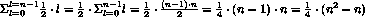

意味着

> 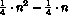

表示对平均插入步骤数的最佳“猜测”。在这个最后项中，n2 是主导因素，所以我们说排序过程需要“大约 n2 步骤”。练习 486 要求你论证为什么可以这样简化这个说法。

参见 练习 486 了解为什么是这样。

我们也可以用更非正式和严谨的方法进行。因为 [sort](http://docs.racket-lang.org/htdp-langs/intermediate-lam.html#%28def._htdp-intermediate-lambda._%28%28lib._lang%2Fhtdp-intermediate-lambda..rkt%29._sort%29%29) 在列表中的每个项目上只插入一次，所以我们得到一个“大约 n”的插入步骤，其中 n 是列表的大小。由于插入需要  步骤，我们现在可以看到排序过程需要 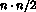 步骤或“大约 n2”。

将所有这些加起来，我们得到 [sort](http://docs.racket-lang.org/htdp-langs/intermediate-lam.html#%28def._htdp-intermediate-lambda._%28%28lib._lang%2Fhtdp-intermediate-lambda..rkt%29._sort%29%29) 对 n 个项目的列表进行排序时，需要“大约 n 步骤”加上 n2 次递归步骤在插入中，这会产生

> 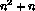

步骤。参见 练习 486 了解详细信息。注意：此分析假设比较列表中的两个项目需要固定的时间量。结束我们的最后一个例子是来自 局部定义 的 inf 程序：

> | ([define](http://docs.racket-lang.org/htdp-langs/intermediate-lam.html#%28form._%28%28lib._lang%2Fhtdp-intermediate-lambda..rkt%29._define%29%29) (inf l) |
> | --- |
> | ([cond](http://docs.racket-lang.org/htdp-langs/intermediate-lam.html#%28form._%28%28lib._lang%2Fhtdp-intermediate-lambda..rkt%29._cond%29%29) |
> | ([empty?](http://docs.racket-lang.org/htdp-langs/intermediate-lam.html#%28def._htdp-intermediate-lambda._%28%28lib._lang%2Fhtdp-intermediate-lambda..rkt%29._empty~3f%29%29) ([rest](http://docs.racket-lang.org/htdp-langs/intermediate-lam.html#%28def._htdp-intermediate-lambda._%28%28lib._lang%2Fhtdp-intermediate-lambda..rkt%29._rest%29%29) l)) ([first](http://docs.racket-lang.org/htdp-langs/intermediate-lam.html#%28def._htdp-intermediate-lambda._%28%28lib._lang%2Fhtdp-intermediate-lambda..rkt%29._first%29%29) l)] |
> | |   [[else](http://docs.racket-lang.org/htdp-langs/intermediate-lam.html#%28form._%28%28lib._lang%2Fhtdp-intermediate-lambda..rkt%29._else%29%29) ([if](http://docs.racket-lang.org/htdp-langs/intermediate-lam.html#%28form._%28%28lib._lang%2Fhtdp-intermediate-lambda..rkt%29._if%29%29) ([<](http://docs.racket-lang.org/htdp-langs/intermediate-lam.html#%28def._htdp-intermediate-lambda._%28%28lib._lang%2Fhtdp-intermediate-lambda..rkt%29._~3c%29%29) ([first](http://docs.racket-lang.org/htdp-langs/intermediate-lam.html#%28def._htdp-intermediate-lambda._%28%28lib._lang%2Fhtdp-intermediate-lambda..rkt%29._first%29%29) l) (inf ([rest](http://docs.racket-lang.org/htdp-langs/intermediate-lam.html#%28def._htdp-intermediate-lambda._%28%28lib._lang%2Fhtdp-intermediate-lambda..rkt%29._rest%29%29) l)))) |
> | |   ([first](http://docs.racket-lang.org/htdp-langs/intermediate-lam.html#%28def._htdp-intermediate-lambda._%28%28lib._lang%2Fhtdp-intermediate-lambda..rkt%29._first%29%29) l) |
> | |   (inf ([rest](http://docs.racket-lang.org/htdp-langs/intermediate-lam.html#%28def._htdp-intermediate-lambda._%28%28lib._lang%2Fhtdp-intermediate-lambda..rkt%29._rest%29%29) l))) |

让我们从一个小输入开始：([list](http://docs.racket-lang.org/htdp-langs/intermediate-lam.html#%28def._htdp-intermediate-lambda._%28%28lib._lang%2Fhtdp-intermediate-lambda..rkt%29._list%29%29) 3 2 1 0)。我们知道结果是 0。这是手工评估的第一步重要步骤：

> | (inf ([list](http://docs.racket-lang.org/htdp-langs/intermediate-lam.html#%28def._htdp-intermediate-lambda._%28%28lib._lang%2Fhtdp-intermediate-lambda..rkt%29._list%29%29) 3 2 1 0)) |
> | --- |
> | == |
> | ([if](http://docs.racket-lang.org/htdp-langs/intermediate-lam.html#%28form._%28%28lib._lang%2Fhtdp-intermediate-lambda..rkt%29._if%29%29) ([<](http://docs.racket-lang.org/htdp-langs/intermediate-lam.html#%28def._htdp-intermediate-lambda._%28%28lib._lang%2Fhtdp-intermediate-lambda..rkt%29._~3c%29%29) 3 (inf ([list](http://docs.racket-lang.org/htdp-langs/intermediate-lam.html#%28def._htdp-intermediate-lambda._%28%28lib._lang%2Fhtdp-intermediate-lambda..rkt%29._list%29%29) 2 1 0)))) |
> | |   3 |
> | |   (inf ([list](http://docs.racket-lang.org/htdp-langs/intermediate-lam.html#%28def._htdp-intermediate-lambda._%28%28lib._lang%2Fhtdp-intermediate-lambda..rkt%29._list%29%29) 2 1 0))) |

从这里，我们必须评估第一个递归调用。因为结果是 0，条件因此为 #false，我们必须在 else 分支中也评估递归。一旦我们这样做，我们会看到对 (inf ([list](http://docs.racket-lang.org/htdp-langs/intermediate-lam.html#%28def._htdp-intermediate-lambda._%28%28lib._lang%2Fhtdp-intermediate-lambda..rkt%29._list%29%29) 1 0)) 的两次评估：

> | (inf ([list](http://docs.racket-lang.org/htdp-langs/intermediate-lam.html#%28def._htdp-intermediate-lambda._%28%28lib._lang%2Fhtdp-intermediate-lambda..rkt%29._list%29%29) 2 1 0)) |
> | --- |
> | == |
> | ([if](http://docs.racket-lang.org/htdp-langs/intermediate-lam.html#%28form._%28%28lib._lang%2Fhtdp-intermediate-lambda..rkt%29._if%29%29) ([<](http://docs.racket-lang.org/htdp-langs/intermediate-lam.html#%28def._htdp-intermediate-lambda._%28%28lib._lang%2Fhtdp-intermediate-lambda..rkt%29._~3c%29%29) 2 (inf ([list](http://docs.racket-lang.org/htdp-langs/intermediate-lam.html#%28def._htdp-intermediate-lambda._%28%28lib._lang%2Fhtdp-intermediate-lambda..rkt%29._list%29%29) 1 0))) 2 (inf ([list](http://docs.racket-lang.org/htdp-langs/intermediate-lam.html#%28def._htdp-intermediate-lambda._%28%28lib._lang%2Fhtdp-intermediate-lambda..rkt%29._list%29%29) 1 0))) |

在这一点上，我们可以概括这个模式，并以表格的形式总结它：

> | 原始表达式 |  | 需要两次评估 |
> | --- | --- | --- |
> | (inf  ([list](http://docs.racket-lang.org/htdp-langs/intermediate-lam.html#%28def._htdp-intermediate-lambda._%28%28lib._lang%2Fhtdp-intermediate-lambda..rkt%29._list%29%29)  3  2  1  0)) |  | (inf  ([list](http://docs.racket-lang.org/htdp-langs/intermediate-lam.html#%28def._htdp-intermediate-lambda._%28%28lib._lang%2Fhtdp-intermediate-lambda..rkt%29._list%29%29)  2  1  0)) |
> | (inf  ([list](http://docs.racket-lang.org/htdp-langs/intermediate-lam.html#%28def._htdp-intermediate-lambda._%28%28lib._lang%2Fhtdp-intermediate-lambda..rkt%29._list%29%29)  2  1  0)) |  | (inf  ([list](http://docs.racket-lang.org/htdp-langs/intermediate-lam.html#%28def._htdp-intermediate-lambda._%28%28lib._lang%2Fhtdp-intermediate-lambda..rkt%29._list%29%29)  1  0)) |
> | (inf  ([list](http://docs.racket-lang.org/htdp-langs/intermediate-lam.html#%28def._htdp-intermediate-lambda._%28%28lib._lang%2Fhtdp-intermediate-lambda..rkt%29._list%29%29)  1  0)) |  | (inf  ([list](http://docs.racket-lang.org/htdp-langs/intermediate-lam.html#%28def._htdp-intermediate-lambda._%28%28lib._lang%2Fhtdp-intermediate-lambda..rkt%29._list%29%29)  0)) |

总的来说，手动评估一个包含四个元素的列表需要八个递归步骤。如果我们把 4 加到列表的开头，递归步骤的数量会再次翻倍。用代数表达，当最后一个数字是最大值时，inf 需要大约 2^n 次递归步骤来处理一个包含 n 个数字的列表，这显然是 inf 的最坏情况。

停止！如果你仔细观察，你会知道上面的建议是草率的。实际上，inf 程序只需要  次递归步骤来处理一个包含 n 个项目的列表。发生了什么？

记住，当我们说“大约”时，我们并不是真的测量确切的时间。相反，我们跳过了所有内置的谓词、选择器、构造函数、算术等，只关注递归步骤。现在考虑这个计算：

> 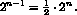

它表明 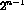 和  之间的差异是一个小的因子：2，这意味着“在步的量级”描述了在一个所有基本操作由 *SL 以“步的量级”运行的 inf 程序相比，运行速度减半的世界中的 inf。从这个意义上说，这两个表达式实际上意味着相同的事情。问题是它们究竟意味着什么，这正是下一节的主题。练习 484。虽然按降序排序的列表对于 inf 来说是最坏的可能输入，但 inf 的抽象运行时间分析解释了为什么使用 [局部](http://docs.racket-lang.org/htdp-langs/intermediate-lam.html#%28form._%28%28lib._lang%2Fhtdp-intermediate-lambda..rkt%29._local%29%29) 重写的 inf 可以减少运行时间。为了方便起见，我们在此复制这个版本：

> | ([定义](http://docs.racket-lang.org/htdp-langs/intermediate-lam.html#%28form._%28%28lib._lang%2Fhtdp-intermediate-lambda..rkt%29._define%29%29) (infL l) |
> | --- |
> |   ([条件](http://docs.racket-lang.org/htdp-langs/intermediate-lam.html#%28form._%28%28lib._lang%2Fhtdp-intermediate-lambda..rkt%29._cond%29%29) |
> |      [([空？](http://docs.racket-lang.org/htdp-langs/intermediate-lam.html#%28def._htdp-intermediate-lambda._%28%28lib._lang%2Fhtdp-intermediate-lambda..rkt%29._empty~3f%29%29) ([rest](http://docs.racket-lang.org/htdp-langs/intermediate-lam.html#%28def._htdp-intermediate-lambda._%28%28lib._lang%2Fhtdp-intermediate-lambda..rkt%29._rest%29%29) l)) ([first](http://docs.racket-lang.org/htdp-langs/intermediate-lam.html#%28def._htdp-intermediate-lambda._%28%28lib._lang%2Fhtdp-intermediate-lambda..rkt%29._first%29%29) l)] |
> |      [[否则](http://docs.racket-lang.org/htdp-langs/intermediate-lam.html#%28form._%28%28lib._lang%2Fhtdp-intermediate-lambda..rkt%29._else%29%29) ([局部](http://docs.racket-lang.org/htdp-langs/intermediate-lam.html#%28form._%28%28lib._lang%2Fhtdp-intermediate-lambda..rkt%29._local%29%29) (([定义](http://docs.racket-lang.org/htdp-langs/intermediate-lam.html#%28form._%28%28lib._lang%2Fhtdp-intermediate-lambda..rkt%29._define%29%29) s (infL ([rest](http://docs.racket-lang.org/htdp-langs/intermediate-lam.html#%28def._htdp-intermediate-lambda._%28%28lib._lang%2Fhtdp-intermediate-lambda..rkt%29._rest%29%29) l)))) |
> | |   ([if](http://docs.racket-lang.org/htdp-langs/intermediate-lam.html#%28form._%28%28lib._lang%2Fhtdp-intermediate-lambda..rkt%29._if%29%29) ([<](http://docs.racket-lang.org/htdp-langs/intermediate-lam.html#%28def._htdp-intermediate-lambda._%28%28lib._lang%2Fhtdp-intermediate-lambda..rkt%29._~3c%29%29) ([first](http://docs.racket-lang.org/htdp-langs/intermediate-lam.html#%28def._htdp-intermediate-lambda._%28%28lib._lang%2Fhtdp-intermediate-lambda..rkt%29._first%29%29) l) s) ([first](http://docs.racket-lang.org/htdp-langs/intermediate-lam.html#%28def._htdp-intermediate-lambda._%28%28lib._lang%2Fhtdp-intermediate-lambda..rkt%29._first%29%29) l) s))])) |

手动评估 (infL  ([list](http://docs.racket-lang.org/htdp-langs/intermediate-lam.html#%28def._htdp-intermediate-lambda._%28%28lib._lang%2Fhtdp-intermediate-lambda..rkt%29._list%29%29)  3  2  1  0)). 然后论证 infL 在最好和最坏情况下使用的是“数量级为 n 的步骤”。你现在可能希望重新审视 练习 261，它要求你探索一个类似的问题。

练习 485. 一个数字树要么是一个数字，要么是一对数字树。设计一个求和树，它确定树中数字的总和。它的抽象运行时间是什么？这种树的合理大小度量是什么？树的最坏可能形状是什么？最好的可能形状是什么？

### “数量级”的定义🔗 "链接到这里")

前一节提到了“数量级”这个短语的所有关键成分。现在，是时候介绍这个短语的严格描述了。让我们从前一节提出的两个想法开始：

1.  性能的抽象度量是两个数量之间的关系：输入的大小和确定答案所需的递归步骤数。这种关系实际上是一个数学函数，它将一个自然数（输入的大小）映射到另一个（所需的时间）。

1.  因此，关于程序性能的一般陈述是关于一个函数的陈述，而两个程序性能的比较需要比较两个这样的函数。

你如何决定一个这样的函数是否比另一个“更好”？

> > > 练习 245 探讨了一个不同的问题，即我们是否可以制定一个程序来决定两个其他程序是否相等。在这个插曲中，我们不是编写程序；我们是在使用纯数学论证。

让我们回到引言中的想象程序：prog-linear 和 prog-square。它们计算相同的结果，但它们的性能不同。prog-linear 程序需要“数量级为 n 的步骤”，而 prog-square 使用“数量级为 n² 的步骤”。从数学的角度讲，prog-linear 的性能函数是

> 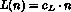

和 prog-square 相关的性能函数是

> 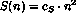

在这些定义中，cL 是 prog-square 中每步递归的成本，cS 是 prog-linear 中每步的成本。

假设我们计算出 cL = 1000 和 cS = 1。然后我们可以将这些抽象的运行时间列成表格，以便进行具体的比较：

> | n |  | 10 |  | 100 |  | 1000 |  | 2000 |
> | --- | --- | --- | --- | --- | --- | --- | --- | --- |
> | prog-square |  | 100 |  | 10000 |  | 1000000 |  | 4000000 |
> | prog-linear |  | 10000 |  | 100000 |  | 1000000 |  | 2000000 |

就像 图 176 中的图表一样，表格最初似乎表明 prog-square 比 prog-linear 更好，因为对于相同大小的输入 n，prog-square 的结果比 prog-linear 小。但看看表格的最后一列。一旦输入足够大，prog-square 的优势就会降低，直到在输入大小为 1000 时消失。此后，prog-square 总是比 prog-linear 慢。

这个最后的洞察是“阶”这个短语精确定义的关键。如果一个自然数上的函数 f 对于所有自然数都产生比某个函数 g 更大的数，那么 f 显然比 g 大。但如果这种比较对于只有少数几个输入失败，比如说 1000 或 1000000，而对于所有其他输入都成立呢？在这种情况下，我们仍然想说 f 比 g 好。这带我们来到了以下定义。

> 定义 给定自然数上的函数 g，O(g)（发音为：“大 O 的 g”）是自然数上的函数类。如果存在数字 c 和 bigEnough，使得
> 
> > 对于所有 ，都存在 
> > 
> 术语 如果 ，我们说 f 至少和 g 一样好。

自然地，我们愿意用上面提到的 prog-linear 和 prog-square 的例子来说明这个定义。回想一下 prog-linear 和 prog-square 的性能函数，常数已经填入：

> 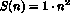

和

> 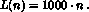

关键是要找到魔法数字 c 和 bigEnough，使得 ，这将会验证 prog-linear 的性能不会比 prog-square 差。目前，我们只告诉你这些数字是什么：

> 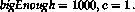

使用这些数字，我们需要证明

> 

对于所有大于 1000 的 n。以下是这种论证的表述方式：

> 选择一些满足条件的特定 n0：
> 
> > 
> > 
> 我们使用符号名 n0，这样我们就不对它做出任何具体假设。现在回想一下代数，你可以将不等式的两边乘以相同的正因子，不等式仍然成立。我们使用 n0：
> 
> > 
> > 
> 在这一点上，我们需要注意到不等式的左边仅仅是 L(n0)，而右边是 S(n0)：
> 
> > 
> > 
> 由于 n0 是一种通用的、正确的类型的数字，我们已经证明了我们想要证明的东西。

通常，你会通过逆向推理找到 bigEnough 和 c。虽然这种数学推理很有趣，但我们将其留给算法课程。O 的定义也用数学的严谨性解释了为什么在我们比较抽象运行时间时不必关注特定的常数。比如说，我们可以让每个基本步骤的 prog-linear 运行速度提高两倍，所以我们有：

> 

和

> 

通过将 bigEnough 加倍到 2000，上述论点成立。

最后，大多数人使用 O 与表示函数的缩写一起使用。因此，他们会说 how-many 的运行时间是 O(n)——<wbr>因为他们倾向于将 n 视为 (数学) 函数 id(n) = n 的缩写。同样，这种用法产生了 [sort](http://docs.racket-lang.org/htdp-langs/intermediate-lam.html#%28def._htdp-intermediate-lambda._%28%28lib._lang%2Fhtdp-intermediate-lambda..rkt%29._sort%29%29) 的最坏情况运行时间是 O(n2) 和 inc 的运行时间是 O(2n)——<wbr>再次是因为 n2 是函数 sqr(n) = n2 的缩写，而 2n 是 expt(n) = 2n 的缩写。

停止！说一个函数的性能是 O(1) 有什么意义？

练习 486。在第一小节中，我们指出函数 f(n) = n2 + n 属于 O(n2) 类。确定验证此声明的数字对 c 和 bigEnough。

练习 487。考虑函数 f(n) = 2n 和 g(n) = 1000n。证明 g 属于 O(f)，这意味着在抽象意义上，f 比 g 更贵（或者至少与 g 相当）。如果输入大小保证在 3 到 12 之间，哪个函数更好？

练习 488。比较  和 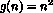。f 属于 O(g) 还是 g 属于 O(f)？

### 为什么程序使用谓词和选择器？🔗 "链接到这里")

“数量级”的概念解释了为什么设计食谱能产生既组织良好又“高效”的程序。我们用一个例子来说明这个见解，即设计一个在数字列表中搜索数字的程序。以下是签名、目的陈述和作为测试的示例：

> | ; Number [List-of  Number] -> Boolean |
> | --- |
> | ; x 是否在 l 中 |
> | |
> | [[check-expect](http://docs.racket-lang.org/htdp-langs/intermediate-lam.html#%28form._%28%28lib._lang%2Fhtdp-intermediate-lambda..rkt%29._check-expect%29%29)] (search 0 '(3 2 1 0)) #true |
> | [[check-expect](http://docs.racket-lang.org/htdp-langs/intermediate-lam.html#%28form._%28%28lib._lang%2Fhtdp-intermediate-lambda..rkt%29._check-expect%29%29)] (search 4 '(3 2 1 0)) #false |

这里有两个定义符合这些期望：

> |
> 
> [[define](http://docs.racket-lang.org/htdp-langs/intermediate-lam.html#%28form._%28%28lib._lang%2Fhtdp-intermediate-lambda..rkt%29._define%29%29)] (searchL x l)
> 
> [[cond](http://docs.racket-lang.org/htdp-langs/intermediate-lam.html#%28form._%28%28lib._lang%2Fhtdp-intermediate-lambda..rkt%29._cond%29%29)]
> 
> [[([empty?](http://docs.racket-lang.org/htdp-langs/intermediate-lam.html#%28def._htdp-intermediate-lambda._%28%28lib._lang%2Fhtdp-intermediate-lambda..rkt%29._empty~3f%29%29) l) #false]]
> 
> [[else](http://docs.racket-lang.org/htdp-langs/intermediate-lam.html#%28form._%28%28lib._lang%2Fhtdp-intermediate-lambda..rkt%29._else%29%29) [[searchL](http://docs.racket-lang.org/htdp-langs/intermediate-lam.html#%28form._%28%28lib._lang%2Fhtdp-intermediate-lambda..rkt%29._searchL%29%29)]]
> 
> [[or](http://docs.racket-lang.org/htdp-langs/intermediate-lam.html#%28form._%28%28lib._lang%2Fhtdp-intermediate-lambda..rkt%29._or%29%29)] ([=](http://docs.racket-lang.org/htdp-langs/intermediate-lam.html#%28def._htdp-intermediate-lambda._%28%28lib._lang%2Fhtdp-intermediate-lambda..rkt%29._~3d%29%29) ([first](http://docs.racket-lang.org/htdp-langs/intermediate-lam.html#%28def._htdp-intermediate-lambda._%28%28lib._lang%2Fhtdp-intermediate-lambda..rkt%29._first%29%29) l) x)
> 
> [[searchL](http://docs.racket-lang.org/htdp-langs/intermediate-lam.html#%28form._%28%28lib._lang%2Fhtdp-intermediate-lambda..rkt%29._searchL%29%29)]
> 
> [[define](http://docs.racket-lang.org/htdp-langs/intermediate-lam.html#%28form._%28%28lib._lang%2Fhtdp-intermediate-lambda..rkt%29._define%29%29)] x ([rest](http://docs.racket-lang.org/htdp-langs/intermediate-lam.html#%28def._htdp-intermediate-lambda._%28%28lib._lang%2Fhtdp-intermediate-lambda..rkt%29._rest%29%29) l))]
> 
> |
> 
> [[define](http://docs.racket-lang.org/htdp-langs/intermediate-lam.html#%28form._%28%28lib._lang%2Fhtdp-intermediate-lambda..rkt%29._define%29%29) (searchS x l) [[define](http://docs.racket-lang.org/htdp-langs/intermediate-lam.html#%28form._%28%28lib._lang%2Fhtdp-intermediate-lambda..rkt%29._define%29%29)]]
> 
> [[cond](http://docs.racket-lang.org/htdp-langs/intermediate-lam.html#%28form._%28%28lib._lang%2Fhtdp-intermediate-lambda..rkt%29._cond%29%29)]
> 
> [[([=](http://docs.racket-lang.org/htdp-langs/intermediate-lam.html#%28def._htdp-intermediate-lambda._%28%28lib._lang%2Fhtdp-intermediate-lambda..rkt%29._~3d%29%29) (length l) 0) #false]]
> 
> [[else](http://docs.racket-lang.org/htdp-langs/intermediate-lam.html#%28form._%28%28lib._lang%2Fhtdp-intermediate-lambda..rkt%29._else%29%29)]
> 
> &#124; ([或者](http://docs.racket-lang.org/htdp-langs/intermediate-lam.html#%28form._%28%28lib._lang%2Fhtdp-intermediate-lambda..rkt%29._or%29%29) ([等于](http://docs.racket-lang.org/htdp-langs/intermediate-lam.html#%28def._htdp-intermediate-lambda._%28%28lib._lang%2Fhtdp-intermediate-lambda..rkt%29._~3d%29%29) ([第一个](http://docs.racket-lang.org/htdp-langs/intermediate-lam.html#%28def._htdp-intermediate-lambda._%28%28lib._lang%2Fhtdp-intermediate-lambda..rkt%29._first%29%29) l) x)) &#124;
> 
> &#124; ([searchS](http://docs.racket-lang.org/htdp-langs/intermediate-lam.html#%28form._%28%28lib._lang%2Fhtdp-intermediate-lambda..rkt%29._searchS%29%29) &#124;
> 
> &#124; ([x](http://docs.racket-lang.org/htdp-langs/intermediate-lam.html#%28def._htdp-intermediate-lambda._%28%28lib._lang%2Fhtdp-intermediate-lambda..rkt%29._rest%29%29) l))]))) &#124;
> 
> |

左侧程序的编写遵循了设计配方。特别是，模板的开发需要使用数据定义中每个子句的结构性谓词。遵循这一建议会产生一个条件程序，其第一个 [cond](http://docs.racket-lang.org/htdp-langs/intermediate-lam.html#%28form._%28%28lib._lang%2Fhtdp-intermediate-lambda..rkt%29._cond%29%29) 行处理空列表，而第二个则处理所有其他情况。第一个 [cond](http://docs.racket-lang.org/htdp-langs/intermediate-lam.html#%28form._%28%28lib._lang%2Fhtdp-intermediate-lambda..rkt%29._cond%29%29) 行中的问题使用了 [empty?](http://docs.racket-lang.org/htdp-langs/intermediate-lam.html#%28def._htdp-intermediate-lambda._%28%28lib._lang%2Fhtdp-intermediate-lambda..rkt%29._empty~3f%29%29)，第二个则使用了 [cons?](http://docs.racket-lang.org/htdp-langs/intermediate-lam.html#%28def._htdp-intermediate-lambda._%28%28lib._lang%2Fhtdp-intermediate-lambda..rkt%29._cons~3f%29%29) 或 [else](http://docs.racket-lang.org/htdp-langs/intermediate-lam.html#%28form._%28%28lib._lang%2Fhtdp-intermediate-lambda..rkt%29._else%29%29)。

searchS 的设计未能满足结构化设计配方。它实际上使用了生成递归。它从列表是具有大小的容器这一想法中汲取灵感。因此，程序可以检查这个大小为 0，这相当于检查空列表。

虽然这个想法在功能上是正确的，但它假设 *SL 提供的操作成本是一个固定的常数。然而，如果长度更像是 how-many，那么 searchS 将会比 searchL 慢。使用我们新的术语，searchL 使用 O(n) 的递归步骤，而 searchS 对于 n 个元素的列表需要 O(n²) 的步骤。简而言之，使用任意的 *SL 操作来制定条件可能会将性能从一类函数转移到一类性能更差的函数。

让我们用一个实验来结束这个小插曲，这个实验检查长度是否是一个常数时间的函数，或者它是否消耗的时间与给定列表的长度成比例。最简单的方法是定义一个程序，它创建一个长列表并确定每个版本的搜索程序需要多少时间：

> | ; N -> [List  Number  Number] |
> | --- |
> | ; how long do searchS and searchL take |
> | ; to look for n in ([list](http://docs.racket-lang.org/htdp-langs/intermediate-lam.html#%28def._htdp-intermediate-lambda._%28%28lib._lang%2Fhtdp-intermediate-lambda..rkt%29._list%29%29)  0  [...](http://docs.racket-lang.org/htdp-langs/intermediate-lam.html#%28form._%28%28lib._lang%2Fhtdp-intermediate-lambda..rkt%29._......%29%29)  ([-](http://docs.racket-lang.org/htdp-langs/intermediate-lam.html#%28def._htdp-intermediate-lambda._%28%28lib._lang%2Fhtdp-intermediate-lambda..rkt%29._-%29%29)  n  1)) |
> | ([define](http://docs.racket-lang.org/htdp-langs/intermediate-lam.html#%28form._%28%28lib._lang%2Fhtdp-intermediate-lambda..rkt%29._define%29%29) (timing n) |
> | |   ([local](http://docs.racket-lang.org/htdp-langs/intermediate-lam.html#%28form._%28%28lib._lang%2Fhtdp-intermediate-lambda..rkt%29._local%29%29) (([define](http://docs.racket-lang.org/htdp-langs/intermediate-lam.html#%28form._%28%28lib._lang%2Fhtdp-intermediate-lambda..rkt%29._define%29%29) long-list |
> | |   ([build-list](http://docs.racket-lang.org/htdp-langs/intermediate-lam.html#%28def._htdp-intermediate-lambda._%28%28lib._lang%2Fhtdp-intermediate-lambda..rkt%29._build-list%29%29) n ([lambda](http://docs.racket-lang.org/htdp-langs/intermediate-lam.html#%28form._%28%28lib._lang%2Fhtdp-intermediate-lambda..rkt%29._lambda%29%29) (x) x)))) |
> | |   ([list](http://docs.racket-lang.org/htdp-langs/intermediate-lam.html#%28def._htdp-intermediate-lambda._%28%28lib._lang%2Fhtdp-intermediate-lambda..rkt%29._list%29%29) |
> | |     ([time](http://docs.racket-lang.org/htdp-langs/intermediate-lam.html#%28form._%28%28lib._lang%2Fhtdp-intermediate-lambda..rkt%29._time%29%29) (searchS n long-list)) |
> | |     ([time](http://docs.racket-lang.org/htdp-langs/intermediate-lam.html#%28form._%28%28lib._lang%2Fhtdp-intermediate-lambda..rkt%29._time%29%29) (searchL n long-list))))) |

现在运行这个程序对 10000 和 20000 进行测试。如果长度像[empty?](http://docs.racket-lang.org/htdp-langs/intermediate-lam.html#%28def._htdp-intermediate-lambda._%28%28lib._lang%2Fhtdp-intermediate-lambda..rkt%29._empty~3f%29%29)一样，第二次运行的时间将大约是第一次的两倍；否则，searchS 的时间将显著增加。

停止！进行实验。

假设你已经完成了实验，你现在知道长度与给定列表的大小成比例。在 searchS 中的“S”代表“平方”，因为它的运行时间是 O(n²)。但不要急于得出这种推理适用于你将遇到的每一种编程语言的结论。许多语言处理容器的方式与*SL 不同。了解这是如何做到的还需要一个额外的设计概念，即累加器，这是本书最后一部分的内容。

### 🔗 "链接到此处")
