# VI 累加器🔗

> 原文：[`htdp.org/2024-11-6/Book/part_six.html`](https://htdp.org/2024-11-6/Book/part_six.html)

|   31 知识的丧失) |
| --- |
|   31.1 结构处理的问题) |
|   31.2 生成递归的问题) |
|   32 设计累加器风格函数) |
|   32.1 识别需要累加器的情况) |
|   32.2 添加累加器) |
|   32.3 将函数转换为累加器风格) |
|   32.4 带鼠标的图形编辑器) |
|   33 累加器的更多用途) |
|   33.1 累加器和树) |
|   33.2 使用累加器的数据表示) |
|   33.3 累加器作为结果) |
|   34 总结) |

当你要求 ISL+ 将函数 f 应用到参数 a 上时，你通常会得到某个值 v。如果你再次评估 (f a)，你将再次得到 v。事实上，无论你要求评估 (f a) 多少次，你都会得到 v。函数应用也可能无限循环或发出错误信号，但我们忽略这些可能性。我们也忽略随机性，这是这个规则的真正例外。无论函数是第一次应用还是第一百次应用，无论应用是在 DrRacket 的交互区域还是函数内部，这都不重要。函数按照其目的声明工作，这就是你需要知道的一切。

这个与上下文无关的原则在递归函数的设计中起着关键作用。在设计时，你可以自由地假设函数计算的是目的声明中所承诺的内容——即使函数尚未定义。特别是，你可以自由地使用递归调用的结果来创建某个函数的代码，通常是在其条件子句之一中。结构性和生成递归函数的设计食谱的模板和编码步骤都依赖于这个想法。

虽然上下文无关性有助于函数的设计，但它会导致两个问题。一般来说，上下文无关性在递归评估过程中会导致知识损失；一个函数“不知道”它是在一个完整的列表上还是在列表的一部分上被调用。对于结构化递归程序，这种知识损失意味着它们可能需要多次遍历数据，从而产生性能成本。对于使用生成递归的函数，这种损失意味着函数可能根本无法计算出结果。前一部分通过一个无法在环形图上找到两个节点之间路径的图遍历函数，说明了第二个问题。

这一部分介绍了一种设计食谱的变体，以解决这个“上下文丢失”问题。由于我们希望保留的原则是（f a）无论何时何地评估都返回相同的结果，唯一的解决方案是添加一个表示函数调用上下文的参数。我们称这个额外的参数为累加器。在数据遍历过程中，递归调用继续接收常规参数，而累加器则根据这些参数和上下文而变化。

正确地使用累加器设计函数显然比前几章中的任何设计方法都要复杂。关键是理解适当参数和累加器之间的关系。以下章节将解释如何设计带有累加器的函数以及它们是如何工作的。

### 31 知识的丢失🔗 "链接到此处")

根据结构化食谱设计的两个函数以及生成函数都受到了知识损失的影响，尽管方式不同。本章通过两个例子——每个类别一个——解释了缺乏上下文知识如何影响函数的性能。虽然第一部分是关于结构化递归，但第二部分则关注生成领域的问题。

#### 31.1 结构处理中的问题🔗 "链接到此处")

让我们从看似简单的一个例子开始：

> 样本问题你正在为一个几何团队工作，该团队将测量道路段长度。团队要求你设计一个程序，将这些一系列道路点之间的相对距离转换为从某个起点开始的绝对距离。

例如，我们可能会得到如下这样的线：

> 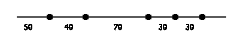

每个数字指定了两个点之间的距离。我们需要的是以下这样的图片，其中每个点都标注了到最左端点的距离：

> 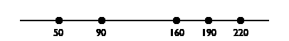

设计一个执行此计算的程序仅仅是结构化函数设计的练习。图 177 包含了完整的程序。当给定的列表不是 '() 时，自然递归计算点剩余部分到第一个点的绝对距离 ([rest](http://docs.racket-lang.org/htdp-langs/intermediate-lam.html#%28def._htdp-intermediate-lambda._%28%28lib._lang%2Fhtdp-intermediate-lambda..rkt%29._rest%29%29)  l)。因为第一个点不是实际的原点，并且与原点的距离为 ([first](http://docs.racket-lang.org/htdp-langs/intermediate-lam.html#%28def._htdp-intermediate-lambda._%28%28lib._lang%2Fhtdp-intermediate-lambda..rkt%29._first%29%29)  l)，我们必须将 ([first](http://docs.racket-lang.org/htdp-langs/intermediate-lam.html#%28def._htdp-intermediate-lambda._%28%28lib._lang%2Fhtdp-intermediate-lambda..rkt%29._first%29%29)  l) 添加到自然递归结果中的每个数字上。这一步——<wbr>将一个数字添加到数字列表中的每个项目——<wbr>需要一个辅助函数。

> > > | ; [列表  编号] -> [列表  编号] |
> > > | --- |
> > > | ; 将相对距离转换为绝对距离 |
> > > | ; 第一个数字表示到原点的距离 |
> > > |   |
> > > | ([check-expect](http://docs.racket-lang.org/htdp-langs/intermediate-lam.html#%28form._%28%28lib._lang%2Fhtdp-intermediate-lambda..rkt%29._check-expect%29%29) (relative->absolute '(50 40 70 30 30)) |
> > > |               '(50 90 160 190 220)) |
> > > |   |
> > > | ([define](http://docs.racket-lang.org/htdp-langs/intermediate-lam.html#%28form._%28%28lib._lang%2Fhtdp-intermediate-lambda..rkt%29._define%29%29) (relative->absolute l) |
> > > |   ([cond](http://docs.racket-lang.org/htdp-langs/intermediate-lam.html#%28form._%28%28lib._lang%2Fhtdp-intermediate-lambda..rkt%29._cond%29%29) |
> > > |     [([empty?](http://docs.racket-lang.org/htdp-langs/intermediate-lam.html#%28def._htdp-intermediate-lambda._%28%28lib._lang%2Fhtdp-intermediate-lambda..rkt%29._empty~3f%29%29) l) '()] |
> > > |     [[else](http://docs.racket-lang.org/htdp-langs/intermediate-lam.html#%28form._%28%28lib._lang%2Fhtdp-intermediate-lambda..rkt%29._else%29%29) ([local](http://docs.racket-lang.org/htdp-langs/intermediate-lam.html#%28form._%28%28lib._lang%2Fhtdp-intermediate-lambda..rkt%29._local%29%29) (([define](http://docs.racket-lang.org/htdp-langs/intermediate-lam.html#%28form._%28%28lib._lang%2Fhtdp-intermediate-lambda..rkt%29._define%29%29) rest-of-l |
> > > |                     (relative->absolute ([rest](http://docs.racket-lang.org/htdp-langs/intermediate-lam.html#%28def._htdp-intermediate-lambda._%28%28lib._lang%2Fhtdp-intermediate-lambda..rkt%29._rest%29%29) l))) |
> > > |                   ([define](http://docs.racket-lang.org/htdp-langs/intermediate-lam.html#%28form._%28%28lib._lang%2Fhtdp-intermediate-lambda..rkt%29._define%29%29) adjusted |
> > > |                     (add-to-each ([first](http://docs.racket-lang.org/htdp-langs/intermediate-lam.html#%28def._htdp-intermediate-lambda._%28%28lib._lang%2Fhtdp-intermediate-lambda..rkt%29._first%29%29) l) rest-of-l))) |
> > > | ([cons](http://docs.racket-lang.org/htdp-langs/intermediate-lam.html#%28def._htdp-intermediate-lambda._%28%28lib._lang%2Fhtdp-intermediate-lambda..rkt%29._cons%29%29) ([first](http://docs.racket-lang.org/htdp-langs/intermediate-lam.html#%28def._htdp-intermediate-lambda._%28%28lib._lang%2Fhtdp-intermediate-lambda..rkt%29._first%29%29) l) adjusted))])) |
> > > |   |
> > > | ; Number [List-of  Number] -> [List-of  Number] |
> > > | ; 为 l 中的每个数字添加 n |
> > > |   |
> > > | ([check-expect](http://docs.racket-lang.org/htdp-langs/intermediate-lam.html#%28form._%28%28lib._lang%2Fhtdp-intermediate-lambda..rkt%29._check-expect%29%29) ([cons](http://docs.racket-lang.org/htdp-langs/intermediate-lam.html#%28def._htdp-intermediate-lambda._%28%28lib._lang%2Fhtdp-intermediate-lambda..rkt%29._cons%29%29) 50 (add-to-each 50 '(40 110 140 170)))) |
> > > | (50 90 160 190 220)) |
> > > |   |
> > > | ([define](http://docs.racket-lang.org/htdp-langs/intermediate-lam.html#%28form._%28%28lib._lang%2Fhtdp-intermediate-lambda..rkt%29._define%29%29) (add-to-each n l) |
> > > |   ([cond](http://docs.racket-lang.org/htdp-langs/intermediate-lam.html#%28form._%28%28lib._lang%2Fhtdp-intermediate-lambda..rkt%29._cond%29%29) |
> > > |     [([empty?](http://docs.racket-lang.org/htdp-langs/intermediate-lam.html#%28def._htdp-intermediate-lambda._%28%28lib._lang%2Fhtdp-intermediate-lambda..rkt%29._empty~3f%29%29) l) '()] |
> > > |     [[else](http://docs.racket-lang.org/htdp-langs/intermediate-lam.html#%28form._%28%28lib._lang%2Fhtdp-intermediate-lambda..rkt%29._else%29%29) ([cons](http://docs.racket-lang.org/htdp-langs/intermediate-lam.html#%28def._htdp-intermediate-lambda._%28%28lib._lang%2Fhtdp-intermediate-lambda..rkt%29._cons%29%29) ([+](http://docs.racket-lang.org/htdp-langs/intermediate-lam.html#%28def._htdp-intermediate-lambda._%28%28lib._lang%2Fhtdp-intermediate-lambda..rkt%29._%2B%29%29) ([first](http://docs.racket-lang.org/htdp-langs/intermediate-lam.html#%28def._htdp-intermediate-lambda._%28%28lib._lang%2Fhtdp-intermediate-lambda..rkt%29._first%29%29) l) n) (add-to-each n ([rest](http://docs.racket-lang.org/htdp-langs/intermediate-lam.html#%28def._htdp-intermediate-lambda._%28%28lib._lang%2Fhtdp-intermediate-lambda..rkt%29._rest%29%29) l)))])) |
> > > 
> 图 177：将相对距离转换为绝对距离

虽然设计程序相对简单，但在更大的列表上使用它揭示了问题。考虑以下表达式的评估：

> (relative->absolute ([build-list](http://docs.racket-lang.org/htdp-langs/intermediate-lam.html#%28def._htdp-intermediate-lambda._%28%28lib._lang%2Fhtdp-intermediate-lambda..rkt%29._build-list%29%29) size [add1](http://docs.racket-lang.org/htdp-langs/intermediate-lam.html#%28def._htdp-intermediate-lambda._%28%28lib._lang%2Fhtdp-intermediate-lambda..rkt%29._add1%29%29)))

随着大小的增加，所需的时间增长得更快：

> | size |  | 1000 |  | 2000 |  | 3000 |  | 4000 |  | 5000 |  | 6000 |  | 7000 |
> | --- | --- | --- | --- | --- | --- | --- | --- | --- | --- | --- | --- | --- | --- | --- |
> | time |  | 25 |  | 109 |  | 234 |  | 429 |  | 689 |  | 978 |  | 1365 |

当我们从 1000 个元素增加到 2000 个元素时，时间翻倍。这与从 2000 个元素增加到 4000 个元素的关系大致相同。这些时间会因计算机和年份的不同而有所不同。这些测量是在 2017 年在一台运行 OS X 10.11 的 MacMini 上进行的；之前的测量是在 1998 年，时间是 100 倍。使用 Intermezzo 5: 计算成本中的术语，我们说该函数的性能是 O(n²)，其中 n 是给定列表的长度。

练习 489. 使用 [map](http://docs.racket-lang.org/htdp-langs/intermediate-lam.html#%28def._htdp-intermediate-lambda._%28%28lib._lang%2Fhtdp-intermediate-lambda..rkt%29._map%29%29) 和 [lambda](http://docs.racket-lang.org/htdp-langs/intermediate-lam.html#%28form._%28%28lib._lang%2Fhtdp-intermediate-lambda..rkt%29._lambda%29%29) 重新表述 add-to-each。

练习 490. 开发一个描述 relative->absolute 抽象运行时间的公式。提示：评估以下表达式

> (relative->absolute ([build-list](http://docs.racket-lang.org/htdp-langs/intermediate-lam.html#%28def._htdp-intermediate-lambda._%28%28lib._lang%2Fhtdp-intermediate-lambda..rkt%29._build-list%29%29) size [add1](http://docs.racket-lang.org/htdp-langs/intermediate-lam.html#%28def._htdp-intermediate-lambda._%28%28lib._lang%2Fhtdp-intermediate-lambda..rkt%29._add1%29%29)))

手动。首先将大小替换为 1、2 和 3。每次需要多少次 relative->absolute 和 add-to-each 的递归？

考虑到问题的简单性，程序执行的工作量令人惊讶。如果我们手动转换相同的列表，我们会计算总距离，并在沿着线移动时将相对距离累加起来。为什么程序不能这样做？

让我们尝试设计一个接近我们手动方法的函数版本。我们仍然从列表处理模板开始：

> | ([定义](http://docs.racket-lang.org/htdp-langs/intermediate-lam.html#%28form._%28%28lib._lang%2Fhtdp-intermediate-lambda..rkt%29._define%29%29) (relative->absolute/a l) |
> | --- |
> |   ([cond](http://docs.racket-lang.org/htdp-langs/intermediate-lam.html#%28form._%28%28lib._lang%2Fhtdp-intermediate-lambda..rkt%29._cond%29%29) |
> |     [([empty?](http://docs.racket-lang.org/htdp-langs/intermediate-lam.html#%28def._htdp-intermediate-lambda._%28%28lib._lang%2Fhtdp-intermediate-lambda..rkt%29._empty~3f%29%29) l) [...](http://docs.racket-lang.org/htdp-langs/intermediate-lam.html#%28form._%28%28lib._lang%2Fhtdp-intermediate-lambda..rkt%29._......%29%29)] |
> |     [[else](http://docs.racket-lang.org/htdp-langs/intermediate-lam.html#%28form._%28%28lib._lang%2Fhtdp-intermediate-lambda..rkt%29._else%29%29) |
> |      ([...](http://docs.racket-lang.org/htdp-langs/intermediate-lam.html#%28form._%28%28lib._lang%2Fhtdp-intermediate-lambda..rkt%29._......%29%29) ([first](http://docs.racket-lang.org/htdp-langs/intermediate-lam.html#%28def._htdp-intermediate-lambda._%28%28lib._lang%2Fhtdp-intermediate-lambda..rkt%29._first%29%29) l) [...](http://docs.racket-lang.org/htdp-langs/intermediate-lam.html#%28form._%28%28lib._lang%2Fhtdp-intermediate-lambda..rkt%29._......%29%29) |
> |       [...](http://docs.racket-lang.org/htdp-langs/intermediate-lam.html#%28form._%28%28lib._lang%2Fhtdp-intermediate-lambda..rkt%29._......%29%29) (relative->absolute/a ([rest](http://docs.racket-lang.org/htdp-langs/intermediate-lam.html#%28def._htdp-intermediate-lambda._%28%28lib._lang%2Fhtdp-intermediate-lambda..rkt%29._rest%29%29) l)) [...](http://docs.racket-lang.org/htdp-langs/intermediate-lam.html#%28form._%28%28lib._lang%2Fhtdp-intermediate-lambda..rkt%29._......%29%29))])) |

现在我们来模拟一下手算过程：

> | (relative->absolute/a ([list](http://docs.racket-lang.org/htdp-langs/intermediate-lam.html#%28def._htdp-intermediate-lambda._%28%28lib._lang%2Fhtdp-intermediate-lambda..rkt%29._list%29%29) 3 2 7)) |
> | --- |
> | == ([cons](http://docs.racket-lang.org/htdp-langs/intermediate-lam.html#%28def._htdp-intermediate-lambda._%28%28lib._lang%2Fhtdp-intermediate-lambda..rkt%29._cons%29%29) [...](http://docs.racket-lang.org/htdp-langs/intermediate-lam.html#%28form._%28%28lib._lang%2Fhtdp-intermediate-lambda..rkt%29._......%29%29) 3 [...](http://docs.racket-lang.org/htdp-langs/intermediate-lam.html#%28form._%28%28lib._lang%2Fhtdp-intermediate-lambda..rkt%29._......%29%29) (relative->absolute/a ([list](http://docs.racket-lang.org/htdp-langs/intermediate-lam.html#%28def._htdp-intermediate-lambda._%28%28lib._lang%2Fhtdp-intermediate-lambda..rkt%29._list%29%29) 2 7))) |
> | == ([cons](http://docs.racket-lang.org/htdp-langs/intermediate-lam.html#%28def._htdp-intermediate-lambda._%28%28lib._lang%2Fhtdp-intermediate-lambda..rkt%29._cons%29%29) [...](http://docs.racket-lang.org/htdp-langs/intermediate-lam.html#%28form._%28%28lib._lang%2Fhtdp-intermediate-lambda..rkt%29._......%29%29) 3 [...](http://docs.racket-lang.org/htdp-langs/intermediate-lam.html#%28form._%28%28lib._lang%2Fhtdp-intermediate-lambda..rkt%29._......%29%29) |
> |      ([cons](http://docs.racket-lang.org/htdp-langs/intermediate-lam.html#%28def._htdp-intermediate-lambda._%28%28lib._lang%2Fhtdp-intermediate-lambda..rkt%29._cons%29%29) [...](http://docs.racket-lang.org/htdp-langs/intermediate-lam.html#%28form._%28%28lib._lang%2Fhtdp-intermediate-lambda..rkt%29._......%29%29) 2 [...](http://docs.racket-lang.org/htdp-langs/intermediate-lam.html#%28form._%28%28lib._lang%2Fhtdp-intermediate-lambda..rkt%29._......%29%29) |
> |        (relative->absolute/a ([list](http://docs.racket-lang.org/htdp-langs/intermediate-lam.html#%28def._htdp-intermediate-lambda._%28%28lib._lang%2Fhtdp-intermediate-lambda..rkt%29._list%29%29) 7)))) |
> | == ([cons](http://docs.racket-lang.org/htdp-langs/intermediate-lam.html#%28def._htdp-intermediate-lambda._%28%28lib._lang%2Fhtdp-intermediate-lambda..rkt%29._cons%29%29) [...](http://docs.racket-lang.org/htdp-langs/intermediate-lam.html#%28form._%28%28lib._lang%2Fhtdp-intermediate-lambda..rkt%29._......%29%29) 3 [...](http://docs.racket-lang.org/htdp-langs/intermediate-lam.html#%28form._%28%28lib._lang%2Fhtdp-intermediate-lambda..rkt%29._......%29%29) |
> |      ([cons](http://docs.racket-lang.org/htdp-langs/intermediate-lam.html#%28def._htdp-intermediate-lambda._%28%28lib._lang%2Fhtdp-intermediate-lambda..rkt%29._cons%29%29) [...](http://docs.racket-lang.org/htdp-langs/intermediate-lam.html#%28form._%28%28lib._lang%2Fhtdp-intermediate-lambda..rkt%29._......%29%29) 2 [...](http://docs.racket-lang.org/htdp-langs/intermediate-lam.html#%28form._%28%28lib._lang%2Fhtdp-intermediate-lambda..rkt%29._......%29%29) |
> |        ([cons](http://docs.racket-lang.org/htdp-langs/intermediate-lam.html#%28def._htdp-intermediate-lambda._%28%28lib._lang%2Fhtdp-intermediate-lambda..rkt%29._cons%29%29) [...](http://docs.racket-lang.org/htdp-langs/intermediate-lam.html#%28form._%28%28lib._lang%2Fhtdp-intermediate-lambda..rkt%29._......%29%29) 7 [...](http://docs.racket-lang.org/htdp-langs/intermediate-lam.html#%28form._%28%28lib._lang%2Fhtdp-intermediate-lambda..rkt%29._......%29%29) |
> |          (relative->absolute/a '())))) |

结果列表的第一项显然应该是 3，构建这个列表很容易。但是，第二项应该是([+](http://docs.racket-lang.org/htdp-langs/intermediate-lam.html#%28def._htdp-intermediate-lambda._%28%28lib._lang%2Fhtdp-intermediate-lambda..rkt%29._%2B%29%29) 3 2)，然而相对->绝对/a 的第二个实例并没有“知道”原始列表的第一项是 3。这种“知识”已经丢失了。

再次，问题在于递归函数与其上下文无关。一个函数在([cons](http://docs.racket-lang.org/htdp-langs/intermediate-lam.html#%28def._htdp-intermediate-lambda._%28%28lib._lang%2Fhtdp-intermediate-lambda..rkt%29._cons%29%29) N L) 和 ([cons](http://docs.racket-lang.org/htdp-langs/intermediate-lam.html#%28def._htdp-intermediate-lambda._%28%28lib._lang%2Fhtdp-intermediate-lambda..rkt%29._cons%29%29) K L) 中以相同的方式处理 L。实际上，如果只给出 L 本身，它也会以那种方式处理列表。

为了弥补“知识”的损失，我们给函数添加了一个额外的参数：accu-dist。后者代表累积距离，这是我们将在将相对距离列表转换为绝对距离列表时保持的计数。它的初始值必须是 0。当函数遍历列表时，它必须将其数字添加到计数中。

这里是修改后的定义：

> | ([define](http://docs.racket-lang.org/htdp-langs/intermediate-lam.html#%28form._%28%28lib._lang%2Fhtdp-intermediate-lambda..rkt%29._define%29%29) (relative->absolute/a l accu-dist) |
> | --- |
> | |     ([cond](http://docs.racket-lang.org/htdp-langs/intermediate-lam.html#%28form._%28%28lib._lang%2Fhtdp-intermediate-lambda..rkt%29._cond%29%29) |
> | |       ([([empty?](http://docs.racket-lang.org/htdp-langs/intermediate-lam.html#%28def._htdp-intermediate-lambda._%28%28lib._lang%2Fhtdp-intermediate-lambda..rkt%29._empty~3f%29%29) l) '()] |
> | |       [[else](http://docs.racket-lang.org/htdp-langs/intermediate-lam.html#%28form._%28%28lib._lang%2Fhtdp-intermediate-lambda..rkt%29._else%29%29) |
> | |       ([local](http://docs.racket-lang.org/htdp-langs/intermediate-lam.html#%28form._%28%28lib._lang%2Fhtdp-intermediate-lambda..rkt%29._local%29%29)(([define](http://docs.racket-lang.org/htdp-langs/intermediate-lam.html#%28form._%28%28lib._lang%2Fhtdp-intermediate-lambda..rkt%29._define%29%29) tally ([+](http://docs.racket-lang.org/htdp-langs/intermediate-lam.html#%28def._htdp-intermediate-lambda._%28%28lib._lang%2Fhtdp-intermediate-lambda..rkt%29._%2B%29%29) ([first](http://docs.racket-lang.org/htdp-langs/intermediate-lam.html#%28def._htdp-intermediate-lambda._%28%28lib._lang%2Fhtdp-intermediate-lambda..rkt%29._first%29%29) l) accu-dist))) |
> | |      ([cons](http://docs.racket-lang.org/htdp-langs/intermediate-lam.html#%28def._htdp-intermediate-lambda._%28%28lib._lang%2Fhtdp-intermediate-lambda..rkt%29._cons%29%29) tally |
> | |           (relative->absolute/a ([rest](http://docs.racket-lang.org/htdp-langs/intermediate-lam.html#%28def._htdp-intermediate-lambda._%28%28lib._lang%2Fhtdp-intermediate-lambda..rkt%29._rest%29%29) l) tally)))])) |

递归应用消耗了列表的其余部分以及当前点到原点的新的绝对距离。尽管每次调用时两个参数都在变化，但第二个参数的变化严格依赖于第一个参数。该函数仍然是一个普通的列表处理过程。现在让我们再次评估我们的运行示例：

> | (相对->绝对/a ([列表](http://docs.racket-lang.org/htdp-langs/intermediate-lam.html#%28def._htdp-intermediate-lambda._%28%28lib._lang%2Fhtdp-intermediate-lambda..rkt%29._list%29%29%29) 3 2 7)) |
> | --- |
> | == (相对->绝对/a ([列表](http://docs.racket-lang.org/htdp-langs/intermediate-lam.html#%28def._htdp-intermediate-lambda._%28%28lib._lang%2Fhtdp-intermediate-lambda..rkt%29._list%29%29%29) 3 2 7) 0) |
> | == ([cons](http://docs.racket-lang.org/htdp-langs/intermediate-lam.html#%28def._htdp-intermediate-lambda._%28%28lib._lang%2Fhtdp-intermediate-lambda..rkt%29._cons%29%29) 3 (相对->绝对/a ([列表](http://docs.racket-lang.org/htdp-langs/intermediate-lam.html#%28def._htdp-intermediate-lambda._%28%28lib._lang%2Fhtdp-intermediate-lambda..rkt%29._list%29%29%29) 2 7) 3)) |
> | == ([cons](http://docs.racket-lang.org/htdp-langs/intermediate-lam.html#%28def._htdp-intermediate-lambda._%28%28lib._lang%2Fhtdp-intermediate-lambda..rkt%29._cons%29%29) 3 ([cons](http://docs.racket-lang.org/htdp-langs/intermediate-lam.html#%28def._htdp-intermediate-lambda._%28%28lib._lang%2Fhtdp-intermediate-lambda..rkt%29._cons%29%29) 5 (相对->绝对/a ([列表](http://docs.racket-lang.org/htdp-langs/intermediate-lam.html#%28def._htdp-intermediate-lambda._%28%28lib._lang%2Fhtdp-intermediate-lambda..rkt%29._list%29%29%29) 7) 5))) |
> | == ([cons](http://docs.racket-lang.org/htdp-langs/intermediate-lam.html#%28def._htdp-intermediate-lambda._%28%28lib._lang%2Fhtdp-intermediate-lambda..rkt%29._cons%29%29) 3 ([cons](http://docs.racket-lang.org/htdp-langs/intermediate-lam.html#%28def._htdp-intermediate-lambda._%28%28lib._lang%2Fhtdp-intermediate-lambda..rkt%29._cons%29%29) 5 ([cons](http://docs.racket-lang.org/htdp-langs/intermediate-lam.html#%28def._htdp-intermediate-lambda._%28%28lib._lang%2Fhtdp-intermediate-lambda..rkt%29._cons%29%29) 12 ???))) |
> | == ([cons](http://docs.racket-lang.org/htdp-langs/intermediate-lam.html#%28def._htdp-intermediate-lambda._%28%28lib._lang%2Fhtdp-intermediate-lambda..rkt%29._cons%29%29) 3 ([cons](http://docs.racket-lang.org/htdp-langs/intermediate-lam.html#%28def._htdp-intermediate-lambda._%28%28lib._lang%2Fhtdp-intermediate-lambda..rkt%29._cons%29%29) 5 ([cons](http://docs.racket-lang.org/htdp-langs/intermediate-lam.html#%28def._htdp-intermediate-lambda._%28%28lib._lang%2Fhtdp-intermediate-lambda..rkt%29._cons%29%29) 12 '()))) |

停止！在第 4 行填写问号。

手动评估显示了使用累加器如何简化转换过程。列表中的每个项目只处理一次。当 relative->absolute/a 达到参数列表的末尾时，结果就完全确定，不再需要进一步的工作。一般来说，该函数对具有 N 个项目的列表执行大约 N 次自然递归步骤。

一个问题是，与 relative->absolute 不同，新函数消耗两个参数，而不仅仅是其中一个。更糟糕的是，有人可能会不小心将 relative->absolute/a 应用于数字列表和一个非 0 的数字。我们可以通过使用一个包含局部定义来封装 relative->absolute/a 的函数定义来解决这两个问题；图 178 显示了结果。现在，相对于输入输出，relative->absolute 与 relative->absolute.v2 不可区分。

> > > | ; [列表 数字] -> [列表 数字] |
> > > | --- |
> > > | 将相对距离列表转换为绝对距离 |
> > > | ; 第一个数字表示到原点的距离 |
> > > |   |
> > > | ([检查期望](http://docs.racket-lang.org/htdp-langs/intermediate-lam.html#%28form._%28%28lib._lang%2Fhtdp-intermediate-lambda..rkt%29._check-expect%29%29) (relative->absolute.v2 '(50 40 70 30 30)) |
> > > |               '(50 90 160 190 220)) |
> > > |   |
> > > | ([定义](http://docs.racket-lang.org/htdp-langs/intermediate-lam.html#%28form._%28%28lib._lang%2Fhtdp-intermediate-lambda..rkt%29._define%29%29) (relative->absolute.v2 l0) |
> > > |   ([局部](http://docs.racket-lang.org/htdp-langs/intermediate-lam.html#%28form._%28%28lib._lang%2Fhtdp-intermediate-lambda..rkt%29._local%29%29) ( |
> > > |     ; [列表 数字] 数字 -> [列表 数字] |
> > > |     ([定义](http://docs.racket-lang.org/htdp-langs/intermediate-lam.html#%28form._%28%28lib._lang%2Fhtdp-intermediate-lambda..rkt%29._define%29%29) (relative->absolute/a l accu-dist) |
> > > |       ([条件](http://docs.racket-lang.org/htdp-langs/intermediate-lam.html#%28form._%28%28lib._lang%2Fhtdp-intermediate-lambda..rkt%29._cond%29%29) |
> > > |         [([空？](http://docs.racket-lang.org/htdp-langs/intermediate-lam.html#%28def._htdp-intermediate-lambda._%28%28lib._lang%2Fhtdp-intermediate-lambda..rkt%29._empty~3f%29%29) l) '()] |
> > > |         [[否则](http://docs.racket-lang.org/htdp-langs/intermediate-lam.html#%28form._%28%28lib._lang%2Fhtdp-intermediate-lambda..rkt%29._else%29%29) |
> > > |           ([local](http://docs.racket-lang.org/htdp-langs/intermediate-lam.html#%28form._%28%28lib._lang%2Fhtdp-intermediate-lambda..rkt%29._local%29%29) (([define](http://docs.racket-lang.org/htdp-langs/intermediate-lam.html#%28form._%28%28lib._lang%2Fhtdp-intermediate-lambda..rkt%29._define%29%29) accu ([+](http://docs.racket-lang.org/htdp-langs/intermediate-lam.html#%28def._htdp-intermediate-lambda._%28%28lib._lang%2Fhtdp-intermediate-lambda..rkt%29._%2B%29%29) ([first](http://docs.racket-lang.org/htdp-langs/intermediate-lam.html#%28def._htdp-intermediate-lambda._%28%28lib._lang%2Fhtdp-intermediate-lambda..rkt%29._first%29%29) l) accu-dist))) |
> > > |             ([cons](http://docs.racket-lang.org/htdp-langs/intermediate-lam.html#%28def._htdp-intermediate-lambda._%28%28lib._lang%2Fhtdp-intermediate-lambda..rkt%29._cons%29%29) accu |
> > > |                  (relative->absolute/a ([rest](http://docs.racket-lang.org/htdp-langs/intermediate-lam.html#%28def._htdp-intermediate-lambda._%28%28lib._lang%2Fhtdp-intermediate-lambda..rkt%29._rest%29%29) l) accu)))]))) |
> > > |     (relative->absolute/a l0 0))) |
> > > 
> 图 178：使用累加器转换相对距离

现在，让我们看看这个程序版本的表现。为此，我们评估

> (relative->absolute.v2 ([build-list](http://docs.racket-lang.org/htdp-langs/intermediate-lam.html#%28def._htdp-intermediate-lambda._%28%28lib._lang%2Fhtdp-intermediate-lambda..rkt%29._build-list%29%29) size [add1](http://docs.racket-lang.org/htdp-langs/intermediate-lam.html#%28def._htdp-intermediate-lambda._%28%28lib._lang%2Fhtdp-intermediate-lambda..rkt%29._add1%29%29)))

并为几个大小的值列出结果：

> | 大小 |  | 1000 |  | 2000 |  | 3000 |  | 4000 |  | 5000 |  | 6000 |  | 7000 |
> | --- | --- | --- | --- | --- | --- | --- | --- | --- | --- | --- | --- | --- | --- | --- |
> | 时间 |  | 0 |  | 0 |  | 0 |  | 0 |  | 0 |  | 1 |  | 1 |

令人惊讶的是，relative->absolute.v2 处理此类列表的时间永远不会超过一秒，即使对于包含 7000 个数字的列表也是如此。将这种性能与 relative->absolute 的性能进行比较，你可能会认为累加器是所有运行缓慢程序的神奇疗法。不幸的是，并非如此，但当结构化递归函数需要重新处理自然递归的结果时，你应该确实考虑使用累加器。在这种情况下，性能从 O(n²) 提高到 O(n)——并且常数因子有大幅减少。<wbr>练习 491。通过一点设计和一些调整，你的一个朋友为这个样本问题提出了以下解决方案：Adrian German 和 Mardin Yadegar 提出了这个练习。

> | ([define](http://docs.racket-lang.org/htdp-langs/intermediate-lam.html#%28form._%28%28lib._lang%2Fhtdp-intermediate-lambda..rkt%29._define%29%29) (relative->absolute l) |
> | --- |
> |  ([reverse](http://docs.racket-lang.org/htdp-langs/intermediate-lam.html#%28def._htdp-intermediate-lambda._%28%28lib._lang%2Fhtdp-intermediate-lambda..rkt%29._reverse%29%29) |
> | ([foldr](http://docs.racket-lang.org/htdp-langs/intermediate-lam.html#%28def._htdp-intermediate-lambda._%28%28lib._lang%2Fhtdp-intermediate-lambda..rkt%29._foldr%29%29) ([lambda](http://docs.racket-lang.org/htdp-langs/intermediate-lam.html#%28form._%28%28lib._lang%2Fhtdp-intermediate-lambda..rkt%29._lambda%29%29) (element accu) ([cons](http://docs.racket-lang.org/htdp-langs/intermediate-lam.html#%28def._htdp-intermediate-lambda._%28%28lib._lang%2Fhtdp-intermediate-lambda..rkt%29._cons%29%29) ([+](http://docs.racket-lang.org/htdp-langs/intermediate-lam.html#%28def._htdp-intermediate-lambda._%28%28lib._lang%2Fhtdp-intermediate-lambda..rkt%29._%2B%29%29) element ([first](http://docs.racket-lang.org/htdp-langs/intermediate-lam.html#%28def._htdp-intermediate-lambda._%28%28lib._lang%2Fhtdp-intermediate-lambda..rkt%29._first%29%29) accu)) accu))) |
> | ([list](http://docs.racket-lang.org/htdp-langs/intermediate-lam.html#%28def._htdp-intermediate-lambda._%28%28lib._lang%2Fhtdp-intermediate-lambda..rkt%29._list%29%29) ([first](http://docs.racket-lang.org/htdp-langs/intermediate-lam.html#%28def._htdp-intermediate-lambda._%28%28lib._lang%2Fhtdp-intermediate-lambda..rkt%29._first%29%29) l)) |
> | ([reverse](http://docs.racket-lang.org/htdp-langs/intermediate-lam.html#%28def._htdp-intermediate-lambda._%28%28lib._lang%2Fhtdp-intermediate-lambda..rkt%29._reverse%29%29) ([rest](http://docs.racket-lang.org/htdp-langs/intermediate-lam.html#%28def._htdp-intermediate-lambda._%28%28lib._lang%2Fhtdp-intermediate-lambda..rkt%29._rest%29%29) l))) |

这个简单的方案仅仅使用了已知的 ISL+函数：[反转](http://docs.racket-lang.org/htdp-langs/intermediate-lam.html#%28def._htdp-intermediate-lambda._%28%28lib._lang%2Fhtdp-intermediate-lambda..rkt%29._reverse%29%29)和[foldr](http://docs.racket-lang.org/htdp-langs/intermediate-lam.html#%28def._htdp-intermediate-lambda._%28%28lib._lang%2Fhtdp-intermediate-lambda..rkt%29._foldr%29%29)。正如你所知，使用[lambda](http://docs.racket-lang.org/htdp-langs/intermediate-lam.html#%28form._%28%28lib._lang%2Fhtdp-intermediate-lambda..rkt%29._lambda%29%29)只是一个便利。你也许还记得从抽象中，[foldr](http://docs.racket-lang.org/htdp-langs/intermediate-lam.html#%28def._htdp-intermediate-lambda._%28%28lib._lang%2Fhtdp-intermediate-lambda..rkt%29._foldr%29%29)可以用书中前两部分的方案进行设计。

你的朋友提出的解决方案是否意味着在这个激励部分我们不需要复杂的方案？为了找到答案，请参阅识别累加器的需求，但首先请思考这个问题。提示：尝试自己设计[反转](http://docs.racket-lang.org/htdp-langs/intermediate-lam.html#%28def._htdp-intermediate-lambda._%28%28lib._lang%2Fhtdp-intermediate-lambda..rkt%29._reverse%29%29)。

#### 31.2A 问题与生成递归🔗 "链接到此处")

让我们重新审视在图中沿着路径“旅行”的问题：

> 样本问题 设计一个算法，检查在简单图中两个节点是否相连。在这种图中，每个节点恰好有一个到另一个节点或自身的单向连接。

回溯算法 讨论了算法必须发现路径的变体。这个样本问题比那个简单，因为本节重点在于算法的累加器版本设计。

考虑图 figure 179 中的示例图。图中包含六个节点，从 A 到 F，以及六个连接。从 A 到 E 的路径必须包含 B 和 C。然而，从 A 到 F 或从任何其他节点到其自身的路径是不存在的。

> > > | 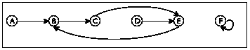 |  |
> > > | --- | --- |
> > > 
> > > > &#124; ([define](http://docs.racket-lang.org/htdp-langs/intermediate-lam.html#%28form._%28%28lib._lang%2Fhtdp-intermediate-lambda..rkt%29._define%29%29) a-sg &#124;
> > > > 
> > > > &#124;   '((A B) &#124;
> > > > 
> > > > &#124;     (B C) &#124;
> > > > 
> > > > &#124;     (C E) &#124;
> > > > 
> > > > &#124;     (D E) &#124;
> > > > 
> > > > &#124;     (E B) &#124;
> > > > 
> > > > &#124;     (F F))) &#124;
> > > > 
> > > |
> > > 
> 图 179: 简单图

图 figure 179 的右侧展示了如何使用嵌套列表表示此图。每个节点由两个符号的列表表示。第一个符号是节点的标签；第二个符号是从第一个符号可达的单个节点。以下是相关的数据定义：

> | ; A SimpleGraph is a [List-of  Connection] |
> | --- |
> | ; A Connection is a list of two items: |
> | ;   ([list](http://docs.racket-lang.org/htdp-langs/intermediate-lam.html#%28def._htdp-intermediate-lambda._%28%28lib._lang%2Fhtdp-intermediate-lambda..rkt%29._list%29%29)  Node  Node) |
> | ; A Node is a Symbol. |

这些是直接翻译我们的非正式描述。我们已经知道这个问题需要生成递归，并且很容易创建头材料：

> | ; Node  Node  SimpleGraph -> Boolean |
> | --- |
> | ; is there a path from origin to destination |
> | ; in the simple graph sg |
> |   |
> | ([check-expect](http://docs.racket-lang.org/htdp-langs/intermediate-lam.html#%28form._%28%28lib._lang%2Fhtdp-intermediate-lambda..rkt%29._check-expect%29%29) (path-exists? 'A 'E a-sg) #true) |
> | ([check-expect](http://docs.racket-lang.org/htdp-langs/intermediate-lam.html#%28form._%28%28lib._lang%2Fhtdp-intermediate-lambda..rkt%29._check-expect%29%29) (path-exists? 'A 'F a-sg) #false) |
> |   |
> | ([define](http://docs.racket-lang.org/htdp-langs/intermediate-lam.html#%28form._%28%28lib._lang%2Fhtdp-intermediate-lambda..rkt%29._define%29%29) (path-exists? origin destination sg) |
> |   #false) |

我们需要的是生成递归食谱的四个基本问题的答案：

+   如果起点与终点相同，问题就很简单。

+   简单的解决方案是#true。

+   如果起点与终点不同，我们只能做一件事：向最近的邻居迈进，并从那里寻找终点。

+   如果我们找到了新问题的解决方案，就无需做任何事情。如果起点邻居与终点相连，那么起点也与之相连。否则，没有连接。

从这里我们只需要用 ISL+表达这些答案，就可以得到一个完整的程序。

> > > | ; 节点  节点  简单图 -> 布尔 |
> > > | --- |
> > > | ; 在 sg 中从起点到终点是否存在路径 |
> > > |   |
> > > | ([check-expect](http://docs.racket-lang.org/htdp-langs/intermediate-lam.html#%28form._%28%28lib._lang%2Fhtdp-intermediate-lambda..rkt%29._check-expect%29%29) (path-exists? 'A 'E a-sg) #true) |
> > > | ([check-expect](http://docs.racket-lang.org/htdp-langs/intermediate-lam.html#%28form._%28%28lib._lang%2Fhtdp-intermediate-lambda..rkt%29._check-expect%29%29) (path-exists? 'A 'F a-sg) #false) |
> > > |   |
> > > | ([define](http://docs.racket-lang.org/htdp-langs/intermediate-lam.html#%28form._%28%28lib._lang%2Fhtdp-intermediate-lambda..rkt%29._define%29%29) (path-exists? origin destination sg) |
> > > |   ([cond](http://docs.racket-lang.org/htdp-langs/intermediate-lam.html#%28form._%28%28lib._lang%2Fhtdp-intermediate-lambda..rkt%29._cond%29%29) |
> > > |     [([symbol=?](http://docs.racket-lang.org/htdp-langs/intermediate-lam.html#%28def._htdp-intermediate-lambda._%28%28lib._lang%2Fhtdp-intermediate-lambda..rkt%29._symbol~3d~3f%29%29) origin destination) #t] |
> > > |     [[else](http://docs.racket-lang.org/htdp-langs/intermediate-lam.html#%28form._%28%28lib._lang%2Fhtdp-intermediate-lambda..rkt%29._else%29%29) (path-exists? (neighbor origin sg) |
> > > |                         destination |
> > > |                         sg)])) |
> > > |   |
> > > | ; 节点  简单图 -> 节点 |
> > > | ; 确定在 sg 中与 a-node 相连的节点 |
> > > | ([check-expect](http://docs.racket-lang.org/htdp-langs/intermediate-lam.html#%28form._%28%28lib._lang%2Fhtdp-intermediate-lambda..rkt%29._check-expect%29%29) (neighbor 'A a-sg) 'B) |
> > > | ([check-error](http://docs.racket-lang.org/htdp-langs/intermediate-lam.html#%28form._%28%28lib._lang%2Fhtdp-intermediate-lambda..rkt%29._check-error%29%29) (neighbor 'G a-sg) "neighbor: not a node") |
> > > | ([define](http://docs.racket-lang.org/htdp-langs/intermediate-lam.html#%28form._%28%28lib._lang%2Fhtdp-intermediate-lambda..rkt%29._define%29%29) (neighbor a-node sg) |
> > > | |   ([cond](http://docs.racket-lang.org/htdp-langs/intermediate-lam.html#%28form._%28%28lib._lang%2Fhtdp-intermediate-lambda..rkt%29._cond%29%29) |
> > > | |   [([empty?](http://docs.racket-lang.org/htdp-langs/intermediate-lam.html#%28def._htdp-intermediate-lambda._%28%28lib._lang%2Fhtdp-intermediate-lambda..rkt%29._empty~3f%29%29) sg) ([error](http://docs.racket-lang.org/htdp-langs/intermediate-lam.html#%28def._htdp-intermediate-lambda._%28%28lib._lang%2Fhtdp-intermediate-lambda..rkt%29._error%29%29) "neighbor: not a node")] |
> > > | |   [[else](http://docs.racket-lang.org/htdp-langs/intermediate-lam.html#%28form._%28%28lib._lang%2Fhtdp-intermediate-lambda..rkt%29._else%29%29) ([if](http://docs.racket-lang.org/htdp-langs/intermediate-lam.html#%28form._%28%28lib._lang%2Fhtdp-intermediate-lambda..rkt%29._if%29%29) ([symbol=?](http://docs.racket-lang.org/htdp-langs/intermediate-lam.html#%28def._htdp-intermediate-lambda._%28%28lib._lang%2Fhtdp-intermediate-lambda..rkt%29._symbol~3d~3f%29%29) ([first](http://docs.racket-lang.org/htdp-langs/intermediate-lam.html#%28def._htdp-intermediate-lambda._%28%28lib._lang%2Fhtdp-intermediate-lambda..rkt%29._first%29%29) ([first](http://docs.racket-lang.org/htdp-langs/intermediate-lam.html#%28def._htdp-intermediate-lambda._%28%28lib._lang%2Fhtdp-intermediate-lambda..rkt%29._first%29%29) sg)) a-node) |
> > > | |   ([second](http://docs.racket-lang.org/htdp-langs/intermediate-lam.html#%28def._htdp-intermediate-lambda._%28%28lib._lang%2Fhtdp-intermediate-lambda..rkt%29._second%29%29) ([first](http://docs.racket-lang.org/htdp-langs/intermediate-lam.html#%28def._htdp-intermediate-lambda._%28%28lib._lang%2Fhtdp-intermediate-lambda..rkt%29._first%29%29) sg)) |
> > > | |   (neighbor a-node ([rest](http://docs.racket-lang.org/htdp-langs/intermediate-lam.html#%28def._htdp-intermediate-lambda._%28%28lib._lang%2Fhtdp-intermediate-lambda..rkt%29._rest%29%29) sg)))])) |
> > > 
> 图 180：在简单图中查找路径

图 180 包含了完整的程序，包括在简单图中查找节点邻居的函数——这是一个结构递归的直接练习——以及针对两种可能结果的测试用例。但是不要运行程序。如果你运行了，准备好用鼠标停止失控的程序。确实，即使粗略地看一下函数，也暗示我们有一个问题。尽管该函数本应在没有从起点到终点路径的情况下产生 #false，但程序中任何地方都没有包含 #false。相反，我们需要询问当两个节点之间没有路径时，函数实际上做了什么。

再看看图 179。在这个简单图中，从 C 到 D 没有路径。离开 C 的连接直接经过 D，而不是去 E。所以让我们看看手动评估：

> | (path-exists? 'C 'D '((A B)  (F F))) |
> | --- |
> | == (path-exists? 'E 'D '((A B)  (F F))) |
> | == (path-exists? 'B 'D '((A B)  (F F))) |
> | == (path-exists? 'C 'D '((A B)  (F F))) |

这确认了当函数递归时，它会一次又一次地用完全相同的参数调用自己。换句话说，评估永远不会停止。

我们对`path-exists?`的问题再次是一个“知识”的丧失，类似于上面提到的`relative->absolute`。就像`relative->absolute`一样，`path-exists?`的设计使用了一个配方，并假设递归调用与其上下文无关。在`path-exists?`的情况下，这意味着，特别是，函数“不知道”当前递归链中的前一次应用是否接收了完全相同的参数。

解决这个设计问题的方法遵循了上一节的模式。我们添加了一个参数，我们称之为`seen`，它代表了函数从原始应用开始遇到的累积起始节点列表。它的初始值必须是`()`。当函数检查特定的原点并移动到其邻居时，原点被添加到`seen`中。

这里是`path-exists?`的第一个修订版，被称为`path-exists?/a`：

> | ; 节点 节点 简单图 [列表 节点] -> 布尔值 |
> | --- |
> | ; 从原点到目标是否有路径 |
> | ; 假设在已看到的节点中没有路径 |
> | ([define](http://docs.racket-lang.org/htdp-langs/intermediate-lam.html#%28form._%28%28lib._lang%2Fhtdp-intermediate-lambda..rkt%29._define%29%29) (path-exists?/a 原点 目标 sg seen)) |
> |   ([cond](http://docs.racket-lang.org/htdp-langs/intermediate-lam.html#%28form._%28%28lib._lang%2Fhtdp-intermediate-lambda..rkt%29._cond%29%29) |
> |     [([符号=？](http://docs.racket-lang.org/htdp-langs/intermediate-lam.html#%28def._htdp-intermediate-lambda._%28%28lib._lang%2Fhtdp-intermediate-lambda..rkt%29._symbol~3d~3f%29%29) 原点 目标) #true] |
> |     [[else](http://docs.racket-lang.org/htdp-langs/intermediate-lam.html#%28form._%28%28lib._lang%2Fhtdp-intermediate-lambda..rkt%29._else%29%29) (path-exists?/a (neighbor 原点 sg) |
> |                           目标 |
> |                           sg |
> |                           ([cons](http://docs.racket-lang.org/htdp-langs/intermediate-lam.html#%28def._htdp-intermediate-lambda._%28%28lib._lang%2Fhtdp-intermediate-lambda..rkt%29._cons%29%29) 原点 已看到))])) |

单独添加新参数并不能解决我们的问题，但正如手动评估

> (path-exists?/a 'C 'D '((A B)  (F F)) '())

所示，它为解决提供了一个基础：

> | == (path-exists?/a 'E 'D '((A B)  (F F)) '(C)) |
> | --- |
> | == (path-exists?/a 'B 'D '((A B)  (F F)) '(E C)) |
> | == (path-exists?/a 'C 'D '((A B)  (F F)) '(B E C)) |

与原始函数相比，修改后的函数不再使用完全相同的参数调用自身。虽然对于第三次递归应用，三个正确参数再次相同，但累加器参数与第一次应用的不同。不再是 '()，现在是 '(B  E  C)。新的值告诉我们，在从 'C 到 'D 的路径搜索过程中，函数已将 'B、'E 和 'C 作为起点进行了检查。

现在我们需要让算法利用积累的知识。具体来说，算法可以确定给定的原点是否已经是 seen 中的项目。如果是这样，问题也可以轻易解决，得到 #false 作为解决方案。图 181 包含了 path-exists.v2? 的定义，这是 path-exists? 的修订版。该定义引用了 [member?](http://docs.racket-lang.org/htdp-langs/intermediate-lam.html#%28def._htdp-intermediate-lambda._%28%28lib._lang%2Fhtdp-intermediate-lambda..rkt%29._member~3f%29%29)，一个 ISL+ 函数。

> > > | ; 节点  节点  简单图 -> 布尔值 |
> > > | --- |
> > > | ; 是否存在从原点到目标点的路径在 sg 中 |
> > > |   |
> > > | ([check-expect](http://docs.racket-lang.org/htdp-langs/intermediate-lam.html#%28form._%28%28lib._lang%2Fhtdp-intermediate-lambda..rkt%29._check-expect%29%29) (path-exists.v2? 'A 'E a-sg) #true) |
> > > | ([check-expect](http://docs.racket-lang.org/htdp-langs/intermediate-lam.html#%28form._%28%28lib._lang%2Fhtdp-intermediate-lambda..rkt%29._check-expect%29%29) (path-exists.v2? 'A 'F a-sg) #false) |
> > > | |
> > > | ([define](http://docs.racket-lang.org/htdp-langs/intermediate-lam.html#%28form._%28%28lib._lang%2Fhtdp-intermediate-lambda..rkt%29._define%29%29) (path-exists.v2? origin destination sg) |
> > > |   ([local](http://docs.racket-lang.org/htdp-langs/intermediate-lam.html#%28form._%28%28lib._lang%2Fhtdp-intermediate-lambda..rkt%29._local%29%29) (; 节点  节点  简单图 [列表  节点] -> 布尔值 |
> > > |           ([define](http://docs.racket-lang.org/htdp-langs/intermediate-lam.html#%28form._%28%28lib._lang%2Fhtdp-intermediate-lambda..rkt%29._define%29%29) (path-exists?/a origin seen) |
> > > |             ([cond](http://docs.racket-lang.org/htdp-langs/intermediate-lam.html#%28form._%28%28lib._lang%2Fhtdp-intermediate-lambda..rkt%29._cond%29%29) |
> > > |               [([symbol=?](http://docs.racket-lang.org/htdp-langs/intermediate-lam.html#%28def._htdp-intermediate-lambda._%28%28lib._lang%2Fhtdp-intermediate-lambda..rkt%29._symbol~3d~3f%29%29) origin destination) #t] |
> > > |               [([member?](http://docs.racket-lang.org/htdp-langs/intermediate-lam.html#%28def._htdp-intermediate-lambda._%28%28lib._lang%2Fhtdp-intermediate-lambda..rkt%29._member~3f%29%29) origin seen) #f] |
> > > |               [[else](http://docs.racket-lang.org/htdp-langs/intermediate-lam.html#%28form._%28%28lib._lang%2Fhtdp-intermediate-lambda..rkt%29._else%29%29) (path-exists?/a (neighbor origin sg) |
> > > |                                     ([cons](http://docs.racket-lang.org/htdp-langs/intermediate-lam.html#%28def._htdp-intermediate-lambda._%28%28lib._lang%2Fhtdp-intermediate-lambda..rkt%29._cons%29%29) origin seen))))) |
> > > |     (path-exists?/a origin '()))) |
> > > 
> 图 181：使用累加器在简单图中寻找路径

path-exists.v2? 的定义也消除了第一版中的两个小问题。通过局部化累加函数的定义，我们可以确保第一次调用总是使用 '() 作为 seen 的初始值。此外，path-exists.v2? 与 path-exists? 函数具有完全相同的签名和目的说明。

尽管如此，path-exists.v2? 与 relative-to-absolute2 之间仍然存在显著差异。后者与原始函数等价，而 path-exists.v2? 在 path-exists? 的基础上进行了改进。后者在某些输入上无法找到答案，而 path-exists.v2? 对于任何简单图都能找到解决方案。

练习 492。修改 图 169 中的定义，使得程序即使在遇到相同的起点两次时也能产生 #false。

### 32 设计累加风格函数🔗 "链接到此处")

前一章通过两个例子说明了积累额外知识的需求。在一种情况下，积累使理解函数变得容易，并产生了一个比原始版本快得多的版本。在另一种情况下，积累对于函数正常工作是必要的。然而，在这两种情况下，积累的需求只有在存在一个设计良好的函数之后才会变得明显。

从前一章的推广来看，累加函数的设计有两个主要方面：

1.  认识到函数从累加器中受益；并且

1.  理解累加器代表的内容。

前两节讨论了这两个问题。由于第二个问题是一个难题，第三节通过一系列示例来说明它，这些示例将常规函数转换为累加函数。

> > > | ; [List-of X] -> [List-of X] |
> > > | --- |
> > > | ; constructs the reverse of alox |
> > > |   |
> > > | ([check-expect](http://docs.racket-lang.org/htdp-langs/intermediate-lam.html#%28form._%28%28lib._lang%2Fhtdp-intermediate-lambda..rkt%29._check-expect%29%29) (invert '(a b c)) '(c b a)) |
> > > |     |   |
> > > | ([define](http://docs.racket-lang.org/htdp-langs/intermediate-lam.html#%28form._%28%28lib._lang%2Fhtdp-intermediate-lambda..rkt%29._define%29%29) (invert alox) |
> > > |     |   ([cond](http://docs.racket-lang.org/htdp-langs/intermediate-lam.html#%28form._%28%28lib._lang%2Fhtdp-intermediate-lambda..rkt%29._cond%29%29) |
> > > |     |     [([empty?](http://docs.racket-lang.org/htdp-langs/intermediate-lam.html#%28def._htdp-intermediate-lambda._%28%28lib._lang%2Fhtdp-intermediate-lambda..rkt%29._empty~3f%29%29) alox) '()] |
> > > |     |   [[else](http://docs.racket-lang.org/htdp-langs/intermediate-lam.html#%28form._%28%28lib._lang%2Fhtdp-intermediate-lambda..rkt%29._else%29%29) |
> > > |     |     |   (add-as-last ([first](http://docs.racket-lang.org/htdp-langs/intermediate-lam.html#%28def._htdp-intermediate-lambda._%28%28lib._lang%2Fhtdp-intermediate-lambda..rkt%29._first%29%29) alox) (invert ([rest](http://docs.racket-lang.org/htdp-langs/intermediate-lam.html#%28def._htdp-intermediate-lambda._%28%28lib._lang%2Fhtdp-intermediate-lambda..rkt%29._rest%29%29) alox))) |
> > > |     |   |
> > > |     ; X [List-of X] -> [List-of X] |
> > > |     ; 添加 an-x 到 alox 的末尾 |
> > > |   |
> > > | ([check-expect](http://docs.racket-lang.org/htdp-langs/intermediate-lam.html#%28form._%28%28lib._lang%2Fhtdp-intermediate-lambda..rkt%29._check-expect%29%29) (add-as-last 'a '(c b)) '(c b a)) |
> > > |     |   |
> > > | ([define](http://docs.racket-lang.org/htdp-langs/intermediate-lam.html#%28form._%28%28lib._lang%2Fhtdp-intermediate-lambda..rkt%29._define%29%29) (add-as-last an-x alox) |
> > > |     |   ([cond](http://docs.racket-lang.org/htdp-langs/intermediate-lam.html#%28form._%28%28lib._lang%2Fhtdp-intermediate-lambda..rkt%29._cond%29%29) |
> > > |     |     [([empty?](http://docs.racket-lang.org/htdp-langs/intermediate-lam.html#%28def._htdp-intermediate-lambda._%28%28lib._lang%2Fhtdp-intermediate-lambda..rkt%29._empty~3f%29%29) alox) ([list](http://docs.racket-lang.org/htdp-langs/intermediate-lam.html#%28def._htdp-intermediate-lambda._%28%28lib._lang%2Fhtdp-intermediate-lambda..rkt%29._list%29%29) an-x)] |
> > > |     [[else](http://docs.racket-lang.org/htdp-langs/intermediate-lam.html#%28form._%28%28lib._lang%2Fhtdp-intermediate-lambda..rkt%29._else%29%29) |
> > > |     |     |   ([cons](http://docs.racket-lang.org/htdp-langs/intermediate-lam.html#%28def._htdp-intermediate-lambda._%28%28lib._lang%2Fhtdp-intermediate-lambda..rkt%29._cons%29%29) ([first](http://docs.racket-lang.org/htdp-langs/intermediate-lam.html#%28def._htdp-intermediate-lambda._%28%28lib._lang%2Fhtdp-intermediate-lambda..rkt%29._first%29%29) alox) (add-as-last an-x ([rest](http://docs.racket-lang.org/htdp-langs/intermediate-lam.html#%28def._htdp-intermediate-lambda._%28%28lib._lang%2Fhtdp-intermediate-lambda..rkt%29._rest%29%29) alox))) |
> > > 
> 图 182：使用累加器的结构示例

#### 32.1 识别需要累加器🔗 "链接至此")

识别需要累加器并非易事。我们看到了两个原因，它们是最普遍的。在任何情况下，我们首先基于传统设计配方构建一个完整的函数都是至关重要的。然后我们研究该函数并按以下步骤进行：

1.  如果一个结构递归函数使用辅助递归函数遍历其自然递归的结果，请考虑使用累加器参数。

    查看图 182 中 invert 的定义图。递归应用的结果是列表其余部分的逆序。它使用 add-as-last 将第一个元素添加到这个逆序列表中，从而创建整个列表的逆序。这个第二个辅助函数也是递归的。因此，我们已经确定了一个累加器候选者。

    现在是时候研究一些手算示例，如 A Problem with Structural Processing，以查看累加器是否有帮助。考虑以下内容：

    > | (invert '(a b c)) |
    > | --- |
    > | == (add-as-last 'a (invert '(b c))) |
    > | == (add-as-last 'a (add-as-last 'b (invert '(c)))) |
    > | == ... |
    > | == (add-as-last 'a (add-as-last 'b '(c))) |
    > | == (add-as-last 'a '(c b)) |
    > | == '(c b a) |

    停止！将点替换为两个缺失的步骤。然后你可以看到 invert 最终会到达给定列表的末尾——就像 add-as-last 一样——如果它知道应该放置哪些项目，那么就不需要辅助函数了。

1.  如果我们处理的是基于生成递归的函数，我们将面临一个更加困难的任务。我们的目标必须理解算法是否可能对于我们期望有结果的输入无法产生结果。如果是这样，添加一个累积知识的参数可能会有所帮助。因为这些情况很复杂，我们将讨论的例子推迟到 More Uses of Accumulation。

练习 493。论证，在 Intermezzo 5: The Cost of Computation 的术语中，invert 当给定的列表包含 n 个元素时消耗 O(n²) 的时间。

练习 494。从 Auxiliary Functions that Recur 中的插入排序函数是否需要累加器？如果是，为什么？如果不是，为什么不是？

#### 32.2 添加累加器🔗 "链接至此")

一旦决定现有函数应该配备累加器，请执行以下两个步骤：

+   确定累加器所代表的知识，使用哪种数据，以及知识如何作为数据获得。

    例如，对于相对距离到绝对距离的转换，只需累积迄今为止遇到的总距离就足够了。当函数处理相对距离列表时，它会将找到的每个新相对距离添加到累加器的当前值。对于路由问题，累加器记住每个遇到的节点。当路径检查函数遍历图时，它将每个新节点[cons](http://docs.racket-lang.org/htdp-langs/intermediate-lam.html#%28def._htdp-intermediate-lambda._%28%28lib._lang%2Fhtdp-intermediate-lambda..rkt%29._cons%29%29)到累加器上。

    通常，你将按照以下步骤进行。

    1.  创建一个累加器模板：

        > | ; 域 -> 范围 |
        > | --- |
        > | ([define](http://docs.racket-lang.org/htdp-langs/intermediate-lam.html#%28form._%28%28lib._lang%2Fhtdp-intermediate-lambda..rkt%29._define%29%29) (function d0) |
        > |   ([local](http://docs.racket-lang.org/htdp-langs/intermediate-lam.html#%28form._%28%28lib._lang%2Fhtdp-intermediate-lambda..rkt%29._local%29%29) (; 域 累加域 -> 范围 |
        > |           ; 累加器 ... |
        > |           ([define](http://docs.racket-lang.org/htdp-langs/intermediate-lam.html#%28form._%28%28lib._lang%2Fhtdp-intermediate-lambda..rkt%29._define%29%29) (function/a d a) |
        > |             [...](http://docs.racket-lang.org/htdp-langs/intermediate-lam.html#%28form._%28%28lib._lang%2Fhtdp-intermediate-lambda..rkt%29._......%29%29))) |
        > |     (function/a d0 a0))) |

        绘制一个手动评估函数应用的草图，以了解累加器的本质。

    1.  确定累加器跟踪的数据类型。

        写下一个说明，解释累加器作为辅助函数/a 的参数 d 与原始参数 d0 之间的关系的语句。

        注意：在评估过程中，关系保持不变，也称为不变性。正因为这个特性，累加器语句通常被称为不变式。

    1.  使用不变性来确定函数/a 的初始值 a0。

    1.  也要利用不变性来确定如何在函数/a 的定义中计算递归函数调用中的累加器。

+   利用累加器的知识来设计函数/a。

    对于结构递归函数，累加器的值通常在基本情况中使用，即不递归的[cond](http://docs.racket-lang.org/htdp-langs/intermediate-lam.html#%28form._%28%28lib._lang%2Fhtdp-intermediate-lambda..rkt%29._cond%29%29)子句。对于使用生成递归函数的函数，累积的知识可能用于现有的基本情况、新的基本情况，或者处理生成递归的[cond](http://docs.racket-lang.org/htdp-langs/intermediate-lam.html#%28form._%28%28lib._lang%2Fhtdp-intermediate-lambda..rkt%29._cond%29%29)子句。

正如你所见，关键是精确描述累加器的角色。因此，练习这项技能非常重要。让我们看看反转示例：

> | ([define](http://docs.racket-lang.org/htdp-langs/intermediate-lam.html#%28form._%28%28lib._lang%2Fhtdp-intermediate-lambda..rkt%29._define%29%29) (invert.v2 alox0) |
> | --- |
> | |             ([local](http://docs.racket-lang.org/htdp-langs/intermediate-lam.html#%28form._%28%28lib._lang%2Fhtdp-intermediate-lambda..rkt%29._local%29%29) (; [List-of X] ??? -> [List-of X] |
> | |             ; 构建 alox 的逆序 |
> | |             ; 累加器 ... |
> | |             ([define](http://docs.racket-lang.org/htdp-langs/intermediate-lam.html#%28form._%28%28lib._lang%2Fhtdp-intermediate-lambda..rkt%29._define%29%29) (invert/a alox a) |
> | |               ([cond](http://docs.racket-lang.org/htdp-langs/intermediate-lam.html#%28form._%28%28lib._lang%2Fhtdp-intermediate-lambda..rkt%29._cond%29%29) |
> | |               [([empty?](http://docs.racket-lang.org/htdp-langs/intermediate-lam.html#%28def._htdp-intermediate-lambda._%28%28lib._lang%2Fhtdp-intermediate-lambda..rkt%29._empty~3f%29%29) alox) [...](http://docs.racket-lang.org/htdp-langs/intermediate-lam.html#%28form._%28%28lib._lang%2Fhtdp-intermediate-lambda..rkt%29._......%29%29)] |
> | |               [[else](http://docs.racket-lang.org/htdp-langs/intermediate-lam.html#%28form._%28%28lib._lang%2Fhtdp-intermediate-lambda..rkt%29._else%29%29) |
> | |               (invert/a ([rest](http://docs.racket-lang.org/htdp-langs/intermediate-lam.html#%28def._htdp-intermediate-lambda._%28%28lib._lang%2Fhtdp-intermediate-lambda..rkt%29._rest%29%29) alox) [...](http://docs.racket-lang.org/htdp-langs/intermediate-lam.html#%28form._%28%28lib._lang%2Fhtdp-intermediate-lambda..rkt%29._......%29%29)  a  [...](http://docs.racket-lang.org/htdp-langs/intermediate-lam.html#%28form._%28%28lib._lang%2Fhtdp-intermediate-lambda..rkt%29._......%29%29))))) |
> | |               (invert/a alox0 [...](http://docs.racket-lang.org/htdp-langs/intermediate-lam.html#%28form._%28%28lib._lang%2Fhtdp-intermediate-lambda..rkt%29._......%29%29)))) |

如前所述章节所示，此模板足以绘制例如以下示例的手动评估

> (invert '(a b c))

Here is the idea:

> | == (invert/a '(a b c) a0) |
> | --- |
> | == (invert/a '(b c) [...](http://docs.racket-lang.org/htdp-langs/intermediate-lam.html#%28form._%28%28lib._lang%2Fhtdp-intermediate-lambda..rkt%29._......%29%29)  'a  [...](http://docs.racket-lang.org/htdp-langs/intermediate-lam.html#%28form._%28%28lib._lang%2Fhtdp-intermediate-lambda..rkt%29._......%29%29)  a0) |
> | == (invert/a '(c) [...](http://docs.racket-lang.org/htdp-langs/intermediate-lam.html#%28form._%28%28lib._lang%2Fhtdp-intermediate-lambda..rkt%29._......%29%29)  'b  [...](http://docs.racket-lang.org/htdp-langs/intermediate-lam.html#%28form._%28%28lib._lang%2Fhtdp-intermediate-lambda..rkt%29._......%29%29)  'a  [...](http://docs.racket-lang.org/htdp-langs/intermediate-lam.html#%28form._%28%28lib._lang%2Fhtdp-intermediate-lambda..rkt%29._......%29%29)  a0) |
> | == (invert/a '() [...](http://docs.racket-lang.org/htdp-langs/intermediate-lam.html#%28form._%28%28lib._lang%2Fhtdp-intermediate-lambda..rkt%29._......%29%29)  'c  [...](http://docs.racket-lang.org/htdp-langs/intermediate-lam.html#%28form._%28%28lib._lang%2Fhtdp-intermediate-lambda..rkt%29._......%29%29)  'b  [...](http://docs.racket-lang.org/htdp-langs/intermediate-lam.html#%28form._%28%28lib._lang%2Fhtdp-intermediate-lambda..rkt%29._......%29%29)  'a  [...](http://docs.racket-lang.org/htdp-langs/intermediate-lam.html#%28form._%28%28lib._lang%2Fhtdp-intermediate-lambda..rkt%29._......%29%29)  a0) |

这份草图表明，invert/a 能够追踪它在列表中看到的所有项目，该列表记录了 alox0 和 a 的反向差异。初始值显然是 '(); 在 invert/a 中更新累加器，使用 [cons](http://docs.racket-lang.org/htdp-langs/intermediate-lam.html#%28def._htdp-intermediate-lambda._%28%28lib._lang%2Fhtdp-intermediate-lambda..rkt%29._cons%29%29) 时，当 invert/a 达到 '() 时，会产生所需的确切值。以下是一个包含这些见解的改进模板：

> | ([define](http://docs.racket-lang.org/htdp-langs/intermediate-lam.html#%28form._%28%28lib._lang%2Fhtdp-intermediate-lambda..rkt%29._define%29%29) (invert.v2 alox0) |
> | --- |
> |   ([local](http://docs.racket-lang.org/htdp-langs/intermediate-lam.html#%28form._%28%28lib._lang%2Fhtdp-intermediate-lambda..rkt%29._local%29%29) (; [List-of X] [List-of X] -> [List-of X] |
> |           ; constructs the reverse of alox |
> |           ; accumulator  a is the list of all those |
> |           ; items on alox0 that precede alox |
> |           ; in reverse order |
> |           ([define](http://docs.racket-lang.org/htdp-langs/intermediate-lam.html#%28form._%28%28lib._lang%2Fhtdp-intermediate-lambda..rkt%29._define%29%29) (invert/a alox a) |
> |             ([cond](http://docs.racket-lang.org/htdp-langs/intermediate-lam.html#%28form._%28%28lib._lang%2Fhtdp-intermediate-lambda..rkt%29._cond%29%29) |
> | ([([empty?](http://docs.racket-lang.org/htdp-langs/intermediate-lam.html#%28def._htdp-intermediate-lambda._%28%28lib._lang%2Fhtdp-intermediate-lambda..rkt%29._empty~3f%29%29) alox) a] |
> |               [[else](http://docs.racket-lang.org/htdp-langs/intermediate-lam.html#%28form._%28%28lib._lang%2Fhtdp-intermediate-lambda..rkt%29._else%29%29) |
> |                (invert/a ([rest](http://docs.racket-lang.org/htdp-langs/intermediate-lam.html#%28def._htdp-intermediate-lambda._%28%28lib._lang%2Fhtdp-intermediate-lambda..rkt%29._rest%29%29) alox) |
> | |   ([cons](http://docs.racket-lang.org/htdp-langs/intermediate-lam.html#%28def._htdp-intermediate-lambda._%28%28lib._lang%2Fhtdp-intermediate-lambda..rkt%29._cons%29%29)  ([first](http://docs.racket-lang.org/htdp-langs/intermediate-lam.html#%28def._htdp-intermediate-lambda._%28%28lib._lang%2Fhtdp-intermediate-lambda..rkt%29._first%29%29)  alox)  a))))) |
> | |   (invert/a alox0 '()))) |

当[局部](http://docs.racket-lang.org/htdp-langs/intermediate-lam.html#%28form._%28%28lib._lang%2Fhtdp-intermediate-lambda..rkt%29._local%29%29)定义的主体初始化累加器为'()时，递归调用使用[cons](http://docs.racket-lang.org/htdp-langs/intermediate-lam.html#%28def._htdp-intermediate-lambda._%28%28lib._lang%2Fhtdp-intermediate-lambda..rkt%29._cons%29%29)将 alox 的当前头部添加到累加器中。在基本情况中，invert/a 使用累加器中的知识，即反转后的列表。

注意，再次强调，invert.v2 仅仅遍历列表。相比之下，invert 使用 add-as-last 重新处理其自然递归的每一个结果。停！测量 invert.v2 比 invert 运行得快多少。

术语程序员使用累加器风格函数这个短语来讨论使用累加器参数的函数。累加器风格函数的例子包括 relative->absolute/a、invert/a 和 path-exists?/a。

#### 32.3 将函数转换为累加器风格🔗 "链接至此")

表达累加器语句是困难的，但没有良好的不变量，理解累加器风格的函数是不可能的。由于程序员的目的是确保后续的程序员能够轻松理解代码，因此练习这项技能至关重要。而且，制定不变量需要大量的练习。

本节的目标是研究通过三个案例研究（求和函数、阶乘函数和树遍历函数）来制定累加器语句。每个这样的案例都是关于将结构递归函数转换为累加器风格。实际上并没有要求使用累加器参数。但它们很容易理解，并且通过消除所有其他干扰，使用这样的例子使我们能够专注于累加器不变量的表述。

对于第一个例子，考虑以下求和函数的定义：

> | ([define](http://docs.racket-lang.org/htdp-langs/intermediate-lam.html#%28form._%28%28lib._lang%2Fhtdp-intermediate-lambda..rkt%29._define%29%29) (sum.v1 alon) |
> | --- |
> | |   ([cond](http://docs.racket-lang.org/htdp-langs/intermediate-lam.html#%28form._%28%28lib._lang%2Fhtdp-intermediate-lambda..rkt%29._cond%29%29) |
> | |   [([empty?](http://docs.racket-lang.org/htdp-langs/intermediate-lam.html#%28def._htdp-intermediate-lambda._%28%28lib._lang%2Fhtdp-intermediate-lambda..rkt%29._empty~3f%29%29) alon) 0] |
> | ；[[否则](http://docs.racket-lang.org/htdp-langs/intermediate-lam.html#%28form._%28%28lib._lang%2Fhtdp-intermediate-lambda..rkt%29._else%29%29) ([+](http://docs.racket-lang.org/htdp-langs/intermediate-lam.html#%28def._htdp-intermediate-lambda._%28%28lib._lang%2Fhtdp-intermediate-lambda..rkt%29._%2B%29%29) ([first](http://docs.racket-lang.org/htdp-langs/intermediate-lam.html#%28def._htdp-intermediate-lambda._%28%28lib._lang%2Fhtdp-intermediate-lambda..rkt%29._first%29%29) alon) (sum.v1 ([rest](http://docs.racket-lang.org/htdp-langs/intermediate-lam.html#%28def._htdp-intermediate-lambda._%28%28lib._lang%2Fhtdp-intermediate-lambda..rkt%29._rest%29%29) alon)))])) |

Here is the first step toward an accumulator version:

> | ；[[定义](http://docs.racket-lang.org/htdp-langs/intermediate-lam.html#%28form._%28%28lib._lang%2Fhtdp-intermediate-lambda..rkt%29._define%29%29) (sum.v2 alon0) |
> | --- |
> | （[局部](http://docs.racket-lang.org/htdp-langs/intermediate-lam.html#%28form._%28%28lib._lang%2Fhtdp-intermediate-lambda..rkt%29._local%29%29) (; [列表 数字] ??? -> 数字 |
> | ；计算 alon 上数字的总和 |
> | ；累加器 ... |
> | ；[[定义](http://docs.racket-lang.org/htdp-langs/intermediate-lam.html#%28form._%28%28lib._lang%2Fhtdp-intermediate-lambda..rkt%29._define%29%29) (sum/a alon a) |
> | ；[[条件](http://docs.racket-lang.org/htdp-langs/intermediate-lam.html#%28form._%28%28lib._lang%2Fhtdp-intermediate-lambda..rkt%29._cond%29%29) |
> | ；[[空？](http://docs.racket-lang.org/htdp-langs/intermediate-lam.html#%28def._htdp-intermediate-lambda._%28%28lib._lang%2Fhtdp-intermediate-lambda..rkt%29._empty~3f%29%29) alon) [...](http://docs.racket-lang.org/htdp-langs/intermediate-lam.html#%28form._%28%28lib._lang%2Fhtdp-intermediate-lambda..rkt%29._......%29%29)] |
> | ；[[否则](http://docs.racket-lang.org/htdp-langs/intermediate-lam.html#%28form._%28%28lib._lang%2Fhtdp-intermediate-lambda..rkt%29._else%29%29) ([...](http://docs.racket-lang.org/htdp-langs/intermediate-lam.html#%28form._%28%28lib._lang%2Fhtdp-intermediate-lambda..rkt%29._......%29%29) (sum/a ([rest](http://docs.racket-lang.org/htdp-langs/intermediate-lam.html#%28def._htdp-intermediate-lambda._%28%28lib._lang%2Fhtdp-intermediate-lambda..rkt%29._rest%29%29) alon) |
> |                      [...](http://docs.racket-lang.org/htdp-langs/intermediate-lam.html#%28form._%28%28lib._lang%2Fhtdp-intermediate-lambda..rkt%29._......%29%29) [...](http://docs.racket-lang.org/htdp-langs/intermediate-lam.html#%28form._%28%28lib._lang%2Fhtdp-intermediate-lambda..rkt%29._......%29%29)  a  [...](http://docs.racket-lang.org/htdp-langs/intermediate-lam.html#%28form._%28%28lib._lang%2Fhtdp-intermediate-lambda..rkt%29._......%29%29)) [...](http://docs.racket-lang.org/htdp-langs/intermediate-lam.html#%28form._%28%28lib._lang%2Fhtdp-intermediate-lambda..rkt%29._......%29%29))))) |
> |     (sum/a alon0 [...](http://docs.racket-lang.org/htdp-langs/intermediate-lam.html#%28form._%28%28lib._lang%2Fhtdp-intermediate-lambda..rkt%29._......%29%29)))) |

停止！提供一个签名和一个适用于两者的测试用例。

如我们的第一步所建议，我们将 sum/a 的模板放入了一个 [局部](http://docs.racket-lang.org/htdp-langs/intermediate-lam.html#%28form._%28%28lib._lang%2Fhtdp-intermediate-lambda..rkt%29._local%29%29) 定义中，增加了一个累加器参数，并将 sum 的参数重命名。

> > > |
> > > 
> > > &#124; (sum.v1 '(10 4)) &#124;
> > > 
> > > &#124; == ([+](http://docs.racket-lang.org/htdp-langs/intermediate-lam.html#%28def._htdp-intermediate-lambda._%28%28lib._lang%2Fhtdp-intermediate-lambda..rkt%29._%2B%29%29) 10 (sum.v1 '(4))) &#124;
> > > 
> > > &#124; == ([+](http://docs.racket-lang.org/htdp-langs/intermediate-lam.html#%28def._htdp-intermediate-lambda._%28%28lib._lang%2Fhtdp-intermediate-lambda..rkt%29._%2B%29%29) 10 ([+](http://docs.racket-lang.org/htdp-langs/intermediate-lam.html#%28def._htdp-intermediate-lambda._%28%28lib._lang%2Fhtdp-intermediate-lambda..rkt%29._%2B%29%29) 4 (sum.v1 '()))) &#124;
> > > 
> > > &#124; == ([+](http://docs.racket-lang.org/htdp-langs/intermediate-lam.html#%28def._htdp-intermediate-lambda._%28%28lib._lang%2Fhtdp-intermediate-lambda..rkt%29._%2B%29%29) 10 ([+](http://docs.racket-lang.org/htdp-langs/intermediate-lam.html#%28def._htdp-intermediate-lambda._%28%28lib._lang%2Fhtdp-intermediate-lambda..rkt%29._%2B%29%29) 4 ([+](http://docs.racket-lang.org/htdp-langs/intermediate-lam.html#%28def._htdp-intermediate-lambda._%28%28lib._lang%2Fhtdp-intermediate-lambda..rkt%29._%2B%29%29) 0))) &#124;
> > > 
> > > &#124; ... &#124;
> > > 
> > > &#124; == 14 &#124;
> > > 
> > > |  |
> > > | --- |
> > > 
> > > &#124; (sum.v2 '(10 4)) &#124;
> > > 
> > > &#124; == (sum/a '(10 4) a0) &#124;
> > > 
> > > &#124; == (sum/a '(4) ... 10 ... a0) &#124;
> > > 
> > > &#124; == (sum/a '() ... 4 ... 10 ... a0) &#124;
> > > 
> > > &#124; ... &#124;
> > > 
> > > &#124; == 14 &#124;
> > > 
> > > |
> > > 
> 图 183：使用累加器模板进行计算

图 183 展示了两个并排的手动评估草图。比较一下，可以立即看出核心思想，即 sum/a 可以使用累加器来累加它遇到的数字。关于累加器不变量，计算表明 a 代表到目前为止遇到的数字之和：

> a 是 alon 从 alon0 缺少的数字之和

例如，这个不变量强制以下关系成立：

> | 如果 |  | alon0 |  | 是 |  | '(10  4  6) |  | '(10  4  6) |  | '(10  4  6) |
> | --- | --- | --- | --- | --- | --- | --- | --- | --- | --- | --- |
> | 和 |  | alon |  | 是 |  | '(4  6) |  | '(6) |  | '() |
> | 那么 |  | a |  | 应该是 |  | 10 |  | 14 |  | 20 |

给定这个精确的不变量，其余的设计就很简单了：

> | ([定义](http://docs.racket-lang.org/htdp-langs/intermediate-lam.html#%28form._%28%28lib._lang%2Fhtdp-intermediate-lambda..rkt%29._define%29%29) sum.v2 alon0) |
> | --- |
> | （[局部](http://docs.racket-lang.org/htdp-langs/intermediate-lam.html#%28form._%28%28lib._lang%2Fhtdp-intermediate-lambda..rkt%29._local%29%29) （; [列表 数字 数字 -> 数字 |
> |   ; 计算 alon 上数字的总和 |
> |   ; 累加器 a 是数字的总和 |
> |   ; alon 缺少的 alon0 |
> |   ([定义](http://docs.racket-lang.org/htdp-langs/intermediate-lam.html#%28form._%28%28lib._lang%2Fhtdp-intermediate-lambda..rkt%29._define%29%29) sum/a alon a) |
> |   ([条件](http://docs.racket-lang.org/htdp-langs/intermediate-lam.html#%28form._%28%28lib._lang%2Fhtdp-intermediate-lambda..rkt%29._cond%29%29) |
> |   ([empty?](http://docs.racket-lang.org/htdp-langs/intermediate-lam.html#%28def._htdp-intermediate-lambda._%28%28lib._lang%2Fhtdp-intermediate-lambda..rkt%29._empty~3f%29%29) alon) a] |
> |   ([else](http://docs.racket-lang.org/htdp-langs/intermediate-lam.html#%28form._%28%28lib._lang%2Fhtdp-intermediate-lambda..rkt%29._else%29%29) (sum/a ([rest](http://docs.racket-lang.org/htdp-langs/intermediate-lam.html#%28def._htdp-intermediate-lambda._%28%28lib._lang%2Fhtdp-intermediate-lambda..rkt%29._rest%29%29) alon) |
> |   ; ([+](http://docs.racket-lang.org/htdp-langs/intermediate-lam.html#%28def._htdp-intermediate-lambda._%28%28lib._lang%2Fhtdp-intermediate-lambda..rkt%29._%2B%29%29) ([first](http://docs.racket-lang.org/htdp-langs/intermediate-lam.html#%28def._htdp-intermediate-lambda._%28%28lib._lang%2Fhtdp-intermediate-lambda..rkt%29._first%29%29) alon) a))))) |
> | （sum/a alon0 0))) |

如果 alon 是 '()，sum/a 返回 a，因为它代表 alon 上所有数字的总和。这个不变量还意味着 0 是 a0 的初始值，而 [+](http://docs.racket-lang.org/htdp-langs/intermediate-lam.html#%28def._htdp-intermediate-lambda._%28%28lib._lang%2Fhtdp-intermediate-lambda..rkt%29._%2B%29%29) 通过添加即将“忘记”的数字（[first](http://docs.racket-lang.org/htdp-langs/intermediate-lam.html#%28def._htdp-intermediate-lambda._%28%28lib._lang%2Fhtdp-intermediate-lambda..rkt%29._first%29%29) alon）到累加器 a 来更新累加器。

练习 495. 完成 (sum/a '(10 4) 0) 在 图 183 中的手动评估。这样做可以显示 sum 和 sum.v2 是按相反顺序累加给定数字的。虽然 sum 是从右到左累加数字，但累加器风格的版本是从左到右累加。

关于数字的注意事项：记住，对于精确数字，这种差异对最终结果没有影响。对于不精确数字，这种差异可能是显著的。参见 Intermezzo 5：计算成本 结尾的练习。

对于第二个例子，我们转向众所周知的阶乘函数：阶乘函数对于算法分析很有用。

> | ; N -> N |
> | --- |
> | ; 计算 ([*](http://docs.racket-lang.org/htdp-langs/intermediate-lam.html#%28def._htdp-intermediate-lambda._%28%28lib._lang%2Fhtdp-intermediate-lambda..rkt%29._%2A%29%29)  n  ([-](http://docs.racket-lang.org/htdp-langs/intermediate-lam.html#%28def._htdp-intermediate-lambda._%28%28lib._lang%2Fhtdp-intermediate-lambda..rkt%29._-%29%29)  n  1)  ([-](http://docs.racket-lang.org/htdp-langs/intermediate-lam.html#%28def._htdp-intermediate-lambda._%28%28lib._lang%2Fhtdp-intermediate-lambda..rkt%29._-%29%29)  n  2)  ...  1) |
> | ([check-expect](http://docs.racket-lang.org/htdp-langs/intermediate-lam.html#%28form._%28%28lib._lang%2Fhtdp-intermediate-lambda..rkt%29._check-expect%29%29) (!.v1 3) 6) |
> | ([define](http://docs.racket-lang.org/htdp-langs/intermediate-lam.html#%28form._%28%28lib._lang%2Fhtdp-intermediate-lambda..rkt%29._define%29%29) (!.v1 n) |
> |   ([cond](http://docs.racket-lang.org/htdp-langs/intermediate-lam.html#%28form._%28%28lib._lang%2Fhtdp-intermediate-lambda..rkt%29._cond%29%29) |
> |     [([zero?](http://docs.racket-lang.org/htdp-langs/intermediate-lam.html#%28def._htdp-intermediate-lambda._%28%28lib._lang%2Fhtdp-intermediate-lambda..rkt%29._zero~3f%29%29) n) 1] |
> |     [[else](http://docs.racket-lang.org/htdp-langs/intermediate-lam.html#%28form._%28%28lib._lang%2Fhtdp-intermediate-lambda..rkt%29._else%29%29) ([*](http://docs.racket-lang.org/htdp-langs/intermediate-lam.html#%28def._htdp-intermediate-lambda._%28%28lib._lang%2Fhtdp-intermediate-lambda..rkt%29._%2A%29%29) n (!.v1 ([sub1](http://docs.racket-lang.org/htdp-langs/intermediate-lam.html#%28def._htdp-intermediate-lambda._%28%28lib._lang%2Fhtdp-intermediate-lambda..rkt%29._sub1%29%29) n)))])) |

当相对-绝对和反转处理列表时，阶乘函数作用于自然数，其模板反映了这一点。我们继续使用累加器风格的模板：

> | ([define](http://docs.racket-lang.org/htdp-langs/intermediate-lam.html#%28form._%28%28lib._lang%2Fhtdp-intermediate-lambda..rkt%29._define%29%29) (!.v2 n0) |
> | --- |
> | |         ([local](http://docs.racket-lang.org/htdp-langs/intermediate-lam.html#%28form._%28%28lib._lang%2Fhtdp-intermediate-lambda..rkt%29._local%29%29) (; N ??? -> N |
> | |         ; 计算 ([*](http://docs.racket-lang.org/htdp-langs/intermediate-lam.html#%28def._htdp-intermediate-lambda._%28%28lib._lang%2Fhtdp-intermediate-lambda..rkt%29._%2A%29%29)  n  ([-](http://docs.racket-lang.org/htdp-langs/intermediate-lam.html#%28def._htdp-intermediate-lambda._%28%28lib._lang%2Fhtdp-intermediate-lambda..rkt%29._-%29%29)  n  1)  ([-](http://docs.racket-lang.org/htdp-langs/intermediate-lam.html#%28def._htdp-intermediate-lambda._%28%28lib._lang%2Fhtdp-intermediate-lambda..rkt%29._-%29%29)  n  2)  ...  1) |
> | |         ; 累加器 ... |
> | |         ([define](http://docs.racket-lang.org/htdp-langs/intermediate-lam.html#%28form._%28%28lib._lang%2Fhtdp-intermediate-lambda..rkt%29._define%29%29) (!/a n a) |
> | |           ([cond](http://docs.racket-lang.org/htdp-langs/intermediate-lam.html#%28form._%28%28lib._lang%2Fhtdp-intermediate-lambda..rkt%29._cond%29%29) |
> | |             [([zero?](http://docs.racket-lang.org/htdp-langs/intermediate-lam.html#%28def._htdp-intermediate-lambda._%28%28lib._lang%2Fhtdp-intermediate-lambda..rkt%29._zero~3f%29%29) n) [...](http://docs.racket-lang.org/htdp-langs/intermediate-lam.html#%28form._%28%28lib._lang%2Fhtdp-intermediate-lambda..rkt%29._......%29%29)] |
> | |             [[else](http://docs.racket-lang.org/htdp-langs/intermediate-lam.html#%28form._%28%28lib._lang%2Fhtdp-intermediate-lambda..rkt%29._else%29%29) ([...](http://docs.racket-lang.org/htdp-langs/intermediate-lam.html#%28form._%28%28lib._lang%2Fhtdp-intermediate-lambda..rkt%29._......%29%29) (!/a ([sub1](http://docs.racket-lang.org/htdp-langs/intermediate-lam.html#%28def._htdp-intermediate-lambda._%28%28lib._lang%2Fhtdp-intermediate-lambda..rkt%29._sub1%29%29) n) |
> | |                             [...](http://docs.racket-lang.org/htdp-langs/intermediate-lam.html#%28form._%28%28lib._lang%2Fhtdp-intermediate-lambda..rkt%29._......%29%29)  a  [...](http://docs.racket-lang.org/htdp-langs/intermediate-lam.html#%28form._%28%28lib._lang%2Fhtdp-intermediate-lambda..rkt%29._......%29%29)) [...](http://docs.racket-lang.org/htdp-langs/intermediate-lam.html#%28form._%28%28lib._lang%2Fhtdp-intermediate-lambda..rkt%29._......%29%29))))) |
> | |           (!/a n0 [...](http://docs.racket-lang.org/htdp-langs/intermediate-lam.html#%28form._%28%28lib._lang%2Fhtdp-intermediate-lambda..rkt%29._......%29%29)))) |

followed by a sketch of a hand-evaluation:

> |
> 
> &#124; (!.v1 3) &#124;
> 
> &#124; == ([*](http://docs.racket-lang.org/htdp-langs/intermediate-lam.html#%28def._htdp-intermediate-lambda._%28%28lib._lang%2Fhtdp-intermediate-lambda..rkt%29._%2A%29%29) 3 (!.v1 2)) &#124;
> 
> | == ([*](http://docs.racket-lang.org/htdp-langs/intermediate-lam.html#%28def._htdp-intermediate-lambda._%28%28lib._lang%2Fhtdp-intermediate-lambda..rkt%29._%2A%29%29) 3 ([*](http://docs.racket-lang.org/htdp-langs/intermediate-lam.html#%28def._htdp-intermediate-lambda._%28%28lib._lang%2Fhtdp-intermediate-lambda..rkt%29._%2A%29%29) 2 (!.v1 1))) | 
> 
> | ... | 
> 
> | == 6 | 
> 
> |  |  |
> | --- | --- |
> 
> | == (!.v2 3) |
> 
> | == (!/a 3 a0) | 
> 
> | == (!/a 2 ... 3 ... a0) | 
> 
> | ... | 
> 
> | == 6 | 
> 
> | | 

左列表示原始版本的工作方式；右列概述了累加器风格函数的进行方式。两者结构上遍历自然数，直到它们达到 0。虽然原始版本只安排乘法，但累加器在结构遍历下降到给定的自然数时跟踪每个数字。鉴于乘这些数字的目标，!/a 可以使用累加器立即乘以这些数字：| 

> a 是区间 [n0, n) 中自然数的乘积。| 

特别地，当 n0 为 3 且 n 为 1 时，a 为 6。| 

练习 496。当 n0 为 10 且 n 为 8 时，a 的值应该是多少？| 

使用这个不变性，我们可以轻松地选择 a 的初始值——它是 1——并且我们知道将当前累加器与 n 相乘是正确的更新操作：| 

> | （[定义](http://docs.racket-lang.org/htdp-langs/intermediate-lam.html#%28form._%28%28lib._lang%2Fhtdp-intermediate-lambda..rkt%29._define%29%29) (!.v2 n0)） |  |
> | --- | --- |
> | （[局部](http://docs.racket-lang.org/htdp-langs/intermediate-lam.html#%28form._%28%28lib._lang%2Fhtdp-intermediate-lambda..rkt%29._local%29%29) (; N N -> N） |  |
> | （; 计算 ([*](http://docs.racket-lang.org/htdp-langs/intermediate-lam.html#%28def._htdp-intermediate-lambda._%28%28lib._lang%2Fhtdp-intermediate-lambda..rkt%29._%2A%29%29) n ([-](http://docs.racket-lang.org/htdp-langs/intermediate-lam.html#%28def._htdp-intermediate-lambda._%28%28lib._lang%2Fhtdp-intermediate-lambda..rkt%29._-%29%29) n 1) ([-](http://docs.racket-lang.org/htdp-langs/intermediate-lam.html#%28def._htdp-intermediate-lambda._%28%28lib._lang%2Fhtdp-intermediate-lambda..rkt%29._-%29%29) n 2) [...](http://docs.racket-lang.org/htdp-langs/intermediate-lam.html#%28form._%28%28lib._lang%2Fhtdp-intermediate-lambda..rkt%29._......%29%29) 1)） |  |
> | （; 累加器 a 是乘积的累加器） |  |
> | （; 区间 [n0, n) 中的自然数） |  |
> | （[定义](http://docs.racket-lang.org/htdp-langs/intermediate-lam.html#%28form._%28%28lib._lang%2Fhtdp-intermediate-lambda..rkt%29._define%29%29) (!/a n a)） |  |
> | （[条件](http://docs.racket-lang.org/htdp-langs/intermediate-lam.html#%28form._%28%28lib._lang%2Fhtdp-intermediate-lambda..rkt%29._cond%29%29)） |  |
> |               [([zero?](http://docs.racket-lang.org/htdp-langs/intermediate-lam.html#%28def._htdp-intermediate-lambda._%28%28lib._lang%2Fhtdp-intermediate-lambda..rkt%29._zero~3f%29%29) n) a] |
> |               [[else](http://docs.racket-lang.org/htdp-langs/intermediate-lam.html#%28form._%28%28lib._lang%2Fhtdp-intermediate-lambda..rkt%29._else%29%29) (!/a ([sub1](http://docs.racket-lang.org/htdp-langs/intermediate-lam.html#%28def._htdp-intermediate-lambda._%28%28lib._lang%2Fhtdp-intermediate-lambda..rkt%29._sub1%29%29) n) ([*](http://docs.racket-lang.org/htdp-langs/intermediate-lam.html#%28def._htdp-intermediate-lambda._%28%28lib._lang%2Fhtdp-intermediate-lambda..rkt%29._%2A%29%29) n a))]]) |
> |     (!/a n0 1))) |

从累加器语句中还可以看出，当 n 为 0 时，累加器是 n 通过 1 的乘积，这意味着它是所需的结果。因此，像求和一样，!v1 在这种情况下返回 a，并在第二种情况下使用递归的结果。

练习 497。像求和一样，!v1 在这里执行原始计算，即乘法，是逆序进行的。令人惊讶的是，这以负面方式影响了函数的性能。

测量评估 (!.v1  20) 1,000 次所需的时间。回想一下，([time](http://docs.racket-lang.org/htdp-langs/intermediate-lam.html#%28form._%28%28lib._lang%2Fhtdp-intermediate-lambda..rkt%29._time%29%29)  an-expression) 函数确定运行 an-expression 所需的时间。

对于第三个也是最后一个例子，我们使用一个函数来测量简化二叉树的高度。这个例子说明，累加器风格的编程适用于所有类型的数据，而不仅仅是那些使用单一自引用定义的数据。实际上，它对于复杂的数据定义和列表以及自然数的使用一样普遍。

这里是相关的定义：

> | ([define-struct](http://docs.racket-lang.org/htdp-langs/intermediate-lam.html#%28form._%28%28lib._lang%2Fhtdp-intermediate-lambda..rkt%29._define-struct%29%29) node [left right]) |
> | --- |
> | ; A Tree is one of: |
> | ; –  '() |
> | ; –  (make-node  Tree  Tree) |
> | ([define](http://docs.racket-lang.org/htdp-langs/intermediate-lam.html#%28form._%28%28lib._lang%2Fhtdp-intermediate-lambda..rkt%29._define%29%29) example |
> |   (make-node (make-node '() (make-node '() '())) '())) |

这些树不携带任何信息；它们的叶子是 '()。尽管如此，由于图 184 所示，仍然存在许多不同的树；它还使用了启发性的图形来展示这些数据项作为树的样子。可能希望计算的一个属性是这样的树的高度：

> | ([define](http://docs.racket-lang.org/htdp-langs/intermediate-lam.html#%28form._%28%28lib._lang%2Fhtdp-intermediate-lambda..rkt%29._define%29%29) (height abt) |
> | --- |
> |   ([cond](http://docs.racket-lang.org/htdp-langs/intermediate-lam.html#%28form._%28%28lib._lang%2Fhtdp-intermediate-lambda..rkt%29._cond%29%29) |
> |     [([empty?](http://docs.racket-lang.org/htdp-langs/intermediate-lam.html#%28def._htdp-intermediate-lambda._%28%28lib._lang%2Fhtdp-intermediate-lambda..rkt%29._empty~3f%29%29) abt) 0] |
> |     [[else](http://docs.racket-lang.org/htdp-langs/intermediate-lam.html#%28form._%28%28lib._lang%2Fhtdp-intermediate-lambda..rkt%29._else%29%29) ([+](http://docs.racket-lang.org/htdp-langs/intermediate-lam.html#%28def._htdp-intermediate-lambda._%28%28lib._lang%2Fhtdp-intermediate-lambda..rkt%29._%2B%29%29) ([max](http://docs.racket-lang.org/htdp-langs/intermediate-lam.html#%28def._htdp-intermediate-lambda._%28%28lib._lang%2Fhtdp-intermediate-lambda..rkt%29._max%29%29) (height (node-left abt)) |
> |                   (height (node-right abt))) 1)])) |

停止！提供一个签名和一个测试。图 184 中的表格说明了如何测量树的高度，尽管它对这一概念有些模糊：它要么是从树根到最高叶子的节点数，要么是这样一个路径上的连接数。高度函数遵循第二种选择。

> > > |  |  | '() |
> > > | --- | --- | --- |
> > > | 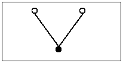 |  | (make-node '() '()) |
> > > |  |  |  |
> > > |  |  |
> > > 
> > > &#124; (make-node &#124;
> > > 
> > > &#124;   (make-node '() &#124;
> > > 
> > > &#124;              (make-node '() '())) &#124;
> > > 
> > > &#124;   '()) &#124;
> > > 
> > > |
> > > 
> 图 184：一些简化后的二叉树

要将此函数转换为累加器风格的函数，我们遵循标准路径。我们从一个适当的模板开始：

> | ([define](http://docs.racket-lang.org/htdp-langs/intermediate-lam.html#%28form._%28%28lib._lang%2Fhtdp-intermediate-lambda..rkt%29._define%29%29) (height.v2 abt0) |
> | --- |
> |   ([local](http://docs.racket-lang.org/htdp-langs/intermediate-lam.html#%28form._%28%28lib._lang%2Fhtdp-intermediate-lambda..rkt%29._local%29%29) (; Tree ??? -> N |
> |           ; 测量 abt 的高度 |
> |           ; 累加器 ... |
> |           ([define](http://docs.racket-lang.org/htdp-langs/intermediate-lam.html#%28form._%28%28lib._lang%2Fhtdp-intermediate-lambda..rkt%29._define%29%29) (height/a abt a) |
> |             ([cond](http://docs.racket-lang.org/htdp-langs/intermediate-lam.html#%28form._%28%28lib._lang%2Fhtdp-intermediate-lambda..rkt%29._cond%29%29) |
> |               [([empty?](http://docs.racket-lang.org/htdp-langs/intermediate-lam.html#%28def._htdp-intermediate-lambda._%28%28lib._lang%2Fhtdp-intermediate-lambda..rkt%29._empty~3f%29%29) abt) [...](http://docs.racket-lang.org/htdp-langs/intermediate-lam.html#%28form._%28%28lib._lang%2Fhtdp-intermediate-lambda..rkt%29._......%29%29)] |
> |               [[else](http://docs.racket-lang.org/htdp-langs/intermediate-lam.html#%28form._%28%28lib._lang%2Fhtdp-intermediate-lambda..rkt%29._else%29%29) |
> |                 ([...](http://docs.racket-lang.org/htdp-langs/intermediate-lam.html#%28form._%28%28lib._lang%2Fhtdp-intermediate-lambda..rkt%29._......%29%29) (height/a (node-left abt) |
> |                                [...](http://docs.racket-lang.org/htdp-langs/intermediate-lam.html#%28form._%28%28lib._lang%2Fhtdp-intermediate-lambda..rkt%29._......%29%29)  a  [...](http://docs.racket-lang.org/htdp-langs/intermediate-lam.html#%28form._%28%28lib._lang%2Fhtdp-intermediate-lambda..rkt%29._......%29%29)) [...](http://docs.racket-lang.org/htdp-langs/intermediate-lam.html#%28form._%28%28lib._lang%2Fhtdp-intermediate-lambda..rkt%29._......%29%29) |
> |                  [...](http://docs.racket-lang.org/htdp-langs/intermediate-lam.html#%28form._%28%28lib._lang%2Fhtdp-intermediate-lambda..rkt%29._......%29%29) (height/a (node-right abt) |
> |                                [...](http://docs.racket-lang.org/htdp-langs/intermediate-lam.html#%28form._%28%28lib._lang%2Fhtdp-intermediate-lambda..rkt%29._......%29%29)  a  [...](http://docs.racket-lang.org/htdp-langs/intermediate-lam.html#%28form._%28%28lib._lang%2Fhtdp-intermediate-lambda..rkt%29._......%29%29)) [...](http://docs.racket-lang.org/htdp-langs/intermediate-lam.html#%28form._%28%28lib._lang%2Fhtdp-intermediate-lambda..rkt%29._......%29%29))))) |
> |     (height/a abt0 [...](http://docs.racket-lang.org/htdp-langs/intermediate-lam.html#%28form._%28%28lib._lang%2Fhtdp-intermediate-lambda..rkt%29._......%29%29)))) |

总是，问题是要确定累加器代表了什么知识。一个明显的选择是遍历的分支数：

> a 是从 abt0 到达 abt 所需的步数。

用图形示例来说明这个累加器的不变量是最好的。再次看看图 184。最底部的树有两个注释，每个注释都指出了一个子树：

1.  如果 abt0 是完整的树，而 abt 是由圆圈 1 指向的子树，那么累加器的值必须是 1，因为它正好需要一步从 abt 的根到 abt0 的根。

1.  同样地，对于标记为 2 的子树，累加器是 2，因为它需要两步才能到达这个地方。

对于前两个例子，不变量基本上规定了如何遵循累加器的设计食谱的其余部分：a 的初始值为 0；更新操作是[add1](http://docs.racket-lang.org/htdp-langs/intermediate-lam.html#%28def._htdp-intermediate-lambda._%28%28lib._lang%2Fhtdp-intermediate-lambda..rkt%29._add1%29%29)；并且基本案例通过返回它来使用累积的知识。将此转换为代码得到以下骨架定义：

> | ([define](http://docs.racket-lang.org/htdp-langs/intermediate-lam.html#%28form._%28%28lib._lang%2Fhtdp-intermediate-lambda..rkt%29._define%29%29) (height.v2 abt0) |
> | --- |
> | ...) (; 树  N -> N |
> | [...] ; 测量 abt 的高度 |
> | [...] ; 累加器 a 是步骤数 |
> | [...] ; 从 abt0 到 abt 需要的步骤数 |
> | ...) (height/a abt a) |
> | ...) |
> | ... abt) a] |
> | ...) |
> | ...) (height/a (node-left abt) |
> | ... a 1)) [...] |
> | ...) (height/a (node-right abt) |
> | ... a 1)) [...] |
> | ...)) |

但与前两个例子相反，a 不是最终结果。在第二个 [cond](http://docs.racket-lang.org/htdp-langs/intermediate-lam.html#%28form._%28%28lib._lang%2Fhtdp-intermediate-lambda..rkt%29._cond%29%29) 条件语句中，两次递归调用产生了两个值。结构函数的设计配方规定我们必须将这些值结合起来，以形成针对此情况的一个答案；上方的点表示我们仍然需要选择一个将这些值组合起来的操作。

> > > | ; 树 -> N |
> > > | --- |
> > > | [...] ; 测量 abt0 的高度 |
> > > | ([检查期望](http://docs.racket-lang.org/htdp-langs/intermediate-lam.html#%28form._%28%28lib._lang%2Fhtdp-intermediate-lambda..rkt%29._check-expect%29%29)) (height.v2 example) 3) |
> > > | ([define](http://docs.racket-lang.org/htdp-langs/intermediate-lam.html#%28form._%28%28lib._lang%2Fhtdp-intermediate-lambda..rkt%29._define%29%29) (height.v2 abt0) |
> > > | |   ([local](http://docs.racket-lang.org/htdp-langs/intermediate-lam.html#%28form._%28%28lib._lang%2Fhtdp-intermediate-lambda..rkt%29._local%29%29) (; Tree  N -> N |
> > > | |   ; 测量 abt 的高度 |
> > > | |   ; 累加器 a 是步数 |
> > > | |   ; 它需要多少步才能从 abt0 到达 abt |
> > > | |   ([define](http://docs.racket-lang.org/htdp-langs/intermediate-lam.html#%28form._%28%28lib._lang%2Fhtdp-intermediate-lambda..rkt%29._define%29%29) (height/a abt a) |
> > > | |   ([cond](http://docs.racket-lang.org/htdp-langs/intermediate-lam.html#%28form._%28%28lib._lang%2Fhtdp-intermediate-lambda..rkt%29._cond%29%29) |
> > > | |   [([empty?](http://docs.racket-lang.org/htdp-langs/intermediate-lam.html#%28def._htdp-intermediate-lambda._%28%28lib._lang%2Fhtdp-intermediate-lambda..rkt%29._empty~3f%29%29) abt) a] |
> > > | |   [[else](http://docs.racket-lang.org/htdp-langs/intermediate-lam.html#%28form._%28%28lib._lang%2Fhtdp-intermediate-lambda..rkt%29._else%29%29) |
> > > | |   ([max](http://docs.racket-lang.org/htdp-langs/intermediate-lam.html#%28def._htdp-intermediate-lambda._%28%28lib._lang%2Fhtdp-intermediate-lambda..rkt%29._max%29%29) |
> > > | |   (height/a (node-left abt) ([+](http://docs.racket-lang.org/htdp-langs/intermediate-lam.html#%28def._htdp-intermediate-lambda._%28%28lib._lang%2Fhtdp-intermediate-lambda..rkt%29._%2B%29%29) a 1)) |
> > > | |   (height/a (node-right abt) ([+](http://docs.racket-lang.org/htdp-langs/intermediate-lam.html#%28def._htdp-intermediate-lambda._%28%28lib._lang%2Fhtdp-intermediate-lambda..rkt%29._%2B%29%29) a 1)))]))) |
> > > | |   (height/a abt0 0))) |
> > > 
> 图 185：height 的累加器版本

遵循设计食谱也告诉我们，我们需要解释这两个值以找到适当的函数。根据 height/a 的目的声明，第一个值是左子树的高度，第二个值是右子树的高度。鉴于我们感兴趣的是 abt 本身的高度，并且高度是到达叶节点所需的最大步数，我们使用 [max](http://docs.racket-lang.org/htdp-langs/intermediate-lam.html#%28def._htdp-intermediate-lambda._%28%28lib._lang%2Fhtdp-intermediate-lambda..rkt%29._max%29%29) 函数来选择合适的值；参见 图 185 以获取完整的定义。

关于替代设计的说明 除了计算到达一个节点所需的步数之外，累加器函数还可以保留迄今为止遇到的最大高度。以下是该设计思想的累加器语句：

> 第一个累加器表示从 (abt0 的根节点) 到 abt 需要的步数。第二个累加器代表 abt0 中严格位于 abt 左侧的部分的高度。

显然，这个语句假设了一个具有两个累加器参数的模板，这是我们之前未曾遇到的：

> | [...](http://docs.racket-lang.org/htdp-langs/intermediate-lam.html#%28form._%28%28lib._lang%2Fhtdp-intermediate-lambda..rkt%29._......%29%29) ; 树  N  N -> N |
> | --- |
> | |           ; 测量 abt 的高度 |
> | |           ; 累加器 s 是步数 |
> | |           ; 从 abt0 到 abt 需要的步数 |
> | |           ; 累加器 m 是最大高度 |
> | |           ; abt0 中位于 abt 左侧的部分 |
> | |           ([define](http://docs.racket-lang.org/htdp-langs/intermediate-lam.html#%28form._%28%28lib._lang%2Fhtdp-intermediate-lambda..rkt%29._define%29%29) (h/a abt s m) |
> | |             ([cond](http://docs.racket-lang.org/htdp-langs/intermediate-lam.html#%28form._%28%28lib._lang%2Fhtdp-intermediate-lambda..rkt%29._cond%29%29) |
> | |               [([empty?](http://docs.racket-lang.org/htdp-langs/intermediate-lam.html#%28def._htdp-intermediate-lambda._%28%28lib._lang%2Fhtdp-intermediate-lambda..rkt%29._empty~3f%29%29) abt) [...](http://docs.racket-lang.org/htdp-langs/intermediate-lam.html#%28form._%28%28lib._lang%2Fhtdp-intermediate-lambda..rkt%29._......%29%29)] |
> | |               [[else](http://docs.racket-lang.org/htdp-langs/intermediate-lam.html#%28form._%28%28lib._lang%2Fhtdp-intermediate-lambda..rkt%29._else%29%29) |
> | |                ([...](http://docs.racket-lang.org/htdp-langs/intermediate-lam.html#%28form._%28%28lib._lang%2Fhtdp-intermediate-lambda..rkt%29._......%29%29) (h/a (node-left abt) |
> | |                  [...](http://docs.racket-lang.org/htdp-langs/intermediate-lam.html#%28form._%28%28lib._lang%2Fhtdp-intermediate-lambda..rkt%29._......%29%29)  s  [...](http://docs.racket-lang.org/htdp-langs/intermediate-lam.html#%28form._%28%28lib._lang%2Fhtdp-intermediate-lambda..rkt%29._......%29%29) [...](http://docs.racket-lang.org/htdp-langs/intermediate-lam.html#%28form._%28%28lib._lang%2Fhtdp-intermediate-lambda..rkt%29._......%29%29)  m  [...](http://docs.racket-lang.org/htdp-langs/intermediate-lam.html#%28form._%28%28lib._lang%2Fhtdp-intermediate-lambda..rkt%29._......%29%29)) [...](http://docs.racket-lang.org/htdp-langs/intermediate-lam.html#%28form._%28%28lib._lang%2Fhtdp-intermediate-lambda..rkt%29._......%29%29) |
> | |                 [...](http://docs.racket-lang.org/htdp-langs/intermediate-lam.html#%28form._%28%28lib._lang%2Fhtdp-intermediate-lambda..rkt%29._......%29%29) (h/a (node-right abt) |
> | [...] [链接](http://docs.racket-lang.org/htdp-langs/intermediate-lam.html#%28form._%28%28lib._lang%2Fhtdp-intermediate-lambda..rkt%29._......%29%29) s [...] [链接](http://docs.racket-lang.org/htdp-langs/intermediate-lam.html#%28form._%28%28lib._lang%2Fhtdp-intermediate-lambda..rkt%29._......%29%29) [...] [链接](http://docs.racket-lang.org/htdp-langs/intermediate-lam.html#%28form._%28%28lib._lang%2Fhtdp-intermediate-lambda..rkt%29._......%29%29) m [...] [链接](http://docs.racket-lang.org/htdp-langs/intermediate-lam.html#%28form._%28%28lib._lang%2Fhtdp-intermediate-lambda..rkt%29._......%29%29)) [...] [链接](http://docs.racket-lang.org/htdp-langs/intermediate-lam.html#%28form._%28%28lib._lang%2Fhtdp-intermediate-lambda..rkt%29._......%29%29) |

练习 498。完成 height.v3。提示：图 184 中最低的树在标记为 1 的子树左侧没有子树。它包含一条从根到树的完整路径，这条路径位于标记为 2 的子树左侧的树部分；这条路径由两步组成。

第二种设计比第一种设计具有更复杂的累加器不变量。由此推断，其实现需要比第一种设计更多的注意。同时，它没有任何明显的优势。

我们的观点是，不同的累加器不变量会产生不同的变体。你可以系统地设计这两种变体，遵循相同的设计配方。当你有了完整的函数定义后，你可以比较和对比结果，然后根据证据决定保留哪一个。结束

练习 499。设计一个累加器风格的 product 版本，该函数用于计算数字列表的乘积。当你已经形成了累加器不变量并有人检查它时停止。

产品性能为 O(n)，其中 n 是列表的长度。累加器版本是否在这方面有所改进？

练习 500。设计一个累加器风格的 how-many 版本，该函数用于确定列表中的项目数量。当你已经形成了不变量并有人检查它时停止。

how-many 的性能为 O(n)，其中 n 是列表的长度。累加器版本是否在这方面有所改进？

当你手动评估（how-many some-non-empty-list）时，当函数到达'()时，将有 n 次应用[add1](http://docs.racket-lang.org/htdp-langs/intermediate-lam.html#%28def._htdp-intermediate-lambda._%28%28lib._lang%2Fhtdp-intermediate-lambda..rkt%29._add1%29%29)挂起——其中 n 是列表中的项目数量。计算机科学家有时会说 how-many 需要 O(n)的空间来表示这些挂起的函数应用。计算机科学家将这种空间称为栈空间，但你现在可以安全地忽略这个术语。累加器是否会减少计算结果所需的空间量？

练习 501。设计一个累加器风格的 add-to-pi 版本。该函数将自然数添加到[pi](http://docs.racket-lang.org/htdp-langs/intermediate-lam.html#%28def._htdp-intermediate-lambda._%28%28lib._lang%2Fhtdp-intermediate-lambda..rkt%29._pi%29%29)，而不使用[+](http://docs.racket-lang.org/htdp-langs/intermediate-lam.html#%28def._htdp-intermediate-lambda._%28%28lib._lang%2Fhtdp-intermediate-lambda..rkt%29._%2B%29%29)：

> | ; N -> Number |
> | --- |
> | ; 向[pi](http://docs.racket-lang.org/htdp-langs/intermediate-lam.html#%28def._htdp-intermediate-lambda._%28%28lib._lang%2Fhtdp-intermediate-lambda..rkt%29._pi%29%29)中添加 n，而不使用[+](http://docs.racket-lang.org/htdp-langs/intermediate-lam.html#%28def._htdp-intermediate-lambda._%28%28lib._lang%2Fhtdp-intermediate-lambda..rkt%29._%2B%29%29) |
> | ([check-within](http://docs.racket-lang.org/htdp-langs/intermediate-lam.html#%28form._%28%28lib._lang%2Fhtdp-intermediate-lambda..rkt%29._check-within%29%29) (add-to-pi 2) ([+](http://docs.racket-lang.org/htdp-langs/intermediate-lam.html#%28def._htdp-intermediate-lambda._%28%28lib._lang%2Fhtdp-intermediate-lambda..rkt%29._%2B%29%29) 2 [pi](http://docs.racket-lang.org/htdp-langs/intermediate-lam.html#%28def._htdp-intermediate-lambda._%28%28lib._lang%2Fhtdp-intermediate-lambda..rkt%29._pi%29%29)) 0.001) |
> | ([define](http://docs.racket-lang.org/htdp-langs/intermediate-lam.html#%28form._%28%28lib._lang%2Fhtdp-intermediate-lambda..rkt%29._define%29%29) (add-to-pi n) |
> | |   ([cond](http://docs.racket-lang.org/htdp-langs/intermediate-lam.html#%28form._%28%28lib._lang%2Fhtdp-intermediate-lambda..rkt%29._cond%29%29) |
> | |   [([zero?](http://docs.racket-lang.org/htdp-langs/intermediate-lam.html#%28def._htdp-intermediate-lambda._%28%28lib._lang%2Fhtdp-intermediate-lambda..rkt%29._zero~3f%29%29) n) [pi](http://docs.racket-lang.org/htdp-langs/intermediate-lam.html#%28def._htdp-intermediate-lambda._%28%28lib._lang%2Fhtdp-intermediate-lambda..rkt%29._pi%29%29)] |
> |   [[else](http://docs.racket-lang.org/htdp-langs/intermediate-lam.html#%28form._%28%28lib._lang%2Fhtdp-intermediate-lambda..rkt%29._else%29%29) ([add1](http://docs.racket-lang.org/htdp-langs/intermediate-lam.html#%28def._htdp-intermediate-lambda._%28%28lib._lang%2Fhtdp-intermediate-lambda..rkt%29._add1%29%29) (add-to-pi ([sub1](http://docs.racket-lang.org/htdp-langs/intermediate-lam.html#%28def._htdp-intermediate-lambda._%28%28lib._lang%2Fhtdp-intermediate-lambda..rkt%29._sub1%29%29) n)))])) |

停止当你已经形成了累加器不变式，并有人检查它。

练习 502。设计一个名为 palindrome 的函数，它接受一个非空列表，并通过围绕最后一个元素镜像列表来构造一个回文。当给定([explode](http://docs.racket-lang.org/htdp-langs/intermediate-lam.html#%28def._htdp-intermediate-lambda._%28%28lib._lang%2Fhtdp-intermediate-lambda..rkt%29._explode%29%29) "abc")时，它产生([explode](http://docs.racket-lang.org/htdp-langs/intermediate-lam.html#%28def._htdp-intermediate-lambda._%28%28lib._lang%2Fhtdp-intermediate-lambda..rkt%29._explode%29%29) "abcba")。

提示：这里是一个通过函数组合设计的解决方案：

> |   ;   [NEList-of  1String] -> [NEList-of  1String] |
> | --- |
> |   ;   从 s0 创建回文 |
> |   ([check-expect](http://docs.racket-lang.org/htdp-langs/intermediate-lam.html#%28form._%28%28lib._lang%2Fhtdp-intermediate-lambda..rkt%29._check-expect%29%29) |
> |   (mirror ([explode](http://docs.racket-lang.org/htdp-langs/intermediate-lam.html#%28def._htdp-intermediate-lambda._%28%28lib._lang%2Fhtdp-intermediate-lambda..rkt%29._explode%29%29) "abc")) ([explode](http://docs.racket-lang.org/htdp-langs/intermediate-lam.html#%28def._htdp-intermediate-lambda._%28%28lib._lang%2Fhtdp-intermediate-lambda..rkt%29._explode%29%29) "abcba")) |
> |   ([define](http://docs.racket-lang.org/htdp-langs/intermediate-lam.html#%28form._%28%28lib._lang%2Fhtdp-intermediate-lambda..rkt%29._define%29%29) (mirror s0) |
> |   ([append](http://docs.racket-lang.org/htdp-langs/intermediate-lam.html#%28def._htdp-intermediate-lambda._%28%28lib._lang%2Fhtdp-intermediate-lambda..rkt%29._append%29%29) (all-but-last s0) |
> |   ([list](http://docs.racket-lang.org/htdp-langs/intermediate-lam.html#%28def._htdp-intermediate-lambda._%28%28lib._lang%2Fhtdp-intermediate-lambda..rkt%29._list%29%29) (last s0)) |
> |   ([reverse](http://docs.racket-lang.org/htdp-langs/intermediate-lam.html#%28def._htdp-intermediate-lambda._%28%28lib._lang%2Fhtdp-intermediate-lambda..rkt%29._reverse%29%29) (all-but-last s0)))) |

查看通用辅助函数以了解 last；以类似的方式设计 all-but-last。此解决方案遍历 s0 四次：

1.  通过 all-but-last，

1.  通过 last，

1.  通过再次使用 all-but-last，

1.  通过[反转](http://docs.racket-lang.org/htdp-langs/intermediate-lam.html#%28def._htdp-intermediate-lambda._%28%28lib._lang%2Fhtdp-intermediate-lambda..rkt%29._reverse%29%29)，这是 ISL+的逆版本。

即使为所有但最后一个的结果使用[局部](http://docs.racket-lang.org/htdp-langs/intermediate-lam.html#%28form._%28%28lib._lang%2Fhtdp-intermediate-lambda..rkt%29._local%29%29)定义，该函数仍需要三次遍历。虽然这些遍历不是“堆叠”的，因此不会对函数的性能产生灾难性的影响，但累加器版本可以通过单次遍历计算出相同的结果。练习 503。练习 467 隐含地要求设计一个函数，该函数将矩阵旋转，直到第一行的第一个系数与 0 不同。在练习 467 的上下文中，解决方案调用了一个生成递归函数，该函数在遇到第一位置为 0 时通过将第一行移至末尾来创建一个新的矩阵。以下是解决方案：

> | ; 矩阵 -> 矩阵 |
> | --- |
> | ; 找到一个不以 0 开始的行并 |
> | ; 使用它作为第一个 |
> | ; 生成移动第一行到末尾的位置 |
> | ; 如果所有行都以 0 开始则无终止 |
> | ([检查期望](http://docs.racket-lang.org/htdp-langs/intermediate-lam.html#%28form._%28%28lib._lang%2Fhtdp-intermediate-lambda..rkt%29._check-expect%29%29) ([旋转](http://docs.racket-lang.org/teachpack/2htdpimage.html#%28def._%28%28lib._2htdp%2Fimage..rkt%29._rotate%29%29) '((0 4 5) (1 2 3)))) |
> |               '((1 2 3) (0 4 5))) |
> | ([定义](http://docs.racket-lang.org/htdp-langs/intermediate-lam.html#%28form._%28%28lib._lang%2Fhtdp-intermediate-lambda..rkt%29._define%29%29) ([旋转](http://docs.racket-lang.org/teachpack/2htdpimage.html#%28def._%28%28lib._2htdp%2Fimage..rkt%29._rotate%29%29) M) |
> |   ([条件](http://docs.racket-lang.org/htdp-langs/intermediate-lam.html#%28form._%28%28lib._lang%2Fhtdp-intermediate-lambda..rkt%29._cond%29%29)) |
> |     [([非](http://docs.racket-lang.org/htdp-langs/intermediate-lam.html#%28def._htdp-intermediate-lambda._%28%28lib._lang%2Fhtdp-intermediate-lambda..rkt%29._not%29%29) ([等于](http://docs.racket-lang.org/htdp-langs/intermediate-lam.html#%28def._htdp-intermediate-lambda._%28%28lib._lang%2Fhtdp-intermediate-lambda..rkt%29._~3d%29%29) ([第一个](http://docs.racket-lang.org/htdp-langs/intermediate-lam.html#%28def._htdp-intermediate-lambda._%28%28lib._lang%2Fhtdp-intermediate-lambda..rkt%29._first%29%29) ([第一个](http://docs.racket-lang.org/htdp-langs/intermediate-lam.html#%28def._htdp-intermediate-lambda._%28%28lib._lang%2Fhtdp-intermediate-lambda..rkt%29._first%29%29) M)) 0)) M] |
> |      [[else](http://docs.racket-lang.org/htdp-langs/intermediate-lam.html#%28form._%28%28lib._lang%2Fhtdp-intermediate-lambda..rkt%29._else%29%29) |
> |      ([rotate](http://docs.racket-lang.org/teachpack/2htdpimage.html#%28def._%28%28lib._2htdp%2Fimage..rkt%29._rotate%29%29) ([append](http://docs.racket-lang.org/htdp-langs/intermediate-lam.html#%28def._htdp-intermediate-lambda._%28%28lib._lang%2Fhtdp-intermediate-lambda..rkt%29._append%29%29) ([rest](http://docs.racket-lang.org/htdp-langs/intermediate-lam.html#%28def._htdp-intermediate-lambda._%28%28lib._lang%2Fhtdp-intermediate-lambda..rkt%29._rest%29%29) M) ([list](http://docs.racket-lang.org/htdp-langs/intermediate-lam.html#%28def._htdp-intermediate-lambda._%28%28lib._lang%2Fhtdp-intermediate-lambda..rkt%29._list%29%29) ([first](http://docs.racket-lang.org/htdp-langs/intermediate-lam.html#%28def._htdp-intermediate-lambda._%28%28lib._lang%2Fhtdp-intermediate-lambda..rkt%29._first%29%29) M))))])) |

停止！修改这个函数，使其在所有行都以 0 开头时发出错误信号。如果你在 Matrix 的大实例上测量这个函数，你会得到一个令人惊讶的结果：

> | M 中的行数 |  | 1000 |  | 2000 |  | 3000 |  | 4000 |  | 5000 |
> | --- | --- | --- | --- | --- | --- | --- | --- | --- | --- | --- |
> | [rotate](http://docs.racket-lang.org/teachpack/2htdpimage.html#%28def._%28%28lib._2htdp%2Fimage..rkt%29._rotate%29%29) |  | 17 |  | 66 |  | 151 |  | 272 |  | 436 |

随着行数从 1,000 增加到 5,000，[rotate](http://docs.racket-lang.org/teachpack/2htdpimage.html#%28def._%28%28lib._2htdp%2Fimage..rkt%29._rotate%29%29)所需的时间并不是增加五倍，而是增加了二十倍。问题在于[rotate](http://docs.racket-lang.org/teachpack/2htdpimage.html#%28def._%28%28lib._2htdp%2Fimage..rkt%29._rotate%29%29)使用了[append](http://docs.racket-lang.org/htdp-langs/intermediate-lam.html#%28def._htdp-intermediate-lambda._%28%28lib._lang%2Fhtdp-intermediate-lambda..rkt%29._append%29%29)，它只为添加([first](http://docs.racket-lang.org/htdp-langs/intermediate-lam.html#%28def._htdp-intermediate-lambda._%28%28lib._lang%2Fhtdp-intermediate-lambda..rkt%29._first%29%29)  M)在末尾而创建了一个全新的列表([rest](http://docs.racket-lang.org/htdp-langs/intermediate-lam.html#%28def._htdp-intermediate-lambda._%28%28lib._lang%2Fhtdp-intermediate-lambda..rkt%29._rest%29%29)  M))。

> 

列表。如果 M 由 5,000 行组成，我们会得到多少列表？现在假设我们推测累加器风格的版本比生成器版本更快。以下是[rotate](http://docs.racket-lang.org/teachpack/2htdpimage.html#%28def._%28%28lib._2htdp%2Fimage..rkt%29._rotate%29%29)的结构递归版本的累加器模板：

> | ([define](http://docs.racket-lang.org/htdp-langs/intermediate-lam.html#%28form._%28%28lib._lang%2Fhtdp-intermediate-lambda..rkt%29._define%29%29) (rotate.v2 M0) |
> | --- |
> | |   ([local](http://docs.racket-lang.org/htdp-langs/intermediate-lam.html#%28form._%28%28lib._lang%2Fhtdp-intermediate-lambda..rkt%29._local%29%29) (; Matrix  ... -> Matrix |
> | |         ; accumulator  ... |
> | |         ([define](http://docs.racket-lang.org/htdp-langs/intermediate-lam.html#%28form._%28%28lib._lang%2Fhtdp-intermediate-lambda..rkt%29._define%29%29) (rotate/a M seen) |
> | |           ([cond](http://docs.racket-lang.org/htdp-langs/intermediate-lam.html#%28form._%28%28lib._lang%2Fhtdp-intermediate-lambda..rkt%29._cond%29%29) |
> | |             [([empty?](http://docs.racket-lang.org/htdp-langs/intermediate-lam.html#%28def._htdp-intermediate-lambda._%28%28lib._lang%2Fhtdp-intermediate-lambda..rkt%29._empty~3f%29%29) ([rest](http://docs.racket-lang.org/htdp-langs/intermediate-lam.html#%28def._htdp-intermediate-lambda._%28%28lib._lang%2Fhtdp-intermediate-lambda..rkt%29._rest%29%29) M)) [...](http://docs.racket-lang.org/htdp-langs/intermediate-lam.html#%28form._%28%28lib._lang%2Fhtdp-intermediate-lambda..rkt%29._......%29%29)] ; Can this be simplified to ([empty?](http://docs.racket-lang.org/htdp-langs/intermediate-lam.html#%28def._htdp-intermediate-lambda._%28%28lib._lang%2Fhtdp-intermediate-lambda..rkt%29._empty~3f%29%29)  M) |
> | |             [[else](http://docs.racket-lang.org/htdp-langs/intermediate-lam.html#%28form._%28%28lib._lang%2Fhtdp-intermediate-lambda..rkt%29._else%29%29) ([...](http://docs.racket-lang.org/htdp-langs/intermediate-lam.html#%28form._%28%28lib._lang%2Fhtdp-intermediate-lambda..rkt%29._......%29%29) (rotate/a ([rest](http://docs.racket-lang.org/htdp-langs/intermediate-lam.html#%28def._htdp-intermediate-lambda._%28%28lib._lang%2Fhtdp-intermediate-lambda..rkt%29._rest%29%29) M) |
> | |                                  [...](http://docs.racket-lang.org/htdp-langs/intermediate-lam.html#%28form._%28%28lib._lang%2Fhtdp-intermediate-lambda..rkt%29._......%29%29) seen [...](http://docs.racket-lang.org/htdp-langs/intermediate-lam.html#%28form._%28%28lib._lang%2Fhtdp-intermediate-lambda..rkt%29._......%29%29)) |
> | |                    [...](http://docs.racket-lang.org/htdp-langs/intermediate-lam.html#%28form._%28%28lib._lang%2Fhtdp-intermediate-lambda..rkt%29._......%29%29))))) |
> | |       (rotate/a M0 [...](http://docs.racket-lang.org/htdp-langs/intermediate-lam.html#%28form._%28%28lib._lang%2Fhtdp-intermediate-lambda..rkt%29._......%29%29)))) |

目标是在不使用 [append](http://docs.racket-lang.org/htdp-langs/intermediate-lam.html#%28def._htdp-intermediate-lambda._%28%28lib._lang%2Fhtdp-intermediate-lambda..rkt%29._append%29%29) 进行每次递归的情况下，记住当首项系数为 0 时的第一行。

制定一个累加器语句。然后按照累加器设计食谱来完成上述函数。测量它在由带有前导 0 的行（除了最后一行）组成的矩阵上运行的速度。如果你正确完成了设计，该函数运行速度相当快。

练习 504\. 设计一个函数，它接受一个数字列表并生成相应的数字。列表中的第一个数字是最重要的数字。因此，当应用于 '(1 0 2)' 时，它产生 102。

领域知识 你可能还记得从小学时，结果是由  决定的。

练习 505\. 设计函数 is-prime，它接受一个自然数并返回 #true 如果它是素数，否则返回 #false。

领域知识 一个数 n 如果它不能被 n - 1 和 2 之间的任何数整除，那么它就是素数。

提示 N [>=1] 的设计食谱建议以下模板：

> | ; N [>=1] -> 布尔 |
> | --- |
> | ; 判断 n 是否为素数 |
> | ([define](http://docs.racket-lang.org/htdp-langs/intermediate-lam.html#%28form._%28%28lib._lang%2Fhtdp-intermediate-lambda..rkt%29._define%29%29) (is-prime? n) |
> |   ([cond](http://docs.racket-lang.org/htdp-langs/intermediate-lam.html#%28form._%28%28lib._lang%2Fhtdp-intermediate-lambda..rkt%29._cond%29%29) |
> |     [([=](http://docs.racket-lang.org/htdp-langs/intermediate-lam.html#%28def._htdp-intermediate-lambda._%28%28lib._lang%2Fhtdp-intermediate-lambda..rkt%29._~3d%29%29) n 1) [...](http://docs.racket-lang.org/htdp-langs/intermediate-lam.html#%28form._%28%28lib._lang%2Fhtdp-intermediate-lambda..rkt%29._......%29%29)] |
> |     [[else](http://docs.racket-lang.org/htdp-langs/intermediate-lam.html#%28form._%28%28lib._lang%2Fhtdp-intermediate-lambda..rkt%29._else%29%29) ([...](http://docs.racket-lang.org/htdp-langs/intermediate-lam.html#%28form._%28%28lib._lang%2Fhtdp-intermediate-lambda..rkt%29._......%29%29) (is-prime? ([sub1](http://docs.racket-lang.org/htdp-langs/intermediate-lam.html#%28def._htdp-intermediate-lambda._%28%28lib._lang%2Fhtdp-intermediate-lambda..rkt%29._sub1%29%29) n)) [...](http://docs.racket-lang.org/htdp-langs/intermediate-lam.html#%28form._%28%28lib._lang%2Fhtdp-intermediate-lambda..rkt%29._......%29%29))])) |

这个模板立即告诉你，函数在递归时忘记了它的初始参数 n。由于 n 一定是确定 n 是否能被 ([-](http://docs.racket-lang.org/htdp-langs/intermediate-lam.html#%28def._htdp-intermediate-lambda._%28%28lib._lang%2Fhtdp-intermediate-lambda..rkt%29._-%29%29) n 1), ([-](http://docs.racket-lang.org/htdp-langs/intermediate-lam.html#%28def._htdp-intermediate-lambda._%28%28lib._lang%2Fhtdp-intermediate-lambda..rkt%29._-%29%29) n 2), 等等，分割的必要，你知道你需要一个累加器风格的函数。关于速度：程序员第一次遇到累加器风格的函数时，通常会得到这样的印象，即它们总是比它们的普通版本更快。那么，让我们看看 练习 497 的解决方案：对这些时间的解释超出了本书的范围。

> | !.v1 |  | 5.760 |  | 5.780 |  | 5.800 |  | 5.820 |  | 5.870 |  | 5.806 |
> | --- | --- | --- | --- | --- | --- | --- | --- | --- | --- | --- | --- | --- |
> | !.v2 |  | 5.970 |  | 5.940 |  | 5.980 |  | 5.970 |  | 6.690 |  | 6.111 |

表格的第一行显示了 (!.v1 20) 五次运行的秒数，而最后一行列出了 (!.v2 20) 的运行秒数。最后一列显示了平均值。简而言之，表格显示人们会过早地下结论；至少有一个累加器风格函数的性能比原始版本差。不要相信偏见。相反，自己测量你程序的性能特征。结束

练习 506。设计一个累加器风格的 [map](http://docs.racket-lang.org/htdp-langs/intermediate-lam.html#%28def._htdp-intermediate-lambda._%28%28lib._lang%2Fhtdp-intermediate-lambda..rkt%29._map%29%29) 版本。

练习 507。练习 257 解释了如何使用本书前两部分的食谱和指南来设计 [foldl](http://docs.racket-lang.org/htdp-langs/intermediate-lam.html#%28def._htdp-intermediate-lambda._%28%28lib._lang%2Fhtdp-intermediate-lambda..rkt%29._foldl%29%29)。

> | ([check-expect](http://docs.racket-lang.org/htdp-langs/intermediate-lam.html#%28form._%28%28lib._lang%2Fhtdp-intermediate-lambda..rkt%29._check-expect%29%29) (f*ldl [+] (http://docs.racket-lang.org/htdp-langs/intermediate-lam.html#%28def._htdp-intermediate-lambda._%28%28lib._lang%2Fhtdp-intermediate-lambda..rkt%29._%2B%29%29) 0 '(1 2 3))) |
> | --- |
> |   ([foldl](http://docs.racket-lang.org/htdp-langs/intermediate-lam.html#%28def._htdp-intermediate-lambda._%28%28lib._lang%2Fhtdp-intermediate-lambda..rkt%29._foldl%29%29) [+] (http://docs.racket-lang.org/htdp-langs/intermediate-lam.html#%28def._htdp-intermediate-lambda._%28%28lib._lang%2Fhtdp-intermediate-lambda..rkt%29._%2B%29%29) 0 '(1 2 3))) |
> | ([检查期望](http://docs.racket-lang.org/htdp-langs/intermediate-lam.html#%28form._%28%28lib._lang%2Fhtdp-intermediate-lambda..rkt%29._check-expect%29%29) (f*ldl [连接](http://docs.racket-lang.org/htdp-langs/intermediate-lam.html#%28def._htdp-intermediate-lambda._%28%28lib._lang%2Fhtdp-intermediate-lambda..rkt%29._cons%29%29) '() '(a b c)) |
> |               ([折叠](http://docs.racket-lang.org/htdp-langs/intermediate-lam.html#%28def._htdp-intermediate-lambda._%28%28lib._lang%2Fhtdp-intermediate-lambda..rkt%29._foldl%29%29) [连接](http://docs.racket-lang.org/htdp-langs/intermediate-lam.html#%28def._htdp-intermediate-lambda._%28%28lib._lang%2Fhtdp-intermediate-lambda..rkt%29._cons%29%29) '() '(a b c))) |
> |   |
> | ; 版本 1 |
> | ([定义](http://docs.racket-lang.org/htdp-langs/intermediate-lam.html#%28form._%28%28lib._lang%2Fhtdp-intermediate-lambda..rkt%29._define%29%29) (f*ldl f i l) |
> |   ([折叠右](http://docs.racket-lang.org/htdp-langs/intermediate-lam.html#%28def._htdp-intermediate-lambda._%28%28lib._lang%2Fhtdp-intermediate-lambda..rkt%29._foldr%29%29) f i ([反转](http://docs.racket-lang.org/htdp-langs/intermediate-lam.html#%28def._htdp-intermediate-lambda._%28%28lib._lang%2Fhtdp-intermediate-lambda..rkt%29._reverse%29%29) l))) |

那就是，[折叠](http://docs.racket-lang.org/htdp-langs/intermediate-lam.html#%28def._htdp-intermediate-lambda._%28%28lib._lang%2Fhtdp-intermediate-lambda..rkt%29._foldl%29%29) 是通过反转给定的列表，然后使用 [折叠右](http://docs.racket-lang.org/htdp-langs/intermediate-lam.html#%28def._htdp-intermediate-lambda._%28%28lib._lang%2Fhtdp-intermediate-lambda..rkt%29._foldr%29%29) 在这个中间列表上折叠给定函数的结果。f*ldl 函数显然需要遍历列表两次，但一旦我们设计好所有函数，就变得明显它需要做多少额外的工作：

> | ; 版本 2 |
> | --- |
> | ([定义](http://docs.racket-lang.org/htdp-langs/intermediate-lam.html#%28form._%28%28lib._lang%2Fhtdp-intermediate-lambda..rkt%29._define%29%29) (f*ldl f i l) |
> |   ([局部](http://docs.racket-lang.org/htdp-langs/intermediate-lam.html#%28form._%28%28lib._lang%2Fhtdp-intermediate-lambda..rkt%29._local%29%29) (([定义](http://docs.racket-lang.org/htdp-langs/intermediate-lam.html#%28form._%28%28lib._lang%2Fhtdp-intermediate-lambda..rkt%29._define%29%29) ([反转](http://docs.racket-lang.org/htdp-langs/intermediate-lam.html#%28def._htdp-intermediate-lambda._%28%28lib._lang%2Fhtdp-intermediate-lambda..rkt%29._reverse%29%29) l) |
> |             ([条件](http://docs.racket-lang.org/htdp-langs/intermediate-lam.html#%28form._%28%28lib._lang%2Fhtdp-intermediate-lambda..rkt%29._cond%29%29) |
> |               [([空？](http://docs.racket-lang.org/htdp-langs/intermediate-lam.html#%28def._htdp-intermediate-lambda._%28%28lib._lang%2Fhtdp-intermediate-lambda..rkt%29._empty~3f%29%29) l) '()] |
> | |             [[否则](http://docs.racket-lang.org/htdp-langs/intermediate-lam.html#%28form._%28%28lib._lang%2Fhtdp-intermediate-lambda..rkt%29._else%29%29) (add-to-end ([first](http://docs.racket-lang.org/htdp-langs/intermediate-lam.html#%28def._htdp-intermediate-lambda._%28%28lib._lang%2Fhtdp-intermediate-lambda..rkt%29._first%29%29) l) |
> | |                               ([reverse](http://docs.racket-lang.org/htdp-langs/intermediate-lam.html#%28def._htdp-intermediate-lambda._%28%28lib._lang%2Fhtdp-intermediate-lambda..rkt%29._reverse%29%29) ([rest](http://docs.racket-lang.org/htdp-langs/intermediate-lam.html#%28def._htdp-intermediate-lambda._%28%28lib._lang%2Fhtdp-intermediate-lambda..rkt%29._rest%29%29) l)))])) |
> | |         ([define](http://docs.racket-lang.org/htdp-langs/intermediate-lam.html#%28form._%28%28lib._lang%2Fhtdp-intermediate-lambda..rkt%29._define%29%29) (add-to-end x l) |
> | |           ([cond](http://docs.racket-lang.org/htdp-langs/intermediate-lam.html#%28form._%28%28lib._lang%2Fhtdp-intermediate-lambda..rkt%29._cond%29%29) |
> | |             [([empty?](http://docs.racket-lang.org/htdp-langs/intermediate-lam.html#%28def._htdp-intermediate-lambda._%28%28lib._lang%2Fhtdp-intermediate-lambda..rkt%29._empty~3f%29%29) l) ([list](http://docs.racket-lang.org/htdp-langs/intermediate-lam.html#%28def._htdp-intermediate-lambda._%28%28lib._lang%2Fhtdp-intermediate-lambda..rkt%29._list%29%29) x)] |
> | |             [([else](http://docs.racket-lang.org/htdp-langs/intermediate-lam.html#%28form._%28%28lib._lang%2Fhtdp-intermediate-lambda..rkt%29._else%29%29) ([cons](http://docs.racket-lang.org/htdp-langs/intermediate-lam.html#%28def._htdp-intermediate-lambda._%28%28lib._lang%2Fhtdp-intermediate-lambda..rkt%29._cons%29%29) ([first](http://docs.racket-lang.org/htdp-langs/intermediate-lam.html#%28def._htdp-intermediate-lambda._%28%28lib._lang%2Fhtdp-intermediate-lambda..rkt%29._first%29%29) l) |
> | |                         (add-to-end x ([rest](http://docs.racket-lang.org/htdp-langs/intermediate-lam.html#%28def._htdp-intermediate-lambda._%28%28lib._lang%2Fhtdp-intermediate-lambda..rkt%29._rest%29%29) l)))])) |
> | |         ([define](http://docs.racket-lang.org/htdp-langs/intermediate-lam.html#%28form._%28%28lib._lang%2Fhtdp-intermediate-lambda..rkt%29._define%29%29) ([foldr](http://docs.racket-lang.org/htdp-langs/intermediate-lam.html#%28def._htdp-intermediate-lambda._%28%28lib._lang%2Fhtdp-intermediate-lambda..rkt%29._foldr%29%29) l) |
> | |           ([cond](http://docs.racket-lang.org/htdp-langs/intermediate-lam.html#%28form._%28%28lib._lang%2Fhtdp-intermediate-lambda..rkt%29._cond%29%29) |
> | |             [([empty?](http://docs.racket-lang.org/htdp-langs/intermediate-lam.html#%28def._htdp-intermediate-lambda._%28%28lib._lang%2Fhtdp-intermediate-lambda..rkt%29._empty~3f%29%29) l) i] |
> | |             [[else](http://docs.racket-lang.org/htdp-langs/intermediate-lam.html#%28form._%28%28lib._lang%2Fhtdp-intermediate-lambda..rkt%29._else%29%29) (f ([first](http://docs.racket-lang.org/htdp-langs/intermediate-lam.html#%28def._htdp-intermediate-lambda._%28%28lib._lang%2Fhtdp-intermediate-lambda..rkt%29._first%29%29) l) ([foldr](http://docs.racket-lang.org/htdp-langs/intermediate-lam.html#%28def._htdp-intermediate-lambda._%28%28lib._lang%2Fhtdp-intermediate-lambda..rkt%29._foldr%29%29) ([rest](http://docs.racket-lang.org/htdp-langs/intermediate-lam.html#%28def._htdp-intermediate-lambda._%28%28lib._lang%2Fhtdp-intermediate-lambda..rkt%29._rest%29%29) l)))]))) |
> | |   ([foldr](http://docs.racket-lang.org/htdp-langs/intermediate-lam.html#%28def._htdp-intermediate-lambda._%28%28lib._lang%2Fhtdp-intermediate-lambda..rkt%29._foldr%29%29) ([reverse](http://docs.racket-lang.org/htdp-langs/intermediate-lam.html#%28def._htdp-intermediate-lambda._%28%28lib._lang%2Fhtdp-intermediate-lambda..rkt%29._reverse%29%29) l)))) |

我们知道 [reverse](http://docs.racket-lang.org/htdp-langs/intermediate-lam.html#%28def._htdp-intermediate-lambda._%28%28lib._lang%2Fhtdp-intermediate-lambda..rkt%29._reverse%29%29) 必须遍历列表中的每个元素一次，这意味着 f*ldl 确实为长度为 n 的列表执行  遍历。幸运的是，我们知道如何通过累加器消除这个瓶颈：

> | ; 版本 3 |
> | --- |
> | ([define](http://docs.racket-lang.org/htdp-langs/intermediate-lam.html#%28form._%28%28lib._lang%2Fhtdp-intermediate-lambda..rkt%29._define%29%29) (f*ldl f i l) |
> | |   ([local](http://docs.racket-lang.org/htdp-langs/intermediate-lam.html#%28form._%28%28lib._lang%2Fhtdp-intermediate-lambda..rkt%29._local%29%29) (([define](http://docs.racket-lang.org/htdp-langs/intermediate-lam.html#%28form._%28%28lib._lang%2Fhtdp-intermediate-lambda..rkt%29._define%29%29) (reverse/a l a) |
> | |           ([cond](http://docs.racket-lang.org/htdp-langs/intermediate-lam.html#%28form._%28%28lib._lang%2Fhtdp-intermediate-lambda..rkt%29._cond%29%29) |
> | |             [([empty?](http://docs.racket-lang.org/htdp-langs/intermediate-lam.html#%28def._htdp-intermediate-lambda._%28%28lib._lang%2Fhtdp-intermediate-lambda..rkt%29._empty~3f%29%29) l) a] |
> | |             [[else](http://docs.racket-lang.org/htdp-langs/intermediate-lam.html#%28form._%28%28lib._lang%2Fhtdp-intermediate-lambda..rkt%29._else%29%29) (reverse/a ([rest](http://docs.racket-lang.org/htdp-langs/intermediate-lam.html#%28def._htdp-intermediate-lambda._%28%28lib._lang%2Fhtdp-intermediate-lambda..rkt%29._rest%29%29) l) |
> |              ([合并](http://docs.racket-lang.org/htdp-langs/intermediate-lam.html#%28def._htdp-intermediate-lambda._%28%28lib._lang%2Fhtdp-intermediate-lambda..rkt%29._cons%29%29) ([首项](http://docs.racket-lang.org/htdp-langs/intermediate-lam.html#%28def._htdp-intermediate-lambda._%28%28lib._lang%2Fhtdp-intermediate-lambda..rkt%29._first%29%29) l) a))])) |
> |              ([定义](http://docs.racket-lang.org/htdp-langs/intermediate-lam.html#%28form._%28%28lib._lang%2Fhtdp-intermediate-lambda..rkt%29._define%29%29) ([折叠右](http://docs.racket-lang.org/htdp-langs/intermediate-lam.html#%28def._htdp-intermediate-lambda._%28%28lib._lang%2Fhtdp-intermediate-lambda..rkt%29._foldr%29%29) l)) |
> |         ([条件](http://docs.racket-lang.org/htdp-langs/intermediate-lam.html#%28form._%28%28lib._lang%2Fhtdp-intermediate-lambda..rkt%29._cond%29%29) |
> |              ([空列表?](http://docs.racket-lang.org/htdp-langs/intermediate-lam.html#%28def._htdp-intermediate-lambda._%28%28lib._lang%2Fhtdp-intermediate-lambda..rkt%29._empty~3f%29%29) l) i] |
> |              [[否则](http://docs.racket-lang.org/htdp-langs/intermediate-lam.html#%28form._%28%28lib._lang%2Fhtdp-intermediate-lambda..rkt%29._else%29%29) |
> |              (f ([首项](http://docs.racket-lang.org/htdp-langs/intermediate-lam.html#%28def._htdp-intermediate-lambda._%28%28lib._lang%2Fhtdp-intermediate-lambda..rkt%29._first%29%29) l) ([折叠右](http://docs.racket-lang.org/htdp-langs/intermediate-lam.html#%28def._htdp-intermediate-lambda._%28%28lib._lang%2Fhtdp-intermediate-lambda..rkt%29._foldr%29%29) ([剩余](http://docs.racket-lang.org/htdp-langs/intermediate-lam.html#%28def._htdp-intermediate-lambda._%28%28lib._lang%2Fhtdp-intermediate-lambda..rkt%29._rest%29%29) l)))])) |
> |              ([折叠右](http://docs.racket-lang.org/htdp-langs/intermediate-lam.html#%28def._htdp-intermediate-lambda._%28%28lib._lang%2Fhtdp-intermediate-lambda..rkt%29._foldr%29%29) (reverse/a l '()))) |

一旦 [反转](http://docs.racket-lang.org/htdp-langs/intermediate-lam.html#%28def._htdp-intermediate-lambda._%28%28lib._lang%2Fhtdp-intermediate-lambda..rkt%29._reverse%29%29) 使用了累加器，我们实际上得到了列表两次遍历的表面性能。问题是，我们是否可以通过向局部定义的 [折叠右](http://docs.racket-lang.org/htdp-langs/intermediate-lam.html#%28def._htdp-intermediate-lambda._%28%28lib._lang%2Fhtdp-intermediate-lambda..rkt%29._foldr%29%29) 添加累加器来改进这一点：

> | 版本 4 |
> | --- |
> | ([定义](http://docs.racket-lang.org/htdp-langs/intermediate-lam.html#%28form._%28%28lib._lang%2Fhtdp-intermediate-lambda..rkt%29._define%29%29) (f*ldl f i l0)) |
> |          ([局部](http://docs.racket-lang.org/htdp-langs/intermediate-lam.html#%28form._%28%28lib._lang%2Fhtdp-intermediate-lambda..rkt%29._local%29%29) (([定义](http://docs.racket-lang.org/htdp-langs/intermediate-lam.html#%28form._%28%28lib._lang%2Fhtdp-intermediate-lambda..rkt%29._define%29%29) (foldr/a a l)) |
> | |   ([cond](http://docs.racket-lang.org/htdp-langs/intermediate-lam.html#%28form._%28%28lib._lang%2Fhtdp-intermediate-lambda..rkt%29._cond%29%29) |
> | |   [([empty?](http://docs.racket-lang.org/htdp-langs/intermediate-lam.html#%28def._htdp-intermediate-lambda._%28%28lib._lang%2Fhtdp-intermediate-lambda..rkt%29._empty~3f%29%29) l) a] |
> | |   [[else](http://docs.racket-lang.org/htdp-langs/intermediate-lam.html#%28form._%28%28lib._lang%2Fhtdp-intermediate-lambda..rkt%29._else%29%29) |
> | |   (foldr/a (f ([first](http://docs.racket-lang.org/htdp-langs/intermediate-lam.html#%28def._htdp-intermediate-lambda._%28%28lib._lang%2Fhtdp-intermediate-lambda..rkt%29._first%29%29) l) a) ([rest](http://docs.racket-lang.org/htdp-langs/intermediate-lam.html#%28def._htdp-intermediate-lambda._%28%28lib._lang%2Fhtdp-intermediate-lambda..rkt%29._rest%29%29) l))))) |
> | |   (foldr/a i l0))) |

由于给函数添加累加器会反转遍历列表的顺序，因此初始反转列表是多余的。任务 1：回忆[foldl](http://docs.racket-lang.org/htdp-langs/intermediate-lam.html#%28def._htdp-intermediate-lambda._%28%28lib._lang%2Fhtdp-intermediate-lambda..rkt%29._foldl%29%29)的签名：

> ; [X Y] [X Y -> Y] Y [List-of X] -> Y

这也是 f*ldl 的签名。为 foldr/a 及其累加器不变量制定签名。提示：假设 l0 和 l 之间的差异是([list](http://docs.racket-lang.org/htdp-langs/intermediate-lam.html#%28def._htdp-intermediate-lambda._%28%28lib._lang%2Fhtdp-intermediate-lambda..rkt%29._list%29%29) x1 x2 x3)。那么 a 是什么？你可能还在想为什么 foldr/a 以这种不寻常的顺序消耗其参数，首先是累加器然后是列表。为了理解这种排序的原因，想象一下如果 foldr/a 也以 f 作为第一个参数。这时，很明显 foldr/a 是[foldl](http://docs.racket-lang.org/htdp-langs/intermediate-lam.html#%28def._htdp-intermediate-lambda._%28%28lib._lang%2Fhtdp-intermediate-lambda..rkt%29._foldl%29%29)：

> | ; version 5 |
> | --- |
> | ([define](http://docs.racket-lang.org/htdp-langs/intermediate-lam.html#%28form._%28%28lib._lang%2Fhtdp-intermediate-lambda..rkt%29._define%29%29) (f*ldl f i l) |
> | |   ([cond](http://docs.racket-lang.org/htdp-langs/intermediate-lam.html#%28form._%28%28lib._lang%2Fhtdp-intermediate-lambda..rkt%29._cond%29%29) |
> | |   [([empty?](http://docs.racket-lang.org/htdp-langs/intermediate-lam.html#%28def._htdp-intermediate-lambda._%28%28lib._lang%2Fhtdp-intermediate-lambda..rkt%29._empty~3f%29%29) l) i] |
> |     [[else](http://docs.racket-lang.org/htdp-langs/intermediate-lam.html#%28form._%28%28lib._lang%2Fhtdp-intermediate-lambda..rkt%29._else%29%29) (f*ldl f (f ([first](http://docs.racket-lang.org/htdp-langs/intermediate-lam.html#%28def._htdp-intermediate-lambda._%28%28lib._lang%2Fhtdp-intermediate-lambda..rkt%29._first%29%29) l) i) ([rest](http://docs.racket-lang.org/htdp-langs/intermediate-lam.html#%28def._htdp-intermediate-lambda._%28%28lib._lang%2Fhtdp-intermediate-lambda..rkt%29._rest%29%29) l))])) |

任务 2 使用累加器风格的实现设计 build-l*st。该函数必须满足以下测试：

> ([check-expect](http://docs.racket-lang.org/htdp-langs/intermediate-lam.html#%28form._%28%28lib._lang%2Fhtdp-intermediate-lambda..rkt%29._check-expect%29%29) (build-l*st n f) ([build-list](http://docs.racket-lang.org/htdp-langs/intermediate-lam.html#%28def._htdp-intermediate-lambda._%28%28lib._lang%2Fhtdp-intermediate-lambda..rkt%29._build-list%29%29) n f))

对于任何自然数 n 和函数 f。

#### 32.4 图形编辑器，带鼠标🔗 "链接到此处")

图形编辑器介绍了单行编辑器的概念，并展示了一系列创建图形编辑器的练习。回想一下，图形编辑器是一个交互程序，它将按键事件解释为对字符串的编辑操作。特别是，当用户按下左右箭头键时，光标会向左或向右移动；同样，按下删除键会从编辑的文本中删除一个 1String。编辑程序使用一种数据表示，将两个字符串组合在一个结构中。图形编辑器，再访继续这些练习，并展示了同一个程序如何从不同的数据结构中受益，这种结构将两个字符串结合起来。

这两个部分都没有处理鼠标导航动作，尽管所有现代应用程序都支持这种功能。鼠标事件的基本困难是将光标放置在适当的地点。由于程序处理的是单行文本，因此在(x,y)处的鼠标点击显然是为了将光标放置在或围绕 x 位置可见的字母之间。本节填补了这一空白。

回想一下图形编辑器，再访中的相关定义：

> | ([define](http://docs.racket-lang.org/htdp-langs/intermediate-lam.html#%28form._%28%28lib._lang%2Fhtdp-intermediate-lambda..rkt%29._define%29%29) FONT-SIZE 11) |
> | --- |
> | ([define](http://docs.racket-lang.org/htdp-langs/intermediate-lam.html#%28form._%28%28lib._lang%2Fhtdp-intermediate-lambda..rkt%29._define%29%29) FONT-COLOR "black") |
> |   |
> | ; [List-of  1String] -> Image |
> | ; 将字符串渲染为编辑器的图像 |
> | ([define](http://docs.racket-lang.org/htdp-langs/intermediate-lam.html#%28form._%28%28lib._lang%2Fhtdp-intermediate-lambda..rkt%29._define%29%29) (editor-text s) |
> |   ([text](http://docs.racket-lang.org/teachpack/2htdpimage.html#%28def._%28%28lib._2htdp%2Fimage..rkt%29._text%29%29) ([implode](http://docs.racket-lang.org/htdp-langs/intermediate-lam.html#%28def._htdp-intermediate-lambda._%28%28lib._lang%2Fhtdp-intermediate-lambda..rkt%29._implode%29%29) s) FONT-SIZE FONT-COLOR)) |
> |   |
> | ([define-struct](http://docs.racket-lang.org/htdp-langs/intermediate-lam.html#%28form._%28%28lib._lang%2Fhtdp-intermediate-lambda..rkt%29._define-struct%29%29) editor [pre post]) |
> | ; 一个 Editor 是一个结构： |
> | ;   (make-editor  [List-of  1String]  [List-of  1String]) |
> | ; 如果 (make-editor  p  s) 是状态 |
> | ; 一个交互式编辑器，([reverse](http://docs.racket-lang.org/htdp-langs/intermediate-lam.html#%28def._htdp-intermediate-lambda._%28%28lib._lang%2Fhtdp-intermediate-lambda..rkt%29._reverse%29%29)  p) 对应于 |
> | ; 光标左侧的文本和 s 到 |
> | ; 右侧的文本 |

练习 508。使用结构设计食谱设计 split-structural。该函数消耗一个 1String 列表 ed 和一个自然数 x；前者代表某个 Editor 中的完整字符串，后者代表鼠标点击的 x 坐标。该函数产生

> (make-editor p s)

使得（1）p 和 s 组成 ed，并且（2）x 大于 p 的像，小于将 p 扩展到 s 上的第一个 1String 的像（如果有的话）。第一个条件用 ISL+ 表达式表示如下：

> ([string=?](http://docs.racket-lang.org/htdp-langs/intermediate-lam.html#%28def._htdp-intermediate-lambda._%28%28lib._lang%2Fhtdp-intermediate-lambda..rkt%29._string~3d~3f%29%29) ([string-append](http://docs.racket-lang.org/htdp-langs/intermediate-lam.html#%28def._htdp-intermediate-lambda._%28%28lib._lang%2Fhtdp-intermediate-lambda..rkt%29._string-append%29%29) p s) ed)

第二个是

> | ([<=](http://docs.racket-lang.org/htdp-langs/intermediate-lam.html#%28def._htdp-intermediate-lambda._%28%28lib._lang%2Fhtdp-intermediate-lambda..rkt%29._~3c~3d%29%29) ([image-width](http://docs.racket-lang.org/teachpack/2htdpimage.html#%28def._%28%28lib._2htdp%2Fimage..rkt%29._image-width%29%29) (editor-text p)) |
> | --- |
> |     x |
> | |   ([image-width](http://docs.racket-lang.org/teachpack/2htdpimage.html#%28def._%28%28lib._2htdp%2Fimage..rkt%29._image-width%29%29) (editor-text ([append](http://docs.racket-lang.org/htdp-langs/intermediate-lam.html#%28def._htdp-intermediate-lambda._%28%28lib._lang%2Fhtdp-intermediate-lambda..rkt%29._append%29%29) p ([first](http://docs.racket-lang.org/htdp-langs/intermediate-lam.html#%28def._htdp-intermediate-lambda._%28%28lib._lang%2Fhtdp-intermediate-lambda..rkt%29._first%29%29) s)))) |

假设([cons?](http://docs.racket-lang.org/htdp-langs/intermediate-lam.html#%28def._htdp-intermediate-lambda._%28%28lib._lang%2Fhtdp-intermediate-lambda..rkt%29._cons~3f%29%29) s)。

提示(1) x 坐标衡量的是从左边的距离。因此，函数必须检查越来越大的前缀是否适合给定的宽度。第一个不适合的对应于所需编辑器的前字段，ed 的剩余部分对应于后字段。

(2) 设计这个函数需要彻底开发示例和测试。参见区间、枚举和项目化。

练习 509。设计 split 函数。使用累加器设计食谱来改进练习 508 的结果。毕竟，提示已经指出，当函数发现正确的分割点时，它需要列表的两个部分，而其中一个部分显然由于递归而丢失。

一旦你解决了这个练习，就给 A Graphical Editor, Revisited 的主函数添加一个鼠标点击的子句。当你通过鼠标点击移动光标进行实验时，你会注意到它的行为并不完全像你在其他设备上使用的应用程序——即使 split 通过了所有的测试。

图形程序，如编辑器，需要实验来找到最佳的“外观和感觉”体验。在这种情况下，你的编辑器在光标放置上过于简单。当你的计算机上的应用程序确定分割点后，它们也会确定哪个字母划分更接近 x 坐标，并将光标放在那里。

练习 510。许多操作系统都自带 fmt 程序，该程序可以重新排列文件中的单词，使得结果文件中的所有行都具有最大宽度。作为一个广泛使用的程序，fmt 支持一系列相关功能。本练习侧重于其核心功能。

设计程序 fmt。它消耗一个自然数 w，输入文件名 in-f，以及输出文件名 out-f——与 [read-file](http://docs.racket-lang.org/teachpack/2htdpbatch-io.html#%28def._%28%28lib._2htdp%2Fbatch-io..rkt%29._read-file%29%29) 从 2htdp/batch-io 教学包中的用法相同。它的目的是从 in-f 中读取所有单词，将这些单词按给定顺序排列成宽度为 w 的行，并将这些行写入 out-f。

### 33 更多累加器的用法🔗 "链接至此")

本章介绍了累加器的三种更多用法。第一部分关注累加器与树处理函数的结合使用。它使用 ISL+ 的编译作为说明性示例。第二部分解释了为什么我们有时需要在数据表示中放置累加器，以及如何放置它们。最后一部分继续讨论渲染分形。 

#### 33.1 累加器和树🔗 "链接至此")

当你请求 DrRacket 运行一个 ISL+ 程序时，它将程序转换为针对你特定计算机的命令。这个过程称为编译，而执行此任务的 DrRacket 部分称为编译器。在编译器将 ISL+ 程序转换为之前，它会检查每个变量是否通过 [define](http://docs.racket-lang.org/htdp-langs/intermediate-lam.html#%28form._%28%28lib._lang%2Fhtdp-intermediate-lambda..rkt%29._define%29%29)、[define-struct](http://docs.racket-lang.org/htdp-langs/intermediate-lam.html#%28form._%28%28lib._lang%2Fhtdp-intermediate-lambda..rkt%29._define-struct%29%29) 或 [lambda](http://docs.racket-lang.org/htdp-langs/intermediate-lam.html#%28form._%28%28lib._lang%2Fhtdp-intermediate-lambda..rkt%29._lambda%29%29) 声明。

停止！输入 x，([lambda](http://docs.racket-lang.org/htdp-langs/intermediate-lam.html#%28form._%28%28lib._lang%2Fhtdp-intermediate-lambda..rkt%29._lambda%29%29) (y) x)，以及 (x 5) 作为完整的 ISL+ 程序到 DrRacket 中，并请求它运行每个程序。你期望看到什么？

让我们将这个想法表述为一个示例问题：

> 示例问题：你被雇佣来重新创建 ISL+ 编译器的一部分。具体来说，你的任务涉及以下语言片段，该片段以所谓的语法表示法指定，这是许多编程语言手册中常用的：我们使用希腊字母 λ 来代替 [lambda](http://docs.racket-lang.org/htdp-langs/intermediate-lam.html#%28form._%28%28lib._lang%2Fhtdp-intermediate-lambda..rkt%29._lambda%29%29)，以表明这项练习将 ISL+ 作为研究对象，而不仅仅是编程语言。
> 
> | 表达式 | | = | | 变量 |
> | --- | --- | --- | --- | --- |
> | | | | | ([λ](http://docs.racket-lang.org/htdp-langs/intermediate-lam.html#%28form._%28%28lib._lang%2Fhtdp-intermediate-lambda..rkt%29._~ce~bb%29%29) (变量) 表达式) |
> | | | | | (表达式 表达式) |
> 
> 从间奏曲 1 中记住，你可以大声朗读语法，将 = 替换为“是之一”并将 | 替换为“或”。
> 
> 回想一下，[λ](http://docs.racket-lang.org/htdp-langs/intermediate-lam.html#%28form._%28%28lib._lang%2Fhtdp-intermediate-lambda..rkt%29._~ce~bb%29%29) 表达式是没有名称的函数。它们在其主体中绑定其参数。相反，一个变量出现是通过一个周围指定与参数相同名称的 [λ](http://docs.racket-lang.org/htdp-langs/intermediate-lam.html#%28form._%28%28lib._lang%2Fhtdp-intermediate-lambda..rkt%29._~ce~bb%29%29) 声明的。你可能希望重新阅读间奏曲 3：作用域和抽象，因为它从程序员的视角处理了相同的问题。寻找“绑定出现”、“已绑定出现”和“自由”等术语。
> 
> 为上述语言片段开发一个数据表示，用符号表示变量。然后设计一个函数，将所有未声明的变量替换为 '*undeclared。

这个问题代表了翻译过程中的许多步骤，同时也是一个关于累加器风格函数的绝佳案例研究。在我们深入探讨这个问题之前，让我们看看这个迷你语言中的几个例子，回顾一下我们关于 [lambda](http://docs.racket-lang.org/htdp-langs/intermediate-lam.html#%28form._%28%28lib._lang%2Fhtdp-intermediate-lambda..rkt%29._lambda%29%29) 的知识：

+   ([λ](http://docs.racket-lang.org/htdp-langs/intermediate-lam.html#%28form._%28%28lib._lang%2Fhtdp-intermediate-lambda..rkt%29._~ce~bb%29%29)  (x)  x) 是一个返回它所接受任何内容的函数，也称为恒等函数；

+   ([λ](http://docs.racket-lang.org/htdp-langs/intermediate-lam.html#%28form._%28%28lib._lang%2Fhtdp-intermediate-lambda..rkt%29._~ce~bb%29%29)  (x)  y) 看起来像一个函数，当给定一个参数时总是返回 y，除了 y 没有被声明；

+   ([λ](http://docs.racket-lang.org/htdp-langs/intermediate-lam.html#%28form._%28%28lib._lang%2Fhtdp-intermediate-lambda..rkt%29._~ce~bb%29%29)  (y)  ([λ](http://docs.racket-lang.org/htdp-langs/intermediate-lam.html#%28form._%28%28lib._lang%2Fhtdp-intermediate-lambda..rkt%29._~ce~bb%29%29)  (x)  y)) 是一个函数，当给定某个值 v 时，产生一个总是返回 v 的函数；

+   (([λ](http://docs.racket-lang.org/htdp-langs/intermediate-lam.html#%28form._%28%28lib._lang%2Fhtdp-intermediate-lambda..rkt%29._~ce~bb%29%29)  (x)  x)  ([λ](http://docs.racket-lang.org/htdp-langs/intermediate-lam.html#%28form._%28%28lib._lang%2Fhtdp-intermediate-lambda..rkt%29._~ce~bb%29%29)  (x)  x)) 将恒等函数应用于自身；

+   (([λ](http://docs.racket-lang.org/htdp-langs/intermediate-lam.html#%28form._%28%28lib._lang%2Fhtdp-intermediate-lambda..rkt%29._~ce~bb%29%29)  (x)  (x  x))  ([λ](http://docs.racket-lang.org/htdp-langs/intermediate-lam.html#%28form._%28%28lib._lang%2Fhtdp-intermediate-lambda..rkt%29._~ce~bb%29%29)  (x)  (x  x))) 是一个简短的无穷循环；并且

+   ((([λ](http://docs.racket-lang.org/htdp-langs/intermediate-lam.html#%28form._%28%28lib._lang%2Fhtdp-intermediate-lambda..rkt%29._~ce~bb%29%29)  (y)  ([λ](http://docs.racket-lang.org/htdp-langs/intermediate-lam.html#%28form._%28%28lib._lang%2Fhtdp-intermediate-lambda..rkt%29._~ce~bb%29%29)  (x)  y))  ([λ](http://docs.racket-lang.org/htdp-langs/intermediate-lam.html#%28form._%28%28lib._lang%2Fhtdp-intermediate-lambda..rkt%29._~ce~bb%29%29)  (z)  z))  ([λ](http://docs.racket-lang.org/htdp-langs/intermediate-lam.html#%28form._%28%28lib._lang%2Fhtdp-intermediate-lambda..rkt%29._~ce~bb%29%29)  (w)  w)) 是一个复杂的表达式，最好在 ISL+中运行以确定它是否终止。

事实上，你可以在 DrRacket 中运行上述所有 ISL+表达式来验证它们的描述。

练习 511。解释上述示例中每个绑定发生的范围。从绑定到绑定发生处画箭头。

为语言开发数据表示是容易的，尤其是因为它的描述使用了一种语法符号。这里有一个可能性：

> | ; 一个 Lam 可以是以下之一： |
> | --- |
> | ; – 一个 Symbol |
> | ; –  ([list](http://docs.racket-lang.org/htdp-langs/intermediate-lam.html#%28def._htdp-intermediate-lambda._%28%28lib._lang%2Fhtdp-intermediate-lambda..rkt%29._list%29%29)  'λ  ([list](http://docs.racket-lang.org/htdp-langs/intermediate-lam.html#%28def._htdp-intermediate-lambda._%28%28lib._lang%2Fhtdp-intermediate-lambda..rkt%29._list%29%29)  Symbol)  Lam) |
> | ; –  ([list](http://docs.racket-lang.org/htdp-langs/intermediate-lam.html#%28def._htdp-intermediate-lambda._%28%28lib._lang%2Fhtdp-intermediate-lambda..rkt%29._list%29%29)  Lam  Lam) |

由于 [quote](http://docs.racket-lang.org/htdp-langs/intermediate-lam.html#%28form._%28%28lib._lang%2Fhtdp-intermediate-lambda..rkt%29._quote%29%29)，这种数据表示使得为 ISL+子集中的表达式创建数据表示变得容易：

> | ([define](http://docs.racket-lang.org/htdp-langs/intermediate-lam.html#%28form._%28%28lib._lang%2Fhtdp-intermediate-lambda..rkt%29._define%29%29) ex1 '(λ (x) x)) |
> | --- |
> | ([define](http://docs.racket-lang.org/htdp-langs/intermediate-lam.html#%28form._%28%28lib._lang%2Fhtdp-intermediate-lambda..rkt%29._define%29%29) ex2 '(λ (x) y)) |
> | ([define](http://docs.racket-lang.org/htdp-langs/intermediate-lam.html#%28form._%28%28lib._lang%2Fhtdp-intermediate-lambda..rkt%29._define%29%29) ex3 '(λ (y) (λ (x) y))) |
> | ([define](http://docs.racket-lang.org/htdp-langs/intermediate-lam.html#%28form._%28%28lib._lang%2Fhtdp-intermediate-lambda..rkt%29._define%29%29) ex4 '((λ (x) (x x)) (λ (x) (x x)))) |

这四个数据示例是上述一些表达式的表示。停！为剩余的示例创建数据表示。

练习 512。定义 is-var?、is-λ? 和 is-app?，即区分变量和 λ 表达式以及应用的谓词。

还定义了

+   λ-para，从 λ 表达式中提取参数；

+   λ-body，从 λ 表达式中提取主体；

+   app-fun，从应用中提取函数；以及

+   app-arg，从应用中提取参数。

使用这些谓词和选择器，你基本上可以像定义了面向结构的数据表示一样操作。

设计 declareds，它生成 λ 项中用作 λ 参数的所有符号的列表。不用担心重复的符号。

练习 513。为 ISL+ 的相同子集开发使用结构而不是列表的数据表示。根据你的数据定义，也为 ex1、ex2 和 ex3 提供数据表示。

我们遵循结构化设计配方，以下是第二步和第三步的结果：

> | ; Lam -> Lam |
> | --- |
> | ; 将 le 中的所有符号 s 替换为 '*undeclared |
> | ; 如果它们不出现在 λ 的主体中 |
> | ; 表达式参数为 s |
> |   |
> | ([check-expect](http://docs.racket-lang.org/htdp-langs/intermediate-lam.html#%28form._%28%28lib._lang%2Fhtdp-intermediate-lambda..rkt%29._check-expect%29%29) (undeclareds ex1) ex1) |
> | ([check-expect](http://docs.racket-lang.org/htdp-langs/intermediate-lam.html#%28form._%28%28lib._lang%2Fhtdp-intermediate-lambda..rkt%29._check-expect%29%29) (undeclareds ex2) '(λ (x) *undeclared)) |
> | ([check-expect](http://docs.racket-lang.org/htdp-langs/intermediate-lam.html#%28form._%28%28lib._lang%2Fhtdp-intermediate-lambda..rkt%29._check-expect%29%29) (undeclareds ex3) ex3) |
> | ([check-expect](http://docs.racket-lang.org/htdp-langs/intermediate-lam.html#%28form._%28%28lib._lang%2Fhtdp-intermediate-lambda..rkt%29._check-expect%29%29) (undeclareds ex4) ex4) |
> |   |
> | ([define](http://docs.racket-lang.org/htdp-langs/intermediate-lam.html#%28form._%28%28lib._lang%2Fhtdp-intermediate-lambda..rkt%29._define%29%29) (undeclareds le0) |
> |   le0) |

注意我们期望 undeclareds 处理 ex4，即使表达式在运行时无限循环；编译器不运行程序，它们读取它们并创建其他程序。仔细查看目的声明直接表明该函数需要一个累加器。当我们检查 undeclareds 的模板时，这一点变得更加清晰：

> | ([define](http://docs.racket-lang.org/htdp-langs/intermediate-lam.html#%28form._%28%28lib._lang%2Fhtdp-intermediate-lambda..rkt%29._define%29%29) (undeclareds le) |
> | --- |
> |   ([cond](http://docs.racket-lang.org/htdp-langs/intermediate-lam.html#%28form._%28%28lib._lang%2Fhtdp-intermediate-lambda..rkt%29._cond%29%29) |
> |     [(is-var? le) [...](http://docs.racket-lang.org/htdp-langs/intermediate-lam.html#%28form._%28%28lib._lang%2Fhtdp-intermediate-lambda..rkt%29._......%29%29)] |
> | |   [(is-λ? le) ([...](http://docs.racket-lang.org/htdp-langs/intermediate-lam.html#%28form._%28%28lib._lang%2Fhtdp-intermediate-lambda..rkt%29._......%29%29) (undeclareds (λ-body le)) [...](http://docs.racket-lang.org/htdp-langs/intermediate-lam.html#%28form._%28%28lib._lang%2Fhtdp-intermediate-lambda..rkt%29._......%29%29))] |
> | |   [(is-app? le) |
> | |      ([...](http://docs.racket-lang.org/htdp-langs/intermediate-lam.html#%28form._%28%28lib._lang%2Fhtdp-intermediate-lambda..rkt%29._......%29%29) (undeclareds (app-fun le)) |
> | |       [...](http://docs.racket-lang.org/htdp-langs/intermediate-lam.html#%28form._%28%28lib._lang%2Fhtdp-intermediate-lambda..rkt%29._......%29%29) (undeclareds (app-arg le)) [...](http://docs.racket-lang.org/htdp-langs/intermediate-lam.html#%28form._%28%28lib._lang%2Fhtdp-intermediate-lambda..rkt%29._......%29%29))])) |

当未声明的变量在λ表达式的（表示）体上递归时，它会忘记（λ-para  le），即声明的变量。因此，让我们从一个累加器风格的模板开始：

> | ([define](http://docs.racket-lang.org/htdp-langs/intermediate-lam.html#%28form._%28%28lib._lang%2Fhtdp-intermediate-lambda..rkt%29._define%29%29) (undeclareds le0) |
> | --- |
> | |   ([local](http://docs.racket-lang.org/htdp-langs/intermediate-lam.html#%28form._%28%28lib._lang%2Fhtdp-intermediate-lambda..rkt%29._local%29%29) |
> | |   (; Lam ??? -> Lam |
> | |   ; 累加器  a 代表 ... |
> | |   ([define](http://docs.racket-lang.org/htdp-langs/intermediate-lam.html#%28form._%28%28lib._lang%2Fhtdp-intermediate-lambda..rkt%29._define%29%29) (undeclareds/a le a) |
> | |        ([cond](http://docs.racket-lang.org/htdp-langs/intermediate-lam.html#%28form._%28%28lib._lang%2Fhtdp-intermediate-lambda..rkt%29._cond%29%29) |
> | |          [(is-var? le) [...](http://docs.racket-lang.org/htdp-langs/intermediate-lam.html#%28form._%28%28lib._lang%2Fhtdp-intermediate-lambda..rkt%29._......%29%29)] |
> | |          [(is-λ? le) |
> | |           ([...](http://docs.racket-lang.org/htdp-langs/intermediate-lam.html#%28form._%28%28lib._lang%2Fhtdp-intermediate-lambda..rkt%29._......%29%29) (undeclareds/a (λ-body le) |
> | |                               [...](http://docs.racket-lang.org/htdp-langs/intermediate-lam.html#%28form._%28%28lib._lang%2Fhtdp-intermediate-lambda..rkt%29._......%29%29) a [...](http://docs.racket-lang.org/htdp-langs/intermediate-lam.html#%28form._%28%28lib._lang%2Fhtdp-intermediate-lambda..rkt%29._......%29%29)) [...](http://docs.racket-lang.org/htdp-langs/intermediate-lam.html#%28form._%28%28lib._lang%2Fhtdp-intermediate-lambda..rkt%29._......%29%29))] |
> | |          [(is-app? le) |
> | |           ([...](http://docs.racket-lang.org/htdp-langs/intermediate-lam.html#%28form._%28%28lib._lang%2Fhtdp-intermediate-lambda..rkt%29._......%29%29) (undeclareds/a (app-fun le) |
> | [...](http://docs.racket-lang.org/htdp-langs/intermediate-lam.html#%28form._%28%28lib._lang%2Fhtdp-intermediate-lambda..rkt%29._......%29%29) a [...](http://docs.racket-lang.org/htdp-langs/intermediate-lam.html#%28form._%28%28lib._lang%2Fhtdp-intermediate-lambda..rkt%29._......%29%29) |
> | [...](http://docs.racket-lang.org/htdp-langs/intermediate-lam.html#%28form._%28%28lib._lang%2Fhtdp-intermediate-lambda..rkt%29._......%29%29) (undeclareds/a (app-arg le) |
> | [...](http://docs.racket-lang.org/htdp-langs/intermediate-lam.html#%28form._%28%28lib._lang%2Fhtdp-intermediate-lambda..rkt%29._......%29%29) a [...](http://docs.racket-lang.org/htdp-langs/intermediate-lam.html#%28form._%28%28lib._lang%2Fhtdp-intermediate-lambda..rkt%29._......%29%29)) [...](http://docs.racket-lang.org/htdp-langs/intermediate-lam.html#%28form._%28%28lib._lang%2Fhtdp-intermediate-lambda..rkt%29._......%29%29))))) |
> | (undeclareds/a le0 [...](http://docs.racket-lang.org/htdp-langs/intermediate-lam.html#%28form._%28%28lib._lang%2Fhtdp-intermediate-lambda..rkt%29._......%29%29)))) |

在这个背景下，我们现在可以制定累加器的不变性：

> a 代表从 le0 的顶部到 le 的顶部的路径上遇到的 λ 参数列表。

例如，如果 le0 是

> '(((λ (y) ([λ](http://docs.racket-lang.org/htdp-langs/intermediate-lam.html#%28form._%28%28lib._lang%2Fhtdp-intermediate-lambda..rkt%29._~ce~bb%29%29)  (x)  y)) (λ (z) z)) (λ (w) w))

le 是高亮的子树，那么 a 包含 y。图 186 的左侧展示了相同示例的图形说明。它显示了一个 Lam 表达式作为一个倒置的树；即根在顶部。@ 节点代表一个有两个后代的函数应用；其他节点解释如下。在这个树图中，粗体路径通过单个变量声明从 le0 到 le。同样，如果我们选择同一数据块的不同子树，

> '(((λ (y) (λ (x) y)) (λ (z) z)) (λ (w) w))

我们得到一个包含 'y 和 'x 的累加器。图 186 的右侧再次说明了这一点。在这里，粗体路径通过两个 'λ 节点到达框住的子树，累加器是沿着粗体路径声明的变量列表。

> > > > 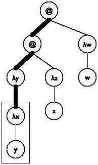 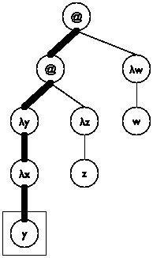
> > > > 
> 图 186: Lam 项作为树

现在我们已经确定了累加器的数据表示及其不变性，我们可以解决剩余的设计问题：

+   我们选择初始累加器值为 '().

+   我们使用 [cons](http://docs.racket-lang.org/htdp-langs/intermediate-lam.html#%28def._htdp-intermediate-lambda._%28%28lib._lang%2Fhtdp-intermediate-lambda..rkt%29._cons%29%29) 将 (λ-para  le) 添加到 a。

+   我们利用累加器处理 undeclareds/a 处理变量的子句。具体来说，该函数使用累加器来检查变量是否在声明的范围内。

图 187 展示了如何将这些想法转化为完整的函数定义。注意累加器名称 declareds；它传达了累加器不变量的关键思想，有助于程序员理解定义。基本案例使用 [member?](http://docs.racket-lang.org/htdp-langs/intermediate-lam.html#%28def._htdp-intermediate-lambda._%28%28lib._lang%2Fhtdp-intermediate-lambda..rkt%29._member~3f%29%29) 从 ISL+ 来确定变量 le 是否在 declareds 中，如果不是，则用 '*undeclared 替换它。第二个 [cond](http://docs.racket-lang.org/htdp-langs/intermediate-lam.html#%28form._%28%28lib._lang%2Fhtdp-intermediate-lambda..rkt%29._cond%29%29) 子句使用一个 [local](http://docs.racket-lang.org/htdp-langs/intermediate-lam.html#%28form._%28%28lib._lang%2Fhtdp-intermediate-lambda..rkt%29._local%29%29) 来引入扩展累加器 newd。因为 para 也用于重建表达式，所以它有自己的局部定义。最后，最后一个子句涉及函数应用，它不声明变量也不直接使用任何变量。因此，它是三个子句中最简单的。

> > > | ; Lam -> Lam |
> > > | --- |
> > > | ([定义](http://docs.racket-lang.org/htdp-langs/intermediate-lam.html#%28form._%28%28lib._lang%2Fhtdp-intermediate-lambda..rkt%29._define%29%29) (未声明的 le0) |
> > > |   ([local](http://docs.racket-lang.org/htdp-langs/intermediate-lam.html#%28form._%28%28lib._lang%2Fhtdp-intermediate-lambda..rkt%29._local%29%29) (; Lam [List-of  Symbol] -> Lam |
> > > |   ; 累加器 declareds 是所有 λ 的列表 |
> > > | 参数从 le0 到 le 路径上的参数 |
> > > |   ([定义](http://docs.racket-lang.org/htdp-langs/intermediate-lam.html#%28form._%28%28lib._lang%2Fhtdp-intermediate-lambda..rkt%29._define%29%29) (undeclareds/a le declareds) |
> > > |   ([cond](http://docs.racket-lang.org/htdp-langs/intermediate-lam.html#%28form._%28%28lib._lang%2Fhtdp-intermediate-lambda..rkt%29._cond%29%29) |
> > > |   [(is-var? le) |
> > > |   ([if](http://docs.racket-lang.org/htdp-langs/intermediate-lam.html#%28form._%28%28lib._lang%2Fhtdp-intermediate-lambda..rkt%29._if%29%29) ([member?](http://docs.racket-lang.org/htdp-langs/intermediate-lam.html#%28def._htdp-intermediate-lambda._%28%28lib._lang%2Fhtdp-intermediate-lambda..rkt%29._member~3f%29%29) le declareds) le '*undeclared)] |
> > > |   [(is-λ? le) |
> > > | |   ([局部](http://docs.racket-lang.org/htdp-langs/intermediate-lam.html#%28form._%28%28lib._lang%2Fhtdp-intermediate-lambda..rkt%29._local%29%29) (([定义](http://docs.racket-lang.org/htdp-langs/intermediate-lam.html#%28form._%28%28lib._lang%2Fhtdp-intermediate-lambda..rkt%29._define%29%29) para (λ-para le)) |
> > > | |   ([定义](http://docs.racket-lang.org/htdp-langs/intermediate-lam.html#%28form._%28%28lib._lang%2Fhtdp-intermediate-lambda..rkt%29._define%29%29) body (λ-body le)) |
> > > | |   ([定义](http://docs.racket-lang.org/htdp-langs/intermediate-lam.html#%28form._%28%28lib._lang%2Fhtdp-intermediate-lambda..rkt%29._define%29%29) newd ([cons](http://docs.racket-lang.org/htdp-langs/intermediate-lam.html#%28def._htdp-intermediate-lambda._%28%28lib._lang%2Fhtdp-intermediate-lambda..rkt%29._cons%29%29) para declareds))) |
> > > | |   ([列表](http://docs.racket-lang.org/htdp-langs/intermediate-lam.html#%28def._htdp-intermediate-lambda._%28%28lib._lang%2Fhtdp-intermediate-lambda..rkt%29._list%29%29) 'λ ([列表](http://docs.racket-lang.org/htdp-langs/intermediate-lam.html#%28def._htdp-intermediate-lambda._%28%28lib._lang%2Fhtdp-intermediate-lambda..rkt%29._list%29%29) para) |
> > > | |   (undeclareds/a body newd)))] |
> > > | |   [(is-app? le) |
> > > | |   ([局部](http://docs.racket-lang.org/htdp-langs/intermediate-lam.html#%28form._%28%28lib._lang%2Fhtdp-intermediate-lambda..rkt%29._local%29%29) (([定义](http://docs.racket-lang.org/htdp-langs/intermediate-lam.html#%28form._%28%28lib._lang%2Fhtdp-intermediate-lambda..rkt%29._define%29%29) fun (app-fun le)) |
> > > | |   ([定义](http://docs.racket-lang.org/htdp-langs/intermediate-lam.html#%28form._%28%28lib._lang%2Fhtdp-intermediate-lambda..rkt%29._define%29%29) arg (app-arg le))) |
> > > | |   ([列表](http://docs.racket-lang.org/htdp-langs/intermediate-lam.html#%28def._htdp-intermediate-lambda._%28%28lib._lang%2Fhtdp-intermediate-lambda..rkt%29._list%29%29) (undeclareds/a fun declareds) |
> > > | |   (undeclareds/a arg declareds)))]))) |
> > > | |   (undeclareds/a le0 '()))) |
> > > 
> 图 187：查找未声明的变量

练习 514．构造一个 ISL+表达式，其中 x 同时出现为自由变量和绑定变量。将其作为 Lam 的一个元素来表述。undeclareds 在你的表达式中工作正常吗？

练习 515．考虑以下表达式：

> ([λ](http://docs.racket-lang.org/htdp-langs/intermediate-lam.html#%28form._%28%28lib._lang%2Fhtdp-intermediate-lambda..rkt%29._~ce~bb%29%29) (*undeclared) (([λ](http://docs.racket-lang.org/htdp-langs/intermediate-lam.html#%28form._%28%28lib._lang%2Fhtdp-intermediate-lambda..rkt%29._~ce~bb%29%29) (x) (x *undeclared)) y))

是的，它使用*未声明的变量作为变量。用 Lam 表示它，并检查 undeclareds 对此表达式的输出。修改 undeclareds，使其将'x 的自由出现替换为

> ([list](http://docs.racket-lang.org/htdp-langs/intermediate-lam.html#%28def._htdp-intermediate-lambda._%28%28lib._lang%2Fhtdp-intermediate-lambda..rkt%29._list%29%29) '*undeclared 'x)

和一个绑定变量 'y。

> ([list](http://docs.racket-lang.org/htdp-langs/intermediate-lam.html#%28def._htdp-intermediate-lambda._%28%28lib._lang%2Fhtdp-intermediate-lambda..rkt%29._list%29%29) '*declared 'x)

这样做可以明确地识别问题点，程序开发环境（如 DrRacket）可以使用这些点来突出显示错误。

注意：将变量出现替换为应用表示的技巧感觉有些笨拙。如果你不喜欢它，可以考虑使用符号 '*undeclared:x 和 'declared:y 代替。

练习 516. 重新设计基于结构的表示形式的未声明函数，该函数来自 练习 513。

> > > > 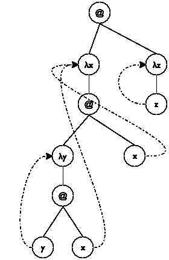 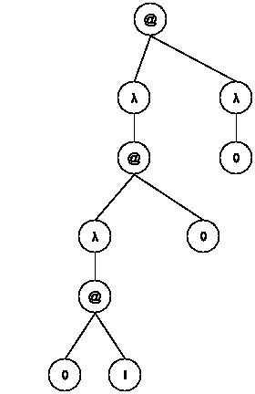
> > > > 
> 图 188：静态距离

练习 517. 设计静态距离函数。该函数将所有变量替换为表示声明 λ 距离的自然数。图 188 说明了该术语的概念。

> '((λ (x) ((λ (y) (y x)) x)) (λ (z) z))

以图形形式表示。它包括从变量出现指向相应变量声明的虚线箭头。在右侧，该图显示了相同形状的树，但没有箭头。'λ 节点没有名称，变量出现已被替换为自然数，指定哪个 'λ 声明了变量。每个自然数 n 表示绑定出现向上（<wbr>朝向 Lam 树的根）的步骤数。值为 0 表示根路径上的第一个 'λ，1 表示第二个，依此类推。

提示：未声明累积器 undeclareds/a 是从 le 到 le0 的路径上所有参数的列表，顺序相反——最后看到的参数排在列表的最前面。

#### 33.2 带累积器的数据表示🔗 "链接到此处")

第五部分：计算成本 的结尾解释了 *SL 通过遍历容器（如列表）来衡量容器的大小，并暗示其他编程语言使用不同的、更经济的方法来计算大小。在本节中，我们展示了如何通过向数据表示添加累积器来实现这一想法。

考虑在 *SL* 中无处不在的列表。所有列表都是由 [cons](http://docs.racket-lang.org/htdp-langs/intermediate-lam.html#%28def._htdp-intermediate-lambda._%28%28lib._lang%2Fhtdp-intermediate-lambda..rkt%29._cons%29%29) 和 '(); 操作构建的，例如，[quote](http://docs.racket-lang.org/htdp-langs/intermediate-lam.html#%28form._%28%28lib._lang%2Fhtdp-intermediate-lambda..rkt%29._quote%29%29) 和 [list](http://docs.racket-lang.org/htdp-langs/intermediate-lam.html#%28def._htdp-intermediate-lambda._%28%28lib._lang%2Fhtdp-intermediate-lambda..rkt%29._list%29%29) 等操作只是这两个的缩写。正如 什么是 '(), 什么是 cons 所示，也可以使用适当的结构类型和函数定义在 BSL 中模拟列表。

> > > |   ([define-struct](http://docs.racket-lang.org/htdp-langs/intermediate-lam.html#%28form._%28%28lib._lang%2Fhtdp-intermediate-lambda..rkt%29._define-struct%29%29) pair [left right]) |
> > > | --- |
> > > |   ; ConsOrEmpty 是以下之一： |
> > > |   ; – '() |
> > > |   ; – (make-pair Any ConsOrEmpty) |
> > > |     [...]) |
> > > |   ; Any ConsOrEmpty -> ConsOrEmpty |
> > > |   ([define](http://docs.racket-lang.org/htdp-langs/intermediate-lam.html#%28form._%28%28lib._lang%2Fhtdp-intermediate-lambda..rkt%29._define%29%29) (our-cons a-value a-list) |
> > > |     ([cond](http://docs.racket-lang.org/htdp-langs/intermediate-lam.html#%28form._%28%28lib._lang%2Fhtdp-intermediate-lambda..rkt%29._cond%29%29) |
> > > |     ([([empty?](http://docs.racket-lang.org/htdp-langs/intermediate-lam.html#%28def._htdp-intermediate-lambda._%28%28lib._lang%2Fhtdp-intermediate-lambda..rkt%29._empty~3f%29%29) a-list) (make-pair a-value a-list)] |
> > > |     [(pair? a-list) (make-pair a-value a-list)] |
> > > |   [[else](http://docs.racket-lang.org/htdp-langs/intermediate-lam.html#%28form._%28%28lib._lang%2Fhtdp-intermediate-lambda..rkt%29._else%29%29) ([error](http://docs.racket-lang.org/htdp-langs/intermediate-lam.html#%28def._htdp-intermediate-lambda._%28%28lib._lang%2Fhtdp-intermediate-lambda..rkt%29._error%29%29) "our-cons: ...")])) |
> > > |   |
> > > |   ; ConsOrEmpty -> Any |
> > > |   ; 提取给定对的左侧部分 |
> > > |   ([define](http://docs.racket-lang.org/htdp-langs/intermediate-lam.html#%28form._%28%28lib._lang%2Fhtdp-intermediate-lambda..rkt%29._define%29%29) (our-first mimicked-list) |
> > > |   ([if](http://docs.racket-lang.org/htdp-langs/intermediate-lam.html#%28form._%28%28lib._lang%2Fhtdp-intermediate-lambda..rkt%29._if%29%29) ([empty?](http://docs.racket-lang.org/htdp-langs/intermediate-lam.html#%28def._htdp-intermediate-lambda._%28%28lib._lang%2Fhtdp-intermediate-lambda..rkt%29._empty~3f%29%29) mimicked-list) |
> > > |       ([error](http://docs.racket-lang.org/htdp-langs/intermediate-lam.html#%28def._htdp-intermediate-lambda._%28%28lib._lang%2Fhtdp-intermediate-lambda..rkt%29._error%29%29) "our-first: ...") |
> > > |       (pair-left mimicked-list))) |
> > > 
> 图 189：BSL 中列表的实现

图 189 回顾了基本思想。停！你现在能定义我们的-rest 吗？

关键的洞察是，我们可以在对 pair 的结构类型定义中添加第三个字段：

> | ([define-struct](http://docs.racket-lang.org/htdp-langs/intermediate-lam.html#%28form._%28%28lib._lang%2Fhtdp-intermediate-lambda..rkt%29._define-struct%29%29) cpair [count left right]) |
> | --- |
> | ; 一个 [MyList X] 是以下之一： |
> | ; –  '() |
> | ; –  (make-cpair  (tech  "N")  X  [MyList  X]) |
> | ; 累加器，计数字段是 cpair 的数量 |

如累加器语句所述，额外字段用于跟踪创建列表所使用的 cpair 实例的数量。也就是说，它记录了关于列表构建的事实。我们称这种结构字段为数据累加器。向主要列表构造函数添加字段并非免费。首先，它需要更改构造函数的检查版本，即程序实际可用的版本：

> | 数据定义，通过构造函数 |
> | --- |
> | ([define](http://docs.racket-lang.org/htdp-langs/intermediate-lam.html#%28form._%28%28lib._lang%2Fhtdp-intermediate-lambda..rkt%29._define%29%29) (our-cons f r) |
> |   ([cond](http://docs.racket-lang.org/htdp-langs/intermediate-lam.html#%28form._%28%28lib._lang%2Fhtdp-intermediate-lambda..rkt%29._cond%29%29) |
> |     [([empty?](http://docs.racket-lang.org/htdp-langs/intermediate-lam.html#%28def._htdp-intermediate-lambda._%28%28lib._lang%2Fhtdp-intermediate-lambda..rkt%29._empty~3f%29%29) r) (make-cpair 1 f r)] |
> |     [(cpair? r) (make-cpair ([+](http://docs.racket-lang.org/htdp-langs/intermediate-lam.html#%28def._htdp-intermediate-lambda._%28%28lib._lang%2Fhtdp-intermediate-lambda..rkt%29._%2B%29%29) (cpair-count r) 1) f r)] |
> |     [[else](http://docs.racket-lang.org/htdp-langs/intermediate-lam.html#%28form._%28%28lib._lang%2Fhtdp-intermediate-lambda..rkt%29._else%29%29) ([error](http://docs.racket-lang.org/htdp-langs/intermediate-lam.html#%28def._htdp-intermediate-lambda._%28%28lib._lang%2Fhtdp-intermediate-lambda..rkt%29._error%29%29) "our-cons: ...")])) |

如果扩展列表是 '()，计数被填充为 1；否则，函数从给定的 cpair 计算长度。现在，我们的-length 函数的定义很明显：

> | ; Any -> N |
> | --- |
> | ; l 包含多少项 |
> | ([define](http://docs.racket-lang.org/htdp-langs/intermediate-lam.html#%28form._%28%28lib._lang%2Fhtdp-intermediate-lambda..rkt%29._define%29%29) (our-length l) |
> | |   ([cond](http://docs.racket-lang.org/htdp-langs/intermediate-lam.html#%28form._%28%28lib._lang%2Fhtdp-intermediate-lambda..rkt%29._cond%29%29) |
> | |   ([empty?](http://docs.racket-lang.org/htdp-langs/intermediate-lam.html#%28def._htdp-intermediate-lambda._%28%28lib._lang%2Fhtdp-intermediate-lambda..rkt%29._empty~3f%29%29) l) 0] |
> | |   [(cpair? l) (cpair-count l)] |
> | |   [[else](http://docs.racket-lang.org/htdp-langs/intermediate-lam.html#%28form._%28%28lib._lang%2Fhtdp-intermediate-lambda..rkt%29._else%29%29) ([error](http://docs.racket-lang.org/htdp-langs/intermediate-lam.html#%28def._htdp-intermediate-lambda._%28%28lib._lang%2Fhtdp-intermediate-lambda..rkt%29._error%29%29) "my-length: ...")])) |

该函数消耗任何类型的值。对于空列表和 cpair 的实例，它产生自然数；否则，它发出错误信号。

添加计数字段的问题之二涉及性能。确实，有两个担忧。一方面，现在每个列表构造都附带一个额外的字段，这意味着内存消耗增加了 33%。另一方面，字段的添加降低了我们的-cons 构造列表的速度。除了检查扩展列表是空列表或 cpair 的实例之外，构造函数现在还计算列表的大小。尽管这种计算消耗了常数时间，但它被施加在每次使用我们的-cons 上——<wbr>想想这本书有多少次使用 [cons](http://docs.racket-lang.org/htdp-langs/intermediate-lam.html#%28def._htdp-intermediate-lambda._%28%28lib._lang%2Fhtdp-intermediate-lambda..rkt%29._cons%29%29) 而且从未计算过结果列表的长度！

练习 518. 证明我们的-cons 计算其结果所需的时间是常数，无论其输入的大小如何。

练习 519. 是否可以对所有程序施加额外的成本，将 [cons](http://docs.racket-lang.org/htdp-langs/intermediate-lam.html#%28def._htdp-intermediate-lambda._%28%28lib._lang%2Fhtdp-intermediate-lambda..rkt%29._cons%29%29) 转换为常数时间函数？

虽然在列表中添加计数字段是有疑问的，但有时数据累加器在寻找解决方案中起着至关重要的作用。下一个例子是向一个棋盘游戏程序添加所谓的“人工智能”，而其数据累加器是绝对必要的。

当你玩棋盘游戏或解决谜题时，你倾向于在每个阶段考虑你的可能移动。随着你变得更好，你甚至可能会想象第一步之后的可能性。结果是所谓的游戏树，这是所有允许的可能移动的树（的一部分）。让我们从一个问题开始：

> 样本问题 你的经理告诉你以下故事。
> 
> “从前，有三个食人族在引导三个传教士穿越丛林。他们正在前往最近的传教站。过了一段时间，他们到达了一条宽阔的河流，河里充满了致命的蛇和鱼。没有船就无法过河。幸运的是，他们在简短的搜索后找到了一条带有两支桨的小船。不幸的是，船太小，无法载所有人。它一次只能载两个人。更糟糕的是，由于河的宽度，有人必须划船回来。
> 
> “由于传教士无法信任食人族，他们必须想出一个计划，以确保所有人都能安全地渡过河流。问题是，这些食人族会在某个地方食人族的数量超过传教士时立即杀死并吃掉传教士。我们的传教士必须制定一个计划，确保河流的任何一边都不会有传教士处于少数。然而，食人族在其他情况下是可以信赖合作的。具体来说，他们不会放弃任何潜在的食物，就像传教士不会放弃任何潜在的信徒一样。”
> 
> 虽然你的经理没有分配任何具体的设计任务，但他想探索公司是否可以设计（并销售）解决这类谜题的程序。

虽然谜题不是棋盘游戏，但这个程序以最直接的方式说明了游戏树的概念。原则上，用手解决这类谜题相当直接。这里有一个大致的想法。选择问题状态的图形表示。我们的由三个部分组成：左边代表传教士和食人族；中间结合了河流和船；第三部分是河流的右手边。看看以下初始状态的表示：

> 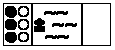

黑色圆圈代表传教士，白色圆圈代表食人族。他们都在左岸。船也在左边。没有人站在右边。这里有另外两种状态：

> 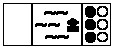 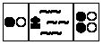

第一个状态是最终状态，所有人包括船都在河的右岸。第二个状态描绘的是一种中间状态，其中两个人在左边，船在左边，四个人在右边。

> > > > 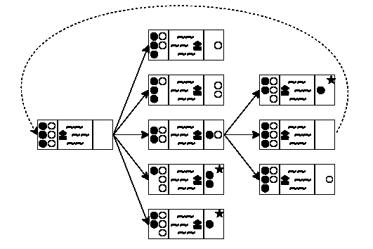
> > > > 
> 图 190：创建游戏树

现在你有了记录谜题状态的方法，你可以考虑每个阶段的可能性。这样做会产生一个可能的移动树。图 190 展示了这样一个树的前两层半。最左边的状态是初始状态。因为船最多能运送两个人，并且至少需要一个人划桨，所以你有五种可能性要探索：一个食人族划船过河；两个食人族划船过河；一个传教士和一个食人族过河；一个传教士过河；或者两个传教士过河。这些可能性用从初始状态到五个中间状态的五条箭头表示。

对于这五个中间状态中的每一个，你都可以再次玩同样的游戏。在图 190 中，你可以看到游戏是如何在新状态的中间（第三个）状态继续进行的。因为右岸只有两个人，所以你有三种可能性：一个食人族返回，一个传教士返回，或者两者都返回。因此，有三条箭头从中间状态连接到树右侧的三个状态。如果你以系统的方式继续绘制这个可能性树，最终你会发现最终状态。

再次审视图 190，可以发现这种生成可能性树的朴素方法有两个问题。第一个问题是连接右侧中间状态和初始状态的虚线箭头。它表示将两个人从右向左划船可以使谜题回到初始状态，这意味着你是在重新开始，这显然是不希望的。第二个问题涉及右上角有星号的状态。在这两种情况下，左岸的白圆圈食人族比黑圆圈传教士多，这意味着食人族会吃掉传教士。再次强调，目标是避免这种状态，因此这些移动是不希望的。

将这个谜题转化为程序的一种方法是为确定某个最终状态——这里指的是最终状态——是否可以从某个给定状态到达而设计一个函数。下面是一个合适的函数定义：

> | ; PuzzleState -> PuzzleState |
> | --- |
> | ; 从状态 0 到最终状态是否可达 |
> | ; 生成可能的划船树 |
> | ; 终止条件 ??? |
> |   |
> | ([check-expect](http://docs.racket-lang.org/htdp-langs/intermediate-lam.html#%28form._%28%28lib._lang%2Fhtdp-intermediate-lambda..rkt%29._check-expect%29%29) (solve initial-puzzle) final-puzzle) |
> |   |
> | ([define](http://docs.racket-lang.org/htdp-langs/intermediate-lam.html#%28form._%28%28lib._lang%2Fhtdp-intermediate-lambda..rkt%29._define%29%29) (solve state0) |
> | |   ([local](http://docs.racket-lang.org/htdp-langs/intermediate-lam.html#%28form._%28%28lib._lang%2Fhtdp-intermediate-lambda..rkt%29._local%29%29) (; [List-of PuzzleState] -> PuzzleState |
> | |   ; generative generates the successors of los |
> | |   ([define](http://docs.racket-lang.org/htdp-langs/intermediate-lam.html#%28form._%28%28lib._lang%2Fhtdp-intermediate-lambda..rkt%29._define%29%29) (solve* los) |
> | |   ([cond](http://docs.racket-lang.org/htdp-langs/intermediate-lam.html#%28form._%28%28lib._lang%2Fhtdp-intermediate-lambda..rkt%29._cond%29%29) |
> | |   |   ([ormap](http://docs.racket-lang.org/htdp-langs/intermediate-lam.html#%28def._htdp-intermediate-lambda._%28%28lib._lang%2Fhtdp-intermediate-lambda..rkt%29._ormap%29%29) final? los) |
> | |   |   ([first](http://docs.racket-lang.org/htdp-langs/intermediate-lam.html#%28def._htdp-intermediate-lambda._%28%28lib._lang%2Fhtdp-intermediate-lambda..rkt%29._first%29%29) ([filter](http://docs.racket-lang.org/htdp-langs/intermediate-lam.html#%28def._htdp-intermediate-lambda._%28%28lib._lang%2Fhtdp-intermediate-lambda..rkt%29._filter%29%29) final? los))] |
> | |   |   [[else](http://docs.racket-lang.org/htdp-langs/intermediate-lam.html#%28form._%28%28lib._lang%2Fhtdp-intermediate-lambda..rkt%29._else%29%29) |
> | |   |   (solve* (create-next-states los))) |
> | |   (solve* ([list](http://docs.racket-lang.org/htdp-langs/intermediate-lam.html#%28def._htdp-intermediate-lambda._%28%28lib._lang%2Fhtdp-intermediate-lambda..rkt%29._list%29%29) state0)))) |

辅助函数使用生成性递归，根据给定可能性列表生成所有新的可能性。如果给定可能性中有一个是最终状态，则函数返回它。

显然，solve 函数相当通用。只要定义了一组 PuzzleState，一个识别最终状态的函数和一个创建所有“后继”状态的函数，solve 就可以处理你的难题。

练习 520. solve* 函数在检查需要 n + 1 次船旅行的状态之前，先生成使用 n 次船旅行的所有可达状态，即使其中一些船旅行回到了之前遇到的状态。由于这种系统性的遍历树的方式，solve* 不会进入无限循环。为什么？术语 这种搜索树或图的方式被称为广度优先搜索。

练习 521. 为传教士与野人难题的状态开发一种表示方法。与图形表示一样，数据表示必须记录河流每一边的传教士和野人数目以及船的位置。

PuzzleState 的描述要求一个新的结构类型。在你的表示中，表示上述初始、中间和最终状态。

设计函数 final?，它检测在给定状态下所有人是否都在右岸。

设计函数 render-mc，它将传教士和食人族谜题的状态映射到图像。

问题在于返回最终状态并没有说明玩家是如何从初始状态到达最终状态的。换句话说，create-next-states 忘记了它是如何从给定的状态到达返回的状态的。这种情况显然需要累加器，但与此同时，积累的知识最好与每个单独的 PuzzleState 相关联，而不是 solve*或其他任何函数。

练习 522. 从练习 521 修改表示，以便状态记录到达那里的状态序列。使用状态列表。

明确并写下累加器语句，其中包含数据定义，以解释附加字段。

根据需要修改 final?或 render-mc 以适应这种表示。

练习 523. 设计 create-next-states 函数。它消耗传教士和食人族状态的列表，并生成所有这些状态，这些状态可以通过一次划船到达。

在 create-next-states 的第一稿中忽略累加器，但确保该函数不会生成食人族可以吃掉传教士的状态。

对于第二种设计，更新状态结构中的累加器字段，并使用它来排除在到达当前状态的过程中遇到的状态。

练习 524. 利用面向累加器的数据表示来修改 solve。修改后的函数产生从初始 PuzzleState 到最终状态的状态列表。

还可以考虑从这个列表中创建一个电影，使用 render-mc 生成图像。使用[run-movie](http://docs.racket-lang.org/teachpack/2htdpuniverse.html#%28def._%28%28lib._2htdp%2Funiverse..rkt%29._run-movie%29%29)来显示电影。

#### 33.3 累加器作为结果🔗 "链接到此处")

再看看图 156。它显示了一个 Sierpinski 三角形及其创建的建议。具体来说，右侧的图像解释了该过程背后的生成想法的一个版本：

> 给定的问题是三角形。当三角形太小无法进一步细分时，算法不执行任何操作；否则，它找到其三边的中点，并递归地处理三个外部的三角形。

相反，Fractals, a First Taste 展示了如何通过代数方法组合 Sierpinski 三角形，这个过程与这个描述不对应。大多数程序员期望“绘制”意味着将三角形添加到某个画布上的动作。来自 2htdp/image 教学包的[scene+line](http://docs.racket-lang.org/teachpack/2htdpimage.html#%28def._%28%28lib._2htdp%2Fimage..rkt%29._scene%2Bline%29%29)函数使这个想法具体化。该函数消耗一个图像 s 和两个点的坐标，并将一条线添加到这两个点之间。从[scene+line](http://docs.racket-lang.org/teachpack/2htdpimage.html#%28def._%28%28lib._2htdp%2Fimage..rkt%29._scene%2Bline%29%29)泛化到 add-triangle，再从那里到 add-sierpinski 是很容易的：

> 样本问题 设计 add-sierpinski 函数。它消耗一个图像和三个描述三角形的 Posns。它使用后者将 Sierpinski 三角形添加到该图像中。

注意这个问题隐含地引用了上面关于如何绘制 Sierpinski 三角形的描述过程。换句话说，我们面临的是一个经典的生成-递归问题，我们可以从经典的生成递归模板和四个核心设计问题开始：

+   如果三角形太小无法细分，这个问题就变得很简单。

+   在平凡情况下，该函数返回给定的图像。

+   否则，确定给定三角形的边的中点以添加另一个三角形。然后递归地处理每个“外部”三角形。

+   每个这些递归步骤都会生成一个图像。剩下的问题是如何将这些图像组合起来。

> > > | ; Image  Posn  Posn  Posn -> Image |
> > > | --- |
> > > | ; generative adds the triangle (a, b, c) to scene0, |
> > > | ; subdivides it into three triangles by taking the |
> > > | ; midpoints of its sides; stop if (a, b, c) is too small |
> > > | ([define](http://docs.racket-lang.org/htdp-langs/intermediate-lam.html#%28form._%28%28lib._lang%2Fhtdp-intermediate-lambda..rkt%29._define%29%29) (add-sierpinski scene0 a b c) |
> > > |   ([cond](http://docs.racket-lang.org/htdp-langs/intermediate-lam.html#%28form._%28%28lib._lang%2Fhtdp-intermediate-lambda..rkt%29._cond%29%29) |
> > > |     [(too-small? a b c) scene0] |
> > > |     [[else](http://docs.racket-lang.org/htdp-langs/intermediate-lam.html#%28form._%28%28lib._lang%2Fhtdp-intermediate-lambda..rkt%29._else%29%29) |
> > > | ([local](http://docs.racket-lang.org/htdp-langs/intermediate-lam.html#%28form._%28%28lib._lang%2Fhtdp-intermediate-lambda..rkt%29._local%29%29) |
> > > |        (([define](http://docs.racket-lang.org/htdp-langs/intermediate-lam.html#%28form._%28%28lib._lang%2Fhtdp-intermediate-lambda..rkt%29._define%29%29) scene1 (add-triangle scene0 a b c)) |
> > > | |   ([定义](http://docs.racket-lang.org/htdp-langs/intermediate-lam.html#%28form._%28%28lib._lang%2Fhtdp-intermediate-lambda..rkt%29._define%29%29) mid-a-b (mid-point a b)) |
> > > | |   ([定义](http://docs.racket-lang.org/htdp-langs/intermediate-lam.html#%28form._%28%28lib._lang%2Fhtdp-intermediate-lambda..rkt%29._define%29%29) mid-b-c (mid-point b c)) |
> > > | |   ([定义](http://docs.racket-lang.org/htdp-langs/intermediate-lam.html#%28form._%28%28lib._lang%2Fhtdp-intermediate-lambda..rkt%29._define%29%29) mid-c-a (mid-point c a)) |
> > > | |   ([定义](http://docs.racket-lang.org/htdp-langs/intermediate-lam.html#%28form._%28%28lib._lang%2Fhtdp-intermediate-lambda..rkt%29._define%29%29) 场景 2 |
> > > | |   (add-sierpinski 场景 0 a mid-a-b mid-c-a)) |
> > > | |   ([定义](http://docs.racket-lang.org/htdp-langs/intermediate-lam.html#%28form._%28%28lib._lang%2Fhtdp-intermediate-lambda..rkt%29._define%29%29) 场景 3 |
> > > | |   (add-sierpinski 场景 0 b mid-b-c mid-a-b)) |
> > > | |   ([定义](http://docs.racket-lang.org/htdp-langs/intermediate-lam.html#%28form._%28%28lib._lang%2Fhtdp-intermediate-lambda..rkt%29._define%29%29) 场景 4 |
> > > | |   (add-sierpinski 场景 0 c mid-c-a mid-b-c))) |
> > > | |   ; —<wbr>IN—<wbr> |
> > > | |   ([...](http://docs.racket-lang.org/htdp-langs/intermediate-lam.html#%28form._%28%28lib._lang%2Fhtdp-intermediate-lambda..rkt%29._......%29%29) 场景 1 [...](http://docs.racket-lang.org/htdp-langs/intermediate-lam.html#%28form._%28%28lib._lang%2Fhtdp-intermediate-lambda..rkt%29._......%29%29) 场景 2 [...](http://docs.racket-lang.org/htdp-langs/intermediate-lam.html#%28form._%28%28lib._lang%2Fhtdp-intermediate-lambda..rkt%29._......%29%29) 场景 3 [...](http://docs.racket-lang.org/htdp-langs/intermediate-lam.html#%28form._%28%28lib._lang%2Fhtdp-intermediate-lambda..rkt%29._......%29%29) 场景 4 [...](http://docs.racket-lang.org/htdp-langs/intermediate-lam.html#%28form._%28%28lib._lang%2Fhtdp-intermediate-lambda..rkt%29._......%29%29)))])) |
> > > 
> 图 191：累加器作为生成递归的结果，一个骨架

图 191 显示了将这些答案转换为骨架定义的结果。由于每个中点被使用两次，骨架使用[局部](http://docs.racket-lang.org/htdp-langs/intermediate-lam.html#%28form._%28%28lib._lang%2Fhtdp-intermediate-lambda..rkt%29._local%29%29)来在 ISL+中制定生成步骤。该[局部](http://docs.racket-lang.org/htdp-langs/intermediate-lam.html#%28form._%28%28lib._lang%2Fhtdp-intermediate-lambda..rkt%29._local%29%29)表达式引入了三个新的中点以及三次对 add-sierpinski 的递归应用。其主体中的点表示场景的组合。

练习 525。解决骨架所暗示的愿望清单：

> | ; Image  Posn  Posn  Posn -> Image |
> | --- |
> | ; adds the black triangle a, b, c to scene |
> | ([define](http://docs.racket-lang.org/htdp-langs/intermediate-lam.html#%28form._%28%28lib._lang%2Fhtdp-intermediate-lambda..rkt%29._define%29%29) (add-triangle scene a b c) scene) |
> |   |
> | ; Posn  Posn  Posn -> Boolean |
> | ; is the triangle a, b, c too small to be divided |
> | ([define](http://docs.racket-lang.org/htdp-langs/intermediate-lam.html#%28form._%28%28lib._lang%2Fhtdp-intermediate-lambda..rkt%29._define%29%29) (too-small? a b c) |
> |   #false) |
> |   |
> | ; Posn  Posn -> Posn |
> | ; determines the midpoint between a and b |
> | ([define](http://docs.racket-lang.org/htdp-langs/intermediate-lam.html#%28form._%28%28lib._lang%2Fhtdp-intermediate-lambda..rkt%29._define%29%29) (mid-point a b) |
> |   a) |

设计三个函数。领域知识（1）对于 too-small?函数，只需测量两点之间的距离并检查它是否低于某个选择的阈值，例如，10。点(x0, y0)和(x1, y1)之间的距离是

> > 

那就是点(x0 - x1, y0 - y1)到原点的距离。点(x0, y0)和(x1, y1)之间的中点坐标是各自 x 和 y 坐标的中点：

> > 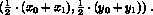

现在我们已经有了所有辅助函数，是时候回到由递归调用创建的三个图像的组合问题上了。一个明显的猜测是使用[overlay](http://docs.racket-lang.org/teachpack/2htdpimage.html#%28def._%28%28lib._2htdp%2Fimage..rkt%29._overlay%29%29)或[underlay](http://docs.racket-lang.org/teachpack/2htdpimage.html#%28def._%28%28lib._2htdp%2Fimage..rkt%29._underlay%29%29)函数，但在 DrRacket 交互区域中的评估显示，这些函数隐藏了底层的三角形。

具体来说，想象三个递归调用产生了以下空场景，并在适当的位置添加了一个三角形：

> | > scene1 |
> | --- |
> |  |
> | > scene2 |
> | 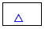 |
> | > scene3 |
> |  |

组合应该看起来像这个图：

> 

但是，使用 [overlay](http://docs.racket-lang.org/teachpack/2htdpimage.html#%28def._%28%28lib._2htdp%2Fimage..rkt%29._overlay%29%29) 或 [underlay](http://docs.racket-lang.org/teachpack/2htdpimage.html#%28def._%28%28lib._2htdp%2Fimage..rkt%29._underlay%29%29) 组合这些形状并不会得到期望的形状：

> | > ([overlay](http://docs.racket-lang.org/teachpack/2htdpimage.html#%28def._%28%28lib._2htdp%2Fimage..rkt%29._overlay%29%29) scene1 scene2 scene3) |
> | --- |
> |  |
> | > ([underlay](http://docs.racket-lang.org/teachpack/2htdpimage.html#%28def._%28%28lib._2htdp%2Fimage..rkt%29._underlay%29%29) scene1 scene2 scene3) |
> | 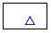 |

的确，ISL+ 的图像教学包不支持以适当方式组合这些场景的功能。让我们再次审视这些交互。如果 scene1 是将上三角形添加到给定场景的结果，而 scene2 是在左下角添加三角形的结果，那么第二个递归调用可能应该将三角形添加到第一次调用的结果中。这样做会产生

> 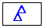

将这个场景传递给第三个递归调用将产生所需的结果：

> 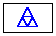
> 
> > > | ; Image  Posn  Posn  Posn -> Image |
> > > | --- |
> > > | ; generative adds the triangle (a, b, c) to scene0, |
> > > | ; subdivides it into three triangles by taking the |
> > > | ; midpoints of its sides; stop if (a, b, c) is too small |
> > > | ; accumulator the function accumulates the triangles of scene0 |
> > > | ([define](http://docs.racket-lang.org/htdp-langs/intermediate-lam.html#%28form._%28%28lib._lang%2Fhtdp-intermediate-lambda..rkt%29._define%29%29) (add-sierpinski scene0 a b c) |
> > > |   ([cond](http://docs.racket-lang.org/htdp-langs/intermediate-lam.html#%28form._%28%28lib._lang%2Fhtdp-intermediate-lambda..rkt%29._cond%29%29) |
> > > |     [(too-small? a b c) scene0] |
> > > |     [[else](http://docs.racket-lang.org/htdp-langs/intermediate-lam.html#%28form._%28%28lib._lang%2Fhtdp-intermediate-lambda..rkt%29._else%29%29) |
> > > |      ([local](http://docs.racket-lang.org/htdp-langs/intermediate-lam.html#%28form._%28%28lib._lang%2Fhtdp-intermediate-lambda..rkt%29._local%29%29) |
> > > |        (([define](http://docs.racket-lang.org/htdp-langs/intermediate-lam.html#%28form._%28%28lib._lang%2Fhtdp-intermediate-lambda..rkt%29._define%29%29) scene1 (add-triangle scene0 a b c)) |
> > > |         ([define](http://docs.racket-lang.org/htdp-langs/intermediate-lam.html#%28form._%28%28lib._lang%2Fhtdp-intermediate-lambda..rkt%29._define%29%29) mid-a-b (mid-point a b)) |
> > > | |   ([define](http://docs.racket-lang.org/htdp-langs/intermediate-lam.html#%28form._%28%28lib._lang%2Fhtdp-intermediate-lambda..rkt%29._define%29%29) mid-b-c (mid-point b c))) |
> > > | |   ([define](http://docs.racket-lang.org/htdp-langs/intermediate-lam.html#%28form._%28%28lib._lang%2Fhtdp-intermediate-lambda..rkt%29._define%29%29) mid-c-a (mid-point c a))) |
> > > | |   ([define](http://docs.racket-lang.org/htdp-langs/intermediate-lam.html#%28form._%28%28lib._lang%2Fhtdp-intermediate-lambda..rkt%29._define%29%29) scene2) |
> > > | |   (add-sierpinski scene1 a mid-a-b mid-c-a))) |
> > > | |   ([define](http://docs.racket-lang.org/htdp-langs/intermediate-lam.html#%28form._%28%28lib._lang%2Fhtdp-intermediate-lambda..rkt%29._define%29%29) scene3) |
> > > | |   (add-sierpinski scene2 b mid-b-c mid-a-b))) |
> > > | |   ; —<wbr>IN—<wbr> |
> > > | |   (add-sierpinski scene3 c mid-c-a mid-b-c))) |
> > > 
> 图 192：累加器作为生成递归的结果，函数

图 192 展示了基于这一洞察的重新表述。三个亮点指出了关键的设计理念。所有这些都关注于当三角形足够大并且被添加到给定场景中的情况。一旦其边被细分，第一个外三角形就使用 scene1（添加给定三角形的输出）递归地处理。同样，这个第一次递归的结果，被称为 scene2，被用于第二次递归，这是关于处理第二个三角形。最后，scene3 流入第三个递归调用。总的来说，新意在于累加器同时是一个参数，一个收集知识的工具，以及函数的输出。

要探索 add-sierpinski，最好从一个等边三角形和一个留下足够大边界的图像开始。以下满足这两个条件的定义：

> | ([define](http://docs.racket-lang.org/htdp-langs/intermediate-lam.html#%28form._%28%28lib._lang%2Fhtdp-intermediate-lambda..rkt%29._define%29%29) MT ([empty-scene](http://docs.racket-lang.org/teachpack/2htdpimage.html#%28def._%28%28lib._2htdp%2Fimage..rkt%29._empty-scene%29%29) 400 400))) |
> | --- |
> | ([define](http://docs.racket-lang.org/htdp-langs/intermediate-lam.html#%28form._%28%28lib._lang%2Fhtdp-intermediate-lambda..rkt%29._define%29%29) A ([make-posn](http://docs.racket-lang.org/htdp-langs/intermediate-lam.html#%28def._htdp-intermediate-lambda._%28%28lib._lang%2Fhtdp-intermediate-lambda..rkt%29._make-posn%29%29) 200  50))) |
> | ([define](http://docs.racket-lang.org/htdp-langs/intermediate-lam.html#%28form._%28%28lib._lang%2Fhtdp-intermediate-lambda..rkt%29._define%29%29) B ([make-posn](http://docs.racket-lang.org/htdp-langs/intermediate-lam.html#%28def._htdp-intermediate-lambda._%28%28lib._lang%2Fhtdp-intermediate-lambda..rkt%29._make-posn%29%29)  27 350))) |
> | ([define](http://docs.racket-lang.org/htdp-langs/intermediate-lam.html#%28form._%28%28lib._lang%2Fhtdp-intermediate-lambda..rkt%29._define%29%29) C ([make-posn](http://docs.racket-lang.org/htdp-langs/intermediate-lam.html#%28def._htdp-intermediate-lambda._%28%28lib._lang%2Fhtdp-intermediate-lambda..rkt%29._make-posn%29%29) 373 350)) |
> |   |
> | (add-sierpinski MT A B C) |

检查这段代码生成的 Sierpinski 分形类型。通过实验 练习 525 中的定义，创建比第一个更稀疏和更密集的 Sierpinski 三角形。

练习 526. 要计算等边 Sierpinski 三角形的端点，画一个圆并在圆上选取三个相隔 120 度的点，例如，120 度、240 度和 360 度。

设计函数 circle-pt:

> | ([define](http://docs.racket-lang.org/htdp-langs/intermediate-lam.html#%28form._%28%28lib._lang%2Fhtdp-intermediate-lambda..rkt%29._define%29%29) CENTER ([make-posn](http://docs.racket-lang.org/htdp-langs/intermediate-lam.html#%28def._htdp-intermediate-lambda._%28%28lib._lang%2Fhtdp-intermediate-lambda..rkt%29._make-posn%29%29) 200 200)) |
> | --- |
> | ([define](http://docs.racket-lang.org/htdp-langs/intermediate-lam.html#%28form._%28%28lib._lang%2Fhtdp-intermediate-lambda..rkt%29._define%29%29) RADIUS 200) ; 像素单位中的半径 |
> |   |
> | ; Number -> Posn |
> | ; 确定圆上以 CENTER 为中心、RADIUS 为半径的点 |
> | ; 和角度 |
> |   |
> | ; 示例 |
> | ; 所需的 x 和 y 坐标是什么 |
> | ; 点，当给定：120/360，240/360，360/360 |
> |   |
> | ([define](http://docs.racket-lang.org/htdp-langs/intermediate-lam.html#%28form._%28%28lib._lang%2Fhtdp-intermediate-lambda..rkt%29._define%29%29) (circle-pt factor) |
> |   ([make-posn](http://docs.racket-lang.org/htdp-langs/intermediate-lam.html#%28def._htdp-intermediate-lambda._%28%28lib._lang%2Fhtdp-intermediate-lambda..rkt%29._make-posn%29%29) 0 0)) |

领域知识这个设计问题需要调用数学知识。一种看待这个问题的方式是将一个复数从极坐标表示转换为 Posn 表示。在 ISL+ 中查阅 [make-polar](http://docs.racket-lang.org/htdp-langs/intermediate-lam.html#%28def._htdp-intermediate-lambda._%28%28lib._lang%2Fhtdp-intermediate-lambda..rkt%29._make-polar%29%29)、[real-part](http://docs.racket-lang.org/htdp-langs/intermediate-lam.html#%28def._htdp-intermediate-lambda._%28%28lib._lang%2Fhtdp-intermediate-lambda..rkt%29._real-part%29%29) 和 [imag-part](http://docs.racket-lang.org/htdp-langs/intermediate-lam.html#%28def._htdp-intermediate-lambda._%28%28lib._lang%2Fhtdp-intermediate-lambda..rkt%29._imag-part%29%29) 的信息。另一种方法是使用三角学，[sin](http://docs.racket-lang.org/htdp-langs/intermediate-lam.html#%28def._htdp-intermediate-lambda._%28%28lib._lang%2Fhtdp-intermediate-lambda..rkt%29._sin%29%29) 和 [cos](http://docs.racket-lang.org/htdp-langs/intermediate-lam.html#%28def._htdp-intermediate-lambda._%28%28lib._lang%2Fhtdp-intermediate-lambda..rkt%29._cos%29%29)，来确定坐标。如果你选择这条路线，请记住这些三角函数是以弧度而不是度来计算正弦和余弦的。还要记住，屏幕上的位置是向下增长的，而不是向上。练习 527。看看以下两张图片：

> 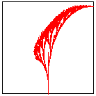          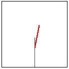

它们展示了如何以与 图 156 展示如何绘制 Sierpinski 三角形相同的方式生成分形萨凡纳树。左边的图片显示了分形萨凡纳树的外观。右边的图片解释了生成构造步骤。

设计函数 `add-savannah`。该函数接受一个图像和四个数字：（1）线的基点的 x 坐标，（2）线的基点的 y 坐标，（3）线的长度，以及（4）线的角度。它将在给定的图像上添加一个分形萨凡纳树。

除非线太短，否则函数会将指定的线添加到图像中。然后它将线分成三段。它递归地使用两个中间点作为两条新线的起点。两个分支的长度和角度以固定方式改变，但彼此独立。使用常数来定义这些变化，并在此工作，直到你对你的树满意为止。

提示尝试将每个左分支至少缩短三分之一，并向左旋转至少 0.15 度。对于每个右分支，至少缩短 20%，并以 0.2 度相反方向旋转。

练习 528。图形程序员经常需要用平滑的曲线连接两个点，其中“平滑”相对于某个视角而言。Géraldine Morin 提出了这个练习。以下是两个草图：

> 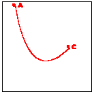          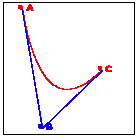

左侧的一个显示了连接点 A 和 C 的平滑曲线；右侧的一个提供了观察点 B 和观察者的角度。绘制此类曲线的一种方法归功于贝塞尔。它是生成递归的一个典型例子，以下序列解释了算法背后的“eureka!”：

> 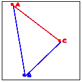  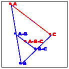  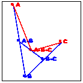

考虑左侧的图像。它提醒你，三个给定的点确定了一个三角形，并且从 A 到 C 的连接是算法的焦点。目标是将 A 到 C 的线拉向 B，使其变成一条平滑的曲线。

现在转向中间的图像。它解释了生成步骤的基本思想。算法确定了两个观察线 A-B 和 B-C 以及它们的中间点 A-B-C 的中点。

最后，最右侧的图像展示了这三个新点如何生成两个不同的递归调用：一个处理左侧的新三角形，另一个处理右侧的三角形。更确切地说，A-B 和 B-C 成为新的观察点，从 A 到 A-B-C 和从 C 到 A-B-C 的线成为两个递归调用的焦点。

当三角形足够小的时候，我们有一个可以轻易解决的简单情况。算法只是绘制三角形，它看起来就像给定图像上的一个点。在实现这个算法时，你需要实验“足够小”的概念，以使曲线看起来平滑。

### 34 摘要🔗 "链接到这里")

这最后一部分是关于使用累加器进行设计，这是一种在数据结构遍历过程中收集知识的方法。添加累加器可以修复性能缺陷并消除终止问题。从这个部分，你可以学到两个半的设计课程：

1.  第一步是认识到引入累加器的需要。遍历在从一个部分移动到下一个部分时会“忘记”一些参数。如果你发现这样的知识可以简化函数的设计，考虑引入累加器。第一步是切换到累加器模板。

1.  关键步骤是制定累加器语句。后者必须表达累加器收集的知识作为何种类型的数据。在大多数情况下，累加器语句描述了原始参数和当前参数之间的差异。

1.  第三步，一个小的步骤，是从累加器语句（a）推断出初始累加器值，（b）如何在遍历步骤中维护它，（c）如何利用它的知识。

累积知识的理念无处不在，并以多种不同的形式和形态出现。它在所谓的功能语言如 ISL+中被广泛使用。使用命令式语言的程序员以不同的方式遇到累加器，主要是通过原始循环结构中的赋值语句，因为后者无法返回值。设计这样的命令式累加器程序的过程与这里累加器函数的设计过程类似，但细节超出了这本关于系统化程序设计的第一本书的范围。
