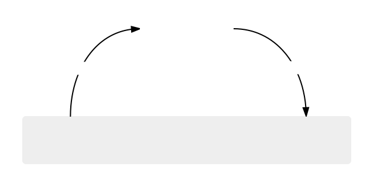
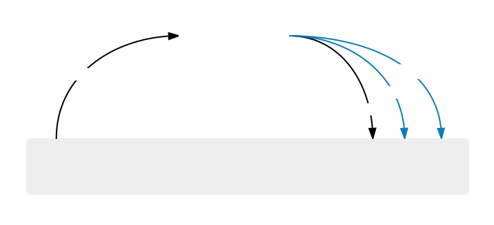

# Elm 架构

# Elm 架构

Elm 架构是一种用于构建 web 应用程序的简单模式。它非常适合模块化、代码重用和测试。最终，它使得创建复杂的 web 应用程序变得容易，而且在重构和添加功能时保持健康。

这种架构在 Elm 中似乎是自然而然地出现的。我们最初在 Elm 社区制作的游戏中观察到它。然后在像[TodoMVC](https://github.com/evancz/elm-todomvc)和[dreamwriter](https://github.com/rtfeldman/dreamwriter#dreamwriter)这样的 web 应用程序中也看到了它。现在我们看到它在像[NoRedInk](https://www.noredink.com/)和[Pivotal](https://www.pivotaltracker.com/blog/Elm-pivotal-tracker/)这样的公司中运行。这种架构似乎是 Elm 本身设计的结果，所以无论你是否了解它，它都会发生在你身上。这已经被证明对新开发人员的培训非常有帮助。他们的���码总是结构良好的。这有点神奇。

所以 Elm 架构在 Elm 中是*简单*的，但在任何前端项目中都很有用。事实上，像 Redux 这样的项目受到了 Elm 架构的启发，所以你可能已经看到了这种模式的衍生物。重点是，即使你最终还不能在工作中使用 Elm，你也会从使用 Elm 和内化这种模式中获益良多。

## 基本模式

每个 Elm 程序的逻辑都会分为三个清晰分离的部分：

+   **模型** — 应用程序的状态

+   **更新** — 更新状态的一种方式

+   **视图** — 将状态显示为 HTML 的一种方式

这种模式是如此可靠，以至于我总是从以下骨架开始，然后为我的特定情况填充细节。

```
import Html exposing (..)

-- MODEL

type alias Model = { ... }

-- UPDATE

type Msg = Reset | ...

update : Msg -> Model -> Model
update msg model =
  case msg of
    Reset -> ...
    ...

-- VIEW

view : Model -> Html Msg
view model =
  ... 
```

这真的是 Elm 架构的精髓！我们将通过逐渐填充这个骨架来添加越来越有趣的逻辑。

# 用户输入

# Elm 架构 + 用户输入

你的 web 应用程序将需要处理用户输入。本节将让你熟悉 Elm 架构在诸如以下情况下的上下文中：

+   按钮

+   文本字段

+   复选框

+   单选按钮

+   等等。

我们将逐步介绍一些逐渐构建知识的例子，所以按顺序进行！

## 跟随

在上一节中，我们使用 `elm-repl` 来熟悉 Elm 表达式。在本节中，我们将转而创建我们自己的 Elm 文件。你可以在[在线编辑器](http://elm-lang.org/try)中进行操作，或者如果你已经安装了 Elm，你可以按照[这些简单的说明](https://github.com/evancz/elm-architecture-tutorial#run-the-examples)在你的计算机上让一切正常运行！

# 按钮

# 按钮

* * *

#### [克隆代码](https://github.com/evancz/elm-architecture-tutorial/)或在[在线编辑器](http://elm-lang.org/examples/buttons)中跟随。

* * *

我们的第一个例子是一个简单的计数器，可以递增或递减。我发现将整个程序放在一个地方可能会有所帮助，所以这里就是！之后我们将逐步分解它。

```
import Html exposing (Html, button, div, text)
import Html.Events exposing (onClick)

main =
  Html.beginnerProgram { model = model, view = view, update = update }

-- MODEL

type alias Model = Int

model : Model
model =
  0

-- UPDATE

type Msg = Increment | Decrement

update : Msg -> Model -> Model
update msg model =
  case msg of
    Increment ->
      model + 1

    Decrement ->
      model - 1

-- VIEW

view : Model -> Html Msg
view model =
  div []
    [ button [ onClick Decrement ] [ text "-" ]
    , div [] [ text (toString model) ]
    , button [ onClick Increment ] [ text "+" ]
    ] 
```

就是这些了！

> **注意：** 这一部分有 `type` 和 `type alias` 声明。您可以在即将到来的关于[类型](http://guide.elm-lang.org/types/index.html)的部分中阅读有关这些的所有内容。现在您不*需要*深入理解这些内容，但如果有帮助，您可以提前跳过。

当从头开始编写这个程序时，我总是先猜测模型。要制作一个计数器，我们至少需要跟踪一个上升和下降的数字。所以让我们从那开始！

```
type alias Model = Int 
```

现在我们有了一个模型，我们需要定义它随时间如何变化。我总是从定义我们将从 UI 获取的一组消息开始我的 `UPDATE` 部分：

```
type Msg = Increment | Decrement 
```

我确信用户能够增加和减少计数器。`Msg` 类型描述了这些功能作为*数据*。重要！从这里开始，`update` 函数只描述了当接收到这些消息时该做什么。

```
update : Msg -> Model -> Model
update msg model =
  case msg of
    Increment ->
      model + 1

    Decrement ->
      model - 1 
```

如果收到 `Increment` 消息，则增加模型。如果收到 `Decrement` 消息，则减少模型。非常直截了当的事情。

好的，那一切都很好，但我们如何实际制作一些 HTML 并在屏幕上显示它？Elm 有一个名为 `elm-lang/html` 的库，它让您可以像普通 Elm 函数一样完全访问 HTML5：

```
view : Model -> Html Msg
view model =
  div []
    [ button [ onClick Decrement ] [ text "-" ]
    , div [] [ text (toString model) ]
    , button [ onClick Increment ] [ text "+" ]
    ] 
```

您可以在这里看到更多基本 HTML 的例子 [here](http://elm-lang.org/examples)。

需要注意的一点是，我们的 `view` 函数生成了一个 `Html Msg` 值。这意味着它是一个可以生成 `Msg` 值的 HTML 块。当您查看定义时，您会看到 `onClick` 属性设置为发出 `Increment` 和 `Decrement` 值。这些值将直接传递到我们的 `update` 函数中，推动整个应用程序向前发展。

另一个需要注意的是，`div` 和 `button` 只是普通的 Elm 函数。这些函数接受（1）属性列表和（2）子节点列表。它只是具有稍微不同语法的 HTML。我们不是到处都有 `<` 和 `>`，而是有 `[` 和 `]`。我们发现那些能够阅读 HTML 的人很容易学会阅读这种变体。好吧，但为什么不让它*完全*像 HTML 呢？**因为我们使用普通的 Elm 函数，我们有 Elm 编程语言的全部功能来帮助我们构建视图！**我们可以将重复的代码重构为函数。我们可以将辅助函数放在模块中，并像任何其他代码一样导入它们。我们可以使用与任何其他 Elm 代码相同的测试框架和库。编程 Elm 的所有优点都可以帮助您处理视图。不需要一个拼凑在一起的模板语言！

这里还有一些更深层次的东西。**视图代码完全是声明式的**。我们输入一个 `Model` 并生成一些 `Html`。就是这样。不需要手动更改 DOM，Elm 在幕后会处理这些。这使得 Elm 有了更多的自由来进行聪明的优化，并最终使渲染*更快*。所以你写的代码更少，而且代码运行更快。这是最好的抽象！

这个模式是 Elm 架构的精髓。从现在开始，我们看到的每个示例都将是对这个基本模式的微小变化：`Model`、`update`、`view`。

> **练习：**关于 Elm 架构的一个很酷的事情是，随着我们的产品需求的变化，扩展起来非常容易。假设您的产品经理想出了这个惊人的“重置”功能。一个新按钮，可以将计数器重置为零。
> 
> 要添加该功能，您回到 `Msg` 类型并添加另一个可能性：`Reset`。然后，您继续 `update` 函数，并描述当您收到该消息时发生的情况。最后，在您的视图中添加一个按钮。
> 
> 看看你能否实现“重置”功能！

# 文本字段

# 文本字段

* * *

#### [克隆代码](https://github.com/evancz/elm-architecture-tutorial/)或在[在线编辑器](http://elm-lang.org/examples/field)中跟随。

* * *

我们将要创建一个简单的应用程序来颠倒文本字段的内容。这个示例还介绍了一些新东西，将在我们的下一个示例中帮助我们。

再次，这是一个相当简短的程序，所以我在这里包含了整个内容。浏览一下，了解一下所有内容是如何组合在一起的。接下来我们将会更加详细地讨论！

```
import Html exposing (Html, Attribute, div, input, text)
import Html.Attributes exposing (..)
import Html.Events exposing (onInput)

main =
  Html.beginnerProgram { model = model, view = view, update = update }

-- MODEL

type alias Model =
  { content : String
  }

model : Model
model =
  { content = "" }

-- UPDATE

type Msg
  = Change String

update : Msg -> Model -> Model
update msg model =
  case msg of
    Change newContent ->
      { model | content = newContent }

-- VIEW

view : Model -> Html Msg
view model =
  div []
    [ input [ placeholder "Text to reverse", onInput Change ] []
    , div [] [ text (String.reverse model.content) ]
    ] 
```

这段代码是前一节的计数器的轻微变体。你设置一个模型。你定义一些消息。你说出如何`update`。你制作你的 `view`。不同之处只是我们如何填写这个骨架。让我们来详细看看！

一如既往，你首先猜测你的 `Model` 应该是什么。在我们的情况下，我们知道我们将不得不跟踪用户在文本字段中键入的任何内容。我们需要这些信息，以便知道如何渲染反转后的文本。

```
type alias Model =
  { content : String
  } 
```

这次我选择将模型表示为一个记录。（你可以在[这里](http://guide.elm-lang.org/core_language.html#records)和[这里](http://elm-lang.org/docs/records)阅读有关记录的更多信息。）目前，记录将用户输入存储在 `content` 字段中。

> **注意：**你可能会想，为什么要使用记录，如果它只保存一个条目？直接使用字符串不是更方便吗？当然可以！但是从记录开始，可以很容易地在应用程序变得更加复杂时添加更多字段。当我们想要*两个*文本输入时，我们将不必进行太多的摆弄。

好的，所以我们有了我们的模型。现在在这个应用中，实际上只有一种消息。用户可以更改文本字段的内容。

```
type Msg
  = Change String 
```

这意味着我们的更新函数只需处理这一种情况：

```
update : Msg -> Model -> Model
update msg model =
  case msg of
    Change newContent ->
      { model | content = newContent } 
```

当我们收到新内容时，我们使用记录更新语法来更新`content`的内容。

最后，我们需要说明如何查看我们的应用程序：

```
view : Model -> Html Msg
view model =
  div []
    [ input [ placeholder "Text to reverse", onInput Change ] []
    , div [] [ text (String.reverse model.content) ]
    ] 
```

我们创建了一个具有两个子节点的`<div>`。

有趣的子节点是`<input>`节点。除了`placeholder`属性之外，它还使用`onInput`来声明用户在此输入时应发送哪些消息。

这个`onInput`函数有点有趣。它接受一个参数，在这种情况下是我们声明`Msg`类型时创建的`Change`函数：

```
Change : String -> Msg 
```

此函数用于标记当前在文本字段中的内容。因此，假设文本字段当前包含`yol`，用户键入`o`。这将触发一个`input`事件，因此我们将在我们的`update`函数中收到消息`Change "yolo"`。

所以现在我们有了一个简单的文本字段，可以反转用户输入。很棒！现在让我们将一堆文本字段放在一起，形成一个更传统的表单。

# 表单

# 表单

* * *

#### [克隆代码](https://github.com/evancz/elm-architecture-tutorial/)或在[在线编辑器](http://elm-lang.org/examples/form)中跟随。

* * *

在这里，我们将制作一个简单的表单。它有一个用于您的姓名的字段，一个用于您的密码的字段，以及一个用于验证该密码的字段。我们还将进行一些非常简单的验证（两个密码是否匹配？）只是因为它很简单添加。

在这种情况下，代码有点长，但我仍然认为在进入描述发生的情况之前浏览一下代码是有价值的。

```
import Html exposing (..)
import Html.Attributes exposing (..)
import Html.Events exposing (onInput)

main =
  Html.beginnerProgram { model = model, view = view, update = update }

-- MODEL

type alias Model =
  { name : String
  , password : String
  , passwordAgain : String
  }

model : Model
model =
  Model "" "" ""

-- UPDATE

type Msg
    = Name String
    | Password String
    | PasswordAgain String

update : Msg -> Model -> Model
update msg model =
  case msg of
    Name name ->
      { model | name = name }

    Password password ->
      { model | password = password }

    PasswordAgain password ->
      { model | passwordAgain = password }

-- VIEW

view : Model -> Html Msg
view model =
  div []
    [ input [ type_ "text", placeholder "Name", onInput Name ] []
    , input [ type_ "password", placeholder "Password", onInput Password ] []
    , input [ type_ "password", placeholder "Re-enter Password", onInput PasswordAgain ] []
    , viewValidation model
    ]

viewValidation : Model -> Html msg
viewValidation model =
  let
    (color, message) =
      if model.password == model.passwordAgain then
        ("green", "OK")
      else
        ("red", "Passwords do not match!")
  in
    div [ style [("color", color)] ] [ text message ] 
```

这几乎与我们的文本字段示例看起来一样，只是有更多字段。让我们逐步了解它是如何产生的！

像往常一样，您首先猜测`Model`。我们知道将有三个文本字段，所以我们就这么做了：

```
type alias Model =
  { name : String
  , password : String
  , passwordAgain : String
  } 
```

很好，看起来合理。我们期望每个字段都可以单独更改，所以我们的消息应该考虑到每种情况。

```
type Msg
    = Name String
    | Password String
    | PasswordAgain String 
```

这意味着我们的`update`相当机械化。只需更新相关字段：

```
update : Msg -> Model -> Model
update msg model =
  case msg of
    Name name ->
      { model | name = name }

    Password password ->
      { model | password = password }

    PasswordAgain password ->
      { model | passwordAgain = password } 
```

我们在`view`中的操作比平常要复杂一些。

```
view : Model -> Html Msg
view model =
  div []
    [ input [ type_ "text", placeholder "Name", onInput Name ] []
    , input [ type_ "password", placeholder "Password", onInput Password ] []
    , input [ type_ "password", placeholder "Re-enter Password", onInput PasswordAgain ] []
    , viewValidation model
    ] 
```

它开始是正常的：我们创建一个`<div>`，在其中放置了几个`<input>`节点。每个节点都有一个`onInput`属性，将任何更改适当地标记为我们的`update`函数。（这一切都是基于前一节中的文本字段示例构建的。）

但对于最后一个子节点，我们不直接使用 HTML 函数。相反，我们调用`viewValidation`函数，传入当前的模型。

```
viewValidation : Model -> Html msg
viewValidation model =
  let
    (color, message) =
      if model.password == model.passwordAgain then
        ("green", "OK")
      else
        ("red", "Passwords do not match!")
  in
    div [ style [("color", color)] ] [ text message ] 
```

此函数首先比较两个密码。如果它们匹配，您希望显示绿色文本和积极消息。如果它们不匹配，您希望显示红色文本和有帮助的消息。有了这些信息，我们就会生成一个填满了说明情况的丰富多彩消息的`<div>`。

这开始显示出将我们的 HTML 库作为正常的 Elm 代码的好处。将所有代码都塞进我们的`view`中会看起来非常奇怪。在 Elm 中，您只需像处理其他任何代码一样进行重构！

在这些相同的线上，你可能会注意到所有的`<input>`节点都是用相似的代码创建的。假设我们让每个输入框更加花哨：有一个外部的`<div>`包含一个带有特定类的`<span>`和一个`<input>`。将这种模式拆分成一个`viewInput`函数是完全合理的，这样你就永远不必重复自己。这也意味着你只需在一个地方进行更改，所有人都会得到更新后的 HTML。

> **练习：**将`viewValidation`拆分出来的一个很酷的事情是它很容易扩展。如果你在阅读本教程时（你应该这样做！）正在调整代码，你应该尝试：
> 
> +   检查密码是否超过 8 个字符。
> +   
> +   确保密码包含大写字母、小写字母和数字字符。
> +   
> +   添加一个用于`年龄`的额外字段，并检查它是否为数字。
> +   
> +   添加一个“提交”按钮。只在按下按钮后显示错误。
> +   
> 如果你尝试任何这些，请务必使用[String 库](http://package.elm-lang.org/packages/elm-lang/core/latest/String)中的辅助函数！此外，在开始与服务器通信之前，我们需要学习更多内容，所以��这里尝试之前，请继续阅读直到介绍 HTTP。有了适当的指导，这将变得更加容易！

# 更多

# 更多关于用户输入的内容

我们只涵盖了按钮和文本字段，但是你最终会需要其他更疯狂的输入。

因此，如果你想看到单选按钮和复选框的示例，请访问[Elm 示例页面](http://elm-lang.org/examples)，其中有许多小例子可以让你尝试。这些例子都是我们在本教程中已经学到的东西的变体，因此玩弄这些例子是练习和更加熟悉你已经学到的东西的好方法。也许尝试将复选框整合到表单示例中？

话虽如此，我希望保持本教程的势头并继续介绍新概念，所以下一步我们将看看如何处理 HTTP 和 Web 套接字等内容！

# Effects

# Elm 架构 + Effects

上一节展示了如何处理各种用户输入。你可以将这些程序看作是这样的：



从我们的角度来看，我们只是接收消息并生成新的`Html`以在屏幕上呈现。在幕后，“Elm Runtime”就坐在那里。当它得到`Html`时，它会快速地在屏幕上呈现它[非常快](http://elm-lang.org/blog/blazing-fast-html-round-two)。当用户点击某些东西时，它会想办法将其作为`Msg`传递到我们的程序中。因此，Elm Runtime 负责*执行*操作。我们只是转换数据。

本节基于这种模式，让你能够发起 HTTP 请求或订阅来自 Web 套接字的消息。可以这样理解：



现在我们不仅仅是生成`Html`，而是生成命令和订阅：

+   **命令** —— `Cmd`让你*执行*操作：生成一个随机数，发送一个 HTTP 请求等等。

+   **订阅** —— `Sub` 允许您注册您对某事感兴趣：告诉我位置的变化，监听 WebSocket 消息等等。

如果你眯起眼睛看，命令和订阅与 `Html` 值非常相似。对于 `Html`，我们从不手动触摸 DOM。相反，我们将期望的 HTML 表示为 *数据*，并让 Elm 运行时做一些聪明的事情，使其快速渲染。命令和订阅也是一样的。我们创建 *描述* 我们想要执行的操作的数据，然后 Elm 运行时完成脏活。

如果现在看起来有点混乱，不要担心，示例会帮助你的！所以首先让我们看看如何将这些概念融入我们之前看到的代码中。

## 扩展架构骨架

到目前为止，我们的架构骨架主要关注于创建 `Model` 类型以及 `update` 和 `view` 函数。要处理命令和订阅，我们需要稍微扩展基本的架构骨架：

```
-- MODEL

type alias Model =
  { ...
  }

-- UPDATE

type Msg = Submit | ...

update : Msg -> Model -> (Model, Cmd Msg)
update msg model =
  ...

-- VIEW

view : Model -> Html Msg
view model =
  ...

-- SUBSCRIPTIONS

subscriptions : Model -> Sub Msg
subscriptions model =
  ...

-- INIT

init : (Model, Cmd Msg)
init =
  ... 
```

前三个部分几乎完全相同，但整体上还有一些新的东西：

1.  `update` 函数现在不仅返回一个新模型，还返回一些你想要运行的命令。这些命令都会产生 `Msg` 值，然后会被传递回我们的 `update` 函数。

1.  存在一个 `subscriptions` 函数。该函数允许您声明当前模型需要订阅的任何事件源。与 `Html Msg` 和 `Cmd Msg` 一样，这些订阅将产生 `Msg` 值，然后会被传递回我们的 `update` 函数。

1.  到目前为止，`init` 仅仅是初始模型。现在它像新的 `update` 一样产生了一个模型和一些命令。这让我们可以提供一个起始值，并启动任何需要进行初始化的 HTTP 请求或其他操作。

如果现在这还不太清楚，完全没有关系！只有当你开始看到它在实际中起作用时，才会发生，所以让我们直接进入示例！

> **顺便说一句：** 这里的一个关键细节是，命令和订阅都是 *数据*。当你创建一个命令时，你实际上并没有 *执行* 它。现实生活中的命令也是如此。我们来试试。用一口吃完一个西瓜！你做到了吗？没有！你在甚至 *考虑* 购买一个小西瓜之前就继续阅读了。
> 
> 关键是，命令和订阅都是数据。你将它们交给 Elm 来实际运行，让 Elm 有机会记录所有这些信息。最终，将效果作为数据意味着 Elm 可以：
> 
> +   拥有一个通用的时空旅行调试器。
> +   
> +   对于所有 Elm 函数，保持“相同输入，相同输出”的保证。
> +   
> +   在测试 `update` 逻辑时，避免设置/拆除阶段。
> +   
> +   缓存和批处理效果，最小化 HTTP 连接或其他资源。
> +   
> 不要过于细节，几乎所有 Elm 中的良好保证和工具都源自将效果视为数据的选择！当你深入学习 Elm 时，我想这会更加清晰。

# 随机

# 随机

* * *

#### [克隆代码](https://github.com/evancz/elm-architecture-tutorial/)或者在[在线编辑器](http://elm-lang.org/examples/random)中跟随。

* * *

我们将要制作一个“掷骰子”的应用程序，产生一个介于 1 和 6 之间的随机数。

当我用效果编写代码时，我通常将其分为两个阶段。第一阶段是将某些东西显示在屏幕上，只做最基本的工作，以便有些东西可以从中工作。第二阶段是填充细节，逐渐接近实际目标。我们在这里也将使用这个过程。

## 第一阶段 - 最低限度

总是从猜测你的`Model`应该是什么开始：

```
type alias Model =
  { dieFace : Int
  } 
```

现在我们只是将`dieFace`作为介于 1 和 6 之间的整数跟踪。然后，我会很快勾勒出`view`函数，因为它似乎是最容易的下一步。

```
view : Model -> Html Msg
view model =
  div []
    [ h1 [] [ text (toString model.dieFace) ]
    , button [ onClick Roll ] [ text "Roll" ]
    ] 
```

所以这是典型的。与我们在 The Elm Architecture 的用户输入示例中一直做的事情相同。当你点击我们的`<button>`时，它将产生一个`Roll`消息，所以我想现在是时候对`update`函数进行第一次尝试了。

```
type Msg = Roll

update : Msg -> Model -> (Model, Cmd Msg)
update msg model =
  case msg of
    Roll ->
      (model, Cmd.none) 
```

现在`update`函数的总体形状与之前相同，但返回类型有点不同。不仅返回一个`Model`，还产生了一个命令。思路是：**我们仍然希望使模型向前发展，但我们也想做一些事情。**在我们的情况下，我们想要求 Elm 给我们一个随机值。目前，我只用[`Cmd.none`](http://package.elm-lang.org/packages/elm-lang/core/latest/Platform-Cmd#none)填充它，这意味着“我没有命令，什么都不做。”在第二阶段中，我们将用好东西填充它。

最后，我会创建一个像这样的`init`值：

```
init : (Model, Cmd Msg)
init =
  (Model 1, Cmd.none) 
```

这里我们指定了初始模型和一些我们希望在应用程序启动时立即运行的命令。这正是`update`现在也在产生的那种东西。

此时，将所有内容连起来并查看是可能的。你可以点击`<button>`，但没有任何反应。让我们来修复它！

## 第二阶段 - 添加酷炫的东西

显然，现在缺少的东西是随机性！当用户点击按钮时，我们希望命令 Elm 到其内部随机数生成器中，并给我们一个介于 1 和 6 之间的数字。我朝着这个目标迈出的第一步将是添加一种新的消息：

```
type Msg
  = Roll
  | NewFace Int 
```

我们仍然有之前的`Roll`，但现在我们添加了`NewFace`用于当 Elm 将我们的新随机数交给我们时。这已经足够开始填写`update`了：

```
update : Msg -> Model -> (Model, Cmd Msg)
update msg model =
  case msg of
    Roll ->
      (model, Random.generate NewFace (Random.int 1 6))

    NewFace newFace ->
      (Model newFace, Cmd.none) 
```

这里有两个新的东西。**首先**，现在有一个`NewFace`消息的分支。当一个`NewFace`进来时，我们只是让模型前进并且什么也不做。**其次**，我们在`Roll`分支中添加了一个真实的命令。这使用了来自[the `Random` library](http://package.elm-lang.org/packages/elm-lang/core/latest/Random)的几个函数。最重要的是`Random.generate`：

```
Random.generate : (a -> msg) -> Random.Generator a -> Cmd msg 
```

这个函数接受两个参数。第一个是一个函数，用于标记随机值。在我们的情况下，我们想要使用 `NewFace : Int -> Msg` 将随机数转换为我们 `update` 函数的消息。第二个参数是一个“生成器”，类似于生成某些类型的随机值的配方。你可以为简单类型如 `Int` 或 `Float` 或 `Bool` 创建生成器，也可以为具有许多字段的大型自定义记录等复杂类型创建生成器。在这种情况下，我们使用最简单的生成器之一：

```
Random.int : Int -> Int -> Random.Generator Int 
```

你提供一个整数的下限和上限，现在你有一个生成器可以在该范围内生成整数！

就是这样。现在我们可以点击并看到数字翻转到一些新值！

所以这里的重要教训是：

+   逐步编写你的程序。从一个简单的框架开始，然后逐渐添加更难的内容。

+   `update` 函数现在生成一个新模型 *和* 一个命令。

+   你不能随意获取随机值。你创建一个命令，Elm 将在幕后进行一些工作为你提供它。事实上，每当我们的程序需要获取不可靠的值（随机性、HTTP、文件 I/O、数据库读取等），你都必须通过 Elm。

在这一点上，提高对命令理解的最佳方法就是看更多的命令！它们将在 `Http` �� `WebSocket` 库中显著出现，因此如果你感到不稳定，唯一的前进道路就是练习随机性并尝试其他命令的示例！

> **练习：** 这里有一些基于已经介绍的内容的练习：
> 
> +   不要显示一个数字，将骰子面显示为图像。
> +   
> +   添加第二个骰子，并让它们同时滚动。
> +   
> 这里还有一些需要新技能的练习：
> 
> +   不要显示一个骰子面的图像，使用 `elm-lang/svg` 库自己绘制它。
> +   
> +   在学习了任务和动画之后，让骰子在最终停止之前随机翻转。

# HTTP

# HTTP

* * *

#### [克隆代码](https://github.com/evancz/elm-architecture-tutorial/) 或在 [在线编辑器](http://elm-lang.org/examples/http) 中跟随。

* * *

我们将制作一个应用程序，在用户请求另一张图片时获取一个随机 GIF。

现在，我假设你刚刚阅读了随机性示例。它 (1) 介绍了编写这类应用程序的两步过程，(2) 显示了可能的最简单的命令类型。在这里，我们将使用相同的两步过程来构建更复杂的命令类型，因此我强烈建议返回上一页。我发誓，如果你从一个坚实的基础开始，你会更快地实现目标！

...

好了，所以你现在读了吧？很好。让我们开始制作我们的随机 GIF 获取器！

## 第一阶段 - 最低限度

在本指南的这一点上，你应该已经对编写 Elm 应用程序的基本框架感到非常舒适。猜测模型，填写一些消息，等等。

```
-- MODEL

type alias Model =
  { topic : String
  , gifUrl : String
  }

init : (Model, Cmd Msg)
init =
  (Model "cats" "waiting.gif", Cmd.none)

-- UPDATE

type Msg = MorePlease

update : Msg -> Model -> (Model, Cmd Msg)
update msg model =
  case msg of
    MorePlease ->
      (model, Cmd.none)

-- VIEW

view : Model -> Html Msg
view model =
  div []
    [ h2 [] [text model.topic]
    , img [src model.gifUrl] []
    , button [ onClick MorePlease ] [ text "More Please!" ]
    ] 
```

对于模型，我决定跟踪一个 `topic`，这样我就知道要获取什么样的 gifs。我不想将其硬编码为`"cats"`，也许以后我们会让用户决定主题。我还跟踪了`gifUrl`，这是一个指向某个随机 gif 的 URL。

就像在随机性例子中一样，我只是制作了虚拟的`init`和`update`函数。它们现在都没有真正产生任何命令。重点只是让屏幕上有点东西！

## 第二阶段 - 添加酷炫的东西

好了，现在明显缺失的是 HTTP 请求。我认为通过添加新种类的消息来启动这个过程是最容易的。现在记住，**当你发出命令时，你必须等待它发生**。因此，当我们命令 Elm 执行 HTTP 请求时，它最终会告诉你"嘿，这是你想要的东西"，或者它会说"糟糕，HTTP 请求出了问题"。我们需要在我们的消息中反映这一点：

```
type Msg
  = MorePlease
  | NewGif (Result Http.Error String) 
```

我们添加了一个包含`Result`的`NewGif`分支。你可以在这里了解更多关于结果的信息，但关键的想法是它捕获了一个 HTTP 请求的两种可能结果。它要么（1）成功返回一个随机 gif 的 URL，要么（2）失败并显示一些 HTTP 错误（服务器宕机，URL 错误等）。

这已经足够开始填写 `update` 函数了：

```
update : Msg -> Model -> (Model, Cmd Msg)
update msg model =
  case msg of
    MorePlease ->
      (model, getRandomGif model.topic)

    NewGif (Ok newUrl) ->
      ( { model | gifUrl = newUrl }, Cmd.none)

    NewGif (Err _) ->
      (model, Cmd.none) 
```

因此，我添加了我们新消息的分支。当`NewGif`包含成功时，我们更新`gifUrl`字段以包含新的 URL。当`NewGif`包含错误时，我们忽略它，返回相同的模型并且什么都不做。

我还稍微修改了`MorePlease`分支。我们需要一个 HTTP 命令，所以我调用了`getRandomGif`函数。关键是，我编造了那个函数。它还不存在。这就是下一步！

定义`getRandomGif`可能看起来像这样：

```
getRandomGif : String -> Cmd Msg
getRandomGif topic =
  let
    url =
      "https://api.giphy.com/v1/gifs/random?api_key=dc6zaTOxFJmzC&tag=" ++ topic

    request =
      Http.get url decodeGifUrl
  in
    Http.send NewGif request

decodeGifUrl : Decode.Decoder String
decodeGifUrl =
  Decode.at ["data", "image_url"] Decode.string 
```

加上这个之后，“更多”按钮实际上会去获取一个随机的 gif。在[这里](http://elm-lang.org/examples/http)查看！但是`getRandomGif`到底是如何工作的呢？

它开始很简单，我们将`url`定义为一些随机 gif 的 giphy 端点。接下来，我们使用[`Http.get`](http://package.elm-lang.org/packages/elm-lang/http/latest/Http#get) 创建一个 HTTP `request`。最后，我们使用[`Http.send`](http://package.elm-lang.org/packages/elm-lang/http/latest/Http#send) 将其转换为命令。让我们更详细地解释这些步骤：

+   `Http.get : String -> Decode.Decoder value -> Http.Request value`

    这个函数接受一个 URL 和一个 JSON 解码器。这是我们第一次看到 JSON 解码器（我们稍后会深入介绍它们），但现在，你只需要一个高层次的理解。它将 JSON 转换为 Elm。在我们的例子中，我们定义了`decodeGifUrl`，它试图在`json.data.image_url`中找到一个字符串值。在 URL 和 JSON 解码器之间，我们创建了一个`Http.Request`。这类似于我们在上一个例子中看到的`Random.Generator`。它实际上并不*执行*任何操作。它只是描述如何发出 HTTP 请求。

+   `Http.send：(Result 错误值-> msg)-> Http.Request 值-> Cmd msg`

    一旦我们有了 HTTP 请求，我们就可以使用`Http.send`将其转换为命令。 这就像我们使用`Random.generate`创建具有随机生成器的命令一样。 第一个参数是将 HTTP 请求的结果转换为我们`update`函数的消息的方法。 在这种情况下，我们创建一个`NewGif`消息。

这只是一个非常快速的介绍，但关键思想是您必须（1）创建一个 HTTP 请求，并且（2）将其转换为命令，以便 Elm 实际*执行*它。 使用基本模式，您可以走得很远，我们将在后面研究 JSON 解码器，这将让您处理任何疯狂的 JSON。

> **练习：** 为了更加熟悉这段代码，尝试使用我们在前几节中学到的技能来增强它：
> 
> +   当您收到[`Http.Error`](http://package.elm-lang.org/packages/elm-lang/http/latest/Http#Error)时，显示一条消息，解释为什么图像没有更改。
> +   
> +   允许用户使用文本字段修改`topic`。
> +   
> +   允许用户使用下拉菜单修改`topic`。

# 时间

# 时间

* * *

#### [克隆代码](https://github.com/evancz/elm-architecture-tutorial/)或在[在线编辑器](http://elm-lang.org/examples/time)中跟随。

* * *

我们将制作一个简单的时钟。

到目前为止，我们已经专注于命令。 在随机示例中，我们*请求*了一个随机值。 在 HTTP 示例中，我们*请求*了来自服务器的信息。 这种模式对于时钟不太适用。 在这种情况下，我们希望坐下来听到时钟每次发生时都会发生的事情。 这就是**订阅**的作用所在。

这里的代码并不太疯狂，所以我会完整地包含它。在您阅读完之后，我们将回到正常的词语，更深入地解释它。

```
import Html exposing (Html)
import Svg exposing (..)
import Svg.Attributes exposing (..)
import Time exposing (Time, second)

main =
  Html.program
    { init = init
    , view = view
    , update = update
    , subscriptions = subscriptions
    }

-- MODEL

type alias Model = Time

init : (Model, Cmd Msg)
init =
  (0, Cmd.none)

-- UPDATE

type Msg
  = Tick Time

update : Msg -> Model -> (Model, Cmd Msg)
update msg model =
  case msg of
    Tick newTime ->
      (newTime, Cmd.none)

-- SUBSCRIPTIONS

subscriptions : Model -> Sub Msg
subscriptions model =
  Time.every second Tick

-- VIEW

view : Model -> Html Msg
view model =
  let
    angle =
      turns (Time.inMinutes model)

    handX =
      toString (50 + 40 * cos angle)

    handY =
      toString (50 + 40 * sin angle)
  in
    svg [ viewBox "0 0 100 100", width "300px" ]
      [ circle [ cx "50", cy "50", r "45", fill "#0B79CE" ] []
      , line [ x1 "50", y1 "50", x2 handX, y2 handY, stroke "#023963" ] []
      ] 
```

在`MODEL`或`UPDATE`部分没有新内容。 还是老样子。 `view`函数有点有趣。 我们不是使用 HTML，而是使用`Svg`库来绘制一些形状。 但它的工作原理和 HTML 一样。 您为每个节点提供一组属性和一组子节点。

重要的事情出现在`SUBSCRIPTIONS`部分。 `subscriptions`函数接受模型，而不是像我们到目前为止看到的例子中返回`Sub.none`，而是返回一个真正的生活订阅！ 在这种情况下，`Time.every`：

```
Time.every : Time -> (Time -> msg) -> Sub msg 
```

第一个参数是时间间隔。 我们选择每秒获取一次刻度。 第二个参数是一个函数，它将当前时间转换为`update`函数的消息。 我们使用`Tick`标记时间，因此时间 1458863979862 将变为`Tick 1458863979862`。

设置订阅就是这么简单！ 这些消息将在可用时提供给您的`update`函数。

> **练习：**
> 
> +   添加一个按钮来暂停时钟，关闭`Time`订阅。
> +   
> +   使时钟看起来更好看。 添加小时和分钟指针。 等等。

# Web Sockets

# Web Sockets

* * *

#### [克隆代码](https://github.com/evancz/elm-architecture-tutorial/) 或在[在线编辑器](http://elm-lang.org/examples/websockets)中跟随。

* * *

我们将制作一个简单的聊天应用程序。将有一个文本字段，因此您可以在其中键入内容，并显示到目前为止我们收到的所有消息的区域。对于这种情况，Web 套接字非常适合，因为它们让我们能够与服务器建立持久连接。这意味着：

1.  您可以随时廉价地发送消息。

1.  服务器可以随时向*您*发送消息。

换句话说，`WebSocket`是少数同时使用命令和订阅的库之一。

此程序恰好非常简短，因此这是完整的内容：

```
import Html exposing (..)
import Html.Attributes exposing (..)
import Html.Events exposing (..)
import WebSocket

main =
  Html.program
    { init = init
    , view = view
    , update = update
    , subscriptions = subscriptions
    }

-- MODEL

type alias Model =
  { input : String
  , messages : List String
  }

init : (Model, Cmd Msg)
init =
  (Model "" [], Cmd.none)

-- UPDATE

type Msg
  = Input String
  | Send
  | NewMessage String

update : Msg -> Model -> (Model, Cmd Msg)
update msg {input, messages} =
  case msg of
    Input newInput ->
      (Model newInput messages, Cmd.none)

    Send ->
      (Model "" messages, WebSocket.send "ws://echo.websocket.org" input)

    NewMessage str ->
      (Model input (str :: messages), Cmd.none)

-- SUBSCRIPTIONS

subscriptions : Model -> Sub Msg
subscriptions model =
  WebSocket.listen "ws://echo.websocket.org" NewMessage

-- VIEW

view : Model -> Html Msg
view model =
  div []
    [ div [] (List.map viewMessage model.messages)
    , input [onInput Input] []
    , button [onClick Send] [text "Send"]
    ]

viewMessage : String -> Html msg
viewMessage msg =
  div [] [ text msg ] 
```

可能最有趣的部分是使用 `WebSocket.send` 和 `WebSocket.listen`。

为简单起见，我们将针对一个简单的服务器，该服务器只是将您键入的任何内容回显。因此，在基本版本中，您将无法进行最激动人心的对话，但这就是为什么我们在这些示例中有练习的原因！

# 更多

# 更多关于 Elm 架构

本节的重点是：**我们如何能尽快顺利地让人们制作出酷炫的 Elm 项目？** 所以我们讨论了：

+   基本架构模式。

+   如何创建按钮和文本字段。

+   如何发起 HTTP 请求。

+   如何使用 Web 套接字工作。

您可以通过这些知识走得很远，但是 Elm 本身还有许多重要方面我们尚未涵盖。例如，联合类型是整个语言中最重要的功能之一，而我们根本没有专注于它们！

因此，我们将在几章中暂时离开 Elm 架构，以更好地理解 Elm 本身。我们将在几章后回到 Elm 架构，并专注于在较大的应用程序中重用代码。同时，当一个函数变得如此庞大，以至于在实践中感觉无法管理时，可以创建一个辅助函数！Elm 使重构变得容易，因此最好根据需要改进架构，而不是预先行动。稍后再详细了解更多！

P.S. 最好不要提前跳过。如果有一个坚实的基础，你可以建造一个更大的房子！
