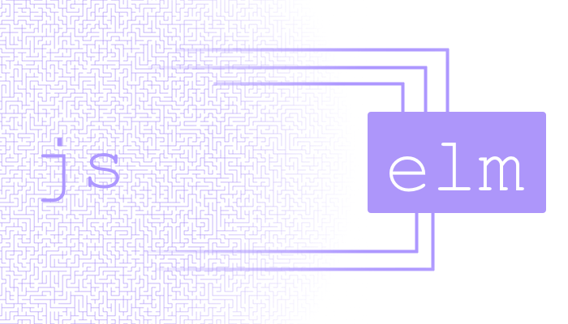

# 互操作性

# 互操作性

如果你想让你的语言成功，互操作性就非常重要！

这只是一个历史事实。C++之所以如此成功的一个巨大原因是它很容易迁移大规模的 C 代码库。如果你看看 JVM，你会发现 Scala 和 Clojure 在与 Java 良好互操作性的情况下正在创造相当大的市场。对于工业用户来说，如果没有一种将令人惊叹的语言和出色的保证引入到现有代码库的方法，那就没有意义。在浏览器中也是如此。

本节重点介绍在浏览器中工作时需要的主要互操作性。

1.  如何使用 JSON 与外部服务进行通信。

1.  如何将 Elm 程序嵌入到现有的 HTML 或 React 应用程序中。

1.  如何与现有的 JavaScript 代码进行通信。

这些类型的互操作性都受到自我强加的约束的指导，即（1）必须有一种明确的方法可以将 Elm 逐渐引入各种不同的环境中，以及（2）Elm 不应该不得不牺牲其核心设计原则。换句话说，**Elm 应该是伟大的*而且*在工作中使用 Elm 应该是可能的。**

## 引入 Elm 的建议

正确的路径是首先在一个小实验中使用 Elm。如果实验失败了，就停止它！如果成功了，就再扩展一点实验。然后只需重复这个过程，直到你使用 Elm 或不使用！历史似乎表明，没有一种现实的方式可以一次性将现有项目转换为新语言。你必须逐渐发展！

我所知道的每家公司在现有代码库中引入 Elm 时都是逐渐进行的。你需要确保这是值得的。你可能需要做一些配对或指导工作，让你的团队成员感到舒适。如果你在那之前使用 React，甚至可能会想要使用它作为一个过渡。基本上，任何你可以做的事情来最小化风险并使过程感觉逐渐进行都会提高你的胜算。现在，这些都不像直接切换那么有趣，但它有一个巨大的好处，那就是实际上会起作用。

# JSON

> 本节使用`elm-repl`。如果你还没有安装它，你可以使用[在线 REPL](http://elmrepl.cuberoot.in/)。

# JSON

你将在你的程序中发送大量的 JSON。你使用[Json.Decode 库](http://package.elm-lang.org/packages/elm-lang/core/latest/Json-Decode)将狂野而疯狂的 JSON 转换为结构化良好的 Elm 值。

处理 JSON 的核心概念称为**解码器**。它将 JSON 值解码为 Elm 值。我们将首先查看一些非常基本的解码器，然后看看如何将它们组合起来处理更复杂的情况。

## 原始解码器

这里是一些基本解码器的类型签名：

```
string : Decoder String
int : Decoder Int
float : Decoder Float
bool : Decoder Bool 
```

这些在与`decodeString`函数配对时变得有用：

```
decodeString : Decoder a -> String -> Result String a 
```

这意味着我们可以做这样的事情：

```
> import Json.Decode exposing (..)

> decodeString int "42"
Ok 42 : Result String Int

> decodeString float "3.14159"
Ok 3.14159 : Result String Float

> decodeString bool "true"
Ok True : Result String Bool

> decodeString int "true"
Err "Expecting an Int but instead got: true" : Result String Int 
```

所以我们的小解码器让我们可以将 JSON 值的字符串转换为一个告诉我们转换情况如何的`Result`。

现在我们可以处理最简单的 JSON 值了，那么如何处理更复杂的东西，比如数组和对象呢？

## 合并解码器

解码器的很酷的地方在于它们像搭积木一样拼接在一起。所以如果我们想处理一个值的列表，我们会使用[`list`](http://package.elm-lang.org/packages/elm-lang/core/latest/Json-Decode#list)函数：

```
list : Decoder a -> Decoder (List a) 
```

现在我们可以将所有基本解码器结合起来：

```
> import Json.Decode exposing (..)

> int
<decoder> : Decoder Int

> list int
<decoder> : Decoder (List Int)

> decodeString (list int) "[1,2,3]"
Ok [1,2,3] : Result String (List Int)

> decodeString (list string) """["hi", "yo"]"""
Ok ["hi", "yo"] : Result String (List String) 
```

现在我们可以处理 JSON 数组了。如果我们想要更疯狂一点，甚至可以嵌套列表。

```
> decodeString (list (list int)) "[ [0], [1,2,3], [4,5] ]"
Ok [[0],[1,2,3],[4,5]] : Result String (List (List Int)) 
```

所以这是`list`，但`Json.Decode`也可以处理许多其他数据结构。例如，[`dict`](http://package.elm-lang.org/packages/elm-lang/core/latest/Json-Decode#dict)帮助你将一个 JSON 对象转换为 Elm 的`Dict`，而[`keyValuePairs`](http://package.elm-lang.org/packages/elm-lang/core/latest/Json-Decode#keyValuePairs)帮助你将一个 JSON 对象转换为 Elm 的键值对列表。

## 解码对象

我们使用[`field`](http://package.elm-lang.org/packages/elm-lang/core/latest/Json-Decode#field)函数解码 JSON 对象。它像`list`一样拼接解码器：

```
field : String -> Decoder a -> Decoder a 
```

所以当你说`field "x" int`时，你是在说（1）我想要一个 JSON 对象，（2）它应该有一个字段`x`，（3）`x`处的值应该是一个整数。所以使用它看起来像这样：

```
> import Json.Decode exposing (..)

> field "x" int
<decoder> : Decoder Int

> decodeString (field "x" int) """{ "x": 3, "y": 4 }"""
Ok 3 : Result String Int

> decodeString (field "y" int) """{ "x": 3, "y": 4 }"""
Ok 4 : Result String Int 
```

注意，`field "x" int` 解码器只关心字段 `x`。对象可以有其他字段和其他内容。这都是分开的。但是当你想从*许多*字段中获取信息时会发生什么？嗯，我们只需要组合许多解码器。这可以通过[`map2`](http://package.elm-lang.org/packages/elm-lang/core/latest/Json-Decode#map2)等函数实现：

```
map2 : (a -> b -> value) -> Decoder a -> Decoder b -> Decoder value 
```

这个函数接受两个不同的解码器。如果它们都成功，它将使用给定的函数来组合它们的结果。所以现在我们可以组合两个不同的解码器：

```
> import Json.Decode exposing (..)

> type alias Point = { x : Int, y : Int }

> Point
<function> : Int -> Int -> Point

> pointDecoder = map2 Point (field "x" int) (field "y" int)
<decoder> : Decoder Point

> decodeString pointDecoder """{ "x": 3, "y": 4 }"""
Ok { x = 3, y = 4 } : Result String Point 
```

好了，这涵盖了两个字段，但是三个呢？或者四个呢？核心库提供了[`map3`](http://package.elm-lang.org/packages/elm-lang/core/latest/Json-Decode#map3)、[`map4`](http://package.elm-lang.org/packages/elm-lang/core/latest/Json-Decode#map4)等函数来处理更大的对象。

当你开始处理更大的 JSON 对象时，值得查看[`NoRedInk/elm-decode-pipeline`](http://package.elm-lang.org/packages/NoRedInk/elm-decode-pipeline/latest)。它建立在这里描述的核心`Json.Decode`模块之上，并让你编写类似这样的代码：

```
import Json.Decode exposing (Decoder, int)
import Json.Decode.Pipeline exposing (decode, required)

type alias Point = { x : Int, y : Int }

pointDecoder : Decoder Point
pointDecoder =
  decode Point
    |> required "x" int
    |> required "y" int 
```

你也可以有`optional`和`hardcoded`字段。这是一个相当不错的库，所以看一看！

> ## 更广泛的背景
> ## 
> 到目前为止，你已经看到了实际的`Json.Decode` API 的相当大一部分，所以我想提供一些关于它如何融入更广泛的 Elm 和 web 应用程序世界的额外背景信息。
> 
> ### 验证服务器数据
> ### 
> 从 JSON 转换到 Elm 的过程同时也作为验证阶段。你不仅仅是将 JSON 转换过来，还要确保 JSON 符合特定的结构。
> 
> 实际上，解码器已经揭示了来自 NoRedInk 的 *后端* 代码的奇怪数据！如果你的服务器为 JavaScript 生成了意外的值，那么客户端在遇到缺少字段时会逐渐崩溃。相比之下，Elm 可以识别具有意外结构的 JSON 值，因此 NoRedInk 会为用户提供一个很好的解释并记录意外值。这实际上导致了他们的 Ruby 服务器的一些补丁！
> 
> ### 通用模式
> ### 
> JSON 解码器是 Elm 中更一般模式的一个例子。你会在需要将复杂逻辑封装成易于组合的小模块时看到它。其他例子包括：
> 
> +   `Random` — `Random` 库有一个 `Generator` 的概念。因此，`Generator Int` 创建随机整数。你从生成随机 `Int` 或 `Bool` 的原始构建块开始。然后，你使用 `list` 和 `map` 等函数来构建更复杂类型的生成器。
> +   
> +   `Easing` — Easing 库有一个 `Interpolation` 的概念。一个 `Interpolation Float` 描述了如何在两个浮点数之间滑动。你从用于原始类型如 `Float` 或 `Color` 的插值开始。酷的是这些插值可以组合，所以你可以为更复杂的类型构建它们。
> +   
> 截至目前，有一些早期的 Protocol Buffers（二进制数据格式）工作使用了相同的模式。最终，你会得到一个很好的可组合的 API，用于在 Elm 值和二进制之间进行转换！

# JavaScript

# JavaScript 互操作

在某些时候，你的 Elm 程序可能需要与 JavaScript 进行通信。我们通过（1）将 Elm 嵌入到 HTML 中和（2）在 Elm 和 JavaScript 之间发送消息来实现这一点：



这样我们就可以访问 JavaScript 的全部功能，好的和不好的，而不放弃 Elm 的所有优点。

## 步骤 1：嵌入到 HTML 中

通常情况下，当你运行 Elm 编译器时，它会给你一个设置好一切的 HTML 文件。所以运行这个：

```
elm-make src/Main.elm 
```

这将产生一个 `index.html` 文件，你只需打开即可开始使用。为了做更复杂的事情，我们想要编译到 JavaScript，所以我们稍微修改一下命令：

```
elm-make src/Main.elm --output=main.js 
```

现在编译器将生成一个 JavaScript 文件，让你可以这样初始化你的程序：

```
<div id="main"></div>
<script src="main.js"></script>
<script> var node = document.getElementById('main');
    var app = Elm.Main.embed(node);
    // Note: if your Elm module is named "MyThing.Root" you
    // would call "Elm.MyThing.Root.embed(node)" instead. </script> 
```

这个做了三件重要的事情：

1.  我们创建一个 `<div>` 来容纳 Elm 程序。

1.  我们加载 Elm 编译器生成的 JavaScript。

1.  我们抓取相关节点，并在其中初始化我们的 Elm 程序。

现在我们可以在任何想要的 `<div>` 中设置 Elm。所以如果你正在使用 React，你可以创建一个组件来设置这种类型的东西。如果你使用 Angular 或 Ember 或其他东西，这也不会太疯狂。只需要接管一个 `<div>`。

下一节将介绍如何以一种好的方式使你的 Elm 和 JavaScript 代码进行通信。

## 步骤 2：与 JavaScript 交流

Elm 和 JavaScript 之间有两种主要的通信方式：**端口** 和 **标志**。

### 端口

假设我们有一个很好的 Elm 程序，一切都进行得很顺利，但我们想要使用一些 JavaScript 拼写检查库来快速完成一个功能。最终结果显示[在这里](https://gist.github.com/evancz/e69723b23958e69b63d5b5502b0edf90)，我们将在这里逐步介绍最重要的部分。

好了，在 Elm 中，**与 JavaScript 的任何通信都通过端口进行**。将其视为 Elm 程序侧面的一个孔，您可以通过它发送值进入和退出。这些工作方式与架构部分中的命令和订阅完全相同。向 JS 发送值是一个命令。监听从 JS 进来的值是一个订阅。非常棒！

所以如果我们想要与这个拼写检查库交流，我们的 Elm 程序将需要这些额外的声明：

```
port module Spelling exposing (..)

...

-- port for sending strings out to JavaScript
port check : String -> Cmd msg

-- port for listening for suggestions from JavaScript
port suggestions : (List String -> msg) -> Sub msg

... 
```

再次，您可以在[这里](https://gist.github.com/evancz/e69723b23958e69b63d5b5502b0edf90)看到整个文件，但这些是重要的补充部分：

1.  我们将`module`声明更改为`port module`。这表明应允许`port`声明。（非常少的模块应该包含端口！）

1.  我们创建一个`check`端口。在 Elm 一侧，我们可以创建命令，比如`check "badger"`，从而得到一个发送字符串到 JS 一侧的`Cmd msg`。

1.  我们创建一个`suggestions`端口。这个看起来比`check`端口要复杂一些，但想象一下它创建的是`Sub (List String)`。您实际上是订阅了从 JS 发送到 Elm 中的字符串列表。因此，当拼写检查库有建议时，它将发送这些建议。现在，`suggestions`的类型比那更复杂一些。您提供了一个从`(List String -> msg)`到您的`Msg`类型的函数，因此您可以立即将字符串列表转换为您的`Msg`类型。这使得在您的`update`函数中处理它变得容易，但这只是为了方便。真正的重点是从 JS 发送`List String`到 Elm 中。

好了，所以在你运行`elm-make Spelling.elm --output=spelling.js`之后，你可以这样嵌入它到 HTML 中：

```
<div id="spelling"></div>
<script src="spelling.js"></script>
<script> var app = Elm.Spelling.fullscreen();

    app.ports.check.subscribe(function(word) {
        var suggestions = spellCheck(word);
        app.ports.suggestions.send(suggestions);
    });

    function spellCheck(word) {
        // have a real implementation!
        return [];
    } </script> 
```

好了，所以你在 Elm 程序中声明的所有端口都将作为`app.ports`的字段可用。在上面的代码中，我们访问`app.ports.check`和`app.ports.suggestions`。它们的工作方式如下：

+   我们可以订阅`app.ports.check`。每当 Elm 要求发送一个值时，我们将调用此 JavaScript 函数。

+   我们可以将值发送到`app.ports.suggestions`。所以每当 Elm 有一些新的建议时，我们只需通过`send`将它们发送过去。

具备这些知识，我们可以与 JavaScript 来回交流！

> **注意：** Elm 验证从 JavaScript 进来的所有值。在 Elm 中，我们说我们只能处理`List String`，所以我们需要确保 JavaScript 代码不会违反该约定！有关此内容的更多信息，请参见本页下面的内容。

### Flags

与 JavaScript 交流的第二种方法是使用*flags*。您可以将其视为 Elm 程序的一些静态配置。

与[`program`](http://package.elm-lang.org/packages/elm-lang/html/latest/Html#program)函数一起创建`Program`不同，我们可以使用[`programWithFlags`](http://package.elm-lang.org/packages/elm-lang/html/latest/Html#programWithFlags)。因此，假设我们想在初始化时从 JavaScript 获取这样的值：

```
type alias Flags =
  { user : String
  , token : String
  } 
```

我们会像这样设置我们的 Elm 程序：

```
init : Flags -> ( Model, Cmd Msg )
init flags =
  ...

main =
  programWithFlags { init = init, ... } 
```

而在 JavaScript 端，我们这样启动程序：

```
// if you want it to be fullscreen
var app = Elm.MyApp.fullscreen({
    user: 'Tom',
    token: '12345'
});

// if you want to embed your app
var node = document.getElementById('my-app');
var app = Elm.MyApp.embed(node, {
    user: 'Tom',
    token: '12345'
}); 
```

请注意，这与正常情况完全相同，但我们提供了一个额外的参数，其中包含所有我们想要的标志。

就像端口一样，从 JavaScript 发送的值经过验证，以确保 JavaScript 的错误留在 JavaScript 中。

## 海关和边境保护

端口和标志必须小心允许通过的值。Elm 是静态类型的，因此每个端口都配备了一些边界保护代码，以确保类型错误被排除在外。端口还会进行一些转换，以便在 Elm 和 JS 中都获得漂亮的口语数据结构。

可以在端口中发送和接收的特定类型非常灵活，涵盖了[所有有效的 JSON 值](http://www.json.org/)。具体来说，传入端口可以处理以下所有 Elm 类型：

+   **布尔值和字符串** – 在 Elm 和 JS 中都存在！

+   **数字** – Elm 的整数和浮点数对应于 JS 数字

+   **列表** – 对应于 JS 数组

+   **数组** – 对应于 JS 数组

+   **元组** – 对应于固定长度、混合类型的 JS 数组

+   **记录** – 对应于 JavaScript 对象

+   **Maybes** – `Nothing` 和 `Just 42` 对应于 JS 中的 `null` 和 `42`

+   **Json** – [`Json.Encode.Value`](http://package.elm-lang.org/packages/elm-lang/core/latest/Json-Encode#Value) 对应于任意 JSON

现在假设 Elm 需要一个`List String`，但是在 JavaScript 端有人调用了`app.ports.suggestions.send(42)`。我们*知道*这将在 Elm 中引起问题，而且我们*知道*产生无效数据的代码在 JS 端。因此，我们不会让坏数据进入 Elm 并*最终*引起运行时异常（JavaScript 的方式！），而是在你用无效数据调用`send`时立即抛出运行时异常。因此，我们无法解决 JavaScript 中的无效数据问题，但至少可以确保它留在 JavaScript 端！

## 使用建议

我展示了一个示例，其中端口在根模块中声明。这不是一个严格的要求。实际上，你可以创建一个`端口模块`，然后被应用程序的各个部分导入。

最好只有一个`端口模块`，这样更容易在 JavaScript 端找到 API。我计划改进工具，以便你可以直接询问。

> **注意：** 端口模块不允许在包存储库中。想象一下，你下载了一个 Elm 包，但它却无法正常工作。你阅读文档后发现你*还*需要获取一些 JS 代码并正确连接。糟糕。糟糕的体验。现在想象一下，如果你在*每个*包中都有这种风险。那将会感觉很��糕，所以我们不允许这样做。

## 历史背景

现在我知道这不是*语言互操作性*的典型解释。通常语言只是追求完全向后兼容。因此，C 代码可以在 C++代码的*任何地方*使用。你可以用 Java/Scala 或 JavaScript/TypeScript 替换 C/C++。这是最简单的解决方案，但它迫使你在新语言中做出相当极端的牺牲。旧语言的所有问题现在也存在于新语言中。希望问题会少一些。

Elm 的互操作性建立在这样一个观察基础上：**通过强制执行一些架构规则，你可以充分利用旧语言，*而不必*在新语言中做出牺牲。** 这意味着我们可以继续提供像“在 Elm 中不会看到运行时错误”这样的保证，即使你开始引入任何你需要的疯狂 JavaScript 代码。

那么这些架构规则是什么？原来只是 Elm 架构。与其在 Elm 中嵌入任意 JS 代码，我们使用命令和订阅来向外部 JavaScript 代码发送消息。就像`WebSocket`库让你免受可能发生的所有与 web 套接字相关的疯狂故障一样，端口模块让你免受可能在 JavaScript 中发生的所有疯狂故障。**这就像 JavaScript 作为一种服务。**
