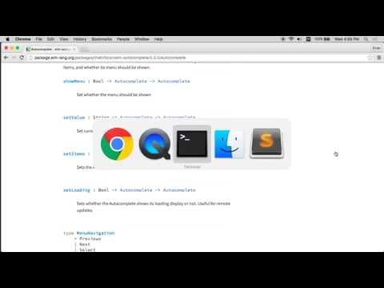

# 扩展 Elm 架构

# 扩展 Elm 架构

如果你来自 JavaScript，你可能会想知道“我的可重用组件在哪里？”以及“我如何在它们之间进行父子通信？”在 JavaScript 中，这些问题花费了大量时间和精力，但在 Elm 中却有所不同。**我们不是用可重用组件来思考。** 相反，我们专注于可重用的*函数*。毕竟它是一种函数式语言！

因此，本章将通过几个示例来展示我们如何通过拆分辅助函数来显示我们的数据来创建**可重用视图**。我们还将学习 Elm 的*模块系统*，它可以帮助您将代码分解为多个文件并隐藏实现细节。这些是使用 Elm 构建大型应用程序的核心工具和技术。

最终，我认为我们得到的东西比“可重用组件”更灵活、更可靠，并且没有真正的诀窍。我们只会使用函数式编程的基本工具！

# 带标签的复选框

# 带标签的复选框

* * *

#### 在[在线编辑器](http://elm-lang.org/examples/checkboxes)中跟随。

* * *

您的应用程序可能会有一些用户可以操作的选项。如果发生了某事，您应该发送给他们电子邮件通知吗？如果他们遇到视频，它应该自动播放吗？那种东西。所以你需要创建这样的 HTML：

```
<fieldset>
  <label><input type="checkbox">Email Notifications</label>
  <label><input type="checkbox">Video Autoplay</label>
  <label><input type="checkbox">Use Location</label>
</fieldset> 
```

那样可以让人们切换复选框，并且使用 `<label>` 意味着他们可以点击更大的区域。让我们编写一个 Elm 程序来管理所有这些交互！像往常一样，我们会猜测我们的 `Model`。我们知道我们需要跟踪用户的设置，所以我们会把它们放在我们的模型中：

```
type alias Model =
  { notifications : Bool
  , autoplay : Bool
  , location : Bool
  } 
```

从那里开始，我们将想要弄清楚我们的消息和更新函数。也许是这样的：

```
type Msg
  = ToggleNotifications
  | ToggleAutoplay
  | ToggleLocation

update : Msg -> Model -> Model
update msg model =
  case msg of
    ToggleNotifications ->
      { model | notifications = not model.notifications }

    ToggleAutoplay ->
      { model | autoplay = not model.autoplay }

    ToggleLocation ->
      { model | location = not model.location } 
```

看起来不错。现在来创建我们的视图！

```
view : Model -> Html Msg
view model =
  fieldset []
    [ label []
        [ input [ type_ "checkbox", onClick ToggleNotifications ] []
        , text "Email Notifications"
        ]
    , label []
        [ input [ type_ "checkbox", onClick ToggleAutoplay ] []
        , text "Video Autoplay"
        ]
    , label []
        [ input [ type_ "checkbox", onClick ToggleLocation ] []
        , text "Use Location"
        ]
    ] 
```

这并不太疯狂，但我们有点重复自己。我们如何使我们的 `view` 函数更好看呢？如果你来自 JavaScript，你的第一反应可能是我们应该创建一个“带标签的复选框组件”，但创建一个辅助函数更容易！这是带有 `checkbox` 辅助函数的 `view` 函数：

```
view : Model -> Html Msg
view model =
  fieldset []
    [ checkbox ToggleNotifications "Email Notifications"
    , checkbox ToggleAutoplay "Video Autoplay"
    , checkbox ToggleLocation "Use Location"
    ]

checkbox : msg -> String -> Html msg
checkbox msg name =
  label []
    [ input [ type_ "checkbox", onClick msg ] []
    , text name
    ] 
```

现在我们有了一个高度可配置的 `checkbox` 函数。它需要两个参数来配置它的工作方式：点击时产生的消息和要显示在复选框旁边的一些文本。现在，如果我们决定所有复选框都要有特定的`class`，我们只需在 `checkbox` 函数中添加它，它就会出现在所有地方！这就是 Elm 中**可重用视图**的本质。创建辅助函数！

## 将可重用视图与可重用组件进行比较

现在我们有足够的信息来简单比较这些方法。可重用视图比组件具有几个主要优势：

+   **这只是函数。** 我们在这里没有做任何特殊的事情。函数拥有我们需要的所有能力，而且它们非常简单易懂。这是 Elm 的最基本构建块！

+   **没有父子通信。** 如果我们制作了一个“复选框组件”，我们将不得不找出如何同步复选框组件中的状态与我们的整体模型。“那个复选框显示通知已打开，但模型显示它们已关闭！”也许现在我们需要一个 Flux 存储？通过使用函数，我们能够在视图中实现重用，*而不会*干扰我们的`Model`或`update`。它���的工作方式与以前完全相同，无需修改它们！

这意味着我们可以始终创建可重用的`view`代码，而不改变我们的整体架构或引入任何花哨的想法。只需编写更小的函数。听起来不错，但让我们看一些更多的例子来确保它是真实的！

# 单选按钮

# 单选按钮

* * *

#### 在[在线编辑器](http://elm-lang.org/examples/radio-buttons)中跟随。

* * *

假设你有一个主要关于阅读的网站，就像这个指南！您可能希望有一种方法来选择小号、中号和大号字体，以便读者可以根据自己的喜好进行自定义。在这种情况下，您将需要一些类似这样的 HTML：

```
<fieldset>
  <label><input type="radio">Small</label>
  <label><input type="radio">Medium</label>
  <label><input type="radio">Large</label>
</fieldset> 
```

就像上一页复选框示例中一样，这将让人们选择他们想要的选项，并且使用`<label>`意味着他们可以点击的区域更大。和往常一样，我们从我们的`Model`开始。这个有点有趣，因为我们可以使用联合类型使其非常可靠！

```
type alias Model =
  { fontSize : FontSize
  , content : String
  }

type FontSize = Small | Medium | Large 
```

这意味着有三种可能的字体大小：`Small`、`Medium`和`Large`。在我们的`fontSize`字段中不可能有任何其他值。如果您来自 JavaScript，您知道它们的替代方法是使用字符串或数字，只是希望永远不会出现拼写错误或错误。您*可以*在 Elm 中使用类似的值，但为什么要无缘无故地为自己引入错误呢？！

> **注意：** 您应该始终寻找使用联合类型的机会。避免无效状态的最佳方法是首先使其不可能表示！

好了，现在我们需要`update`我们的模型。在这种情况下，我们只想在用户切换单选按钮时在字体大小之间切换：

```
type Msg
  = SwitchTo FontSize

update : Msg -> Model -> Model
update msg model =
  case msg of
    SwitchTo newFontSize ->
      { model | fontSize = newFontSize } 
```

现在我们需要描述如何在屏幕上显示我们的`Model`。首先让我们看看将所有代码放在一个函数中并重复自己很多次的情况：

```
view : Model -> Html Msg
view model =
  div []
    [ fieldset []
        [ label []
            [ input [ type_ "radio", onClick (SwitchTo Small) ] []
            , text "Small"
            ]
        , label []
            [ input [ type_ "radio", onClick (SwitchTo Medium) ] []
            , text "Medium"
            ]
        , label []
            [ input [ type_ "radio", onClick (SwitchTo Large) ] []
            , text "Large"
            ]
        ]
    , section [] [ text model.content ]
    ] 
```

那有点混乱！最好的做法是开始制作辅助函数（而不是组件！）。我们在单选按钮中看到一些重复，所以我们将从那里开始。

```
view : Model -> Html Msg
view model =
  div []
    [ fieldset []
        [ radio (SwitchTo Small) "Small"
        , radio (SwitchTo Medium) "Medium"
        , radio (SwitchTo Large) "Large"
        ]
    , section [] [ text model.content ]
    ]

radio : msg -> String -> Html msg
radio msg name =
  label []
    [ input [ type_ "radio", onClick msg ] []
    , text name
    ] 
```

现在我们的`view`函数要容易阅读得多。太棒了！

如果这是您页面上唯一的一组单选按钮，那么您已经完成了。但也许您有几组单选按钮。例如，这个指南不仅可以让您设置字体大小，还可以设置颜色方案以及是否使用衬线或无衬线字体。每个都可以实现为一组单选按钮，因此我们可以进行更多的重构，就像这样：

```
view : Model -> Html Msg
view model =
  div []
    [ viewPicker
        [ ("Small", SwitchTo Small)
        , ("Medium", SwitchTo Medium)
        , ("Large", SwitchTo Large)
        ]
    , section [] [ text model.content ]
    ]

viewPicker : List (String, msg) -> Html msg
viewPicker options =
  fieldset [] (List.map radio options)

radio : (String, msg) -> Html msg
radio (name, msg) =
  label []
    [ input [ type_ "radio", onClick msg ] []
    , text name
    ] 
```

所以，如果我们想让用户选择颜色方案或切换衬线字体，`view`可以为每种情况重用`viewPicker`。如果我们这样做，可能需要向`viewPicker`函数添加额外的参数。如果我们想在每个`<fieldset>`上设置一个类，我们可以添加一个类似这样的参数：

```
viewPicker : String -> List (String, msg) -> Html msg
viewPicker pickerClass options =
  fieldset [ class pickerClass ] (List.map radio options) 
```

或者，如果我们想要更多的灵活性，我们可以让用户传入任何他们想要的属性，就像这样：

```
viewPicker : List (Attribute msg) -> List (String, msg) -> Html msg
viewPicker attributes options =
  fieldset attributes (List.map radio options) 
```

如果我们想要更多的灵活性，我们可以让用户为每个单选按钮传入属性！真的没有什么是不能配置的。你只需在参数中添加一点额外的信息。

## 复用过度？

在这种情况下，我们看到了写相同代码的几种方式。但哪种方式是*正确*的方式呢？选择 API 的一个好规则是**选择做到你所需的一切的绝对最简单的东西**。以下是一些测试这个规则的场景：

1.  页面上只有一个单选按钮。在这种情况下，只需制作它们！不要担心为单选按钮制作一个高度可配置和可重用的函数。在 Elm 中重构很容易，所以在真正需要之前等待！

1.  页面上有几个单选按钮，都具有相同的样式。这就是本指南上选项的外观。这是共享视图函数的一个很好的案例。你甚至可能不需要更改任何类或添加任何自定义属性。如果你不需要，就不要为其设计！稍后可以轻松添加。

1.  页面上有几个单选按钮，但它们非常不同。你可以创建一个非常灵活的选择器，让你配置一切，但在某个时候，看起来*相似*的东西实际上并不足够相似，以至于这样做不值得。所以，如果你发现自己有大量复杂的参数配置视图函数，你可能过度复用了。我个人更喜欢有两个*相似*的视图代码块，它们都简单易变，而不是一个复杂难以理解的视图代码块。

关键是，这里没有魔法配方。答案将取决于你的应用程序的具体情况，你应该始终尝试找到最简单的方法。有时这意味着共享代码。有时意味着编写*相似*的代码。要想做到这一点需要练习和经验，所以不要害怕尝试寻找更简单的方法！

# 模块

# 模块

在最近几节中，我们学会了如何创建可重用的视图。每当你在`view`代码中看到一种模式时，你可以将其拆分为一个辅助函数。但到目前为止，我们只是让我们的文件变得越来越长。然而，在某个时候，这种情况会失控，我们不希望有 2000 行的文件！

因此，Elm 有*模块*来帮助您以一种良好的方式扩展代码库。在最基本的层面上，模块允许您将代码分解为多个文件。就像 Elm 中的其他所有内容一样，只有在您感觉*需要*时才应该使用更复杂的工具。因此，如果您有一个 400 行的文件，并注意到一堆代码都与以某种方式显示单选按钮有关，将相关函数和类型移动到自己的模块中可能是一个好主意。

在深入讨论如何*适当地*使用模块之前，让我们先学习如何使用它们！

## 定义模块

每个模块都以*模块声明*开始。所以，如果我想定义自己版本的`Maybe`模块，我可能会从这样开始：

```
module Optional exposing (..)

type Optional a = Some a | None

isNone : Optional a -> Bool
isNone optional =
  case optional of
    Some _ ->
      False

    None ->
      True 
```

这里的新东西是第一行。您可以将其解读为“此模块命名为`Optional`，并向使用该模块的人公开*所有内容*。”

对于原型设计和探索来说，暴露所有内容是可以的，但是一个严肃的项目会希望使暴露的值明确，就像这样：

```
module Optional exposing ( Optional(..), isNone ) 
```

将其解读为“此模块命名为`Optional`，并向使用该模块的人公开`Optional`类型、`Some`和`None`构造函数以及`isNone`函数。”现在没有理由列出*定义的所有内容，所以稍后我们将看到如何使用它来隐藏实现细节。

> **注意：** 如果您忘记添加模块声明，Elm 将使用以下内容代替：
> 
> ```
> module Main exposing (..) 
> ```
> 
> 这对于初学者在一个文件中工作会更容易。他们不应该在第一天就面对模块系统！

## 使用模块

好的，我们有了`Optional`模块，但我们如何使用它呢？我们可以在文件顶部创建`import`声明，描述所需的模块。所以，如果我们想要在代码中明确“无鞋、无衬衫、不提供服务”的政策，我们可以这样写：

```
import Optional

noService : Optional.Optional a -> Optional.Optional a -> Bool
noService shoes shirt =
  Optional.isNone shoes && Optional.isNone shirt 
```

`import Optional`行意味着只要在其前面加上`Optional.`，就可以使用模块公开的任何内容。因此，在`noService`函数中，您会看到`Optional.Optional`和`Optional.isNone`。这些被称为*限定*名称。哪个`isNone`？来自`Optional`模块的那个！代码中就写着。

通常，最好始终使用限定名称。在一个有二十个导入的项目中，能够快速看到值来自哪里非常有帮助���

也就是说，有几种定制导入的方法可能会派上用场。

### 作为

您可以使用`as`关键字提供一个更短的名称。继续使用`Optional`模块，我们可以将其缩写为`Opt`，就像这样：

```
import Optional as Opt

noService : Opt.Optional a -> Opt.Optional a -> Bool
noService shoes shirt =
  Opt.isNone shoes && Opt.isNone shirt 
```

现在我们可以引用`Opt.Optional`和`Opt.isNone`。在这种情况下，这样做很好，但这个特性最适合用于非常长的模块名称。像这样的情况：

```
import Facebook.News.Story as Story 
```

每次我们需要从中获取函数时，键入整个模块名称会很烦人，因此我们将其缩短为一个清晰和有帮助的名称。

### 暴露

您还可以使用`exposing`关键字将模块的内容*无需*限定符地引入。有时你会看到这样的东西：

```
import Optional exposing (Optional)

noService : Optional a -> Optional a -> Bool
noService shoes shirt =
  Optional.isNone shoes && Optional.isNone shirt 
```

这样，你就可以直接引用`Optional`类型，但仍然需要说`Optional.isNone`和`Optional.None`来访问模块中其他暴露的所有内容。

此`exposing`关键字的工作方式与模块声明中的方式相同。如果你想暴露你使用的所有内容，你会说`exposing (..)`。如果你想明确地暴露所有内容，你会说`exposing ( Optional(..), isNone )`。

## 混合使用

可以同时使用`as`和`exposing`。你可以这样写：

```
import Optional as Opt exposing (Optional)

noService : Optional a -> Optional a -> Bool
noService shoes shirt =
  Opt.isNone shoes && Opt.isNone shirt 
```

无论你选择如何`import`一个模块，你只能引用该模块公开的类型和值。你可能只能看到一个模块的函数，而不是二十个。这取决于模块的作者！

## 构建具有多个模块的项目

我们现在知道 Elm 代码是什么样的，但是如何让`elm-make`识别我们的模块呢？

每个 Elm 项目都有一个位于其根目录的`elm-package.json`文件。它看起来像这样：

```
{
    "version": "1.0.0",
    "summary": "helpful summary of your project, less than 80 characters",
    "repository": "https://github.com/user/project.git",
    "license": "BSD3",
    "source-directories": [
        "src",
        "benchmarks/src"
    ],
    "exposed-modules": [],
    "dependencies": {
        "elm-lang/core": "4.0.2 <= v < 5.0.0",
        "elm-lang/html": "1.1.0 <= v < 2.0.0"
    },
    "elm-version": "0.17.0 <= v < 0.18.0"
} 
```

对我们来说有两个重要部分：

+   `"source-directories"` — 这是 `elm-make` 将搜索的所有目录的列表，以查找模块。说`import Optional`意味着`elm-make`将搜索`src/Optional.elm`和`benchmarks/src/Optional.elm`。注意，模块的名称必须与文件名完全匹配。

+   `"dependencies"` — 这列出了你依赖的所有[社区包](http://package.elm-lang.org/)。说`import Optional`意味着`elm-make`还将搜索[`elm-lang/core`](http://package.elm-lang.org/packages/elm-lang/core/latest/)和[`elm-lang/html`](http://package.elm-lang.org/packages/elm-lang/html/latest/)包中命名为`Optional`的模块。

通常，你会说`"source-directories": [ "src" ]`并设置你的项目如下：

```
my-project/elm-package.json
my-project/src/Main.elm
my-project/src/Optional.elm 
```

当你想编译你的`Main.elm`文件时，你会说：

```
cd my-project
elm-make src/Main.elm 
```

通过这种设置，`elm-make`将准确地知道在哪里找到`Optional`模块。

> **注意:** 如果你想要更复杂的 Elm 代码目录结构，你可以使用像`Facebook.Feed.Story`这样的模块名称。该模块需要位于`Facebook/Feed/Story.elm`文件中，以便文件名与模块名匹配。

# 更多

# 更多

现在，本节简要介绍了**可重用视图**。不是考虑组件，而是创建简单的函数，并通过传递参数进行配置。你可以通过查看以下项目来看到这种情况的最极端版本：

+   [`evancz/elm-sortable-table`](https://github.com/evancz/elm-sortable-table)

+   [`thebritican/elm-autocomplete`](https://github.com/thebritican/elm-autocomplete)

`elm-sortable-table`的 README 提供了如何使用这些 API 以及它们为什么设计成这样的一些很好的指导。你也可以观看 API 设计会话，Greg 和我在那里为`elm-autocomplete`设计了一个 API：



[视频链接](http://youtube.com/watch?v=KSuCYUqY058)

我们讨论了很多设计考虑因素，这些因素涉及到这样的 API。一个很重要的观点是，你不应该期望为你的应用程序中的每一件事都做得像这样复杂！截至目前，NoRedInk 有超过 30,000 行的 Elm 代码，只有一两个实例他们认为设计成这样复杂是有意义的。

希望这些资源能够在你编写越来越大的程序时给你指引！

> **注意：** 我计划在这一部分填充更多关于扩展你的`Model`和`update`函数的示例。尽管大致上是相同的想法。如果你发现自己在重复，也许可以拆分一些东西。如果一个函数变得太大，可以制作一个辅助函数。如果你发现相关的东西，也许可以将它们移动到一个模块中。但最终，如果你让事情变得庞大了，也不是什么大问题。Elm 非常擅长发现问题并使重构变得容易，因此如果你的`Model`中有大量条目，也不会成为什么大问题，因为似乎没有更好的方法将它们拆分开来。我将会写更多关于这个的内容！
