# 物联网

# 物联网

> 连接到互联网的设备，整合更强大的计算能力，并使用数据分析提取有意义的信息...
> 
> 计算的演变，设备连接到互联网，产生越来越多的数据，将计算能力整合到设备端到端，使用数据分析从它们产生的所有数据中提取信息。
> 
> 有时物联网被称为工业物联网，一切互联网（IoE）或工业 4.0。英特尔将物联网定义为连接到互联网的设备，整合更强大的计算能力，并使用数据分析提取有价值的信息。

+   [维基百科物联网](https://en.wikipedia.org/wiki/Internet_of_Things)

+   [Postscapes 物联网技术](http://postscapes.com/internet-of-things-technologies)

+   [Postscapes 物联网资源](http://postscapes.com/internet-of-things-resources)

+   [嵌入式 2014 年十大嵌入式物联网设计文章和论文](http://www.embedded.com/electronics-news/4438080/2014-s-Top-Ten-Embedded-IoT-Design-Articles-and-Papers)

+   [Stanfy 3 种物联网设备软件架构](https://stanfy.com/blog/3-types-of-software-architecture-for-connected-devices/)

+   [Slashdot 物联网、MinnowBoard 及其在宇宙中的位置（视频）](https://hardware.slashdot.org/story/15/08/24/1856256/the-iot-the-minnowboard-and-how-they-fit-into-the-universe-video)

+   [理解物联网](http://internetofthingswiki.com/internet-of-things-definition/)

+   [物联网真正的价值所在](http://www.cio.com/article/3082584/internet/where-the-real-value-of-iot-resides.html)

+   虚拟化物联网开发环境缩短设计时间

+   [我的第一个物联网项目：企业指南](http://www.computerweekly.com/feature/My-first-IoT-project-A-guide-for-businesses)

来自[IoT，互操作性和国际化，Libelium 成功的关键](https://www.youtube.com/watch?v=O--RnEVMFVw)

+   **使能**以前无法实现的事情

+   **惊艳**打破你不应该承担的限制

+   **民主化**本不应该面向所有人的技术

+   **改变**行为

+   **解决**人类的重大问题

# 例子

# 例子

+   你能想到一个被禁用物联网的例子吗？

+   你能想到同一个例子现在被物联网启用了吗？

+   你能再举一个物联网解决方案的例子吗？

# 联盟

# 联盟

# AllSeen 联盟

> 连接。贡献。合作。AllSeen 联盟是一个跨行业联盟，致力于实现组成物联网的数十亿设备、服务和应用程序的互操作性。

[AllSeen 联盟主页](https://allseenalliance.org/)

# 开放互连联盟

> 提供行业标准和开源解决方案。开放互连联盟致力于提供一个规范、一个开源实现和一个用于无线连接设备的认证计划。

[开放互连联盟主页](http://openinterconnect.org/)

# 开放互联基金会

> OCF 将前开放互连联盟（OIC）的全部内容与各级领先公司（硅片、软件、平台和成品）统一起来，致力于提供物联网解决方案的关键互操作性元素。
> 
> 数十亿连接设备（设备、手机、计算机和传感器）应该能够彼此通信，而不受制造商、操作系统、芯片组或物理传输方式的限制。开放互联基金会（OCF）正在创建一个规范并赞助一个开源项目，以实现这一目标。OCF 将释放物联网市场的巨大机遇，加速行业创新，并帮助开发人员和公司创建符合单一开放规范的解决方案。OCF 将帮助确保消费者、企业和行业的安全互操作性。
> 
> OCF 将前开放互连联盟（OIC）的全部内容与各级领先公司（硅片、软件、平台和成品）统一起来，致力于提供物联网解决方案的关键互操作性元素。OCF 赞助了 IoTivity 开源项目，其中包括我们规范的参考实现，可在 Apache 2.0 许可下使用。OCF 还包括以前由 UPnP 论坛赞助的所有活动。

+   [开放互联基金会主页](http://openconnectivity.org/)

+   [英特尔和高通之间的和平对物联网意味着什么](http://arc.applause.com/2016/02/22/open-connectivity-foundation-ocf-intel-qualcomm/)

+   [另一个物联网组织？OCF 可能真的是让一切运转的关键](http://www.pcworld.com/article/3035140/another-iot-group-ocf-may-really-be-the-one-to-make-it-all-work.html)

# 物联网联盟

> 连接现实的公司。通过消费者研究和市场教育推动物联网产品和服务的采用。

[物联网联盟主页](http://iofthings.org/#home)

# 工业互联网联盟

> 工业互联网联盟是一个开放会员制、国际非营利性联盟，为工业互联网的架构框架和方向设定了基础。该联盟由 AT&T、思科、GE、IBM 和英特尔于 2014 年 3 月创立，其使命是协调庞大的生态系统倡议，使用共同的架构、互操作性和开放标准将物体与人、流程和数据连接和整合。

[工业互联网联盟主页](http://www.iiconsortium.org/)

# 开放移动联盟

> OMA 设备管理是由开放移动联盟（OMA）设备管理（DM）工作组和数据同步（DS）工作组指定的设备管理协议。目前批准的 OMA DM 规范是版本 1.2.1，对该版本的最新修改发布于 2008 年 6 月。维基百科

+   [OMA 主页](http://openmobilealliance.org/)

# HomeKit

> HomeKit。安全地控制您的家。就在您的手掌之中。您每天都使用 iPhone — 与人保持联系、保持组织、帮助管理健康和健身，甚至替代您的钱包。有了 HomeKit，现在您还可以使用 iOS 设备连接您家中使用的产品 — 这样您可以私密安全地控制它们并使它们协同工作。

+   [HomeKit 主页](http://www.apple.com/ios/homekit/)

# 开放地理空间联盟

> OGC（开放地理空间联盟）SensorThings API 是一个提供开放和统一的方式在网络上互联物联网设备、数据和应用的 OGC 候选标准。

+   OGC（开放地理空间联盟）SensorThings API 

# FIT 联盟

> FIT 由五所高等教育和研究机构联合组成，致力于为企业、科研人员和教育工作者提供网络计算通信测试平台。[FIT 联盟](https://www.iot-lab.info/about-us/)

# 资源

# 资源

+   [深圳：创客运动，硬件的硅谷](https://embeddedday.com/2016/06/15/shenzhen-the-maker-movement/)

+   [物联网分析主页](https://iot-analytics.com/)

+   [物联网分析 Youtube](https://www.youtube.com/user/IoTAnalytics)

+   [物联网工具包 +101 资源指南 #IoT](http://postscapes.com/internet-of-things-resources/)

+   [物联网市场](https://www.the-iot-marketplace.com/)

# 架构

# 架构

# 区块链

+   [区块链基础：企业分类账介绍](http://www.ibm.com/developerworks/cloud/library/cl-blockchain-basics-intro-bluemix-trs/index.html)

+   [区块链对物联网的意义](https://www.ibm.com/blogs/internet-of-things/watson-iot-blockchain/)

# 网络

+   传统网络 / 进化网络

    +   物理连接 / API

    +   定制硬件 / 软件定义

    +   手动部署 / 虚拟化和弹性

# 云和分析

+   [如何选择您的物联网平台架构？](http://linkis.com/financialexpress.com/Lfnp2)

+   [物联网：构建物联网项目的 4 个免费平台](http://www.survivingwithandroid.com/2015/12/comparing-iot-platforms.html?_utm_source=1-2-2)

+   [Gadgedtronicx 十大最佳物联网软件平台](http://www.gadgetronicx.com/10-best-iot-software-platforms/)

+   [InitialState 12 个最佳物联网平台](http://blog.initialstate.com/iot-platforms)

+   [最佳物联网平台](http://www.andthinker.com/2016/06/top-iot-platforms.html)

+   [物联网平台前十名](http://internetofthingswiki.com/top-10-iot-platforms/634/)

    +   [亚马逊网络服务（AWS）物联网](https://youtu.be/OvoIh9ENxdM)

    +   [微软 Azure IoT](https://youtu.be/1RmUO3xWqJE)

    +   ThingWorx 物联网平台

    +   [IBM Watson IoT](https://youtu.be/SPPFfxl3nXo)

    +   Cisco IoT 云连接

    +   [Salesforce 物联网云](http://www.salesforce.com/in/iot-cloud/)

    +   [Carriots](https://youtu.be/pVvNdgxTqyA)

    +   [Oracle 集成云](https://youtu.be/Ba-nSVr62DU)

    +   [通用电气的 Predix](https://youtu.be/Sg3WhdY0Jb0)

    +   [Kaa](http://www.kaaproject.org/download-kaa/)

# 平台

[物联网平台：巨大物联网平台的争夺战](http://www.forbes.com/sites/sarwantsingh/2016/07/14/the-platform-of-things-the-mega-iot-platforms-land-grab/#1898088d10d3)

# 奖项

# 奖项

+   [最佳物联网软件和工具](http://iotawards.postscapes.com/2015-16/best-iot-software-and-tools)

+   [开源项目](http://postscapes.com/internet-of-things-award/open-source/)

# 比赛

# 比赛

+   [Hackster 挑战](https://www.hackster.io/challenges)

+   [Eclipse IoT 挑战赛](http://iot.eclipse.org/open-iot-challenge/)

# 活动

# 活动

+   [开放物联网峰会视频！](http://events.linuxfoundation.org/events/openiot-summit)

+   [物联网日](http://iotday.org/about/)

+   [物联网活动](http://www.iotevents.org/)

+   [2016 物联网企业峰会](https://www.iotuniversity.com/iot-summit-2016/)

+   [IBM Interconnect 2016](http://www.ibm.com/cloud-computing/us/en/interconnect/)

+   [物联网解决方案世界大会](https://www.youtube.com/channel/UCjO1v0QygtzLWAlmt1_l_rA)

+   [2016 年的 10 个物联网事件](http://www.theneura.com/10-iot-events-in-2016/)

+   [开放物联网峰会](http://events.linuxfoundation.org/events/openiot-summit)

+   [工业物联网大会](http://www.iiotcongress.com)

+   [石油和天然气行业的物联网](http://energyconferencenetwork.com/iot-in-oil-and-gas-2016/)

+   io 硬件安全会议与培训

+   [物联网智能峰会](http://www.iotsmartsummitlondon.com)

+   [工业互联网峰会](http://www.iotsmartsummitlondon.com/industrial-internet.html)

+   [智能家居峰会](http://www.iotsmartsummitlondon.com/smart-home.html)

+   [智能城市峰会](http://www.iotsmartsummitlondon.com/smart-cities.html)

+   [博世连接世界芝加哥](https://www.bosch-si.com/lp/bosch-connectedworld.html)

+   [IEEE 物联网](http://iot.ieee.org/conferences-events.html)

+   [国际物联网、大数据和安全会议](http://www.iotbd.org/)

+   [IEEE 国际物联网设计与实施会议](http://conferences.computer.org/IoTDI/)

+   [2016 年物联网和大数据国际会议 - IoTBD 2016](http://internetofthingswiki.com/international-conference-on-internet-of-things-and-big-data-iotbd-2016/591/)

# 投资者

# 投资者

+   [你应该了解的顶级物联网投资者](http://internetofthingswiki.com/top-iot-investors-you-should-know-about/849/)

# 工作角色

# 工作角色

+   [英特尔、SAP 实验室和 IBM 物联网提供的特定技术工作角色需求：TimesJobs 调查](http://economictimes.indiatimes.com/jobs/Intel-SAP-Labs-and-IBM-IoT-offer-specific-tech-job-roles-in-demand-TimesJobs-survey/articleshow/47553266.cms)

+   [工业物联网创建的前 5 个新工作](http://iot-analytics.com/top-5-new-industrial-iot-jobs/)

+   [随着物联网的普及，对数据可视化等技术技能的需求不断增加](http://www.computerweekly.com/news/450300350/Internet-of-things-increases-demand-for-tech-skills)

+   [物联网工作](https://www.iotjobs.eu/)

+   [如何成为物联网应用程序开发人员](https://www.rcrwireless.com/20160722/fundamentals/iot-app-developer-tag31-tag99)

+   [成为物联网开发人员](https://www.linkedin.com/pulse/becoming-iot-developer-alok-batra?forceNoSplash=true)

# 人员

# 人员

+   [你应该认识的顶级物联网专家](http://internetofthingswiki.com/top-iot-experts-you-should-know/886/)

+   [云社交影响力百强](https://www.rise.global/the-cloud-social-influencers-power-100/r/2448508)

+   [2015 年的最终个人报告](https://www.comparethecloud.net/cloudinfluence/december-top-50-cloudinfluence-individuals/)

# 编程语言

# 编程语言

+   [11 个值得了解的物联网编程语言](http://www.informationweek.com/mobile/mobile-applications/11-iot-programming-languages-worth-knowing/d/d-id/1319375)

+   [你必须了解的物联网编程语言](http://internetofthingswiki.com/iot-programming-languages-you-must-know/178/)

    +   C

    +   C++

    +   Python

    +   Java

    +   Javascript

    +   Go

    +   Rust

    +   降落伞

    +   B#

    +   汇编语言

# 项目

# 项目

> 在这里，我们列出了用于开发物联网应用程序的最广泛使用和可靠的 100 个开源工具。我们已经尽力包括物联网硬件平台、开发工具、软件、集成工具、操作系统和监控工具。 [100 个物联网开源开发工具和资源](http://internetofthingswiki.com/100-iot-open-source-development-tools-and-resources/422/)

+   [物联网的开源项目](https://github.com/OpenIotOrg/openiot)

+   [物联网的开源云解决方案](http://www.openiot.eu/)

+   [物联网中一些开源项目是什么？](https://www.quora.com/What-are-some-of-the-open-source-projects-in-IoT)

# 标准

# 标准

+   [功能安全和 IEC 61508](http://www.iec.ch/functionalsafety/)

+   [ISO 26262](https://en.wikipedia.org/wiki/ISO_26262)

# 趋势

# 趋势

+   [超低功耗计算将改变一切的原因](http://rebootingcomputing.ieee.org/archived-articles-and-videos/general/why-ultra-low-power-computing-will-change-everything)

+   [现实编辑器](http://www.realityeditor.org/)

+   [开放混合](http://www.openhybrid.org/)

+   [2016 年物联网趋势](http://internetofthingswiki.com/iot-trends-in-2016/300/)

+   [CES 2016 为物联网带来了什么](http://internetofthingswiki.com/ces-2016-promotes-internet-of-things/387/)

+   [弗雷斯特 2016 年：首席信息官和首席营销官必须团结起来，立即引领以客户为中心的变革](http://blogs.forrester.com/cliff_condon/15-10-21-2016_cios_and_cmos_must_rally_to_lead_customer_obsessed_change_now)

+   [区块链将推动自动驾驶汽车、无人机、机器人和 3D 打印机的 M2M 经济](http://www.ibtimes.co.uk/will-banks-catch-curve-machine-machine-economy-1570836)

    +   “今天我们有两类客户，个人和企业。随着机器对机器经济的兴起，机器的新客户群正在形成。”

+   [加特纳 2017 年和 2018 年物联网前 10 种技术](http://www.forbes.com/sites/louiscolumbus/2016/02/28/gartners-top-10-internet-of-things-technologies-for-2017-2018/#3e17f2741678)

+   [这是当前物联网中最热门的 10 大趋势](http://linkis.com/businessinsider.com/HH7ap)

+   [云影响力](https://www.comparethecloud.net/cloudinfluence/)

    +   2016 年 1 月全球 #云计算 影响力组织排名

    +   目前 #云计算 和 #大数据 的趋势是什么？

    +   十二月份全球 #云计算 影响力前 50 名个人

# 培训

# 培训

+   [物联网大学](https://www.iotuniversity.com)

+   [物联网学院](http://axelta.com/AxAcademy.php)

+   [PTC 物联网学术](http://www.thingworx.com/Academics)

+   [Eduvance](https://www.eduvance.in/)

+   [物联网教育的未来](http://events.linuxfoundation.org/sites/events/files/slides/The%20future%20of%20IoT%20education.pdf)

+   [2015 年收益前 15 名认证](http://www.crn.com/slide-shows/security/300075805/top-15-moneymaking-certifications-for-2015.htm/pgno/0/1)

+   [物联网百科](https://twitter.com/iot_wiki)

+   [在线（大多数免费！）物联网课程你应该知道-第 1 部分共 6 部分](http://internetofthingswiki.com/online-free-iot-courses-you-should-know-1/701/)

+   [物联网执行手册](http://www.iot-executive-handbook.com/)

+   [深圳电子必备指南](https://www.crowdsupply.com/sutajio-kosagi/the-essential-guide-to-electronics-in-shenzhen)

+   [物联网 101 工作坊](http://www.remotemagazine.com/internetofthings/conference-workshop/)

+   [开源物联网](https://www.eclipsecon.org/na2016/session/open-source-internet-things-101)

+   [物联网 101 - 在线自学](http://www.greycampus.com/internet-of-things-101)

+   [无线 101：什么是物联网？](https://www.youtube.com/watch?v=07MZVjjuLKw)

+   [硬件学院](http://www.hardwareacademy.io/)

+   [Exp-Lab 物联网培训](http://exp-lab-solutions.com/)

+   [物联网 | 乔丹·达菲 | TEDx 南岸](https://www.youtube.com/watch?v=mzy84Vb_Gxk)

+   [动手实操技术培训](http://conference.hitb.org/hitbsecconf2016ams/training/)

+   [物联网人才联盟旨在培训到 2020 年的一百万物联网从业者](http://www.iotaustralia.org.au/2015/12/09/iotnewsglobal/iot-talent-consortium-aims-to-train-one-million-ioters-by-2020/)

+   [构建物联网](http://www.buildinginternetofthings.com/)

+   [Actual Tech Media](http://www.actualtechmedia.com/)

# 物联网人才联盟

> 加入世界上唯一一个推动物联网人才创新的倡议。物联网人才联盟于 2014 年的物联网世界论坛上首次提出，并于 2015 年作为行业非营利组织成立。[主页](https://www.iottalent.org/)

+   [评估测验](https://www.iottalent.org/assessment)

# 社区

+   Hackaday

+   Instructables

+   Cooking Hacks

+   [Qioto](http://www.qioto.com/blog/)

# Coursera

+   [介绍物联网和嵌入式系统](https://www.coursera.org/learn/iot/home/welcome)

    +   什么是物联网（IoT）？

    +   嵌入式系统

    +   硬件和软件

    +   网络和互联网

+   [物联网开发者指南（IoT）](https://www.coursera.org/learn/developer-iot/)

    +   课程介绍

    +   在云中进行快速应用程序开发

    +   在树莓派上进行快速应用程序开发

    +   为物联网进行低级编程

+   [新兴技术：从智能手机到物联网到大数据专业化](https://www.coursera.org/specializations/emerging-technologies)

+   [创建您自己的物联网（IoT）设备](https://www.coursera.org/specializations/iot)

+   [打造自己的物联网](https://www.coursera.org/specializations/internet-of-things)

# EdX

+   [数据科学和分析的启用技术：物联网](https://www.edx.org/course/enabling-technologies-data-science-columbiax-ds103x-0)

# 许可

# 许可

[GPL 是否是强制物联网标准化的正确方式？](http://linkis.com/bit.ly/U4ITz)

# 网站

# 网站

+   [比较云](https://www.comparethecloud.net/)

# 关键参与者

# 关键参与者

+   [Fiware](https://www.fiware.org/)

+   [互联网创新网络](http://ihub.eu/)

+   [Reekoh](https://reekoh.com/)

+   [ArcGIS](https://www.arcgis.com/features/index.html)

# 亚马逊

# 亚马逊

# 亚马逊 AWS

> AWS IoT。轻松安全地将设备连接到云。可靠地扩展到数十亿台设备和数万亿条消息。
> 
> AWS IoT 是一个托管的云平台，可让连接的设备轻松安全地与云应用程序和其他设备交互。 AWS IoT 可以支持数十亿台设备和数万亿条消息，并且可以可靠安全地处理和路由这些消息到 AWS 端点和其他设备。 使用 AWS IoT，您的应用程序可以始终跟踪和与所有设备通信，即使它们未连接。
> 
> AWS IoT 使使用 AWS 服务如 AWS Lambda、Amazon Kinesis、Amazon S3、Amazon Machine Learning 和 Amazon DynamoDB 构建物联网应用程序变得容易，这些应用程序收集、处理、分析和处理由连接设备生成的数据，而无需管理任何基础架构。

+   [AWS IoT](https://aws.amazon.com/iot/)

+   [AWS IoT 入门](https://aws.amazon.com/iot/getting-started/)

+   [AWS IoT 英特尔](https://github.com/intel-iot-devkit/aws-iot-intel)

+   [亚马逊（AMZN）是“物联网之王”吗？](http://www.zacks.stfi.re/stock/news/223210/is-amazon-amzn-the-internet-of-things-king?sf=bbowgxp#aa)

# 亚马逊物联网按钮

> AWS 物联网按钮是基于亚马逊 Dash Button 硬件的可编程按钮。 这款简单的 Wi-Fi 设备易于配置，并设计用于开发人员使用 AWS IoT、AWS Lambda、Amazon DynamoDB、Amazon SNS 等许多亚马逊网络服务开始使用，而无需编写特定于设备的代码。 [主页](https://aws.amazon.com/iot/button/)

# 苹果

# 苹果

> HomeKit。 从您的手掌中安全地控制您的家。
> 
> 您每天都使用 iPhone —— 与人保持联系、保持组织、帮助管理健康和健身，甚至替代钱包。 有了 HomeKit，现在您还可以使用 iOS 设备连接家中使用的产品 —— 这样您就可以私密安全地控制它们并使它们协同工作。
> 
> HomeKit 是一个用于与用户家中的连接配件进行通信和控制的框架。 您可以让用户在家中发现 HomeKit 配件并对其进行配置，或者您可以创建操作来控制这些设备。 用户可以将动作分组在一起，并使用 Siri 触发它们。

+   [Apple HomeKit](http://www.apple.com/ios/homekit/)

+   [Apple 开发者 HomeKit](https://developer.apple.com/homekit/)

# ARM

# ARM

> ARM 物联网解决方案。 ARM 及其合作伙伴共享一种颠覆性的愿景，即可以按规模进行商业化、基于标准的物联网设备的创建和部署。 ARM® mbed™ 物联网设备平台通过提供一个共同的平台来开发连接的物联网设备的软件生态系统，解决了这些问题。 [物联网解决方案](https://www.arm.com/products/internet-of-things-solutions/)

+   访问白皮书

+   [阅读相关博客](http://community.arm.com/groups/internet-of-things)

+   [观看视频](https://www.youtube.com/playlist?list=PLgyFKd2HIZlZNsrWXyE4kgLDo_tyLpvDW)

+   [为什么 SoftBank 要花 320 亿美元收购 ARM](https://ipv6.net/news/why-softbank-is-spending-32-billion-on-arm/)

> 物联网（IoT）是关于设备和服务提供端到端解决方案。 ARM® mbed™ 物联网设备平台是基于 ARM 微控制器创建商业化和可互操作的连接物联网设备的最快方法。

+   [mbed 物联网设备平台](https://www.arm.com/products/internet-of-things-solutions/mbed-IoT-device-platform.php)

+   [mBed 物联网平台](https://developer.mbed.org/platforms/)

> yotta 是 mbed OS 使用的软件模块系统。它负责组装您的应用程序所需的软件模块，并控制构建系统使这些模块对您可用。[yotta](https://www.mbed.com/en/development/software/mbed-yotta/)
> 
> 无论您是一名资深开发人员、ARM 合作伙伴还是刚刚开始使用 ARM，我们知道您会在社区中找到很多信息，让您持续回来获取信息、学习、提问和回答问题。[ARM Connected Community](https://community.arm.com/welcome)

# 家庭

+   Cortex-A

+   Cortex-R

+   Cortex-M

+   ARM 7

+   ARM 9

+   ARM 11

# 用例

+   物联网设备

    +   Cortex-M0

+   网关

    +   Cortex-M3

    +   Cortex-M4

    +   Cortex-A

# AT&T

# AT&T

+   [IBM Watson IoT 和 AT&T 将通过集成能力推动创新](https://developer.ibm.com/iotplatform/2016/07/13/watson-iot-and-att/)

## 新闻

+   [IBM Watson IoT 和 AT&T 将通过集成能力推动创新](https://developer.ibm.com/iotplatform/2016/07/13/watson-iot-and-att/)

+   [IBM 和 AT&T 正在密切关注物联网开发人员](http://www.pcworld.idg.com.au/article/603404/ibm-t-cozying-up-iot-developers/?__prclt=l5L91BiR)

# AT&T Foundry

[AT&T Foundry](http://about.att.com/innovationblog/040816growingiot?__493037e4=_493037e4)

# M2X

> 无缝地将您的设备连接到物联网。AT&T M2X 是一种基于云的完全托管的网络连接的物联网（IoT）设备和物联网（IoT）的时间序列数据存储服务。从卡车和涡轮机到自动售货机和货柜，M2X 使您的业务的设备能够连接和共享宝贵的数据。

+   [M2X 主页](http://developer.att.com/m2x)

+   [Github 开发人员工具和客户端库，用于 AT&T 的 M2X 物联网服务](https://github.com/attm2x)

# WebRTC

> 只需几行代码即可将您的网站转换为电话

+   [WebRTC 主页](https://developer.att.com/enhanced-webrtc)

# ARO

> 开发人员，您的应用程序速度慢且反应迟钝吗？使用 AT&T ARO 加速它。AT&T ARO 是一个屡获殊荣的跨平台工具，用于优化移动应用程序性能。使用这个免费诊断工具来提高您的应用程序的电池寿命、数据使用量和响应速度。

+   [ARO 主页](http://developer.att.com/application-resource-optimizer)

# Atari

# Atari

+   [Atari 推出智能家居设备](http://www.engadget.com/2016/05/31/atari-iot-connected-devices/)

# Axeda

# Axeda

# 博世

# 博世

+   [博世物联网](https://www.bosch-si.com/internet-of-things/iot/iot.html)

# Cisco

# Cisco

> 了解关于 Cisco IoT 系统的信息。通过部署 Cisco IoT 系统，加速您向基于物联网的智能基础设施的过渡。我们广泛的物联网基础设施技术组合帮助您连接、管理和控制以前未连接的设备。更好地保护您的物理和数字资产和数据。通过从雾到云创建和部署物联网应用程序进行创新。
> 
> 物联网。了解如何使用思科联网移动体验（CMX）API 创建和部署项目。使用 Flare、IoX/Fog 和物联网开发工具包来扩展您在物联网世界中的能力。使用大数据管理来分析、捕获、策划、搜索、分享、存储、转移、可视化和保护您的物联网数据。

+   [思科物联网](http://www.cisco.com/web/solutions/trends/iot/overview.html)

+   [Cisco 拉丁美洲博客](http://gblogs.cisco.com/la/usando-iot-para-la-administracion-inteligente-de-flotas/)

+   [ABB、博世、思科、LG 将创建家庭自动化软件标准](http://www.cepro.com/article/abb_bosch_cisco_lg_to_create_home_automation_software_standard#)

# 思科 DevNet

> DevNet 创作。展示您的创新解决方案或配方，发现其他人使用思科 API 创建的内容，并获得启发。

[思科 DevNet](https://developer.cisco.com/site/devnet/home/index.gsp)

# 思科 IOx

+   [思科 IOx DevNet 主页](https://developer.cisco.com/site/iox/)

+   [思科 IOx 入门](https://communities.cisco.com/docs/DOC-60578)

# 戴尔

# 戴尔

> 让物联网成为现实。今天。戴尔采取务实的方法来对物联网（IoT）进行建设，利用您已经拥有的设备和数据，并利用您当前的技术投资，快速而安全地启用基于分析的行动。

+   [戴尔物联网](http://www.dell.com/en-us/work/learn/internet-of-things-solutions)

+   [戴尔物联网解决方案](http://www.dell.com/learn/us/en/04/oem/oem-internet-of-things)

+   [戴尔在硅谷解决方案中心开设物联网实验室](http://www.dell.com/learn/us/en/uscorp1/press-releases/2014-09-09-dell-oem-solutions-internet-of-things-lab)

# Eclipse

# Eclipse

> 物联网的开源。物联网需要开源才能成功。Eclipse IoT 简化了物联网开发。

+   [Eclipse IoT](http://iot.eclipse.org/)

+   [Eclipse Foundation 虚拟物联网网络研讨会](https://www.youtube.com/playlist?list=PLy7t4z5SYNaQS1XZ8uiqqn0nNLi4qU-VW)

+   [Eclipse 开源物联网 101](https://www.eclipsecon.org/na2016/sites/default/files/slides/Open%20Source%20Internet%20of%20Things%20101.pdf)

# Facebook

# Facebook

# 通用电气

# 通用电气

> 世界运行在工业上，而工业则依赖于 Predix。[主页](https://www.ge.com/digital/predix)
> 
> 工业互联网：数字转型从这里开始。作为世界上第一个工业操作系统，Predix 支持现代数字工业业务，推动全球经济发展。

## 新闻

+   [GE 和 PTC 结成广泛战略联盟，追求辉煌工厂机会](http://www.ptc.com/news/2015/ge-ptc-alliance-pursue-brilliant-factory-opportunity)

+   [GE 和微软合作将 Predix 带入 Azure，加速工业客户的数字化转型](https://www.genewsroom.com/node/283086)

+   [GE 合作伙伴](http://www.ge.com/digital/partners)

# Predix 平台

> GE 的 Predix 在微软 Azure 上的强大力量。在 Predix 上构建和部署工业应用程序，与 Azure 云、Azure IoT 套件和 Cortana Intelligence 集成。
> 
> 工业互联网：数字化转型从这里开始。作为世界上第一个工业操作系统，Predix 推动着推动全球经济的现代数字工业企业。运营技术（OT）安全风险正在发生变化。更多设备连接在一起，威胁格局正在扩大。GE 的 Wurldtech 可以帮助您降低风险。[GE Predix](https://www.ge.com/digital/predix)

# 谷歌

# 谷歌

> 物联网。到 2020 年，有望有 50 亿个连接设备。谷歌云平台为您提供了扩展连接、收集和理解数据以及提供硬件设备所需的可靠客户体验的工具。

+   [谷歌物联网](https://cloud.google.com/solutions/iot/)

# Brillo

> Brillo 将软件开发的简单性和速度带到物联网的硬件上，具有嵌入式操作系统、核心服务、开发工具包和开发者控制台。

+   [谷歌 Brillo](https://developers.google.com/brillo/?hl=en)

# 物理网络

> 物理网络是释放网络核心超能力的开源方法：按需互动。人们应该能够走到任何智能设备旁 - 自动售货机、海报、玩具、公交车站、租车 - 而不必先下载应用程序。一切都应该只是一个点击之遥。[走过去��使用任何东西](https://google.github.io/physical-web/)

+   [物理网络烹饪书](http://google.github.io/physical-web/cookbook/)

# 其他

+   [谷歌全球运营商丰富通信服务合作伙伴关系](http://www.mobileworldlive.com/mwc16-articles/global-operators-google-and-gsma-strike-rcs-partnership/)

# 惠普

# 惠普

> HPE 通用物联网平台。加速、简化和连接您的物联网。[主页](http://h41111.www4.hp.com/solutions/iot/index.html)
> 
> 使用 HPE 通用物联网平台，客户可以获得一个行业、垂直和客户不可知的解决方案，具有最大的可扩展性、模块化和多功能性。这使客户能够管理其物联网解决方案，并通过将连接设备生成的大量数据货币化并提供给企业特定应用程序来提供价值。此外，垂直行业内和跨多个行业的用例都能够实现新的商业模式和收入流。

# 华为

# 华为

# 窄带物联网开放实验室

> 华为，全球领先的信息和通信技术（ICT）解决方案提供商，与 Vodafone 集团今天宣布开设一个开放的物联网实验室，致力于开发与窄带物联网（NB-IoT）技术相关的产品和应用。[新闻](http://www.vodafone.com/business/m2m/Huawei-and-Vodafone-Announce-Opening-of-Worlds-First-Narrowband-IoT-Open-Lab-2016-04-26)

+   [华为和沃达丰宣布开设全球首个窄带物联网开放实验室](http://www.huawei.com/en/news/2016/4/World-First-Narrowband-IoT-OpenLab)

# IBM

# IBM

> IBM 如何看待物联网。IBM 及其客户正在引领一个新的认知时代。IBM 沃森物联网将认知计算的力量延伸到组成物联网的数十亿个连接设备、传感器和系统。为什么？因为物联网正在测试可编程计算的极限，认知物联网是我们克服这些极限的方式。这是我们将实现我们知道既可能又必要的转型结果的方式——从运营效率到客户体验再到行业颠覆。
> 
> IBM 开设沃森物联网全球总部，将认知计算的力量延伸到一个连接的世界

+   [IBM 物联网](http://www.ibm.com/internet-of-things/)

+   [IBM 物联网新闻](http://www.ibm.com/internet-of-things/internet-of-things-news.html)

+   [IBM 物联网 ARM mbed IoT 入门套件在 IBM 的 Bluemix 云平台上](https://www.youtube.com/watch?v=lF4iuaMkSKQ)

## 新闻

+   [IBM 沃森物联网和 AT&T 将整合能力推动创新](https://developer.ibm.com/iotplatform/2016/07/13/watson-iot-and-att/)

+   [IBM 沃森物联网推出新的汽车物联网服务](https://developer.ibm.com/bluemix/2016/06/23/new-iot-for-automotive-service/?utm_source=twitterfeed&utm_medium=twitter)

+   [创建具有全球影响力的应用程序](https://developer.ibm.com/open/2016/06/24/creating-apps-with-a-global-reach/)

+   [IBM 和 AT&T 正在与物联网开发人员合作](http://www.pcworld.idg.com.au/article/603404/ibm-t-cozying-up-iot-developers/?__prclt=l5L91BiR)

+   [梅西百货与 IBM 沃森合作推出个性化购物助手](http://www-03.ibm.com/press/us/en/pressrelease/50212.wss)

    # BlueMix

> 使用 IBM Bluemix 混合云开发平台构建和运行您的应用程序，以访问来自 IBM、第三方和... 的服务和 API 目录。
> 
> Bluemix 是 IBM 开放云架构的实现，利用 Cloud Foundry 让开发人员能够快速构建、部署和管理他们的云应用程序，同时利用不断增长的可用服务和运行时框架生态系统。IBM 将根据我们广泛的软件组合向生态系统提供服务和运行时。

+   [IBM BlueMix](http://www.ibm.com/cloud-computing/bluemix/)

+   [IBM Bluemix 控制台](https://console.ng.bluemix.net/)

+   [IBM Bluemix Edison](https://developer.ibm.com/recipes/tutorials/intel-edison/)

# 沃森物联网

> 沃森物联网是一组能够从物理世界中学习并注入智能的能力。物联网生成的数据增长速度是社交和计算机生成的数据的两倍，而且极其多样化、嘈杂、时效性强，通常是保密的。随着数十亿设备在一个不断变化的世界中相互交互，复杂性增加。这带来了一个不断增长的挑战，将测试可编程计算的极限。认知物联网是我们充分利用这一资源的最佳机会。
> 
> 认知物联网并非显式编程。它通过与环境的经验和与人的互动学习。它将真正的机器学习引入系统和流程，以便它们能够理解您的目标，然后集成和分析相关数据，帮助您实现这些目标。

+   [沃森物联网](http://www.ibm.com/internet-of-things/internet-of-things-news.html)

+   [IBM 沃森物联网](http://www.ibm.com/internet-of-things/images/watson-iot-point-of-view.pdf)

# Node-RED

> 一款用于连接物联网的可视化工具。物联网解决方案通常需要以新颖而有趣的方式整合硬件设备、API 和在线服务。花在编写连接这些不同系统的样板代码上的时间，例如访问串行端口或完成针对 Twitter 的 OAuth 流程，不是用来创建解决方案的真正价值的时间。
> 
> 我们需要能够使各个层次的开发人员更容易地汇聚物理和数字事件流的不同流的工具，这些事件流构成了物联网。

+   [Node-RED 主页](http://nodered.org/?cm_mc_uid=64673275200314509946717&cm_mc_sid_50200000=1451095649)

+   [Node-RED 新闻](https://www-304.ibm.com/connections/blogs/et/entry/node-red?lang=en_us)

# 以太网物联网入门套件

> 这个 IBM 物联网基金会入门套件为用户提供了一种流畅的体验，只需打开盒子几分钟即可将传感器上的数据传送到 IBM 云端。它特别适合没有嵌入式或 Web 开发经验的开发人员，因为它提供了学习新概念和创建工作原型的平台。IBM

+   [ARM mBed IBM 套件](https://developer.mbed.org/platforms/IBMEthernetKit/)

+   [ARM mbed 物联网入门套件在 IBM 的 Bluemix 云平台上](https://www.youtube.com/watch?v=lF4iuaMkSKQ)

+   [ARM® mbed™ 物联网入门套件（第一部分）](https://developer.ibm.com/recipes/tutorials/arm-mbed-iot-starter-kit-part-1/)

+   [ARM® mbed™ 物联网入门套件（第二部分）](https://developer.ibm.com/recipes/tutorials/arm-mbed-iot-starter-kit-part-2/)

+   [ARM 将智能设备连接到云端的新世界](https://www.arm.com/about/newsroom/arm-connects-a-new-world-of-intelligent-devices-to-the-cloud.php)

# Waspmote Mote Runner 6LoWPAN 开发平台

> IBM 和 Libelium 共同努力，为传感器网络和物联网（IoT）提供独特的 IPv6 开发平台。通过在 Libelium Waspmote 传感器平台上集成 IBM Mote Runner SDK，我们为对 6LoWPAN / IPv6 连接感兴趣的开发人员和研究人员提供了一个独特而强大的工具。

+   [IBM 和 Libelium 推出物联网入门套件](https://www-03.ibm.com/press/us/en/pressrelease/42227.wss)

+   [Waspmote Mote Runner 主���](http://www.libelium.com/products/waspmote-mote-runner-6lowpan/?cm_mc_uid=64673275200314509946717&cm_mc_sid_50200000=1451095649)

# 应用程序

+   [Olli](http://meetolli.auto/)

# 英特尔

# 英特尔

+   [构建物联网团队的经验教训](https://software.intel.com/en-us/articles/building-iot-teams-lessons-learned)

+   [如何在 C++ 中使用英特尔® 物联网技术](https://software.intel.com/en-us/blogs/18-how-to-intel-iot-code-samples-now-available-in-cpp)

+   [终极编码挑战](https://ultimatecoder.intel.com/?cid=em-elq-10916&utm_source=elq&utm_medium=email&utm_campaign=10916&elq_cid=1605185&elqTrackId=43b477204f554ab8bb60202ed847d2fb&elq=82742b5aa8bc4ada99e8852d2165df0e&elqaid=10916&elqat=1&elqCampaignId=7185)

+   [在英特尔物联网架构上将项目扩展到生产规模](https://software.intel.com/en-us/blogs/2016/03/04/scaling-your-project-to-production-on-intel-iot-architecture-0)

+   [福布斯 CIO 创新奖：英特尔的 CIO 通过分析创造了 10 亿美元的价值](http://www.forbes.com/sites/peterhigh/2016/03/22/forbes-cio-innovation-award-intels-cio-drives-1-billion-of-value-through-analytics/2/#dc279f12b5d6)

# 英特尔® 物联网平台

**安全、可扩展、互操作**

> 英特尔® 物联网平台是英特尔的端到端参考模型和产品系列，与第三方解决方案合作，为设备提供无缝安全连接、将可信数据传送到云端，并通过分析提供价值。

+   [英特尔® 物联网主页](http://www.intel.com/content/www/us/en/internet-of-things/overview.html)

+   [英特尔® 智商](http://iq.intel.com/)

+   [英特尔® 物联网文档](https://software.intel.com/en-us/iot/documentation)

+   [物联网里程碑](https://software.intel.com/en-us/articles/noteworthy-iot-milestones-2015)

+   物联网概述

+   行业

+   产品

+   生态系统

+   蓝图和案例研究

+   事件

英特尔的物联网

+   安全 | 风河、英特尔安全

+   连接 | 物品、网关、网络、数据中心

+   管理 | 风河服务管理、英特尔安全、开发者资源

+   分析 | 解决方案实现

物联网构建模块

+   物品

+   网关

+   网络和云

+   服务创建和解决方案层

物联网行业

+   汽车

+   能源

+   医疗保健

+   工业

+   零售

+   智能建筑

+   智能家居

物联网资源

+   [**英特尔® 嵌入式社区**](http://embedded.communities.intel.com/community/en) 与推动物联网创新的硬件开发人员互动。

+   [**Intel Maker 社区**](https://communities.intel.com/community/makers) 用英特尔的工具和开发板拓展创造力的边界。

+   [**Intel® 嵌入式设计中心**](http://www.intel.com/content/www/us/en/embedded/embedded-design-center.html) 获取硬件和软件开发者的文档、工具、软件和支持。

+   [**Intel® 开发者计划**](https://software.intel.com/en-us/iot/home) 与软件开发者联系，构建更智能的物联网设备，创造新的商机。

+   [Intel® 软件传道者](http://evangelists.intel.com/) 获得灵感。分享你的见解。

其他链接

+   [Intel® 物联网平台：安全、可扩展、互操作](http://www.intel.com/content/www/us/en/internet-of-things/iot-platform.html)

+   [Intel® 物联网博客](http://blogs.intel.com/iot/)

+   [新的 Intel® 物联网平台使更多的“物”变得智能和连接](http://newsroom.intel.com/community/intel_newsroom/blog/2015/11/03/new-intel-iot-platform-makes-more-things-smart-and-connected)

+   [Intel® 物联网洞察日 2015](http://newsroom.intel.com/docs/DOC-6949)

+   [Intel® 与物联网](https://newsroom.intel.com/docs/DOC-5224)

+   [Intel® SSG DRD IoT](https://github.com/SSG-DRD-IOT)


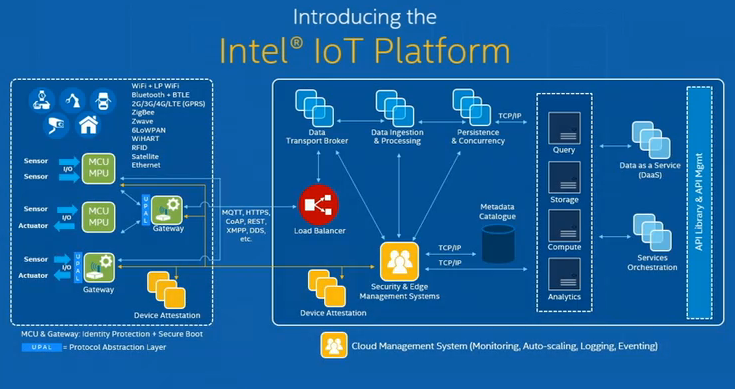

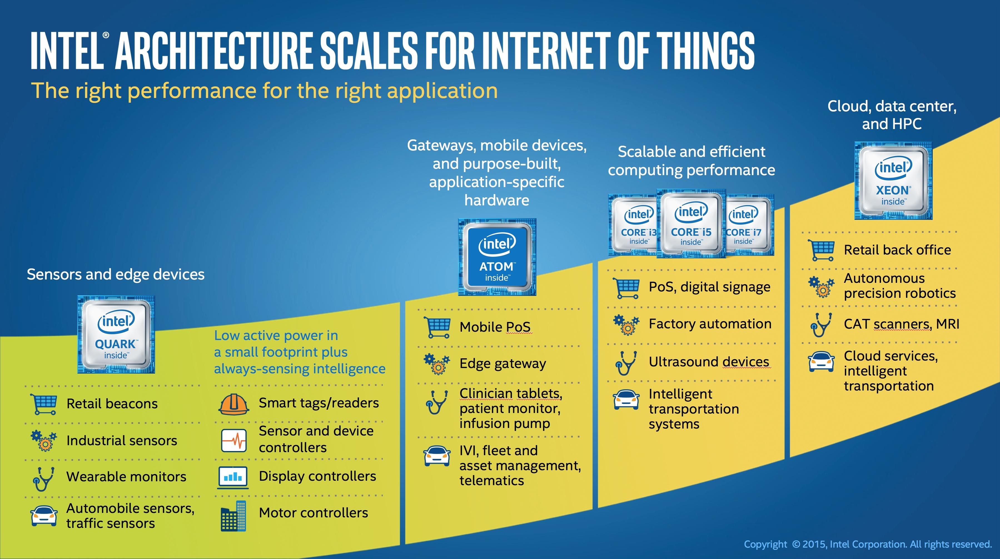

## 嵌入式设计中心

+   [Intel® 嵌入式设计中心](http://www.intel.com/content/www/us/en/embedded/embedded-design-center.html)

## Intel® 物联网解决方案联盟

> 从模块化组件到市场就绪系统，英特尔和英特尔® 物联网解决方案联盟的 400 多家全球成员公司提供可扩展、互操作的解决方案，加速智能设备和端到端分析的部署。与英特尔和彼此紧密合作使联盟成员能够利用最新的物联网（IoT）技术进行创新，帮助开发者提供市场首创解决方案。

+   [Intel® 物联网解决方案联盟概述](http://www.intel.com/content/www/us/en/intelligent-systems/alliance-overview.html)

+   [Intel® 物联网解决方案联盟主页](http://business.iotsolutionsalliance.intel.com/)

+   [Intel® 物联网解决方案开发者目录](http://iotsolutionsalliance.intel.com/solutions-directory)

+   [Intel® 物联网解决方案目录](http://www.intel.com/content/www/us/en/internet-of-things/solutions-directory.html)

+   [Intel® 物联网生态系统](http://www.intel.com/content/www/us/en/internet-of-things/ecosystem.html)

## Intel® 开发者社区

> 开始你的物联网项目。找到指南、文档、下载、支持等信息。
> 
> +   Intel® Edison 开发板
> +   
> +   Intel® Galileo 开发板
> +   
> +   Minnowboard MAX
> +   
> +   Intel® 物联网网关
> +   
> +   Intel® 物联网开发套件

[Intel® 开发者社区物联网](https://software.intel.com/en-us/iot/home)

# Intel® 物联网开发套件

> 我们的完整硬件和软件解决方案将帮助您探索物联网领域并创建创新项目。您将找到一切所需内容：开发板和入门套件；Intel® XDK 物联网版、Eclipse* 和 Arduino* IDE；一组库；物联网云分析；等等。

+   [Intel® IoT 开发者套件](https://software.intel.com/en-us/iot/hardware/devkit)

+   [宣布 Intel® IoT 开发者套件支持 Intel IoT 网关](https://software.intel.com/en-us/blogs/2016/02/22/announcing-intel-iot-developer-kit-support-for-intel-iot-gateways)

+   [Intel® Galileo IoT 开发套件](http://iotdk.intel.com/)

更新！ 2016 年 2 月

+   第一个包括支持物联网网关的功能，帮助从原型到生产过程中实现无缝的开发体验。

+   第二个是发布了一个 TinyB（Tiny Bluetooth）库，允许开发人员使用简单的 C++ 和 Java API 连接到和与蓝牙低功耗设备进行交互。

+   第三个是 UPM 传感器库的扩展，包括首次推出的一系列工业传感器。

# Intel® IoT 商业套件

> Intel® IoT 商业开发者套件的区别在于软件方面。 Yocto Project Linux 被删除，而 Wind River Linux 与 Wind River 智能设备平台 (IDP) XT 替代。

[使用 Intel® IoT 商业开发者套件构建](https://software.intel.com/en-us/blogs/2015/09/24/building-with-the-intel-iot-commercial-developer-kit)

# Intel® IoT 开发套件

> Intel® 物联网开发套件 (IoTDK) 是创建和测试针对 Intel 物联网平台（如 Intel® Galileo 和 Edison 制造商板）的应用程序的完整解决方案。
> 
> +   Intel® XDK 物联网版
> +   
> +   Yocto Project
> +   
> +   Libraries (RMAA & UPM)

[开始使用 Intel® IoT 开发套件和 Intel® XDK 物联网版](https://software.intel.com/en-us/xdk/docs/getting-started-with-intel-xdk-iot-edition)

+   [Intel® IoT 开发套件官方 Github 仓库库和示例](https://github.com/intel-iot-devkit)

+   [Intel® Enable IoT](https://github.com/enableiot)

# Intel® 系统工作室

> 连接智能设备的爆炸性增长-预计到 2020 年将达到 500 亿-推动了对满足系统软件和嵌入式 C 应用程序更短开发周期的高效工具的空前需求。 Intel® System Studio 2015 正是如此，它使开发人员能够充分利用基于 Intel®架构的系统和嵌入式应用程序。 Intel® System Studio 2015 是一套全面集成的工具套件，为开发人员提供先进的系统工具和技术，以帮助加速交付下一代、节能高性能和可靠的嵌入式和移动设备。 Intel® System Studio 是一个经过完全验证并得到 Intel 支持的产品，经过了针对 Intel®架构的优化，同时与开源技术兼容。
> 
> +   主机操作系统
> +   
> +   集成开发环境
> +   
> +   Intel® C++ 编译器
> +   
> +   Intel® 集成性能原语库
> +   
> +   Intel® 数学核心库
> +   
> +   Intel® 线程构建模块
> +   
> +   Intel 增强的 GDB* 应用程序调试器
> +   
> +   适用于 Windows、Android、Linux*、嵌入式 Linux、Wind River* Linux*、Yocto Project*、Tizen
> +   
> +   更多……

[Intel® 系统工作室](https://software.intel.com/en-us/intel-system-studio)

# Intel® 微控制器系统工作室

> Intel® 微控制器系统工作室是一个与 Eclipse* 集成的软件套件，专门设计为赋予 Intel® Quark™ 微控制器开发者创造快速、智能的物联网设备的能力。
> 
> 物联网（IoT）是技术领域的大发展浪潮，涵盖智能城市、家庭、教室、能源管理、可穿戴设备等诸多领域。Intel Quark 微控制器家族将智能计算延伸到需要低功耗传感器输入和数据驱动应用程序的新型设备领域。[Intel® 微控制器系统工作室主页](https://software.intel.com/en-us/intel-system-studio-microcontrollers)

+   [Intel® 系统工作室产品简介](https://software.intel.com/sites/default/files/managed/65/ce/ISSM_Product_Brief_v4.pdf)

# Intel® 物联网版系统工作室

> 无论您是使用 C++ 还是 Java 进行开发，我们的 Eclipse 实例都具有通过我们的 UPM 和 Librmaa 库轻松集成传感器的内置功能。

+   [Intel® 物联网版系统工作室 C/C++ 用户指南](https://software.intel.com/en-us/intel-system-studio-iot-edition-guide-for-c)

# Wind River 智能设备平台* XT

> 将您的边缘设备连接到云端。Wind River® 智能设备平台 XT 是一个可定制的中间件开发环境，提供安全性、连接性、丰富的网络选项和设备管理。它简化了物联网网关的开发、集成和部署。[智能设备平台* XT 主页](http://www.windriver.com/products/intelligent-device-platform/)

+   [智能设备平台* XT 产品简介](http://www.intel.com/content/www/us/en/embedded/design-tools/evaluation-platforms/gateway-solutions/wind-river-idp-xt2-product-brief.html)

+   [智能设备平台* XT 发布说明](http://www.intel.com/content/dam/www/public/us/en/documents/release-notes/wind-river-idp-release-notes.pdf)

# Wind River Helix

> Wind River® Helix™ 是我们针对物联网所面临的系统级挑战和机遇而设计的软件、技术、工具和服务的产品组合。[Wind River Helix 主页](http://windriver.com/products/helix/)

# 增强隐私识别（EPID）

> Intel 的增强隐私识别（EPID）技术将由包括 Atmel 和 Microchip 在内的物联网传感器和微控制器供应商实现。[新闻发布](https://newsroom.intel.com/news-releases/intel-expands-developer-opportunities-as-computing-expands-across-all-areas-of-peoples-lives/)

# Intel® RealSense™ 机器人开发套件

> 英特尔® RealSense™ 机器人开发套件是一个捆绑包，包括一个信用卡大小的板和一个英特尔® RealSense™ 摄像头（R200）。这种高性能计算和低功耗的组合弥合了快速原型设计和最终产品设计之间的差距。[英特尔® RealSense™ 机器人开发套件](https://software.intel.com/en-us/realsense/robotic-development-kit)

# 可信分析平台（TAP）

+   [英特尔 Daal](https://software.intel.com/en-us/intel-daal)

# 联盟

+   [英特尔和 Citrix 在 Citrix Synergy 上携手创新](https://itpeernetwork.intel.com/intel-and-citrix-team-up-for-innovation-at-citrix-synergy/)

# 工具

# 工具

# 物联网门票

# 物联网门票

> 自 1999 年以来，我们一直将设备和机器连接到互联网。通过 IoT Ticket，我们为您提供了通往物联网（IoT）及更远的门票。将您的设备连接到 IoT Ticket，创建条件、维护或状态报告以跟踪您的资产。利用基于 Web 的桌面实时监控和控制它们。[主页](https://www.iot-ticket.com/)

# 利贝利姆

# 利贝利姆

> 物联网平台提供商。利贝利姆设计和制造硬件以及完整的无线传感器网络软件开发工具包（SDK），以便系统集成商、工程和咨询公司可以在最短时间内交付可靠的物联网（IoT）、M2M 和智慧城市解决方案。我们多功能的平台允许实施任何无线传感器网络，从智能停车到智能灌溉解决方案。[主页](http://www.libelium.com/)

+   [David Gascón 在 2016 年智利 IBM Outthink 大会上的演讲（西班牙语）](https://www.youtube.com/watch?v=-Fiooq8BMUc)

+   [物联网市场](https://www.the-iot-marketplace.com/)

# 甲骨文

# 甲骨文

## 甲骨文物联网

> 开启新的商业价值。从物联网（IoT）数据中获得新的数据驱动洞见，并从中采取行动，使您的业务能够比竞争对手更快地提供创新的新服务，风险更小。安全地连接、分析和集成实时的物联网数据，在连接设备和企业应用程序之间实现规模化。

+   [甲骨文物联网](https://www.oracle.com/solutions/internet-of-things/index.html)

+   [甲骨文 GrovePi+入门套件 | Luc Bors](https://blogs.oracle.com/archbeat/entry/video_overview_grovepi_starter_kit)

## 甲骨文云物联网

> 简化物联网。通过将设备数据连接、分析和集成到您的业务流程和应用程序中，从物联网中获得新的数据驱动洞见，并采取行动，使您的业务能够更快地提供创新的新服务，风险更小。
> 
> Oracle 互联网物联网（IoT）云服务是一种托管的基于云的平台即服务（PaaS）云服务，通过允许您将设备连接到云端、实时分析来自这些设备的数据，并将您的数据与企业应用程序、Web 服务或其他 Oracle 云服务（如 Oracle 商业智能云服务）集成，帮助您做出关键的业务决策和战略。

+   [Oracle 云物联网](https://cloud.oracle.com/iot)

## Oracle 商业智能云服务

> 云中的敏捷商业智能。一个被证明用于创建强大商业智能应用程序的平台，使用户从工作组到企业都能使用。

+   [Oracle 商业智能主页](https://cloud.oracle.com/business_intelligence)

# 其他

# 其他

## C3IoT

> 企业物联网应用软件。C3 IoT 应用平台采用大规模的高级分析和机器学习，为企业业务要务提供实时可操作的见解。通过 C3 IoT，组织正在实现前所未有的运营效率、生产力和竞争优势水平。[C3IoT 主���](http://c3iot.com/)

## 物联网实验室

> IoT-LAB 提供了一个非常大规模的基础设施，适用于测试小型无线传感器设备和异构通信对象。它是 SENSLAB 测试平台（2010-2013）的演进和扩展。[IoT Lab 主页](https://www.iot-lab.info/)

# Mediatek

# Mediatek

## MediaTek 云沙箱

> MediaTek 云沙箱（MCS）是一个面向物联网设备的基于云的数据服务平台。

+   [MediaTek 云沙箱主页](https://mcs.mediatek.com/)

# Micrium

# Micrium

> Micrium 一直在嵌入式软件组件领域保持领导地位。该公司的旗舰 µC/OS 系列以无与伦比的可靠性、性能、可靠性、无可挑剔的源代码和广泛的文档而闻名。此外，一些 Micrium 组件包含符合医疗电子、航空电子和工业产品等行业严格的安全关键标准的认证。[主页](https://www.micrium.com/)

# Microchip

# Microchip

[物联网](http://www.microchip.com/design-centers/internet-of-things)

# IoT 以太网套件

> 由 AWS IoT 驱动的以太网 LAN8740A，由带有 2 Mb 闪存（PIC32MZ EF）的 32 位控制器驱动的 IoT 以太网套件。数百种不同的传感器可以插入来自 mikroe.com 的 mikroBUSTM 插座。此外，该套件使用 FreeRTOSTM 运行 MQTT 轻量级协议和 SSL，使用户能够在考虑大规模生产代码环境的情况下快速启动设计。[IoT 以太网套件](http://www.microchipdirect.com/ProductSearch.aspx?Keywords=DM990004)

# 互联网物联网 AWS IoT

> Microchip 基于 PIC32MZ 的 IoT 演示旨在与亚马逊网络服务的 AWS IoT 平台和 Microchip 的 "Insight on Things"（IoT）桌面应用程序配合使用。

+   [AWS IoT 物联网](http://www.microchip.com/design-centers/internet-of-things/aws-iot)

+   [AWS IoT 固件](https://github.com/MicrochipTech/aws-iot-firmware-pic32mz)

+   [“物联网洞见”(IoT) 桌面应用](https://github.com/MicrochipTech/aws-iot-insight-on-things-desktop-app/)

# Microsoft

# Microsoft

> 创建属于您的物联网。物联网从您的物品开始——对您的业务最重要的事物。欢迎来到您的物联网。
> 
> 互联网物联网为企业带来了巨大的机遇，而在微软，我们相信这不必难以实现。物联网从您的物品开始，您的物品是对您的业务最重要的。了解更多关于物联网如何帮助改变您的业务的信息。

+   [Microsoft 互联网物联网](http://www.microsoft.com/en-us/server-cloud/internet-of-things/default.aspx)

+   [Microsoft 你的物联网](http://www.InternetofYourThings.com)

## 新闻

+   [GE 与 Microsoft 合作，将 Predix 带到 Azure，加速工业客户的数字转型](http://news.microsoft.com/2016/07/11/ge-and-microsoft-partner-to-bring-predix-to-azure-accelerating-digital-transformation-for-industrial-customers/)

# Windows 10 Core Starter Pack for Raspberry Pi 2

> 当我们在今年 2 月发布 Raspberry Pi 2 时，我们宣布微软的 Windows 10 IoT Core，这是 Windows 10 的一个版本，用于小型物联网设备，可能有屏幕，也可能没有屏幕，将提供给该设备。

+   Windows 10 Core IoT Starter Pack 主页

+   [Windows 10 Core IoT Starter Pack 新闻](https://www.raspberrypi.org/blog/windows-10-core-iot-starter-pack/)

+   [Adafruit 适用于 Raspberry Pi 2 的 Microsoft IoT 套件](https://www.adafruit.com/windows10iotpi2)

+   [AllThingsTalk Windows 10 Raspberry Pi 入门套件 V2](http://shop.allthingstalk.com/product/raspberry-pi-starter-kit-v2-for-windows-10-pre-order/)

# Mozilla

# Mozilla

> 探索在我们生活中连接设备和服务爆炸性增长的情况下，Web 的作用。

+   [Mozilla Web Of Things](https://wiki.mozilla.org/WebOfThings)

+   [Mozilla 测试四种新的物联网解决方案](https://thestack.com/iot/2016/03/04/mozilla-testing-four-new-iot-solutions/?utm_content=buffer59538&utm_medium=social&utm_source=plus.google.com&utm_campaign=buffer&_utm_source=1-2-2)

+   [Mozilla 关于连接设备创新流程的主页更新：四个项目取得进展](https://blog.mozilla.org/futurereleases/2016/03/01/update-on-connected-devices/)

# NXP

# NXP

> 互联网物联网（IoT）正在彻底改变您与家中、工作场所以及周围世界中的物体和设备的互动方式。它带来了巨大的兴奋，预测为最终用户提供了无尽的便利、舒适和效率机会。

+   [NXP Semiconductor](http://www.nxp.com/)

+   [NXP 智能连接解决方案](http://www.nxp.com/applications/smart-connected-solutions:SMART-CONNECTED-SOLUTIONS)

+   [NXP 支持两个新的物联网开发平台](http://www.nfcworld.com/2016/02/24/342667/nxp-backs-two-new-iot-development-platforms/)

# NVIDIA

# NVIDIA

> NVIDIA DRIVE PX 2 允许汽车行业利用人工智能来解决自动驾驶中固有的复杂性。它利用 NVIDIA 最先进的 GPU 进行深度学习，实现车辆周围 360 度的情景感知，精确确定车辆位置，并计算安全、舒适的轨迹。[查看更多](http://nvidianews.nvidia.com/news/nvidia-boosts-iq-of-self-driving-cars-with-world-s-first-in-car-artificial-intelligence-supercomputer#sthash.E46oMzj3.dpuf)

# Nokia

# Nokia

> 诺基亚是连接我们的生活的技术创新领导者。我们创建的产品和解决方案有助于人们蓬勃发展。[主页](http://www.nokia.com/en_int)

+   [诺基亚通过成功的公开交换要约获得阿尔卡特朗讯控制权；诺基亚将持有近 80%的未结清阿尔卡特朗讯股份](http://company.nokia.com/en/news/press-releases/2016/01/04/nokia-gains-control-of-alcatel-lucent-through-successful-public-exchange-offer-nokia-to-hold-nearly-80-of-outstanding-alcatel-lucent-shares)

# Predixion

# Predixion

> 唯一在设备上执行的高级分析技术，用于实时决策制定。[主页](https://www.predixionsoftware.com/)

## 新闻

+   [逆向工程物联网](http://www.rtinsights.com/iot-architecture-visual-edge-analytics-predixion/)

# PTC

# PTC

> PTC（纳斯达克：PTC）提供的技术解决方案可以改变您创建、运营和维护产品的方式。[主页](http://www.ptc.com/)

+   [物联网（IoT）案例研究](http://www.ptc.com/internet-of-things/customer-success)

+   [IoT 应用案例](http://www.ptc.com/internet-of-things/use-cases)

+   [IoT 解决方案](http://www.ptc.com/internet-of-things/solutions)

# ThingWorx

> 物联网技术平台。ThingWorx 平台提供了一整套物联网特定的开发能力，使解决方案更加强大，上市时间更快。[ThingWorx 主页](http://www.ptc.com/internet-of-things/technology-platform-thingworx)

# 高通

# 高通

> 万物互联。想象一个设备、地点和人们如此紧密相连的世界，以至于日常生活永远改变。现在停止想象，开始相信。这个转变被称为万物互联（IoE），30 年来，我们一直在利用我们的无线专业知识使这个惊人的连接世界成为现实。

+   [高通万物互联主页](https://www.qualcomm.com/products/internet-of-everything)

+   [骁龙](http://www.engadget.com/2016/05/30/qualcomm-snapdragon-1100/)

+   [QCA4012 新闻](https://www.qualcomm.com/news/releases/2016/05/31/qualcomm-brings-new-wi-fi-solution-and-software-ecosystem-support-enhance)

+   [QCA4012 手册](https://www.google.com/url?sa=t&rct=j&q=&esrc=s&source=web&cd=1&cad=rja&uact=8&ved=0ahUKEwi5urSpiYXNAhVN4WMKHclQBHQQFggcMAA&url=https%3A%2F%2Fwww.qualcomm.com%2Fmedia%2Fdocuments%2Ffiles%2Fqualcomm-low-power-wi-fi-qca4010.pdf&usg=AFQjCNFO7EBBz426xMSUVMOk8kkzYDUkTA&sig2=XRZT5FXnsFkfU4lmcXTXQQ)

## Etherios 的物联网套件

> 基于高通® QSC6270-Turbo 芯片组，Etherios 和 Oracle Java 技术构建

+   [Etherios 物联网套件](http://store.digi.com/index.cfm?fuseaction=product.display&product_id=2880)

+   [物联网套件为开发者带来竞争优势](http://www.etherios.com/blog/developer-zone/internet-of-everything-kit/)

# 红帽

# 红帽

> 互联网物联网对企业意味着什么？在物联网中，日常物品是网络的一部分，向其他“物品”发送和接收数据。世界通过嵌入式设备紧密相连。在消费者层面，这意味着您可以从大洋彼岸调整家中的恒温器。但对于企业而言，这可以创造与客户和合作伙伴连接的新机会，以及大量需要收集、存储和分析的数据。

+   [红帽物联网](https://www.redhat.com/en/insights/internet-of-things)

# 瑞萨

# 瑞萨

> 2010 年 4 月 NEC 电子和瑞萨科技的合并诞生了瑞萨电子。作为一家半导体制造商，我们努力成为全球客户需求的第一满足者，旨在成为他们最值得信赖的合作伙伴之一。[主页](https://www.renesas.com/en-us/)

# 微控制器和微处理器

> 针对用户需求迅速扩大的范围，瑞萨电子提供微控制器和微处理器产品，具有出色的可扩展性，同时允许客户充分利用现有资源。

+   [RL78 系列](https://www.renesas.com/en-us/products/microcontrollers-microprocessors/rl78.html)

    +   仪表盘

+   [RX 系列](https://www.renesas.com/en-us/products/microcontrollers-microprocessors/rx.html)

    +   行业通用技术

    +   安全

    +   家用电器

    +   人机界面

+   [RH850 系列（仅限汽车）](https://www.renesas.com/en-us/products/microcontrollers-microprocessors/rh850.html)

    +   混合动力车/电动车

+   [RZ 系列](https://www.renesas.com/en-us/products/microcontrollers-microprocessors/rz.html)

    +   汽车音响

    +   个人电脑外设

    +   家用电器

    +   医疗保健

    +   安全

## 使用案例

+   物联网设备

    +   瑞萨 RL78

    +   瑞萨 RX100

+   网关

    +   瑞萨 RX600

    +   瑞萨 RZ

# 瑞萨 Synergy™平台

> 一个完整且合格的平台，加速嵌入式开发，激发创新并实现差异化。[瑞萨 Synergy™平台](https://www.renesas.com/en-us/products/synergy.html)

# Salesforce

# Salesforce

# 三星

# 三星

> 70 多年来，三星一直致力于通过涵盖先进技术、半导体、摩天大楼和工厂建设、石化、时尚、医学、金融、酒店等多元业务的业务，创造一个更美好的世界。 我们的旗舰公司，三星电子，在高科技电子制造和数字媒体方面领先全球市场。 [主页](http://www.samsung.com/)
> 
> 通过创新、可靠的产品和服务；才华横溢的人才；对商业和全球公民责任的负责态度；以及与合作伙伴和客户的合作，三星正在带领世界朝着富有想象力的新方向发展。

+   [三星开发者](http://developer.samsung.com/home.do)

    # Artik

> ARTIK 将物联网的未来打包成一个非常小巧而功能强大的框架。 通过针对性能进行优化的分层架构、优化功耗和内存利用率以及占地面积，ARTIK 硬件旨在驱动可穿戴设备、智能家居和其他应用程序。

+   [三星 ARTIK 主页](https://www.artik.io/)

+   [三星开发者 ARTIK](http://developer.samsung.com/artik)

+   [ARTIK 认证合作伙伴计划](https://www.artik.io/partners/programs/certified-partners)

+   [三星 ARTIK Github](https://github.com/artikcloud/)

> SmartThings 是将家庭变成智能家庭的最简单方法，为用户带来安心、节省和便利。 作为一个拥有蓬勃发展生态系统的开放平台，SmartThings 为用户带来了在设备选择上的自由和无限可能性。 [SmartThings 主页](https://www.smartthings.com/)
> 
> 安全是物联网设备的关键属性。 三星将硬件安全添加到每个模块中，并通过与行业领先的安全合作伙伴合作来扩展其功能。 Trustonic 受信任的执行环境（TEE）平台为设备的完整性、身份验证、授权和隐私保护提供了安全基础。 [Trustonic 主页](https://www.trustonic.com/)
> 
> Medium One 允许公司通过实时分析其数据并提供智能见解，从而从物联网（IoT）中获得业务价值。 [MediumOne 主页](https://mediumone.com/)

## Artik 云平台

> 建立连接，而不是隔离。 连接所有设备和服务，甚至是尚未发明的设备。 [主页](https://artik.cloud/)

+   [三星推出 Artik 云平台以连接物联网设备](http://venturebeat.com/2016/04/27/samsung-launches-artik-cloud-platform-to-connect-internet-of-things-devices/)

# 信标

+   [三星出手了：为 Android 提供信标，无需应用程序](http://beekn.net/2014/11/samsung-makes-move-beacons-android-app-required/)

# 未命名操作系统

+   [未命名操作系统](http://www.cio.com/article/3047191/samsung-is-developing-a-new-os-for-the-internet-of-things.html#tk.rss_all)

# 三星战略与创新中心

+   [三星战略与创新中心](http://www.samsung.com/us/ssic/)

# 施耐德电气

# 施耐德电气

# [2015 年物联网世界论坛 - 首席技术官 Prith Banerjee 采访](https://www.youtube.com/watch?v=tWv9Lg-vGzk)

> 施耐德电气首席技术官 Prith Banerjee 讨论了施耐德电气如何通过物联网为客户提供价值，并围绕以下四个支柱展开：
> 
> > +   1）能源效率
> > +   
> > +   2）资产性能
> > +   
> > +   3）智能运营和
> > +   
> > +   4）移动运营和风险管理。

# Telefonica

# Telefonica

> 创新物联网致力于将未来变为现实 [主页](https://iot.telefonica.com/innovation-iot)
> 
> 我们的组织、我们的合作伙伴和我们的创业生态系统密切合作，以提供最先进的物联网技术，从而在物联网领域提供最先进的解决方案。

# 德州仪器

# 德州仪器

# 传感器标签

+   [SensorTag 的故事](http://www.ti.com/ww/en/wireless_connectivity/sensortag2015/?INTC=SensorTag&HQS=sensortag)

# ThingWorx

# ThingWorx

> 构建智能、连接的应用程序。 交付物联网（IoT）应用程序从未如此简单。 使用 ThingWorx，您可以以十倍的速度构建、部署和演进应用程序。

+   [ThingWorx](http://www.thingworx.com/)

+   [ThingWorx 学术](http://www.thingworx.com/Academics)

# Verizon

# Verizon

+   [Verison IoT 主页](http://www.verizonenterprise.com/products/internet-of-things/)

# Vodafone

# Vodafone

> 改变生活和业务。 Vodafone 物联网。 动力#IoT 提供真正的业务价值。 [Vodafone IoT](http://www.vodafone.com/business/m2m)

# C2M

# C2M

> C2M 端到端 IoT 平台 [主页](https://www.connect2.me/)

# 事物

# 事物

> 在物联网（IoT）的上下文中，物是指具有唯一标识符、嵌入式系统和在网络上传输数据能力的实体或物理对象。

# 嵌入式系统

> 嵌入式系统是具有专用功能的计算机系统，常常在更大的机械或电气系统内部运行，通常具有实时计算约束。 它作为完整设备的一部分嵌入，通常包括硬件和机械部件。 嵌入式系统控制着今天许多常见设备中的许多设备。 [维基百科](https://en.wikipedia.org/wiki/Embedded_system)
> 
> 嵌入式系统与深度嵌入式系统？

# 嵌入式系统的编程语言

> C 和 JAVA？

+   C

+   C++

+   JAVA（Oracle JAVA ME 嵌入式）

    +   700 KB RAM / 2 MB ROM（完整配置）

    +   130 KB RAM / 350 KB ROM（最小配置）

    +   网络连接

# 论坛

# 论坛

+   [制作：创客板指南](http://makezine.com/comparison/boards/)

+   [Hackaday Quark D2000](http://hackaday.com/2016/03/31/intel-ups-the-dev-board-ante-with-the-quark-d2000/)

+   [前五款单板计算机](https://www.youtube.com/watch?v=EiYoxtL6Fmw)

+   [物联网硬件指南](http://postscapes.com/internet-of-things-hardware/)

# 模型

+   [LinkItOne](http://www.seeedstudio.com/wiki/LinkIt_ONE)

    +   SideKick 基础套件

    +   格罗夫入门套件

+   [ESP8285](https://www.tindie.com/products/onehorse/esp8285-development-board/)

+   [LimeSDR](https://www.crowdsupply.com/lime-micro/limesdr)

+   [Pinoccio](https://pinocc.io/)

+   [TinyScreen](https://www.kickstarter.com/projects/kenburns/tinyscreen-a-color-display-the-size-of-your-thumb/description)

+   [CubIt](https://cubit.backerkit.com/)

+   [Micro Electronics](http://www.mikroe.com/)

+   [pcDuino](https://learn.sparkfun.com/tutorials/programming-the-pcduino?_ga=1.49339361.655373950.1463888237)

+   [Orange Pi](http://www.orangepi.org/orangepione/)

+   [mBed 物联网平台](https://developer.mbed.org/platforms/)

+   [Particle](https://www.particle.io/)

+   [Begleboard](http://beagleboard.org/)

+   [Arduino](https://www.arduino.cc/)

+   [Samsung Artik](https://www.artik.io/)

+   [Raspberry Pi](https://www.raspberrypi.org/)

+   Pi 和其他浆果

+   套件解决方案

+   Flutter 无线

+   [Local Motors 连接汽车](https://localmotors.com/awest/connected-car-project-internet-of-things/)

+   [Radxa Rock](http://radxa.com/Rock)

+   Microduino

+   OpenADC

+   OpenMote

+   OpenPicus FlyPortPRO

+   Pinoccio

+   RasWIK

+   SODAQ

+   Tessel

+   UDOO

+   WeIO

+   WIZnet

+   [EmbArc](https://www.embarc.org/)

+   [Synopsys](https://www.synopsys.com/dw/ipdir.php?ds=arc_em_starter_kit)

+   STM32f4

# Intel 架构

# Intel 架构

# Intel® Joule™ 模块

> 用于 Intel® Joule™ 模块的 Intel® 物联网开发套件包含您快速开发所需的一切。
> 
> 使用 Intel® Joule™ 模块设计原型和发布就绪产品。在微小尺寸和快速扩展原型中探索高端计算。该强大的系统模块（SoM）具有完整的软件套件、工具和预装的 Linux* 软件包，旨在帮助发明家和物联网开发人员更快地创建更多。为配备 Intel® HD 图形、3D 建模、物体识别和交互功能的新一代机器人、无人机和物联网设备做出贡献。[Intel® Joule™ 开发套件](https://software.intel.com/en-us/iot/hardware/joule/dev-kit)

## 链接

+   [什么是 Joule 模块](https://software.intel.com/en-us/articles/what-is-joule-module)

+   [Ark Intel® Joule™ 套件](http://ark.intel.com/products/series/96419/Intel-Joule-Kits)

+   [Ark Intel® Joule™ 570x 开发套件](http://ark.intel.com/products/96414/Intel-Joule-570x-Developer-Kit)

# Intel® Aero 无人机平台

> 由最新的 Intel® Atom™ 四核处理器提供动力，这款即插即飞的、专为无人机开发的开发套件具有通信、存储、深度和视觉功能的即插即用模块，包括 Intel® RealSense™ 技术。[Intel® Aero 无人机平台](http://www.intel.com/content/www/us/en/technology-innovation/aerial-technology-overview.html)

# Intel® Curie™ 模块

> 推动可穿戴设备创新，重新构想可穿戴技术解决方案，高度集成的硬件模块，可以为按钮大小的解决方案提供动力。
> 
> 一个高度集成的硬件模块，可以为按钮大小的解决方案提供动力。

Intel Curie 模块包括：

+   低功耗、32 位 Intel® Quark™ 微控制器

+   384kB 闪存，80kB SRAM

+   低功耗、集成 DSP 传感器中心和模式匹配技术

+   蓝牙低功耗 6 轴组合传感器，带加速度计和陀螺仪

+   电池充电电路（PMIC）

## 链接

+   [英特尔最新可穿戴模块：英特尔® Curie™](https://software.intel.com/en-us/articles/intels-newest-wearable-module-intel-curie)

+   [Arduino 101 英特尔® Curie™](https://www.arduino.cc/en/Main/ArduinoBoard101)

+   [英特尔® Curie™ 模块：重新构想可穿戴技术解决方案](http://www.intel.cn/content/www/cn/zh/wearables/wearable-soc.html)

+   [英特尔® Curie™ 模块信息表](http://download.intel.com/newsroom/kits/ces/2015/pdfs/Intel_CURIE_Module_Factsheet.pdf)

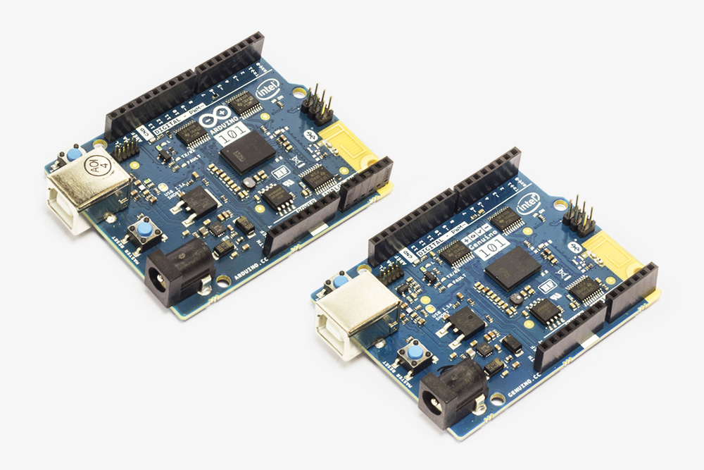

# 英特尔® 夸克™ 微控制器开发套件 D2000

> 英特尔® 夸克™ 微控制器开发套件 D2000 包括一个小型板，其中包括闪存存储器、一个 6 轴指南针/加速度计与温度传感器、一个 Arduino-Uno 兼容的 shield 接口和一个 booster-pack 兼容的 shield 接口等。

+   [英特尔® 夸克™ 微控制器开发套件 D2000](http://www.intel.cn/content/www/cn/zh/embedded/products/quark/mcu/d2000/overview.html)

+   [英特尔新夸克板首次亮相](http://readwrite.com/2016/04/13/intel-announces-quark-developer-board-arduino-pt4/)

+   [Mouser 夸克 MCU 2000 开发套件](http://www.mouser.cn/ProductDetail/Intel/MTFLDCRBDAL/?qs=sGAEpiMZZMvzNxwKcL67%252bpwZleYEABNkLLpgXezJXXQ%3d)

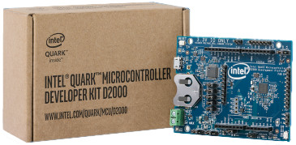

# 英特尔® Galileo

> 特别为制造商、学生、教育工作者和 DIY 电子爱好者设计，英特尔® Galileo Gen 2 板是经过 Arduino* 认证的，具有完全开放源硬件和软件环境，可实现先进的计算功能。

## 链接

+   [物联网英特尔® Galileo 板](https://software.intel.com/en-us/iot/hardware/galileo)

+   [英特尔® Galileo 数据表](http://download.intel.com/support/galileo/sb/galileo_datasheet_329681_003.pdf)

+   [英特尔® Galileo 板用户指南](http://download.intel.com/support/galileo/sb/galileo_boarduserguide_330237_001.pdf)

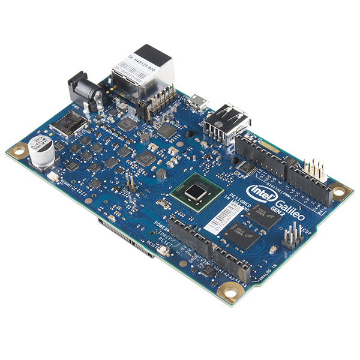

```
 root@galileo:~# uname -a
    ...
    root@galileo:~# cat /proc/cpuinfo | grep processor
    processor       : 0 
```

# 英特尔® Edison

> 英特尔® Edison 技术是一个硬件/软件平台，当与传感器和您的想象力结合使用时，可以让您发明新的互联网产品和解决方案。

+   处理器 — “Tangier” 原子 SoC，带有 22 纳米英特尔原子（2x Silvermont/Merrifield 核心 @ 500MHz）和 100MHz，32 位英特尔夸克

+   存储器 — 1GB LPDDR3 POP RAM（2 通道 32 位）@ 800MT/秒；4GB eMMC（v4.51）

+   无线：

    +   802.11 a/b/g/n（2.4/5GHz）使用 Broadcom 43340 模块

    +   蓝牙 4.0（Bluetooth LE 预计在 Q4 发布）

    +   内置或外置天线选项

+   I/O — 通过 70 脚 Hirose DF40 系列连接器（1.5、2.0 或 3.0mm 堆栈高度），具有 40x 通用 GPIO 用于：

    +   USB 2.0 OTG

    +   SD

    +   2x UART

    +   2x I2C

    +   SPI

    +   I2S

    +   12x 通用 GPIO（包括 4x 可以 PWM）

    +   32kHz、19.2MHz 时钟输出

+   工作温度 — 0 到 40°C

+   功率：

    +   输入电压 — 3.3 到 4.5 VDC

    +   功耗：

        +   典型值 — （待定，按英特尔）

        +   最大值 — （待定，按英特尔）

        +   待机 — 13mW（无无线电）；21.5mW（蓝牙）；35mW（WiFi）

    +   输出 — 100ma @3.3V 和 100ma @ 1.8V 输出

+   尺寸 — 35.5 × 25.0 × 3.9mm（1.4 × 1.0 × 0.15 英寸）

+   操作系统 — Yocto Linux 1.6 适用于 Atom SoC，支持 Arduino IDE、Eclipse（C、C++、Python）、Intel XDK（Node.JS、HTML5）；Quark MCU 的 Viper RTOS SDK


## 链接

+   [IoT Intel® Edison 主板](https://software.intel.com/en-us/iot/hardware/edison)

+   [Intel® Edison 开发平台产品简介](http://download.intel.com/support/edison/sb/edison_pb_331179002.pdf)

+   [Intel® Edison 板支持包（BSP）用户指南](http://www.intel.com/support/edison/sb/CS-035278.htm)

+   [Intel® Edison 计算模块硬件指南](http://download.intel.com/support/edison/sb/edisonmodule_hg_331189004.pdf)

+   [Intel® Edison 计算模块、板和套件](http://www.intel.com/content/www/us/en/do-it-yourself/edison.html)

+   [IoT Intel® Edison 板用户指南](https://software.intel.com/en-us/intel-edison-board-user-guide)

+   [Intel® Edison 计算模块、板和套件](https://www-ssl.intel.com/content/www/us/en/do-it-yourself/edison.html#kits)

+   [Sparkfun Intel® Edison](https://www.sparkfun.com/categories/272)

Breakout Boards

+   [Intel® Edison Breakout Board](http://download.intel.com/support/edison/sb/edisonbreakout_hg_331190006.pdf)

+   [Intel® Edison Arduino 板](http://download.intel.com/support/edison/sb/edisonarduino_hg_331191007.pdf)

+   [SparkFun Intel® Edison 模块 - 控制台](https://www.sparkfun.com/products/13039)

+   [Intel® Edison 的 IO 扩展板](http://www.dfrobot.com/index.php?route=product/product&path=166&product_id=1244#.VlkYuG1ME_M)

+   [Intel® Edison 控制器的 Romeo](http://www.dfrobot.com/index.php?route=product/product&path=166&product_id=1241#.VlkY9G1ME_M)

+   [Modulowo® Explore™ E for Intel® Edison](https://store.modulowo.com/pl/p/Modulowo-Explore-E-dla-Intel-Edison/400)

+   [Intel® Edison Edi-Expand & IoT 计数器](https://www.kickstarter.com/projects/tekt/the-iot-counter-supercharging-an-internet-of-numbe)

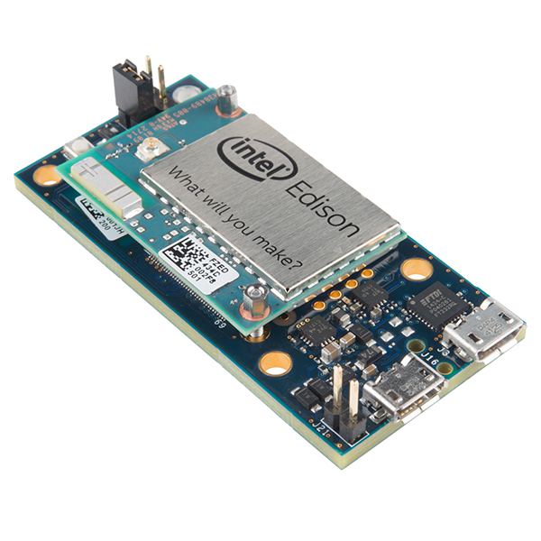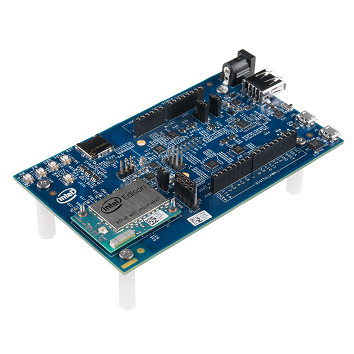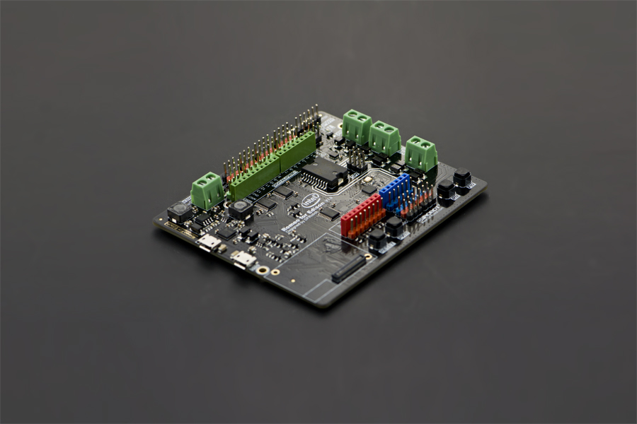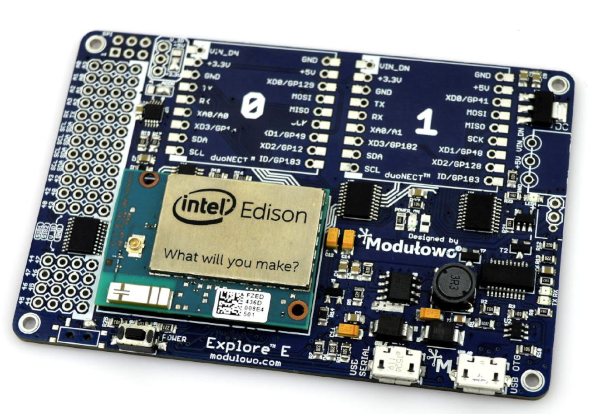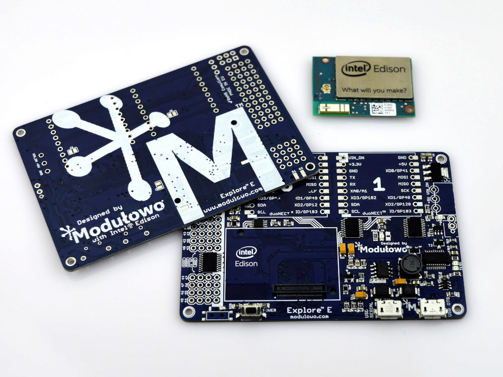

```
 root@edison:~# uname -a
    Linux edison 3.10.17-poky-edison+ #1 SMP PREEMPT Fri Jun 19 12:06:40 CEST 2015 i686 GNU/Linux
    root@edison:~# cat /proc/cpuinfo | grep processor
    processor       : 0
    processor       : 1 
```

## Intel® Edison 板上的通用微控制器单元（MCU）

> Intel 的增加了 SoC Quark 来执行低级别的工作，而不是在 Atom CPU 上占用带宽。

+   [使用 Intel® Edison 板的 MCU SDK 创建应用程序](https://software.intel.com/en-us/creating-applications-with-mcu-sdk-for-intel-edison-board)

+   [Intel® Quark™](https://en.wikipedia.org/wiki/Intel_Quark)

+   [Intel® Quark™ SE 微控制器](http://www.intel.com/content/www/us/en/embedded/products/quark/mcu/se-soc/overview.html)

+   [Intel® Quark™ Microcontroller D2000](http://www.intel.com/content/www/us/en/embedded/products/quark/mcu/d2000/overview.html)

+   [Intel® Quark™ Microcontroller D1000](http://www.intel.com/content/www/us/en/embedded/products/quark/mcu/d1000/overview.html)


# MinnowBoard MAX

> 这是一款紧凑、价格适中且功能强大的开发板，既适用于专业人士也适用于创客，这款开放式硬件设计允许无限定制和集成潜力。这是一个拥有多种优势的平台，赋予开发者在深度嵌入式市场中创新的能力。

+   [MinnowBoard MAX* 开发板](https://software.intel.com/en-us/iot/hardware/minnow-board-max)

+   [MinnowBoard Turbot](http://www.adiengineering.com/products/minnowboard-turbot/)

```
 root@minnowboard:~# uname -a
    ...
    root@minnowboard:~# cat /proc/cpuinfo | grep processor
    processor       : 0
    processor       : 1 
```

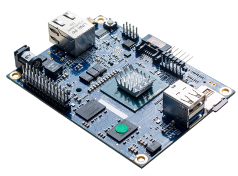

# Up Board

> 你准备好了吗？UP 释放了英特尔 x5-Z8350 四核 1.44Ghz（1.92GHz）64 位 2W CPU 的强大性能。40 引脚 I/O 连接器、USB 3.0 OTG、千兆以太网、HDMI 和更多其他功能使它成为不同领域和产品的理想解决方案，如机器人技术、无人机、机器视觉、智能家居、教育、数字标牌、智能汽车、物联网。与 Linux、Android 以及所有 Windows 10 发行版的兼容性为您提供了巨大的灵活性、可扩展性和快速上市时间。

[Up Board 主页](http://www.up-board.org/)

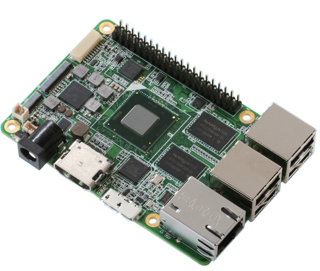

# Lattepanda

> LattePanda 具有四核 1.8Ghz、2/4G 内存、32/64 GB eMMC、WIFI、蓝牙 4.0 和 USB 3.0 等特色，另外还搭载了 Arduino 处理器！

+   [Lattepanda 众筹网站](https://www.kickstarter.com/projects/139108638/lattepanda-a-45-win10-computer-for-everything)

+   [Lattepanda 英特尔博客](https://blogs.intel.com/evangelists/2015/12/16/meet-the-lattepanda-a-69-windows-10-intel-atom-iot-pc/)


# Kangaroo

> 你的袋鼠，时尚小巧。独特个性。无比多功能。[首页](http://www.kangaroo.cc/)


# 英特尔® RealSense™ 机器人开发套件

> 英特尔® RealSense™ 机器人开发套件是一个捆绑销售的产品，包含一块信用卡大小的板子和一台英特尔® RealSense™ 摄像头（R200）。这种高性能计算和低功耗的结合填补了快速原型设计和最终产品设计之间的差距。[Intel® RealSense™ 机器人开发套件](https://software.intel.com/en-us/realsense/robotic-development-kit)

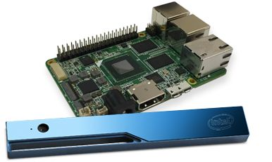

# 英特尔® Core i3、i5、i7

> Intel Core 是英特尔用于各种中高端消费者和企业微处理器的品牌名称。这些处理器取代了当时的中高端奔腾处理器，将奔腾系列处理器提升到入门级别，并将赛扬系列处理器提升到低端。与 Core 处理器相同或更强大的版本也作为 Xeon 处理器销售，用于服务器和工作站市场。截至 2015 年，当前的 Core 处理器系列包括英特尔 Core i7、英特尔 Core i5、英特尔 Core i3 和 Core M。维基百科

[英特尔® Core](https://en.wikipedia.org/wiki/Intel_Core)

# Congatec 的 TC170 COM Express 卡

+   [Congatec 的 TC170 COM Express 卡使用最新的英特尔 SoC](http://www.electronicproducts.com/Board_Level_Products/Single_Board_Computer/TC170_COM_Express_card_from_Congatec_features_latest_Intel_SoC.aspx)


# 开发主机

# 开发主机

任何这些操作系统

+   Windows® 64 位

+   Windows® 32 位

+   OS X®

+   Linux®（在构建 BSP 时使用）

# 入门指南

## 英特尔® Edison

官方入门指南

+   [英特尔® Edison Board 入门指南](https://software.intel.com/en-us/iot/library/edison-getting-started)

社区入门指南

+   [Sparkfun Edison 入门指南](https://learn.sparkfun.com/tutorials/edison-getting-started-guide)

+   [Instructables 全面的英特尔 Edison 入门指南](http://www.instructables.com/id/A-Comprehensive-Intel-Edison-Getting-Started-Guide/)

+   [Codefoster 配置英特尔 Edison](http://www.codefoster.com/edison-setup/)

+   [Edison Mini Breakout: 真正的入门指南](http://blog.microcasts.tv/2014/10/16/edison-mini-breakout-the-real-getting-started-guide)

## 英特尔® Galileo

官方入门指南

+   [英特尔® Galileo Board 官方入门指南](https://software.intel.com/en-us/iot/library/galileo-getting-started)

+   [英特尔® Galileo Makers 入门指南](https://communities.intel.com/community/makers/galileo/getting-started)

英特尔® Galileo 社区指南

+   [Sparkfun Galileo v1 入门指南](https://learn.sparkfun.com/tutorials/galileo-getting-started-guide/all)

# 与开发工作站连接开发板

> 将开发工作站与英特尔® Edison / 英特尔® Galileo 连接，并启动串行通信应用程序

## Windows

> PuTTY 是一个 SSH 和 Telnet 客户端，最初由 Simon Tatham 为 Windows 平台开发。PuTTY 是开源软件，提供源代码，并由一群志愿者开发和支持。

使用 [Putty](http://www.putty.org/)

### Windows USB 串行驱动程序

为了让 Intel Edison 被识别为 COM 端口，请安装[此驱动程序](http://downloadmirror.intel.com/24909/eng/IntelEdisonDriverSetup1.2.1.exe)

[其他驱动程序](http://www.ftdichip.com/Drivers/CDM/CDM21216_Setup.exe)

## Linux

```
 user@host:~$ dmesg
    [11940.538090] ftdi_sio 6-1:1.0: FTDI USB Serial Device converter detected
    [11940.538137] usb 6-1: Detected FT232RL
    [11940.538139] usb 6-1: Number of endpoints 2
    [11940.538142] usb 6-1: Endpoint 1 MaxPacketSize 64
    [11940.538144] usb 6-1: Endpoint 2 MaxPacketSize 64
    [11940.538147] usb 6-1: Setting MaxPacketSize 64
    [11940.540185] usb 6-1: FTDI USB Serial Device converter now attached to ttyUSB0
    user@host:~$ sudo minicom -D /dev/ttyUSB0 115200 
```

# OS X

待定

# 引导加载程序

# 引导加载程序

> 引导加载程序是一种计算机程序，在完成上电自检后为计算机加载操作系统或其他系统软件；它是操作系统自身的加载程序。[维基百科](https://en.wikipedia.org/wiki/Booting)

## U-Boot

> Das U-Boot（Universal Bootloader）是一种开源的主引导加载程序，用于嵌入式设备，用于打包启动设备的操作系统内核的指令。它适用于许多计算机架构，包括 68k、ARM、AVR32、Blackfin、MicroBlaze、MIPS、Nios、SuperH、PPC 和 x86。- [维基百科](https://en.wikipedia.org/wiki/Das_U-Boot)

## 英特尔 Edison

将您的 Intel Edison 开发板连接到注册的 COM / TTY 设备的开发工作站，启动并在引导加载程序阶段通过按任意键中断引导过程

```
 ******************************
PSH KERNEL VERSION: b0182b2b
                WR: 20104000
******************************

SCU IPC: 0x800000d0  0xfffce92c

PSH miaHOB version: TNG.B0.VVBD.0000000c

microkernel built 11:24:08 Feb  5 2015

******* PSH loader *******
PCM page cache size = 192 KB 
Cache Constraint = 0 Pages
Arming IPC driver ..
Adding page store pool ..
PagestoreAddr(IMR Start Address) = 0x04899000
pageStoreSize(IMR Size)          = 0x00080000

*** Ready to receive application *** 

U-Boot 2014.04 (Dec 19 2015 - 23:30:32)
Watchdog enabled
DRAM:  980.6 MiB
MMC:   tangier_sdhci: 0
In:    serial
Out:   serial
Err:   serial
Hit any key to stop autoboot:  1 

< Enter Enter Enter ... to Cancel Boot Loader Execution > 
```

## 英特尔 Galileo

将您的英特尔 Galileo 开发板连接到注册的 COM / TTY 设备的开发工作站并启动

# 操作系统

# 操作系统

> 操作系统（OS）是管理计算机硬件和软件资源并为计算机程序提供通用服务的系统软件。操作系统是计算机系统中的系统软件组件。应用程序通常需要操作系统才能运行。[维基百科](https://en.wikipedia.org/wiki/Operating_system)

# Yocto

> 它不是一个嵌入式 Linux 发行版 - 它为您创建一个定制的发行版。Yocto 项目是一个开源协作项目，提供模板、工具和方法，帮助您为嵌入式产品创建定制的基于 Linux 的系统，无论硬件架构如何。它于 2010 年成立，是许多硬件制造商、开源操作系统供应商和电子公司之间的合作，旨在为嵌入式 Linux 开发带来一些秩序。

[Yocto 项目](http://www.yoctoproject.org/)

# Windows 10

> 利用史上最佳的 Windows 做出伟大的事情。微软 Windows 主页

+   [微软 Windows 主页](https://www.microsoft.com/en-us/windows/)

+   [微软 Windows 开发中心入门](http://ms-iot.github.io/content/en-US/GetStarted.htm)

+   [微软物联网开发者计划更新：支持英特尔 Galileo Gen 2 开发板](https://blogs.windows.com/buildingapps/2014/10/02/iot-developer-program-update-support-for-intel-galileo-gen-2-boards/)

# 谷歌 Brillo

> Brillo 将软件开发的简单性和速度带入物联网硬件，提供嵌入式操作系统、核心服务、开发者工具包和开发者控制台。

+   [谷歌 Brillo 主页](https://software.intel.com/en-us/iot/brillo)

+   [英特尔的谷歌 Brillo](https://software.intel.com/en-us/iot/brillo)

+   [英特尔 OneBrillo 项目](https://brillodev.intel.com/)

# 风河 Rocket

> 帮助您的物联网（IoT）项目起飞，使用专门设计用于快速轻松构建小型智能设备的免费嵌入式操作系统 Wind River® Rocket™。
> 
> Rocket 项目通过我们的新基于云的开发环境 Wind River Helix™ App Cloud 大大简化。在 Rocket 开发者专区了解更多信息。

+   [风河 Rocket 主页](http://windriver.com/products/operating-systems/rocket/)

# 风河 Pulsar Linux

> 风河® Pulsar™ Linux 是一个小型、高性能、安全且易于管理的 Linux 发行版，旨在简化和加速您的嵌入式和物联网（IoT）开发项目。最重要的是，它可以免费在我们信任的合作伙伴的硬件板上使用。

+   [风河 Pulsar 主页](http://www.windriver.com/products/operating-systems/pulsar/)

# Zephyr 项目

> Zephyr™ 内核是一个小巧、可扩展的、面向资源受限系统设计的实时操作系统：从简单的嵌入式环境传感器和 LED 可穿戴设备到复杂的智能手表和物联网无线网关。Zephyr 项目主页

+   [Zephyr 项目主页](https://www.zephyrproject.org/)

# Ostro 项目

> 欢迎来到 Ostro™ 项目！这是一个开源开发的、基于 Linux 的操作系统，专为物联网智能设备量身定制，并考虑了安全性。Ostro 项目主页

+   [Ostro 项目主页](https://ostroproject.org/)

# Contiki

> Contiki 是一个用于物联网的开源操作系统。Contiki 将微小、低成本、低功耗的微控制器连接到互联网。

+   [Contiki OS 主页](http://www.contiki-os.org/)

# 实时 Linux

> “用 Linux 控制激光很疯狂，但在座的各位都有各自的疯狂。所以，如果你想使用 Linux 控制工业焊接激光，我对使用 PREEMPT_RT 没有意见。” -- Linus Torvalds

[实时 Linux Wiki](https://rt.wiki.kernel.org/index.php/Main_Page)

# Free RTOS

> FreeRTOS™ 是来自 Real Time Engineers Ltd. 的市场领先的实时操作系统，支持 35 种架构，在 2014 年获得了超过 113,000 次下载。它是专业开发的、严格质量控制的、健壮的、受支持的，并且可以免费嵌入商业产品中，而无需公开您的专有源代码。

[Free RTOS](http://www.freertos.org/)

# Snappy Ubuntu Core

> 针对云和设备的新的、事务性更新的 Ubuntu。Snappy Ubuntu Core 是 Ubuntu 的一个新版本，带有事务性更新 - 一个具有与今天的 Ubuntu 相同库的最小服务器映像，但应用程序通过更简单的机制提供。

[Snappy Ubuntu Core 主页](http://developer.ubuntu.com/en/snappy/)

# OpenWRT

> 基于 GNU/Linux 的固件程序，用于嵌入式设备，如住宅网关和路由器。

+   [OpenWRT Linux](https://openwrt.org/)

# Clear Linux

> 适用于英特尔®架构的 Clear Linux* 项目是一个正在构建 Linux 操作系统分发版的项目，适用于各种云使用情况。Clear Linux OS 的目标是展示英特尔架构技术的最佳实践，从低级内核功能到跨整个操作系统栈的更复杂的项目。

+   [Clear Linux 主页](https://clearlinux.org/)

# Ubilinux

> ubilinux™ 是来自 Emutex 的嵌入式 Linux 发行版，基于 Debian "Wheezy"。它针对的是具有有限内存和存储能力的嵌入式设备。

+   [Emutexlabs ubilinux™](http://www.emutexlabs.com/ubilinux)

+   [µCast #21：在 Edison 上安装 Ubilinux（Windows）](https://www.youtube.com/watch?v=BSnXjuttSgY)

+   [Sparkfun 在 Edison 上加载 Debian（Ubilinux）](https://learn.sparkfun.com/tutorials/loading-debian-ubilinux-on-the-edison)

# 其他

+   [Zerynth](http://www.zerynth.com/)

+   [LiteOS](http://www.liteos.net/)

+   [ChibiOS](http://www.chibios.org/dokuwiki/doku.php)

+   [mBed](https://www.mbed.com/en/development/software/mbed-os/)

+   [Raspbian](http://raspbian.org/)

+   [RIOT](http://riot-os.org/)

+   [TinyOS](http://www.tinyos.net/)

+   [Tizen](https://www.tizen.org/)

+   [嵌入式 Linux 维基](http://elinux.org/Main_Page)

+   [操作系统：Google FUCHSIA（LK + MAGENTA）](http://thenextweb.com/google/2016/08/13/google-is-secretly-creating-a-new-os-thats-not-based-on-linux/)

    +   [1](https://github.com/littlekernel/lk/commits/master)

    +   [2](https://fuchsia.googlesource.com/magenta/+/master/docs/mg_and_lk.md)

    +   [3](https://fuchsia.googlesource.com/magenta)

    +   [4](https://fuchsia.googlesource.com/?format=HTML)

# 嵌入式 Linux

# 嵌入式 Linux

> 基于 Linux 内核的操作系统被用于嵌入式系统...由于其多功能性，基于 Linux 内核的操作系统也可以在移动设备中找到...[维基百科](https://en.wikipedia.org/wiki/Linux_on_embedded_systems)
> 
> 本维基的目的是保存和展示关于 Linux 在嵌入式系统中的开发和使用以及一般嵌入式开发的开源项目和工具的信息。要使用此维基，请点击下面的一个门户链接。[ELinux 首页](http://elinux.org/Main_Page)

# 板支持包

# 板支持包

> 在嵌入式系统中，板支持包（BSP）是为特定操作系统实现的特定支持代码（软件），用于符合给定操作系统的（设备主板）板。通常使用包含最小设备支持的引导加载程序来构建，以加载操作系统和板上所有设备的设备驱动程序。[维基百科](https://en.wikipedia.org/wiki/Board_support_package)

# 板支持包更新简介

[在 Windows 系统上刷新固件（手动过程）](https://software.intel.com/en-us/flashing-firmware-on-your-intel-edison-board-windows)

## Intel® Edison

> 下载驱动程序、安装程序、新固件映像、IDE 和云分析以及网关软件等组件。

+   [Intel® Edison 板软件下载](https://software.intel.com/en-us/iot/hardware/edison/downloads)

+   [最新发布的 3.5 Yocto 完整映像“Edison 的最新 Yocto Poky 映像”](https://software.intel.com/edison-image/latest)

+   [Intel® Edison 板软件发布 3.5 发布说明](https://software.intel.com/en-us/blogs/2016/06/06/intel-iot-dev-kit-35-release-announcement)

+   [发布 3.0 Yocto 完整映像 iot-devkit-prof-dev-image-edison-20160315.zip](https://downloadmirror.intel.com/25871/eng/iot-devkit-prof-dev-image-edison-20160315.zip)

+   [Intel® Edison 板软件发布 3.0 发布说明](https://software.intel.com/en-us/blogs/2016/03/30/intel-iot-developer-kit-30-release-notes)

### 发布 3.5 Yocto

```
xe1gyq@jessie:~/Downloads/edison/20160606$ unzip iot-devkit-prof-dev-image-edison-20160606.zip 
Archive:  iot-devkit-prof-dev-image-edison-20160606.zip
  inflating: edison_dnx_fwr.bin      
  inflating: edison_dnx_osr.bin      
  inflating: edison_ifwi-dbg-00.bin  
  inflating: edison_ifwi-dbg-00-dfu.bin  
  inflating: edison_ifwi-dbg-01.bin  
  inflating: edison_ifwi-dbg-01-dfu.bin  
  inflating: edison_ifwi-dbg-02.bin  
  inflating: edison_ifwi-dbg-02-dfu.bin  
  inflating: edison_ifwi-dbg-03.bin  
  inflating: edison_ifwi-dbg-03-dfu.bin  
  inflating: edison_ifwi-dbg-04.bin  
  inflating: edison_ifwi-dbg-04-dfu.bin  
  inflating: edison_ifwi-dbg-05.bin  
  inflating: edison_ifwi-dbg-05-dfu.bin  
  inflating: edison_ifwi-dbg-06.bin  
  inflating: edison_ifwi-dbg-06-dfu.bin  
  inflating: edison-image-edison.ext4  
  inflating: edison-image-edison.hddimg  
  inflating: filter-dfu-out.js       
  inflating: flashall.bat            
  inflating: flashall.sh             
  inflating: FlashEdison.json        
   creating: helper/
  inflating: helper/helper.html      
   creating: helper/images/
  inflating: helper/images/Edison-arduino-blink-led.png  
  inflating: helper/images/Edison-arduino.png  
  inflating: helper/images/Edison-breakout-board.png  
  inflating: ota_update.scr          
  inflating: package-list.txt        
  inflating: u-boot-edison.bin       
  inflating: u-boot-edison.img       
   creating: u-boot-envs/
  inflating: u-boot-envs/edison-prod.bin  
  inflating: u-boot-envs/edison-blankrndis.bin  
  inflating: u-boot-envs/edison-blankcdc.bin  
  inflating: u-boot-envs/edison-ifwi.bin  
xe1gyq@jessie:~/Downloads/edison/20160606$ 
```

### 发布 3.0 Yocto

```
xe1gyq@jessie:~/Downloads/latestedison$ unzip iot-devkit-prof-dev-image-edison-20160315.zip 
Archive:  iot-devkit-prof-dev-image-edison-20160315.zip
  inflating: edison_dnx_fwr.bin      
  inflating: edison_dnx_osr.bin      
  inflating: edison_ifwi-dbg-00.bin  
  inflating: edison_ifwi-dbg-00-dfu.bin  
  inflating: edison_ifwi-dbg-01.bin  
  inflating: edison_ifwi-dbg-01-dfu.bin  
  inflating: edison_ifwi-dbg-02.bin  
  inflating: edison_ifwi-dbg-02-dfu.bin  
  inflating: edison_ifwi-dbg-03.bin  
  inflating: edison_ifwi-dbg-03-dfu.bin  
  inflating: edison_ifwi-dbg-04.bin  
  inflating: edison_ifwi-dbg-04-dfu.bin  
  inflating: edison_ifwi-dbg-05.bin  
  inflating: edison_ifwi-dbg-05-dfu.bin  
  inflating: edison_ifwi-dbg-06.bin  
  inflating: edison_ifwi-dbg-06-dfu.bin  
  inflating: edison-image-edison.ext4  
  inflating: edison-image-edison.hddimg  
  inflating: edison-image-edison.manifest  
  inflating: filter-dfu-out.js       
  inflating: flashall.bat            
  inflating: flashall.sh             
  inflating: FlashEdison.json        
   creating: helper/
  inflating: helper/helper.html      
   creating: helper/images/
  inflating: helper/images/Edison-arduino.png  
  inflating: helper/images/Edison-arduino-blink-led.png  
  inflating: helper/images/Edison-breakout-board.png  
  inflating: ota_update.scr          
  inflating: package-list.txt        
  inflating: u-boot-edison.bin       
  inflating: u-boot-edison.img       
   creating: u-boot-envs/
  inflating: u-boot-envs/edison-ifwi.bin  
  inflating: u-boot-envs/edison-blankcdc.bin  
  inflating: u-boot-envs/edison-prod.bin  
  inflating: u-boot-envs/edison-blankrndis.bin 
```

### 命令行过程

命令行刷新过程在您的主机计算机上进行：

+   下载最新版本的 Yocto 完整映像

+   解压缩其内容

+   在终端中，转到已解压缩内容的目录

+   并使用 flashall.[sh/bat]脚本刷新映像

#### 基于 Windows 的开发工作站

```
 C:\Users\aarcemor\Downloads\latestedison>flashall.bat 
```

#### 基于 Linux 的开发工作站

```
 user@host:~$ flashall.sh 
```

如果是 Edison，请连接两个 USB 电缆并等待 flashall.[sh/bat] 脚本开始闪存过程

### 驱动程序流程

+   [开始使用 Intel Edison 第 2 部分：更新 Linux](https://www.youtube.com/watch?v=0EJDoRwDfoU)

##### Yocto 发行版 3.5

```
xe1gyq@jessie:~/Downloads/edison/20160606$ ./flashall.sh
Using U-Boot target: edison-blankcdc
Now waiting for dfu device 8087:0a99
Please plug and reboot the board
Flashing IFWI
Download    [=========================] 100%      4194304 bytes
Download    [=========================] 100%      4194304 bytes
Flashing U-Boot
Download    [=========================] 100%       237568 bytes
Flashing U-Boot Environment
Download    [=========================] 100%        65536 bytes
Flashing U-Boot Environment Backup
Download    [=========================] 100%        65536 bytes
Rebooting to apply partition changes
Now waiting for dfu device 8087:0a99
Flashing boot partition (kernel)
Download    [=========================] 100%      6144000 bytes
Flashing rootfs, (it can take up to 5 minutes... Please be patient)
Download    [=========================] 100%   1373149184 bytes
Rebooting
U-boot & Kernel System Flash Success...
Your board needs to reboot to complete the flashing procedure, please do not unplug it for 2 minutes.
xe1gyq@jessie:~/Downloads/edison/20160606$ 
```

##### Yocto 发行版 3.0

```
xe1gyq@jessie:~/Downloads/latestedison$ ./flashall.sh 
Using U-Boot target: edison-blankcdc
Now waiting for dfu device 8087:0a99
Please plug and reboot the board
Flashing IFWI
Download    [=========================] 100%      4194304 bytes
Download    [=========================] 100%      4194304 bytes
Flashing U-Boot
Download    [=========================] 100%       237568 bytes
Flashing U-Boot Environment
Download    [=========================] 100%        65536 bytes
Flashing U-Boot Environment Backup
Download    [=========================] 100%        65536 bytes
Rebooting to apply partition changes
Now waiting for dfu device 8087:0a99
Flashing boot partition (kernel)
Download    [=========================] 100%      6127616 bytes
Flashing rootfs, (it can take up to 5 minutes... Please be patient)
Download    [=========================] 100%   1302792192 bytes
Rebooting
U-boot & Kernel System Flash Success...
Your board needs to reboot to complete the flashing procedure, please do not unplug it for 2 minutes. 
```

最后，使用注册的 COM / TTY 设备将 Intel® Edison 连接到您的开发工作站

## Intel® Galileo

> 保持您的开发环境与 Intel® Galileo 开发板的软件下载保持最新。

+   [Intel® Galileo 开发板下载](https://software.intel.com/en-us/iot/hardware/galileo/downloads)

+   [使用 Windows 制作可启动的微型 SD 卡](https://software.intel.com/en-us/programming-blank-sd-card-with-yocto-linux-image-windows)

+   [Win32DiskImager](http://sourceforge.net/projects/win32diskimager)

在您的开发工作站上

+   下载最新的 Yocto 镜像

+   解压内容

+   打开 Win32DiskImager

+   刷写镜像

+   将 uSD 插入 Intel® Galileo

+   最后重启板子

+   连接到您的开发工作站

# 启动

# 启动

> 将您的开发板（Intel Edison/Intel Galileo）连接到您的开发工作站，并使用注册的 COM / TTY 设备启动

## Yocto @ Edison

```
Poky (Yocto Project Reference Distro) 1.7.3 edison ttyMFD2                      

edison login: root                                                              
Last login: Mon Jun  6 21:33:16 UTC 2016 on ttyMFD2 
```

检查您的内核版本

```
root@edison:~# uname -r 
3.10.98-poky-edison+                                                            
root@edison:~# 
```

配置您的 Edison WiFi 网络

```
root@edison:~# configure_edison --wifi
Configure Edison: WiFi Connection

Scanning: 1 seconds left  

0 :     Rescan for networks
1 :     Exit WiFi Setup
2 :     Manually input a hidden SSID
3 :     CACUNAT
4 :     INFINITUMf89t
5 :     INFINITUM09E845
6 :     17057Abril
7 :     INFINITUMndjj
8 :     INFINITUMfjph

Enter 0 to rescan for networks.
Enter 1 to exit.
Enter 2 to input a hidden network SSID.
Enter a number between 3 to 8 to choose one of the listed network SSIDs: 8
Is INFINITUMfjph correct? [Y or N]: Y
Password must be between 8 and 63 characters.
What is the network password?: **********
Initiating connection to INFINITUMfjph. Please wait...                          
Attempting to enable network access, please check 'wpa_cli status' after a minu.
Done. Please connect your laptop or PC to the same network as this device and g.
Warning: SSH is not yet enabled on the wireless interface. To enable SSH access.
root@edison:~# 
```

```
root@edison:~# ping -c 2 8.8.8.8 
PING 8.8.8.8 (8.8.8.8): 56 data bytes                                           
64 bytes from 8.8.8.8: seq=0 ttl=59 time=151.659 ms                             
64 bytes from 8.8.8.8: seq=1 ttl=59 time=43.713 ms                              

--- 8.8.8.8 ping statistics ---                                                 
2 packets transmitted, 2 packets received, 0% packet loss                       
round-trip min/avg/max = 43.713/97.686/151.659 ms                               
root@edison:~# 
```

关闭 usb0 接口并检查分配的 IP 地址

```
 root@edison:~# ifconfig usb0 down 
```

```
 root@edison:~# ifconfig
    lo        Link encap:Local Loopback  
              inet addr:127.0.0.1  Mask:255.0.0.0
              ...
              ...
    wlan      Link encap:Ethernet  HWaddr 00:1C:C0:AE:B5:E6  
              inet addr:192.168.1.74  Bcast:192.168.0.255  Mask:255.255.255.0
              ...
              ... 
```

不要执行这一步！如果仅配置了 WiFi，请还配置密码以启用无线接口上的 SSH

```
 root@edison:~# configure_edison --password
    Configure Edison: Device Password

    Enter a new password (leave empty to abort)
    This will be used to connect to the access point and login to the device.
    Password:       ********
    Please enter the password again:        ********
    First-time root password setup complete. Enabling SSH on WiFi interface.
    The device password has been changed. 
```

## Yocto @ Galileo

```
 Poky (Yocto Project Reference Distro) 1.7.2 galileo ttyMFD2

    galileo login: root
    root@galileo:~# 
```

检查您的内核版本

```
 root@galileo:~# uname -r
    3.8.7-yocto-standard 
```

检查分配的 IP 地址

```
 root@galileo:~# ifconfig
    lo        Link encap:Local Loopback  
              inet addr:127.0.0.1  Mask:255.0.0.0
              ...
              ...
    eth0      Link encap:Ethernet  HWaddr 00:1C:C0:AE:B5:E6  
              inet addr:192.168.1.74  Bcast:192.168.0.255  Mask:255.255.255.0
              ...
              ... 
```

如果未分配 IP 地址，则启动以太网接口

```
 root@galileo:~# ifup eth0 up 
```

```
 root@galileo:~# ping -c 2 8.8.8.8
    PING 8.8.8.8 (8.8.8.8): 56 data bytes
    64 bytes from 8.8.8.8: seq=0 ttl=59 time=35.086 ms
    64 bytes from 8.8.8.8: seq=1 ttl=59 time=22.468 ms        
    --- 8.8.8.8 ping statistics ---         
    2 packets transmitted, 2 packets received, 0% packet loss         
    round-trip min/avg/max = 22.468/28.777/35.086 ms
    root@galileo:~# 
```

# 内核接口

# 内核接口

# GPIO（通用输入输出）

```
 root@board:~# dmesg | grep -i gpio
    root@board:~# ls /sys/class/gpio/
    root@board:~# ls /sys/class/gpio/gpio13
    root@board:~# echo 13 > /sys/class/gpio/export 
```

```
 root@board:~# ls /sys/class/gpio/gpio13
    active_low  direction  drive  edge  power  subsystem  uevent  value 
```

```
 root@board:~# echo in > /sys/class/gpio/gpio13/direction
    root@board:~# echo out > /sys/class/gpio/gpio13/direction
    root@board:~# echo 1 > /sys/class/gpio/gpio13/value
    root@board:~# cat /sys/class/gpio/gpio13/value 
    root@board:~# echo 0 > /sys/class/gpio/gpio13/value
    root@board:~# cat /sys/class/gpio/gpio13/value 
```

# I2C（Inter-IC）

```
 root@board:~# dmesg | grep -i i2c 
```

```
 root@board:~# ls /sys/class/i2c-dev/
    i2c-0 
    i2c-1  i2c-2  i2c-3  i2c-4  i2c-5  i2c-6  i2c-7 
```

```
 root@board:~# i2cdetect -y -r <Bus>
    root@board:~# i2cdump -f -y <Bus> <0xAddress> 
```

# 文本编辑器

# 文本编辑器

> 当逐渐习惯于命令行时，Linux 新手通常会对其他更高级的文本编辑器（如 vim 和 emacs）感到困惑。 虽然它们是优秀的程序，但确实有一定的学习曲线。 Nano 就是一个易于使用的文本编辑器，它证明了自己的多功能和简单。 [Nano，Linux 命令行文本编辑器的入门指南](http://www.howtogeek.com/howto/42980/the-beginners-guide-to-nano-the-linux-command-line-text-editor/)

# vi

> vi /ˈviːˈaɪ/ 是最初为 Unix 操作系统创建的面向屏幕的文本编辑器。 vi 及其基于它的程序以及这些程序内支持的 ex 编辑器语言的便携子集由（因此由）单一 Unix 规范和 POSIX 描述。 [Wikipedia Vi](https://en.wikipedia.org/wiki/Vi)

+   [Gentoo Vi 学习](https://wiki.gentoo.org/wiki/Vim/Guide)

+   [Wikibooks Vi 学习](https://en.wikibooks.org/wiki/Learning_the_vi_Editor)

```
 root@board:~# vi hellovi.txt
    Press "i"
    Write some text
    Press "ESC" then ":" then "wq" then "Enter"
    root@board:~# 
```

# nano

> nano 是用于 Unix 系统或使用命令行界面的操作环境的文本编辑器。它模拟了 Pico 文本编辑器，是 Pine 电子邮件客户端的一部分，并提供了额外的功能。与 Pico 相比，nano 是根据 GNU 通用公共许可证（GPL）许可的。由 Chris Allegretta 在 1999 年发布为自由软件，今天 nano 是 GNU 项目的一部分。[维基百科 GNU Nano](https://en.wikipedia.org/wiki/GNU_nano)

看看您是否可以安装 nano 命令行编辑器

```
 root@board:~# opkg install nano
    Installing nano (2.0.1-r0) on root.
    Downloading http://repo.opkg.net/edison/repo/core2-32/nano_2.0.1-r0_core2-32.ipk.
    Configuring nano.
    root@board:~# nano hello.txt
    Write some text
    Ctrl-X
    root@board:~# 
```

```
 root@board:~# nano hellonano.txt
    Write some text
    Press "CTRL" + "X" then "Enter" then "Y" then "ENTER"
    root@board:~# 
```

# 软件包管理系统

# 软件包管理

> Opkg（Open PacKaGe Management）是一种基于 ipkg 的轻量级软件包管理系统。它用 C 语言编写，操作方式类似于 APT/dpkg。它旨在用于嵌入式 Linux 设备，并在 OpenEmbedded 和 OpenWrt 项目中以这种方式使用。维基百科

+   [Open Package Management 维基百科](https://en.wikipedia.org/wiki/Opkg)

# Edison 上的 OPKG

更新 Opkg 仓库

```
root@edison:~# cat /etc/opkg/base-feeds.conf 
```

```
root@edison:~# opkg update
Downloading http://iotdk.intel.com/repos/1.5/intelgalactic/Packages.
Updated list of available packages in /var/lib/opkg/iotkit.
root@edison:~# 
```

启用 Opkg feed 并更新软件包列表

```
root@edison:~# nano /etc/opkg/base-feeds.conf 
```

将下面的行添加到打开的文件中

```
src/gz all http://repo.opkg.net/edison/repo/all
src/gz edison http://repo.opkg.net/edison/repo/edison
src/gz core2-32 http://repo.opkg.net/edison/repo/core2-32 
```

保存文件

```
root@edison:~# opkg update
Downloading http://repo.opkg.net/edison/repo/all/Packages.gz.
Inflating http://repo.opkg.net/edison/repo/all/Packages.gz.
Updated list of available packages in /var/lib/opkg/all.
Downloading http://repo.opkg.net/edison/repo/edison/Packages.gz.
Inflating http://repo.opkg.net/edison/repo/edison/Packages.gz.
Updated list of available packages in /var/lib/opkg/edison.
Downloading http://repo.opkg.net/edison/repo/core2-32/Packages.gz.
Inflating http://repo.opkg.net/edison/repo/core2-32/Packages.gz.
Updated list of available packages in /var/lib/opkg/core2-32.
Downloading http://iotdk.intel.com/repos/3.5/intelgalactic/opkg/i586//Packages.
Downloading http://iotdk.intel.com/repos/3.5/iotdk/edison/all/Packages.
Downloading http://iotdk.intel.com/repos/3.5/iotdk/edison/core2-32/Packages.
Downloading http://iotdk.intel.com/repos/3.5/iotdk/edison/edison/Packages.
Collected errors:
 * opkg_download: Failed to download http://iotdk.intel.com/repos/3.5/intelgala.
 * opkg_download: Failed to download http://iotdk.intel.com/repos/3.5/iotdk/edi.
 * opkg_download: Failed to download http://iotdk.intel.com/repos/3.5/iotdk/edi.
 * opkg_download: Failed to download http://iotdk.intel.com/repos/3.5/iotdk/edi.
root@edison:~# 
```

我们将不升级软件包以避免消耗磁盘空间

安装 Git，版本控制系统

```
root@edison:~# opkg install git
Package git (2.0.1-r0) installed in root is up to date.
root@edison:~# 
```

检查是否已安装 RMAA 和 UPM 库，并升级它们

```
root@edison:~# opkg list-installed | grep mraa
mraa - 0.9.5-r0
mraa-dev - 0.9.5-r0
mraa-doc - 0.9.5-r0 
```

```
root@edison:~# opkg list-installed | grep upm
upm - 0.5.1-r0
upm-dev - 0.5.1-r0 
```

```
root@edison:~# opkg install mraa 
Upgrading mraa from 0.8.0 to 0.9.0 on root.
Downloading http://iotdk.intel.com/repos/2.0/intelgalactic/mraa_0.9.0_i586.ipk.
Removing obsolete file /usr/lib/libmraa.so.0.8.0.
Removing obsolete file /usr/share/mraa/examples/python/uart.py.
Configuring mraa. 
```

```
root@edison:~# opkg install upm
Upgrading upm from 0.3.1-r0 to 0.3.2 on root.
Downloading http://iotdk.intel.com/repos/1.5/intelgalactic/upm_0.3.2_i586.ipk.
Removing package upm-dev from root...
Removing obsolete file /usr/lib/libupm-wt5001.so.0.3.1.
...
Configuring upm.
root@edison:~# 
```

安装所需的额外软件包

```
root@edison:~# opkg install python-numpy opencv python-opencv nano alsa-utils mpg123
Installing python-numpy (1.7.0-r1) on root.
Downloading http://repo.opkg.net/edison/repo/core2-32/python-numpy_1.7.0-r1_core2-32.ipk.
Installing python-doctest (2.7.3-r0.3) on root.
Downloading http://repo.opkg.net/edison/repo/core2-32/python-doctest_2.7.3-r0.3_core2-32.ipk.
...
Configuring alsa-utils-speakertest.
Configuring alsa-utils-aseqnet.
Configuring alsa-utils-aseqdump.
Configuring alsa-utils.
Configuring mpg123. 
```

# Galileo 上的 OPKG

更新 Opkg 源

```
 root@galileo:~# cat /etc/opkg/base-feeds.conf 
```

```
 root@galileo:~# opkg update
    ...
    root@galileo:~# 
```

启用一个 Opkg feed 并更新软件包列表，我们将不升级以避免消耗磁盘空间

```
 root@galileo:~# vi /etc/opkg/base-feeds.conf 
```

将下面的行添加到打开的文件中

```
src/gz all http://repo.opkg.net/galileo/repo/all
src/gz clanton http://repo.opkg.net/galileo/repo/clanton
src/gz i586 http://repo.opkg.net/galileo/repo/i586 
```

```
 root@galileo:~# opkg update
    Downloading http://repo.opkg.net/galileo/repo/all/Packages.gz.
    Inflating http://repo.opkg.net/galileo/repo/all/Packages.gz.
    Updated list of available packages in /var/lib/opkg/all.
    Downloading http://repo.opkg.net/galileo/repo/clanton/Packages.gz.
    Inflating http://repo.opkg.net/galileo/repo/clanton/Packages.gz.
    Updated list of available packages in /var/lib/opkg/clanton.
    Downloading http://repo.opkg.net/galileo/repo/i586/Packages.gz.
    Inflating http://repo.opkg.net/galileo/repo/i586/Packages.gz.
    Updated list of available packages in /var/lib/opkg/i586.
    Downloading http://iotdk.intel.com/repos/1.5/iotdk/all/Packages.
    Updated list of available packages in /var/lib/opkg/iotdk-all.
    Downloading http://iotdk.intel.com/repos/1.5/iotdk/i586/Packages.
    Updated list of available packages in /var/lib/opkg/iotdk-i586.
    Downloading http://iotdk.intel.com/repos/1.5/iotdk/quark/Packages.
    Updated list of available packages in /var/lib/opkg/iotdk-quark.
    Downloading http://iotdk.intel.com/repos/1.5/iotdk/x86/Packages.
    Updated list of available packages in /var/lib/opkg/iotdk-x86.
    Downloading http://iotdk.intel.com/repos/1.5/intelgalactic/Packages.
    Updated list of available packages in /var/lib/opkg/mraa-upm.
    root@galileo:~# 
```

安装 Git，版本控制系统

```
 root@galileo:~# opkg install git
    ... 
```

检查是否已安装 RMAA 和 UPM 库

```
 root@galileo:~# opkg list-installed | grep mraa
    root@galileo:~# opkg list-installed | grep upm
    root@galileo:~# opkg install libmraa0 
```

安装所需的额外软件包

```
 root@galileo:~# opkg install python-numpy opencv python-opencv nano alsa-utils
    root@galileo:~# cd
    root@galileo:~# wget http://downloads.sourceforge.net/project/mpg123/mpg123/1.22.4/mpg123-1.22.4.tar.bz2
    root@galileo:~# tar xvf mpg123-1.22.4.tar.bz2
    root@galileo:~# cd mpg123-1.22.4/
    root@galileo:~# ./configure
    root@galileo:~# make
    root@galileo:~# make install 
```

尝试但此软件包无法工作！

```
 opkg update python-pygame 
```

# 版本控制系统

# 版本控制系统

# GIT

> Git（/ɡɪt/）是广泛使用的软件开发源代码管理系统。它是一个强调速度、数据完整性和支持分布式、非线性工作流程的分布式版本控制系统。[维基百科](https://en.wikipedia.org/wiki/Git_(software))

[通过 Pro Git Book 在超级水平上掌握您的 Git 技能](http://git-scm.com/book/en/v2)

# Github

> GitHub 是一个用于版本控制和协作的代码托管平台。它让您和他人可以在任何地方共同进行项目开发。

+   [Github 主页](https://github.com/)

+   [Github 入门指南](https://guides.github.com/activities/hello-world/)

+   [Github Git Ignore 模板](https://github.com/github/gitignore)

# 实验室

## 创建 Github 工作仓库

一旦在 Github 注册后创建一个工作仓库

+   在右上角选择 "+" 然后选择 "新仓库"

    +   **名称** TheIoTLearningInitiative

    +   **描述** TheIoTLearningInitiative

    +   选择 "使用 README 初始化此仓库"

    +   添加一个许可证类型 "Apache 许可证 2.0"

    +   然后 "创建仓库"

最后您的 github 仓库应该已创建，具有一个 URL

[`github.com/YourGithubUserName/TheIoTLearningInitiative`](https://github.com/YourGithubUserName/TheIoTLearningInitiative)

## 在开发板下安装和设置 Git

确保您的 Linux 系统中已安装了 Git

```
root@edison:~# opkg update 
Downloading http://repo.opkg.net/edison/repo/all/Packages.gz.                   
Inflating http://repo.opkg.net/edison/repo/all/Packages.gz.                     
Updated list of available packages in /var/lib/opkg/all.                        
Downloading http://repo.opkg.net/edison/repo/edison/Packages.gz.                
Inflating http://repo.opkg.net/edison/repo/edison/Packages.gz.                  
Updated list of available packages in /var/lib/opkg/edison.                     
Downloading http://repo.opkg.net/edison/repo/core2-32/Packages.gz.              
Inflating http://repo.opkg.net/edison/repo/core2-32/Packages.gz.                
Updated list of available packages in /var/lib/opkg/core2-32\.                   
Downloading http://iotdk.intel.com/repos/3.5/intelgalactic/opkg/i586//Packages. 
Downloading http://iotdk.intel.com/repos/3.5/iotdk/edison/all/Packages.         
Downloading http://iotdk.intel.com/repos/3.5/iotdk/edison/core2-32/Packages.    
Downloading http://iotdk.intel.com/repos/3.5/iotdk/edison/edison/Packages.      
Collected errors:                                                               
 * opkg_download: Failed to download http://iotdk.intel.com/repos/3.5/intelgala.
 * opkg_download: Failed to download http://iotdk.intel.com/repos/3.5/iotdk/edi.
 * opkg_download: Failed to download http://iotdk.intel.com/repos/3.5/iotdk/edi.
 * opkg_download: Failed to download http://iotdk.intel.com/repos/3.5/iotdk/edi.
root@edison:~# 
```

```
root@edison:~# opkg install git 
Package git (2.0.1-r0) installed in root is up to date.                         
root@edison:~# 
```

在 Git 下配置您的姓名和电子邮件：

```
 root@board:~# git config --global user.name "YourName YourLastName"
    root@board:~# git config --global user.email "your.email.address@wherever.com" 
```

## Github 仓库克隆

在你的开发板下克隆你的远程 github 仓库

```
root@board:~# git clone https://github.com/YourGithubUserName/TheIoTLearningInitiative.git
Cloning into 'TheIoTLearningInitiative'...                                      
remote: Counting objects: 63, done.                                             
remote: Compressing objects: 100% (16/16), done.                                
remote: Total 63 (delta 9), reused 0 (delta 0), pack-reused 43                  
Unpacking objects: 100% (63/63), done.                                          
Checking connectivity... done. 
root@board:~# 
```

## Github 仓库本地修改

每次修改文件时都应执行此过程。

```
 root@board:~# cd TheIoTLearningInitiative/ 
```

```
 root@board:~/TheIoTLearningInitiative# ls 
    LICENSE    README.md 
```

```
 root@board:~/TheIoTLearningInitiative# cat README.md 
    # TheIoTLearningInitiative
    The IoT Learning Initiative 
```

```
 root@board:~/TheIoTLearningInitiative# nano README.md
    # The IoT Learning Initiative
    Hello Git!
    <Save Changes> 
```

```
 root@board:~/TheIoTLearningInitiative# git status
    On branch master
    Your branch is up-to-date with 'origin/master'.

    Changes not staged for commit:
      (use "git add <file>..." to update what will be committed)
      (use "git checkout -- <file>..." to discard changes in working directory)

            modified:   README.md

    no changes added to commit (use "git add" and/or "git commit -a") 
```

## 推送 github 仓库修改

```
 root@board:~/TheIoTLearningInitiative# git add README.md 
```

```
 root@board:~/TheIoTLearningInitiative# git status
    On branch master
    Your branch is up-to-date with 'origin/master'.

    Changes to be committed:
      (use "git reset HEAD <file>..." to unstage)

            modified:   README.md
    root@board:~/TheIoTLearningInitiative# 
```

在我们提交变更之前，先分享一些智慧

+   **第一行：** 以你的 github 用户名开始的标题，最多 50 个字符

+   **第二行：** 一行空行

+   **第三行：** 变更的描述，每行最多 80 个字符

现在，让我们提交我们的变更

```
 root@board:~/TheIoTLearningInitiative# git commit -s
    First Line: Summary of the commit

    Beggining of the third line you write the description of the commit

    Signed-off-by: Name LastName <email@someplace.com>
    <Save Changes>
    [master 6d30317] First Line: Summary of the commit
    1 file changed, 2 insertions(+), 2 deletions(-)
    root@board:~/TheIoTLearningInitiative# 
```

```
 root@board:~/TheIoTLearningInitiative# git status
    On branch master
    Your branch is ahead of 'origin/master' by 1 commit.
      (use "git push" to publish your local commits)

    nothing to commit, working directory clean 
```

```
 root@board:~/TheIoTLearningInitiative# cat README.md 
    # The IoT Learning Initiative
    Hello Git!
    root@edison:~/TheIoTLearningInitiative# 
```

## 推送 github 仓库修改

```
 root@board:~/TheIoTLearningInitiative# git push
    Username for 'https://github.com': username
    Password for 'https://username@github.com': 
    Counting objects: 3, done.
    Delta compression using up to 2 threads.
    Compressing objects: 100% (2/2), done.
    Writing objects: 100% (3/3), 392 bytes | 0 bytes/s, done.
    Total 3 (delta 0), reused 0 (delta 0)
    To https://github.com/xe1gyq/TheIoTLearningInitiative.git
       3796444..6d30317  master -> master 
```

```
 root@board:~/TheIoTLearningInitiative# ls
    LICENSE    README.md 
```

查看变更内容：[`github.com/YourGithubUserName/TheIoTLearningInitiative`](https://github.com/YourGithubUserName/TheIoTLearningInitiative)

# 项目：基础目录

创建一个名为 "InternetOfThings101" 的目录，创建一个 README.md 文件并推送修改

```
 root@board:~/TheIoTLearningInitiative# mkdir InternetOfThings101 
```

```
 root@board:~/TheIoTLearningInitiative# cd InternetOfThings101/ 
```

```
 root@board:~/TheIoTLearningInitiative/InternetOfThings101# ls
    root@board:~/TheIoTLearningInitiative/InternetOfThings101# 
```

```
 root@board:~/TheIoTLearningInitiative/InternetOfThings101# nano README.md
    # Internet of Things 101
    <Save File> 
```

```
 root@board:~/TheIoTLearningInitiative/InternetOfThings101# ls
    README.md 
```

```
 root@board:~/TheIoTLearningInitiative/InternetOfThings101# git add README.md 
```

```
 root@edison:~/TheIoTLearningInitiative/InternetOfThings101# git status
    On branch master
    Your branch is up-to-date with 'origin/master'.

    Changes to be committed:
      (use "git reset HEAD <file>..." to unstage)

            new file:   README.md 
```

```
 root@board:~/TheIoTLearningInitiative/InternetOfThings101# git commit -s
    Internet of Things 101: 5.1.4.5 VCS: Project: Base Directory

    Make a directory called "InternetOfThings101", create a README.md file
    and push modifications

    Signed-off-by: Name LastName <email@someplace.com>
    <Save File>
    [master 7b6f34c] Internet of Things 101: 5.1.4.5 VCS: Project: Base Directory
    1 file changed, 1 insertion(+)                                                                 create mode 100644 InternetOfThings101/README.md 
```

```
 root@board:~/TheIoTLearningInitiative/InternetOfThings101# ls
    README.md 
```

```
 root@board:~/TheIoTLearningInitiative/InternetOfThings101# git push
    Username for 'https://github.com': 
    Password for 'https://username@github.com': 
    Counting objects: 4, done.
    Delta compression using up to 2 threads.
    Compressing objects: 100% (2/2), done.
    Writing objects: 100% (4/4), 445 bytes | 0 bytes/s, done.
    Total 4 (delta 0), reused 0 (delta 0)
    To https://github.com/xe1gyq/TheIoTLearningInitiative.git
       6d30317..09c72e1  master -> master 
```

```
root@board:~/TheIoTLearningInitiative/InternetOfThings101# git show
commit 7b6f34c74473d50cd7078a2741b37706c2015500
Author: Name LastName <email@gmail.com>
Date:   Sat Apr 30 22:04:46 2016 +0000

    Internet of Things 101: 5.1.4.5 VCS: Project: Base Directory

    Make a directory called "InternetOfThings101", create a README.md file
    and push modifications

    Signed-off-by: Name LastName <email@gmail.com>

diff --git a/InternetOfThings101/README.md b/InternetOfThings101/README.md
new file mode 100644
index 0000000..c8bd91a
--- /dev/null
+++ b/InternetOfThings101/README.md
@@ -0,0 +1 @@
+# Internet of Things 101 
```

查看变更内容：[`github.com/YourGithubUserName/TheIoTLearningInitiative`](https://github.com/YourGithubUserName/TheIoTLearningInitiative)

此时，你的 github 仓库目录结构应如下所示：

```
TheIoTLearningInitiative Github Repository
https://github.com/YourGithubUserName/TheIoTLearningInitiative
├── LICENSE
├── README.md
├── InternetOfThings101
│   ├── README.md 
```

# 编程语言

# 编程语言

+   Arduino

+   C/C++

+   JavaScript

+   Node.js

+   Python

|  | Arduino | 可视化编程 | Node.JS | C / C++ | C / C++ / Python / NodeJS |
| --- | --- | --- | --- | --- | --- |
| 目标受众 | 制造者 | 初学者 | 中级 | 高级 | 高级 |
| IDE | Arduino IDE | Wyliodrin | Intel XDK | Eclipse IDE | Linux |
| 平台 | Win / Mac / Linux | 浏览器 | Win / Mac / Linux | Win / Mac /Linux | Edison |

# Python 编程语言

> Python 是一种让您能够快速工作并更有效地集成系统的编程语言。您可以学习使用 Python，并几乎立即提高生产力并降低维护成本。

+   [Python 官网](https://www.python.org/)

+   [Python Anywhere](https://www.pythonanywhere.com/)

+   [Python Django Girls](http://tutorial.djangogirls.org/en/)

+   [Coder Byte](https://coderbyte.com/)

检查 Python 是否已安装

```
 root@board:~# python --version
    Python 2.7.3 
```

## PiP 包管理系统

> pip 是一个用于安装和管理用 Python 编写的软件包的包管理系统。许多包可以在 Python 包索引（PyPI）中找到。

[Python Pip 官网](https://pypi.python.org/pypi/pip)

### 设置 Edison

安装 pip 和库

```
 root@edison:~# opkg install python-pip
    root@edison:~# pip install setuptools twython markdown Flask-API
    root@edison:~# pip install paho-mqtt
    root@edison:~# pip install plotly
    root@edison:~# pip install psutil
    Downloading/unpacking pywapi
    Could not find any downloads that satisfy the requirement pywapi
    No distributions at all found for pywapi
    Storing complete log in /home/root/.pip/pip.log 
```

手动安装 Pywapi

```
 root@edison:~# wget https://launchpad.net/python-weather-api/trunk/0.3.8/+download/pywapi-0.3.8.tar.gz
    --2016-03-19 18:51:24--  https://launchpad.net/python-weather-api/trunk/0.3.8/+download/pywapi-0.3.8.tar.gz
    Resolving launchpad.net... 91.189.89.223, 91.189.89.222
    Connecting to launchpad.net|91.189.89.223|:443... connected.
    HTTP request sent, awaiting response... 302 Moved Temporarily
    Location: https://launchpadlibrarian.net/166317636/pywapi-0.3.8.tar.gz [following]
    --2016-03-19 18:51:26--  https://launchpadlibrarian.net/166317636/pywapi-0.3.8.tar.gz
    Resolving launchpadlibrarian.net... 91.189.89.228, 91.189.89.229
    Connecting to launchpadlibrarian.net|91.189.89.228|:443... connected.
    HTTP request sent, awaiting response... 200 OK
    Length: 25166 (25K) [application/x-tar]
    Saving to: 'pywapi-0.3.8.tar.gz.1'

    100%[======================================>] 25,166       139KB/s   in 0.2s   

    2016-03-19 18:51:27 (139 KB/s) - 'pywapi-0.3.8.tar.gz.1' saved [25166/25166]
    root@edison:~# tar zxvf pywapi-0.3.8.tar.gz
    pywapi-0.3.8/examples/pywapi-countries-example.py
    pywapi-0.3.8/setup.py
    pywapi-0.3.8/MANIFEST
    pywapi-0.3.8/examples/
    pywapi-0.3.8/examples/pywapi-noaa-example.py
    pywapi-0.3.8/examples/pywapi-example.py
    pywapi-0.3.8/pywapi.pyc
    pywapi-0.3.8/LICENSE
    pywapi-0.3.8/examples/pywapi-weather-com-example.py
    pywapi-0.3.8/pywapi.py
    pywapi-0.3.8/examples/pywapi-cities-example.py
    pywapi-0.3.8/CHANGELOG
    pywapi-0.3.8/README
    pywapi-0.3.8/
    pywapi-0.3.8/examples/pywapi-yahoo-example.py
    pywapi-0.3.8/examples/get-weather.py
    root@edison:~# cd pywapi-0.3.8
    root@edison:~/pywapi-0.3.8# ls
    CHANGELOG   MANIFEST    examples    pywapi.pyc
    LICENSE     README      pywapi.py   setup.py
    root@edison:~/pywapi-0.3.8# python setup.py build
    running build
    running build_py
    creating build
    creating build/lib
    copying pywapi.py -> build/lib
    root@edison:~/pywapi-0.3.8# python setup.py install
    running install
    running build
    running build_py
    running install_lib
    copying build/lib/pywapi.py -> /usr/lib/python2.7/site-packages
    byte-compiling /usr/lib/python2.7/site-packages/pywapi.py to pywapi.pyc
    running install_egg_info
    Writing /usr/lib/python2.7/site-packages/pywapi-0.3.8-py2.7.egg-info
    root@edison:~/pywapi-0.3.8# cd
    root@edison:~# 
```

### 设置 Galileo

安装 Pip 方法 1

```
 root@galileo:~# curl -O https://bootstrap.pypa.io/get-pip.py
    root@galileo:~# python get-pip.py 
```

安装 Pip 方法 2

```
 root@galileo:~# curl https://bootstrap.pypa.io/ez_setup.py -o - | python
    root@galileo:~# easy_install pip 
```

安装 Pip 库

```
 root@galileo:~# pip install --upgrade setuptools
    root@galileo:~# pip install --upgrade distribute
    root@galileo:~# curl https://bootstrap.pypa.io/ez_setup.py -o - | python
    root@galileo:~# pip install psutil paho-mqtt Flask-API
    root@galileo:~# pip install plotly 
```

这些包在最新的镜像上无法正常工作

```
 root@galileo:~# pip install twython markdown pywapi 
```

# 项目：基础代码 Hello

转到你的 git "TheIoTLearningInitiative" 仓库，在 "InternetOfThings101" 目录下

```
 root@board:~# cd TheIoTLearningInitiative/InternetOfThings101
    root@board:~/TheIoTLearningInitiative/InternetOfThings101# 
```

创建一个名为 main.py 的文件来托管我们的项目代码，并在控制台中打印“Hello Internet of Things 101”

```
 root@board:~/TheIoTLearningInitiative/InternetOfThings101# vi main.py 
```

```
#!/usr/bin/python

import time

if __name__ == '__main__':

    while True:
        print "Hello Internet of Things 101"
        time.sleep(5)

# End of File 
```

```
 root@board:~/TheIoTLearningInitiative/InternetOfThings101# python main.py
    Hello Internet of Things 101
    ^C
    Traceback (most recent call last):
      File "main.py", line 11, in <module>
        time.sleep(5)
    KeyboardInterrupt
    root@board:~/TheIoTLearningInitiative/InternetOfThings101# 
```

```
root@edison:~/TheIoTLearningInitiative/InternetOfThings101# git status
On branch master
Your branch is up-to-date with 'origin/master'.

Untracked files:
  (use "git add <file>..." to include in what will be committed)

        main.py

nothing added to commit but untracked files present (use "git add" to track) 
```

```
root@edison:~/TheIoTLearningInitiative/InternetOfThings101# git add main.py 
root@edison:~/TheIoTLearningInitiative/InternetOfThings101# git status
On branch master
Your branch is up-to-date with 'origin/master'.

Changes to be committed:
  (use "git reset HEAD <file>..." to unstage)

        new file:   main.py                                                                          
root@edison:~/TheIoTLearningInitiative/InternetOfThings101# 
```

```
root@edison:~/TheIoTLearningInitiative/InternetOfThings101# git commit -s
Internet of Things 101: 5.1.4.6 PL: Project: Base Code Hello

Create a file called main.py to host our project code and print in
console "Hello Internet of Things 101"

Signed-off-by: Name LastName <email@gmail.com>

# Please enter the commit message for your changes. Lines starting
# with '#' will be ignored, and an empty message aborts the commit.
# On branch master
# Your branch is up-to-date with 'origin/master'.
#
# Changes to be committed:
#       new file:   main.py
#
[master 4d18e65] Internet of Things 101: 5.1.4.6 PL: Project: Base Code Hello
 1 file changed, 11 insertions(+)
 create mode 100644 InternetOfThings101/main.py 
```

```
root@edison:~/TheIoTLearningInitiative/InternetOfThings101# git status
On branch master
Your branch is ahead of 'origin/master' by 1 commit.
  (use "git push" to publish your local commits)

nothing to commit, working directory clean 
```

```
root@edison:~/TheIoTLearningInitiative/InternetOfThings101# git push
Username for 'https://github.com': 
Password for 'https://xe1gyq@github.com': 
Counting objects: 4, done.
Delta compression using up to 2 threads.
Compressing objects: 100% (4/4), done.
Writing objects: 100% (4/4), 648 bytes | 0 bytes/s, done.
Total 4 (delta 0), reused 0 (delta 0)
To https://github.com/xe1gyq/TheIoTLearningInitiative.git
   7b6f34c..b197227  master -> master 
```

```
root@edison:~/TheIoTLearningInitiative/InternetOfThings101# git show
commit b1972276af178f5542e4c6a1219dfd363bb16e1b
Author: Name LastName <email@gmail.com>
Date:   Sat Apr 30 22:21:44 2016 +0000

    Internet of Things 101: 5.1.4.6 PL: Project: Base Code Hello

    Create a file called main.py to host our project code and print in
    console "Hello Internet of Things 101"

    Signed-off-by: Name LastName <email@gmail.com>

diff --git a/InternetOfThings101/main.py b/InternetOfThings101/main.py
new file mode 100644
index 0000000..0311096
--- /dev/null
+++ b/InternetOfThings101/main.py
@@ -0,0 +1,11 @@
+#!/usr/bin/python
+
+import time
+
+if __name__ == '__main__':
+
+    while True:
+        print "Hello Internet of Things 101"
+        time.sleep(5)
+
+# End of File
(END) 
```

# 项目：信号处理程序

添加处理信号的函数，例如 CTRL-Z

```
 root@edison:~/TheIoTLearningInitiative/InternetOfThings101# vi main.py 
```

```
#!/usr/bin/python

import signal
import sys
import time

def functionSignalHandler(signal, frame):
    sys.exit(0)

if __name__ == '__main__':

    signal.signal(signal.SIGINT, functionSignalHandler)

    while True:
        print "Hello Internet of Things 101"
        time.sleep(5)

# End of File 
```

```
 root@edison:~/TheIoTLearningInitiative/InternetOfThings101# python main.py 
    Hello Internet of Things 101
    ^Z
    [1]+  Stopped(SIGTSTP)        python main.py
    root@edison:~/TheIoTLearningInitiative/InternetOfThings101# 
```

```
root@edison:~/TheIoTLearningInitiative/InternetOfThings101# git status
On branch master
Your branch is up-to-date with 'origin/master'.

Changes not staged for commit:
  (use "git add <file>..." to update what will be committed)
  (use "git checkout -- <file>..." to discard changes in working directory)

        modified:   main.py

no changes added to commit (use "git add" and/or "git commit -a") 
```

```
root@edison:~/TheIoTLearningInitiative/InternetOfThings101# git add main.py 
root@edison:~/TheIoTLearningInitiative/InternetOfThings101# git status
On branch master
Your branch is up-to-date with 'origin/master'.

Changes to be committed:
  (use "git reset HEAD <file>..." to unstage)

        modified:   main.py 
```

```
root@edison:~/TheIoTLearningInitiative/InternetOfThings101# git commit -s
Internet of Things 101: 5.1.4.6 PL: Project: Signal Handler

Add function to handle signals e.g. CTRL-Z

Signed-off-by: Name LastName <email@gmail.com>

# Please enter the commit message for your changes. Lines starting
# with '#' will be ignored, and an empty message aborts the commit.
# On branch master
# Your branch is up-to-date with 'origin/master'.
#
# Changes to be committed:
#       modified:   main.py
[master ce05cfa] Internet of Things 101: 5.1.4.6 PL: Project: Signal Handler
 1 file changed, 7 insertions(+)
root@edison:~/TheIoTLearningInitiative/InternetOfThings101# 
```

```
root@edison:~/TheIoTLearningInitiative/InternetOfThings101# git push
Username for 'https://github.com':                                    
Password for 'https://xe1gyq@github.com':
Counting objects: 4, done.                                                              
Delta compression using up to 2 threads.
Compressing objects: 100% (4/4), done.
Writing objects: 100% (4/4), 679 bytes | 0 bytes/s, done.
Total 4 (delta 0), reused 0 (delta 0)                                              
To https://github.com/xe1gyq/TheIoTLearningInitiative.git
   b197227..ce05cfa  master -> master                                              
root@edison:~/TheIoTLearningInitiative/InternetOfThings101# 
```

```
commit ce05cfa63558da802eed7e79d66b7bbae6c677b9
Author: Name LastName <email@gmail.com>
Date:   Sat Apr 30 22:38:39 2016 +0000
    Internet of Things 101: 5.1.4.6 PL: Project: Signal Handler

    Add function to handle signals e.g. CTRL-Z

    Signed-off-by: Name LastName <email@gmail.com>

diff --git a/InternetOfThings101/main.py b/InternetOfThings101/main.py
index 0311096..f2f1045 100644
--- a/InternetOfThings101/main.py
+++ b/InternetOfThings101/main.py
@@ -1,9 +1,16 @@
 #!/usr/bin/python

+import signal
+import sys
 import time

+def functionSignalHandler(signal, frame):
+    sys.exit(0)
+
 if __name__ == '__main__':

+    signal.signal(signal.SIGINT, functionSignalHandler)
+
     while True:
         print "Hello Internet of Things 101"
         time.sleep(5)
(END) 
```

此时，你的 github 仓库目录结构应如下所示：

```
TheIoTLearningInitiative Github Repository
https://github.com/YourGithubUserName/TheIoTLearningInitiative
├── LICENSE
├── README.md
├── InternetOfThings101
│   ├── README.md
│   ├── main.py 
```

# 库

# 库

# Mraa

> 具有 JavaScript 和 Python 绑定的 C/C++ 库，用于与 Intel® Galileo 、Intel® Edison 以及其他平台的 I/O 进行交互。通过在运行时进行板检测，您可以创建跨多个平台运行的可移植代码。

+   需要读取 ADC 值的 AIO 传感器

+   使用 i2c 总线的 I2C 模块

+   使用 SPI 总线的 SPI 模块

+   直接使用 GPIO 的 GPIO 模块

+   使用支持 PWM 的 GPIO 引脚的 PWM 模块

+   使用串行连接（RX/TX）的 UART 模块

+   [MRAA Github](https://github.com/intel-iot-devkit/mraa)

# Upm

> 用于使用 libmraa 的传感器和执行器的高级存储库。换句话说，UPM 为您提供了方便的函数调用，以使用您的传感器，例如读取温度值或向 LCD 屏幕写入数据。拥有超过一百种传感器，并且正在添加更多，这个库加快了您的开发时间。

+   [UPM 文档](http://iotdk.intel.com/docs/master/upm/index.html)

+   [UPM 传感器类别](http://iotdk.intel.com/docs/master/upm/modules.html)

+   [UPM Github](https://github.com/intel-iot-devkit/upm)

+   [UPM Python 示例](https://github.com/intel-iot-devkit/upm/tree/master/examples/python)

UPD 更新

+   ModBus 和 BACNet 等协议

+   无线电/无线模块

+   XBee 插座设备

+   ZigBee，WiFi，WiFly

+   LoRa——SX1276 芯片

+   ZWave——USB 控制器

+   ISM（工业、科学和医疗）频移键控（FSK）在 434 和 915 MHz

# OpenCV

> OpenCV（开源计算机视觉库）是一个开源的计算机视觉和机器学习软件库。OpenCV 旨在为计算机视觉应用程序提供一个通用基础设施，并加速商业产品中机器感知的使用。

+   [OpenCV 主页](http://opencv.org/)

# 物联网套件��信（IoTkitcomm）库

> IoTkitcomm 库允许网络连接的设备轻松发现和彼此通信以及与云端通信。

+   [物联网套件通信指数](http://iotkit-comm-c.s3-website-us-west-2.amazonaws.com/api/index.html)

+   [物联网套件通信 JavaScript 版本](https://github.com/intel-iot-devkit/iotkit-comm-js)

+   [物联网套件通信 C/C++版本](https://github.com/intel-iot-devkit/iotkit-comm-c)

```
 Terminal A
    root@edison:~# cd /usr/share/iotkit-comm/examples/c 
    root@edison:~# ./sensor 
    Terminal B
    root@edison:~# cd /usr/share/iotkit-comm/examples/c 
    root@edison:~# ./thermostat 
```

# 更新

# 更新

# Yocto 更新 MRAA I/O 和 UPM 传感器库

您可以检查您的板上安装的 MRAA 和 UPM 库的版本，并将它们更新到最新版本：

> MRAA I/O 库（或 libmraa）是一个低级库，提供了通用输入/输出（GPIO）接口到 Intel® Galileo 或 Intel® Edison 板上可用引脚的转换。MRAA 使开发人员和传感器制造商更容易将其传感器和执行器映射到支持的硬件上，并允许高级语言和结构控制低级通信协议。
> 
> UPM 传感器库（或 libupm）是一个使用 C++编写的传感器表示库，利用 MRAA。UPM 是一个使用 MRAA 库的传感器的高级存储库。每个传感器链接到 libmraa，并且不打算相互链接，尽管一些传感器组可能会。每个传感器包含一个头文件，允许您与其进行接口。

***最新版本的 MRAA 和 UPM 可以在它们各自的 GitHub 页面找到：***

+   [`github.com/intel-iot-devkit/mraa/releases`](https://github.com/intel-iot-devkit/mraa/releases)

+   [`github.com/intel-iot-devkit/upm/releases`](https://github.com/intel-iot-devkit/upm/releases)

### 更新 MRAA 和 UPM 库

与您的开发板建立串行通信会话。为确保您拥有 MRAA 和 UPM 库的最新版本，请输入以下命令：

```
 root@board:~# echo "src mraa-upm http://iotdk.intel.com/repos/1.1/intelgalactic" > /etc/opkg/mraa-upm.conf 
```

**opkg update**

输入以下命令以安装 MRAA 和 UPM 库：

```
 root@board:~# opkg install libmraa0 
```

**opkg install upm**

检查已安装在您的开发板上的 MRAA 和 UPM 库的版本。与您的开发板建立串行通信会话。要检查已安装在您的开发板上的 MRAA 库的版本号，请输入以下命令：

```
 root@board:~# opkg info libmraa0 
```

要检查已安装在您的开发板上的 UPM 库的版本号，请输入以下命令：

```
 root@board:~# opkg info upm 
```

在下面的示例图像中，版本号用红色箭头表示。


**注意**：请注意仓库路径没有更新，最新路径为 [`iotdk.intel.com/repos/2.0/intelgalactic/`](http://iotdk.intel.com/repos/2.0/intelgalactic/)，这里包含这些库的最新版本。读者应该始终注意通过定期访问 [`iotdk.intel.com/repos/`](http://iotdk.intel.com/repos/) 来保持路径变更的最新状态。

[此信息的原始链接](https://software.intel.com/en-us/node/561722)

# 集成开发环境

# 集成开发环境

> 您更喜欢哪种编程环境？在 Arduino、Python、JavaScript、C/C++ 等之间进行选择...
> 
> 英特尔功能丰富的物联网解决方案提供三个 IDE：Arduino、使用 Eclipse 的 C/C++，或通过 Intel® XDK IoT 版本进行 JavaScript*/Node.js*。虽然我们没有为 Python 提供 IDE，但它已预装在您的开发板上。

# Arduino IDE

> 在您的 Intel® IoT 开发板上使用 Arduino IDE 运行草图

# Intel® XDK IoT 版本

> 创建、测试和交付物联网解决方案。JavaScript 板上应用程序和 HTML5 伴侣应用程序开发的软件工具，为 Intel® 基础的物联网平台创建和测试应用程序。它帮助您使用 C 和 C++ 语言编写应用程序，并提供两个专为英特尔物联网开发套件设计的库（mraa 和 upm）。

```
1\. Download and Install
2\. Sign Up / Log In
3\. Create a New Project
4\. Optional Install Multicast DNS Service Discovery
   @ Windows
   https://support.apple.com/downloads/DL999/en_US/BonjourPSSetup.exe
   https://developer.apple.com/bonjour/index.html
   @ Linux
   sudo apt-get install libavahi-compat-libdnssd1 avahi-utils
5\. Create Manual Connection via IoT Device Manual Connection through the IP Address assigned to your board
6\. Yes when asked to update your Board IoT Daemon 
```

# Intel® IoT 开发套件 Eclipse 版

> 英特尔® 物联网开发套件版本的 Eclipse IDE

+   [Intel® Edison 本地应用程序指南](https://software.intel.com/en-us/articles/intel-edison-native-application-guide)

# Wyliodrin

> Wyliodrin 是一个在线服务，允许您可视化地为 Linux 开发板创建应用程序，并从浏览器控制它们。您可以使用他们的服务来编程树莓派，并且他们最近与英特尔合作，允许您编程第二代 Galileo 开发板...

[Wyliodrin 主页](https://www.wyliodrin.com/)

# Linux 命令行

> 触手可及的力量！Linux 是一个类 Unix 的，大多数遵循 POSIX 标准的计算机操作系统（OS），它是在自由和开源软件开发和分发模型下组装的。[维基百科](https://en.wikipedia.org/wiki/Linux)

# Intel® IQ 软件套件

> Intel 宣布了一种专为 Intel Curie 模块创建的新软件平台，该平台包括启用各种设备体验所需的所有硬件、固件、软件和应用 SDK。 Intel IQ 软件套件将支持此平台的未来版本。

# 数据

# 数据

> 数据是定性或定量变量的一组值；换句话说，数据的片段是个别信息。数据被测量、收集和报告，并进行分析，然后可以使用图表或图像进行可视化。数据作为一个概念通常指的是一些现有的信息或知识以某种适合于更好使用或处理的形式表示或编码。[维基百科](https://en.wikipedia.org/wiki/Data)

+   [您的传感器数据是什么，它意味着什么？](https://www.linkedin.com/pulse/whats-your-sensor-data-what-does-mean-toby-mcclean?trk=mp-reader-card)

+   [忘记大数据 - 小数据正在推动物联网](http://www.forbes.com/sites/mikekavis/2015/02/25/forget-big-data-small-data-is-driving-the-internet-of-things/#2eb92766661b)

# 传感器

# 传感器

> 传感器是一种传感器，其目的是感知（即检测）其环境的某些特征... *来自维基百科，自由的百科全书*

## Intel® Edison 生态系统

> 传感器将物联网项目带到生活中。传感器就像眼睛和耳朵，温度和振动和旋转等... 你懂的。没有传感器，就没有物联网。

+   [扩展您的 Intel® Edison 生态系统并快速开始制作套件](https://www-ssl.intel.com/content/www/us/en/do-it-yourself/edison.html#kits)

> Intel® Edison 专用的 SparkFun 发明家套件
> 
> > Intel® Edison SparkFun 发明家套件将想象力提升到了新的水平，并教用户如何使用物联网和 JavaScript 进行编程。

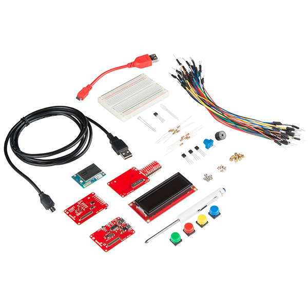

> Devastator 机器人套件
> 
> > 这是一个多功能机器人平台套件，其功能包括避障、实时监控和全方位视角。

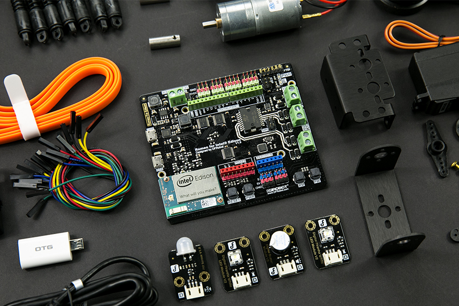

> **过时！**Grove 入门套件 Plus* - Intel® IoT 版
> 
> > 为创建创新的物联网解决方案提供了一套完整的硬件和软件资源。
> > 
> 用于 Intel® Edison 的 Grove 室内环境套件
> 
> > 使用 Grove*传感器创建完整的智能家居应用程序以测量室内环境。

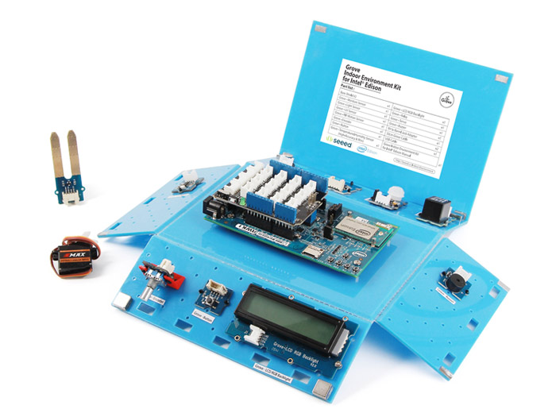

### Sparkfun

> SparkFun Electronics（有时被简称为 SFE）是美国科罗拉多州 Niwot 的一家电子零售商。它生产和销售微控制器开发板和拓展板。[Sparkfun](https://www.sparkfun.com/)

[Intel® Edison Sparkfun](https://www.sparkfun.com/categories/272)

### Seeed Studio

> Seeed 是一个硬件创新平台，为创客将灵感转化为具有差异化的产品提供支持。通过与各种规模的技术提供商密切合作，Seeed 提供质量、速度和供应链知识丰富的可访问技术。当原型准备好迭代时，Seeed 通过内部工程、供应链管理和敏捷制造力量帮助将产品量产 1 至 1,000 个。Seeed 还与孵化器、中国科技生态系统、投资者和分销渠道合作，将创客初创公司引向更远的地方。[Seeed Studio](http://www.seeedstudio.com/depot/)

[SeedStudio Grove - Arduino 入门套件](http://www.seeedstudio.com/depot/Grove-Starter-Kit-for-Arduino-p-1855.html)

### Adafruit

> Adafruit Industries 是由 Limor Fried 于 2005 年创立的开源硬件公司。该公司设计和制造多种电子产品，通过其在线商店销售各种电子元件、工具和配件，并制作一系列学习资源，包括书面教程、儿童入门视频，以及互联网上历史最悠久的实况视频电子���示。[Adafruit Industries](https://www.adafruit.com/)

### DFRobot

> 成立于 2008 年，DFRobot 是一家机器人和开源硬件提供商，为硬件工程师、DIY 爱好者和互动设计师提供服务。我们不断增长的产品目录拥有超过 900 种组件和小部件，从传感器、机器人平台、通信模块到 3D 打印机。[DFRobot](http://www.dfrobot.com/)

+   [DFRobot Intel® Edison/Galileo 入门套件](http://www.dfrobot.com/index.php?route=product/product&path=166&product_id=1200#.ViDjFm1Ok_M)

### 其他

+   [ITEAD](https://www.itead.cc/)

+   [Polulu](https://www.pololu.com/)

+   [Maker Shed](http://www.makershed.com/)

+   [Sunfounder](http://www.amazon.co.uk/SunFounder/b/ref=bl_dp_s_web_3774577031?ie=UTF8&node=3774577031&field-lbr_brands_browse-bin=SunFounder)

+   [Relayr Wunderbar](http://www.dragoninnovation.com/projects/35-wunderbar-by-relayr)

+   [AllThingsTalk 商店](http://shop.smartliving.io/)

+   [顶级 DIY 电子商店供应商](http://www.instructables.com/id/Top-DIY-Electronics-Stores-Suppliers/)

+   [Intel Edison 音频模块](http://www.malinov.com/Home/sergeys-projects/audio-block-for-intel-edison)

### 项目：模拟传感器

实现一个函数来模拟一个传感器，数据将基于系统范围的网络 I/O 统计数据，使用 psutil Python 库，模拟传感器是为了在没有物理传感器的情况下实现

#### PSUtil

> psutil 是一个跨平台库，用于在 Python 中检索有关运行进程和系统利用率（CPU、内存、磁盘、网络）的信息。[Psutil 库](https://pypi.python.org/pypi/psutil)

安装所需的 Python 库

```
 root@edison:~# opkg install python-pip
    root@edison:~# pip install psutil 
```

转到您的 git "TheIoTLearningInitiative"存储库，在"InternetOfThings101"目录下

```
 root@board:~# cd TheIoTLearningInitiative/InternetOfThings101
    root@board:~/TheIoTLearningInitiative/InternetOfThings101# 
```

```
 root@edison:~/TheIoTLearningInitiative/InternetOfThings101# vi main.py 
```

```
#!/usr/bin/python

import psutil
import signal
import sys
import time

def functionDataSensor():
    netdata = psutil.net_io_counters()
    data = netdata.packets_sent + netdata.packets_recv
    return data

def functionSignalHandler(signal, frame):
    sys.exit(0)

if __name__ == '__main__':

    signal.signal(signal.SIGINT, functionSignalHandler)

    while True:
        print "Hello Internet of Things 101"
        print "Data Sensor: %s " % functionDataSensor()
        time.sleep(5)

# End of File 
```

```
root@edison:~/TheIoTLearningInitiative/InternetOfThings101# python main.py 
Hello Internet of Things 101
Data: 1877 
^Z
[2]+  Stopped(SIGTSTP)        python main.py 
```

```
root@edison:~/TheIoTLearningInitiative/InternetOfThings101# git add main.py 
root@edison:~/TheIoTLearningInitiative/InternetOfThings101# git commit -s
Internet of Things 101: 5.2.1 Sensors: Project: Data Collection

Implement a function to collect data, data will be based on system-wide
network I/O statistics using psutil python library, this will simulate
our sensor in case no physical sensor is available

Signed-off-by: Name LastName <email@gmail.com>

# Please enter the commit message for your changes. Lines starting
# with '#' will be ignored, and an empty message aborts the commit.
# On branch master
# Your branch is up-to-date with 'origin/master'.
#
# Changes to be committed:
#       modified:   main.py
#
[master 15b9441] Internet of Things 101: 5.2.1 Sensors: Project: Data Collection
 1 file changed, 7 insertions(+)
root@edison:~/TheIoTLearningInitiative/InternetOfThings101# 
```

```
root@edison:~/TheIoTLearningInitiative/InternetOfThings101# git push
Username for 'https://github.com': 
Password for 'https://xe1gyq@github.com': 
Counting objects: 4, done.
Delta compression using up to 2 threads.
Compressing objects: 100% (4/4), done.
Writing objects: 100% (4/4), 737 bytes | 0 bytes/s, done.
Total 4 (delta 1), reused 0 (delta 0)
To https://github.com/xe1gyq/TheIoTLearningInitiative.git
   ce05cfa..15b9441  master -> master
root@edison:~/TheIoTLearningInitiative/InternetOfThings101# 
```

```
root@edison:~/TheIoTLearningInitiative/InternetOfThings101# git show
commit 92e8b9f26a239952b9be9f9a06502c4334a66698
Author: Name LastName <email@gmail.com>
Date:   Sat Apr 30 23:00:38 2016 +0000

    Internet of Things 101: 5.2.1 Sensors: Project: Data Collection

    Implement a function to collect data, data will be based on system-wide
    network I/O statistics using psutil python library, this will simulate
    our sensor in case no physical sensor is available

    Signed-off-by: Name LastName <email@gmail.com>

diff --git a/InternetOfThings101/main.py b/InternetOfThings101/main.py
index f2f1045..9084e25 100644
--- a/InternetOfThings101/main.py
+++ b/InternetOfThings101/main.py
@@ -1,9 +1,15 @@
 #!/usr/bin/python

+import psutil
 import signal
 import sys
 import time

+def functionDataSensor():
+    netdata = psutil.net_io_counters()
+    data = netdata.packets_sent + netdata.packets_recv
+    return data
+
 def functionSignalHandler(signal, frame):
     sys.exit(0)

@@ -13,6 +19,7 @@ if __name__ == '__main__':

     while True:
         print "Hello Internet of Things 101"
+        print "Data Sensor: %s " % functionDataSensor()
         time.sleep(5)

 # End of File
(END) 
```

# 执行器

# 执行器

> 致动器是一种负责移动或控制机械或系统的电动机类型。它由能源驱动，通常是电流、液压流体压力或气压，并将该能量转换为运动。[维基百科](https://en.wikipedia.org/wiki/Actuator)

## 项目：数据等待

实现一个等待数据的函数，这将模拟我们的致动器，以防没有可用的物理致动器

转到您的 git "TheIoTLearningInitiative" 仓库，在 "InternetOfThings101" 目录下

```
 root@board:~# cd TheIoTLearningInitiative/InternetOfThings101
    root@board:~/TheIoTLearningInitiative/InternetOfThings101# 
```

```
 root@edison:~/TheIoTLearningInitiative/InternetOfThings101# vi main.py 
```

```
#!/usr/bin/python

import psutil
import signal
import sys
import time

def functionDataActuator():
    print "Data Actuator"

def functionDataSensor():
    netdata = psutil.net_io_counters()
    data = netdata.packets_sent + netdata.packets_recv
    return data

def functionSignalHandler(signal, frame):
    sys.exit(0)

if __name__ == '__main__':

    signal.signal(signal.SIGINT, functionSignalHandler)

    while True:
        print "Hello Internet of Things 101"
        print "Data Sensor: %s " % functionDataSensor()
        time.sleep(5)

# End of File 
```

```
root@edison:~/TheIoTLearningInitiative/InternetOfThings101# python main.py 
Hello Internet of Things 101
Data Sensor: 2380 
^Z
[3]+  Stopped(SIGTSTP)        python main.py 
```

```
root@edison:~/TheIoTLearningInitiative/InternetOfThings101# git add main.py 
root@edison:~/TheIoTLearningInitiative/InternetOfThings101# git commit -s
Internet of Things 101: 5.2.2 Actuators: Project: Data Wait

Implement a function to wait for data, this will simulate our actuator
in case no physical actuator is available

Signed-off-by: Name LastName <email@gmail.com>

# Please enter the commit message for your changes. Lines starting
# with '#' will be ignored, and an empty message aborts the commit.
# On branch master
# Your branch is up-to-date with 'origin/master'.
#
# Changes to be committed:
#       modified:   main.py
#
[master 9a1b981] Internet of Things 101: 5.2.2 Actuators: Project: Data Wait
 1 file changed, 3 insertions(+)
root@edison:~/TheIoTLearningInitiative/InternetOfThings101# 
```

```
root@edison:~/TheIoTLearningInitiative/InternetOfThings101# git push
Username for 'https://github.com': xe1gyq
Password for 'https://xe1gyq@github.com': 
Counting objects: 4, done.
Delta compression using up to 2 threads.
Compressing objects: 100% (4/4), done.
Writing objects: 100% (4/4), 597 bytes | 0 bytes/s, done.
Total 4 (delta 1), reused 0 (delta 0)
To https://github.com/xe1gyq/TheIoTLearningInitiative.git
   f928476..9a1b981  master -> master
root@edison:~/TheIoTLearningInitiative/InternetOfThings101# 
```

```
root@edison:~/TheIoTLearningInitiative/InternetOfThings101# git show
commit 9a1b981c1d0bbd000888c809c6cb310fa487c046
Author: Abraham Arce <xe1gyq@gmail.com>
Date:   Sat Apr 30 23:20:24 2016 +0000

    Internet of Things 101: 5.2.2 Actuators: Project: Data Wait

    Implement a function to wait for data, this will simulate our actuator
    in case no physical actuator is available

    Signed-off-by: Abraham Arce <xe1gyq@gmail.com>

diff --git a/InternetOfThings101/main.py b/InternetOfThings101/main.py
index 2b727e6..f6cdffa 100644
--- a/InternetOfThings101/main.py
+++ b/InternetOfThings101/main.py
@@ -5,6 +5,9 @@ import signal
 import sys
 import time

+def functionDataActuator():
+    print "Data Actuator"
+
 def functionDataSensor():
     netdata = psutil.net_io_counters()
     data = netdata.packets_sent + netdata.packets_recv
(END) 
```

# 框架

# 框架

# IoTivity

> IoTivity 是一个开源软件框架，可实现设备间无缝连接，以满足物联网新需求。
> 
> 欢迎来到 IoTivity，一个由开放互联联盟（OIC）赞助并由 Linux 基金会托管的开源项目。该项目旨在开发一个开源软件框架，无缝连接新兴物联网（IoT）中的数十亿设备，跨多个操作系统和网络协议。[IoTivity](https://www.iotivity.org/)
> 
> 支持通信协议

特点

+   面向 IoT 应用程序开发人员的高级 API

+   将“物”公开为资源

+   在多个网络传输中发现和操作资源

+   利用新兴的物联网技术

[IoTivity 主页](https://www.iotivity.org/) [IoTivity 和嵌入式 Linux 支持](http://events.linuxfoundation.org/sites/events/files/slides/LFPresentationSlides.pdf)

# AllJoyn® 框架

> AllJoyn 是一个开源软件框架，使设备和应用程序能够发现和相互通信。开发人员可以编写与传输层、制造商无关的应用程序，并且无需互联网访问。该软件已经并将继续对开发人员免费提供下载，并运行在流行平台上，如 Linux 和基于 Linux 的 Android、iOS 和 Windows，包括许多其他轻量级实时操作系统。

[AllSeen Alliance AllJoyn® 框架主页](https://allseenalliance.org/framework)

# Eclipse IoT

> IoT 工作组促进创建可扩展的服务和框架，使 IoT 应用程序能够在开放的 API 之上运行。
> 
> Eclipse IoT 工作组是一个由组织和个人共同合作的团体，他们的目标是创建一个开放的物联网。合作重点是开发、推广和采用开源物联网技术。我们的许多成员提供了许多基于 Eclipse IoT 技术的项目和服务。

[Eclipse IoT 主页](http://iot.eclipse.org/)

# Thing 系统

> 你的生活和你的房子从一个计算机变成了物联网。从平板电脑到灯泡，从传感器到媒体盒子，每个人都有自己的互联网。今天，你必须与你的物品作斗争。它们彼此不说话，应用程序不起作用，这是一个巴别塔。我们的解决方案——物联网系统——是开源的。我们会与任何东西交谈，你可以黑掉系统，它有一个开放的 API。通过物联网系统，你最终可以掌控你的物品。

[物联网系统主页](http://thethingsystem.com)

# ARM mbed

> ARM® mbed™ 物联网设备平台是基于 ARM 微控制器创建商业化和可互操作的连接物联网设备的最快途径。

+   [ARM mbed](https://www.mbed.com/en/)

+   [ARM mbed 物联网设备平台](https://www.arm.com/products/internet-of-things-solutions/mbed-IoT-device-platform.php)

# 其他框架

+   [Kaa](http://www.kaaproject.org/)

+   [Mago](http://infiniteautomation.com/forum)

+   [Nimbits](http://www.nimbits.com/index.jsp)

+   [OpenIoT](https://github.com/OpenIotOrg/openiot/wiki)

+   [OpenRemote](http://www.openremote.com/)

+   [Arduino](https://www.arduino.cc/)

+   [DeviceHubNet](https://www.devicehub.net/)

+   [物联网工具包](http://iot-toolkit.com/)

+   [OpenWSN](https://openwsn.atlassian.net/wiki/display/OW/Home)

+   [Particle](https://www.particle.io/)

+   [SiteWhere](http://www.sitewhere.org/)

+   [ThingSpeak](https://thingspeak.com/)

+   [Webinos](http://webinos.org/)

+   [Zetta](http://www.zettajs.org/)

+   [Octoblu](https://octoblu.com/)

+   [工程精要：物联网标准与框架](http://electronicdesign.com/iot/engineering-essentials-iot-standards-and-frameworks)

+   [Cayenne](http://www.cayenne-mydevices.com/)

+   [Flowthings](https://flowthings.io/)

# 网关

# 网关

> 网关硬件可以是一系列基于英特尔和 ARM 架构的板…… Ayla Networks、Solair 和 Dell 提供自己的网关硬件来运行其网关软件。Paasmer 提供了来自 Intel、Qualcomm、Mediatek、Element14 等供应商的网关选择，配备在任何这些硬件上运行的 Edge 操作系统。大多数平台在一段时间内构建了它们的自下而上的堆栈 [如何选择您的物联网平台架构？](http://computer.financialexpress.com/news/how-to-choose-your-iot-platform-architecture/18291/#sthash.8A8PT9K8.JBX5CUyS.dpuf)
> 
> 今天解锁数据价值，而无需更换设备 [英特尔智能网关解决方案转型物联网业务](http://www.intel.com/content/www/us/en/internet-of-things/gateway-solutions.html)

它们为什么存在？

+   未连接的设备

+   系统始终连接并监视

+   本地过滤和分析

架构

+   板支持包

+   连接性

+   安全性

+   可管理性

+   运行环境

+   云连接器（生态系统应用和服务，客户）

+   开发环境（定制版 Eclipse）

特性

+   边缘到云的连接

+   远程输入/输出

+   可扩展性

+   支持多种协议

+   应用软件

# Intel® 物联网网关

> 使用英特尔® 物联网网关更快、更灵活地开发物联网解决方案
> 
> 英特尔® 物联网网关为开发人员提供了灵活性，可以为各种业务领域创建和部署创新、经济实惠和安全的物联网解决方案。英特尔物联网网关提供了不同应用需求的英特尔® 处理器选择，支持多种操作系统（Wind River 和 Ubuntu *Linux*，微软 Windows* 10 等），以及强大的设备管理功能。

+   [英特尔® 物联网网关：入门指南](https://www-ssl.intel.com/content/www/us/en/embedded/solutions/iot-gateway/overview.html)

+   [通过物联网智能网关解决方案改变业务](http://www.intel.com/content/www/us/en/internet-of-things/gateway-solutions.html)

+   [宣布英特尔® 物联网开发套件支持英特尔物联网网关](https://software.intel.com/en-us/blogs/2016/02/22/announcing-intel-iot-developer-kit-support-for-intel-iot-gateways)

## 模型

+   英特尔® 物联网网关开发套件 DK50 系列

+   英特尔® 物联网网关开发套件 DK100 系列

+   英特尔® 物联网网关开发套件 DK200 系列

+   思科 500 系列 WPAN 工业路由器

+   思科® 809 工业集成服务路由器

+   思科® 829 工业集成服务路由器

+   思科® 910 工业路由器

+   戴尔 Edge Gateway 5000 系列

+   戴尔 Edge Gateway 5100 系列

+   TRACe G304-TR

+   康特龙 Cobalt 901

+   COBALT 902 情境感知

+   Trace C104-IV

+   惠普 Edgeline EL10 智能网关系列

+   惠普 Edgeline EL20 智能网关系列

+   AAEON 基于英特尔的网关解决方案

+   大同基于英特尔的网关解决方案

+   NEXCOM 基于英特尔的网关解决方案

+   ADLINK 基于英特尔的网关解决方案

+   安华高 UTX-3115

+   安华高 AIMB-115

# 通讯

# 通讯

物联网通信基础知识来自[微软在 TechEd 北美大会上的物联网架构](https://www.youtube.com/watch?v=ZMHQu_X0Ijk)

使用案例

+   遥测：从设备流向其他系统的信息，用于传达设备和环境的状态

+   询问：设备发出的请求，以获取所需信息或启动活动，我没问题！

+   命令：来自其他系统的命令，用于让设备或一组设备执行特定活动

+   通知：从其他系统流向设备（组）的信息，用于传达状态变化

# 通信网络 OSI 模型

> 开放系统互连模型（OSI 模型）是一个概念模型，用于描述和标准化电信或计算系统的通信功能，而不考虑其底层内部结构和技术。其目标是通过标准协议实现各种通信系统的互操作性。该模型将通信系统划分为抽象层。该模型的原始版本定义了七层。[维基百科](https://en.wikipedia.org/wiki/OSI_model)

# 连接性

# 连接性

> Artik.Io 这是我们称之为 IoT 101 系列教程的第一篇... [Artik IoT 101 连通性](https://www.artik.io/blog/2015/iot-101-connectivity)
> 
> 在我们的物联网 101 系列中的这一部分，我们将讨论如何根据您希望与物联网交互的方式选择网络协议... [Artik.Io 物联网 101 网络](https://www.artik.io/blog/2015/iot-101-networks)

+   [Postscapes 物联网蜂窝开发套件](http://postscapes.com/cellular-internet-of-things-development-kits)

# 电话技术

3G、4G、LTE

# WiFi

+   IEEE 802.11

+   IEEE 802.11b

+   IEEE 802.11g

+   IEEE 802.11n

+   [英特尔® Edison Wi-Fi 指南](https://software.intel.com/en-us/articles/intel-edison-wi-fi-guide)

+   [全球最低功耗 WiFi：Atmel | SMART SAM W25 Wi-Fi for IoT with ARM Cortex-M0+](https://www.youtube.com/watch?v=pOFU0KCly80)

## WiFi HaLow

> Wi-Fi HaLow 在一千兆赫以下频段运行，提供更长的范围，更低功耗的连接

+   [Wi-Fi 联盟® 推出低功耗、长距离 Wi-Fi HaLow™](https://www.wi-fi.org/news-events/newsroom/wi-fi-alliance-introduces-low-power-long-range-wi-fi-halow)

# Wi-Gig

> WiGig 规范允许设备以多千兆速度无线通信。它支持高性能无线数据、显示和音频应用，以补充先前无线局域网设备的功能。维基百科

+   [无线千兆联盟 维基百科](https://en.wikipedia.org/wiki/Wireless_Gigabit_Alliance)

# 蓝牙

> 蓝牙是一种用于在短距离内交换数据的无线技术标准（使用 2.4 至 2.485 GHz 的短波长 UHF 无线电波）从固定和移动设备，以及构建个人局域网（PANs）。[维基百科](https://en.wikipedia.org/wiki/Bluetooth)

## 低功耗蓝牙

> 低功耗蓝牙（Bluetooth LE, BLE，作为 Bluetooth Smart 销售）是蓝牙特别兴趣组设计和市场推广的一种无线个人局域网技术，旨在应用于医疗保健、健身、信标、安全和家庭娱乐等新颖行业。与经典蓝牙相比，蓝牙智能旨在在保持类似通信范围的情况下大幅降低功耗和成本... *来自维基百科，自由的百科全书*

+   [维基百科 蓝牙配置文件](https://en.wikipedia.org/wiki/List_of_Bluetooth_profiles)

+   [网关智能入门套件](https://www.bluetooth.com/develop-with-bluetooth/developer-resources-tools/gateway?s=google2016&gclid=Cj0KEQiA3t-2BRCKivi-suDY24gBEiQAX1wiXFnagz0rAOa1bUa8ySwFFisOAraUewlTnmDWuG77-X0aAo128P8HAQ)

## 蓝牙智能网状

+   [EETimes 蓝牙智能网状](http://www.eetimes.com/document.asp?doc_id=1325815)

## iBeacon

> iBeacon 是由苹果开发的协议，于 2013 年在苹果全球开发者大会上推出。各种厂商此后开发了兼容 iBeacon 的硬件发射器 - 通常称为信标 - 一种蓝牙低能耗 (LE) 设备类，可以向附近的便携式电子设备广播其标识符。该技术使智能手机、平板电脑和其他设备能够在接近 iBeacon 时执行操作。[维基百科](https://en.wikipedia.org/wiki/IBeacon)

+   [Estimote](http://estimote.com/)

## 蓝牙 @ 英特尔® Edison

+   [英特尔® Edison 蓝牙指南](http://www.intel.com/support/edison/sb/CS-035381.htm)

+   [英特尔® Edison SPP](https://software.intel.com/en-us/articles/connecting-the-intel-edison-board-to-your-android-phone-with-serial-port-profile-spp)

### 配对

```
 root@galileo:~# rfkill unblock bluetooth
    root@galileo:~# bluetoothctl
    [bluetooth]# scan on
    [bluetooth]# scan off
    [bluetooth]# pair 40:78:6A:26:4A:C2
    [bluetooth]# connect 40:78:6A:26:4A:C2
    [bluetooth]# paired-devices
    [bluetooth]# info 40:78:6A:26:4A:C2
    [bluetooth]# exit
    root@edison:~# rfcomm bind - 40:78:6A:26:4A:C2 1
    root@edison:~# ls /dev/rfcomm0 
```

### 蓝牙耳机

```
 root@edison:~# rfkill unblock bluetooth
    root@edison:~# bluetoothctl
    root@edison:~# scan on
    root@edison:~# pair 40:78:6A:26:4A:C1
    root@edison:~# connect 40:78:6A:26:4A:C1
    root@edison:~# quit
    root@edison:~# pactl list sinks
    root@edison:~# pactl set-default-sink bluez_sink.40_78_6A_26_4A_C1
    root@edison:~# gst-launch-1.0 filesrc location=sample.wav ! waveparse ! pulsesink
    root@edison:~# paired-devices
    root@edison:~# remove 40:78:6A:26:4A:C1 
```

# LoRa

> LoRa® 联盟是一个由成员组成的开放性、非盈利性协会，他们认为物联网时代已经到来。我们的使命是标准化部署在全球范围内的低功耗广域网 (LPWAN)，以支持物联网 (IoT)、机器对机器 (M2M)、智能城市和工业应用。联盟成员将共同努力，通过分享知识和经验，确保运营商在一个开放的全球标准下之间的互操作性，以推动 LoRa 协议 (LoRaWAN) 的全球成功。
> 
> LoRaWAN 设计用于提供具有特定于支持低成本、移动、安全的双向通信所需特性的低功耗广域网络，用于物联网 (IoT)、机器对机器 (M2M)、智能城市和工业应用。它经过了低功耗优化，支持具有数百万甚至数千万设备的大型网络。它具有创新的功能，支持冗余运行、位置、低成本、低功耗，甚至可以在能源收集技术上运行，从而实现物联网的移动性和易用性。

+   [LoRa 主页](https://www.lora-alliance.org/)

# ZigBee

> ZigBee 是用于创建由小型、低功率数字无线电构建的个人区域网络的一套高级通信协议的规范。ZigBee 基于 IEEE 802.15.4 标准。其低功耗限制了传输距离为 10-100 米的视线距离，取决于输出功率和环境特性... *来自维基百科，自由的百科全书*

[ZigBee 联盟](http://www.zigbee.org/)

# Z-Wave

> Z-Wave 是一种无线通信规范，旨在使家庭中的设备（例如照明、门禁、娱乐系统和家用电器）能够相互通信，以实现家庭自动化... *来自维基百科，自由的百科全书*

+   [Z-Wave 主页](http://www.z-wave.com/)

+   [将 Z-Wave 数据发布到 Node Red](https://www.ibm.com/developerworks/community/blogs/cee6c09c-a315-4b04-ad14-57d6a60fa8bb/entry/post_z_wave_data_to_node_red?lang=en)

# 线程

> IoT 领域中的一项较新标准，由谷歌旗下智能家居电器初创公司 Nest 使用。该标准背后的工作组包括三星、ARM 控股、飞思卡尔、硅实验室和大风扇公司。Thread 创建了一个支持云访问和 AES 加密的最多可连接 250 个设备的 IP 地址网格网络。

[Thread Group 主页](http://threadgroup.org/)

# HomeKit

> HomeKit 被认为是一个通过 Wi-Fi 和蓝牙将苹果制造和苹果认证设备联合起来的平台。苹果已经公布了一份包括 iHome、海尔、Withings、飞利浦、iDevices、Belkin、Honeywell 和 Kwikset 在内的合作伙伴名单。

# 协议

# 协议

> 在电信领域，通信协议是一套规则系统，允许通信系统的两个或多个实体通过任何一种物理量的变化传输信息。这些规则或标准定义了通信的语法、语义和同步以及可能的错误恢复方法。协议可以由硬件、软件或二者组合实现。[维基百科](https://en.wikipedia.org/wiki/Communications_protocol)

+   [Postscapes 物联网协议与标准](http://postscapes.com/internet-of-things-protocols)

# IPv6

> 互联网协议第 6 版（IPv6）是互联网协议（IP）的最新版本，提供了用于网络上计算机的识别和定位系统以及在互联网上路由流量的通信协议。IPv6 由互联网工程任务组（IETF）开发，以解决 IPv4 地址枯竭的长期问题。IPv6 旨在取代 IPv4。维基百科

+   [IPv6 维基百科](https://en.wikipedia.org/wiki/IPv6)

# Ajax，Web 服务，RESTful 通信协议

> 这些协议建立在 HTTP 之上，因此受到与 HTTP 相同的限制。许多这些协议还需要大量处理，并具有庞大的代码规模。许多服务提供商推广使用这些协议，因为它们的后端基础设施基于标准的 Web 服务器，无法处理除 HTTP 之外的任何其他类型的协议。

+   [思科 DevNet REST](https://developer.cisco.com/site/devnet/learn/coding-101-tutorial/#rest-in-action:-now-let's-try-it!)

# RESTful API（表述状态转移）

> 在计算领域，表述状态转移（REST）是万维网的软件架构风格。REST 的一系列协调约束，应用于分布式超媒体系统中组件的设计，可以导致性能更高、更易维护的软件架构。[维基百科](https://en.wikipedia.org/wiki/Representational_state_transfer)
> 
> 在系统遵循 REST 约束的程度上，可以称为 RESTful。RESTful 系统通常但不总是使用超文本传输协议（HTTP）进行通信，使用与 web 浏览器用于检索网页和向远程服务器发送数据相同的 HTTP 动词（GET、POST、PUT、DELETE 等）。[4] REST 系统与外部系统接口，作为统一资源标识符（URI）标识的 Web 资源进行操作，例如/people/tom，可以使用标准动词操作，例如 DELETE /people/tom。[Wikipedia](https://en.wikipedia.org/wiki/Representational_state_transfer)

+   [学习 REST：教程](http://rest.elkstein.org/)

## Python API 创建

> 创建和公开 API 允许您的 Web 应用程序通过机器对机器通信与其他应用程序进行交互。API 创建框架... [FullStackPython](http://www.fullstackpython.com/api-creation.html)

## Flask API

> Flask 是一个基于 Werkzeug、Jinja 2 和良好意图的 Python 微框架。[Flask 主页](http://flask.pocoo.org/)

[Flask 的可浏览 Web API](http://www.flaskapi.org/)

## Flask-RESTful

> Flask-RESTful 是 Flask 的扩展，为快速构建 REST API 提供支持。它是一个轻量级的抽象，可以与您现有的 ORM/库一起使用。Flask-RESTful 通过最小的设置鼓励最佳实践。如果您熟悉 Flask，那么 Flask-RESTful 应该很容易上手。[Flask-RESTful 文档](http://flask-restful.readthedocs.org/en/latest/index.html)
> 
> 是时候编写你的第一个 REST API 了。本指南假定您对 Flask 有一定的了解，并且您已经安装了 Flask 和 Flask-RESTful。这里

```
 root@board:~# pip install flask-restful
    Downloading/unpacking Flask
      Downloading Flask-0.10.1.tar.gz (544kB): 544kB downloaded
    Downloading/unpacking flask-restful
      Downloading Flask-RESTful-0.3.5.tar.gz (102kB): 102kB downloaded
    Downloading/unpacking aniso8601>=0.82 (from flask-restful)
      Downloading aniso8601-1.1.0.tar.gz (49kB): 49kB downloaded
    Downloading/unpacking python-dateutil (from aniso8601>=0.82->flask-restful)
      Downloading python-dateutil-2.5.1.tar.gz (235kB): 235kB downloaded
    Installing collected packages: Flask flask-restful, aniso8601, python-dateutil
    Successfully installed Flask flask-restful aniso8601 python-dateutil
    Cleaning up...
    root@board:~# 
```

### 实验室：Flask-Restful

```
 root@board:~# vi mainflask.py 
```

```
#!/usr/bin/python

from flask import Flask
from flask_restful import Api, Resource

app = Flask(__name__)
api = Api(app)

class DataSensorRestApi(Resource):
    def get(self):
        data = 'This is data from a sensor'
        return data

api.add_resource(DataSensorRestApi, '/datasensor')

if __name__ == '__main__':
    app.run(host='0.0.0.0', debug=True) 
```

```
 root@board:~# python mainflask.py
     * Running on http://127.0.0.1:5000/ (Press CTRL+C to quit)
     * Restarting with stat
     * Debugger is active!
     * Debugger pin code: 331-202-890 
```

在网页浏览器中连接到你的板子 IP 地址:5000/datasensor...

连接后，你的板子将显示在终端下：

```
 127.0.0.1 - - [28/Dec/2015 15:07:38] "GET /datasensor HTTP/1.1" 200 -
    127.0.0.1 - - [28/Dec/2015 15:07:40] "GET /datasensor HTTP/1.1" 200 - 
```

连接后，你的浏览器将显示：

```
"This is data from a sensor" 
```

# MQTT

> MQTT 是用于机器对机器（M2M）通信的轻量级协议。MQTT 使用基于 TCP/IP 协议的发布/订阅消息转发模型。[MQTT 主页](http://mqtt.org/)
> 
> MQTT 是一种机器对机器（M2M）/"物联网"连接协议。它被设计为一种极轻量级的发布/订阅消息传输。它适用于需要小代码占用空间和/或网络带宽有限的远程位置的连接。

+   [MQTT Protocol Specification](http://www.ibm.com/developerworks/library/ws-mqtt/)

+   [HiveMQ MQTT Essentials: Part 1 – Introducing MQTT](http://www.hivemq.com/blog/mqtt-essentials-part-1-introducing-mqtt)

+   [HiveMQ MQTT Essentials Wrap-Up](http://www.hivemq.com/blog/mqtt-essentials-wrap-up)

+   [HiveMQ MQTT Essentials Part 6: Quality of Service 0, 1 & 2](http://www.hivemq.com/mqtt-essentials-part-6-mqtt-quality-of-service-levels/)

## 核心消息

+   连接

+   断开连接

+   发布

+   订阅

+   取消订阅

## 服务质量

+   0, 1, 2

## 服务器实现

+   IBM MQ

+   IBM Microbroker

+   RSMB

+   Mosquitto

+   MQTT.js

+   Apache ActiveMQ

+   RabbitMQ

+   [Adafruit MQTT API](https://learn.adafruit.com/adafruit-io/mqtt-api)

+   [Microsoft Azure](http://iotmakerdendashboard.azurewebsites.net/install/publish.htm)

## 客户端

+   C/C++/C#

+   Java

+   Perl

+   Python

+   PHP

+   Rex

+   Ruby

+   Arduino

### Mosquitto

> Mosquitto 是一个实现 MQ Telemetry Transport 协议版本 3.1 和 3.1.1 的开源（BSD 许可证）消息代理，MQTT 提供了使用发布/订阅模型进行消息传递的轻量级方法。
> 
> MQTT（又名 mosquitto）非常适合移动和嵌入式设备，因为其具有轻量级（在处理、内存管理和带宽上）的消息传递协议。
> 
> 对于此协议，请注意其基本上缺乏加密，否则将为连接添加重要的开销。应用层安全性需要大量工作。

[Mosquitto 主页](http://mosquitto.org/)

#### Mosquitto Intel® Edison 设置

我们应该在基于最新版本的 Linux Yocto 的版本中拥有所有 Mosquitto MQTT 工具

+   [在 Intel Edison 旧版本上构建和运行 Mosquitto MQTT](https://software.intel.com/en-us/blogs/2015/02/20/building-and-running-mosquitto-mqtt-on-intel-edison)

+   [仅需几分钟即可将传感器网络和设备连接到云端的解决方案简介](https://software.intel.com/sites/default/files/managed/52/10/IBM_Connecting_Sensor_Networks_and_Devices_Cloud_Minutes_Rev1_2.pdf)

#### Mosquitto Intel® Galileo 设置

```
 root@galileo:~# wget http://mosquitto.org/files/source/mosquitto-1.3.5.tar.gz
    root@galileo:~# tar xvf mosquitto-1.3.5.tar.gz
    root@galileo:~# cd mosquitto-1.3.5
    root@galileo:~# make -j3 WITH_SRV=no
    root@galileo:~# adduser mosquitto
    root@galileo:~# cd test/broker
    root@galileo:~# make -j3 test
    root@galileo:~# cd ../../
    root@galileo:~# cp client/mosquitto_pub /usr/bin
    root@galileo:~# cp client/mosquitto_sub /usr/bin
    root@galileo:~# cp lib/libmosquitto.so.1 /usr/lib
    root@galileo:~# cp src/mosquitto /usr/bin 
```

#### Mosquitto 应用程序

```
root@board:~# mosquitto
1462105305: Error: Invalid user 'mosquitto'.
root@board:~# mosquitto_sub
Error: You must specify a topic to subscribe to.
mosquitto_sub is a simple mqtt client that will subscribe to a single topic and print all messages it . 
...
root@board:~# mosquitto_pub
Error: You must specify a topic to subscribe to.
mosquitto_sub is a simple mqtt client that will subscribe to a single topic and print all messages it .
... 
```

#### Mosquitto 演示温度计

转到 [`test.mosquitto.org/gauge/`](http://test.mosquitto.org/gauge/) 并执行

```
 root@platform:~# mosquitto_pub -h test.mosquitto.org -t temp/random -m 23.0 
```

#### Mosquitto MQTT 服务器/代理

作为订阅者

```
 root@board:~# mosquitto_sub -h test.mosquitto.org -p 1883 -t IoT101/# 
```

作为发布者

```
 root@board:~# mosquitto_pub -h test.mosquitto.org -p 1883 -t IoT101/all -m "Hello All Operators!" 
```

查看以下命令的输出

```
 root@board:~# mosquitto_sub -h test.mosquitto.org -t "#" -v 
```

## 项目：MQTT 发布

> Eclipse Paho MQTT Python 客户端库，实现了 MQTT 协议的版本 3.1 和 3.1.1。[Paho Mqtt](https://pypi.python.org/pypi/paho-mqtt)

通过 MQTT 协议在"IoT101/DataSensor"主题下使用 test.mosquitto.org 服务器发布传感器数据

转到您的 git "TheIoTLearningInitiative" 仓库，在 "InternetOfThings101" 目录下

```
 root@board:~# cd TheIoTLearningInitiative/InternetOfThings101
    root@board:~/TheIoTLearningInitiative/InternetOfThings101# 
```

```
 root@edison:~/TheIoTLearningInitiative/InternetOfThings101# vi main.py 
```

```
#!/usr/bin/python

import paho.mqtt.client as paho
import psutil
import signal
import sys
import time

from threading import Thread

def functionDataActuator():
    print "Data Actuator"

def functionDataSensor():
    netdata = psutil.net_io_counters()
    data = netdata.packets_sent + netdata.packets_recv
    return data

def functionDataSensorMqttOnPublish(mosq, obj, msg):
    print "Data Sensor Mqtt Published!"

def functionDataSensorMqttPublish():
    mqttclient = paho.Client()
    mqttclient.on_publish = functionDataSensorMqttOnPublish
    mqttclient.connect("test.mosquitto.org", 1883, 60)
    while True:
        data = functionDataSensor()
        topic = "IoT101/DataSensor"
        mqttclient.publish(topic, data)
        time.sleep(1)

def functionSignalHandler(signal, frame):
    sys.exit(0)

if __name__ == '__main__':

    signal.signal(signal.SIGINT, functionSignalHandler)

    threadmqttpublish = Thread(target=functionDataSensorMqttPublish)
    threadmqttpublish.start()

    while True:
        print "Hello Internet of Things 101"
        print "Data Sensor: %s " % functionDataSensor()
        time.sleep(5)

# End of File 
```

执行 main.py 并观察其输出，使用 mosquitto_sub 应用程序或任何 MQTT 手机应用程序监听传感器数据，使用 test.mosquitto.org 服务器订阅 "IoT101/DataSensor"

```
 root@board:~# mosquitto_sub -h test.mosquitto.org -p 1883 -t IoT101/DataSensor 
```

```
root@edison:~/TheIoTLearningInitiative/InternetOfThings101# python main.py 
Hello Internet of Things 101
Data Sensor: 5385 
Data Sensor Mqtt Published!
Data Sensor Mqtt Published!
Data Sensor Mqtt Published!
Data Sensor Mqtt Published!
Data Sensor Mqtt Published!
Hello Internet of Things 101
Data Sensor: 5436 
Data Sensor Mqtt Published!
Data Sensor Mqtt Published!
Data Sensor Mqtt Published!
Data Sensor Mqtt Published!
Data Sensor Mqtt Published!
Hello Internet of Things 101
Data Sensor: 5466 
Data Sensor Mqtt Published!
^Z
[7]+  Stopped(SIGTSTP)        python main.py
root@edison:~/TheIoTLearningInitiative/InternetOfThings101# 
```

```
root@edison:~/TheIoTLearningInitiative/InternetOfThings101# git add main.py 
root@edison:~/TheIoTLearningInitiative/InternetOfThings101# git commit -s
Internet of Things 101: 5.4.2 Protocols: Project: MQTT Publish

Publish sensor data through MQTT Protocol using test.mosquitto.org
server under "IoT101/DataSensor" topic

Signed-off-by: Name LastName <email@gmail.com>

# Please enter the commit message for your changes. Lines starting
# with '#' will be ignored, and an empty message aborts the commit.
# On branch master
# Your branch is up-to-date with 'origin/master'.
#
# Changes to be committed:
#       modified:   main.py
#
master 79c53c7] Internet of Things 101: 5.4.2 Protocols: Project: MQTT Publish
 1 file changed, 19 insertions(+)
root@edison:~/TheIoTLearningInitiative/InternetOfThings101# 
```

```
root@edison:~/TheIoTLearningInitiative/InternetOfThings101# git push
Username for 'https://github.com': xe1gyq
Password for 'https://xe1gyq@github.com': 
Counting objects: 4, done.
Delta compression using up to 2 threads.
Compressing objects: 100% (4/4), done.
Writing objects: 100% (4/4), 1014 bytes | 0 bytes/s, done.
Total 4 (delta 0), reused 0 (delta 0)
To https://github.com/xe1gyq/TheIoTLearningInitiative.git
   9a1b981..79c53c7  master -> master
root@edison:~/TheIoTLearningInitiative/InternetOfThings101# 
```

```
root@edison:~/TheIoTLearningInitiative/InternetOfThings101# git show
commit 79c53c7bd039f77a3c895ef6e66d977648fa970c
Author: Name LastName <email@gmail.com>
Date:   Sun May 1 13:23:20 2016 +0000

    Internet of Things 101: 5.4.2 Protocols: Project: MQTT Publish

    Publish sensor data through MQTT Protocol using test.mosquitto.org
    server under "IoT101/DataSensor" topic

    Signed-off-by: Name LastName <email@gmail.com>

diff --git a/InternetOfThings101/main.py b/InternetOfThings101/main.py
index f6cdffa..1b27944 100644
--- a/InternetOfThings101/main.py
+++ b/InternetOfThings101/main.py
@@ -1,10 +1,13 @@
 #!/usr/bin/python

+import paho.mqtt.client as paho
 import psutil
 import signal
 import sys
 import time

+from threading import Thread
+
 def functionDataActuator():
     print "Data Actuator"

@@ -13,6 +16,19 @@ def functionDataSensor():
     data = netdata.packets_sent + netdata.packets_recv
     return data

+def functionDataSensorMqttOnPublish(mosq, obj, msg):
+    print "Data Sensor Mqtt Published!"
+
+def functionDataSensorMqttPublish():
+    mqttclient = paho.Client()
+    mqttclient.on_publish = functionDataSensorMqttOnPublish
+    mqttclient.connect("test.mosquitto.org", 1883, 60)
+    while True:
+        data = functionDataSensor()
+        topic = "IoT101/DataSensor"
+        mqttclient.publish(topic, data)
+        time.sleep(1)
+
 def functionSignalHandler(signal, frame):
     sys.exit(0)

@@ -20,6 +36,9 @@ if __name__ == '__main__':

     signal.signal(signal.SIGINT, functionSignalHandler)

+    threadmqttpublish = Thread(target=functionDataSensorMqttPublish)
+    threadmqttpublish.start()
+
     while True:
         print "Hello Internet of Things 101"
         print "Data Sensor: %s " % functionDataSensor()
(END) 
```

## 项目：MQTT 订阅

通过 MQTT 协议订阅"IoT101/DataActuator"主题，使用 test.mosquitto.org 服务器更改数据执行器的状态

转到您的 git "TheIoTLearningInitiative" 仓库，在 "InternetOfThings101" 目录下

```
 root@board:~# cd TheIoTLearningInitiative/InternetOfThings101
    root@board:~/TheIoTLearningInitiative/InternetOfThings101# 
```

```
 root@edison:~/TheIoTLearningInitiative/InternetOfThings101# vi main.py 
```

```
#!/usr/bin/python

import paho.mqtt.client as paho
import psutil
import signal
import sys
import time

from threading import Thread

def functionDataActuator(status):
    print "Data Actuator Status %s" % status

def functionDataActuatorMqttOnMessage(mosq, obj, msg):
    print "Data Sensor Mqtt Subscribe Message!"
    functionDataActuator(msg.payload)

def functionDataActuatorMqttSubscribe():
    mqttclient = paho.Client()
    mqttclient.on_message = functionDataActuatorMqttOnMessage
    mqttclient.connect("test.mosquitto.org", 1883, 60)
    mqttclient.subscribe("IoT101/DataActuator", 0)
    while mqttclient.loop() == 0:
        pass

def functionDataSensor():
    netdata = psutil.net_io_counters()
    data = netdata.packets_sent + netdata.packets_recv
    return data

def functionDataSensorMqttOnPublish(mosq, obj, msg):
    print "Data Sensor Mqtt Published!"

def functionDataSensorMqttPublish():
    mqttclient = paho.Client()
    mqttclient.on_publish = functionDataSensorMqttOnPublish
    mqttclient.connect("test.mosquitto.org", 1883, 60)
    while True:
        data = functionDataSensor()
        topic = "IoT101/DataSensor"
        mqttclient.publish(topic, data)
        time.sleep(1)

def functionSignalHandler(signal, frame):
    sys.exit(0)

if __name__ == '__main__':

    signal.signal(signal.SIGINT, functionSignalHandler)

    threadmqttpublish = Thread(target=functionDataSensorMqttPublish)
    threadmqttpublish.start()

    threadmqttsubscribe = Thread(target=functionDataActuatorMqttSubscribe)
    threadmqttsubscribe.start()

    while True:
        print "Hello Internet of Things 101"
        print "Data Sensor: %s " % functionDataSensor()
        time.sleep(5)

# End of File 
```

执行 main.py 并观察其输出，并使用 mosquitto_pub 应用程序或任何 MQTT 手机应用程序使用 test.mosquitto.org 服务器发布执行器数据，发布到 "IoT101/DataActuator"

```
 root@board:~# mosquitto_pub -h test.mosquitto.org -p 1883 -t IoT101/DataActuator -m On
    root@board:~# mosquitto_pub -h test.mosquitto.org -p 1883 -t IoT101/DataActuator -m Off 
```

```
root@edison:~/TheIoTLearningInitiative/InternetOfThings101# python main.py                     Hello Internet of Things 101
Data Sensor: 10369 
Data Sensor Mqtt Published!
Data Sensor Mqtt Published!
Data Sensor Mqtt Published!
Data Sensor Mqtt Published!
Data Sensor Mqtt Published!
Data Sensor Mqtt Subscribe Message!
Data Actuator Status On
Hello Internet of Things 101
Data Sensor: 10450 
Data Sensor Mqtt Published!
Data Sensor Mqtt Published!
Data Sensor Mqtt Subscribe Message!
Data Actuator Status Off
Data Sensor Mqtt Published!
Data Sensor Mqtt Published!
Data Sensor Mqtt Published!
^Z[1]   Killed                  python main.py

[2]+  Stopped(SIGTSTP)        python main.py
root@edison:~/TheIoTLearningInitiative/InternetOfThings101# 
```

```
root@edison:~/TheIoTLearningInitiative/InternetOfThings101# git add main.py 
root@edison:~/TheIoTLearningInitiative/InternetOfThings101# git commit -s
Internet of Things 101: 5.4.2 Protocols: Project: MQTT Subscribe

Subscribe to "IoT101/DataActuator" topic through MQTT Protocol using 
test.mosquitto.org server to change the status of Data Actuator

Signed-off-by: Name LastName <email@gmail.com>

# Please enter the commit message for your changes. Lines starting
# with '#' will be ignored, and an empty message aborts the commit.
# On branch master
# Your branch is up-to-date with 'origin/master'.
#
# Changes to be committed:
#       modified:   main.py
#
[master b8e396b] Internet of Things 101: 5.4.2 Protocols: Project: MQTT Subscribe
 1 file changed, 17 insertions(+), 2 deletions(-)
root@edison:~/TheIoTLearningInitiative/InternetOfThings101# 
```

```
root@edison:~/TheIoTLearningInitiative/InternetOfThings101# git push
Username for 'https://github.com': xe1gyq
Password for 'https://xe1gyq@github.com': 
Counting objects: 4, done.
Delta compression using up to 2 threads.
Compressing objects: 100% (4/4), done.
Writing objects: 100% (4/4), 788 bytes | 0 bytes/s, done.
Total 4 (delta 1), reused 0 (delta 0)
To https://github.com/xe1gyq/TheIoTLearningInitiative.git
   ae41fba..b8e396b  master -> master
root@edison:~/TheIoTLearningInitiative/InternetOfThings101# 
```

```
root@edison:~/TheIoTLearningInitiative/InternetOfThings101# 
commit b8e396b018a9e0c3ebd47f8ae3dc83159a32edd8
Author: Abraham Arce <xe1gyq@gmail.com>
Date:   Sun May 1 15:04:54 2016 +0000

    Internet of Things 101: 5.4.2 Protocols: Project: MQTT Subscribe

    Subscribe to "IoT101/DataActuator" topic through MQTT Protocol using
    test.mosquitto.org server to change the status of Data Actuator

    Signed-off-by: Abraham Arce <xe1gyq@gmail.com>

diff --git a/InternetOfThings101/main.py b/InternetOfThings101/main.py
index 9c2af2d..2e5cc10 100644
--- a/InternetOfThings101/main.py
+++ b/InternetOfThings101/main.py
@@ -8,8 +8,20 @@ import time

 from threading import Thread

-def functionDataActuator():
-    print "Data Actuator"
+def functionDataActuator(status):
+    print "Data Actuator Status %s" % status
+
+def functionDataActuatorMqttOnMessage(mosq, obj, msg):
+    print "Data Sensor Mqtt Subscribe Message!"
+    functionDataActuator(msg.payload)
+
+def functionDataActuatorMqttSubscribe():
+    mqttclient = paho.Client()
+    mqttclient.on_message = functionDataActuatorMqttOnMessage
+    mqttclient.connect("test.mosquitto.org", 1883, 60)
+    mqttclient.subscribe("IoT101/DataActuator", 0)
+    while mqttclient.loop() == 0:
+        pass

 def functionDataSensor():
     netdata = psutil.net_io_counters()
@@ -39,6 +51,9 @@ if __name__ == '__main__':
     threadmqttpublish = Thread(target=functionDataSensorMqttPublish)
     threadmqttpublish.start()

+    threadmqttsubscribe = Thread(target=functionDataActuatorMqttSubscribe)
+    threadmqttsubscribe.start()
+
     while True:
         print "Hello Internet of Things 101"
         print "Data Sensor: %s " % functionDataSensor()
(END) 
```

# 高级消息队列协议

> 高级消息队列协议（AMQP）是用于在应用程序或组织之间传递业务消息的开放标准。它连接系统，为业务流程提供所需的信息，并可可靠地将实现其目标的指令传递到后续处理。

+   [AMQP 首页](https://www.amqp.org/)

+   [Pika](https://github.com/pika/pika)

+   [Python 的低级 AMQP 客户端](https://pypi.python.org/pypi/amqp/1.4.8)

+   [IBM MQ Light](https://developer.ibm.com/messaging/mq-light/)

+   [MQ Light 和 AMQP（高级消息队列协议）](https://developer.ibm.com/messaging/mq-light/docs/amqp/)

# Weave

> Weave*是一种通信协议，支持发现、配置和认证，以便设备可以相互连接和交互，连接到互联网和您的移动平台。 Weave 协议帮助物联网开发人员扩展移动应用程序的范围到物理世界。 开发人员可以构建一个应用程序来控制利用谷歌服务的多个设备。
> 
> Weave 是一种物联网设备的通信平台，它实现了设备设置、手机到设备到云的通信以及来自移动设备和网络的用户交互。 

+   [Weave 首页](https://developers.google.com/weave/)

# 受限应用协议（CoAP）

> 受限应用协议（CoAP）是一种软件协议，旨在用于非常简单的电子设备，使它们能够通过标准互联网网络进行交互通信。它特别针对需要通过标准互联网网络进行远程控制或监视的小型低功耗传感器、开关、阀门等组件… *来自维基百科，自由的百科全书*

# AllJoyn

> 由 Qualcomm 推广的持久性发布/订阅解决方案。该协议主要针对家用电子产品，但有编组和解组（编码/解码）数据的代码，存在与 MQTT 相同的大小和代理问题

# XMPP

> 一种开源的持久性发布/订阅协议，也可以通过 HTTP 进行隧道传输。数据以 XML 编码，因此对设备的代码大小占用较大

# 6LoWPAN

> 6LoWPAN 是 IPv6 over Low power Wireless Personal Area Networks 的缩写。6LoWPAN 是 IETF 互联网领域的一个已经结束的工作组的名称。维基百科
> 
> 6LoWPAN 的概念源自于“即使对最小的设备也应该应用互联网协议”的想法，以及具有有限处理能力的低功耗设备应该能够参与物联网。维基百科

[6LoWPAN 互操作性](http://tools.ietf.org/html/draft-daniel-6lowpan-interoperability-01)

# ModBus

> Modbus 是一种串行通信协议，最初由 Modicon（现为 Schneider Electric）于 1979 年发布，用于与其可编程逻辑控制器（PLC）一起使用。 简单而健壮，它后来成为事实上的标准通信协议，并且现在是连接工业电子设备的常用手段。 维基百科
> 
> 由于 Modbus 协议只是一种消息传输结构，因此它与底层物理层无关。 传统上，它使用 RS232、RS422 或 RS485 进行实现。 请求中的功能码告诉被寻址的从设备执行何种操作。

+   [Intel Edison 上的 ModBus](https://software.intel.com/en-us/blogs/2015/11/27/modbus-on-intelr-edison)

+   [Intel Galileo 上的 ModBus](https://www.cooking-hacks.com/documentation/tutorials/modbus-module-shield-tutorial-for-arduino-raspberry-pi-intel-galileo/)

# 其他

+   SOAP，UPnP，RPL

+   VSCP（Very Simple Control Protocol）- 领先的 M2M 和远程监控协议

# 云计算

# 云计算

> 云计算是一种模型，可实现对共享的可配置计算资源池（例如网络、服务器、存储、应用程序和服务）的普遍、便捷、按需的网络访问，可快速进行配置和释放，管理工作量最小。 [维基百科](https://en.wikipedia.org/wiki/Cloud_computing)
> 
> 云计算，通常简称为“云”，是通过互联网按需提供计算资源的交付方式，从应用程序到数据中心的一切资源，都是基于按使用量付费的。 [IBM](https://www.ibm.com/cloud-computing/what-is-cloud-computing)

# 应用程序编程接口

# 应用程序编程接口

> 在计算机编程中，应用程序编程接口（API）是一组用于构建软件应用程序的例程、协议和工具。 API 通过其操作、输入、输出和底层类型表达软件组件，定义了与其各自实现无关的功能，这允许定义和实现变化而不会影响接口。 一个良好的 API 通过提供所有构建模块使得开发人员更容易开发程序，然后由程序员组合在一起。 维基百科

+   [Nordicapis 的 APIs 推动物联网发展](http://nordicapis.com/apis-power-the-internet-of-things/)

+   [ProgrammableWeb 互联网物联网 API](http://www.programmableweb.com/category/internet-things/api)

+   [物联网实验室 REST API](https://www.iot-lab.info/tools/rest-api-docs/)

+   [SenseIoT](http://www.sense-iot.com/)

## 软件开发工具包

> 软件开发工具包（SDK 或“devkit”）通常是一组软件开发工具，允许为某种软件包、软件框架、硬件平台、计算机系统、视频游戏控制台、操作系统或类似的开发平台创建应用程序。 [维基百科](https://en.wikipedia.org/wiki/Software_development_kit)

# Python Pywapi

> Pywapi 是围绕不同天气 API 的 Python 包装器 [Pywapi Pip 主页](https://pypi.python.org/pypi/pywapi)

## 项目：天气

使用 Pywapi Python 库通过 Weather API 获取天气数据。

前往您的 git "TheIoTLearningInitiative" 存储库，在 "InternetOfThings101" 目录下

```
 root@board:~# cd TheIoTLearningInitiative/InternetOfThings101
    root@board:~/TheIoTLearningInitiative/InternetOfThings101# 
```

```
 root@edison:~/TheIoTLearningInitiative/InternetOfThings101# vi main.py 
```

```
#!/usr/bin/python

import paho.mqtt.client as paho
import psutil
import pywapi
import signal
import sys
import time

from threading import Thread

def functionApiWeather():
    data = pywapi.get_weather_from_weather_com('MXJO0043', 'metric')
    message = data['location']['name']
    message = message + ", Temperature " + data['current_conditions']['temperature'] + " C"
    message = message + ", Atmospheric Pressure " + data['current_conditions']['barometer']['reading'][:-3] + " mbar"
    return message

def functionDataActuator(status):
    print "Data Actuator Status %s" % status

def functionDataActuatorMqttOnMessage(mosq, obj, msg):
    print "Data Sensor Mqtt Subscribe Message!"
    functionDataActuator(msg.payload)

def functionDataActuatorMqttSubscribe():
    mqttclient = paho.Client()
    mqttclient.on_message = functionDataActuatorMqttOnMessage
    mqttclient.connect("test.mosquitto.org", 1883, 60)
    mqttclient.subscribe("IoT101/DataActuator", 0)
    while mqttclient.loop() == 0:
        pass

def functionDataSensor():
    netdata = psutil.net_io_counters()
    data = netdata.packets_sent + netdata.packets_recv
    return data

def functionDataSensorMqttOnPublish(mosq, obj, msg):
    print "Data Sensor Mqtt Published!"

def functionDataSensorMqttPublish():
    mqttclient = paho.Client()
    mqttclient.on_publish = functionDataSensorMqttOnPublish
    mqttclient.connect("test.mosquitto.org", 1883, 60)
    while True:
        data = functionDataSensor()
        topic = "IoT101/DataSensor"
        mqttclient.publish(topic, data)
        time.sleep(1)

def functionSignalHandler(signal, frame):
    sys.exit(0)

if __name__ == '__main__':

    signal.signal(signal.SIGINT, functionSignalHandler)

    threadmqttpublish = Thread(target=functionDataSensorMqttPublish)
    threadmqttpublish.start()

    threadmqttsubscribe = Thread(target=functionDataActuatorMqttSubscribe)
    threadmqttsubscribe.start()

    while True:
        print "Hello Internet of Things 101"
        print "Data Sensor: %s " % functionDataSensor()
        print "API Weather: %s " % functionApiWeather()
        time.sleep(5)

# End of File 
```

```
root@edison:~/TheIoTLearningInitiative/InternetOfThings101# python main.py 
Hello Internet of Things 101
Data Sensor: 11513 
Data Sensor Mqtt Published!
API Weather: Guadalajara, JO, Mexico, Temperature 18 C, Atmospheric Pressure 842 mbar 
Data Sensor Mqtt Published!
Data Sensor Mqtt Published!
Data Sensor Mqtt Published!
Data Sensor Mqtt Published!
Data Sensor Mqtt Published!
Hello Internet of Things 101
Data Sensor: 11617 
API Weather: Guadalajara, JO, Mexico, Temperature 18 C, Atmospheric Pressure 842 mbar 
Data Sensor Mqtt Published!
^Z
[6]+  Stopped(SIGTSTP)        python main.py
root@edison:~/TheIoTLearningInitiative/InternetOfThings101# 
```

```
root@edison:~/TheIoTLearningInitiative/InternetOfThings101# git add main.py 
root@edison:~/TheIoTLearningInitiative/InternetOfThings101# git commit -s
Internet of Things 101: 5.5.1 API: Project: Weather

Get weather data through Weather API using Pywapi Python Library 

Signed-off-by: Name LastName <email@gmail.com>

# Please enter the commit message for your changes. Lines starting
# with '#' will be ignored, and an empty message aborts the commit.
# On branch master
# Your branch is up-to-date with 'origin/master'.
#
# Changes to be committed:
#       modified:   main.py
#
[master f16fc1a] Internet of Things 101: 5.5.1 API: Project: Weather
 1 file changed, 9 insertions(+)
root@edison:~/TheIoTLearningInitiative/InternetOfThings101# 
```

```
root@edison:~/TheIoTLearningInitiative/InternetOfThings101# git push
Username for 'https://github.com': xe1gyq
Password for 'https://xe1gyq@github.com': 
Counting objects: 4, done.
Delta compression using up to 2 threads.
Compressing objects: 100% (4/4), done.
Writing objects: 100% (4/4), 790 bytes | 0 bytes/s, done.
Total 4 (delta 1), reused 0 (delta 0)
To https://github.com/xe1gyq/TheIoTLearningInitiative.git
   b8e396b..f16fc1a  master -> master
root@edison:~/TheIoTLearningInitiative/InternetOfThings101# 
```

```
root@edison:~/TheIoTLearningInitiative/InternetOfThings101# git show
commit f16fc1aeb5239032aa69d8711961de3c0f155ddd
Author: Abraham Arce <xe1gyq@gmail.com>
Date:   Sun May 1 15:32:04 2016 +0000

    Internet of Things 101: 5.5.1 API: Project: Weather

    Get weather data through Weather API using Pywapi Python Library

    Signed-off-by: Abraham Arce <xe1gyq@gmail.com>

diff --git a/InternetOfThings101/main.py b/InternetOfThings101/main.py
index 2e5cc10..bac4ae3 100644
--- a/InternetOfThings101/main.py
+++ b/InternetOfThings101/main.py
@@ -2,12 +2,20 @@

 import paho.mqtt.client as paho
 import psutil
+import pywapi
 import signal
 import sys
 import time

 from threading import Thread

+def functionApiWeather():
+    data = pywapi.get_weather_from_weather_com('MXJO0043', 'metric')
+    message = data['location']['name']
+    message = message + ", Temperature " + data['current_conditions']['temperature'] + " C"
+    message = message + ", Atmospheric Pressure " + data['current_conditions']['barometer'+['reading'][:-3] + " mbar"
+    return message
+
 def functionDataActuator(status):
     print "Data Actuator Status %s" % status

@@ -57,6 +65,7 @@ if __name__ == '__main__':
     while True:
         print "Hello Internet of Things 101"
         print "Data Sensor: %s " % functionDataSensor()
+        print "API Weather: %s " % functionApiWeather()
         time.sleep(5)

 # End of File
(END) 
```

# 服务

# 服务

> 云服务是指通过互联网提供的任何资源。最常见的云服务资源是软件即服务 (SaaS)、平台即服务 (PaaS) 和基础设施即服务 (IaaS)。[WhatIs](http://searchcloudprovider.techtarget.com/definition/cloud-services)

+   [35 个物联网的开源工具](http://www.datamation.com/open-source/35-open-source-tools-for-the-internet-of-things-1.html)

# Dweet

> 分享你的东西——就像这不是什么大不了的事一样。物联网的简单消息传递（和警报）。快速、免费且简单至极——就像 Twitter 是社交机器一样。[Dweet IO 主页](https://dweet.io/)

## 实验室：Dweet

```
root@edison:~# nano maindweet.py 
```

```
#!/usr/bin/python

import dweepy
import time

def functionServicesDweet():
    while True:
        time.sleep(5)
        dweepy.dweet_for('InternetOfThings101Dweet', {'Status':'1'})
        print dweepy.get_latest_dweet_for('InternetOfThings101Dweet')
        time.sleep(5)
        dweepy.dweet_for('InternetOfThings101Dweet', {'Status':'0'})
        print dweepy.get_latest_dweet_for('InternetOfThings101Dweet')

if __name__ == '__main__':

    functionServicesDweet()

# End of File 
```

```
root@edison:~# python maindweet.py
[{u'content': {u'Status': 0}, u'thing': u'InternetOfThings101Dweet', u'created': u'2016-05-01T16:03:10]
[{u'content': {u'Status': 1}, u'thing': u'InternetOfThings101Dweet', u'created': u'2016-05-01T16:04:06]
[{u'content': {u'Status': 0}, u'thing': u'InternetOfThings101Dweet', u'created': u'2016-05-01T16:04:12]
[{u'content': {u'Status': 1}, u'thing': u'InternetOfThings101Dweet', u'created': u'2016-05-01T16:04:19]
^Z
[8]+  Stopped(SIGTSTP)        python maindweet.py 
```

# FreeBoard

> 可视化物联网。为您的设备提供简单的仪表板。
> 
> 这是一个专为物联网设计的可视化工具。它允许您创建一个充满不同小部件的仪表板，并立即与任何人分享。为了收集数据，Freeboard 提供了与 Dweet.io 物联网消息系统的集成，但也可以与任何基于 web 的 API 进行通信。平台上的主要内容是小部件，可以从头开始创建，也可以从预定义列表中选择。该平台是开源的，但并非完全免费：价格从每月 $0 到 $100 不等，主要区别在于您可以创建的私有仪表板的数量。
> 
> 一个非常性感的、开源的实时仪表板构建器，用于物联网和其他网络混搭。Geckoboard 的免费开源替代品

+   [Freeboard 主页](https://freeboard.io/)

+   [Freeboard Github](https://github.com/Freeboard/)

## Freeboard.Io 组件

这些是一些 freeboard.io 的概念：

+   **数据源** 命名为 "**数据源**" 并通过点击 "**添加**" 进行初始化。它们从特定源（如 dweet.io、pubnub 或其他）收集数据。

+   通过点击 "**添加窗格**" 来初始化 **窗格**。它们持有小部件

+   **小部件** 以某种文本或图形形式显示数据

## 实验室：Freeboard.Io

仪表板创建

1.  前往 [freeboard.io](https://freeboard.io/) 并注册

1.  前往 [freeboard.io 账户](https://freeboard.io/account/)，在 "我的 Freeboards" 下

    +   "**输入名称**" 和 "**创建新的**"，我们称之为 IoT101

    +   您应该看到创建的 "**IoT101**" 仪表板是一个 "**公共**" 仪表板

1.  点击 "**IoT101**" 打开仪表板

数据源选择

1.  一旦您进入 "**IoT101**" 仪表板，点击 "**数据源**" 中的 "**添加**"

1.  选择 "**Dweet.io**" 作为 "**类型**"

1.  为数据源选择一个 "**名称**"，例如 "**MyIoT101Source**"

1.  根据您要发送到 dweet.io 的内容键入 "**Thing Name**"，例如 "**InternetOfThings101Dweet**"

窗格/小部件创建和数据源链接

1.  选择 "**添加窗格**"

1.  选择一种小部件类型“**Sparkline**”

1.  点击“**DataSource**”并选择[“物联网 101”][“状态”]

# ThingSpeak

> 十亿和十亿。物联网的开放数据平台
> 
> 由 Matlab 的创作者推出，这是一个多功能的开源平台和 API，允许开发人员和应用程序设计人员从传感器和其他来源收集数据、分析和可视化数据。如果您熟悉 Matlab，那么这将是一件轻而易举的事情；如果不熟悉，那么学习 ThingSpeak 似乎也不难，尤其是有很好的教程和文档。整个系统围绕存储数据和应用程序的通���以及可以转换和可视化数据的应用程序展开。另一个好处是该平台完全免费使用。

+   [ThingSpeak 主页](https://thingspeak.com/)

# Temboo

> 编写一切互联网，您连接设备的软件堆栈。生成可投入生产的代码。立即连接硬件。通过我们的云增强和扩展设备。
> 
> 创建、制作、编写一切互联网。另一个 API 仲裁者称为 Temboo。该平台作为第三方 API 之上的一层，使用代码片段触发通过其云平台运行的复杂流程。代码片段添加到您的设备代码中，可能在 Arduino Yun 上，并提供跨广泛 API 范围的函数调用的通用方法。代码片段在不同 API 之间具有相同的格式。Temboo 还试图屏蔽开发人员不必在每个设备上维护 API。如果您知道如何为一个应用程序使用 Temboo，那么您就知道如何为所有应用程序使用它。

+   [Temboo 主页](https://www.temboo.com/hardware/)

+   [Temboo 拆解物联网](https://temboo.com/deconstructingiot)

# PubNub

> 使用 PubNub 全球数据流网络为物联网、移动和 Web 应用构建和扩展实时连接设备的应用程序。

[PubNub 主页](https://www.pubnub.com/)

# Twilio

> 推动现代通信。构建下一代语音和短信应用程序。

+   [Twilio 主页](https://www.twilio.com/)

# OpenHAB

> 供应商和技术不可知的开源自动化软件，用于您的家庭。在短时间内构建智能家居！

+   [OpenHAB](http://www.openhab.org/)

# Weaved

> Weaved 是一种先进的防火墙和 VPN 解决方案，提供直接安全的隧道连接，支持 TCP/IP 通信。由于这种标准接口，远程管理就像您直接在设备上一样。使用 SSH？只需连接。VNC 或 RDP，只需使用这些应用程序。将 Weaved 视为远程设备上所有服务的插件，使每个服务都可以直接从任何地方访问。

+   [Weaved 主页](https://www.weaved.com/)

# Plot.Ly

> Plotly 是一款总部位于加拿大魁北克蒙特利尔的在线分析和数据可视化工具。Plotly 为个人和协作提供在线绘图、分析和统计工具，以及用于 Python、R、MATLAB、Perl、Julia、Arduino 和 REST 的科学绘图库。

+   [Plot.ly 主页](https://plot.ly)

+   [Plot.ly 入门指南](https://plot.ly/python/getting-started/)

# Xively

> 从您的产品和客户中获取见解，解锁物联网为您的业务带来的价值。

+   [Xively 主页](https://www.xively.com/)

# 平台

# 平台

> 大多数物联网平台的架构是以云为中心的 - 建立在物联网数据的摄取、管理和处理可以在其市场主导的云服务中完成的前提下。云/企业中心自上而下架构。[如何选择您的物联网平台架构？](http://linkis.com/financialexpress.com/Lfnp2)

+   有机自下而上方法

+   合作伙伴关系方法

+   M&A 方法

+   云和企业中心架构（自上而下方法）

+   网关中心架构（自下而上方法）

+   是否有混合物联网平台架构的案例？

# IBM Bluemix

> IBM Bluemix 是 IBM 开发的一种云平台即服务（PaaS）。它支持多种编程语言和服务，以及集成的 DevOps 来构建、运行、部署和管理云上的应用程序。Bluemix 基于 Cloud Foundry 开放技术，并在 SoftLayer 基础设施上运行。Bluemix 支持多种编程语言，包括 Java、Node.js、Go、PHP、Python、Ruby Sinatra、Ruby on Rails，并可以通过使用构建包支持其他语言，如 Scala。维基百科

+   [IBM 物联网基础](https://internetofthings.ibmcloud.com/#/)

+   [IBM Bluemix 主页](http://www.ibm.com/cloud-computing/bluemix/)

+   [IBM Bluemix Github](https://github.com/IBM-Bluemix)

+   [在 Intel® Edison Board 上启用 IBM *Bluemix*](https://software.intel.com/en-us/articles/enabling-ibm-bluemix-on-the-intel-edison-board)

+   [IBM Recipes](https://developer.ibm.com/recipes/)

+   [圣玛丽大学计算机科学与数学学会教我如何使用 Bluemix](https://github.com/SMUCSM/TMHTBluemix)

# IBM Watson IoT 平台

> 从连接的世界中学习，改变行业。Watson 物联网。IBM
> 
> IBM 及其客户正在开启一个新的认知时代。IBM Watson IoT 平台将认知计算的力量扩展到组成物联网的数十亿个连接设备、传感器和系统。IBM

+   [IBM Watson 物联网主页](http://www.ibm.com/internet-of-things/)

+   [IBM Watson IoT 平台编程指南](https://docs.internetofthings.ibmcloud.com/)

+   [IBM Watson IoT 平台新闻](https://developer.ibm.com/iotfoundation/blog/2016/02/12/the-ibm-watson-iot-platform-arrives/)

+   [IBM Watson IoT 平台 Python 设备开发者指南](https://docs.internetofthings.ibmcloud.com/devices/libraries/python.html)

+   [IBM Watson IoT Recipes](https://developer.ibm.com/recipes/)

+   [IBM Watson IoT 平台快速入门](https://quickstart.internetofthings.ibmcloud.com/#/)

## Quickstart

> Quickstart 是一个开放的沙箱，允许开发人员快速轻松地将设备连接到 Watson IoT 平台，需要注册。
> 
> 快速入门！不需要注册即可了解将设备连接到 Watson IoT 平台并查看实时传感器数据有多简单。
> 
> 快速入门模拟设备！除此之外，我们还开发了一个简单的基于浏览器的模拟设备，专为移动设备设计，可以用于将任何带有 Web 浏览器的设备连接到服务。

### 虚拟设备

> 使用模拟设备体验 IBM Watson IoT 平台 [IBM Watson IoT 平台虚拟设备](https://developer.ibm.com/recipes/tutorials/use-the-simulated-device-to-experience-the-iot-foundation/)

使用 Web 浏览器从 IBM 模拟设备体验 IBM Watson IoT 平台

从 Web 浏览器：

1.  [`quickstart.internetofthings.ibmcloud.com/iotsensor`](http://quickstart.internetofthings.ibmcloud.com/iotsensor)

1.  [`quickstart.internetofthings.ibmcloud.com/`](http://quickstart.internetofthings.ibmcloud.com/)

### 物理设备

使用 IBM IoT 快速入门代码将数据从物理设备发送到 IBM Watson IoT 平台

从开发板命令行：

```
 root@board:~# wget https://github.com/ibm-messaging/iot-gw-solutions/releases/download/1.03/ibm-iot-quickstart.zip
     root@board:~# unzip ibm-iot-quickstart.zip
     root@board:~# cd ibm-iot-quickstart
     root@board:~/ibm-iot-quickstart# ls
     CLA.md     LICENSE    README.md  samples
     root@board:~/ibm-iot-quickstart# cd samples/
     root@board:~/ibm-iot-quickstart/samples# ls
     client.py              ibm-iot-quickstart.py
     root@board:~/ibm-iot-quickstart/samples# python ibm-iot-quickstart.py
     No config file found, connecting to the Quickstart service
     MAC address: 784b87a53a73
     0.0
     message published
     1.00586756077
     message published     
     ...
     [Go to https://quickstart.internetofthings.ibmcloud.com/#/ and write the Device ID based on device MAC Address] 
```

### 用于 Python 的 IBM 物联网基金会

> ibmiot IBM Watson IoT 平台 Python 客户端

```
 root@board:~# pip install ibmiotf
    root@board:~# git clone https://github.com/ibm-messaging/iot-python.git
    Cloning into 'iot-python'...
    remote: Counting objects: 1501, done.
    remote: Total 1501 (delta 0), reused 0 (delta 0), pack-reused 1501
    Receiving objects: 100% (1501/1501), 574.55 KiB | 212.00 KiB/s, done.
    Resolving deltas: 100% (882/882), done.
    Checking connectivity... done.
    root@board:~# cd iot-python/
    root@board:~/iot-python# ls
    CHANGES.txt  LICENSE      README.rst   setup.py
    CLA.md       MANIFEST.in  samples      src
    root@board:~/iot-python# python setup.py install
    running install
    running bdist_egg
    running egg_info
    Using /usr/lib/python2.7/site-packages
    Finished processing dependencies for ibmiotf==0.1.9
    root@board:~/iot-python# cd samples
    root@board:~/iot-python/samples# ls
    apiExamples          helloWorld           psutil
    cli                  httpsSupport         simpleApp
    customMessageFormat  managedDevice
    gatewayExamples      managedGateway
    root@board:~/iot-python/samples# cd helloWorld/
    root@board:~/iot-python/samples/helloWorld# ls
    README.md      helloworld.py
    root@board:~/iot-python/samples/helloWorld# python helloworld.py
    2016-03-05 18:46:48,839   ibmiotf.application.Client  INFO    Connected successfully: a:quickstart:6788e5b2-r
    2016-03-05 18:46:49,069   ibmiotf.device.Client      INFO    Connected successfully: d:quickstart:helloWorld6
    ...
    ^CTraceback (most recent call last):
    File "helloworld.py", line 81, in <module>
    time.sleep(1)                       
    KeyboardInterrupt
    root@board:~/iot-python/samples/helloWorld#
    root@board:~/iot-python/samples/helloWorld# cd ../psutil
    root@edison:~/iot-python/samples/psutil# python iotpsutil.py
    2016-03-05 18:51:44,770   ibmiotf.device.Client      INFO    Connected successfully: d:quickstart:sample-iotL
    (Press Ctrl+C to disconnect)
    root@edison:~/iot-python/samples/psutil# 
```

# 亚马逊网络服务

> 物联网（IoT）正在将世界上的各种设备和信息连接到网络上。无论您是利用全球数百万个天气传感器进行实时预测，还是输入来自 DNA 测序仪的人类基因组数据，亚马逊网络服务都提供了服务、安全性和支持，以在全球范围内连接物联网。

+   [亚马逊网络服务物联网](https://aws.amazon.com/iot/)

# 微软 Windows Azure

> 将您的英特尔®物联网平台与强大的云服务更快地连接起来。使用微软 Azure*服务，包括流分析、机器学习、通知中心等，向您的客户提供几乎实时的数据。

+   [物联网（IoT）的微软架构](https://www.youtube.com/watch?v=obSxKdmwyoQ)

+   [Azure Python](https://pypi.python.org/pypi/azure/1.0.2)

+   [Azure Python SDK](https://github.com/Azure/azure-sdk-for-python)

英特尔®在微软 Azure 上

+   [英特尔®物联网微软 Azure](https://software.intel.com/en-us/iot/microsoft-azure)

## 谷歌云平台

> 到 2020 年，连接设备的潜力可能达到 500 亿。谷歌云平台为您提供了扩展连接、收集和理解数据的工具，并提供了硬件设备所需的可靠客户体验。[谷歌云平台首页](https://cloud.google.com/solutions/iot/)
