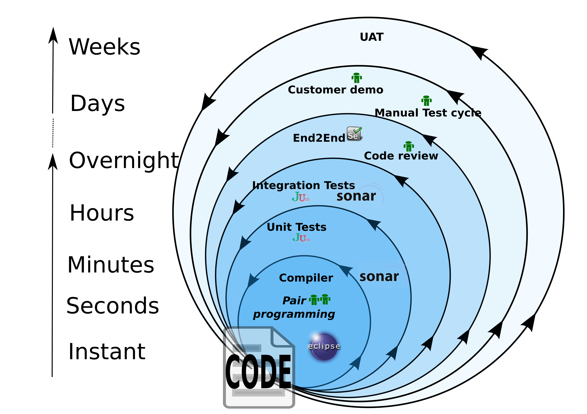
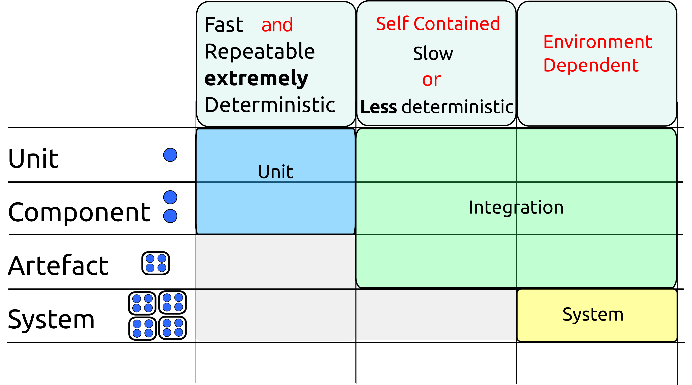
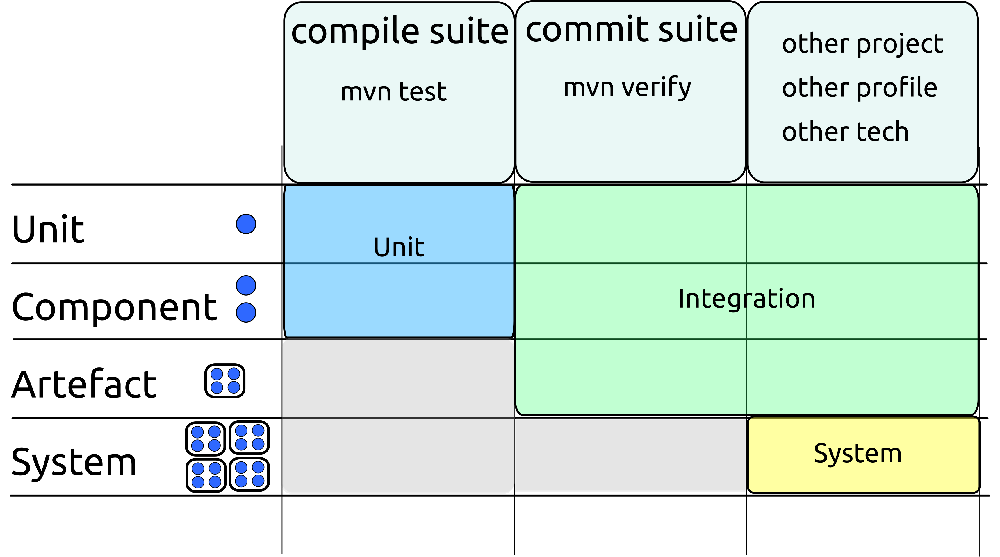

# 过程

# 过程

代码（好的和坏的）不是从无处出现的，某人需要坐下来写它。编码者如何处理这项任务会影响以后花在代码上发誓的时间。

本节讨论了开发哲学、工作流程以及团队在开始合作之前应该考虑的其他因素。

# 建立快速反馈循环

## 建立快速反馈循环

良好的代码关键在于获得良好且及时的反馈。发现问题越早，修复起来就越容易。

在一个传统项目上工作，唯一发现代码更改是否有效的方法是将其部署到开发/测试/质量保证环境中，这是令人沮丧和泄气的。

确保您的项目具有良好设计的开发工作流程 - 设置这一点的努力将得到多次回报。

理想情况下，所有反馈都应该是即时的，但实际上要么是不切实际的，要么是不可能以这种方式获得所有反馈。

软件开发被组织为嵌套级别的反馈，如下所示：

# 即时反馈

## 即时反馈

诸如 Eclipse 或 IntelliJ 之类的现代 IDE 将在您输入时提供即时反馈，使用底层编译器和可配置的静态分析工具。

通过充分利用 Java 类型系统并配置静态分析工具，您可以增加获得即时反馈的数量。

虽然 IDE 的反馈快速且方便，但也有一些缺点。

+   它可能因 IDE 配置而在不同机器上有所不同

+   它通常是非二进制的（即不是通过/失败）

+   它可能被忽视/忽略

+   速度的期望限制了它的实现

出于这些原因，您应该避免纯粹基于 IDE 的工作流程。在通过构建文件运行测试之前，代码不应被开发人员视为完整。

# 快速反馈

## 快速反馈

## 构建文件是真实的

与 IDE 不同，构建脚本提供的反馈不太及时，因为必须显式触发它。

然而，来自构建脚本的反馈有两个主要优点：

+   它在所有机器上都是可重复的

+   借助 CI 服务器的帮助，您可以确保它不被忽视

由于构建脚本可以接受较慢的反馈，因此可以从这里运行更大量的静态和动态分析。这通常会包括重复您的即时反馈。

## 可在本地运行的测试

在编译器和静态分析之后，测试套件是下一个最快速的反馈级别。

应该维护至少两个可在任何开发人员机器上本地运行的套件。

因为它们通常在编译后立即运行或在提交/推送代码之前运行，Martin Fowler 将这些称为：

+   编译套件

+   提交套件

在 Maven 中，这些自然映射到`test`和`integration-test`阶段。

放置在编译套件中的测试的标准应该不仅仅是**执行速度**。

它们必须快速（每个测试毫秒或更短），但也必须高度确定性和可重复。这确保了套件提供清晰的反馈 - 在代码更改后测试失败的唯一原因是更改导致了回归。

尽管这听起来很简单，但在实践中需要相当严谨，以确保测试之间不能相互干扰或受到外部因素的影响。

提交套件中的测试可能会较慢，也可能略微不太可重复。它们应该**力求**100%可重复，但可能会做一些可能偶尔导致失败的事情，比如使用网络 IO 或写入磁盘。

尽管这个套件中的许多测试可能只是在测试本身的同一个 JVM 中启动代码，但其中一些测试也应该启动构建的构件（war、ear、jar）并对其进行至少一定程度的测试。

尽管提交套件可能依赖于容器、数据库、队列等外部资源，但它仍应该能够在任何一台机器上通过单个命令运行。

安装和启动依赖资源应该由构建脚本和测试自动处理 - 你的项目不应该附带一张关于如何设置开发机器的说明页。

通常，Maven Cargo 插件用于下载和配置用于测试的容器。

# 较慢的反馈

### 较慢的反馈

编译套件和提交套件都应该在 CI 服务器上运行，通常由对存储库的提交/推送触发。

除了编译和提交套件之外，应该创建其他套件。

这些测试套件可能需要本地机器上不可用的资源和/或需要大量时间来执行。

它们也可能针对更真实的依赖重新运行相同的测试。如果在本地运行集成测试时通常使用内存数据库，那么同样的测试可能会再次针对生产数据库运行。

对于 Maven 构建，这些套件可能会使用配置文件或作为单独的 Maven 模块来实现。

这些套件将尽可能频繁地运行。很可能，这意味着定时运行，因为它们可能需要太长时间才能在提交时运行。在这里，“太长时间”被定义为超过监视存储库的提交/推送之间的时间间隔。

定时测试运行有时也会在没有代码更改的情况下运行套件 - 这在识别不稳定测试时可以提供有用的信息。

# 确定测试时使用的语言

## 确定讨论测试时使用的语言

### 测试金字塔

不幸的是，测试的语言被严重重载，不同的社区用相同的名称指代不同的事物。

测试金字塔是一个被广泛认可的图表，展示了测试应该如何被处理。

它显示底部有大量的单元测试，上面有较少数量的集成测试，顶部有更少数量的系统测试。通常，在顶部还会添加一些手动测试的云。

这个图表可能已经被绘制了成千上万次。虽然单元测试将出现在每个版本的底部，但其他级别使用的词语会有很大的变化。

即使使用相同的词语，附加的含义可能是不同的。

尽管人们在讨论“单元测试”、“集成测试”、“系统测试”、“端到端测试”、“服务测试”时可能会点头，但不能保证他们所思考的与您所思考的是相同的。

根据您与之交谈的人，一个“单元测试”可能是任何东西，从一个充满指令的 Word 文档，“任何程序员编写的测试”，到出现在教科书中的各种正式（但并非权威）定义。

“集成测试”可能有更多可能的含义。

### 单元测试

一个相当严格的单元测试定义现在在 Java 社区中被普遍使用。我们建议您和您的团队使用这个定义。

要成为单元��试，测试必须是：

+   快速（毫秒或更短）

+   隔离的（只测试一个单元）

+   可重复（在任何机器上运行数百万次都会得到相同的结果）

+   自我验证（要么通过要么失败）

+   及时（首先编写）

注意：虽然先编写测试通常是一个非常好的主意，但符合其他标准的测试仍然是单元测试，无论何时编写。

当我们谈论“单元”测试时，什么构成一个*单元* 并不一定那么明显。

一个有点循环的定义是，*单元* 是一个最小的东西，独立测试是有意义的。

它通常是一个类，但这并不一定是这样。将一组类视为一个单元可能是有意义的（特别是如果它们大多数是非公共的），甚至偶尔甚至是一个方法。

如果我们接受一个*单元* 是一个小东西，并且我们看到它时会知道它是什么，那么我们可以看到单元测试的标准在很大程度上符合我们为编译套件提出的标准。

唯一的区别是编译套件不关心隔离性。

如果我们选择编写一个测试来同时测试两个（或更多）*单元*，只要符合其他标准，它仍属于编译套件。

### 系统测试

系统测试也有相当明确的定义。它们是对整个系统进行测试的测试 - 即在真实环境中运行所有代码及其交互的所有代码。

### 集成测试

集成测试更难定义。它占据了不符合单元测试或系统测试定义的所有内容的大空间。

以下两个图表展示了这些术语如何适用于我们的测试套件世界。

本文将使用这些图表中显示的术语*单元测试*、*集成测试*和*系统测试*。

为了清晰起见，在讨论集成测试时，有时会明确说明正在测试什么，例如“通过 Tomcat 运行的 WAR 文件的 REST API 进行测试”。

虽然冗长，但这种详细的术语很清晰。建议在跨团队讨论测试时使用它。在你自己的团队中，你很可能会发展出一种你们都理解的更简洁的语言。

这与我们的套件相对应，如下所示：

# 将覆盖率视为工具而不是目标

## 将覆盖率视为工具，而不是目标

代码覆盖率是一个捕捉错误的有用工具。

工具应该为你服务；你不应该为工具服务。

在编写代码和测试的时候运行代码覆盖率最有用，而不是在几个小时后的 CI 服务器上运行。

代码覆盖率的空白突出显示了未经测试的代码区域。这些空白中的一些可能是预期的和有意的，而另一些可能是意外的。正是这些意外的空白提供了有用的信息。

这就是代码覆盖率所做的一切。

代码具有 100%的分支覆盖率，可能已经测试过，也可能没有。代码覆盖率告诉你一些测试已经执行了代码，而不是它们是否有意义地测试了它。不要让它让你产生错误的安全感。

一些团队设定了必须满足的代码覆盖率目标（75%似乎是一个常见的数字）。尽管出于良好的意图，但这种做法通常是有害的。

代码覆盖率易于测量。测试的其他可取（或极不可取）的特性不容易测量，例如：

+   测试是否有意义？

+   测试是否易于阅读和理解？

+   测试是否与特定的实现紧密相连？

最后一点尤为重要。

要使测试有价值，必须能够进行重构；那些与解决问题的一种特定方式紧密联系的测试通常具有负面价值，因为每当代码发生更改时，它们必须被修改或重写。不幸的是，在你意识到你做错了之前，几个月甚至几年都很容易以这种方式编写测试。

通过集中关注容易测量的一个属性，其他属性被弱化了。但更糟糕的是，试图满足覆盖率目标可能会积极地促使开发人员编写与实现绑定的测试。坏的测试比好的测试更容易写。

当代码只有 30%的单元测试覆盖率时，可能存在问题。另一方面，如果通过设定目标来实现覆盖率，具有 80%覆盖率的代码可能比具有较低覆盖率的代码更难处理。

因此，不要设定目标，而是确保你的团队致力于编写良好的测试。

一个好的测试是那些帮助解释代码、捕捉回归并且在进行更改时不会妨碍的测试。在编写代码之前编写测试可以帮助鼓励编写良好的测试，并确保代码具有高覆盖率。
