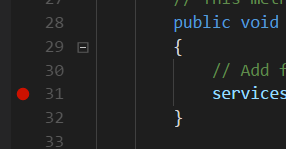

# 你的第一个应用程序

# 你的第一个应用程序

准备用 ASP.NET Core 构建你的第一个 Web 应用程序？首先需要收集一些东西：

**你喜欢的代码编辑器。** 你可以使用 Atom、Sublime、记事本，或者你喜欢编写代码的任何编辑器。如果你没有喜欢的，可以试试 Visual Studio Code。它是一个免费的跨平台代码编辑器，对编写 C#、JavaScript、HTML 等有很好的支持。只需搜索“下载 Visual Studio Code”并按照说明操作。

如果你在 Windows 上，也可以使用 Visual Studio 来构建 ASP.NET Core 应用程序。你需要 Visual Studio 2017 版本 15.3 或更高版本（免费的社区版也可以）。Visual Studio 具有出色的代码补全和其他针对 C#的特定功能，尽管 Visual Studio Code 也不差。

**.NET Core SDK。** 无论你使用的是哪个编辑器或平台，你都需要安装.NET Core SDK，其中包括构建 ASP.NET Core 应用所需的运行时、基本库和命令行工具。SDK 可在 Windows、Mac 或 Linux 上安装。

一旦你决定了编辑器，你就需要获取 SDK。

# 获取 SDK

## 获取 SDK

搜索“下载 .net core”，按照微软下载页面上的说明为你的平台安装。SDK 安装完成后，打开终端（或 Windows 上的 PowerShell），使用`dotnet`命令行工具（也称为**CLI**）确保一切正常运行：

```
dotnet --version

2.0.0 
```

你可以使用`--info`标志获取有关你的平台的更多信息：

```
dotnet --info

.NET Command Line Tools (2.0.0)

Product Information:
 Version:            2.0.0
 Commit SHA-1 hash:  cdcd1928c9

Runtime Environment:
 OS Name:     Mac OS X
 OS Version:  10.12

(more details...) 
```

如果你看到类似上面的输出，那么你已经准备好了！

# 用 C#编写的 Hello World

## 用 C#编写的 Hello World

在深入学习 ASP.NET Core 之前，尝试创建并运行一个简单的 C#应用程序。

你可以全部在命令行中完成。首先，打开终端（或 Windows 上的 PowerShell）。导航到你想要存储项目的位置，比如你的文档目录：

```
cd Documents 
```

使用`dotnet`命令创建一个新项目：

```
dotnet new console -o CsharpHelloWorld
cd CsharpHelloWorld 
```

这将创建一个基本的 C#程序，向屏幕输出一些文本。该程序由两个文件组成：一个项目文件（扩展名为`.csproj`）和一个 C#代码文件（扩展名为`.cs`）。如果你在文本或代码编辑器中打开前者，你会看到这样的内容：

**`CsharpHelloWorld.csproj`**

```
<Project Sdk="Microsoft.NET.Sdk">

  <PropertyGroup>
    <OutputType>Exe</OutputType>
    <TargetFramework>netcoreapp2.0</TargetFramework>
  </PropertyGroup>

</Project> 
```

项目文件是基于 XML 的，定义了关于项目的一些元数据。稍后，当你引用其他包时，它们将在这里列出（类似于 npm 的`package.json`文件）。你通常不需要经常手动编辑这个文件。

**`Program.cs`**

```
using System;

namespace CsharpHelloWorld
{
    class Program
    {
        static void Main(string[] args) {
            Console.WriteLine("Hello World!");
        }
    }
} 
```

`static void Main`是 C#程序的入口方法，按照惯例，它放置在一个名为`Program`的类（一种代码结构或模块）中。顶部的`using`语句导入了来自.NET 的内置 System 类，并使其可用于类中的代码。

在项目目录中，使用`dotnet run`来运行程序。代码编译后，你会在控制台看到输出：

```
dotnet run

Hello World! 
```

这就是构建和运行.NET 程序所需的全部！接下来，你将为一个 ASP.NET Core 应用程序做同样的事情。

# 创建一个 ASP.NET Core 项目

## 创建一个 ASP.NET Core 项目

如果你仍然在为 Hello World 示例创建的目录中，返回到你的文档或主目录：

```
cd .. 
```

接下来，使用`dotnet new`创建一个新项目，这次带有一些额外选项：

```
dotnet new mvc --auth Individual -o AspNetCoreTodo
cd AspNetCoreTodo 
```

这将从`mvc`模板创建一个新项目，并向项目添加一些额外的身份验证和安全位。 （我将在*安全和身份*章节中介绍安全性。）

`-o AspNetCoreTodo`标志告诉`dotnet new`为所有输出文件创建一个名为`AspNetCoreTodo`的新目录。你会看到许多文件出现在这个项目目录中。一旦你`cd`进入新目录，你只需运行项目：

```
dotnet run

Now listening on: http://localhost:5000
Application started. Press Ctrl+C to shut down. 
```

这个程序不是打印到控制台然后退出，而是启动一个 Web 服务器，并在端口 5000 上等待请求。

打开你的网络浏览器，导航到`http://localhost:5000`。你会看到默认的 ASP.NET Core 启动页面，这意味着你的项目正在运行！完成后，在终端窗口中按下 Ctrl-C 停止服务器。

### ASP.NET Core 项目的各个部分

`dotnet new mvc`模板为你生成了许多文件和目录。以下是你可以立即获得的最重要的内容：

+   **Program.cs**和**Startup.cs**文件设置了 Web 服务器和 ASP.NET Core 管道。`Startup`类是你可以添加中间件处理和修改传入请求，并提供静态内容或错误页面的地方。这也是你向依赖注入容器添加自己的服务的地方（稍后会详细介绍）。

+   **Models**、**Views**和**Controllers**目录包含了 Model-View-Controller（MVC）架构的组件。在下一章节中你将探索这三个组件。

+   **wwwroot**目录包含静态资产，如 CSS、JavaScript 和图像文件。默认情况下，使用 bower 工具来管理 CSS 和 JavaScript 包，但你可以使用你喜欢的任何包管理器（npm 和 yarn 是流行的选择）。`wwwroot`中的文件将作为静态内容提供，并可以自动捆绑和缩小。

+   **appsettings.json**文件包含了 ASP.NET Core 在启动时加载的配置设置。你可以使用它来存储数据库连接字符串或其他不希望硬编码的内容。

### Visual Studio Code 提示

如果你第一次使用 Visual Studio Code（或 Visual Studio），以下是一些帮助你入门的有用提示：

+   **按下 F5 运行（并调试断点）**：打开你的项目后，按下 F5 以调试模式运行项目。这与命令行中的`dotnet run`相同，但你可以通过点击左边缘设置断点来在代码中设置断点：



+   **灯泡修复问题**：如果您的代码包含红色波浪线（编译器错误），请将光标放在红色的代码上，并查找左边缘的灯泡图标。灯泡菜单将提供常见的修复建议，比如在您的代码中添加一个缺失的`using`语句：


+   **快速编译**：使用快捷键`Command-Shift-B`或`Control-Shift-B`运行生成任务，这与`dotnet build`做的事情相同。

### 有关 Git 的一点说明

如果您使用 Git 或 GitHub 管理源代码，现在是执行`git init`并在项目目录中初始化 Git 存储库的好时机。确保添加一个`.gitignore`文件，忽略`bin`和`obj`目录。GitHub 的 gitignore 模板仓库上的 Visual Studio 模板（[`github.com/github/gitignore`](https://github.com/github/gitignore)）非常适用。

还有很多内容等待探索，所以让我们开始构建一个应用程序吧！
