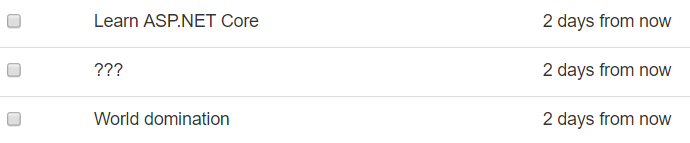

# 添加外部包

# 添加外部包

使用成熟的.NET 堆栈的一个重要优势是第三方包和插件的生态系统非常庞大。就像其他包系统（npm、Maven、RubyGems）一样，您可以下载和安装几乎可以想象到的任何任务或问题的.NET 包。

NuGet 既是包管理工具，也是官方包存储库（位于[`www.nuget.org`](https://www.nuget.org)）。您可以在网上搜索 NuGet 包，并通过终端（或 GUI，如果您使用 Visual Studio）从本地计算机安装它们。

## 安装 Humanizer 包

在上一章的最后，待办事项应用程序显示待办事项如下：


截止日期列显示的日期格式对机器来说很好（称为 ISO 8601），但对人类来说很笨拙。如果它简单地显示为“X 天后”会不会更好？您可以编写将日期转换为人类友好字符串的代码，但幸运的是，有一种更快的方法。

NuGet 上的 Humanizer 包（[`www.nuget.org/packages/Humanizer`](https://www.nuget.org/packages/Humanizer)）通过提供可以“人性化”或重写几乎任何内容的方法来解决这个问题：日期、时间、持续时间、数字等等。这是一个根据宽松的 MIT 许可发布的奇妙而有用的开源项目。

要将其添加到项目中，请在终端中运行以下命令：

```
dotnet add package Humanizer 
```

如果您查看`AspNetCoreTodo.csproj`项目文件，您会看到一个引用`Humanizer`的新`PackageReference`行。

## 在视图中使用 Humanizer

要在代码中使用包，通常需要在文件顶部添加一个`using`语句来导入该包。

由于 Humanizer 将用于重写视图中呈现的日期，您可以直接在视图中使用它。首先，在视图顶部添加一个`@using`语句：

**`Views/Todo/Index.cshtml`**

```
@model TodoViewModel
@using Humanizer

// ... 
```

然后，更新写入`DueAt`属性的行，以使用 Humanizer 的`Humanize`方法：

```
<td>@item.DueAt.Humanize()</td> 
```

现在日期更易读了：



在 NuGet 上有各种包可用，从解析 XML 到机器学习再到发布到 Twitter。ASP.NET Core 本身在幕后只是一组添加到项目中的 NuGet 包集合。

> `dotnet new mvc`创建的项目文件包含对`Microsoft.AspNetCore.All`包的单个引用，这是一个方便的“元包”，引用了您典型项目所需的所有其他 ASP.NET Core 包。这样，您就不需要在项目文件中有数百个包引用。

在下一章中，您将使用另一组 NuGet 包（一个名为 Entity Framework Core 的系统）编写与数据库交互的代码。
