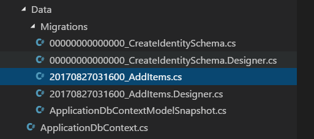

# 使用数据库

# 使用数据库

编写数据库代码可能会很棘手。除非你真的知道你在做什么，否则将原始 SQL 查询字符串粘贴到应用程序代码中是一个坏主意。对象关系映射器（ORM）通过在你的代码和数据库本身之间添加一层抽象来使编写与数据库交互的代码变得更容易。Java 中的 Hibernate 和 Ruby 中的 ActiveRecord 是两个知名的 ORM。

.NET 中有许多 ORM，包括由 Microsoft 构建并默认包含在 ASP.NET Core 中的一个：Entity Framework Core。Entity Framework Core 可以轻松连接到多种不同类型的数据库，并允许你使用 C# 代码创建映射回 C# 模型（POCOs）的数据库查询。

> 还记得创建服务接口是如何将控制器代码与实际服务类解耦的吗？Entity Framework Core 就像是你的数据库上的一个大接口，你可以根据底层数据库技术来替换不同的提供者。

Entity Framework Core 可以连接到 SQL Server 和 MySQL 等 SQL 数据库，也可以与 NoSQL（文档）数据库如 Mongo 一起使用。你将在这个项目中使用 SQLite 数据库，但如果你愿意，你可以插入不同的数据库提供程序。

# 连接到数据库

## 连接到数据库

要使用 Entity Framework Core 连接到数据库，有几件事情是必须的。由于你使用了 `dotnet new` 和 MVC + Individual Auth 模板来设置你的项目，你已经拥有了它们：

+   **Entity Framework Core 包**。这些默认包含在所有 ASP.NET Core 项目中。

+   **一个数据库**（当然）。项目根目录中的 `app.db` 文件是由 `dotnet new` 为你创建的一个小型 SQLite 数据库。SQLite 是一个轻量级的数据库引擎，可以在不需要在你的机器上���装任何额外工具的情况下运行，因此在开发中使用起来既简单又快速。

+   **数据库上下文类**。数据库上下文是一个提供进入数据库的 C# 类。这是你的代码将与数据库交互以读取和保存项目的方式。一个基本的上下文类已经存在于 `Data/ApplicationDbContext.cs` 文件中。

+   **连接字符串**。无论你是连接到本地文件数据库（如 SQLite）还是连接到其他地方托管的数据库，你都需要定义一个包含要连接的数据库名称或地址的字符串。这已经在 `appsettings.json` 文件中为你设置好了：SQLite 数据库的连接字符串是 `DataSource=app.db`。

Entity Framework Core 使用数据库上下文和连接字符串，一起建立与数据库的连接。你需要告诉 Entity Framework Core 在 `Startup` 类的 `ConfigureServices` 方法中使用哪个上下文、连接字符串和数据库提供程序。这是由模板为你定义的内容：

```
services.AddDbContext<ApplicationDbContext>(options =>
    options.UseSqlite(Configuration.GetConnectionString("DefaultConnection"))); 
```

这段代码将 `ApplicationDbContext` 添加到服务容器中，并告诉 Entity Framework Core 使用来自配置的 SQLite 数据库提供程序的连接字符串（`appsettings.json`）。

正如你所看到的，`dotnet new` 为你创建了很多东西！数据库已经设置好，可以使用了。但是，它没有任何用于存储待办事项的表。为了存储你的 `TodoItem` 实体，你需要更新上下文并迁移数据库。

# 更新上下文

## 更新上下文

数据库上下文中目前还没有太多内容：

**`Data/ApplicationDbContext.cs`**

```
public class ApplicationDbContext : IdentityDbContext<ApplicationUser>
{
    public ApplicationDbContext(DbContextOptions<ApplicationDbContext> options)
        : base(options)
    {
    }

    protected override void OnModelCreating(ModelBuilder builder)
    {
        base.OnModelCreating(builder);
        // Customize the ASP.NET Identity model and override the defaults if needed.
        // For example, you can rename the ASP.NET Identity table names and more.
        // Add your customizations after calling base.OnModelCreating(builder);
    }
} 
```

在构造函数下面给 `ApplicationDbContext` 添加一个 `DbSet` 属性：

```
public ApplicationDbContext(DbContextOptions<ApplicationDbContext> options)
    : base(options) {
}

public DbSet<TodoItem> Items { get; set; }

// ... 
```

`DbSet` 表示数据库中的表或集合。通过创建一个名为 `Items` 的 `DbSet<TodoItem>` 属性，你告诉 Entity Framework Core 你想要在名为 `Items` 的表中存储 `TodoItem` 实体。

你已经更新了上下文类，但现在有一个小问题：上下文和数据库现在不同步了，因为实际上数据库中没有一个 `Items` 表。（只是更新上下文类的代码并不会改变数据库本身。）

为了使数据库反映你刚刚对上下文所做的更改，你需要创建一个**迁移**。

> 如果你已经有了一个现有的数据库，请搜索“scaffold-dbcontext existing database”，并阅读微软关于使用 `Scaffold-DbContext` 工具将你的数据库结构自动反向工程成正确的 `DbContext` 和模型类的文档。

# 创建一个迁移

## 创建一个迁移

迁移跟踪数据库结构随时间的变化。它们使得可以撤消（回滚）一组更改，或创建一个具有与第一个相同结构的第二个数据库。有了迁移，你就有了完整的修改历史记录，比如添加或删除列（以及整个表）。

在前一章中，你向上下文添加了一个 `Items` 集。由于上下文现在包含了一个在数据库中不存在的集合（或表），你需要创建一个迁移来更新数据库：

```
dotnet ef migrations add AddItems 
```

这会通过检查你对上下文所做的任何更改来创建一个名为 `AddItems` 的新迁移。

> 如果出现 `No executable found matching command "dotnet-ef"` 这样的错误，请确保你在正确的目录中。这些命令必须从项目根目录（即 `Program.cs` 文件所在的位置）运行。

如果你打开 `Data/Migrations` 目录，你会看到一些文件：



第一个迁移文件（类似于 `00_CreateIdentitySchema.cs` 的名称）是在你运行 `dotnet new` 时创建和应用的。当你创建时，你的新 `AddItem` 迁移文件会带有时间戳前缀。

> 你可以使用 `dotnet ef migrations list` 命令查看迁移列表。

如果你打开迁移文件，你会看到两个方法叫做 `Up` 和 `Down`：

**`Data/Migrations/<date>_AddItems.cs`**

```
protected override void Up(MigrationBuilder migrationBuilder) {
    // (... some code)

    migrationBuilder.CreateTable(
        name: "Items",
        columns: table => new
        {
            Id = table.Column<Guid>(type: "BLOB", nullable: false),
            DueAt = table.Column<DateTimeOffset>(type: "TEXT", nullable: true),
            IsDone = table.Column<bool>(type: "INTEGER", nullable: false),
            Title = table.Column<string>(type: "TEXT", nullable: true)
        },
        constraints: table =>
        {
            table.PrimaryKey("PK_Items", x => x.Id);
        });

    // (some code...)
}

protected override void Down(MigrationBuilder migrationBuilder) {
    // (... some code)

    migrationBuilder.DropTable(
        name: "Items");

    // (some code...)
} 
```

当你将迁移应用到数据库时，`Up`方法会运行。由于你向数据库上下文添加了一个`DbSet<TodoItem>`，当你应用迁移时，Entity Framework Core 将创建一个`Items`表（其列与`TodoItem`匹配）。

`Down`方法执行相反的操作：如果需要撤消（回滚）迁移，`Items`表将被删除。

### SQLite 限制的解决方法

如果你尝试按原样运行迁移，SQLite 存在一些限制会导致问题。在这个问题修复之前，使用这个解决方法：

+   在`Up`方法中注释掉`migrationBuilder.AddForeignKey`行。

+   在`Down`方法中注释掉任何`migrationBuilder.DropForeignKey`行。

如果你使用全功能的 SQL 数据库，比如 SQL Server 或 MySQL，这不会是一个问题，你不需要执行这个（诚然有些巧妙的）解决方法。

### 应用迁移

在创建一个（或多个）迁移后的最后一步是实际将它们应用到数据库中：

```
dotnet ef database update 
```

这个命令将导致 Entity Framework Core 在数据库中创建`Items`表。

> 如果你想回滚数据库，可以提供*之前*迁移的名称：`dotnet ef database update CreateIdentitySchema` 这将运行任何新于你指定的迁移的`Down`方法。
> 
> 如果你需要完全清除数据库并重新开始，运行`dotnet ef database drop`，然后运行`dotnet ef database update`来重新生成数据库并将其更新到当前迁移。

就是这样！数据库和上下文都准备就绪。接下来，你将在服务层中使用上下文。

# 创建一个新的服务类

## 创建一个新的服务类

回到*MVC 基础*章节，你创建了一个`FakeTodoItemService`，其中包含硬编码的待办事项。现在你有了数据库上下文，可以创建一个新的服务类，该类将使用 Entity Framework Core 从数据库中获取真实的项目。

删除`FakeTodoItemService.cs`文件，并创建一个新文件：

**`Services/TodoItemService.cs`**

```
using System;
using System.Collections.Generic;
using System.Linq;
using System.Threading.Tasks;
using AspNetCoreTodo.Data;
using AspNetCoreTodo.Models;
using Microsoft.EntityFrameworkCore;

namespace AspNetCoreTodo.Services
{
    public class TodoItemService : ITodoItemService
    {
        private readonly ApplicationDbContext _context;

        public TodoItemService(ApplicationDbContext context) {
            _context = context;
        }

        public async Task<IEnumerable<TodoItem>> GetIncompleteItemsAsync()
        {
            var items = await _context.Items
                .Where(x => x.IsDone == false)
                .ToArrayAsync();

            return items;
        }
    }
} 
```

你会注意到这里使用了与 MVC 基础章节中相同的依赖注入模式，只是这次注入的是`ApplicationDbContext`。`ApplicationDbContext`已经被添加到服务容器中的`ConfigureServices`方法中，因此可以在这里进行注入。

让我们更仔细地看一下`GetIncompleteItemsAsync`方法的代码。首先，它使用上下文的`Items`属性来访问`DbSet`中的所有待办事项：

```
var items = await _context.Items 
```

然后，`Where`方法用于仅过滤未完成的项目：

```
.Where(x => x.IsDone == false) 
```

`Where`方法是 C#的一个特性，称为 LINQ（**l**anguage **in**tegrated **q**uery），它借鉴了函数式编程的特点，使得在代码中表达数据库查询变得容易。在底层，Entity Framework Core 将该方法转换为类似`SELECT * FROM Items WHERE IsDone = 0`的语句，或者在 NoSQL 数据库中等效的查询文档。

最后，`ToArrayAsync`方法告诉 Entity Framework Core 获取与过滤器匹配的所有实体，并将它们作为数组返回。`ToArrayAsync`方法是异步的（它返回一个`Task`），因此必须`await`它以获取其值。

为了使方法变得更短一些，您可以删除中间的`items`变量，直接返回查询结果（这样做的效果是一样的）：

```
public async Task<IEnumerable<TodoItem>> GetIncompleteItemsAsync()
{
    return await _context.Items
        .Where(x => x.IsDone == false)
        .ToArrayAsync();
} 
```

### 更新服务容器

因为您删除了`FakeTodoItemService`类，所以需要更新`ConfigureServices`中连接`ITodoItemService`接口的行：

```
services.AddScoped<ITodoItemService, TodoItemService>(); 
```

`AddScoped` 使用**scoped**生命周期将您的服务添加到服务容器中。这意味着在每个 web 请求期间将创建`TodoItemService`类的新实例。这对于与数据库交互的服务类是必需的。

> 添加一个与 Entity Framework Core（和您的数据库）交互的服务类，并使用单例生命周期（或其他生命周期）可能会导致问题，因为 Entity Framework Core 在幕后每个请求管理数据库连接。为了避免这种情况，始终对与 Entity Framework Core 交互的服务使用 scoped 生命周期。

依赖于`ITodoItemService`的`TodoController`将对更改毫不知情，但在幕后，您将使用 Entity Framework Core 并与真实数据库交互！

### 测试一下

启动应用程序并导航到`http://localhost:5000/todo`。虚拟项目已经消失，您的应用程序正在向数据库发出真实查询。只是偶然间没有保存待办事项！

在下一章中，您将为应用程序添加更多功能，从创建新的待办事项开始。
