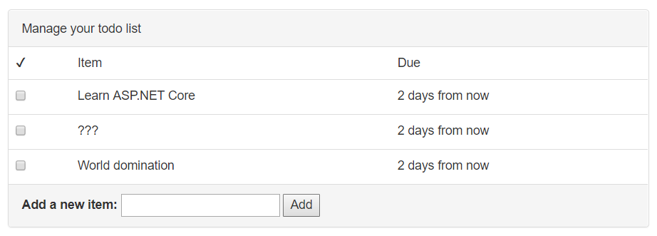

# 添加更多功能

# 添加更多功能

现在，您已经使用 Entity Framework Core 连接到了数据库，可以开始向应用程序添加一些更多功能。首先，您将使得可以通过选中复选框来标记待办事项为已完成。

# 添加新的待办事项

## 添加新的待办事项

用户将通过列表下方的简单表单添加新的待办事项：



添加此功能需要执行几个步骤：

+   添加将数据发送到服务器的 JavaScript 代码

+   在控制器上创建一个新操作来处理此请求

+   添加代码到服务层以更新数据库

### 添加 JavaScript 代码

`Todo/Index.cshtml`视图已经包含一个 HTML 表单，其中有一个文本框和一个用于添加新项目的按钮。当单击添加按钮时，您将使用 jQuery 向服务器发送一个 POST 请求。

打开`wwwroot/js/site.js`文件并添加以下代码：

```
$(document).ready(function() {

    // Wire up the Add button to send the new item to the server
    $('#add-item-button').on('click', addItem);

}); 
```

然后，在文件底部编写`addItem`函数：

```
function addItem() {
    $('#add-item-error').hide();
    var newTitle = $('#add-item-title').val();

    $.post('/Todo/AddItem', { title: newTitle }, function() {
        window.location = '/Todo';
    })
    .fail(function(data) {
        if (data && data.responseJSON) {
            var firstError = data.responseJSON[Object.keys(data.responseJSON)[0]];
            $('#add-item-error').text(firstError);
            $('#add-item-error').show();
        }
    });
} 
```

此功能将向`http://localhost:5000/Todo/AddItem`发送一个 POST 请求，其中包含用户输入的名称。传递给`$.post`方法（函数）的第三个参数是一个成功处理程序，如果服务器以`200 OK`响应，则将运行该处理程序。成功处理程序函数使用`window.location`来刷新页面（通过将位置设置为`/Todo`，与浏览器当前所在的页面相同）。如果服务器以`400 Bad Request`响应，则附加到`$.post`方法的`fail`处理程序将尝试提取错误消息并在具有 id`add-item-error`的`<div>`中显示它。

### 添加一个操作

以上 JavaScript 代码目前无法工作，因为没有任何操作可以处理`/Todo/AddItem`路由。如果现在尝试，ASP.NET Core 将返回`404 Not Found`错误。

您需要在`TodoController`上创建一个名为`AddItem`的新操作：

```
public async Task<IActionResult> AddItem(NewTodoItem newItem) {
    if (!ModelState.IsValid)
    {
        return BadRequest(ModelState);
    }

    var successful = await _todoItemService.AddItemAsync(newItem);
    if (!successful)
    {
        return BadRequest(new { error = "Could not add item" });
    }

    return Ok();
} 
```

方法签名定义了一个`NewTodoItem`参数，这是一个尚不存在的新模型。您需要创建它：

**`Models/NewTodoItem.cs`**

```
using System;
using System.ComponentModel.DataAnnotations;

namespace AspNetCoreTodo.Models
{
    public class NewTodoItem
    {
        [Required]
        public string Title { get; set; }
    }
} 
```

此模型定义（一个名为`Title`的属性）与您使用 jQuery 发送到操作的数据匹配：

```
$.post('/Todo/AddItem', { title: newTitle }  // ...

// A JSON object with one property:
// {
//   title: (whatever the user typed)
// } 
```

ASP.NET Core 使用一种称为**模型绑定**的过程，将提交的参数与您创建的模型定义匹配起来。如果参数名称匹配（忽略大小写等因素），请求数据将被放入模型中。

在将请求数据绑定到模型后，ASP.NET Core 还执行**模型验证**。`Title`属性上的`[Required]`属性通知验证器`Title`属性不应该丢失（空白）。如果模型未通过验证，验证器不会抛出错误，但验证状态将被保存，以便您可以在控制器中检查它。

> 侧边栏：可以重用`TodoItem`模型而不是创建`NewTodoItem`模型，但`TodoItem`包含用户永远不会提交的属性（ID 和 done）。声明一个代表在添加新项目时相关属性集的确切模型更清晰。

回到`TodoController`上的`AddItem`操作方法：第一个块检查模型是否通过了模型验证过程。习惯上在方法的开头就这样做：

```
if (!ModelState.IsValid)
{
    return BadRequest(ModelState);
} 
```

如果`ModelState`无效（因为必需属性为空），操作将返回 400 Bad Request 以及模型状态，该状态会自动转换为告诉用户出了什么问题的错误消息。

接下来，控制器调用服务层执行实际的数据库操作：

```
var successful = await _todoItemService.AddItemAsync(newItem);
if (!successful)
{
    return BadRequest(new { error = "Could not add item." });
} 
```

`AddItemAsync`方法将根据项目是否成功添加到数据库返回`true`或`false`。如果由于某种原因失败，操作将返回`400 Bad Request`以及包含`error`属性的对象。

最后，如果一切顺利完成，操作将返回`200 OK`。

### 添加一个服务方法

如果您使用了理解 C#的代码编辑器，您会看到`AddItemAsync`下面有红色波浪线，因为该方法尚不存在。

最后一步，您需要在服务层添加一个方法。首先，在`ITodoItemService`中的接口定义中添加它：

```
public interface ITodoItemService
{
    Task<IEnumerable<TodoItem>> GetIncompleteItemsAsync();

    Task<bool> AddItemAsync(NewTodoItem newItem);
} 
```

然后，在`TodoItemService`中的实际实现：

```
public async Task<bool> AddItemAsync(NewTodoItem newItem) {
    var entity = new TodoItem
    {
        Id = Guid.NewGuid(),
        IsDone = false,
        Title = newItem.Title,
        DueAt = DateTimeOffset.Now.AddDays(3)
    };

    _context.Items.Add(entity);

    var saveResult = await _context.SaveChangesAsync();
    return saveResult == 1;
} 
```

此方法创建一个新的`TodoItem`（代表数据库实体的模型），并从`NewTodoItem`模型中复制`Title`。然后，将其添加到上下文中，并使用`SaveChangesAsync`将实体持久化到数据库中。

> 侧边栏：上述只是构建此功能的一种方式。如果要为添加新项目显示单独的页面（例如，包含许多属性的复杂实体），可以创建一个新视图，该视图绑定到需要用户提供值的模型。ASP.NET Core 可以使用称为**标签助手**的功能自动为模型的属性呈现表单。您可以在 ASP.NET Core 文档中找到示例，网址为[`docs.asp.net`](https://docs.asp.net)。

### 试一试

运行应用程序并使用表单向待办事项列表添加一些项目。由于项目存储在数据库中，即使您停止并重新启动应用程序，它们仍将存在。

> 作为进一步的挑战，尝试使用 HTML 和 JavaScript 添加日期选择器，并让用户为`DueAt`属性选择一个（可选）日期。然后，使用该日期而不是总是创建在 3 天内到期的新任务。

# 使用复选框完成项目

## 使用复选框完成项目

将项目添加到待办事项列表很好，但最终您也需要完成任务。在`Views/Todo/Index.cshtml`视图中，为每个待办事项呈现一个复选框：

```
<input type="checkbox" name="@item.Id" value="true" class="done-checkbox"> 
```

项目的 ID（一个 guid）保存在元素的`name`属性中。您可以使用此 ID 告诉 ASP.NET Core 代码在复选框被选中时更新数据库中的实体。

整个流程将如下所示：

+   用户勾选复选框，触发一个 JavaScript 函数

+   使用 JavaScript 发起对控制器上的操作的 API 调用

+   操作调用服务层来更新数据库中的项目

+   发送响应回 JavaScript 函数，指示更新成功

+   页面上的 HTML 被更新

### 添加 JavaScript 代码

首先，打开`site.js`并将此代码添加到`$(document).ready`块中：

**wwwroot/js/site.js**

```
$(document).ready(function() {

    // ...

    // Wire up all of the checkboxes to run markCompleted()
    $('.done-checkbox').on('click', function(e) {
        markCompleted(e.target);
    });

}); 
```

然后，在文件底部添加`markCompleted`函数：

```
function markCompleted(checkbox) {
    checkbox.disabled = true;

    $.post('/Todo/MarkDone', { id: checkbox.name }, function() {
        var row = checkbox.parentElement.parentElement;
        $(row).addClass('done');
    });
} 
```

此代码使用 jQuery 发送 HTTP POST 请求到`http://localhost:5000/Todo/MarkDone`。请求中将包含一个名为`id`的参数，其中包含项目的 ID（从`name`属性中提取）。

如果在 Web 浏览器中打开网络工具并单击复选框，您将看到一个类似于以下的请求：

```
POST http://localhost:5000/Todo/MarkDone
Content-Type: application/x-www-form-urlencoded

id=<some guid> 
```

传递给`$.post`的成功处理程序函数使用 jQuery 向包含复选框的表行添加一个类。通过将带有`done`类的行标记，页面样式表中的 CSS 规则将更改行的外观。

### 向控制器添加一个操作

正如您可能已经猜到的那样，您需要在`TodoController`上添加一个`MarkDone`操作：

```
public async Task<IActionResult> MarkDone(Guid id) {
    if (id == Guid.Empty) return BadRequest();

    var successful = await _todoItemService.MarkDoneAsync(id);

    if (!successful) return BadRequest();

    return Ok();
} 
```

让我们逐步了解这个操作方法的每个部分。首先，在方法签名中，该方法接受一个名为`id`的`Guid`参数。与使用模型（`NewTodoItem`模型）和模型绑定/验证的`AddItem`操作不同，`id`参数非常简单。如果传入的请求包含一个名为`id`的参数，ASP.NET Core 将尝试将其解析为一个 guid。

没有`ModelState`可供检查有效性，但仍然可以检查确保 guid 是有效的。如果由于某种原因请求中的`id`参数丢失或无法解析为 guid，则其值将为`Guid.Empty`。如果是这种情况，操作可以提前返回：

```
if (id == Guid.Empty) return BadRequest(); 
```

`BadRequest()`方法是一个简单返回 HTTP 状态码`400 Bad Request`的辅助方法。

接下来，控制器需要调用服务来更新数据库。这将由`ITodoItemService`上的新方法`MarkDoneAsync`处理，根据更新是否成功返回 true 或 false：

```
var successful = await _todoItemService.MarkDoneAsync(id);
if (!successful) return BadRequest(); 
```

最后，如果一切看起来正常，`Ok()`方法用于返回状态码`200 OK`。更复杂的 API 可能还会返回 JSON 或其他数据，但目前只需返回状态码即可。

### 添加一个服务方法

首先，在接口定义中添加`MarkDoneAsync`：

**`Services/ITodoItemService.cs`**

```
Task<bool> MarkDoneAsync(Guid id); 
```

然后，在`TodoItemService`中添加具体实现：

**`Services/TodoItemService.cs`**

```
public async Task<bool> MarkDoneAsync(Guid id) {
    var item = await _context.Items
        .Where(x => x.Id == id)
        .SingleOrDefaultAsync();

    if (item == null) return false;

    item.IsDone = true;

    var saveResult = await _context.SaveChangesAsync();
    return saveResult == 1; // One entity should have been updated
} 
```

这种方法使用 Entity Framework Core 和 `Where` 在数据库中通过 ID 查找实体。`SingleOrDefaultAsync` 方法会返回项（如果存在），或者如果 ID 是虚假的则返回 `null`。如果不存在，代码可以提前返回。

一旦确定 `item` 不为 null，设置 `IsDone` 属性就是一件简单的事情了：

```
item.IsDone = true; 
```

更改属性只会影响到项目的本地副本，直到调用 `SaveChangesAsync` 将更改持久化到数据库。`SaveChangesAsync` 返回一个反映保存操作期间更新了多少个实体的整数。在这种情况下，它要么是 1（项目已更新），要么是 0（出现了问题）。

### 试一试

运行应用程序并尝试勾选一些项目。刷新页面后，它们将完全消失，因为 `GetIncompleteItemsAsync` 方法中的 `Where` 过滤器。

现在，应用程序包含一个单一的、共享的待办事项列表。如果它能为每个用户跟踪个人待办事项列表，那就更有用了。在下一章中，您将使用 ASP.NET Core Identity 为项目添加安全性和身份验证功能。
