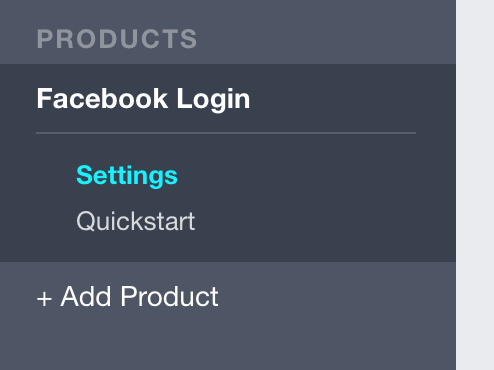
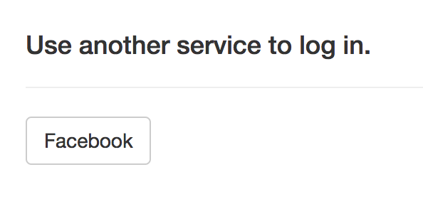
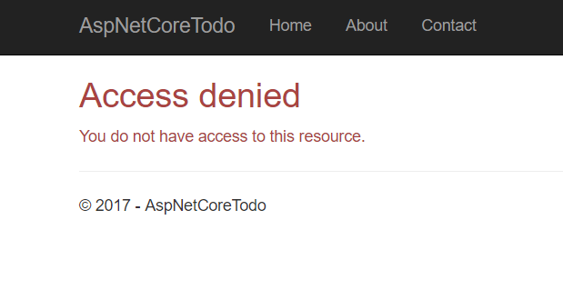

# 安全和身份验证

# 安全和身份验证

安全是任何现代 Web 应用程序或 API 的主要关注点。重要的是要保护好用户或客户的数据，不让攻击者获取。这涉及诸如

+   对输入数据进行净化，以防止 SQL 注入攻击

+   防止跨域（XSRF）攻击在表单中发生

+   使用 HTTPS（TLS），以防止数据在互联网上传输时被拦截

+   为用户提供一种安全地使用密码或社交登录凭据登录的方式

+   设计考虑安全性的密码重置或多因素身份验证流程

ASP.NET Core 可以帮助简化所有这些实现。前两者（防止 SQL 注入和跨域攻击）已经内置，你只需添加几行代码来启用 HTTPS 支持。本章主要关注安全性的**身份**方面：处理用户账户（注册、登录）、安全地对用户进行身份验证（登录）以及在用户通过身份验证后做出授权决策。

> 身份验证和授权是常常混淆的不同概念。**身份验证**涉及用户是否已登录，而**授权**涉及用户在登录后*可以做什么*。你可以把身份验证看作是在问：“我知道这个用户是谁吗？”而授权则是问：“这个用户有权限执行 X 吗？”

你用来构建项目的 MVC + Individual Authentication 模板包含许多构建在 ASP.NET Core Identity 之上的类，后者是 ASP.NET Core 的身份验证和身份系统的一部分。

## 什么是 ASP.NET Core Identity？

ASP.NET Core Identity 是随 ASP.NET Core 一起提供的身份系统。与 ASP.NET Core 生态系统中的其他一切一样，它是一组可以安装在任何项目中的 NuGet 包（如果使用默认模板，则已经包含在内）。

ASP.NET Core Identity 负责存储用户账户、哈希和存储密码以及管理用户的角色。它支持电子邮件/密码登录、多因素身份验证、与 Google 和 Facebook 等提供者的社交登录，以及使用诸如 OAuth 2.0 和 OpenID Connect 等协议连接到其他服务。

MVC + Individual Auth 模板附带的注册和登录视图已经充分利用了 ASP.NET Core Identity，并且它们已经可用！尝试注册一个账户并登录。

# 添加 Facebook 登录

## 添加 Facebook 登录

初始的 Individual Auth 模板包含使用电子邮件和密码进行注册的功能。你可以通过插入额外的身份提供者，如 Google 和 Facebook，来扩展此功能。

对于任何外部提供者，通常需要执行两个操作：

1.  在外部提供商创建一个应用程序（有时称为*客户端*），代表你的应用程序

1.  复制提供商生成的 ID 和密钥，并将它们放入你的代码中

### 在 Facebook 创建一个应用

您可以使用 Facebook 开发人员控制台在[`developers.facebook.com/apps`](https://developers.facebook.com/apps)上创建新的 Facebook 应用程序。单击**添加新应用**，然后按照说明创建应用程序 ID。

> 如果您没有 Facebook 帐户，可以选择设置 Google 或 Twitter 登录。提供商网站上的步骤可能不同，但代码几乎相同。

接下来，设置 Facebook 登录，然后在左侧点击设置，在 Facebook 登录下方：



将以下 URL 添加到**有效的 OAuth 重定向 URI**框中：

```
http://localhost:5000/signin-facebook 
```

> 您的应用程序运行的端口可能不同。如果使用`dotnet start`，通常是端口 5000，但如果您使用 Windows，则可能是随机端口，如 54574。无论如何，您始终可以在 Web 浏览器的地址栏中看到应用程序正在运行的端口。

单击**保存更改**，然后转到仪表板页面。在这里，您可以看到 Facebook 生成的应用 ID 和密钥，您一会儿会需要这些信息（保持此选项卡打开）。

要在 ASP.NET Core Identity 中启用 Facebook 登录，请在`Startup`类的`ConfigureServices`方法中的任何位置添加以下代码：

```
services
    .AddAuthentication()
    .AddFacebook(options =>
    {
        options.AppId = Configuration["Facebook:AppId"];
        options.AppSecret = Configuration["Facebook:AppSecret"];
    }); 
```

不要在代码中硬编码 Facebook 应用 ID 和密钥，而是从配置系统中提取这些值。`appsettings.json`文件通常是存储项目配置数据的地方。但是，由于它被检入源代码控制，因此不适合存储敏感数据，如应用程序密钥。（例如，如果您的应用程序密钥被推送到 GitHub，任何人都可以窃取它并代表您执行不良操作。）

### 使用 Secrets Manager 安全存储秘密

您可以使用 Secrets Manager 工具处理敏感数据，如应用程序密钥。在终端中运行此行以确保已安装（确保您当前在项目目录中）：

```
dotnet user-secrets --help 
```

从 Facebook 应用仪表板复制应用 ID 和密钥，然后使用`set`命令将这些值保存在 Secrets Manager 中：

```
dotnet user-secrets set Facebook:AppId <paste app id>
dotnet user-secrets set Facebook:AppSecret <paste app secret> 
```

当您的应用程序启动时，Secrets Manager 中的值将加载到`Configuration`属性中，因此它们在您之前添加的`ConfigureServices`中的代码中可用。

运行您的应用程序，然后单击导航栏中的登录链接。您将看到一个新的用于使用 Facebook 登录的按钮：



尝试使用 Facebook 登录。您将被重定向并提示在 Facebook 中授予您的应用程序权限，然后重���向回来并登录。

# 要求身份验证

## 要求身份验证

通常，您希望要求用户在访问应用程序的某些部分之前先登录。例如，向每个人显示主页是有意义的（无论您是否已登录），但只有在登录后才显示待办事项清单。

你可以在 ASP.NET Core 中使用 `[Authorize]` 属性要求特定操作或整个控制器中的已登录用户。要求 `TodoController` 的所有操作进行身份验证，将属性添加到控制器的第一行之前：

```
[Authorize]
public class TodoController : Controller
{
    // ...
} 
```

在文件顶部添加此 `using` 语句：

```
using Microsoft.AspNetCore.Authorization; 
```

尝试运行应用程序并访问 `/todo`，未登录时会自动重定向到登录页面。

> 尽管属性的名称是这样的，但实际上我们在这里进行的是身份验证检查，而不是授权检查。抱歉造成困惑。

# 在应用程序中使用身份验证

## 在应用程序中使用身份验证

待办事项列表本身仍然是所有用户共享的，因为待办事项实体与特定用户无关。现在，`[Authorize]` 属性确保你必须登录才能看到待办事项视图，你可以根据登录的用户来过滤数据库查询。

首先，在 `TodoController` 中注入 `UserManager<ApplicationUser>`：

**`Controllers/TodoController.cs`**

```
[Authorize]
public class TodoController : Controller
{
    private readonly ITodoItemService _todoItemService;
    private readonly UserManager<ApplicationUser> _userManager;

    public TodoController(ITodoItemService todoItemService,
        UserManager<ApplicationUser> userManager) {
        _todoItemService = todoItemService;
        _userManager = userManager;
    }

    // ...
} 
```

你需要在顶部添加一个新的 `using` 语句：

```
using Microsoft.AspNetCore.Identity; 
```

`UserManager` 类是 ASP.NET Core Identity 的一部分。你可以在 `Index` 操作中使用它来查找当前用户：

```
public async Task<IActionResult> Index() {
    var currentUser = await _userManager.GetUserAsync(User);
    if (currentUser == null) return Challenge();

    var todoItems = await _todoItemService.GetIncompleteItemsAsync(currentUser);

    var model = new TodoViewModel()
    {
        Items = todoItems
    };

    return View(model);
} 
```

操作方法顶部的新代码使用 `UserManager` 从操作中可用的 `User` 属性获取当前用户：

```
var currentUser = await _userManager.GetUserAsync(User); 
```

如果有已登录的用户，则 `User` 属性包含一个轻量级对象，其中包含一些（但不是所有）用户的信息。`UserManager` 使用此信息通过 `GetUserAsync` 在数据库中查找完整的用户详细信息。

`currentUser` 的值永远不应为 null，因为控制器上存在 `[Authorize]` 属性。但是，为了以防万一，进行一次理智检查是个好主意。如果用户的信息丢失，你可以使用 `Challenge()` 方法强制用户重新登录：

```
if (currentUser == null) return Challenge(); 
```

由于现在将 `ApplicationUser` 参数传递给 `GetIncompleteItemsAsync`，你需要更新 `ITodoItemService` 接口：

**`Services/ITodoItemService.cs`**

```
public interface ITodoItemService
{
    Task<IEnumerable<TodoItem>> GetIncompleteItemsAsync(ApplicationUser user);

    // ...
} 
```

下一步是更新数据库查询，仅显示当前用户拥有的项目。

### 更新数据库

你需要向 `TodoItem` 实体模型添加一个新的属性，以便每个项目都可以引用拥有它的用户：

```
public string OwnerId { get; set; } 
```

由于你更新了数据库上下文使用的实体模型，所以你还需要迁移数据库。在终端中使用 `dotnet ef` 创建一个新的迁移：

```
dotnet ef migrations add AddItemOwnerId 
```

这将创建一个名为 `AddItemOwner` 的新迁移，该迁移将向 `Items` 表添加一个新列，与你对 `TodoItem` 实体模型所做的更改相对应。

> 注意：如果你的数据库使用 SQLite，你需要手动调整迁移文件。有关详细信息，请参阅*使用数据库*章节中的*创建迁移*部分。

再次使用 `dotnet ef` 将其应用到数据库：

```
dotnet ef database update 
```

### 更新服务类

数据库和数据库上下文更新后，现在可以在 `TodoItemService` 中更新 `GetIncompleteItemsAsync` 方法，并在 `Where` 语句中添加另一个子句：

**`Services/TodoItemService.cs`**

```
public async Task<IEnumerable<TodoItem>> GetIncompleteItemsAsync(ApplicationUser user)
{
    return await _context.Items
        .Where(x => x.IsDone == false && x.OwnerId == user.Id)
        .ToArrayAsync();
} 
```

如果运行应用程序并注册或登录，你会再次看到一个空的待办事项列表。不幸的是，你尝试添加的任何项目都会消失，因为你还没有更新添加项目操作以保存当前用户到新项目中。

### 更新添加项目和标记完成操作

在 `AddItem` 和 `MarkDone` 动作方法中，你需要像在 `Index` 中一样使用 `UserManager` 来获取当前用户。唯一的区别是，这些方法会向前端代码返回 `401 Unauthorized` 响应，而不是挑战并将用户重定向到登录页面。

下面是 `TodoController` 中两个更新后的方法：

```
public async Task<IActionResult> AddItem(NewTodoItem newItem) {
    if (!ModelState.IsValid)
    {
        return BadRequest(ModelState);
    }

    var currentUser = await _userManager.GetUserAsync(User);
    if (currentUser == null) return Unauthorized();

    var successful = await _todoItemService.AddItemAsync(newItem, currentUser);
    if (!successful)
    {
        return BadRequest(new { error = "Could not add item." });
    }

    return Ok();
}

public async Task<IActionResult> MarkDone(Guid id) {
    if (id == Guid.Empty) return BadRequest();

    var currentUser = await _userManager.GetUserAsync(User);
    if (currentUser == null) return Unauthorized();

    var successful = await _todoItemService.MarkDoneAsync(id, currentUser);
    if (!successful) return BadRequest();

    return Ok();
} 
```

现在，这两个服务方法必须接受一个 `ApplicationUser` 参数。更新 `ITodoItemService` 中的接口定义：

```
Task<bool> AddItemAsync(NewTodoItem newItem, ApplicationUser user);

Task<bool> MarkDoneAsync(Guid id, ApplicationUser user); 
```

最后，在 `TodoItemService` 中更新服务方法的实现。

对于 `AddItemAsync` 方法，在构造新的 `TodoItem` 时设置 `Owner` 属性：

```
public async Task<bool> AddItemAsync(NewTodoItem newItem, ApplicationUser user) {
    var entity = new TodoItem
    {
        Id = Guid.NewGuid(),
        OwnerId = user.Id,
        IsDone = false,
        Title = newItem.Title,
        DueAt = DateTimeOffset.Now.AddDays(3)
    };

    // ...
} 
```

`MarkDoneAsync` 方法中的 `Where` 子句还需要检查用户的 ID，以防止不良用户通过猜测他们的 ID 完成其他人的项目：

```
public async Task<bool> MarkDoneAsync(Guid id, ApplicationUser user) {
    var item = await _context.Items
        .Where(x => x.Id == id && x.OwnerId == user.Id)
        .SingleOrDefaultAsync();

    // ...
} 
```

完成！尝试使用两个不同的用户帐户使用应用程序。待办事项对每个帐户保持私密。

# 使用角色进行授权

## 使用角色进行授权

在 Web 应用程序中，角色是处理授权和权限的常用方法。例如，你可能有一个 Administrator 角色，允许管理员查看和管理注册到你的应用程序的所有用户，而普通用户只能查看自己的信息。

### 添加一个管理用户页面

首先，创建一个新的控制器：

**`Controllers/ManageUsersController.cs`**

```
using System;
using System.Linq;
using System.Threading.Tasks;
using Microsoft.AspNetCore.Mvc;
using Microsoft.AspNetCore.Authorization;
using Microsoft.AspNetCore.Identity;
using AspNetCoreTodo.Models;
using Microsoft.EntityFrameworkCore;

namespace AspNetCoreTodo.Controllers
{
    [Authorize(Roles = "Administrator")]
    public class ManageUsersController : Controller
    {
        private readonly UserManager<ApplicationUser> _userManager;

        public ManageUsersController(UserManager<ApplicationUser> userManager) {
            _userManager = userManager;
        }

        public async Task<IActionResult> Index() {
            var admins = await _userManager
                .GetUsersInRoleAsync("Administrator");

            var everyone = await _userManager.Users
                .ToArrayAsync();

            var model = new ManageUsersViewModel
            {
                Administrators = admins,
                Everyone = everyone
            };

            return View(model);
        }
    }
} 
```

在 `[Authorize]` 属性上设置 `Roles` 属性将确保用户必须登录 **并且** 被分配 `Administrator` 角色才能查看页面。

接下来，创建一个视图模型：

**`Models/ManageUsersViewModel.cs`**

```
using System.Collections.Generic;
using AspNetCoreTodo.Models;

namespace AspNetCoreTodo
{
    public class ManageUsersViewModel
    {
        public IEnumerable<ApplicationUser> Administrators { get; set; }

        public IEnumerable<ApplicationUser> Everyone { get; set; }
    }
} 
```

最后，为 Index 动作创建一个视图：

**`Views/ManageUsers/Index.cshtml`**

```
@model ManageUsersViewModel

@{
    ViewData["Title"] = "Manage users";
}

<h2>@ViewData["Title"]</h2>

<h3>Administrators</h3>

<table class="table">
    <thead>
        <tr>
            <td>Id</td>
            <td>Email</td>
        </tr>
    </thead>

    @foreach (var user in Model.Administrators)
    {
        <tr>
            <td>@user.Id</td>
            <td>@user.Email</td>
        </tr>
    }
</table>

<h3>Everyone</h3>

<table class="table">
    <thead>
        <tr>
            <td>Id</td>
            <td>Email</td>
        </tr>
    </thead>

    @foreach (var user in Model.Everyone)
    {
        <tr>
            <td>@user.Id</td>
            <td>@user.Email</td>
        </tr>
    }
</table> 
```

启动应用程序并尝试以普通用户身份访问 `/ManageUsers` 路由。你会看到这个访问被拒绝的页面：



这是因为用户不会自动分配 `Administrator` 角色。

### 创建一个测试管理员帐户

出于明显的安全原因，注册页面上没有一个复选框可以让任何人轻松创建管理员帐户。相反，你可以在 `Startup` 类中编写一些代码，在应用程序启动时创建一个测试管理员帐户。

将此代码添加到 `Configure` 方法的 `if (env.IsDevelopment())` 分支中：

**`Startup.cs`**

```
if (env.IsDevelopment())
{
    // (... some code)

    // Make sure there's a test admin account
    EnsureRolesAsync(roleManager).Wait();
    EnsureTestAdminAsync(userManager).Wait();
} 
```

`EnsureRolesAsync`和`EnsureTestAdminAsync`方法将需要访问`RoleManager`和`UserManager`服务。您可以将它们注入到`Configure`方法中，就像将任何服务注入到您的控制器中一样：

```
public void Configure(IApplicationBuilder app,
    IHostingEnvironment env,
    UserManager<ApplicationUser> userManager,
    RoleManager<IdentityRole> roleManager) {
    // ...
} 
```

在`Configure`方法下方添加两个新方法。首先是`EnsureRolesAsync`方法：

```
private static async Task EnsureRolesAsync(RoleManager<IdentityRole> roleManager) {
    var alreadyExists = await roleManager.RoleExistsAsync(Constants.AdministratorRole);

    if (alreadyExists) return;

    await roleManager.CreateAsync(new IdentityRole(Constants.AdministratorRole));
} 
```

此方法检查数据库中是否存在`Administrator`角色。如果不存在，则创建一个。不要重复输入字符串`"Administrator"`，而是创建一个名为`Constants`的小类来保存该值：

**`Constants.cs`**

```
namespace AspNetCoreTodo
{
    public static class Constants
    {
        public const string AdministratorRole = "Administrator";
    }
} 
```

> 随意更新之前创建的`ManageUsersController`以使用此常量值。

接下来，编写`EnsureTestAdminAsync`方法：

**`Startup.cs`**

```
private static async Task EnsureTestAdminAsync(UserManager<ApplicationUser> userManager) {
    var testAdmin = await userManager.Users
        .Where(x => x.UserName == "admin@todo.local")
        .SingleOrDefaultAsync();

    if (testAdmin != null) return;

    testAdmin = new ApplicationUser { UserName = "admin@todo.local", Email = "admin@todo.local" };
    await userManager.CreateAsync(testAdmin, "NotSecure123!!");
    await userManager.AddToRoleAsync(testAdmin, Constants.AdministratorRole);
} 
```

如果数据库中不存在用户名为`admin@todo.local`的用户，此方法将创建一个用户并分配一个临时密码。第一次登录后，您应该将帐户的密码更改为安全密码。

> 因为这两个方法是异步的并返回一个`Task`，所以在`Configure`中必须使用`Wait`方法来确保它们在`Configure`继续执行之前完成。通常情况下，您会使用`await`，但由于技术原因，您无法在`Configure`中使用`await`。这是一个罕见的例外 - 在其他地方应该使用`await`！

下次启动应用程序时，将创建`admin@todo.local`帐户并分配`Administrator`角色。尝试使用此帐户登录，并导航到`http://localhost:5000/ManageUsers`。您将看到应用程序注册的所有用户的列表。

> 作为额外的挑战，尝试在此页面上添加更多管理功能。例如，您可以添加一个按钮，使管理员能够删除用户帐户。

### 在视图中检查授权

`[Authorize]`属性使在控制器或操作方法中执行授权检查变得容易，但如果您需要在视图中进行授权检查怎么办？例如，如果登录用户是管理员，则在导航栏中显示“管理用户”链接会很好。

您可以直接将`UserManager`注入到视图中以执行这些类型的授权检查。为保持视图清晰和组织良好，创建一个新的部分视图，将在布局中的导航栏中添加一个项目：

**`Views/Shared/_AdminActionsPartial.cshtml`**

```
@using Microsoft.AspNetCore.Identity
@using AspNetCoreTodo.Models

@inject SignInManager<ApplicationUser> SignInManager
@inject UserManager<ApplicationUser> UserManager

@if (SignInManager.IsSignedIn(User))
{
    var currentUser = await UserManager.GetUserAsync(User);

    var isAdmin = currentUser != null
        && await UserManager.IsInRoleAsync(currentUser, Constants.AdministratorRole);

    if (isAdmin) {
        <ul class="nav navbar-nav navbar-right">
            <li><a asp-controller="ManageUsers" asp-action="Index">Manage Users</a></li>
        </ul>
    }
} 
```

**部分视图**是视图的一个小片段，嵌入到另一个视图中。通常将部分视图命名以`_`下划线开头，但这并非必需。

此部分视图首先使用`SignInManager`快速确定用户是否已登录。如果他们没有，可以跳过其余的视图代码。如果有用户已登录，则使用`UserManager`查找其详细信息，并使用`IsInRoleAsync`执行授权检查。如果所有检查都成功，则呈现导航栏项目。

要在主布局中包含此部分视图，请编辑`_Layout.cshtml`并将其添加到导航栏部分中：

**`Views/Shared/_Layout.cshtml`**

```
<div class="navbar-collapse collapse">
    <ul class="nav navbar-nav">
        <li><a asp-area="" asp-controller="Home" asp-action="Index">Home</a></li>
        <li><a asp-area="" asp-controller="Home" asp-action="About">About</a></li>
        <li><a asp-area="" asp-controller="Home" asp-action="Contact">Contact</a></li>
    </ul>
    @await Html.PartialAsync("_LoginPartial")
    @await Html.PartialAsync("_AdminActionsPartial")
</div> 
```

当您使用管理员帐户登录时，您现在会在右上角看到一个新项目：


## 总结

ASP.NET Core Identity 是一个强大的安全和身份系统，可帮助您添加身份验证和授权检查，并且轻松集成外部身份提供者。`dotnet new` 模板为您提供了预构建的视图和控制器，处理常见场景，如登录和注册，因此您可以快速启动。

ASP.NET Core Identity 还有更多功能。您可以在[`docs.asp.net`](https://docs.asp.net)上的文档和示例中了解更多。
