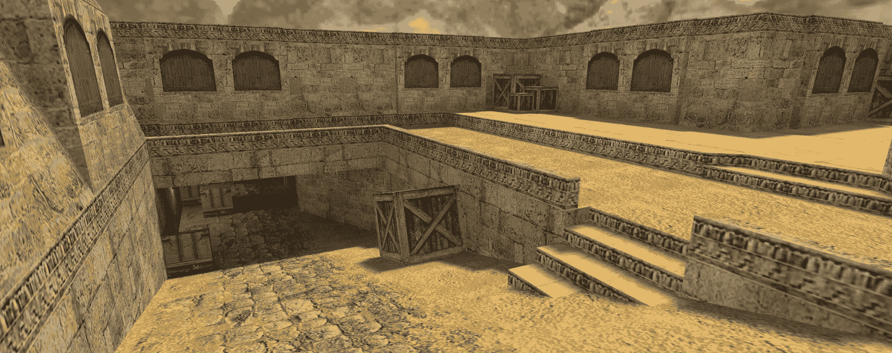
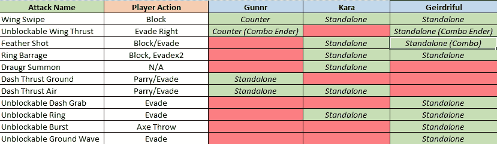
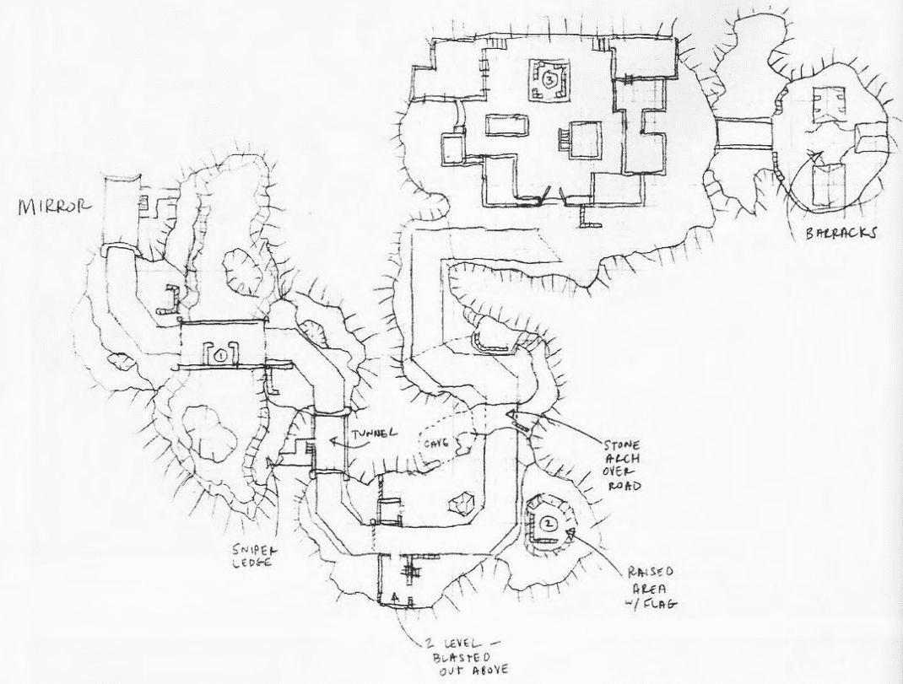
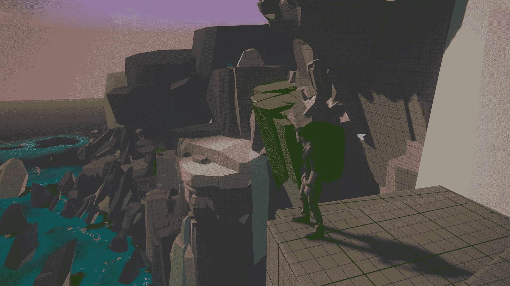
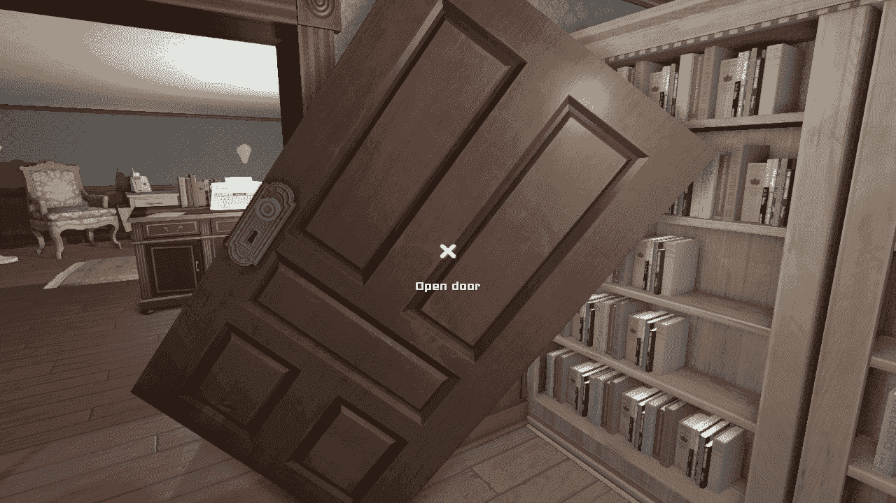
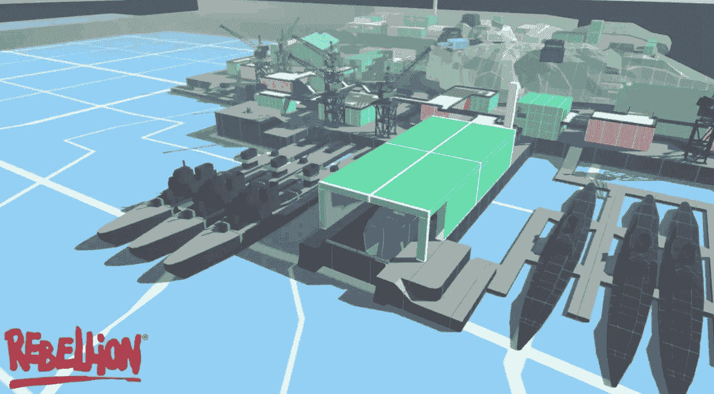

# 🗺️如何制作关卡

> 原文：[`book.leveldesignbook.com/process/overview`](https://book.leveldesignbook.com/process/overview)

大多数 3D 关卡设计项目都涉及以下流程：

1.  ****前期制作****：规划出大的想法和整体体验设计。

1.  ****战斗** **（可选）**：对于战斗游戏，定义玩家和敌人类型之间的交互。

1.  ****布局****：为关卡绘制一个视觉的俯视图 2D 计划。

1.  ****预制作****：构建基本的游戏内 3D 草图并测试它。**

1.  ****脚本****：整合事件和行为（任务、任务、门、按钮、AI）**

1.  ****光照****：安排光源以增加深度和可读性**

1.  ****环境艺术****：用道具和布景“艺术化”关卡**

1.  ****发布****：记录、宣传和发布项目。

如果你不知道从哪里开始，尝试做所有的事情。随着经验的增加，你会学会何时跳过或扩展一个阶段。

****

underpass in de_dust by Dave "DaveJ" Johnston, for Counter-Strike 1.6****

## **定制流程**

每个关卡/项目都有不同的需求。没有一种万无一失的方法来制作关卡。

+   **小组项目**需要更多的**前期制作**和规划，比如节奏大纲和布局草图。如果没有足够的沟通和文档，合作者无法协作。

+   ****战斗** **游戏/多人地图**需要更多的**预制作**时间来调整遭遇战和地图平衡，并重点关注**测试****。

+   **以****叙事** **为重点的单人关卡**从较长的预制作期中受益较少。这可能听起来很有吸引力，但实际上是一个零确定性的特殊地狱。何时一个故事“足够好”？你将需要在脚本和环境艺术上进行大量的迭代。如果你的故事改变了，你将不得不重做一切，而且很难保持一切同步。你有没有玩过故事不合理的游戏？那可能就是你的游戏了。

## **过程概述**

### ************1. 前期制作****

**前期制作**是关于规划项目的基本形状和范围。项目是关于什么的？设计目标和限制是什么？

**初学者往往完全忽视项目规划，而经验丰富的设计师有时会过度规划。大型商业工作室通常会在前期制作上花费数月甚至数年。当团队合作时，这一阶段非常重要，因为这是你们所有人调整期望的时候。当作为爱好者独立工作时，你可能可以减少规划。** 

**前期制作计划通常是文本文档、带有可移动卡片的板子和电子表格。**

***关于概念规划，请参阅*前期制作***

**

来自维多利亚和阿尔伯特博物馆“电子游戏”展览的《最后生还者》（Naughty Dog）内部规划板的照片**

### **********2．战斗设计（可选）**

**如果你的项目是关于战斗的，那么典型的战斗是什么样的，战斗由什么组成？玩家如何准备？你如何让战斗感觉多样化且新鲜？**

**战斗就像任何其他游戏系统或机制。你应该在为它们制作关卡之前定义这些体验设计目标。**

**如果你是从零开始制作战斗游戏，直到程序员和艺术家使其功能化和可读性之前，战斗都不会“感觉良好”！你基本上必须制作整个游戏，才能知道战斗的感觉！因为这是一项如此繁重的工作，我们建议修改战斗游戏，这样你就可以在预构建的经过实战测试的系统上练习。**

***关于设计战斗、武器和敌人的更多信息，请参阅*战斗***

***关于推荐用于修改的战斗游戏列表，请参阅*工具**.**

**

展示《战神》（2018）中瓦尔基里 Boss 动作矩阵的电子表格分解，[由 Jason de Heras（via Twitter）提供](https://twitter.com/jasondeheras/status/1376005158656638977)**

### **********3．布局**

**布局是关卡的基本结构，通常是一个核心区域和元素的平面 2D 图纸。**

**对于一个小型的独立爱好者项目，一个简单的布局草图，甚至是一个涂鸦，可能就足够了。**

**对于团队/大型项目，详细的布局图是重要的沟通工具。没有人能读懂你的想法；如果你不将其视觉化并讨论，那么没有人会知道你想要什么。**

**布局图通常是俯视图的 2D 平面图，但等距/透视绘图也很常见。记住，这并不是关于成为一个伟大的艺术家；这是关于沟通！这张图是玩家可以前往以及可以做什么的视觉计划。**

*关于视觉空间规划，请参阅*布局***

****

Team Fortress Classic 多人地图“Warpath”的布局草图，由 Robin Walker 制作****

### ************4\. Blockout****

******Blockout**是一个可玩的原型关卡，使用低细节的简单块状 3D 形状构建。****

****我们原型化关卡的基本结构，以便在游戏引擎中进行测试。测试帮助我们决定关卡是否太小或太大，是否令人困惑或有趣，是否平衡或损坏等。****

****这种测试对于任何战斗游戏或任何通过重新排列房间就能引起玩家行为重大变化的情况都至关重要。如果你发现房间设计不起作用，那么当它由简单的形状组成时，你可以更容易地对其进行修改。****

****Blockout 文件是可玩的游戏关卡/场景文件，加载到游戏引擎中。****

有关游戏内 3D 原型设计的更多信息，请参阅*Blockout*****

*****

Uncharted 4（Naughty Dog）中悬崖关卡的原型截图，由 Em Schatz 制作*****

### **********5\. 脚本编写*****

*******脚本编写**是将行为、事件和游戏逻辑集成到关卡中的过程。*****

*****门脚本编写是游戏开发中最困难的问题之一。火车和移动平台更加复杂。最好从按钮和可收集物品开始。*****

*****任务目标、任务、预告片、编排，以及任何 AI 控制/战斗/遭遇设计通常依赖于脚本编写。如果你害怕编程，不要害怕，许多游戏引擎和工具集都有专门的脚本语言和工具来简化编程过程。*****

*****关卡设计文化往往低估了脚本编写者的作用，然而脚本编写是让关卡感觉“生动”并使其成为体验的关键。*****

******有关制作关卡实现功能的更多信息，请参阅*脚本编写******

******

在《Gone Home》的早期版本中，门的工作并不完全正确... 来自博客文章["Code Judo" by Johnnemann Nordhagen](https://fullbright.company/2012/07/02/code-judo/)**

### ******************6\. 光照******

********光照**为 Blockout 添加阴影和深度，帮助玩家理解关卡的核心形状。******

******没有光照，3D 游戏世界将更像是一个平面的 2D 图像，这将很难判断距离或理解完整的布局。光和阴影还充当一种掩护/信息层，这对于战斗游戏至关重要。******

******尽管游戏行业通常将照明视为环境艺术的一个装饰性方面，但我们认为照明具有关键的游戏功能，并且必须与关卡设计师进行深入咨询来精心制作。******

*******有关游戏玩法照明设计的更多信息，请参阅*照明*******。

******

medieval lighting study with light entities [by Harley Wilson (via Artstation.com)](https://www.artstation.com/artwork/lBLzJ)******

### ******************7． 环境艺术******

******一旦你对关卡的整体形状和流程有足够的信心，你就可以开始添加更多**环境艺术**，或视觉细节。******

******艺术通过是添加这些细节的过程。大多数项目将需要多次艺术通过。******

******许多人认为艺术通过是“有趣的部分”。初学者往往在没有充分规划、布局或块状工作的情况下急于进行艺术通过。过早的艺术通过会锁定早期设计错误，因为改变关卡和重做所有艺术作品变得“昂贵”。所以，抵制诱惑！不要急于进行艺术通过！******

*******有关制作关卡更美观的更多信息，请参阅*环境艺术*******

*******

animated GIF of development process for a snowy military dock level in Sniper Elite*******

### *********************8． 发布*******

*******当项目完成时，是时候**发布**并确保它触及你的受众了。*******

*******对于商业项目，游戏发布只是噩梦的开始——你必须继续推广和宣传项目，衡量用户反馈，发布错误修复，甚至构建额外的发布后内容。*******

*******对于个人作品集项目，你必须正确记录关卡设计，否则没有人会理解你做了什么。没有有效的文档，项目基本上就不存在。*******

*******初学者往往在发布阶段投入的时间不足，并假设项目会自我宣传——*但如果没有人在乎，那么你的作品就没有人来说话了。********

*******有关发布关卡/构建作品集的更多信息，请参阅*发布*******。

## ******待审阅******

******关卡设计通常涉及多个步骤，一般顺序如下：（1）前期制作，（2）战斗设计（除非不是战斗游戏），（3）布局，（4）块状，（5）脚本，（6）照明，（7）环境艺术，以及（8）发布。******

******但每个项目都是不同的。有时你可能想跳过布局阶段，或者扩展脚本阶段，或者在进行脚本之前先做环境艺术等。******

******如果你在项目初期或早期设计生涯中，你可能需要尝试做所有的事情，直到你找出最适合你的流程。******

## ******现在怎么办？******

+   ******从开始做起——了解关卡设计的前期制作。即使只是一点点规划也会大有帮助。这将帮助你弄清楚你在做什么。******

+   ******日常中，大多数关卡设计师倾向于关注布局和草图。******
