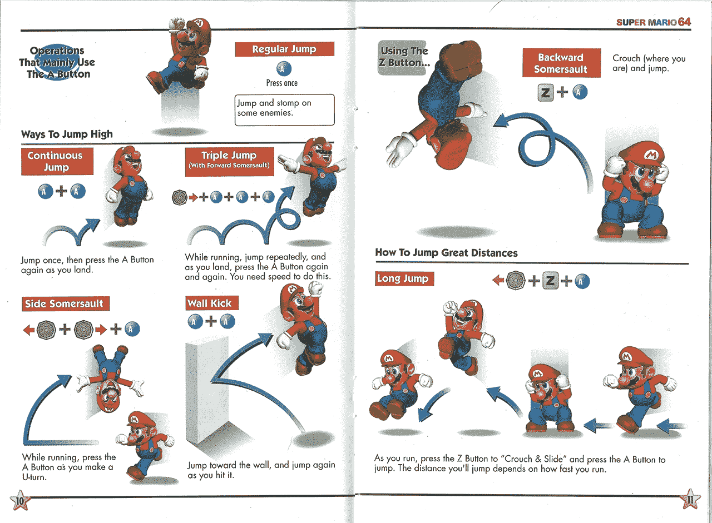
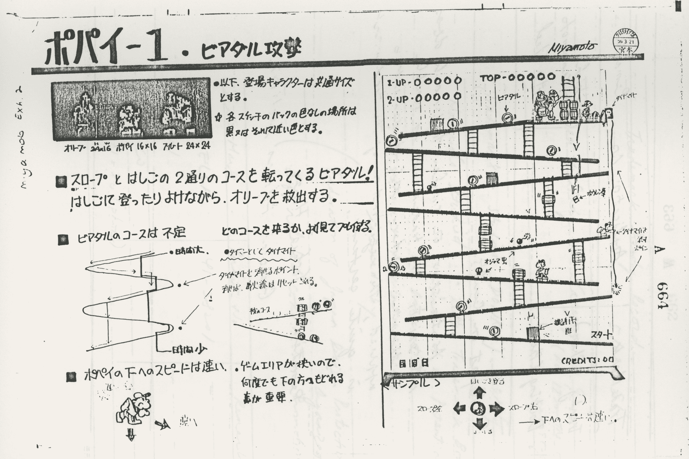
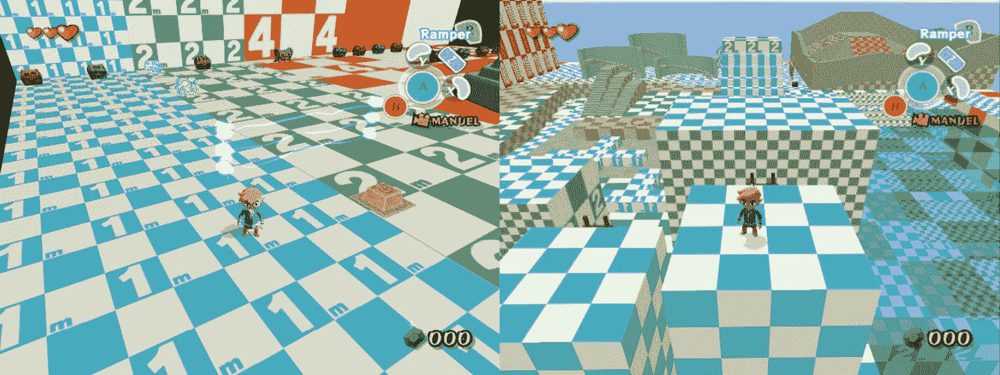
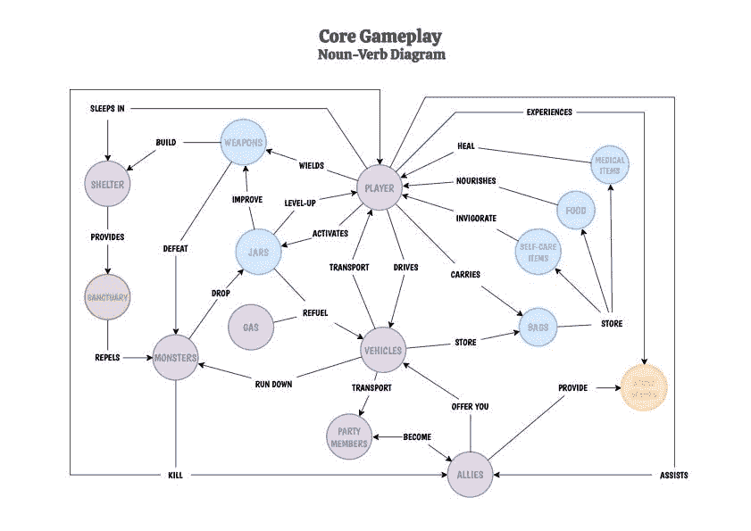
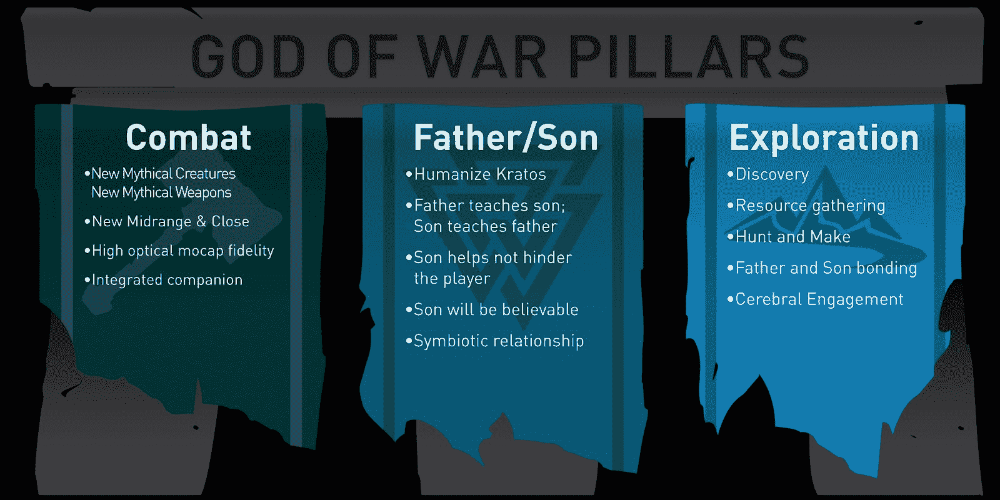

# 🧠前期制作

> 原文：[`book.leveldesignbook.com/process/preproduction`](https://book.leveldesignbook.com/process/preproduction)

## 前期制作是什么？

> *"计划虽少，但规划是必要的。"* —— 某人

**前期制作**是项目的早期阶段，在这个阶段你产生想法并试图弄清楚项目的内容。它涉及到回答一些大的设计问题：

+   *你*在制作什么？

    +   玩家将能够做什么？（机制、体验目标、节奏）

    +   哪些部分最重要？（支柱）

+   *你*将如何制作这个？

    +   其他人是如何解决类似问题的？（研究）

    +   你需要多少时间？这是否可行？（范围）

你对这些问题的回答将在项目过程中发生变化，这是可以的。

**规划是有用的，但它不是魔法；**你只有在真正制作它之前，才知道你将制作什么。

## 项目规划

关卡规划可以采取多种形式。例如，对于一个小型的个人爱好项目，规划不那么重要，你可以写或画一个简单的初步计划，然后享受即兴创作和发现的乐趣。但对于大型团队项目，规划有助于每个人知道该做什么/每个人需要从其他人那里得到什么。

#### 最小化清单

非常基本的问题，足以进行快速的个人项目：

#### 推荐清单

但实际上，你也应该能够回答这些其他的基本问题：

#### 完整清单

对于 3 人以上或 3 个月以上的项目，则需要更多的规划：

在下面的视频中，行业级设计师史蒂夫·李（Steve Lee）谈论了他的流程——在绘制任何布局或打开编辑工具之前，他首先打开一个文本窗口，并写下关于该关卡应该发生的事情的大纲。这是规划的核心：**思考主要想法并讨论它们**。

["如何先在文本中设计关卡，以及为什么" (22 分钟)](https://www.youtube.com/watch?v=0FSssDWEFLc) 由史蒂夫·李（Steve Lee）上传的视频，2022 年 6 月 21 日

## 力学

游戏机制是指你在游戏中重复的任何活动、系统或策略，基本上是玩家例行执行或使用的任何动作。**核心机制**是游戏中最基本、最频繁和最根本的动作/系统，而较少发生的活动可以称为*次要机制*。

人们就“机制”的确切定义争论不休。本书采用广泛包容的定义，因为我们不在乎。但如果你在乎，[了解更多关于它的信息](https://en.wikipedia.org/wiki/Game_mechanics)。

我们如何谈论游戏机制的几个例子：

+   《超级马里奥 64》的核心机制是跑步和跳跃以到达出口。一些《马里奥 64》关卡支持次要机制，如墙壁踢来获得秘密捷径。

+   Doom 的核心机制包括奔跑和射击，几乎没有跳跃。有时玩家会诱使怪物相互射击，这是一种称为内战的次要机制。

+   《盗贼：暗影项目》是一款潜行游戏，关于避开敌人，其核心机制是响亮而快速的脚步声会吸引守卫。与马里奥和 Doom 不同，盗贼不鼓励快速移动，奔跑是一种次要机制。

马里奥 64、Doom 和盗贼都是关于不死亡就到达出口的 3D 动作游戏。然而，这些游戏在关卡设计上需要非常不同的方法。马里奥的平台跳跃将使 Doom 关卡变得不可能，而 Doom 风格的怪物群将使盗贼关卡变得极其不公平。

不要为游戏类型设计，不要在熟悉的模式中梦游。相反，为实际存在的游戏设计！如果你在修改游戏，至少要玩上几个小时，包括其他修改者的作品。观看 YouTube 游戏玩法视频，注意其他玩家如何使用机制和系统。

来自《超级马里奥 64》游戏手册的一页，详细说明了各种动作和机制

### 机制尚未最终确定？

在不知道机制的情况下构建关卡是困难的。机制和关卡相互依赖，一个不能没有另一个存在。你无法在没有测试关卡的情况下评估机制，但你也不能在没有最终确定的机制的情况下完全评估关卡。

如果你更改了机制，那么你最终会浪费大量工作，并产生依赖已丢弃机制的过时关卡。但是，如果你没有构建足够的测试关卡来衡量机制潜力，那么你可能会得到一个在第一关之后就不那么有趣的糟糕机制。

你可能需要丢弃或重做关卡，甚至可能多次！没关系。不要认为这是浪费时间或工作。相反，将每个被丢弃的版本视为宝贵的研究。这就是我们称之为游戏*开发*的原因——开发是一个需要时间的过程。确定什么是一个好的关卡和一个好的游戏需要时间。

显示机制、控制和流程的 1981 年 Donkey Kong 早期设计文档；由宫本茂制作([via Twitter](https://twitter.com/forestillusion/status/1443284433268666368/))

### 构建游乐场测试地图

作为规划过程的一部分，构建**游乐场****blockout** **测试地图**：大型的方形庭院关卡，充满了多样的地板、房间形状和游戏对象。

这些简单的游乐场风格调试关卡对于测试游戏机制和游戏的整体感觉至关重要。如果你正在原型化自己的角色控制器和玩家物理，这尤其重要，以确保玩家可以在游戏中舒适地移动。

*关于构建内部使用测试地图的更多信息，请参阅* *指标**.*

来自法国版《塞尔达传说：时之笛》的实际内部开发者指标封锁测试地图“K_Test2”和“I_TestM”，截图由 Dark Linkaël 提供。[通过 tcrf.net](https://tcrf.net/The_Legend_of_Zelda:_The_Wind_Waker/Unused_Rooms/Page_Two)

### 名词-动词图解

现代游戏开发者今天很少使用大型的“GDD”（游戏设计文档）或大型设计圣经；*没有人会读那么多，*而且随着游戏的演变，文档很快就会过时。相反，创建一个**名词-动词图解**来**视觉跟踪游戏系统和机制之间的交互**。

> "[名词-动词图解]有助于找到漏洞并质疑我们对玩家动机所做出的假设，并且对于快速展示来说非常方便，人们可以通过这种方式比一大堆冗长的副本更快地理解游戏。
> 
> [...] **这个图解** ***不是*** **用来列出所有可能的事情，而是列出你认为重要的事情。**"
> 
> -- 李娜·范·德文特，["名词-动词图解"](https://cohost.org/Leena/post/297770-noun-verb-diagrams)

Reuben Games 开发的[Dead Static Drive](https://www.deadstaticdrive.com/)的核心游戏名词-动词图解，由李娜·范·德文特在其帖子“名词-动词图解”中提供。[通过李娜·范·德文特的帖子 "Noun-verb diagrams"](https://cohost.org/Leena/post/297770-noun-verb-diagrams)

## 体验目标

**体验目标**是玩家的一种想法、感觉或活动。为了概念化目标，尝试从短语“在这个关卡中，玩家应该[学习/感受/做]...”开始。

+   *在这个关卡中，玩家应该... ...* 学习如何使用双重跳跃能力。（教程）

+   *在这个关卡中，玩家应该...* ...感到脆弱，然后到达安全屋并感到放松。（情感）

+   *在这个关卡中，玩家应该...* ...躲避致命的陷阱，并在最后解锁一条捷径。（活动）

+   *在这个关卡中，玩家应该...* ...感觉像是在逃离中世纪的监狱。（幻想）

### 设定目标建议

**要具体。**

体验目标不必复杂或深刻，但一个清晰和具体的体验目标有助于你决定要构建什么，什么是不必要的。

*"玩家应该感到快乐"*是一个模糊的目标，不能驱动设计决策。哪种类型的快乐？有多快乐？要更具体。

或者，如果目标是“让玩家感到恐惧”，那么是哪种恐惧？有身体恐怖、存在主义恐怖、失败恐惧、被拒绝恐惧、中年危机等。

**从玩家的角度思考。**

避免抽象的体验目标。想象一下玩家的视角。

例如，*"玩家应该享受非线性"* 关注的是一个与普通玩家无关的抽象结构，因此它不是一个有用的体验目标。你实际上所说的享受或非线性是什么意思？

想象一下在试玩后进行讨论。你希望玩家对你的关卡说些什么？如果他们说："哇，这真的很...嗯...非线性..."，你会感到受辱。

#### 次要设计目标可以帮助。

关卡很少只有一个体验设计目标。即使是教程关卡也能从叙事和氛围中受益。这些次要目标可以帮助指导你的设计决策。

例如，*"同时与多个敌人战斗"* 是一个关卡的设计目标。但还有很多东西仍然没有定义。这个关卡设置在哪里？敌人类型是什么？

尝试添加一个节奏目标："一开始感到不知所措" ... 因此，战斗可能应该在一个小空间开始，敌人几乎包围了玩家。

添加一个幻想/叙事目标："感觉像在保卫营地免受僵尸侵袭" ... 因此，我们可能应该研究不同类型的营地（军事？徒步旅行者？冬季？）来规划竞技场。营地有篝火，也许有一种火武器...等等。

### 支柱

在整个项目中，最重要的体验目标是**支柱**——那些在结构上支持和证明整个设计的最关键思想。设计支柱帮助团队保持对项目的整体愿景，并抵制那些实际上不支持主要目标的功能蔓延工作。

支柱是设计规划工具，帮助你构思每个关卡或区域的短期体验目标。你关卡中的每个较小的体验目标和小的游戏成就都应该以某种方式为支柱做出贡献，最终汇聚成整个游戏体验的宏大弧线。

为了帮助内化这些大的设计目标，用简洁的短语或词为每个支柱命名。例如，索尼圣莫尼卡工作室的《战神》（2018）内部设计支柱是战斗、父子关系和探索（见下文）。

由 SIE 圣莫尼卡工作室展示的《战神》（2018）的核心体验目标/“支柱”

由于这是一款大预算的 AAA 游戏，他们的体验目标还涉及生产价值目标，如"高光学[动作捕捉]保真度"。

你可能会认为这个角色动画目标与关卡设计关系不大，但想象一下一个让动作捕捉角色动画看起来很糟糕的关卡——现在谁需要改变他们的工作，是关卡设计师还是动画师？

由于整个团队已经一致同意动作捕捉动画应该作为一个支柱优先考虑，也许这先前的共识意味着关卡设计师应该改变他们的关卡以适应现有的动画。

以这种方式，支柱帮助我们定义了我们项目的重要之处，从而在开发过程中做出更一致和连贯的决定。

## 示例：Psychonauts 2

Psychonauts 2 是一款关于探索人们大脑的 3D 平台游戏。2016 年 11 月，Double Fine Studios 制作了一个预生产原型，采用垂直切片风格的“艺术测试”原型，距离游戏在 2021 年 8 月发布还有 5 年时间。

如他们在官方开发纪录片系列 ["PsychOdyssey"](https://www.youtube.com/playlist?list=PLIhLvue17Sd70y34zh2erWWpMyOnh4UN_) 第 8 集所展示，预生产团队专注于在 Unreal Engine 4 中构建核心动作集、艺术风格和关卡设计。虽然大部分核心平台机制是从原始 Psychonauts 1 继承下来的，但团队希望尝试新的方法，让玩家的各种心灵能力与平台游戏玩法相互作用——从而产生了一种在最终游戏中从未出现过的，可以移动的绳索的念力原型机制。

到开发周期结束时，仍然有很多不确定性和未解决的问题。这款游戏会好吗？没有人知道。旅程才刚刚开始。

Double Fine PsychOdyssey · EP08: “多年的大量工作” [(via YouTube)](https://www.youtube.com/watch?v=eaA0P2dDHSg&list=PLIhLvue17Sd70y34zh2erWWpMyOnh4UN_&index=9) 上传于 2023 年 2 月 11 日

## 示例：被遗忘者 2，"时钟庄园"

Dishonored 是一款关于探索复杂场所的第一人称潜行动作 RPG 系列。在 Dishonored 2 中，有一个“时钟庄园”关卡，其布局会动态变化。

Arkane Studios 的设计师达娜·奈特林格尔构建了一个概念预生产原型：([Twitter 线程](https://twitter.com/DanaENight/status/1448582302855045124))

> "我在 2013 年初创建了这一概念原型，远在地图获得绿灯被纳入游戏之前，基本上是为了表达“这可能会很棒”和“我应该着手做这件事”。它确实做到了，但直到一年多后地图才正式获得批准。"
> 
> 但当然，我可以让一大堆方块以任何我想要的方式动画化。使用真实关卡几何形状能实现什么？这就是我制作这个原型的原因。更少一些疯狂？是的。但仍然明显可行。
> 
> 那个原型引入了房间可以像货柜一样移动并插入到位的想法，使地图布局完全动态，但不会转换房间。我很高兴我们没有走那条路。
> 
> [...]
> 
> 在几乎一年时间专注于其他原型之后，是时候重新审视时钟庄园并最终得到验证。我制作了一个新版本，房间更少，更注重“幕后”区域..."
> 
> -- [达娜·奈特林格尔 (@DanaENight), 2021 年 10 月 14 日](https://twitter.com/DanaENight/status/1448582302855045124)

为了让您了解时间尺度：这个关卡在预生产阶段花费了 7 个月，然后在 18 个月后进入了最终布局/封锁阶段。

内部 Arkane 原型视频 ["Clockwork Mansion Proof of Concept"](https://www.youtube.com/watch?v=-BgynKsHKUo)，由 Dana Nightingale 于 2013 年 2 月 5 日录制 [by Dana Nightingale](https://twitter.com/DanaENight/status/1448582302855045124)

## 需要审查...

+   **机制**是游戏中重复的系统交互。

    +   **核心机制**是最频繁的，而次要机制为经验更丰富的玩家增加了偶尔的多样性和精致。

+   **体验目标**是玩家面对的设计目标

    +   **支柱**是整个游戏的主要设计目标。你希望玩家学到什么，感受到什么，或理解什么？

+   需要多少计划？这取决于。

    +   小型休闲项目可能只需要小型（或不存在）的计划，而大型长期项目可能需要一个巨大的内部维基。

    +   **预生产计划有助于开发者之间协调和相互信任**。

    +   如果你正在原型设计新的机制或游戏设计元素，那么就**设计一个大型游乐场风格的测试地图**。

+   计划帮助你完成事情，但**计划总是会有所变化**。即使在预生产之后，在项目进行中，你几乎总是会调整你的计划并进行即兴重设计。这是可以的。

## 现在怎么办？

+   预生产细节：

    +   **研究** 对于专注于故事或现实主义的工程项目至关重要。

    +   单人游戏项目需要特别注意**节奏**。

    +   项目往往一开始就过于庞大，必须**缩小范围**。

    +   大型叙事项目受益于**世界观构建**。

+   或者你可能进入关卡设计的**布局**阶段。

### 进一步阅读和资源

+   [**“一系列第一步 - 克服数字空白页”** by Seth Marinello](https://www.youtube.com/watch?v=R75g3elj7y4) (GDC 2014)

+   [**“全面关卡设计方法”** by Steve Lee](https://www.youtube.com/watch?v=CpOoTAVeEcU) (GDC 2017)

+   [**“寻找 Duskers：通过更好的设计支柱进行创新”** by Tim Keenan](https://www.youtube.com/watch?v=kzQDVtysXjA) (GDC 2017)

+   [**“一个有趣的生产过程”**](https://www.playfulproductionprocess.com/) (2021) by Richard Lemarchand 是一本易于理解的教科书，介绍了游戏制作方法，非常适合高中/大学生。

+   [预生产（维基百科）](https://en.wikipedia.org/wiki/Pre-production) 是电影和音乐行业的一个规范化流程。
