# 🔫战斗

> 原文：[`book.leveldesignbook.com/process/combat`](https://book.leveldesignbook.com/process/combat)

## **什么是战斗设计？**

**战斗设计**是关于为玩家（们）和通常由 AI 控制的敌人之间的物理冲突制作游戏系统。

在关卡设计中，我们通常假设这是第一人称射击游戏或其他实时 3D 动作游戏的战斗。这本书也将做出这个假设。

注意，竞技**玩家对玩家（PvP）**与**玩家对敌人（PvE）**的战斗非常不同。PvP 通常意味着所有战斗者都有公平的获胜机会。相比之下，PvE 提供延迟但保证的胜利。这是对玩家做出的两种非常不同的承诺，因此关卡设计也不同。

*如果你实际上不选择暴力，那么请跳过学习* *布局**.*

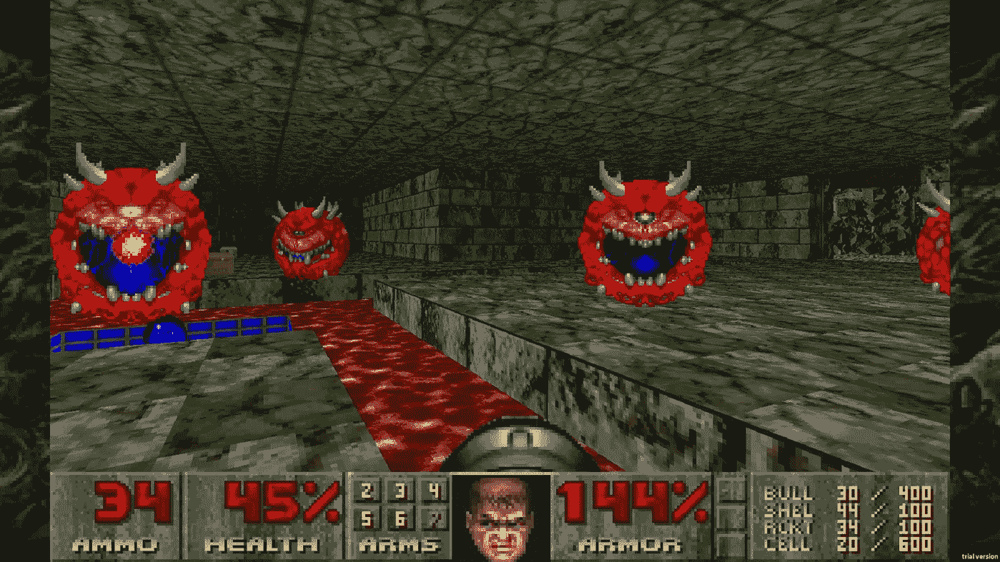

*《毁灭战士》（Doom，1993 年），一款早期的第一人称射击游戏，普及了许多今天流行的战斗设计模式*

## 战斗系统

在制作战斗游戏时，你有两种选择：

+   修改现有的战斗游戏。

+   从头开始构建自己的战斗游戏玩法。

没有好的战斗系统，你就无法制作好的战斗关卡。但开发这个核心战斗工具包需要大量的代码、艺术、动画、音频和调整。

这是一个复杂的话题，超出了关卡设计书籍的范围。询问“我如何制作好的战斗？”就像询问“我如何制作一个好的游戏？”一样，这是一个很大的问题。

正因如此，我们强烈建议进行修改：这样，你可以在不构建自己的基础上，重用游戏已经证明的核心战斗系统。

*有关推荐修改和研究的战斗游戏列表，请参阅* *工具**.*

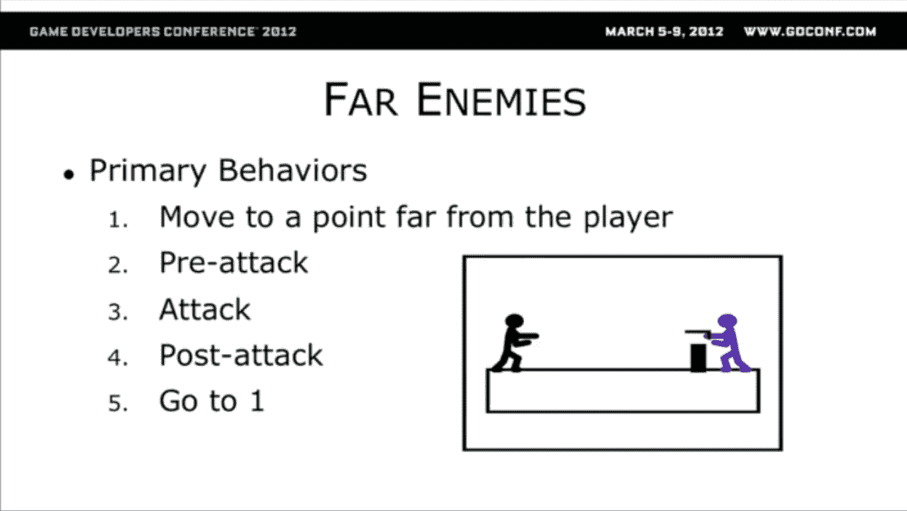

来自迈克·斯托特（Mike Stout）在 2012 年 GDC 上的演讲["探索玩具箱：对《斯派罗的冒险》设计的一瞥](https://www.gdcvault.com/play/1015838/Reaching-Into-the-Toy-Chest)的幻灯片

话虽如此，即使你修改了现有的战斗游戏，你仍然必须能够理论化它是如何工作的。所有单人游戏和多玩家战斗游戏都有某种形式的这些核心元素：

+   **战斗机制**

+   **武器设计**

+   **经济**

在一个大型商业工作室中，具有专门开发角色的环境中，**这些核心战斗元素中没有任何一个是关卡设计师的责任**。然而，关卡设计师如果不了解它们，就无法制作关卡。

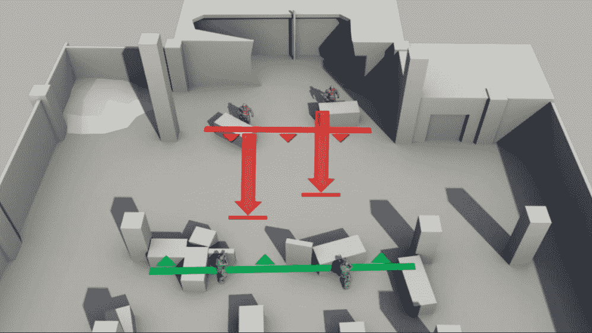

来自迈克尔·巴克莱（Michael Barclay）等人在 2016 年 GDC 上的作品["创造冲突：AAA 动作游戏的战斗设计"](https://www.gdcvault.com/play/1023791/Creating-Conflict-Combat-Design-for)的图片

### 战斗机制

**战斗机制**是玩家用来与敌人战斗的重复动作/技能/武器。一些常见的战斗机制：

+   **远离危险，控制**领土

+   **瞄准**特定敌人类型/弱点

+   **时机**攻击以获得**提示/预告**（机会）

+   将攻击链成**连招**，组合动作或武器

+   **阻挡**敌人攻击；在正确的时间**格挡**/**反击**/**躲避**

+   使用**陷阱**如爆炸桶、水、熔岩、悬崖等

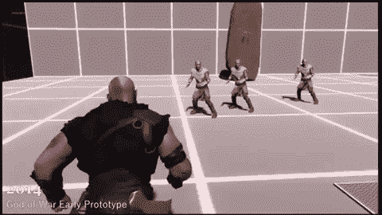

2014 年索尼圣莫尼卡为《战神》（2018）制作的早期测试地图和战斗原型的动画 GIF

### 武器设计

许多游戏为玩家提供多种武器使用。**武器设计**是关于构思、实施和平衡这个军火库。需要考虑的一些方面：

+   **武器感觉和幻想**（例如：大而慢的枪械 vs. 窃贼般的刀 vs. 响亮的电锯）

+   **统计数据**如不同的伤害、射程、射速、弹药供应

    +   对于枪械：不同的散布、后坐力、瞄准具、穿透力、弹匣大小、装填速度

+   **情境意识**以选择最合适/有效的武器

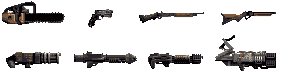

来自《毁灭战士》（1993）的武器，启发了许多后续的射击游戏：（1）电锯，（2）手枪，（3）霰弹枪，（4）超级霰弹枪，（5）链式枪，（6）火箭发射器，（7）等离子枪，（8）BFG

### 经济

**经济**是游戏设计中一个通用术语，指的是玩家在整个游戏中必须考虑的成本/收益/奖励的整体系统。玩家对资源的获取会影响他们使用的机制和武器以及何时使用：

+   **武器经济**：弹药、时间（DPS）、军火库/装备

    +   *示例：玩家只剩下一枚火箭，所以他们将其保存到与一个对火箭弱点的强大敌人战斗时*

    +   *示例：玩家在水下只有 15 秒的氧气，所以他们需要一把高 DPS 的武器来对抗水下敌人*

+   **玩家状态**：*短期经济*如生命值、库存、消耗品

    +   *示例：玩家的生命值还有 99%，所以他们不会选择增加 25%生命值的物品，因为这会“浪费”24%的拾取*

+   **玩家进步**：*长期经济*如经验值、奖励、升级、装备

    +   *示例：玩家的生命值还有 99%，但他们有一个升级，如果他们处于满血状态，则可以增加 100%的伤害，所以他们决定捡起一个+25%生命值的物品，因为伤害加成比浪费的治疗更重要*

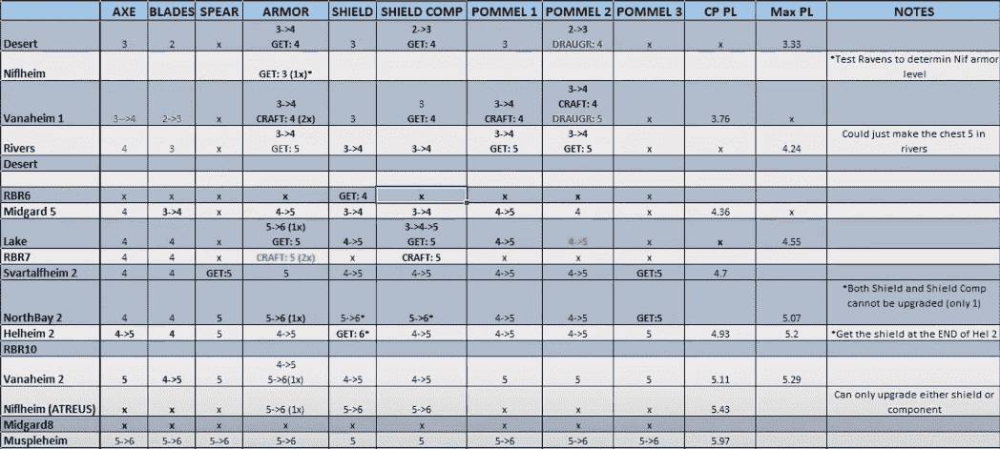

用于动作角色扮演游戏《战神：诸神黄昏》（2022）的武器进阶表格，来自 Rob Meyer 的演讲["与命运抗衡：诸神黄昏规模的战斗"（2023）](https://youtu.be/6iTBqcBv5QA?t=1311)

> *"我们试图以我们认为在纸上健康的方式模拟装备获取和进步的预期，然后我们不断进行游戏测试和迭代，以尝试使游戏测试的现实与我们的模型相匹配。[这里有一个图表（如上图所示），其中包含]计划中的功率等级进步，不同装备槽位在游戏不同阶段的水平。每一行是游戏中的不同等级，按时间顺序排列。每一列是不同的装备，这些是我们预计你在游戏中的那个阶段应该获得这些装备的水平。我们会不断交叉参考我们认为应该发生的事情与实际游戏测试中发生的事情...*
> 
> *我们使用的一个技巧是[使升级现有装备的成本高于购买新装备]，这样你就有了一个临时动力去寻找新装备 [...] 或者类似地，在我们知道从 4 级升级到 5 级所需的资源尚未可用时，奖励探索内容中的第 5 级盔甲，这样我们就能保证盔甲在短时间内会令人兴奋和吸引人。"*
> 
> -- Rob Meyer，["与盖特和解：雷加诺克规模的战斗"（2023）（YouTube）](https://www.youtube.com/watch?v=6iTBqcBv5QA&t=1311s)

## 战斗示例

在这里，我们总结了三种主要的战斗方法：

+   **经典战斗**（Doom、Quake）侧重于**移动**

    +   **灵魂类游戏**（Dark Souls、Bloodborne、Elden Ring）需要**躲避**

    +   战斗通常发生在近距离且连续进行。

+   **军事现实主义**（Counter-Strike、Call of Duty）关于**瞄准**

    +   **皇室战争**（Fortnite、PUBG、Apex Legends）增加了更多**经济元素**

    +   战斗通常是远程且不规则的。

+   **现代战斗**（Halo、Team Fortress 2、Overwatch）强调**伤害**

    +   **掩体射击**（Gears of War、Uncharted）增加了**定位**

    +   战斗通常发生在中距离且节奏感强。

注意：没有一款游戏能完美地归入一个类别。这些只是例子/只是思考这些游戏的一种方式。

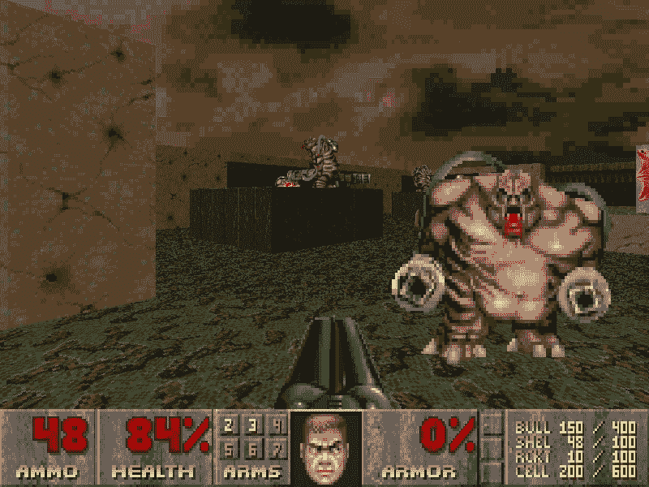

美国麦吉和桑迪·彼得森在 Doom 2 中标志性的关卡“Dead Simple”的截图。

### 经典战斗

Doom（1993）中的战斗特点是有强大的内置自动瞄准辅助。玩家甚至不能垂直向上或向下看。显然，Doom 不是关于瞄准的。相反，Doom 的高速度使得关卡可以容纳大量敌人、遭遇变化和巨大的广阔关卡布局。

> *"[玩家]以大约每小时 50 个规模英里奔跑——按照现代标准来说，这是不合理的快。大多数 Doom 的敌人没有即时命中的投射攻击，而且大多数有这种攻击的敌人都很弱——低级士兵和中士。其他所有敌人的投射攻击都需要时间才能到达目标，在一个更现实的视觉呈现中看起来会非常滑稽。*
> 
> *因此，由于在《毁灭战士》中玩家移动得很快，而且大多数敌人攻击都是可以躲避的，玩家可以通过移动来避免大量的伤害。[...] 这使得《毁灭战士》的遭遇战可以拥有大量的敌人，通过混合不同比例的威胁来变化场景，并且拥有巨大的、广阔的、通常是非线性的空间，玩家可以轻松穿越。*
> 
> *--JP LeBreton,* [*Coelacanth: Lessons from Doom*](http://vectorpoem.com/news/?p=74)

*类似《黑暗之魂》的动作 RPG 游戏通过“躲避翻滚”和“无敌帧”（I-frames）来正式化躲避机制，良好的时机可以提供完全的伤害抵消。学习如何阅读敌人的动作，并重新定位/躲避以避免伤害，通常比使用最好的武器或拥有最好的装备更重要。*

*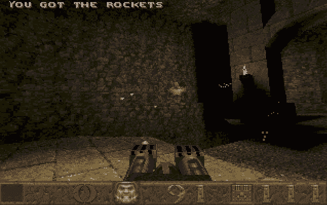

screenshot of Quake (1996) as it would've appeared back in 1996*

### ***军事现实主义*

*原始的《反恐精英》（1999）在现实军事风格中普及了基于团队的竞技多人游戏。武器极具致命性，战斗在几秒钟内结束。成功取决于快速的反应速度和在正确的时间瞄准正确的位置，同时清理射击角度和视线 -- 但闪光弹和烟雾弹可以阻止视线。不同的枪械精度、后坐力和子弹穿透机制补充了这一关注点，即观察和瞄准。*

*近年来兴起的战斗皇家游戏类型最初是作为一款名为 ARMA 的现实军事模拟射击系列的 mod，其许多方法被继承到了《PUBG: Battlegrounds》这款首个商业上成功的战斗皇家射击游戏中。即使在像《堡垒之夜》或《Apex》这样的不太军事化的战斗皇家游戏中，新手玩家突然被一百米外的狙击手击中也是常见的。然而，这一切都取决于玩家积累资源和枪械的能力，这为每一轮增加了库存管理和 RPG 式的进步元素。*

*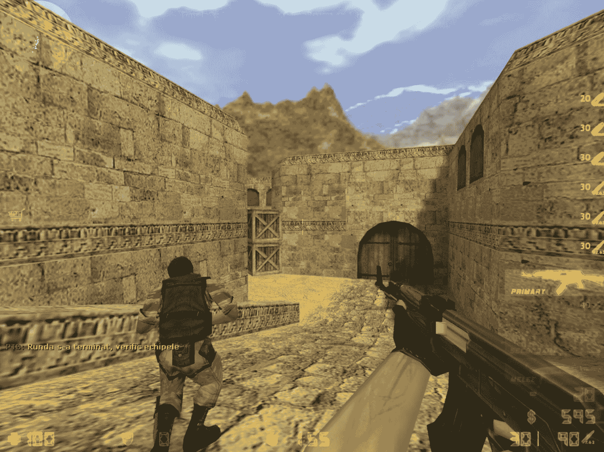

gameplay screenshot on the iconic multiplayer map de_dust2 by Dave Johnston, for Counter-Strike 1.6*

### ***现代战斗*

*在《光环：战斗进化》（2001）中，玩家的移动速度很慢，跳跃很飘，所以这里没有太多的躲避。但也没有太多的瞄准；默认手枪是游戏中臭名昭著的最好武器之一，允许玩家以微妙的自动瞄准“磁性”进行便宜频繁的中远程/长程头部射击，非常适合休闲主机游戏。除了移动或瞄准，光环是关于管理伤害：*

> **"在几乎每一款现代 FPS 游戏中，玩家的移动速度相当慢，大量敌人配备了即时命中攻击——手枪、机关枪、狙击步枪。这通常将玩家置于“伤害海绵”的角色——他们被设计成吸收一定量的伤害，主要来自无法避免的敌人攻击，然后寻找掩体并恢复健康。光环的充电护盾使这一机制非常明确——默认情况下，你会受到伤害并死亡，而寻找掩体则停止这种伤害并完成任何战斗的基本周期。"**
> 
> *-- JP LeBreton, [Coelacanth: Lessons From Doom](http://vectorpoem.com/news/?p=74)*

*多玩家团队射击游戏如《反恐精英 2》强烈强调治疗，以至于每个团队都需要一个治疗者。守望先锋建立在《光环》的再生护盾机制之上。像《战争机器》或《未知的边境》这样的掩体射击游戏具有再生健康，但将这种节奏与躲在物体后面联系起来。现代战斗是关于被射击，交替着风险和休息的时期。*

*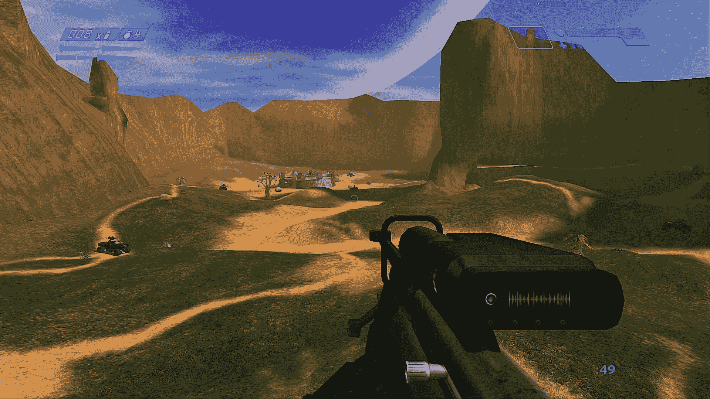

来自 Bungie 的《光环：战斗进化》中深受喜爱的多人地图 Blood Gulch 的游戏截图

## *TODO: 如何构建战斗*

+   *封锁一个测试竞技场*

    +   *开放区域和/或 3 车道*

+   *放置一些敌人*

+   *测试并重复*

+   *如何知道战斗是否“足够好”？*

## *战斗关卡的关键概念*

*一旦你建立了核心战斗系统，无论是通过玩你正在修改的游戏，还是从头开始构建自己的战斗，那么你就可以开始设计更具体的战斗场景了：*

+   *****敌人设计** **是定义不同敌对 NPC 类型的过程。*****

    +   ***理想情况下，每种类型都有独特的行为、优势和劣势。***

    +   ***没有多样化的敌人名单，战斗会感觉重复。***

+   *******遭遇战** **是对 NPC 的结构化战斗。*******

    +   *****开放式的战斗谜题；玩家通常需要即兴发挥解决方案*****

    +   *****实现通常涉及一些脚本。*****

+   *******掩体** **是关于构建战斗空间。*******

    +   *****哪里是安全的，哪里是高风险？玩家可以在哪里战斗或恢复？*****

    +   *****掩体根据机制/武器而变化。你需要先有核心战斗设计。*****

+   *********地图平衡** **是玩家选项的公平性，通常在 PvP 中。*********

    +   *****玩家可以去哪里，他们可以控制哪些领土？玩家将如何知道？*****

    +   *****平衡的关卡有助于玩家信任布局并投资于结果。*****

*****我们建议按照上述顺序来处理战斗。每个方面都依赖于前一个方面。要构建遭遇战，你需要先有敌人设计。要协调掩体，你需要对遭遇战应该如何进行有一个想法。要平衡地图，你需要知道哪些掩体模式是有意义的。*****

*****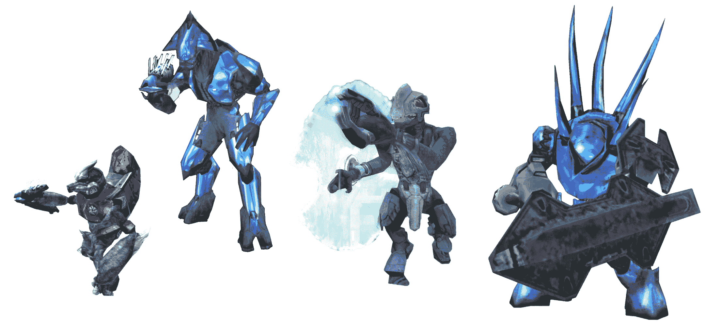

来自《光环》（2001 年），一款早期主机 FPS 游戏，它普及了动态小队战斗和车辆*****

## *****回顾...*****

+   *******战斗设计**是关于设计物理冲突的系统。*****

+   *****要制作战斗等级，你首先需要一个战斗游戏。但制作一个完整的游戏很困难，而这本书只是关于关卡设计的。修改游戏更容易。*****

+   *****常见的战斗系统包括：*****

    +   *******战斗机制**如瞄准、躲避、时机等*****

    +   *******武器设计**，一套多样化的有趣工具*****

    +   *******经济**，武器、库存和进度的成本/收益系统*****

+   *****一些战斗示例：*****

    +   *******经典战斗**与**灵魂类似**游戏强调速度和躲避火焰*****

    +   *******军事现实主义**与**大逃杀**使枪械和瞄准变得更重要*****

    +   *******现代战斗**与**掩体射击**是关于管理健康/伤害*****

+   *****要构建一个战斗游戏，(待办)*****

## *****现在怎么办？*****

+   *****阅读更多关于战斗关卡设计的关键设计概念：*****

    +   *****敌人设计*****

    +   *****遭遇设计*****

    +   *****封面*****

    +   *****地图平衡*****

+   *****继续到布局阶段。*****

### ***************进一步阅读关于战斗设计*****

+   *****["与命运抗衡：雷加洛克的规模战斗"（2023 年）（via YouTube）](https://www.youtube.com/watch?v=6iTBqcBv5QA)是 Rob Meyer 关于现代 AAA 战斗设计的最全面讨论，他是《战神：雷加洛克》（2022 年）的首席战斗设计师。Meyer 分享了他工作中的具体例子，并详细介绍了在索尼圣莫尼卡担任战斗设计师的责任。*****
