# 🛠️布局

> 原文：[`book.leveldesignbook.com/process/layout`](https://book.leveldesignbook.com/process/layout)

## 为什么要设计布局？

**布局** 在关卡设计中有两个类似的意义：

1.  **关卡的整体结构**；*"布局如此混乱，我不知道该去哪里"*

1.  **概述图用于规划**，有时被称为“俯视图”，因为它是从俯视角度绘制的；*"你完成布局图了吗？我们很快就要 blockout 了"*

布局图可以是简单的或复杂的，象征性的或具象的，抽象的或具体的。它可以是一个纸巾上的涂鸦，也可以是一个详细的平面图，这完全取决于！

**“好的布局图”是任何能够有效传达核心设计的图像。**

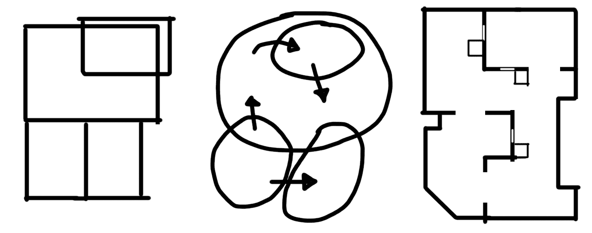

哪种布局草图风格对你最有效？你必须做出决定

但请记住：*计划并非魔法。* **布局图不能告诉你你的关卡是否有效**，只有 blockout 和 playtest 才能开始回答这个问题。**布局不是关卡**，玩家永远不会玩你的图纸。

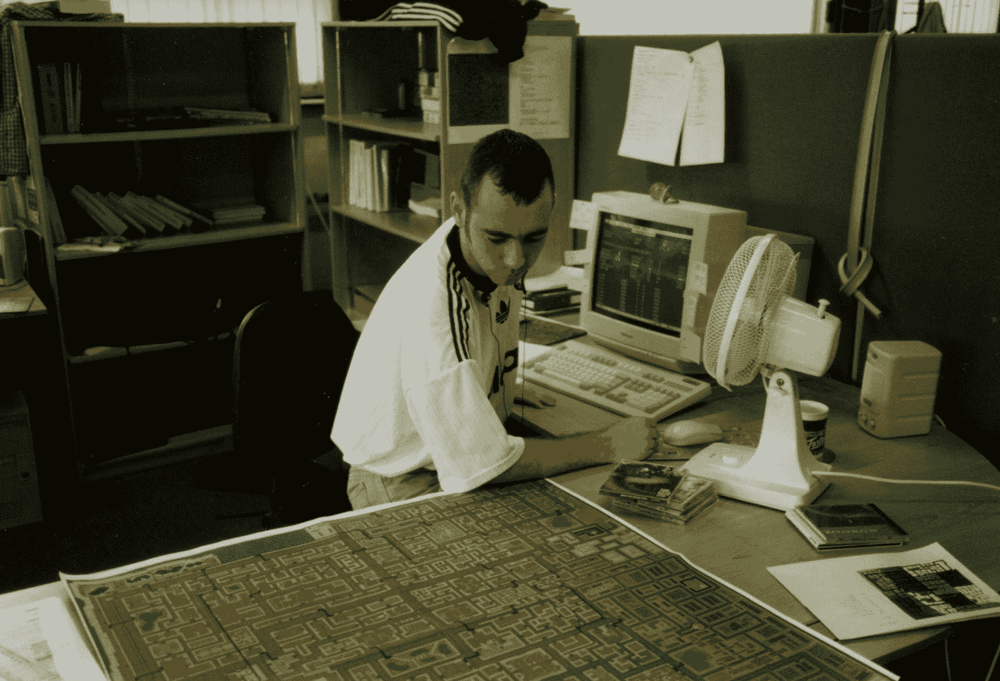

一位开发者正在咨询 Grand Theft Auto 1 (1996) 由 DMA Design 设计的世界地图布局，照片来自 Steve Hammond [(via Twitter)](https://twitter.com/snap2grid/status/1597157105726853121)

## 布局概念

设计布局时，利用以下设计概念：

+   **Flow** **是移动关卡的感觉。**

    +   玩家移动得快还是慢，流畅还是突然？

    +   所需的流动取决于 体验目标。突然的流动并不坏。

    +   ****Critical path** 是完成关卡的理想路径。**

    +   ******Circulation** 是现实世界建筑师思考流动的方式。****

    +   ********Verticality** 是关于支持垂直流动。******

+   ********Parti** **是布局的核心结构/主要思想。********

    +   ****将整个布局联系在一起的整体概念是什么？****

    +   ****清晰的 parti 有助于你专注于设计最重要的部分。****

+   ********Typology** **是关于常见的布局模式和功能。********

    +   ****简化你对布局的思考方式****

    +   ****共享设计词汇有助于你研究其他关卡并沟通。****

****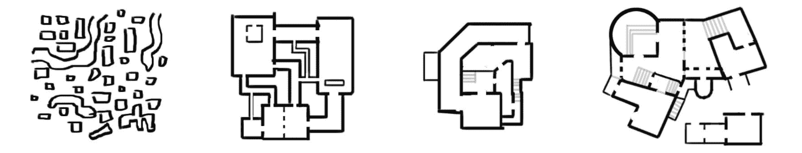****

## ****如何设计布局****

****设计布局没有唯一最佳的方法。每个人（和项目）都可以以不同的方式设计布局。但如果你感到迷茫，尝试做所有的事情：****

1.  ******Pre-production**: 定义设计目标****

1.  ******Parti 缩略图**：头脑风暴核心形状****

1.  ******气泡图**: 可视化区域之间的大小/流动****

1.  ******楼层平面图**: 更详细地绘制特定房间的形状****

1.  ******游戏玩法标记**: 添加标签和设计备注****

****对于小型单人即兴项目，你可以喜欢（或不喜欢）做多少（或多少）布局规划。****

****对于大型团队项目，尝试在共享的白板上一起完成所有这些步骤。****

****

从“建筑图形”中弗朗西斯·金（Francis Ching）的抽象网格（左）到楼层平面图（右）的迭代绘图****

### ************1. 制作前阶段计划****

****没有目的设计某物是困难的。在**制作前阶段**中，我们试图在尝试制作之前定义和规划我们想要制作的内容。****

****因此，在绘制布局之前，至少定义一个玩家的**体验目标**。在这个关卡中，玩家应该学习什么，感受什么，或做什么？****

****你可以写具体的体验目标*（“教玩家如何在科幻下水道中双跳 5 分钟”）*或者更抽象*（“与自然融为一体”）。但越具体越容易设计。****

****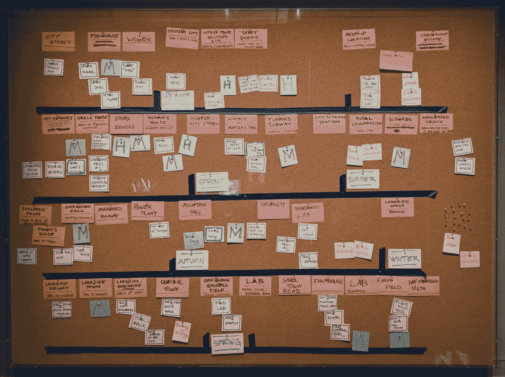

由 Naughty Dog 制作的《最后一人》（2012 年）的节奏板；来自伦敦维多利亚和阿尔伯特博物馆的“电子游戏”展览****

****一旦你有一些目标，你就可以规划**节奏**，即特定事件和活动的顺序，这将有助于实现体验目标。****

****例如，如果你的体验目标是“逃离可怕的怪物”，那么你需要将这个体验分解成更小的具体**节奏**--比如*“(1)听到门后婴儿哭泣，(2)揭示僵尸熊制造婴儿哭泣的声音，(3)跳出窗户逃离怪物。”*（这个简单的计划已经很有帮助了，现在我们知道我们需要一扇门、一扇窗户、一只熊...）****

*****关于规划体验目标，请参阅*制作前阶段*。*****

*****关于规划活动和节奏的更多信息，请参阅*节奏*。*****

### ************2. 设计草图缩略图****

****在建筑中，**设计**是整个建筑的基本形状/想法。****

****a. 绘制一个*小简单的图表*（**缩略图**） b. 用短语标注它****

****哪种基本形状适合你的体验目标/节奏计划？****

****设计可以象征性的（“颠倒的船”）或抽象的（“减去的盒子”）或可以关注人们如何使用建筑（“核心区分公共和私人”）或与周围环境的关联（“手指戳进树林中”）。****

****或者，你只需**感受**一些形状，稍后再整理。重点是开始无压力地视觉思考。如果你不喜欢某个设计，没问题，你可以简单地再画一个。****

****

parti diagrams from "101 Things I Learned in Architecture School" by Matthew Frederic****

#### **************分区缩略图的建议******

+   ******至少绘制 5-10 个缩略图**以生成多种方法。如果你绘制了 100 个分区图，那么其中至少有一个是好的，因为不可能设计出 100 个糟糕的建筑。你画得越多，对你越有利。****

+   ******不要在每个图上花费太多时间。**有时候你只需要 30 秒来画几条线，这已经足够表达核心思想了。****

+   ******如果你不能命名它，那么可能它还不够成熟**。尝试以不同的方式再次绘制它，或者尝试将纸张旋转 180 度，从另一个角度想象它。****

### ************3. 气泡图****

****将最有希望的分区图扩展为**气泡图**：一组不同的椭圆形，每个椭圆形代表不同的房间。****

****a. 为分区的每个部分绘制一个**气泡** b. 标记每个气泡 c. 绘制箭头以强调某些连接或方向****

****气泡图的目标是在你的层面上建立**比例**和**关系**。什么需要大？什么需要相互连接？****

****暂时不要担心细节。这是关于你空间逻辑的问题。****

****看看下面的示例气泡图。哪些空间连接到客厅？为什么？浴室为什么在那里？卧室在哪里？如果有人不能使用楼梯，他们将如何在这个房子里生活？****

****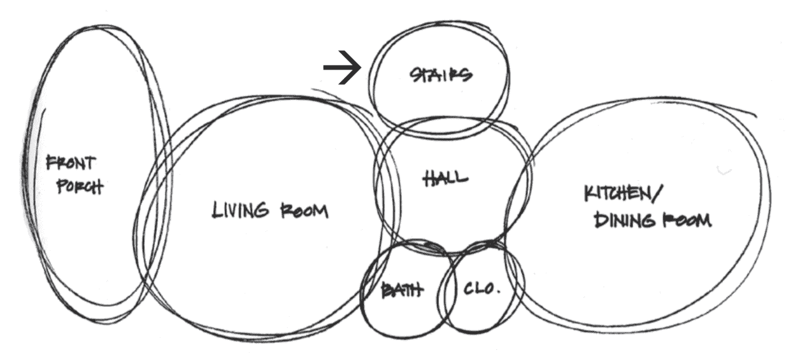

example bubble diagram of F10 House in Chicago, from The Architecture Handbook: A Student Guide to Understanding Buildings by Masengarb et al.****

#### ************气泡图的建议****

****你的前几个气泡图可能会有问题并提出新的问题。有些气泡可能太大或太小，或者它们可能触碰到错误的气泡。也许你忘记添加某些气泡？或者气泡可能太多。****

+   ******一个糟糕的气泡图是好的。**这意味着你早期就发现了设计问题，你可以再画一个来尝试另一种布局。****

+   ******至少绘制 3 个气泡图**以想象多种布局和尺寸。****

+   ******你可以偏离分区图。**分区图的目的帮助你开始绘制气泡图。如果它不再帮助你，那么就别用它了。****

### ************4. 平面图****

****在建筑学中，自上而下的布局图被称为**平面图**。****

a. 想象一个**平面切割**，即通过建筑的想象水平切割

**在下面的图中，注意 Ching 如何使用各种线型、线粗、阴影和色调图案来区分楼层平面图的各个部分。Ching 使墙壁加粗并变暗，但使用较细的线条来标记楼梯或表示房屋的特定区域，以及使用较淡的线条表示旋转门的弧线**。

**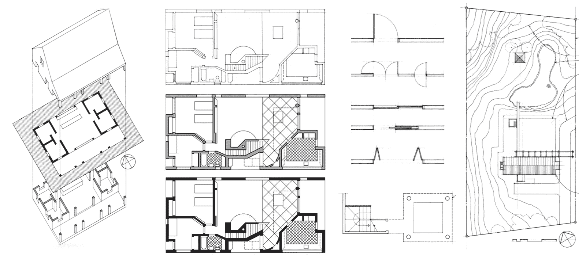

来自 Francis D. K. Ching 所著《建筑图形》（第 6 版）的多种楼层平面图绘制技巧**

#### ****  **绘制楼层平面图的建议**

+   **开始大**。使用整个页面。从大主形状开始，逐渐细化到门和窗户等较小特征。不要绘制 100%的细节。

+   **保持矩形**。矩形比奇角或曲线墙壁更容易建造。~90%以上的角落应该是 90 度，并且与网格对齐。

+   **使用 2+线条粗细**。对不同类型的墙壁使用不同的线粗。

+   **笔比刀更锋利**。对于快速布局，使用钢笔或铅笔。

+   **我们不是建筑师**。绘制想象玩家体验所需的最少内容。

### **** 5. 游戏玩法标记

**标记**和**标注**布局图的**重要部分**。

+   ****流程****。**对于单人关卡，绘制或标注**关键路径**。对于多人地图，轻轻着色或突出团队出生区域和主要**流通**区域。

+   **区域**。标注主要区域和地标。对于竞技型多人地图，开始考虑可能的**[呼叫](https://steamcommunity.com/sharedfiles/filedetails/?id=157442340)**。

+   **游戏对象**。标注对理解玩家体验至关重要的**重要目标、NPC、物品、陷阱等**。但不要让图中充斥太多内容。

**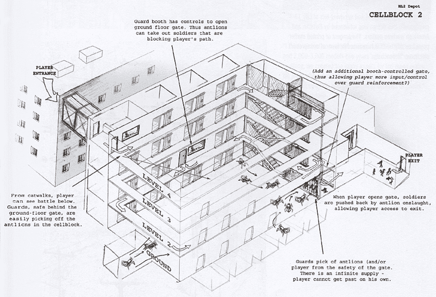

**注意**：在 Eric Kirchmer 为《半条命 2》中的“Nova Prospekt”制作的等距布局图中，有大量的游戏玩法标记，来自艺术书籍《半条命 2：提升标准** ****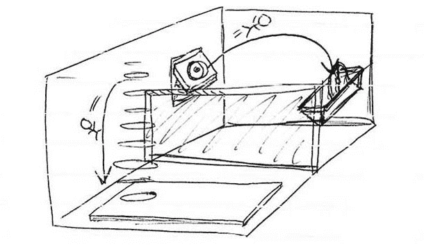

**注意**：在《传送门 2》中的这个谜题的等距布局图中，玩家流动箭头来自《游戏情报》2010 年 3 月** ****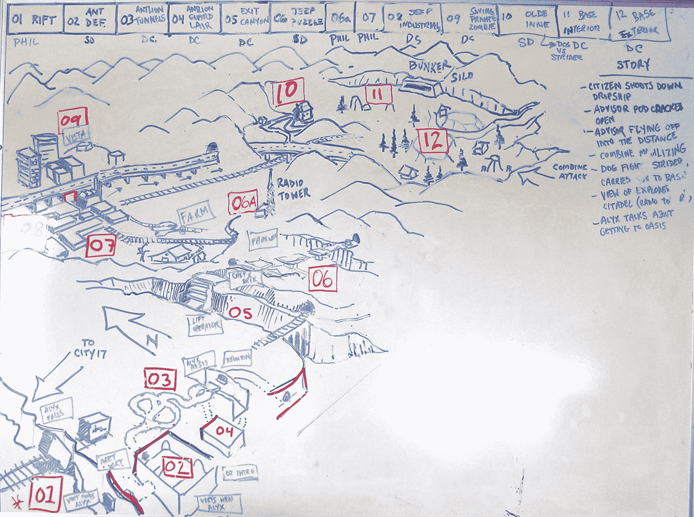

实际的 Valve 白板，带有等距布局图和节奏轮廓，用于规划《半条命 2：第二章》... 然而，请注意，这张图与最终游戏略有不同；照片由 Phil Co 拍摄 ([via Interlopers.net](https://www.interlopers.net/articles/phil-co-interview))****

## ****示例布局图****

### ************"Nova Prospekt" for Half-Life 2 (Valve), by Eric Kirchmer and David Sawyer****

****在单人 FPS 游戏《半条命 2》（2004 年）大约 2/3 处，玩家必须穿过一个名为 Nova Prospekt 的废墟监狱。这是一个充满许多多层近距离战斗遭遇战的长章节，对抗快速移动的小队敌人，旨在充分利用玩家的“诱饵”武器，该武器可以指挥飞行的“蚂蚁狮”怪物攻击敌军士兵。****

+   ****研究: 受加利福尼亚州旧金山的阿尔卡特拉斯州立监狱的强烈启发****

+   ****类型学: 地面层竞技场两侧有狭窄的通道和牢房，通常设有栅栏****

+   ****遭遇战: 按块、按房间设计，每个部分都提供了一个中心概念，在整个章节中为蚂蚁狮与联合体遭遇空间增添了新的转折****

****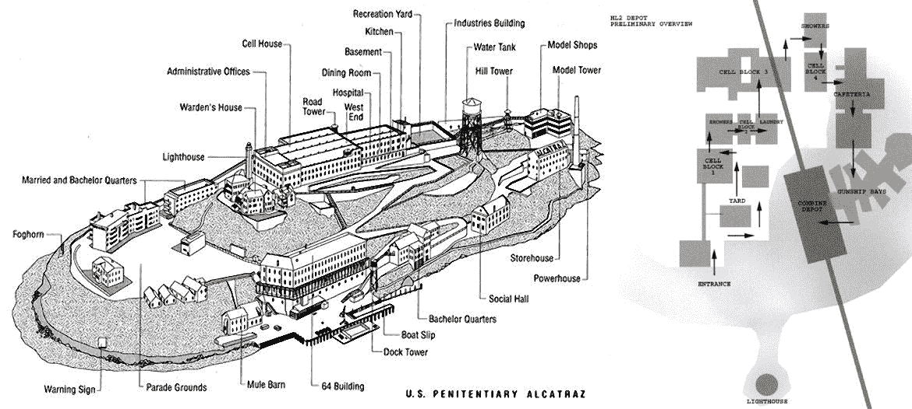

来自艺术书籍《半条命 2：提高标准》的阿尔卡特拉斯地图（左）和 Nova Prospekt 牢房区域气泡图（右）****

****注意 Nova Prospekt 计划（上图右）是一个相对简单的布局图，标出了区域和玩家可能如何通过它们。它省略了每个建筑内部的个别房间和走廊。这是一组关卡的设计图，而不仅仅是单个关卡。它基本上是一个气泡图，专注于每个区域的足迹及其连通性。****

****对于单个牢房区域和遭遇战，Valve 概念艺术家 Eric Kirchmer 将关卡设计和游戏玩法标记直接融入概念艺术草图，这些草图可能是协作小组白板设计会议的结果。这些战斗遭遇战具有预期的流程和理想化的关键路径“解决方案”，将每场战斗都视为一个需要解决的谜题。这些草图为关卡设计师 David Sawyer 提供了宝贵的设计文档，用于布局和原型设计。****

****在所有等距布局图中，请注意大量的游戏玩法标记：玩家起始位置、关键路径箭头和大量使用文本标签来帮助我们想象玩家体验。****

****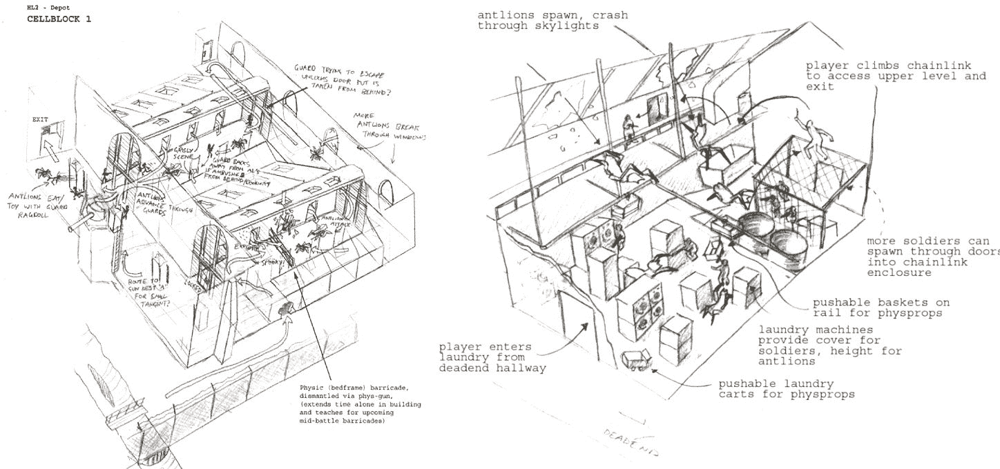

来自艺术书籍《半条命 2：提高标准》的 Nova Prospekt 遭遇战的等距布局图****

### ************"Untitled" for Quake 1, by Andrew Yoder****

**对于他的单人 Quake 关卡，设计师 Andrew Yoder 对一个涉及房间中间悬挂笼子的场景进行了迭代。在这里，Yoder 在布局和 blockout 之间流畅地切换，有时会丢弃整个房间，并使用布局草图重新审视设计。以下是他的[一些笔记](https://twitter.com/Mclogenog/status/1248992822725926912)**：

**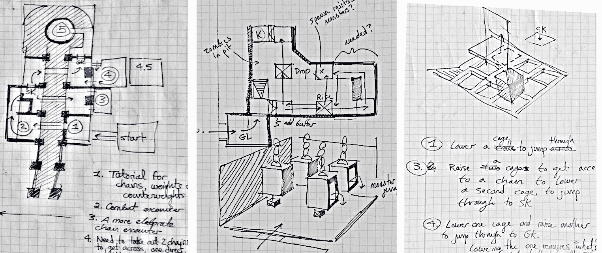

拥有透视视图的水平布局草图（纸上墨迹），由 Andrew Yoder 提供****

> **“我的过程是关于迭代，有时这意味着回到规划阶段。[...]有时我花一个小时在一个区域迭代，然后它就*成功了*。其他时候，我花同样的一个小时，嗯，也许最好把它放一边，试试别的。[...]我如何判断？有过去构建类似关卡的经验带来的直觉。还有一些启发式和模式可以对照检查。玩家是否知道目标？他们能否预测解决方案并为此做准备？”**

**注意编号、充分使用注释、标注草图的不同部分，以及偶尔使用透视缩略图来澄清整体结构**。透视缩略图在涉及高度变化的水平布局中特别有用，因为这些高度变化从俯视角度很难绘制。

**多样的草图和丰富的标注帮助 Yoder 传达其设计意图。布局过程帮助 Yoder 用语言表达和阐述设计问题**。

**

Quake 1 中产生的悬挂笼子区域 blockout 的截图，由 Andrew Yoder 提供****

### *****"Automata - TV Station" for Watch Dogs 2 (Ubisoft)，由 Iuliu-Cosmin Oniscu 设计****

**对于开放世界黑客游戏《Watch Dogs 2》，设计师 Iuliu-Cosmin Oniscu 构建了一个包含多个目标、入口和关键路径的任务**。

**在他的帖子["Watch Dogs 2 — Automata - 一个关卡设计回顾"](https://medium.com/@iuliu.cosmin.oniscu/watch-dogs-2-automata-a-level-design-retrospective-dcb82040e454)中，他包括了带有大量游戏标注和最少架构的布局图**：

**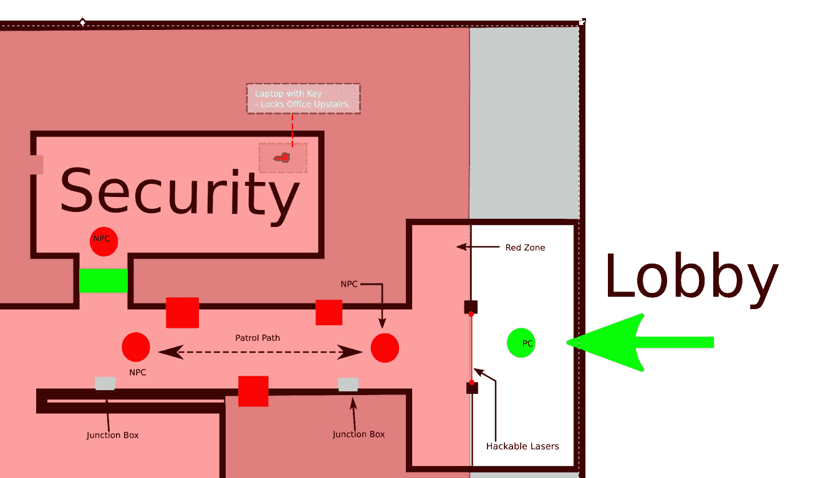

由设计师 Iuliu-Cosmin Oniscu 绘制的“Automata”中 WKZ 站的布局，如上图所示****

**设计师的一些笔记和意图：**

> **在这个特定场景中，技巧是玩家可以通过激光并触发警报，但他也可以：**
> 
> +   **当守卫在远离激光巡逻时禁用激光，然后进入红色区域并悄悄地消灭 AI。**
> +   
> +   *****使用墙壁上的摄像头通过移动到摄像头角度到摄像头角度来侦察地点。在游戏中的这个阶段，这是一种已经确立的侦察室内地点的方法。*****
> +   
> +   *****使用无人机探索走廊并使警卫失去行动能力。*****
> +   
> *****走廊尽头也有一堆战略性地放置的接线盒，可以黑客攻击以同时使两名警卫失去行动能力。*****

****注意关卡设计师的草图（上图所示）比实际游戏实现（下图所示）要简单得多。建筑细节、家具，甚至一些游戏元素，如中立 NPC 和墙上的摄像头，在布局图中都没有表示。这些都无关紧要，因为它们与规划绕过安全系统、击倒警卫 NPC 的核心体验目标无关。****

****这里的教训是：**不要在布局图中添加不必要的设计功能。******

****

“自动人形”中完成后的 WKZ 车站大堂的玩家视角，来自 Iuliu-Cosmin Oniscu****

### ************"战道"（《反恐精英经典》Valve），由罗宾·沃克等人创作****

****在基于阶级的多玩家射击游戏《反恐精英经典》（1999）中，“战道”是由 Valve 的罗宾·沃克及其团队协作设计的控制点（CP）地图。TFC 的 CP 游戏模式与现代《反恐精英 2》或《守望先锋》中的 CP 模式相似，其中两个队伍竞争以占领中央通道上的所有控制点。****

+   ****流程：一条中央通道和侧通道，总共 5 个控制点，带有动态出生房间****

+   ****平衡：对称地图，所有 9 个阶级都必须可行，攻击/防御在每个 CP 都可行****

+   ****类型学：带珠子的项链，一条长卷走廊，每个 CP 都点缀着竞技场****

****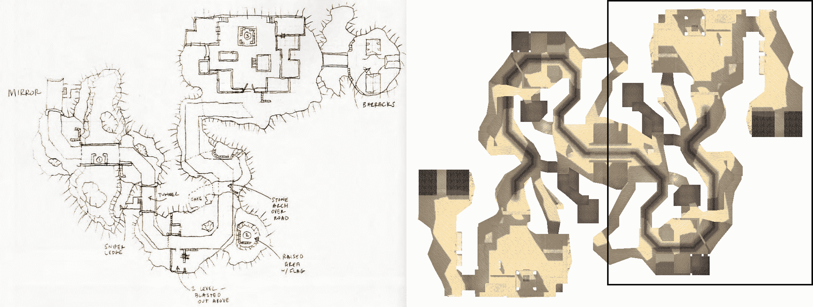

比较原始计划和最终关卡布局；来自《反恐精英经典》的“战道”地图的图片****

****在《半条命 2》的艺术手册《提升标准》中，沃克详细介绍了他们的流程以及绘制布局如何影响他们的协作多人关卡设计工作流程：****

> *****"在初步设计讨论之后，设计组绘制了地图草图，然后由关卡设计师构建。一旦初步版本完成，就开始了常规的测试。在整个测试周期中，进行了许多修改，* ***通常会导致对地图原始计划的重大改变。*** *[...] [战道]是第一个根据控制区域的不同，让队伍在不同位置复活的第一张《反恐精英》地图，这导致了一个漫长的测试周期，复活点被移动了多次。"* -- 罗宾·沃克，来自《半条命 2：提高标准》，第 48 页（强调为原文所有）****

****在上面的图中，注意编号的控制点和标注。每个控制点区域就像一个迷你竞技场/部分，有特定的地标标签：狙击台、隧道、石拱、兵营等。**从一开始就命名和主题地图区域。**标签还突出了对地图体验目标至关重要的最重要的部分。****

****此外，请注意这幅图只显示了地图的一半，其中镜像对称性在中央桥梁处分开。因为他们已经决定地图布局将是对称的，绘制整个地图是不必要的。**因此，设计限制会影响你绘制布局的方式。******

****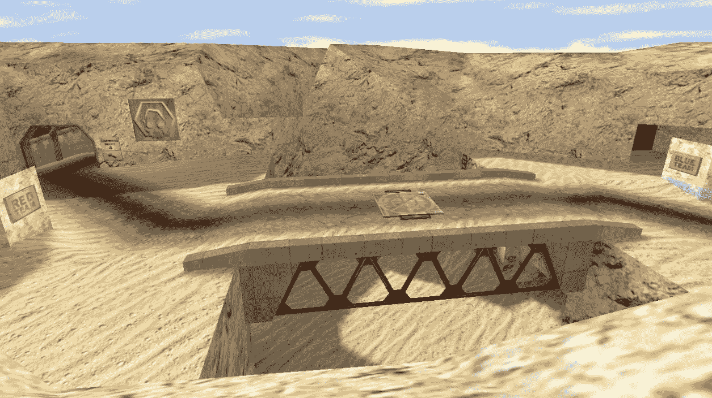

the central bridge arena, facing south from the Blue team's sniper ledge; "Warpath" from Team Fortress Classic****

## ****反对布局？****

****虽然布局对于关卡设计似乎至关重要，但许多关卡设计师并不绘制布局，通常直接从预生产跳到块状设计。一些反对制作布局图的论点：****

+   ****你不能测试布局图。****

+   ****图纸是视觉文档，很快就会过时和过时。****

+   ****现实世界的建筑师进行布局是因为他们必须这样做；我们不应该盲目地效仿他们。****

+   ****3D 游戏动作更依赖于直觉而不是计算。****

****对于有影响力的 3D 平台游戏《超级马里奥 64》（1996 年），宫本茂的团队只制作了最少量的概念艺术/布局草图来规划主要节奏点：****

> #### *************... 当你创建关卡地图时，你是否事先绘制了模型/蓝图？*****
> #### 
> *******宫本茂：*** *实际上，不是的，一点也不。只有一些概念艺术草图和一些简短的笔记/备忘录。例如，我会和课程总监山田洋一讨论关卡的想法，然后他会快速地画一些草图。山田洋一不是艺术家，但他画的东西很奇怪。（笑）然后我们会看看那些草图，再讨论一下（“哦，这里应该有一个雪人！”），然后那些关卡的关键元素就会被记录下来。山田洋一和其他关卡设计师在设计关卡时，会参考这些笔记，并使用我们的软件开发工具。*****
> 
> ****-- 来自《超级马里奥 64 策略指南》的访谈（via [shmuplations.com](https://shmuplations.com/mario64/))****

****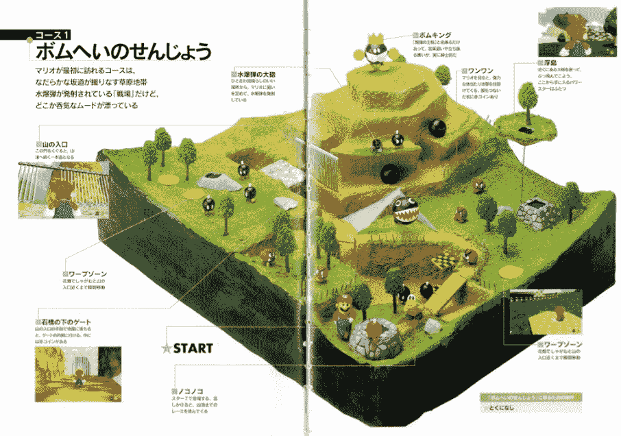

杂志版面的扫描，展示了一个超级马里奥 64 的["炸弹战场"](https://www.mariowiki.com/Bob-omb_Battlefield)关卡的粘土场景；它感觉是预先计划的吗？因为它不是！...来自《超级马里奥 64 完全攻略指南》一书（via [shmuplations.com](https://shmuplations.com/mario64/))****

#### ************反对布局？****

****你也可以争论宫本的方法对其他类型、情况或团队不太适用。他们是一群经验丰富的专业开发者，当然他们可以即兴创作小型低多边形单人关卡而不需要计划。****

## ****要复习...****

******布局图**（或“布局”）是关卡结构和关键节奏点的初始视觉计划。你应该预期你的最终关卡会有很大的不同。****

1.  ****从基本的**前期制作计划**开始，定义期望的体验目标和节奏。****

1.  ****绘制并标注**部分****，核心形状的简单缩略图。****

1.  ****使用**气泡图**来安排空间，这些草图强调整体比例和关系。****

1.  ****绘制**平面图**，一个从上到下的带有墙壁和地板的图。******

    +   ****从大而简单的形状开始，省略细节。使用多种线宽并着色地板区域。****

    +   ****对于有多层楼的房间，绘制一个等距视图，注意地板平面。****

    +   ****对于重要或复杂的场景房间，也许可以画一个透视图并标注它。****

1.  ******用玩家流动和游戏玩法笔记**标记计划，帮助其他人想象体验，尤其是如果你与他人合作。****

    +   ****命名并标注区域。将每个关卡部分视为一个独立的“部分”。****

****尽管如此，**许多关卡设计师不制作布局图**。试试看，如果它有助于你思考，或者有助于你的团队沟通，就继续这样做。然而，不要感到有义务。****

## ****接下来是什么？****

+   ****了解更多关于重要的**布局设计概念**。****

+   ****继续到**块状阶段**。****

### ************关于布局的进一步阅读****

+   ****[3kliksphilip - "Warowl and FMPone - Mapping for Fun"](https://www.youtube.com/watch?v=5hq4QSttI2k)****
