# 🏠Blockout

> 原文：[`book.leveldesignbook.com/process/blockout`](https://book.leveldesignbook.com/process/blockout)

## 为什么要构建 Blockout？

**Blockout**（也称为**blockmesh**或**graybox**）是用简单的 3D 形状构建的 3D 粗略草图关卡，但没有任何细节或精炼的艺术资产。

目标是原型设计、测试和调整关卡的基础形状。

在下面的图片中，注意 Blockout 版本和最终发行版本之间的差异。一个形状可能最初是一个灰色方块——然后经过数月的测试和艺术作品通过，这个方块变成了一个桶堆...或者可能完全被删除。

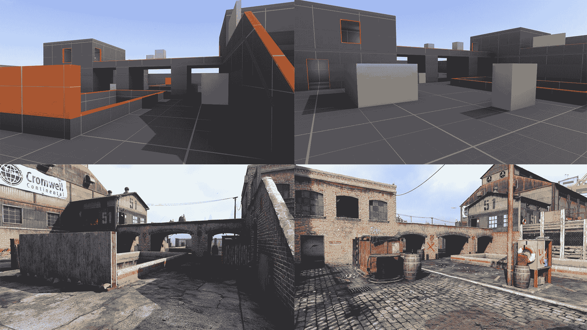

Call of Duty: Modern Warfare (2019)中“Docks”的 Blockout 与最终艺术作品对比 [由 Brian Baker 提供](https://twitter.com/JrBakerChee/status/1182384066881916928 )

**Blockouts** 支持实验。

删除或重建一些粗糙的 Blockout 几何形状是“便宜”的，但丢弃最终完成的艺术作品是“昂贵”且浪费的。

当你对关卡结构没有信心时，最好保持它“便宜”，直到它准备好变成“昂贵”。

你不能测试设计文档或布局草图，**但你可以在 Blockout 上进行测试，并评估其流程、平衡、遭遇设计和指标**。这是设计阶段，你最终开始发现这些想法是否可行。Blockout 只是开始。

> *“如果我们考虑到[霓虹白]发行时超过 100 个关卡，团队制作了“双倍”数量的废弃关卡，而[关卡]Smackdown 本身就有超过 50 次修改，整个游戏中有数千次的调整和重新设计。[...] 三年后，Smackdown 完成了。”*
> 
> *-- 来自 *[*How A Neon White Level Is Made*](https://www.gameinformer.com/feature/2022/11/25/how-a-neon-white-level-is-made) *by Blake Hester, Game Informer #350*

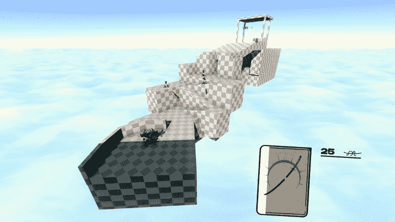

Neon White (2022)中 Ben Esposito、Russell Honor 和 Carter Piccollo 的早期“Smackdown”草图 [(via Game Informer)](https://www.gameinformer.com/feature/2022/11/25/how-a-neon-white-level-is-made)

## 关键概念

在进行 Blockout 时，考虑以下方面：

+   **积聚**是形状传达的体积和重量的总体感觉。

    +   *这个结构是厚重/沉重，还是轻薄/轻巧？这是一个什么样的地方？*

    +   景观需要特别考虑。

    +   构图在今天的关卡设计文化中被过分强调。

+   **指标**是关卡的一般规模、尺寸和比例。

    +   *这个区域太大或太小了吗？玩家能进入这个房间吗？*

    +   有用的测量示例：Doom 度量，Quake 度量

+   **寻路** 是玩家学习地图结构的导航过程。

    +   *如何帮助玩家找到* *关键路径* */关卡出口？玩家是否感到过于迷茫？*

+   **测试游戏** 是当你运行一个实验来查看关卡是否达到其设计目标时。

    +   *大多数玩家能完成关卡吗？* *遭遇战* *是否有效？是否* *平衡**？*

    +   测试游戏非常重要。这就是制作遮挡的原意所在。

示例遮挡视频 - ["Uncharted: The Lost Legacy - Train Level Early Prototype"](https://www.youtube.com/watch?v=5Cv30vCgPso) by Matthew Gallant

## 构建方法

游戏中有五种常见的 3D 关卡构建方法：

+   **原语:** 安排像立方体和盒子这样的简单基本形状。

+   **刷子/建模:** 在关卡编辑器中构建 3D 形状。

+   **模块化套件:** 将预制件连接在一起，就像乐高积木一样。

+   **雕刻:** “绘制”有机 3D 形状，适用于景观。

+   **样条曲线:** 创建通过程序生成几何形状的数学曲线

### 原语

**原语** 是简单的 3D 形状，如游戏编辑器中内置的默认灰色立方体和盒子。

移动/旋转/缩放形状。将它们排列在一起，堆叠在彼此之上，制作更复杂的形状组合。

这是一个出人意料强大的遮挡方法。你可以在任何 3D 引擎或工具中使用这种方法，但如果你要遮挡任何超出简单箱形建筑的物体，你会遇到限制。

使用原语进行遮挡的建议...

注意**度量****，**建立比例尺度是棘手的。

要制作**斜坡**：制作一个长而窄的立方体，然后旋转使其向下倾斜。要制作**楼梯**：避免痛苦，直接制作斜坡即可

要制作**门廊**：在两面墙之间留出间隙，没有门框。要制作**窗户**：制作类似门廊的间隙，然后用矮墙填充
 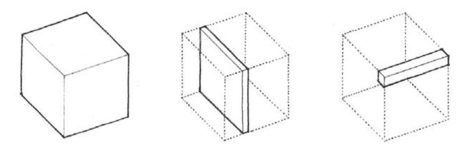

弗朗西斯·金（Francis Ching）的尺寸质量图，来自《建筑：形式、空间与秩序》

### 刷子/建模

**刷子**是在关卡编辑器中建模的简单低多边形 3D 形状。

这是从 20 世纪 90 年代到 2000 年代整个行业的主要级别构建方法。

我们强烈推荐这种方法，因为它提供了最大的控制和手工感，但遗憾的是，大多数现代游戏引擎通常具有较差的刷子建模工具。在这里确定工作流程可能会很棘手。

使用刷子/低多边形进行阻拦的建议...

使用强调低多边形几何形状的**3D 建模工具**。

+   Unity：[ProBuilder](https://unity.com/features/probuilder)是可行的，但[SabreCSG](https://assetstore.unity.com/packages/tools/modeling/sabrecsg-level-design-tools-47418) / [实时 CSG](https://realtimecsg.com/)更专注于

+   Unreal：使用[CubeGrid](https://docs.unrealengine.com/5.3/en-US/cubegrid-tool-in-unreal-engine/) + [建模工具](https://docs.unrealengine.com/5.3/en-US/modeling-tools-in-unreal-engine/)（或[网格工具](https://www.unrealengine.com/marketplace/en-US/product/mesh-tool)）

+   如果引擎可以使用.MAP 或.BSP 文件，请使用 TrenchBroom

根据指标 metrics，特别是**玩家宽度**，使用**大粗糙网格尺寸**。

+   Doom 或 Quake：32u 宽的玩家 = 设置网格为 32 或 64

+   Unity：1 米宽的玩家 = 设置网格为 1 或 2

+   Unreal：60uu 宽的玩家 = 设置网格为 50 / 100，或 64 / 128
 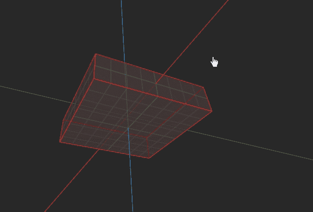

在 TrenchBroom 中使用“刷子”进行简单的 3D 建模；由[Benoit "Bal" Stordeur](https://www.artstation.com/bal)提供的 GIF 演示

### 模块化套装

从**模块化部件**套装中拼接预先制作的建筑部件。

然而，如果套件设计不良或配置不当，使用起来会很困难。如果你是初学者，你可能不应该尝试制作自己的套件——直接下载一个即可。

*有关规划、测量和构建模块化套件的更多信息，请参阅* *模块化套件设计**.*

*有关下载免费模块化原型套件的链接，请参阅* *资源*

使用模块化套件进行布局的建议...

**配置网格并开启网格捕捉**（如何操作：[Unity](https://docs.unity3d.com/Manual/GridSnapping.html)，[Unreal](https://docs.unrealengine.com/4.27/en-US/BuildingWorlds/LevelEditor/Viewports/ViewportToolbar/))

+   使用基于模块尺寸的大粗网格

+   例如，如果墙壁模块宽度为 5 米，则将网格设置为 5

**使用顶点捕捉**来精确对齐模块（如何操作：[Unity](https://docs.unity3d.com/Manual/PositioningGameObjects.html)，[Unreal](https://docs.unrealengine.com/4.26/en-US/Basics/Actors/Transform/))

只需**下载一个预制的套件**。
 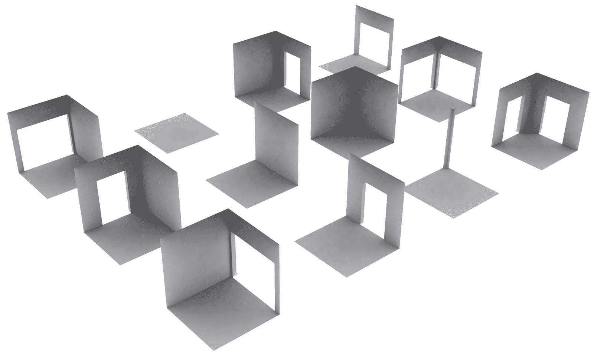

"graybox"模块化布局套件用于 Skyrim 中的关卡原型设计，[图片由 Joel Burgess 提供](http://blog.joelburgess.com/2013/04/skyrims-modular-level-design-gdc-2013.html)

### 雕刻

大多数现代引擎都有一个**雕刻工具**，允许您在平面上绘制和变形。

我们只使用它来制作像地形和景观这样的大平滑形状；对于像建筑这样的硬表面来说，这是不合适的。

但如果景观是项目中的核心，则无法避免雕刻。

*有关雕刻和地形设计的更多信息，请参阅* *景观**.*

关于使用雕塑进行轮廓的建议...

**雕塑对于初学者来说往往是一种干扰。** 用一键制作山脉非常有趣且令人兴奋，以至于你会忘记进行任何级别的设计。小心！不要让雕塑工具诱惑你！

**使用大刷子尺寸**并首先关注大的核心形状。

**使用[设置高度（Unity）](https://docs.unity3d.com/Manual/terrain-SetHeight.html)或[平坦目标（Unreal）](https://docs.unrealengine.com/en-US/Engine/Landscape/Editing/SculptMode/Flatten/index.html)刷子**定义地面平面

**将斜坡雕塑成阶梯状梯田**以定义梯度，然后将其平滑。

**避免侵蚀/自动生成工具**，你需要对设计有控制权。
 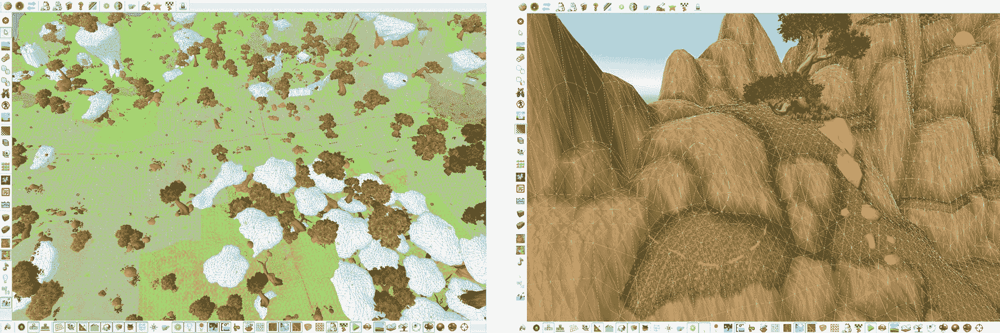

为《魔兽世界：军团》中的“纳格兰”地区雕塑景观

### 样条

**样条**是沿路径生成几何形状的无形曲线。

这些曲线也是*非破坏性的*；你可以在任何点调整样条，并重新生成其几何形状。

样条非常适合绘制曲线线性形状，如道路或河流，它还可以自动变形周围的地形。

使用样条也可以生成非线性区域和建筑，但这种工作流程并不常见，通常需要定制工具。

关于使用样条进行轮廓的建议...

就像雕塑一样，**样条对于初学者来说往往是一种干扰。**玩弄样条很有趣，以至于你会忘记进行任何关卡设计。不要让样条诱惑你！

**样条工具种类繁多。**它们仅在 2010 年代中期变得普遍。虚幻引擎内置了对[蓝图样条](https://dev.epicgames.com/community/learning/tutorials/39/populating-meshes-along-a-spline-with-blueprints)的优秀支持。Unity 用户则不太幸运，不得不尝试各种插件，如[SplineMesh](https://github.com/methusalah/SplineMesh)或[编写自己的样条](https://catlikecoding.com/unity/tutorials/curves-and-splines/)。

**样条并非魔法。**如果你想要制作比道路、河流或桥梁更复杂的东西，通常需要定制工具和大量的艺术支持。
 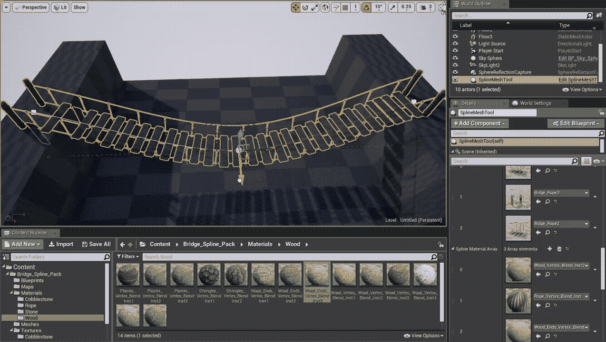

使用虚幻引擎 4 中定义的样条生成的动画 GIF 桥梁；[由 Peter Severud（通过 Artstation）提供](https://www.artstation.com/artwork/eKwwX)

**为什么不使用像 Blender、Maya、Max 或 SketchUp 这样的 3D 艺术工具进行布局呢？**

人们对此**有争议**。这是我们的看法：3D 艺术工具不允许你调整游戏玩法、碰撞、遭遇或物品。测试变得缓慢且不频繁。

*示例：在一个未命名的 AAA 游戏中，移动一块石头需要经过一个多步骤、耗时一个小时的流程：(1) 加载调试版本，(2) 找到包含该对象的文件，(3) 打开 Maya，(4) 编辑文件，(5) 重新编译游戏，(6) 再次加载调试版本以确认更改。*

## 如何进行布局

这是一个一般的过程。如果你是初学者，或者你处于新项目的开始阶段，尽量做所有的事情。你将逐渐个性化自己的过程和风格。

1.  **绘制布局**

1.  **添加地面平面、缩放角色和墙壁**

1.  **测试**

1.  **发散、迭代，再次进行测试**

1.  **重复步骤 4，直到完成**

### **1. 绘制**布局

没有任何计划的情况下进行布局可能很困难，尤其是对于初学者。即使是简单的草图也能有很大帮助。

观察下面的布局草图。左边的草图强调每个空间的尺度，中间的草图侧重于区域之间的关系，而右边的草图是一个更详细的平面图。任何这些草图都可以工作，任何这些都可以帮助你规划布局。

只需画点什么！

示例：三种可能有助于你规划布局的不同布局绘图风格...任何这些都可以让你开始，只管画点什么

### 2. 添加地面平面、缩放角色和墙壁

**创建一个地面平面**（或一个大平面立方体），位于 3D 空间的中心（0, 0, 0）附近。

使用浅色网格原型纹理，这样你可以直观地估计尺寸和比例。这个地面物体将帮助“定位”其余级别的几何形状，为其他所有东西提供一个地平线和背景。

**添加一个玩家人形比例模型**以帮助建立比例。

如果你没有任何人形资产，创建一个大致人形的方块作为占位符。比例模型有助于建立一致性并为玩家提供空间。

*有关常见走廊/墙体尺寸和人形尺寸的更多信息，请参阅* *度量**.*

*有关免费原型和块状纹理的链接，请参阅* *资源**.*

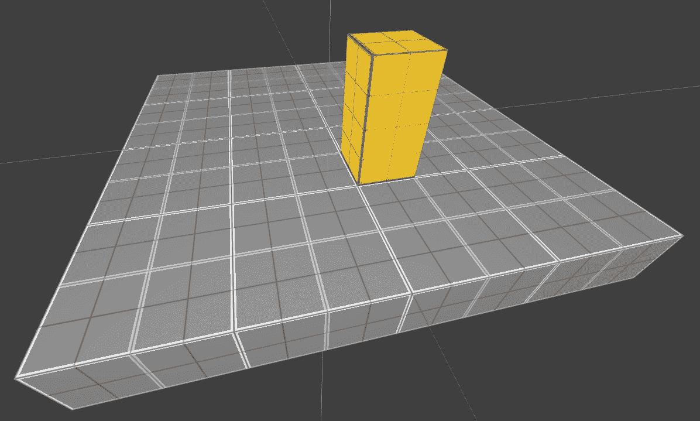

示例：一个灰色地面平面，上面有一个黄色比例模型站立

**构建一个与比例模型高度大约为** **150-200%** **的墙体段**。

如果你在一个现代游戏引擎中工作，尺寸不必非常精确——在这里，比例感最为重要。

如果你使用模块化套件进行块状布局，只需将标准墙体模块放置在模型旁边。

**用与地面平面不同的颜色**对墙体进行纹理处理。颜色和亮度提供了理解空间由什么构成以及这些不同的地面和墙体平面如何相互关联的重要背景信息。如果你担心颜色会过多地影响你的块状布局，那么至少使用不同灰度的纹理。

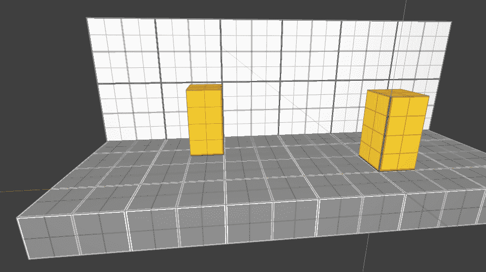

示例：添加了一个高度是比例模型两倍的白色墙体段

**复制粘贴墙体段**来构建更多空间，直到你至少有一个房间或走廊。一些工具具有特殊的“复制”或“克隆”命令：在 Hammer 中，按住 Shift 并拖动刷子；在 UE4 中，按住 Ctrl+Shift 并拖动墙体对象。

交叉点是可以的。杂乱无章也是可以的。

要制作门或窗户，只需在墙体段之间留出间隙，稍后再填充。入口和走廊的宽度至少应该是比例模型的二倍。

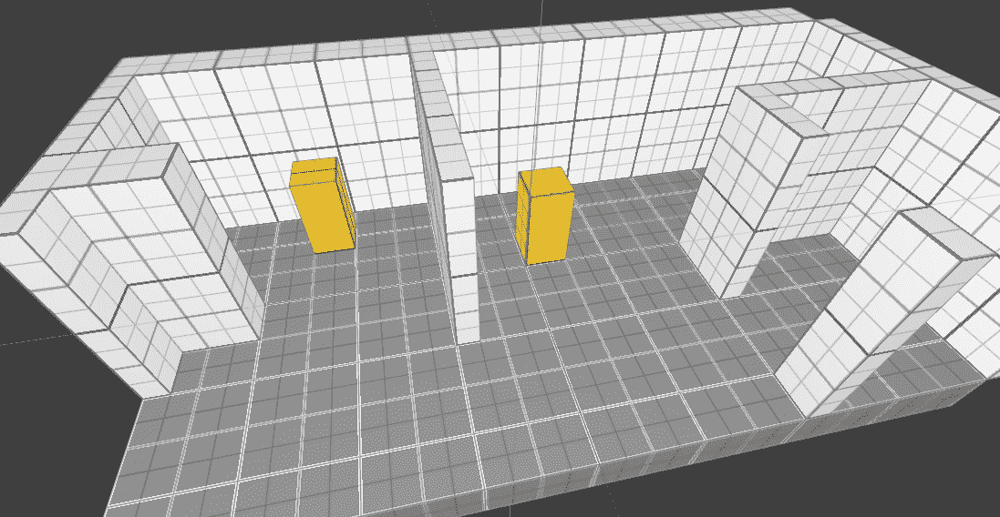

示例：基于第一个墙体段复制粘贴/复制更多墙体段

### 3. 演示测试

**进行简单的自我演示测试**：**在游戏引擎内，以全玩家重力、碰撞和速度在空间内行走**。

块状布局的目的是实验。为了验证实验结果，你必须测试原型。*不要只是在编辑器视图中飞来飞去，那不会帮助你想象玩家的体验*。

+   **体积建模****。** 级别的形状是否合理？看起来是否令人困惑？

+   **指标****.** 玩家能否通过每一个门和通道？楼梯/坡道是否工作？玩家能否跳到他们应该跳的地方？

+   **流程****.** 移动感觉是慢还是快，顺畅还是复杂？哪种类型的移动最适合你的设计目标？

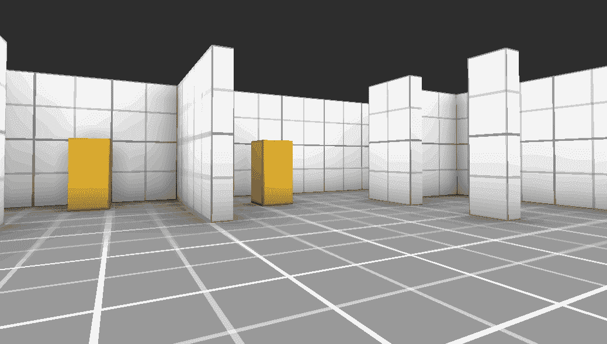

示例 GIF：在游戏引擎中绕着半建成的空间走动，尽快进行测试

### 4. 偏离并迭代

**偏离原始计划并响应测试。**

99% 的时间，你的块状图在测试中不会幸存。房间会感觉不自然，门道太窄，布局太复杂。但这就是我们做块状图的原因！

想要重建块状图的大块区域？*去做吧。* 想要删除一个整个房间？*去做吧。* 需要将庭院分成两个更小的区域？*你有权限。*

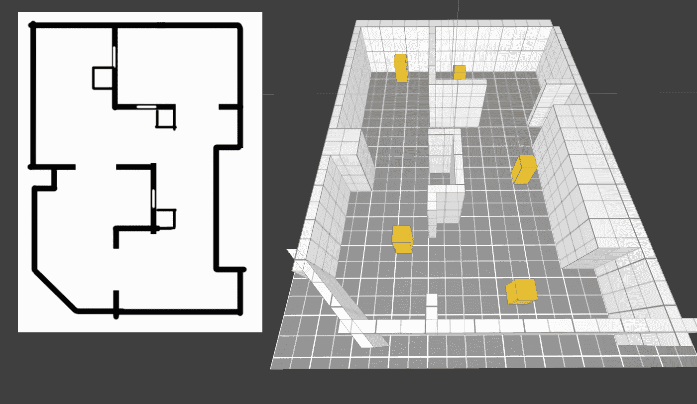

示例：遵循布局草图，用更多比例模型阻塞更多区域

对你的测试和巡游所告诉你的保持开放的心态。

**继续添加新的比例模型、墙壁和地板。**

**然后再次进行测试。**

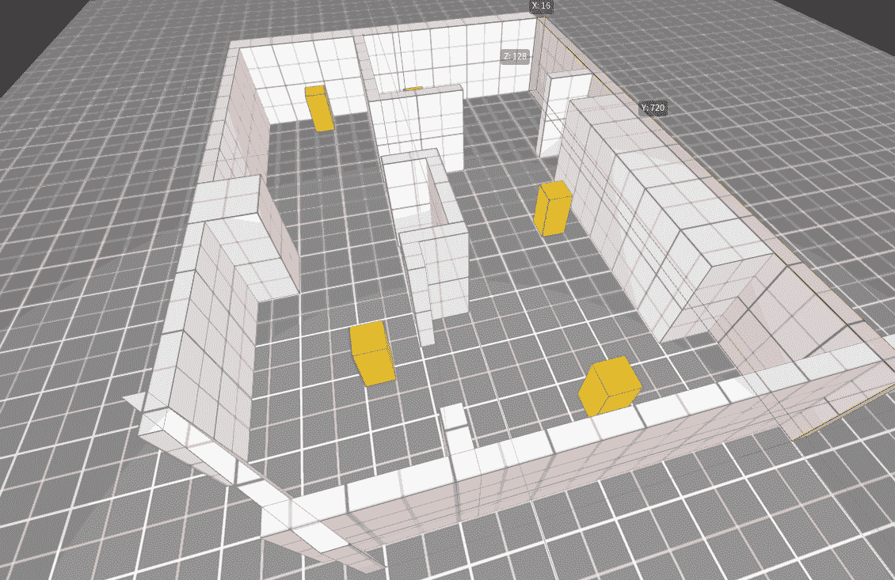

示例 GIF：原始块状图感觉太拥挤，那么如果我们拓宽空间并删除墙壁会怎样？

### 5. 继续迭代

保持开放的心态，并继续修改+测试的循环。继续开发块状图。构建，然后在里面走动，然后修改，然后再次进行测试...然后重复。这个过程被称为 **迭代**，因为我们正在制作新的 *迭代*，这些迭代建立在先前版本的优势之上。

随着你逐渐构建更多关卡，可能会让你惊讶它在时间上的变化有多大。让地图给你惊喜。

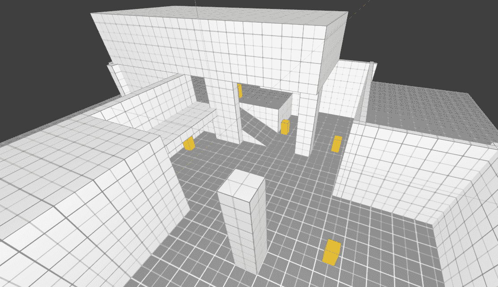

## 常见块状图问题

+   **（最常见）我的块状图感觉太小/太大。**

    +   在施工期间使用更多比例模型。

    +   更频繁地进行测试，更早地发现缩放问题。

    +   太大？删除不必要的房间并压缩剩余的部分。

    +   太小？扩展最外围的墙壁，然后扩展中心以填充新空间。

    +   或者删除一切并重新构建。这只是块状图。

+   **我感到焦虑，盯着空白的关卡编辑器屏幕，却什么都没做。**

    +   绘制一个布局草图，然后尝试遵循那个计划。

    +   只画一个简单的房间。你总是可以稍后删除它。重点是摆脱空白页面。在绘画中，这被称为“激活画布”；在写作中，这被称为一个 ["糟糕的第一稿。"](https://wrd.as.uky.edu/sites/default/files/1-Shitty%20First%20Drafts.pdf)

    +   做些别的事情，稍后再回到块状图。

## 示例块状图

### 城堡用于脏弹溅射伤害

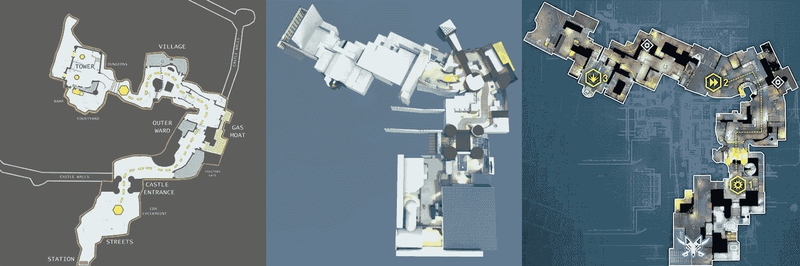

《脏弹》的城堡布局、草图和最终版本，由 Splash Damage 设计（["Blocktober: Dirty Bomb"](https://www.splashdamage.com/news/blocktober-dirty-bomb/)）

溅射伤害级别设计师安东尼“MassE”马斯西为竞争性多人团队射击游戏《脏弹》设计了地图“城堡”。马斯西从扭曲的中世纪街道和现实生活中的伦敦塔的类型学中汲取灵感，并构思了初始布局草图（上图，左）。但请注意，最终的草图（上图，中）与曲线较少、90 度角更多、区域更厚重的布局不同。布局只是一个初始指南。因为这是一个多人射击地图，设计团队在关注移动和战斗指标时对草图进行了测试：

> “地图的比例尺总是最难把握的方面。重要的是要规划你的主要路径并测量这些距离；我们寻找的是从出生点到目标点之间 8 到 12 秒的时间。 [...] 如果时间超过这个范围，玩家在重生后不得不跑回来时会感到沮丧。另一方面，如果时间太短，则可能导致 8v8 比赛感觉地图太小，并可能导致混乱的游戏。 [...] 这个阶段对地图开发至关重要，但我们的团队遵循一个简单的经验法则；如果感觉时间太长，那么它就太长了。”
> 
> “考虑[玩家类别]是下一步。我们必须查看战斗范围，以便让我们的整个武器库都能发挥作用， [...] 同时确保战斗空间的多样性，以便[不同的能力]可行（如[空中打击能力]）。在实际情况中，这意味着考虑户外和室内区域的比率，确保[专注于户外的角色]可行。”
> 
> -- 来自 ["Blocktober: Dirty Bomb" 溅射伤害博客文章](https://www.splashdamage.com/news/blocktober-dirty-bomb/)

### 世界边缘用于 Apex 英雄（重生）

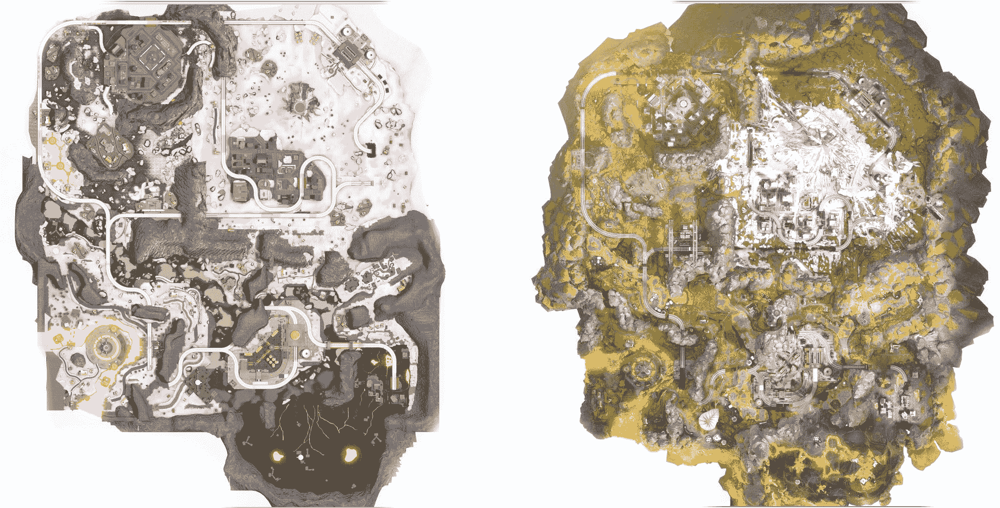

“世界边缘”地图在《Apex 英雄》中的最终详细草图（左）和最终艺术处理（右）；[由罗德尼·里奇绘制](https://twitter.com/RodneyReece7/status/1336783331711623168)

重生级别设计师罗德尼·里奇为“世界边缘”构建了草图，这是一张大型多人竞技地图，用于第一人称战斗皇家游戏《Apex 英雄》。注意地图从草图（左）到艺术处理（右）在主题、布局和构图上发生了巨大变化。

> "最初的想法是地图上覆盖着雪。但艺术团队希望将绿色融入地图，在一次会议上，罗伯特·陶布提出了这样一个问题：如果震中（当时称为冻结爆炸）导致了雪。
> 
> 成为优秀设计师的关键是对新想法的灵活性。例如，艺术团队提出了 The Dome。在我的块状网格中，它是一座火山。他们提出了这个想法，我调整了它以纳入这个想法。我必须为它创建一个新的布局，但它使它变得更好。
> 
> 但在其他时候，某些[兴趣点]从一开始就很有趣。在这种情况下，我更固执于什么可以改变。Sorting Factory 就是这样一个很好的例子。在布局方面，重要的是要确定什么是宝贵的，什么是灵活的。因为需要团队！
> 
> -- [罗德尼·里奇（@RodneyReece7）的评论](https://twitter.com/RodneyReece7/status/1336783331711623168)

## 反对原型制作？

对于某些项目，传统的原型可能不太有帮助。体验可能更多地取决于空间设计，而不是艺术处理。原型无法验证依赖于艺术或其他资产的概念。

### Firewatch 的垂直切片 "Firewatch" (Campo Santo)

对于第一人称叙事探索游戏 Firewatch（2016），开发商 Campo Santo 希望专注于行走和交谈等机制；游戏概念的主要吸引力在于欣赏经过的艺术风景和聆听配音对话。遵循典型的最佳实践，他们首先构建了一个原型来测试这些机制的可行性。然而，这个原型并没有帮助他们回答关于玩家体验的任何问题，因为游戏的节奏基本上是叙事设计和环境艺术问题，而不是那么多的关卡设计问题。传统的原型制作过程不起作用。

根据环境艺术家 Jane Ng 的描述，在他们跳过原型制作过程，而是完成了一个带有艺术处理环境和接近最终对话的垂直切片原型之前，他们并不清楚 Firewatch 是否会“工作”作为一个体验。

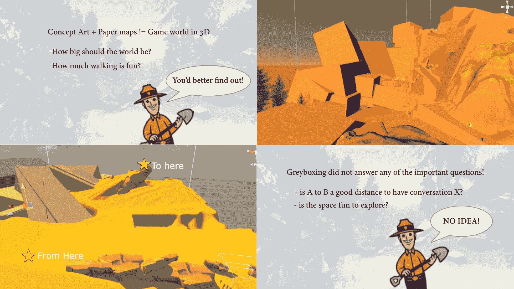

"灰色盒子没有回答任何重要问题"以及 Jane Ng 在 GDC 2016 年“制作 Firewatch 的世界”中的其他幻灯片

### 未命名鹅游戏的位置侦察

对于俯视第三人称潜行解谜游戏 Untitled Goose Game，开发商 House House 寻求在 3D 中创造一个感觉真实的英国村庄。关卡设计师 Jake Strasser 从未去过英国，因此偶尔使用照片参考来绘制初始关卡。然而，这种以原型制作为先的方法要求 Strasser 从他的想象中填补空白--因为他没有英国人的想象力，这些空白往往在微妙的方式上显得不切实际或不真实，与他们的意图相反。传统的原型制作过程不起作用。

因此，Strasser 尝试了一种“先研究”的“地点侦察”方法。他进行了详尽的虚拟游览，参观了各种英国村庄，并从谷歌街景中拍摄了大量照片。在游戏中重建了几条村庄街道后，Strasser 最终确定了适合游戏需求的结构类型，并基于[奥福德村的 Pump Street](https://goo.gl/maps/WAkqYmNRARyAEimi9)选择了不寻常的侧街布局。在这里，blockout 与其说是构建空间，不如说是发现空间。

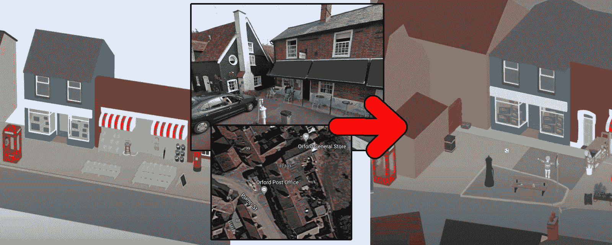

“它开始感觉更像是一个具有自己怪癖和历史的地方”...来自[“谷歌地图，而非灰色盒子：未标题的鹅游戏数字地点侦察”（https://www.youtube.com/watch?v=cCsMz5tUXmc）](https://www.youtube.com/watch?v=cCsMz5tUXmc)的 GDC 2021，Jake Strasser

## 要回顾

**blockout**是一个简单但可玩“草稿”关卡，细节最少。我们保持简单和块状，这样我们就可以轻松地更改它。

您可以使用**原语**、**画笔**、**模块化套件**、**雕刻**或**样条曲线**来构建 blockouts。最佳技术将取决于您的引擎和项目，或者您可以结合多种技术。

如何进行 blockouts：

1.  **绘制****布局**，即使是一个简单的布局

1.  添加**地面平面**、**比例人物**和**墙壁**。

1.  **立即试玩**；在周围走动是否感觉良好？您现在就需要知道。

1.  **偏离**您的原始计划，**迭代并再次试玩**

1.  **重复步骤 4**。

**最常见的问题是比例**，尤其是对于初学者来说。在游戏中试玩 blockouts 是了解它是否太大或太小的最佳方式。

对于一些项目，如单玩家艺术依赖叙事关卡，blockouts 可能不太有帮助。

## 现在怎么办？

+   复习**blockouts 的关键概念**如体量、度量、寻路和试玩。

+   一旦您构建并测试了 blockouts，请进行一次**脚本编写**或**照明**遍历。

### 更多关于 blockouts

+   [GDC 2018：“无形直觉：Blockmesh 和照明技巧以引导玩家和设定氛围”](https://www.youtube.com/watch?v=09r1B9cVEQY)由 David Shaver 和 Robert Yang，可能是最新的行业标准 blockout 讨论，展示了 Shaver 在 Naughty Dog 游戏中的 blockout 示例，以及 Unity 中原型化的精炼示例。然而，它实际上更关注构图和寻路而不是构建。

+   [“地震地图绘制技巧：建筑布局” (5 分钟) 视频由 Michael Markie 制作](https://www.youtube.com/watch?v=G4tWWiuaF7g) 从 Quake 1 中一个非常简单的单室布局开始，然后逐渐对其进行详细阐述，使其更具游戏性。注意频繁的试玩和设计迭代。这是一个即兴布局过程的好例子，几乎没有任何预先规划。
