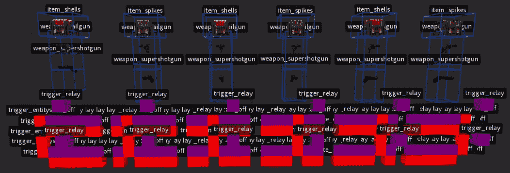
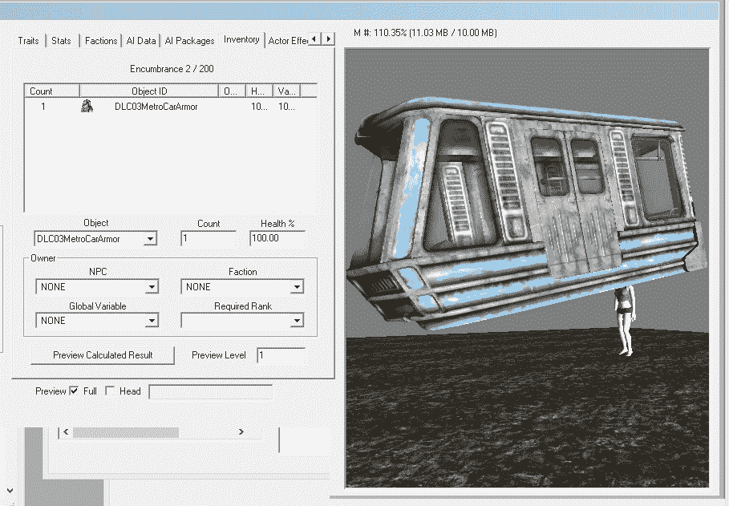
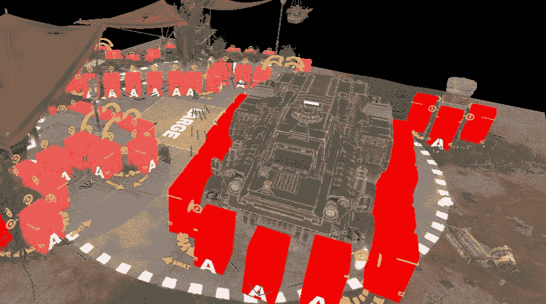
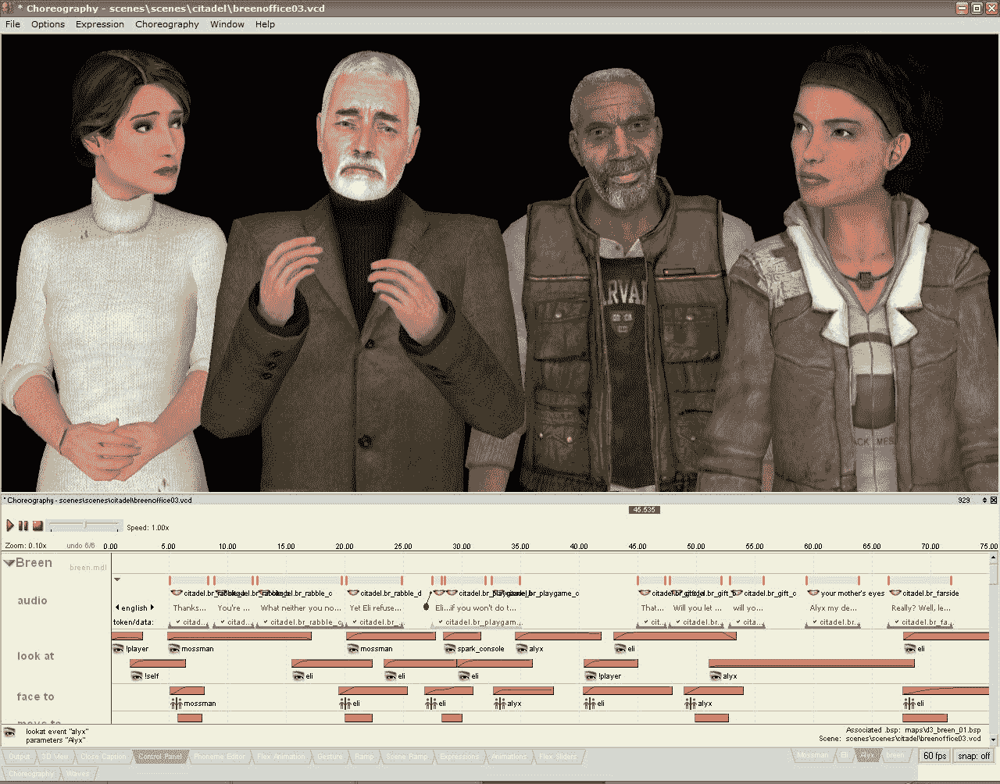
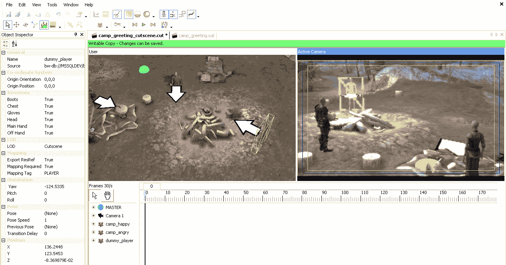
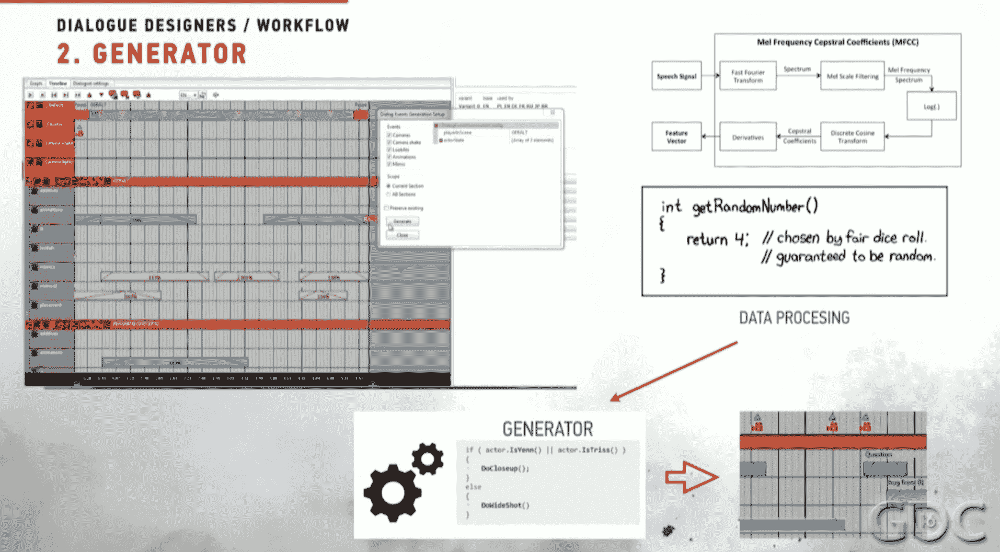

# 📜脚本

> 原文：[`book.leveldesignbook.com/process/scripting`](https://book.leveldesignbook.com/process/scripting)

## 脚本是什么？

级别设计师使用**脚本**工具为关卡编程特定的游戏规则和行为。一些常见的级别脚本示例包括：

+   **目标**、任务、使命——一系列有开始和结束的目标和遭遇

+   **触发器**在进入某个区域时执行逻辑，例如失去生命值或获得分数等。

+   **门**阻止玩家在解决游戏世界中的某个问题之前继续前进

+   **游戏对象/实体**，如按钮、门、电梯、火车、陷阱等，可以移动或做出反应。

（可视化脚本示例）

### 游戏代码与关卡脚本

在游戏引擎的过去几代中，游戏引擎代码与游戏关卡中的脚本逻辑之间存在很大的技术差异。

例如，Quake 1 的游戏引擎 idTech2 是用 C / QuakeC 编写的，但关卡脚本员依赖于预先制作的具有狭窄预定义行为的**实体**。一个 *func_button* 实体只能作为按钮使用，而一个 *func_door* 实体只能作为滑动物体使用。如果设计师将门建成一个向上“打开”的平面平台，那么门基本上就是一个电梯；这些富有创造性的黑客行为是必要的，因为级别设计师无法轻松地编写新类型的实体。实体是特定级别的视觉脚本逻辑，作为游戏引擎解释的数据存在。

Benoit "Bal" Stordeur 为 Quake 1 中生成武器而制作的非常复杂的实体设置（168 个不同的对象！）的编辑器截图 https://twitter.com/BafuBal/status/1261974130624167937

对于现代游戏引擎，脚本变得越来越文本化和代码化。Unreal Engine 4 的蓝图可视化脚本与 C++ 功能相匹配，Unity 的 Playmaker / Bolt 可视化脚本与 C# API 相匹配，Fallout 4 / Skyrim 脚本员使用 Papyrus 语言，其他引擎通常嵌入 Lua。现在基本上都是代码。

因此：**关卡脚本**仅仅是限于游戏关卡范围内的编码行为。脚本通常与地图中的特定对象或地点交互，绑定到特定实体。它们在此地图之外或不同地图之间具有有限的功能。将其视为与特定关卡相关的“较软”代码，与所有关卡共享的“较硬”核心游戏代码相比。

### 黑客

脚本**黑客**是一种一次性脆弱的解决方案，它以非预期的方式使用游戏系统，因此无法支持更广泛的行为，也无法在游戏的其他地方轻松重用。

例如，在《辐射 3》的《破碎钢铁》DLC 中，玩家在任务期间修复并乘坐地铁火车。然而，游戏并没有任何实际的车辆或火车系统。相反，[《辐射 3》使用了一个巧妙的黑客技术来模拟火车](https://www.pcgamer.com/heres-whats-happening-inside-fallout-3s-metro-train/)。通过脚本，游戏强制玩家秘密装备一个名为“DLC03MetroCarArmor”的库存物品——一个执行相机脚本的臂章，让玩家感觉就像在移动的火车上。在《辐射 3》的 GECK 游戏编辑器工具中，这个臂章看起来像一顶巨大的火车形状帽子。（见下文图片）

这种脚本黑客技术可能看起来很荒谬，但它有效，并且节省了开发者大量时间，避免了不必要地构建复杂功能。所以有时黑客技术是合适的，但只有在你为你的项目范围做了足够的规划之后，你才能决定使用这样的黑客技术。在这里，Bethesda 的设计师们已经规划了他们的 DLC，并且他们知道没有必要编写他们永远不会再次使用的火车系统，因此他们黑客了一个假火车并成功发布了他们的项目。

《辐射 3》的“火车帽”DLC03MetroCarArmor 手镯，如 GECK 编辑器工具中预览的那样。从

## 目标

任务、使命... 通常由触发器和门组成

分支标志模型

辐射/天际编号任务阶段（FSM？）

将其可视化为一个流程图，可能会变得非常复杂

## 触发器

触发器让我们定义体积和区域，并将行为应用于这些区域

触发器知道何时有东西进入、停留和退出... 触发器是一个事件

基本触发器是陷阱、死亡、熔岩等，或者打开一扇门

对于单人游戏，触发器应该是不可见的、无缝的、神奇的，有时只是单次触发器？... 亲爱的爱斯特，用于鬼魂和配音的触发器...

复杂触发器：类似于《回家》中父母衣橱的动态调整触发器？

对于多人游戏，触发器**不应该**是不可见的！！... CS 中的炸弹地点区域，守望先锋中的占领点

## 门

参见：门控，门

门是一种阻碍或阻止玩家在关卡中移动的东西，通常沿着关键路径。

尽管它们的名称是门，但门不仅仅是门。关卡中的几乎所有东西都可以*作为*门使用，因为任何阻碍进展或流动的障碍，无论是轻微的还是严重的，都是一种门。

**硬门**是指在没有完成遭遇战或谜题的情况下无法继续前进的情况。当我们说“门”时，通常指的是硬门。

+   杀死所有怪物/Boss 以打开门

+   按下所有按钮

+   收集钥匙

+   只有 NPC 在想要的时候才能打开门（例如，在战斗之外）

或者将这些全部连接起来.... 杀死怪物以获得钥匙，按按钮释放掉落钥匙的怪物等。

### 软门

玩家可以在不完成遭遇战或谜题的情况下绕过大门，但他们被强烈劝阻这样做（例如怪物太多）

稍微复杂一些，不那么手把手，更好地支持速跑者...但玩家如果在不意识到的情况下绕过大门，不确定发生了什么，或者大门太柔和以至于根本不起作用，可能会引起一系列的困惑

+   （非常柔和）阻挡视线，急转弯（参见类型学）

+   （柔和）简单的穿越/跳跃谜题，堆叠箱子

+   （柔和）Valve 风格的缓慢开启大门

+   （从柔和到游戏破坏）令人困惑的布局，不清楚如何前进（可能会感觉不好，而不是好）

## AI 脚本

### 生成器

怪物储藏室

导演 AI

### 提示

寻路节点、怪物跳跃、遮蔽节点、剪辑体积、牵引

为 NPC 和 AI 提供提示遮蔽

Splash Damage 为《Gears Tactics》提供的遮蔽节点提示标记的编辑视图（来自 https://www.splashdamage.com/news/blocktober-gears-tactics/)

> "*高高的红色箱子是站立遮蔽（也称为“完全遮蔽”，提供最大保护）而较小的粉色箱子是低遮蔽（游戏中的半遮蔽）。*每个遮蔽节点上的黄色目标显示士兵放置在该遮蔽节点时可以射击的角度。一些低遮蔽节点上方的黄色弯曲箭头显示士兵可以跳过遮蔽节点进入相邻侧的节点。仔细放置遮蔽节点和严格遵守度量标准对于创建干净、无错误的遮蔽设置并按玩家期望的方式工作至关重要。如果遮蔽物太高，则无法跳过它；如果遮蔽节点在角落放置不正确，则占据该节点的士兵将无法绕过角落射击。这两个例子都会给玩家带来挫败感，必须避免！*"
> 
> *-- 来自 *[*"Blocktober: Gears Tactics"*](https://www.splashdamage.com/news/blocktober-gears-tactics/) *Splash Damage 博客文章*

许多战斗游戏也会自动生成标记并手动微调（例如《未知的 4》）

## 编排

当我们为 NPC 编写脚本以执行超出其正常 AI 范围的具体动作时，特别是对于游戏中的场景和叙事，那么这种脚本被称为**编排**。在大型团队项目中，角色编排可能是脚本编写者、动画师或专门的视觉效果艺术家的责任。

常见的编排脚本操作包括：

+   *NPC 演员的身体控制，如看、转、走、说。*这种[舞台布局](https://en.wikipedia.org/wiki/Blocking_(stage))编排应连接到与主游戏 AI 相同的身体系统，即维护两个不同的行走系统会将额外的技术债务引入您的项目。

+   *动画控制*。完全覆盖默认的空闲姿势或当前的全身动画。例如，如果你的游戏中两个演员拥抱了一次，你不需要设计一个专门的拥抱系统——相反，你应该只是临时用拥抱动作覆盖他们的动画。

+   *道具和附件*。暂时将一个对象绑定到角色关节上，例如将帽子戴在头上，或将杯子放在手中。

+   *时间延迟*。等待 X 秒，适用于戏剧性的节奏或暂停。

+   *相机控制*。强制第一人称控制器看向某个目标，或生成具有其他角度或电影摄影的额外第三人称相机。

+   *游戏状态管理*。对于系统或以战斗为导向的游戏，最佳实践是禁用编排演员的战斗 AI 和物理，以及暂停/阻止/删除附近的敌人，并使编排 NPC 暂时无敌。如果你不管理和清理游戏状态以进行编排，那么你的演员在剪辑场景中可能会意外倒塌或死亡。

Faceposer 编排工具的截图，用于 Half-Life 2（2004）版本，具有 3D 预览和基于轨道的时间线界面

### 对象交互系统

泰勒·斯沃普（Taylor Swope），Obsidian RPG "The Outer Worlds"（2019）的 QA 负责人，花费了大量时间尝试调试 NPC 对象交互脚本问题[`twitter.com/_taylorswope/status/1205252714680045568`](https://twitter.com/_taylorswope/status/1205252714680045568)

> *我们发布了 [...] 一个针对令人讨厌的“游戏认为我的同伴已经死亡”错误的修复程序，我相信我花在调查这个错误上的时间比我在职业生涯中调查任何其他单个错误的时间都要多。*
> 
> *这个错误的本质是，对于一些玩家来说，同伴任务在任务日志中被标记为失败，理由是同伴已经死亡——尽管同伴实际上非常健康和活跃。其中一个原因它如此难以定位是因为无法确定错误实际发生的时间——我们所有的案例基本上是“嘿，在过去十个小时内发生了不好的事情，现在我的任务已经损坏了”。*
> 
> *调查它涉及到找出每个可能使游戏认为同伴已经死亡的脚本和代码行的位置。唯一的合理解释是一段在同伴的生命值达到零时运行的脚本：如果他们在队伍中，它将等待战斗结束并复活他们；否则，它将他们标记为“真正”的死亡。[但是]游戏中唯一一个同伴在场但不在活跃队伍中的地方是当玩家在他们的飞船上。问题是，当同伴在飞船上时，他们是不可伤害的。最终我们弄清楚，“不可伤害”并不意味着“无敌”——他们不能从攻击中受到伤害，但仍然可能因其他原因受伤。其中之一就是：从很高的地方坠落。
> 
> *问题在于玩家的飞船上没有足够高的地方会导致致命的坠落。所以现在我们必须弄清楚同伴是如何神秘地出现在水平面之上的。我调查了大量的理论，包括“也许在从其他地图快速旅行时，他们的身高数据被保留”和“也许两个同伴之间的物理交互导致其中一个迅速向上加速”。（我个人最喜欢的理论是“如果一位同伴站在随机事件中牛出生的地方，他们就会被发射到太空中”。当这个理论没有成真时，我真的很失望。）到这时，游戏已经发布，所有关于这只是一个奇怪的意外，只有少数开发者会看到的希望都破灭了，因为各地的玩家开始报告他们的同伴任务失败。*
> 
> *最终，一位用户的评论中无意间提到了一个奇怪的 bug，其中一位同伴“爬着什么都没有”，这个评论让我找到了整个问题的答案。*
> 
> *在开发方面，NPC 与环境交互的系统被称为“家具”。有时这确实是字面意义上的家具，比如坐在椅子上，但它涵盖了从使用终端到靠在墙上的所有行为。在复杂的家具系统中，我们有一段代码，如果玩家正在对话中，就会禁用所有 NPC 开始新的家具交互。*
> 
> *问题在于使用梯子被视为两种不同的家具交互：一种是为了上梯子并开始攀爬，另一种是为了停止攀爬并下来。所以，如果有人开始攀爬梯子，而玩家在停止之前进入了对话，他们就无法退出梯子，嗯……* -- 泰勒·斯沃普 (@_taylorswope) [`twitter.com/_taylorswope/status/1205252714680045568`](https://twitter.com/_taylorswope/status/1205252714680045568)

### 编排工具

游戏引擎通常具有用于编排的视觉轨道时间线工具，如[时间线](https://docs.unity3d.com/Packages/com.unity.timeline@1.2/manual/index.html)（Unity）或[序列器](https://docs.unrealengine.com/en-US/AnimatingObjects/Sequencer/index.html)（UE4）。脚本编写者和动画师会设置不同的轨道并在每个轨道上放置事件。这样，游戏可以将编排作为游戏资产导入，而不是代码，这避免了任何耗时的重新编译并简化了代码库。

大型项目，如包含许多对话场景（如 RPG 游戏），通常依赖于半自动化的工作流程来编写其编排脚本。他们的工具会自动为每个对话生成基本的场景脚本，因为手工制作数百（或数千）个简短的场景是不切实际的。然后脚本编写者和动画师通过额外的编排来润色最重要的场景，并且 QA 测试员会报告任何需要特别关注的低优先级编排问题。语音密集型项目还需要调整每个配音语言的场景时间，而具有昼夜循环的游戏应该自动覆盖全局照明，以更好的照明设置来为场景和特写镜头提供照明。

如果你的项目没有或不需要专门的编排工具，那么仍然可以直接使用游戏脚本代码进行编排。使用类似[yield](https://docs.unity3d.com/Manual/Coroutines.html)（Unity C#）或[等待节点](https://docs.unity3d.com/bolt/1.4/manual/bolt-time.html)（Unity Bolt）或[延迟](https://docs.unrealengine.com/en-US/BlueprintAPI/Utilities/FlowControl/Delay/index.html) / [计时器](https://docs.unrealengine.com/en-US/InteractiveExperiences/UseTimers/index.html)节点（UE4 BP）来按顺序调用函数，并使用你想要的计时。当你需要完全访问所有脚本函数作为编排的一部分时，这种方法很有用。想象一下编排 100 个 NPC 一个接一个地穿过一扇门；在视觉工具中，这项任务将是缓慢、痛苦且乏味的工作，但在具有 for()循环和数组的脚本语言中，这将是微不足道的事情。

Dragon Age Origins（2009）使用的场景编辑器截图，带有 3D 摄像机预览和基于轨道的时间线

### 示例编排工作流程：巫师 3

对于他们的大型开放世界 RPG《巫师 3》（2015），开发商 CD Projekt Red 将他们的任务工作流程分为四个阶段：（1）以剧本格式**编写**脚本和选择，（2）在视觉脚本流程图工具中**脚本编写**可能的分支和游戏状态，（3）**对话和编排**，通过初步自动生成过程，以及（4）**后期制作**，对场景进行修复和视觉润色。

对话设计师工具的自动场景生成器在这里特别有趣。它接受配音音频，并自动为演员生成轨道和计时，包括半随机化的动画变化和遵循基本电影摄影模式（如镜头反打和 180 度规则）的标准摄像机镜头。结果是场景的基本起点，已经基本完成，允许编排师更多地专注于添加细节和氛围，而不是设置基础时的枯燥重复工作。

来自 GDC 2016 的《巫师 3》场景生成器工具的图表：“《巫师 3》中的电影对话”

尽管这种方法在[CDPR 的 GDC 2016 演讲](https://www.youtube.com/watch?v=chf3REzAjgI)中并没有真正提到其弱点，但我们可以想象这里的主要缺点是它要求你最终确定并系统化你脚本的大部分内容、配音录音和动画，以便将其输入到生成器中。没有标记的音频资产和接近完成的角色，生成器将难以理解要做什么。就像任何程序生成系统一样，它高度依赖于其输入，如果没有良好的有意义的输入，它只会导致“[燕麦问题](https://emshort.blog/2016/09/21/bowls-of-oatmeal-and-text-generation/)”。

关于 CDPR 编排工作流程的其他有趣细节：

+   游戏是用英语编写的和编排的，但配音音频的长度显然会随着每种语言的差异而变化。因此，对于每种本地化，编排和镜头序列会自动加快或减慢；例如，法语编排比英语慢 16%。[[37:46]](https://youtu.be/chf3REzAjgI?t=2266)

+   为了阻止 NPC 和野生动物打断场景，编排者设置了一个不可见的碰撞框/剪辑触发音量/“拒绝区域”，以将非编排角色推走并保持镜头清晰。[[40:25]](https://youtu.be/chf3REzAjgI?t=2425)

展示《巫师 3》场景生成器工具的视频，以及同一对话场景的两个随机生成的变体

## 如何脚本化关卡功能

脚本化是一种创造性问题解决任务，类似于任何其他级别设计任务。首先，你想要理解问题，然后你想要尝试各种方法。

1.  进行一些**规划**和**研究**。

1.  **原型**最基本版本并**进行测试**。

1.  逐步**迭代**并完善脚本，直到满足你的需求。

### 1. 规划脚本

就像任何创造性任务一样，**一点点的规划大有裨益**。在你打开脚本编辑器之前，花几分钟时间**定义你想要你的脚本做什么**。一些规划文档的例子：

+   脚本化任务？绘制流程图并用任务位置标记布局图。

+   脚本化一个对象或行为？草图展示它应该看起来什么样以及它的各种状态/属性。

+   脚本化一场战斗或遭遇？先进行一些遭遇设计。

+   脚本化对话或场景？编写脚本并绘制分镜图。

接下来，通过谷歌搜索**研究**实现该功能的各种方法。当在谷歌搜索编程或技术脚本帮助时，请确保：

+   *技术上要具体。* 包括游戏或引擎名称，以及脚本语言。将两者都用引号括起来，以要求搜索结果中包含这些术语。

+   *概念上要通用。* 用通用术语描述期望的行为。对于更复杂的功能，将问题分解成更小的简单部分，并分别进行谷歌搜索。

一些搜索词的例子：

+   😢`**如何编写吊扇的代码**`在表述上非常模糊（哪种编程语言？）并且在具体性上也是最糟糕的（你希望有人已经专门构建了一个虚拟吊扇）

    +   😎`**"unity" "c#" 旋转对象代码**`在技术上非常具体（我们只想要 Unity C#代码）并且有帮助地进行了概括（吊扇是一种旋转物体），我们可以从通用示例中推断出我们特定用例的解决方案

+   😐 `**游戏开发脚本目标系统**`可能会告诉你某人关于如何构建目标系统的观点，但没有具体的帮助。你确切地想编写哪种类型的目标脚本？没有任何搜索引擎可以为你设计游戏玩法。

    +   如果我们将这个问题分解成更简单、更具体的步骤，并分别对这一些小步骤进行谷歌搜索呢？

    +   😎`**"ue4" "blueprint" 屏幕上显示文本**`帮助我们了解如何通知玩家关于目标的信息

    +   😎 `**"ue4" "blueprint" 玩家进入触发器**`帮助我们学习如何检测目标是否完成，玩家在关卡中达到某个位置等情况

**何时寻求帮助。**除非你完全迷失方向，否则在早期阶段避免向其他人寻求帮助。尽量自己完成你已经找到的事情，看看你能走多远。当你有更具体的问题或有一些现有的脚本要调试时，向其他人求助效果更好。为了得到有用的答案，你必须首先理解问题。

### 2. 脚本原型设计

在进行了一些搜索之后，你现在对问题有了更好的理解，并且你准备好在脚本工具中**原型**这个功能了。

向社区成员寻求建议。加入一个特定引擎的论坛、网站或 Discord，并提出你的问题。如果可能的话，总结你已经进行的研究，并包括任何错误信息。以下是你可能发布的示例问题：

"我正在尝试制作一个工作的游乐园旋转木马。我找到了这段 C#代码来使对象旋转（链接），但当我尝试

## 遇到脚本工作流程

通常涉及触发器来生成/激怒敌人，以及一个门来强迫玩家处理敌人

在开始编写脚本之前：

+   在纸上做一些遭遇设计。在打开编辑器之前有一个计划，即使是一个基本的计划。玩家在这个遭遇中会有哪些武器或能力？

+   了解你的战斗指标。理想的敌人交战距离是多少？封锁区域过大还是过小？

然后，放置一些 AI / NPC / 敌人，并开始与他们互动

+   NPC 如何应对现有空间？他们是否做了你想要通过提示来阻止的事情？

+   你有哪些可用的工具？静态与脚本、动态之间的比较？

## 要复习...

+   **脚本**是使用轻量级编程语言设计的关卡特定行为，通常与特定于引擎的可视化编程工具一起使用。

+   常见的脚本特性包括**目标**、**编排**、**触发器**、**门**和**AI**。

+   +   在谷歌搜索时，包括引擎名称并使用通用术语进行搜索。

    +   对于短期的小型项目（小于 1 个月），最简单、最快的黑客攻击可能就足够了。

    +   对于长期的大型项目（6 个月以上），更稳定的系统方法会更好。

## 现在怎么办？

+   脚本对于**遭遇设计**和**叙事**非常重要。

+   在你编写了主要的**节奏**之后，你可能想要对**块状**进行**照明**处理。

### 进一步阅读

+   大多数成熟的游戏引擎都有可视化脚本工具。Unity 使用 [Bolt](https://docs.unity3d.com/bolt/)，Unreal Engine 4 使用 [Blueprint](https://docs.unrealengine.com/en-US/ProgrammingAndScripting/Blueprints/index.html)，而 Godot 有 [Visual Scripts](https://docs.godotengine.org/en/stable/getting_started/scripting/visual_script/getting_started.html)。见工具获取游戏及其脚本工具的完整列表。

    +   Unreal 脚本入门：[《使用蓝图实现关卡设计》由 Patrick Haslow 编写](https://www.unrealengine.com/en-US/onlinelearning-courses/implementing-level-design-with-blueprints)，2021 年 11 月。

+   [UE4 Blueprints From Hell](https://blueprintsfromhell.tumblr.com/) 是一个 Tumblr 存档，其中包含了在 Unreal Engine 4 的 Blueprint 系统中编写的混乱/黑客式的可视化编程图。它很有趣，但也有些夸张；有时发布一个效率不高的脚本比设计一个耗时较长的“更好”设计更有意义。如果一个更干净的方法快了 0.0001 毫秒，但制作时间却翻倍，那么它可能不是一个更好的脚本。
