# ☀️照明

> 原文：[`book.leveldesignbook.com/process/lighting`](https://book.leveldesignbook.com/process/lighting)

**照明设计**是关于在游戏世界中放置灯光以创造视觉深度、唤起情绪并提供信息以帮助玩家游玩的过程。照明不足的空间常常感觉陈旧、平淡、未完成或令人困惑。

由于照明对可读性非常重要，我们建议在块状或脚本阶段建立核心游戏玩法后不久进行照明渲染。

行业通常将照明归类为环境艺术的一个方面，但在这里我们将更多地关注照明的**设计**和**功能**。**灯光说了什么，做了什么**？

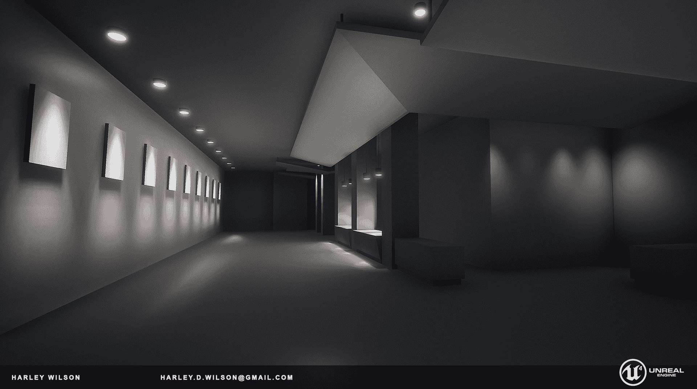

照明研究块状图 [由 Harley Wilson（via Artstation）](https://www.artstation.com/artwork/PQJvn)

在 Harley Wilson 上述研究中，**灯光告诉我们很多关于游戏世界的信息，并帮助我们玩游戏**：

+   世界构建。沿着墙壁的嵌入式下灯光暗示了一个豪华的现代画廊。

+   体量。较冷的灰色洗刷着画廊墙壁，较暖的灯具突出了柜台，暗淡的下灯光标记了一个阴暗的角落。灯光将这个区域划分为三个子区域。

+   循环。远处的墙壁是暗的，可能通向后门或壁橱。它可能不是主要出口，因为主要出口会被更突出地照明。

## 什么是视频游戏照明？

在现实生活中，**光**是可见的能量，它与表面相互作用。这是一个优雅的系统；通过能量和光子的核心物理，你可以推导出所有其他复杂的光效果。

相比之下，**视频游戏照明并不优雅**。它是一个假得要命的混乱，实际上是由游戏引擎中的许多不同子系统秘密组成的：

+   **光源**：直接照明的底层，基于光角度和位置

+   **阴影**：物体遮挡（阻挡）光线并将阴影贴图投射到其他物体上

+   **材质**：3D 表面的颜色、纹理、不透明度和反射性

+   **后期处理**：屏幕空间效果，如色彩校正、泛光和 HDR 眼睛适应

+   **反射**：真正的反射性需要重新渲染场景；大多数游戏使用近似值

+   **烘焙**：开发者预先渲染光照贴图和反射数据

“什么是光以及游戏如何模拟它”来自 Robert Yang 为 GDC 2018 所著的《无形直觉：如何照亮一个关卡》的幻灯片

想象一下用棱镜制作彩虹。在现实生活中，你将一束光穿过棱镜，彩虹“自动”出现，因为这就是光子和物理的工作方式。

但在视频游戏中，棱镜效果将是一团糟的破解：

+   折射玻璃材质 + 屏幕空间反射以形成棱镜形状

+   光线效果、白色光束和彩虹在 Photoshop 中分别绘制

+   光束相交处的发光精灵

+   近处表面的焦散投影/半透明 AO

这不是一个优雅的光子与表面相互作用的宇宙。在上面的列表中，请注意我们甚至没有使用任何光源！一切都是“假的”！

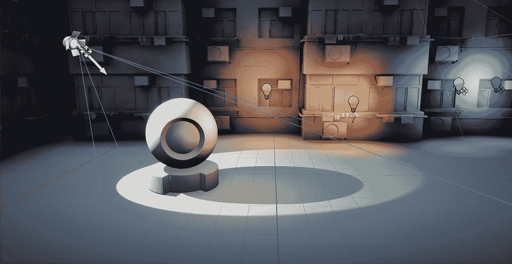

在 Unreal Engine 4 中投射阴影的聚光灯，[由 Oskar Świerad（via UnrealArtOptimization.com）提供](https://unrealartoptimization.github.io/book/profiling/passes/)

**为视频游戏照明是关于挑选和选择你所需要的。** 在大多数游戏引擎中，你可以设置一个灯关闭阴影，或者设置另一个灯禁用反射性。这对于优化至关重要。

这足以让现实生活中的物理学家呕吐。“但是没有阴影或反射性的光没有任何意义，”物理学家们喊道。哈哈，愚蠢的物理学家们！这是视频游戏的世界！

*图形程序员和物理学家一样，内心深处都很烦恼。像光线追踪这样的技术是关于尝试使游戏照明更加优雅。也许 10 年后会是这样。*

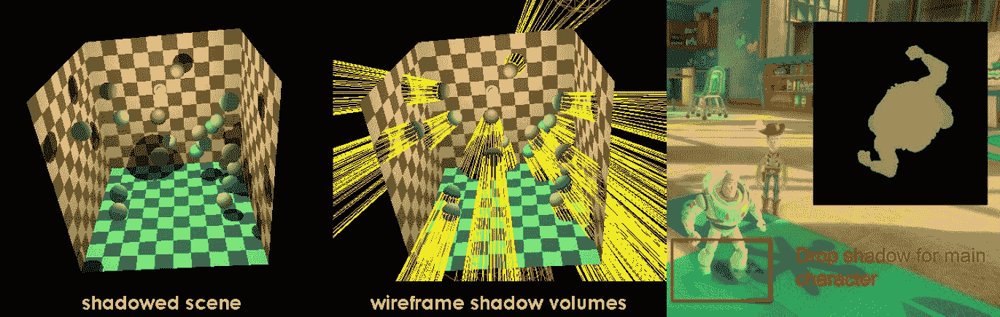

(左) [阴影体积插图](https://commons.wikimedia.org/wiki/File:Shadow_volume_illustration.png)由 Rainwarrior 提供，CC BY-SA 3.0； (右) 来自[*《玩具总动员 3：视频游戏渲染技术》*](https://advances.realtimerendering.com/s2010/Ownby,Hall%20and%20Hall%20-%20Toystory3%20(SIGGRAPH%202010%20Advanced%20RealTime%20Rendering%20Course).pdf)的幻灯片；两者均来自*["经典 3D 视频游戏阴影技术" by Pekka Väänänen](https://30fps.net/pages/videogame-shadows/)

### 光的历史简述

太阳和月亮（反射太阳的光）是最常见的**自然光源**。

还有像可控火、煤气灯、白炽灯这样的**人工光源**... 在 21 世纪，还有节能荧光灯和 LED 照明。

然而，这不仅仅是一个关于技术和进步的故事。灯泡并没有使太阳过时，LED 灯也没有使火过时。我们仍然喜欢阳光明媚的日子和浪漫的烛光晚餐。

火并没有从世界上消失。相反，火的意义和使用方式已经发生了变化。照明设计是关于理解光线如何传达这些想法、情绪和情感。

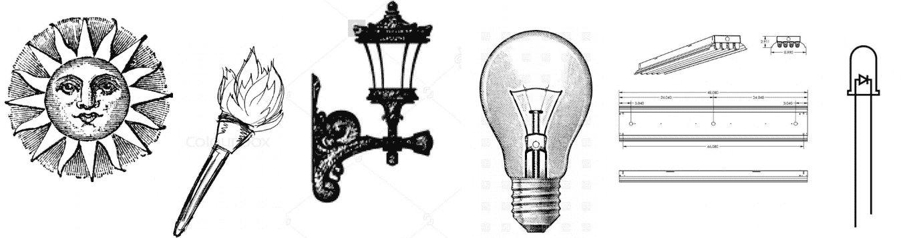

历史上的各种光源：阳光、火、煤气灯、白炽灯、荧光灯、LED

## **什么是照明设计？**

**现实生活中的照明设计**是放置光源的艺术/科学，考虑到环境和功能，无论是办公室还是情绪化的餐厅。

现实生活中的专业照明设计师评估建筑计划并与建筑师协调。他们在灯具制造商发布的目录中购物，这些目录包含详细的技术规格和实验室测试的光衰减图表/标准 IES 配置文件，他们可以在 3D 模拟中进行测试。他们还必须平衡关于最低照明水平、预算、维护计划、能源使用和可持续性的地方法律和建筑规范。

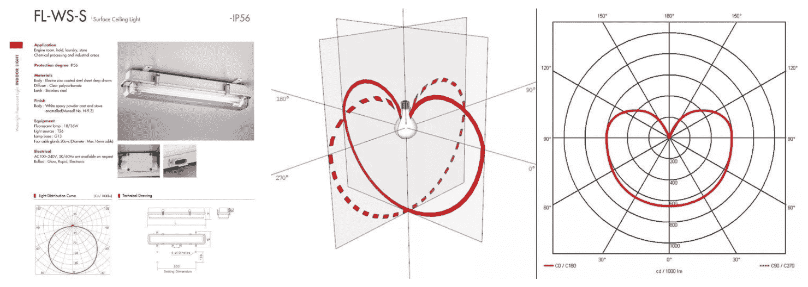

Daeyang Electric 目录中的灯具目录，带有分布曲线/衰减图表，以标准坎德拉(candela)为单位

由于眼睛会适应周围的光线水平，很难猜测房间实际上有多亮，因此照明设计师经常使用[lumen / 区域腔体方法](https://en.wikipedia.org/wiki/Lumen_method)进行快速估算。为了在现场获得更准确的读数，他们还使用手持[光强计](https://en.wikipedia.org/wiki/Light_meter)来测量科学单位，如[lux](https://en.wikipedia.org/wiki/Lux) / [流明](https://en.wikipedia.org/wiki/Lumen_(unit)) / [坎德拉](https://en.wikipedia.org/wiki/Candela)。

一些游戏引擎越来越多地采用这种技术/科学照明方法。然而，我们必须保持警惕：**现实生活照明设计与视频游戏照明设计的目标根本不同**。

### 现实生活与视频游戏照明设计对比

现实生活照明/游戏照明

依靠电力运行

也依靠电力运行

必须遵守物理定律

选择和选择法律；无神论

遵守当地法规

没有法规，只有玩家规范

无限的光源，无限的渲染

优化以使用最少的光源

长期内，你将在这里生活

短期内，你只是去参观它

刺眼的光线实际上看得很痛苦

刺眼的光线让你的游戏值 60 美元

舒适、安全、可用性、可靠性

戏剧性、细节、清晰度、可信度

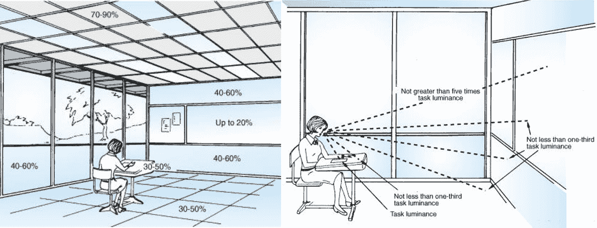

来自 IESNA 照明手册第 9 版的现实生活教室推荐的反射率和亮度比

## 光源

由于游戏照明非常复杂，我们将主要关注关卡设计师照明设计的根本：*放置光源*。

+   核心光源类型

+   静态与动态光源

+   灯具与光源

### 核心光源类型

几乎每个游戏引擎都使用这四种核心光源类型：

+   **环境光**是世界中默认的最小光量。并不真正真实。

+   **方向性光源**从方向投射恒定光线，就像从天空向下投射的阳光。

+   **点光源**（全向/“omni”光）就像灯泡一样，向所有方向投射光线。

+   **聚光灯**从特定位置向特定方向投射锥形光线。

(待办事项：光源图)

这些光源共同构成了基本光照工具的完整领域：

*全局，影响一切*

*局部，影响附近物体*

*全方位发光*

**环境光**

**点光源**

*单向发光*

**方向光**

**聚光灯**

其他光形状只是这些核心类型的变体。

+   面光源是宽扁的长方形聚光灯。

+   管灯是长形的点光源。

+   发射性材料/“纹理光照”使用像点光源一样的自发光像素。

### 静态与动态

**静态光**完全不变，而**动态光**可以改变颜色、强度、方向或位置。

静态光照几乎总是对帧率更有利，因为引擎可以“烘焙”光照数据，如光照贴图和反射——但不断重烘焙会让人感到厌烦，光照数据可能会消耗大量内存。

相比之下，动态光意味着亮度可以改变并做出反应，从而实现可切换的移动灯光和昼夜循环——但如果光源太多，可能会超载玩家的机器，帧率会受到影响。

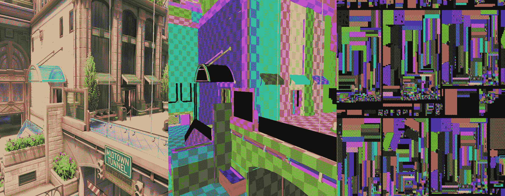

《守望先锋 2》中“纽约市”地图的光照贴图 UV 图表，图片由布鲁斯·威尔基提供 [(via PlayOverwatch.com)](https://playoverwatch.com/en-gb/news/23674944/environment-states-in-overwatch-2-behind-the-scenes-with-the-engineering-team/)

### 灯具与光源

**灯具**是一个可见的合理光源，如灯泡或壁炉。但阳光透过窗户也是一种灯具。在游戏关卡中，这通常类似于建筑特征或装饰性灯具道具。

这与引擎中的光源不同，引擎中的光源实际上是无明显原因的无形光源。它看起来有点奇怪，而且在现实生活中并不常见。

**有动机的光**是具有合理灯具的光源。

注意，一个*单个灯具实际上可能激发多个不可见的引擎光源*。在哈雷·威尔逊拍摄的图片中，只有两个可见的光源：一个橙色的壁炉和一个蓝灰色的窗户。*但看起来像两个光源的实际上是 11 个以上的光源！*

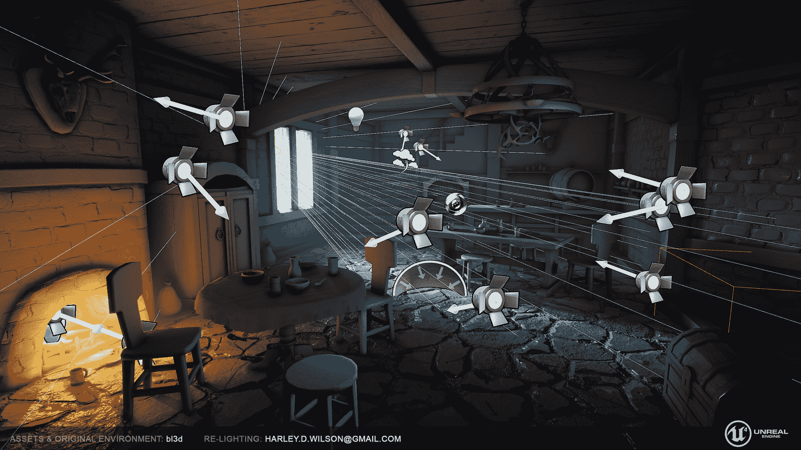

哈雷·威尔逊通过 Artstation.com 提供的带有光照实体的中世纪光照研究 [by Harley Wilson (via Artstation.com)](https://www.artstation.com/artwork/lBLzJ)

## 光照理论

这里有两种接近光照设计的方法：

+   **三点光照**：2D 媒体如电影和摄影的常见理论。

+   **D6 光照**：更抽象但更立体，适用于建筑师和室内设计师。

### 三点光照

**三点光照**是一种包含三种类型光源的光照理论：

+   **主光**：主要光源

+   **填充光**：较柔和的辅助光源，用于照亮阴影。

+   **边缘光**：用于突出物体和边缘的强调光。

虽然这些核心概念很有用，但它们在关卡设计方面存在局限性。这种技术来自摄影和电影，因此它假设线性固定的 2D 屏幕构图——而不是观众可以自由导航的交互式 3D 空间。

*关于这个 2D 照明理论的更多信息，请参阅* *三点照明**.*

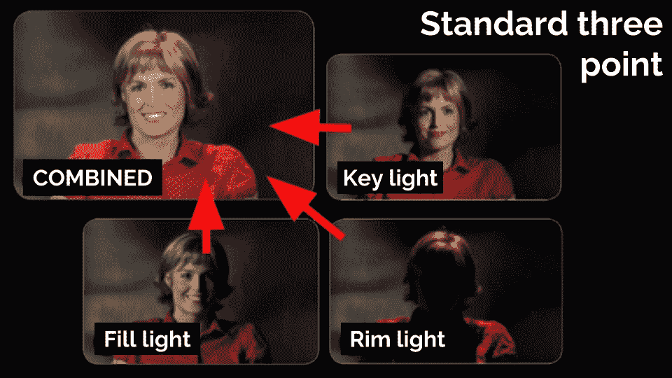

三点照明在摄影棚摄影和肖像摄影中很常见

### D6 照明

**D6 照明**是一种专注于覆盖和空间的光照理论，灵感来源于六面骰子。每一面代表一种光照策略，总共有六种策略：

1.  焦点 ⚀

1.  焦点框架 ⚁

1.  路径 ⚂

1.  区域 ⚃

1.  具有焦点的区域 ⚄

1.  具有路径的区域 ⚅

这种理论在建筑和关卡设计中有更多应用，然而它不如三点理论那么神秘和为人所知。

*关于这个 3D 照明理论的更多信息，请参阅* *D6 照明**.*

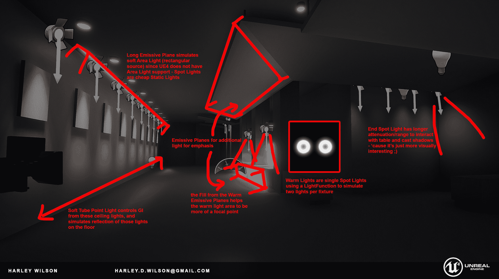

照明研究区块分解 [由 Harley Wilson (来自 Artstation.com) 提供](https://www.artstation.com/artwork/PQJvn)

## 如何照亮一个关卡

光照可能非常耗时，因此不要试图一次性完成最终光照。相反，将灵活性融入你的工作流程，并迭代地进行工作。

我们建议分四步进行照明：

+   全局光源

+   导航/关键路径灯光

+   游戏玩法/战斗遭遇灯光

+   细节和氛围照明

### 1. 全局光源

从任何全局主光源和填充光源的初始遍历开始：天空光、环境光以及任何天空盒/大气效果。

如果你使用任何发射性材料作为主光源，例如发光的熔岩河流，那么也要配置这个光源。

如果你想要的视觉效果需要烘焙间接光照，请立即运行一个初始的低质量光照烘焙。一些高级的全局光照解决方案（例如 UE5 Lumen）可能只需一个类似阳光的方向性光源就能照亮整个游戏世界。

### 2. 导航/关键路径灯光

接下来，确保任何重要的入口/出口沿着关键路径从期望的路径得到良好的照明。你可能需要使用局部光源，例如在门口旁边放置灯具。

建立一个层次结构。重要的出口应该有更重要的看起来光照，而次要空间应该有较暗且不太集中的灯光。

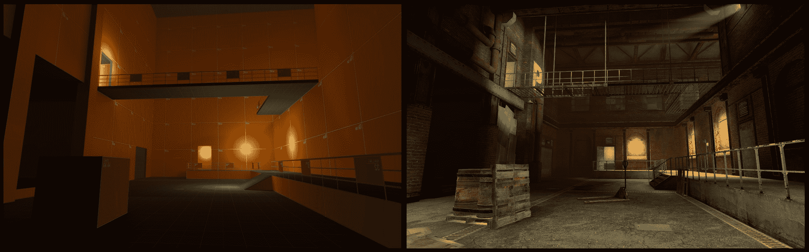

明亮的门道有助于玩家理解流动的房间；来自 ["功能性照明" by Magnar Jenssen](http://magnarj.net/article_funclight.html)

### 3. 游戏玩法灯光

用于预示遭遇（敌人接近、战斗线、可能的策略和侧翼）的照明

照明以突出拼图元素并建议探索的区域

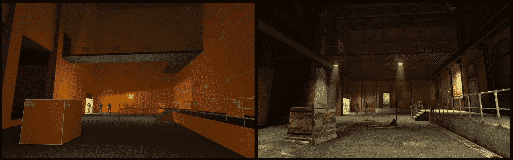

强烈的聚光灯将注意力引向敌人的轮廓；来自 [《功能照明》by Magnar Jenssen](http://magnarj.net/article_funclight.html)

### 4. 细节和氛围照明

精细调整和微调一切，但不要花费太多时间，可能已经足够好，而且如果你调整得太多，可能会破坏之前步骤的效果。

(待办：图片和示例？)

## 常见的照明设计问题

### 光照烘焙后阴影太暗？

您的漫反射纹理可能太暗。如果纹理太暗，那么任何结果的光反弹都会很微弱，无论你的灯光有多亮。除非你有特定的风格或技术原因要这样做，否则你的主要漫反射纹理通常应该在 50-100%的亮度范围内。参见 Rogelio Olguin 的["环境纹理值](https://environmentart.wordpress.com/2016/06/13/texturing-values-for-environments-part-1/) "，以及旧 Epic Games UDK 文档["Epic Games 纹理指南](https://docs.unrealengine.com/udk/Three/TexturingGuidelines.html)"。

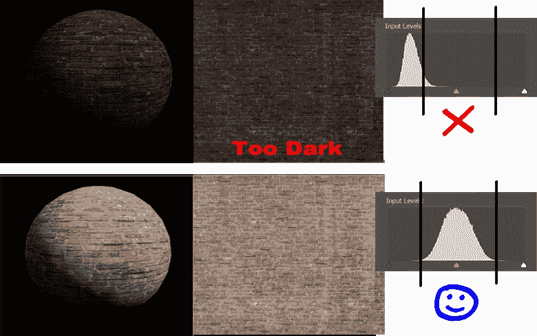

暗色漫反射纹理（顶部）与中等色调漫反射纹理直方图（底部）的比较，来自["Epic Games 纹理指南](https://docs.unrealengine.com/udk/Three/TexturingGuidelines.html)"

比较具有暗色漫反射纹理的场景（左）与中等色调漫反射纹理的场景（右），来自["Epic Games 纹理指南](https://docs.unrealengine.com/udk/Three/TexturingGuidelines.html)"

## 照明示例

TODO：展示不同的环境（工业与住宅）和氛围（恐怖、舒适）

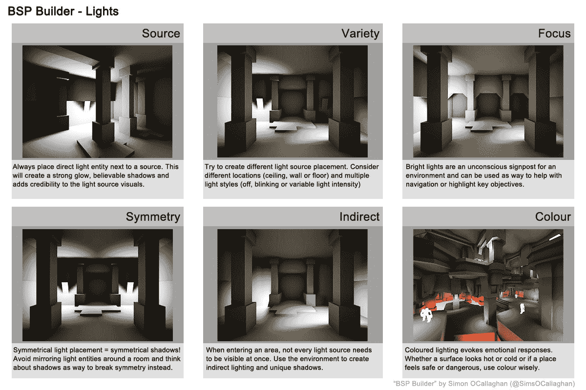

级别设计的照明变化图，由 Simon "Sock" O'Callaghan 制作

## 照明示例：Ratchet and Clank - Rift Apart

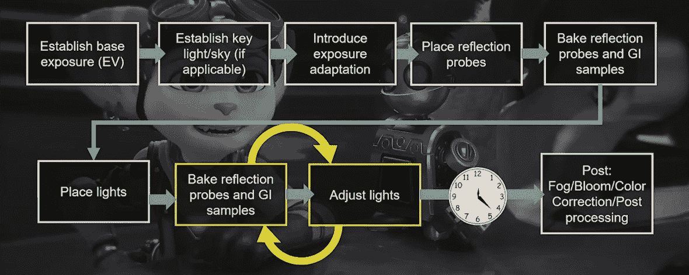

Ratchet and Clank: Rift Apart 的照明工作流程概述，来自 [GDC 2022: Recalibrating Our Limits: Lighting on 'Ratchet and Clank: Rift Apart' (via YouTube)](https://www.youtube.com/watch?v=geErfczxwjc)

## 要回顾...

**照明**为场景提供视觉深度，使玩家能够判断距离和区分形状。因为它在游戏玩法中起着非常重要的作用，你应该在级别设计过程中尽早进行**照明步骤**，在正式的艺术步骤之前。

视频游戏照明技术是一种粗略的幻觉，它近似于现实生活中的光线。许多游戏照明效果实际上并没有使用任何照明系统。

有 4 种核心光源类型：**环境光、方向光、点光源和聚光灯**。这些灯光可以是*静态*的或*动态*的，并由可见的**灯具**驱动，或者*非驱动*，没有任何可见光源。

最常见的照明理论是三点照明，它根据光线相对于相机和主体的方向定义**主光**、**填充光**和**边缘光**。

要照亮一个关卡，逐步进行几个照明遍历。首先做全局照明，然后进行导航照明，接着是游戏照明，最后是任何最后的细节或氛围。

## 现在怎么办？

+   继续阅读环境艺术。

+   照明通常是关卡中性能最重的视觉方面。在照明遍历之后，你将想要进行一个优化遍历。

## 关于照明的进一步阅读

### 游戏照明

+   [《功能性照明》](http://magnarj.net/article_funclight.html)由 Magnar Jenssen 撰写，关于为典型射击游戏玩法提供可读性的照明级别。

+   [《伽玛与线性空间》](https://www.kinematicsoup.com/news/2016/6/15/gamma-and-linear-space-what-they-are-how-they-differ)由 Kinematic Soup 撰写，涵盖了游戏图形中一个重要但常被忽视的方面：色彩空间和伽玛曲线。

+   [GDC 2022：重新校准我们的极限：在《Ratchet and Clank：Rift Apart》中的照明（通过 YouTube）](https://www.youtube.com/watch?v=geErfczxwjc)是关于许多 AAA 照明艺术家今天如何工作的一个很好的概述，其中包含许多流程和迭代示例。

### 通用 CG 照明

+   [Blender Conference 2022：Andrew Price 的真实感照明秘密（通过 YouTube）](https://www.youtube.com/watch?v=Z8AAX-ENWvQ)是一个关于如何为真实感外观照明 3D 场景的视频介绍。色彩温度、衰减、材质和光学/后期处理。

### 现实世界照明设计

+   *《自然光之建筑》，亨利·普卢默著。Monacelli Press：2009*。

+   [《IESNA 照明手册》](https://openlibrary.org/books/OL58383M/The_IESNA_lighting_handbook)，第 9 版（2000 年），由 Mark S. Rea 编著。
