# 🏡环境艺术

> 原文：[`book.leveldesignbook.com/process/env-art`](https://book.leveldesignbook.com/process/env-art)

## 什么是环境艺术？

**环境艺术**（或“环境艺术”）是对关卡或游戏世界的装饰性装饰，同时保留其核心功能性和游戏玩法。

这项工作涉及建立一个模块、道具、纹理、材料和其它艺术资源的库，然后通过绘画/放置装饰来**艺术通行**关卡，以补充底层设计。

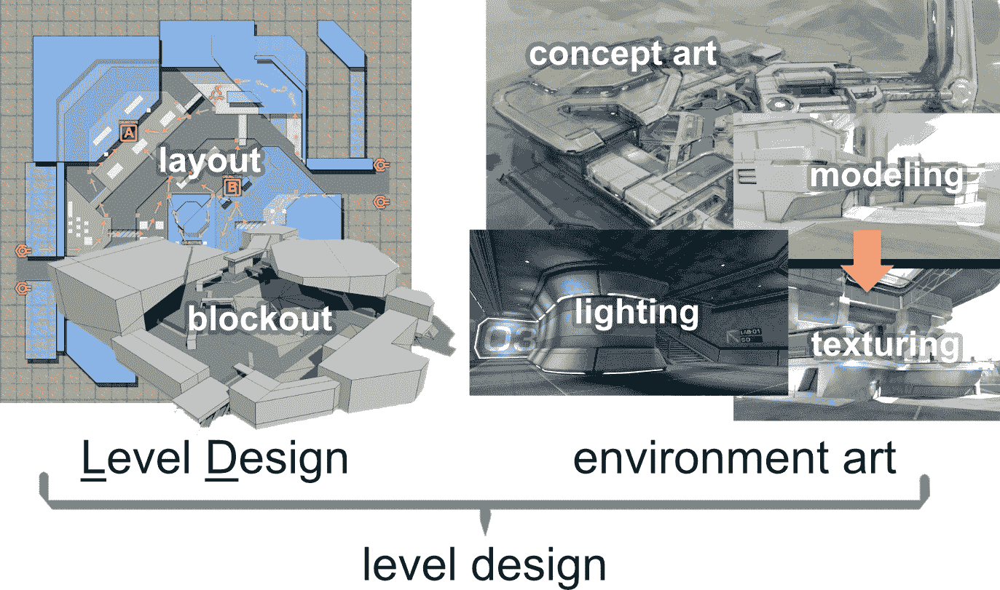

比较关卡设计、Level Design 和环境艺术的图表，使用“尘埃 514”（Dust 514）中“盖伦特研究设施”的过程图像 [由 CCP Games 提供](https://web.archive.org/web/20160305103957/http://dust514.com/news/blog/2013/08/gallente-research-facility/)

在 2000 年之前，关卡设计师经常也制作自己的环境艺术。但如今，关卡设计师通常应该尽可能少地制作视觉艺术，而环境艺术家通常应该在开始艺术通行之前等待成熟的 块选。然而，在小团队中工作时，关卡设计师可能会需要寻找或制作自己的环境艺术，反之亦然。

在这里 **我们将关注一般环境艺术原则** 和高级关注点，以便关卡设计师更好地理解艺术流程并与环境艺术家合作。**这不是一本环境艺术书籍**。

*有关免费纹理、材料和模型的链接，请参阅*资源**.*

*有关专用环境艺术社区、网站和书籍的链接，请参阅*社区**.*

展示“狙击精英 4”（2017）中“死亡风暴”迭代块选和艺术通行的动画 GIF ([通过推特](https://twitter.com/JobsAtRebellion/status/1369307937320144906))

## 如何规划环境艺术

在开始艺术通行之前，你应该能够回答以下问题：

+   *主题。* 关卡的时间、气候和地点是什么？

+   *游戏玩法。* 哪些部分需要强调？哪些应该简单，哪些应该详细？

+   *风格。* 现实主义还是风格化？哪种类型的现实主义，哪种类型的风味？

+   *调色板。* 整体的色彩调色板是什么，氛围是怎样的？有哪些形状？

+   *制作。* 哪些部分需要先做，哪些应该最后做（或永不）？

*有关规划更多信息，请参阅*前期制作* 和 *研究**.*

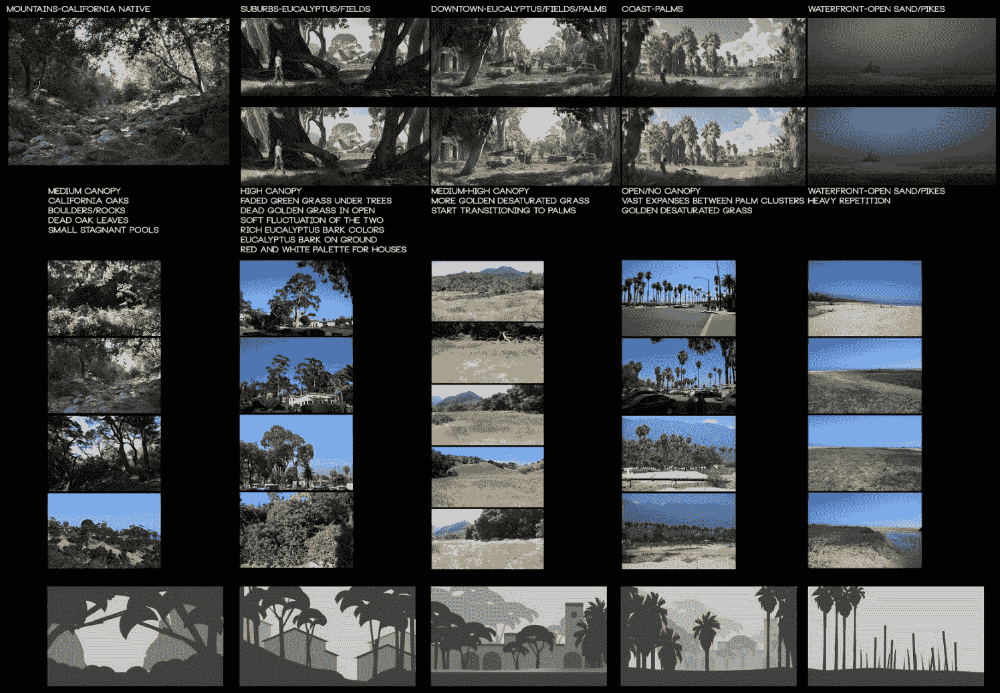

《最后生还者第二部》（2020）的内部概念艺术、参考照片和轮廓研究，由约翰·斯威尼 [在推特上](https://twitter.com/johnsweeney2147/status/1280646295837802496) 发布的板图

### 概念艺术

**概念艺术**通常是指用于规划游戏但不在游戏中使用的任何视觉艺术。

有时概念艺术的目标是传达一个期望的主题或整体氛围，而有时它必须传达艺术资源的技术规范和细节。问问自己，这个概念艺术是为了启发，还是试图解决一个特定的视觉设计问题？

启发性的氛围艺术在前期制作（尤其是在向发行商推销商业项目时）或早期制作阶段非常有用，但详细的技术艺术在后期制作中更有用。

**如果你使用了某人的概念艺术，请给予他们信用**——甚至在开始之前联系艺术家并请求许可。如果你在找工作，归因非常重要；每个人都认识每个人，未能给予某人信用将看起来像是一个红旗。

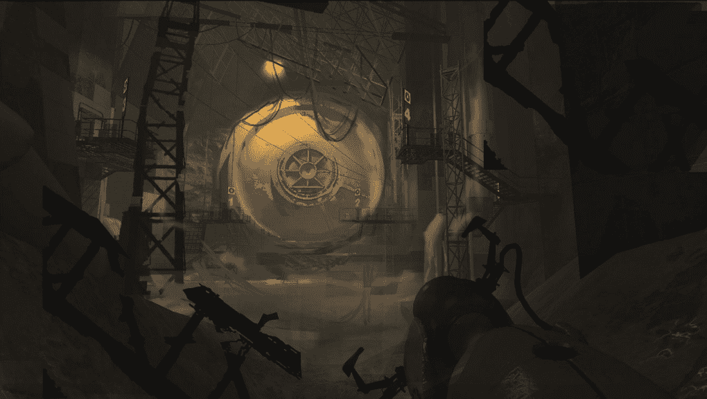

Portal 2（2011）地下金库环境概念的第一人称概念艺术（涂鸦？）

### 涂鸦

**涂鸦**是一种概念艺术，它从 3D 截图开始，然后艺术家实际上“涂鸦”在底图上，以可视化下一个版本。

在计划艺术流程时，涂鸦一个块状截图是非常常见的。这种工作流程可以节省大量时间，因为艺术家不需要手动绘制基本形状的透视计算。因此，即使是 2D 艺术家也应该至少有一些基本的 3D 艺术工具知识，这样他们就可以潜在地为自己的涂鸦构建块状图。

有时艺术家会完全渲染一些看起来完成的最终概念艺术（见上图）...但通常涂鸦是为了在艺术家之间提供直接的反馈：建议的编辑、纠正和注释（见下图）。

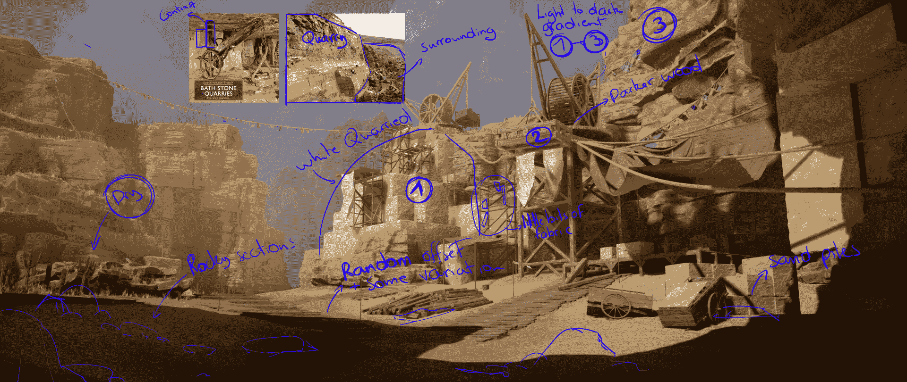

由 Adam Dencker 创作的“The Quarry”的涂鸦注释（通过 Artstation.com）[(via Artstation.com)](https://www.artstation.com/blogs/bronzegear/wdw2/the-quarry-pt6)

### 模型图

**模型图**是一种针对单个艺术资源的更具体的概念艺术，它包括用于生产艺术家的正交视图，以及用于展示该资源在游戏内如何使用的上下文模拟图。

在下面的概念艺术/模型图中，注意我们如何获得一个很好的感觉，了解这个八角形冰晶平台模型将如何融入整个环境主题。此外，正视图和俯视图回答了道具艺术家的关于结构和颜色的疑问，并且可以轻松地作为参考引入 3D 建模工具。正视图强调了每个平台的金色角落装饰，而右下角的插图显示了角落装饰如何拼接在一起以产生互锁的视觉效果——共同，它帮助环境艺术家了解哪些细节需要保留并传递到游戏资产中。

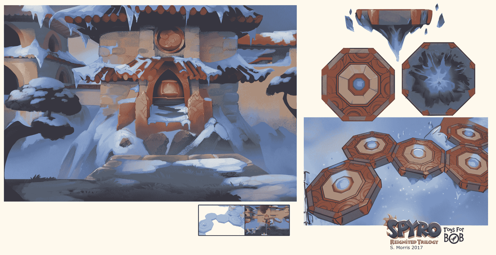

结合概念艺术、模型图和涂鸦[由 Sarah Morris](https://twitter.com/BraveRobynArt/status/1316108592857124864/)为 Spyro: Reignited

## 艺术资产

经过一些规划，艺术家制作艺术**资产**——可以直接插入到关卡中的视觉对象。与概念艺术不同，这是游戏引擎必须读取的内容，玩家在游戏中将看到的内容。

在制作艺术资产时，请记住：

+   **任务说明**。任务是什么？这个资产需要做什么？

+   **审批**。谁会对这个资产提供反馈？我们将如何知道它是否有效？

+   **范围**。制作这个资产需要多少时间？小而罕见的细节需要较少的时间。

+   **工作流程**。制作这个资产需要多少步骤？在哪些工具中？

+   **流程**。如何将艺术导出为引擎可以读取的格式？

对于长期项目（6 个月以上）和大型团队（6 人以上？），应该正式化这一艺术制作流程，以避免昂贵的重做、浪费的工作和沟通不畅。维护一个电子表格或看板来跟踪任务，并将每个资产通过不同的测试和团队审查阶段。虽然一开始这些任务跟踪可能感觉比较慢，但从长远来看，沟通和清晰度会更快。

*有关组织工作任务和团队沟通的更多信息，请参阅* *生产**.*

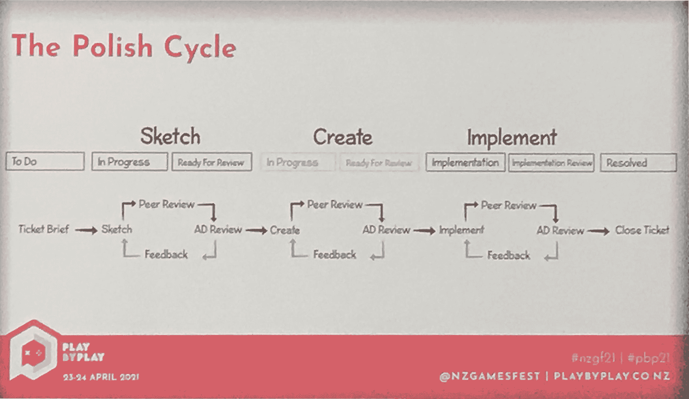

art production process diagram with three review stages, from "Be your best you by critiquing everything your workmates do" by Hannah Mackintosh for Play By Play 2021

大多数关卡的艺术资产要么是 2D 纹理，要么是 3D 模型，但在这个部分我们也会简要地谈谈着色器和特殊效果。

### 资产清单

在制作环境艺术之前，你可能需要制作一个**资产清单**，列出特定场景或关卡所需的所有艺术资产。资产清单通常以某种电子表格格式存在，列出每个资产的优先级和估计制作时间。

在下面的图片中，艺术家制作了一个按月份/周分组的项目清单电子表格。他们估计每周有大约 30 小时的工作时间，并将场景区块/最重要的级别几何资产优先考虑。材质和细节道具仅在基础设置之后进行。

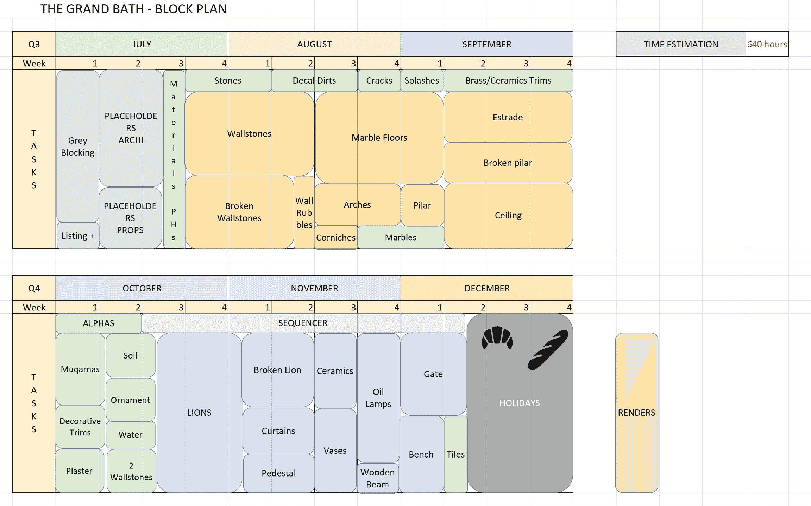

一个 3D 场景“大浴场”的资产清单/日历/“区块计划”，由 Vincent Dérozier 创作，[通过 ArtStation](https://www.artstation.com/artwork/RnagAO)

### 材质和纹理

**纹理**是覆盖地图 3D 表面的 2D 图像。自 2000 年代以来，我们经常将多个纹理组合在一起形成**材质**，这些材质包含额外的数据，如粗糙度、光泽度、光发射等。

对于环境艺术，纹理设计和布局非常重要。与角色皮肤不同，我们经常在各个级别中大量重用世界纹理。理想的环境纹理需要在许多不同情况下都能很好地工作：它应该能够在表面上很好地平铺，同时也容易分割成可重用的部分。

*有关纹理和材质定义的更多信息，请参阅* *纹理**。

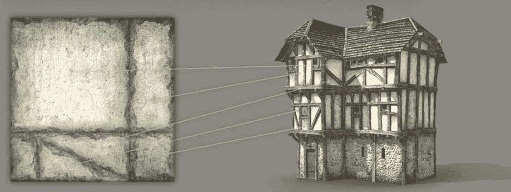

从《剑与盾》中纹理映射中世纪房屋

### 模块化套件

**模块化套件**是由**模块**组成的 3D 瓦片集，这些模块是设计成可以以多种方式拼接的环境网格。模块对于沿网格重复使用的建筑和结构最为有效，但对于有机或自然形状则不太适用。

*有关如何规划、测量和构建套件的信息，请参阅* *模块化套件设计**。

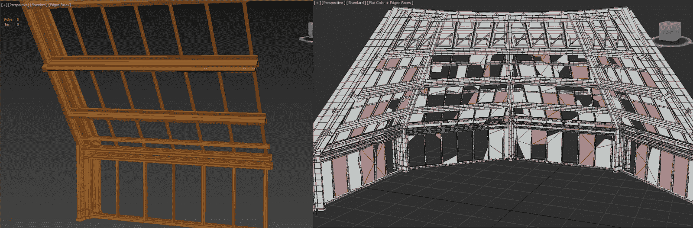

重复使用模块化墙段（左侧）来构建圆形房间（右侧）；[由 Lea Kronenberger 提供示例](https://www.beyondextent.com/articles/balancing-modularity-and-uniqueness-in-environment-art )

在许多情况下，模块化网格无法干净地连接，尤其是如果你在非网格或非 90 度角上构建。尽管如此，你可能仍然希望保留某些角度或奇数长度，出于度量原因或为了唤起粗糙、脏乱的非制造自然感。在这些情况下，只需让模块自由相交，然后用另一个物体覆盖杂乱的交汇处。

例如，假设你有两个矩形地板网格以奇角相遇 -- 尽可能地安排它们无缝连接，然后用墙壁、柱子、岩石、板条箱、汽车等覆盖交汇处。问题解决！

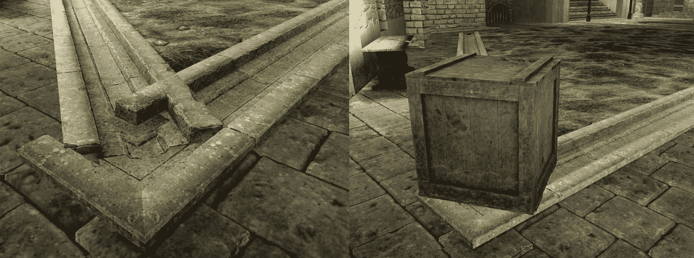

如何以奇特的角连接两个模块？只需掩盖混乱！[图片由 Joe Wintergreen 提供](https://twitter.com/joewintergreen/status/839960782364299265)

### 英雄道具/地标

英雄道具/建筑应该使关卡中的一个重要地点有立足之地

不要将英雄资产放在不好的地方...不要在垃圾箱里弹吉他独奏，它只是一个垃圾箱，继续你的生活吧

对于多人地图，独特的地标给一个区域赋予了身份，并有助于促进**呼叫**，即玩家可以用来快速讨论地图不同部分的简短、易于记忆的昵称。

下面是 Lydia Zanotti 为地图 Breeze 上的 B 站点设计的英雄资产。这个大塔看起来很重要，正在使用中，其独特的深色金属机械与米色的废墟形成对比。设计支持游戏背景故事，即“镭射石”（发光的青绿色物质）是一个重要的资源，需要控制，以及一个游戏功能，使其底部区域没有分散的形状或轮廓。最重要的是，在整个地图中只使用一次，使该区域感觉特别且独特。

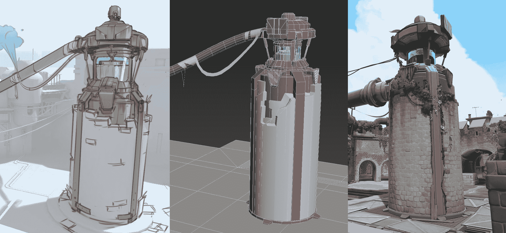

paintover 概念艺术，初版模型，以及最终艺术关卡为《 Valorant》[由 Lydia Zanotti 提供](https://twitter.com/PHRISK3D/status/1397187194096291840/)

### 细节（道具、植被、杂乱、场景布置）

#### 树木

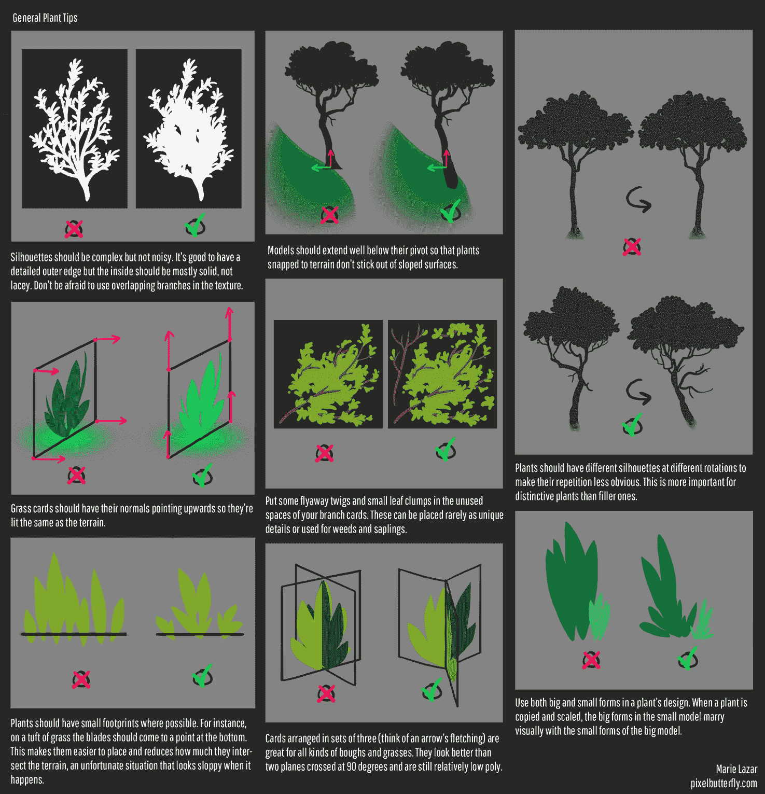

一般植物提示教程图片[由 Marie Lazar (pixelbutterfly.com)提供](https://pixelbutterfly.com)

对于高大的森林树木，不要在每个树干上放置树冠，并确保树基部分有细节[`www.gamasutra.com/blogs/DannyWeinbaum/20170216/291658/Art_Tips_for_Building_Forests.php`](https://www.gamasutra.com/blogs/DannyWeinbaum/20170216/291658/Art_Tips_for_Building_Forests.php)

## 可读性

**可读性**是指玩家能否在你的关卡中四处走动并“阅读”他们所看到的内容。简化玩家必须看到的内容。使其易于阅读。

目标是让玩家理解整个关卡作为一个整体的地方，而不是一堆随机的楼层和墙壁部分。

+   玩家是否有足够的信息来理解当前的游戏状态？

    +   他们能否从远处轻易地看到敌人/游戏对象？

    +   他们能否理解那个敌人是空闲的、愤怒的，还是受伤的？

+   玩家能否理解他们可以去哪里，不能去哪里，应该去哪里，还是不应该去哪里？

当关卡以抽象的 blockout 形式开始时，它非常简单且易于阅读。然而，当我们向世界中添加更多的视觉细节时，关卡几何形状变得不那么明显，更加嘈杂。一个“繁忙”的艺术关卡将会变得“难以辨认”且难以阅读。

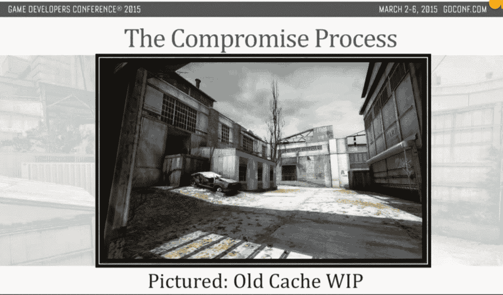

由肖恩·斯奈林创作的动画 GIF 展示了《反恐精英：全球攻势》中 de_cache 的视觉发展和可读性，来自 2015 年 GDC：为竞技 CS:GO 的社区关卡设计

在上面的动画 GIF 中，注意 CS 地图 de_cache 如何从暗色调高对比度、细节繁多的关卡转变为亮度更高、色调更均匀、视觉对比度更低的关卡——这种对可读性的让步对那个游戏和观众来说是合理的。

一些游戏，如逃脱房间、隐藏物体游戏和寻宝游戏，都关乎于解析繁忙杂乱空间的乐趣。然而，像《反恐精英》或《无畏》这样的快节奏多人射击游戏则高度依赖于瞬间反应瞄准和迅速判断，这些玩家可能会将失败归咎于难以阅读的关卡。

当你绘制关卡并应用装饰时，这些细节的累积会影响玩家对空间的理解。

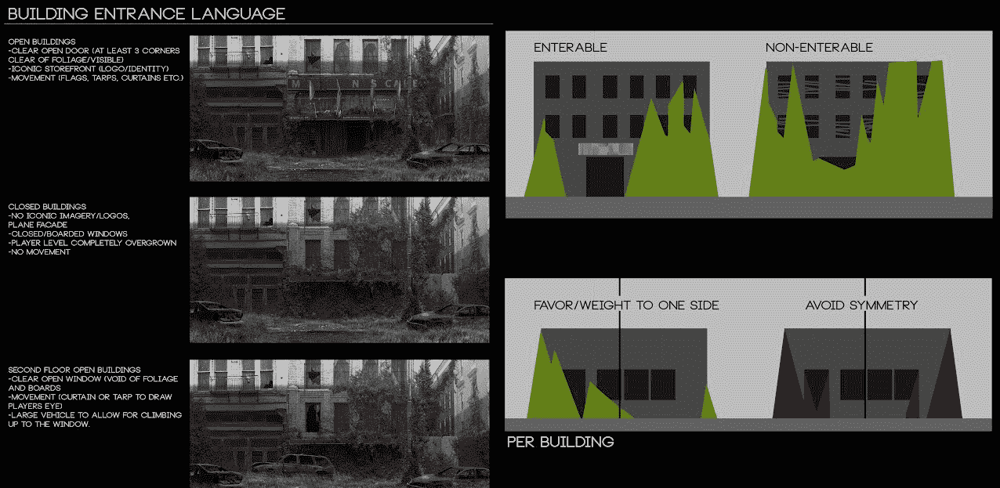

《最后生还者第二部》（2020 年）中常春藤可读性的内部风格指南 [由约翰·斯威尼](https://twitter.com/johnsweeney2147/status/1280646295837802496/) 提供

例如，当绘制《最后生还者第二部》中的环境时，顽皮狗艺术家使用了常春藤覆盖（见上图）来表示被忽视的封闭建筑，而为玩家应该进入的开放建筑清除常春藤。同时注意常春藤如何使建筑立面扁平化。玩家不再需要检查每个窗户来猜测它是否可导航或相关——被常春藤完全覆盖的建筑意味着它是关闭的，并变成一个绿色团块。因此，常春藤简化了视觉环境，并为玩家提供了导航辅助。只要所有设计师和艺术家在如何使用常春藤方面保持一致性，这种装饰性叶状效果就超越了视频游戏看起来多么花哨和昂贵的新意义。

但这里有一个秘密：一切都是常春藤，**环境艺术中的每一项元素都具有可读性功能**。当你绘制关卡中的任何部分时，你正在细化帮助玩家理解空间逻辑的视觉模式。

**可读性也严重依赖于** *体量*、*度量* 和 *构图*。

### 聚类

为了帮助玩家更容易地解析和理解游戏世界，尝试将装饰组合成相关细节的集群。邻近性、相似性和暗示的关联性帮助我们将物体视为群体和模式。这对应于感知的[格式塔理论](https://en.wikipedia.org/wiki/Principles_of_grouping)。

要制作岩石露头，放置一块石头，然后复制、缩小、旋转并稍微偏移...然后重复。要制作森林，放置一棵树，然后复制、缩小、旋转并稍微偏移...然后重复。你可以重复此工作流程来制作任何类型的自然装饰，或者甚至你的景观构图。尝试以不对称的分形结构构建这些构图，以给道具放置带来重复的逻辑和一致性。

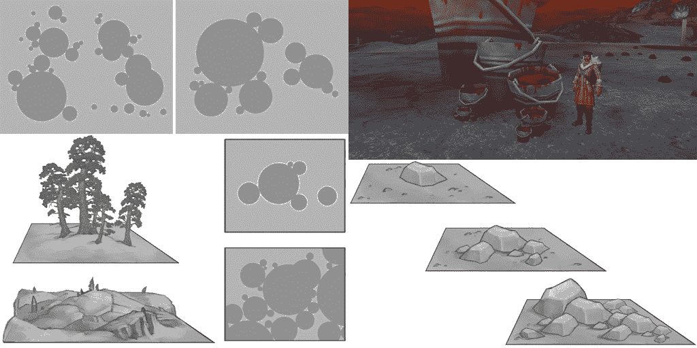

“分形”岩石、树木、地形甚至桶的簇，来自《Allods Online》艺术圣经[由安东·拉夫鲁申金](https://shurick.livejournal.com/195876.html)

### 色彩与价值

避免过度饱和的颜色，为光照留出空间...如果你制作一个非常红色的纹理，它不可能变得更红。一些游戏也可能保留特定的颜色编码（只有爆炸桶是红色的！只有门可以是蓝色和橙色！）

渐变平滑（不是嘈杂）但仍然避免平坦（存在层次）

在下面的示例 GIF 中，可以看到《守望先锋》地图“Castillo”的纹理，注意地面通常比周围的墙壁暗；墙壁纹理简单，细节最少；红色和粉色通常保留用于地板和屋顶平面。

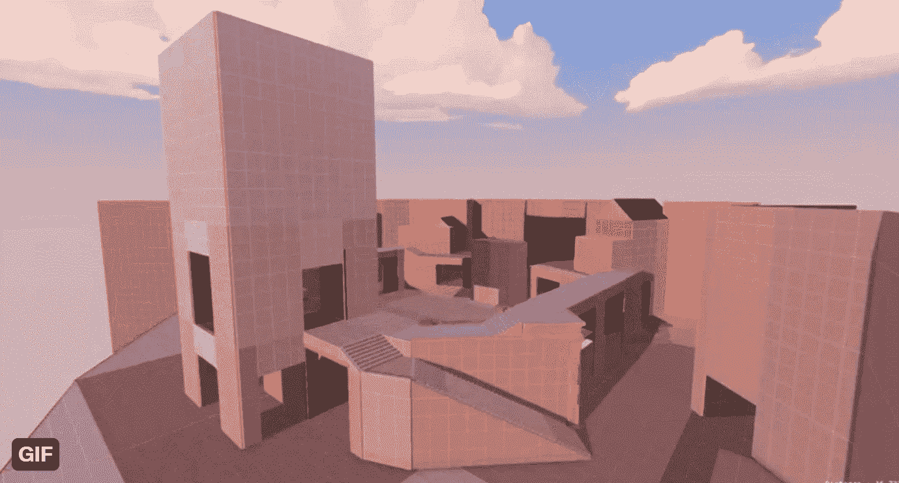

地图“Castillo”从草图到艺术流程的对比 GIF 示例[由 Helder Pinto](https://twitter.com/HelderHP/status/1454561504473141251)（以及其他人），用于《守望先锋》

### 材料性

材料是将一组纹理导入游戏引擎的特定技术术语——但更广泛地说，“材料”也指**材料性**——由视觉表面代表的一般感觉、物质、质量和物理物质。

理想情况下，环境纹理应该读作一个独特的真实世界材料。这种纹理是否真的感觉像是用砖或石头制成的？它是否过于光滑以至于感觉像混凝土？玻璃或木材是否感觉脆弱或坚固？能够读取材料对于游戏玩法通常很重要；例如，脚步声和子弹穿透是战术射击游戏中的常见机制，并且依赖于玩家理解他们所踩踏的/射击的材料。

作为一般规则，大多数艺术家都努力制作出由清晰且独特的材料制成的纹理。木材纹理即使在 50 米外也应该看起来像木材，而闪亮的金属纹理应该与闪亮的塑料纹理感觉不同。

*关于纹理和材料的更多信息，请参阅* *纹理**.*

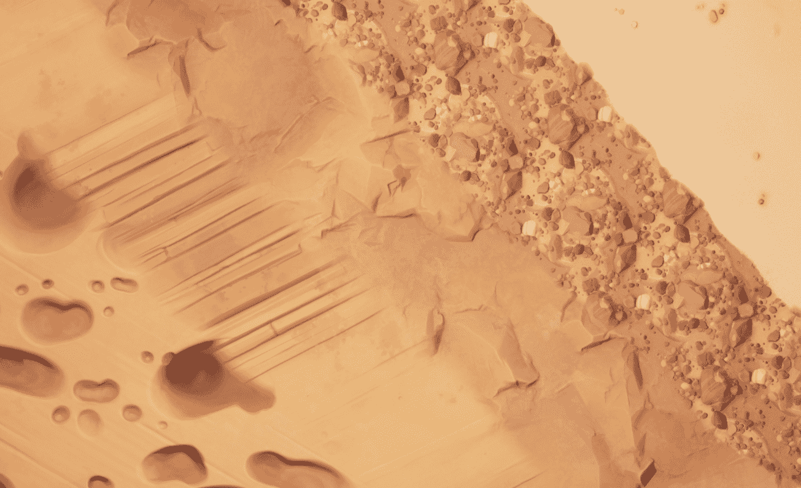

*不同的世界纹理传达不同的表面属性和材料；纹理* [*由玛丽·拉扎尔（来自 80 Level）*](https://80.lv/articles/creating-a-stylized-chaparral-environment-in-ue4/)

### 避免形状和颜色心理学

**形状与色彩心理学**是理论，认为形状/颜色传达普遍的思想并影响行为。

当艺术家们常常渴望对人们拥有秘密的力量时，我们争论说**形状与色彩心理学对关卡设计并不有效**。抽象的几何形状和颜色本身并不能让所有人类产生相同的感觉，也不能传达相同的思想。这些简单的理论未能捕捉艺术和文化的丰富复杂性，误解了基本心理学，并掩盖了更多有用的设计工具。没有它们你会更好。

*更多内容，请参阅* *形状与色彩心理学**。

## 如何进行艺术处理

接近艺术处理的方法有很多，但以下是一些建议：

+   **分阶段迭代工作**，不要试图制作每个资产的 100%最终版本。你需要看到艺术资产将如何相互关联，在上下文中，才能知道一个资产是否“完成”。当被游戏世界中的其他艺术作品包围时，有时一个 50%完成的艺术资产实际上可以是 100%“足够完成”的。

+   **有重点地进行艺术处理**，不要只是随意地处理随机区域的随机部分。尝试在关卡的具体部分、具体方式或主题上推进进度，这样你可以对你的更改获得反馈。如果你以无序的方式随意进行艺术处理，那么其他人给你反馈会更困难。

+   **从大处着手**，将更小的细节留到后期艺术阶段。首先定义你的基本形状、体量、色彩调色板和主要主题。然后在掌握所有基础之后，你最终可以开始雕刻鹅卵石或绘制磨损痕迹。

对于下面的每个动画 GIF 示例，尝试计算艺术处理迭代的次数。

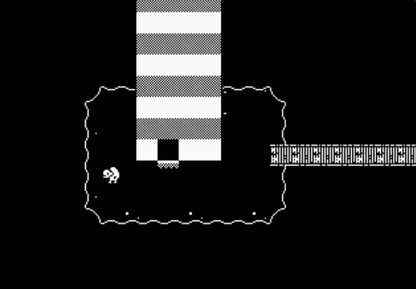

2D 像素艺术游戏 Minit 的艺术处理系列，由 Kitty Calis 发布[(via Twitter)](https://twitter.com/kittycalis/status/981577805992484866) 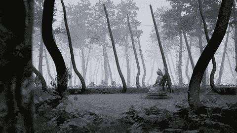

Kieran Goodson 的系列艺术处理和迭代作品，用于作品集[(via 80 Level)](https://80.lv/articles/001agt-004adk-3d-environment-design-symbols-breakdown/)

### 制作道具动物园/仓库/展示地图

与度量游乐场地图和模块化套件回环测试类似，验证环境艺术的最佳方式是尝试在游戏中使用它。**制作一个包含每个道具/艺术资产的场景或关卡，并在其中四处走动**。

Caravan Sandwich 的艺术总监 Charles Boury 为展示提供了以下建议：

> *我通常创建：为每个角色创建 ShowcaseCharas，为每个游戏道具创建 Ikea 风格的 ShowcaseProps 概览，为每种材料在不同光照条件下的网格视图创建 ShowcaseMats，以及为可以玩转每个 UI 元素的场景创建 ShowcaseUI*。
> 
> *注意“每个”这个词。详尽的列表让你能够监督游戏内容并建立信心。当你处理，比如说，拾取用户界面时，你可以用所有可拾取的项目来测试它。当你问自己，“角色上是否使用了红色？”或者当团队问你一个具体的问题，比如，“有多少道具使用复杂碰撞而不是简单碰撞，为什么？”时，你可以自信地回答。*

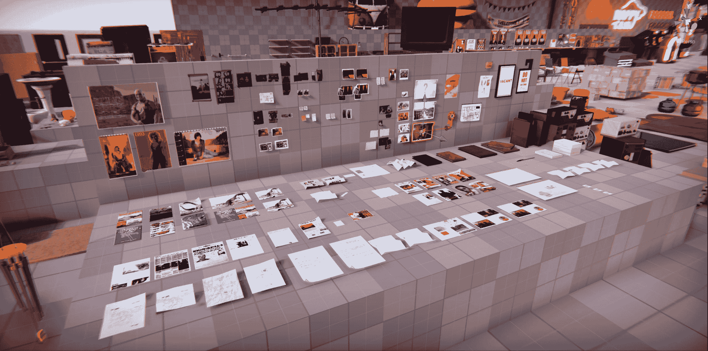

Road 96 的 ShowcaseProps 场景的内编辑器截图，由查尔斯·博伊提供，[“场景设置的艺术指导”](https://charlesboury.fr/articles/scene-setup-for-art-direction.html)

> *作为一名艺术总监，我正在推动一种特定的风格。我不专注于单个道具或角色。我一直在寻找大局，艺术上的统一。那么，我如何使自己的生活更容易实现这个目标呢？*
> 
> *我想看到所有道具的有序排列，以检查它们的调色板、轮廓和细节水平。一个漂亮的仓库会整洁，所有游戏道具都按类别整齐地排列在网格上，这样我就可以比较它们并选择要改进的一个。游戏中的哪些部分需要更多的统一性？我如何利用这个套件创造一些独特的东西？*
> 
> -- 查尔斯·博伊，来自 ["场景设置的艺术指导"](https://charlesboury.fr/articles/scene-setup-for-art-direction.html)

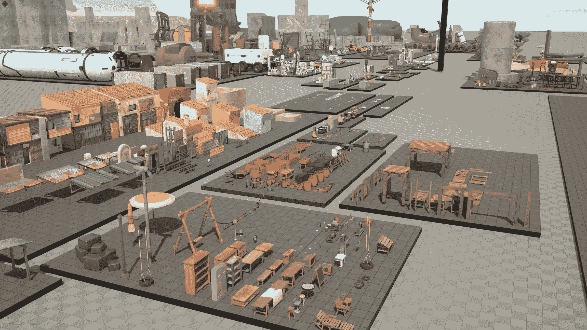

Caravan Sandwich 的道具仓库测试关卡的内编辑器截图，由查尔斯·博伊提供，[“场景设置的艺术指导”](https://charlesboury.fr/articles/scene-setup-for-art-direction.html)

## 示例艺术流程

### "Icebox" for Valorant (Riot Games)

因为《 Valorant》是一款依赖精确地图平衡的竞技型多人射击游戏，Riot 对其艺术流程进行了调整，以尽可能保留关卡设计师的初步设计。在进入艺术制作和细化阶段之前，Valoant 地图会经过为期一个月的详细灰色测试（blockout) 和 playtest 阶段，以及几个初步的 *艺术初步设计* 测试，以测试颜色样本和 massing。这种 *艺术初步设计* 为关卡设计师提供了额外的时间来对关卡几何形状进行更多修改，并将这些调整以最小的浪费反馈给艺术家。延长初步设计阶段可以改善最终的艺术流程，并促进部门之间的更多合作。

> 在 3D 艺术家能够接触地图之前，我们的艺术总监和创意总监与概念艺术家紧密合作，通过一系列天马行空的构想来迭代寻找我们地图的标志性外观。在这个阶段，艺术家和项目领导之间有很多来回沟通，以确保地图遵循《VALORANT》的叙事，具有视觉多样性，最重要的是，确保团队真正兴奋于这项工作。
> 
> 在确定高级方向后，概念艺术家开始根据灰盒布局处理地图上的特定位置和标注。在这个阶段，概念艺术家试图在 3D 艺术家开始建模建筑的基本形状之前，在地图上覆盖尽可能多的内容。

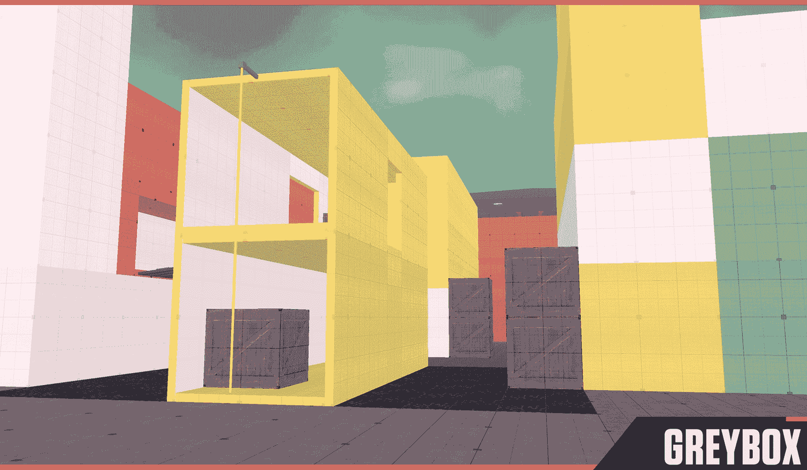

Valorant 地图 Icebox 的“灰盒”到“艺术草图”再到“艺术制作”的工作流程 [(via PlayValorant.com)](https://playvalorant.com/en-us/news/dev/the-art-of-valorant-map-environments/)

> 我们试图在开始展开和纹理化之前，将基本的建筑形状建模到地图中。当我们开始在网格上添加颜色时，我们确保它们不要太暗，特别是在室内空间中。这里的目的是通过确保环境不会阻碍清晰度，并且角色始终清晰可见来维护游戏完整性。
> 
> 在纹理方面，我们主要在建筑和大型结构上使用拼接纹理和裁剪图。这些是通过 Zbrush、Substance Designer、Substance Painter 和 Photoshop 等多种程序创建的。当需要时，我们也会在道具上使用自定义纹理，例如厨房中的咖啡机或 A 点附近的叉车。
> 
> [...] 为了减少视觉噪音，我们确保我们的材料在价值上相似，并且没有太多的对比度或暗度。我们还可以通过使用灯光照亮暗区，或者突出显示你希望尽可能可见的空间，如刺球植物地点或常见的窥视角落，来提高清晰度。
> 
> -- 来自 [《《VALORANT》地图环境艺术》](https://playvalorant.com/en-us/news/dev/the-art-of-valorant-map-environments/) by Lydia Zanotti

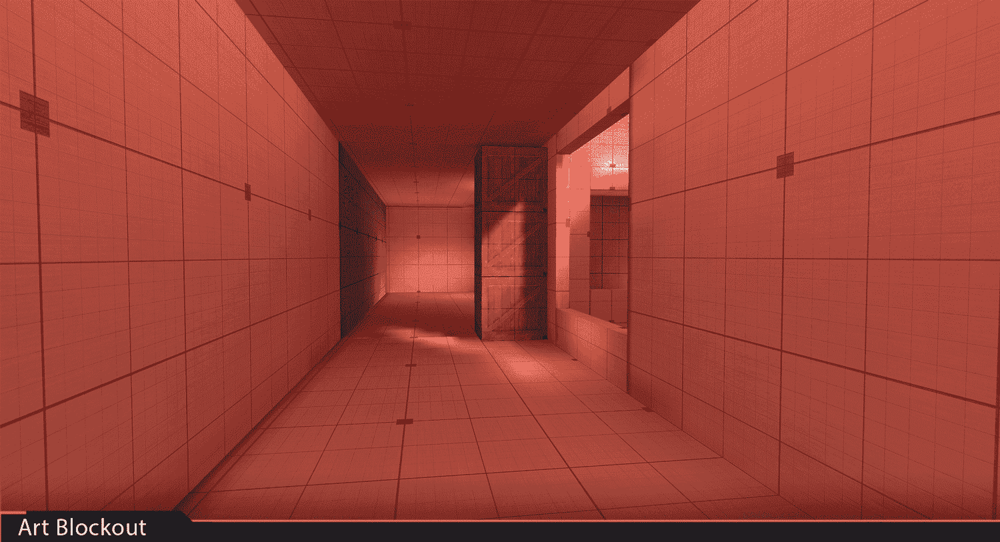

“冰箱”中“厨房”区域的进展，从草图到艺术草图；走廊变成了房间！[(via PlayValorant.com)](https://playvalorant.com/en-us/news/dev/the-art-of-valorant-map-environments/)

## 要审查...

**环境艺术**是关于装饰和细化关卡视觉的。

工业艺术家倾向于通过**概念艺术**、**涂鸦**和**模型图集**进行大量规划。基于这些计划，他们生成**资产清单**，以便确定他们需要完成多少工作。

常见的环境艺术**资产**包括**世界纹理**、**模块化套件**、**英雄道具**以及像植被和杂乱无章的**场景布置**道具。

在制作资产时，艺术家应该考虑**可读性**：一个物体的视觉外观如何暗示其功能（功能性和实用性）。为了提高可读性，将细节**分组**在一起，注意**色彩和明度**，并确保**材质**清晰可读。

我们强烈**反对****形状和色彩心理学**。

**如何进行艺术处理**：

+   首先关注交换进重要的核心对象/形状

+   不要试图逐个完成每个资产 100%，相反，最好是**迭代式工作**：让多个对象达到 50%，然后退后一步进行评估

## 现在怎么办？

+   继续阅读到**发布**。

+   ~~停止阅读关卡设计书，去找一本环境艺术书/网站学习吧~~。

+   想要更详细地了解环境艺术的一个特定方面，请阅读更多内容...

### 环境艺术细节

工作环境艺术家通常专注于一个方面：

+   **建模和雕刻**。硬表面建筑和道具，还是自然和植被？

+   **光照**极大地影响了玩家对形状、深度、空间和氛围的感知。

    +   *那面墙是远还是近？这个房间是浅还是深？它可怕吗？*

+   **纹理化**对于读取形状、表面和材料非常重要。

    +   *那面墙是由木头还是金属制成的？... 外星金属？附近有外星人吗？*

**叙事**和场景布置赋予了一种场所感/居住感。

在艺术处理之后，关卡通常需要**优化**。

## 进一步阅读

记住，这是一本关卡设计书，而不是环境艺术书。你绝对应该去其他地方学习更多。

+   关于环境艺术网站的链接，请参阅社区：环境艺术。

+   [环境艺术博客](https://environmentart.wordpress.com/)由 Rogelio Olguin 撰写（自 2016 年起已停更，但仍有很多好内容）
