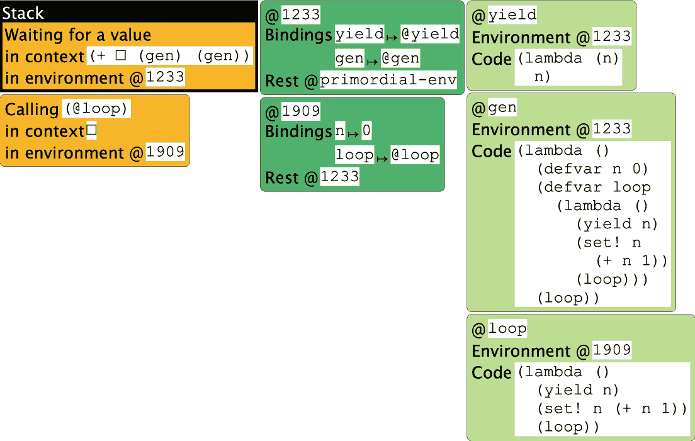
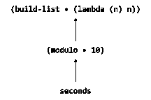

## 扩展表示

因此，让我们思考一下评估函数作为值到 SMoL 需要什么。我们不需要函数本质上有一个名称，因为命名可以通过 `let1` 完成。为了简单起见，我们假设所有函数只接受一个参数；将其扩展到多个参数留作练习。

练习：当我们从只有一个参数的函数扩展到多个参数的函数时，我们可能需要处理哪些问题？

首先，我们需要扩展我们的抽象语法。

现在就做：我们需要添加多少新构造到抽象语法中？

当我们添加 `let1` 时，你可能还记得，仅仅添加一个构造是不够的；我们需要两个：一个用于变量绑定，一个用于变量使用。当你向语言添加值时，你经常会看到这种模式。对于任何新的值类型，你都可以期待看到一种或多种创建它的方法，以及一种或多种使用它的方法。（甚至算术：数字常量是创建它们的一种方式，算术运算消耗了它们——但也创造了它们。）

同样，对于函数，我们需要一种方式来表示两种

```
lam(x): x * x
```

用于定义新函数，并且

```
sq(3)
```

使用它们。

术语：在更高级的文本中，你有时会看到（形式上正确，但可能有些令人困惑）的术语引入和消除：引入将新概念引入，消除使用它们。因此，`lam` 引入新函数，而应用消除它们。

因此，我们添加

```
  [lamE (var : Symbol) (body : Exp)]
  [appE (fun : Exp) (arg : Exp)]
```

到我们的 AST。

假设我们已经扩展了我们的解析器，因此以下程序是合法的：

```
{let1 {f {lam x {+ x x}}}
      {f 3}}
```

```
{let1 {x 3}
      {let1 {f {lam y {+ x y}}}
            {f 3}}}
```

这些分别解析为

```
(let1E 'f (lamE 'x (plusE (varE 'x) (varE 'x))) 
       (appE (varE 'f) (numE 3)))
```

```
(let1E 'x (numE 3) 
       (let1E 'f (lamE 'y (plusE (varE 'x) (varE 'y))) 
              (appE (varE 'f) (numE 3))))
```

它们都应该评估为 `6`。

## 评估函数

现在让我们考虑评估器，到现在我们可以将其视为成为一个完整的解释器。

让我们从（几乎）最简单的新程序类型开始：

```
{lam x {+ x x}}
```

它被表示为

```
(lamE 'x (plusE (varE 'x) (varE 'x)))
```

现在就做：我们希望这个程序评估为什么？从类型的角度思考！

记住 `calc` 产生数字。上述表达式评估为多少数字？你期望它产生多少数字？

如果我们真的想提高我们的可信度，我们可以在数字中编解码它，或者使用内存中的数字。但这两种都不是我们预期的！让我们看看其他语言是如何做的：

```
> (lambda (x) (+ x x))
#<procedure>
> (number? (lambda (x) (+ x x)))
#f
```

```
>>> lambda x: x + x
<function <lambda> at 0x108fd16a8>
>>> isinstance(lambda x: x + x, numbers.Number)
False
```

Racket 和 Python 都同意：创建匿名函数的结果是函数类型的值，而不是数字。这意味着我们必须扩大 `interp` 可以产生值的类型。

术语：副作用是指从函数体外部可见的系统变化。典型的副作用包括对函数外部定义的变量的修改、与网络的通信、文件更改等。

术语：一个函数是纯函数，如果对于给定的输入，它总是产生相同的输出，并且没有副作用。在现实中，计算总是有一些副作用，比如能量的消耗和热量的产生，但我们通常忽略这些，因为它们是普遍存在的。然而，在少数情况下，它们可能很重要：例如，如果可以通过测量这些副作用来窃取加密密钥。

术语：传统上，一些语言已经使用了“过程”和“函数”这两个术语来表示类似但不完全相同的概念。两者都是类似于函数的实体，封装了一组代码，并且可以被应用（或“调用”）。过程是一个不产生值的封装；因此，它必须具有副作用才有任何用处。相比之下，函数总是产生一个值（并且可能期望没有副作用）。这个术语在多年中已经完全混乱，现在人们可以互换使用这些术语，但如果有人似乎在两者之间做出区分，他们可能意味着类似于上述内容。

## 扩展值

当评估一个函数时会发生什么？Racket 和 Python 似乎都表明我们会返回一个函数。

我们可能没有关于函数的额外信息：

```
(define-type Value
  [numV (the-number : Number)]
  [boolV (the-boolean : Boolean)]
  [funV])
```

（这种语法意味着 `funV` 是一个无参数的构造函数。它传达的信息仅限于它是一个 `funV`；因为我们不能混合类型，所以它特别说明一个值既不是数值也不是布尔值——仅此而已。）但现在想想这样的程序（假设 `x` 已绑定）：

```
{{if0 x
      {lam x {+ x 1}}
      {lam x {- x 2}}}
 5}
```

在这两种情况下，我们都会得到一个没有任何额外信息的 `funV` 值，所以当我们尝试执行应用时，我们……不能。

而实际上，函数值需要告诉我们关于函数的信息。我们需要知道主体，因为那是我们需要评估的；但主体可以（并且很可能）引用形式参数的名称，因此我们也需要那个。因此，我们真正需要的是

```
(define-type Value
  [numV (the-number : Number)]
  [boolV (the-boolean : Boolean)]
  [funV (var : Symbol) (body : Exp)])
```

在这个阶段，我们似乎白费了很大力气。我们取了数值和布尔值，只是简单地用新的构造函数重新包装它们，现在我们又为函数做了同样的事情。某个莎士比亚戏剧的标题浮现在我的脑海中。

耐心。

就我们所拥有的，我们已经有了一个功能性的解释器。lam 情况显然非常简单：

```
    [(lamE v b) (funV v b)]
```

应用案例稍微详细一些。我们需要：

1.  评估函数位置，以确定它的值类型。

1.  评估论证位置，因为我们已经同意在 SMoL 中会发生这种情况。

1.  检查函数位置是否确实评估为一个函数。如果不是，则引发错误。

1.  评估函数的主体。但由于主体可以引用形式参数…

1.  …首先确保形式参数绑定到实际参数的值。

分阶段地编纂这一点：

`[(appE f a)` (let ([fv (interp f nv)])

[av (interp a nv)])

…`)]`

```
    [(appE f a) (let ([fv (interp f nv)]
                      [av (interp a nv)])
```

（类型案例 Value fv

[(funV v b) …]

`[else (error 'app "didn't get a function")]`))]`

```
    [(appE f a) (let ([fv (interp f nv)]
                      [av (interp a nv)])
                  (type-case Value fv
                    [(funV v b)
```

(interp b …)`]`

```
                    [else (error 'app "didn't get a function")]))]
```

```
    [(appE f a) (let ([fv (interp f nv)]
                      [av (interp a nv)])
                  (type-case Value fv
                    [(funV v b)
```

`(interp b (extend nv v av)`)]

```
                    [else (error 'app "didn't get a function")]))]
```

## 回顾

将所有这些放在一起，我们得到以下解释器：

```
(interp : (Exp Env -> Value))
```

```
(define (interp e nv)
  (type-case Exp e
    [(numE n) (numV n)]
    [(varE s) (lookup s nv)]
    [(plusE l r) (add (interp l nv) (interp r nv))]
    [(lamE v b) (funV v b)]
    [(appE f a) (let ([fv (interp f nv)]
                      [av (interp a nv)])
                  (type-case Value fv
                    [(funV v b)
                     (interp b (extend nv v av))]
                    [else (error 'app "didn't get a function")]))]
    [(let1E var val body)
     (let ([new-env (extend nv
                            var
                            (interp val nv))])
       (interp body new-env))]))
```

练习：我们上面写下了一个特定的顺序，我们在代码中将其付诸实践。但这是否是实际语言使用的相同顺序？特别是，非函数错误是在评估参数之前还是之后报告的？进行实验并找出答案！

由于我们已经走了几步才到达这里，很容易忽视我们刚刚做了什么。仅仅用 20 行代码（和一些辅助函数），我们就描述了一个完整编程语言的实现。不仅如此，这是一个可以表达[所有计算](https://www.google.com/url?q=https://en.wikipedia.org/wiki/Church%25E2%2580%2593Turing_thesis&sa=D&source=editors&ust=1695232021212601&usg=AOvVaw1o9iRZ1zIR7qNKrD6lFhCa)的语言。当图灵奖获得者[艾伦·凯](https://www.google.com/url?q=https://en.wikipedia.org/wiki/Alan_Kay&sa=D&source=editors&ust=1695232021213036&usg=AOvVaw1mQ9COqfNQ40uhDQa8ed0D)第一次看到等效程序时，[他说](https://www.google.com/url?q=https://queue.acm.org/detail.cfm?id%3D1039523&sa=D&source=editors&ust=1695232021213294&usg=AOvVaw2Jqf_V8SktzbJT9CEIRj32)，

是的，这是我读研究生时的大发现——当我终于理解了 Lisp 1.5 手册第 13 页底部的半页代码本身就是 Lisp 时。这些都是“软件的麦克斯韦方程！”这是用几行代码就能覆盖整个编程世界的全部。

我意识到，无论何时我想知道我在做什么，我都可以写下这个事物的核心，用半页纸就足够了，而且它不会失去任何力量。事实上，它通过能够比大多数其他方式做得更轻松地重新进入自己而增强了力量。

我们刚刚重新发现了这个同样美丽、强大的想法！如果你想看到原始版本，这里是有[那份手册](https://www.google.com/url?q=https://www.softwarepreservation.org/projects/LISP/book/LISP%25201.5%2520Programmers%2520Manual.pdf&sa=D&source=editors&ust=1695232021214133&usg=AOvVaw2NEGhAo0Lj5kqCqv5LySNb)（由麦卡锡、阿布拉哈姆斯、爱德华兹、哈特、莱文编写）。以下是复制的内容：


好吧，所以我们现在有一个完整的语言的运行解释器。但在我们确信这一点之前，我们应该尝试更多的例子来确认我们对所拥有的内容感到满意。

## 扩展测试

嗯，实际上，我们不应该太高兴。考虑以下例子：

```
(let1E 'x (numE 1)
       (let1E 'f (lamE 'y (varE 'x))
              (let1E 'x (numE 2)
                     (appE (varE 'f) (numE 10)))))
```

我们期望它产生什么？如果有疑问，我们可以将其作为 Racket 程序写出来：

```
(let ([x 1])
  (let ([f (lambda (y) x)])
    (let ([x 2])
      (f 10))))
```

我们看到的是，在 Racket 中，`x`的内层绑定不会覆盖外层绑定，即函数绑定到`f`时存在的那个。因此，在 Racket 中产生`1`。

我们应该想要这样！否则，考虑以下程序：

```
(let1E 'f (lamE 'y (varE 'x))
       (let1E 'x (numE 1)
              (appE (varE 'f) (numE 10))))
```

这对应于

```
(let ([f (lambda (y) x)])
  (let ([x 5])
    (f 3)))
```

这会产生一个未绑定标识符（`x`）错误。但是我们的解释器产生了`1`而不是因为错误而停止，这直接带我们回到了☠️动态作用域☠️！

## 返回静态作用域

练习：在 Stacker 中运行以下程序。

那么，我们如何解决这个问题？上面的例子实际上给我们提供了一个线索，但还有一个灵感来源。你还记得我们是从替换开始的吗？我们将通过 Racket 来遍历这些例子，这样你就可以直接运行它们，并检查它们是否产生相同的答案。再次考虑这个程序：

```
(let ([x 1])
  (let ([f (lambda (y) x)])
    (let ([x 2])
      (f 10))))
```

用`1`替换`x`得到：

```
  (let ([f (lambda (y) 1)])
    (let ([x 2])
      (f 10)))
```

用`f`替换后得到：

```
    (let ([x 2])
      ((lambda (y) 1) 10))
```

最后，用`2`替换`x`得到（注意程序中不再有`x`了）：

```
      ((lambda (y) 1) 10)
```

当这样看待时，很明显为什么`x`的后期绑定应该没有影响：它是一个不同的`x`，而较早的`x`实际上已经被替换了。既然我们已经同意替换是我们希望程序工作的方式，那么我们现在的工作就是确保环境实际上正确地实现了这一点。

做这件事的方法是认识到环境代表了等待发生的替换，并且记住它们。也就是说，我们函数的表示需要同时跟踪函数创建时的环境：

```
(define-type Value
  [numV (the-number : Number)]
  [boolV (the-boolean : Boolean)]
```

`[funV (var : Symbol) (body : Exp)` (nv : Env)`])`

这种新的、更丰富的`funV`值有一个特殊的名称：它被称为闭包。这是因为表达式在其定义的环境中是“封闭”的。

术语：闭包是一个没有未绑定变量的表达式。函数的主体可能包含未绑定变量——比如上面的`x`——但是闭包确保它们实际上并不是未绑定的，因为它们可以从存储的环境中获得它们的值。

引用：“拯救环境！今天创建一个闭包！” —[科马克·弗拉纳根](https://www.google.com/url?q=https://users.soe.ucsc.edu/~cormac/&sa=D&source=editors&ust=1695232021221610&usg=AOvVaw0ubwf31ENzplf9Txn7x4SS)

引用：“Lambda 函数被忽视到相对的默默无闻，直到 Java 通过不包含它们而使它们变得流行。” —詹姆斯·艾里，《编程语言简史：简短、不完整且大多错误》（[A Brief, Incomplete, and Mostly Wrong History of Programming Languages](https://www.google.com/url?q=http://james-iry.blogspot.com/2009/05/brief-incomplete-and-mostly-wrong.html&sa=D&source=editors&ust=1695232021222322&usg=AOvVaw15zUkk_RscjegRPA01Zrxb)）

这意味着，当我们创建一个闭包时，我们必须记录其创建时的环境：

`[(lamE v b) (funV v b` nv`)]`

最后，当我们使用一个函数（由闭包表示）时，我们必须确保我们使用存储的环境，而不是调用函数点的动态环境：

```
    [(appE f a) (let ([fv (interp f nv)]
                      [av (interp a nv)])
                  (type-case Value fv
```

`[(funV v b` nv`)`

```
                     (interp b (extend nv v av))]
                    [else (error 'app "didn't get a function")]))]
```

为了明确起见：在上面的代码中，`funV`情况中的`nv`故意遮蔽了在解释器顶部绑定的`nv`。因此，`extend`调用扩展的是闭包的环境，而不是调用点的环境。

练习：注意，函数和参数表达式（分别称为`f`和`a`）是在解释器提供的环境中评估的，而不是在闭包内部。这是正确的吗？或者它们应该使用闭包的环境？

你可以做两件事：从第一性原理进行论证或用例子进行论证。在后一种情况下，你会修改解释器以做出另一种选择。然后，你会使用一个样本输入，该输入根据所使用的环境产生不同的答案，指出哪个是正确的（显示等效的 Racket 程序会产生什么可以是一个好的论据），并使用它来证明所选的环境。提示：其中之一你需要从第一性原理进行论证，而另一个你应该能够通过程序进行论证。

## 一个微妙的测试

在上面的例子中，我们总是使用在定义范围内定义的闭包。然而，我们的语言实际上比这更强大：我们可以返回一个闭包并在定义范围之外使用它。以下是一个示例 Racket 程序：

```
((let ([x 3])
   (lambda (y) (+ x y)))
 4)
```

现在行动：花点时间仔细阅读它。它应该产生什么？

首先，我们绑定`x`，然后评估 lambda。这创建了一个记住`x`的绑定的闭包。这个闭包是这个表达式返回的值：

`(`(let ([x 3])

(lambda (y) (+ x y)))

```
 4)
```

这个值现在被应用到`4`上。这样做是合法的，因为返回的值是一个函数。当我们将其应用到`4`上时，它评估了`4`和`3`的和，产生了`7`。果然，将这个翻译并发送到我们的解释器产生了`7`：

```
(test (interp (appE (let1E 'x (numE 3)
                           (lamE 'y (plusE (varE 'x) (varE 'y))))
                    (numE '4))
              mt-env)
      (numV 7))
```

练习：这里有一个测试程序，供你尝试，它是一个 Racket 程序：

```
((let ([y 3])
   (lambda (y) (+ y 1)))
 5)
```

在 Racket 中它会产生什么？翻译它并在你的解释器中尝试。

# ••••• 语法糖 •••••

我们现在已经看到了一个小核心语言的本质。在实践中，编程语言还需要易于使用。为了做到这一点，它们必须提供使编程方便的特性。我们将看到它们可以在最小化努力和痛苦的同时做到这一点。

# SMoL 如何变成大型

我们已经介绍了 SImPl（标准实现计划）的概念。核心思想是程序的语法用（相互）递归的代数数据类型表示，然后我们编写一个类似的（相互）递归程序来处理它。该程序产生的结果取决于我们试图实现的过程：解释器产生值，编译器产生程序（在另一种语言中），类型检查器产生关于类型正确性的判断（以及更多，我们很快就会看到），等等。但它们都具有相同的基本结构。

在实践中，这意味着 SImPl 需要有一个案例来处理语言中的每个构造。原则上这没问题，但在实践中可能会变得很繁琐。假设我们有两个有很多重复的构造。这不仅意味着我们必须重复编程，还意味着我们必须重复维护：如果我们在一个中修复了一个错误，我们必须记得以相应的方式在另一个中修复它。

## 语言中的冗余

我们在哪里可能找到这样的冗余？在现实语言中有很多例子。例如，许多语言都有`for`和`while`循环。考虑 C 语言中的一个典型的`for`循环：

```
for(x = 0; x < 10; x++) {
  sum += x;
}
```

这与

```
x = 0;
while (x < 10) {
  sum += x;
  x++;
}
```

实际上，有一个普遍的模式：

```
for(INITIAL; CONDITIONAL; UPDATE) {
  sum += x;
}
```

是相同的（有一些语法上的自由度）作为

```
INITIAL;
while (CONDITIONAL) {
  sum += x;
  UPDATE;
}
```

现在想象你正在编写这个解释器的代码。显然，`while`循环的实现需要多次递归调用，迭代，检查，也许还要执行一些其他簿记（也许甚至管理临时作用域扩展）。所有这些工作都必须为`for`重复！不是更简单吗，只实现一次，并将`for`体转换为`while`体？

为什么要有这两个构造呢？因为每个构造都适用于不同的目的。特别是，`while`的某种风格使用在大量的`for`代码中可能更难被发现，这些代码被自动分类为我们。它增加了我们的程序员词汇量。它碰巧也增加了我们的实现者的痛苦。我们希望有便利性和更丰富的词汇量，而不希望有痛苦。

## 去糖

这引入了核心语言和表面语言的区别。表面语言可能有很多便利之处，但这些便利最终都会被转换为核心语言，核心语言的构造都是直接处理的。那些使编程“更甜美”的额外构造被称为语法糖。将表面程序转换为核心程序的程序称为去糖器，因为它移除了糖。（原则上，去糖器实际上是从表面语言到核心语言的编译器。然而，由于核心语言是表面语言的子语言，这是一个非常特殊的编译情况，我们发现有一个专门的术语来区分它是有用的。就像我们找到一个专门的术语来区分`for`和一般的`while`……）

旁白：在实际实现中，这种编译需要更多的注意。假设你使用`for`时犯了一个错误，但错误是以`while`的形式报告的：你会感到非常困惑，因为你从未输入过`while`。作为一个特殊情况，你可能是一个甚至不知道`while`是什么的学生！现代去糖系统，如 Racket 中的系统，有特殊支持来处理大多数常见情况。

实际上，在现实语言中存在许多更多的简化形式。例如，`and`和`or`可以简化为嵌套的`if`语句。在 JavaScript 中，`o.x`简化为`o["x"]`（这将在稍后变得相关）。在许多语言中，`x += y`是`x = x + y`的简化形式。在 Python 中，`+`简化为方法`__add__`。实际上，Python 有一系列这样的简化形式；这些方法被称为“双下划线”方法（简称“dunder”），并且围绕它形成了一种完整的编程风格——“[协议](https://www.google.com/url?q=https://twitter.com/gvanrossum/status/1307712322320785409&sa=D&source=editors&ust=1695232021233535&usg=AOvVaw2ERm9Pb0kR6LijXtV_K83D)”。许多语言（如 Haskell 和 Python）有列表推导式，这些推导式简化为函数和方法调用。等等。简而言之，简化在编程中无处不在。如果你没有注意到它，那也是其目的的一部分：感觉你正在使用比实现者需要管理的更大范围的语法。

实现简化有多种方式。一种方式是正常解析程序，然后将 AST 重写为相同 AST 的子集。但在某些语言中，特别是那些有括号语法的语言，存在两个解析级别：较粗的括号级别和较细的 AST 级别。这意味着我们可以在括号项上进行重写，而内部 AST 永远不需要知道关于糖（即它只需要覆盖核心语言）。这些通常被称为宏系统：在解析之前，程序源（略微抽象）被重写为程序源的系统。重要的是要理解，大多数语言都有语法糖，但很少有语言有宏系统，它们直接向程序员提供程序重写能力（而不是将其隐藏在编译器中）。

## 通过示例学习宏

Racket 是少数具有宏系统的语言之一，实际上它有一个非常强大的系统。它的罕见性意味着我们使用宏学到的想法需要一些努力才能移植到其他语言；但它的强大意味着我们可以通过利用 Racket 的全部力量来编写相当复杂的系统，我们将这样做。本质上，Racket 宏将 Racket 的扩展版本编译成 Racket——如果你喜欢，可以称之为 Racket++——然后我们可以利用现有 Racket 框架的全部力量。

我们将通过一系列示例介绍 Racket 宏系统。在下面的内容中，请切换到使用

```
#lang racket
```

因为`plait`的限制和类型虽然对编写解释器非常有用，但可能会妨碍我们的一些编写。

## 新的条件语句

回想一下，Racket 是一种真值/假值语言，其中`if`接受任何非假值作为真。假设我们想要一个严格的`if`，它只接受布尔值。也就是说，我们想要通过`strict-if`扩展 Racket 本身。让我们试试这个：

```
(define (strict-if C T E)
  (if (boolean? C)
      (if C T E)
      (error 'strict-if "expected a boolean")))
```

尝试以下示例：

```
(strict-if true 1 2)
(strict-if 0 1 2)
```

看起来按预期工作！

现在来做：你看到问题在哪里了吗？

问题在于我们有一个急切的语言（这在 SMoL 中通常是正确的！），所以`strict-if`的参数将在主体开始执行之前被评估。然而，条件的目的正是为了避免评估评估的一部分：尝试

```
(strict-if true 1 (/ 1 0))
```

将其与以下情况比较

```
(if true 1 (/ 1 0))
```

好吧，所以我们不能使用函数来完成这个目的。我们需要某种其他定义机制来消耗语法并重新编写它，而不是立即评估它。这些是宏。

让我们深入了解宏是如何编写的，因为它与函数并没有太大的不同：

```
(define-syntax strict-if
  (syntax-rules ()
    [(strict-if C T E)
     (if (boolean? C)
         (if C T E)
         (error 'strict-if "expected a boolean"))]))
```

这些部分是什么？`define-syntax`告诉我们我们正在定义一个新的语法元素（与函数相对）。`syntax-rules`引入了一个模式匹配器（现在忽略`()`的含义：但你需要包括它）。每个规则（括号内）都是一个模式和输出：如果输入与模式匹配，那么去糖化器（在这里称为宏展开器）将产生相应的输出，但将模式中的名称（在这里是`C`、`T`和`E`）复制为程序源代码到输出中。因此，给定

```
(strict-if true 1 (/ 1 0))
```

上述宏定义将其转换为

```
(if (boolean? true)
    (if true 1 (/ 1 0))
    (error 'strict-if "expected a boolean"))
```

然后它将正好按照我们预期的那样评估。

Racket 的一个很好的特性是宏步进器（）。它显示了程序逐步展开，这对于理解宏和调试宏都很有用。如果需要，请将左下角的“宏隐藏”选项更改为“标准”。

练习：使用上面的宏定义和用法尝试一下。看看你得到了什么。观察在每一步中，它如何突出即将展开的宏使用，然后展示展开的结果。

注意：宏步进器不是一个评估器。它不显示评估步骤，只显示展开步骤！因此，如果你编写了一个在运行时会产生错误的程序，宏步进器不会显示那个错误。它只显示语法错误。

## 局部绑定

现在我们来看看我们一直使用的`let`绑定。想象一下，我们想要扩展 Racket 的`let1`构造：例如，我们想要

```
(let1 (x 3) (+ x x))
```

以评估为 6。

现在行动：`let1`能否定义为函数？为什么或为什么不？

`let1`不能是一个函数。如果是，我们首先会尝试评估每个子项作为参数。这里有看起来像参数表达式的东西：`(x 3)`和`(+ x x)`。假设我们尝试评估`(x 3)`。首先，它看起来像是一个应用。其次，`x`甚至没有被绑定。第三，它没有产生有意义的“值”：它的唯一任务是绑定`x`。不，`let1`也是一个新的语法元素。

术语：我们经常会将这些新的语法元素称为构造（例如，“一个新的语言构造”）。在 Lisp/Scheme/Racket 社区中，这些有时也被称为特殊形式，因为它们是具有自己特殊绑定和评估规则的语法形式。

从现在开始，我们将在我们的宏上使用前缀`my-`，因为我们不想与 Racket 中已经内置的宏名称冲突。

从我们上面看到的，我们可能可以找出`my-let1`宏的一半：

```
(define-syntax my-let1
  (syntax-rules ()
    [(my-let1 (var val) body)
     …]))
```

但它将扩展成什么？我们当然可以将它扩展成 Racket 中现有的`let`结构，但还有一个有趣的选项。

让我们思考一下`my-let1`做了什么：它将一个名称绑定到一个值，然后立即在一个扩展了其名称的环境中评估其主体。现在，我们能想到其他将名称绑定到值的东西吗？是的，函数。函数在扩展环境中评估主体。函数在什么时候评估它们的主体？当它们被应用于一个参数时。因此，我们可以用立即应用的匿名函数来表示`my-let1`：

```
(define-syntax my-let1
  (syntax-rules ()
    [(my-let1 (var val) body)
     ((lambda (var) body) val)]))
```

当然，

```
(my-let1 (x 3) (+ x x))
```

将产生`6`。使用宏步进器查看它是如何做到的！

术语：这种立即使用的匿名函数模式通常被称为左左 lambda（其中“左”代表左括号）。在很长的一段时间里，这个术语在 Lisp/Scheme 社区中一直是个模糊的概念。但 JavaScript 因为早期语言版本中作用域处理的问题，使得这种模式以立即调用的函数表达式（IIFE）的名字再次流行起来。如果你觉得这里的括号看起来不好，可以在网上查找一些 IIFE 的例子。

练习：假设我们在宏中犯了一个错误，交换了两个部分：

```
(define-syntax my-let1
  (syntax-rules ()
    [(my-let1 (var val) body)
     ((lambda (var) val) body)]))
```

当我们尝试评估

```
(my-let1 (x 3) (+ x x))
```

? 使用宏步进器查看发生了什么。

## 绑定更多局部变量

然而，正如我们在 Racket 中注意到的，`let`可以一次绑定许多名称，而不仅仅是其中一个。这变得很清楚：函数接受形式参数，并且应用于与实际参数一样多的实际参数。可以有我们想要的那么多！但我们如何在宏语法中表达这一点？

在数学中，使用省略号（…）来表示任意长度的序列是很常见的。因此，如果我们能写出类似这样的东西会很好：

```
(define-syntax my-let2
  (syntax-rules ()
    [(my-let2 ([var val] ...) body)
     ((lambda (var ...) body) val ...)]))
```

这将意味着`my-let2`后面跟着任意数量的`var`-`val`对，然后是一个主体。将其转换为一个`lambda`，其中所有的`var`作为形式参数，其主体是`body`，应用于与实际参数表达式相同的所有`val`。我们将这样使用它（额外的括号有助于我们分组绑定）：

```
(my-let2 ([x 3] [y 4]) (+ x y))
```

事实上，这正是 Racket 支持的语法！尝试上面的程序：运行它，并在宏步进器中检查它！

## 多分支条件

这里有一个最后的例子，它澄清了…的含义：它意味着“前一个模式的零个或多个实例”。使用它，我们可以定义自己的多分支条件。假设我们想要定义一个名为`sign`的函数，该函数根据数字的符号产生一个字符串：

```
(define (sign n)
  (my-cond
   [(< n 0) "negative"]
   [(= n 0) "zero"]
   [(> n 0) "positive"]))
```

再次，很明显`my-cond`不能是一个函数；我们需要通过一个新的结构扩展语言，使用宏。

我们的多分支条件应该有多少分支？当然是程序员想要的那么多。我们进一步规定，如果我们已经用完了所有的问题，并且没有一个问题产生了真值，那么“跌落”将产生一个错误。

因此，我们想要剥离第一个问题-答案对并评估问题。如果成功，我们评估答案。否则，我们希望对剩余的问题进行递归……这本质上是一个更小的`my-cond`实例。（没错，我们现在正在递归语法！）

由于`…`表示“零个或多个”，我们最终得到一个重复模式的模式：第一个副本剥离第一个实例，而第二个，后面跟着一个`…`，捕获所有剩余的实例：

```
(define-syntax my-cond
  (syntax-rules ()
    [(my-cond) (error 'my-cond "should not get here")]
    [(my-cond [q0 a0] [q1 a1] ...)
     (if q0
         a0
         (my-cond [q1 a1] ...))]))
```

练习：仔细检查这段代码。尝试上面的例子。运行宏步进器是至关重要的：你将从这个例子中学到很多关于宏的知识！

# 更多关于宏的内容

注意：本章的所有示例你都可以在 YouTube 上的视频中找到，所以如果你愿意，你可以观看那个视频：[更多关于宏](https://www.google.com/url?q=https://youtu.be/2FK6jpAcX9Q&sa=D&source=editors&ust=1695232021251280&usg=AOvVaw2wCzzJcOXLR7zXUAetXhxF)。确保在每个例子之后停下来反思，并亲自尝试每个例子！

现在，让我们开始探讨 Racket 宏的各种惯用用法方面。我们将希望掌握这些知识，因为我们将会使用这些特性中的几个。以下是我们将看到的五个具体事项：

+   定义中的便利

+   一个主要且关键的宏特性

+   真值/假值语言中的一个重要惯用用法

+   宏定义中的风险

+   推动泛化定义

## 定义便利

假设我们想要定义一个“单臂`if`”（例如，用于检查错误条件，并且只有在情况清晰时才继续）：这通常被称为`unless`。我们可以这样写：

```
(define-syntax unless
  (syntax-rules ()
    [(_ cond body ...)
     (if (not cond)
         (begin
           body
           ...)
         (void))]))
```

例如，我们可以这样使用它：

```
(unless false
  (println 1)
  (println 2))
```

注意，在模式中，我们不必重复`unless`；我们可以只用一个`_`。

旁白：事实的真相是，这不仅仅是一种便利。它们实际上执行了略微不同的操作，你可以在微妙的情况下检测到这些操作。你可以安全地，并且应该使用`_`而不是重复宏的名称。

## 名称捕获

但现在，如果我们在这个类型的上下文中使用上述代码：

```
(let ([not (λ (v) v)])
  (unless false
    (println 1)
    (println 2)))
```

这似乎有问题：它似乎展开成

```
(let ([not (λ (v) v)])
  (if (not false)
      (begin
        (println 1)
        (println 2))
      (void)))
```

这几乎是我们不希望的结果。这是因为宏外的`not`似乎捕获了宏内的`not`。这大致类似于动态作用域：任何使用上下文都可以修改抽象内部发生的事情。如果这是真的，那么作为宏编写者将会非常可怕！

现在就做：运行两个版本。它们产生相同的答案吗？

但运行宏版本清楚地表明，名称`not`没有被捕获。最重要的是，使用宏步进器查看展开是如何工作的。重要的是，变量不仅仅是名称；它们记录绑定信息，这保持了在不同设置中引入的名称的分离。它们可能以相同的方式打印，但 Racket 在内部将它们分开（并在宏步进器中使用颜色显示这种分离）。也就是说，我们就像从以下程序开始：

(let ([not (λ (v) v)])

(unless false

(println 1)

(println 2)))

经过展开后，变成这个程序：

(let ([not (λ (v) v)])

(if (not false)

(begin

(println 1)

(println 2))

(void)))

所以现在我们可以很容易地保持标识符分开：红色的 not 与蓝色的 not 不同。实际的内部表示是一个高效的类似颜色的表示。如果需要，宏展开器也可以使用不同的新（即以前未使用的）名称——`not1`、`not2`等——来表示相同名称的不同变量。

这个特性，它为宏恢复了一个静态作用域的类似物，被称为卫生。卫生是宏的关键特性（并且值得注意的是，它不是 C 预处理器提供的）。它允许程序员在宏定义中使用他们想要的任何名称，而无需担心使用上下文中将绑定什么名称；同样，也允许用户使用他们想要的任何变量名称，无需担心宏的代码。

话虽如此，你可能想知道卫生是否只是针对像`not`这样的内置函数。我们将看到它不是。但为了达到那里，我们将通过一些其他的习惯用法示例。

## 真值/假值习语

与宏无关，这里有一些我们在真/假语言中经常看到的东西。考虑一个双臂`or`，我们可以将其定义为宏：

```
(define-syntax or-2
  (syntax-rules ()
    [(_ e1 e2)
     (if e1
         true
         e2)]))
```

这对于

```
(or-2 true false)
(or-2 false false)
(or-2 false true)
```

然而，考虑一个像`member`这样的函数：

```
(member 'y '(x y z))
```

当它成功时，它不仅返回`true`，还返回整个剩余的列表（这是一个真值）。但如果我们将其与`or-2`结合：

```
(or-2 (member 'y '(x y z)) "not found")
```

这显然不是我们想要的结果：我们丢失了有用的返回值。相反，这里有一个不同的宏，它返回结果而不是抑制它：

```
(define-syntax or-2
  (syntax-rules ()
    [(_ e1 e2)
     (if e1
         e1
         e2)]))
```

这使得

```
(or-2 (member 'y '(x y z)) "not found")
```

正如预期的那样工作。

## 宏定义的危险

然而，这个宏包含一个微妙（几乎是隐藏的）、重要的危险。考虑这个例子：

```
(or-2 (print "hello") "not found")
```

这也返回一个真值，但现在我们看到打印了两次。所以我们需要

```
(define-syntax or-2
  (syntax-rules ()
    [(_ e1 e2)
     (let ([v e1])
       (if v v e2))]))
```

练习：确认这会产生正确的答案。

## 回到卫生

现在这对于打印示例来说工作得很好。但现在我们必须担心

```
(let ([v 1])
  (or-2 false v))
```

使用新名字，这可以展开成两件事：

```
(let ([v 1])
  (let ([v false])
    (if v
        v
        v)))
```

```
(let ([v0 1])
  (let ([v1 false])
    (if v1
        v1
        v0)))
```

宏版本会产生什么？没错，后者：对应于

(let ([v 1]))

(let ([v false])

(if v

v

v)))

换句话说，卫生对于局部变量和内置函数都同样有效！换句话说，我们花了很多时间在你不需要担心的事情上。作为回报，这意味着你可以在宏程序中使用名称而无需担心使用上下文中将绑定什么名称；同样，也允许用户使用他们想要的任何变量名称，无需担心宏的代码。

## 宏的推广

最后，与那些被中缀语法和二元运算符困扰的糟糕程序员不同，括号语法程序员可以将结构推广到任意阶。我们已经看到了`…`；让我们在这里使用它来创建一个 n 元`or`。一个自然的第一个定义是

```
(define-syntax orN
  (syntax-rules ()
    [(_ e1 e2 ...)
     (let ([v e1])
       (if v v (orN e2 ...)))]))
```

现在来做：然而，看看当我们尝试时会发生什么：

```
(let ([v true])
  (orN false v))
```

好吧，这样是不行的。注意错误信息很重要：

orN：在`(orN)`中存在语法错误

这突出了需要基例的需求。问题是我们的定义要求一个或多个子表达式：`e1`是第一个，`e2 …`意味着从第二个位置开始的零个或多个。但是没有任何内容覆盖没有子项的情况。因此，我们需要

```
(define-syntax orN
  (syntax-rules ()
    [(_) false]
    [(_ e1 e2 ...)
     (let ([v e1])
       (if v v (orN e2 ...)))]))
```

当然，这没问题。

练习：上述问题似乎是我们自己造成的：为什么我们从模式`(_ e1 e2 ...)`开始，它要求一个或多个（`e1`是第一个，`e2 …`是零个或多个）？我们应该只写`(_ e...)`，这将表示零个或多个！使用这个模式重写`orN`宏：你能让它工作吗？

# ••••• 对象 •••••

对象——将数据与操作捆绑在一起——是闭包的泛化。许多语言都有对象，但形式各不相同。

# 对象的标准模型

现在，我们已经准备好开始查看第一个超越 SMoL 的主要语言特性：对象。并非所有 SMoL 语言都有对象；尽管许多语言有，但它们的实现方式非常不同。然而，我们将看到，在这些语言中，思考对象的方式相当统一，而且这种思考方式实际上建立在我们对 SMoL 的理解之上。

当构建对象的本质时，尽管如此，我们现在有选择：我们可以在核心中做，或者通过语法糖来实现。前者以几种方式令人沮丧：

+   我们必须做更多低级别的账目记录（例如，使用环境），这可能不一定具有指导意义。

+   解释器变得更大、更难以控制，因为所有的新构造都放在同一个地方，而不是每个都是独立的定义。

+   最重要的是：编写说明性程序和测试变得更加困难，因为核心语言可能没有我们需要的所有功能来使这变得方便。

相比之下，如果我们使用语法糖，所有这些问题都会消失。因此，即使实际的实现可能确实在核心语言中有对象的部分（特别是需要效率的部分），我们也将完全通过去糖化，使用宏来构建对象。实际上，在这本书中，我们将做一些更简单的事情：我们将给出程序去糖化的具体示例。找出一般的去糖化将留给你作为练习。为了帮助这个过程，我们将尽可能以风格化的形式编写代码，不使用可能掩盖宏规则的任何捷径。

注意：本节中的程序不能使用`plait`语言编写。相反，我们将使用`#lang racket`，它不执行静态类型检查。添加以下行

```
(require [only-in plait test print-only-errors])
```

在顶部访问测试操作符和打印控制参数从`plait`。

练习：找出类型检查器可能成为问题的点。提示：当然，最容易的方法是继续使用`#lang plait`直到遇到问题。确保你理解了问题是什么！

## 什么是对象？

在我们开始考虑实现之前，我们必须回答的中心问题是对象是什么。不同语言之间的差异很大，但它们似乎都同意对象是这样的

+   一个值，它

+   映射名称到

+   stuff：要么是其他值，要么是“方法”。

从极简主义的角度来看，方法似乎只是函数，既然我们已经在语言中有了这些，我们就可以忽略这种区别。

术语：当我们不想在字段和方法之间做出区分时，我们将使用术语“成员”来指代对象中的通用条目。

我们如何捕捉这个？对象只是一个根据给定名称进行分发的值。为了简单起见，我们将使用`lambda`来表示对象，并使用 Racket 的`case`构造来实现分发。以下是一个响应 add1 或 sub1 的对象，在每种情况下都返回一个增加或减少的函数：

```
(define o
  (lambda (m)
    (case m
      [(add1) (lambda (x) (+ x 1))]
      [(sub1) (lambda (x) (- x 1))])))
```

我们将如下使用它：

```
(test ((o 'add1) 5) 6)
```

旁白：观察基本对象是`lambda`的泛化，具有多个“入口点”。相反，一个`lambda`是一个只有一个入口点的对象；因此，它不需要“方法名称”来消除歧义。

当然，使用嵌套函数调用编写方法调用是不方便的（而且很快就会变得更加不便），因此我们最好装备一个方便的语法来调用方法：

```
(define (msg o m . a)
  (apply (o m) a))
```

这使我们能够重写我们的测试：

```
(test (msg o 'add1 5) 6)
```

旁白：我们利用了 Racket 的可变参数语法：`. a`表示“将所有剩余的——零个或多个——参数绑定到名为`a`的列表”。`apply`函数“拼接”这样的参数列表来调用函数。

观察我们语言中的一个非常微妙之处：在`msg`调用的第二个位置中，没有什么阻止我们编写任意表达式。也就是说，我们可以计算我们想要访问的成员。例如：

```
(test (msg o (first '(add1)) 5) 6)
```

这与许多具有对象的编程语言不同，这些语言强制你写出成员的明确定义名称（例如，在 Java 中，在大多数情况下）。我们稍后会回到这个问题！

旁白：这是去糖化的一般问题：目标语言可能允许源语言中没有对应表达式的表达式，因此无法映射回它。幸运的是，我们并不经常需要执行这种逆向映射，尽管它在一些调试和程序理解工具中确实会出现。然而，更微妙的是，我们必须确保目标语言不会产生源语言中没有对应等价物的值。

现在我们有了基本对象，让我们开始添加大多数对象系统所期望的功能。

## “对象”模式

我们可以将我们上面写的内容合并为“对象”模式：看起来像的代码

```
  (lambda (m)
    (case m
      … dispatch on each of the members …))
```

## 构造函数

构造函数是一个在对象构造时调用的函数。我们目前缺少这样的功能，但通过将对象从字面量转换为接受构造函数参数的函数，我们实现了这种效果：

```
(define (o-constr x)
  (lambda (m)
    (case m
      [(addX) (lambda (y) (+ x y))])))

(test (msg (o-constr 5) 'addX 3) 8)
(test (msg (o-constr 2) 'addX 3) 5)
```

在第一个例子中，我们将 5 作为构造函数的参数传递，因此加上 3 得到 8。第二个例子类似，表明两次构造函数调用不会相互干扰（正如我们期望的静态作用域那样）。

## “类”模式

我们实际上通过这个小小的补充做出了相当重大的改变：我们从对象转变为了创建对象的函数（注意函数内的对象模式）。但传统上，是什么造就了对象？类！而且类通常有构造函数。因此，在引入构造函数的过程中，我们实际上也从对象转变到了类。最简单的“类”模式是：

```
(define (class constructor-params)
  … the object pattern …)
```

## 状态

许多人认为，对象主要存在是为了封装状态。

旁白：有趣的是，艾伦·凯（Alan Kay）因发明 Smalltalk 和现代面向对象技术而获得图灵奖，他不同意这种观点。在《Smalltalk 的早期历史》（[The Early History of Smalltalk](https://www.google.com/url?q=http://worrydream.com/EarlyHistoryOfSmalltalk/&sa=D&source=editors&ust=1695232021277736&usg=AOvVaw2Jq9XZtuuo6438N_xh50ZK)）中，他说：“面向对象编程（OOP）的小规模动机是找到一个更灵活的赋值版本，然后尝试完全消除它。”他补充说：“遗憾的是，今天所谓的许多‘面向对象编程’实际上只是带有更花哨结构的旧式编程。许多程序现在都充满了‘赋值式’操作，这些操作现在由更昂贵的附加过程来完成。”

我们当然没有失去这种能力。如果我们将代码简化为具有变量的语言，我们就可以轻松地让多个方法修改公共状态，例如构造函数参数：

```
(define (mk-o-state count)
  (lambda (m)
    (case m
      [(inc) (lambda () (set! count (+ count 1)))]
      [(dec) (lambda () (set! count (- count 1)))]
      [(get) (lambda () count)])))
```

我们已经将名称更改为`mk-o-…`，以反映这是一个对象制造者，即类似于类。例如，我们可以测试一系列操作：

```
(test (let ([o (mk-o-state 5)])
        (begin (msg o 'inc)
                   (msg o 'inc)
               (msg o 'dec)
               (msg o 'get)))
      6)
```

还要注意，修改一个对象不会影响另一个对象：

```
(test (let ([o1 (mk-o-state 3)]
            [o2 (mk-o-state 3)])
        (begin (msg o1 'inc)
               (msg o1 'inc)
               (+ (msg o1 'get)
                  (msg o2 'get))))
      (+ 5 3))
```

## 私有成员

另一个常见的对象语言特性是私有成员：仅在对象内部可见，不在对象外部可见。

旁白：但在 Java 中，同一类型的其他类的实例可以访问“私有”成员。否则，你就永远无法实现抽象数据类型。请注意，类不是抽象数据类型！

这些可能看起来像是我们需要实现的新功能，但实际上我们已经有了一种必要的机制，即局部作用域、词法绑定的变量：

```
(define (mk-o-state/priv init)
  (let ([count init])
    (lambda (m)
      (case m
        [(inc) (lambda () (set! count (+ count 1)))]
        [(dec) (lambda () (set! count (- count 1)))]
        [(get) (lambda () count)]))))
```

上面的代码使用词法作用域来确保`count`对世界保持隐藏。直接从外部尝试访问`count`将失败。

## 精炼的“类”模式

通过这个改变，我们现在可以精炼我们的类模式：

```
(define (class-w/-private constructor-params)
  (let ([private-vars …] …)
    … the object pattern …))
```

我们也可以将其写成：

```
(define class-w/-private
  (lambda (constructor-params)
    (let ([private-vars …] …)
      … the object pattern …)))
```

我们很快就会看到为什么我们可能想要这样做。

## 静态成员

对象用户经常需要的另一个特性是静态成员：那些属于同一类型对象所有实例的成员。然而，这仅仅是一个词法作用域的标识符（使其成为私有的），它存在于构造函数之外（使其对所有使用构造函数的情况都是通用的）。

假设我们想要记录创建某种对象实例的数量。这个计数不能包含在任何对象内部，因为它们不会“知道”彼此；相反，构造函数需要跟踪这个计数。这就是静态成员的作用，在下面的例子中，变量`counter`就扮演了这个角色：

```
(define mk-o-static
  (let ([counter 0])
    (lambda (amount)
      (begin
        (set! counter (+ 1 counter))
        (lambda (m)
          (case m
            [(inc) (lambda (n) (set! amount (+ amount n)))]
            [(dec) (lambda (n) (set! amount (- amount n)))]
            [(get) (lambda () amount)]
            [(count) (lambda () counter)]))))))
```

我们已经编写了计数器递增的地方，这是这个对象的“构造函数”所在的位置，尽管它也可以在方法内部被操作。

为了测试它，我们应该创建多个对象并确保它们各自影响全局计数：

```
(test (let ([o (mk-o-static 1000)])
        (msg o 'count))
      1)

(test (let ([o (mk-o-static 0)])
        (msg o 'count))
      2)
```

通过 Stacker 查看这个程序是如何运行的，这是很有生产力的。为了简单起见，我们可以忽略大多数细节，只关注核心静态模式。以下是 Stacker 友好的翻译：

```
#lang stacker/smol/hof
```

```
(defvar mk-o-static
  (let ([counter 0])
    (lambda (amount)
      (begin
        (set! counter (+ 1 counter))
        (lambda (m)
          (if (equal? m "get")
              (lambda () amount)
              (if (equal? m "count")
                  counter
                  (error "no such member"))))))))
```

```
(defvar o1 (mk-o-static 1000))
(defvar o2 (mk-o-static 0))
(o1 "count")
(o2 "count")
```

运行这个程序，看看静态成员是如何工作的！

## 重新精炼的“类”模式

现在我们可以进一步细化我们的类模式：

```
(define class-w/-private&static
  (let ([static-vars …] …)
    (lambda (constructor-params)
      (let ([private-vars …] …)
        … the object pattern …))))
```

换句话说：

```
(define class-w/-private&static
  (let ([static-vars …] …)
    … the class-w/-private pattern …))
```

练习：如这里定义的静态，是通过对象访问的。然而，根据定义，静态属于类，而不是对象，因此应该可以通过类本身来访问——例如，即使从未创建过类的实例。（在上述工作示例中，应该能够在计数器仍然是`0`时访问计数。）修改上述模式，通过使静态成员可以直接通过类而不是通过对象来访问，以尊重这一点。

## 带有自引用的对象

到目前为止，我们的对象仅仅是命名函数的包：如果你愿意，具有多个命名入口点的函数。我们已经看到，在对象系统中被认为重要的许多特性实际上只是函数和作用域的简单模式，并且确实被程序员们使用了数十年，他们装备了 lambda 函数。

这意味着不同的成员实际上是相互独立的：例如，它们不能直接引用彼此。这对于真正的对象系统来说过于限制，因为在对象系统中，方法有一种方式可以引用它所属的对象，以便它可以使用该对象的其他成员。为了实现这一点，许多对象系统自动为每个对象提供一个指向自身的引用，通常称为`self`或`this`。我们能实现这个吗？

顺便说一句：我更喜欢这种稍微有点枯燥的表达方式，而不是对象倡导者经常采用的拟人化“知道自身”的术语。确实，请注意，我们已经在对象系统属性方面取得了如此大的进展，而从未需要诉诸拟人化。

### 使用变异进行自引用

是的，我们可以！这依赖于一种设置递归引用名称的模式，然后使用它来创建将使用递归的主体，最后使用变异使名称指向定义的主体。为了简单起见，我们将回到对象模式，忽略与类相关的功能：

```
(define o-self!
  (let ([self 'dummy])
    (begin
      (set! self
            (lambda (m)
              (case m
                [(first) (lambda (x) (msg self 'second (+ x 1)))]
                [(second) (lambda (x) (+ x 1))])))
      self)))
```

我们可以通过让 `first` 调用 `second` 来测试它。确实如此，这产生了预期的答案：

```
(test (msg o-self! 'first 5) 7)
```

这里是将上述程序翻译成更简单的 smol/fun 语言的版本。一旦翻译，我们就可以在 Stacker 中运行它：

```
#lang stacker/smol/hof
```

```
(defvar o-self!
  (let ([self 0])
    (begin
      (set! self
            (lambda (m)
              (if (equal? m "first")
                  (lambda (x) ((self "second") (+ x 1)))
                  (if (equal? m "second")
                      (lambda (x) (+ x 1))
                      (error "no such member")))))
      self)))
```

```
((o-self! "first") 5)
```

自己运行它！你从中学到了什么？你看到 `self` 是如何工作的吗？

练习：这种对对象模式的改变基本上与类模式无关。扩展类模式以包括自引用。

### 无变异的自引用

我们还可以使用另一种避免变异的模式，即发送对象本身作为参数：

```
(define o-self-no!
  (lambda (m)
    (case m
      [(first) (lambda (self x) (msg/self self 'second (+ x 1)))]
      [(second) (lambda (self x) (+ x 1))])))
```

每个方法现在都接受 `self` 作为参数。这意味着方法调用必须修改以遵循这个新模式：

```
(define (msg/self o m . a)
  (apply (o m) o a))
```

也就是说，当我们对 `o` 调用一个方法时，我们必须将 `o` 作为参数传递给该方法。请注意，我们在调用函数时并没有做这样的事情！这区分了函数和方法。

显然，这种方法是危险的，因为我们可能传递一个不同的对象作为“self”。因此，将此暴露给开发者可能是一个糟糕的想法；如果使用这种实现技术，它应该只在去糖化时使用。（不幸的是，Python 正好在其表面语法中暴露了这一点。）确实如此：

```
(test (msg/self o-self-no! 'first 5) 7)
```

## 动态分派

最后，我们应该确保我们的对象能够处理对象系统的一个特性，即调用者不必知道或决定哪个对象将处理调用。

假设我们有一个二叉树数据结构，其中一棵树要么是空节点，要么是包含值的叶子。在传统的函数中，我们被迫实现某种形式的条件——例如 `type-case`——来详尽地列出并选择不同种类的树。如果树的定义扩展到包括新的树种类，那么每个这些代码片段都必须被修改。

动态分派通过从用户的程序中消除这个条件分支，并让语言内建的方法选择代码来处理它，从而解决了这个问题。它提供的关键特性是可扩展的条件。这是对象提供的一个可扩展维度。

让我们先定义我们的两种树对象：

```
(define (mt)
  (let ([self 'dummy])
    (begin
      (set! self
            (lambda (m)
              (case m
                [(sum) (lambda () 0)])))
      self)))
```

```
(define (node v l r)
  (let ([self 'dummy])
    (begin
      (set! self
            (lambda (m)
              (case m
                [(sum) (lambda () (+ v
                                     (msg l 'sum)
                                     (msg r 'sum)))])))
      self)))
```

使用这些，我们可以创建一个具体的树：

```
(define a-tree
  (node 10
        (node 5 (mt) (mt))
        (node 15 (node 6 (mt) (mt)) (mt))))
```

最后，测试它：

```
(test (msg a-tree 'sum) (+ 10 5 15 6))
```

观察到在测试用例和 `node` 的 `sum` 方法中，都有一个对 `’sum` 的引用，而不检查接收者是否是 `mt` 或 `node`。相反，语言的运行时系统提取接收者的 `sum` 方法并调用它。用户程序中缺失的这个条件，并由语言自动处理，是动态分派的核心。

值得注意的是，我们无需改变我们的模式来添加动态分派；它只是作为设计其余部分的结果而自然出现。

旁白：这种特性——似乎使系统更易于黑盒扩展，因为系统的一部分可以增长，而另一部分无需修改以适应这些变化——通常被认为是面向对象的关键好处。虽然这确实是对象相对于函数的优势，但函数相对于对象也有双重优势，而且确实许多面向对象的程序员最终会扭曲他们的代码——使用访问者模式——使其看起来更像基于函数的组织。阅读[综合面向对象和函数式设计以促进重用](https://www.google.com/url?q=http://www.cs.brown.edu/~sk/Publications/Papers/Published/kff-synth-fp-oo/&sa=D&source=editors&ust=1695232021299288&usg=AOvVaw3CC6NAYK9gN3UxWzQtILYg)以获取一个运行示例，它将全面展示这个问题。尝试用你喜欢的语言解决它，并查看[Racket 解决方案](https://www.google.com/url?q=http://www.cs.utah.edu/plt/publications/icfp98-ff/paper.shtml&sa=D&source=editors&ust=1695232021299768&usg=AOvVaw1BZuSy7k1EJ8XRqphKUm57)。

# 对象还有什么其他东西？

## 成员名称设计空间

现在，我们将专注于成员的名称（我们使用这个术语来区分字段和方法）。同时，让我们暂时放下类和对象的区别：无论是否通过类，我们最终都会得到对象，这是程序使用的。所以有两个问题：

+   成员名称集合是否是静态固定的，或者可以动态更改？

+   访问的成员在某个点是否是静态固定的，或者可以动态计算？

这给我们一个 2x2 的表格，值得问一问每个单元格是否合理（以及我们是否在任何真实语言中见过它）。我们得到：

|  | 名称是静态的 | 名称是计算的 |
| --- | --- | --- |
| 固定成员集合 | 与基本 Java 相同。 | 与使用反射计算名称的 Java 相同。 |
| 可变成员集合 | 难以想象（有什么用？）。 | 大多数“脚本”语言。 |

只有一种情况不太合理：如果访问的成员必须在源程序中固定，那么名称集合是预先决定的，所以看起来没有意义能够动态更改成员集合（新成员将不可访问，而删除的成员可能会导致一些现有的访问失败）。然而，在这个设计空间中的所有其他点都已被语言所探索。

右下象限与使用哈希表表示对象的编程语言密切相关。然后名称就是哈希表的索引。一些语言甚至将这种做法推向极端，对于数值索引也使用相同的表示，从而（例如）将对象与字典和数组混淆。即使对象只处理“成员名称”，这种对象风格在类型检查中也会造成重大困难，因此不是自动想要的。

因此，在本节的其余部分，我们将坚持使用“传统”对象，这些对象具有固定的名称集合，甚至静态成员名称引用（左上象限）。即便如此，我们也会发现还有很多很多要研究。

## 还有什么（进入）？

到目前为止，我们的 case 语句还没有`else`子句。这样做的一个原因可能是如果我们有一个对象中成员变量的集合，尽管这可能更适合通过不同的表示方式来处理，比如我们上面讨论过的哈希表。相反，如果一个对象的成员集合是固定的，将反编译为条件语句对于说明目的来说效果很好（因为它强调了成员名称集合的固定性，而哈希表则留给解释——也可能导致错误）。然而，还有一个添加`else`子句的原因，那就是“链”控制到另一个父对象。这被称为继承。

让我们回到我们的反编译对象模型。为了实现继承，对象必须被赋予“某种东西”，以便它可以委托它不认识的方法调用。这将很大程度上取决于“某种东西”是什么。

一个可能的答案是它只是一个另一个对象：

```
(case m
  ...
  [else (parent-object m)])
```

由于我们对对象的表示，这个应用实际上是在父对象中搜索成员（并且，假设地，在其父对象中递归搜索）。如果找到一个匹配名称的成员，它将通过这个链返回到原始的`msg`调用中，该调用寻求这个成员。如果没有找到，最终对象可能发出一个“消息未找到”的错误。

练习：如果你知道什么是 l-value，那么你可能会注意到应用`(parent-object m)`就像“半个`msg`”，就像 l-value 是“半个值查找”。是否存在任何联系？

让我们通过扩展我们的树来实现另一个方法，`size`。我们将为每个`node`和`mt`编写一个“扩展”（你可能想说是“子类”，但现在请稍等！）来实现`size`方法。我们打算这些扩展现有的`node`和`mt`定义，所以我们将使用上面描述的扩展模式。换句话说，如果我们之前有这个 Java 代码的大致等价物：

```
class Mt   { … Mt()          { … } sum() { … } }
class Node { … Node(v, l, r) { … } sum() { … } }
```

现在我们想扩展它：

```
class MtSize   extends Mt   { … size() { … } … }
class NodeSize extends Node { … size() { … } … }
```

顺便说一句，我们不是在编辑现有的定义，因为这应该是对象继承的全部要点：以黑盒方式重用代码。这也意味着不同的各方，彼此之间并不了解，可以各自扩展相同的基代码。如果他们必须编辑基类，首先他们必须了解彼此，而且，一方可能不喜欢另一方的编辑。继承的目的是完全避开这些问题。

顺便说一句，相关内容请阅读关于[脆弱基类问题](https://www.google.com/url?q=https://en.wikipedia.org/wiki/Fragile_base_class&sa=D&source=editors&ust=1695232021308845&usg=AOvVaw0jUQoyWZ_AaVZEFstRRSte)的介绍。

## Java 探险

让我们先了解 Java 中正在发生的事情。为了简单起见，让我们使用一个标准的“二维点”和“三维点”示例。我们将从这个类开始：

```
class Pt2 {
    Pt2(int x, int y) {
        System.out.println("Pt2 with " + x + " and " + y);
    }
}
```

我们可以很容易地创建它的实例：

```
class Main {
    public static void main(String[] args) {
        Pt2 p2 = new Pt2(1, 2);
    }
}
```

这会打印出预期的输出。现在假设我们扩展这个类：

```
class Pt3 extends Pt2 {
    Pt3(int x, int y, int z) {
        System.out.println("Pt3 with " + z);
    }
}
```

这甚至无法编译。我们将得到一个看起来有些奇怪的错误。错误是因为 Java 期望创建一个`Pt2`实例，但我们没有告诉它如何创建。在没有其他东西的情况下，它调用了一个“默认构造函数”，该构造函数不接受任何参数（因为 Java 没有知道要传递哪些参数的方法）。如果我们修改`Pt2`以使其

```
class Pt2 {
   Pt2() {
       System.out.println("default constructor");
   }
    Pt2(int x, int y) {
        System.out.println("Pt2 with " + x + " and " + y);
    }
}
```

然后，我们发现程序可以编译，如果我们适当地更改`Main`，

```
class Main {
  public static void main(String[] args) {
    Pt3 p3 = new Pt3(1, 2, 3);
  }
}
```

它运行了，但可能没有达到我们预期的效果。在 Java 术语中，解决方案是显式调用超类的构造函数：

```
class Pt3 extends Pt2 {
    Pt3(int x, int y, int z) {
        System.out.println("Pt3 with " + z);
        super(x, y);
    }
}
```

但这也不会起作用：Java 期望在子类的构造函数中首先调用`super`。

如上面的错误信息所示，在扩展类的构造函数中隐藏着一些重要的事情：它试图创建一个超类的实例，就像我们写了`new Pt2`一样。这完全被`super`的语法糖所掩盖。实际的`Pt2`实例隐藏在视线之外，需要一点努力才能将其呈现出来。

为了看到它，让我们首先添加一些实例变量：

```
class Pt2 {
    public int x;
    Pt2(int x, int y) {
        this.x = x - 3;
        System.out.println("Pt2 with " + x + " and " + y);
    }
}
```

```
class Pt3 extends Pt2 {
    public int x;
    Pt3(int x, int y, int z) {
        super(x, y);
        this.x = x + 7;
        System.out.println("Pt3 with " + z);
    }
}
```

我们故意使实例变量的值看起来与参数不同，这样当我们尝试检查它们时，我们可以区分它们。现在让我们修改构造函数来创建两个对象：

```
class Main {
    public static void main(String[] args) {
        Pt3 p3345 = new Pt3(3, 4, 5);
        Pt3 p3678 = new Pt3(6, 7, 8);
    }
}
```

两个对象……我们实际上创建了几个对象？好吧，我们至少创建了两个，因为添加

```
        System.out.println(p3345.x);
        System.out.println(p3678.x);
```

构造函数显示有两个不同的对象，它们的`x`值不同。到目前为止，这并不令人惊讶。

然而，我声称还有两个对象，类型为`Pt2`。我们能看到它们吗？是的，实际上我们可以。问题是它们是`Pt2`类型的，而我们有的是`Pt3`对象。我们无法直接创建一个`Pt2`，因为这不会揭示隐藏的`Pt2`。但事实上，Java 类型系统允许我们通过类型转换来获取`Pt2`：

```
        System.out.println(((Pt2)p3345).x);
        System.out.println(((Pt2)p3678).x);
```

由此可见，我们实际上还有两个隐藏的`Pt2`对象！

## 扩展类

现在我们必须将所有这些代码移植到我们的去糖化世界中。这是构造函数模式吗？

```
(define (node/size parent-object v l r)
  ...)
```

这表明父类与对象的构造函数字段处于“同一级别”。这似乎是合理的，因为一旦所有这些参数都给出，对象就是“完全定义”的。然而，我们仍然有

```
(define (node v l r)
  ...)
```

这里关键的问题是，我们需要创建两个对象：一个是`node/size`，另一个是`node`。我们可以想象一个协议，其中`node/size`的用户构建一个`node`对象并将其传递给`node/size`，但在这样做的时候，他们可能会犯任何数量的错误。或者，我们可以让`node/size`调用 node，并跟踪通过这个过程构建的对象。也就是说，`node/size`的父参数不应该是父对象，而应该是父对象的创建者。

```
(define (node/size parent-maker v l r)
  (let ([parent-object (parent-maker v l r)]
        [self 'dummy])
    (begin
      (set! self
            (lambda (m)
              (case m
                [(size) (lambda () (+ 1
                                     (msg l 'size)
                                     (msg r 'size)))]
                [else (parent-object m)])))
      self)))

(define (mt/size parent-maker)
  (let ([parent-object (parent-maker)]
        [self 'dummy])
    (begin
      (set! self
            (lambda (m)
              (case m
                [(size) (lambda () 0)]
                [else (parent-object m)])))
      self)))
```

然后对象构造函数必须记住在每次调用时传递父对象创建者：

```
(define a-tree/size
  (node/size node
             10
             (node/size node 5 (mt/size mt) (mt/size mt))
             (node/size node 15
                        (node/size node 6 (mt/size mt) (mt/size mt))
                        (mt/size mt))))
```

旁白：注意调用“超类”的重复模式：例如，（mt/size mt）。我们宁愿只做一次。本质上，这个将`mt/size`绑定到`mt`的过程正是 Java 中的`extends`子句所做的事情。我们可以在这里模拟它，但在这个章节的后面，我们将看到一种更优雅的方法来实现这一目标，同时使使用类进行编程更加灵活。

我们可以确认旧的和新的测试仍然有效：

```
(test (msg a-tree/size 'sum) (+ 10 5 15 6))
(test (msg a-tree/size 'size) 4)
```

练习：使用自我应用而不是变异重写这段代码块。

我们所做的是捕捉一个类的本质。每个在父类上参数化的函数……嗯，实际上有点棘手。让我们称它为类扩展——我们很快就会看到原因。类扩展对应于 Java 程序员在编写代码时定义的内容：

```
class NodeSize extends Node { ... }
```

练习：为什么我们故意不称它为“类”？

当开发者调用 Java 类的构造函数时，实际上是在继承链的顶端构建对象（在实践中，编译器可能会优化这一点，只需要调用一个构造函数和分配一个对象）。这些实际上是“个人”的对应于父类的对象副本（个人，即直到静态成员的存在）。然而，有一个问题是这些对象中有多少是可见的。Java 选择的是——与我们的实现不同——无论在继承链上有多少个同名（和签名）的方法，只有一个方法保留，而每个字段都保留在结果中，可以通过类型转换来访问。后者是有道理的，因为每个字段可能都有控制它的不变量，所以保持它们分开（因此全部存在）是明智的。相比之下，可以想象一个实现也使所有方法都可用，而不仅仅是继承层次结构中最底层（即最精细）的方法。许多脚本语言采用后一种方法。

练习：上面的代码并不是我们作为程序员真正想要的。这里的自引用是指同一个句法对象，而它需要引用最精细的对象：这被称为开放递归。修改对象表示，使 self 始终指向对象的最精细版本。提示：你会发现递归的自应用方法（Self-Reference Without Mutation）对递归很有用。

旁白：这展示了从传统对象中获得的另一种扩展形式：可扩展递归。

## 扩展原型

在我们上面的描述中，我们为每个类提供了一个其父类的描述。对象构造时，它会沿着继承链创建每个类的实例。还有一种思考父类的方式：不是将其视为一个要实例化的类，而是直接将其视为一个对象本身。然后所有具有相同父类的子类都会观察到同一个对象，这意味着一个子对象对其的更改对另一个子对象是可见的。共享的父对象被称为原型。

旁白：典型的基于原型的语言是[Self](https://www.google.com/url?q=http://selflanguage.org/&sa=D&source=editors&ust=1695232021325680&usg=AOvVaw34T7y09URpNkHh7uTLFlXk)。尽管你可能已经读到像 JavaScript 这样的语言是“基于”Self 的，但研究其源头中的想法是有价值的，尤其是因为 Self 以最纯粹的形式呈现了这些想法。

一些语言设计者认为，与类相比，原型更原始，因为在其他基本机制（如函数）中，可以从原型中恢复类，但不能反过来。这正是我们上面所做的那样：每个“类”函数内部都包含一个对象描述，因此类是一个返回对象的函数。如果我们将这些暴露为两种不同的操作，并选择直接继承对象，那么我们就会得到类似原型的东西。

练习：修改上述继承模式以实现类似于 Self 的、基于原型的语言，而不是基于类的语言。因为类为每个对象提供了其父对象的独立副本，所以原型语言可能提供一个“克隆”操作来简化在原型之上模拟类的操作。

## 多重继承

现在你可能会问，为什么只有一个穿透选项？很容易推广到有多个选项，这自然导致多重继承。实际上，我们有多个对象可以将其查找链式连接，这当然会引发我们应该以何种顺序进行的问题。

如果祖先被安排在一棵树中，那已经足够糟糕了，因为即使是树也没有遍历的规范顺序：例如，广度优先遍历和深度优先遍历（每个都有其有力的用途）。更糟糕的是，假设一个 Blob A 扩展了 B 和 C；但现在假设 B 和 C 各自扩展了 D。现在我们必须面对这个问题：在 A 的实例中会有一个还是两个 D 对象？只有一个可以节省空间，并且可能与我们的期望更好地交互，但那样的话，我们会访问这个对象一次还是两次？访问两次应该不会有什么区别，所以这似乎是不必要的。但访问一次意味着 B 或 C 中的一个的行为可能会改变。以此类推。因此，几乎每一种多重继承的语言都伴随着一个微妙的算法，仅仅是为了定义查找顺序。

这种臭名昭著的情况被称为[“菱形问题”（“diamond problem”）](https://www.google.com/url?q=https://en.wikipedia.org/wiki/Multiple_inheritance&sa=D&source=editors&ust=1695232021327121&usg=AOvVaw33E5ifiPPmd1ChrRegan9z)（或者甚至称为“致命的菱形死亡”）。如果你选择在你的语言中包含多重继承，你可能会在关于这个问题的设计决策上迷失数日。因为找到规范答案的可能性非常低，你的痛苦才刚刚开始。多重继承只有在深入思考之后才具有吸引力。

## 类扩展：混入（Mixins）和特性（Traits）

当我们在 Java 中写`class`时，我们在大括号之间实际上定义了什么？它不是整个类：这取决于它所扩展的父类，以及递归地向上。相反，我们在大括号内定义的是一个类扩展。它之所以成为一个完整的类，仅仅是因为我们在同一个地方也确定了父类。

自然地，我们应该问：为什么？为什么不将定义扩展的行为与应用到基类上的行为分开？也就是说，假设不是

```
class C extends B { ... }
```

我们改写为：

```
classext E { ... }
```

并且单独

```
class C = E(B)
```

其中`B`是某个已经定义好的类？

到目前为止，看起来我们只是费尽心思去获得我们之前已经拥有的东西。然而，这种类似于函数应用的语法是为了启发性的：我们可以“应用”这种扩展到几个不同的基类。因此：

```
class C1 = E(B1);
class C2 = E(B2);
```

以此类推。通过将`E`的定义与它所扩展的类的定义分开，我们所做的是使类扩展摆脱了固定基类的专制。我们给这些扩展起了一个名字：它们被称为混入（mixins）。

混入使类定义更具组合性。它们提供了多重继承（重用多个功能片段）的许多好处，但都在单一继承语言的庇护下（即，没有关于查找顺序的复杂规则）。观察当去糖化时，实际上很容易将混入添加到语言中。混入只是一个“类上的函数”。因为我们已经确定了如何去糖化类，我们的去糖化目标语言也有函数，并且类去糖化成可以在函数内部嵌套的表达式，因此实现一个简单的混入模型几乎变得微不足道。

旁白：这是一个情况，目标语言的更大通用性可以引导我们得到更好的构造，如果我们将其反映回源语言。

在面向类型的语言中，混入的良好设计实际上可以改善面向对象编程实践。假设我们正在定义一个基于混入的 Java 版本。如果混入实际上是一个类到类的函数，那么这个“函数”的“类型”是什么？显然，混入应该使用接口来描述它们期望的和提供的。Java 已经允许（但不要求）后者，即类可以声明它们提供的接口。然而，它并没有允许前者，即指定其父类为一个接口：Java 中的类（扩展）扩展其父类——所有父类的成员对扩展可见——而不是代表父类（或任何其他匹配相同接口的类）。这意味着它获得了所有父类的行为，而不是其规范。反过来，如果父类发生变化，类可能会损坏。混入有助于打破扩展和提供之间的这种不对称性。

在混入语言中，我们可以写成

```
mixin M extends I1 implements I2 { ... }
```

其中 `I1` 和 `I2` 是接口。然后 `M` 只能应用于满足接口 `I1` 的类，并且语言可以确保只有 `I1` 中指定的成员在 `M` 中可见。这直接类似于 `M` 的客户端只能看到 `I2` 提供的内容，并遵循软件设计的重要原则之一：

引用：“面向接口编程，而不是面向实现。” ——[设计模式](https://www.google.com/url?q=https://en.wikipedia.org/wiki/Design_Patterns&sa=D&source=editors&ust=1695232021331399&usg=AOvVaw0oLqFKll63oSL1E3kTxWev)

简而言之，混入（mixin）是一种被转换成函数的类，它作用于父类：

```
M :: I1 -> I2
```

对于混入的良好设计可以更进一步。一个类在继承链中只能被使用一次，这是定义上的（如果一个类最终指回自己，继承链中会出现循环，导致潜在的无限循环）。相比之下，当我们组合函数时，我们并不介意使用同一个函数两次（例如：（map ... (filter ... (map ...))))。使用混入两次是否有价值？

旁白：当然有！请参阅[类和混入](https://www.google.com/url?q=http://www.cs.brown.edu/~sk/Publications/Papers/Published/fkf-classes-mixins/&sa=D&source=editors&ust=1695232021332340&usg=AOvVaw2wOohANSHEwTtdW3WtYZHP)的第 3 和第四部分。

混入解决了在库设计中出现的一个重要问题。假设我们有十几种不同的特性，它们可以以不同的方式组合。我们应该提供多少个类？此外，并非所有这些特性都可以相互组合。显然，生成整个组合爆炸的类是不切实际的。如果开发者能够选择他们关心的特性，并有一些机制来防止不合理的组合，那就更好了。这正是混入解决的问题：它们以接口保留的方式提供类扩展，开发者可以组合这些扩展，以创建他们需要的类。

旁白：混入在 Racket GUI 库中被广泛使用。例如，`color:text-mixin`消耗基本的文本编辑器接口并实现了彩色文本编辑器接口。后者本身也是一个基本的文本编辑器接口，因此可以应用额外的基本文本混入到结果中。

练习：你最喜欢的面向对象语言中类似的库是如何解决这个相同问题的？

混入确实有一个限制：它们强制执行组合的线性。这种严格性有时是错误的，因为它给程序员带来了可能不必要的负担。混入的泛化称为特性（traits），它表明我们不仅可以扩展单个混入，还可以扩展一组混入。当然，当我们扩展多个混入时，我们必须再次应对潜在的名字冲突。因此，特性必须配备解决名字冲突的机制，通常是以某种名字组合代数的形式。因此，特性为混入提供了一个很好的补充，使程序员能够选择最适合他们需求的机制。结果，Racket 提供了混入和特性。

# ••••• 类型 •••••

在程序执行前检查的类型——通常称为静态类型——是编程的重要组成部分，越来越多的语言要么从一开始就有它们，要么意识到它们的重要性，正在以各种形式添加它们。类型是证明程序属性的一个常见第一步。如果你使用类型化语言，你每天都在写关于你程序的小证明，无论你是否意识到这一点。

# 类型介绍

我们已经完成了对象。为什么 SMoL 中没有对象？

1.  并非所有语言都有它们。

1.  那些有它们的人似乎在细节上无法达成一致（类与原型，单继承与多继承，类与特性与混入等）。那里几乎没有“标准”。

1.  我们可以通过去糖化添加大多数概念！

现在我们来讨论类型。我们总是使用术语“类型”来指代静态检查，即纯粹通过程序源代码就能完成的检查。这意味着类型不能引用动态条件，并且可能会出现误报或漏报错误（例如，代码中存在但实际运行中永远无法执行的东西仍可能导致类型错误）；作为回报，它们为我们提供了保证，而无需运行程序。当程序运行成本高昂、无法执行（例如，它依赖于开发者无法重现的条件）或危险时，这一点很重要。

类型实际上也不是 SMoL 的一部分，但这并不是因为我们可以通过去糖化来添加它们（我们做不到）；而是因为前两个原因：许多语言没有类型，而那些有类型的语言通常对它们的格式没有共识（在很大程度上是因为它们对对象本质的不同看法）。然而，它们在某些方面（在很大程度上）是达成一致的，我们将从这里开始。

## 类型标准模型

可以将类型视为运行时值的抽象。也就是说，在运行时，我们可以有大量数字、字符串和图像（以及两个布尔值），我们将合并这些区别，并仅保留它们之间的区别。因此，从基本解释器开始，并尝试从中构建类型检查器是有教育意义的：

```
(define-type BinOp
  [plus])
```

```
(define-type Expr
  [binE (operator : BinOp)
        (left  : Exp)
        (right : Exp)]
  [numE (value : Number)])
```

```
(calc : (Exp -> Number))
```

```
(define (calc e)
  (type-case Exp e
    [(binE o l r)
     (type-case BinOp o
       [(plus) (+ (calc l) (calc r))])]
    [(numE v) v]))
```

```
(test (calc (binE (plus) (numE 5) (numE 6))) 11)
```

现在我们来看看类型检查器需要做什么。罐子上面的标签写着“检查器”：也就是说，类型检查器的任务是评判程序，即确定它们是否类型正确。因此，对于类型检查器来说，一个自然的类型会是

`(tc : (Exp ->` Boolean`))`

（在实践中，当然，如果程序类型不正确，我们希望得到更多信息，即我们希望有一个错误诊断。但在这里我们忽略了人为因素考虑。）有了这种类型，我们现在可以重写上面解释器中相关的部分：

`(define (`tc` e)`

```
  (type-case Exp e
    [(binE o l r)
     (type-case BinOp o
```

`       [(plus) (`and` (`tc` l) (`tc` r))])]`

`[(numE v)` #true`]))`

`(test (`tc`(binE (plus) (numE 5) (numE 6)))` #true`)`

实际上，让我们仔细看看这个。给定一个数字，类型检查器返回`#true`。在递归情况下，它计算类型检查各个部分的`and`。就是这样。由于没有返回`#false`的方法，整个类型检查器必须始终只返回`#true`。也就是说，每个程序都是类型正确的。

问题在于，因为我们只有一个类型，数字，以及一个操作，也是对数字的操作，所以可能出什么问题呢？我们需要扩展类型和操作，以便有意义的错误可能性。因此，假设我们添加一个`++`操作，该操作用于连接字符串。

```
(define-type BinOp
```

`[plus]` [++]`)`

```
(define-type Expr
  [binE (operator : BinOp)
        (left  : Exp)
        (right : Exp)]
  [numE (value : Number)]
```

[strE (value : String)]`)`

会有各种事情出错，需要修复。这个怎么样？

```
(define (tc e)
  (type-case Exp e
    [(binE o l r)
     (type-case BinOp o
       [(plus) (and (tc l) (tc r))]
```

[(++)   (and (tc l) (tc r))]`)]`

```
    [(numE v) #true]
```

[(strE v) #true]`))`

(test (tc (binE (++) (strE "hello") (strE "world"))) #true)

所以这看起来相当不错，对吧？

立即行动：这根本不是我们想要的！编写一个测试用例来证明这一点。

这里有两个测试用例展示了期望的行为：

```
(test (tc (binE (++) (numE 5) (numE 6))) #false)
(test (tc (binE (plus) (strE "hello") (strE "world"))) #false)
```

第一个字符串连接两个数字，第二个添加两个字符串。因此，两者都应由类型检查器拒绝。然而，两者都通过了（即，上面的测试失败了）。

这里的核心问题是什么？问题是，给定一个表达式，我们只知道其子表达式是否正确类型化，但不知道它们的类型。这不足以确定当前表达式是否类型正确。例如，`++`运算符需要检查不仅其两个子表达式是否类型良好，而且它们是否产生了字符串；如果没有，那么连接就是错误的。

这表明我们需要类型检查器拥有更丰富的类型：它必须改为

`(tc : (Exp -> Type))`

也就是说，“类型检查器”实际上必须是一个类型计算器，即它甚至更接近于评估器，只是在抽象值（类型）的宇宙而不是具体值上。然而，按照惯例，我们仍然将其称为检查器，因为它在计算类型的过程中也会进行检查。

在上面的类型声明中，`Type`是一个新的（`plait`类型）定义，它记录了可能的类型：

```
(define-type Type [numT] [strT])
```

使用这一点，我们可以重写我们的类型“检查器”：

```
(define (tc e)
  (type-case Exp e
    [(binE o l r)
     (type-case BinOp o
       [(plus) (if (and (numT? (tc l)) (numT? (tc r)))
                   (numT)
                   (error 'tc "not both numbers"))]
       [(++)   (if (and (strT? (tc l)) (strT? (tc r)))
                   (strT)
                   (error 'tc "not both strings"))])]
    [(numE v) (numT)]
    [(strE v) (strT)]))
```

```
(test (tc (binE (plus) (numE 5) (numE 6))) (numT))
(test (tc (binE (++) (strE "hello") (strE "world"))) (strT))
```

```
(test/exn (tc (binE (++) (numE 5) (numE 6))) "strings")
(test/exn (tc (binE (plus) (strE "hello") (strE "world"))) "numbers")
```

从这个例子中，我们可以得到三个要点：

1.  类型检查器遵循与解释器相同的实现模式：一个代数数据类型来表示 AST，以及结构递归来处理它。这就是我们称之为 SImPl 的模式。

1.  与解释器不同，类型检查器使用“弱”值：注意，例如`numE`情况忽略了实际的数值。传统类型检查的优缺点都源于这种无知。

1.  用数学术语来说，我们从类型检查器到类型计算器的升级是一个加强归纳假设的过程：我们不再只返回一个`Boolean`，而是必须返回每个表达式的实际类型。这看起来可能不是字面上的加强；但它在某种程度上是，因为前者`#true`已被替换为`Type`，而`#false`则被错误替换。

练习：向语言中添加除法并对其进行类型检查。

## 简洁的符号

随着我们类型系统的扩展，将所有内容都写出来作为代码变得越来越难以管理。因此，我们将采用在类型世界中常用的符号（尽管它也可以用于解释器和其他 SImPl 程序）。我们将写出形式为

```
|- e : T
```

其中`e`是表达式，`T`是类型，而`:`读作“具有类型”：即上面的符号表示“`e`具有类型`T`”。现在我们不会将`|-`读作任何东西；稍后，我们将看到它应该被读作“证明”。

首先，我们可以非常简洁地说，所有数值表达式都具有数值类型，所有字符串表达式都具有字符串类型：

```
|- n : Num
|- s : Str
```

其中`n`代表所有具有数字语法的语法项，而`s`同样代表字符串。（我们可以将其视为无限多的规则，每个数字和每个字符串一个规则。我们处于数学领域，所以朋友之间有什么无限多的规则呢？）前者正好等同于写出

```
    [(numC n) (numT)]
```

但更为简洁。

当我们到达布尔值时，我们有一个选择：我们可以要么写

```
|- b : Bool
```

其中`b`代表所有具有布尔语法的语法项，或者——因为只有两个——明确地列举它们：

```
|- true : Bool
|- false : Bool
```

好的，所以这些对应于类型检查器的基例。这些被称为公理。现在让我们来看条件性案例，这些被称为（类型）规则。记住我们为加法类型编写的代码：

```
       [(plus) (if (and (numT? (tc l)) (numT? (tc r)))
                   (numT)
                   (error 'tc "not both numbers"))]
```

我们可以用以下方式非常简洁地写出它：

```
|- e1 : Num    |- e2 : Num
--------------------------
|- (+ e1 e2) : Num
```

我们将这一行读作“如果（上面的内容）那么（下面的内容）”，并将空格读作“和”。所以这表示：“如果`e1`具有`Num`类型且`e2`具有`Num`类型，那么`(+ e1 e2)`具有`Num`类型”。这当然是代码所说的完全相同的事情，但噪音要少得多。

术语：上面部分称为前件（即先前的部分），下面部分称为后件（即随后的部分）。不要称这些为分子和分母！

# 类型增长：除法，条件语句

## 处理除法

加法、乘法和减法是针对数字的全函数：它们消耗两个数字并产生一个。相比之下，除法是一个部分函数：当分母为零时，它没有定义。因此，我们需要一个处理它的策略。有几种可用的策略：

1.  我们可以声明除法不返回一个数字，而是返回其他一些捕获其部分性的东西，例如`(Option of Number)`。这可以很好地工作。然而，这意味着每次使用除法时都需要检查是否得到了一个合适的数字。这可能会变得相当繁琐。

1.  我们可以声明除法只消耗第二个参数中的非零数字。这对我们类型系统是一个重大改变，因为我们之前将所有数字都归入一个单一的数值类型。现在这影响了所有除法的调用者，他们现在必须证明他们没有将零作为第二个参数调用它。这以不同的方式变得繁琐。观察类型检查器不能在没有错误的情况下自动证明一个值是非零的，因为这是不可判定的（参见[Rice 定理](https://www.google.com/url?q=https://en.wikipedia.org/wiki/Rice%2527s_theorem&sa=D&source=editors&ust=1695232021350115&usg=AOvVaw1sfdnpfOgVLtiDbnXxEjlG))。

1.  我们给它赋予与其他二进制数值操作相同的类型，并声明异常情况将由异常或错误处理。这隐式地将负担放在了程序的其他部分，这些部分必须意识到这种可能性并处理它。

更多关于处理部分函数的一般策略，请参阅

[`dcic-world.org/2022-08-28/partial-domains.html`](https://www.google.com/url?q=https://dcic-world.org/2022-08-28/partial-domains.html&sa=D&source=editors&ust=1695232021350790&usg=AOvVaw1xa-O5dafyrpg45paMpzmj)

大多数编程语言都选择了上述第三个选项，这似乎是最实际的。然而，越来越多的语言正在探索前两个选项。在第二种情况下，它们通过尝试证明非零性来绕过 Rice 定理，当它们无法做到这一点时，就将负担放在程序员身上。虽然这给程序员带来了更多的工作，但它增加了程序的鲁棒性。

## 对类型的另一种看法

我们已经看到我们可以将类型视为值的抽象，将类型检查视为在这些抽象值上运行程序。正如我们很快就会看到的，这种类比将有点破裂。

另一种看法是将类型视为静态学科：一种静态判断程序的方式。在某种程度上，我们已经在做这件事了：它被称为解析。解析器在程序运行之前静态地做出判断（即决定某些程序是好的，而另一些是坏的）。类型可以被看作是这种想法的扩展。

旁白：在可计算性理论术语中，解析器通常是上下文无关的，而类型通常反映上下文敏感约束。可计算性理论帮助我们理解为什么我们可能将这些检查分为两个单独的阶段，特别是为什么我们可能先做这个再做那个。本质上，类型检查器只需要处理已经通过解析的程序，即上下文无关检查，因此它的复杂性比必须做所有事情要小得多。我们之前已经看到了这一点：我们之前的检查器只消耗由解析器产生的`Expr`s。

## 从公理和规则到判断

当我们需要将类型规则应用于程序时，我们递归地组合它们，就像类型检查器运行的方式一样。考虑这个程序：

```
(+ 5 (+ 6 7))
```

为了决定其类型，我们将使用我们当前的规则 [👉]。观察它不符合任何公理，因为程序不符合单个数字或字符串的语法。因此，我们必须使用条件规则。我们迄今为止只看到了一个，幸运的是，这个术语与结果相匹配：它需要两个术语，我们有两个术语，所以`e1`是`5`，`e2`是`(+ 6 7)`。因此，应用这个条件规则，我们得到：

```
|- 5 : Num    |- (+ 6 7) : Num
----------------------
|- (+ 5 (+ 6 7)) : Num
```

到目前为止，一切顺利。现在让我们看看前提中的两个术语。第一个现在实际上与一个公理相匹配；因此，我们将用绿色标记它，并可以停止：

|- 5 : Num`    |- (+ 6 7) : Num`

```
----------------------
|- (+ 5 (+ 6 7)) : Num
```

对于另一个，我们必须再次应用相同的条件规则：

```
              |- 6 : Num    |- 7 : Num
              ------------------------
```

|- 5 : Num`    |- (+ 6 7) : Num`

```
----------------------
|- (+ 5 (+ 6 7)) : Num
```

这些新术语也符合数字的公理，因此我们也可以用绿色标记它们：

|- 6 : Num|- 7 : Num

```
              ------------------------
```

|- 5 : Num`    |- (+ 6 7) : Num`

```
----------------------
|- (+ 5 (+ 6 7)) : Num
```

树的每一部分现在都以公理结束。因此，我们考虑这个程序已经成功通过了类型检查。这棵树被称为判断，因为它对初始项进行了判断：在这种情况下，判断它已经通过了类型检查并产生了一个 `Num` 类型的值。

仔细观察，这与我们在类型检查器中遇到的执行模式相同！区别在于我们能够跳过传递和返回事物的繁琐细节，而是简单地使用模式匹配。这将在我们前进的过程中节省我们不少工作。

## 判断和错误

让我们看看另一个例子，它将说明一个重要的原则：

```
(+ 5 (+ 6 "hi"))
```

这与前面的例子类似。这让我们得到了以下尝试的判断：

|- 6 : Num` |- "hi" : Num`

```
              ---------------------------
```

|- 5 : Num` |- (+ 6 "hi") : Num`

```
-------------------------
|- (+ 5 (+ 6 "hi")) : Num
```

但现在我们遇到了一个问题：我们需要类型检查

```
|- "hi" : Num
```

但是我们没有匹配的规则。因此，我们无法构建一个成功的树：

|- 6 : Num|- "hi" : Num

```
              ---------------------------
```

|- 5 : Num` |- (+ 6 "hi") :`

```
-------------------------
|- (+ 5 (+ 6 "hi")) : 
```

记住“如果……并且……那么”的解释。因为我们无法满足所有前件，所以我们无法对后件进行任何证明，这使得树不完整。

类型错误简单地是指无法构建一个判断。这可能不是最令人满意的用户反馈，但我们的关注点在于以简洁的方式表达思想；从这一点到实现并不太难，用户界面细节可以添加到后面。

这需要一些澄清。我们只有在树被“标记完成”时才称之为判断：即，每个前件都是使用给定规则生成的，并且所有叶子都是实际公理。在这个例子中，我们无法标记完成这棵树：没有可用的规则或公理让我们得出`"hi"`是 `Num` 的结论。因此，我们无法“判断”初始表达式。这是“判断”一词的技术含义，不要与该术语可能存在的口语化解释混淆。

同样，假设我们从一个程序开始：

```
(+ 5 (- 6 7))
```

我们会走到这一步：

|- 5 : Num|- (- 6 7) : Num

```
----------------------
|- (+ 5 (- 6 7)) : Num
```

再次，我们会失败，这次是因为我们没有为 `(- e1 e2)` 提供一个（条件）规则。显然定义一个并不困难；我们只是还没有这样做，所以我们的模式匹配器会失败。

练习：构建 `++`（字符串连接）的条件规则。将其与类型检查器中的代码进行比较。

## 类型条件

现在，我们准备为 `if` 添加一个规则。正如我们所见，不同的语言有不同的规则来决定条件子句中可以放置的内容。由于类型检查器的目标是捕获类型错误，因此对于有类型检查器的语言来说，要求条件是布尔值（没有真/假布尔值集）是很常见的。我们的目标不是做出价值判断，而是要说明我们如何为它添加一个类型规则。

到现在为止，我们可以看到我们需要一个条件规则（因为我们想类型检查不仅仅是常量）；遵循 SImPl，我们还需要前提对子表达式说些什么。显然，我们需要至少：

```
|- C : Bool    …
------------------
|- (if C T E) : …
```

好吧，接下来是什么？整个条件表达式的类型是什么？技术上，它应该是执行分支返回的类型。然而，类型检查器无法知道哪个分支将被执行；随着时间的推移，两个都可能。因此，我们必须以某种方式捕捉这种情况的不确定性。有两种常见的解决方案：

1.  引入一种新的类型，代表“这个类型或那个类型”（一个联合）。这很容易引入，但会给消费这种值的每一块代码带来负担。

1.  只规定两个分支应该具有相同的类型。

后者是一个非常优雅的解决方案，因为它完全消除了不确定性。

好吧，所以我们需要做以下事情：

+   计算 T 的类型。

+   计算 E 的类型。

+   确保 T 和 E 具有相同的类型。

+   将这个（相同的）类型作为条件的结果。

这似乎很多：我们如何表达所有这些？实际上非常简单：

```
|- C : Bool    |- T : U    |- E : U
-----------------------------------
|- (if C T E) : U
```

这里，`U`是一个占位符：它不是一个具体的类型，而是代表可能放入该位置的任何类型。`U`的重复使用实现了我们上述的所有目标。可以这样理解：“如果`C`的类型是`Bool`，`T`的类型是`U`，`E`的类型也是`U`，那么`(if C T E)`的类型也是`U`”。

让我们在下面的程序中看看这个是如何实现的：

```
(if true 1 2)
```

我们得到：

|- true : Bool` |- 1 : U` |- 2 : U`

```
--------------------------------------
|- (if true 1 2) : U
```

其他两个前提的公理告诉我们 U 必须是什么，这让我们可以在 U 的每个地方填写结果：

|- true : Bool` |- 1 : Num` |- 2 : Num`

```
------------------------------------------
|- (if true 1 2) : Num
```

幸运的是，其他两个前提也是公理：

|- true : Bool` |- 1 : Num` |- 2 : Num`

```
------------------------------------------
|- (if true 1 2) : Num
```

这让我们得出结论，整个项是正确类型的，并且它的类型是`Num`。

现在让我们看看：

```
(if 4 1 2)
```

应用条件规则给出：

```
|- 4 : Bool    |- 1 : U    |- 2 : U
-----------------------------------
|- (if 4 1 2) : U
```

然而，我们没有任何公理或条件规则可以让我们得出`4`的类型是`Bool`（因为实际上它不是）。因此，我们无法完成这个判断：

|- 4 : Bool` |- 1 : U` |- 2 : U`

```
-----------------------------------
|- (if 4 1 2) : U
```

并且程序被（正确地）判断为存在类型错误。

最后一个例子：

```
(if true 1 "hi")
```

再次，应用条件规则并检查第一个前提：

|- true : Bool` |- 1 : U` |- "hi" : U`

```
-----------------------------------------
|- (if true 1 "hi") : U
```

但现在我们有一个问题。如果我们应用数字的公理，我们将所有`U`的实例替换为`Num`以得到：

|- true : Bool` |- 1 : Num` |- "hi" : Num`

```
---------------------------------------------
|- (if true 1 "hi") : Num
```

也许我们只是尝试了错误的公理？我们确实还有一个选择！然而，最终效果是相同的：

|- true : Bool` |- 1 : Str` |- "hi" : Str`

```
---------------------------------------------
|- (if true 1 "hi") : Str
```

因为没有方法为这个程序构造一个判断，它也存在类型错误。

练习：现在让我们添加函数。我们需要两个新的结构：一个用于引入它们（`lambda`）和一个用于使用它们（函数应用）。为每个写下来判断。提示：你可能还需要重新查看类型集。

注意到，因为`let`会解构为`lambda`，一旦我们有了这个，原则上我们也有一个针对`let`的条件规则。（对于更复杂的语言结构，这并不那么直接；[这篇论文](https://www.google.com/url?q=https://cs.brown.edu/~sk/Publications/Papers/Published/pk-resuarging-types/&sa=D&source=editors&ust=1695232021368048&usg=AOvVaw3PHiJldDLQfYPUNuwxOBi_)探讨了其中的一些细节。）

练习：向类型检查器添加解构功能。

## 类型与评估的差异

上面发生了一件非常重要且微妙的事情。比较条件类型规则与评估过程 [👉]。如果规则过于抽象，只需看看上面的示例判断（或失败的判断）。评估器只评估`T`和`E`中的一个分支；事实上，这正是条件的目的。相比之下，类型检查器遍历两个分支！换句话说，它查看可能评估的代码，而不仅仅是绝对会评估的代码。

换句话说，认为类型检查器就像一个“运行在简单值上的评估器”是一个方便的起始类比，但实际上是错误的。评估器和类型检查器遵循不同的遍历策略。这就是为什么像`(if true 1 "hi")`这样的程序可能运行得毫无困难，但会被类型检查器拒绝。虽然这个特定的例子可能使类型检查器看起来过于迂腐，但如果同样的程序

```
(if (is-full-moon) 1 "hi")
```

那么，现在该怎么办？类型检查器是否应该每月通过程序？是否应该考虑类型检查或执行时的月相？不幸的是，类型检查器不知道程序何时运行；事实上，程序只进行一次类型检查，但可能运行任意次数。因此，类型检查器必然是保守的。

这也让我们将类型检查与测试联系起来。在软件测试中，确保所有分支都被访问称为分支覆盖率，确保所有分支都有覆盖率既重要又非常困难（因为每个分支可能有额外的分支，这些分支又可能有更多的分支……）。相比之下，类型检查器轻松地覆盖了两个分支。权衡是，它只在类型级别（实际上，值的抽象到类型的抽象正是它能够做到这一点的关键）这样做。

因此，测试和类型检查是互补的。类型检查在轻量级上提供代码覆盖率；测试通常只提供部分覆盖率，但在特定值的深层级别。近年来，人们发明了一种名为[concolic](https://www.google.com/url?q=https://en.wikipedia.org/wiki/Concolic_testing&sa=D&source=editors&ust=1695232021370424&usg=AOvVaw1QJrbACLLfoZOf01gPppBi)—即“具体”+“符号”——的测试，试图创造两者的最佳结合。

# 类型增长：类型化函数

现在，我们已经准备好进一步扩展我们的语言，以包括函数。正如我们之前所提到的，像函数这样的概念是成对出现的：一种引入它们的方式和一种使用（“消除”）它们的方式。就像我们的解释器一样，我们将使用`lambda`形式来表示前者，应用来表示后者。我们已经看到，一旦我们有了`lambda`，我们就使用语法糖来获得其他形式，如`let`，这对我们的核心语言来说已经足够了。（大多数情况下，正如我们将看到的……）

因此，我们必须为应用和`lambda`制定类型规则。让我们按这个顺序来做。

## 类型化函数应用

函数应用表达式有两个部分：函数和参数。为了简单起见，我们假设我们正在处理单参数函数。

练习：将以下规则扩展到处理任意数量参数的函数（正式称为阶数）。

因为函数是一等值，函数位置本身就是一个表达式。在我们能够类型化整个表达式之前，我们必须检查每个子表达式。因此，函数应用是具有两个前项的条件规则：

```
|- F : ???    |- A : ???
------------------------
|- (F A) : ???
```

首先，让我们注意到函数与其他值不同：函数本身不是一个数字、字符串或布尔值——它可能产生这些值之一，但它本身不是这些值中的任何一个（这是一个重要的区别）。因此，我们需要为函数使用不同的类型，这反映了函数消耗的内容和它们产生的结果。一个自然的想法是假设函数具有某种“函数”类型，这里称为`Fun`：

```
|- F : Fun    |- A : ???
------------------------
|- (F A) : ???
```

我们对参数表达式（实际参数）了解多少？它最好与形式参数要求的类型相匹配。但在这里我们如何检查这一点？我们已经将世界上所有的函数压缩成一个单一的类型，`Fun`。这太粗糙了。

相反，遵循惯例，我们将使用“箭头”语法来表示函数：

```
|- F : (??? -> ???)    |- A : ???
---------------------------------
|- (F A) : ???
```

（技术上，箭头是函数类型的构造函数。它是一个双参数构造函数，原因我们将在下面看到。）

现在，我们可以说函数的正式参数类型最好与实际参数的类型相匹配。确切地说，是哪种类型？函数可以消耗数字、字符串，甚至是其他函数……我们所知道的是，这些应该是保持一致的。请注意，这与我们期望的条件语句分支的一致性非常相似。我们可以再次通过在两个地方使用相同的占位符来编码这一点：

```
|- F : (T -> ???)    |- A : T
-----------------------------
|- (F A) : ???
```

那么，关于函数返回的内容呢？同样，它可能返回任何类型的值。无论这个类型是什么，整个应用产生的就是它。再次，我们使用一个共同的占位符来反映这一点：

```
|- F : (T -> U)    |- A : T
---------------------------
|- (F A) : U
```

所以我们是这样理解的：

+   类型检查`F`位置。确保它是一个函数类型（`->`）。假设它是，我们将形式参数的类型称为`T`，返回类型称为`U`。

+   类型检查实际参数（参数）。确保它具有与函数在其形式参数中期望的类型相同的类型。

+   如果这两个条件都成立，那么函数的返回类型是整个应用的类型。

这个步骤列表是一个传统类型检查器会实现的。观察一下，再次，类型错误是构建判断失败的结果。例如，如果实际参数的类型与形式参数的类型不匹配，那么上面的条件规则就不适用（它只在我们可以为`T`占位符写出相同类型时适用），这就是我们如何知道程序有类型错误。

练习：构建一个示例来说明上述类型错误情况。

旁白：我们故意不使用编号列表，因为从形式上讲，判断的语义并没有说这些步骤必须按此顺序发生！例如，参数可以在函数之前进行类型检查；如果是这样，那么它就确定了占位符`T`代表什么，而`F`的检查确认`F`的类型与之匹配。

更为奇怪的是，你可以想象检查应用，从上下文中确定它的类型需要是什么（例如，如果它在加法中，它最好产生一个数字），并使用这个来驱动`F`的检查。实际上，所有这些事情都可以发生，如果我们不是实现检查器，而是实现类型推断——我们很快就会看到。

## 类型化函数定义

现在，我们已经准备好对`lambda`进行类型检查。在这里，我们必须小心有多少个子表达式。给定`(lambda V B)`，可能会觉得有两个：`V`（形式参数）和`B`（主体）。这是错误的！形式参数是一个字面量名称，不是一个表达式：我们不能用某个更大的表达式来替换这个名称，这就是它成为表达式的含义。此外，我们不能评估它：它（很可能会）产生一个未绑定变量错误，因为它的整个工作就是绑定这个变量，所以它不能假设它已经被绑定。因此，只有一个子表达式，即主体。

因此，我们期望最终得到一个看起来像这样的条件规则：

```
|- B : ???
---------------------
|- (lambda V B) : ???
```

如果我们稍微思考一下，我们可以看到将会出现一个问题。我们刚才说`lambda`引入了`V`位置变量的绑定。这正是为了让主体`B`能够使用那个变量。所以让我们想象最简单的函数：

```
|- x : ???
---------------------
|- (lambda x x) : ???
```

但我们没有任何类型规则来涵盖变量！此外，我们没有办法知道任何旧变量的类型。所以我们有一个问题。

## 类型化变量

记得我们在解释器中是如何处理这个问题的：我们有一个环境来记录每个变量所绑定值。我们将再次使用这个相同的概念：我们将有一个类型环境来记录每个变量的类型。也就是说，正如我们的解释器有类型一样

```
(interp : (Exp Env -> Value))
```

我们的类型检查器将有以下类型

```
(tc : (Exp TEnv -> Type))
```

在我们的类型检查符号中，我们将使用一种稍微不同的写法，这将最终使`|-`不再沉默，而是取其正确的发音，“证明”：所有类型规则都将具有以下形式

Γ `|- e : T`

其中Γ，大写希腊字母伽玛，传统上用于环境。我们读作“环境Γ证明`e`具有类型`T`”。所以实际上，所有我们的判断中都有一个环境隐藏着，但当我们没有变量时，我们不必担心它；但现在我们必须，所以从现在开始我们必须使其明确。幸运的是，在大多数情况下，环境保持不变，只是递归地传递到子项，正如你从编写解释器时预期的那样。

有了这个，我们可以为变量写一个类型。变量的类型是什么？它就是环境所说的那样！我们将把环境视为一个函数，因此我们可以直接写出以下公理（其中`v`代表所有语法上有效的变量名）：

Γ `|- v :` Γ`(v)`

## 回到函数定义的类型

现在我们已经处于填补空缺的位置。当我们检查函数的主体时，我们应该在一个扩展的环境中这样做：

Γ[V <- ???] `|- B : ???`

```
-----------------------
```

Γ `|- (lambda V B) : ???`

其中Γ[V <- _]是我们如何写“Γ扩展了`V`绑定到 _”：这是我们在类型环境中而不是值环境中写过的相同的环境扩展函数，但在操作上是一样的。

好吧，但有两个问题：扩展哪个环境，以及用什么是扩展它？

这很简单：它是函数定义的环境（静态作用域！）。在结论和前提中都重复Γ实现了这一点。

在什么方面：我们需要为变量提供一个类型，这样当我们尝试查找其类型时，环境可以返回一些内容。但我们不知道要扩展什么！类型检查器需要程序员告诉它函数期望的类型。这就是为什么编程语言在函数和方法定义中期望注解的原因之一。（另一个——同样好的——原因是它更好地为必须使用和维护它的人记录了函数。）

因此，我们必须扩展函数的语法以包括类型注解：

```
(lambda V : T B)
```

这意味着`V`期望在主体`B`中被绑定到类型`T`的值。一旦我们接受这种修改，我们就可以在条件规则上取得进展：

Γ[V <- T] `|- B : ???`

```
---------------------------
```

Γ `|- (lambda V :` T` B) : ???`

我们期望函数定义的类型是什么？显然它必须是一个函数类型：

Γ[V <- T] `|- B : ???`

```
------------------------------------
```

Γ `|- (lambda V : T B) :` (??? -> ???)

此外，我们知道函数期望的类型必须是`T`：

Γ[V <- T] `|- B : ???`

```
----------------------------------
```

Γ `|- (lambda V : T B) : (`T` -> ???)`

给定一个类型为`T`的值，函数将返回主体产生的任何内容：

Γ[V <- T] `|- B :` U

```
--------------------------------
```

Γ `|- (lambda V : T B) : (T ->` U`)`

这就给出了我们关于函数定义的最终规则。

## 类型与评估之间的更多差异

将上述成对的类型规则与相应的评估规则进行对比很有趣。在评估器中，我们在每次应用时都会访问函数体——在程序中可能多达无限次。相比之下，我们在定义时访问函数体，这只会发生一次。因此，即使程序运行无限期，类型检查器也保证会终止！

为什么我们可以这样做？评估器必须运行体以使用给定的具体值。然而，类型检查器已经将具体值抽象掉了。因此，它只需要用“抽象值”，即类型，遍历一次体。

旁白：早些时候，当我们提出 `Fun` 类型时，我们说它将世界上所有的函数都折叠成了一个类型。这太粗糙了，我们必须细化函数的类型。然而，我们仍然将无限多的函数折叠到每个函数类型中——就像我们将无限多的字符串折叠到 `Str` 中，等等。类型检查的强度和弱点都体现在这一点上。

由于同样的原因，观察到一个函数应用规则只关心函数的类型，而不是正在应用的具体函数。因此，任何具有该类型的函数都可以使用。同样地，类型检查器在应用时不能遍历函数体——它甚至不知道可能使用哪个函数！函数体和应用之间的所有通信必须完全通过类型边界进行。

## 假设-保证推理

在应用和定义（现在更新为包含环境）的这些类型规则之间进行着一场微妙的舞蹈。我们将使用颜色来突出这一点：

Γ `|- F :` (T -> U) Γ `|- A :` T

```
-------------------------------
```

Γ `|- (F A) : U`

Γ[V <- T] `|- B : U`

```
--------------------------------
```

Γ `|- (lambda V : T B) :` (T -> U)

`lambda` 的规则假设参数将被赋予类型 T 的值；应用规则保证实际参数确实具有预期的类型。应用规则假设如果给函数一个 `T`，它将产生一个 `U`（因为类型是 (T -> U)）；`lambda` 规则保证函数确实会那样执行。

旁白：`(T -> U)` 的表示法并非随机选择。`->` 可能会让你想起数学中蕴涵的表示法。这是故意的。我们可以将类型读作“给函数一个 `T` 意味着它将产生一个 `U`”（不给它一个 `T` 对它将做什么没有任何暗示……）。正是这种蕴涵在应用规则中被假设，并由 `lambda` 规则保证。

这种假设-保证推理出现在许多地方，所以也要在其他地方留意这种模式。

## 递归与无限循环

我们之前提到过，我们可以将更多有趣的功能特性简化为函数和应用。让我们看看一个非常具体的特性：无限循环。让我们首先确认我们能否编写一个无限循环。下面是一个实现这一功能的程序：

```
fun f():
  f()
```

```
f()
```

但这假设我们已经有递归了。我们能否不使用递归来实现它？实际上我们可以！我们将使用历史名称（ω 是小写希腊字母 omega）：

`(let ([`ω` (lambda (x) (x x))])`

`  (`ωω`))`

在 Racket 中运行这个程序，确认它会无限循环！

现在来做：为 `let` 编写一个条件类型规则。

现在，让我们看看当我们尝试为这个程序进行类型检查时会发生什么。我们必须提供类型注解：

`(let ([`ω` (lambda (x : ???) (x x))])`

`  (`ωω`))`

从历史上讲，整体术语被称为 Ω（大写希腊字母 omega）。

好的，那么注解是什么呢？为了确定 `x` 的类型，我们必须看看它是如何被使用的。它被使用了两次。一次是在函数应用位置，因此我们知道类型必须是 `(T -> U)` 的形式；现在我们必须确定 `T` 和 `U` 是什么。让我们专注于参数类型 `T`。但我们传递了什么？我们传递了 `x`，其类型是 `(T -> U)`。因此，我们需要一个解这个方程的方案

`T`= `(T -> U)`

其中一个来自应用位置，另一个来自参数位置。当然，没有有限类型能够满足这个方程！因此，似乎这个程序无法进行类型检查！

当然，这并不是一个证明。然而，与这种编程语言相关的一个形式属性被称为简单类型化λ演算（STLC）：这个属性被称为强归约，意味着这个语言中的所有程序都会终止。

旁白：如果你听说过停机问题，那么你刚刚读到的内容是如何与之相吻合的？

在一个所有程序都会终止的语言中，这似乎相当没有用——你无法用这样的语言编写操作系统、Web 服务器或许多其他程序。然而，这忽略了两个问题。

首先，有许多情况下我们希望程序总是终止。你不想让网络包过滤器、设备驱动程序、编译器、类型检查器等无限运行。当然，我们也希望它们运行得快，但如果有一个保证，无论我们做什么，我们都无法创建无限循环，那就更好了。STLC 在这些设置中非常有用。另一个我们希望保证终止的例子是在程序链接中，因此标准 ML 的模块语言因此建立在 STLC 之上：它让你甚至可以编写高阶程序，但类型语言保证了所有模块组合（链接）都会终止。

第二，许多长时间运行的程序实际上是无限循环和短运行程序的组合。想想一个带有设备驱动程序的操作系统，一个带有 Web 应用的 Web 服务器，一个带有回调的 GUI 等。在每种情况下，都有一个无限循环的“脊柱”，它只是保持程序的反应性，以及“肋骨”是短的计算，做一些具体的工作并终止。事实上，在 Web 上，这些程序必须快速终止，否则网络浏览器会认为服务器已挂起，并提议关闭窗口！因此，这类反应性系统因此是由一个非常通用的无限循环调用特定程序组成的，对于这些程序，终止保证通常非常有用。

最后，注意到我们学到了一些深刻的东西。到目前为止，我们可能认为类型只是方便或者消除基本错误的一种方式。然而，我们刚刚看到，添加类型系统可以改变语言的表达能力。也就是说，这些类型是“语义”的。

## 类型化递归

上面出了什么问题？问题是每个应用“消耗一个函数类型中的箭头”；因为程序文本必须是有限的，它最多只能包含有限数量的“箭头”，所以程序最终必须终止。为了解决这个问题，我们需要一种有效地拥有“无限箭头”的方法。

我们通常通过向语言添加递归函数构造来做到这一点，并为它创建一个自定义类型。让我们从类似但更简单的 `let` 的类型规则开始：

Γ `|- E : T   `Γ[V <- T] `|- B : U`

```
--------------------------------
```

Γ `|- (let V : T E B) : U`

注意，我们将期望在 `let` 中有一个注解，原因和函数定义一样。所以这表示我们将检查 `E` 是否确实具有声明中承诺的类型 `T`；当我们用具有类型 `T` 的 `V` 扩展类型环境时，如果主体 `B` 产生类型 `U`，那么这就是整个表达式的类型。

旁白：注意，在前提中有一个假设-保证对：第一个项保证了注解，第二个项是假设的。

旁白：技术上，`E` 的类型可以计算。因此，`T` 注解并不是严格必要的。

注意，这基本上是我们从展开 `let` 的语法糖中得到的类型规则。因此，这仍然不允许我们编写递归定义。我们需要更多。让我们引入一个新的构造，`rec`，用于递归定义。一个 `rec`（在无类型环境中）的例子可能是

```
(rec ([inf-loop (lambda (n) (inf-loop n))])
  (inf-loop 0))
```

```
(rec ([fact (lambda (n) (if (zero? n) 1 (* n (fact (- n 1)))))])
  (fact 10))
```

在类型化的世界中，我们希望 `rec` 有以下形式

```
(rec V : T E B)
```

所以我们得改写为

```
(rec inf-loop : (Number -> Number)
     (lambda (n) (inf-loop n))
  (inf-loop 0))
```

```
(rec fact : (Number -> Number)
     (lambda (n) (if (zero? n) 1 (* n (fact (- n 1)))))
  (fact 10))
```

其中 `V` 是 `fact`，`T` 是 `(Number -> Number)`，`E` 是大 `lambda` 表达式，而 `B` 是 `(fact 10)`。

因此，这引入了一个递归定义，然后使用了它。我们该如何输入这个？

???

```
------------------------
```

Γ `|- (rec V : T E B) : U`

好吧，很明显其中一部分必须相同：我们必须在扩展环境中输入主体，并且环境必须通过注解类型进行扩展：

??? Γ[V <- T] `|- B : U`

```
-------------------------
```

Γ `|- (rec V : T E B) : U`

我们还知道我们需要确认注释是正确的：

??? `|- E : T`Γ[V <- T] `|- B : U`

```
----------------------------------
```

Γ `|- (rec V : T E B) : U`

但显然，某些东西需要不同，否则我们只是重新实现了 `let`。看看 `rec` 的示例使用：`E` 项也需要在它里面绑定 `V`！换句话说，`E` 和 `B` 都在同一个环境中进行类型化：

Γ[V <- T] `|- E : T`Γ[V <- T] `|- B : U`

```
----------------------------------------
```

Γ `|- (rec V : T E B) : U`

从类型中，我们可以读出递归是如何发生的：`B` 的扩展环境启动递归，而 `E` 的环境维持递归。本质上，`E` 的环境使得任意递归深度成为可能。

简而言之，为了获得任意递归——从而产生无限循环——我们必须向语言及其类型检查器添加一个特殊构造；我们不能仅仅通过简化得到它。然而，一旦我们在 STLC 中添加 `rec`，我们再次获得了一种传统的编程语言。

# 安全性和正确性

SMoL 的一个关键组件是安全性的概念：某些操作在所有值的集合上是部分操作，SMoL 语言通过报告违规来强制执行这一点。部分性的典型例子可能包括 `+` 只应用于某些类型的值。然而，我故意写“操作”而不是“函数”，因为这些可能是原始操作，比如应用操作（期望第一个位置是一个函数或方法）。实际上，在某些语言如 JavaScript 中，违规非常少，正如 [Wat talk](https://www.google.com/url?q=https://www.destroyallsoftware.com/talks/wat&sa=D&source=editors&ust=1695232021400146&usg=AOvVaw1NOpkYKNjpy6IwTp-vrqEQ) 所示。

这些必须如何强制执行？它可以是静态的，也可以是动态的。例如，在 Python 和 JavaScript 中，所有的安全性违规都是动态报告的。在 Java 或 OCaml 中，大多数违规都是静态报告的。无论如何，安全性意味着数据具有完整性：存在某种“它们是什么”的概念，并且这种身份被操作所尊重。换句话说，数据不会被误解。

这些都是非常抽象的陈述，我们很快就会具体化。

## 重新审视基本计算器

我们将从一个非常基础的计算器开始，它有两种类型：数字和字符串，以及针对它们的操作（分别是加法和连接）。注意，如果我们想要讨论安全性，那么拥有多种类型是有帮助的。我们将跳过大部分样板代码，专注于计算器的核心：

```
(define-type Exp
  [num (n : Number)]
  [str (s : String)]
  [plus (l : Exp) (r : Exp)]
  [cat (l : Exp) (r : Exp)])
```

```
(define-type Value
  (numV (n : Number))
  (strV (s : String)))
```

```
(calc : (Exp -> Value))
```

```
(define (calc e)
  (type-case Exp e
    [(num n) (numV n)]
    [(str s) (strV s)]
    [(plus l r) (num+ (calc l) (calc r))]
    [(cat l r) (str++ (calc l) (calc r))]))
```

```
(define (num+ lv rv)
  (type-case Value lv
    ((numV ln)
     (type-case Value rv
       ((numV rn) (numV (+ ln rn)))
       (else (error '+ "right not a number"))))
    (else (error '+ "left not a number"))))
```

```
(define (str++ lv rv)
  (type-case Value lv
    ((strV ls)
     (type-case Value rv
       ((strV rs) (strV (string-append ls rs)))
       (else (error '++ "right not a string"))))
    (else (error '++ "left not a string"))))
```

你可能认为后两个函数仅仅是方便的辅助工具，因此会 wonder 为什么它们是“核心”的一部分。你很快就会看到原因！

使用合适的解析器，我们可以运行如下测试：

```
(test (calc (plus (num 1) (num 2))) (numV 3))
(test (calc (plus (num 1) (plus (num 2) (num 3)))) (numV 6))
(test (calc (cat (str "hel") (str "lo"))) (strV "hello"))
(test (calc (cat (cat (str "hel") (str "l")) (str "o"))) (strV "hello"))
(test/exn (calc (cat (num 1) (str "hello"))) "left")
(test/exn (calc (plus (num 1) (str "hello"))) "right")
```

尤其是最后两个，显示了语言是安全的。原始操作内部的检查——例如在 `num+` 中——被称为安全性检查。

## 显式化内存（不安全地）

现在，我们要做一些有趣的事情：我们将使值的内存分配变得明确。在完成这个过程时，请记住我们之前说过的话：SMoL 中的值只是一个内存地址。

让我们分阶段来做这件事。首先，我们将使用一个向量来表示内存：

```
(define MEMORY (make-vector 100 -1))
```

值`-1`对于识别尚未被触及的内存部分很有用（当然，假设我们不编写产生`-1`的程序——在这个示例中我们可以很容易地避免这样做）。

旁白：要运行下面的代码，您需要将一些 Racket 原语导入到 plait 中：

```
(require (typed-in racket/base
                   [char->integer : (Char -> Number)]
                   [integer->char : (Number -> Char)]
                   [number->string : (Number -> String)]))
```

拥有一个助手来使用下一个可用的内存位将是有用的：

```
(define next-addr 0)
(define (write-and-bump v)
  (let ([n next-addr])
    (begin
      (vector-set! MEMORY n v)
      (set! next-addr (add1 next-addr))
      n)))
```

现在假设我们想在内存中存储一个数字。我们将其放在下一个可用的内存位置，并返回存储该数字的位置的地址。请注意：我们返回的数字是一个内存地址（在这里，它表示为数组索引），这并不一定与存储的数值相同。

```
(define (store-num n)
  (write-and-bump n))
```

相应地，当我们想要读取一个数字时，我们只需返回与该数字对应的地址处的值。

```
(define (read-num a)
  (vector-ref MEMORY a))
```

我们希望有一个属性，即当我们从存储数字的地址`read-num`时，我们得到相同的数字：对于所有的`N`，

`(read-num (store-num N))`等于`N`

旁白：这并不是大多数语言中数字存储的准确方式。正如我们将在更新下面的计算器时看到的那样，这意味着每次我们产生一个特定的数字——比如`1730`——我们都会在内存中重新存储它。这将非常浪费。相反，语言实现使用表示技巧来确保只有一个数字的副本，并且它们不需要在堆上占用任何空间，正如我们下面所描述的 [👉]。然而，我们将继续使用这个简单的模型，因为这种优化不是本章的重点。此外，一些不适合小量空间的数字确实需要存储在堆上。

现在我们来看看字符串。我们将把字符串转换成一系列字符码，并明确存储这些码：

```
(define (store-str s)
  (let ([a0 (write-and-bump (string-length s))])
    (begin
      (map write-and-bump
           (map char->integer (string->list s)))
      a0)))
```

特别是，存储在表示字符串的地址处的值是字符串的长度，然后是各个字符。（关于字符串是否应该在前面存储长度，或者是否只应该由一个特殊值分隔，或者两者都要，已经花费了无数的血本。这个问题在这里并不有趣。）因此，假设我们用一块新的内存运行

```
(store-str "hello")
```

这将返回地址`0`。结果，MEMORY 的值将是

```
'#(5
   104
   101
   108
   108
   111
   -1
   -1
   -1
   …)
```

即，在地址`0`我们有字符串的长度，然后是五个字符码；这六个内存条目共同构成了五个字符的字符串`"hello"`。内存的其余部分保持不变。要读取一个字符串，我们必须重新组装它：

```
(define (read-str a)
  (letrec ([loop
            (lambda (count a)
              (if (zero? count)
                  empty
                  (cons (vector-ref MEMORY a)
                        (loop (sub1 count) (add1 a)))))])
    (list->string
     (map integer->char
          (loop (vector-ref MEMORY a) (add1 a))))))
```

再次强调，我们希望读取写入的字符串的结果给我们相同的字符串。

现在，让我们更新计算器。首先，我们会感到惊讶：我们不再需要（或想要）一个复杂的 Racket 数据类型来跟踪值，因为值只是地址（即，数组索引）！所以：

```
(define-type-alias Value Number)
```

计算器的类型没有改变；它仍然产生值。只是值的表示方式发生了……巨大的变化。（再次回想，这些`Number`s 是地址，而不是解释语言中的数值。）

计算器保持不变。变化的是辅助函数。在原始值情况下，我们必须显式地分配它们——这就是我们在调用`numV`和`strV`的先前定义（它们在堆上存储数据）时所做的事情，只不过可能不那么明显。我们将如下明确地这样做：

```
(define numV store-num)
(define strV store-str)
```

好吧，现在来更新辅助函数。让我们专注于`num+`。核心逻辑目前是

```
       [(numV rn) (numV (+ ln rn))]
```

注意，现在我们是在调用`calc`的结果上调用它，即，在`Value`s 上。这意味着`num+`将得到两个地址作为参数，并且它需要查找内存中相应的数字，然后产生结果数字：

```
(define (num+ la ra)
  (numV (+ (read-num la) (read-num ra))))
```

旁白：如果你想知道：是的，我们又在稍微作弊了。我们使用 Racket 数字而不是处理更低级别的表示。由于这不是我们试图说明的点，我们可以给自己一点余地。

类似地，我们也可以定义连接操作：

```
(define (str++ la ra)
  (strV (string-append (read-str la) (read-str ra))))
```

旁白：是的，我们又在偷懒了，而且相当严重。如果我们不那么懒惰，我们就会在`MEMORY`上写一个大循环，将第一个和第二个字符串的所有值显式地复制到一个新的第三个字符串中。但我们很懒惰。

最后，我们必须更新我们的测试。因为`calc`现在返回地址，所以我们的所有答案似乎都是错误的。相反，我们必须获取那些地址对应的数字或字符串。一旦我们这样做，`calc`就通过了测试：

```
(test (read-num (calc (plus (num 1) (num 2)))) 3)
(test (read-num (calc (plus (num 1) (plus (num 2) (num 3))))) 6)
(test (read-str (calc (cat (str "hel") (str "lo")))) "hello")
(test (read-str (calc (cat (cat (str "hel") (str "l")) (str "o")))) "hello")
```

除了……它真的吗？这两个测试没有通过：

```
(test/exn (calc (cat (num 1) (str "hello"))) "left")
(test/exn (calc (plus (num 1) (str "hello"))) "right")
```

事实上，他们怎么能呢？在所有上述代码中，都没有留下错误！相反，当我们运行

```
(calc (cat (num 1) (str "hello")))
```

我们会得到一个地址（可能是`69`；这取决于你之前运行了什么，因此取决于`MEMORY`中的内容）。事实上，我们可以决定我们想要如何处理它：作为一个数字？

```
> (read-num 69)
- Number
6
> (read-str 69)
- String
"\u0005hello"
```

什么东西可以既是数字又是字符串呢？实际上，情况比这要复杂一些：上面的`69`只是一个内存地址，我们可以从中读取我们想要的任何东西（即，该地址的内容由读取它的函数解释），这可能导致垃圾数据。情况甚至可能更糟：

```
> (read-num (calc (plus (num 1) (str "hello"))))
- Number
6
> (read-str (calc (plus (num 1) (str "hello"))))
- String
```

. . 整数到字符：合约违规

预期：有效的 Unicode 标量值？

给定：-1

也就是说，我们试图读取“内存的末尾”。我们有一个`-1`作为初始值纯属运气；当我们尝试将其转换为字符时，`-1`触发了错误，因为 Racket 的原始操作是安全的，这使程序停止。如果`integer->char`没有安全检查，我们就会得到一些混乱的字符串。

简而言之，我们创建的是一个不安全的语言。数据没有完整性。任何值都可以被当作任何类型的数。简而言之，这就是 C 语言的内存模型，它已被证明对现代编程是一个灾难，这就是为什么 SMoL 语言发展起来的原因。

## 恢复安全性

幸运的是，使语言再次安全并不需要太多工作。我们刚刚写下的内容是关键：每个值都需要记录它是什么类型的值。并且任何使用该值的地方都需要检查它是否是正确的类型。这种信息被称为标签；它占用固定大小的空间，并代表后续数据的元数据。所有后续的值都根据标签进行解释。

我们需要两个标签来表示两种类型的值。让我们使用

```
(define NUMBER-TAG 1337)
(define STRING-TAG 5712)
```

两个标签必须不同，这样它们才不会产生歧义。然而，我们不需要担心标签本身与其他数据（例如，数字）混淆，因为标签永远不会被直接作为程序数据处理（除非，当然，我们的实现中存在意外导致这种情况的 bug……这就是为什么语言实现需要广泛测试）。

现在，当我们分配一个数字时，我们将它的标签写入第一个地址，然后是实际的数值：

```
(define (store-num n)
```

(let ([a0 (write-and-bump NUMBER-TAG)])

(begin

```
      (write-and-bump n)
```

a0))`)`

当我们尝试读取一个数字时，我们首先检查它确实是一个数字，然后才能获取实际的数值：

```
(define (safe-read-num a)
```

(if (= (vector-ref MEMORY a) NUMBER-TAG)

`(vector-ref MEMORY (add1 `a`)`)`

(error 'number (number->string a)))`)`

字符串是类似的：

```
(define (store-str s)
```

`(let ([a0 (write-and-bump STRING-TAG`)])`

```
    (begin
```

(write-and-bump (string-length s))

```
      (map write-and-bump
           (map char->integer (string->list s)))
      a0)))
```

```
(define (safe-read-str a)
```

(if (= (vector-ref MEMORY a) STRING-TAG)

```
      (letrec ([loop
                (lambda (count a)
                  (if (zero? count)
                      empty
                      (cons (vector-ref MEMORY a)
                            (loop (sub1 count) (add1 a)))))])
        (list->string
         (map integer->char
```

`(loop (vector-ref MEMORY (add1 `a`)`) (+ a` 2`)))))`

(error 'string (number->string a)))`)`

所以现在，从一个全新的内存开始运行

```
(store-str "hello")
```

仍然产生`0`，但`MEMORY`的内容略有不同：

`'#(`5712

```
   5
   104
   101
   108
   108
   111
   -1
   -1
   -1
   …)
```

那就是，在地址`0`我们首先遇到字符串的标签。然后我们才能得到字符串的长度，接着是它的内容。注意，现在，将长度放在前面存储更有意义：前两个位置包含标签和长度，这些都是元数据，有助于我们解释后续的内容，其中第二个（长度）细化了第一个（标签）。

使用这个变化，解释器保持不变，以及除了使用我们选择的新名称之外，辅助工具也保持不变：

```
(define (num+ la ra)
```

`  (store-num (+ (`safe-`read-num la) (`safe-`read-num ra))))`

```
(define (str++ la ra)
```

`  (store-str (string-append (`safe-`read-str la) (`safe-`read-str ra))))`

我们所有的“良好”测试仍然通过，但有趣的是，我们的“不良”测试现在失败了：

```
(test/exn (calc (cat (num 1) (str "hello"))) "string")
(test/exn (calc (plus (num 1) (str "hello"))) "number")
```

练习：你可能注意到上面的错误信息字符串略有变化。为什么？

## 安全性有何价值？

然而，我们的安全评估器相对于不安全评估器来说是有代价的。在运行时间方面，我们现在明显是在为安全检查的开销付费。在空间方面，我们是在为标签付费。因此，我们不得不在空间和时间上做出牺牲。

尽管如此，不安全语言的成本是如此之高——例如，以安全问题的形式——而安全性的成本通常很低，以至于程序员愿意支付这个代价（或者甚至没有特别注意到这一点）。

尽管如此，如果我们根本不用付出代价那会更好。而且有一种方法可以实现这一点：类型。

看看我们的“坏”程序。这些是可以通过类型检查器静态拒绝的程序。如果我们能够拒绝所有这样的程序，那么——由于没有“坏”程序留下——我们就可以在不担心负面后果的情况下在不安全评估器上运行程序。这实际上就是大多数类型语言，如 Java 和 OCaml 所做的那样。因此我们发现类型还有另一个用途：提高程序性能。但这需要小心。

练习：在计算机科学中，我们通常讨论空间-时间权衡。然而，这里我们似乎有一个情况，我们既改进了（即，减少了）空间和时间的使用！这是如何可能的？

## 正确性

在不安全评估器上运行，正如其名称所暗示的，是危险的。因此，我们只有在能够确保没有任何事情会出错的情况下才应该这样做。这意味着我们的类型系统需要提供保证。

这种保证通常是这样表述的。假设我们有

```
e : t
```

假设我们评估它，并发现

```
e -> v
```

后者——它的价值——是事实真相。类型检查器的任务是确保它与评估器产生的结果相匹配。也就是说，我们理想中希望

`e : t`当且仅当 `e -> v`且 `v : t`

这意味着类型检查器的任务是完美地反映评估器：程序结果值的类型与类型检查器所说的类型相同。

不幸的是，对于图灵完备的语言，由于[里奇定理](https://www.google.com/url?q=https://en.wikipedia.org/wiki/Rice%2527s_theorem&sa=D&source=editors&ust=1695232021427399&usg=AOvVaw1_99VdJEVQ2qFHhOKxeYso)，这种完全保证是不可能的。相反，我们必须妥协，看看我们是否至少能获得两个方向中的一个。当我们思考时，我们会意识到，在一个类型语言中，我们真正感兴趣的是通过类型检查器（即，有类型）的程序。因此，我们期望

如果 `e : t` 那么

如果 `e -> v`，那么 `v : t`

这意味着类型检查器预测的任何类型都是程序的实际类型。这意味着我们可以依赖类型检查器的预测。这反过来又意味着我们可以确信没有类型违规。这告诉我们我们可以安全地在非安全评估器上运行程序！这种属性被称为类型正确性。

注意，正确性不是自动保证的：它是一个必须对给定的类型检查器和评估器进行形式化、数学证明的性质。证明可能非常复杂。这是因为程序评估的“形状”和类型检查的“形状”可能非常不同，就像我们之前在条件 [👉] 和函数 [👉] 中看到的那样。未能正确证明——即声称它成立，而实际上并不成立——意味着我们允许一个漏洞溜走。这可能导致未捕获的异常、崩溃、段错误等。此外，一个聪明的攻击者可以构造一个利用这个漏洞的程序，我们的系统可能会受到安全或其他攻击。因此，任何正确性违规都是紧急情况，并导致恐慌。

## 通用打印

我们标记表示的一个后果是，当我们从内存中提取一个值时，我们不必知道是否要使用 `safe-read-num` 或 `safe-read-str`；地址处的标记可以告诉我们使用哪一个。也就是说，我们可以定义

```
(define (generic-read a)
  (let ([tag (vector-ref MEMORY a)])
    (cond
      [(= tag NUMBER-TAG) (safe-read-num a)]
      [(= tag STRING-TAG) (safe-read-str a)]
      [else (error 'generic-print "invalid tag")])))
```

不幸的是，这个代码不能由 plait 类型化，因为两个分支返回不同的类型。我们可以用两种方法解决这个问题：

1.  我们可以使用一个技巧：使用 `#lang plait #:untyped`，它提供了相同的语法语言、特性和运行时行为，但关闭了类型检查器。（有趣的是，我们曾经使用类型检查器来保持我们的纪律：这样我们只能将数字存储在 `MEMORY` 中！因此，不经常使用无类型版本是好的。）

1.  注意，最终，打印器所做的基本上是打印一个字符串。因此，我们只需要在所有情况下返回一个字符串：`(define (generic-read a)`

```
  (let ([tag (vector-ref MEMORY a)])
    (cond
      [(= tag NUMBER-TAG) (number->string (safe-read-num a))]
      [(= tag STRING-TAG) (safe-read-str a)]
      [else (error 'generic-print "invalid tag")])))
```

有这个函数的一个后果是，我们可以将我们的测试重写得更合适：

```
(test (generic-read (calc (plus (num 1) (num 2)))) "3")
(test (generic-read (calc (plus (num 1) (plus (num 2) (num 3))))) "6")
(test (generic-read (calc (cat (str "hel") (str "lo")))) "hello")
(test (generic-read (calc (cat (cat (str "hel") (str "l")) (str "o")))) "hello")
```

这与我们在原始解释器中编写测试的方式非常接近；这里唯一的区别是评估器产生一个地址作为值，但我们希望以人类可读和可写的形式检查值，所以我们使用 `generic-read`。

警告：如果您运行这些测试以及前面的测试，您可能需要扩大 `MEMORY`。

## 数字表示

检查 `MEMORY` 的内容给人留下的印象是，我们计算出的每一个数字都是新鲜存储在堆上的，而且更进一步，如果我们计算一个特定的数字（比如说 `3`）两次，每个实例都将被存储，因此会占用空间。然而，这并不是真实实现的空间消耗模型。

在大多数现代架构中，值存储在[“字”边界](https://www.google.com/url?q=https://en.wikipedia.org/wiki/Data_structure_alignment&sa=D&source=editors&ust=1695232021431461&usg=AOvVaw1zfmzCHLp7ziOLweunTDXZ)：根据机器的不同，从地址的 4 或 8 的倍数开始。为了说明目的，让我们假设我们有一个 32 位机器，具有 4 字节对齐。 (这背后的原因是超出本书范围的计算机架构的细节。)这意味着每个合法内存地址，当以二进制形式查看时，以…00 结尾。然而，对于这两个位，有四个合法值，其中只有一个正在使用。这创造了一个机会。

因此，一个常见的技巧是使用类似于…01 的模式作为数字的标签。实际的数字本身存储在“地址”剩余的（比如说 30）位中。这意味着以 01 结尾的“地址”不是真正的地址，不应查找；它们实际上是数字。

因此，原则上，处理一个值（即一个地址）的第一件事是测试其 0 位。如果是 1，则将值右移 2 位。这将丢弃 01 标签，保留数字在原位。同样，当构建一个数字时，只要它适合 30 位，它就会左移两位，并将最后一位设置为 1（从而产生 01 标签）。

因此，每个数字都有一个标签；但每个数字也存储在寄存器和栈上，而不是堆上。具有相同值的所有数字都有相同的位模式表示（30 位数值后跟 01）。因此，在堆上不会有它们的零实例，并且可以在常数时间内准确比较它们的相等性。

旁白：请注意，上述技术仅适用于可以适应 30 位的数字（或在 64 位机器上约为 60 位）。较大的数字仍然必须存储在堆上。

如你所想，我们还有更多的空间可以发挥：我们仍然有…10 和…11 的模式。另一个适合完全放入地址的候选者是布尔值，因此可以使用…10 模式。非常短的字符串可能适合一个字。等等。在设计这些标签时，有许多架构、指令集和程序考虑因素。

# 类型推断

## 未注释的程序和类型

考虑以下 plait 程序：

```
(lambda (x y)
  (if x
      (+ y 1)
      (+ y 2)))
```

如果我们将此程序输入到 plait 中，例如如下所示，会发生一些显著的事情：

```
> (lambda (x y)
    (if x
        (+ y 1)
        (+ y 2)))
- (Boolean Number -> Number)
#<procedure>
```

作为回应，plait 无需我们提供任何注释就能确定此函数的类型。这与我们刚刚编写的类型检查器形成对比，该类型检查器要求我们扩展语法以提供（必需的）类型注释。这告诉我们，在 plait 中必须发生一些不同——更多的事情。相比之下，考虑另一个例子：

```
(lambda (x)
    (if x
        (+ x 1)
        (+ x 2)))
```

这会产生一个错误，指出我们在一个需要它为布尔值（在`if`中）和一个数字（在两个加法中）的位置使用了`x`。再次，plait 没有要求我们写任何注释就找到了这一点！

位于 plait 之下的算法本质上与 OCaml、Haskell 和几种其他编程语言下的算法相同。这些语言提供类型推断：自动从程序源代码中推断类型。现在我们将看到它是如何工作的。

关键思想是将这个看似非常复杂的问题分解成两个相对简单的部分。在第一个阶段，我们递归地访问程序中的每个子表达式（遵循 SImPl），并生成一组约束，这些约束形式上做了我们之前非正式地所做的事情。第二个阶段通过一个过程解决这组约束，这个过程是你在学校解决“联立方程组”时所用过程的推广。解是一个类型，对于每个变量。这让我们能够填写程序员留下的空白注释。

生成过程也将应用类型约束，因此将不再需要检查程序的类型；但我们可以使用注释，例如在 IDE 中的工具提示，在编译器中的优化等。也就是说，通过推断，我们可以像在不需要注释的“脚本”语言中编程一样，同时获得类型的大多数好处。（我说“大多数”，因为好处之一是文档；省略所有注释会使程序更难阅读和理解。因此，推断应该谨慎使用。）

## 想象一个解决方案

到目前为止，我们的类型检查器要求我们对每个函数的参数进行注释。但让我们想象一下，有人给我们一段没有注释的代码；我们能否无论如何找出类型？例如，考虑：

```
(+ 1 2)
```

我们显然知道这个表达式的类型；即使我们的类型检查器也可以在没有任何注释的情况下为我们计算它。但当然这并不奇怪：没有变量需要注释。现在考虑这个表达式：

```
(lambda (x : ___) (+ x 1))
```

通过片刻的检查，我们可以判断该函数的类型是`(Num -> Num)`。但我们的类型检查器不可能计算出这一点，因为它会在空注释上出错。那么我们如何找出它呢？

好吧，让我们看看。首先，我们必须找出`x`的类型。为了确定其类型，我们应该寻找`x`的使用。只有一个，它被用于加法中。但加法的规则

Γ `|- e1 : Num` Γ `|- e2 : Num`

```
------------------------------
```

Γ `|- (+ e1 e2) : Num`

告诉我们那个位置的项必须是类型`Num`。我们没有关于`x`的额外信息（这个评论将在一会儿变得清楚）。因此，我们可以确定它的类型必须是`Num`。此外，我们知道加法的结果也是一个`Num`。从这一点，我们可以得出结论，该函数的类型是`(Num -> Num)`。

## 唯一变量名

在接下来的内容中，我们将假设程序中所有变量名都是唯一的。也就是说，一个给定的变量名在一个程序中最多被绑定一次。这大大简化了下面的展示，因为我们可以谈论一个变量的类型，并知道它指的是哪个变量，而不是不得不不断说明我们指的是哪个同名的变量。

这个限制实际上并不排除静态作用域语言中的任何程序。考虑这个产生 `7` 的程序：

```
(let ([x 3])
  (+ (let ([x 4])
       x)
     x))
```

我们可以将一个 `x` 姓名一致地重命名为其他名称（嘿，我们甚至可以使用 DrRacket 界面让 Racket 帮我们重命名），而程序的意义保持完全相同：

```
(let ([x 3])
  (+ (let ([y 4])
       y)
     x))
```

这个重命名过程被称为 alpha 转换或 alpha 重命名。

## 更非正式的例子

在处理这个重要细节之后，让我们回到从程序中变量的使用方式推断或重建变量类型的过程。这里有一个带有两个参数函数的例子：

```
(lambda ((x : ___) (y : ___))
  (if x
      (+ y 1)
      (+ y 2)))
```

再次，我们无法仅用类型检查器计算其类型；相反，我们必须从函数体中重建类型。让我们来做这件事。我们能知道什么？让我们再次参考条件规则：

Γ `|- C : Bool` Γ `|- T : U` Γ `|- E : U`

```
-----------------------------------------
```

Γ `|- (if C T E) : U`

这告诉我们，位于 `C` 位置的元素——这里，是 `x`——必须是一个 `Bool` 类型。此外，分支 `(+ y 1)` 和 `(+ y 2)` 必须具有相同的类型。这就是我们从 `if` 规则中能学到的所有内容！但现在我们可以（并且必须）递归到子表达式中。每一个都是一个加法操作，加法规则告诉我们两个参数都必须是 `Num` 类型。这两个都表明 `y` 的类型必须是 `Num`。此外，这两个都表明整体加法操作返回一个 `Num` 类型。从这一点我们可以推断出整个表达式的类型必须是

```
(Bool Num -> Num)
```

通过这个过程，我们可以确定缺失的注解中应该放置的类型。更微妙的是，注意通过运行这个过程，我们实际上已经应用了所有类型规则；因此，如果我们已经成功重建了类型注解，我们就不必麻烦用这些注解来检查程序：它将必须通过类型检查。

现在，让我们考虑上述程序的一个微小变化：

```
(lambda (x : ___)
  (if x
      (+ x 1)
      (+ x 2)))
```

现在，让我们找出从函数体中关于 `x` 可以了解的所有信息：

+   `x` 被用于 `if` 的条件位置。因此，它必须有 `Bool` 类型。

+   `x` 被用作 `+` 函数的参数。因此，它必须有 `Num` 类型。

+   `x` 再次被用作 `+` 函数的参数。因此，它必须有 `Num` 类型。

注意到，这些结论中的每一个单独来看都是完全正确的。然而，当我们把它们放在一起（这就是我们上面所说的“附加信息”），就有一个问题：`x`不能同时是这两个。也就是说，我们无法为`x`找到一个单一的类型。这种无法为`x`找到类型的能力意味着程序存在类型错误。确实，没有类型我们可以给出，可以使这个程序安全执行。

注意到一个微妙之处。虽然我们可以报告程序明显存在类型错误，但我们的错误信息必然会更加模糊。以前，当我们对`x`有类型注解时，我们可以确定错误发生的位置。现在，我们只能说程序不是类型一致的，但如果不误导程序员，就不能责怪某个地方或另一个地方。相反，我们必须报告所有这些位置，并让程序员根据他们未声明的意图（以类型注解的形式）决定错误发生的位置。

## 算法细节

这个算法的细节——称为 Hindley-Milner 推理——非常迷人，在本书的第一版和第二版中都有详细阐述[这本书，PLAI](https://www.google.com/url?q=https://www.plai.org/&sa=D&source=editors&ust=1695232021443495&usg=AOvVaw1Jv2eQapvZVGeMGKdx7dFB)（第一版中的第三十章和第二版中的第 15.3.2 章）。关于约束生成和约束求解的几个工作示例，请参阅第一版。第一版有更算法化的展示，而第二版提供了代码（可能需要比较两者）。第二版的散文与第一版不同，因此不同的读者可能更喜欢其中一个。

# 代数数据类型

我们已经编写了大量的`define-type`定义，例如，用于表达式。现在我们将更详细地研究这种机制，这种机制越来越多地出现在许多新的编程语言中。

为了简化问题，考虑一个简单的数字二叉树的数据定义：

```
(define-type BT
  [mt]
  [node (v : Number) (l : BT) (r : BT)])
```

这里`define-type`构造正在做三件事，值得将其分开：

1.  为新类型命名，`BT`。

1.  允许类型通过多个案例或变体定义（`mt`和`node`）。

1.  允许递归定义（`BT`引用`BT`）。

值得思考的是，所有这些功能功能是否真的必须捆绑在一起，或者它们是否可以单独处理。虽然它们确实可以分开，但它们通常最终会协同工作，尤其是在递归定义方面，这是相当常见的。递归定义需要一个名称来创建递归；因此，第三个特性需要第一个特性。此外，递归定义通常需要一个非递归的情况来“到底”；这需要存在多个变体，使用第二个特性。因此，将这三个特性结合起来是非常有意义的。

这种结构被称为代数数据类型，有时也称为“积之和”。这是因为变体被读取为“或”：一个`BT`是`mt`或`node`。每个变体是其字段的“与”：一个节点有`v`、`l`和`r`。在布尔代数中，“或”类似于和，“与”类似于积。

有时，你也会看到它被称为带标签的联合。单词“联合”是因为我们可以从概念上认为`BT`是`mt`和`node`的联合。标签是构造函数。一旦我们将其与“未标记”的联合类型进行比较，这个术语就更有意义[👉]。

## 生成绑定

现在的问题是，我们如何对使用这种定义的代码进行类型检查？首先，让我们列出所有可能由此产生的定义。它至少创建两个构造函数：

```
(mt : ( -> BT))
(node : (Number BT BT -> BT))
```

我们一直从空环境开始我们的解释和类型检查，但并没有必要这样做，实际上我们也没有这样做：原始环境可以包含各种预定义的值及其类型。因此，我们可以想象上面的`define-type`将上述两个定义添加到初始类型环境中，使得对`mt`和`node`的使用可以被类型检查。

这在各种语言中都是标准的。但在 plait 中，你还可以得到两个更多函数家族：用于区分变体的谓词：

```
(mt? : (BT -> Boolean))
(node? : (BT -> Boolean))
```

并且访问器用于从字段中获取值：

```
(node-v : (BT -> Number))
(node-l : (BT -> BT))
(node-r : (BT -> BT))
```

## 静态类型安全

我们应该对这种访问器的类型感到困扰。它们似乎不加区分地尝试提取字段值，无论变体是否有这些值。例如，我们可以编写并检查这个程序，它很有吸引力：

```
(size-correct : (BT -> Number))
```

```
(define (size-correct (t : BT))
  (if (mt? t)
      0
      (+ 1 (+ (size-correct (node-l t)) (size-correct (node-r t))))))
```

```
(test (size-correct (mt)) 0)
```

然而，我们也可以对以下程序进行类型检查：

```
(define (size-wrong (t : BT))
  (+ 1 (+ (size-wrong (node-l t)) (size-wrong (node-r t)))))
```

这不应该通过类型检查，因为它有一个明显的类型错误。`size-wrong`的类型是

```
(size-wrong : (BT -> Number))
```

因此，编写以下代码是完美的类型正确的：

```
(size-wrong (mt))
```

但运行这个，当然，会导致运行时错误，这正是我们可能希望类型检查器捕获的错误。

## 模式匹配和类型检查

这种错误在 OCaml 和 Haskell 等语言中不会自然发生。代数数据类型的实例不是通过暴露所有这些谓词和访问器来解构的，而是使用模式匹配。因此，大小计算可以写成（`-pm`代表“模式匹配”）：

```
(size-pm : (BT -> Number))
```

```
(define (size-pm t)
  (type-case BT t
    [(mt) 0]
    [(node v l r) (+ 1 (+ (size-pm l) (size-pm r)))]))
```

这可能看起来像是一种便利——它确实使代码更加紧凑，也许也更容易阅读——但它还在做更多的事情。模式匹配器实际上被嵌入到程序类型检查的方式中。也就是说，上述代数数据类型定义实际上向类型检查器添加了以下类型规则：

Γ `|- e :` BT

Γ `|- e1 :` T

Γ[V <- Number, L <- BT, R <- BT] `|- e2 :` T

```
-----------------------------------------
```

Γ `|- (type-case BT e`

```
       [(mt) e1]
       [(node V L R) e2]) : T
```

第一个前提是明确的：在我们对`BT`模式进行模式匹配之前，我们必须确认表达式`e`评估为 BT。第二个类型检查`e1`与后续部分相同的上下文中，因为`mt`变体没有添加任何局部绑定。由于我们处理条件的方式，这个表达式的类型需要与另一分支的类型相同。最后，为了类型检查`e2`，我们必须将后续的类型环境扩展到绑定变量；我们可以直接从数据定义中读取它们的类型。简而言之，上述类型规则可以通过去糖自动定义。

顺便说一句：注意这里也有一个假设-保证：我们在假设注解类型的上下文中类型检查`e2`；这是由`node`构造函数保证的。

尤其要注意我们无法做什么！我们没有像`node-v`这样的尴尬选择器，我们需要为它想出某种类型。通过说它们消耗了`BT`，我们必须让它们静态地消耗任何类型的`BT`，这在运行时造成了问题。在这里，没有选择器：模式匹配意味着我们只能在代数数据类型定义允许的变体中写入模式变量，变量会自动获得正确的类型。因此，模式匹配在静态安全地处理类型中起着至关重要的作用。

## 代数数据类型和空间

之前，我们看到了类型可以为我们节省时间和空间。当我们谈到代数数据类型时，我们必须更加细腻。

代数数据类型引入的新类型仍然享有空间节省的好处。因为类型检查器可以区分`BT`与其他任何类型，在运行时我们不需要记录一个值是`BT`：它不需要类型标签。然而，我们仍然需要区分不同的变体：函数`size-pm`实际上去糖为（`-ds`代表“去糖”）：

```
(define (size-pm-ds (t : BT))
  (cond
    [(mt? t) 0]
    [(node? t)
     (let ([v (node-v t)]
           [l (node-l t)]
           [r (node-r t)])
       (+ 1 (+ (size-pm-ds l) (size-pm-ds r))))]))
```

（我们引入了`let`来绑定模式引入的名称。）这表明在运行时，有一些条件检查需要知道在这个迭代中`t`绑定的是什么类型的`BT`。因此，我们只需要足够的标记来区分变体。在实践中，这意味着我们需要与变体数量的对数一样多的位；由于这个数字通常很小，这些信息通常可以压缩到数据表示的其他部分。

# 联合类型和后置类型

类型化的 Racket 是一个后置类型系统的实例：将类型系统添加到一个之前没有类型的语言中。原始语言没有静态类型系统，通常被称为动态。现在有众多的后置类型系统：例如，TypeScript 为 JavaScript，Static Python 为 Python。甚至有些语言有多个后置类型系统：例如，TypeScript 和 Flow 都为 JavaScript 添加了类型。

改造后类型系统的目标是把运行时错误转换为静态类型错误。由于停机问题，我们无法精确地将每个运行时错误都转换为静态错误，因此类型系统的设计者必须就哪些错误比其他错误更重要做出一些决定。此外，程序员已经在许多动态语言中编写了大量代码，因此需要程序员大量重写代码的更改不会被采用。相反，尽可能多，类型系统设计者需要适应惯用类型安全程序。

代数数据类型提供了一个很好的例子。通常，它们在动态语言中并不常见。相反，这些语言有一些结构定义机制（例如类，或者像 Python 的[dataclasses](https://www.google.com/url?q=https://docs.python.org/3/library/dataclasses.html&sa=D&source=editors&ust=1695232021455665&usg=AOvVaw2l-qHVAvQWW6klXtg2zXhU)这样的轻量级变体）。因此，与代数数据类型及其模式匹配相关的优雅类型化不适用。由于强制动态语言程序员全面改变这种“新”（对那种动态语言而言）的编程风格并不实用，类型系统设计者必须找到他们使用的惯用用法（碰巧是类型安全的）并尝试认可它们。我们将看看一些这样的例子。

一个很好的改造后类型化语言的例子是 Typed Racket，它在尝试保留 Racket 惯用程序的同时为 Racket 添加类型。（这与 plait 形成对比，plait 也是 Racket 的类型化形式，但它并不非常努力地保留 Racket 惯用用法。我们之前看到的用于代数数据类型的访问器👉]在它们接受的方面很宽容，但这是以静态安全性为代价的。）

## 你得到一个类型！你得到一个类型！你得到一个类型！

让我们回到 plait 中非静态类型安全的访问器👉：

```
(node-v : (BT -> Number))
```

从某种意义上说，责备访问器是不公平的：真正的问题在于构造器，因为

```
(node : (Number BT BT -> BT))
```

一旦`node`构造器创建了一个`BT`，关于`node`的信息就丢失了，访问器能做的也就不多。所以，也许的替代方案是不要创建`BT`，而是创建一个`node`类型的值。

因此，让我们重新开始。这次，我们将使用不同的类型化语言，Typed Racket：

```
#lang typed/racket
```

在 Typed Racket 中，我们可以创建产品，称为结构体，它们定义了一个新类型：

```
(struct mt ())
```

这创建了一个我们预期的类型的构造器：

```
> mt
- : (-> mt)
#<procedure:mt>
```

它还创建了一个谓词，其类型略有不同；之前我们有一个只能接受`BT`的函数，因为将`mt?`应用于任何其他类型都没有意义。然而，现在甚至还没有`BT`的概念，所以`mt?`将接受任何类型的值：

```
> mt?
- : (-> Any Boolean : mt)
#<procedure:mt?>
```

（附加文本`： mt`告诉我们布尔值何时为真；现在先忽略它。）

现在让我们尝试定义节点。在这里，我们遇到了一个问题：

```
(struct node ([v : Number] l : 
```

## 联合类型

哎呀——这里我们应该写什么？！？我们还需要引入一个二叉树的概念。但是，我们已经有两种现有的类型，`mt`和（正在进行的）`node`。因此，我们需要一种方法来定义一个结合这两种现有类型的二叉树。这表明我们有一种方法来描述一个新类型作为现有类型的联合：

```
(define-type-alias BT (U mt node))
```

注意，在这种情况下，没有特殊的构造函数来区分两种类型的 BT。因此，这被称为无标记联合，与标记联合相对 [[👉]。

现在，我们可以回到并完成我们对`node`的定义：

```
(struct node ([v : Number] [l : BT] [r : BT]))
```

现在让我们看看 Typed Racket 告诉我们`node`构造函数、谓词和选择器的类型：

```
> node
- : (-> Number BT BT node)
> node-v
- : (-> node Number)
> node-l
- : (-> node BT)
> node-r
- : (-> node BT)
```

使用这些定义，我们可以创建树：例如，

```
(define t1
  (node 5
        (node 3
              (node 1 (mt) (mt))
              (mt))
        (node 7
              (mt)
              (node 9 (mt) (mt)))))
```

但是现在让我们尝试编写一个计算其大小的程序：

```
(define (size-tr [t : BT]) : Number
  (cond
    [(mt? t) 0]
    [(node? t) (+ 1 (size-tr (node-l t)) (size-tr (node-r t)))]))
```

这个程序应该通过类型检查并不明显。考虑表达式`(node-l t)`。`node-l`的类型期望其参数是`node`类型。然而，我们所知道的是`t`是`BT`类型。然而，这个程序通过了类型检查！

然而，这个程序能够通过类型检查的事实，不应该让我们过于高兴。我们看到了`size-wrong`如何通过类型检查，但最终以不期望的运行时错误停止。那么，如果我们改写它的类似程序，会怎样呢？

```
(define (size-tr-wrong [t : BT]) : Number
  (+ 1 (size (node-l t)) (size (node-r t))))
```

这个程序没有通过类型检查！相反，它给出了我们预期的那种类型的错误：`node-l`和`node-r`都抱怨它们期望的是一个`node`，但是给出的是一个`BT`。所以，令人惊讶的不是`size-tr-wrong`有类型错误，而是`size-tr`没有！

要理解为什么它通过类型检查，我们必须回到谓词的类型：

```
> mt?
- : (-> Any Boolean : mt)
> node?
- : (-> Any Boolean : node)
```

关键的是，`: mt`和`: node`是 Typed Racket 表示布尔值仅在输入是`mt`或`node`时为真的方式。这种关键的信息被类型检查器捕获。在`cond`子句的右侧，它将`t`的类型缩小到`mt`和`node`。因此，`(node-l t)`在`t`的类型是`node`而不是`BT`的类型环境中进行了类型检查。

为了测试这个理论，我们可以尝试另一个错误的程序：

```
(define (size-tr-w2 [t : BT]) : Number
  (cond
    [(node? t) 0]
    [(mt? t) (+ 1 (size-tr-w2 (node-l t)) (size-tr-w2 (node-r t)))]))
```

在这里，我们交换了谓词。这个版本不仅产生类型错误很重要，而且通过阅读类型错误来理解为什么也很具有教育意义。这明确表示程序期望一个`node`（例如，在`node-l`中），但是给出的是一个`mt`（基于`mt?`）。这证实了 Typed Racket 正在根据谓词在分支中细化类型。

## 如果分支

总结来说，`size-tr`通过类型检查是因为类型检查器在看到模式时做了特殊处理。

```
(define (size-tr [t : BT]) : Number
  (cond
    [(mt? t) …]
    [(node? t) …]))
```

它知道每个`BT`都通过联合与`mt`和`node`相关联。当它看到谓词时，它会将类型从完整的联合缩小到谓词检查的联合分支。因此，在`mt?`分支中，它将`t`的类型从`BT`缩小到`mt`；在`node?`分支中，类似地，它将`t`的类型缩小到仅仅是`node`。现在，`node-l`，比如说，得到了确认它确实正在处理一个`node`值，程序是静态类型安全的。在没有那些谓词的情况下，在`size-tr-wrong`中，`t`的类型没有得到缩小，导致错误。在`size-tr-w2`中，交换谓词也会产生错误。这里还有一个版本：

```
(define (size-tr-else [t : BT]) : Number
  (cond
    [(mt? t) 0]
    [else (+ 1 (size-tr (node-l t)) (size-tr (node-r t)))]))
```

这个程序可以朝两个方向走！碰巧它在 typed/racket 中通过了类型检查，因为 typed/racket 足够“聪明”，能够确定只有两种`BT`，其中一种已被排除，所以在`else`情况下，它必须是另一种。但也可以想象一个不那么聪明的检查器，它期望看到显式的`node?`测试，以便能够认可第二个子句。

简而言之，代数数据类型和联合类型方法都需要类型检查器对语法进行一些特殊处理来处理变体。在前一种情况下是通过模式匹配。上述缩小技术有时被称为 if-分割，因为`if`（`cond`和其他条件构造会简化为）"分割"了联合。你有时也会看到术语出现类型和流类型来描述本章中想法的变体。

旁白：这个想法是通过研究程序员如何在 Scheme 和 Racket 程序中编写代码而发明的[Typed Racket](https://www.google.com/url?q=https://docs.racket-lang.org/ts-guide/occurrence-typing.html&sa=D&source=editors&ust=1695232021469775&usg=AOvVaw0FOrR34cG9UC9PeiZoFxr8)。后来证明它对许多现实世界的后置类型系统是相关的。

## 引入联合类型

正如我们在评估条件时讨论的那样[👉]，联合类型可以用来表示部分函数。处理它们有几种方法：

[`dcic-world.org/2022-08-28/partial-domains.html`](https://www.google.com/url?q=https://dcic-world.org/2022-08-28/partial-domains.html&sa=D&source=editors&ust=1695232021470794&usg=AOvVaw0tfeqewvVEB-EA9H442jKE)

使用选项类型可以避免需要特定的类型联合。然而，如果我们已经有了联合，那么我们可以给部分函数赋予类型：例如，在 Racket 中是`(V U Boolean)`，在 Python 中是`(V U None)`，其中`V`是正常的返回类型。因此，Racket 的`string->number`可以赋予类型`(Number U Boolean)`。

我们刚才看到的是，通过 if-拆分，我们可以消除联合类型。这然后提出了我们可以引入联合类型的可能性！一种方法当然是通过将联合类型赋予内置函数，如上所述。但在用户程序中呢？以前我们曾拒绝过这样的解决方案：如果我们引入了一个联合，我们就无法处理它。现在我们可以在有解构它们解决方案的语言中安全地引入它们。

我们如何引入联合类型？令人好奇的是，使用消除它们的相同构造！观察一下，我们不再需要条件语句的两个分支返回相同的类型：

Γ `|- C : Bool`   Γ `|- T : V`   Γ `|- E : W`

```
-----------------------------------------
```

Γ `|- (if C T E) : (U V W)`

其中我们的符号表示“由`V`和`W`表示的类型之并”。

## 有多少个联合？

当我们编写代数数据类型时，变体“属于”新类型。我们没有混合匹配变体的机制。

相比之下，在使用联合类型时，一个新类型是现有类型的集合。没有任何东西阻止这些现有类型参与多个不同的联合。例如，我们有

```
(define-type-alias BT (U mt node))
```

但我们也可以写成，比如说，

```
(struct link ((v : Number) (r : LinkedList)))
```

并重新使用 mt 来定义

```
(define-type-alias LinkedList (U mt link))
```

因此，给定一个 mt，它“是什么”？它是`BT`？`LinkedList`？它都是这些，但也是一个`mt`，它可以参与任意数量的联合。这提供了一种灵活性，我们在代数数据类型中得不到——因为我们可以创建现有类型的临时联合——但这同时也意味着更难确定一个值可能被使用的所有方式，并且也使得类型推断变得更加复杂（如果我们看到一个`mt`被构造，我们也在构造`BT`？`LinkedList`？）。Hindley-Milner 推断算法[👉]不涵盖这些情况，尽管它可以扩展以涵盖这些情况。

## 联合类型与空间

因此，联合类型与 if-拆分结合给我们提供了另一种在编程语言中获得类似代数数据类型的方法。然而，我们没有获得代数数据类型定义的空间优势。我们创建了两种不同的类型；原则上，这并不是问题。然而，为了编写程序，我们需要有接受任何值的谓词（`mt?`和`node?`）。因此，这些谓词需要在值上附加类型标签，以便能够确定它们正在查看哪种类型的值。观察一下，这些是类型标签，而不是变体标签，所以它们所需的空间与整个程序中的类型数量成正比，而不仅仅是特定代数数据类型定义中的变体数量。

## 基于控制流的 If-Splitting

这种基于类型测试和值的分派模式在动态（或“脚本”）语言中相当常见。这些语言没有静态类型系统，但它们确实有安全的运行时，这些运行时将类型标签附加到值上，并提供可以检查它们的谓词。然后程序员采用利用这种特性的编程模式。

旁白：动态语言这个术语似乎没有明确的固定定义。它至少意味着该语言没有静态类型。有时它隐含地表示该语言仍然是安全的。但有些人用它来表示该语言具有允许你在程序运行时检查或甚至修改程序的功能（如`eval`）。在这本书中，我使用第二个意思：非静态类型，但仍然安全。

旁白：那么，“脚本语言”究竟是什么意思呢？我使用这个术语来指代一种既动态又对其类型非常宽容的语言：例如，许多操作要么是重载的，要么对静态类型语言认为的错误非常宽容。脚本语言在所有三个意义上都倾向于动态：它们没有静态类型系统，它们是安全的，并且它们通常具有丰富的特性用于内省甚至修改。它们的设计目的是最大化表达性，从而最小化几乎所有有用的静态分析。

例如，这里有一个来自 JavaScript 的序列化函数的例子。序列化器接受（几乎）任何类型的值，并将其转换为字符串以存储或传输。（这个版本是从 Prototype.js 的 1.6.1 版本改编的。）

`function serialize(val) {`

```
  switch (typeof val) {
    case "undefined":
    case "function": 
      return false;
    case "boolean":
      return val ? "true" :
                   "false";
    case "number":
      return "" + val;
    case "string":
      return val;
  }
  if (val === null)
    { return "null"; } 

  var fields = [ ];
  for (var p in val) {
    var v = serialize(val[p]);
    if (typeof v === "string") {
      fields.push(p + ": " + v);
    }
  }
  return "{ " + 
         fields.join(", ") + 
         " }";
}
```

现在假设我们正在尝试将类型系统应用到 JavaScript 上。我们需要对这样的程序进行类型检查。但在我们询问如何做之前，我们应该知道预期的答案：即，这个程序是否甚至类型安全？

答案相当微妙。它使用 JavaScript 的`typeof`运算符来检查标签。对于两种类型的值，它返回`false`（即，此函数的类型不是`Any -> String`，实际上是`Any -> (String U Boolean)`，其中`false`值用于表示该值无法序列化——注意，实际的`false`值被序列化为`"false"`）。对于布尔值、数字和字符串，它将它们适当地转换为字符串。在这些所有情况下，执行都会返回。（然而，请注意，代码还利用了 JavaScript 在`switch`中的“穿透”行为，因此`"undefined"`和`"function"`被同等对待，而无需重复代码。类型检查器需要理解 JavaScript 语义的这一部分。）

如果这些情况都不适用，则执行会穿透；我们需要了解足够的 JavaScript 知识，知道这对应于`typeof`的另一个返回值，即对象。现在代码在是和不是`null`的对象之间分裂。在非`null`的情况下，它会遍历每个字段，依次序列化它。因此，这个程序实际上是类型安全的……但原因非常复杂！

## 如果-分割与控制流和状态

这里还有一个来自 Python 2.5.2 标准库的程序示例：

```
def insort_right(a, x, lo=0, hi=None):
    if hi is None:
        hi = len(a)
    while lo < hi:
        mid = (lo+hi)//2
        if x < a[mid]: hi = mid
        else: lo = mid+1
    a.insert(lo, x)
```

这个函数将一个元素（`x`）插入到一个已经排序的列表（`a`）中。它还接受一个低搜索区间索引（`lo`），默认为`0`，以及一个高区间（`hi`），默认为`None`。它将元素插入到数组中的正确位置。

现在我们来询问这实际上是否类型正确。观察一下`lo`和`hi`在几个算术运算中被使用。这些是我们最感兴趣的。

如果有帮助，这里有一个带有类型注解的[静态 Python](https://www.google.com/url?q=https://github.com/facebookincubator/cinder&sa=D&source=editors&ust=1695232021481698&usg=AOvVaw2pIqSg2CpkTCGrPRBDemlf)代码示例：

```
from typing import Optional
```

```
def insort_right(a, x, lo: int = 0, hi: Optional[int] = None):
    if hi is None:
        hi = len(a)
    while lo < hi:
        mid = (lo+hi)//2
        if x < a[mid]:
            hi = mid
        else:
            lo = mid+1
    a.insert(lo, x)
```

（在静态 Python 中，`Optional[T]`是`(T U None)`的缩写。所以`hi`上面的注释允许用户传入一个`int`或`None`。使最后两个参数成为可选的不是类型`Optional`，而是它们在函数标题中有默认值。）

对于`lo`，更容易看到正在发生什么：它允许是可选的；如果提供了可选参数，它必须是一个`int`；如果没有提供，它的值是`0`，这也是一个`int`类型。所以它的类型实际上是`(int U int)`，这仅仅是`int`，所以所有将`lo`用作`int`的使用都是可以的。

但是现在考虑`hi`的类型。它也是可选的。如果提供了，它必须是一个`int`，这将是完美的。但是如果没有提供，它的值是`None`，这在算术中不能使用。然而，在最上面，函数检查它是否是`None`，如果是，就将其更改为`len(a)`的结果——它是一个`int`。因此，一旦 if 语句执行完毕，无论程序采取哪条路径，`hi`都是一个`int`。因此，程序实际上是类型安全的。

对于我们手动推理来说，这一切都很好。然而，我们的任务是构建一个类型检查器，它既不会无端地拒绝程序，也不会批准类型不正确的程序。这种平衡非常难以维持。

这代表了回溯类型系统设计者面临的挑战：他们必须要么拒绝惯用的程序，要么增加类型系统的复杂性来处理它们。如果我们拒绝程序，我们就会拒绝许多类似程序，这些程序在许多“脚本”语言中都是惯用的。结果将会非常安全，但也会非常无用——实际上，因为非常无用——类型检查器（一个拒绝所有程序的类型检查器将会非常安全……）。相反，我们需要一个比我们迄今为止看到的更复杂的解决方案。

顺便说一句：参见[这篇论文](https://www.google.com/url?q=https://cs.brown.edu/people/sk/Publications/Papers/Published/gsk-flow-typing-theory/&sa=D&source=editors&ust=1695232021485488&usg=AOvVaw2-6nKeOUE7cQ6F3KqzAJ7z)，了解如何为这样的程序进行类型检查。

## 回溯的成本

将类型系统应用于现有的无类型语言显然给类型系统的创建者带来了沉重的负担。但它也给开发者带来了负担。如果类型系统不拒绝大量现有代码，那么它必须基于对程序结构的某些启发式方法。这些启发式方法越复杂（正如我们在本章中看到的一些线索），当程序超出它们能处理的范围时，就会变得越奇怪。

你可能会争辩说，这始终如此：在检查代数数据类型时，我们也必须使用模式匹配来帮助类型检查器。那里的区别在于类型检查器在程序构建时间就存在了，所以我们从一开始就遵循其规则；我们没有试图事后添加类型。问题出现在程序员被允许以任何他们喜欢的方式编写代码，而类型检查器必须事后尝试批准它们。

## 类型与标签

最后，我们应该澄清关于 JavaScript 中`typeof`运算符的一个重要问题，它在 Python 中类似于`type`函数。当我们对 JavaScript 施加类型系统时，我们期望，比如说，类型`(Number -> String)`与类型`(String -> Boolean)`不同。同样，只包含字段`x`和`y`的对象与只包含方法`draw`的对象非常不同。

然而，这些细微差别在`typeof`中丢失了，它对任何这样的类型系统都一无所知。因此，所有这些函数都被归入一个标签`"function"`，所有这些对象也被统一地视为一个标签`"object"`（在 Python 中类似）。这是因为它们的名称具有误导性：它们报告的不是类型，而是运行时标签。

类型与标签之间的差异可以变得任意大。毕竟，程序中的类型数量可以无限增长，它们的尺寸也是如此（例如，你可以有一个函数数组列表）。但在许多语言中，标签集是固定的，尽管在允许你定义新（数据）类的语言中，这个集合可能会增长。然而，标签的目的是占据固定量的空间，并在很短的时间内进行检查。

当然，这种差异本身并不是问题。毕竟，即使在具有代数数据类型的静态类型语言中，我们仍然需要空间来跟踪变体，这需要一种（类型内）标签。问题在于名称的选择：`typeof`和`type`实际上并不返回“类型”。它们更准确的名称可能是`tagof`，这样就可以将“类型”这个术语留给实际的静态类型系统。

# 名义类型、结构类型和子类型

让我们回顾一下

```
(define-type BT
  [mt]
  [node (v : Number) (l : BT) (r : BT)])
```

并询问我们如何用 Java 表示这个。

现在就做：用 Java 表示这个！

你是怎么做到的？你创建了一个只有一个`null`的单一类来表示空情况吗？

练习：为什么那个解决方案不是面向对象的？

## 使用名义类型编码的代数数据类型

我们将采取不同的方法。从数据类型定义中观察，我们有两个构造函数，一个表示它们的联合的类型。我们可以在 Java 中这样编码：

```
abstract class BT {
  abstract public int size();
}
```

```
class mt extends BT {
  public int size() {
    return 0;
  }
}
```

```
class node extends BT {
  int v;
  BT l, r;
  node(int v, BT l, BT r) {
    this.v = v;
    this.l = l;
    this.r = r;
  }
  public int size() {
    return 1 + this.l.size() + this.r.size();
  }
}
```

```
class Main {
  public static void main(String[] args) {
    BT t = new node(5, new node(3, new mt(), new mt()), new mt());
    System.out.println(t.size());
  }
}
```

“if 分割”在这里是如何处理的？这是通过隐式的方式，通过动态分派来完成的。当我们调用一个方法时，Java 确保我们运行的是正确的方法：实际上有两个具体的 `size` 方法，运行时选择正确的一个。一旦做出选择，包含该方法的类会自动确定绑定的是什么。因此，`node` 中的 `size` 可以安全地使用 `this.l` 和 `this.r`，类型检查器知道这些字段存在。

这与我们的前两种解决方案相似，但又不同：使用代数数据类型和联合类型。解决方案在结构上不同，但它们在某种程度上都是相似的，即必须使用某种语法模式来使程序在静态类型化。使用代数数据类型时是模式匹配；使用联合类型时是 if 分割；在 Java 中是代码分割成单独的方法。

代数数据类型和 Java 解决方案比我们想象的联系更加紧密。使用代数数据类型，我们固定了变体的集合；但我们有自由添加新函数，而无需编辑现有代码。在 Java 中，我们固定了行为的集合（上面，一个方法），但可以添加新的变体，而无需编辑现有代码。因此，两者都没有固有的优势，一个的优势是另一个的弱点。如何同时做到这两点是 [表达式问题](https://www.google.com/url?q=https://en.wikipedia.org/wiki/Expression_problem&sa=D&source=editors&ust=1695232021492211&usg=AOvVaw3l4_wQP5pOCFZHndfQMdbX) 的本质。参见这两篇论文中给出的具体示例和方法，一篇侧重于 [基于 Java 的方法](https://www.google.com/url?q=https://cs.brown.edu/~sk/Publications/Papers/Published/kff-synth-fp-oo/&sa=D&source=editors&ust=1695232021492633&usg=AOvVaw2Xm1yq3fY2pVUVr5sWjXEr)，另一篇 [以函数为中心](https://www.google.com/url?q=https://cs.brown.edu/~sk/Publications/Papers/Published/kf-ext-sw-def/&sa=D&source=editors&ust=1695232021492914&usg=AOvVaw0SbXWoMkkqB5ySEJa9jMG3)。

## 命名类型

Java 中的类型系统代表了一类语言。这些语言有命名类型，这意味着类的名称很重要。（“命名”来自拉丁语 nomen，或名称。）用例子来说明最容易。

上面我们有以下类：

```
class mt extends BT {
  public int size() {
    return 0;
  }
}
```

现在假设我们创建另一个在所有方面都相同但名称不同的类：

```
class empty extends BT {
  public int size() {
    return 0;
  }
}
```

假设我们有一个接受 `mt` 对象的方法：

```
class Main {
  static int m(mt o) {
    return o.size();
  }
  public static void main(String[] args) {
    System.out.println(m(new mt()));
  }
}
```

但请注意，`empty` 是 `mt` 的一个完美的替代品：它也有一个 `size` 方法，该方法同样不接受任何参数，并且它也返回一个 `int`（实际上，是相同的值）。因此，我们尝试：

```
class Main {
  static int m(mt o) {
    return o.size();
  }
  public static void main(String[] args) {
```

`System.out.println(m(new empty()));`

```
  }
}
```

但 Java 拒绝了这个。那是因为它期望的是一个由实际类`mt`构造的对象，而不仅仅是“看起来像”它的对象。也就是说，重要的是哪个实际的（命名的）类创建了值，而不是类的结构。

## 结构类型

相比之下，我们可以想象一个不同的类型系统：其中一个类的类型不是它的名称，而是它拥有的字段和方法描述：即它的结构，或它的“服务”。例如，我们可能有一个：

```
mt : {size : ( -> int)}
node : {size : ( -> int)}
```

也就是说，这些每一个都是一个包含名称（确切地说是一个名称）的集合，这是一个不接受任何参数并返回`int`类型的方法。每当两种类型相同，一个类型的对象就可以用在期望另一个类型对象的地方。确实，两种类型的树有相同的类型并不令人惊讶，因为处理一种树的程序不可避免地也需要处理另一种树，因为树是这两种类型的联合。同样，我们也有

```
empty : {size : ( -> int)}
```

上述的`m`方法可能被写成：

`static int m(o : {size : (-> int)}) {`

```
  return o.size();
}
```

也就是说，它只表明它期望的对象形状，并不表明应该使用哪个构造函数来创建它。这被称为结构类型，尽管互联网似乎已经决定将这称为“鸭子类型”（尽管很难说清楚：没有实际的鸭子类型理论可以与结构类型的有定义理论进行比较：[Abadi 和 Cardelli](https://www.google.com/url?q=https://www.springer.com/gp/book/9780387947754&sa=D&source=editors&ust=1695232021498288&usg=AOvVaw3AweVzQ_7nSMI7klfzt2li)代表了一个经典的观点，而这里有一个[扩展](https://www.google.com/url?q=https://cs.brown.edu/~sk/Publications/Papers/Published/pgk-sem-type-fc-member-name/&sa=D&source=editors&ust=1695232021498703&usg=AOvVaw2EFVs5AkPquJx2jsIUl9pQ) 用于现代“脚本”语言）。

## 名义子类型

我们在上面的 Java 讨论中写得有些小心翼翼：因为我们知道`m`方法将接受不仅是`mt`的子类，还包括任何是`mt`子类的对象。让我们进一步探讨这个问题。

为了简化问题，让我们创建一些基本的类：

```
class A { String who = "A"; }
class B extends A { String who = "B"; }
class C extends A { String who = "C"; }
class D { String who = "D"; }
```

我们还将创建一个外壳“运行器”：

```
class Main {
 public static void main(String[] args) {
   System.out.println((true ? _____ : _____).who);
 }
}
```

然后尝试填充不同的值并查看我们得到什么输出：

`System.out.println((true ? new B() : new B()).who);`

毫不奇怪，这会打印出`"B"`。那么：

`System.out.println((true ? new B() : new A()).who);`

你可能期望这也打印出`"B"`，因为这是我们创建的值。然而，它实际上打印出的是`"A"`！让我们看看更多的例子：

`System.out.println((true ? new B() : new C()).who);`

这会打印出`"B"`吗？不，实际上这也打印出`"A"`！那么：

`System.out.println((true ? new B() : new D()).who)`

`System.out.println((true ? new B() : 3).who)`

这两个都产生了一个静态错误。阅读错误信息是有教育意义的：在两种情况下它们都引用了`Object`。在前一种情况下，这是因为 B 和 D 之间没有其他共同点。但在后一种情况下，原始值 3 被有效地转换成了一个对象——`new Integer(3)`——并且比较了这两个对象类型。

导致这种错误的类型系统中的情况是什么？原因在此处记录：

[`docs.oracle.com/javase/specs/jls/se8/html/jls-15.html#jls-15.25.3`](https://www.google.com/url?q=https://docs.oracle.com/javase/specs/jls/se8/html/jls-15.html%23jls-15.25.3&sa=D&source=editors&ust=1695232021502810&usg=AOvVaw13Y12I72q4_WhlbdEUkvSr)

具体来说，文档说：

条件表达式的类型是应用捕获转换（§5.1.10）到 lub(T1, T2)的结果。

其中“lub”代表“最小上界”：所有给定类型“之上”的“最低”类。这个类型是静态确定的。也就是说，类型规则本质上是这样的：

Γ `|- C : Bool` Γ `|- T : V` Γ `|- E : W` X = lub(V, W)

```
----------------------------------------------------------
```

Γ `|- (if C T E) : X`

将此与其他我们看到的条件规则进行对比！我们看到的第一个类型规则是最严格的，但产生了最可用的值（因为没有歧义）。第二个类型规则，对于联合类型，不那么严格，但结果输出类型可能有一个需要拆分的联合。这个类型规则甚至更不严格（在两个分支产生的意义上），但结果可能像`Object`一样通用，我们几乎可以对它做任何事情。

## 子类型

这里的基本原则被称为子类型：我们说类型`X`是类型`Y`的子类型，写作`X <: Y`（读作“小于”或“包含”），当`X`可以在期望`Y`的任何地方使用时：即，`X`可以安全地替换`Y`。

Java 选择将子类变成子类型。并不是所有的面向对象语言都这样做，实际上许多人认为这是一个错误，但这是 Java 的设计。因此，子类预期至少提供与超类一样多的服务；因此，它可以在期望超类的地方被替换。上面的 lub 计算找到了最具体的共同超类型。

这是对命名系统如何进行子类型工作的描述。这有一个优点，就是相对容易理解。我们也可以为结构化系统定义子类型，但这相当复杂：一些部分容易理解，其他部分则有点棘手（但为了获得一个有效的类型系统是必要的）。有关详细解释和示例，请参阅[PAPL 的第 33.6.1 节](https://www.google.com/url?q=https://papl.cs.brown.edu/2020/objects.html%23%2528part._subtyping%2529&sa=D&source=editors&ust=1695232021505625&usg=AOvVaw25ykJjwpXl83jpgPY6xeR9)。

# 渐进类型

## 从脚本到程序

随着动态语言程序的增长，它们变得越来越难以维护。程序员使用类型来定义接口、传达行为期望、进行文档化等，在没有它们的情况下，我们需要一些专门的工具。换句话说，我们希望“脚本”成长并成为“程序”。

因此，在过去十年中，编程语言中最明显的趋势之一是动态语言添加了静态的对应物。原则上，这就像向现有语言添加类型系统一样简单。然而，正如我们在讨论后置类型时已经看到的，这样的类型系统需要考虑语言中编程的惯用风格；否则，它会错误地报告太多实际上是类型正确的程序，这种高误报率会使人们根本不使用类型系统。因此，我们讨论了一些需要支持的代码模式。

另一个主要的采用障碍是，人们通常有大量的代码散落在各处，一次性将所有这些代码转换为类型化语言是不切实际的。实际上，其中一些可能连大多数合理的类型系统都无法进行类型化：例如，`eval`结构，它接受一个动态字符串（例如，可能在程序执行过程中即时构建的字符串）并运行它。根据定义，我们静态上不知道这个字符串是什么；不知道它，我们就不可能静态地进行类型化。

简而言之，有两个原因使我们不能期望整个程序能够立即从无类型转换为有类型：

+   程序太大，程序员还有其他事情要做。

+   程序的某些部分甚至可能无法进行类型化。

（您不需要`eval`来使代码难以输入。许多看起来是观察程序行为并修改它的动态结构具有相同的特性。它们进入语言是因为它是动态的，不需要担心静态类型纪律，然后为后续的输入创建障碍。）

尽管如此，许多现实世界的动态语言已经构建了类型系统。这些类型系统具有一种称为渐进式类型化的特性：正如其名所示，您将类型“逐渐”添加到程序中，希望使其越来越类型化。这最初是 Scheme 社区中的一个学术想法（2006 年两篇论文为 Scheme 引入了渐进式类型化），现在[在工业界得到了广泛应用](https://www.google.com/url?q=https://en.wikipedia.org/wiki/Gradual_typing&sa=D&source=editors&ust=1695232021507601&usg=AOvVaw0ZgqxCx2wfimBQuPFFxnVE)。

## 微型与宏型

在渐进式类型中，我们将向程序添加注释，然后对程序进行类型检查。在这个广泛的原则下，有两种不同的观点。

在“微观”渐进式类型中，我们可以向语言的任何变量子集添加注释。我们之前在静态 Python 示例中看到了这一点：

```
def insort_right(a, x, lo: int = 0, hi: Optional[int] = None):
```

在这里，我们在`lo`和`hi`上有注释，但没有在`a`和`x`上有注释。从程序员的角度来看，这非常方便：对关心的部分使用注释，而对不关心的部分则不使用。不幸的是，这带来了代价：现在有一个更加复杂的语言，其中程序中的任何部分都可以是静态的，任何其他部分都是动态的，它们可以自由地在相同的代码体中混合，甚至在单个表达式或行中（例如，从同一个例子：`hi = len(a)`）。类型系统需要以某种方式处理它无法有意义类型化的结构（如`eval`）。此外，之前我们对静态类型程序有一个干净简单的正确性结果；现在它到底是什么样的正确性并不清楚。反过来，这意味着程序员可能投入大量精力进行注释，但无法明确保证他们能得到什么回报。（现在有一大批文献试图弄清楚这一点。）

相比之下，还有一种被称为“宏”渐变类型的方法。在宏方法中，有两种语言：静态类型和动态类型。它们预计将非常相似——相似到它们有相同的运行时系统并且可以自由共享值——因此我们将它们称为“兄弟”语言。然而，它们可能不具有相同的结构（例如，静态类型语言不会包含`eval`）。我们不需要在静态类型和未类型化代码之间自由混合代码，我们只需要弄清楚值在两种语言之间而不是在每种语言内部传递时会发生什么。预期程序员将逐渐将代码库的一部分从动态类型迁移到静态类型语言，通常是每次一个函数。每种语言都可以从另一种语言导入代码，但当我们导入到静态类型代码时，程序员必须指定导入代码的类型。

这种方法的典型例子是 Typed Racket。因为 Typed Racket 是最古老、最发达的渐变类型语言之一（技术上，它是 Racket 和 Typed Racket 的组合，是渐变类型——Typed Racket 本身是完全类型化的），并且也提供了关于值在语言之间传递时发生的事情的一些最有趣的视角，我们将使用它作为我们的研究范例。

## Typed Racket 的实际应用

在接下来的内容中，注意错误信息的精确细节至关重要！

首先，让我们在`#lang racket`中编写以下函数并测试它：

```
(define (g s)
  (+ 1 (or (string->number s) 0)))
```

正如我们所预期的，

```
> (g "5")
6
```

因为字符串代表一个有效的数字，

```
> (g "hi")
1
```

因为字符串不表示一个有效的数字，并且

```
> (g 5)
```

string->number: 合同违规

预期：string?

给定：5

因为`5`根本不是字符串。

现在让我们在 Typed Racket 中定义它：

`#lang typed/racket`

```
(define (f [s : String]) : Number
  (+ 1 (or (string->number s) 0)))
```

类型检查器确认这个程序是正确类型的。

练习：作为一个测试，尝试

```
(define (f [s : String]) : Number
  (+ 1 (string->number s)))
```

然后看看会发生什么。

现在假设我们从 Typed Racket 导出这个函数：

```
(provide f)
```

并将其导入到 Racket 模块中：

```
(require "typed.rkt") ;; or whatever filename you’ve chosen
```

让我们尝试相同的三个测试。不出所料，其中两个工作方式相同：

```
> (f "5")
6
> (f "hi")
1
```

第三个函数仍然会产生错误，但是一种相当不同的错误：

```
> (f 5)
```

f: contract violation

expected: string?

given: 5

in: the 1st argument of

(-> string? any)

contract from: typed.rkt

blaming: untyped.rkt

(assuming the contract is correct)

at: typed.rkt:5:9

这里正在发生的事情是。当我们从类型化 Racket 导出 f 时，我们不仅仅导出函数的原始形式。相反，类型化 Racket 将函数包裹在合约中，这些合约在动态环境中“保护”它。因此，导出的函数就像

```
(define (wrapped-f s)
  (if (string? s)
      (let ([b (+ 1 (or (string->number s) 0))])
        (if (number? b)
            b
            (error 'contract "returned value was not a Number")))
      (error 'contract "provided value was not a String")))
```

(with suitably different error messages). 注意到 `wrapped-f` 的行为与我们导入的 `f` 完全一样：给 `5` 时的错误来自合约检查，而不是来自内部操作。观察一下，这个包装版本通过完全机械的方式很容易产生，即通过去糖化：

`(define (f [`s`:` String`]) :` Number

(+ 1 (or (string->number s) 0))`)`

became

`(define (wrapped-f` s`)`

`  (if (`string?s`)`

`(let ([b` (+ 1 (or (string->number s) 0))`])`

`        (if (`number?` b)`

```
            b
```

`(error 'contract "returned value was not a` Number`")))`

`(error 'contract "provided value was not a` String`")))`

练习：为什么我们将 `b` 绑定到主体结果？为什么不直接使用主体表达式？

这种包装的目的在于在动态环境中使用类型注解。本质上，那些努力添加注解并通过类型检查器的程序员可以确信他们的函数不会因为早期且更具有信息量的检查而被滥用（这种内部错误可能根本不会发生，取决于输入，让错误潜伏！）。

这里有一个更有趣的例子。我们定义以下带类型的函数：

```
(define (h [i : (-> String Number)]) : Number
  (+ (i "5") 1))
```

这里是其 Racket 对应版本：

```
(define (j i)
  (+ (i "5") 1))
```

现在假设我们正在尝试从 Racket 中使用这两个函数。我们首先定义一个从字符串生成字符串的函数，即一个不匹配 `h` 或 `j` 所期望的函数：

```
(define (str-dbl s) (string-append s s))
```

现在看看当我们运行 `(j str-dbl)` 和 `(h str-dbl)` 时会发生什么。两者都会产生运行时错误，但非常不同。前者（完全在 Racket 中）在 `+` 处产生错误：生成的“加倍”字符串到达 `+`，并报告违规。相比之下，在后一种情况下，生成了加倍字符串，但当它尝试从 `(i "5")` 返回时，类型 `(-> String Number)` 已被转换为合约，这导致执行停止并指出存在合约违规！

旁白：为了了解 Racket 的合约系统，请参阅 Racket 指南中的 [Contracts](https://www.google.com/url?q=https://docs.racket-lang.org/guide/contracts.html&sa=D&source=editors&ust=1695232021518320&usg=AOvVaw3cHKDevH_K7R7ne4KDUsP7)。

练习：另一种有趣的静态-动态语言组合是 Racket 与 plait。虽然 plait 在一定程度上尝试适应 Racket 的惯用法，但它并不非常努力：回想一下代数数据类型中的谓词和访问器 [👉]，但这是以静态类型安全为代价的。然而，plait 主要试图实现标准 ML 类型语言。尽管如此，因为 plait 存在于 Racket 的上下文中，它的值可以从 Racket 导出并使用。在 plait 中尝试上面的示例！

# •••••非常规模型•••••

我们已经看到了一些非标准特性，但它们被广泛使用。在这里，我们来看看一些使用较少（尽管其中一些正在日益突出，而另一些正在经历复兴）但提供了对编程语言能做什么的迷人视角。

# 关系

## 语言谱系

假设我们想要记录编程语言的谱系，并确定哪些语言从哪些语言中获得了灵感。我们首先记录哪些语言直接从哪些语言中借鉴了想法：例如，Java 直接借鉴了 C++，而 C++直接借鉴了 C。从那以后，我们还可以沿着借鉴的链条追溯后代。

我们将在以下内容中以可能奇特的方式编写一些这些内容：

```
borrows(A, B)
```

表示语言`A`借鉴了语言`B`（即，`A`较新，`B`较旧）。出于另一个奇特的原因，我们将常数不是写成引号，而是写成以小写字母开头的字母数字字符串。鉴于这一点，以下是一些事实（其中`cpp`代表 C++）：

```
borrows(java, cpp).
borrows(cpp, c).
borrows(c, bcpl).
borrows(pascal, algol).
```

现在，我们可以表达成为后代的观念：`A`可以是`B`的后代有两种方式。一种方式是如果`A`直接从`B`借鉴。另一种方式是如果它从某个语言`Z`借鉴，而该语言本身是`B`的后代。我们使用这种语法表达这两个规则：

```
descends(A, B) :- borrows(A, B).
descends(A, B) :- borrows(A, Z), descends(Z, B).
```

恭喜你，你刚刚编写了你的第一个 Prolog 程序。要运行此程序，你可以使用[SWI Prolog 在线](https://www.google.com/url?q=https://swish.swi-prolog.org/&sa=D&source=editors&ust=1695232021521364&usg=AOvVaw3htfQEX93FhT5bpRmnE6re)。但“运行”这个意味着什么？Prolog 回答问题：我们可以提出几个问题，例如：

`cpp`是否借鉴了`c`？

```
borrows(cpp, c).
```

→ true

`cpp`是否借鉴了`bcpl`？

```
borrows(cpp, bcpl).
```

→ false

即，我们可以看到 Prolog 表现得像一个基本数据库。但我们还能做更多：

`cpp`是否从`bcpl`派生？

```
descends(cpp, bcpl).
```

→ true

`bcpl`是否从`cpp`派生？

```
descends(bcpl, cpp).
```

→ false

哎哈：所以 Prolog 不仅会查询基本事实，还会通过规则处理查询。

但我们实际上可以向 Prolog 提出更复杂的问题，这些问题看起来更像函数应用。考虑：

`cpp`借鉴了什么？

borrows(cpp, X).

→

X= c

这似乎将借鉴视为一个相当有趣的功能，通过一个变量（一个以大写字母开头的名字）调用它，并让 Prolog 填充变量。这仅适用于基本定义，还是也适用于规则？

`cpp`派生自什么？

descends(cpp, X).

→

X= c

X= bcpl

哦，这很有趣！Prolog 没有只返回一个答案；它返回了所有答案。这是通过使用一个变量（以大写字母开头的名字）来完成的。这自然引出了一个问题，如果我们反过来这样做会怎样？

从`cpp`中衍生出什么？

descends(X, cpp).

→

X= java

这甚至更奇怪：这就像传递一个变量作为参数，并询问什么输入会产生函数的特定结果！

事实上，一个函数只是错误地思考这些事情的方式。在 Prolog 中发生的事情是，我们正在定义关系。所以，borrows 和 descends 实际上是关系，其中一个是通过具体例子定义的（borrows），另一个是通过抽象规则定义的（descends）。

一旦我们明白这些都是关系，我们就不再需要将自己限制在只从一个来源借用的范围内，以更好地反映现实。也就是说，让我们假设这是我们的事实集：

```
borrows(java, cpp).
borrows(cpp, c).
borrows(cpp, simula).
borrows(smalltalk, simula).
borrows(self, smalltalk).
borrows(c, bcpl).
borrows(pascal, algol).
borrows(scheme, algol).
borrows(scheme, lisp).
borrows(javascript, self).
borrows(javascript, scheme).
```

现在我们可以询问所有语言对 JavaScript 的贡献：

```
descends(javascript, X).
```

从这个事实集中，我们了解到：

X= self

X= scheme

X= smalltalk

X= simula

X= algol

X= lisp

同样，我们可以询问 Lisp 的影响传播得多广：

```
descends(X, lisp).
```

我们还了解到，对于这个非常有限的语言集合：

X= scheme

X= javascript

## 编码类型规则

你可能已经注意到，我们正在编写与我们已经编写的类型规则非常相似的规则。让我们看看我们是否可以直接编码它们。

首先，我们需要编码句法常量的规则：

```
tc(numE, numT).
tc(strE, strT).
tc(boolE, boolT).
```

我们将使用 Prolog 常量`numE`来表示一个句法数值表达式，等等。

现在，仅凭我们已经知道的知识，我们可以编码条件规则：

```
tc(plusE(L, R), numT) :-
    tc(L, numT),
    tc(R, numT).
```

```
tc(catE(L, R), strT) :-
    tc(L, strT),
    tc(R, strT).
```

```
tc(ifE(C, T, E), Ty) :-
    tc(C, boolT),
    tc(T, Ty),
    tc(E, Ty).
```

注意，这实际上只是对我们之前写的规则进行了一种字面上的句法转换！

使用这个，我们现在可以用 Prolog 作为一个检查器：

```
tc(ifE(boolE, plusE(numE, numE), numE), numT).
```

→ true

以及作为一个计算器：

```
tc(ifE(boolE, plusE(numE, numE), numE), Y).
```

→

Y= numT

但我们可以做一些更有趣的事情：如果我们把变量留在程序中会怎样？

tc(ifE(boolE, plusE(numE, Y), numE), numT).

这是在请求 Prolog 提出程序，使这个程序具有数值类型。Prolog 响应：

Y= numE

Y= plusE(numE, numE)

Y= plusE(numE, plusE(numE, numE))

Y= plusE(numE, plusE(numE, plusE(numE, numE)))

（以及更多；项的结构揭示了关于 Prolog 如何工作的某些信息）。也就是说，Prolog 正在充当程序合成器。

现在，让我们看看如何扩展它以包括类型环境。为此，我们必须扩大我们的类型规则，包括环境。回想一下，环境对于公理来说并不重要，而其他规则只是将环境传递下去：

```
tc(numE, _, numT).
tc(strE, _, strT).
tc(boolE, _, boolT).
```

```
tc(plusE(L, R), Env, numT) :-
    tc(L, Env, numT),
    tc(R, Env, numT).
```

```
tc(catE(L, R), Env, strT) :-
    tc(L, Env, strT),
    tc(R, Env, strT).
```

```
tc(ifE(C, T, E), Env, Ty) :-
    tc(C, Env, boolT),
    tc(T, Env, Ty),
    tc(E, Env, Ty).
```

现在让我们添加三个面向变量的规则。我们将使用`bind`关系列表来捕获环境。为了查找一个变量，我们根据变量是否是第一个绑定进行模式匹配；如果是，我们可以响应相关的类型，否则我们必须在剩余的绑定中进行搜索：

```
tc(varE(V), [bind(V, T) | _], T).
```

```
tc(varE(V), [bind(_, _) | RestTEnv], T) :-
   tc(varE(V), RestTEnv, T).
```

Prolog 的符号`[ … | … ]`表示将列表分解为一个位于`|`左侧的第一个元素（或头元素）和位于`|`右侧的其余部分（或尾元素）。

另外两个规则看起来更像是我们之前写的类型规则：

```
tc(lamE(V, B), TEnv, funT(A, R)) :-
    tc(B, [bind(V, A) | TEnv], R).
```

观察到在上述规则中，我们已经去掉了类型注解！这个规则看起来更像是我们会用类型推断而不是类型检查来写。最后：

```
tc(appE(F, A), TEnv, U) :-
    tc(F, TEnv, funT(T, U)),
    tc(A, TEnv, T).
```

我们现在可以使用这些定义来处理我们之前用于类型推断的例子。让我们将这个程序（我们只有单参数函数）翻译过来：

```
(lambda (v)
  (lambda (w)
    (if v
        (+ w 1)
        (+ w 2))))
```

我们将这个传递给`tc`关系，如下编码，类型环境和结果类型为变量：

```
tc(lamE(v, 
     lamE(w, 
       ifE(varE(v), 
           plusE(varE(w), numE),
           plusE(varE(w), numE)))), TEnv, T)
```

Prolog 产生了以下输出：

T= funT(boolT, funT(numT, numT))

换句话说，它实际上推断出了函数的类型：`v`具有布尔类型，`w`具有数值类型，整个表达式的结果是数字。

换句话说，它已经推断出了参数的类型。现在让我们考虑一些类型错误的程序：

```
tc(lamE(v, ifE(boolE, strE, numE)), _, _)
```

→ false

在这里，Prolog 告诉我们它找不到任何变量名可以满足这个程序形状。但如果我们给它一个带有要填充的表达式的程序：

```
tc(lamE(w, ifE(A, strE, numE)), _, _)
```

Prolog 试图构建更大的可能工作的项，并进入一个无限循环，试图找到一个可类型化的程序！一般来说，这是合成系统的问题：如果他们给出的问题有解，他们通常可以很快找到，但如果它没有解，他们必须花费很长时间去寻找——要么非常长，如果搜索空间是大的但有限的，要么无限长，如果空间是无限的。通常，合成器会使用启发式方法来截断这个搜索。

# 生成器

## 一个典型示例

考虑以下经典的 Python 程序，它使用了生成器：

```
def nats():
  n = 0
  while True:
    yield n
    n += 1
```

```
g = nats()
```

```
next(g) + next(g) + next(g)
```

产生`0 + 1 + 2` = `3`。但它是如何工作的？

在文本层面上，我们可以这样理解。`nats`看起来像是一个函数，但它包含关键字`yield`。这使得它不是一个函数，而是一个生成器。它的主体将`n`初始化为`0`，然后进入一个无限循环。每次循环通过时，它都会产生`n`的当前值，然后增加它，在继续循环之前。

在`nats`的定义之外，我们定义`g`为生成器的一个实例，并且每次调用`next`都会获取下一个产生的值。这解释了结果。我们需要做的是理解`nats`内部发生了什么，以及一般生成器会发生什么。

很明显，我们不能将`nats`（或由它返回的生成器）视为函数。如果我们这样做，那么很明显它会进入一个无限循环。这意味着第一个`next`调用将永远运行；它永远不会产生一个值，这允许下一个`next`调用，然后是第三个，产生总和。为了理解这一点，想象我们有一个以下版本：

```
def natsr():
  n = 0
  while True:
    return n
    n += 1
```

```
natsr() + natsr() + natsr()
```

这里，尽管`natsr`（`nats`带有`return`）有一个无限循环，但每次 Python 运行`return`时，它都会停止函数并返回。此外，在下一次调用时，我们再次从`natsr`的开始处开始。因此，每次调用都会产生`0`，所以总和也是`0`。

与此相反，这显然不是`nats`（由`nats`创建的生成器）中发生的情况。相反，正如`yield`这个名字所暗示的，当`yield`发生时，计算会停止。当我们调用`next`时，计算不会从`nats`的顶部开始；如果它这样做，`n`将会是`0`。相反，它会从上次停止的地方继续，这样`n`的值就会增加，并且`while`循环的下一个迭代就会发生。

如果这一切听起来可疑地像闭包中保留作用域内的变量，你就在正确的道路上。然而，为了更好地理解这一点，我们需要更仔细地观察评估过程。虽然我们可以在[Python Tutor](https://www.google.com/url?q=https://pythontutor.com/python-debugger.html%3Fmode%3Dedit%26%23mode%3Dedit&sa=D&source=editors&ust=1695232021543587&usg=AOvVaw1V3VjgOrP0CFbXmfhLsC-A)中运行这个程序，但这个工具并没有真正提供我们理解这个程序中发生的事情所必需的支持。相反，我们将转向我们的 Stacker。

旁白：在 Python 中，生成器只是更一般的概念迭代器上的语法糖。迭代器响应`next`协议。要了解生成器如何解糖成迭代器，请参阅[这个 StackOverflow 帖子](https://www.google.com/url?q=https://stackoverflow.com/questions/2776829/difference-between-pythons-generators-and-iterators&sa=D&source=editors&ust=1695232021544241&usg=AOvVaw2tKB37Q1fKdFcreD_ejsF-)。要深入了解 Python 生成器，请参阅[这篇论文](https://www.google.com/url?q=https://cs.brown.edu/~sk/Publications/Papers/Published/pmmwplck-python-full-monty/&sa=D&source=editors&ust=1695232021544525&usg=AOvVaw1G24Y80eCAnFcayzoealQX)的第 4.1 节和第 4.3 节。

## 翻译到 SMoL

以下程序是对上述 Python 程序的一个粗略模拟，如果 SMoL 有一个关于`yield`的概念，它就不会这样。为了避免未绑定标识符错误，我们将使用以下简单的`yield`定义：

```
(deffun (yield n)
  n)
```

然后，我们可以将上述代码翻译如下：

```
(deffun (gen)
  (defvar n 0)
  (deffun (loop)
    (yield n)
    (set! n (+ n 1))
    (loop))
  (loop))
```

```
(+ (gen) (gen) (gen))
```

为了简单起见，我们忽略了实例化生成器的步骤：即在这个版本中，我们只能有一个生成器的副本，而 Python 版本允许我们实例化多个。我们稍后会回到这一点。

注意，运行上述程序会进入无限循环，因为`yield`没有`yield`。然而，由于 Stacker 显示了计算过程中的中间步骤，它仍然提供了非常有用的信息。

现在我们有了这个程序，让我们通过 Stacker 运行它。我们将看到几个初步状态，然后是一个看起来像这样的状态：



在这一点上，最老的框架代表顶层表达式，它正在等待对`gen`的第一个调用以进行计算。在`gen`内部，我们已经将`n`初始化为`0`。现在我们即将开始计算（可能）无限循环。

一段时间后，我们看到以下内容：


这幅图是生成器的精髓。理解它是至关重要的。

这里正在发生的事情。顶级计算正在等待`gen`的调用完成并产生答案。在生成器内部，计算已经初始化了`n`并即将产生其当前值。关键在于这个操作的环境：

```
(begin
  •
  (set! n (+ n 1))
  (loop))
```

in @1678，它没有任何绑定，因此推迟到@1909。这将`n`绑定到`0`。

现在，假设我们可以将这个栈分成两部分（环境和存储按需共享）：

```
(+ • (gen) (gen))
```

in @1233

```
(begin
  •
  (set! n (+ n 1))
  (loop))
```

in @1678

注意，每个部分本身看起来就像一个完整的栈！环境@1233 引用的是顶级使用的名称（如`gen`），而环境@1678（以及因此@1909）引用的是生成器使用的名称（如`n`）。

然而，到目前为止，我们一直表现得好像程序只有一个栈。生成器的最简单概念模型是：

每个生成器都有自己的局部栈。

那就是生成器栈不知道主程序或其他生成器中的计算。它只知道它正在执行的计算。`yield`做两件事：

1.  它透明地（即，在没有程序员知识的情况下）将局部栈与生成器数据结构存储在一起。

1.  它将产生的值返回到调用生成器的栈。

其他所有东西——变量、别名、闭包、函数调用和返回时的栈的增长和减少等——都保持完全相同。唯一的不同之处在于调用生成器会导致计算在一个单独的、断开的栈中开始或恢复上下文。

因此，在上面的模型中，在第一次`yield`成功之后，顶级栈帧将是

```
(+ 0 • (gen))
```

in @1233

调用生成器。这将恢复之前的栈，所以`n`将被设置为 1，并且循环的下一个迭代将运行，这将

1.  存储生成器的栈（从概念上讲，它与之前完全相同——只是`n`的值发生了变化，但这是在环境中），并且

1.  将`n`的新值（即`1`）返回到顶级栈。

这将导致

```
(+ 0 1 •)
```

in @1233

重复上述过程，从而产生`3`。

## 一个更丰富的例子

利用我们所学到的知识，让我们考虑另一个 Python 示例：

```
def nats():
  n = 0
  while True:
    yield n
    n += 1
```

```
def odds():
  ns = nats()
  while True:
    n = next(ns)
    if n % 2:
      yield n
```

```
g = odds()
```

```
next(g) + next(g) + next(g)
```

这个程序有两个不同的生成器创建者：我们已经看到的自然数生成器，以及一个过滤自然数以只产生奇数的生成器。

我们现在可以这样思考控制流程。首先，我们创建一个`odds`的实例并将其绑定到`g`。这立即创建了一个`nats`的实例，并在`odds`的实例中将它绑定到`ns`。现在，我们所有的生成器都已经设置好，准备进行计算。

我们现在开始`odds`中的无限循环。这调用自然数生成器。在这个点上，奇数生成器的局部栈看起来像

```
while True:
  n = •
  if n % 2:
    yield n
```

in an environment where `ns`is bound to a generator and `n` is uninitialized

因为我们调用的是一个生成器而不是一个函数，计算现在在那个生成器自己的栈上运行。这是我们已经研究过的自然数生成器。它将 `n` 绑定到 `0` 然后产生，存储其局部栈——

```
while True:
  •
  n += 1
```

在一个环境中 `n` 被绑定到 `0`

——并且返回 `0` 给奇数生成器。

这将恢复奇数生成器的栈。这将 `n` 绑定到 `0` 并执行比较。它失败了，继续循环体：

```
    n = next(ns)
    if n % 2:
      yield n
```

现在，我们又准备好调用自然数生成器了。奇数生成器的局部栈与之前没有变化（相同的上下文，相同的 环境，只是这次环境确实有一个对 `n` 的绑定，绑定到 `0`）。同时，自然生成器从

```
while True:
  •
  n += 1
```

在一个环境中 `n` 被绑定到 `0`

这将增加 `n` 并继续循环体：

```
    yield n
    n += 1
```

这立即导致它产生 `1`，留下栈

```
while True:
  •
  n += 1
```

在一个环境中 `n` 被绑定到 `1`

这将恢复奇数生成器的栈。这将 `n` 绑定到 `1`，因此条件成立。因此，在产生时的栈变为

```
  while True:
    n = next(ns)
    if n % 2:
      •
```

在一个环境中 `ns` 被绑定到一个生成器，而 `n` 被绑定到 `1`

这完成了对 `next(g)` 的第一次调用，使得顶层栈帧能够有上下文

```
1 + • + next(g)
```

从这个中，我们可以看到接下来的两个计算将产生 `3` 和 `5`，因此总和为 `9`。

# 惰性

## 评估策略

回到我们开始研究求值 [👉] 的时候，我们看到了在执行求值时有一个选择。在函数应用期间，我们可以将实际参数作为表达式或值来替换。当时我们指出 SMoL 是急切的。现在我们将研究另一个选项，惰性。

考虑以下程序：

```
(deffun (f x)
  (g (+ x x)))
```

```
(deffun (g y)
  (h (* y 2)))
```

```
(deffun (h x)
  (+ x 5))
```

```
(f (+ 2 3))
```

当在 Stacker 中急切运行时，我们看到调用如下


环境内容看起来像


调用和环境都强化了参数在函数体开始执行之前被评估的观点，因此名称被绑定到值上。

## 为什么使用惰性求值

假设，相反，我们以惰性方式评估它。评估看起来像这样：

```
  (f (+ 2 3))
→ (g (+ (+ 2 3) (+ 2 3)))
→ (h (* (+ (+ 2 3) (+ 2 3))) 2))
→ (+ (* (+ (+ 2 3) (+ 2 3))) 2) 5)
```

一个自然的问题可能是，为什么要费这个功夫？

1.  人们经常引用的一个原因是它可以节省时间，因为我们不需要评估我们不需要的参数。例如，假设我们有 `(deffun (f x y z) (if (zero? x) y z))` 并且我们用两个计算成本高昂的参数调用 f 的最后两个位置。在急切的语言中，无论我们是否需要，我们都已经评估了它们。在惰性语言中，我们只评估我们需要的那个。正如我们下面将要看到的，这实际上不是一个很有说服力的论点。

1.  第二个原因是它使我们能够通过函数向语言添加新的、非急切的结构。考虑一下`if`：在一个急切的语言中，它不能是一个函数，因为`if`的整个目的就是不要评估其中一个分支（这将成为要评估的参数）。再次强调，这个论点的价值有限：我们已经看到我们可以如何使用宏来添加这样的结构，而宏可以做更多的事情。

1.  最有趣的原因可能是控制语言的方程集合发生了变化。考虑以下情况。假设我们有表达式`E`和`(lambda (x) (E x))`。它们是“相同”的吗？直观上看，它们似乎是相同的。假设`E`是一个函数。在任何我们将`E`应用于参数的环境中，第二个表达式都会做完全相同的事情：它接受那个参数，将其绑定到`x`，然后对`x`应用`E`，这会产生相同的效果。

    然而，请注意`E`可能不是一个函数！它可能是一个`print`语句，`(/ 1 0)`，等等。在这些情况下，`E`会立即评估并产生一些可观察的效果，但“隐藏在`lambda`之下”的版本则不会，直到它被使用。

    这为什么重要呢？这是因为许多编程实现和工具的部分都希望用其他术语替换某些术语。优化编译器就是这样做的（用根据使用的优化标准更好的等效术语替换术语），程序重构引擎也是如此，等等。因此，可以替换的术语越多，或者术语可以替换的条件越少，就越好。惰性语言允许替换更多的术语。

术语：这种等价性被称为“η规则”（η）。

术语：你可能会看到有些人说惰性语言有“引用透明性”。如果你要求他们定义它，他们可能会说类似于“你可以用等于替换等于”的话。思考一下：你总是可以用等于替换等于。这正是（根据某些定义）等价性的字面意思：两个事物相等，当你可以用其中一个替换另一个时。所以那个短语并没有告诉我们什么。事实上，每种语言都有一定程度的“引用透明性”：你总是可以用一些等效的事物替换其他事物。在惰性语言中，你可以替换的事物集合通常更大：引用透明性关系更大。这就是全部。

1.  一个非常重要、实用的原因是创建可能无限的数据结构。请参见下面的流示例。

1.  更根本的是，著名的论文[为什么函数式编程很重要](https://www.google.com/url?q=https://www.cse.chalmers.se/~rjmh/Papers/whyfp.html&sa=D&source=editors&ust=1695232021569949&usg=AOvVaw13ypvMWgaZXeEPuILJzYCX)认为惰性是一种模块化概念，并通过几个漂亮的例子来发展这一论点。

## 严格性要点

回到我们之前的例子：当我们在一个具有惰性求值的语言中运行这样的程序时，何时以及是否所有这些算术运算会解析并打印出一个值？

在回答那个问题之前，让我们也注意到，有时程序并不能真正无限期地推迟决策。例如，考虑这个程序：

```
(deffun (f x)
  (if (even? x)
      7
      11))
```

```
(f (+ 2 3))
```

当我们尝试评估它时会发生什么？可能替换会将其简化为

```
(if (even? (+ 2 3))
    7
    11)
```

现在怎么办？可能这可以被认为是“答案”，但这似乎并不很有用；而且在实际程序中，这些术语会越来越大。此外，假设程序是

```
(deffun (fact n)
  (if (zero? n)
      1
      (* n (fact (- n 1)))))
```

```
(fact 5)
```

我们当然可以产生一个答案

```
  (if (zero? 5)
      1
      (* 5 (fact (- 5 1)))))
```

但……然后呢？而且在这个问题上，`fact`是什么意思？这似乎不是一个很有用的编程语言。

相反，惰性编程语言将语言中的某些点定义为严格性点，这些点是表达式被迫计算并产生答案的点。不同的严格性点选择将导致行为略有不同的语言。传统上，以下被认为是有用的严格性点：

1.  条件表达式的条件部分。这使语言能够确定要采取哪个分支以及要忽略哪个分支。

1.  算术。这避免了长链计算的产生。

1.  交互式环境中的打印器。这使得环境变得有用。

这三个都是实用主义的选择。注意，我们上面的第一个例子涉及顶层打印器，而第二个例子与条件语句有关。

由于这些严格性点，典型的惰性语言实际上会像急切语言一样计算我们上面看到的程序。要真正区分急切和惰性，我们需要更丰富的程序。

## 不替换求值

在上面，我们看到了如何使用替换来思考惰性求值。虽然这是一个有用的心理模型，正如我们在早期的解释器中看到的，但我们并不真的想将替换作为我们的实现策略。这涉及到反复重写程序源代码，而这并不是我们的解释器的工作方式。

假设我们不传递值，而是“表达式”。这意味着上面的序列变成这样吗？

```
  (f (+ 2 3))
```

`→ (g (+ x x))`其中`x`被绑定到`(+ 2 3)`

`→ (h (* y 2))`其中`y`被绑定到`(+ (+ 2 3) (+ 2 3)))`

`→ (+ x 5)`其中`x`被绑定到`(* (+ (+ 2 3) (+ 2 3)) 2)`

实际上，这还不完全正确。它应该更像是

```
  (f (+ 2 3))
```

`→ (g (+ x x))`其中`x`被绑定到`(+ 2 3)`

`→ (h (* y 2))`其中`y`被绑定到`(+ x x))`其中的`x`是`(+ 2 3)`

`→ (+ x 5)`其中`x`被绑定到`(* y 2)`其中的`y`是`(+ x x))`其中的`x`是`(+ 2 3)`

换句话说，我们想要传递一个未评估的表达式……但你可能已经看到了这个趋势！如果我们不小心，我们最终会得到动态作用域。即使抛开这一点，我们也不能仅仅传递表达式本身，因为当我们最终达到严格性点时，我们根本不知道一个变量解析出的值是什么。

然而，解决方案本身也自然地呈现出来。我们不仅传递一个表达式，我们还传递其对应的环境。一个表达式和环境结合形成一个……闭包！当然，这个闭包不接收任何参数；它的唯一任务是挂起表达式的评估，直到我们达到严格性点，然后在那个点上，在正确的环境中评估它。幸运的是，我们在这里不需要做任何新的工作；闭包应用已经为我们做了。

## 通过闭包实现懒散：超越数字

当我们考虑数据结构时，懒散变得更加有趣。传统上，数据构造函数不是严格的，因此它们的参数不会被立即评估。我们可以使用列表来说明这一点，尽管技术上我们将构建流（流是无限的，而列表是有限的）。

首先，了解使用闭包表示的流：

[`dcic-world.org/2022-08-28/func-as-data.html#%28part._streams-from-funs%29`](https://www.google.com/url?q=https://dcic-world.org/2022-08-28/func-as-data.html%23%2528part._streams-from-funs%2529&sa=D&source=editors&ust=1695232021577933&usg=AOvVaw3xFcgFEVIzH5OuDVgtWddP)

在一个已经足够懒散的语言中，同样的代码会是什么样子呢？

为了实验这一点，我们现在将使用 Racket 语言

```
#lang lazy
```

```
(define ones (cons 1 ones))
```

```
(define (nats-from n)
  (cons n (nats-from (add1 n))))
```

```
(define nats (nats-from 0))
```

```
(define (take n s)
  (if (zero? n)
      empty
      (cons (first s) (take (sub1 n) (rest s)))))
```

观察这些值是如何打印的：

```
> ones
#<promise:ones>
> nats
#<promise:nats>
```

“承诺”这个词意味着这些 thunks 代表了流。要查看 thunk 的内容，我们需要“强制”执行“承诺”，我们使用`!`运算符来完成：

```
> (! ones)
#0='(1 . #<promise!#0#>)
> (! nats)
'(0 . #<promise:...e/pkgs/lazy/base.rkt:299:29>)
```

在`ones`的情况下，Racket 告诉我们剩余的流与我们所查看的流是相同的：即，它是一个循环流。对于`nats`，它告诉我们第一个元素是`0`，然后是另一个承诺。我们可以进一步探索这些流：

```
> (! (rest ones))
#0='(1 . #<promise!#0#>)
> (! (rest (rest (rest ones))))
#0='(1 . #<promise!#0#>)
> (! (rest nats))
'(#<promise:...e/pkgs/lazy/base.rkt:299:29> . #<promise:...e/pkgs/lazy/base.rkt:299:29>)
> (! (rest (rest (rest nats))))
'(#<promise:...e/pkgs/lazy/base.rkt:299:29> . #<promise:...e/pkgs/lazy/base.rkt:299:29>)
```

毫不奇怪，`ones`没有变化。但是，随着我们对`nats`流探索得更多，我们会遇到更多的 thunks。这就是`take`有用的地方：它给我们提供了可能无限流的有穷前缀。不幸的是，这也似乎只是产生了更多的 thunks，我们似乎需要费力地应用`!`到每个部分：

```
> (take 10 ones)
'(#<promise:...e/pkgs/lazy/base.rkt:299:29> . #<promise:...e/pkgs/lazy/base.rkt:299:29>)
> (take 10 nats)
'(#<promise:...e/pkgs/lazy/base.rkt:299:29> . #<promise:...e/pkgs/lazy/base.rkt:299:29>)
```

对于这种我们知道输出将是有限的情况，我们可能想要解析所有的 thunks。为此，Lazy Racket 提供了`!!`，它递归地将严格性应用于所有包含的 thunks：

```
> (!! (take 10 ones))
'(1 1 1 1 1 1 1 1 1 1)
> (!! (take 10 nats))
'(0 1 2 3 4 5 6 7 8 9)
```

果然，我们得到了预期的答案。

练习：如果我们对`ones`和`nats`应用`!!`会发生什么？试一试，并解释你所看到的结果。

## 跟踪懒散

理解懒散的另一种方法是研究在 Stacker 中流的编码。以下是代码：

```
#lang stacker/smol/hof
```

```
(deffun (lz-first s) (left s))
(deffun (lz-rest s) ((right s)))
(deffun (take n s)
  (if (equal? n 0)
      empty
      (cons (lz-first s) (take (- n 1) (lz-rest s)))))
```

```
(defvar ones (mpair 1 (λ () ones)))
```

```
(deffun (nats-from n)
  (mpair n (λ () (nats-from (+ n 1)))))
(defvar nats (nats-from 0))
```

现在，运行以下每个：

```
(take 3 ones)
(take 3 nats)
```

并研究何时发生评估以及闭包保留了什么。（你可能发现一次只查看其中一个是有帮助的：`ones`的定义和使用，以及`nats`和`nats-from`分别的使用。）

## 懒惰和副作用

考虑到懒惰评估的（潜在）好处，为什么懒惰没有被更广泛地使用？

问题在于，懒惰使得预测使用状态的程序会发生什么变得更加困难。因此，流行的懒惰语言没有状态，或者有非常受控的形式。（这不是坏事！状态应该只以非常受控的方式使用，例如，Haskell 有非常有趣的设计来帮助实现这一点。但程序员传统上期望无拘无束地访问状态。）

考虑以下一对函数：

```
(define (f x y)
  (g x y))
```

```
(define (g x y)
  (if (zero? (random 2)) x y))
```

单独来看，它们似乎是无害的。然而，现在考虑这个调用：

```
(f (print "X") (print "Y"))
```

在急切的语言中，我们知道两个字符串都会立即打印出来。然而，在懒惰语言中，只有一个会，我们无法确定是哪一个。为了理解是哪一个，我们不能再将`f`视为抽象，而必须窥视其实现，这反过来又迫使我们检查`g`的来源。我们必须检查每个调用，并跟踪沿途的所有严格性点，以确定哪些效果会发生以及何时发生。这里还有一个例子：

```
(define n 0)
(f (set! n (add1 n)) (set! n (sub1 n)))
```

再次，如果我们急切地执行这个操作，我们知道在`f`的主体开始评估之前，`n`会被设置回`0`。在懒惰评估中，我们无法确定`n`的值：它可能是`-1`或`1`。此外，如果明天`g`被修改为

```
(define (g x y)
  (if (zero? (random 2)) "X" "Y"))
```

然后`n`仍然是`0`——但我们必须检查其代码才能知道！

阅读这些程序的自然反应可能是，“不要这样做！”这实际上是一个完全合理的反应。问题不在于懒惰：它是懒惰与状态之间的相互作用。随着我们废弃在编程中使用无拘无束的状态，这增加了懒惰的潜力。然而，还有其他我们无法避免的情况——比如错误——它们可以在懒惰评估下保持潜伏。

## 缓存结果

如果我们使用无副作用的懒惰编程，我们会得到一个很好的好处：每个表达式总是产生相同的结果。在这种情况下，我们永远不需要重新计算一个表达式；我们只需存储其结果并在后续访问中重用它。也就是说，我们可以缓存结果，从而以空间换取时间。

旁白：如果你不熟悉在计算中交换空间和时间——如记忆化和动态规划等技术中找到的——请参阅 DCIC：[`dcic-world.org/2022-08-28/part_advtopics.html#%28part._avoid-recomp%29`](https://www.google.com/url?q=https://dcic-world.org/2022-08-28/part_advtopics.html%23%2528part._avoid-recomp%2529&sa=D&source=editors&ust=1695232021588822&usg=AOvVaw1pcTCRspVLqsEkkFNFbtyj)

然而，有一种结果缓存方式可以执行。

一个是 Lazy Racket 中的情况，其中每个表达式的结果都本地缓存。这意味着如果相同的源位置被多次评估，缓存的值可以被重用。其他实现策略甚至可以在动态环境中寻找相同的表达式（例如，在斐波那契函数中，它动态生成子问题）。这需要相当不同的实现方法，但可以产生更大的时间-空间权衡。

## 空间消耗

自动记忆化计算的能力似乎使惰性求值成为默认选项带来更多的好处。为什么不这样做呢？

一个问题是，惰性求值往往需要占用大量的空间，这超出了记忆化消耗的空间。为了理解这一点，考虑这个平方函数：

```
(define (sq x)
  (* x x))
```

因为我们是惰性求值，`x` 被绑定到一个表示为闭包的表达式。现在假设我们的程序看起来像

```
(define v (make-vector 1000 0))
(sq (vector-ref v 2))
```

除此之外，我们不再对 `v` 进行进一步引用。在一个急切的语言中，我们会提取 `v` 的第二个元素，并且可以回收所有剩余的存储。但在一个惰性语言中，整个向量需要保持活跃，直到引用它的闭包的最后一次使用。看似简单的程序，在急切语言中有一个直观的空间模型，但在惰性编程中可能具有更加微妙和复杂的空间模型。注意，上述问题与记忆化无关；它是惰性固有的。

## 懒惰中的渴望

由于这些问题，惰性并没有像默认选项那样获得普及。同时，它在某些设置中非常有用。正如我们上面所看到的，我们总是可以通过使用 thunks 来模拟惰性。然而，这可能在语法上难以处理，因此一些语言提供了对它的语法支持。例如，在 Racket 这样的语言中，`delay` 是一个将表达式 thunks 的语法形式，而 `force` 是一个评估它（缓存结果）的函数。

# 网络控制

## 服务器端编程

考虑一个像这样的程序：

print(read("First number") + read("Second number"))

想象一下，如果我们在一个传统的命令行操作系统中运行这个程序。当我们调用 `read` 时会发生什么？操作系统会调用其同步输入读取命令：同步意味着程序会暂停其执行——也就是说，栈保持完整——等待用户响应（如果他们确实这样做），当用户这样做时，程序的栈会恢复，用户输入的值成为 `read` 返回的值。

这看起来如此简单，以至于我们可能从未想过这种能力有多么非凡。为了理解这一点，我们应该尝试在网络上运行这个程序。当我们这样做时，我们会直接遇到网络的一个核心问题：没有“读取”操作这样的东西。为什么没有？

在 Web 上，一个假设的`read`函数当然可以向客户端发送提示。原则上，它应该等待客户端响应一个值，然后返回它。然而，Web 的无状态性质意味着这不可能发生：程序必须终止。这是一个异步操作。当用户响应（如果他们确实这样做）时，没有计算等待返回。

### 记录上下文

因此，Web 计算必须以非常不同的方式安排。程序员必须手动记住剩余的计算，并将其存储在某个地方。例如，我们会将上述程序拆分成以下方式：接下来将要做什么：

read("第一个数字")

以及等待结果的是什么：

print(• + read("第二个数字"))

（这当然是我们的老朋友，一个上下文。）但是，尽管上下文在程序的栈中是隐式的，因为程序必须终止，上下文需要被显式地写出来。当然，•不是一个程序操作；相反，我们可以将上下文视为一个单参数的函数：

lam(•1): print(•1 + read("第二个数字"))

这就是以与输出提示相关的方式存储的函数。然后，当（如果）用户响应时，他们的响应值被绑定到•1，允许程序恢复。例如，如果用户输入`5`，那么这个程序实际上变成了

print(5 + read("第二个数字"))

这也需要执行 Web 交互，所以我们再次将其分成现在必须发生的事情

read("第二个数字")

以及等待结果的是什么：

print(5 + •)

我们可以将其表示为一个函数：

lam(•2): print(5 + •2)

如果用户恢复，这个函数将应用于他们提供的值，并且结果将按预期打印。

这种解释忽略了某些重要的细节。如我们所见，实际的程序评估并不是通过重写程序来进行的，因此第二个函数实际上

lam(•2): print(5 + •2)

而不是一个具有体的闭包

lam(•2): print(•1 + •2)

在一个环境中终止，其中•1 被绑定到 5。从 Web 架构的角度来看，深入了解这些细节很有趣，但对我们来说，我们关心的是上下文必须被保存和恢复。

### 在 Stacker 中模拟

如果我们放弃输入操作并假装它总是返回某个常数，我们可以使用 Stacker 来模拟上述情况：

```
#lang stacker/smol/hof
```

```
(deffun (get-number s)
  5)
```

```
(+ (get-number "first") (get-number "second"))
```

在第二次调用点，我们看到状态看起来是这样的：


## 客户端终止

在客户端 Web，在 JavaScript 中，我们看到同样的现象，但原因完全不同。想象一下我们在 JavaScript 中编写一个阶乘计算：

```
function fact(n) {
  ans = 1;
  while (n != 0) {
    ans = ans * n;
    n = n - 1;
  }
  return ans;
}
```

注意，循环检查的是`n != 0`而不是`n > 0`，所以如果我们把这个放在网页上运行，程序原则上会永远运行下去：

```
<script type="application/javascript">
function fact(n) {
  ans = 1;
  while (n != 0) {
    ans = ans * n;
    n = n - 1;
  }
  return ans;
}
function show() {
  window.alert('here');
  ans = fact(-1);
  window.alert(ans);
  document.getElementById('answer').innerHTML = ans;

}
</script>
</head>
```

```
<body>
<button onclick="show()">Click me</button>
<div id="answer"></div>
```

然而，这却带来了一个问题：JavaScript 虚拟机一次只能运行一个计算，同一个 JavaScript 虚拟机还管理页面和浏览器的组件。因此，如果页面内的程序进入无限循环，整个页面将停止响应。因此，过了一会儿，浏览器会弹出一个窗口，提出要终止计算。

在 JavaScript 中有一个解决方案，但它并不优雅。程序员创建了一个闭包——称为回调——它代表了剩余的计算。然后程序员调用

```
setTimeout(C, 0)
```

或者，在更现代的程序中，

```
requestAnimationFrame(C)
```

（尽管前一个版本可能使发生的事情更加清晰），其中`C`是回调。这创建了一个事件，以便在`0`个时间单位后尽快运行`C`。然后程序员——这听起来熟悉吗？——终止程序。这返回控制权给 JavaScript 虚拟机。它运行任何其他挂起的任务，然后到达这个事件，并立即运行它——即，它使用`C`“回调”到计算中。如果`C`构建正确，那么计算将正确恢复，就像它从未停止过一样。呼！

## 抽象问题

因此，在 Web 的服务器和客户端都存在同样的问题。原因非常不同，但最终效果是相同的：程序员必须手动跟踪需要持久化的信息，将其存储在某个地方，停止计算以返回控制权给调用者，并在恢复时从存储中检索信息；所有这些代码必须像从未发生中断一样精确运行。

这种编程难题并不新鲜。在计算机的早期，程序员必须手动跟踪值在内存中的位置；然后我们得到了为我们做这件事的编译器。然后我们必须手动跟踪堆上的分配，以便稍后回收它；然后我们得到了垃圾收集器来为我们做这件事。编程语言的历史充满了程序员手动执行的任务，直到我们学会了创建能够自动执行这些任务的编程语言构造和编译器。如果我们能在这里做同样的事情来减轻编写此类程序的负担那就太好了。

为了更好地研究这些现象，如果我们能从服务器、客户端、JavaScript、Web 页面、超时等细节中抽象出来，并考察其本质，那将是有帮助的。

### 使用闭包

我们可以通过假设一个新的原始操作`get-number/k`来模拟这个解决方案。这个操作不仅接受一个参数，即提示字符串，还接受第二个参数。这个第二个参数是一个闭包，它代表了剩余的计算——即，它是作为闭包表示的栈。这个函数将这个闭包绑定到一个变量`resume`上，然后……什么也不做：

```
(defvar yielder #false)
```

```
(deffun (get-number/k s rest)
  (set! resume rest))
```

回想一下，我们希望程序调用这个函数然后停止；所有剩余的计算——上下文——需要作为`get-number/k`的第二个参数给出。因此，我们的程序现在看起来像这样：

```
(get-number/k "first"
              (λ (•1)
                (get-number/k "second"
                              (λ (•2)
                                (+ •1 •2)))))
```

术语：第二个参数——体现整个剩余计算的是延续，传统上用字母`k`表示它。

术语：上面的程序结构已经被翻转：不是第一个操作是最内层的，最后一个操作是最外层的，而是第一个操作是最外层的，最后一个操作是最内层的。这种难以驾驭的程序结构有一个名字：控制反转。不是客户端调用它想要的辅助函数（在这种情况下，`get-number`），而是辅助函数（在这种情况下，`get-number/k`）调用客户端。这导致了一种不自然、难以驾驭且容易出错的编程风格。

确实，当我们运行这个程序时，它只是……停止，没有输出。当程序结束时查看程序的状态是有教育意义的：


注意到`resume`绑定到一个等待数字的函数。如果我们调用它：

```
(resume 5)
```

那么我们的状态（不幸的是，我们不得不重新运行程序）变为：


注意到`resume`现在绑定到一个闭包，其环境记得`•1`的值。如果我们现在再次恢复：

```
(resume 7)
```

“程序”自然停止，输出为`12`！（我们在“程序”周围使用引号，因为我们实际上已经将简单的程序分解成了三个：一个获取第一个输入的提示，一个记住这个值并提示第二个输入，第三个将这两个值相加。）

### 使用 Racket

事实上，Racket 也提供了操作延续的工具。

想象我们在 DrRacket 中有两个标签页。在第一个（让我们假设我们将其保存为`"yielder.rkt"`）中，我们有以下神秘的程序：

```
#lang racket
```

```
(provide yield resume)
```

```
(define resumer #false)
```

```
(define (yield)
  (let/cc k
    (set! resumer k)
    (raise 'yield)))
```

```
(define (resume)
  (resumer 'dummy))
```

`let/cc`操作将命名变量（在这里，`k`）绑定到一个延续值：它将当前栈转换成一个可以被视为函数的值。

在另一个标签页中，我们将编写一个简单的程序，模拟我们的长时间运行的计算：一个阶乘函数。当然，我们可以在 Racket 中直接运行这个程序。但是`fact`可能需要非常长的时间才能运行完成，这取决于输入；所以按照 JavaScript 的规则，我们希望它每隔一段时间就停止，比如说每次`n`能被`5`整除时（即大约每五次迭代）。也就是说，我们希望运行：

```
#lang racket
```

```
(require "yielder.rkt")
```

```
(define (fact n)
  (if (= n 0)
      1
      (if (zero? (modulo n 5))
          (begin
            (yield)
            (* n (fact (- n 1))))
          (* n (fact (- n 1))))))
```

其中`(yield)`使其暂停，当我们运行`(resume)`时，计算将正好从上次停止的地方继续。确实，我们看到以下结果：

```
> (fact 7)
uncaught exception: 'yield
> (resume)
5040
```

第一次产生`yield`是在`n`为`5`时。在这种情况下，`yield`意味着使用 Racket 异常机制终止计算。恢复以某种方式导致计算继续并运行到完成，但令人惊讶的是，它产生了与计算从未停止过完全相同的答案！

注意，多亏了`let/cc`的使用，我们能够反转反转控制，即以所谓的直接风格编写程序。语言已经负责存储和恢复计算，而无需用户程序手动完成。因此，延续是反转反转控制的有用工具。我们还将看到另一种实现这一点的语言机制：[Non-SMoL: Reactivity](https://www.google.com/url?q=https://docs.google.com/document/d/1ECyFV88K-jU-i0qHLfUNjbIYthChzpcjZ0eiostD3d8/edit%23&sa=D&source=editors&ust=1695232021608622&usg=AOvVaw1WfaeEjiDupGmDBj0AuHdK)。

## 在 Web 服务器上产生

Racket Web 服务器有一个特殊的原语，专门为网络做这件事。我们将分阶段构建它。首先，我们将使用一种特殊的 Racket 语言，旨在使编写服务器端 Web 程序更容易：

```
#lang web-server/insta
```

这种语言中的程序必须有一个“主”函数，称为`start`，它接受一个初始请求（当我们首次运行计算时提供的任何信息）。然后，这个函数被编写，假设了一个方便的虚构：存在一个名为`get-number`的函数，它将打印提示，发送网页，等待响应，提取输入的值，并将其作为数字返回：

```
(define (start req)
```

`(let ([result` (+ (get-number "first") (get-number "second"))`])`

```
    (response/xexpr
     `(html (body (p "The result is " ,(number->string result)))))))
```

如果我们能将这个虚构变成现实，那么我们可以编写一个像上面那样的程序：它在“深层”上下文中调用`get-number`两次，然后将结果相加，最后将结果转换为字符串以嵌入到网页中。

当然，问题是这样一个函数如何存在。首先，我们必须讨论一些网络机制。当我们创建一个 Web 表单时，它需要一个名为`action`的字段，该字段包含一个 URL。当用户提交表单时，浏览器将表单字段中输入的信息捆绑起来，并将它们——实际上，作为一组键值对——发送到 URL，即服务器，请求在该 URL 运行程序，并将键值对提供给该程序。

因此，我们可以看到，我们已经将程序执行挂起的难题转化为能够用有意义的内容填充这个 URL 的问题。如果 URL 能够以某种方式与堆栈相对应，那么堆栈（以及计算）可能被恢复，并且可以提供这些键值对，程序可以从这些键值对中提取所需的信息。

Racket Web 服务器提供的“秘密配方”是一个名为`send/suspend`的原语。它执行以下操作：

+   它接受一个单参数函数作为参数。

+   它将当前的堆栈记录为一个值。

+   它将这个堆栈存储在一个与唯一、不可猜测的字符串关联的哈希表中。

+   它将这个字符串转换为一个 URL。

+   然后，它使用这个 URL 字符串调用给定的函数。

生成的函数可以使用这个 URL 字符串作为表单的`action`字段。

旁白：这并不是使用它的唯一方式。URL 也可以通过电子邮件消息发送，例如。这是一种验证电子邮件地址的好方法。因为 URL 是唯一的且不可猜测的，某人要继续计算的唯一方法就是收到那个 URL，即获得对电子邮件地址的访问。因此，继续计算可以被视为验证了电子邮件地址（当然，假设入侵者没有阅读电子邮件并点击电子邮件所有者不会点击的验证链接）。

所以这是 get-number 的一个实际工作实现。

```
(define (get-number which)
  (define title (format "What is the ~a number?" which))
  (define req
    (send/suspend
     (lambda (k-url)
```

(response/xexpr

`(html (head (title ,title))

(body

(form ([action ,k-url])

,title ": "

(input ([name "number"]))

(input ([type "submit"])))))`))))`

```
  (string->number
```

(extract-binding/single 'number

(request-bindings req))`))`

注意，这个函数的大部分只是 HTML 和 API 簿记。我们必须构建包含相关组件的 Web 页面。当（如果）计算继续时，它返回从表单发送的关键值对。这些绑定到`req`。从那里，使用 API 提取正确的值就很简单了。

就这样！这给了我们一个完整、工作的程序。

## 与状态的交互

现在我们来思考一下这一切是如何与状态交互的。让我们编写一个简单的 Web 程序，该程序简单地计算我们提交表单的次数。

一种自然的方式是如下所示。我们将有一个可变变量`count`来保持计数。我们将有一个页面显示当前计数并提供用户一个按钮。当他们点击它时，计算继续；继续的计算增加计数，并循环：

```
#lang web-server/insta
```

```
(define count 0)
```

```
(define (show-count)
  (send/suspend
     (lambda (k-url)
       (response/xexpr
        `(html (head "Counter")
               (body
                (p () "The current count is " ,(number->string count))
                (form ([action ,k-url])
                      (input ([type "submit"])))))))))
```

```
(define (start req)
  (show-count)
  (set! count (add1 count))
  (start 'dummy))
```

我们将其称为状态计数器。

这正如你预期的那样工作。

但现在让我们考虑另一种编写相同程序的方法。我们不是使用全局可变变量，而是将计数作为一个局部变量并以函数方式更新它：

```
#lang web-server/insta
```

```
(define (show-count count)
  (send/suspend
     (lambda (k-url)
       (response/xexpr
        `(html (head "Counter")
               (body
                (p () "The current count is " ,(number->string count))
                (form ([action ,k-url])
                      (input ([type "submit"])))))))))
```

```
(define (loop count)
  (show-count count)
  (loop (add1 count)))
```

```
(define (start req)
  (loop 0))
```

我们将其称为函数计数器。

这也正如你预期的那样工作。它和之前的程序工作方式相同。然而，不知何故，这些程序似乎有所不同。它们实际上是否完全相同？

他们不是！

练习：绘制堆栈、环境和存储，以模拟这些程序将如何运行。

## Web 交互

在传统的桌面软件中，并发性是程序的一个特性。如果程序不是并发的，我们实际上无法强迫它并发地表现。

但在 Web 上并非如此。在那里，我们可以复制 URL，复制它们，并重新播放它们。因此，相同的程序状态可以被多次调用、返回等等。

考虑以下在 Web 上的交互序列：

1.  用户访问了一个旅行网站。

1.  他们输入一个城市并搜索酒店。

1.  他们得到了一个酒店列表，L。

1.  他们点击了其中一家酒店，比如说 L1。

1.  这将他们带到 L1 的页面。

1.  他们点击了预订链接。

他们成功在 L1 处获得了一个预订。所有这一切看起来都很正常。

现在假设他们做了以下操作：

1.  用户访问一个旅行网站。

1.  他们进入一个城市并寻找酒店。

1.  他们得到了一个酒店列表，L。

1.  他们在一个新的标签页上点击一个酒店，比如 L1。

1.  他们点击另一个酒店，比如 L2，在另一个新的标签页上。

1.  他们回到 L1 的标签页。

1.  他们点击预订链接。

考虑这两个问题：

1.  您想在哪个酒店预订：L1 还是 L2？

1.  您预计网站会在哪里进行预订：L1 还是 L2？

自然地，我们预期 L1 的预订，因为我们从 L1 的页面上点击了预订链接。但在许多网站上，你过去会在 L2 而不是 L1 处获得预订。这表明两个标签页之间存在某种交互：具体来说，似乎存在可变状态，即“当前酒店”，在两个标签页之间共享。打开酒店的页面会设置这个状态。因此，这个状态最初设置为 L1；L2 的新标签页将其设置为 L2；当我们返回到 L1 的标签页并预订时，这个行为读取可变状态，从而在“当前酒店”即 L2 处进行预订。

## 返回到计数器

现在，让我们带着上面交互中的想法回到两个计数器。

运行有状态的计数器程序并提交，比如 3 次。之后，页面将列出计数为 3，URL 看起来像

http://localhost:51264/servlets/standalone.rkt;((%22k%22%20.%20%22(1%203%2097639995)%22))?

现在复制这个 URL，创建一个新标签页，粘贴并输入。这将运行与此 URL 相关的计算。也许令人惊讶的是，这显示了计数为 4。现在回到上一个标签页并提交表单。这个标签页现在显示的计数不是 4，而是 5。回到第二个标签页并提交；它现在显示 6。堆栈帮助我们理解原因：每次返回都会修改相同的`counter`变量。

现在用功能计数器重复相同的流程。提交 3 次后，我们得到一个类似的 URL

http://localhost:51379/servlets/standalone.rkt;((%22k%22%20.%20%22(1%203%2028533532)%22))?

现在将此 URL 复制到一个新的标签页，并重复上述交互。

我们看到的情况非常不同。每个标签页都有自己的本地“内存”，就像我们预期的那样，旅行网站上的页面也是如此。延续不会修改单个共享变量，而是对循环进行新的调用，这创建了一个与先前绑定不同的新绑定。每次我们提交时，我们都会进行另一个调用，这会创建另一个堆栈帧及其对应的环境帧，它们是不同的。

这种在创建单个、共享、可变变量和创建具有各自不可变值的独立变量之间的区别应该是熟悉的：这正是我们在循环作业中看到的问题[[`cs.brown.edu/courses/cs173/2022/loops.html`](https://www.google.com/url?q=https://cs.brown.edu/courses/cs173/2022/loops.html&sa=D&source=editors&ust=1695232021622985&usg=AOvVaw0xjaprMcAAUZTQQEvCfWVs)]。

## Web 和编程语言特性之间的映射

有趣的是，Web 程序的特征与编程语言的思想之间存在着深刻的联系。在 Web 上，我们有

|  | 服务器端 | 客户端 |
| --- | --- | --- |
| 可变 | 数据库（页面无关） | Cookie（页面无关） |
| 不可变 |  | 隐藏字段（页面特定） |

注意，当我们有一个单个可变条目时，最终的结果将是所有共享它的页面最终都会看到彼此的效果。因此，糟糕的旅行网站模式是这种编程风格固有的。不幸的是，Web API 使 Cookie 的使用变得非常容易，导致程序遵循这种糟糕的模式。相比之下，当我们有特定于页面的不可变数据（字段在页面上……它只是隐藏的）时，每个页面都保持其信息与其他所有页面分离。还要注意，隐藏字段是键值映射。因此，隐藏字段的集合是一个环境。由于页面还有一个运行代码的引用，带有隐藏字段的页面实际上是一个闭包！相比之下，带有共享可变状态的页面正在使用存储（或堆）。Racket Web 服务器只是将这些隐含的想法明确化。

## 阅读书籍

本章中的工作在几篇论文中进行了阐述：

+   [自动重构 Web 程序](https://www.google.com/url?q=https://cs.brown.edu/~sk/Publications/Papers/Published/mfgkf-web-restructuring-cps-journal/&sa=D&source=editors&ust=1695232021626503&usg=AOvVaw0dteFuRcMEar0kOBZ7ejqS)

+   [建模 Web 交互和错误](https://www.google.com/url?q=https://cs.brown.edu/~sk/Publications/Papers/Published/kfgf-model-web-inter-error/&sa=D&source=editors&ust=1695232021627009&usg=AOvVaw0OKynkecNBanIitj-dtIoI)

+   [PLT Scheme Web 服务器的实现和使用](https://www.google.com/url?q=https://cs.brown.edu/~sk/Publications/Papers/Published/khmgpf-impl-use-plt-web-server-journal/&sa=D&source=editors&ust=1695232021627310&usg=AOvVaw2VVyDnhdzHGBVmpsp7j3xb)

+   [全速前进：JavaScript 的执行控制](https://www.google.com/url?q=https://cs.brown.edu/~sk/Publications/Papers/Published/bnpkg-stopify/&sa=D&source=editors&ust=1695232021627644&usg=AOvVaw0ZxiewB1AmM3Se5hWPXBGb)

# 反应性

我们很早就了解到 SMoL 语言在函数调用时评估形式参数。然后我们看到了惰性作为这种对比：参数在调用时评估零次，可能只在之后评估。（当然，如果结果没有缓存，它可能被评估多次。）

现在我们将看到 SMoL 的另一个对比，这次聚焦于函数调用本身：在语法上看似单个函数调用实际上可能是多个，甚至是无界的数量。

## 通过回调实现 GUI

为了做到这一点，我们不妨提醒自己大多数图形应用程序中的评估模型，如今由 JavaScript 体现。假设我们想要制作一个带有计时器的网页，该计时器每秒增加一次，并且当我们点击重置按钮时其值会重置：


JavaScript 代码的一个版本可能如下所示：

```
<script type="text/javascript">
var timerID = null;
var elapsedTime = 0;
```

```
function doEverySecond() {
  elapsedTime += 1;
  document.getElementById('curTime').innerHTML = elapsedTime; }
function startTimer() {
  timerId = setInterval(doEverySecond, 1000); }
function resetElapsed() {
  elapsedTime = 0; }
</script>
```

```
<body onload="startTimer()">
  <center>Elapsed time</center>
  <center>
    <div id='curTime'>&nbsp;</div>
  </center>
  <center>
    <input id="reset" type="button" value="Reset" onclick="resetElapsed()" />
  </center>
</body>
```

这里的逻辑有三个部分：

1.  每秒更新已过时间。

1.  在按钮按下时重置计时器。

1.  启动计算。

这些是通过以下方式实现的：

1.  当加载时，网页会调用`startTimer`。

1.  我们使用`elapsedTime`来记录已经过去的时间，并创建一个计时器，通过`timerID`引用。这安装了一个每秒运行（1000 毫秒）的计时器（并且记录了一个引用，以防我们以后需要它，但在这个程序中我们不需要）。每当计时器响起时，它就会调用函数`doEverySecond`。该函数增加已过时间，并将当前值写入网页。

1.  最后，重置按钮的回调是`resetElapsed`。这会重置`elapsedTime`的值，而其更新的值将在下次更新显示时显示。（原则上，我们可能还想在这个回调中更新显示。）

假设我们被分配了这个程序来维护。我们想问一个简单的问题：网页的`curTime`元素是什么值？观察我们必须执行的推理：

+   它在`doEverySecond`内部设置。

+   它被设置为`elapsedTime`的值。

+   那个值在上一个语句中被增加。

+   每次调用`doEverySecond`时，都会发生增加。

+   那个调用发生在`setInterval`的第一个参数中。

+   那个事件是通过`startTimer`安装的。

+   它在页面加载时被调用。

+   等等。我们还需要知道初始值，即`elapsedTime`声明的地方。

+   哦，但是等等。我们还看到它被重置了。

+   那是在`resetElapsed`内部发生的。

+   它在按钮点击时被调用。

简而言之，我们必须遵循以下所有内容：


## 反应性

有一个替代方案，称为函数式反应式编程（FRP）。我们将看到一个特定的实例化，它被嵌入到 Racket 中，并具有有趣的用户界面。该语言被称为 FrTime。由于技术原因，我们不会使用`#lang`，而是从语言菜单（在“其他语言”下）中选择它。

立即行动！以下是一些在 DrRacket 中运行输出效果最佳的表达式。在 DrRacket 中运行它们，亲自查看输出结果！

FrTime 本质上提供了一个基本的 Racket 版本，因此基本的计算工作方式与我们预期的完全一样：

```
> 5
5
> (+ 2 3)
5
> (string-length "hello")
5
```

我们也可以请求像当前系统时间这样的值：

```
> (current-seconds)
1668363009
> (add1 (current-seconds))
1668363010
```

你可能看到的值与上面显示的不同，因为你不是在我写的时候阅读的。但这确实是一个问题：实际上，即使是我也看到了一个过时的值，因为我运行命令后时间已经过去了。

典型的解决方案是使用回调。我们可以想象一个计时器，它接受一个回调，该回调在时间变化时被调用。然而，这将反转控制，这正是我们在计时器示例中所发生的。

但 FrTime 遵循 FRP 的原则，提供了一种特殊类型的值。试一试：

```
> seconds
```

看看会发生什么？`seconds`是一个随时间变化的值：即，它是一个值（技术上：评估为）一个值，但它的评估值会随时间变化。（实际上，每秒都会变化。）

自然地，我们应该问：如果`seconds`评估为一个值，我们可以在表达式中使用它，那么如果我们编写这样的表达式会发生什么？

```
> (add1 seconds)
```

```
> (modulo seconds 10)
```

注意，`add1`和`modulo`都要求它们的第一个参数必须是数字。`seconds`是一个随时间变化的值，在每一个时间点它都是一个数字。因此，这些表达式是正确类型的，不会产生错误，并且实际上产生了我们可能预期的答案（但也许也会有点惊讶）。

没有什么阻止我们编写更长的表达式。考虑函数`build-list`：

```
> (build-list 5 (lambda (n) n))
'(0 1 2 3 4)
```

如果我们现在使用一个随时间变化的值会发生什么？

```
> (build-list (modulo seconds 10) (lambda (n) n))
```

或者构建一个更深层的表达式：

```
> (length (build-list (modulo seconds 10) (lambda (n) n)))
```

## 评估是如何工作的

### 数据流图

当我们编写这些表达式时会发生什么？FrTime 会重写函数应用的方式。如果一个函数没有随时间变化的参数，那么它就像在常规 Racket 中一样进行评估。然而，如果它的任何参数是随时间变化的，那么 FrTime 会在数据流图中构建一个节点。这个节点连接到对应于随时间变化的参数的节点。

考虑这个表达式：

```
(length (build-list (modulo seconds 10) (lambda (n) n)))
```

调用长度的行为会评估其参数，这是一个对`build-list`的调用，它评估其两个参数。第二个参数是一个普通闭包。第一个参数是对`modulo`的调用，它评估其两个参数。再次，第二个参数只是一个数字，但第一个参数是随时间变化的。因此，这变成了一个数据流图节点，我们使用上下文符号来表示随时间变化的值所在的位置：


因为`(modulo seconds 10)`评估为一个随时间变化的值，所以下一个外层表达式也是随时间变化的：



最后是外层的一个：


因此，程序源评估为这个数据流图。现在，每个随时间变化的值可能会以不同的速率和不同的原因进行评估。`seconds`自然地每秒更新一次。当它更新时，它的更新值会被推送到所有依赖于它的节点，这些节点更新它们的值并推送它们的值，以此类推，直到整个图。最后，值可能会到达 REPL，在 FrTime 中设计为自动显示它们。

### 重写应用

实际上，我们可以将反应性视为通过重写函数应用的方式实现的。在最简单的情况下，想象我们有一个函数应用`(f a)`。让我们假设`f`本身不是一个随时间变化的值。那么，这个应用将`(f a)`重写为

```
(let ([a-value a])
  (if (time-varying? a-value)
    …
    (f a-value)))
```

我们很快就会回到`…`。注意，这评估了参数表达式，如果它目前不是一个时变值，那么计算将像在常规 Racket 中那样进行。这意味着不使用时变值的程序的行为与在 Racket 中完全一样，因此这是一个保守的 Racket 扩展。

现在让我们考虑如果参数是时变的会发生什么。这意味着，我们不是立即计算一个答案，而是必须在数据流图中创建一个节点。我们可以想象一个时变值是`tvv%`类（`tvv`代表时变值，`%`使用 Racket 的类约定）的一个对象。我们首先将展示如何使用它，然后展示其定义。这个类有两个方法：`add-consumer`，它提供了一个`tvv%`对象，该对象将接收更新的值，以及`update`，它接收更新的值。我们将以上数据流图的底部三部分重新表示如下，并且为了使输出简短，我们将相对于`5`而不是`10`计算剩余部分：

```
(define seconds
  (new tvv% [updater (λ (v) v)]))
```

在实践中，`seconds`将附加到一个系统计时器，每秒推送一个更新。为了简单起见，我们使其成为一个惰性对象，只有当我们手动调用其`updater`时才会改变。

现在余数节点看起来是这样的：

```
(define mod•5
  (new tvv% [updater (λ (v) (modulo v 5))]))
```

即，每次它从`seconds`接收一个值时，它都会计算该值`modulo``5`。当然，现在它不知道它必须监听`seconds`；我们必须将其注册为消费者：

```
(send seconds add-consumer mod•5)
```

同样，`build-list`表达式创建了一个时变值对象：

```
(define bl•id
  (new tvv% [updater (λ (v) (build-list v (λ (n) n)))]))
```

我们还必须将其附加到其值生产者：

```
(send mod•5 add-consumer bl•id)
```

观察到`mod•5`和`bl•id`中的`v`参数如何对应于数据流图中的•。

最后，正如`seconds`是图中的一个源，我们将定义一个打印结果的汇点，并将`bl•id`的值发送到它：

```
(define show
  (new tvv% [updater (λ (v) (println v))]))
```

```
(send bl•id add-consumer show)
```

现在我们准备好测试它了！如果我们模拟`seconds`在前十秒的更新：

```
(for-each (λ (n) (send seconds update n)) (range 0 10))
```

我们看到以下输出被打印出来，正如我们所期望的：

```
'()
'(0)
'(0 1)
'(0 1 2)
'(0 1 2 3)
'()
'(0)
'(0 1)
'(0 1 2)
'(0 1 2 3)
```

那么，它是如何工作的呢？`tvv%`类跟踪一个消费者列表，其中我们上面每个对象只有一个。`add-consumer`只是增加这个列表。`update`方法接收一个值，使用它的`updater`函数计算一个新的当前值，并将其广播给所有消费者：

```
(define tvv%
  (class object%
    (init updater)
    (define updater-function updater)
```

```
    (super-new)
```

```
    (define consumers empty)
    (define/public (add-consumer new-consumer)
      (set! consumers (cons new-consumer consumers)))
```

```
    (define/public (update pushed-value)
      (let ([new-current-value (updater-function pushed-value)])
        (for-each (λ (c) (send c update new-current-value))
                  consumers)))))
```

这就是（大部分）核心逻辑（但请继续阅读）。这使我们回到了应用程序的重写：`…`中是什么？嗯，我们必须

+   创建一个新的`tvv%`实例

+   提供一个与`(f •)`对应的更新器函数

+   将该节点注册为`a-value`引用的`tvv%`对象的消费者

+   将这个函数“应用”的结果返回为新的`tvv%`实例

练习：将上述重写想法转换成一个合适的宏。如果你能，将其转换成`#lang`的`#%app`，这样就可以用类似 FrTime 的风格编写模块。

### 非线性图

上述示例可能有点误导，暗示一个表达式必须始终只有一个时间变化的参数。考虑这个程序：

```
(= (modulo seconds 3) (modulo seconds 5))
```

它的数据流图看起来像


在`seconds`的每次更新中，依赖于它的两个表达式都会更新，并且它们的计算结果会流向等式比较。我们预计每 15 秒会出现 12 个连续的假值，然后是 3 个连续的真值，这正是我们所看到的。

练习：上述`tvv%`的定义允许非线性格式吗？你能用它写出上述示例吗？如果可以，请展示如何。如果不可以，请修改它以允许这样的定义。

### 避免故障

然而，图中的这些分支可能是一个令人担忧的原因。让我们看看一个更简单的例子：

```
(< seconds (add1 seconds))
```

让我们首先明确我们期望它产生什么：我们希望它始终为`#true`。

然而，让我们看看一个简单的数据流图评估器可能如何工作。以下是该图：


假设`seconds`的值更新为 10。这个值，正如我们所期望的，被推送到它的所有监听器。这导致`(add1 seconds)`节点将其值从`10`更新为`11`。然而，`seconds`的更新可能已经导致了比较立即发生。在那个时刻，FrTime 正在评估`(< 10 10)`，这显然是错误的。所以在这个表达式的计算结果在一瞬间会评估为`#true`，在`(add1 seconds)`的更新到达并使其重新变为`#false`之前。这被称为故障，这个术语是从[电路](https://www.google.com/url?q=https://en.wikipedia.org/wiki/Glitch&sa=D&source=editors&ust=1695232021650816&usg=AOvVaw2D-DrKG6J0VAjm-pDxm4Ri)中的相同现象借用的。

避免故障实际上相当简单。而不是以这种方式急切地更新节点，FrTime 安排在[拓扑顺序](https://www.google.com/url?q=https://en.wikipedia.org/wiki/Topological_sorting&sa=D&source=editors&ust=1695232021651423&usg=AOvVaw17recAG9rHgwYI9lEViEXR)中更新图。这确保了没有任何节点会看到旧的或“过时”的值，并且表达式将正确评估。当然，我们只能对有向无环图应用拓扑排序，因此处理循环需要一些额外的工作，这里我们不讨论。

练习：使上述非线性格式的定义无故障运行。

## 其他时间变化的值

到目前为止，我们只看到了一个基本的时间变化值，即`seconds`。FrTime 提供了许多其他的值。例如，`mouse-pos`是鼠标的当前位置。如果我们运行以下程序：

```
(require frtime/animation)
```

```
(display-shapes
 (list
  (make-circle mouse-pos 10 "blue")))
```

我们看到一个蓝色圆圈，它会自动跟随鼠标。

FrTime 动画库中的`display-shapes`函数接受一个形状列表；上面，我们只有一个。这个函数构建一个由（四个）圆组成的列表，其位置由鼠标的位置确定，除了每个圆都有延迟，即代表鼠标曾经的位置。（有人可能会称之为罗德岛鼠标。）因此，当鼠标移动时，这些圆似乎“跟随”它移动。

```
(display-shapes
 (let ([n 4])
   (build-list
    n
    (lambda (i)
      (make-circle (delay-by mouse-pos (* 200 (- (- n 1) i)))
                   10
                   "green")))))
```

## 更多随时间变化的价值

我们实际上只看到一种时间变化的价值，称为行为。实际上有两种时间变化的价值，如果我们考虑世界中的几种不同类型的刺激，这很容易看出：

+   当前鼠标位置

+   按键序列

+   当前用户位置

+   网络响应序列

+   模式键的当前状态

+   鼠标点击序列

+   当前时间

注意，其中一些是“当前...”，而另一些是“序列...”。前者具有始终有值的属性，并且值可能随时改变。后者具有在任何给定时刻可能没有值的属性——例如，可能没有“当前按键”——我们不知道下一次（或是否）会来，并且可能有无限多个。后者当然是流，通常称为事件流。

如果我们回到最初的反例，我们同时拥有两种情况。经过的时间是一个行为（始终有一个值，这个值在每一秒结束时或按钮被点击时改变）。相反，按钮按下的序列是一个事件流：在任何给定时刻可能没有按下，我们不知道下一次按下会在何时甚至是否会发生，并且可能有无限多个（来自一个非常无聊的用户）。要了解更多信息，请参阅关于[FrTime](https://www.google.com/url?q=https://cs.brown.edu/~sk/Publications/Papers/Published/ck-frtime/&sa=D&source=editors&ust=1695232021655719&usg=AOvVaw1rTfSyu1ttBqGmZrO7l9th)设计和实现的研究论文，以及一个类似的语言[Flapjax](https://www.google.com/url?q=https://cs.brown.edu/~sk/Publications/Papers/Published/mgbcgbk-flapjax/&sa=D&source=editors&ust=1695232021656156&usg=AOvVaw05OqgMykYggyiyBjsWWIJU)（用于 JavaScript）。

## 回到我们的计时器

我们可以使用 FrTime 的 GUI 库编写原始的计时器程序。以下是程序，以及其解释。

### 未重置的经过时间

首先，我们将编写一个更简单的版本，它只显示程序开始以来的经过时间。要做到这一点，我们需要加载 GUI 库：

```
(require frtime/gui)
```

然后我们需要确定已经过去了多少时间。可能有人会想写

```
(define init-time seconds)
(define elapsed-time (- seconds init-time))
```

然后创建一个 GUI 显示对象来展示这个（在将数字转换为字符串之后）：

```
(make-message (number->string elapsed-time))
```

然而，当我们运行这个程序时，我们得到一个相当令人失望的显示，似乎总是显示`0`。这是因为这就是我们请求的！我们可以通过在 REPL 中请求`init-time`的值来检查这一点：

```
> init-time
```

当我们这样做时，我们看到它一直在变化。但这是我们应有的预期：我们定义了它与 `seconds` 相同！相反，我们需要保留 `seconds` 在我们开始程序时的值：即我们不想它自动更新。为此，我们改写为

```
(define init-time (value-now seconds))
```

然后程序的其余部分按我们预期的方式工作。

### 添加重置

现在，让我们添加按钮。我们创建一个按钮对象，它返回其点击的事件流：

```
(define reset-clicks (make-button "Reset"))
```

每当有点击时，我们希望已过时间重置为 `0`。也就是说，我们想要记录重置发生的时间。请注意，我们再次需要使用 `value-now` 来获取它发生的时间，而不是当前时间。我们使用 `map-e` 来映射事件流：

```
(define click-times (map-e (lambda (_) (value-now seconds)) reset-clicks))
```

因此，我们有两种类型的事件：程序开始和点击。我们想要一个单一的行为来反映这些事件发生的时间：从程序开始时开始，并在每次点击时更新。函数 `switch` 就是这样做的，每当发生事件时，“切换”行为值：

```
(define event-times (switch click-times init-time))
```

在这一点上，显示的已过时间是当前时间与最后事件之间的距离：

```
(define elapsed-time (- seconds event-times))
```

视觉上：


将所有这些放在一起，并添加输出指令：

```
(define init-time (value-now seconds))
```

```
(define reset-clicks (make-button "Reset"))
(define click-times (map-e (lambda (_) (value-now seconds)) reset-clicks))
(define event-times (switch click-times init-time))
(define elapsed-time (- seconds event-times))
```

```
(make-message (number->string elapsed-time))
```

观察到在这个程序中，可能发生两种变化：

+   另一秒过去了。因此，`seconds` 发生了变化；同样，`elapsed-time` 也发生了变化；因此 `make-message` 也更新了其输出。

+   用户点击按钮。然后 `reset-clicks` 有一个事件，所以 `click-times` 有一个事件，`event-times` 更新，同样 `elapsed-time` 也更新，从而也导致 `make-message` 更新其输出。

在这两种情况下，`elapsed-time` 都会更新，从而触发输出的变化。但在 `elapsed-time` 的减法中有两个输入，并且它们由于不同的原因而更新。

在上述展示中可能丢失的是，为了提高可读性而逐步增强的结构，我们实际上有深度嵌套的表达式，我们可以从代数的角度来思考。为了使这一点更清晰，这里是将整个程序作为一个单一表达式编写的，每个名称都替换为其所绑定到的表达式（尽管这几乎肯定是一个更难以阅读的版本）：

```
(make-message (number->string
               (- seconds
                  (switch
                   (map-e (lambda (_) (value-now seconds))
                          (make-button "Reset"))
                   (value-now seconds)))))
```

对此感兴趣的读者可以根据代数规则证明显示时间的性质，也许甚至可以识别出计时器显示的时间中存在的一点点令人不满意的行为（这也是回调版本的问题）。

这个例子表明，即使我们正在使用 GUI 库编写反应式程序，我们仍然可以以传统的方式组合表达式。将这个程序的架构与我们在开始时使用的基于回调的版本进行比较是值得的。

[这篇论文](https://www.google.com/url?q=https://cs.brown.edu/~sk/Publications/Papers/Published/ick-adapt-oo-fwk-frp/&sa=D&source=editors&ust=1695232021664301&usg=AOvVaw1WOPAKU7HpkFtzRQxaaDl3) 展示了如何通过利用面向对象状态的封装，给 GUI 库提供了一个函数式反应式接口。

# ••••• 接下来是什么？ •••••

你刚刚详细地审视了编程语言的领域。

这是一个广阔而丰富的领域，需要考虑的维度非常多。

这本书在很大程度上避开了编程语言理论，因为已经有许多关于这个主题的精彩书籍。我推荐：

+   费莱森、芬德勒、弗拉特：[使用 PLT Redex 进行语义工程](https://www.google.com/url?q=https://mitpress.mit.edu/9780262062756/semantics-engineering-with-plt-redex/&sa=D&source=editors&ust=1695232021665409&usg=AOvVaw1KqS_Jy_nK815yWIVBp7ex)

+   哈珀：[编程语言的实际基础](https://www.google.com/url?q=https://www.cambridge.org/us/academic/subjects/computer-science/programming-languages-and-applied-logic/practical-foundations-programming-languages-2nd-edition?format%3DHB%26isbn%3D9781107150300&sa=D&source=editors&ust=1695232021665792&usg=AOvVaw1AAwlEjddhBK-I2YGlk71l)

+   皮尔斯：[类型与编程语言](https://www.google.com/url?q=https://mitpress.mit.edu/9780262162098/types-and-programming-languages/&sa=D&source=editors&ust=1695232021666106&usg=AOvVaw3g2h6FqQKLiHwO8ZNmsd-O)

从三个相当不同，但都是基础性的角度来进一步研究这个主题。

同样，编程语言比以往任何时候都更受欢迎。工作程序员不仅为它们的发展做出贡献，而且投入大量精力去理解更高级的功能，并将它们提炼出来供他人使用。他们的工作往往可以在博客或各种会议（例如[这里列出的](https://www.google.com/url?q=https://twitter.com/ShriramKMurthi/status/1600574419914854400&sa=D&source=editors&ust=1695232021666661&usg=AOvVaw0QxljIxYwpEq2ec0JQcfOL))找到。

我们完成了！我希望你阅读这篇文档的乐趣和我写作时的乐趣一样多！
