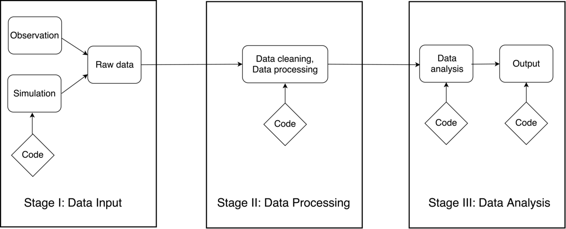

# 可复现研究案例

# 可复现研究案例

## 丹尼尔·图雷克和法特玛·德尼兹

在讨论了可复现研究的背景和一般实践之后，我们现在将重点转向一系列具体的科学研究工作流程案例，所有这些案例都致力于实现高度的可复现性。这些可复现研究案例是我们研究实现计算可复现性的方法和当前最佳实践的基础。通过研究这些现实世界的例子，我们能够得出关于工具、软件和当前可复现科学研究趋势的结论。

在本章中，我们首先介绍案例研究的概念和格式，包括案例研究背后的激励因素。接下来，我们描述了从涵盖各种科学学科的研究人员那里收集案例研究的方法和过程。案例研究本身揭示了自然分类为两个明显类别。描述了这一分类，并提供了案例研究的索引。作为高层次摘要，我们接下来提供案例研究的广泛描述和摘要统计。这些提供了关于目前最常见的工具和方法论促进可复现研究的见解。最后，我们提供一些建议，以便读者阅读案例研究章节，以获得对这些示例的更深入理解。这些建议旨在帮助读者识别为打造自己的可复现科学研究工作流程提供的思想和见解。

### 什么是案例研究？

一个案例研究是对研究人员用于完成单个、明确定义的科学研究项目的计算工作流程的全面描述。每个案例研究描述了如何结合特定工具、思想和实践来支持可复现性。重点放在了可复现研究的*如何*，而不是为什么或什么。每个案例研究可以被视为研究人员在面对可复现性挑战时采取的众多可能途径之一。

每个案例研究都遵循一致的标准化格式。每个案例研究都以作者的简短传记开头，包括他们的从属关系、学科以及简要摘要描述其案例研究的主题。每个案例研究的主体由三个核心部分组成：伴随着流程图的工作流叙述，对工作流的最重要工具和成就的讨论，以及在实现可复现性过程中遇到的最重要问题的讨论。

工作流程叙述和图表是每个案例研究的核心。图表以类似电路图的方式概述项目：方框代表过程中的步骤，箭头代表信息流入后续步骤。大多数图表围绕专业工具、版本控制存储库、数据库、脚本以及统计结论、功能软件或科学出版物等最终产品的组合构建。工作流程叙述与图表紧密联系，解释了图表中显示的各个阶段和信息流。叙述提供了作者讨论诸如工具的适当使用、各个步骤如何自动化、原始数据的历史以及用于分析的软件是否具有足够的文档和测试的机会。

沿着工作流程叙述和图表，每个案例研究突出了项目中可重复研究的主要成功。这个*关键优势*部分描述了遵循这种可重复工作流程如何改进作者的研究，通常通过使其更高效、透明和可信赖，除了更具可重复性。这部分还可能讨论项目如何受益于其他项目的可重复性或开源性质，以及其他研究人员如何重用工作流程的部分。

最后，在*痛点*部分，每个案例研究都反映了在追求可重复性过程中遇到的最麻烦的障碍。这些挑战可能已成功克服，也可能仍然存在。例如，无法公开发布的数据集，从其他科学家那里继承的遗留代码，或者与没有经验或兴趣进行可重复研究的其他科学家合作时遇到的困难。这些麻烦的方面应该与成功和关键工具一样有启发性，因为它们突出了产生完全可重复研究的实际障碍。

案例研究还可能包括一个*关键工具*部分，专门指出帮助实现可重复工作流程的任何软件或其他工具。最后，一些案例研究涉及几个可选问题，涉及可重复研究及其挑战的更广泛背景。提供的情况下，这些问题的答案将包含在案例研究的结尾处。针对每位作者提出的可选问题包括：

+   对于你来说，“可重复性”是什么意思？

+   你认为在你的领域中可重复性为何重要？

+   你是如何或从何处了解到可重复性的？

+   你认为在你的领域进行可重复研究面临的主要挑战是什么，你有什么建议？

+   你认为进行可重复研究的主要动机是什么？

+   你会推荐给你领域的研究人员哪些最佳实践？

+   你会推荐一些特定的资源来了解更多关于可重复性的内容吗？

这种案例研究的格式在征集了贡献作者的案例研究之前就已经设计好了。选择这种格式有几个目的。首先，工作流程叙述和图表旨在清晰地展示端到端的科学工作流程，以及作者对此过程的评论和描述。单独使用任一项都无法全面了解他们实现可重复性的方法。其次，其余部分旨在清晰地区分研究人员对可重复性的重要方面。虽然类似的信息也可能出现在工作流程叙述中，但*关键利益*、*痛点*和*关键工具*部分将这些概念分离出来，并促使每位作者清晰地反思他们方法的优势和劣势。综合起来，这些部分提供了对作者方法和经验的全面视角，以及他们追求实现可重复性的历程。

### 收集案例研究

收集案例研究的过程是由加州大学伯克利分校的伯克利数据科学研究所的核心团队协调完成的。这个收集案例研究的过程大约持续了六个月。

最初，核心团队起草了一个可重复性案例研究的一般框架。在最初，这只包括了工作流程图和随附叙述。该团队的成员各自撰写了一份描述他们自己研究项目的案例研究。在检查了这些最初的提交后，制定了一个正式的案例研究模板。这包括了每个作者的介绍性个人问题、叙述和图表的描述和指南，以及有关可重复性各个方面的一系列问题。

这个模板后来被分发给了在伯克利数据科学研究所举办的一个可重复性研讨会的参与者。该研讨会的一个环节让参与者有机会起草一份描述他们自己研究的案例研究。尽管参与者只在研讨会期间有几个小时的时间来完成他们的提交，但大多数参与者在研讨会之后又花了额外的时间来完成他们的案例研究。后来通过个人请求向主要科学研究人员征集了第三轮也是最后一轮的案例研究。

### 分类和索引

如上一章所述，数据密集型研究工作流程可分为三个主要阶段：数据输入/获取、数据处理和数据分析与输出。第一阶段代表数据获取、输入或创建。无论数据来源于何处（通过收集、模拟或其他方式），此阶段的最终结果是一个或多个原始数据集。第二阶段包括清理和处理这些原始数据。这可以包括许多不同的任务，如整合、组织或数字化，其输出是一个经过清理的数据集，完全准备好进行第三阶段的工作。最后，第三阶段包括所有统计分析、可视化和输出产品的创建。这可能经常导致科学出版，但还有许多其他形式的输出，如软件工具、公共存储库、科学结论或可操作见解。一个完全通用的科学工作流程的概要分为这三个不同的阶段，如图 1 所示。

 使用这个三阶段的分类法，案例研究自然地分为两大类。第一类我们称之为“高级”案例研究，它们描述了涉及所有三个阶段的完整科学工作流程。这些通常对每个阶段进行了较轻的处理，并包含较少的技术细节。第二类称为“低级”案例研究，这些案例研究仅描述这三个阶段中的一个或两个。这些低级案例通常对各个阶段进行了更详细或更技术性的处理。低级案例研究还根据描述的阶段进行进一步分类。

利用这种分类，我们在表 1 中列出了本书中包含的所有案例研究的索引。每个案例研究都被归类为高级或低级，并根据所涉及的科学学科进行分类。这个索引旨在帮助读者探索案例研究。

表格 1：案例研究章节指南

| 作者 | 学科 | 主题 |
| --- | --- | --- |
| **高级** |  |  |
|  |  |  |
| 安东尼·阿伦特 | 应用物理学 | 冰川融化对全球海平面上升的影响 |
| 帕布罗·巴尔贝拉 | 政治学 | 研究社交媒体网站上的政治极化 |
| 卡尔·伯蒂格 | 理论生态学 | 生态系统中的预测和决策 |
| 加勒特·克里斯滕森 | 经济学 | 军事历史对士兵招募的因果影响 |
| 艾琳·古克尔伯格 | 物理学 | 量子系统的对角化模拟 |
| 克里斯·哈特格林 | 应用统计学 | 验证检测数据篡改的统计方法 |
| 克里斯·霍德格拉夫 | 神经科学 | 大脑预测模型的特征提取 |
| 大卫·荷兰 | 应用数学 | 气候变化与大冰盖的融化 |
| 贾斯汀·基策斯 | 生态学 | 使用自主声学探测器分析蝙蝠活动 |
| 安迪·克劳斯 | 土木科学 | 分析都市地区的美国家庭位置 |
| 何塞·曼努埃尔·马加利亚内斯 | 政治学 | 利用议案共同发起数据检测政治趋势 |
| 本杰明·马维克 | 人类学 | 理解史前狩猎采集行为 |
| 奥利维尔·梅斯纳 | 航空航天工程 | 计算流体动力学结果的完全复制 |
| K. 贾罗德·米尔曼 | 统计学 / 心理学 | 评估人类对自闭症分类的可靠性 |
| K.A.S. 米斯兰 | 环境科学 | 血氧结合特性比较 |
| 凯利·奥托博尼 | 统计学 / 公共卫生 | 分析盐的摄入量与死亡率的关联 |
| 卡尔蒂克·拉姆 | 数据科学 | 开发支持可重复研究各阶段的工具 |
| 艾瑞尔·罗克姆 | 神经科学 | MRI 对大脑结构和功能的研究 |
| 瑞秋·斯莱博 | 核工程 | 数值方法研究中性粒子相互作用 |
| 丹尼拉·乌希兹玛 | 图像处理 | 设计机器视觉和模式识别算法 |
| 赵张 | 计算机科学 | 使用 Apache Spark 进行云计算图像处理 |
|  |  |  |
| **低级别** |  |  |
|  |  |  |
| 凯尔·巴巴里 | 宇宙学 | 分析超新星数据以测量宇宙膨胀 |
| 法特玛·德尼兹 | 图像处理 | 生成两色穆尼图像以研究大脑活动 |
| 康拉德·辛森 | 分子生物物理学 | 分析生物分子的分子动力学轨迹 |
| 凯瑟琳·赫夫 | 核工程 | 核燃料循环分析的模拟框架 |
| 兰迪·莱维克 | 应用数学 | 概率海啸危险性评估的新方法 |
| 塔拉·马迪亚斯塔 | 神经科学 | 使用自动化构建工具的神经影像工作流程 |
| 吉尔伯托·帕斯托雷洛 | 计算机科学 | 数据处理管道和数据管理解决方案 |
| 罗素·波尔德拉克 | 神经科学 | 分析神经影像、行为和代谢组数据 |
| 瓦伦蒂娜·斯塔涅娃 | 数学 | 开发用于追踪物体的随机滤波方法 |
| 丹尼尔·图雷克 | 统计学 | 开发和测试高效的统计算法 |

### 在案例研究中存在一些趋势

尽管代表了广泛的科学学科，但各种案例研究之间存在许多相似之处。在这里，我们总结了几个主要趋势和可观察到的新特征。这包括计算研究中主要语言的摘要、数据共享和版本控制的趋势，以及其他高层属性。

这本书包含了共计 31 个可复现工作流的案例研究。其中，21 个是高级工作流，描述了端到端的流程，包括数据输入或获取、数据处理和数据分析。剩下的 10 个案例研究是低级工作流，提供了更详细的关于其中一两个阶段的信息。大约三分之一的低级案例研究讨论了数据输入或获取（阶段 1），一半描述了数据处理（阶段 2），另一半讨论了数据分析（阶段 3）。需要注意的是，一些低级案例研究涵盖了其中两个阶段，例如数据处理和数据分析两者。

这 31 个案例研究中的每一个代表了一个以数据为中心的计算科学工作流程，因此描述了各种用于数据管理、数据处理或科学计算的工具或语言。尽管描述了许多计算工具，但其中一些在案例研究中极为广泛。特别是，31 个案例研究中有 17 个（55%）使用 Python，这是一种开源、高级别且通用的编程语言。这准确反映了 Python 的当前流行程度，得益于其快速的开发周期、Python 代码的高可读性以及 Python 支持的极其广泛的应用范围。接下来的强势代表是 R，一种用于统计计算的开源编程语言，在这 31 个案例研究中有 13 个（42%）使用。这准确反映了 R 在数据分析师和统计学社区的广泛使用，通常情况下，R 现在被认为是统计计算的主要生态系统。在 Python 和 R 之后，其他程序和计算工具的代表范围极其广泛，但在案例研究中的表现相对较低。仅举几个主流工具的例子，包括 C/C++、MATLAB、Julia、Scala、Java/JavaScript，以及通常情况下定制开发的软件，尽管这个列表远非详尽。

版本控制的适当使用是现代可复现性的关键方面。这同样适用于软件开发和计算工作流的基础计算机代码。较旧的（集中式）版本控制系统对用户来说更加繁琐，但是近期引入的 git 和 GitHub 已经使得版本控制在规模较小的项目中更易于访问。绝大多数（超过 80%）的案例研究都使用 git 和 GitHub 对软件或分析代码进行版本控制，这代表了案例研究中最为强劲的趋势之一。少数案例研究解释了工作流的性质不适合进行版本控制，例如在描述数据管理协议时。此外，少数案例研究使用其他版本控制软件，例如 Bitbucket 或 SVN，但这些只是少数。

为了支持透明度和可重复性，在学术界存在着一种持续的转变，支持开放数据和数据共享。事实上，31 个案例研究中有 19 个（超过 60%）使用了公开可用数据，或者描述了他们如何使自己的数据公开可用的过程。然而，并非所有学科都普遍实行开放数据政策，因为在某些学科中，数据收集的极大开销阻碍了科学家们公开分享数据。这在某些领域，例如宇宙学、天体物理学或神经科学中是一个不幸的现实，但当前科学和学术界的趋势强烈倾向于使用开放数据。

在案例研究的输出媒介中也存在明显的趋势，尽管我们认为这可能是作者贡献群体的产物，而不是可复制工作流程的一般情况。案例研究的收集来自学术界，主要侧重于科学出版。除了少数几个案例研究的工作流程以生成科学手稿为终点外，几乎所有案例研究的工作流程都以生成供同行评审的科学手稿为目标。也许更重要的是，略多于三分之一的案例研究还描述了第二个输出。这通常表现为一个软件产品，或者一个旨在更广泛使用的分析算法。其他较少见的次要输出包括数据管理流水线或交互式网站。

### 阅读案例研究

当读者考虑设计自己的可重复科学工作流程时，本书末尾呈现的案例研究中提供了丰富的知识和经验。然而，阅读案例研究可能令人望而生畏，因为许多案例研究都是技术性的，可能假定读者熟悉计算工具或特定应用领域。因此，我们现在提供一些建议来阅读案例研究。

我们鼓励那些对可重复研究还不熟悉的读者从浏览高层次的案例研究开始，这些案例研究提供了各种学科研究工作流程的概述。这将为读者提供案例研究中包含的内容的一般概念，并可能突出显示那些已经面临或解决了与读者面临的类似挑战的学科。例如，生态学家和宇宙学家通常都使用高分辨率空间数据，而神经科学家和实证经济学家可能会遇到与数据匿名化相关的类似问题。

随着读者熟悉案例研究的格式和展示方式，他们可能会考虑详细阅读与自己学科最相关的案例研究。在这些例子中，科学研究的性质更有可能为读者所熟悉。此外，它们可能会给出读者自己学科中正在使用的工具、挑战和方法的一个概念。

最后，我们鼓励有动力的读者进行高层次和低层次的案例研究的详细阅读，这些案例研究涉及与您自己研究最相关的工具或问题。案例研究通常会讨论您不熟悉的技术工具、主题和方法。我们并没有在每一章节中解释这些技术概念，而是在书的末尾提供了一个技术术语表的描述。鼓励读者在阅读案例研究时经常参考此术语表。

需要注意的是，每个案例研究都是一个特定于问题的可重复工作流程示例。我们不建议尝试重建任何特定的工作流程，而应该从各种案例研究中选择思路，以创建自己定制的可重复性方法。无论读者决定如何浏览案例研究的收集，他们都应该记住*每个*案例研究都有一些有用的见解--包括那些来自不相关学科的见解。我们鼓励读者研究提出的各种工作流程，因为这种方法最有可能让您了解一些普遍适用于科学研究的常见技术和最佳实践的风采。
