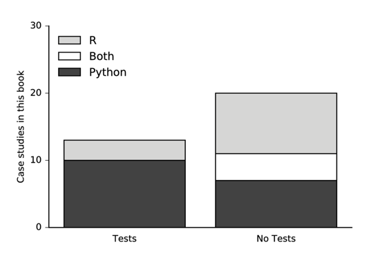
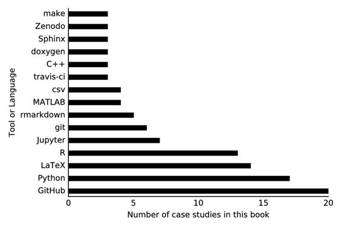

# 学到的教训

# 学到的教训

## 凯瑟琳·哈夫

尽管案例研究的作者来自各种研究背景，但从这些工作流程的集合中出现了一系列主题。尽管科学领域不同（生态学、神经科学、天文学、核工程），并且几乎不受首选编程语言的影响（即 R、Python、C++、Matlab），但出现了类似的困难。本章将总结一些案例研究中共同的主题，无论是痛苦的还是积极的。

应该注意，章节贡献者的样本并不代表这些研究领域的科学家的代表样本。实际上，这些科学家之所以为这本书做出贡献，是因为他们对开放科学和可重现性特别感兴趣。因此，我们可以想象，当这些科学家遇到痛点时，许多同行可能会完全放弃可重现性。

一些关键发现包括乐观的观察，即 Git 和 GitHub 几乎在案例研究的作者中无处不在。此外，我们发现在受访者中，尽可能在脚本分析方面进行操作被广泛接受为必不可少。出于这两个原因，纯文本文件格式被优先选择。\ 测试和持续集成被视为那些已将这些步骤整合到其流程中的人维护可重现性的关键，但有相当多的受访者在其工作流程中没有提到这两种做法。最后，一些最成功的方法是那些根本上认识到并适应了科学方法所捍卫的“错误普遍性”的方法（Donoho、Maleki、Rahman、Shahram 和 Stodden，2009）。

可重现性的障碍包括与人类、计算机以及两者共同存在的机构的问题。案例研究清楚表明，例如，必须激励人们花时间专门用于可重现性的任务。这可能会因研究团队内的技能差异和不同的工具熟悉度而变得复杂。但是，即使使用了工具，对受限数据或硬件的访问不足也可能使最有决心的科学家的可重现性努力受挫。同样，对于那些打算公开的人来说，工作流程的可移植性仍然是一个挑战，因为打包 - 尤其是依赖项的安装 - 仍然是分享和扩展工作的关键障碍。

在接下来的章节中，本章将讨论我们从案例研究中学到的教训。首先，本章将简要提及各种科学家对可重现性的感知，然后将专注于痛点。接下来我们将注意一下经常提到的工作流工具，最后本章将记录一些案例研究作者心中的新颖想法。

### 可重现性的含义

案例研究的作者在准备案例研究时被促使提供许多观点。其中之一是“定义术语*可重现性*对你意味着什么……”

一些作者挖掘了这个语义问题中蕴含的微妙之处。例如，K. Jarrod Millman，Kellie Ottoboni 和 Philip Stark 将再现性分解为四种不同类型。

1.  *计算再现性和透明性*，强调代码文档化。

1.  *科学再现性和透明性*，强调科学决策的文档记录和数据的可访问性。

1.  *计算正确性和证据*，强调自动化测试和验证。

1.  *统计再现性*，强调数据分析的透明性和科学结论的逻辑路径。

然而，大多数作者表达了计算再现性或可复制性的某种特点。

#### 计算再现性

大多数作者对再现性的至少一个方面有一致的看法：即在提供相同的源代码、输入数据、软件和计算环境配置的情况下，一个独立的团体可以精确地重现原始工作的结果--尤其是已发表的结果。这在我们的术语表中被描述为*计算再现性*。

这种再现性的方面被以下案例研究作者特别好地阐述了--尽管每个定义都有其自己的有趣细微差别：

Jan Gukelberger：

> 一般来说，鉴于一篇出版物（在经过同行评议的期刊中），源代码和原始数据（可能公开可用或在机构的存储库中可用），我的领域的专家应该能够理解，并原则上重复研究的每一步，从运行正确版本的模拟代码到最终结果呈现在发表的论文中。

Justin Kitzes：

> 我认为一项研究是（计算上）可再现的，当我可以向同事发送一个包含我的原始数据和代码的压缩文件，他或她只需按一下按钮就能生成我分析中的所有结果、表格和图形。

Andy Krause：

> “再现性”意味着后续感兴趣的团体可以公开访问数据、代码、分析工作流程和数据来源，重新创建研究（理想情况下产生相同的结果），而无需咨询原始研究人员。

这些回应了一个关于再现性的既定观点（Donoho 等人，2009 年；Stodden，2010 年；G. Wilson 等人，2014 年），通过清单和承诺（如“再现性 PI 宣言”（Barba，2012））作为社区规范而不断发展。我们的一些案例研究作者已经接受了这一承诺，其中 PI 发誓采用一些实践，为可再现性工作增加了一定程度的可持续性和可扩展性：

1.  教导团队成员关于再现性。

1.  将所有代码和文稿保存在版本控制下。

1.  进行验证和验证并发布结果。

1.  对于出版物中的主要结果，分享数据、绘图脚本和图表采用 CC-BY 协议。

1.  在提交论文时将预印本上传到 arXiv。

1.  在提交论文时最迟发布代码

1.  在每篇出版物中添加一个“可重现性”声明

1.  保持最新的网络存在

Kyle Barbary 指出了这种可持续、可扩展的可重现性的重要性：

> 对我来说，可重现性有两个方面：可用软件的可用性（最好是在开源许可下），以及数据的可用性（最好是原始和简化形式）。这两者结合起来应该使外部人员能够从头到尾重现研究结果。我将这两个方面分开，因为每个方面都可以在没有另一个方面的情况下带来好处。例如，即使不发布数据，发布软件仍然可能非常有益。如果在开源许可下发布，这提供了一种不同风格的可重现性 - 能够重现论文中描述的算法，并在后续工作中使用和改进该算法。

#### 可复制性

当最终结论可以基于不同实验得到确认时，科学家们认为这是对结果的验证。在这方面，Valentina Staneva 区分了精确和近似可重现性：

> “完全可重现” - 当结果可以在给定相同输入和参数集的情况下精确重现时。
> 
> “近似可重现” - 当可以使用与所提出的相同或可能略有不同的方法在相同或可能略有不同的数据上生成类似结果或类似性能时。

有些人将“可复制性”一词用于这种近似可重现性。Ariel Rokem 这样表达：

> 一个更高的标准，有时被称为“可复制性”，是要求如果另一组研究人员进行相同实验，并在其分析中实施相同的想法，那么应该得出相同的结论。可重现性并不保证可复制性[Leek and Peng, 2015]。有些人甚至可能认为，可重现性和可复制性有时可能存在冲突，因为实施错误可能在重现中传播，但在复制中不会[Peng2009，Baggerly2005]。

通过这种方式实现科学结果的验证，当可以用新方法或实现重复科学工作并得出相同结论时。

### 痛点

我们还询问了案例研究的作者，询问他们的工作流程中哪些特点对可重现性构成挑战。无论寻求哪种类型的可重现性，我们希望这些痛点能揭示特别需要关注的领域 - 工作流程瓶颈，创新可能改善可重现科学体验的地方。以下各节重点介绍了一些令人沮丧、耗时、不透明或脆弱的障碍，并提到它们何时可能代表更好工具和改进策略的高优先级需求。

#### 人和技能

研究团队的多样性很大。尤其是计算能力在同一个实验室的研究人员之间差异巨大。软件工具的创新速度之快意味着即使是准备充分的合作者也不能指望始终跟上最新工具的步伐。一个科学家使用的手稿准备软件、数据库格式和版本控制系统可能同样现代，但仍与他们的合作者熟悉的软件堆栈不兼容。

当案例研究的作者报告说采用实践的瓶颈与技能的多样性有关时，普遍的迹象是，如果他们的研究小组成员对工具的熟悉程度更大、更一致，那么该过程可能会更有效或可重现。当一位或多位合作者不熟悉同事使用的工具时，像沟通结果或同时编辑手稿这样简单的任务就会因此而受阻，导致时间浪费。

关注点也远不止效率。一位案例研究的作者指出，如果合作者无法使用正在使用的工具，那么他们有可能被排除在科学过程之外。如果合作者由于对处理工具（例如 LaTeX）的不熟悉而无法直接或同时编辑合著手稿，那么这种排斥尤其在道德上是有问题的。

一个不愿意排除合作者的科学家当然可以选择使用更广泛使用的工具，接受效率低下带来的挫败作为合作的代价。然而，当这些广泛使用的、最低公分母的工具与可重现性目标冲突时，通常也会在可重现性方面付出代价。这在像 Microsoft Word、Excel 或 Matlab 这样的工具中尤为突出，它们被指出作为特别问题的替代方案，因为它们的闭源 GUI 性质基本上对可重现性问题是脆弱的。

因此，为了兼顾可重现性和效率，一些案例研究的作者倾向于继续使用首选工具（例如 LaTeX）。这些科学家主要看到了由于与同行的沟通和理解的困难而导致的痛点。对于这些科学家来说，道德困境与更有效地向更大的科学界传达他们的结果（可重现和透明地）的承诺相抵触--即使这会导致内部沟通受阻。

**需求：** 更好地教育科学家使用更具可重现性的工具。

**需求：** 应更好地使广泛使用的工具具有更高的可重现性，以免通用工具削弱可重现性。

#### 依赖关系、构建系统和打包

正如科学家“站在巨人的肩膀上”一样，我们的软件依赖于依赖树的森林。我们工作流程中的一个步骤可能依赖于数十个库和科学软件包，而每个库和软件包又可能依赖于许多其他库和软件包。

因此，任何软件堆栈或分析工作流程的使用、共享和采纳的第一个障碍往往是简单地让工作流程在与创建它的机器不同的机器上运行的斗争。对于忙碌的科学家来说，这个第一个障碍很容易成为最后一个障碍，并且阻碍了可重现性。如果另一个科学家甚至无法使用你特殊的编译器标志安装 LAPACK，他们就没有希望构建、安装或运行你的软件流水线。重现或扩展你的工作成为一个无法实现的梦想。

这个打包问题在不同领域的规模和复杂性各不相同。一些软件可能需要一个跨平台构建系统，捕捉编译器标志以将一系列系统库编织在一起，而其他软件可能只需要下载和一些执行步骤的文档。这些案例研究涵盖了其中的方方面面。

许多案例研究作者指出，他们的数据分析流程依赖于特定的计算平台或构建环境。它们的依赖可能仅限于某些平台，或者构建环境的某些功能可能需要定制以使各种选项正常运行。这些环境问题很快变得过于复杂，无法手动管理，必须以强大的跨平台方式打包，以便有希望成功。

案例研究作者以多种方式打包他们的工作。轻量级策略通常对跨平台配置问题（例如 bash 脚本和 makefiles）很脆弱。然而，更强大的解决方案（例如虚拟机）通常更笨重，而且通常不够透明。虽然一键下载可运行的虚拟机可能是复制模拟的最可靠选项，但对用户来说也是最不透明的。妥协解决方案，如配置和构建系统（例如 CMake），通常同时笨重又透明。值得注意的是，这些解决方案之间存在微妙的差异。特别是，构建和配置系统通常比 conda/bundler/packrat 等更广泛（但通常更刚性）的打包系统更具定制性（和脆弱性）。

现在距离自动工具的发明已经过去三十年了，但跨平台配置、构建和打包系统仍未得到解决。不知何故，科学软件开发人员仍在等待一个强大和普遍的解决方案。幸运的是，还有希望。面对类似问题，技术行业已经开发出了便携式容器管理系统（Bernstein, 2014），如[Docker](https://github.com/docker/docker)和[Kubernetes](https://github.com/kubernetes/kubernetes)。这些技术正在为可重现和开放科学的新一代科学打包工具提供支持（例如[tmpnb](https://github.com/jupyter/tmpnb)，[binder](https://github.com/binder-project/binder)，ReproZip（Chirigati, Shasha, & Freire, 2013），Code Data Environemnt（Guo, 2012），等等）。

**需求：** 改进配置和构建系统，以便便携地打包软件、数据和分析工作流程。

#### 硬件访问

构建系统情况是一个更大的可变硬件访问问题的特殊小规模案例。在这个光谱的一端，除了你自己的电脑外，还有挑战是让你的合作者的笔记本电脑上运行工作流程。在另一个极端是访问高性能计算硬件或独特的实验设备。

大型强子对撞机经常被提及作为一个实验的例子，它如此庞大以至于在不同的实验地点使用相似设备进行重复是不可能的，因此在某种程度上它未通过可验证性测试。许多领域在数据收集阶段都遇到这个问题，例如，一个实验不是任何人都能重现的；它必须由一个配置类似的核磁共振机的人来重现。

这个硬件访问问题在案例研究的数据收集步骤中被注意到，但也在分析步骤中被注意到。也就是说，当在非常高性能、高容量或高吞吐量的计算机系统上进行科学模拟或大规模数据分析时，同样容易出现不可重现性。不仅对这些资源的访问受限，而且硬件通常是独特的，而且为了在没有复杂性的情况下重现结果可能需要的元数据的数量和种类通常是巨大的。虽然云计算资源正在使高吞吐量计算民主化，但对于一些应用程序必需的高性能计算机的能力计算尚未被这些服务所取代。即使云计算也有局限性，正如案例研究作者 Arendt 所指出的，他的合作者发现连接到云服务器受到阿拉斯加带宽限制的限制。

**需求：** 高性能计算的大规模可重现性。关于这一需求的详细讨论可在（Hunold & Träff, 2013）中找到。

**需求：** 标准化的硬件配置和有限可用性实验设备的实验程序。

#### 测试

许多开发了超出简单脚本的代码的案例研究作者系统地讨论了测试该代码的方法。这种实践，除了具有卫生和提高鲁棒性外，还是对可重复性的自我检查的一种类型。软件测试和持续集成特别允许软件作者自动化频繁地检查代码是否始终如预期地执行，即使在添加新功能时也是如此。

经验各不相同。一些人认为测试是其工作流程中的核心要素，并强调单元测试--在函数级别进行全面的原子测试--以确保他们的工作可以被复制。其他案例研究的作者在信任结果之前进行集成测试，但这并不是开发的主动部分。在所有情况下，当案例研究中提到测试时，作者们都确信它们在节省时间和精力方面是有用的。然而，并非所有案例研究都提到了测试。人们不禁要想，是什么阻止了那些科学家和其他人采用这些做法。也许他们受到了单元测试的感知努力或现在花费的时间与以后节省的时间之间的权衡的打击。在许多情况下，对单元测试缺乏熟悉度可能是障碍。

还值得注意的是，测试框架的使用因语言而异，而不是因科学领域而异。特别是，主要使用 Python 的案例研究作者报告的测试率远高于主要依赖 R 的案例研究作者。这在下面的图中总结如下。

当然，这并不是一个统计意义上显著的样本，所以对于这些社区的结论还为时过早，但是由此产生的对话表明，测试实践的社区采用差异可能确实存在。

**需要：** 更好地理解为什么研究人员不会对单元测试作为一种实践的延迟奖励做出反应。

**需要：** 规范鼓励更广泛地采用单元测试，无论编程语言如何。

#### 发布

在研究过程中最广泛共享的步骤是出版。从文学编程的角度来看，论文可以被完全自动化和“可运行”。然而，在大多数案例研究中，捕获工作的研究论文的制作被报告为与科学有些独立。在其他情况下，通过使用 Jupyter 笔记本或审慎使用 rmarkdown 采用了更文学的编程方法。

工作流程在工具驱动的意义上非常工具化，所使用的工具定义了工作流程的进展方式。案例研究中的派系包括基于 LaTeX 的组、knitr/rmarkdown/sweave 支持者以及沮丧的 Microsoft Word 用户。

Microsoft Word 的修订记录在这次讨论中值得特别关注，因为它在全球的使用非常普遍，而且四位提到它的人的经历非常一致。每位提到 Word 的科学家都有效地说了两件事：

(1) 我们使用它是因为一个合作者无法弄清楚 LaTeX，

(2) Track Changes 虽然可以跟踪变化，但令人沮丧的是合并的限制意味着编辑必须按顺序进行而不是同时进行。

一篇可再现的论文是一项庞大而多样的任务，可能需要自己单独的工作流程。

**需求：** 更广泛的社区采用允许并行编辑的出版格式（即任何可以以分布式方式进行版本控制的纯文本标记语言）。诸如 Overleaf 和 SageMathCloud 的工具是让 LaTeX 更容易接近的一种开始，但需要更广泛的采用。

#### 数据版本控制

仅仅存储数据并不总是满足再现性的目的。有时候，数据可能需要被版本化，以便跟踪变化，回溯评估和清洗步骤，并延伸工作。

案例研究作者经常要么指出他们没有对数据进行版本管理，要么指出他们在寻找一个好的方法时感到困难。由于这个挑战——版本化存储更大（或更多样化、或高速）数据——目前正在软件行业的“大数据”时代遇到，因此行业中正在积极创新并已经实施了新的解决方案。

正在开发的工具以简化数据版本控制过程，包括 GitHub 大文件服务、Dat、git annex、datalad 等等。虽然它们以不同的方式运作，但通常涉及压缩、跟踪变化和高效检索。

**需求：** 更广泛地科学采用新的行业领先工具和平台来存储、版本化和管理数据。

#### 时间和激励

也许对案例研究作者及其合作者造成的最令人困扰的妨碍是缺乏时间、激励或两者兼而有之。

一些案例研究作者，或许作为他们对可再现性重要性认识的一种症状，被这些做法效率的信心所激励。许多人都注意到了他们在重复计算、修改分析和延续过去工作时节省的时间。

相反，“在创建可再现研究上花费的时间和精力并没有得到很好的回报”（案例研究作者 Valentina Staneva 博士）这种情绪被一些作者所共鸣。对可再现性工作需要额外奖励、支持和认可的需求，是一个机构基础设施问题，特别是在学术界，其中晋升和任期评定的度量指标明确与论文挂钩，但通常未能考虑到可重复使用的软件。

但是，尽管晋升和聘用流程需要现代化，但资金拨款机构行动更快。私人基金会如摩尔、斯隆和赫尔姆斯利正在领导支持大型旨在科学软件可复制性和透明度的倡议。同样，像 NSF、NIH 和（不那么迅速的）DOE 这样的政府机构也正在纳入开放和数据规划的要求。同样，一些期刊正在实施数据和软件提交要求，以激励在出版阶段的可复制性。然而，这些提高的出版和资金标准的功效基本上取决于执行机制。为了激励行动，论文评审人必须愿意尽职尽责地尝试运行提交的代码，而资助绩效评审人必须同样愿意审查数据管理计划的合规性。

**需求：**增加社区对可复制性好处的认识。

**需求：**激励制度，可复制性不仅仅是自我激励。

#### 数据限制

透明分析对于重现科学工作至关重要，原始数据的访问也可能对于可复制性至关重要。事实上，在审查期间确认结论并在其他科学家的扩展中探索替代方法可能是必要的。然而，在某些领域，数据访问受到法律限制。一些此类数据限制涉及人类主体研究，例如调查和私人医疗数据。一些限制涉及国家安全，例如出口受控的核数据或风险地图数据的限制。因此，在这些领域的研究人员在进行完全开放的科学方面受到限制，但通常可以在出口控制或 IRB 壁后与具有数据访问权限的同事分享分析方法。

**需求：**关于经过清理和表征的数据的标准，以便分析可以与受限制的数据集分开进行调查。

### 可操作的建议

我们并不是第一个讨论可复制性的人。我们也不会是最后一个。因此，许多科学家的建议中有许多主题被重复：

+   对您的代码进行版本控制

+   公开您的数据

+   在可能的情况下随处自动化

+   记录您的过程

+   测试所有内容

+   使用免费和开放的工具

在当前可复制性环境中已经确立的较少见的重复出现已经成为最佳实践：

+   避免过多的依赖关系

+   当无法避免依赖关系时，打包它们的安装

+   在协作平台（例如 GitHub）上托管代码

+   为您的数据和代码获取数字对象标识符

+   避免电子表格，更喜欢纯文本数据（甚至是“永恒”的）。

+   明确设置伪随机数生成器种子

+   工作流程和来源框架对于大多数科学家可能过于笨重

这些问题的核心在于人类对激励和延迟投资回报的关注。在工具改进无法帮助的情况下，将需要教育和社区发展来解决这些问题。

### 使用的工具

绝大多数科学家使用诸如 R 或 Python 之类的编程语言来进行分析并自动化处理。

几乎所有人报告使用基于 GitHub 的版本控制存储库作为其研究工作的核心。此外，科学家们经常引用一系列适用于其工作的工具生态系统。以下部分将工具按其用途而不是它们最常见的生态系统（例如 R vs Python）进行分类。

#### 出版

对于出版，案例研究作者通过所见即所得（WYSIWYM）标记语言提高了其可重现性。有些人更喜欢 LaTeX/Overleaf，而另一些人更喜欢 R/Knitr/RMarkdown/Sweave 生态系统。结合文本编辑器和分布式版本控制，这些纯文本标记语言提高了可重现性和同时协作性。

#### 数据处理

科学家们使用许多不同的格式和系统来存储和清理其数据。一些存储系统包括分层（例如 HDF5）和关系（例如 SQL）数据库系统。值得注意的是，这些案例研究中的 R 社区代表声称他们使用 RStudio IDE 作为他们简化访问 R 工具集合的方式的一部分，这些工具集合使得一些数据仓库解决方案以及数据清理和探索任务成为可能。

此外，还提到了用于存档存储和检索的新兴``数据湖''，例如 Dataverse（King，2007）。案例研究作者甚至指出，针对某些科学领域存在专门的数据湖。神经元库（Neurovault）（Gorgolewski 等，2016）被提及用于神经科学，但类似的解决方案也存在于其他领域（例如，生态学的 Dryad（H.C. White，Carrier，Thompson，Greenberg 和 Scherle，2008））。

#### 测试框架

在 Python 生态系统中，可以使用诸如[nose](https://nose.readthedocs.org/en/latest/)或[unittest](https://docs.python.org/3/library/unittest.html)之类的框架运行测试。在 C++中，可以使用[Googletest](https://code.google.com/p/googletest/)。多个案例研究作者提到了 Python 和 C++项目中的测试框架。

尽管很少有 R 用户提到对其代码进行单元测试，但该语言确实有单元测试框架的选项，其中 testthat 包（Wickham，2011）是最常用的单元测试框架。也存在其他可用的软件包，例如 RUnit 软件包。

#### 持续集成

尽管很少有案例研究作者提到持续集成，但其使用被誉为至关重要。当科学家不需要花费时间时，可重现的做法最容易被采用。更好的是，节省时间的做法更容易被采用。持续集成就是这样的一种做法。

要想让科学家定期在各种平台上运行他们软件的测试，不要求科学家做任何努力。也就是说，将构建和运行测试的任务外包给具有持续集成系统的计算机。持续集成服务器（如 [CTest](https://cmake.org/Wiki/CMake/Testing_With_CTest)、[Travis-CI](https://github.com/travis-ci/travis-api)、[Jenkins](https://jenkins.io/)、[Batlab](https://batlab.org/) 等）是生产软件的关键，让科学家专注于实现，而不用担心是否不断引入了错误。如果引入了错误，持续集成服务器将会注意到并发送邮件或发布状态报告。

#### DOI 管理

科学家的一个主要动力是引用。因此，他们为可重复使用的工作流程付出的努力只有在这些数据、脚本、库和分析可以被引用时才显得值得。因此产生了 DOI。有许多方法可以在代码和数据上放置可引用的、持久的、数字化的标记。案例研究中提到的用于存档数字对象并提供 DOI 的常用服务包括 Zenodo、Figshare 和开放科学框架。

### 其他建议

或许最令人感兴趣的是一些洞察，只有一两位科学家注意到。如果这些建议得到更广泛的采纳，它们中的一些可能会产生影响。

#### 后紧急重构

章节作者 Randall LeVeque 和 Rachel Slaybaugh 各自表达了以下观点的版本：

> 养成习惯，清理用于生成最终结果的代码，使其文档完善，所有必要步骤清晰明了。然后尽可能从头开始运行它们，以确保它能够工作。即使您不打算与他人分享它，您未来的自己也会感谢您。

这种工作流程强调了文档和用户清晰度的重要性（包括您未来的自己）。通过强调日常生活中的良好实践，这种工作流程确保了作者在开发过程中代码始终可用。通过在发布或出版阶段同样采用最佳实践，这种工作流程有效地双重检查了工作的可重复性。

这种工作流概念特别吸引人，因为它认识到科学家的人性，在日常工作环境中可能会让一些为了完全可重复性而必要的任务被忽略。然后通过在收尾阶段预留时间来纠正这种人为错误并巩固流程，就像为未来留下的时间胶囊一样。

#### 标准化数据格式

在案例研究中提到，需要一个 GIS 标准来帮助统一地图和地理空间数据的工作。通过共同采纳标准来统一工作，这种统一性也适用于其他领域。当各种标准的泛滥使得在科学领域内合作变得复杂时，社区对一个单一标准的共识可以实现研究团体之间的可重复性。

许多领域早已成功地采用了数据格式标准，例如天文学中使用的灵活图像传输系统（FITS）文件或核物理中使用的评估核数据文件（ENDF）。正在努力在其他领域标准化格式，其中可能缺乏、不足或（可能更糟）泛滥。例如，在新兴的数据驱动领域神经影像学中，正在努力建立神经影像的标准，并确保该标准在整个领域中得到采用（脑成像数据结构）。

值得注意的是，即使一个科学领域有一个社区标准，它在跨学科工作中可能并不适用，当内部领域关于数据格式的规范可能阻碍沟通的努力时。如果领域标准更具普遍性，可能基于常见数据格式（例如 SQL 数据库、HDF5、纯文本）的标准，这种情况可以得到改善。

**需求：** 在某些领域内推广文件格式标准的社区采用。

**需求：** 领域标准在其科学社区之外也能很好地转化。

### 结论

这组案例研究中得出了许多积极的经验教训。其中之一是确认 git 和 GitHub 以及自动化等现在已经成为案例研究作者——寻求可重复性的科学家们——普遍采用的工具。因此，对于代码和小规模数据，更倾向于使用“永恒”的纯文本文件格式。回归到基于纯文本的透明开放格式不仅有利于可重复性，还有利于其姊妹品质的开放性和透明性。

一些核心需求包括：

+   更好地教育科学家使用更具可重复性的工具。

+   应更多地使得广泛使用的工具具有可重复性，以免常见的工具不会破坏可重复性。

+   改进的配置和构建系统，用于便携地打包软件、数据和分析工作流。

+   高性能计算的大规模可重复性。

+   为有限可用的实验设备制定标准化的硬件配置和实验程序。

+   更好地理解为什么研究人员不对单元测试作为一种实践做出回应的原因。

+   不论编程语言如何，更广泛地采用单元测试。

+   更广泛的社区采用允许并行编辑的出版格式（即任何可以进行版本控制的纯文本标记语言）。

+   更广泛的科学界采用新的由行业主导的数据存储、版本控制和管理工具和平台。

+   更多社区认识到可重现性的好处。

+   可重现性不必自我激励的激励系统。

+   关于已清理和表征数据的标准，以便可以将分析与受限数据集分开研究。

+   在某些领域内文件格式标准的社区采用。

+   在科学社区外也能很好地转化的领域标准。

虽然构建和安装依赖项仍然是一个关键障碍，但最普遍的问题是人性的，从团队内建立基本工具包熟悉度到根据长期利益激励可重现工作流程。 同样，尽管领域内和跨领域的社区规范仍然需要统一，但许多对可重现性感兴趣的科学家正在形成一套可重现、开放、强大科学的最佳实践。 最后，一些解决方案 - 尤其是与人类激励有关的解决方案 - 正在等待制度变革。

### 参考资料

Barba, L. A. (2012). **可重现性 PI 宣言**。 [`doi.org/https://dx.doi.org/10.6084/m9.figshare.104539.v1`](http://doi.org/https://dx.doi.org/10.6084/m9.figshare.104539.v1)

Bernstein, D. (2014). **容器和云：从 LXC 到 Docker 到 Kubernetes**。 *IEEE 云计算*, *1*(3), 81–84\. [`doi.org/10.1109/MCC.2014.51`](http://doi.org/10.1109/MCC.2014.51)

Chirigati, F., Shasha, D., & Freire, J. (2013). Reprozip: 利用来源追溯支持计算的可重现性。 在 *作为第 5 届 USENIX 简史和来源实践研讨会的一部分展示*。 检索自 [`www.usenix.org/conference/tapp13/technical-sessions/presentation/chirigati`](https://www.usenix.org/conference/tapp13/technical-sessions/presentation/chirigati)

Donoho, D. L., Maleki, A., Rahman, I. U., Shahram, M., & Stodden, V. (2009). **计算谐波分析中的可重现研究**。 *科学与工程中的计算*, *11*(1), 8–18\. [`doi.org/10.1109/MCSE.2009.15`](http://doi.org/10.1109/MCSE.2009.15)

Gorgolewski, K. J., Varoquaux, G., Rivera, G., Schwartz, Y., Sochat, V. V., Ghosh, S. S., … 其他。 (2016). **NeuroVault。 org：一个用于分享人脑未阈值统计地图、分区和脑图谱的仓库**。 *神经影像学*, *124*, 1242–1244\. 检索自 [`www.sciencedirect.com/science/article/pii/S1053811915003067`](http://www.sciencedirect.com/science/article/pii/S1053811915003067)

Guo, P. (2012). 《CDE：创建便携式实验软件包的工具》。*科学与工程中的计算*, *14*(4), 32–35\. 检索自[`scitation.aip.org/content/aip/journal/cise/14/4/10.1109/MCSE.2012.36`](http://scitation.aip.org/content/aip/journal/cise/14/4/10.1109/MCSE.2012.36)

Hunold, S., & Träff, J. L. (2013). 《关于并行计算中可重复实验研究的状态和重要性》。*arXiv:1308.3648 [Cs]*。检索自[`arxiv.org/abs/1308.3648`](http://arxiv.org/abs/1308.3648)

King, G. (2007). 《Dataverse Network 简介：作为数据共享基础设施的 Dataverse Network》。*社会方法与研究*, *36*(2), 173–199\. 检索自[`smr.sagepub.com/content/36/2/173.short`](http://smr.sagepub.com/content/36/2/173.short)

Stodden, V. (2010). 《实践中的科学方法：计算科学中的可重复性》。*SSRN 电子期刊*。[`doi.org/10.2139/ssrn.1550193`](http://doi.org/10.2139/ssrn.1550193)

White, H. C., Carrier, S., Thompson, A., Greenberg, J., & Scherle, R. (2008). 《Dryad 数据库：DSpace 环境中的新加坡框架元数据架构》。*Universitätsverlag Göttingen*, 157\. 检索自[`www.oapen.org/download?type=document&docid=353956#page=173`](http://www.oapen.org/download?type=document&docid=353956#page=173)

Wickham, H. (2011). 《Testthat：开始测试》。*R 杂志*, *3*(1), 5–10\. 检索自[`immagic.com/eLibrary/ARCHIVES/GENERAL/JOURNALS/R110623I.pdf#page=5`](http://immagic.com/eLibrary/ARCHIVES/GENERAL/JOURNALS/R110623I.pdf#page=5)

Wilson, G., Aruliah, D. A., Brown, C. T., Chue Hong, N. P., Davis, M., Guy, R. T., … Wilson, P. (2014). 《科学计算的最佳实践》。*PLoS 生物学*, *12*(1), e1001745\. [`doi.org/10.1371/journal.pbio.1001745`](http://doi.org/10.1371/journal.pbio.1001745)
