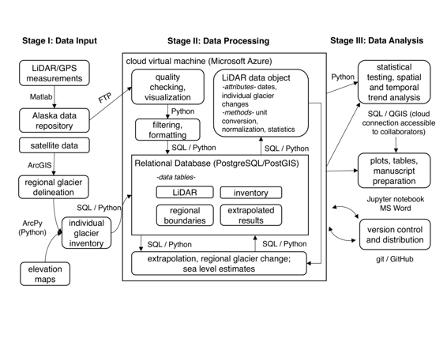

# 使用基于云的 Python 和关系数据库工具处理机载激光测高数据

# 使用基于云的 Python 和关系数据库工具处理机载激光测高数据

## Anthony Arendt，Christian Kienholz，Christopher Larsen，Justin Rich 和 Evan Burgess

我的名字是 Anthony Arendt，我在应用物理实验室担任高级研究科学家，并在华盛顿大学电子科学研究所担任研究员。我是一个研究团队的一部分，该团队研究冰川对全球海平面上升的影响，重点关注阿拉斯加和加拿大西北部的冰川。在过去的 20 年里，我在阿拉斯加大学费尔班克斯分校的同事一直在使用从小型飞机收集的光学雷达（LiDAR）数据测量阿拉斯加冰川的高程变化。我们的 LiDAR 系统包括激光测距仪和全球定位系统（GPS），可以测量冰川表面中心线沿着精确的高程。通过随时间重复这些观测，我们估算每个观测冰川的总质量变化，然后根据从卫星图像获取的信息将这些数据外推到未测量的冰川。从此我们可以生成详细的冰川质量变化的空间分布图以及这些冰体对全球海洋变化的总贡献。

在项目的 20 年期间，数据分析已经从对文本文件的手动处理发展到将地理信息系统（GIS）、关系数据库和 Python 工具集成到云计算框架中的半自动化工作流程。在这里，我们描述了这个工作流程，最终发表了最近的一篇论文[(Larsen et al., 2015)](http://onlinelibrary.wiley.com/doi/10.1002/2015GL064349/full)。软件的核心开发者包括 Evan Burgess，Christian Kienholz，Justin Rich，Anthony Arendt 和 Christopher Larsen。

### 工作流程

 工作流程始于年度野外数据收集，产生 GPS 位置和 LiDAR 点云数据，均以行业标准二进制格式存储。商业专有软件用于将数据处理为四维点观测（x、y、z 和时间），然后使用通用地图工具（[GMT](http://gmt.soest.hawaii.edu/)）进一步处理为网格化的 10 米数字高程模型。然后，使用 Matlab 脚本将这些高程图与较早时间获取的地图相减，以获取沿飞行线的高程变化。这些结果存储在文本文件中，文件名描述了冰川名称和开始和结束日期，并位于阿拉斯加大学费尔班克斯分校的服务器上。在另一个步骤中，我们为阿拉斯加地区汇编卫星图像和区域数字高程模型。我们使用商业 GIS 软件包 [ArcGIS](https://www.arcgis.com/) 手动数字化冰川范围。ArcGIS 提供了一组矢量操作工具，使我们的技术人员能够从卫星图像中勾勒出冰川轮廓。ArcGIS 命令也可以使用 ArcPy 库进行脚本化。我们使用 ArcPy 自动化一系列 GIS 命令，以计算阿拉斯加约 27,000 座冰川每座的海拔高度分布。

我们大部分的数据处理和分析工作都在一台托管了空间启用的关系数据库（RDB）的 Microsoft Azure Linux 虚拟机（VM）上进行。我们发现，将 RDB 托管在云中是我们可重现工作流程的核心要素。我们的 RDB 提供快速查询功能，使得我们的许多空间和时间平均化可以使用高效的数据库算法进行。我们的云托管使得同事可以直接连接到数据库，使用他们的本地 GIS 软件访问空间数据。我们使用开源 [PostgreSQL](http://www.postgresql.org/) 数据库和 [PostGIS](http://postgis.net/) 扩展，将点、线和多边形地理空间数据集导入其中。相关表包括：

+   *库存*：阿拉斯加每座冰川的多边形，具有表面积、冰川类型（是否终止于陆地或海洋）、名称等属性。

+   *区域边界*：我们在山脉轮廓或气候区域上执行区域外推的多边形。

+   *LiDAR*：测量已调查冰川的高程和体积变化。

+   *外推结果*：阿拉斯加每座冰川的体积变化的最终估计。

每当我们获取新的高程观测数据时，我们运行一个 Python 脚本，通过安全 FTP 连接到费尔班克斯的服务器，并搜索目录结构中的新文本文件。我们使用 Python [Pandas](http://pandas.pydata.org/) 库作为我们的文本文件和 RDB 数据对象之间的接口。具体来说，一旦我们将数据摄入 Pandas DataFrame 中，我们可以使用一系列方法生成简单的图表，并直接将数据导出到我们的 PostgreSQL 数据库中。我们使用类似的 Python 工具来创建和更新*库存*和*区域边界*表，例如以适应冰川退缩导致的表面积变化。

*激光雷达数据对象*是所有后续处理和分析的基础。通过调用带有描述单个或区域冰川的参数的函数来创建数据对象。数据对象的每个实例都具有预定义的属性，使用户能够快速获取*激光雷达*表中原始数据的元素。例如，用户可以向*激光雷达*表发出请求，获取包含该冰川海拔变化、面积和其他统计信息的数据对象。数据对象还具有几种方法，处理大多数标准数据处理和过滤工作流程。这些方法包括执行单位转换、归一化数据、计算统计信息并对每个冰川执行质量变化计算的算法。为了执行这些计算，我们从 Python 脚本内部向数据库发出结构化查询语言（SQL）命令。

在最后的处理步骤中，我们利用激光雷达对象方法的分组功能，按类型或空间位置生成冰川平均海拔变化剖面。例如，我们发现具有相似终点类型（即终止于陆地还是水中）的冰川具有类似的海拔变化分布。因此，我们根据从我们的*库存*表中查询到的*类型*分组生成了激光雷达对象的平均值，从而返回了海拔变化与海拔的单一估计。在最后一步中，我们调用一个函数，根据其海拔分布将这些剖面区域性地外推到*库存*表中存储的未测量的冰体，这返回了一个按组的冰体变化字典，以及一个可选的新数据库表，其中包含该地区的 27,000 个冰多边形的质量变化估计（表*外推结果*）。所有函数和方法运行速度很快，除了涉及构建*外推结果*的步骤，大约需要 15 分钟来运行。

为了分析结果并传播我们的发现，我们在我们的 Linux VM 上托管了一个 Jupyter 笔记本的永久实例，并向项目团队成员提供了访问权限。笔记本以及用于生成结果的核心 Python 脚本也位于 GitHub 仓库中。笔记本还包含 markdown，在分析的每个步骤提供元数据。具有编写 SQL 代码经验的合作者可以直接访问 PostgreSQL 数据库以执行自己的查询。其他熟悉 GIS 工具的合作者可以直接连接到地理空间编码表以生成自己的地图。

### 痛点

我们的团队汇集了具有不同背景和数据处理方法的研究人员。原始 LiDAR 和 GPS 数据的处理由一个不同的小组完成，而处理项目的 GIS 和外推部分由另一个小组完成，每个小组都使用不同的软件工具。我们通过在处理链的不同阶段创建标准化文件来处理这个问题。例如，LiDAR/GPS 小组生成了一堆文件，处理到可以用于外推的程度，然后将其输入到地理空间数据库中。这里的一个挑战是数据在多个位置复制，需要仔细的版本控制。

另一个挑战是，一些我们的合作者在尝试直接连接到我们的云计算资源时遇到了问题。一个问题是，阿拉斯加的互联网带宽有限，因此阿拉斯加与商业云提供商之间的数据传输速度很慢。另一个挑战是，许多美国政府机构都有防火墙，限制与我们的云数据库服务直接交互的流量。因此，我们的政府合作伙伴和/或位于阿拉斯加的合作伙伴不得不设置我们数据库的副本版本，这给版本控制和项目管理带来了挑战。

### 关键好处

我们的工作流提供了一个机制，可以随着新数据的到来不断更新我们的分析。我们的项目还将持续资助几年，现在我们有能力在获取新数据时重新生成关键图表并更新海平面估计。这将大大缩短我们向利益相关者提供有关阿拉斯加冰川状态及其对海平面的贡献的更新信息所需的时间。此外，我们的数据是独特动态的，必须适应不仅是新数据，还有冰川几何形态（面积和海拔）随时间变化的基本清单的变化。通过将所有清单数据放入关系表中，我们可以更新单个多边形并考虑冰川面积对质量平衡的反馈效应。

我们的工作流还提供了一个稳定的基础，可以适应团队成员随时间变化的变化。当学生和技术人员加入和离开项目时，我们可以让他们使用和贡献脚本仓库，而不是从头开始重新发明东西。

我们有很好的机会以前所未有的方式探索我们的数据。新的合作者加入我们的团队，并直接连接到我们的数据库，生成复杂的查询，探索可能驱动我们在野外观察到的冰川质量变化的气候和几何因素。其他类似的激光雷达观测项目不提供对关系数据库的访问，限制了研究人员进行空间和时间查询的能力。

### 关键工具

在云环境中托管我们的资源在使我们的工作流程可复制方面发挥了重要作用。云使我们能够将脚本与观测数据同地放置，实现快速处理，最大限度地减少文件传输的需求。此外，使用关系数据库存储我们的地理空间数据集，为我们提供了在数据集中探索各种空间关系的高效方法。

### 问题

#### “可复制性”对你意味着什么？

由于我们监测活动的动态性质以及根据气候变化不断更新冰川的位置和海拔的需求，可复制性是我们工作流程的一个至关重要的组成部分。我们通过以下方式实现可复制性：

+   保持输入数据集的一致性

+   利用一系列脚本来自动进行数据摄入和过滤

+   将原始数据和经过过滤/处理的数据存储在关系数据库中

+   生成处理典型数据分析功能的数据对象

+   在 Jupyter 笔记本中编写所有手稿图

#### 你认为在你的领域中可复制性为何重要？

在过去的十年里，冰川学已经变得高度跨学科化：海洋学家、气候学家、大地测量学家和冰川学家必须整合知识来平衡海平面预算。此外，来自偏远冰川地区的数据很稀少，因此我们收集的任何数据都需要公开。通过生成可复制的工作流程，我们有更大的能力共享信息，并更好地了解每个研究团队如何处理其数据集。

#### 你是如何或从何处了解到可复制性的？

我通过课程、在微软研究院的访问科学家任命以及自主学习学到了这些技术。

#### 你认为在你的领域进行可复制研究的主要挑战是什么，你有什么建议吗？

非专业人士无法充分利用我们的工具，有时需要我们回到不可复制的方法，以便及时完成工作。我们正在通过构建轻量级应用程序编程接口来解决这个问题，使合作者能够通过简单的网络协议访问我们工作流程的一些核心元素。

#### 你认为进行可复制研究的主要动机是什么？

在一个研究团队内，主要的激励包括：增加方法的透明度、增加问责制和检查处理过程中的错误的能力、减少新成员加入团队时的启动时间以及最小化工作重复的能力。团队与其他合作者/利益相关者之间，我们看到在分享和可视化结果的能力方面有着重大的好处，以及我们进行跨学科研究的能力。

#### 你有没有什么在你领域推荐给研究者的最佳实践？

我们建议在地理空间数据格式和分发协议方面制定并遵守标准。
