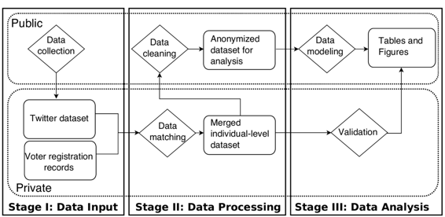

# 在使用社交媒体数据研究政治行为中，可重现性与隐私之间的权衡

# 在使用社交媒体数据研究政治行为中，可重现性与隐私之间的权衡

## Pablo Barberá

我的名字是 Pablo Barberá，我是一名政治科学家，将计算方法应用于政治和社会行为研究。2016 年，我加入了南加州大学国际关系学院担任助理教授，之前在纽约大学数据科学中心担任摩尔-斯隆学者一年。我在这里描述的工作流程对应于我的博士论文研究的一部分，其目标是研究社交媒体网站上的政治极化。特别是，在这里我专注于导致 2015 年发表在《政治分析》杂志上的一篇文章的研究过程，该文章提出了一种基于用户个人网络结构估计 Twitter 用户政治意识形态的新方法。

### 工作流程

 在涉及社交媒体数据的项目设计中一个重要的关注点应该是保证样本中个人的私人记录得到保护，同时确保每一步都是可重现的。在这里描述的分析中，我仅依赖公开可用的信息 -- 特别是有关 Twitter 个人资料和俄亥俄州选民登记记录的信息，后者用于验证目的。然而，项目的目标是推断每个 Twitter 用户的一个敏感的潜在特征 -- 他们的意识形态立场，在非常自由主义到非常保守主义的范围内。这是大多数用户不知道仅基于其公开个人信息就可以推断出来的信息，这就引发了一个问题，即在这种情况下，用户数据共享的知情同意概念是否适用于用户注册 Twitter 账户时接受的服务条款中所定义的范围内。

为了实现可重现性目标并充分保护用户数据，研究中所有分析都分为两个层次，私有和公开，如本章节中的图表所示。私有层包括所有原始数据，这些数据将被处理和合并，然后进行匿名化处理，以便包含在复制材料中。这些数据集不会被发布，但其他研究人员可以从其原始来源获取。第二层包含所有的 R 代码和输出（表格和图表），以及数据集的匿名化版本，即使没有完整的数据集，也可以部分复制论文中的结果。在完成项目后，这个层次的材料被发布在 GitHub 和 Dataverse 的公共存储库中。

如工作流程图所示，项目的第一步是收集一个数据集，使我能够重建一组 Twitter 用户的网络。特别是，我从 Twitter 的 API 中编制了大约 500 个美国政治账户（包括立法者、候选人、媒体机构等）的关注者列表。然后，我确定了至少关注了这些政治账户中的三个的用户列表 -- 这将是研究中的样本。最后，对于这些用户的每一个，我还提取了他们的个人资料信息，包括他们的大致位置，这些位置信息使用数据科学工具包解析为地理坐标。这个数据收集步骤是使用社交媒体和政治参与实验室开发的 R 工具进行的。在这一步中使用的所有 R 代码都是公开的，但完整的 Twitter 数据集是私下存储的，以符合 Twitter 关于数据共享的服务条款。

工作流程中的第二步涉及两种类型的数据处理任务。首先，来自 Twitter 的用户级信息与俄亥俄州的公开选民登记记录匹配，其中包括每个选民注册的政党信息。只有当这两个数据集之间的姓氏、名字和县的完美唯一匹配时，Twitter 用户才会与选民匹配。此信息将在验证步骤中使用，以评估此方法产生的意识形态估计是否与离线行为的测量相关，例如给定选民参加党的初选的次数。数据处理任务的第二部分涉及清理 Twitter 数据集并构建将被缩放以获取其意识形态位置估计的网络。特别是，我在此构建了一个邻接矩阵，指示样本中每个用户是否关注了每个政治账户。

完成这两个步骤后，我生成了两个数据集的匿名版本。匿名化是通过将 Twitter 和选民的唯一 ID 替换为随机生成的数字 ID 来实现的。这将使研究人员能够在此时之后复制分析的每一步，但无法识别样本中的个人。

在数据建模步骤中，代表这个网络的邻接矩阵使用 R 中的[STAN 贝叶斯建模软件](http://mc-stan.org/)进行了缩放。实施的模型与应用于社交网络的其他潜在空间模型类似。它建立在这样一个假设的基础上，即用户和政治账户之间存在跟随链接与它们在潜在意识形态维度上的距离成反比。换句话说，模型的直觉是用户倾向于关注他们认为与自己意识形态立场接近的政治账户。这种方法返回了用户和政治账户的潜在位置的估计值。模型的输出经过仔细验证，使用了各种离线意识形态度量，包括国会的点名投票、调查中的意识形态的总体度量以及个人级别的选举记录。论文中最强有力的结果之一是，被预测为具有最极端立场的个体是那些在初选中最频繁投票的人--这清楚地表明意识形态认同的强度与党派倾向的强度相关。

在进行分析和验证之后，项目的最后部分包括生成一系列表格和图表，总结数据集，描述论文的主要结果，并提供验证过程的图形表示。所有图表都是使用 R 生成的。在整个过程中，我详细记录了生成每个图表所需的数据集，确保只需要项目公共级别中可用的代码和数据即可复制它们。这些表格和图表随后被整合到使用 LaTeX 编写的手稿中。

### 痛点

复制数据和复制代码发布在不同的平台上；代码在 GitHub 上，数据在 Dataverse 上。GitHub 提供了跟踪代码更改的能力，并且使协作变得容易。他们的在线界面易于使用，这降低了其他研究人员有兴趣复制这些材料用于自己项目的进入成本。然而，目前 GitHub 不允许推送超过 100 MB 的文件。也不建议存储小于此限制的文件，因为对该文件的每次更改也会存储在存储库中。另一方面，Dataverse 提供了一个免费平台来存储大文件，具有一些内置分析工具，以及一些基本的版本控制系统。然而，它缺乏 GitHub 的社交层，协作能力，以及使用版本控制查看文件之间差异的良好界面。因此，目前还不存在一个单一平台结合了这两者的优势。

这里描述的工作流程更为特定的一个问题是确保私人记录的匿名化完整性存在困难。如上所述，用随机生成的数字替换原始的 Twitter 用户和选民 ID 是一种理论上确保匿名性的方法。然而，在实践中，仅使用其他一些变量可能就能发现其中一些个体的身份。例如，如果数据集中存在着唯一的关注行为模式（例如，除了巴拉克·奥巴马之外，只有一个人关注了数据集中的所有政治账户），那么另一位研究人员可能会成功地发现她的身份。这些都是边缘案例，在这里的数据集中可能不会发生，但如果目标是确保样本中所有个体的隐私，这是一个值得关注的问题。密码学领域的最新发展，如差分隐私，提供了改进这些研究实践的有希望的新方法。

### 重要好处

大多数利用社交媒体数据集研究人类行为的已发表研究都不提供复制数据集。这是不幸的，因为它代表了确保可重现的科学实践的重要障碍，并限制了这些材料用于学习目的，但这也是可以理解的，因为社交媒体公司的限制政策意味着研究人员需要花费大量时间确保遵守这些政策。我希望这里描述的工作流程可以成为这一领域未来复制数据集的蓝图。

### 问题

#### 对你来说，“可重复性”意味着什么？

当一位研究人员在该特定项目之外，但熟悉文献和方法时，能够使用相同的数据集和遵循与研究产出中描述的相同的程序获得相同的结果时，该研究可重复。研究人员还应该生成复制代码和实验记录，其中包含有关进行的分析的更精确的细节。但是，这应该是出版物中研究过程描述的补充，因为运行代码的输出可能取决于软件版本，例如。还有一种可能性，即一组结果不是“正确的”，只是代码中的错误或软件错误的产物。换句话说，能够运行一段代码并获得与已发表成果描述相同的结果既不是重现性的必要条件也不是充分条件。

当应用于依赖社交媒体数据的研究时，可复现性的概念略有不同。像 Twitter 或 Facebook 这样的社交网络平台的服务条款由于隐私原因限制了通过它们的应用程序接口（APIs）获取的数据集的分发。这些公司已经采取了措施来执行这一要求，包括联系研究人员请求他们撤下复制数据集，即使这些数据集仅用于研究目的。在我这里描述的案例中，保障个人隐私和允许可复现性之间的权衡在将社交媒体数据集与调查数据或其他个人记录结合时更为明显。在这些情况下，复制已发布研究意味着额外的步骤，即查询 API 以重建原始数据集并将其与个人记录匹配，这是低效的，而且并不总是可能的。我在这里描述的工作流代表了我解决这些挑战并确保其他研究人员能够重现我的结果的最佳尝试。
