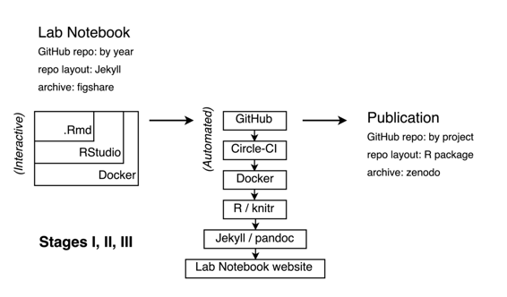

# 使用 Docker 创建可重现的 R 笔记本

# 使用 Docker 创建可重现的 R 笔记本

## 卡尔·博埃提格

我的名字是[卡尔·博埃提格](http://carlboettiger.info)。我是[加州大学伯克利分校环境科学、政策与管理学院](http://ourenvironment.ucberkeley.edu)的理论生态学家，致力于生态系统的预测和决策问题。我的工作涉及开发新的计算方法，通常涉及大量数据，来解决这些问题。

我的工作流旨在提供一种捕捉和重现计算生态学家日常工作的方式，使用自由可用的平台（如 GitHub、Travis CI、Docker Hub）和开源软件（`R`、RStudio、`git`、`docker`、`jekyll`）的格式为在线开放实验室笔记。在过去的 5 年中，我不断调整和改进这个工作流，经常尝试新技术。其他研究人员经常告诉我，他们已经采用了这种方法的部分内容，但很少是完全相同的方式。

我对开放式实验室笔记的一般方法已经在先前的文献中描述过（Gewin, 2013, Mascarelli (2014)），而我在这里专注于记录工作流的更多细节。在可能的情况下，我已经尝试利用通用工具而不是定制解决方案：例如，我使用 Gentleman & Temple Lang (2007) 和 [rrrpkg](https://github.com/ropensci/rrrpkg) 项目中描述的 R 包格式来组织项目目录，而不是引入我自己的定制结构。然而，我的当前系统无疑仍然过于复杂、专业化、晦涩甚至脆弱，不容易被他人轻易采用。相反，我鼓励读者专注于看起来最实用的特定元素或模块，就像其他人所做的那样。

### 工作流程

 给读者的一点提示：以下描述旨在作为一个高层次概述，它在很大程度上依赖于几个强大而成熟的工具和工作流程，包括 git/GitHub、docker/DockerHub、`.Rmd`/RStudio 等。表 1 提供了一个简明的参考，读者可以在其中了解更多关于这些工具及其使用的信息。

表 1：工作流中使用的工具

| 工具 | 描述 / 用途 | 网站 |
| --- | --- | --- |
| git | 版本控制软件 | [`git-scm.org`](https://git-scm.org) |
| GitHub | 用于分享通过 git 管理的代码的在线仓库 | [`github.com`](https://github.com) |
| docker | 用于创建便携式计算环境的容器化软件 | [`docker.com`](https://docker.com) |
| DockerHub | 用于构建和分发 Docker 容器的中央枢纽 | [`hub.docker.com`](https://hub.docker.com) |
| RStudio | 用于编辑 R 和 Rmd 文件的集成开发环境 | [`rstudio.com`](https://rstudio.com) |
| Rmd | R 语言的动态文档格式 | [`rmarkdown.rstudio.com`](http://rmarkdown.rstudio.com) |
| pandoc | 在文档格式之间转换 | [`pandoc.org`](http://pandoc.org) |
| servr | 将 jekyll 与 Rmd 结合的 R 包 | [`yihui.name/knitr-jekyll/`](http://yihui.name/knitr-jekyll/) |
| jekyll | 与 GitHub 紧密集成的静态网站生成器 | [`jekyllrb.com`](https://jekyllrb.com) |
| Circle CI | 灵活的持续集成软件，用于执行推送到 GitHub 的脚本 | [`circleci.com`](https://circleci.com) |
| figshare | 永久数据存档平台 | [`figshare.com`](http://figshare.com) |
| zenodo | 永久存档平台（很好地处理代码/软件） | [`zenodo.org`](http://zenodo.org) |

#### 交互式工作流程

我在进行活跃项目的日常工作流程中，简单地涉及在我的实验笔记本中打开一个带有当天日期的新`.Rmd`文档。在这个文件中，我写下代码、文本、方程式和我的工作的其他元素（见图表，左上角）。

我的工作流程的核心是动态文档工具`knitr`。`knitr`是一个紧密集成到 RStudio 和 R-markdown 或`.Rmd`格式中的 R 包，支持将代码、文档、方程式、图表和研究的其他组件整合到一个文档中。它的关键特点是能够"编织"或"执行"文档，导致代码块被运行，它们的输出图表、表格等被显示在文档中。文本和代码以流行、简单、灵活的 markdown 格式一起编写，这种格式被其他工具广泛认可（例如 GitHub，一个广泛使用的代码存储库，以及 Jekyll，一个基于 Ruby 的静态网站生成器）。Markdown 可以很容易地通过`pandoc`转换为其他格式，`pandoc`是集成到 RStudio（以及其他流行平台如 Jupyter）中的转换引擎，可以生成 LaTeX、HTML、Microsoft Word 和其他文档格式。这种灵活性在将我的`.Rmd`文件转换为适合传统期刊出版的 HTML 页面或其他格式时非常有用。

在进行积极的研究时，我经常发现清晰地区分数据输入（阶段 I）、数据处理（阶段 II）和数据分析（阶段 III）是不切实际的。我只是努力让所有这些阶段的代码和解释都写在`.Rmd`文档中。

我在一个运行在 Docker 容器内的 RStudio 实例中编写/编辑这个`.Rmd`文件，这个 Docker 容器可能是运行在我的笔记本电脑、亚马逊网络服务器，甚至是 NSF 超级计算集群上，取决于我当天的需求。 RStudio 是一个受欢迎的 R 用户集成开发环境，可以通过 Web 浏览器以服务器模式运行。 Docker 是一个流行的容器化工具，允许创建一个整个软件环境的可移植镜像，可以在不同计算机之间轻松移动，而不受架构的限制。我相信这对解决再现性中的常见问题有重大影响，正如我在其他地方更详细地描述的那样（Boettiger，2015）。我的笔记本中的 Dockerfile 提供了一个可执行的配方，用于在[Rocker 项目](https://github.com/rocker-org)维护的现有通用 Docker 镜像之上构建这个计算环境。

#### 自动化工作流程

定期我会在`git`中“提交”我的笔记本，并将这一进展“推送”到 GitHub，这是一个广泛使用的版本控制系统和代码以及其他数字资料的公共存储库。这会触发我的工作流程的自动构建部分，如图中心所示。一个持续集成平台（[CircleCI](http://circleci.com) 在我这里，作为更广泛使用的平台，[Travis](https://travis-ci.org/) 直到最近才支持 Docker 执行）检测到这个提交，并开始执行和组装我的代码。

CI 平台首先下载我的计算环境的公共镜像，这个镜像是由 Docker Hub 自动构建的，Dockerfile 在我的存储库中。还可以从 Hub 中拉取一个单独的 Docker 卷容器，其中包含由 knitr 缓存的结果，用于运行在（免费、公共）CI 平台上运行的任何过于密集的代码。

由于笔记本已经组织成一个 Jekyll 存储库，只需使用`.Rmd`格式的帖子而不是普通的`markdown`，现有工具（参见`servr`，表 1）可以轻松执行 R 代码并将其格式化为笔记本中的新帖子。 Jekyll 模板使得可以自动向帖子添加语义元数据，包括参考文献信息、版本历史链接、提交哈希、修改日期等等。此时，某个探索可能并没有特定的项目与之相关联--它可能是基于几个现有项目、我正在阅读的论文，或者代表一个全新的探索。我在笔记本中使用类别和标签将帖子与相关项目或主题关联起来，这样可以更容易地回顾。 （找到合适的标签比听起来更难！）

每年，我会将包含当年笔记本的 GitHub 存储库存档在 figshare 上，并在存储库的 README 中添加 DOI 徽章。

#### 项目最终化/发布

最终，多个条目将与同一项目相关联。此时，我经常希望重用先前条目中开发的代码。这是我需要在 GitHub 上创建一个新项目的信号。（弄清楚这一点比听起来要困难得多！）我使用与相关笔记本条目中的标签匹配的名称创建一个新的公共 GitHub 存储库。在`R/`目录中，我存储提供这些可重用部分的功能。对于非平凡的功能，我尝试开发单元测试（在`/tests`目录中）--这些通常直接来自我在创建这些功能时在笔记本中编写的交互式测试。我还为我创建的功能添加最少的 Roxygen 文档，通常只是为了提醒我输入和输出是什么。数据存放在`/data`目录中；或者更频繁地，作为 R 脚本，用于模拟或从外部来源下载和清理数据。

笔记本页面不将这些功能作为单个包加载--由于包不断变化，这种方式可能不再有效。相反，它们直接从 GitHub 上的版本明确链接中引入脚本。（我是吃了苦头才学会的）。这样做可以避免确保“包”始终可安装的负担，它只是作为一个方便的组织框架。

我会继续在笔记本的页面中开发、测试和探索结果，根据需要添加和修改功能。这通常涉及大量的错误和死胡同，这些都记录在单个页面的历史中（当我修改现有工作流程以纠正结果时），或者留在笔记本的各个页面中作为死胡同（或未完全探索）。

一旦工作围绕特定一组想法和结果凝聚成适合单个手稿的形式，我就会开始在 GitHub 存储库中起草手稿作为`.Rmd`文件，通常基于笔记本中的`.Rmd`文件。来自 RStudio 的`rticles`包提供了一个模板系统，可以轻松地将`.Rmd`文件渲染成各种期刊格式的`pdf`文章。

在准备提交时，我会将手稿的副本（以`tex`格式生成自`Rmd`）上传到[arXiv](http://arxiv.org)，并配置 Zenodo 永久存档，它会自动连接到 GitHub，类似于持续集成服务。然后，Zenodo 会在每次检测到 GitHub 上的新“发布”时生成一个带有唯一数字对象标识符（DOI）的永久存档。GitHub 的发布是`git`标签系统的一部分，可用于标志软件的新版本或论文的发布。然后，在 GitHub 存储库上显示来自 Zenodo 的 DOI 徽章。

鼓励读者查看我最近项目的任何真实世界示例的存储库，例如[`github.com/cboettig/nonparametric-bayes`](https://github.com/cboettig/nonparametric-bayes)，或者在我的在线实验室笔记页面上查看[`carlboettiger.info/lab-notebook`](http://carlboettiger.info/lab-notebook)。

这些步骤的频率是高度可变的--从一天中的许多提交到数月的间隔。请查看我的 GitHub 提交历史以获取更真实的答案。此外，尽管我的大多数研究项目都涉及其他人，但我是唯一向我的实验室笔记提交的研究人员，就像我们在纸质笔记本中看到的那样。最终的研究产品将会更多地受到其他人的直接参与。

### 痛点

知道何时重构以及如何避免脆弱和不透明的设计。一个好的可重现的工作流程应该像好的软件一样：由简单易懂的模块构建，这些模块执行一项任务。大多数可重现的工作流程，包括我的工作流程，都很容易变得像大多数科学意大利面代码一样：多年来一直被拼凑在一起，因为它们完成了工作。使工作流程或代码易于理解的最佳方法是在它起作用后对其进行*重构*，将其分解为定义明确、经过良好测试的模块，并具有清晰的输入和输出。虽然假装研究可以从一开始就像这样编写是虚构的，但是仅仅捕捉到所有混乱的地方并不提供使某事更具可重用性和可靠性的抽象化。我对如何做到这一点没有好的解决方案--重构是一项严峻的任务，而且几乎没有激励措施。

### 关键优势

这种方法的一个关键优势是使我的工作具有可移植性和可扩展性。通过使复制我的计算环境和分析变得容易，如果发现在本地系统上运行分析过于庞大，则突然重新在云计算机或群集上运行分析就变得容易多了。

另一个好处是更容易地探索研究思路。新想法通常建立在旧想法之上，而对于要记住一些旧东西如何工作的恐惧，才能在尝试探索新东西之前对其进行调整，这种恐惧通常足以让我转向更容易的事情。

### 关键工具

我相信表 1 中提到的任何工具都可能对更广泛的受众有所帮助。我试图将更一般的工具放在前面--GitHub 和 Docker 解决了计算可再现性中的非常普遍的问题，这证明了它们的广泛采用。这些工具可以插入到许多常见的工作流模式中，而无需进行重大改装。

对于 R 用户，RStudio 使得 Rmd 格式作为作者环境变得更加实用，无论是用于网站（例如使用`servr`包）还是期刊文章（`rticles`包）。然而，这些工具可能需要从现有策略进行较大转变，并且提供的收益较小。

我使用的将其与 CI 等链接起来的特定模式可能不太普遍适用，并且比前面提到的工具具有更高的学习曲线。

### 问题

#### 对于您，“可复现性”意味着什么？

在这个背景下，可复现性是“计算可复现性”。这意味着做出了善意的努力，确保分析在运行在可比较的硬件上时可以产生质量相同的结果。这意味着某些事情不需要被再现：例如，代码运行的时间可能会因硬件和操作系统而异，但这没关系。我也不关心位完全相同的结果，也不一定要复现随机抽样结果 -- 相反，我期望从可复现结果中得出的结论对随机种子的细节或随机数生成器的选择具有稳健性。

我还关注可复现性是模块化的 -- 分析的各个组成部分可以被再现（因此可以重新组合或以其他方式修改），而不仅仅提供一个只能复制最终输出而无法变化或调整的黑盒。

最后，我认为重要的是确定*谁*应该能够再现分析。像论文本身一样，分析需要一定程度的专业知识才能理解，我不希望没有编程、统计学或科学流程背景的个人能够复现分析。然而，我期望在我的领域有一定科学背景的研究人员（例如，它被发表的期刊的最广泛读者）并且对 R 语言或类似的计算语言有一些基本了解的人，在阅读文档后能够在适当的时间和精力投入后复现总体结果。

#### 您为什么认为在您的领域中可复现性很重要？

可复现性使结果更可靠，更重要的是，使得扩展、测试和构建现有结果更容易。最终，这使得个人更容易在自己的工作和他人的工作基础上建立，从而使科学变得更快、更好。

#### 您是如何或在何处了解到可复现性的？

独立学习例子，实验和阅读，并通过互联网和社交媒体与其他分享类似兴趣的研究人员联系。

#### 您认为在您的领域进行可复现研究的主要挑战是什么，您有什么建议？

这不是一种标准做法。短期内，这需要更多的时间。它还可能增加发现工作中错误的概率。

#### 您认为进行可复现研究的主要激励是什么？

使研究更易进行。可复现的研究促进了合作，特别是与我自己合作。它增强了我对自己结果的信心，并帮助我更有效地在我已经完成的工作基础上建立。

#### 你会推荐给你领域的研究人员哪些最佳实践？

采用在我的领域（以及其他领域）广泛使用的工具来实现可重复性。这些工具包括：GitHub，Docker，rmarkdown。

#### 您会推荐学习更多关于可重复性的具体资源吗？

表 1 中链接的文档将是开始学习任何单个工具的绝佳起点。此外，可以查看 NESCent 开发的可重复研究研讨会：[`github.com/Reproducible-Science-Curriculum`](https://github.com/Reproducible-Science-Curriculum)

### 参考文献

Boettiger, C.（2015）。使用来自 R 环境的示例介绍 Docker 以实现可重复研究。*ACM SIGOPS 操作系统评论*，*49*（1），71–79。[`doi.org/10.1145/2723872.2723882`](http://doi.org/10.1145/2723872.2723882)

Gentleman, R.，& Temple Lang, D.（2007）。统计分析与可重复研究。*计算与图形统计杂志*，*16*（1），1–23。[`doi.org/10.1198/106186007X178663`](http://doi.org/10.1198/106186007X178663)

Gewin, V.（2013）。转折点：Carl Boettiger。*自然*，*493*（7434），711–711。[`doi.org/10.1038/nj7434-711a`](http://doi.org/10.1038/nj7434-711a)

Mascarelli, A.（2014）。研究工具：跳出页面。*自然*，*507*（7493），523–525。[`doi.org/10.1038/nj7493-523a`](http://doi.org/10.1038/nj7493-523a)
