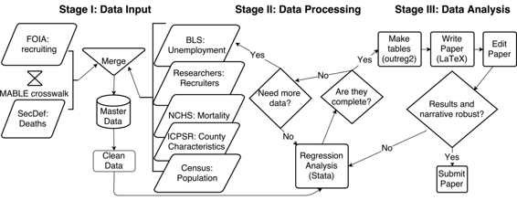

# 估计士兵死亡对军事劳动力供应的影响

# 估计士兵死亡对军事劳动力供应的影响

## Garret Christensen

我的名字是 Garret Christensen。我目前是[伯克利透明社会科学倡议](http://bitss.org)的项目科学家，也是[伯克利数据科学研究所](http://bids.berkeley.edu)的研究员。我致力于劳动力和发展经济学中的项目影响评估问题。我作为加州大学伯克利分校经济学博士论文工作的一部分，从 2010 年开始进行了下面描述的研究。这项研究是关于美国士兵在伊拉克和阿富汗的死亡对军事招募的影响。我使用固定效应的面板数据方法，试图确定美国士兵在伊拉克或阿富汗的死亡对士兵所在的家乡县的招募情况的因果影响。

### 工作流程

这个项目始于一个想法，我从报纸上读到，并听说了 9/11 之后招募站不堪重负的情况，以及几年后对法卢杰之战的普遍反应。下一步是获取主要数据；一位同事碰巧拥有相关数据——美国入伍军人的全部数据——通过信息自由法获得。

主要数据的另一半是来自伊拉克和阿富汗士兵的死亡数据。我从一个[国防部公开网站](http://siadapp.dmdc.osd.mil/personnel/CASUALTY/castop.htm)获得了这些数据。也许并不令人意外的是，原始网站现在已经不再可用。幸运的是，我仍然有，并且已经在 Dataverse 上归档了我下载和使用的原始数据集。数据的更新版本仍然[公开可用](https://www.dmdc.osd.mil/dcas/pages/casualties.xhtml)。为了合并招募和死亡数据，我使用了 Missouri Census Data Center 的[MABLE/Geocorr](http://mcdc.missouri.edu/websas/geocorr12.html)来构建地理交叉表。这使用人口普查地理数据，所以我使用了 2000 年的人口普查版本，但可悲的是我不认为我记录了构建这个交叉表时使用的每一个确切选项。

我使用 Stata 将这些数据合并在一起，并进行所有后续的统计分析。不，Stata 不是开源的，但它是大多数经济学家使用的工具。我所有的工作都是在脚本（.do）文件中完成的，并且通过 'version' 命令，理论上任何其他用户都应该能够产生相同的结果。代码是版本控制的，但只是通过更新带有日期作为文件名的脚本文件来实现的。旧版本的文件只是被丢到一个存档文件夹中，永久保存在那里。

合并的数据使用 Stata 中的 xtpoisson（泊松）和 xtreg（线性）回归算法进行分析。回归表格被输出为制表符分隔的纯文本文件，使用用户编写的 'outreg2' 命令，在 Excel 中编辑，保存为 .pdf 文件，然后包含在组成我的论文的 LaTeX 文件中。显然，Excel 是不可重现性的对立面，但我没有改变表格中的数字，只是格式。我在论文上的下一个要做的事情就是剪掉这个笨拙的步骤，直接从 Stata 到 LaTeX。我认为我最初采用这种方式的唯一原因是因为我对 LaTeX 不够熟悉，无法弄清楚它。

回归输出第一次并不完整。我多次回到添加来自其他来源的数据，例如劳工统计局、人口普查局、ICPSR 等。这将需要更新合并和分析代码，重新格式化表格，并更改引用特定输出的论文中的文本。不幸的是，这个过程仍在进行中，因为这篇论文尚未被期刊接受。

### 痛点

鉴于这项研究基于观察数据，并且我没有预先确定我的统计分析计划，我非常怀疑任何其他研究人员查看我原始的原始数据（甚至是我清理后的最终数据）会同意我应该在论文中包括的确切的回归规范集。然而，为了透明起见，我尽量在论文的附录中包含几乎详尽的备选规范集。例如，所有结果都可以使用对数线性和泊松回归规范来获得。

关于数据，尽管我非常感谢国防人力资源数据中心的工作人员为我提供了数据，但我对多个相同的信息自由法请求得到完全相同的数据集并不十分有信心，因为我无法访问原始数据，并且无法验证我获得的数据集是否是我请求的真实观察数据的真实宇宙。也许这只是所有原始数据的问题--你永远无法回到人口普查中的所有家庭并检查他们的答案，但你确实可以从人口普查服务器下载数据。我无法访问国防人力资源数据中心的服务器，但如果我提供他们给我的数据，这是否意味着我们是可重现的？如果，正如实际发生的那样，你注意到某种类型的观察数量完全不合理地低于据称是这些观察的宇宙？

最后，我想说我的代码相当有文档性，尽管需要大量工作才能达到这一点。通过阅读，我希望其他研究人员能够理解代码正在做什么。目前还没有 readme 文件，但有一个主要的.do 文件，理论上应该能够从头开始重建我所做的一切。我已经在这个项目上工作了几年，期间有几次长时间的休息，因为经济期刊可能需要 6 个月才能做出决定。我不得不回头去广泛重新检查我不再记得的代码。经过几次这样做，代码现在似乎相当有文档性。如果我有一个研究日志，这个过程会容易得多。我不得不打开几十个日期版本的同一个文件，才能找到一个在重大更改之前写的最后一个版本，如果使用版本控制或研究日志会容易得多。### 关键优势

我会说，对于社会科学来说，特定版本控制软件的使用相对较新。当我在 2010 年开始这项工作时，我从未听说过 git。我只是使用了从我的导师那里学到的方法：在文件名中包含日期，并且每次对脚本文件（在 Stata 中称为“.do 文件”）进行重大更改时，更改日期。像我现在所做的那样使用分布式版本控制系统（DVCS）是一个重大的改进。

### 关键工具

使用 [outreg2](http://repec.org/bocode/o/outreg2.html)（或 [estout](http://repec.org/bocode/e/estout/)）用户自定义命令在 Stata 中自动将回归输出转换为期刊格式的表格是一个很好的可重现性工具。尽管我使用了这些命令，但目前我需要进行一个笨拙的两步过程，首先将表格输出为.csv 文件，然后稍微编辑格式，然后将表格包含在我最终使用 LaTeX 撰写的论文中。理想情况下，将这些命令用于直接输出表格为.tex 文件，并将其包含在我的论文文件中。

### 问题

#### 对你来说，“可重现性”意味着什么？

对我来说，可重现性是其他研究人员能够获得与我的论文中相同的结果。在最弱的形式中，这只需其他研究人员能够下载我的最终数据集，运行我的最终分析代码，只需更改文件路径名一两次，就能获得与我的论文中相同的确切结果。更好的可重现性版本是其他研究人员下载我的原始原始数据集--其中两个主要数据集我已经通过[哈佛数据集](https://dataverse.harvard.edu/dataverse/garretchristensen)公开提供--重新进行我对数据的广泛合并和清理，然后获得相同的结果。更好的情况是其他人经历与我和一位同事一样的国防部长办公室的信息自由法案（FOIA）请求过程，重新合并数据，重新进行我的分析，进行他们认为合适的分析，然后获得相同的结果。我对此有一些担忧，下面会描述，但我已经尽力而为，并且基于这样的假设，即任何缺失的数据不会以偏向我的估计的方式相关，并且我在分析中足够彻底，以至于我的结果对其他形式的分析是稳健的。

#### 您认为在您领域中可重现性的重要性是什么？

在高调发表的经济学研究中发现了重大错误。从某种意义上说，经济学做得很好，因为许多顶级期刊要求数据共享，因此实际上可以发现这些错误，因为复制者可以访问数据。但是，如果没有对分析进行系统性复制或代码检查，我们仍然不知道有多少研究受到这些问题的影响。我们应该连同孩子一起把洗澡水倒掉吗？我认为不应该，但目前我们还不知道。

此外，即使经济学家分享他们的数据，他们很少分享原始数据和所有的清理代码，而只分享最终数据和分析。我们是人类，所以可能会犯一些未被注意到的编码错误。

#### 你是如何学习到可重现性的？

我的研究生导师爱德华·米格尔在我作为研究生研究助理参与他的项目时，教会了我使用文件名进行版本控制的简单方法。

#### 您认为在您领域进行可重现研究的主要挑战是什么，您有什么建议吗？

经济学中透明度和可重现性的许多进展来自医学科学，随机对照试验在那里并不新鲜。但在经济学中，RCTs 仍然是极少数。像我在这里的工作一样，大多数工作都是观察性的。经济学直到 2013 年才创建了[AEA RCT 注册表](https://www.socialscienceregistry.org/)，并且对观察性工作的注册没有进行严肃讨论。我们应该注册观察性工作吗？我们应该为观察性工作预先注册统计分析计划吗？这在经济学中都是未知领域。

#### 你认为进行可重复研究的主要动机是什么？

要做到可重复性需要额外的前期成本。从长远来看，好处应该超过成本，因为当有人想要扩展或复制我的研究时，他们不会在我的工作中发现任何令人尴尬的错误。

#### 你会推荐给你领域的研究人员哪些最佳实践？

在你的代码中添加大量注释，这样当期刊在 6 个月后对你的提交做出决定时，你就知道自己在做什么。使用版本控制保存所有分析文件。使用一键式工作流将表格直接整合到论文中，这样你就不会丢失输出。

#### 你会推荐哪些特定资源来了解更多关于可重复性的知识？

J. Scott Long 的[*使用 Stata 进行数据分析工作流*](http://www.indiana.edu/~jslsoc/web_workflow/wf_home.htm)

我的[*透明社会科学研究最佳实践手册*](https://github.com/garretchristensen/BestPracticesManual)
