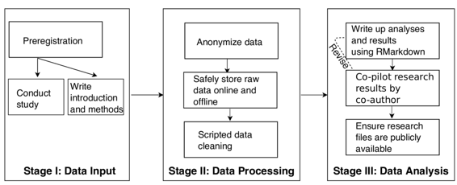

# 验证检测数据伪造的统计方法

# 验证检测数据伪造的统计方法

## 克里斯·哈特格林

我叫克里斯·哈特格林，我是蒂尔堡大学的一名应用统计学家，专门研究用统计方法检测潜在的数据伪造。作为一个博士生，我关注我的工作流程，以提高效率并确保应用现代工具来改进我的研究。我的案例研究将围绕一个项目展开，我在这个项目中评估统计方法检测真实和伪造数据的表现。在这个项目中，我收集真实数据集，并邀请研究人员伪造数据集，然后我应用统计方法来检测数据伪造。

### 工作流程

 统计方法可以用来检测潜在的数据伪造，但它们的有效性是未知的。模拟研究人员如何伪造数据是不可能的，因为我们根本不知道研究人员实际上是如何伪造数据的。虽然有关揭露不端行为案例的轶事摘要存在，但并不具有普遍性。为了以生态有效的方式测试统计方法的表现，我邀请研究人员为一项我们也有真实数据的研究伪造数据。通过这样做，我们可以测试一组统计方法来检测数据伪造的有效性。更具体地说，真实数据包含抽样方差，而伪造数据通常包含不足的抽样方差。这样的分析示例是测试非显著的 p 值是否均匀分布，或者更高的 p 值是否比更低的 p 值更频繁出现（这在理论上是不合理的）。

在项目开始时，我们进行了一次初步会议，详细说明了项目的具体方面。这次会议对于确定和分配责任、开始讨论伦理考虑以及项目将如何进行至关重要。对于这个项目，我们讨论的主要点包括（i）伦理义务是保证参与者完全保密，因为他们在技术上被要求违反伦理标准，以及（ii）如何说服参与者这项研究有正当理由要求这种行为。我们要求参与者生成数据，并决定默认情况下不保存任何识别信息，并在实际可能的情况下立即永久删除他们提供的识别信息。我们决定通过研究目标本身来激励参与者，并根据我们能否用统计方法检测到他们的数据伪造来奖励他们。在这次初次会议中，我想要提及的几个默认点包括：

1.  默认情况下同意研究文件将被公开共享，并且需要适当的理由来*不*公开共享研究文件（例如，伦理委员会的限制）。

1.  同意公开共享的研究文件放在公共领域（授权 Creative Commons 0），以最大程度地增加研究材料的再利用权利的广度和清晰度。

1.  同意研究手稿在完成后作为预印本共享，以获得更好的同行反馈，并且手稿将以适当和明确的再利用许可证公开发表（即，CC-BY 或 CC-0，绝对不是 CC-BY-Non-Commercial）。

1.  角色分配（例如，项目负责人，筹款人，分析师，谁将检查分析）。

1.  指定研究项目

项目负责人随后起草了项目描述和研究材料的初稿。这些内容包括设计的技术描述，假设和理论框架，以及数据分析的初稿。这种增加透明度的分析方法增加了作者之间的问责制。详细说明这些方法很重要，因为看似显而易见的事情可能并非如此，这有助于让每个人都站在同一起跑线上（例如，我们是否包括协变量？我们是否同意如何测量协变量？）。在分享这些草稿并反复修订后，实验被提交给伦理委员会审查，因为该研究涉及人类参与者。考虑到每所大学有不同的程序，我在这里不会详细说明这些。

会议后起草的文件包含在 GitHub 存储库中，这允许对文件进行版本控制，提供一个日志记录。这些文件被同步到一个开放科学框架（OSF; osf.io）存储库，以增加可发现性和在手稿中包含更短的 URL。版本控制可以用来比较计算机文件的更改记录，允许您回溯并查看进行了哪些更改以及何时进行了更改。通过版本控制创建了更改的日志记录，这提高了研究过程的可重复性，如果有人感兴趣的话。我的个人经验表明，这种日志记录很少被检查（除了数据审计），但当有人问您特定事件发生的时间时，它可以作为一个方便的参考。版本控制在初始会议后立即开始时最为有效。

在获得伦理批准后，版本控制的研究文件被预注册。这种预注册是在 OSF 上完成的。这种预注册创建了研究文件的不可更改的快照，并附有时间戳，这证实了我们在实际进行研究之前设定的目标和预期。

在预注册之后，我们实际进行了研究。由于我们的研究运行了几周才达到参与者的配额，我利用这段时间将预注册重写成了手稿的介绍和方法部分。事先计划好这一点，我在预注册中已经使其类似于这些部分。然而，我也建议在预注册中更加详细，然后将其简化为手稿，因为手稿通常不包含所有重要的研究细节。

在进行研究时，原始数据以非专有文件格式和只读文件的形式存储。确保文件为只读是很重要的，这样就不会意外地对文件进行调整，而且我可以遵守数据政策（即始终需要保留原始文件）。将这些原始数据保存为非专有格式意味着我没有将其保存为 SPSS、Excel 或其他商业格式，而是保存为明文文件（例如，逗号分隔值（CSV）文件）。明文文件确保数据在未来仍然可读，而专有文件格式可能不会。此外，使用明文文件其他人不需要获取商业软件包来读取数据。

在安全存储数据之后，我以自动化的脚本方式清理数据。我在`R`中进行数据清理。我尽量不手动清理数据，因为我经常会忘记自己做了什么；脚本化的数据清理完全避免了这一点。如果我确实需要手动清理数据，版本控制提供的日志簿是确保可重复性的安全措施；完全自动化的数据清理最终是确保可重复性的简便途径。例如，在这个项目中，我必须将响应拆分为单独的数据点，这需要几个小时来自动化，但手动操作会花费我更多的时间，而且会使其不太可重复（并且更容易出错）。

随后，我用`R`和`RMarkdown`进行了分析。`RMarkdown`允许数据分析和写作结合到一个文件中。因此，所有结果都直接动态生成到手稿中。这帮助我防止错误并增加了结果的可复制性。例如，统计结果 F(1, 12) = 5.43, p = .037 不会手动输入，而是用`R`代码自动生成。通过这样做，我们不仅增强了可复现性，还防止了人为错误；在前一个结果中 p = .037 应该是 p = .038，这是一个很容易犯的简单舍入错误。对于这个项目，我编写了几个特定的函数来测试 p 值的均匀性，当真正没有效应时进行数据制造，分析方差的抽样波动，并将这些统计工具结合起来检测数据制造。根据这些结果，收集到的真实和伪造数据被分类为真实或通过统计工具检测到，这表明了这些方法的性能。

完成分析后，我请求一位共同作者检查所有分析和结果（我们称之为共同驾驶）。这些评论导致分析脚本发生变化（例如，数据处理错误），但由于使用了动态的`RMarkdown`手稿（另一个好处是：不必重新做手稿中的所有数字），这并不是问题。在这些错误被修正并再次检查后，手稿和结果是（大部分）可复现的。我通常会做最后一次检查，以确保一切都按计划进行，并且所有分析都可以在独立的计算机上运行（即，是否存在未指定的依赖关系）。

在提交手稿之前的最后一步是确保分析与预注册相符，并且所有研究文件都已公开。研究表明，预注册分析的研究人员经常报告其他分析，这表明很容易忘记最初计划做什么。交叉检查可以及时发现这些错误。另外，我看过几篇文章，研究人员声称已经公开了研究文件，但他们的文件已上传（例如，Github），但尚未公开。这些最终检查确保结果符合预注册计划，并且可以被他人访问。

### 痛点

我认为可复现工作流程中特别痛苦的部分是共同编写分析脚本。当一个研究人员是可复现的时，这一点是显而易见的，但也表明要使可复现性变得容易可能相对复杂。有时候检查同事的分析可能需要整整一天的时间。然而，随着可复现性的增加，共同编写变得不那么费力。此外，了解检查他人工作的特殊性有助于提高您自己的可复现性。这就是为什么我费尽周折确保*一个*文件足以获得手稿中的所有结果，而依赖项或数据文件不会造成任何麻烦。

可复现工作流程中另一个费力的方面是项目负责人通常需要强制执行可复现性。我希望我的研究是可复现的，因此我在项目中强制执行这一点。合著者可能对此持有不同观点，因此不会感到责任。因此，您必须确保他们所做的工作也是可复现的。如果项目有一个集中的项目负责人，这不是一个很大的问题。然而，对于更为分散的项目，可能会造成一些困难。这需要您对项目进行彻底的结构化，但随着项目复杂性的增加，需要的工作量也在增加（请注意，随着项目变得越来越复杂，对可复现性的需求也越来越高，因为出错的可能性也越高）。

### 关键优势

我的工作流程近年来得到了积极发展，最终形成了可以从脚本本身运行所有内容的分析脚本。这对于试图复现结果的人来说几乎不需要任何操作，只需下载脚本即可。当一个研究人员分享十个文件时，你必须找到一种方法来处理它们，这可能会让人感到非常困惑。仅仅透明是不够的。为了实现可复现性，非常重要的是结构化您的文档，以便他人，包括您未来的自己，能够理解正在发生的事情。

版本控制是可复现工作流程中的一个好处，因为它不仅超越了研究结果的可复现性，还确保了研究过程的可复现性。我的直接同事们也开始意识到这一点；听到他们强调这有助于通过追溯他们的步骤来提高效率是令人肯定的。我希望其他同事能够尽早看到这一价值（例如，在他们的数据被审计时）。

### 关键工具

我使用一组工具，它们有一个共同点：它们都基于开放格式，这些格式是永恒的、包容的，并且可以被任何有计算机的人使用。这些开放格式包括明文文件中的数据，还包括开源软件包，其代码由开源和学术社区检查（例如，`R`，`git`）。在我经常活动的社会科学领域，封闭软件的使用似乎已经蔓延开来，而人们并没有意识到这实际上正在损害科学的未来（例如，结果不可重现），同时也损害了当今的科学。并非每个人都能负担得起 SPSS 或 Microsoft Office 的许可证，例如。为什么要排除那些没有这些资金的人？科学是一个应该包容所有人，而不是根据个人或机构的财富选择的事业。我通过确保我使用的所有工具都是开源的，并且任何想要使用的人都可以使用来重申这一原则。

### 问题

#### "可重复性"对你意味着什么？

对我来说，可重复性涉及到研究结果的可靠性，这既包括直接可重复性（即，其他人是否可以通过将所描述的方法应用于相同数据来重现结果？）也包括再测可靠性（即，如果我们重新运行研究，我们是否会得到类似的结果？）。我的案例研究侧重于直接可重复性，也就是说，任何人或未来的我都可以追溯项目的步骤，以便理解并确保结果可靠。

#### 你认为在你的领域中可重复性为何重要？

科学家是人类，人类会犯错误。通过使用可重复实践，我们可以发现这些错误，不会被基于错误的研究路径误导。在我的领域中，这很重要，因为我们宣扬科学必须以可重复的方式进行。

#### 你是如何或从哪里了解到可重复性的？

在攻读硕士学位期间，当我的导师向我介绍了开放科学的概念时，我对可重复实践产生了兴趣。我发现自己在思考如何在研究过程的不同阶段实施它，不知道从哪里开始在研究*期间*进行文档记录。我从世界各地和各个领域的同事那里学到了很多，我们讨论了如何更具可重复性（主要是在 Twitter 上，这是研究人员的一个非常宝贵的资源）。

#### 你认为在你的领域进行可重复研究的主要挑战是什么，你有什么建议吗？

当你找到一种新的做事方法，然后觉得你以前的工作不完整时，可重复研究就会变得烦人。此外，并不是所有的同事都像你一样热衷于可重复性，这可能会导致讨论（这也是一件好事），延迟实施某些实践。在项目将如何管理的初次会议上让每个人都心领神会是非常重要的，这样在最后不会有人感到惊讶和潜在的矛盾。

#### 你认为进行可重复研究的主要动机是什么？

进行可重复研究的主要动机是（未来的）效率。当你知道你可以回顾几年前的项目，并且最多只需要 30 分钟就能找到你要找的东西，这比花一整天在你的电子邮件中找到某人询问的那个特定值要好得多。这也有助于重新审视以前的项目，并看看我做了什么，因为我经常忘记我在新项目中需要的东西（例如，我经常忘记如何在`ggplot2`包中制作图表，因为我使用它的频率太低，我只是重复利用以前项目中的代码）。

#### 你会推荐给你领域的研究者一些最佳实践吗？

我建议任何研究者应用以下最佳实践：

1.  用开放许可（CC-BY 或 CC-0）授权你的作品，明确说明你的材料和手稿可自由重用。

1.  尽可能地对你的数据处理和分析进行脚本化，使每个步骤都能被复现。

1.  请一位同事检查你的分析代码，这太容易出错了。不检查分析代码相当于不让合著者校对手稿。

1.  尽量创建一个可以自动运行的分析脚本，下载所有必需的文件并安装其依赖项。否则，其他人在无法获得依赖项时，很可能无法复现您的结果。

#### 你会推荐学习更多关于可重复性的特定资源吗？

我推荐阅读卡尔蒂克·拉姆（Karthik Ram）关于在研究中使用版本控制的文章。它让我认识到版本控制作为一种项目管理工具，在尽可能低的成本下提高了可重复性。低门槛的版本控制可以在 OSF 上获得，该平台提供在线培训工具（请参见 osf.io）。

拉姆，K.（2013）。Git 可以促进科学领域的更大可重复性和增加透明度。《生物和医学源代码》，8（1），7。
