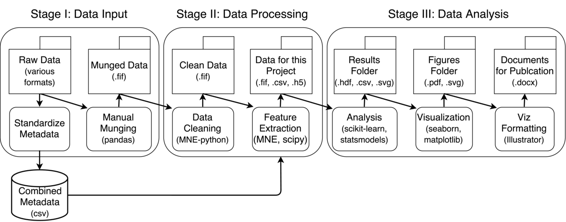

# 用于 Python 中大脑预测模型的特征提取和数据整理

# 用于 Python 中大脑预测模型的特征提取和数据整理

## 克里斯·霍德格拉夫

我的名字是克里斯·霍德格拉夫，我是加州大学伯克利分校海伦·威尔斯神经科学研究所的高年级研究生。我的论文工作涉及使用预测模型来理解大脑听觉区对声学特征的反应方式。

我对经验、学习和对世界的假设如何塑造我们与声音低级特征互动的方式感兴趣。这涉及大量的计算工作、信号处理和数据清理，利用了 Python 科学生态系统中的许多软件包。

### 工作流程

 我的工作流程涉及从各种来源获取原始数据，对每个数据进行几个步骤的处理，将它们合并为一种通用的结构化格式，然后对这些数据进行进一步处理。以下是一般的分解：

#### 整理原始数据

我的工作原始数据涉及从全国各地手术患者的大脑中收集的电生理信号。这很具有挑战性，因为数据的性质在不同地点之间有很大不同。我经常以许多不同的格式获取神经数据，并且松散地收集了一些元数据（例如，传感器位置、名称、采样率），这些元数据可以是从手写笔记的 PDF 到结构化文本文件的任何东西。因此，我工作流程的第一步是将所有这些数据整理成某种结构化格式。

首先，我将所有数据放入特定于主题的文件夹中。每个文件夹都有不同种类数据的子文件夹（例如，“原始”，“处理过的”，“元”）。子文件夹最终将在处理过程中填充数据，并且结构在所有主题中保持一致，以便我可以轻松地使用脚本解析它们。

接下来，我有一个独特于每个人的 Jupyter 笔记本，旨在将数据处于任何原始格式并将其转换为标准化版本。这称为 `munge_{subject_name}.ipynb`，并将输出一个文件，我可以用于我的其他分析。Jupyter 笔记本在这里很有用，因为每个主题都不同，并且需要不同的步骤来准备数据。出于这个原因，我喜欢有很多与分析过程相关的图形，以及创建该主题的处理过的数据的确切代码记录。

由于数据通常以不同的格式提供，我让此步骤的输出对所有人都是相同的格式。我使用了一个名为`MNE-python`的神经科学电生理 Python 包。这提供了一种通用的数据结构方式，以便简化输入/输出、处理和数据分析。我将所有的原始数据转换成`.fif`格式，这是一种存储电生理数据的标准格式。这意味着我可以相当容易地将数据读入其他平台（例如，R 或 Matlab）。输出文件存储在文件夹`subject_name/munged`中。

在这一步中，我要做的最后一件事情是查看这个主题的元数据文件，仔细检查里面的所有值是否正确（这是通过数据处理笔记本完成的），然后将它们插入到一个元数据的“合并”CSV 文件中。我有一个名为`create_combined_meta.py`的 Python 脚本，它会遍历所有主题文件夹，找到我的数据处理笔记本输出的元数据文件，并将它们全部转换为单个 CSV 文件。

这个汇总的 CSV 文件包含了我拥有的所有主题的数据，并且使得快速查看跨数据集的信息变得更加容易。为了这样做，我使用`Pandas`。这是一个让你在内存中表示类似表格的数据的包，并且还通过它们的对象提供了“数据库风格”的功能（例如，将两个部分重叠字段的`Pandas`对象连接在一起）。这样做需要所有的数据都是“整洁”格式的。这简化了事情，因为这意味着虽然我对每个数据集有一个单独的文件，但我对它们的元数据有一个跨所有主题的单一组合文件。

我应该指出，这是有人通常建议使用“适当的”数据库，如 SQL，而不是将我的数据保留在 CSV / FIFF 格式中的时候。我发现，为了将我的数据重新格式化为类似 SQL 的东西所增加的开销不值得它所带来的好处。如果我要开始一个新项目 - 尤其是使用更大的数据集 - 那么我可能会考虑一个更健壮的数据存储解决方案，如 SQL。

#### 清理数据

一旦我创建了我的数据处理结果，现在我可以使用一个单独的脚本来处理/分析所有数据集。在认知神经科学领域，有一些常见的预处理技术，旨在提高数据的质量（例如，一些滤波步骤和拒绝过于嘈杂的通道）。我有一个名为`clean_data.py`的文件，它将遍历每个主题的“数据处理结果”文件夹，加载数据，运行清理，并将结果输出到文件夹`{subject_name}/clean`。这样，我就知道干净文件夹中的任何数据都已准备好进行进一步分析。

在这一点上，我在每个主题文件夹中都有干净的数据，我还将该主题的元数据插入到一个包含所有主题信息的 CSV 文件中。从现在开始，我只需加载一个主题的数据文件，然后加载所有人的元数据 CSV 文件，并仅查询属于我关心的主题的行。

#### 定义项目

当我开始分析我的数据以回答特定问题时，我会创建一个新的项目特定文件夹，该文件夹与我的“data”文件夹并列存在。每个项目通常包括多个分析，这是将它们都放在同一个地方的方法。项目文件夹的结构类似于“data”文件夹。它有一个用于“scripts”的子文件夹，一个用于“data”的子文件夹，一个用于“results”的子文件夹，一个用于“documents”的子文件夹以及用于出版这个项目的任何信息。

例如，我可能首先会创建一些 Python 脚本来提取感兴趣的特征。我会将它放在`project_name/script/feature_name/extract_feature.py`中。该脚本假设每个主题都有数据在“clean”文件夹中。它将从“clean”中提取数据，提取我感兴趣的任何特征，然后将结果保存到项目特定的文件夹中，类似于`project_name/data/my_feature/{subject_name}_feature.fif`。我解析所有主题文件夹，并以相同的方式保存文件。

将所有主题的提取特征存储在单个项目特定数据文件夹中，使得进一步分析结果的脚本/笔记本的开发变得更加容易，因为我不需要追踪为哪些主题提取了哪些特征。我还使用 Sun-Grid 引擎（用于在一组计算机集群之间分配计算的平台）来加速我的分析。我可以相对容易地做到这一点，因为每个主题的文件夹结构都是相同的。

#### 运行分析

现在，我为每个主题创建了一组特征，是时候运行分析并回答问题了。这些脚本也存在于项目特定的文件夹中，并假定“project_name/data/my_feature/”文件夹中有数据。

我遇到的一个困难是如何判断何时将分析保留在交互式笔记本中，而不是 Python 脚本中。我通常会先以交互方式试验我的分析 - 这让我可以进行健全性检查和即时计算，有助于我制定最终的分析。一旦我有了执行特定分析的代码，我就会将其放入`.py`脚本中。

然后，此脚本的输出进入`project_name/results/my_analysis`文件夹。它们可能是 PDF 和 SVG 形式，供进一步检查，或者数据文件（例如，CSV）表示模型结果（如回归系数）。对于由列表、numpy 数组或简单数据帧组成的任何内容，我使用`h5io`包，它提供了一种快速的方法来读取/写入`hdf5`文件（另一种标准化的数据存储格式）的集合。

最后，我使用分析脚本的输出来创建可视化，并决定我的分析是否真的有效。我使用另一组笔记本来读取结果，执行最后一刻的整理、统计等，并输出可视化效果。如果我有一个出版准备好的图形在脑海中，我会专门为该图形创建一个笔记本，放在另一个名为`project_name/fig_{analysis_name}`的文件夹中。

在为论文创建实际图形时，我喜欢使用像 Adobe Illustrator 这样的软件，以确保我的字体大小合适，间距良好等等。我使用可视化笔记本创建我的数据的高分辨率 PNG 版本，除了数据之外，大多数格式都被剥离了。然后，这些图表链接到一个 Illustrator 文件，这样当创建新的图表时，它们会自动更新。这样，我可以轻松地排列我的图表并标准化字体，而无需进行大量手动调整。

最后，我使用 Microsoft Word 写草稿，将其放在“doc”文件夹中。这些草稿来自我在“fig”文件夹中创建的图形。理想情况下，我会在这里使用 LaTeX 的文本文件，但我工作的团队使这成为了不可行的。

#### 一般说明

这个过程在过去的一年里经过了多次完善，原始结构看起来与现在非常不同。我的原始文件系统中的代码和数据位于完全不同的位置。此外，项目特定的脚本和更通用的实用脚本位于同一位置。这个文件结构的目标是在数据和脚本有自然配对关系时将它们放在一起，并从“更生产就绪”的函数/模块中分离出“更加垃圾”的项目特定脚本。以下是我在这个过程中学到的一些东西，也指导了这个系统的发展：

1.  对于任何项目特定的数据/代码，请将其放在相同的通用文件层次结构中。

1.  而不是创建与数据相邻的元数据结构，设计一个“主”元数据模板，然后将每个受试者的条目存储在遵循此模板的 CSV 文件中。而不是将数据存储在单独的受试者文件中，将带有“受试者 ID”的条目包含在元数据文件中，以便以此方式提取单个受试者。

1.  尽可能利用其他包，特别是在数据 I/O 的烦人任务中。在我的情况下，我将所有原始数据存储为‘.fif’文件，这些文件可以在 Python 或 Matlab 中轻松打开，并且有着良好支持的第三方包。我还使用`pandas`和`h5io`来读取/写入元数据文件，这样可以很容易地对这些文件进行切片和切块，以获取我想要的特定条目。

1.  更一般地说，以数据库的方式处理数据的存储方式。即使我并不是在 MySQL 数据库中存储数据，我仍然可以借鉴数据的组织方式。将数据条目视为行，数据特征视为列，然后使用 pandas 数据库风格的语法（例如，连接和合并）组合/拆分数据。一个很好的指导原则是 Hadley Wickham 描述的“整洁”数据规范。

1.  将临时代码放在项目特定的文件夹中。对于任何项目，对于公共 Python 模块中暴露的代码要更加挑剔。如果你认为一个函数值得概括，那么将其移出项目文件夹并移到其正确的模块中，并对其进行详细记录。

1.  所有编码都要使用自动 PEP8 和 PEP257 检查器。PEP8 是一组用于命名约定、代码语法、使用空格等的标准，以确保代码整洁可读。PEP257 是一组类似的文档字符串指南。许多“功能齐全”的文本编辑器都有插件，可以根据这些指南自动检查代码并突出显示错误，这对快速编写整洁代码很有用。

1.  请有意识地将 Python 脚本的结构与 Jupyter 笔记本区分开来。结构化代码（和数据），使其更适合脚本编写，而不是假设一切都是交互式会话。

1.  使用 Jupyter 笔记本查看数据和初步结果，但随着代码变得更加精细或复杂，将其移入脚本中。这样可以避免创建一个包含大量不同分析的大型笔记本。

1.  结构化代码，使一些脚本与它们操作的数据一起。例如，如果你有一个只操作特定数据集的脚本，重命名该数据集中的特定列，并始终将其保存到原始数据的另一个位置，那么在数据文件夹旁边创建另一个名为“script”的文件夹。将所有特定数据的脚本放入此文件夹。这样，你就知道脚本与相关数据一起操作。

1.  最后，这不是特定于这个项目，但对我非常有用。寻找机会为其他开源项目做贡献。提交拉取请求并学习如何使用代码。你得到的来回反馈和输入将使你成为一个更好的编码人员，你的代码库/研究将极大受益。

### 痛点

我的工作流程中最困难的部分是如何平衡灵活性和控制。一方面，你不希望你的脚本对数据过于特定，以至于一旦有任何变化就会出错，但另一方面，编写能够很好泛化且不会令人困惑的代码确实非常困难。在我的情况下，我最初在这两个方面都犯了错误，但目前我的数据结构似乎更直观，易于维护和扩展。

我遇到的另一个大问题在于处理不同格式的数据和信息。例如，我想对我编写的所有代码进行版本控制，但：

+   这是否意味着我应该为上述所有代码创建一个大型存储库？每个项目是否应该有一个单独的存储库？

+   我应该如何区分一般模块和函数与仅与特定项目一起存在的代码？

+   最后，我应该如何处理与这种文件结构一起存在的许多其他“非代码”文件（例如，图像）？它们应该进行版本控制，还是代码应该假设数据位于特定文件夹中？如果其他人复制了代码但没有获取数据，会发生什么？

我并没有对这些问题有很好的答案，我仍在寻找一个让我满意的解决方案，但这些是我正在思考的一些事情。

### 主要好处

这个系统最大的好处在于，混乱的、特定主题的数据很快被转换成了一个标准化的格式，这个格式在我所有的学科中都是一致的。这很有用，因为这意味着你可以编写脚本来分析整个数据集，而不需要做很多额外的定制。此外，由于文件系统的结构对每个人都是相同的（包括命名约定等），所以很容易从每个数据集中找到你想要的东西。

另一个好处是，我将代码与其操作的数据一起存储。有些人坚决认为这是一个坏主意，但我发现只要项目内的文件夹结构仍然合理，这是有用的。在以前的工作流程中，我把所有的代码放在一个文件夹里，把所有的数据放在另一个文件夹里。这经常导致混乱，我不确定哪些代码操作哪些数据。这也使得连接预处理和特征提取链的步骤更加困难。现在，如果我想知道对一组数据文件做了什么事情，我只需要查看其相应的“脚本”文件夹。

最后，通过将适用于所有项目的操作（例如数据整理和清理）与项目特定的操作分开，个别项目的范围变得更加清晰和易于跟踪。我把数据管道想象成一棵单一的树干，项目从这个树干上分支出来，在基础预处理工作流之上对数据进行额外处理。现在，我的文件结构更自然地遵循这个概念。

### 关键工具

我发现的两个最有用的工具是`Pandas`和`MNE-python`。Pandas 使得将元数据嵌入到我分析的信号中变得更加容易。它允许我将来自许多受试者的信息存储在一个单独的 CSV 文件中，并通过对其进行查询来将其视为一个“数据库”。`MNE-python`是一个用 Python 编写的神经科学中的电生理学包。当我发现它时，我发现它复制了我已经编写的许多函数，并且总体上做得比我好得多。此外，它有许多方便的函数用于进行 I/O 操作，这在那时是一个难以维护的痛点。通过使用这两个包，我能够大大减少我用来处理数据的自定义函数的数量。

### 问题

#### 对你来说，“可重现性”是什么意思？

这篇文章的讨论涵盖了项目的前 6 个月。在这个范围内，我的“可复现性”的定义是实际上能够重现我的结果（也就是为了我的未来编写代码）。我遇到了许多问题，使得难以在自己的脑海中保持事情的简洁和可理解性，这使得解释我的发现变得困难。显然，这也会泛化到其他试图重现我的分析和工作的科学家。

#### 您认为在您的领域中可复现性的重要性在于什么？

因为它是一个指导原则，将使我的代码更易于理解，更易于维护，也更易于为他人和自己扩展。

#### 您是如何或从何处了解到可复现性的？

起初，这来自于教授几个软件工程课程和在线阅读的一些内容。最近，我通过为`MNE-python`项目做出贡献获得了很多帮助，因为我发现为一个维护良好的项目进行拉取请求过程是学习良好编码的一种很好的方法。

#### 在您领域进行可复现研究的主要挑战是什么，您有什么建议吗？

在我的情况下，法律性是一个大问题，因为我处理的医疗数据不能公开共享。另一个大问题仅仅是培训和激励问题。现在几乎没有机会学习如何编写良好的代码或如何进行可复现的科学研究。更糟糕的是，我几乎看不到任何人真正去做这样的事情的动机（如果他们想成为终身教师）。

#### 您认为进行可复现研究的主要动机是什么？

除了温暖的愉悦感之外，我认为最大的优势在于当你为他人编写和组织代码时，也在为将来的自己编写和组织代码。这会使你的生活在长远来看变得更加轻松。

#### 你会向同行在你领域的研究者推荐哪些最佳实践？

在开始创建脚本和函数之前，预先进行大量的思考/规划。在早期花费大量时间思考“大局”，然后放大并构建一些东西，然后放大并决定是否是一个好主意。不要迷失在细节中。

#### 您会推荐哪些特定资源来了解更多关于可复现性的信息？

软件工程是一个很好的例子，但大多数其他内容都散布在堆栈溢出上。不幸的是，我认为找到一个具有贡献者甜蜜点（即，贡献者不太多以至于您得不到反馈，也不太多以至于做任何事情都是巨大痛苦的）的好软件包是很困难的。试着通过拉取请求贡献一些东西，并从社区中的其他人那里学习。这将是学习良好编码原则的好方法。最后，在您周围找到一个与您分享兴趣的社区（在大学，本地公司/编程马拉松等）。花时间与这些人学习和教学。
