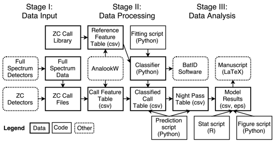

# 使用自动声学探测器和机器学习模型分析人类主导景观中的蝙蝠分布

# 使用自动声学探测器和机器学习模型分析人类主导景观中的蝙蝠分布

## Justin Kitzes

我的名字是 Justin Kitzes，我是一名数量生态学家，研究土地利用和气候变化对生物多样性分布的影响。我目前是匹兹堡大学的生物学助理教授，曾是加州大学伯克利分校数据科学研究所的数据科学家研究员。我下面描述的研究集中在一个复杂的、人类改变的景观中蝙蝠的空间生态。这个案例研究描述了使用声学探测器、机器学习方法和似然统计学来研究北加州三条大型高速公路对蝙蝠活动的影响。

### 工作流程

 本研究调查了在旧金山湾附近三条大型高速公路附近，几种常见的蝙蝠是否显示出了较低的活动。本研究中的活动被定义为自动声学探测器记录的超声波觅食呼叫数量。核心任务包括使用探测器收集原始蝙蝠呼叫数据，提取记录呼叫的特定特征，对呼叫进行到物种级别的分类，并根据预测变量（包括距离公路的距离）对结果每夜呼叫数量进行统计分析。完整的分析过程在 2014 年发表在*PLoS ONE*上的一篇[手稿](http://dx.doi.org/10.1371/journal.pone.0096341)中进行描述。我们后来使用类似的工作流程进行了一项[第二项研究](http://dx.doi.org/10.1016/j.agee.2016.03.010)，发表在*Agriculture, Ecosystems & Environment*上，研究了葡萄园景观中蝙蝠活动的预测因素。

使用了两种不同类型的声学探测器，其中一种记录了零穿越格式的数据，另一种记录了全频谱格式的数据。全频谱数据使用探测器制造商提供的专有工具转换为零穿越格式，转换参数选择为产生与原始零穿越探测器录音类似的输出。使用由一位长期从事蝙蝠呼叫分析的个人研究者开发的免费、专有软件 AnalookW，来过滤仅包含噪声的文件，并从剩余的包含蝙蝠呼叫的文件中提取描述每个呼叫的十二个特征。这些特征被保存在一个 csv 表中。

然后，电话被按物种分类，这是使用随机森林分类器完成的。通过个人联系获得了一个包含由手动识别的个体蝙蝠发出的零交叉电话的参考库，并使用 AnalookW 提取了这些电话的相同十二个特征。使用 Python 包 scikit-learn v0.12 对这些数据进行了随机森林分类器训练。分类器精度是使用交叉验证和混淆矩阵进行评估的。

然后，分类器用于将记录的呼叫识别到物种级别，从而创建了一个分类的呼叫表。该表被汇总成一个夜间过境表，将呼叫聚合成由多个相邻呼叫组成的过境，并总结了每个物种在每个夜晚，距离道路的每个距离上记录的过境数量。将环境和站点变量连接到此过境数据以创建用于统计分析的最终表。

由于 Python 中没有可用于拟合广义线性混合模型（GLMMs）的函数，因此统计分析是在 R 中进行的。探索性分析表明，泊松回归不适合于这些数据，因此为所有物种的夜间过境计数和四种常见物种分别拟合了负二项式 GLMM。模型结果保存为一个表格，后来出现在最终手稿中。然后，Python 脚本读取了模型结果表，并创建并保存了一个出现在最终手稿中的图形。最终手稿是使用 LaTeX 编写并以该格式提交给期刊。

除了手稿外，该项目的第二个输出是开源软件 [BatID](https://github.com/jkitzes/batid)，该软件将分类器对象与基于浏览器的界面捆绑在一起，以使非程序员能够自动对加利福尼亚州蝙蝠呼叫进行分类。该软件可免费下载，并已被学术界、政府和私营部门的研究人员使用。

### 痛点

在工作流程开始时，必须使用两个闭源图形程序，一个用于将专有数据格式转换为零交叉格式，第二个（AnalookW）用于对零交叉呼叫文件进行特征提取。这两个步骤都需要在这些程序中输入参数，我小心翼翼地手动记录了这些信息，因为这些信息否则很容易丢失。AnalookW 仅在 Windows 上运行，这要求我（以及希望使用我后来的软件 BatID 的分析师）找到 Windows 计算机来完成这一步骤。尽管我在 Python 中编写代码更快更准确，但由于必要的包在 Python 中不可用（至今仍然如此），我需要切换到 R 进行统计分析。在手稿阶段，一个主要的头痛问题是，R 统计函数只报告非机器可读的文本文件或对象，这要求我手动创建最终表格，其中包含 5 个模型中 14 个变量的系数和标准误差。

一旦我创建并发布了 BatID 软件，一个问题立即出现了，当 scikit-learn 软件包升级到 v0.13 时，无法读取我分析过程中创建的分类器对象。此外，原始的 BatID 软件包要求用户安装完整的科学 Python 堆栈，这对我希望达到的非程序员受众来说是一项困难的任务。我最终使用 pyinstaller 创建了一个独立的 Windows 二进制可执行文件，理由是软件用户需要一个 Windows 计算机才能在分析的先前步骤中运行 AnalookW。创建这个可分发的二进制文件并不简单，需要进行多天的反复试验和手动调整。

### 关键优势

在所有分析方面，我特别高兴于我为创建独立的 BatID 分类器软件所付出的努力。由于我生态学领域的许多同事都不是程序员或初学者程序员，我相信这些用户友好型工具对推动我所在领域的科学进展以及支持非营利组织和机构科学家采用新方法至关重要。我希望更多有计算机导向的同行将来会参与类似的活动。

具有讽刺意味的是，在为非程序员创建工具时，我也创建了另一个不容易脚本化到工作流程中的图形程序。我尝试在最近的 BatID 版本中缓解这个问题，要求用户创建一个包含所有参数的文本文件，该文件与数据文件一起被程序读取，并且使程序将所有结果保存在与参数文件相同的目录中，以及一个日志文件。这至少确保默认情况下有一条记录，记录了处理原始数据到分类结果表的程序版本、时间和使用的参数。

### 问题

#### 对你来说，“可复现性”是什么意思？

我认为一项研究在我能够向同事发送一个包含原始数据和代码的压缩文件，他或她只需按下一个按钮就能生成我分析中的所有结果、表格和图形时，就可以被（计算上）复现。当然，要实现这个目标并不容易，除非是最简单的科学工作流程。

#### 你认为在你的领域中，为什么可复现性很重要？

我认为在生态学等领域，研究人员正在努力利用相对稀缺的数据进行越来越详细的推断和预测，因此可复现性尤为重要。尽管我没有具体的证据支持这一观点，但在我看来，在这些“高杠杆”类型的分析中，小的分析决策（数据清理方式、传递给优化器的选项等）可能在影响最终研究结论方面发挥不成比例的作用，因此需要完全记录和共享。确保所有这些决策都被记录的一个简单方法是使自己的整个分析可被他人复现。更广泛地说，我坚信可复现性是良好科学的基本组成部分。现在，“做科学”需要传达比手稿中的叙述形式更容易表达的更多细节，因此在所有领域中，只要可能，发布代码和数据似乎是完全必要的。

#### 你是如何了解可复现性的？

我通过参加研讨会学习了这些工具，特别是在加州大学伯克利分校参加 Python 研讨会，并与其他经验丰富的讲师一起教授软件工程研讨会。我还通过与我博士实验室的一位前学生密切合作了几个月，他之前在微软工作过，学到了很多。我主要通过在自己的研究和软件开发中遇到问题时进行网络搜索来学习更高级的技术和思想，以解决困境。

#### 你认为在你的领域进行可复现研究的主要挑战是什么，你有什么建议？

生态学中的一个主要挑战仍然是数据共享和获取。许多野外生态学家 understandable，不愿意与其他研究人员分享他们辛苦获得的原始数据。我怀疑这种谨慎既来自于专业必要性的意识（即，我投入了大量时间收集这些数据，我将是唯一使用它进行所有分析的人），也来自于一个观点，即仅凭数字可能无法捕捉到在野外观察到的所有微妙细微差别，而这些微妙细微差别对于真正理解数据、其潜力和局限性至关重要。特别是关于采样偏差的信息（如由研究地点、采样技术、季节、缺失数据和许多其他因素的选择产生的偏差）并不总是能够轻松地以数字形式描述出来。我还怀疑许多野外生态学家意识到，这些信息通常甚至没有在任何已发表的手稿中，这使得收集数据的人被认为是唯一真正有资格分析数据的人。已发布和可用的数据往往规模相对较小且格式异构，因此通常被锁定在印刷版的 pdf 表格和其他非机器可读格式中。

#### 你认为进行可重复研究的主要激励是什么？

我不确定在我的领域中是否有任何主要的外部激励措施——当然，原则上，发布可重复研究可能会增加最终引用你手稿的研究人员数量，但这似乎有些间接。一些期刊，如 PLoS，现在要求所有新颖的计算机代码都上传为手稿支持信息，但目前似乎这一要求并未彻底检查。
