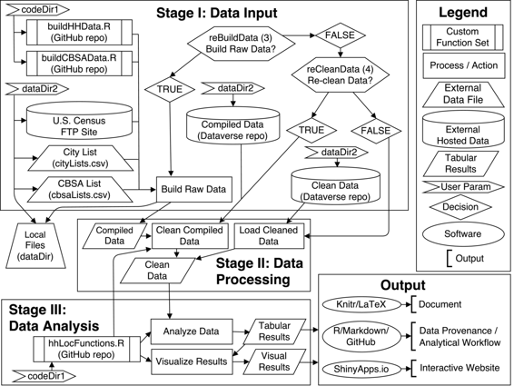

# 美国主要都市地区家庭定位选择的分析

# 美国主要都市地区家庭定位选择的分析，使用 R

## Andy Krause 和 Hossein Estiri

我是 Andy Krause，是墨尔本大学房地产系的讲师。我的研究重点是房地产市场的空间分析，特别是在估价和地理位置方面。这项工作是与我的同事 Hossein Estiri 完成的，他是哈佛医学院的研究员。Hossein 使用数据科学方法研究城市能源和健康。

### 工作流程

 这项研究分析了美国最大的 50 个都市地区家庭的定位选择。家庭根据五年龄段（根据家庭主人的年龄）进行分类，并将其与所居住的都市地区的中央商务区（CBD）的距离（人口普查区组级别）进行映射。在西雅图等多中心地区（Tacoma、Bellevue 和 Everett 作为替代的 CBD），分析还针对核心中心以及次级中心进行。一份初步报告正在进行审查。

所有数据、代码和分析工作流程都托管在线。代码和分析工作流程，包括分析脚本和自定义函数集，都是用 R 编写的，并且可以在项目的 GitHub 存储库中找到。完整的原始数据集可通过美国人口普查获取。希望跳过数据编译和/或清理步骤的用户可以从项目的[Dataverse 存储库](https://dataverse.harvard.edu/dataverse/repHHLoc/)中下载编译或已清理数据。

*hhLocAnalysis.R*文件是主要的分析脚本，也是唯一需要执行的文件。必须在*hhLocAnalysis.R*脚本的开头手动设置两个关键路径参数和两个关键过程参数：

1.  **codeDir**: GitHub 代码存储库的位置

1.  **dataDir**: 从 Dataverse 下载的编译（和/或清理）数据的位置

1.  **reBuildData**: 你是否想要经历整个数据编译过程？

1.  **reCleanData**: 你想要重新清理数据吗？

还需要在执行脚本之前设置包含已下载中间数据文件的文件名以及导出结果路径的其他参数：

1.  **rawDataFile**: (可选)。如果**reBuildData**等于 FALSE 并且**reCleanData**等于 TRUE，则需要提供从 Dataverse 下载的编译数据文件（在**dataDir**内）的名称。

1.  **cleanDataFile**: (可选)。如果**reBuildData**和**reCleanData**都为 FALSE，那么你需要提供从 Dataverse 下载的已清理数据文件的名称（在**dataDir**内）。

1.  **figurePath**: (可选) 如果你打算输出绘图，则输入要导出的目录

这是手动操作的范围。所有其他过程都是自动运行的。如果数据完全构建（**reBuildData** = TRUE 和 **reCleanData** = TRUE），此过程可能需要多个小时。此外，用户可以更改处理距离缩放、要分析的都会区域总数、从中央商务区质心的最大距离以及是否报告计算进度等可选参数的数量。

**阶段 1：数据收集**

根据上述选择的参数，研究的数据收集阶段要么从 Dataverse 存储库下载编译的数据（**reBuildData**=FALSE 和 **reCleanData**=TRUE），要么下载已清理的数据（**reBuildData**=FALSE 和 **reCleanData**=FALSE），要么直接编译所有原始数据（**reBuildData**=TRUE）。为了编译原始数据，下载了五十个最大都会区每个县的文件，解压缩，清理并写成标准化的 .csv（逗号分隔值）文件。这些原始数据托管在美国人口普查局的 FTP 站点上。编写了用于处理数据获取过程的自定义函数，并在存储库中的 *buildHHData.R* 和 *buildCBSAData.R* 文件中找到。

**阶段 2：数据处理**

如果数据需要重新清理，则在此步骤中使用数据清理函数。在此过程中，删除了具有缺失数据的观测值，并向编译的数据添加了核心统计区域（CBSAs）的信息。如果直接下载了清理过的数据，则将这些预清理数据传递到分析阶段。

**阶段 3：数据分析**

分析过程从计算位置商距离概况开始。位置商概况衡量了给定位置的某种家庭类型与整个都会区中该家庭类型的比例。位置商高于 1 表示，相对而言，在给定位置存在更多的某种家庭类型，而不是如果家庭是随机分布的话所期望的。*hhLocFunctions.R* 文件包含了计算和可视化位置商结果所需的所有自定义函数。

通过各种不同的绘图函数对结果进行数据可视化。最终结果，包括表格和图形，然后与叙述结合在一起，创建最终文档（在 LaTeX 中编译）。完整的数据来源描述并通过 Markdown 文件托管在代码存储库中。还请注意，作者们使用协作网站 [Authorea](https://www.authorea.com/users/18208)（提供基于 git 的跟踪和 LaTeX 支持）来撰写报告叙述部分的初稿。

### 痛点

我们认为有两个主要步骤特别令人痛苦。第一步是说服自己（和合著者）花时间正确记录每一个操作，并花时间完全注释分析工作流程。当截止日期到来或合著者不认为可重现性有价值时，这可能特别困难。第二步是需要编写通用的自定义函数。编写非常具体、单一用途的函数可能很容易，但很少有用于超过一个实例。良好的可重现研究包含灵活的函数，可以适应变化或排列组合，从而使后续用户能够扩展或更改您的原始分析。

当前的同行评审过程也对可重现性构成了相当大的障碍。为了在评审过程中保持匿名，我们不得不建立一套匿名代码和数据存储库以及交互式网站用于评审过程，然后在论文被接受后切换到我们自己的存储库。这意味着需要额外的工作，以及时刻记住我们登录的是哪个 GitHub 账户。根据使用统计��据来看，评审人对实际检查托管的代码、数据或结果并不感兴趣。

### 关键好处

对我们来说，最大的好处是效率。第一次进行分析通常比其他同事花费更长的时间，但每次之后节约的时间会成倍增加。这在特别有帮助的情况下尤为重要，比如回应同行评审人的评论和请求。对假设或参数的敏感性测试的更改可以在几个小时（或几分钟）内完成，而不是几天或几周。这大大缩短了重新提交的响应时间。此外，我们经常发现自己借用旧代码并重新利用它，使新的分析变得更容易和更快。

（Andy）更好的组织是另一个好处。不再有满是带有版本名称和日期的数据文件夹。数据集中不再有神秘字段。不再因忘记之前所做的事情而重新开始。我的学生和他们的 Excel 表格，带有数十个选项卡和来自 SPSS（或其他基于点和点击的统计软件）的屏幕截图，每学期都提醒我这个好处。我正在逐渐将更多的可重现性纳入我的课程中，目的是打破学生们的一些不良习惯。

（Hossein）另一个好处是建立更大的相关研究能力。除了可以用来研究其他都市模式的理论方法外，我们在这项研究中构建的函数可以应用于利用人口普查数据进行其他形式的研究。研究人员可以调整这些函数以解决其他目的。在一个理想的科学世界中，所有研究都是可重现的，由于可以共享、重复使用或调整用于研究或非研究目的的代码，研究将更加高效。

### 关键工具

RStudio 集成开发环境（IDE）及其相关的 Shiny 应用程序（交互式 Web 应用程序）对我们的可复制研究有很大帮助。如果你是 R 程序员，并想与非程序员分享你的可视化效果，我们强烈推荐来自 RStudio 的这些工具。使用 IDE 可以更轻松地在多个脚本之间导航，查看绘图历史，并查看当前计算环境中的所有对象。

### 问题

#### 对你来说，“可复制性”意味着什么？

“可复制性”意味着后续感兴趣的方可以公开访问数据、代码、分析工作流程和数据溯源，以重新创建研究（并理想情况下产生相同的结果），而无需咨询原始研究人员。在这种情况下，“可复制性”可以促进对给定研究项目结果的验证，同时通过提供可复制的模块来加速在其他环境和/或其他目的下的新研究发现。

#### 你认为你所在领域的可复制性为何重要？

(Andy) 在房地产领域，大部分定量分析（无论是学术界还是专业界）通常都会被多方重复，广泛传播，并经常更新；所有这些特点都受益于可复制的分析。尽管这是该领域的核心事实，但在这方面的讨论或尝试却非常少见，几乎没有。

(Hossein) 总的来说，在面向政策/决策的领域中，可复制性的重要性并不清楚。它确实可以改善政策研究，但人们可以争论可复制性是否对决策产生直接利益。

#### 你是在何处或如何了解到可复制性的？

(Andy) 我的学术前背景是作为诉讼支持专家证人团队的一部分。在这个行业中，任何分析都必须能够被对方复制，因此，我的公司不断努力提高他们的可复制分析效率。

#### 你认为在你所在领域进行可复制研究的主要挑战是什么，并且你有什么建议吗？

(Andy) 在房地产领域存在两个挑战。首先，大部分数据都是专有且昂贵的，因此很难共享数据。其次，这是一个由许多资深人士（无论是学术界还是行业界）组成的小圈子，其中许多人对变革持有非常强烈的抵触情绪。

(Hossein) 在健康科学领域，最大的关注点是数据隐私。例如，对个体级患者信息的研究几乎无法在传统工作流程中完全实现可复制性。

#### 你认为进行可复制研究的主要动机是什么？

进行可复制研究就像在家里安装太阳能电池板一样。起初会花费一些成本，但日后你将获得诸如节省时间、更高质量的输出以及增加合作/分享想法的机会等好处。

#### 在你的领域，你会推荐一些最佳实践吗？

不再需要手动清理数据。使用代码。

#### 你会推荐一些特定的资源来了解更多关于可重现性的内容吗？

对于协作，如果你想摆脱在 LaTeX 中写作，可以尝试[Authorea](https://www.authorea.com/)。如果你在澳大利亚，[墨尔本大学研究平台](http://blogs.unimelb.edu.au/researchplatforms/)团队提供多个研究市场、软件工艺和可重现性相关的课程和活动。这对全球研究人员开放。
