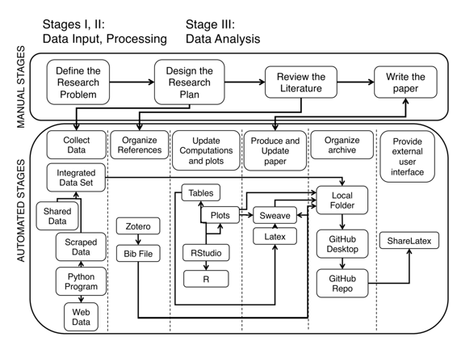

# 分析秘鲁立法者合作赞助数据，以检测网络模式

# 分析秘鲁立法者合作赞助数据，以检测网络模式

## 何塞·曼努埃尔·马加亚尼斯

我的名字是何塞·曼努埃尔·马加亚尼斯（José Manuel Magallanes），我是华盛顿大学 eScience 研究所的高级数据科学研究员，也是华盛顿大学埃文斯公共政策与治理学院的客座教授（2015 年 - 2017 年）。自 2003 年以来，我一直是秘鲁天主教大学政治科学与公共政策方法学教授。我的研究涉及用计算社会科学方法框定政治和政策问题。我处理过不同的主题，包括选举行为、公共管理绩效、气候变化和社会冲突，以及立法者行为。我对此案的贡献将是对议案合作赞助数据进行研究，以检测关键参与者、揭示联合模式、预测政党分裂并检测重新当选的策略。

我拥有计算机科学学士学位（秘鲁圣马科斯大学 - 秘鲁）、政治科学与公共管理硕士学位（秘鲁天主教大学 - 秘鲁）、心理学博士学位（秘鲁圣马科斯大学 - 秘鲁）和计算社会科学博士学位（乔治梅森大学 - 美国）。

### 工作流程

 上面的工作流程表示：

a. 手动阶段：

```
1\.  Define the Research Problem.

2\.  Design the Research Plan.

3\.  Review the Literature.

4\.  Paper writing. 
```

b. 自动阶段：

```
1\.  Collect Data.

2\.  Organize References.

3\.  Update computations and plots.

4\.  Produce and update Paper.

5\.  Organize archive.

6\.  Provide external user interface. 
```

#### A. 手动阶段

a1\. **定义研究问题。** 秘鲁政治科学界对了解他们国家议会的动态很感兴趣。特别是，秘鲁学者和评论家一直在讨论一些影响国会动态的特殊现象：

+   过去两届选举中，立法者的低连任率约为（~20%）。

+   一些立法者在任期内转移到其他政党（党派转换）的事实。

+   那些曾有大量席位的政党最终分裂了席位（值得注意的是，秘鲁采用多党制）。

美国的一些学者使用议案合作赞助数据作为理解其中一些问题的替代方法，所以我决定采取类似的方法。然而，秘鲁案例的复杂性比美国的两党制国会要高，但是秘鲁案例的数据较少可得；因为这项工作使用了一次国会的数据，而在线只有五届国会期的网页数据可用（没有 API 和可下载的数据）。

这个阶段只进行了一次。我是唯一负责定义研究问题的人（没有合著者）；然而，一些同事参与了非正式的交流想法。在这个阶段没有使用特定的计算工具。

a2\. **设计研究计划**。这个阶段确定了之前研究类似问题的主要作者。在所有情况下的关键因素都是账单的共同赞助。然而，大多数假设与我所拥有的不同，这是由于研究人员关注的不同政治制度造成的。但是，在所有情况下，账单的共同赞助被认为是了解立法者联想模式的一个很好的代理。从这个阶段可以清楚地看出：

+   我们需要编写代码从秘鲁国会网站提取信息，因为数据无法通过任何方式下载。这个过程，也被称为*网页抓取*，从网页中收集结构混乱的数据，并为它们提供一个可以在进一步的计算或统计分析中使用的结构。

+   为了测试假设，需要完整国会的信息（五年）。

+   账单中的信息需要与国家选举委员会的档案相补充。在那里，每位立法者的个人信息都可以找到。这些信息已被下载。

+   将需要图表或社交网络技术。

+   可用预算将需要使用免费工具。

+   需要与其他学者分享研究结果。

+   这项研究可以与其他类似国家的努力结合起来。有必要有效地组织这个过程，以便数据和代码可以被重复使用。

这个阶段只进行了一次。我是唯一负责制定研究计划的人。在这个阶段没有使用特定的计算工具。

a3\. **文献综述**。这一步骤让我能够识别类似案例并组织我的基本参考文献。参考文献在整个过程中不断更新。我负责更新，但也从与我分享草稿的用户那里得到了一些建议。

a4\. **撰写论文**。正如预期的那样，这是一个手动步骤。然而，正如我后来描述的那样，这得到了不同工具的支持。通常情况下，这一步骤被重复多次。我是唯一的贡献者。

#### B. 自动化阶段

b1\. **收集数据**。数据来自两个主要来源：

1.  [国会网页](http://www.congreso.gob.pe/proyectosdeley)。这个网站为每个提议的法案都有一个网页。网页上有关于每个法案的详细元数据，包括作者（立法者），他们代表网络的节点。

1.  [INFOGOB 网页](http://www.infogob.com.pe)。这个网页提供了组织一些立法者属性（节点）所需的信息。

INFOGOB 网页的组织方式使您可以下载不同流程的信息。它还帮助我了解每位立法者的政治历史。

国会的网页有很大的不同。所需的信息在网页上是可见的，但它们没有提供下载服务或以结构化方式获取数据的机制（称为 API - 应用程序接口）。因此，需要编写一个用于抓取网站的代码。这段代码是用 Python 编写的，主要依赖于*beautiful soup*包。我创建了一些额外的代码来“清理”收集到的值。

所以，使用 INFOGOB，我构建了立法者的属性；而使用抓取的数据，我构建了网络。这两个数据集都使用 Python 的*Networkx*进行合并。合并后的文件保存为 GraphMl 文件，并且也保存为边和节点的两个单独文件，这样可以更容易地导出到 R 中。

这个过程完全由我完成。这是运营研究的第一部分，大约花了两周的时间。我使用的 Python 版本是 2.7，是通过 Anaconda 安装的。我使用 Spyder 图形用户界面（GUI）进行编码。

b2\. **整理参考文献**。参考文献是学术写作的关键组成部分。在我的情况下，除了论文和书籍，还需要包括网页、白皮书、代码、数据等。通常情况下，在开始写作时，你知道你会使用一组参考文献，但随着与同事交流思想，会有更多的参考文献出现。在这个特定方面，使用**Zotero**非常重要。它允许创建一个 BibTex 文件，在论文撰写过程中稍后使用。这个文本稍后将集成到本工作的 LatTex 文档中。自动化这个过程不仅帮助你恢复引用某项工作的权利，还使你有更灵活的选择去改变一个特定出版商所需的样式（APA、Chicago 等 - 参见[引用列表](https://en.wikipedia.org/wiki/Citation)）。这一点非常重要，因为这项研究可能会在社会科学或计算机科学相关的会议上展示。

这个过程完全由我完成。这是随着论文的写作而进行的连续过程。使用的 Zotero 的桌面版本。BibTex 保存在工作文件夹中。

b3\. **更新计算和绘图**。虽然数据收集和结构化数据集是由 Python 生成的，但数据的探索、假设检验和结果的可视化是在 R 中完成的。我决定使用 R 是出于一个简单的原因：RStudio 可以通过其*sweave*库更容易地将 LaTeX 和 R 结合在一起，比 Python 更容易。Sweave 区分文本和 R 代码；代码组织在*chunks*中，这些代码也可以与 LaTeX 代码交互。

这简化了对数据生成的表格和图形的更新，因为 sweave 文档将重新运行 R 代码并更新需要更新的内容。这是使这项工作更具再现性的关键部分；也对我来说，我可以尝试不同的*布局*来绘制网络图，并更加关注论文的最终外观。

这个过程完全由我完成。随着论文的撰写，这是一个重复的过程。使用 RStudio 生成了一个 Rnw 文件，该文件还生成了一个 LaTeX 文件。

b4\. **生成和更新论文**。RStudio 集成了我的写作、参考文献文件以及使用 R 生成的表格和图形，最终生成了一个 pdf 文档（RStudio 通过*knitr*，而不是*sweave*，还可以生成 html 文档）。主文档的任何部分或任何使用的文件的任何更改都会自动更新到最终产品中。

非常重要的是要记住，sweave 允许 LaTeX 用户自定义文档中的所有细节，其中包括代码高亮或隐藏等可能性。我甚至可以根据需要在文档中呈现 Python 代码。

这个过程完全由我完成。随着论文的撰写，这是一个持续的过程。实际上，我可以与同事分享许多版本。 LaTeX 将 R 代码块编译成表格和图形，并将参考文献从在 Zotero 生成的 BibTex 文件中编译到主文件中。

b5\. **组织存档**。在研究问题明确之后，并且在进行任何编码之前，首先要做的一项工作是创建一个 GitHub 私有存储库。将此存储库克隆到我的笔记本电脑上，并将所有文件组织在此文件夹中，包括代码、数据文件、参考文献文件和图形。在某种程度上，使用将在线的存储库会迫使你从一开始就组织好你的工作和文件夹。在成为 GitHub 用户之前，准备最终版本的工作花费了太多时间；当使用 GitHub 时，良好的计划会在完成论文时迫使你准备好文件夹系统。另一个优势是使用 GutHub 时具有的版本控制能力，我只需使用一次，就可以恢复一个包含产生更好图形的代码的版本，而我原本以为它会工作得更好。没有它，你需要对代码段进行注释和取消注释，这不必要地增加了编码空间。

这个过程完全由我完成。随着论文的撰写，这是一个持续的过程。使用 GitHub 客户端进行提交并将本地存储库同步到 GitHub。

b6\. **提供外部用户界面**。在规划阶段就清楚了，我需要与其他同事分享我的草稿，以便获得一些反馈或讨论进一步合作的事项。由于论文反映了一种逐步的方法，我的同事们更容易阅读包含代码块、图表和表格的草稿论文。因此，我决定使用[ShareLaTeX](http://sharelatex.com)，它可以收集 GitHub 仓库中的文件并编译 LaTeX 文档。因此，当我更新 GitHub 为最新版本后，我也可以要求 ShareLaTeX 根据我最近推送到 GitHub 的最新文档版本更新其内容。

这个过程完全由我完成。然而，在大部分处理完成后，草稿被分享。随着论文的写作，这是一个持续的过程。选定的用户创建了 ShareLaTeX 账户，以查看我文档生成的 LaTeX pdf 版本。我允许他们使用 ShareLaTeX 在 LaTeX 文档中写评论。

#### C. 关于数据、软件和处理

+   **数据：** 原始数据以及清洗和聚合后的数据都在一个私人的 GitHub 仓库中。数据可以根据请求共享，并包含了如何引用的说明。数据文件具有类似表格的结构，便于在 R 中读取，但我还以 xml 格式生成了其他版本，因为我认为可能需要使用其他网络可视化程序，如 Gephi。

+   **软件：** Python 代码也在仓库中。 R 代码嵌入在 LaTeX 代码中，论文本身描述了论文中采用的算法。大多数 R 代码块不断使用 Python 抓取的数据。对于 GitHub、ShareLaTeX 和 Zotero，你只需创建一个账户并下载桌面版本。

+   **处理：** 数据处理反映在 Python 代码流程中，并且在线上。 Python 和 R 代码都有大量注释。对于外部研究人员来说，跟随研究逻辑并复制结果，或者简单地更改来自其他国家的数据并在最终 PDF 中获得所有表格和图表是相当容易的，因为 R、Python 和 LaTeX 是连接的。

### 痛点

这项工作并非是制作博客或笔记本，而是一篇论文。因此，最具挑战性的部分是：

1.  制作一个质量良好的布局，其中表格和图表位于正确的位置是困难的。LaTeX 并不完全是所见即所得，因此你需要学习如何覆盖 LaTeX 中的一些默认行为。

1.  学习使用 LaTeX 时，你可能会变得过于兴奋，开始时刻思考如何让它变得更好，这会花费太多额外的时间，因为你需要包含更多的 LaTeX 函数并学习如何配置它们。最好在完成论文后再做这些。

1.  爬取多个网页需要时间，你会发现你的代码可能只适用于那些特定的网站。我爬取了许多页面，但所有页面都来自同一机构，因此涉及从多个机构爬取的项目将处理更多的复杂性。

1.  我工作领域的一个特别痛点是缺乏可复现性文化。我国的政治学家不习惯可复现的研究。事实上，对于每一篇处理我使用的数据类型的关键论文，都找不到作者或作者网页中的进一步说明。在大多数情况下，只提到使用了哪些数据，但没有链接或其他相关程序是清晰的。

### 关键优势

我认为我的工作方式让我获得了几个好处：

1.  以可复现的方式计划您的研究对您所属的科学界来说是一个巨大的优势。但最重要的是，它迫使您更好地计划您的工作。

1.  包括版本控制，迫使你在计算机中有组织良好的文件集。

1.  遵循可复现性方法将允许您在更多数据可用或同事想要进行比较工作时提升您的工作。我确信没有这种方法也不是不可能的，但我确信研究人员可以比过去更加高效。

1.  另一个重要的好处是允许同事审计您的工作，给您足够的输入，以制作新版本并使其更加健壮。

1.  你有可能生成不同质量级别的图表。R 允许你生成简单质量的图表和更复杂的格式。在这种情况下，我被要求提供矢量格式的一个图表更高分辨率，我只是重新创建了我有的那个，改变了一些参数。

### 关键工具

LaTeX 是所有这些研究及其可复现性水平的关键组成部分。它提供了一种组织论文并与代码和数据文件进行交互的方式，包括参考文献和图表。据我所知，这不能使用 Word 完成。在我的国家，LaTeX 不是社会科学家常用的软件。RStudio 也是一个关键因素。它能够将 R 块及其输出（包括表格、值和图表）转换为 LaTeX，使研究的流程和更新更加顺畅。LaTeX 和 RStudio 都有助于可复现性。没有 R，撰写论文的障碍会更高，但是可以做到。与在 MsWord 中复制、粘贴或插入程序相比，它让您更有信心，节省了大量时间来更新/编辑您的手稿。流程非常出色。

### 问题

#### 对于你来说，“可复现性”意味着什么？

总的来说，我认为这个术语意味着通过某个存储库中可用的代码和数据，外部人员可以实现对研究的重建程度。对我来说，可重复性不仅意味着外部人员可以解压缩并运行可执行文件以查看结果，而且可以审计整个过程。审计员需要的反馈越少，工作就越具有可重复性。

#### 您认为在您的领域中可重复性为何重要？

因为计算社会科学在许多其他国家仍处于起步阶段。就我个人而言，数据刚刚开始变得可用，因此遵循并教授可重复性方法将有助于提高研究质量。特别是在公共政策领域，这将使利益相关者参与知识创造。

#### 您是如何或从何处了解到可重复性的？

我没有机会有导师或课程。我只是感到有必要组织我的工作，因为对于我的情况来说有许多工具和数据可用。我担心如果不遵循这种方法，我很容易就会迷失方向。可重复性要求良好的研究计划，并且会带来回报。

#### 您认为在您领域进行可重复研究的主要挑战是什么，您有什么建议吗？

如果您使用的数据是公开的，我认为问题会*较少*。当数据不是公开的，您通过特殊权限获取访问时，法律问题总是存在的。至于投资，我的特定工具集是免费的，所以这不应该是问题，除非您的资助机构强制您使用特定工具。我也相信这种方法对于不习惯这种方法的老一代人来说可能会很具挑战性。我看到年轻一代研究人员中问题较少。

#### 您认为进行可重复研究的主要动机是什么？

对我来说，主要的动机是项目组织和机器学习。也就是说，可重复性需要秩序，对您的工作进行一些结构化；然后，您需要找到一种方法来组织写作、代码、文件等。我相信 LATEX 也能实现可重复性，因为它可以与其他软件元素无缝交互，正如我在这里展示的那样。可审计性很重要，因为它会增加您在研究界的信誉，主要是因为任何人都可以密切关注您的工作内容和方式。
