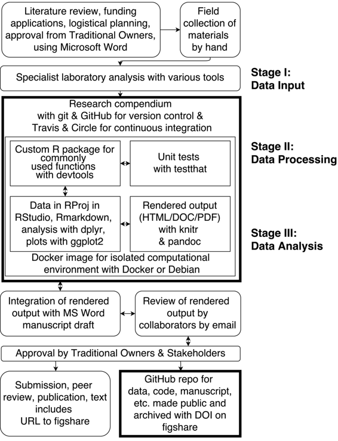

# 在考古学中使用 R 和相关工具进行可重现研究

# 在考古学中使用 R 和相关工具进行可重现研究

## Ben Marwick

我叫 Ben Marwick，是华盛顿大学人类学系的考古学副教授，也是卧龙岗大学的高级研究科学家。我的研究兴趣包括东南亚和澳大利亚更新世期间的人类环境适应。我和我的同事们使用石器、有机和地质遗迹来理解过去人类行为及其环境背景。我在这里描述的叙述从最初的概念到具体的出版物（Clarkson 等人，2015）是我与多个专注于理解史前狩猎采集者行为的项目的典型经验的一部分（参见 Marwick 等人，2016 年；2017 年）。

在这个案例研究的背景下，可重现性指的是计算可重现性，这意味着使其他研究人员和学生能够结合我们生成的代码和数据，以获得我们在出版物中呈现的相同的统计结果和数据可视化。我还期望该代码可用于经验重现性，其中我们的代码应用于新数据集以生成与我们发布的结果实质上相似的结果。我在 Marwick（2016 年）中更详细地探讨了这些定义和激发我选择工具的原则。

### 工作流程

 有着粗体轮廓的方框表示我们项目中实现计算可重现性的关键步骤和工具。

我最近参与的一个项目旨在挖掘 Madjedbebe 岩棚，这是澳大利亚北部一个著名的考古遗址。挖掘的目的是测试上世纪 90 年代前一次挖掘发现的有争议的澳大利亚早期人类居住证据。项目在与利益相关者的磋商中启动，包括考古遗址的土著传统所有者，并通过电子邮件在团队中流传一份使用 Microsoft Word 撰写的拨款申请。

考古挖掘是采用标准的现代技术进行的。这些技术包括直接数字捕捉文物和特征原产地的总站、数字摄影和地理信息系统以及使用结构化的现场记录表手写纸质笔记。这些表格中的数据稍后将被输入到 Excel 电子表格中。

结束野外工作后，后挖掘分析继续在每个团队成员的本机构进行。此阶段数据收集和分析的工具遵循各实验室的规范，但大多数团队成员在此阶段的最终产品是 MS Word 和 Excel 文件。此时，开始了一份用于出版的手稿，这是一份 MS Word 文档，由作者通过电子邮件传阅。

专业工作结束后，Excel 和 Word 文件被汇总到一个 R 项目中，使用的是[RStudio](https://rstudio.com)。电子表格被转换为 CSV 文件，以确保可以独立于任何特定软件访问它们。一个研究手册被创建，基于一个定制的 R 包，遵循[rrrpkg](https://github.com/ropensci/rrrpkg)中描述的示例。这个包被编写来包含在分析中经常使用的自定义函数。[devtools](https://CRAN.R-project.org/package=devtools) 包被用来在 RStudio 中开发自定义的 R 包。[testthat](https://CRAN.R-project.org/package=testthat) 包被用来编写测试，以确保在开发过程中包的函数表现如预期。一个 R markdown 文件被创建作为手册的一部分，并在 RStudio 中编辑以重新计算和扩展来自专家实验室的分析和可视化，并结合实验报告中包含统计结果的关键段落。R markdown 文件是一种实验笔记本，其中代码和文本交织在一个单一的文档中。它用 R 脚本总结和扩展了团队专家的工作。R markdown 文件中的代码使用了几个 R 包，包括[dplyr](https://CRAN.R-project.org/package=dplyr)和[reshape2](https://CRAN.R-project.org/package=reshape2)用于数据清理和分析，[rioja](https://CRAN.R-project.org/package=rioja)和[analogue](https://CRAN.R-project.org/package=rioja)用于专业环境方法，以及[ggplot2](https://CRAN.R-project.org/package=ggplot2)用于可视化。分析的运行时间很少超过 30 分钟，因此在这里编写代码和叙述，以及测试是最耗时的任务。

使用 R 包 [knitr](https://CRAN.R-project.org/package=knitr) 和 [pandoc](http://pandoc.org/) 程序（与 RStudio 一起提供）来执行 R Markdown 文件，以便在编写代码时检查输出。 创建了一个 [Docker](https://www.docker.com/) 容器，用于为编写 R Markdown 文档和开发软件包创建一个隔离的计算和便携式环境。 Docker 镜像在 Docker Hub 服务器上备份（[`registry.hub.docker.com/u/benmarwick/mjb1989excavationpaper/`](https://registry.hub.docker.com/u/benmarwick/mjb1989excavationpaper/)），并使用 [CircleCI](http://circleci.com) 进行持续集成测试。 所有这些组件、数据文件、R Markdown 文件、软件包文件等都使用本地 git 进行版本控制，并在 GitHub 存储库上备份。 GitHub 存储库位于这里 [`github.com/benmarwick/1989-excavation-report-Madjebebe`](https://github.com/benmarwick/1989-excavation-report-Madjebebe)，在我们 2015 年 *人类进化杂志* 论文被接受时的存储库快照存档在 figshare 这里：[`dx.doi.org/10.6084/m9.figshare.1297059`](http://dx.doi.org/10.6084/m9.figshare.1297059)。 使用这种手册方法的一个缺点是，大部分工作都是由几个团队成员完成的，因为并非每个人都熟悉（或对）这些工具感兴趣。

在研究手册中进行分析的同时，一份手稿在 MS Word 文档中起草，并通过电子邮件在作者之间传阅，并使用修订跟踪进行修订。 R Markdown 文档的渲染输出也通过电子邮件在作者之间传阅。 随着手稿的更新，新想法被纳入分析中，编写了额外的代码，一些代码被放弃，产生了新的图表，其他图表被删除等。 这可能是工作流程中最混乱且最不理想的部分，因为它涉及手动更新 MS Word 文档，以包含来自渲染的 R Markdown 文档的新值和图表，并涉及两个不相关的版本控制系统（git 和 MS Word 中的跟踪更改）。 这个过程的非线性也是具有挑战性的，因为作者们商讨手稿和分析应该如何形成。

随着审查和更新周期的结束，手稿被发送给考古遗址所在地的传统所有者进行审查。在这次审查之后，手稿经历了一些变更，最终稿件被准备好提交。与此同时，包含研究汇编的 GitHub 存储库被公开，并添加了来自[Travis](https://travis-ci.org/)的持续集成，以监视同行评审期间所做更改的影响。该汇编还被存放在[figshare](https://figshare.com/)上，并将 figshare 存储库的持久 URL 添加到手稿文本中，作为指向生成论文中结果和可视化的数据和代码的指针。MIT 许可证已附加到代码上（允许他人使用和重复使用代码），CC0 许可证已附加到数据上（意味着数据属于公共领域），并且 CC-BY 许可证已附加到文本和图像上（意味着文本可以在正确归因原作者的情况下自由使用）。这些许可证允许我们的材料灵活地重复使用。然后，论文被提交给*人类进化杂志*进行出版。在此时，数据和软件对同行评审员和其他人员进行了公开检查。代码包括 R 包，其中有关于安装包和使用函数的文档，有单元测试，并且有关于依赖项的机器和人类可读的元数据。我们还提供了包含 Linux 环境中汇编的 Docker 映像，以便将所有外部于 R 的依赖项都包含在一个单一捆绑包中。

### 痛点

一些最显著的痛点包括：

+   在将基于 Excel 的分析翻译为 R，并在 MS Word 和 R markdown 之间转换以起草文本时的努力重复不效率。这是因为只有少数团队成员熟悉 R 和相关的命令行工具。

+   处理草稿手稿并根据团队探索不同选项和研究方向更新分析的复杂性。这些挑战是任何大型合作项目的典型特征，但我认为在这里加倍了，因为存在两种工具包的“两个宇宙”，其中一些团队成员使用微软工具，而其他人则使用开源工具。由于相对于电子表格，R 在数据分析方面具有更大的灵活性和效率，我们观察到不熟悉 R 的团队成员被排除在外。

+   总的来说，研究汇编仍然是一个相当复杂的工具和脚本组合，要与之进行有效的交流需要极高的热情和对疑难问题的高容忍度。这对于那些不与我共享复现性兴趣的合作者来说是一个障碍。然而，我对于制作和使用研究汇编会变得更简单更正常，并且对复现性的增强意识将激励研究人员更加重视将这些实践纳入自己的工作中，持乐观态度。

### 关键优势

一些激励我们采用这种方法的优势包括：

+   分析中所有步骤的详细人类可读和机器可读记录。这样做可以将方法从微软 Excel 中提取出来，因为它们经常因为短暂的点击行为而看不见，并将其重构为 R 脚本，其中每一步都是明确的。这样做可以更容易地回答诸如“我们可以再次这样做吗，但稍微改变一下 X？”和“如果我们从分析中添加/排除 Y 会发生什么？”这样的问题。这种探索性工作最好使用脚本语言来完成，因为在电子表格中进行相同的工作通常需要重新执行许多手动数据处理步骤，只是为了改变分析管道中的一个小步骤。

+   用于审阅者检查的开放透明的分析记录，这使我们能够说“我们没有什么可隐藏的”，并且 git 存储库允许我们展示“我们已经尝试过了，而且这就是我们得到的结果”，因为我们有我们的分析努力的完整历史记录，甚至包括那些未在出版物中包含结果的努力。

+   我们对结果的正确性有很高的信心。我们可以在一个孤立和明确定义的环境中多次重新运行分析，并每次都得到相同的结果。

+   我们的数据和方法可以被我们以及其他研究人员和学生重新使用，并应用于新的项目和环境。这不仅可以为我们节省未来的时间，还有可能增加我们工作的影响力。

+   我们工作流程的独特性是一把双刃剑，因为它吸引了人们对我们项目的关注，因为其奇特性，但因为它太不熟悉，很少有人能够与之交流或以我们希望的方式使用它。当我制定这个工作流程时，我担心它可能是一次性的努力，而且对于未来的项目来说可能不合适或不可持续。自那时以来，我发现情况正好相反--我已经在随后的学术出版物中（例如 Marwick 等人 2016 年；Marwick 等人 2017 年）使用了类似的 R 包作为研究汇编的方法。在发展和简化这个工作流程时，我在效率上取得了显著的收益。我也收到了许多来自我学科之外其他组织对这种方法的兴趣，他们渴望采用这些实践来提高其研究的可重复性。

### 关键工具

增强我们研究可重现性的关键专业工具是 R，以及扩展其功能的一系列用户贡献的软件包。其中许多增加了几种大大改善了 R 易用性的习惯用法，如 dplyr、ggplot2 和 knitr。使用 RStudio 程序开发代码，因为它具有许多内置便利功能，可以降低包开发和编码的认知负担。虽然 git 和 GitHub 与 R 无关，但 git 的使用深度集成到了 RStudio 中，因此我们认为它是 R 生态系统的一部分。同样，Pandoc 是一个通用的文档格式转换器，不仅适用于 R，但由于它也内置到了 RStudio 中，我们也认为它是该生态系统的一部分。

除了 R 及其生态系统外，我们还使用了几种流行的软件工程工具来帮助质量控制。这些工具包括 Docker，一个用于轻量级虚拟环境的系统（以及 boot2docker，它在 Windows 和 OSX 上启用了 Docker），Travis，在每次向 GitHub 存储库提交更改时构建和检查我们的 R 包，以及 CircleCI，这是一个类似的服务，用于构建 Docker 镜像并在每次更改 dockerfile 时运行一些简单的测试。我们还使用这些服务在每次提交时呈现我们的 R markdown 文档，以检查是否意外引入了错误。

虽然 R 本身（没有贡献包的'base' R）对许多社会科学家来说很熟悉，但上述介绍强大现代习惯用法的软件包并不为人所知。我们使用的更广泛的 R 生态系统和软件工程工具在我们的同行中几乎完全不为人所知，尽管它们在软件开发社区中很普遍。因此，我们看到这些工具具有更广泛兴趣的潜力，理想情况下是因为它们有效地实现了可重现性，但很可能也是因为它们的新颖性。

### 问题

#### 你认为为什么在你的领域中可重现性很重要？

可重现性之所以重要，是因为我们数据分析中的许多重要步骤都发生在研究人员的计算机上，但这些步骤通常没有以我们可以轻松访问、存档和与他人交流的方式记录下来。使用通过点击界面操作的软件是这里的关键问题。通过将关键分析工具更改为 R 等脚本语言，我们将计算工作的性质从封闭和短暂变为开放、可重复使用和持久。这使得更容易展示我们所做的工作、我们认为呈现的结果为何正确，并使我们和他人能够重用和扩展我们的工作。这些对于科学的进步至关重要，通过在我们的研究中提高可重现性，我们可以更快、更可靠地推进科学。

#### 你是如何或从何处了解到可重现性的？

我们项目中的大部分可重复实践是由我们团队中的少数成员自学而来，他们采纳了他们在其他地方观察到的实践，比如生态学和生物学。这种自学的关键资源包括软件工艺教材、rOpenSci 制作的材料，以及具有代码示例的教学学术出版物和博客文章，以及其他领域研究人员编写的 GitHub 存储库，这些研究人员在促进可重复研究方面非常进步。这些人包括 Carl Boettiger、Jenny Bryan、Rich FitzJohn、Karl Broman 等 rOpenSci 社区的其他成员。许多极大简化使用 R 进行考古数据分析的习语是由 Hadley Wickham 及其在“整洁数据”包系列中的合作者贡献的。由于 StackOverflow 社区对在网站上发布的问题中包含可重复示例的强调，R 社区是一个很好的资源。许多我遇到的问题和困难在 StackOverflow 上已经以几种不同的方式得到了回答，通常是由高技能程序员回答的。

#### 你认为在你的领域进行可重复研究面临的主要挑战是什么，你有什么建议？

在我的领域，数据集通常不会很大，计算时间也不会很长，我认为大部分技术障碍已经足够低，可以被视为已解决。工具稳定，文档完善，并且在其他领域被广泛使用，因此我没有看到任何主要的技术挑战。关键挑战在于人 - 并非团队中的每个人都具备使用能够实现可重复研究的工具的技能，也并非每个人都有动力和机会去学习。这导致了主要的后勤挑战，即使用传统的低可重复性工具和实现高可重复性的组件进行手动集成。我的建议是顺应世代变革的浪潮，教导学生和早期职业研究人员将可重复研究作为进行研究的正常部分。这意味着教导他们期望分析应该使用脚本语言进行（而不是点和点击），并且其他研究人员的代码和数据应该是公开可检查的（而不是“按要求”，当提出请求时，通常会被拒绝或忽视）。这是长期的游戏，等待世代变革，但我认为这将比充满声音和怒火的努力更有效，以改变那些很少有时间或意愿学习新工具和工作流程的资深同事根深蒂固的行为。

#### 你认为进行可重复研究的主要激励因素是什么？

主要的激励因素是：

+   提高我们结果正确性的确定性

+   提高我们分析跟踪的便利性，探索新的选择

+   增加我们工作的影响力，提高其他研究人员使用我们的方法、数据和结果的能力和可能性。

#### 您是否会为您领域的研究人员推荐任何最佳实践？

我为我的领域的研究人员推荐的通用实践包括：

+   在出版时以开放格式在可信赖的仓库中公开原始数据

+   使用广泛使用的开源编程语言编写脚本来分析数据

+   在可信赖的仓库中公开提供脚本，以便与数据一起用于生成出版物中的图表和统计结果。

#### 您是否推荐任何特定资源以了解更多关于可重复性的信息？

+   Stodden, V and Miguez, S (2014). 计算科学的最佳实践：用于可重复和可扩展研究的软件基础设施和环境。开放研究软件杂志 2(1):e21，DOI: [`dx.doi.org/10.5334/jors.ay`](http://dx.doi.org/10.5334/jors.ay)

+   Gandrud, C. (2013). [使用 R 和 R Studio 进行可重复研究](https://github.com/christophergandrud/Rep-Res-Book). CRC Press. 芝加哥

+   [可重复科学课程](https://github.com/Reproducible-Science-Curriculum/Reproducible-Science-Hackathon-Dec-08-2014)

+   [软件工程](http://software-carpentry.org/)

+   [数据工���](https://github.com/datacarpentry)

+   [rOpenSci 可重复科学指南](http://ropensci.github.io/reproducibility-guide/)（另请参阅*进一步阅读*）

#### 引用的参考文献

Clarkson, C., Mike Smith, Ben Marwick, Richard Fullagar, Lynley A. Wallis, Patrick Faulkner, Tiina Manne, Elspeth Hayes, Richard G. Roberts, Zenobia Jacobs, Xavier Carah, Kelsey M. Lowe, Jacqueline Matthews, S. Anna Florin 2015 马杰德贝贝（马拉库南贾 II）的考古学、年代学和地层学：澳大利亚北部的一个早期定居点。*人类进化杂志* 2015 年 6 月，第 83 卷，第 46-64 页 DOI: [`dx.doi.org/10.1016/j.jhevol.2015.03.014`](http://dx.doi.org/10.1016/j.jhevol.2015.03.014)

Marwick, Ben, Hannah G. Van Vlack, Cyler Conrad, Rasmi Shoocongdej, Cholawit Thongcharoenchaikit 和 Seungki Kwak (2017) 在泰国半岛 Khao Toh Chong 岩棚适应海平面变化和过渡到农业。*考古科学杂志* 77:94-108\. DOI: [`dx.doi.org/10.1016/j.jas.2016.10.010`](http://dx.doi.org/10.1016/j.jas.2016.10.010)

Marwick, Ben, Chris Clarkson, Sue O'Connor 和 Sophie Collins (2016) 东帝汶 Jerimalai 的早期现代人石器技术。*人类进化杂志* 101:45-64\. DOI: [`dx.doi.org/10.1016/j.jhevol.2016.09.004.`](http://dx.doi.org/10.1016/j.jhevol.2016.09.004.)

Marwick, Ben (2016). 考古研究中的计算可重复性：基本原则及其实施案例。*考古方法与理论杂志* 1-27\. DOI: [`dx.doi.org/10.1007/s10816-015-9272-9`](http://dx.doi.org/10.1007/s10816-015-9272-9)
