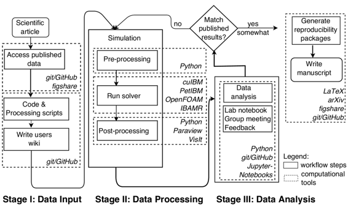

# 用四种不同的代码实现我们自己已发表的 CFD 结果的完全复制

# 用四种不同的代码实现我们自己已发表的 CFD 结果的完全复制

## Olivier Mesnard 和 Lorena A. Barba

我们是由 [Lorena Barba](http://lorenabarba.com) 教授领导的乔治华盛顿大学机械与航空航天工程系的计算研究小组成员。我们尽最大努力进行可重复的研究，并多年来努力改进我们的实践以实现这一目标。根据 Barba 在 2012 年承诺的“可重复性 PI 宣言”，我们所有的研究代码都在版本控制下并且是开源的，我们的数据是公开的，并且我们发布所有出版物的开放预印本。对于一篇论文的主要结果，我们准备包含输入和输出数据、绘图脚本和图表的文件捆绑，并将它们存储在 [figshare](https://figshare.com/authors/Lorena_A_Barba/97553) 存储库中。这个案例研究描述了当我们着手完成我们自己小组已发表结果的完全复制时发生了什么，使用不同的计算流体动力学（CFD）代码：我们小组开发的新代码、另一个小组开发的开源代码以及一个开源的 CFD 库。

### 工作流程

 我们的研究实验室多年来开发了一致的工作流程，我们相信这会导致可重复的研究。我们实验室之前的一项研究，发表在 Krishnan 等人（2014）的论文中，已经满足了“可重复性 PI 宣言”（Barba，2012）的标准。那项工作使用我们的代码 [cuIBM](https://github.com/barbagroup/cuIBM) 研究了使用浸入边界方法解决 Navier-Stokes 方程的飞行蛇的空气动力学。研究的关键是，对于特定配置，蛇的横截面经历了升力增强。在这里，我们描述了我们努力实现主要结果的完全复制的过程，使用四种不同的计算流体动力学（CFD）代码，包括 cuIBM。我们遇到了失败和困难，导致我们的工作流程的改进，并得出结论，关于在由涡度（流动的局部旋转）主导的高度不稳定流场情况下可重复性的挑战。

我们用于尝试复制的第一个代码是 IcoFOAM：著名 CFD 包 [OpenFOAM](http://www.openfoam.org/) 中的非定常层流求解器。我们选择 OpenFOAM 是因为它被广泛使用，是开源的，并且有文档支持：代码文档和用户指南都可用。对于像 IcoFOAM 这样的非结构网格有限体积求解器，网格生成步骤往往决定了解的质量，我们发现一些网格导致了非物理结果。我们的初步尝试导致了不一致的结果，我们不得不更换网格生成工具以获得可接受的网格质量。在域出口设置边界条件特别棘手，由于我们需要的边界条件类型缺乏文档支持，这更加困难。我们投入了几个月的持续努力，最终用 IcoFOAM 成功复制了我们先前的研究发现（就升力特性而言）。

我们接下来使用的是[IBAMR](https://github.com/ibamr/ibamr)，这是一个托管在 GitHub 上的开源库，提供了几种用于浸入式物体的数值方法。其中一种专门设计用于非变形物体，而这正是我们的情况。Bhalla 等人（2013 年）发表了对这种方法的详细验证，代码库中也包含了一些示例。经过多次失败的尝试，我们发现这种方法需要使流体 *内部* 的每个地方都静止，而不仅仅是在边界处——这在浸入边界方法中并不直观。最终，我们可以说 Krishnan 等人（2014 年）的 *科学发现* 已经被复制，但我们仍然在流动特性的细节上看到明显的差异。

[cuIBM](https://github.com/barbagroup/cuIBM) 和 [PetIBM](https://github.com/barbagroup/PetIBM) 代码都是在我们的研究实验室开发的，并实现了相同的浸入边界方法（Taira & Colonius, 2007）。GitHub 代码仓库包括使用 [Doxygen](http://www.doxygen.org) 的代码文档、用户文档（在 GitHub wiki 上），以及基本示例和教程。cuIBM 使用 [CUSP](https://github.com/cusplibrary/cusplibrary)，这是一个用于单个 CUDA 架构图形处理单元（GPU）的稀疏线性代数的开源库。我们再次使用 cuIBM 来确认 Krishnan 等人（2014）发表的研究结果的可重现性。重要的是要指出，我们必须使用*相同版本*的代码，以及*相同版本*的线性代数库才能获得与以前相同的数值答案。事实上，我们最初尝试使用了较新版本的 CUSP 库，但未能复制这些发现！在 PetIBM 中，我们使用 [PETSc](http://www.mcs.anl.gov/petsc/) 库在分布式内存机器上解决线性系统。尽管 cuIBM 和 PetIBM 中的数学形式完全相同，但我们观察到不同的线性代数库可能会改变结果。截至目前，我们无法使用 PetIBM 复制飞行蛇的升力增强特性。

从这个案例研究中得到的教训令人警醒。首先，重复研究的警觉实践必须超越数据和代码的公开共享。我们现在使用 Python 脚本来自动化我们的工作流程——所有脚本都是版本控制的、代码文档化的，并接受命令行参数（以避免用户修改代码）。我们不再使用图形用户界面，而是调用包含在可视化工具 [Paraview](http://www.paraview.org/) 和 [VisIt](https://wci.llnl.gov/simulation/computer-codes/visit/) 中的 Python 解释器来绘制数值解。在整个过程中，Jupyter Notebooks 和 Markdown 文件记录了部分项目进展。其次，某些应用场景可能会带来特殊挑战。在这里，我们正在处理施加在由涡度主导的高度非稳定流动上的 Navier-Stokes 方程，这对于可重复性来说是一个特别棘手的应用。第三，当使用外部库来迭代解线性系统时，需要额外小心：它们可能会引入不确定性。

现在我们准备撰写一份关于这个项目结果的手稿，该手稿正在使用 LaTeX 编写，并在其自己的 GitHub 仓库中进行版本控制，以促进作者之间的合作。为了倡导开放科学，手稿将首先在 arXiv 上提供。我们还将在 figshare 仓库中提供一个包含手稿中报告的所有模拟和图表的可重复性包。这些包括软件的版本、输入参数、与机器架构相关的信息，以及运行和后处理模拟所需的必要脚本。

### 痛点

在可重复工作流中的一个关键要素是保持详细，及时和版本控制的实验室笔记。几乎不可想象，如果不编写所有步骤的脚本——预处理，运行，后处理——并自动保存命令行输入，就无法记录计算实验的适当实验室笔记。在这个案例研究的项目中，我们使用了四种不同的 CFD 代码来进行涵盖许多参数组合的批次模拟，导致了数百次运行。运行时间在 1 到 3 天之间变化，每个数字解决方案产生了 3.5 到 16 千兆字节的数据。大多数模拟是在乔治华盛顿大学的 HPC 集群上远程运行的，然后将解决方案移动到几台不同的本地桌面机上进行后处理和存储。实验室笔记本对跟踪所有模拟和数据都至关重要。该项目的另一个非常耗时的方面是熟悉新软件——熟悉用户文档不完善的代码需要更长的时间。最后，我们还花了相当多的时间开发用于分析不同代码生成的数值解决方案的自动化脚本（生成不同的输出格式）。然而，这些脚本对于提供可重复的计算实验是至关重要的。

### 关键优势

在计算流体力学领域，从零开始开发解决特定流体流动场景的软件可能需要六个月甚至一年的时间。在发布结果时，如果作者不公开用于研究的代码和数据，那么任何希望重现结果的读者都将面临巨大的时间投入。毫不奇怪，试图重现先前发表的研究结果的研究很少。正如我们在努力完全复制我们自己先前研究的运动过程中所展示的，不稳定的，高涡流状态下的流体流动模拟存在严重的陷阱和挑战。许多已发表的研究报告错误结果是一种明显的可能性。正如 Leek 和 Peng（2015）所指出的，增加已发表研究的可重复性水平将有助于发现错误的研究结果。因此，为了增加对任何新的基于计算生成的科学知识主张的信心，至少需要达到可重复性的最低水平——公开代码和数据是至关重要的。超越分享代码和数据，完全自动化和数字记录实验运动过程提供了从计算实验中提取科学价值的最佳保证。

### 关键工具

我们使用版本控制托管平台 GitHub 来支持我们的可重现工作流程。GitHub 在开发数值代码和文档时极大地促进了协作。该平台还允许创建用户文档的 wiki 页面。我们使用 GitHub 来撰写手稿，记录我们的小组会议，并存储教材。我们还广泛使用 Python 来自动化分析和后处理。在小组会议讨论中，最好使用 Jupyter 笔记本来呈现进展报告和总结，其中文本媒体与代码和可视化相结合。为了记录准备模拟和运行的所有步骤的数字记录，bash 脚本至关重要。我们还使用 Travis CI 来在将更改合并到主代码库时运行代码的自动化测试。

### 问题

#### 对你来说，“可重现性”意味着什么？

我们对可重现性的理解的起点包含在“可重现性 PI 宣言”（Barba, 2012）中，其中包括以下步骤：

1.  教导团队成员有关可重现性；

1.  在版本控制下维护所有代码和写作；

1.  进行验证和验证并发布结果；

1.  对于出版物中的主要结果，在 CC-BY 下分享数据、绘图脚本和图表；

1.  在提交论文时将预印本上传到 arXiv；

1.  在提交论文的同时，最迟在那时发布代码；

1.  在每篇出版物中添加“可重现性”声明；

1.  保持最新的网络存在。

这些项目中的一些与使我们的研究材料和方法开放获取和可发现有关。这份宣言的核心是发布代码、数据和分析/可视化脚本。这已经可能耗时且要求高度。然而，我们已经认为这些步骤是可重现研究的最基本水平。在对我们研究小组以前发表的一篇论文进行完整复制研究时，我们意识到要实现这一点需要更多的严谨性，在非稳态流体动力学的计算流体动力学背景下。我们使用 Peng（2011）提出的“完整复制”的概念，即使用新方法进行独立研究，收集新数据，最终得出相同的科学发现。在计算流体动力学中，发现的完整复制可能涉及使用实现相同数值方法的不同代码，或者实现完全不同数值方法但解决相同数学模型的代码。因为我们正在解决 Navier-Stokes 方程—一个非稳态和非线性模型—某些问题场景可能对复制提出特殊挑战。

#### 为什么您认为在您的领域中可重现性很重要？

在计算科学中，我们使用模拟和数据分析作为创造和证明科学知识的工具。这个知识创造的过程，就像所有科学一样，也必须产生证据来证明自身的合理性。可重复性是为了为信任通过计算获得的科学发现提供依据的一种方式。确保一篇论文（以及用于生成图表的数据）是可重复的，使其他人更容易证实（或拒绝）科学假设。用于发布结果的代码和数据应该进行版本控制并开源，以促进可重复性。Donoho 和合著者（2009 年）提到，我们开发代码是为了让陌生人也能使用，并将陌生人定义为“任何不具备我们当前短期记忆的人”（包括我们几年后的自己）。我们相信，可重复性研究也可以防止科学家因为必须重新创建完整的软件堆栈以构建先前发表的工作而“重复造轮子”。

#### 你是如何学习到可重复性的呢？

研究小组的 PI，洛雷娜·巴尔巴教授，积极参与提高对可重复性研究的认识。加入我们研究实验室的新生必须首先学习“可重复性 PI 宣言”中提到的不同工具。[软件工程基金会](http://software-carpentry.org/)（通过研讨会和在线资源）也为教育我们的小组成员和改进我们的工作流程以实现可重复性研究做出贡献。

#### 你认为在你领域进行可重复性研究的主要挑战是什么，你有什么建议吗？

可重复性研究可能会耗费大量时间，需要严格的方法和组织。在项目的不同阶段，我们不得不停下来问自己我们的研究是否当前可重复。通常情况下，这是由小组会议中的对话或质疑引发的。在这个意义上，研究小组内以及更广泛的学科社区中的强大合作文化对于在计算研究人员中灌输可重复性实践至关重要。缺乏强调可重复性研究的系统性和广泛性教育计划是一个严重障碍。

#### 你认为进行可重复性研究的主要动机是什么？

使你的研究更具可重复性——例如，随手稿提供可重复性包——是展示你的技能、更透明地传达研究的媒介，以及邀请对你的工作提出反馈的一种方式。如果研究社区倾向于更加努力地进行可重复性研究，它将防止科学家通过重新编写软件来从你的工作中构建，从而避免重复造轮子。从长远来看，这有助于节省资源，实现科学知识的增长，无论是在社区层面还是在研究小组内部。

#### 在你的领域，您会推荐一些最佳实践吗？

再次强调，自动化所有计算工作流程并认真维护实验室笔记本对记录你的研究至关重要。我们尽量避免使用图形用户界面，更倾向于编写脚本，以便分析能够自动化、可重复和记录。这可能会耗费时间，但在研究项目的较长期间肯定是有益的。

#### 您会推荐一些特定资源来了解更多关于可重复性的内容吗？

+   Barba, L. A. (2012 年 12 月 13 日)。“可重复性 PI 宣言”，10.6084/m9.figshare.104539。在 ICERM 研讨会“计算和实验数学中的可重复性”上发表演讲的演示。以 CC-BY 许可在 figshare 上发布。

+   Donoho, D. L., Maleki, A., Rahman, I. U., Shahram, M., & Stodden, V. (2009). 计算谐波分析中的可重复研究。《科学与工程中的计算》, 11(1), 8-18。

+   Leek, J. T., & Peng, R. D. (2015)。观点：可重复研究仍然可能是错误的：采用预防性方法。《国家科学院院刊》，112(6), 1645-1646。

+   Madeyski, L., & Kitchenham, B. A. (2015)。可重复研究--什么、为什么和如何。Wroclaw University of Technology, PRE W, 8。

+   Peng, R. D. (2011)。计算科学中的可重复研究。《科学》（纽约，纽约）, 334(6060), 1226。

+   [可重复研究 -- Coursera 在线课程](https://www.coursera.org/learn/reproducible-research)。

+   Sandve, G. K., Nekrutenko, A., Taylor, J., & Hovig, E. (2013). 重复计算研究的十条简单规则。

+   [软件工匠](http://software-carpentry.org)。

+   软件测试 -- [Udacity 在线课程](https://www.udacity.com/)。

+   Stark, P. B. (2015)。科学是“展示给我看”的，而不是“相信我”。[博客文章](http://www.bitss.org/2015/12/31/science-is-show-me-not-trust-me)。

+   Vitek, J., & Kalibera, T. (2011 年 10 月)。系统研究中的可重复性、再现性和严谨性。在第九届 ACM 国际嵌入式软件会议论文集中 (pp. 33-38)。ACM。

### 参考文献。

Bhalla, A. P. S., Bale, R., Griffith, B. E., & Patankar, N. A. (2013)。一种统一的数学框架和一个适应性数值方法，用于刚性、变形和弹性体的流体-结构相互作用。《计算物理学杂志》，*250*, 446–476。

Krishnan, A., Socha, J. J., Vlachos, P. P., & Barba, L. A. (2014). 飞蛇的升力和尾迹。《流体物理学》，*26*(3), 031901。

Taira, K., & Colonius, T. (2007)。浸入式边界方法：投影方法。《计算物理学杂志》，*225*(2), 2118–2137。
