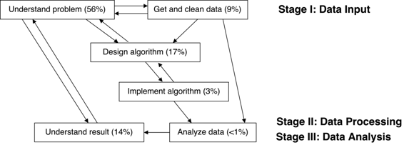

# 可重现的应用统计学：治疗师-患者互动的标记可靠吗？

# 可重现的应用统计学：治疗师-患者互动的标记可靠吗？

## K. Jarrod Millman、Kellie Ottoboni、Naomi A. P. Stark 和 Philip B. Stark

我们是加州大学伯克利分校的三位应用统计学家（JM、KO、PS），与宾夕法尼亚大学的领域专家（NS）合作。我们的案例研究涉及对自闭症谱系儿童治疗过程中人际可靠性（IRR）的评估，这涉及到人类评分员对治疗过程中的互动进行分类标记。

本案例研究的扩展版本以及分析脚本和结果可在 [`github.com/statlab/nsgk`](https://github.com/statlab/nsgk) 找到。

### 工作流程

 我们的项目源自 NS 与旧金山儿童心理健康中心的 Gilbert Kliman 博士合作的一项试点研究。为了研究对自闭症谱系儿童的治疗干预，Kliman 博士和 NS 收集了一些观察数据（下文描述）。NS 向 PS 寻求关于数据和她研究的问题的帮助。在进一步调查问题后，PS 向 JM 和 KO 发送了一个一页的建议，建议使用分层抽样的分层排列测试来评估人际可靠性。我们（JM、KO、PS）最近开始开发一个通用的 Python 包用于排列测试，称为[`permute`](http://statlab.github.io/permute/)，基于我们的合作。PS 建议这将是一个有趣的案例。

在对 NS 的基本研究问题和实验有了初步了解，包括她如何收集数据后，我们（JM、KO、PS）清理了数据，开发了一个适合实验的评定 IRR 的非参数方法，在 Python 中实现了这个方法，将结果代码纳入我们不断完善的 Python 包中的排列测试中，将这个方法应用于清理后的数据，记录了代码和分析过程，并在 LaTeX 中写出了结果。

我们区分了项目中以下典型的应用统计学方面：

+   理解问题

+   获取并清理数据

+   设计算法

+   实现算法

+   分析数据

+   理解结果

图 1 显示了项目的每个方面是如何影响其他方面的，并给出了我们集体在项目的每个方面上花费的总人时的估计。例如，如果 JM、KO 和 PS 一起在会议上讨论问题花了一个小时，那么这个会议就计为 3 人时。

我们没有详细记录花费的时间，但我们的计算实践提供了关于谁在何时做了什么的足够细节，我们相信我们的估计提供了对项目各方面时间需求的准确定性描述。 但是，由于这些只是粗略估计，读者应该关注我们在每个方面花费的时间量的相对差异。 我们发现研究人员（包括我们自己）通常低估了理解问题、获取和清理数据以及理解结果所需的时间，而高估了编写代码所需的时间。 我们包含了我们的时间估计，以便让人们了解更具有再现性工作的“廉价”（或昂贵），捕捉我们团队理解的演变，并希望这对学生和合作者有所启发。

由于我们将计算再现性视为所有项目方面的跨领域关注点，我们采用了一套计算实践，我们（JM，KO，PS）在项目中（几乎）每次工作时都遵循。 例外情况包括我们没有记录所有面对面讨论或白板工作。 但是，我们努力记录这些活动的摘要。 这些计算实践在 Millman & Pérez（2014）中描述，在开源科学 Python 社区中被广泛使用。 虽然这些实践是为管理软件贡献而开发的，但这些实践非常适合确保科学和统计研究的计算再现性。 我们将说明我们如何利用`permute`的软件基础设施和开发实践与同事进行可重复和协作的应用统计研究。 我们将在下面的关键工具和实践中简要讨论软件工具和实践。

#### 理解问题（80 小时）

Kliman-Stark 研究项目旨在确定与自闭症谱系儿童进行有效临床互动的特征。 该项目首先需要开发一组观察者可以使用的特征，以便在每个治疗会话的 30 秒间隔内“标记”发生的情况。 在他们开发了临床互动的分类法之后，Kliman 和 NS 请了许多经过训练的评分员观看治疗会话的视频，并使用一系列标签为每个 30 秒间隔进行标记。 为了使分类系统具有意义和实用性，不同的评分员通常必须就某个标签是否适用于某个视频片段达成一致意见：必须具有评分员间的一致性。 当然，如果某个标签从未被使用或总是被使用，评分员间的一致性将是完美的，但该标签对于区分临床互动是无用的。

那引出了一个统计问题：如何评估标记视频中的证据，以确定不同的评分者是否以相同的方式标记互动？经过多次对话后，认为考虑零假设是合理的，即在给定评分者对给定视频应用给定标签的次数的条件下，该评分者对视频中的时间戳分配给定标签的所有分配都是等可能的，并且不同评分者给出的评分是可交换的（基本上是评分者是独立的）。

一旦 PS 对 NS 的问题有了初步的了解，我们（JM、KO、PS）定期（大约每周一次，有时更频繁）作为一个团队会面讨论项目。最初，这些讨论涉及很多白板工作和问很多深入的问题。这帮助我们发展出对问题的共同理解，通过向彼此解释事情和询问我们计划的方法是否能够解决感兴趣的问题来提高理解。随着对问题的理解的进展，我们的工作从在白板上工作转移到在计算机上测试我们的想法。在这个阶段我们经常使用配对编程，有时我们都坐在一台电脑前，其中一人在交互式 IPython 会话中键入代码。这有助于确保我们都对问题有很好的理解，同时也有助于我们发现错误（打字错误以及概念上的误解）。

#### 获取并清洁数据（13 小时）

标签数据由 NS 和她指导的评分者收集。数据包括由 10 名训练有素的评分者对 8 个视频片段的评分。每个视频大约分成 40 个时间段。在每个时间段中，可能正在进行 183 种活动中的任何一种活动，也可能没有。评分者指出了视频的每个片段中正在进行的活动。

PS 从 NS 那里收到了一份 Excel 电子表格，该表格由 NS 和一位助手手动输入。在 PS 获得一份没有明显错误的数据版本之前，需要进行几轮 PS 和 NS 之间的电子邮件往来，以理解“数据字典”并对明显错误进行审查。然后，PS 将 Excel 数据导出为逗号分隔值（CSV）格式。原始数据包含个人身份信息。在交互式文本编辑器中使用正则表达式，PS 在 CSV 文件中为评分人的姓名替换了唯一的数字标识符。虽然这一步骤没有可重复执行（即没有脚本化），但可以很容易地进行检查。在 PS 生成原始匿名化数据后，JM 将其提交到我们的存储库，并添加了一个数据加载器以及用于确保数据更改后我们能够知道的测试。在此时，我们（JM、PS）对匿名化数据进行了筛查，以查找转录错误（例如，重复行）。这涉及编写一些质量保证工具（例如，查找重复连续行），这些工具现在包含在 `permute` 中。一旦我们确定了与我们对数据应该包含的内容的理解不兼容的条目，JM 就会编写一个 `sed` 脚本来“更正”推断的拼写错误。用于清理数据的确切命令包含在对应于该清理步骤的提交中。在仔细检查数据以寻找潜在错误并记录我们进行的每一项更改及其原因后，我们向 NS 发送了清理后的数据以及我们所做的更改及其原因的解释，以验证更正是否合适。因此，我们在项目存储库中提供了清理后的数据以及对其来源的仔细说明。

#### 设计算法（25 小时）

尽管我们最终实施的测试与项目开始时由 PS 提出的原始测试非常相似，但我们（JM、KO、PS）花费了大量时间专注于“问题认知”，其中一些导致了用于实施测试的算法的大幅简化。我们还开发了更一般化的术语（见表 1）。

我们的激励问题（NSGK）中的术语与我们的通用算法（IRR）中使用的术语之间的映射。

| NSGK | IRR |
| --- | --- |
| 183 种活动类型 | *T* 个标签 |
| 8 个视频 | *S* 个分层 |
| 40 个片段/视频 | *N*[*s*] 个项目/分层 |
| 10 个评分人 | *R* 个评分人 |

我们决定评估鉴定（即标记）每种 183 种活动的评定者可靠性，因为它们是独立感兴趣的。这引发了关于是否要对每个标记分别进行推断（每次比较错误率，PCER）还是同时进行推断（整体错误率，FWER），或者我们是否关心我们得出的可靠标记的比例实际上并不可靠（虚假发现率，FDR）的问题。最终，我们决定 PCER 是最相关的错误标准，因为这些标记各自很有趣。作为对评分方案的“初步尝试”，消除明显不可靠的标记简化了方案，并减少了评定者的认知负担，因为他们不必记住那么多种类的活动。我们想象，如果我们能够消除大量不可靠的标记，将会有一组不同的评定者重复使用标记来验证或完善结果，从而降低“假阳性”的比率。另一方面，错误地拒绝标记为不可靠可能会消除一个潜在有用的成功治疗结果的预测因子，因此 FWER 似乎是一个过于严格的标准。有关更多讨论，请参见下面的理解结果部分。

由于每个视频包含不同的治疗师-患者互动会话，通常由不同的人评分，我们按视频进行分层测试。对于评估 IRR 方法的文献搜索使我们得出结论，由于实验是分层的；有多个评定者但不是所有视频的相同集合；标准方法需要不可辩护的参数假设或人口模型，我们希望避免这种情况。在决定使用置换测试后，我们（JM，KO，PS）然后确定在视频内每个评定者的评分进行置换，在评定者之间和视频之间独立进行，这在零假设下是合理的不变量。我们选择使用评分的一致性作为每个分层内的部分检验统计量。我们（JM，PS）推导出了一个简单的表达式，用于高效计算一致性。为了跨分层组合测试，我们（JM，KO，PS）使用了非参数组合（NPC）测试（Pesarin＆Salmaso，2010）与 Fisher 的组合函数。最后，我们开发了一种计算效率高的方法来找到 NPC 测试的整体*p*值。

#### 实施算法（5 小时）

一旦我们有了算法的蓝图，KO 带领实施工作。她做了大部分编码；JM 和 PS 审查了代码并讨论了实施细节。遵循我们的软件开发实践，KO 还为她实现的每个函数编写了测试。经过几轮编码、测试和审查，KO 完成了我们的实现，并将其合并到`permute`中。

KO 编写了三个函数来实现我们的一般 IRR 算法：

1.  一个函数，用于从具有每个评分者一行和每个项目一列的二进制矩阵计算 IRR 部分测试统计量；

1.  一个函数，用于模拟单个层的评分矩阵的 IRR 部分测试统计量的排列分布；

1.  一个函数，用于通过组合每个*S*层的 IRR 部分测试统计量的*S*分布来模拟 NPC 测试统计的排列分布。

#### 分析数据（1 小时）

一旦我们将 KO 的通用算法实现（包括测试）合并到`permute`中，KO 就编写了一个简短的脚本（大约 50 行 Python 代码）来分析 NS 的清理数据。

由于我们在`permute`中包含了主要的工作函数，分析脚本只包含高级命令：

1.  加载清理后的数据

1.  对于活动的 183 个类别中的每一个：

    1.  对于这 8 个视频中的每一个：

        1.  计算标签被应用的次数的平均值和标准差

        1.  计算 IRR 部分测试统计量

    1.  对于每个标签结合在一起的*8*个视频，模拟 NPC 测试统计的排列分布，并报告一个单一的*p*-值。

1.  将结果保存到 CSV 文件中

#### 理解结果（20 小时）

在高层次上，我们计算的汇总统计量甚至也很有用：一些标签从未被任何评分者应用到任何视频上。可以推测，通过从标签的标签宇宙中消除这些标签，可以简化标签分类，减少人类评分者的认知负担。还有一些标签被使用得如此频繁，以至于高一致性几乎是肯定的——因此高评分者之间的一致性并不是评分者之间可靠性的证据。这也可能意味着疗法效果的任何差异都不能归因于相应的活动是否正在进行，因为这些活动通常至少在这些会话中进行。是否应该保留这些标签在分类中，部分取决于主题知识：这些交互在这些评估数据中的视频中是否只是典型的，还是在自闭症谱系儿童的所有治疗干预中都是典型的？

在另一个极端，有些标签的使用一致性非常低，但仍然非常显著。这引发了一个科学问题：在评分者之间的一致性达到何种阈值水平会使标签变得有趣或有用，而不是一致性是否在统计上显著。这是我们需要与领域专家更详细地讨论的问题。这也指向了统计学中经常出现的情况：实际意义和统计显著性并不相同，而在设计汇总统计量时必须考虑“适用性”。

我们希望具体的发现将导致分类法的完善和可靠性的额外测试。我们希望这些测试将涉及更大规模的数据收集和转录自动化，以消除数据中的一些误差来源。不管怎样，这项工作已经引出了一种新的无参数测试方法，现在公开在 `permute` 包中。

### 痛点

鉴于我们不同的背景和经验，我们（JM、KO、PS）每个人在过程中都发现了不同的挑战点。然而，对于我们所有人来说，最具挑战性的方面——也是最耗时的方面——是必须努力理解科学问题和实验，以便能够制定回答问题的方法。

对于 KO 和 PS 来说，掌握工具和实践存在一定的学习曲线。这涉及理解 git 使用的数据模型，养成习惯，比如为所有函数编写测试，并遵循共同的风格指南，以及学会通过 GitHub 的拉取请求机制间接地向项目存储库做出贡献。JM 已经熟悉这些工具和实践，并花了大量时间教导 KO 和 PS 工作流程。一旦掌握，这些工具和习惯的好处就会超过学习它们所花费的时间和精力。

对 JM 而言，项目中最痛苦的部分是审查手工录入的数据以查找错误和不一致之处。这不仅费时费力，而且涉及到推断数据本应该是什么，而没有任何直接的方法来确保这些推断是正确的：原始评分者和视频对我们不可用。解决这个痛点的方法是尽可能自动化数据收集。然而，当数据已经手工输入时，除了在“修复”数据输入错误时要谨慎，记录数据清理过程的每个方面之外，别无他法。

### 关键优势

自从 Buckheit & Donoho（1995）推广了计算可重现性的概念以来，应用统计学家越来越多地采用了版本控制和流程自动化。我们许多同行已经在课堂和实验室中将计算可重现性的概念放在了核心位置。有些人要求与他们合作的人遵循一套包括版本控制在内的计算实践。

然而，本研究描述的计算实践（请参阅关键工具和实践）超越了我们同行的标准工作习惯。我们的计算实践提供以下好处：

1.  它减少了由新代码和对现有代码的更改引入的错误数量

1.  当发现错误时，修改分析变得容易，将分析应用于新数据集等。

1.  这个过程是自我记录的，这样就更容易起草有关结果的论文，或者在做其他工作后继续进行。

1.  方法是从分析中抽象出来并纳入包中，以便其他人可以发现、检查、使用和扩展我们的方法。

### 关键工具和实践

作为我们软件包 `permute` 的开发的一部分，我们投入了大量精力建立开发基础设施，以确保我们的工作被追踪，彻底和持续测试，并且逐步改进和记录。为此，我们采用了成功的开源项目（Millman & Pérez, 2014）所使用的软件开发最佳实践。

#### 版本控制和代码审查

我们（JM、KO、PS）使用 git 作为我们的版本控制系统（VCS），GitHub 作为我们官方 `upstream` 仓库 [statlab/permute](https://github.com/statlab/permute) 的公共托管服务。我们每个人都有我们自己的 `upstream` 仓库的副本，或者叫分叉。我们每个人都在自己的仓库上工作，并使用 `upstream` 仓库作为我们的协调或集成仓库。

这使我们能够跟踪和管理我们的代码随时间的变化，并在将新功能合并到 `upstream` 仓库之前进行审查。为了将新代码或文本集成到 `upstream` 仓库中，我们使用 GitHub 的 *pull request* 机制。这使我们能够在集成之前审查代码和文本。下面，我们描述了如何自动测试我们的代码以为所有 pull request 生成报告。这样我们就可以降低代码更改破坏现有功能的风险。一旦 pull request 被审查并接受，它就会被合并到 `upstream` 仓库中。

要求所有新代码都经过审查具有多个好处。代码审查提高了我们代码的质量和一致性。它有助于保持高水平的测试覆盖率（见下文）。此外，它还帮助开发团队了解其他团队成员正在做的工作。虽然我们目前是一个小团队，并且定期会面，但建立代码审查系统将使新人更容易贡献，并捕获我们的设计讨论和决策以供将来参考。

#### 测试和持续集成

我们使用了 `nose` 测试框架来自动化我们的测试过程。这是科学 Python 生态系统中核心包使用的标准测试框架。自动化测试使我们能够在进行更改时监视代码正确性的代理，同时简化新代码的代码审查流程。没有自动化测试，每次提出更改时，我们都必须手动测试所有代码。`nose` 测试框架简化了测试的创建、发现和执行。它有一系列广泛的插件，用于添加覆盖率报告、测试注释、分析，以及检查和测试文档的功能。

我们的目标是测试每一行代码。例如，我们不仅要测试包中的每个函数，而且如果特定函数具有条件分支结构，我们会测试该函数的每个可能执行路径。测试每一行代码可以增加我们对代码的信心，并确保我们的更改不会破坏现有代码。它还增加了我们对新代码有效性的信心，减少了接受贡献的摩擦。目前，`permute` 中超过 98% 的代码行至少会被我们的测试系统执行一次。

我们经常同时处理几个拉取请求。这些拉取请求可能需要几个星期或几个月才能被审查、改进并被接受到我们的 `upstream` 存储库中。当我们处理一个拉取请求时，我们可能会合并其他几个拉取请求。由于基础代码库正在更改，每个拉取请求在尝试将其合并回主线时可能会引入集成冲突。为了减轻处理这些冲突的困难，我们使用持续集成并跟踪我们的测试覆盖率。

持续集成工作如下：每个拉取请求（以及对现有拉取请求的新提交）都会触发自动化系统对更新后的代码运行完整的测试套件。具体而言，我们已经配置了 [Travis CI](https://travis-ci.org) 和 [`coveralls`](https://coveralls.io) ，它们会在每次向拉取请求或 `upstream` 主分支提交代码时自动触发。这些系统会使用我们依赖项的不同版本（例如，Python 2.7 和 3.4）运行完整的测试套件。Travis CI 检查所有测试是否通过，而 `coveralls` 生成测试覆盖报告，以便我们可以监视哪些部分的代码被测试覆盖，哪些部分没有。该系统检查我们的自动化测试是否有任何失败，并跟踪我们的代码被自动化测试覆盖的百分比。这意味着当您审查拉取请求时，您可以立即看到建议的更改是否破坏了任何测试，以及新代码是否减少了整体测试覆盖率。

#### 文档

我们使用 Sphinx 作为我们的文档系统，并拥有广泛的开发者文档和高质量用户文档的基础。Sphinx 是 Python 的标准文档系统，被核心科学 Python 包使用。我们使用 Python 文档字符串并遵循[NumPy 文档字符串标准](https://github.com/numpy/numpy/blob/master/doc/HOWTO_DOCUMENT.rst.txt)来记录`permute`中的所有模块和函数。使用 Sphinx 和一些 NumPy 扩展，我们有一个系统可以根据文档字符串以及用一种类似于轻量级 Markdown 的语言编写的独立文本（称为[reStructuredText](http://docutils.sourceforge.net/rst.html)）自动生成项目文档（作为 HTML 或 PDF）。这个系统使我们能够轻松地嵌入引用、图表、在文档生成过程中自动运行的代码，以及使用 LaTeX 进行数学运算。

#### 发布管理

我们的开发工作流程确保官方的`upstream`存储库始终稳定并且可以随时使用。这意味着任何人都可以随时安装我们的官方上游主分支并开始使用。我们还将官方发布作为源代码 tarball 和作为上传到 Python 软件包索引（PyPI）的 Python 构建包提供，并在我们的邮件列表上发布发布公告。

通过在应用项目的重要阶段达到时制作官方发布，我们能够在以后轻松恢复我们分析的确切版本。要安装在本案例研究中使用的`permute`的确切版本，请从 shell 提示符（假设您已经安装了 Python 和最新版本的`pip`）中键入以下命令：

```
$ pip install permute==0.1a2 
```

### 问题

#### 对你来说，“可重现性”是什么意思？

在本案例研究中，*可重现性*意味着：

+   *计算可重现性和透明度*。我们已经记录（并编写脚本）了分析的几乎每一个步骤——从清洁到编码再到代码执行——并公开提供了代码和文档。

+   *科学可重现性和透明度*。我们记录了导致我们决定采取分析中的每一步的讨论。我们以开放格式公开提供了数据，并附有充分的数据字典。

+   *计算正确性和证据*。我们充分测试了我们的代码，并以自动化方式进行了测试，以确保代码执行了预期的操作。我们公开提供了这些测试，以便他人可以看到我们如何验证我们的计算。

+   *统计可重现性*。我们投入时间来理解基本问题和我们分析结果，以便我们不会得出数据、获取方式以及我们对领域的理解所不支持的结论。我们避免了“p-hacking”和其他可能具有误导性的选择性报告，并公开提供了我们所有的分析。

通过将所有代码、文本和数据保存在一个公共的版本控制存储库中，我们已经使我们的完全记录的分析可供任何人检查、检查、修改或重复使用。我们发布了我们研究中使用的数据--原始匿名版本以及我们清理过的版本，包括从匿名版本产生清理版本所需的命令。除了使我们所做的工作对任何感兴趣的人都透明外，以这种方式工作意味着当发现错误时，我们可以确定这些错误是如何引入的以及何时引入的。我们几乎为我们所有的代码编写了测试，这意味着我们对我们的代码进行更改时，我们有很高的信心能够捕获我们可能引入的任何错误，并且可以快速轻松地更正它们。由于我们已经自动化了运行分析的过程，因此如果发现并纠正了错误，从头到尾重新运行整个分析就变得很容易。

如果您的计算机上有标准工具并且可以访问网络，则可以通过在 Unix shell 提示符下键入以下三个命令来运行我们对清理数据的完整分析：

```
$ git clone git@github.com:statlab/nsgk.git
$ cd nsgk/nsgk
$ make 
```

第一个命令在当前工作目录中创建一个名为`nsgk`的目录，其中包含项目存储库的副本（即包含我们的代码、数据和文本以及这些文档的来源的目录）。此目录包含此文档以及运行我们分析所需的所有内容。在`nsgk/nsgk`内部有一个`Makefile`，我们的分析脚本`analysis.py`以及该脚本的输出`results.csv`。

当你输入命令`make`时，将运行以下命令：

```
virtualenv -p /usr/bin/python2.7 venv
venv/bin/pip install --upgrade pip
venv/bin/pip install -r requirements.txt
venv/bin/python analysis.py 
```

第一个命令创建一个新的 Python 2.7 虚拟环境（`venv`）。使用这个新的虚拟环境（`venv`），随后的命令分别将 Python 软件包管理器（`pip`）升级到最新版本，安装所需的 Python 软件包依赖项（`numpy 1.11.0`，`scipy 0.17.0`和`permute 0.1a2`），并运行分析脚本`analysis.py`。

### 参考文献

Buckheit, J. B., & Donoho, D. L. (1995). Wavelab and reproducible research. In A. Antoniadis & G. Oppenheim (Eds.), *Wavelets and statistics*. Springer.

Millman, K. J., & Pérez, F. (2014). Developing open-source scientific practice. In V. Stodden, F. Leisch, & R. D. Peng (Eds.), *Implementing reproducible research* (pp. 149–183). Chapman; Hall/CRC.

Pesarin, F., & Salmaso, L. (2010). *Permutation tests for complex  Theory, applications and software.* John Wiley & Sons.
