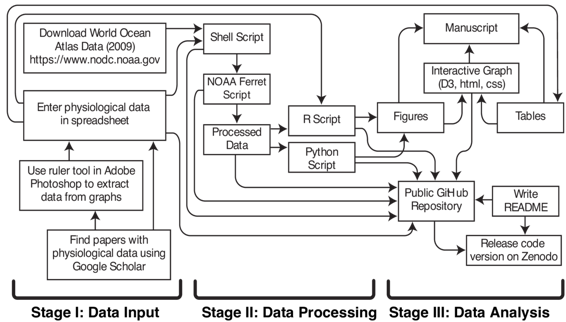

# 对生物地理学研究中使用的计算方法的解剖

# 对生物地理学研究中使用的计算方法的解剖

## K. A. S. Mislan

我的名字是 Allison Smith，我是一名生态生理学家，我的研究重点是海洋中生物与环境的相互作用。特别是，我对预测气候变化对海洋生态系统的影响很感兴趣。

我最近发表了关于全球海洋中浮游动物基本生态位的研究。该研究包括对不同物种血氧结合特性的比较，这些特性来自已发表的论文。利用格网化的海洋数据在海洋中映射了血氧结合特性的阈值。我的工作流程详细描述了我获取和分析项目数据的过程。为了增加研究的可重复性，项目中使用的代码被存档在长期存档中。

**研究论文**：Mislan, K. A. S., Dunne, J. P. 和 Sarmiento, J. L. (2016), 海洋中浮游动物血氧结合的基本生态位. Oikos. [`doi.org/10.1111/oik.02650`](https://doi.org/10.1111/oik.02650)

**代码存档**：Mislan, K. A. S., Dunne, J. P. 和 Sarmiento, J. L. (2015). P50 深度分析 v1.0\. Zenodo. [`dx.doi.org/10.5281/zenodo.31951`](http://dx.doi.org/10.5281/zenodo.31951)

### 工作流程

 从现有资源中获取数据是第一步。2009 年世界海洋图集（WOA09）数据可通过美国国家海洋和大气管理局（NOAA）国家环境信息中心公开获取。WOA09 数据以地理网格形式存在，并以多种不同文件格式提供。我下载了网络通用数据格式（netCDF）文件格式。NetCDF 文件格式有助于访问和共享数组中的科学数据。有许多工具可用于读取和操作 netCDF 文件。NOAA Ferret 是用于可视化和分析的公开软件，并具有专为 netCDF 文件格式中地理数据的高效处理而设计的内置功能。分析的目标之一是改变两个输入参数并确定对地理特征的影响。我通过编写一个生成和处理 NOAA Ferret 脚本（.jnl 文件）的 shell 脚本，自动化了创建具有不同输入参数的 NOAA Ferret 脚本的过程。处理后的文件保存为 netCDF 文件。

生理数据是通过 Google 学术搜索关键词找到的已发表研究中获取的。数据从论文中提取出来并放入电子表格中。感兴趣的数据通常在表格和论文文本中可用。在某些情况下，数据仅在散点图中可用。使用 Adobe Photoshop 中的标尺工具手动从图表中提取数据。一旦将研究中的所有信息输入电子表格，就将电子表格中的数据保存为制表符分隔的文本文件。然后将数据读入 R 以确定对海洋数据进行分析的参数。此外，数据在 R 中绘制成散点图，图中的每个点都分配了一个编号。有关各个点的信息被放入两个表中。然而，图中的数字必须与两个表中的数字匹配，以从图中获取相关信息，这是低效的。因此，我创建了一个基于 Web 的交互式图表，使用名为数据驱动文档（D3）的 JavaScript 库将表中的信息嵌入到散点图中。在交互式图表中，将鼠标放在点上时，每个点的信息都是可见的。交互式图表还包括选择不同图例的选项，以突出点的其他分组。交互式图表的链接包含在出版物中。

使用 R 和 Python 创建了图表，尽管可以在这两个软件包中的一个中创建所有图表。我先学习了 R，所以我倾向于在 R 中进行大部分分析，因为我对它最熟悉。然而，我喜欢 Python 制作地理图的工具，所以我用 Python 制作了地理图。然后我写了论文。

由于空间和格式限制，代码通常不包含在论文的方法部分中。然而，代码讲述了我分析的更完整的故事。为了准备归档我的代码，我进行了一些修改。我创建了一个文件夹结构，使用户可以轻松找到文件。文件夹结构包括一个用于代码的文件夹，用于运行代码的输入文件的文件夹，代码生成的输出文件的文件夹，以及代码生成的图表的文件夹。在编写代码时，我对代码进行了注释，但注释通常很短，只对我有意义。对归档的代码添加了描述性注释。我还更改了文件路径，使其仅在文件夹结构内引用（../../），以使代码独立于我的主目录（/Users/kasmislan/code/project）。

我的代码在我的计算机上可以工作，但在不同的计算机上可能不会以相同的方式工作。例如，不同的操作系统有不同的数字舍入方法。我在我的计算机上生成了代码的输出文件，并将文件移动到测试文件夹中。然后我编写了一个脚本，自动比较另一个用户在另一个操作系统上使用我的代码生成的输出文件与我在我的操作系统上使用我的代码生成的测试文件之间的差异。如果有差异，用户将能够识别并解决它们。

归档我的代码最关键的步骤是编写文档（README 文件）。文档包括代码目的的描述，参考研究文章，包括版本的软件依赖列表，清晰的逐步使用代码的说明，以及清晰的逐步使用测试文件的说明。我还包括了一个部分来承认我的资金来源和其他帮助项目的人员。

最后一步是使用麻省理工学院（MIT）许可证将代码提交到长期存档 Zenodo。MIT 许可证的限制较少，最大程度地扩展了他人可以使用和适应我的代码的方式。我向期刊发送了代码存档的链接，以便将其包含在出版物中。

### 痛点

我的主要痛点是，在我准备提交科学论文后，归档我的代码需要额外的时间。最耗时的步骤与使他人能够在其计算机上使用代码相关。当我结束一个项目时，我的文件变得混乱，因为在分析数据时我有一个探索阶段，在这个阶段我编写的代码最终不用于论文中呈现的结果。我必须识别和组织相关的代码文件。然后我必须修改文件路径，注释代码，创建测试文件，并编写包含使用代码说明的 README 文件，这也需要额外的时间。另一个痛点是试图找到某人来测试代码，以确保说明可理解，并且代码在其他计算机和操作系统上运行时没有错误。这一步需要另一个人花时间帮助我归档我的代码。在当前的科学研究系统中，归档的代码并不像科学论文那样受到高度重视，因此科学家和代码测试人员为归档代码所花费的额外时间并不直接转化为更大的科学成功。一些学者已经假设，带有归档代码的论文被引用的次数更多，但这并没有得到普遍验证。根据我的经验，我的归档代码仅限于特定的分析，尽管代码的可用性可能会增加科学界对我的结果的信心，但我不认为我的归档代码正在为我的科学论文带来更多的引用。

### 关键好处

可再现性一直是我领域研究的重要组成部分。过去，重现研究的说明放在期刊文章的方法部分中。我领域中代码的重要性日益增加，这改变了实现可再现性的方式，因为在方法部分中无法包括代码。然而，需要访问代码以重现研究。

### 关键工具

我一直认为公开我的代码很重要，但直到最近，我都不确定该如何做。GitHub 是与他人分享代码的“游戏规则改变者”，可以以可靠、一致和可发现的方式进行分享。在我接触 GitHub 之后，我开始归档我的代码。我的代码被发布到 GitHub，并由 Zenodo 生成永久副本和数字对象标识符（DOI）。

GitHub 上有关将代码发布到 Zenodo 的具体说明：

[`guides.github.com/activities/citable-code/`](https://guides.github.com/activities/citable-code/)

### 问题

#### 对于你来说，“可再现性”是什么意思？

可再现性意味着提供了足够的描述信息和资源，以使某人能够重复进行相同的研究。作为科学家的一部分，我编写代码来操纵和可视化大量数据以获取结果。我认为我的代码应该被调整和提供，以便其他领域的人使用。

#### 你认为为什么在你的领域中可再现性很重要？

可再现性长期以来一直是我领域科学研究过程的核心原则，因为新研究的数据与早期研究的数据进行比较。不久之前，研究中收集的所有数据都包含在发表的研究文章中，并且分析可以轻松地在文章的材料和方法部分进行描述。最近数据量的增加以及同时增加的分析复杂性使得不可能在研究文章的材料和方法部分包括数据本身或相同级别的描述性细节。我认为我的领域重视可再现性，但当前的研究文章发布格式无法完全适应现代科学研究过程。
