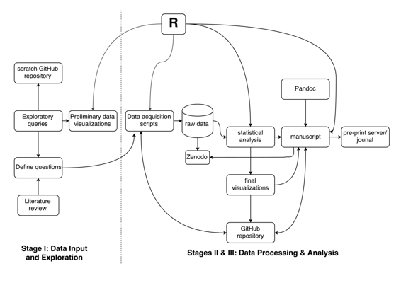

# 可复现的工作流程：理解气候变化对大规模生态影响

# 可复现的工作流程：理解气候变化对大规模生态影响

## Karthik Ram

我的名字是[Karthik Ram](http://karthik.io)，我是一名数量食物网络生态学家。2009 年，我从加州大学戴维斯分校获得博士学位。从那时起，我研究了气候变化对春季景观绿化速度的影响，以及对大型哺乳动物食物网络的影响，还有其他各种项目。黄石项目是我进入数据科学领域的起点，我在那里面临着验证（复现）他人工作的挑战，然后才能继续自己的研究。在这段时间里，我也遇到了各种痛点，这促使我在了解 git 之前创建了自己的版本控制系统。在我目前的工作中，我从全职研究科学家转变为混合角色，一部分时间用于研究活动，另一部分用于开发工具和工作流程，以支持可复现研究工作流程的各个阶段，我将在下面描述。

### 工作流程

 尽管这篇叙述没有描述我正在从事的任何具体项目，但它捕捉了我在所有项目中采用的一般工作流程。准备好所有混乱的原始数据后，我花费大量时间进行探索性数据分析，生成多个可视化图表。这个过程让我对数据的早期质量问题和我需要采取的步骤有了一定的了解，以使数据可用于分析。我用于此过程的所有代码（通常是`R`），以及输出（使用`ggplot2`和`knitr/rmarkdown`等软件包生成的渲染的 markdown 和图表）都提交到一个临时的 GitHub 存储库。这使我能够与合作者分享对数据的早期见解。这个过程是高度迭代的，我生成各种可视化图表（跨多个分支），以更好地了解我的数据。这个过程需要我几周时间，因为我同时处理其他项目。在此期间，项目合作者和其他人，包括我的 Twitter 关注者，提供建设性反馈。

在这个过程中，我还记录了我需要在开始任何数据分析步骤之前进行的任何数据清洗步骤。此时，我还将我的原始、未经处理的数据存储到 figshare 等持久性存储库中，并获得永久标识符。figshare 是一家为个人用户提供免费数据存档的私人公司。Zenodo 是一个由欧盟资助的研究存档，允许科学家存储各种类型的数字对象，包括软件和代码。

我同时开始编写代码来清理我的数据，使用一个脚本化的工作流程，主要涉及`R`。有时我会使用一两个`bash`脚本来预处理数据，使用类似`sed`和`awk`这样的老式`unix`工具，但随着`R`工具包（`data.table`、`dplyr`、`tidyr`和`rvest`）的最新发展，我越来越少地依赖我的`bash`脚本。这些脚本被调用在一个`Make`文件中，这使我可以随时通过简单的命令行调用生成我的清理数据集，例如`make clean_data`。同时，我也开始创建一个专门的库来捕捉项目的正确工具依赖版本，以便我的电脑的进一步更新不会影响我的工作的可重现性。在`R`的情况下，我使用一个名为`packrat`的库来实现这一点。一旦我的数据被清理，我将它们存回到持久数据存储库的相同标识符中，并在我的论文文本中包含`DOI`。

数据分析和建模步骤根据项目的不同而变化，有些涉及在集群上进行模拟。对于较小的项目，一些脚本完成这个过程。如果我的代码中有任何可重复使用的部分，我将其捕捉到通用函数中，并有时将其转换为一个单独的包。这使我能够进一步模块化我的代码。对于涉及在集群上进行模拟的项目，我创建能在本地测试的较小示例的脚本，完整版本在高性能集群（HPC）上运行，并��结果写入磁盘。

在这个过程中的某个地方，我还开始了一个`Rmarkdown`文件，即我的手稿，它只是一个带有嵌入式`R`代码的`markdown`文件，其中包含一些元数据。除了包含小段代码外，我还能够从我的脚本中引入更大的代码块而不会使我的文档混乱。手稿也经常从我的`Makefile`中渲染。我还包括额外的代码来将`Rmarkdown` → `markdown` → `PDF`（使用`Pandoc`），这让我对最终手稿的外观有了一定的了解。所有的代码、图表和原始/渲染后的`markdown`文件都提交到我的手稿的`GitHub`存储库中。我已经配置`git`忽略那些未来可以轻松再次生成的大型中间文件。作为一个实践开放科学的研究者，我将手稿公开放在我的（或合作者的）`GitHub`存储库中。`GitHub`现在在浏览器上呈现`PDF`，以及未解析的`markdown`（`RMarkdown`）和`markdown`文件，允许任何人审阅我的进行中的工作。

对于引用，我使用`knitcitations` `R`包将`DOI`嵌入到我的文本中，在`Make`过程中自动转换为完整的解析引用和参考文献。对于引用博客文章等内容的项目，我依赖`Mendeley`的参考文献，而不是使用`knitcitations`从`Crossref`检索引用。

### 痛点

我研究中的两个最大痛点与黑匣子数据和非脚本化的数据处理步骤有关。我经常与使用专有、闭源软件处理一个或多个数据块的研究人员合作。很多时候，这些步骤也没有脚本化，需要人工干预来更新输出，因为输入数据发生变化。这些因素的结合导致一个或多个输入数据片段的版本过时，仅因为没有自动确定需要重新运行哪些步骤的方法。

在理想世界中，我所有的数据将仅几个简单的查询之遥，从而允许我编写简明的脚本来检索分析前的原始数据。而实际上，我的数据是手动输入数据、传感器派生数据（通常是在强制登录步骤后的大量下载）和通过应用程序编程接口（API）检索的其他数据的混杂物。我试图减轻任何尝试重现我的结果的人的负担，方法是将我所有的原始数据和相关脚本存入机构或其他存储库中，以便其他人可以复制我的研究。

### 主要优势

我上面概述的方法的主要优势在于，任何具备正确技术技能的人都可以从存储库中克隆我的所有代码，并重新运行获取原始未经处理数据、整理数据、然后运行所有相关统计分析并生成完整手稿的所有步骤。根据论文的复杂性，这可能是一个步骤，或者是一系列在 Makefile 中链接在一起的步骤。我的工作几乎总是包含在 `README` 文件中的说明。

### 主要工具

我在内联中概述了我的主要工具，但简要地说：编程工具：R、Make、git、Pandoc 服务：GitHub、Zenodo、figshare、Mendeley

### 问题

#### “可重现性”对你意味着什么？

从最广泛的意义上讲，可重现性意味着我能够阅读我专业领域的论文，并通过遵循该论文中描述的方法和协议来运行该研究（以及其中描述的实验）的另一个版本。在我的具体环境中，清晰的说明将使我能够使用相同的生物体和化学试剂来实施实验设计/设置。实验完成并输入数据后，我将能够使用模型和参数分析我的数据，甚至可能重用已实施这种方法的代码。这将使我能够获得结果并将其与原始结果进行比较。
