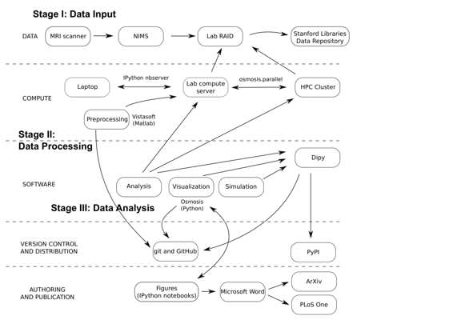

# 人类神经影像研究的可重复性：扩散 MRI 分析的实际例子

# 人类神经影像研究的可重复性：扩散 MRI 分析的实际例子

## Ariel Rokem

我的名字是 Ariel Rokem。我是华盛顿大学电子科学研究所的数据科学家。我的研究训练和经验大部分都在人类认知神经科学领域。在斯坦福大学心理学系 Brian Wandell 教授的实验室进行博士后培训期间（2011-2015），我进行了人类脑结构和功能的研究，使用定量 MRI。我在 Brian 的实验室开始的研究项目的一个重点是将统计学习理论的思想应用于扩散 MRI（dMRI）对人类白质的测量。

### 工作流程

 dMRI 的测量被用作评估人脑结构及其*体内*连接性的方法。测量的许多参数由实验者确定，并在灵敏度和信噪比（SNR）之间产生权衡。基于不同测量的白质模型通常用于推断连接性和组织属性，但尚未对这些模型与数据的拟合进行广泛研究，并且未评估测量参数对模型拟合的影响。在此描述的研究中，我们使用交叉验证评估了两种常用模型在各种测量条件下的性能。该工作发表在[PLoS One](http://journals.plos.org/plosone/article?id=10.1371/journal.pone.0123272)

该项目始于 MRI 数据的收集。在不同的实验条件下，对六名参与者进行了扫描。数据是在斯坦福神经生物成像中心（CNI）收集的。CNI 开发了神经生物图像管理系统（Wandell、Rokem、Perry、Schaefer 和 Dougherty，2015），该系统从扫描仪中捕获数据，对其进行归档，并公开了一个 Web 界面，允许研究人员控制对数据的访问，并将其复制到实验室的数据存储中，即 RAID（独立磁盘冗余阵列）系统。

数据经过标准程序预处理（从 MRI 的任何实践者都会对其数据执行这些步骤）。这包括校正运动伪影、对齐到共同的坐标框架和组织类型分割。这些步骤在研究开始时仅执行一次。执行这些步骤的代码是实验室代码分发的一部分，[`vistasoft`](https://github.com/vistalab/vistasoft)，可以通过 GitHub 免费获取。预处理还依赖于其他实验室提供的免费软件。

这些预处理数据通过斯坦福数字图书馆斯坦福数字库（SDR）以两个不同的集合公开提供：[`purl.stanford.edu/ng782rw8378`](http://purl.stanford.edu/ng782rw8378) 和 [`purl.stanford.edu/rt034xr8593`](http://purl.stanford.edu/rt034xr8593)。大部分数据都是根据创作共用署名许可协议授权的，还有一小部分数据也是根据公共领域奉献许可协议发布的，用于无障碍地用于方法开发。

随后对这些预处理数据进行了进一步分析，使用了一个 Python 库：[`osmosis`](https://github.com/vistalab/osmosis)。这包括了用于拟合数据、统计分析、模拟和可视化的方法的实现，以及用于在 HPC（高性能计算）集群上处理并行执行的实用功能。该库依赖于 scipy 堆栈的许多组件，包括`numpy`、`scipy`、`matplotlib`、`scikit-learn`。此外，该代码还依赖于[Python 神经影像学](https://nipy.org)库的组件。大约 30%的模块代码由单元测试覆盖，特别强调了被重复使用的核心模块和实用功能。实施了一些端到端测试来跟踪回归。软件的开发是在 GitHub 上公开进行的，并且也根据署名许可协议发布。

使用该模块代码开发的脚本是使用 IPython 笔记本开发的。这些脚本运行和编辑了很多次，随着项目的发展，其中一些被复制到了一个[文档文件夹](https://github.com/vistalab/osmosis/tree/master/doc/paper_figures)，笔记本的命名为"Figure1.ipynb"，"Figure2.ipynb"等，每个对应论文中的一个图。在写论文时，这些图被保存，并通过手工编辑添加标签和注释，然后集成到一个 Word 文档文件中，用于与其他作者合作撰写。写作过程中没有进行版本控制，但文章的几个版本被提交到 arXiv 预印本服务器，同时文章经过同行评审。

在项目开发过程中，大部分计算是在一个运行 IPython 笔记本服务器的实验室多核计算服务器上进行的。因此，大部分代码的开发是在一台笔记本电脑上，在连接到服务器的 Web 浏览器上完成的。论文中描述的一些程序如果没有我们对 HPC 集群的访问权限，将需要大量时间。例如，测试模型正则化参数的不同设置需要对模型进行数百次拟合。数据通过实验室 RAID 的挂载对集群可访问。集群上运行的任务通过队列系统（Sun Grid Engine）管理，并开发了一个模块（`osmosis.parallel`）来简化代码提交到集群的过程。这些脚本不能作为 IPython `ipynb`文件使用，而是在命令行上单独调用，但它们作为代码分发的一部分包含在内，记录了这些步骤。

记录需要并行执行的步骤的 IPython 笔记本包括一个“预计算”版本（其中分析的参数从预先计算的文件中读取），以及“完整”版本，其中包括必须在单台机器上完全复制这些结果所需运行的代码。预先计算的参数文件未公开，必须重新计算才能在这些笔记本中复制结果。

尽管原则上可以使用这个库来实现论文中的结果复制，但它并不一定适用作为他人工作的工具，并且不容易扩展到我们测试过的模型之外。在这个项目中的工作期间，我参与了一个开源项目，该项目开发了用于分析 dMRI 数据的 Python 软件：[Dipy](http://dipy.org)。`osmosis`中的主要思想最终被移植到了 Dipy 中，以适应该项目的应用程序接口（API）、文档和测试要求。此外，我在`Dipy`中实现的预测和交叉验证 API 被设计得足够通用，以适应新模型，并评估其在拟合 dMRI 数据方面的性能。

通过 Dipy，这个项目中的代码现在也通过 GitHub 和 Python 软件包索引（PYPI）广泛分发，采用宽松的 BSD 许可证。

### 痛点

遇到的主要困难之一是某些计算的持续时间。一些模型在整个大脑容量上拟合时需要许多小时。特别是，使用 IPython 笔记本作为计算环境被证明是有限的，因为只有在运行浏览器的计算机保持开启并防止休眠时，才能可靠地连接到内核。这也使得在笔记本中执行需要很长时间的计算变得困难。处理这个问题的一种方式是开发模型拟合参数的缓存机制。模型将使用脚本拟合，并将参数缓存到文件中。笔记本中的模型实例化然后将知道如何从文件中加载这些参数，如果文件存在的话。

另一个令人沮丧的问题是，随着模块中的代码演变，存储在笔记本中的代码变得过时，不再可用。这意味着随着分析代码本身的演变，必须编写新的笔记本。此外，随着文章的撰写和审阅的进行，文章中的图表位置会发生变化，其他图表会被添加；一开始作为附录的图表被整合到文章主体中等等。因此，也许最好等到最终结果是被接受的文章，然后组织导致这一结果的整个可复制工作流程。

### 关键好处

尽管有时笨拙且费力，但生成可复制工作流程的过程的一个主要好处是对结果的信心水平。永远不会对哪段代码与哪个结果相关存在疑问，因为导致该结果的代码链的全过程都记录在导致该结果的代码中。

### 关键工具

为了处理作业提交到 HPC 集群上并行执行的问题，开发了一个特定的模块（`osmosis.parallel`）。该模块会读取一个“模板”脚本，然后根据这个模板创建 Python 脚本文件，其中包含以不同条件运行拟合过程或在同一大脑的不同部分运行的指令。创建这个模块导致了一个高度可复制的过程。因此，重复使用这个模块的元素在开发分析方法时节省了时间。

### 问题

#### 对你来说，“可复制性”是什么意思？

可复制性是一种程度问题，而不是一种类型问题。通常取决于科学研究中代码和数据的可用性，这样只需合理的努力就可以生成用于支持科学发现的证据（数字和可视化）。

理想情况下，命令行中的少量命令就足够了，但在一些复杂情况下，可能需要更多的工作。当需要大量数据存储或大量计算时，所需的合理努力可能会相当大。

更高的标准，有时被称为“可复制性”，将要求如果另一组研究人员进行相同的实验并在分析中实现相同的想法，则应得出相同的结论。

可重复性并不保证可复制性（Leek＆Peng，2015）。一些人甚至可能认为可重复性和可复制性有时可能是相互冲突的，因为实现错误可能在复制中传播，但在重复中不会传播（Baggerly，Morris，Edmonson 和 Coombes，2005；R.D. Peng，2009）。

#### 您认为为什么在您的领域中可重复性很重要？

人类神经科学是一个特别容易产生大量虚假发现的领域（Ioannidis，2005）：样本大小通常较小，特别是在磁共振成像方面，这是一种昂贵的实验技术。该领域的标准侧重于效应的统计显着性，而不是效应大小，后者往往很小。虽然有限制测试关系的标准，以及限制实验和分析设计灵活性的标准开始出现，但实际上这些限制并不是非常严格的。该领域的一些方面使其在这方面既有趣又重要：直接应用于人类健康意味着存在潜在的经济激励的感知。最后，这是一个蓬勃发展的领域，有许多团体在研究类似的问题。在这种情况下提高可重复性的标准将意味着减少虚假发现，因为这些因素中至少有一些将通过支持每一个发现的完整的“证据链”而得到改善。

#### 您是如何或从哪里了解到可重复性的？

这些做法中的许多都是由于懒惰而形成的。在研究生阶段早期，我了解到大多数分析只要做一次最终都需要重新进行，如果我有一个为每个我正在进行的研究生成所有图形的脚本，那么最终我将需要做的工作更少而不是更多。这也源于我对实验室工作中所做的工作的笔记相当不擅长。我将需要程序，最终是 IPython 笔记本，只是为了记住我是如何从数据到结论的。

在研究生阶段，我从费尔南多·佩雷斯那里得到的指导产生了巨大的影响。他毫不掩饰地表示，我们领域的研究很少是真实的，这种怀疑激发了我努力对自己的研究结论更有信心。

#### 在您的领域中，您认为开展可重复研究面临的主要挑战是什么，您有什么建议吗？

人类神经科学中广泛采用可重复性研究实践存在几个障碍。首先，不可重复性几乎没有实际成本。如上所述，在神经科学文献中可能存在大量错误结果，如果结果不可重复，则更可能是错误的。由于假阳性结果更可能成为可发布的单位，因此存在不可重复性的激励措施，这减缓了整个领域的进展。

#### 你认为进行可重复性研究的主要激励是什么？

我对我的结果的信心水平非常高。这帮助我晚上睡得很香。

#### 你会推荐一些特定的资源来了解更多关于可重复性的内容吗？

有几篇论文提供了特定于神经影像学的可重复性指南。两个最近的例子包括 Gorgoloewksi & Poldrack（2016）和 Pernet & Poline（2015）。

### 参考文献

Baggerly, K. A., Morris, J. S., Edmonson, S. R., & Coombes, K. R. (2005). 噪音中的信号：评估报告的卵巢癌血清蛋白质测试的可重复性。《国家癌症研究所杂志》，*97*，307–309。

Gorgoloewksi, K., & Poldrack, R. (2016). 改善神经影像研究的透明度和可重复性的实用指南。《国家癌症研究所杂志》，*14*（7），e1002506。[`doi.org/http://dx.doi.org/10.1371/journal.pbio.1002506`](http://doi.org/http://dx.doi.org/10.1371/journal.pbio.1002506)

Ioannidis, J. P. A. (2005). 大多数发表的研究结果都是错误的原因。*PLoS Med*，*2*（8），e124。[`doi.org/10.1371/journal.pmed.0020124`](http://doi.org/10.1371/journal.pmed.0020124)

Leek, J. T., & Peng, R. D. (2015). 观点：可重复性研究仍可能是错误的：采用预防性方法。《国家科学院院刊》，*112*（6），1645–1646。[`doi.org/10.1073/pnas.1421412111`](http://doi.org/10.1073/pnas.1421412111)

Peng, R. D. (2009). 可重复性研究和生物统计学。*生物统计学*，*10*，405–408。

Pernet, C., & Poline, J. B. (2015). 改善功能性磁共振成像的可重复性。*Gigascience*，*4*（15）。[`doi.org/http://dx.doi.org/10.1186/s13742-015-0055-8`](http://doi.org/http://dx.doi.org/10.1186/s13742-015-0055-8)

Wandell, B. A., Rokem, A., Perry, L. M., Schaefer, G., & Dougherty, R. F. (2015). 数据管理以支持可重复性研究。*arXiv*，1502.06900v1。
