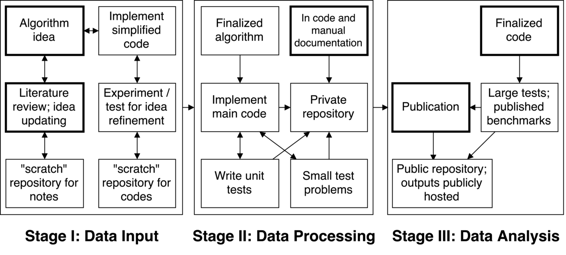

# 高性能计算上的可重现计算科学：中子输运视角

# 高性能计算上的可重现计算科学：

## Rachel Slaybaugh

我叫 Rachel Slaybaugh，是加州大学伯克利分校核工程系的助理教授。我研究中子输运的计算方法：应用于中性粒子相互作用的玻尔兹曼方程的数值方法。我研究的方法既有确定性的（如有限差分等），也有随机的（蒙特卡洛）。我为反应堆设计和分析、辐射屏蔽和核不扩散应用开发这些算法。我的许多工作都强调高性能计算。（标语：应用数学和计算科学的交叉点，受核工程启发）

### 工作流程

 我倾向于将我的代码开发工作流程看作具有三个基本步骤：（1）思路生成和完善，（2）思路实施和测试，以及（3）大规模测试和发布。

**第一步**：新项目的起点是算法的开发。这来自于文献回顾、与同事讨论、熟悉领域挑战等的结合。随着思路的完善，我发现需要回顾更多文献；随着研究文献，我完善思路。算法开发往往是协作的，因为它基于与他人的讨论，但文献回顾往往是独立的。我喜欢在阅读论文时写笔记，将这些笔记保存在一个大型的 LaTeX 文档中，并将该文档与我所有其他的笔记和评论一起存储在一个仓库中，这样我在一个地方就可以找到关于某个主题的所有笔记，并且只需在一个地方查找我过去研究过的内容。

接下来，我会实现算法的简化版本，以确保它能正常工作。例如，我会在 Python 中快速简单地实现一个 0D 或 1D 版本（而不是 3D）的方法用于测试。在这一步中，算法思路和测试代码之间可以进行迭代，必要时可以根据额外的文献回顾进行调整。一旦对简化代码的实验满意，算法就被认为是“最终的”（尽管当然可以在需要时进行调整）。我不确定工作流程的这一部分是否可重现，即过程是否可以完全复制，但对所有内容进行版本控制使得可以恢复中间步骤，从某种程度上允许追踪思路的完善过程。

**步骤 2**：一旦确定了最终算法，就会在“真实”的代码中实现它，这些代码由多个开发人员编写，使用像 C++ 这样的编译语言编写。代码的存储库通常是私有的，因为如前所述，这些代码并不完全开放。通常情况下，只有一个或很少几个人在开发这个想法，所以我们会创建一个分支并在那里进行开发。我会在与主要代码相同的存储库中随着代码的编写逐步向与代码相关联的测试框架（例如 GoogleTest）添加单元测试。随着代码接近完成，我会使用小的“系统”测试问题来调查基本系统功能：代码对分析/已知解的回答是否正确？基本性能如何？等等。这些小测试也是版本控制的--要么在与源代码相同的存储库中，要么在单独的存储库中。

一旦单元测试被认为足够，并且结合小测试，一切都表明代码是正确的，我会完成文档。在整个开发过程中，我通常使用 [Doxygen](http://www.stack.nl/~dimitri/doxygen/) 对代码进行注释。当使用特定的简单注释时，Doxygen 会自动从源代码注释中生成文档。Doxygen 适用于像 C++、Python、Java 等语言。使用 Doxygen 可以快速轻松地创建应用程序接口。但是，通常需要一些额外的工作来理清理论并提供更清晰的使用新算法的说明。所有这些都写在 LaTeX 中，以便纳入用户和/或理论手册。文档的 LaTeX 文件是版本控制的，通常位于单独的文档目录中。此时，代码将被审核并合并到主代码库中。一旦代码完成，其他开发人员--即可以访问开发者存储库的人--应该能够重现所有单元测试和小测试的结果。

**步骤 3**：一旦有了“最终”代码，就是进行真正的演示测试以供发布的时候了。这涉及运行大型测试问题，展示新算法对感兴趣的问题的性能以及与基准的比较以证明正确性。文献综述、算法描述以及大型（有时是小型）测试的结果将会放在最终的 LaTeX 文档中以供期刊提交。用于期刊发表的工作记录也将进行版本控制，通常在一个公共的 GitHub 存储库中。这样做的目的是，除了文字描述之外，大型测试输入文件将与任何处理数据并生成图表所需的脚本放在同一个存储库中，而且还有相应的说明。因此，如果您可以访问代码和包含测试、脚本和结果的存储库，那么您可以重新运行所有计算并处理数据。

### 痛点

有几个痛点：一个令人烦恼的问题是如何正确撰写文档。似乎仅仅使用 Doxygen 还不够。要得到真正的用户手册质量，你必须写很多东西两次，只是稍微有些不同。我尽量重复利用，但如果事情被重复，就会面临保持一致性的挑战。

一个棘手的问题是确保最终发布的版本实际上是可重现的。这需要额外的步骤来记录使用了哪个版本的代码（结果在未来不应该发生变化，但最好清楚地写出版本以防万一）。原则上，人们可以从仓库中找到这一点，但如果所有内容都没有存储在一起，这将变得更加困难。提供有关如何运行所有内容以及使用了哪些第三方库的版本的说明也需要额外的工作。

最后一个痛点是从简单情况重新实现算法到复杂情况，因为简单代码实际上从未被用于任何事情。然而，这是一个相当小的问题，因为玩具代码不需要很长时间来开发。

### 关键好处

这种方法的最大好处在于对所发布数据的有效性有信心。对我来说，这种信心始于同时实施方法及其测试。我认为每个人都应该有一个单元测试系统；如果没有这个系统，很难相信软件的正确性。如果没有编写相应的测试，我使用自己编写的代码时会非常紧张。

拥有最新的应用程序接口也非常有用。当我与我以前写的一段时间前的代码进行交互或工作时，否则我不会记得它是用来做什么的，或者如何使用它。当与其他人编写的程序的部分进行交互时，这也很有帮助。这也延伸到正确的文档上。我个人记不住很多东西。我必须写下来以供将来参考。保持用户和理论手册意味着不仅用户和其他开发人员会知道代码做什么以及为什么，而且下周我也会知道代码做什么以及为什么。

我也发现，拥有一些实验性代码小片段，即我在开始阶段编写的低维度测试片段，对手头工作很有用。这并不特别影响可重现性，但当尝试新想法时，拥有一些代码块作为起点是很有用的。同样地，拥有一份包含文献综述笔记的仓库对于记忆过去的研究、加速撰写论文和文档，以及提供下次查找的起点都很有帮助。

### 关键工具

我使用的关键工具包括 Doxygen、git（用于版本控制）、LaTeX，以及绘图和数据处理工具（通常是 Python）。

### 问题

#### 对于你来说，“可重现性”是什么意思？

我对可重复性的第一种想法是“我/我的实验室能否精确重现我论文中的结果？”之后是，“一个独立的研究人员，只要他们有合法获取所需数据和软件的权限，能否重现结果？”核工程数据和代码通常受到控制，因此对于许多项目，只有我领域内的研究人员才能获取所需的数据和软件。幸运的是，这些非开源代码通常可以通过简单的许可过程免费提供给研究人员。

#### 你认为在你的领域中可重复性为何重要？

我们编写的代码经常用于研究新的核系统，并根据结果做出长期政策或设计决策。它们也用于研究现有的核系统。这是重要的事情；代码需要正确，结果需要可验证。

#### 你是如何或从何处了解到可重复性的？

+   导师：我的博士导师重视可重复性实践，并坚持我们使用这些实践。

+   学生团体：Hacker Within

+   实践：承担一个使用良好实践的项目是我真正学会许多这些技能的方式。

+   社区曝光：与重视可重复性实践的其他人共度时光。

+   自学：查找我看到的看起来有帮助的事情。

#### 你认为在你领域进行可重复研究的主要挑战是什么，你有什么建议吗？

最大的挑战是法律问题：只有一些人可以访问所需的代码和数据。次要挑战是访问问题：我做的一些工作需要高性能计算，这对许多人来说并不容易获得。

#### 你认为进行可重复研究的主要动机是什么？

*道德要求*：我希望我的工作是正确的，让其他人知道它是正确的。

*影响*：我的想法和产品可能会被采纳并进一步发展。

#### 在你的领域，你会推荐哪些最佳实践？

测试，测试，测试。

#### 你会推荐哪些特定资源来了解更多关于可重复性的知识吗？

软件工程；新的 Scopatz-Huff 书。
