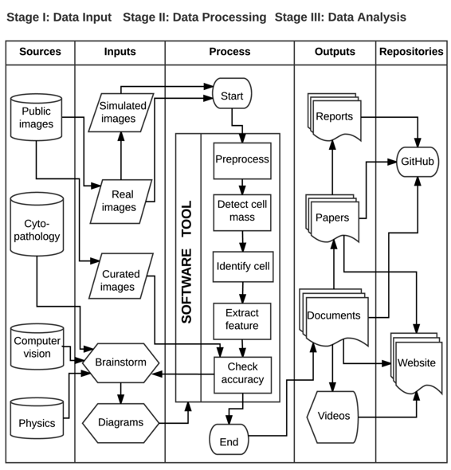

# 宫颈细胞的检测和分类

# 宫颈细胞的检测和分类

## Daniela Ushizima

我的名字是 Daniela Ushizima，我目前是劳伦斯伯克利国家实验室的[高级科学家](http://vis.lbl.gov/~daniela)，也是加州大学伯克利分校数据科学研究所的[数据科学研究员](https://bids.berkeley.edu/people/daniela-ushizima)。我的许多研究工作是设计机器视觉和模式识别算法，作为处理图像中心数据的软件工具的一部分，特别是那些来自[能源部](https://energy.gov/)成像设施的数据。我在这里描述的案例研究展示了设计机器视觉算法来分析一组数字图像并根据所需标准组织它们的核心步骤。有几个图像处理和分析框架封装了算法；这个案例研究涉及应用[ImageJ](https://imagej.nih.gov/ij/)，一个强大的图像分析工具。

### 工作流程

 这个工作流程图遵循一个名为 SIPOC 的数据模型，它代表供应商、输入、过程、输出和客户；这些对应于表格的列。在这里，我们调整 SIPOC 图以更好地代表我们的用例，因此第一列称为来源，最后一列代表存储库。建议的工作流程优先考虑了软件工具不同处理步骤的分隔，并隐藏了可能发生的反馈循环。

这个图表讲述了医生、细胞病理学家、物理学家和计算机科学家之间的研究调查，旨在设计、开发和部署用于改善生物医学图像分析的算法。一些任务包括增加受审查的图像领域数量，以加快细胞计数和识别，比较细胞，对样本进行定量描述，等等。

从历史上看，这个用例始于病理学家、物理学家和软件工程师之间的头脑风暴，讨论如何为获取的大量生物医学图像数据集提供可扩展的计算机辅助分析，其中包含[宫颈细胞](http://www.cancer.gov/types/cervical/understanding-cervical-changes/understanding-cervical-changes.pdf)。交流和绘图是理解如何对细胞类型进行分类以及预见数据集所施加的限制的基本*来源*信息，如宫颈细胞谱系、细胞碎片、放大和图像样本内可用区域。

为了开发分析路径，团队将数据集组织成三个主要的*输入*图像集：模拟、真实和精选。 模拟图像由几个剪裁的真实细胞组成，这些细胞具有不同程度的重叠，这有助于算法验证，因为先验地已知地面实况。 真实图像包括数字图像的涂片幻灯片，通过光学显微镜获取--这些图像通常包含几种类型的子宫颈细胞和其他发现（例如细菌、血液），并且可能受到噪声和其他工件的影响，例如染色变化、灰尘、毛发等。

这个案例研究的核心在于*过程*列，它说明了机器视觉算法中的主要步骤。 预处理步骤将样本转换为图像的更紧凑和可靠的表示，例如，去除区域或者如果过度染色则消除整个图像。 这一步包括基本的图像转换，例如保留边界并平滑组成假定的均匀图像分区的区域的各向异性滤波。

作为分析的一部分，软件工具必须检测每个图像中感兴趣的区域，即细胞群和图像的其余部分。 这一步需要机器学习算法（统计区域合并）的多次迭代，然后才能正确地将图像分割为前景和背景。 下一步是将细胞群分离成单个细胞：通过建模简单的生物先验知识，例如细胞核和细胞质之间的关系，软件工具能够快速估计细胞质边界。 在识别细胞之后，进行特征提取，包括细胞核和细胞质面积比、细胞质轮廓的凸度以及其他对识别细胞谱系相关的参数。 最后，我们使用模拟和精选的数据集来验证结果，例如，考虑基于像素数量或识别的细胞数量的敏感性和特异性指标。

数据处理的一个重要步骤是跟踪*输出*。 第四列列出了系统的四个主要输出：技术报告、科学论文、有关软件工具的文档以及有关科学问题和算法开发的教育材料。 尽管我们省略了部分结果（检查点）的输出，但它们在整个分析软件工具的设计过程中非常常见和有用。

第五列显示存档在*存储库*中的不同输出，以便访问研究发现，例如 [GitHub](https://github.com/dani-lbnl/CRIC) 和 [网站](https://bids.berkeley.edu/research/cervical)。 在这个案例研究的背景下，它表示项目信息分发的主要枢纽。

### 痛点

软件工具的设计和测试需要团队成员之间通过报告和演示进行紧密的沟通。尽管团队的一部分使用了版本控制，但大部分代码仍需通过 GitHub 开放源代码。除了提交消息（通常较短）外，我们还保持了一份电子活动日记——这些对保持整个团队同步和了解最新情况至关重要。这种电子实验室手册的痛苦一面是输入的非结构化格式可能需要额外的时间来解析。

### 关键优势

该项目中最具可重现性的部分是与模拟数据集相关的代码开发。该活动在团队中得到了改善，特别是由于参加了代码竞赛，这迫使整个团队组织数据源和代码存储库，以便审阅人员可以快速重现结果。此外，通过在共同的数字实验室手册中跟踪进展有助于准备手稿和其他技术报告。

### 关键工具

一个重要的工具是 ImageJ，这是一个基于 Java 的图像处理软件程序，最初由[Wayne Rasband](http://imagej.net/Wayne_Rasband)于 1997 年左右在国家卫生研究院开发。尽管大多数 ImageJ 插件侧重于医学影像，但这个框架已被广泛应用于其他应用领域，如[材料科学](https://github.com/CameraIA/F3D)。

### 问题

#### 对于你来说，“可重现性”是什么意思？

在本案例研究的背景下，当我们团队开发的软件工具也可以被科学领域的专家使用时，工作将具有计算可重现性，例如，病理学家应该能够将原始数据文件转换为可量化的模式，获得与先前/测试过的分析结果一致的结果。由于算法参数通常因数据集而异，因此在不同的数据集中获得具有相同准确性的结果可能具有挑战性。

#### 你为什么认为你领域内的可重现性很重要？

在定量显微镜下，可重现性非常重要，因为它可以保证准确的测量和改进的质量控制。

#### 你是如何学习到可重现性的？

流程图和代码文档在大学期间提高了成绩，它们的缺失意味着严重的惩罚：可复现性曾经是一个耗时的协议，以获得良好的成绩，并额外花费了我的点阵打印机的色带。科技行业向我介绍了版本控制，我和[TortoiseSVN](https://tortoisesvn.net/docs/nightly/TortoiseSVN_en/tsvn-preface-development.html)以及几位同事开始合作。其他软件也随之而来，例如[git](https://git-scm.com/)和[Atlassian](https://www.atlassian.com/software)算法以增强代码的可用性和扩展性。进入 BIDS 后，可复现性变成了一项有趣的活动，一个交谈的起点和一个永无止境的代码改进过程。许多概念更系统地汇集在一起，特别是在参加了软件教学课程并成为自己的教师之后。

#### 您认为您领域内进行可复现研究的主要挑战是什么，并且您有任何建议吗？

在图像分析中进行可复现研究的主要缺陷是(a)缺乏领域特定的图像示例，以说明算法的适用性，(b)依赖于不免费的软件包，(c)缺乏能够理解数据转换发生的方式/原因的文档。

#### 你认为进行可复现研究的主要动机是什么？

进行可复现研究的主要动机在于能够在以后复制实验，修复和/或重用不同应用的代码，轻松地在更大的团队中工作，以及即使在与你从未听说过的合作者的帮助下也能产生更广泛的影响。

#### 你有没有推荐给你领域的研究人员的最佳实践？

虽然没有通用规则，但有些工具只能帮助一个人重现工作。在我看来，它们是：(a) 使用版本控制，(b) 实践[软件质量保证](https://en.wikipedia.org/wiki/Software_quality_assurance)，(c) 有系统地组织数据样本和代码，例如使用[Cookiecutter](https://cookiecutter.readthedocs.io/)。

#### 你会推荐学习更多关于可复现性的特定资源吗？

在众多选择中，Software Carpentry 无疑是一个重要的资源，书籍[《Making Software》](http://deca.cuc.edu.cn/Community/cfs-filesystemfile.ashx/__key/CommunityServer.Components.PostAttachments/00.00.00.22.46/Oreilly.Making.Software.Oct.2010.pdf)由 A. Oram 和 G. Wilson 所著。
