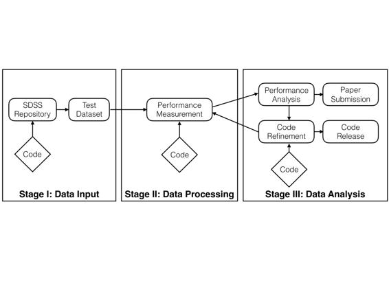

# 利用 Apache Spark 实现云计算的天文图像处理

# 利用 Apache Spark 实现云计算的天文图像处理

## 赵张

我的名字是赵张，我是加州大学伯克利分校 AMPLab 和伯克利数据科学研究所的联合博士后研究员。我的研究主题是利用计算机系统实现数据驱动科学。

本案例研究描述了在云环境中构建 Kira，一个分布式天文图像处理管道的过程。Kira 项目的理念是探索基于云计算软件堆栈支持科学应用的适用性。具体来说，我们使用 SEP（Source Extraction Python）库进行领域计算。我们选择 Apache Spark 和 Hadoop 构建分布式处理和数据存储的基础设施。

### 工作流程

 我们使用 LaTeX 和 Slides 跟踪评估的优点：为什么我们需要一个新的天文图像处理系统，什么使其成为一个更好的系统，以及我们可以从这项研究中学到什么教训。

我们使用私人 GitHub 存储库跟踪解决技术障碍的解决方案，如 I/O 处理、Spark 与 C 程序的交互、Spark 系统参数配置等。

整个系统是用多种编程语言和工具构建的。在编程语言层面上，我们使用 Scala、Java、Python、Bash 和 C。在系统层面上，我们使用 Spark 进行任务协调，HDFS 进行持久存储，SEP 库进行实际计算。

项目的源代码保存在公共 GitHub 存储库中，以便开源。

由于正在审阅中，手稿保存在私人 GitHub 存储库中。

在系统设计阶段，我们决定使用三个数据集进行开发、测试和性能测量。但最终我们使用了四个数据集。一个包含少量图像文件的微不足道的数据集用于开发和测试。一个小型数据集（12GB）用于快速验证规模。一个大型数据集（65GB）用于大规模性能测量。第四个数据集（1TB）用于展示 Kira 系统的数据处理能力，我们将其发表在论文中。

所有这些数据集都来自斯隆数字天空调查。其中一些来自数据发布 2，而另一些来自数据发布 7。我们随意选择它们，因为在这项研究中，我们更关心系统容量而不是科学。

我们的合作者是：Kyle Barbary、Oliver Zahn、Saul Perlmutter 是天文学家。Frank Nothaft、Evan Sparks、Michael Franklin、David Patterson 是 Spark 和云计算方面的专家。赵张在 HPC 社区有丰富的经验，也��一些云计算经验以及一点天文学背景。

我们使用私人 GitHub 存储库进行手稿管理，使用公共 GitHub 存储库进行项目管理。

我们对团队头脑风暴和成果评估阶段进行了总结。系统设计的输出以图表形式保存在 GitHub 存储库中。解决技术障碍的方案保存在私人 GitHub 存储库中。作为编码/测试/调整/测量的产品的文档、源代码、系统配置保存在公共 GitHub 存储库中。论文草稿保存在私人 GitHub 存储库中。

在解释图表的细节之前，我将首先简要回顾一下在这个案例研究中使用的软件和系统。

+   FITS（灵活图像传输系统）是天文学和宇宙学社区广泛采用的图像格式。它是一个固定格式，其中图像元数据为文本，实际图像为二进制格式。

+   SEP（源提取 Python）是从图像中检测光源对象的软件。它通过一个库接口暴露基本功能，同时支持 C 和 Python。

+   Apache Spark 是云计算中流行的分布式计算框架。通过弹性分布式数据集（RDD）抽象，它提供了隐式并行性和基于血统的容错性。Spark 是使用 Scala 编程语言构建的，它编译一个可在 Java 虚拟机（JVM）上执行的程序。

+   JNI（Java 本机接口）提供了一种在 Java/Scala 程序内调用现有 C 库的方法。C 和 Java/Scala 数据结构可用于在两个运行时之间交换信息。

+   Amazon EC2（弹性计算云）是亚马逊提供的公共云服务。用户可以请求具有各种硬件和软件组合的计算节点。

+   Amazon S3 是亚马逊提供的数据存储服务。用户可以在 S3 上托管其数据集。

+   NERSC（国家能源研究科学计算中心）是由劳伦斯伯克利国家实验室运营的高性能计算设施。它托管了一些超级计算机和集群。

+   SDSS（斯隆数字天文巡天）是一个大规模的天文巡天项目，其数据可以在网上公开获取。

+   线程安全是一个操作系统概念，描述了多个线程并发执行时安全地操作共享数据结构。

这个过程始于团队头脑风暴，思考现代计算机软件和硬件如何加速天文图像处理流水线。这需要对最新研究和技术解决方案有广泛而深入的理解。在这项研究中，我们汇集了领域专业知识（天文学家）、云计算专业知识和高性能计算专业知识。我们审查了现有工作，我们认为使用云计算软件-硬件堆栈可以提高整体应用性能，但我们不知道它可以提高多少。这项研究是一个探索性过程，用于实施这一想法，并在有必要时定量衡量改进。

团队头脑风暴和优点评估阶段反复进行，因为我们一直在问为什么要构建这样一个项目。详细问题包括：现有解决方案是什么？新项目在性能和可用性方面有何不同？谁是潜在用户？这个过程持续约两周，Kira 项目的所有成员都参与了讨论。对每个现有解决方案的利弊进行了记录，并后来用于论文中。

系统设计阶段规划了 Kira 的编程接口、模块和模块之间的交互。在这个阶段，我们还确定了这个项目的一些技术障碍。我在下面列出了它们，如果这难以理解，请随时联系我：

1.  Kira I/O，如何使 Spark 读取 FITS 图像。

1.  在 Spark 中调用 C 库，如何使 Spark 与 SEP 库中现有的 C 代码一起工作。

1.  设置编译环境，将 Maven 设置为自动构建 Kira。

随着我们不断进行代码编写，我们注意到了一些其他技术障碍：

1.  线程安全性，jFITS 库和 SEP 库都不是线程安全的。

1.  负载不平衡，调度程序调整适用于这个特定工作负载。

针对每一个技术障碍，我们寻找解决方案。这些解决方案来自三个来源：同事的专业知识，Google 和文档。通过隔离障碍，我们能够每次专注于一个障碍，并快速验证解决方案。得到的代码存储在 GitHub 中，并随后合并到项目中。这个过程大约需要两周的时间。

软件编码和测试阶段大约需要三周的时间，我们通过 Java Native Interface 将 SEP 库与 Spark 集成，从而最终实现 Kira。我编写了代码，并编写了文档，以便我自己反复运行实验。同时，我为性能测量准备了四个数据集。一个 24MB（4 个文件）的数据集用于健全性检查，一个 12GB（2,310 个文件）的数据集用于小规模测试，一个 65GB（111,50 个文件）的数据集用于中等规模测试，一个 1TB（176,938 个文件）的数据集用于大规模测试。这些数据集最初存储在 NERSC 共享文件系统中，后来我在 EC2 S3 服务上进行了镜像，因为大多数实验是在 EC2 上运行的，S3 的传输带宽更好。

性能测量和性能调整是一对，我们经常来回进行。在这两个步骤中的关键是我们需要在测量之前有一个合理的预期性能。如果测量结果与我们的期望不符，我们需要分析原因并调整系统。我们的方法是这样的：我们从单核单机开始。我们将 Kira 的性能与等效实现进行比较，以了解 Spark 和 JVM 引入的减速情况。然后，我们开始在同一节点上使用更多核心，并观察缩放曲线。通过这样做，我们了解了在单节点上性能的限制因素。之后，我们通过每一步将计算节点数量加倍来扩展到多个节点，并观察性能的扩展情况。由于 Spark 隐藏了系统中的可扩展性复杂性，因此我们在不同规模下所需要做的一切就是在配置文件中设置相关参数。代码和文档保存在 GitHub 上，数据集保存在 Amazon S3 服务中。

将 Merit Evaluation、System Design 和 Source code 的所有脚本汇总起来，我们撰写了论文。写论文是一个协作过程。我们使用一个私有的 GitHub 存储库来托管论文，并使用 Pull Request 来管理每个人的编辑。

### 痛点

1.  （可重现的结果）为了使结果可重现，读者应该能够识别和访问具有相同硬件的计算机，特别是用于实验的代码库，以及用于性能测量的数据集。

1.1 硬件访问。由于我们正在使用 Amazon EC2 资源，因此相同的计算机硬件基本上是可以访问的，除非 Amazon 升级硬件。这种情况每隔几年会发生一次。第二个风险是，对于大规模测试，读者可能会联系 Amazon 来增加硬件限制，Amazon 使用这些限制来限制每个用户同时拥有的资源数量。

1.2 代码库。我们将我们的代码保存在一个公共的 GitHub 存储库中，因此所有人都可以访问。然而，痛点在于软件在演进，性能可能随着软件演变而改变。因此，重要的是作者应该让读者知道与读者关心的结果相关的软件版本是哪个。

1.3 数据集。我们使用的天文图像数据集是 Sloan 数字天空调查数据发布 7，它是公开可访问的。只要数据托管服务在运行，数据集就可用。我们还在 Amazon S3 服务中以公开访问权限备份了我们使用的数据集。痛点在于我们必须支付 Amazon 来维护 1TB 数据集，最终我们会耗尽资金，所以我们不得不将数据集文件列表发布为代码库中的文本文件。

### 关键优势

我将这个问题分解成两个部分：不可用的工作流程和不可重现的工作流程。

1.  不可用的工作流程。我见过一些天文学项目，作者进行了应用新工具解决旧问题的研究，但作者没有在论文中发布他们的源代码。这使得人们无法基于他们的工作构建解决方案。对于 Kira，我们在 GitHub 上提供了源代码，因此人们可以扩展这个代码库以获得更多功能。

1.  不可复现的工作流程。有一个实验我在一篇论文中读到，我想重现，并设计一个新的解决方案。然而，由于软件版本的演进，该实验无法重现。在 Kira 的构建过程中，我们特别关注这个问题，我们记录了用于性能测量的硬件、代码库和数据集，因此任何按照记录的说明操作的用户都应该能够重现结果。

### 关键工具

GitHub 用于代码管理，亚马逊 S3 服务用于数据托管。我们使用 Apache Spark 构建了 Kira，这是一个高度活跃的开源项目，所以如果我们的学术资金结束，我们就不用担心计算框架是否已不再维护。

### 问题

#### 对你来说，“可复现性”意味着什么？

在我的案例研究中，“可复现性”有几个层次的含义。最基本的是用户能够编译源代码并通过测试。其次，用户应该能够配置计算机集群，以便能够重现文档中的性能。由于不可能对每次运行进行精确的性能测量重现，统计重复应该是可以接受的（平均性能有界变化）。通常情况下，涉及数据的计算机系统研究需要有一个公开的数据来源，以便能够重现性能。

#### 你为什么认为在你的领域中可复现性很重要？

作为计算机系统研究人员，我们构建系统时假设人们会使用它们。因此，重要的是人们能够按照文档中的说明重现系统工作的状态。重要的是，用户能够重现我们在论文或文档中描述的对现有系统的改进，这样他们更有可能采用我们的系统。作为论文审稿人，如果他们能够重现论文中的结果，那将更具有说服力，因为这些是论文观点的证据。

#### 你是怎么学习到可复现性的？

我自从大学第一次提交作业项目以来就学习了可复现性实践，并且一直如此。我需要在我的代码中写一个 README 文件，以便助教可以编译并运行我的代码，测试我的解决方案是否正确。后来的研究经验也是如此。

#### 你认为在你领域进行可复现研究的主要挑战是什么？你有什么建议吗？

我曾经设计过超级计算机上的系统，其中包括审稿人在内的许多人无法访问。因此，这项研究不可能是可重复的。

另一个主要的陷阱是由于软件版本的演变。在撰写论文时，某个软件的一些功能正在运行，研究人员进行了测量并发布了数字。但是几个版本之后，这些数字就无法再现了。

#### 您认为进行可重复研究的主要动机是什么？

我将这分解为可重复结果和可重复研究过程。

4.1\. （可重复结果）我建立的系统通常是为了促进科学研究。这些系统要么加快计算程序的执行，要么提供新功能（例如故障诊断）。为了理解我的研究，用户应该能够在论文或文档中看到我记录的性能改进。他们应该能够使用新功能来简化他们的研究。因此，系统的可重复性是证明系统实际工作的关键。

4.2\. （可重复研究过程）作为一个整体过程，这个特定的研究案例是探索性的。在实施和测量之前，我们只对性能有一个猜想。我对我正在使用的工具也不熟悉（Apache Spark，Scala，Java Native Library，SEP library，Source Extractor C program）。我认为（不太确定）可重复研究进展对我未来的项目有帮助。再次，如果我面对这样的情况，我知道从哪里开始解决一个复杂的问题。我特别针对这项研究的方法是：1）一个或多或少有效的假设，2）现有解决方案的性能概况，3）隔离技术障碍，4）解决技术障碍，5）构建新解决方案，6）性能测量和调整。

#### 你能推荐给你领域的研究者任何最佳实践吗？

我会推荐开源软件和相关出版物。作者应该维护一份软件版本，以便读者能够在论文中重现结果。这些版本和存储库应该包含在论文中。

#### 你会推荐学习更多关于可重复性的特定资源吗？

我目前只能想到 GitHub 用于代码管理和 Amazon S3 用于数据管理。
