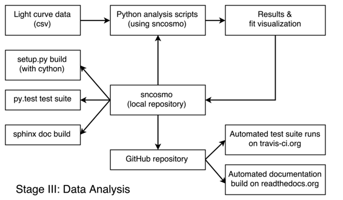

# 用于分析宇宙学超新星光曲线数据的软件

# 用于分析宇宙学超新星光曲线数据的软件

## 凯尔·巴巴里

我的名字是凯尔·巴巴里（Kyle Barbary），目前我是加州大学伯克利分校物理系的博士后和数据科学研究员。我是一名观测宇宙学家。更具体地说，我使用一种特定类型的爆炸星，称为 Ia 型超新星，作为标记物来测量宇宙在其历史上的膨胀。为了尽可能精确地进行这种测量，需要结合来自许多不同距离的不同调查的超新星数据。我描述的工作流程是关于创建用于以统一方式组合和分析数据的软件工具。

### 工作流程

 我将描述用于分析超新星光曲线数据的软件的开发过程。在我的领域术语中，“光曲线”简单地指的是超新星亮度随时间变化的情况。这些亮度测量值是从同一片天空的图像中得出的，这些图像在时间上间隔，理想情况下显示超新星变亮然后变暗。分析这些光曲线是大多数超新星宇宙学研究中得出最终结果的关键步骤。所讨论的软件最初是为分析暗能量调查的数据而开发的，但它可以（而且已经）用于分析其他调查的数据，我将在下文中讨论。

分析始于由单独的流程生成的简化光曲线数据（此处不讨论）。一个 Python 脚本读取数据，执行诸如模型拟合或参数抽样等分析任务，并保存结果或生成图表，使用户可以可视化结果。通常有多个脚本用于执行不同的分析或分析变体，并且这些脚本可以由项目中的几位不同科学家编写。该过程的关键方面是所有常用功能都被拆分到一个 Python *库*（SNCosmo）中。顶层分析脚本包含特定于分析和调查的逻辑，而 SNCosmo 库包含适用于各种调查和分析的功能。

SNCosmo 库本身的开发是一个迭代过程，库的特性会根据各种分析或用户的需求进行添加或完善。尽管有官方发布版本的库，但有几位用户会保持与开发版本同步，以使这种反馈循环更紧密。

我们使用 git 进行库的版本控制，使用 GitHub 协调开发，在一个名为 "SNCosmo" 的 GitHub 组织中集中工作。遵循开发版本的用户定期从 "SNCosmo" 组织拥有的代码库副本中拉取更改。我们与 GitHub 配合使用两项服务。首先，持续集成是使用 [Travis](http://travis-ci.org) 进行的：每次对 GitHub 代码库进行更改时，此服务都会被触发。它会构建库并运行多个支持库版本的完整单元测试套件。这使开发人员能够在用户报告问题之前发现并修复问题。其次，自动化文档构建是由 [Read the Docs](http://readthedocs.org) 完成的。该服务构建库并运行文档构建器，生成一组 HTML 页面（以及具有相同内容的 PDF）。这使用户可以立即查看最新开发版本的文档，如果需要的话。这两项服务对于开源项目是免费的，并且被广泛使用。

在代码库中，我们使用了许多标准工具：有一个 `setup.py` 脚本，可以通过 `setup.py build` 构建库，或者使用 `setup.py test` 运行测试。内部使用 `py.test` 包来运行测试。

最后，我们在某个时间点发布库的官方版本。这通常是在功能经过一段时间的用户测试并且 API 足够稳定以支持未来发布版本之后进行的。这通常是一个困难的判断。

### 痛点

+   **功能稳定性：** 立即添加某些功能与等待明确是否应该包含以及具体接口应该是什么之间存在着权衡。过去，我将这些功能标记为“实验性”，并在文档中警告用户可能需要在下一个库发布版本中更改其代码。

+   **多平台：** 我在 Linux 上开发，但大多数用户日常使用的是 Mac OS X。目前这还不是一个很大的问题，但确实带来了一些麻烦。自动构建服务开始免费支持 OS X，所以这将有所帮助。

### 主要优势

将常见软件功能分离成*库*在超新星宇宙学的这个子领域中令人惊讶地独特。这对于可重现性是一个福音：发表的结果可以包括所使用的（相对较短的）分析脚本，以及所使用的 SNCosmo 库的版本。核心软件是一个有着良好文档的库的事实意味着读者和从业者可以更容易地理解所使用算法的具体细节。

### 问题

#### “可重现性”对你意味着什么？

对我来说，可再现性有两个方面：可用软件的可用性（最好是在开源许可下），以及数据的可用性（最好是原始和减少的形式）。这两者结合起来应该使外部人员能够从头到尾复制研究的结果。

我将这两个方面分开，因为每个方面都可以在没有另一个方面的情况下带来好处。例如，即使不释放数据，释放软件仍然可以非常有益。如果在开源许可证下发布，这将提供一种不同的可再现性 - 能够复制论文中描述的算法并在随后的工作中使用和改进该算法。

作为一个旁注，在我的领域，我们经常接受一种更弱的全面可再现性形式，其中发布了一个“减少”数据产品和用于分析它的软件，但没有原始数据，也没有从原始数据到减少数据的软件。

#### 你为什么认为在你的领域中可再现性很重要？

效率。可再现性使宇宙学研究更加高效，具体体现在以下几个方面：

+   代码的重复使用。宇宙学家和其他任何人一样，有时会重新发明轮子，特别是当轮子的蓝图没有提供时。

+   更好地理解算法迅速传播。论文中通常粗略解释算法，但没有必要重新实施它们所需的细节。如果读者愿意，直接阅读代码解决了这个问题。

+   减少未解释的冲突结果。研究常常因为多个团队的冲突结果而受阻或误入歧途。允许不同团队复制彼此的结果将有助于更快地解决这种情况。

#### 您是如何学习到可再现性的？

主要是通过参与 AstroPy 项目而学到的，该项目开发了一个社区天文学 Python 包。我在 2011 年 AstroPy 开始时加入了 AstroPy。像许多其他大型开源项目一样，AstroPy 在 GitHub 上开发，并遵循典型的最佳实践，如广泛的单元测试、自动化文档构建和在多个平台上的持续集成。简而言之，我通过与在项目上工作的更有经验的程序员互动来学习这些实践。

#### 您认为在您的领域进行可再现研究的主要挑战是什么，您有什么建议？

在天文学中，和其他领域一样，观察者希望在他们努力获取的数据被挖掘出每一个可能的分析之前小心保护他们的数据。我对此表示同情；获取数据通常需要设计、建造和部署一个新的仪器，甚至是整个望远镜。这可能是项目中所需工作的很大一部分。别人会下载您的数据并用它来发布您本来可以发布的结果的威胁是非常真实的。

我对于不愿释放软件的态度不那么同情。我经历过的一些原因有：

+   感知到缺乏质量

+   认为需要额外的工作来清理、维护和支持它

+   认为具有竞争优势，或者该软件是一项资产或筹码

即使那些希望在开源许可下发布其软件的人，由于大学或实验室的版权问题，通常很难通过“官方”渠道完全合法地这样做。通常，科学家们只是在没有官方许可的情况下发布软件。

最后，一个发布数据时的技术问题是数据量。来自整个调查的原始成像数据可能达到数千兆字节。要使这些数据公开可用，通常需要专用服务器和支持人员。

#### 你认为进行可复现研究的主要动机是什么？

+   **长期项目效率：** 项目通常由多代研究生和博士后进行。在合作中以可复现的方式做事情使得代际之间的过渡损失更小。

+   **支持主张的能力：** 经常发生两个竞争的研究小组进行相同的测量，并发现结果有微小的显著差异。这些差异通常可以归因于分析中所做的特定统计选择。在这种争议中，进行可复现的研究意味着你可以邀请竞争小组详细检查你的分析（并希望被证明正确！）。
