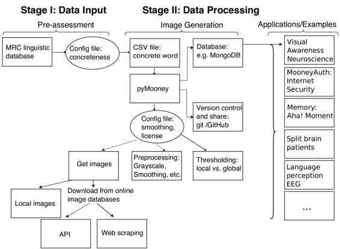

# pyMooney：生成两色调穆尼（Mooney）图像数据库

# pyMooney：生成两色调穆尼（Mooney）图像数据库

## Fatma Deniz

我的名字是 Fatma Deniz，我是[国际计算机科学研究所](http://www.icsi.berkeley.edu/icsi/)的博士后研究员，海伦·威尔斯神经科学研究所的博士后研究员，也是[伯克利数据科学研究所](https://bids.berkeley.edu/)的数据科学研究员。

我使用功能性磁共振成像（fMRI）和计算建模来研究人脑如何表征通过不同感觉模态感知到的世界。当前案例研究仅描述了我通常研究流程的一部分，即刺激生成。每个成功的神经科学实验都需要运行几个试验实验，以创建最适合研究人员提出的一个或多个问题的最佳刺激。因此，这一步通常很烦琐，需要测试不同的参数，直到最终一组刺激用于实验。理想情况下，刺激集应该足够广泛，以便使用相同的刺激集可以得出新的实验（新的假设）。因此，提供研究中使用的刺激集或提供创建刺激的算法程序非常重要。

在这个案例研究中，我将重点介绍我为一个特定的认知神经科学实验创建的图像数据库。自原始论文发表以来，这些图像已经在几个其他实验中使用过。我为研究创建的图像是两色调的，穆尼（Mooney）图像。这些图像是二进制的，黑白的图像，当原始图像之前曾向观察者展示过时，只有一个隐藏的对象才能被识别，隐藏的对象被勾勒出来，或者在观察者内在找到图像中允许识别的线索后的一段时间之后。图像不会立即被识别，而是在一段时间后才会被识别，这使得为适合的实验创建刺激非常困难。使用这些图像在原始实验中（F. Imamoglu，Kahnt，Koch 和 Haynes，2013 年），我表明了当隐藏对象被识别与未被识别时，人脑的功能连接性会发生变化。

### 工作流程

 生成双色调的 Mooney 图像始于对具体词语的选择。有一个名为[MRC 心理语言数据库](http://websites.psychology.uwa.edu.au/school/MRCDatabase/uwa_mrc.htm)的数据库，其中每个单词都被标记为具体或抽象，以及它的使用频率等等。从这个数据库中，我选择了 967 个具体词语。必要的参数保存在一个配置文件中（例如 550 到 700 之间的具体度评分和形象化评分）。这些具体词语保存在一个 CSV 文件中。使用这些具体词语作为图像搜索标签，我以自动化的方式从在线图像数据库（例如 Flickr 或 Google 图像）中下载了真实世界的图像，使用自定义编写的**pyMooney** python 包。该包基于 Python API（Flickr API）和 scikit-image 库。每个项目都需要一个配置文件，指定 Mooney 图像是基于存储在本地的图像还是首先应从图像数据库中下载。如果从在线资源下载图像，则需要在同一配置文件中设置许可信息。使用平滑和阈值处理过程（Otsu, 1979）以及对图像的预筛选，我为试验前图像选择实验创建了一个包含 330 个双色调图像的数据库。这些图像可以存储在面向文档的数据库中（例如 MongoDB）。数据库的优点是可以在图像之间存储信息，例如应用了哪些预处理步骤，图像具有哪些许可信息，特定实验中图像的平均反应时间等等。此外，根据这些信息可以搜索和选择图像。在这个试验前期，人类被试者被呈现双色调的 Mooney 图像，并被要求用键盘按键指示他们认出图像中隐藏对象的时间。他们还被要求标注他们认为自己认出的对象的名称。

在我们的功能性磁共振成像（fMRI）实验中，我们对一个问题感兴趣，即当被试者认出隐藏对象时，脑活动如何变化，而当他们没有认出时又如何变化。这些双色调图像在呈现过程中不会改变，但是被试者的感知随时间而变化，而在认知的这一时刻与脑活动的变化相关联，我们想要捕捉到这种变化。FMRI 图像获取相对较慢（每 2 秒一次）。此外，由于 fMRI 扫描成本高昂，我们受到时间的限制。因此，对于这个 fMRI 实验，我选择了在试验前期被认出的 120 张 Mooney 图像（调整大小为 400 x 400 像素）。

该代码是用 Python 编写的，并且可以在 GitHub 上找到。

### 痛点

当从在线资源下载图像时，可能会出现版权问题。这可以通过下载作为创意共享许可证的图像来避免。这一变化反映在最新版本控制的 pyMooney 代码上，新图像可以根据这些标准创建。

### 主要好处

这项更大实验的主要好处在于，这些图像现在可供进一步研究使用。目前，这些图像用于 30 个不同的实验，涵盖临床设置、人类记忆实验（Kizilirmak, Silva, Imamoglu, & Richardson-Klavehn, 2016）、视觉研究以及最新的互联网安全应用（Castelluccia, Duermuth, Golla, & Deniz, 2017）。

### 关键工具

图像处理库是这个特定案例研究的重要组成部分。在这种情况下，使用了开源的 Python 库 scikit-image。此外，在线图像数据库 API（如 FlickrAPI）也是必不可少的。

### 问题

#### “可重现性”对你意味着什么？

在这项研究的背景下，可重现性意味着在给定代码和图像数据库的情况下，新研究人员可以访问图像，并使用用于创建相同图像或具有相同参数的新图像的代码。然后，可以使用这些图像来（i）复制当前的发现，（ii）基于当前的发现提出新问题。

#### 你认为你所在领域的可重现性为何重要？

我认为如果没有可重现的研究，我们会浪费大量的专业时间和研究资金。在我的领域内，与这个案例研究直接相关，我可以举一个例子。当我在文献中看到两种色调的图像时，我联系了几个团队，请求使用他们的图像（当然我提到我会正确引用他们的工作），这些团队曾经为其他行为学或神经科学实验使用过类似的图像。不幸的是，这些团队使用的图像数量非常有限，但无论如何，我从这些团队中没有收到任何回应。因此，为了开始我的实验，我不得不花费近一年的时间来创建新的刺激。

#### 你是如何或从何处了解到可重现性的？

这是一种自学的实践。因此，这里描述的阶段仍有一些改进空间，我将在下面进一步阐述。

#### 你认为在你的领域进行可重现研究的主要挑战是什么，你有什么建议吗？

在神经科学中，主要的问题是共享人体数据和该领域内共享代码或数据的抵制。大多数研究人员没有开放科学的思维方式。研究人员担心在他们发布结果之前，其他人会进行实验。即使他们发布了一些结果，他们有时也不愿意分享数据，因为他们认为他们可以继续使用完全相同的数据提出新问题。

#### 你认为进行可重现研究的主要激励因素是什么？

我认为可重现的研究使得研究人员在自己的领域内能够更快取得进展，并且使得跨学科项目成为可能。看到自己的研究不仅在自己的领域中被进一步使用，而且跨越领域是非常有价值的。它为新的合作可能性打开了可能性。例如，通过提供我的刺激，我参与了两个最近发表的新项目（Kizilirmak 等，2016 年，Castelluccia 等，2017 年）。

### 参考文献

Castelluccia, C., Duermuth, M., Golla, M., & Deniz, F. (2017). 朝着基于隐式视觉记忆的身份验证发展。在*网络和分布式系统安全研讨会（NDSS）*中。

Imamoglu, F., Kahnt, T., Koch, C., & Haynes, J.-D. (2013). 功能连接的变化支持意识对象识别。*神经影像学*，*63*，1909–1917。

Kizilirmak, J. M., Silva, J. G. G. da, Imamoglu, F., & Richardson-Klavehn, A. (2016). 生成和“啊哈！”的主观感受独立于从洞察中学习。*心理研究*，*80*（6），1059–1074。

大津，N.（1979）。 来自灰度直方图的阈值选择方法。*IEEE Trans. Sys., Man., Cyber.*，*9*（1），62–66。
