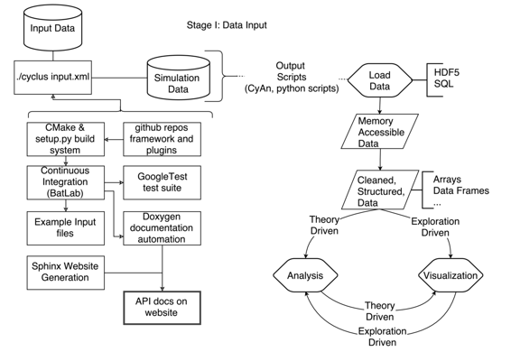

# 为核燃料循环分析开发一个开放、模块化的模拟框架

# 为核燃料循环分析开发一个开放、模块化的模拟框架

## 凯瑟琳·赫夫

我的名字是凯瑟琳（凯蒂）·赫夫，我是核工程系的核科学与安全联合会博士后学者，也是伯克利数据科学研究所的数据科学研究员。我的研究包括计算核燃料循环分析和耦合、瞬态核反应堆物理的计算模拟。

提高核能安全性和可持续性需要改进核反应堆设计、燃料循环策略和废物处理概念。这些系统足够复杂，以至于当现代数据方法应用于它们的模拟时，可能会出现突破性的进展。特别是，对潜在核燃料循环的忠实评估需要对采矿、磨粉、转化、再处理和核材料处置以及能源生产和资本流动进行动态、离散设施、离散材料的模拟。

本案例研究是关于 Cyclus 核燃料循环模拟框架背后的工作流程的概述 -- 这是一个用于建模、模拟和分析的工具。描述的工作流程用于创建一个其他核工程师可以轻松使用、快速修改并在需要自定义行为或模拟不同技术时贡献的软件工具。

### 工作流程

 我和一群地理分布的研究人员（研究生和教授）共同开发和维护一个名为 Cyclus 的基于代理的模拟框架。我们还开发和维护代表模拟中代理的插件模型。这些代理模拟了核燃料循环中的采矿、磨粉、制造、转化和处置。

Cyclus 是一个 C++ 代码库。配置和构建系统是由 Python 和 CMake（一个跨平台自动 makefile 配置系统）的组合创建的，并支持 Linux 和 MacOS 操作系统。我们的输入验证库接受 xml 或 json 输入文件。模拟器相应地进行模拟，生成一个可以被单独开发的图形用户界面遍历的 SQL 或 HDF5 格式的输出数据库。

在我们开发这个软件时，我们依赖于一些最佳实践来确保可重现性。

当需要进行大规模增强时，会提出 Cyclus 增强提案（CEP）并在开发团队中讨论。较小的增强会在 GitHub 中作为问题进行讨论。一旦获得批准，增强将被实施，并在 GitHub 中发起拉取请求。我们的自动化持续集成服务器（BatLab）运行完整的单元、集成和回归测试套件。在允许将提议的更改引入 Cyclus 之前，它必须由测试覆盖，并且所有测试必须通过。

单元测试涵盖了像函数这样的代码单元，并使用 GoogleTest 框架实现。集成和回归测试通过运行示例模拟并验证结果与预测或先前结果匹配来执行。一组标准输入文件被运行，然后通过 Nose，Python 中的一个单元测试框架，检查并比较输出。

类似地，API 更改必须按照 Cyclus 文档 CEP 的要求进行文档化。当前稳定分支和开发分支的文档都使用 Doxygen 和 Sphinx 在 Cyclus 网站上提供，它们都是依赖于 C++和 Python 代码中的代码注释的自动文档系统。

最后，我们使用 Google C++风格指南尽可能使我们的代码格式一致。

当进行更改时，开发人员通过创建一个输入文件开始进行特定的分析。该输入文件提供给 Cyclus 框架，并由其输入验证框架验证。根据输入文件，运行模拟。产生的输出数据库包含有关模拟的重要元数据。它包含有：

+   完整的输入文件副本。

+   当前版本的 Cyclus 代码的提交哈希值。

+   从 Cyclus 生态系统检索到所有必要插件的提交哈希值。

该数据库包含数据和元数据，用户可以对其进行分析。在分析数据库时，用户可以选择如何与数据交互。Cyclus 开发团队提供了一个 GUI 和一个 Go 库（称为 CyAn），用户可以使用它们访问数据库（以 SQL 或 HDF5 格式）并将其加载到内存中进行可视化和分析。此外，许多用户开发人员拥有自己的一套 Python 脚本，可以完成这个阶段的任务。鉴于这些数据库格式的通用性，大多数常见的脚本语言都可以有效地提取数据和元数据，因此有很多选择。

总之，这个框架中的研究工作流程包括以下步骤：

+   如果必要的话，开发人员提出改变以支持他们的分析。

+   进行更改，包括通过测试和满意的文档

+   它被审查并拉入主分支。

+   使用我们的构建系统重新构建和安装软件。

+   模拟以 json 或 xml 格式定义

+   输入文件运行并生成 HDF5 或 SQL 数据库。

+   数据库可以使用单独的 GUI、Python 脚本或 Go 库进行分析。

+   在 GitHub 上创建一个协作的 LaTeX 论文。

+   所有参与分析的输入文件都包含在保存文档的仓库中。

所有这些步骤都在 git 和 GitHub 的环境下进行。

### 痛点

构建系统很痛苦。特别是，跨平台配置和构建对我们的研究团队来说是一个巨大的时间消耗。这有很多原因。

首先，支持在 Windows 上构建 C++ 是足够困难的，以至于我们放弃了支持该平台。

此外，由于我们的仿真中使用了基于物理的求解器和优化计算，外部库依赖对于 Cylcus 是必不可少的。我们依赖诸如 Boost 和 LibXML2 之类的库来促进开发，依赖于 Blas、Lapack 和 COIN 之类的库来进行数学求解。因此，新开发人员花费了相当大的时间来构建和安装在其特定平台上安装 Cyclus 所必需的依赖项。

最后，我们的连续集成系统依赖于我们创建能够构建、安装和测试 Cyclus 的脚本的能力。为此，我们使用了威斯康星大学的一组服务器，称为 BatLab。不幸的是，BatLab 存在一些问题。由于 MacOSX 的专有性质，它无法运行真正的 MacOSX 实例。相反，它运行 Darwin 服务器，模拟 MacOSX 的行为。因此，出现在 Mavericks 和 Yosemite 中但在 Darwin 中没有的特有故障不能在进入代码库之前被捕获。此外，BatLab 有些不可预测和不灵活。由于 BatLab 的行为经历了很多变动，我们的连续集成套件有时会变得完全无用。

### 关键优势

[Cyclus Enhancement Proposal (CEP) 策略](http://fuelcycle.org/cep/cep0.html)是一个灵感来自 Python 社区类似策略（PEPs）的明智的工作流选择。我建议任何重视战略规划、共识和深思熟虑的研究团队采用这一策略。关于我们围绕这些提案的工作流程的讨论可以在[这里](http://fuelcycle.org/cep/cep1.html)找到。

从根本上说，CEP 是：

> 一个设计文档向 Cyclus 社区提供了信息，或者描述了 Cyclus 及其生态系统中的相关项目的新功能或流程。CEP 应该提供对该功能的简明技术规范和功能的理由。

CEPs 文档化了主要的新功能、社区讨论以及未在代码文档中记录的理论或设计文档。因为它们与网站源代码存储在一个版本控制的存储库中，所以它们被接受的讨论的溯源被保留了下来。

### 关键工具

我们使用 CMake 来配置和构建我们的软件。相比 GNU autotools 套件中的配置文件，CMake 更加人性化，使我们的生活更加轻松。

尽管由于构建问题而难以实现，但连续集成系统已经减少了开发时间。如果没有 CMake、GoogleTest 和 Nose，这是不可能的。

### 问题

#### 对你来说，“可重复性”是什么意思？

可重复研究产品是一种已经足够记录、构造良好并保存其结果的产品，以便某些外部研究者或团体能够重新创建其结果。

#### 你认为在你的领域中，可重复性为什么重要？

我所在领域，核工程，是一个精度和准确性对人类和环境结果都至关重要的领域。任何科学得出的结论只有符合核监管委员会制定的标准，才能在现实世界中产生影响。因此，可重复性至关重要。

#### 你是如何或从哪里了解到可重复性的？

我主要是从我的导师保罗·P·H·威尔逊在威斯康星大学麦迪逊分校那里学到这些实践。我还从“内部黑客”、科学 Python 社区和软件工艺中的同事那里学到了一些东西。

#### 你认为在你的领域进行可重复研究的主要挑战是什么，你有什么建议？

一个主要问题是出口管制。在某些情况下，美国能源部限制了软件和数据的开源。

#### 你认为进行可重复研究的主要动机是什么？

+   **恐惧。** 由于软件或数据错误而导致撤稿的恐惧可以通过强制执行透明的可重复实践来减少，这往往会降低被指控科学欺诈的可能性。

+   **惊讶。** 提交论文六个月后，不再记得自己的思维过程的惊讶是令人不快的。为了避免这种情况，可重复实践可以帮助你在未来重现你现在的工作。

+   **无情的效率。** 可重复工作流程中的自动化使得调整和重新运行模拟和分析变得非常高效。
