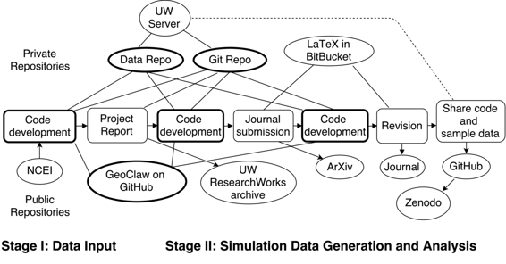

# 撰写概率海啸危险评估期刊文章

# 撰写概率海啸危险评估期刊文章

## Randall J. LeVeque

我的名字是 Randy LeVeque，我是应用数学教授，也是开源[GeoClaw](http://www.geoclaw.org)软件包的核心开发人员，用于模拟海啸和其他地球物理流动。 最近，我们一直在使用这个软件来研究概率海啸危险评估（PTHA）的新方法，其目标是获取可能导致大海啸的未来地震的某种概率分布，并为特定社区制作概率危险图，指示哪些区域最危险，并估计每个点的每年洪水深度的概率。 这很复杂，因为特定假设海啸的淹没深度取决于它是在涨潮时还是在退潮时到达，而我们已经开发了一些方法来纳入这种不确定性。

我将描述的工作流程与这个主题相关的[期刊出版物](http://link.springer.com/article/10.1007%2Fs11069-014-1482-z)有关。 大部分研究最初是作为一项由私人公司资助的咨询合同的一部分进行的，作为联邦紧急管理局（FEMA）资助的更广泛的试点研究的一部分。 我们对作为该项目一部分开发的代码使用了版本控制，最初在私有存储库中，以及许多海啸模拟的结果。 基于这项工作的最终项目报告在我们的机构存储库中提供，但没有发表在期刊上。 后来，我们在撰写部分期刊文章时改进了方法的描述，并进行了额外的计算实验。 在这项工作过程中，使用了各种不同的私人和公共存储库，以及几个用于共享代码、数据、报告和期刊文章的平台。

### 工作流程

 我们首先在华盛顿大学（UW）校园计算系统上创建了一个专门为这个项目提供的新帐户，可以由三位合作者共享，具有足够的存储空间来积累模拟结果（并由校园服务安全备份）。 在这个帐户上，我们创建了一个 git 存储库，我们都可以通过 ssh 访问，用作我们开发代码的主存储库，最终用于撰写项目报告。 我们没有使用 GitHub，因为我们想要一个私有存储库，并且在项目的这个阶段不需要 GitHub（或 Bitbucket）的 Web 功能。

这个项目需要使用一些大型数据集，这些数据集可以从[国家环境信息中心 (NCEI)](https://www.ncei.noaa.gov/) 公开获取，特别是用于运行海啸模型和潮汐测量数据的地形和水深数据。我们下载并存档了部分数据到 UW 账户，但没有将其放入 git 仓库，因为这些数据不需要进行版本控制。相反，我们编写了 shell 脚本来将这些数据按需同步到每个合作者的笔记本电脑或其他计算机上。 （rsync 是一种在类 Unix 系统上用于传输和同步文件的实用工具）。这些脚本保存在 git 仓库中。类似地，我们编写了脚本将模拟结果从执行模拟的计算机同步回此账户，以及一些元数据。用于处理模拟结果的 Python 代码中实现了正在开发的潮汐不确定性新方法。一位合作者在几台不同的计算机上进行大部分模拟运行，而另一位合作者则在开发和测试后处理代码，因此通过校园账户在笔记本电脑之间同步所需数据是方便的，并确保了结果的归档过程。

共享的校园账户还用于托管网页，以便所有合作者都可以查看每次模拟生成的可视化内容。这些网页最终也用于与项目赞助商和初步报告的审阅者分享结果。

私人 git 仓库还用于以 LaTeX 编写最终报告并收集要放入报告中的最终图表。第三位合作者，他在编码方面参与度较低，对 git 不太熟悉，因此我们还使用 Dropbox 来共享和评论报告的草稿，但所有对 LaTeX 的更改都是在 git 版本中进行的。

最终报告通过将其存入 [UW ResearchWorks 存档](http://hdl.handle.net/1773/22366) 中向公众提供。

当我们开始着手准备期刊论文时，我们创建了一个私人的 Bitbucket git 仓库，用于收集与论文相关的代码和 LaTeX 文件。Bitbucket 类似于 GitHub，但提供免费的私人仓库，只有公共仓库需要付费账户。相比之下，GitHub 提供免费的公共仓库，并为私人仓库收费。它们的界面类似，很容易在它们之间转移 git 仓库，或者在两个服务上保留副本，因此通常方便同时用于不同目的。提交的预印本也被发布在 [arXiv](http://arxiv.org/abs/1404.7216) 上，这是一个广泛使用的预印本服务器，可以免费访问。

评审人员要求对论文进行更改，并且一些图表需要重新制作，这很容易做到，因为我们用 git 仓库中的脚本生成了所有图表。修订后的论文是在同一个仓库中开发的，以及作者对评审人员的回应。

在期刊接受修订后的论文之后，我们为论文中一些说明基本方法的图表所需的代码和小型数据集创建了一个新的公共 GitHub 仓库。该仓库也与 Zenodo 相链接，进行了 GitHub 发布，触发了在该阶段所有代码的自动存档，并分配了一个[DOI](http://dx.doi.org/10.5281/zenodo.12406)。

除了我们分享了代码的测试问题之外，最终论文还包含了一些图表，显示了整个项目的结果，以及使用这种方法为加利福尼亚州新月城制作的概率地图。要重现这些结果，需要运行大约 100 次海啸模拟。我们相当有信心，如果需要，我们有所有的代码和数据来重现这些结果，但我们没有将其公开。

### 痛点

对于大型数据集，使用 rsync 运行良好，一旦我们找到了一个良好的工作流程和脚本，但并不理想。像 git 这样适用于大量数据的版本控制系统会非常有用。

一些数据无法共享，我们还必须小心分享初步结果，因为应急管理人员和相关机构对在正式审核和达成一致之前公布特定社区风险地图非常敏感。

### 主要优势

这种工作流对这个长期项目非常有价值，其中代码和方法的许多部分都在不断发展。最初的项目之后，又获得了额外的[第二阶段](http://hdl.handle.net/1773/25916)的资金支持，重点是研究流速而不仅仅是流深。这需要使用修改后的 GeoClaw 重新运行所有海啸模拟。通过在 git 存档下的脚本完成了所有初始工作，重新运行这些运行相对来说并不费力。同时，对 GeoClaw 代码也进行了其他更改，当比较结果时，同时拥有我们的代码和 GeoClaw 的版本控制非常有用。

### 问题

#### 对你来说，“可重现性”是什么意思？

在这项工作中，可重现性有两个重要方面。新技术的原始开发是在一个历时数年的项目中进行的，需要使用 GeoClaw 代码运行许多海啸模拟进行概率研究，每个模拟需要数小时的计算时间并产生大量输出数据。在此期间，GeoClaw 软件和我们的方法学都在不断发展。[GeoClaw](https://github.com/clawpack/geoclaw)在 GitHub 网站上公开开发。我们需要能够将新结果与先前计算的结果进行比较，并在必要时确定软件或我们的代码之间的变化。对于这一方面，目标不是公开分享我们的所有工作或结果（也不允许我们这样做，因为项目的性质），但我们需要能够在必要时重现结果并将代码保存在版本控制下以识别变化。

另一个方面是，我们希望期刊论文中特定的新方法附带实现该方法的 Python 代码以及用于生成论文中某些图表的样本数据集。在这种情况下，我们希望读者能够使用这些代码重现图表，希望这能帮助他人理解方法论并调整代码以解决自己的问题。

#### 您认为在您的领域中可重现性为何重要？

对于开发新方法和算法的研究人员来说，能够看到代码中的细节但没有出现在论文中通常是很重要的，这样可以更好地理解工作并找到潜在的错误。这也有助于比较同一问题的不同方法。

在自然灾害建模中，模拟结果可能被工程师或决策者用于做出涉及公共安全的决策。透明度和可重现性是问责制的重要方面。

#### 您是如何或从何处了解到可重现性的？

我对这个话题的兴趣源于对数值分析出版物（包括我自己的）的沮丧，其中无法重现已发表的结果或完全理解他们描述的新算法的实现。我最初通过参与开源软件项目而熟练掌握了 git。

#### 您认为在您的领域进行可重现研究的主要挑战是什么，您有什么建议吗？

+   说服合作者学习和使用一套共同的工具有时是一个挑战，一些研究人员更愿意分享代码和数据。

+   一些输入数据和/或结果可能无法公开共享，因此可能需要选择性地共享数据，也许需要私人和公共存储库。

#### 您认为进行可重现研究的主要动机是什么？

+   能够轻松修改和建立在过去工作基础上。

+   能够比较新方法或软件与过去版本，并确定哪些变化对结果产生了影响。

+   促进合作。

#### 在你的领域，您会推荐一些最佳实践吗？

+   使用某种形式的版本控制是单个最重要的第一步。

+   养成习惯，清理用于生成最终结果的代码，使其文档化，并清楚地列出所有必要的步骤。然后尽可能从头开始运行它们，以确保其正常工作。即使您不打算与他人分享它，您未来的自己也会感谢您。

+   如果您分享代码和/或数据，请在分配 DOI 的档案库中进行，并附上许可证。

#### 您会推荐一些学习更多关于可重复性的特定资源吗？

+   UW eScience Institute 可重复性和开放科学工作组已经制定了[一些指南](http://uwescience.github.io/reproducible/guidelines.html)。

+   2012 年[计算和实验数学可重复性 ICERM 研讨会](https://icerm.brown.edu/tw12-5-rcem/)的[最终报告](https://icerm.brown.edu/tw12-5-rcem/icerm_report.pdf)提出了建议和额外的链接。
