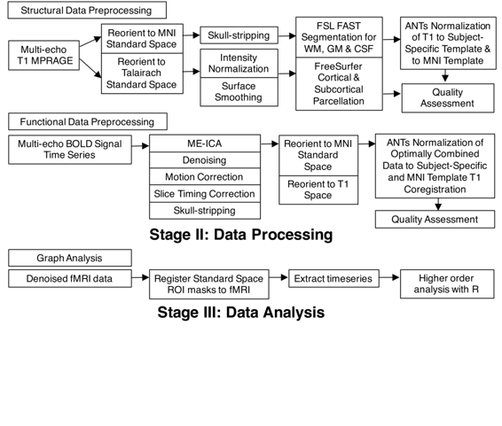

# 使用自动化构建工具“make”实现可重现的神经影像工作流程

# 使用自动化构建工具 make 实现可重现的神经影像工作流程

## Tara Madhyastha（塔拉·马迪亚斯塔）、Natalie Koh（娜塔莉·科）和 Mary K. Askren（玛丽·K·阿斯克伦）

我们是塔拉·马迪亚斯塔、娜塔莉·科和玛丽·K·阿斯克伦，隶属于综合脑成像中心（放射学）。在这个项目中，我们使用功能性磁共振成像（fMRI）来探讨老年人大脑功能，以了解生理变化与轻度认知障碍的关系，以及可能预测痴呆症。处理 fMRI 数据的特定挑战是所涉及的步骤数量繁多，对结果有重大影响，并且为了获得最佳结果，必须结合来自许多不同软件包的组件。为此，我们需要构建自己的流水线和质量保证。使用此工作流程产生的数据在 Bach et al. (2016) 中可视化。

### 工作流程

 在过去二十年中，系统神经科学的一个重大进展是发现，在休息时，大脑皮层区域血氧水平依赖信号（BOLD 信号，通过 fMRI 进行无创测量）的相关性描述了大规模网络。这些网络在各种精神疾病和神经退行性疾病中发生了变化；然而，网络的准确测量在一定程度上很困难，部分原因是由于各种伪影，包括受试者运动。

此工作流程的目的是为 54 个受试者的 fMRI 数据进行预处理，检查数据的质量，并生成特定感兴趣区域的时间序列。此前版本的流水线（质量保证不够充分，并采用不同的算法将受试者与标准模板对齐）用于比较传统方法和改进方法的噪声去除，生成用于探索性可视化范式的时变相关矩阵。当前的预处理流程支持许多正在进行的主要分析。

为功能连接性分析准备数据涉及使用运行在 UNIX 环境（Debian Wheezy）中的一组开源神经影像工具包对结构和功能数据进行预处理。这些程序包括 [FSL](http://fsl.fmrib.ox.ac.uk/fsl/fslwiki/) 、 [FreeSurfer](http://freesurfer.net) 、 Advanced Normalization Tools（[ANTs](http://stnava.github.io/ANTs/)） 和 Analysis of Functional Neuroimages（[AFNI](http://afni.nimh.nih.gov/afni/)）。虽然下文描述的这些处理的细节不一定重要于理解这个案例研究，但重要的一点是，最佳实践处理神经影像数据需要使用不同软件包执行多个步骤，并且对涉及这些步骤的细节进行完整报告对于可重现性至关重要。

结构数据以两种方式进行处理。首先，我们使用高分辨率结构图像来对齐低分辨率功能图像（解剖-功能配准）。我们还使用 ANTs 非线性配准为所有结构图像创建一个研究特定模板。其次，我们使用 FreeSurfer 创建大脑的皮层/亚皮层分割。功能数据使用多回声独立成分分析（ME-ICA）进行预处理（使用 AFNI 的 meica.py 脚本；参见 Kundu, Inati, Evans, Luh, & Bandettini (2012)）。去除 fMRI 数据中的噪音源是一个重大问题，ME-ICA 使用不同参数（回波时间）获取的 fMRI 图像自动分类 fMRI 数据中的变化源为 BOLD 相关或噪音，生成去噪数据集。它还产生一个“最佳组合”图像，可以使用更传统的技术进行去噪。ME-ICA 还执行去颅皮（从图像中去除非脑组织）和校正运动以及不同切片采集时间的标准步骤。ME-ICA 的最佳组合输出通过之前定义的结构配准和研究特定模板对齐到蒙特利尔神经学研究所（MNI）标准空间。预处理步骤完全自动化使用 Make（Askren 等人，2016）。Make 是一个 UNIX 实用程序，它以目标文件及其依赖关系的形式（一个“Makefile”）接受工作流表达式，并创建描述需要完成哪些工作以“制作”目标文件的图表。

预处理数据的质量评估（QA）涉及对每个研究对象的报告进行手动检查，其中包括图像、动画 GIF（时间上连接的数据）和在工作流程的中间和最终步骤生成的统计数据。这项质量评估由 Natalie Koh 执行，每个对象大约需要花费 20 分钟。数据中的异常和离群值被记录在电子表格中，有时会尝试重新处理被标记为质量不佳的数据。特别注意确保结构和功能的去颅皮操作已经正确执行，注册是可接受的，并且数据已经充分校正以消除运动的影响。特别是运动可以显著地偏倚时间序列相关性的估计。因此，运动参数、统计数据和绘制随时间变化的帧间位移（FD）和变化信号（DVARS）的图表被仔细查看，以确保数据可以进一步分析。最终，由于该对象的平均位移远远超过 2mm 的绝对阈值，一个对象必须被排除在外。对于这个对象，使用 ME-ICA 进行运动校正也未能纠正运动和 BOLD 信号的变化。

最后，在质量保证之后，我们从特定预选兴趣区域（ROIs）中提取了 BOLD 时间序列，使用去噪的 fMRI 数据和预先计算和检查的空间标准化到 MNI 模板。这些时间序列被合并到一个逗号分隔值文件中，并移动到另一台计算机供 Tara Madhyastha 使用 R 脚本处理。

尽管这个处理流水线对我们复制自己的分析来说已经很好设置，但分享起来就不那么直接了。原始数据目前不在线，尽管最终将作为“思维变化”研究的一部分进行归档。执行流水线的所有主要软件都可以在线获得。然而，我们编写的一些次要脚本并不在线。要完全在外部复制这个流水线，我们需要提供这些脚本以及我们使用的所有软件版本，以及 Makefile。最简单的方法是提供一个干净的工作分析目录的副本，以便远程站点可以根据需要编辑路径名到特定软件包，并重新运行我们的工作流。

Makefile 的文档嵌入在我们的 Makefile 中，使用注释（因为我们有相对标准化的目标名称和文件命名约定）。我们最近一直在尝试采用命名约定和帮助系统的标准化文档。然而，迄今为止，主要目标的处理相对直观，这并不像开发广泛的质量保证和来源追溯那样重要。

处理目前不在线，因为工作流在单个多核服务器上运行的计算成本太高，当决定何时以及如何并行化时，我们经常不得不在磁盘存储和处理能力之间进行权衡。我们也缺乏编程资源来为这些流水线开发基于 web 的界面。编写和运行 makefile 比确定它们应该是什么样子更不困难，因此基于 web 的工作流共享并不是一个优先事项。

### 痛点

神经影像工作流的一个重要部分是检查自动处理步骤的质量。然而，当需要手动更正时，如何记录这些更正以便完全复制它们就不那么清楚了。我们目前在电子表格中维护着这些信息，但显然更正会引入可重复性问题。

为论文生成图表可能涉及大量手工操作。例如，要组装一组显示统计显著结果的脑片拼贴可能需要生成几个不同坐标的屏幕截图，手动设置最小和最大值以确保图像之间共享一个公共色标。一旦研究人员决定包含的图像和坐标，这个过程并不总是可以脚本化，相关参数必须被仔细记录。

工具如 Rmarkdown 和 pandoc（或 Sweave、odfweave）允许统计分析和文本的出色整合。然而，许多实验室的研究人员在编辑论文时严重依赖于 Microsoft Word 的“修订”功能，这使得完全将论文生成与统计分析结合在一起变得困难。因此，在生成方法文本和表格与组装和编辑最终论文之间存在着不自然的分离。

### 关键优势

与神经影像领域的最新技术相比，我们的工作流程独特之处在于我们使用 Make 来描述依赖关系。这确保只有需要重新执行的工作流程部分（因为失败或中间结果的更改）将被重新运行。实际上，在神经影像工作流程中避免不必要的计算时间非常重要，因为这些工作流程可能需要在小型计算机集群上运行数小时或数天。使用不会固有地表达依赖关系的语言编写的脚本（如 bash 或 Matlab），在修改脚本以执行仅未完成工作时很容易引入错误。

Make 相对于其他神经影像工作流系统（如 nipype 和 LONI Pipeline）具有两个关键优势，这些系统也支持依赖图模型。首先，Make 不需要将核心神经影像程序“包装”或用接口代码包围起来，这会增加设计工作流程的开发时间，并在新版本的软件程序与其包装器不兼容时减慢软件程序的采用速度。其次，Make 隐式从目标文件构建依赖图，而不需要绘制或明确编程依赖图。

### 关键工具

在我们的工作流程中支持可重复性的两个关键工具。第一个是上面描述的 Make。第二个是 R Markdown，在这里我们与 Make 结合使用，生成包括统计数据、QA 图像和使用 R 生成的图形在内的复杂 QA 报告。在未描述的工作流程中，我们使用 R Markdown 生成适合包含在方法部分的数据来源报告，将描述工作流程的英文文本与自动获取的包括���件版本和软件以及扫描仪采集参数的参数结合在一起。

### 问题

#### 对您来说，“可重复性”是什么意思？

在这种情况下，可重复性意味着在我们运行的软件版本、工作流程和源数据的具体情况下，科学家可以从我们的数据中获得与我们相同的结果。

#### 您认为在您的领域中可重复性很重要吗？

许多神经影像结果高度依赖于处理数据的方法。科学家经常发现某些噪音源引入了人为发现，或者之前被视为噪音的数据包含信息。因此，保持数据处理的程序化描述对于能够使用相同数据复制结果至关重要。

#### 你是从哪里学习到可重复性的？

make 的想法来自于计算机科学课程。这里描述的大多数其他实践都是根据经验共同在 IBIC 中开发的。

#### 你认为在你的领域进行可重复研究面临的主要挑战是什么，你有什么建议吗？

认知神经科学是一个固有的跨学科领域，这意味着团队内的研究人员的技术技能水平以及核心领域知识的水平会有所不同。鼓励可重复性的实践（例如，脚本化的工作流程）对于一个领域的成员来说可能是第二天性的，但对另一个领域的成员来说可能是全新的，有点令人畏惧的。这可能会导致最佳实践的缓慢采纳。

#### 你认为进行可重复研究的主要激励是什么？

其中一个主要的激励是它节省了我们将来花在试图弄清楚我们做了什么的时间，尤其是在我们忘记了之后。

#### 在你的领域，你会推荐任何最佳实践吗？

我们建议尽可能使用自动化的、脚本化的工作流程，尽量减少手工编辑，以避免人为引入偏见（例如，在边界编辑中）。投入时间来开发清晰、一致和可维护的工作流程很少会被浪费。

#### 你推荐学习更多关于可重复性的特定资源吗？

人类大脑影像组织（OHBM）最近成立了一个关于数据分析和共享最佳实践的委员会（COBIDAS），旨在确定大脑映射社区中数据分析和数据共享的最佳实践。该委员会预计会在不久的将来发布关于这些实践的最终报告，这可能会成为有兴趣了解神经影像研究背景下可重复性的个人的有用资源。

### 参考文献

Askren, M., McAllister-Day, T., Koh, N., Mestre, Z., Dines, J., Korman, B., … Madhyastha, T. M. (2016). 使用 make 进行可重复和并行神经影像工作流和质量保证。*神经信息学前沿*，*10*（2）。

Bach, B., Shi, C., Heulot, N., Madhyastha, T., Grabowski, T., & Dragicevic, P. (2016). 时间曲线：将时间折叠以可视化数据的时间演变模式。*IEEE 可视化与计算机图形学交易*，*22*（1）。

Kundu, P., Inati, S., Evans, J., Luh, W.-M., & Bandettini, P. (2012). 使用多回波 EPI 区分 fMRI 时间序列中的 BOLD 和非 BOLD 信号。*神经影像*，*60*（3），1759–1770。
