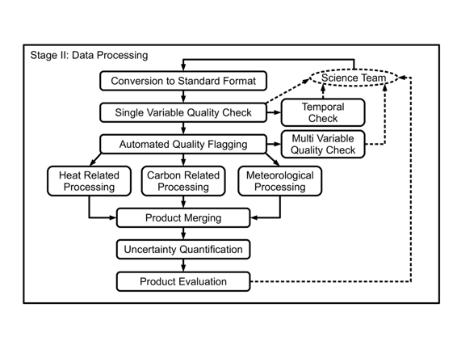

# 为 AmeriFlux 和 FLUXNET 生成统一数据产品

# 为 AmeriFlux 和 FLUXNET 生成统一数据产品

## Gilberto Pastorello

我是[Gilberto Pastorello](http://www.gilbertozp.org/)，是劳伦斯伯克利国家实验室的[研究科学家](http://crd.lbl.gov/departments/data-science-and-technology/idf/staff/gilberto-pastorello/)，致力于科学数据的生命周期管理研究，包括数据和元数据结构及链接、数据质量和数据不确定性量化，以及端到端数据系统。我在此描述的工作部分涉及环境领域内数据处理管道和数据管理解决方案的开发。这项工作是为[AmeriFlux](http://ameriflux.lbl.gov/)和[FLUXNET](http://fluxnet.fluxdata.org/)研究网络开展的。

### 工作流程

 多个科学团队从全球 800 多个野外站点收集碳、水和能量通量。目前，超过 400 个站点与[AmeriFlux](http://ameriflux.lbl.gov/)等地区网络共享数据，从而为[FLUXNET](http://fluxnet.fluxdata.org/)网络创建具有全球范围的数据产品，例如[FLUXNET2015 数据集](http://fluxnet.fluxdata.org/data/fluxnet2015-dataset/)。这些站点是独立运行的，科学团队的数据收集、处理和数据质量控制方法可能存在显著差异。我们的工作流程旨在处理这些异构数据集，生成可在这些站点之间进行比较的数据产品。我们工作流程中的步骤概览如图所示。在这种情况下，可重复性与识别和记录数据质量控制检查、处理参数化、校正步骤序列和数据过滤密切相关。

每当科学团队将新数据发送给我们时，管道都会执行。我们使用简单的增量计数器结合版本和时间戳跟踪多次提交 -- 数据传输日志存储在关系数据库中。数据提交的频率可以从科学团队每天到每年更新不等。管道的所有执行都会生成一个版本，成功执行后由科学团队审核后公开发布。

最初的几个步骤与数据质量有关，旨在识别严重的质量问题，并使数据质量在各个站点更加统一。 在这些步骤中使用了专门的算法和可视化方法。 首先自动生成标志并手动检查数据集，然后编制有关数据的指标和检查。 在执行任何更改数据集的决定之前，首先与科学团队共享并确认。 重大问题由我们与科学团队合作确定并开发解决方案。 我们开发的定制问题跟踪系统用于跟踪与科学团队的互动和数据集中正在解决的问题。 此问题跟踪系统中的信息是私有的，仅我们的团队和提供数据的现场科学团队可以访问，但可以通过发布的数据产品提供此系统的报告和状态信息。 对数据的更改也记录在日志文件和添加到数据集本身的质量标志中，这些信息与数据产品一起提供。 更改和更正会生成输入数据的新版本，并且流水线从这个新版本重新开始。

工作流程的中心部分包括用于热量、碳和微气象变量的处理步骤。 用于配置这些执行的参数与数据集一起存储，并且在每个步骤中还执行专门的检查。 大多数这些检查的结果都存储为添加到数据集的质量标志。 用于这些步骤的代码版本也记录在数据集的元数据中。

产品合并步骤重新格式化数据为通用结构，并在更高层次的抽象中将质量信息合并为质量标志，以简化数据集的使用。 不确定性量化步骤生成代表来自每个处理步骤的不确定性区间的分位数，也成为数据产品的一部分。

多个团队成员理解并能生成产品的程度更高，更有可能及早识别问题，更容易回答社区外部成员的问题，资助机构将拥有记录的产品发布（数据和软件），这些产品可以与其他类型的出版物结合在一起评估科学影响。

### 痛点

在达到可接受结果之前，这个流水线的执行可能会发生多次，并且还包括与科学团队的多次互动，可能导致对输入数据集的更改。这些更改可以由科学团队或我们的团队应用。通过多次迭代，使数据集正确所需的更改通常分布在许多版本的输入数据中。整合这些更改特别困难，尤其是当更改应用于导致运行失败的版本时。

更具体地，一个与版本相关的挑战是在多个处理实例中保持版本一致。我们使用输入版本到输出的映射，但由于输出影响了新版本数据集的外观，这些映射并不总是直接的。

另一个挑战与我们数据集的多源性有关。许多这些数据集跨越十年以上的数据收集、处理和策展，由多人完成。由于团队分布广泛，并遵循潜在不同的数据收集和处理协议，完全自动化的可重现性难以实现。一种解决方法是在这种情况下记录数据收集和处理选择。

最后，将可重现性问题与数据集的信用问题结合起来是另一个挑战。给予数据提供者和数据处理者/策展者适当的信用是大规模数据共享努力中的重要部分。全面的数据共享政策有助于分配适当的信用。随着时间的推移，数据集的多个版本被创建，与科学团队的密切沟通对于追踪所有贡献者是重要的。

### 主要优势

没有版本控制和问题跟踪在代码和数据之间的协调，完全记录数据集选择将是不可行的，其中许多选择会影响重要方面，如数据质量或不确定性。

### 主要工具

数据和软件版本控制无疑是这个案例研究中采用的主要实践。我们目前以协调的方式为数据和软件分配版本，以便评估数据和代码的变化。我们使用私有的 Subversion 服务器进行代码版本控制。我们开发了一个名为 FIT（Flux Issue Tracking）的自定义基于 Web 的系统，用于跟踪与科学团队的互动以及数据集的数据质量问题。FIT 后来也被用于跟踪与代码相关的问题。它是使用 Django/Python 和 PostgreSQL 数据库实现的。

对于处理流水线，我们结合了多种语言编写的专门代码。自动化质量检查和数据产品生成步骤主要使用 C 实现，其中有几个步骤使用 Python 和 MATLAB 实现；视觉数据质量检查使用 MATLAB 和 Python 实现；驱动代码和生成最终数据产品使用 Python 完成，广泛使用 NumPy 和 SciPy 包。

### 问题

#### 对于你来说，“可重复性”意味着什么？

对于这个案例研究，可重复性意味着能够应用标准方法来处理异构数据集，生成可比较的数据产品。我们处理的数据源分布在非常不同的生态系统中，数据由不同的团队获取、处理和质量检查。我们从这些数据集生成的数据产品需要具有相同的尺度和可比较的质量水平、代表性等。

#### 你会推荐给你领域的研究人员一些最佳实践吗？

虽然版本控制在软件代码中被广泛采用，但并不一定适用于数据。在最低限度上持续跟踪数据集的版本有助于数据变化，并且额外的努力是非常值得的。我们早期学到的另一个教训是，问题/错误跟踪的思想和工具可以简化数据管理活动，并且在构建数据集的历史记录和生成其文档方面也非常有价值。

#### 你会推荐一些特定的资源来了解更多关于可重复性的内容吗？

尽管并非总是涉及完全发展的实践或工具，可重复性科学活动（以及其发布的论文集）通常展示了新颖而有趣的想法。包括最新研究成果的活动，例如国际溯源与注释研讨会（IPAW）和国际电子科学会议等，展示了溯源的最新研究。
